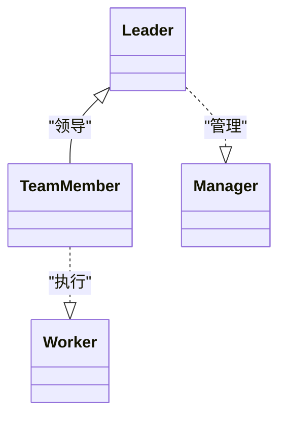
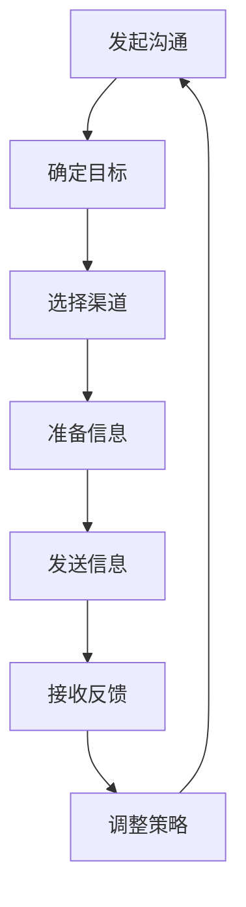
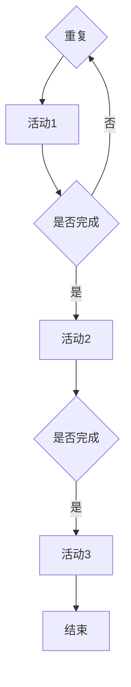
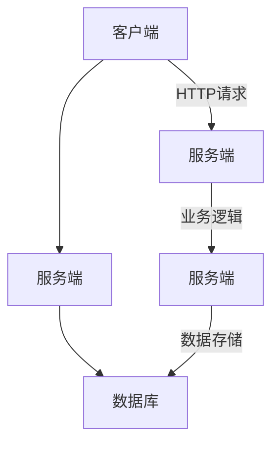
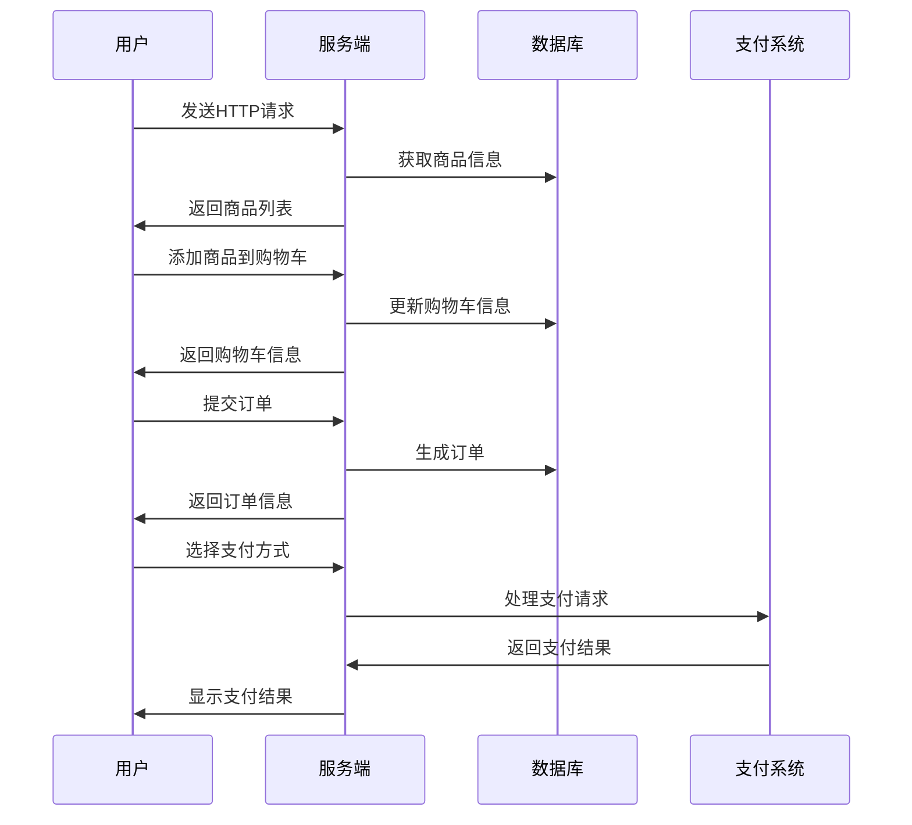

                 


### 文章标题：技术领导力的十大支柱

#### 关键词：技术领导力，领导能力，管理技巧，团队协作，项目成功

> 摘要：本文将深入探讨技术领导力的核心组成部分，从战略规划、团队领导、沟通技巧到风险管理等多个方面，通过详细的案例分析和技术解析，帮助读者构建全面的技术领导力框架，提升项目管理能力和团队协作效率。

----------------------------------------------------------------

## 第1章：技术领导力的背景与核心概念

### 1.1 问题背景

在当今快速变化的技术时代，企业面临着前所未有的挑战。技术创新的速度不断加快，市场竞争日益激烈，客户需求变得更加多样化和个性化。在这种背景下，技术领导力成为企业成功的关键因素。技术领导力不仅关乎技术团队的管理，更涉及到企业整体战略的制定与执行。

### 1.2 问题描述

技术领导力的问题体现在多个方面。首先是如何在技术快速发展的同时保持团队的创新活力。其次是如何在多元化的团队中实现高效的沟通与协作。最后是如何在不确定的市场环境中做出正确的战略决策，确保企业的可持续发展。

### 1.3 问题解决

技术领导力的核心目标是提升团队的整体绩效，实现技术成果的商业化落地。为了解决上述问题，企业需要从以下几个方面入手：

1. **明确技术愿景与战略目标**：技术领导力需要具备远见，为企业制定清晰的技术愿景和战略目标。
2. **构建高效的团队**：通过合适的领导风格和团队建设策略，提升团队的协作能力和创新能力。
3. **提升沟通技巧**：确保团队内部以及与外部合作伙伴之间的有效沟通，减少误解和冲突。
4. **加强风险管理**：识别潜在风险，制定应对策略，确保项目顺利进行。
5. **培养持续学习的文化**：鼓励团队成员不断学习新知识、新技术，提升个人和团队的能力。

### 1.4 边界与外延

技术领导力的边界在于企业内部的职能范围，但其影响力可以扩展到整个产业链和生态系统。技术领导力的外延包括技术创新、产品管理、市场策略等多个方面。

### 1.5 概念结构与核心要素组成

技术领导力的概念结构可以拆分为以下几个核心要素：

1. **技术视野**：对行业发展趋势和技术前沿的敏锐洞察。
2. **团队领导力**：领导团队实现目标的能力。
3. **沟通技巧**：有效传达信息和理解他人的能力。
4. **风险管理**：识别和管理风险的能力。
5. **项目管理**：规划、执行、监控和项目评估的能力。

#### Mermaid 类图：技术领导力的核心要素

```mermaid
classDiagram
    Class01 <|-- SubClass01
    Class01 <|-- SubClass02
    Class01 <=.. Interface1
    Class01 ..|> Interface2
```

## 第2章：核心概念与联系

### 2.1 技术视野

技术视野是指对技术发展趋势的洞察力和预见性。一个具有技术视野的领导者能够预测未来技术趋势，把握市场机会，为企业制定具有前瞻性的战略规划。

#### 概念属性特征对比表格

| 特征               | 技术视野         | 市场分析         |
|--------------------|------------------|------------------|
| 定义               | 对技术发展的预见性 | 对市场需求的把握  |
| 主要用途           | 制定战略         | 制定市场策略     |
| 相关领域           | 技术研究         | 市场调研         |
| 影响因素           | 技术创新速度     | 市场竞争环境     |
| 目标               | 领先市场         | 获得市场份额     |

#### ER实体关系图

```mermaid
erDiagram
    Person ||--|{ Project }|-- ProjectMember : "参与"
    Project ||--|{ Task }|-- Task : "包含"
    Project ||--|{ Milestone }|-- Milestone : "包含"
    Task ||--|{ Resource }|-- Resource : "消耗"
```

### 2.2 团队领导力

团队领导力是指领导者在团队管理中的能力。一个具有团队领导力的领导者能够激发团队成员的潜力，提高团队的整体绩效。

#### 概念属性特征对比表格

| 特征               | 团队领导力       | 个人领导力       |
|--------------------|------------------|------------------|
| 定义               | 领导团队实现目标 | 领导个人实现目标 |
| 主要用途           | 管理团队         | 提升个人能力     |
| 相关领域           | 团队建设         | 个人成长         |
| 影响因素           | 团队协作         | 个人动机         |
| 目标               | 高效协作         | 个人成就         |

#### Mermaid 类图：团队领导力模型



### 2.3 沟通技巧

沟通技巧是指领导者与团队成员、外部合作伙伴之间进行有效沟通的能力。良好的沟通技巧能够减少误解和冲突，提高团队协作效率。

#### 概念属性特征对比表格

| 特征               | 沟通技巧         | 管理技巧         |
|--------------------|------------------|------------------|
| 定义               | 交流信息与理解他人 | 管理资源与达成目标 |
| 主要用途           | 减少误解         | 提高效率         |
| 相关领域           | 沟通学           | 管理学           |
| 影响因素           | 语言表达能力     | 决策能力         |
| 目标               | 高效沟通         | 项目成功         |

#### Mermaid 流程图：沟通技巧流程



### 2.4 技术创新

技术创新是指通过引入新技术、新产品或新流程来创造价值和竞争优势。技术领导力中的技术创新涉及研发管理、产品设计和市场推广等多个方面。

#### 概念属性特征对比表格

| 特征               | 技术创新         | 产品创新         |
|--------------------|------------------|------------------|
| 定义               | 技术层面上的创新 | 产品层面上的创新 |
| 主要用途           | 提升竞争力       | 扩大市场份额     |
| 相关领域           | 技术研发         | 产品管理         |
| 影响因素           | 技术水平         | 市场需求         |
| 目标               | 技术领先         | 产品畅销         |

#### Mermaid 类图：技术创新流程

```mermaid
classDiagram
    R&D[研发团队] <|-- Product[产品]
    R&D <|-- Market[市场]
    R&D ..|> Innovation[创新]
```

### 2.5 数学模型和公式

在某些技术领导力相关的领域，如风险管理、项目管理等，数学模型和公式是非常重要的工具。以下是一个简单的项目管理中的关键路径法的数学模型。

#### 数学模型和公式

$$
CP_{i,j} = \min\{CP_{i,k} + T_{k,j} \mid k \in \{1,2,...,n\}\}
$$

其中，$CP_{i,j}$ 表示从活动 $i$ 到活动 $j$ 的最短路径时间，$T_{k,j}$ 表示从活动 $k$ 到活动 $j$ 的时间。

#### Mermaid 流程图：关键路径法



### 2.6 系统分析与架构设计方案

在技术领导力中，系统分析与架构设计是至关重要的。以下是一个简单的电子商务系统的架构设计。

#### 问题场景介绍

一个电子商务系统需要支持用户的购物流程，包括商品浏览、购物车管理、订单生成和支付等。

#### 系统功能设计

| 功能                 | 描述                                                         |
|----------------------|--------------------------------------------------------------|
| 商品浏览             | 用户可以浏览系统中的商品信息。                               |
| 购物车管理           | 用户可以将商品添加到购物车，修改购物车的商品数量或删除商品。 |
| 订单生成             | 用户提交订单后，系统会生成订单信息。                         |
| 支付                 | 用户选择支付方式后，系统会处理支付流程。                     |

#### 系统架构设计

| 架构组件             | 描述                                                         |
|----------------------|--------------------------------------------------------------|
| 客户端               | 用户与系统交互的界面。                                       |
| 服务端               | 处理用户请求，进行业务逻辑处理和数据处理。                     |
| 数据库               | 存储商品信息、订单信息和其他相关数据。                         |

#### 系统架构图



#### 系统接口设计和系统交互



### 2.7 项目实战与最佳实践

#### 环境安装

为了保证项目实战的可操作性，以下是安装电子商务系统所需的步骤：

1. 安装Python环境（Python 3.8或更高版本）
2. 安装Django框架（使用pip install django命令）
3. 安装数据库（如MySQL或PostgreSQL）
4. 配置虚拟环境（使用venv命令创建虚拟环境）

#### 系统核心实现源代码

以下是电子商务系统的核心实现代码：

```python
# views.py
from django.http import HttpResponse
from .models import Product, ShoppingCart, Order

def home(request):
    products = Product.objects.all()
    return render(request, 'home.html', {'products': products})

def cart(request):
    cart_items = ShoppingCart.objects.filter(user=request.user)
    return render(request, 'cart.html', {'cart_items': cart_items})

def order(request):
    order = Order.objects.create(user=request.user)
    return render(request, 'order.html', {'order': order})

# models.py
from django.db import models
from django.contrib.auth.models import User

class Product(models.Model):
    name = models.CharField(max_length=255)
    price = models.DecimalField(max_digits=6, decimal_places=2)

class ShoppingCart(models.Model):
    user = models.ForeignKey(User, on_delete=models.CASCADE)
    product = models.ForeignKey(Product, on_delete=models.CASCADE)
    quantity = models.PositiveIntegerField(default=1)

class Order(models.Model):
    user = models.ForeignKey(User, on_delete=models.CASCADE)
    date = models.DateTimeField(auto_now_add=True)
    status = models.CharField(max_length=20)
```

#### 代码应用解读与分析

上述代码实现了电子商务系统的基本功能。`views.py` 文件定义了处理用户请求的视图函数，如商品浏览、购物车管理和订单生成等。`models.py` 文件定义了与数据库交互的模型类，包括商品、购物车和订单。

#### 实际案例分析

一个实际的电子商务项目可能面临多种挑战，如高并发访问、数据一致性和系统安全性等。以下是案例分析：

- **高并发访问**：为了应对高并发访问，可以使用缓存技术（如Redis）和负载均衡器（如Nginx）来优化系统的响应速度和稳定性。
- **数据一致性**：在多节点环境下，使用数据库的事务机制来确保数据的一致性。
- **系统安全性**：通过使用HTTPS协议、身份验证和访问控制来保护用户数据和系统安全。

#### 项目小结

通过实际案例，我们可以看到电子商务系统的实现涉及多个方面，包括前端界面设计、后端逻辑处理和数据库管理。在项目过程中，需要充分考虑性能、安全和用户体验等因素。

### 2.8 小结与注意事项

本章详细介绍了技术领导力的核心概念，包括技术视野、团队领导力、沟通技巧和技术创新等。同时，通过Mermaid流程图和LaTeX公式等工具，对概念进行了直观和具体的阐述。需要注意的是，技术领导力是一个综合性的能力，需要持续学习和实践来不断提升。

### 2.9 拓展阅读

- 《敏捷开发实践指南》 - 为了更好地理解团队领导力和项目管理的最佳实践，可以阅读这本书。
- 《产品经理手册》 - 了解产品创新和用户体验设计的重要性。
- 《Python编程：从入门到实践》 - 提升编程技能，为技术领导力打下坚实基础。

----------------------------------------------------------------

## 第2章：技术领导力的核心概念

### 2.1 技术视野

技术视野是技术领导者的重要素质，它关乎对行业趋势的敏锐洞察和对未来技术的预见性。一个具有远见的技术领导者能够为企业制定明确的技术战略，引领团队在激烈的市场竞争中占据优势。

#### 技术视野的重要性

1. **行业趋势的把握**：技术视野使得领导者能够准确把握行业的发展方向，抓住市场机遇。
2. **技术创新的引导**：通过前瞻性的技术视野，领导者可以引导团队进行技术创新，保持企业的核心竞争力。
3. **战略规划的支撑**：技术视野为企业的战略规划提供重要支撑，确保企业长期发展。

#### 技术视野的驱动因素

1. **技术积累**：长期的技术积累使领导者对行业有更深刻的理解。
2. **市场洞察**：对市场需求的敏锐洞察是技术视野的重要来源。
3. **团队协作**：技术视野的形成需要团队的共同参与和知识共享。

#### 技术视野的应用实例

1. **研发方向的确立**：通过技术视野，领导者可以为研发团队确定清晰的研究方向，确保研发工作的针对性和有效性。
2. **市场拓展策略**：技术视野帮助领导者制定市场拓展策略，开拓新的业务领域。

#### 技术视野的最佳实践

1. **定期学习**：领导者应定期学习最新的技术动态和市场趋势，保持对行业的高度敏感。
2. **跨部门交流**：与不同部门的同事进行交流，了解企业的整体业务流程和需求。
3. **建立知识共享平台**：鼓励团队成员分享技术见解和研究成果，形成良好的知识共享氛围。

### 2.2 团队领导力

团队领导力是技术领导力的核心组成部分，它关乎如何激发团队潜能、提升团队绩效。一个成功的团队领导者能够有效地管理团队，确保团队目标与企业目标一致。

#### 团队领导力的关键要素

1. **明确目标**：领导者需要明确团队的目标，确保团队成员了解任务的重要性和紧迫性。
2. **激励与信任**：领导者应激励团队成员，建立信任关系，促进团队成员之间的协作。
3. **沟通与反馈**：领导者需要保持与团队成员的沟通，及时给予反馈，帮助团队成员提升工作能力。
4. **决策能力**：领导者应在关键时刻做出明智的决策，确保团队目标的实现。

#### 团队领导力的驱动因素

1. **领导风格**：领导者的风格直接影响团队的工作氛围和团队绩效。
2. **团队文化**：团队文化是团队领导力的重要支撑，它决定了团队成员的价值观和行为准则。
3. **激励机制**：有效的激励机制可以激发团队成员的积极性和创造力。

#### 团队领导力的应用实例

1. **敏捷开发团队的管理**：在敏捷开发中，领导者需要具备敏捷管理的理念，确保团队成员能够高效协作。
2. **跨部门团队协作**：领导者需要协调不同部门之间的合作，确保项目顺利进行。

#### 团队领导力的最佳实践

1. **建立明确的职责分工**：确保每个团队成员都清楚自己的职责和工作内容。
2. **定期团队建设活动**：通过团队建设活动增强团队成员之间的信任和凝聚力。
3. **绩效评估与反馈**：定期进行绩效评估，给予团队成员及时的反馈和指导。

### 2.3 沟通技巧

沟通技巧是技术领导者必须掌握的重要技能，它关乎如何有效地传递信息、理解他人和解决冲突。良好的沟通技巧可以减少误解和冲突，提高团队协作效率。

#### 沟通技巧的重要性

1. **信息传递的有效性**：良好的沟通技巧可以确保信息准确无误地传递，避免因信息误解而导致的错误和冲突。
2. **团队协作的提升**：有效的沟通可以增强团队成员之间的协作，提高团队整体绩效。
3. **问题解决的效率**：良好的沟通技巧可以帮助团队快速识别和解决问题，提高工作效率。

#### 沟通技巧的驱动因素

1. **语言表达能力**：良好的语言表达能力是有效沟通的基础。
2. **倾听能力**：倾听他人是沟通的重要环节，可以帮助领导者更好地理解团队成员的需求和想法。
3. **情绪管理**：情绪管理能力可以帮助领导者保持冷静，避免因情绪波动而影响沟通效果。

#### 沟通技巧的应用实例

1. **项目会议**：在项目会议中，领导者需要运用沟通技巧确保会议的高效和目标明确。
2. **团队反馈**：领导者需要运用沟通技巧收集团队成员的反馈，了解团队的工作状况和需求。

#### 沟通技巧的最佳实践

1. **主动倾听**：在沟通中，领导者应主动倾听他人的意见和需求，避免主导对话。
2. **清晰表达**：领导者应确保自己的表达清晰、简洁，避免因语言模糊而导致的误解。
3. **及时反馈**：在沟通后，领导者应及时给予反馈，确认信息的准确性和理解程度。

### 2.4 技术创新

技术创新是技术领导者的重要任务，它关乎如何推动企业技术进步，保持市场竞争力。技术创新不仅涉及技术的研究和开发，还包括产品设计和市场推广等多个方面。

#### 技术创新的重要性

1. **市场竞争**：技术创新是企业在激烈的市场竞争中脱颖而出的关键。
2. **持续发展**：技术创新是推动企业持续发展的重要动力。
3. **员工激励**：技术创新可以激发员工的创造力和积极性，提升团队整体绩效。

#### 技术创新的驱动因素

1. **市场需求**：市场需求是技术创新的重要驱动力，技术创新应紧密围绕市场需求展开。
2. **技术积累**：技术积累为技术创新提供了坚实的基础，有助于企业开发出更具竞争力的产品。
3. **资源投入**：充足的资源投入是技术创新的重要保障，包括资金、人力和设备等。

#### 技术创新的应用实例

1. **产品开发**：通过技术创新，企业可以开发出更具竞争力的产品，满足市场需求。
2. **流程优化**：通过技术创新，企业可以优化业务流程，提高生产效率。

#### 技术创新的最佳实践

1. **持续研发投入**：企业应持续投入研发资源，确保技术创新的持续性。
2. **开放创新**：企业可以通过开放创新，与外部合作伙伴共同推动技术创新。
3. **员工激励机制**：企业应建立激励机制，鼓励员工参与技术创新。

### 2.5 数学模型和公式

在某些技术领域，如算法设计和系统优化，数学模型和公式是重要的工具。数学模型可以帮助我们理解技术原理，优化算法性能，提高系统效率。

#### 数学模型的应用实例

1. **机器学习**：在机器学习中，常用的数学模型包括线性回归、支持向量机、神经网络等。
2. **系统优化**：在系统优化中，常用的数学模型包括线性规划、整数规划、排队论等。

#### 数学模型的构建方法

1. **问题分析**：首先对问题进行详细分析，明确问题的目标函数和约束条件。
2. **数学建模**：根据问题分析，构建相应的数学模型。
3. **模型求解**：使用数学方法或算法求解模型，得到最优解或近似解。

#### 数学模型的评估方法

1. **准确性评估**：评估模型的预测准确性，通常使用指标如均方误差（MSE）、精确率（Precision）等。
2. **稳定性评估**：评估模型在不同数据集上的稳定性和泛化能力。
3. **效率评估**：评估模型求解的效率和计算复杂度。

#### 数学模型的最佳实践

1. **模型选择**：根据问题的性质和需求选择合适的数学模型。
2. **模型验证**：在应用模型之前，进行充分的验证和测试，确保模型的可靠性和有效性。
3. **模型更新**：随着数据和技术的变化，及时更新和优化模型。

### 2.6 系统分析与架构设计方案

系统分析与架构设计是技术领导力的重要组成部分，它关乎如何构建稳定、高效和可扩展的系统。一个优秀的系统架构设计可以提高系统的性能、可靠性和可维护性。

#### 系统分析与架构设计的重要性

1. **系统性能**：良好的系统架构设计可以优化系统性能，提高系统的响应速度和处理能力。
2. **系统可靠性**：通过系统分析与架构设计，可以确保系统在高负载和故障情况下依然稳定运行。
3. **系统可扩展性**：良好的系统架构设计可以支持系统的扩展和升级，满足业务需求的变化。

#### 系统分析与架构设计的驱动因素

1. **业务需求**：业务需求是系统分析与架构设计的重要驱动因素，设计应紧密围绕业务需求展开。
2. **技术趋势**：技术趋势是系统设计与架构设计的重要参考，应考虑新兴技术和行业标准。
3. **系统复杂性**：系统复杂性是系统分析与架构设计的重要挑战，需要综合考虑系统的各个层面和环节。

#### 系统分析与架构设计的应用实例

1. **云计算平台**：在云计算平台的设计中，需要考虑虚拟化技术、分布式存储和负载均衡等多个方面。
2. **电子商务系统**：在电子商务系统的设计中，需要考虑用户流量、订单处理和支付安全等多个方面。

#### 系统分析与架构设计的最佳实践

1. **需求分析**：在系统设计之前，进行详细的需求分析，明确系统的功能和性能要求。
2. **架构设计**：根据需求分析，设计系统的架构，确保系统的稳定性、可靠性和可扩展性。
3. **测试与优化**：在系统开发过程中，进行全面的测试和优化，确保系统的性能和稳定性。

### 2.7 项目实战与最佳实践

#### 环境安装

在进行项目实战之前，首先需要安装必要的开发环境和工具。以下是常见的项目环境安装步骤：

1. **安装Python**：Python是项目开发的基础，确保安装最新版本的Python（例如，Python 3.9）。
2. **安装Django框架**：使用pip命令安装Django框架（例如，pip install django）。
3. **安装数据库**：安装MySQL或PostgreSQL数据库（根据项目需求选择）。
4. **配置虚拟环境**：使用virtualenv或conda创建虚拟环境，以便管理项目依赖。

#### 系统核心实现源代码

以下是一个简单的电子商务系统的核心实现源代码示例：

```python
# models.py
from django.db import models

class Product(models.Model):
    name = models.CharField(max_length=100)
    price = models.DecimalField(max_digits=6, decimal_places=2)
    description = models.TextField()

class ShoppingCart(models.Model):
    user = models.ForeignKey('auth.User', on_delete=models.CASCADE)
    products = models.ManyToManyField(Product, through='ShoppingCartItem')

class ShoppingCartItem(models.Model):
    shopping_cart = models.ForeignKey(ShoppingCart, on_delete=models.CASCADE)
    product = models.ForeignKey(Product, on_delete=models.CASCADE)
    quantity = models.PositiveIntegerField(default=1)

# views.py
from django.shortcuts import render
from .models import Product, ShoppingCart, ShoppingCartItem

def product_list(request):
    products = Product.objects.all()
    return render(request, 'product_list.html', {'products': products})

def cart(request):
    if request.user.is_authenticated:
        shopping_cart = ShoppingCart.objects.get(user=request.user)
        cart_items = ShoppingCartItem.objects.filter(shopping_cart=shopping_cart)
        return render(request, 'cart.html', {'cart_items': cart_items})
    else:
        return render(request, 'login.html')

def add_to_cart(request, product_id):
    if request.user.is_authenticated:
        product = Product.objects.get(id=product_id)
        shopping_cart = ShoppingCart.objects.get(user=request.user)
        shopping_cart_item, created = ShoppingCartItem.objects.get_or_create(
            shopping_cart=shopping_cart, product=product
        )
        if not created:
            shopping_cart_item.quantity += 1
            shopping_cart_item.save()
        return redirect('cart')
    else:
        return redirect('login')
```

#### 代码应用解读与分析

上述代码示例实现了电子商务系统的核心功能，包括商品列表、购物车和添加商品到购物车等。在`models.py`中，我们定义了`Product`、`ShoppingCart`和`ShoppingCartItem`三个模型类，分别表示商品、购物车和购物车中的商品项。在`views.py`中，我们定义了处理用户请求的视图函数，如商品列表、购物车和添加商品到购物车等。

#### 实际案例分析

在实际项目中，电子商务系统可能面临多种挑战，如高并发访问、数据一致性和系统安全性等。以下是案例分析：

- **高并发访问**：为了应对高并发访问，可以采用缓存技术（如Redis）和负载均衡（如Nginx）来优化系统的响应速度和稳定性。
- **数据一致性**：在多节点环境下，使用分布式数据库（如MySQL Cluster）或分布式事务管理（如两阶段提交）来确保数据一致性。
- **系统安全性**：通过使用HTTPS、身份验证和访问控制（如OAuth 2.0）来保护用户数据和系统安全。

#### 项目小结

通过实际案例，我们可以看到电子商务系统的实现涉及多个方面，包括前端界面设计、后端逻辑处理和数据库管理。在项目过程中，需要充分考虑性能、安全和用户体验等因素。

### 2.8 小结与注意事项

本章详细介绍了技术领导力的核心概念，包括技术视野、团队领导力、沟通技巧、技术创新、数学模型和系统架构设计。每个概念都通过实际案例和应用实例进行了深入剖析，帮助读者理解其在技术领导力中的重要性。

### 2.9 拓展阅读

- **《技术领导力实战指南》**：深入了解技术领导力的实践方法和应用案例。
- **《团队协作与沟通技巧》**：提升团队协作和沟通技巧，提高工作效率。
- **《机器学习实战》**：掌握机器学习的基本原理和应用方法，为技术创新打下基础。

----------------------------------------------------------------

## 第3章：技术愿景与战略规划

### 3.1 技术愿景的重要性

技术愿景是技术领导者为企业未来发展设定的一种远见和目标。一个清晰且具有前瞻性的技术愿景可以帮助企业明确发展方向，指引团队在技术创新的道路上不断前行。

#### 技术愿景的要素

1. **创新性**：技术愿景应具有创新性，能够引领企业在技术前沿保持竞争优势。
2. **可行性**：技术愿景需要在现实条件和技术能力范围内具备可行性，以确保目标的实现。
3. **引领性**：技术愿景应具备引领性，能够激发团队成员的创造力和积极性。

#### 技术愿景的制定步骤

1. **评估现状**：分析企业当前的技术水平、市场环境和竞争对手。
2. **确定目标**：根据现状制定具体且可量化的目标，确保愿景的可行性。
3. **沟通与共识**：与团队成员进行沟通，确保他们对愿景的认同和支持。
4. **制定计划**：制定详细的实施计划，包括时间表、资源和关键里程碑。

#### 技术愿景的案例分析

以某科技巨头公司为例，该公司在5G时代提出了“智能连接，万物互联”的技术愿景。这一愿景不仅明确了公司的发展方向，还激励了全球研发团队的创新能力，推动了公司在5G技术、物联网和人工智能等领域的持续突破。

### 3.2 制定技术战略的步骤

技术战略是企业为实现技术愿景而制定的长期规划。一个有效的技术战略可以确保企业在技术变革中占据有利地位，实现持续竞争优势。

#### 制定技术战略的步骤

1. **确定技术方向**：根据技术愿景，确定企业需要发展的关键技术领域和方向。
2. **评估技术潜力**：对各个技术领域进行深入评估，确定其潜力和市场前景。
3. **资源分配**：根据技术方向和评估结果，合理分配研发资源，确保重点技术的优先发展。
4. **制定行动计划**：明确关键技术项目的目标、时间表和责任人，确保战略落地。

#### 技术战略的案例分析

以某知名互联网公司为例，该公司在云计算和大数据领域制定了明确的技术战略。公司投入大量资源进行技术研发，推出了自主研发的云平台和大数据处理工具，不仅提高了企业的竞争力，还为其他行业提供了强大的技术支持。

### 3.3 技术愿景与业务目标的协同

技术愿景和业务目标是企业发展的两大关键因素。技术愿景为企业的长期发展提供方向，而业务目标则是企业在特定阶段的具体目标。实现二者的协同是企业实现成功的关键。

#### 技术愿景与业务目标的协同策略

1. **业务目标导向**：在制定技术愿景时，应充分考虑企业的业务目标，确保技术发展与业务需求相匹配。
2. **灵活调整**：根据市场变化和企业发展，及时调整技术愿景和业务目标，确保企业能够适应外部环境。
3. **跨部门协作**：促进技术部门与业务部门的沟通与协作，确保技术愿景和业务目标的一致性。

#### 技术愿景与业务目标的协同案例分析

以某创新型科技公司为例，该公司在发展初期，技术愿景是“打造全球领先的物联网平台”。为了实现这一愿景，公司制定了具体的业务目标，如开发物联网设备、建立物联网平台和拓展物联网应用场景。通过技术部门与业务部门的紧密协作，公司不仅实现了技术愿景，还取得了显著的商业成功。

### 3.4 技术战略的实施与监控

技术战略的实施与监控是确保企业技术愿景和业务目标实现的关键环节。有效的实施和监控机制可以帮助企业及时发现和解决问题，确保技术战略的有效执行。

#### 技术战略实施的关键步骤

1. **制定实施计划**：明确技术项目的目标、时间表和责任人，确保每个项目都有明确的执行路线。
2. **资源配置**：确保项目所需的人力、物力和财力资源得到充分保障。
3. **进度监控**：建立项目进度监控机制，定期检查项目进展情况，确保项目按计划推进。
4. **风险管理**：对项目进行风险评估，制定相应的风险应对策略，确保项目顺利实施。

#### 技术战略监控的案例分析

以某国际知名科技公司为例，该公司在实施技术战略时，建立了完善的项目监控和评估体系。公司采用项目管理软件对每个项目进行实时监控，定期召开项目进度会议，评估项目风险和调整项目计划。通过有效的监控和调整，公司确保了技术战略的顺利实施和目标的实现。

### 3.5 技术战略与企业文化

技术战略是企业文化的体现，企业文化的建设对技术战略的执行至关重要。一个积极、创新和开放的企业文化可以激发员工的创造力，推动技术战略的有效实施。

#### 企业文化的建设策略

1. **鼓励创新**：建立创新机制，鼓励员工提出新的想法和解决方案，为技术战略提供源源不断的创意。
2. **开放沟通**：营造开放沟通的文化氛围，鼓励员工跨部门合作，共享知识和资源。
3. **持续学习**：建立学习型组织，鼓励员工不断学习新技术和新知识，提升个人和团队的能力。

#### 企业文化与技术战略的协同

企业文化的建设应与技术战略紧密协同，确保企业文化能够支持技术战略的实现。通过持续的企业文化建设，企业可以形成一致的价值观念和行为准则，为技术战略的有效执行提供坚实保障。

### 3.6 技术战略的评估与调整

技术战略的评估与调整是确保企业技术愿景和业务目标持续实现的关键环节。通过定期评估和调整，企业可以及时发现和解决问题，确保技术战略的持续有效性。

#### 技术战略评估的方法

1. **绩效评估**：对技术项目进行绩效评估，衡量项目目标实现的程度和效果。
2. **市场评估**：对市场环境和竞争对手进行评估，了解技术战略的市场适应性。
3. **用户反馈**：收集用户反馈，了解技术产品的市场接受度和用户满意度。

#### 技术战略调整的策略

1. **灵活性**：在制定技术战略时，应考虑灵活性，确保能够适应市场变化和新技术的发展。
2. **创新性**：鼓励创新，及时调整技术方向，以应对市场的变化和竞争的压力。
3. **持续优化**：通过不断的评估和优化，提升技术战略的有效性和执行效果。

### 3.7 小结

本章详细介绍了技术愿景与战略规划的重要性，包括技术愿景的制定、技术战略的制定和实施、技术与业务目标的协同、企业文化的建设以及技术战略的评估与调整。通过实际案例的分析，读者可以更好地理解技术领导力在战略规划中的关键作用。

### 3.8 注意事项

在制定和实施技术战略时，需要注意以下几点：

1. **明确目标**：确保技术战略的目标清晰且可量化，以便于监控和评估。
2. **资源保障**：确保技术战略所需的人力、物力和财力资源得到充分保障。
3. **跨部门协作**：促进不同部门之间的协作，确保技术战略的顺利执行。
4. **持续优化**：定期评估和调整技术战略，以适应市场变化和新技术的发展。

### 3.9 拓展阅读

- **《企业战略管理》**：深入了解企业战略管理的基本理论和实践方法。
- **《技术创新管理》**：掌握技术创新管理的方法和策略，提升企业的创新能力。
- **《企业文化与组织行为》**：探讨企业文化建设对技术战略的影响和作用。

----------------------------------------------------------------

## 第4章：技术创新与管理

### 4.1 技术创新的驱动力

技术创新是技术领导力的核心之一，它关乎企业如何在激烈的市场竞争中保持竞争优势。了解技术创新的驱动力是制定有效创新策略的关键。

#### 技术创新的内部驱动力

1. **企业愿景与目标**：企业的愿景和目标往往激励着技术创新，使其朝着明确的方向发展。
2. **市场需求**：市场需求是推动技术创新的重要动力，了解并满足客户需求可以促进技术进步。
3. **员工创新意愿**：企业内部员工的创新意愿和积极性是推动技术创新的重要内部驱动力。

#### 技术创新的战略驱动力

1. **竞争压力**：面对竞争对手的压力，企业需要通过技术创新来保持市场竞争力。
2. **技术进步**：技术领域的快速进步迫使企业不断进行技术创新，以适应新的技术环境。
3. **政策与法规**：政府政策和技术法规的变化可以激励企业进行技术创新，以满足新的监管要求。

#### 技术创新的案例

以某科技巨头公司为例，该公司在人工智能领域持续进行技术创新，通过深度学习和神经网络技术推动了人工智能的快速发展。其创新驱动力包括市场需求、技术进步和政策支持。

### 4.2 技术创新的管理策略

技术创新的成功不仅依赖于技术本身，还依赖于有效的管理策略。以下是一些有效的技术创新管理策略：

#### 管理策略之一：建立创新机制

1. **研发投入**：确保充足的研发投入，为企业技术创新提供资金保障。
2. **创新团队建设**：建立跨部门的创新团队，鼓励员工参与技术创新，促进知识共享。
3. **创新流程优化**：建立高效的创新流程，确保创新项目能够顺利推进。

#### 管理策略之二：创新文化培育

1. **鼓励创新**：营造鼓励创新的企业文化，鼓励员工敢于尝试和失败，从失败中吸取经验。
2. **员工培训**：提供定期的培训，提高员工的技术能力和创新意识。
3. **激励措施**：建立激励机制，如奖金、股权激励等，以激励员工的创新积极性。

#### 管理策略之三：外部合作

1. **产学研合作**：与高校和科研机构合作，借助外部智力资源进行技术创新。
2. **合作伙伴关系**：与供应商和客户建立紧密的合作关系，共同推动技术创新。
3. **技术引进与消化吸收**：积极引进外部先进技术，并通过消化吸收进行二次创新。

### 4.3 创新文化与团队建设

创新文化是技术创新的基础，它关乎企业是否能够持续产生创新成果。以下是建立创新文化的关键步骤：

#### 步骤之一：高层领导的推动

1. **领导示范**：高层领导应率先倡导创新文化，通过自身行为树立榜样。
2. **创新理念传播**：通过内部培训和宣传，将创新理念传播到企业每个角落。

#### 步骤之二：员工参与

1. **开放沟通**：建立开放的沟通渠道，鼓励员工提出创新想法和建议。
2. **团队协作**：通过团队协作，促进知识共享和技能互补，提高创新效率。

#### 步骤之三：激励机制

1. **奖励创新**：对创新成果进行奖励，激励员工积极参与创新活动。
2. **人才发展**：提供人才发展机会，帮助员工在创新中成长。

### 4.4 创新管理与项目管理

技术创新涉及多个项目，有效的项目管理是确保技术创新成功的关键。以下是创新管理与项目管理的结合策略：

#### 策略之一：项目规划

1. **明确目标**：确保每个创新项目都有明确的目标和预期成果。
2. **资源分配**：合理分配项目所需的资源，包括人力、资金和技术资源。

#### 策略之二：风险管理

1. **风险评估**：对项目进行风险评估，识别潜在风险。
2. **风险应对**：制定风险应对策略，确保项目能够在遇到风险时顺利推进。

#### 策略之三：项目监控

1. **进度跟踪**：建立项目进度监控机制，确保项目按计划推进。
2. **质量保证**：通过质量保证措施，确保创新项目的成果符合预期。

### 4.5 创新管理与组织变革

创新管理不仅是技术层面的工作，还涉及到组织变革。以下是如何通过组织变革促进创新管理的策略：

#### 策略之一：组织结构优化

1. **扁平化组织**：通过扁平化组织结构，减少层级，提高决策效率。
2. **矩阵式管理**：采用矩阵式管理，促进跨部门协作，提高创新能力。

#### 策略之二：企业文化变革

1. **价值观认同**：通过价值观认同，建立共同的目标和使命，促进员工认同企业变革。
2. **领导力提升**：提升领导力，确保领导层能够有效推动组织变革。

#### 策略之三：激励机制变革

1. **绩效考核**：通过绩效考核，激励员工在创新方面做出更大贡献。
2. **股权激励**：实施股权激励，使员工与企业利益紧密结合，共同推动创新。

### 4.6 小结

本章详细介绍了技术创新的驱动力、管理策略、创新文化培育以及创新管理与项目管理的结合策略。通过实际案例的分析，读者可以更好地理解技术创新与管理的重要性和实施方法。

### 4.7 注意事项

在技术创新与管理过程中，需要注意以下几点：

1. **明确目标**：确保技术创新的目标与业务目标一致，避免盲目创新。
2. **资源保障**：确保技术创新所需的人力、物力和财力资源得到充分保障。
3. **激励机制**：建立有效的激励机制，鼓励员工积极参与创新活动。
4. **风险管理**：对创新项目进行风险评估，制定风险应对策略。

### 4.8 拓展阅读

- **《创新与企业家精神》**：深入了解创新的基本原理和企业家精神的重要性。
- **《项目管理知识体系》**：掌握项目管理的最佳实践和方法。
- **《组织行为学》**：探讨组织变革对技术创新的影响。

----------------------------------------------------------------

## 第5章：团队领导力

### 5.1 团队领导力的关键要素

团队领导力是技术领导者不可或缺的能力，它关乎如何激发团队成员的潜力，实现团队目标。以下是团队领导力的关键要素：

#### 沟通能力

沟通能力是团队领导力的核心之一。一个优秀的团队领导者应具备良好的沟通技巧，能够清晰、准确地传达信息，并倾听团队成员的意见和反馈。

#### 决策能力

决策能力是团队领导者的重要素质。在面对复杂问题和不确定的情况时，领导者需要能够迅速做出明智的决策，并引导团队朝着正确的方向前进。

#### 激励能力

激励能力是激发团队成员积极性和创造力的关键。领导者应了解团队成员的需求，并采取适当的激励措施，如奖励、表彰和培训等，以激发团队成员的工作热情。

#### 问题解决能力

问题解决能力是团队领导者必须具备的素质。在团队工作中，领导者需要能够有效地识别问题、分析问题，并采取有效的措施解决问题，确保团队目标的实现。

#### 战略思维

战略思维是团队领导者对全局的洞察力和前瞻性。领导者应具备战略眼光，能够从长远角度思考问题，为团队制定明确的发展方向和目标。

### 5.2 领导风格与团队发展

团队领导力不仅体现在领导者的能力上，还体现在领导风格上。不同的领导风格会对团队发展产生不同的影响。

#### 训练型领导风格

训练型领导风格强调对团队成员的培训和指导，以提高团队成员的能力和绩效。这种风格适用于团队成员能力不足或需要提升的情况。

#### 参与型领导风格

参与型领导风格鼓励团队成员参与决策和项目管理，提高团队的凝聚力和创造力。这种风格适用于需要团队成员积极参与和创造性思维的项目。

#### 放任型领导风格

放任型领导风格给予团队成员充分的自由，让他们自行决策和开展工作。这种风格适用于高度自主和自我管理能力强的团队。

#### 权威型领导风格

权威型领导风格强调领导者的权威和决策权，适用于紧急情况和需要快速决策的情况。

#### 情境领导风格

情境领导风格根据团队的不同发展阶段和成员的不同特点，灵活调整领导风格，以实现最佳团队绩效。

### 5.3 团队领导力的挑战与应对

团队领导力不仅需要具备一定的素质和风格，还需要应对各种挑战。

#### 挑战一：团队协作困难

团队成员之间的协作是团队成功的关键。然而，在实际工作中，团队协作常常受到各种因素的干扰，如沟通不畅、目标不一致、利益冲突等。

**应对策略**：
1. **明确目标**：确保团队成员对项目目标和预期成果有清晰的认识，减少误解和分歧。
2. **建立沟通机制**：建立有效的沟通渠道，确保团队成员之间的信息传递畅通。
3. **促进团队建设**：通过团队建设活动，增强团队成员之间的信任和凝聚力。

#### 挑战二：团队成员流失

团队成员流失是团队领导力面临的另一个重要挑战。高流失率会影响团队的稳定性和工作效率，甚至可能影响项目的进度和成果。

**应对策略**：
1. **了解团队成员需求**：了解团队成员的需求和期望，提供职业发展机会和培训，提高员工的满意度和忠诚度。
2. **建立激励机制**：通过奖金、股权激励等手段，激励团队成员的积极性。
3. **优化工作环境**：改善工作环境，提供良好的工作氛围，减少工作压力。

#### 挑战三：项目管理困难

在项目管理中，团队领导者需要应对各种复杂的问题和挑战，如资源分配、进度控制、风险管理等。

**应对策略**：
1. **制定详细计划**：在项目启动阶段，制定详细的计划，明确项目目标、任务分配和时间表。
2. **建立监控机制**：建立项目监控机制，定期检查项目进度，及时发现和解决问题。
3. **灵活应对变化**：在项目执行过程中，面对变化和不确定性，灵活调整计划和策略，确保项目顺利进行。

### 5.4 团队领导力的持续提升

团队领导力不是一成不变的，而是需要不断学习和提升的。以下是一些提升团队领导力的方法：

#### 学习与培训

通过参加领导力培训课程、阅读相关书籍和文献，不断学习和更新领导力知识。

#### 反思与总结

在日常工作和管理中，进行反思和总结，分析成功和失败的原因，不断提升领导能力。

#### 模仿与借鉴

借鉴其他优秀领导者的经验和做法，结合自身实际情况，进行改进和创新。

#### 实践与反馈

在实际工作中，不断实践领导力，通过反馈和评估，了解自己的优势和不足，持续改进。

### 5.5 小结

团队领导力是技术领导力的核心组成部分，它关乎如何激发团队成员的潜力，实现团队目标。通过理解团队领导力的关键要素、不同领导风格、面临的挑战以及持续提升的方法，技术领导者可以更好地发挥团队的优势，推动企业的持续发展。

### 5.6 注意事项

在提升团队领导力的过程中，需要注意以下几点：

1. **了解团队成员**：深入了解团队成员的能力、需求和期望，有针对性地进行管理和激励。
2. **持续学习**：不断学习和更新领导力知识，适应不断变化的工作环境。
3. **有效沟通**：建立有效的沟通机制，确保团队成员之间的信息传递畅通。
4. **激励与反馈**：建立激励机制，及时给予团队成员反馈和认可，提高工作积极性。

### 5.7 拓展阅读

- **《领导力心理学》**：深入了解领导力的心理学原理和应用。
- **《团队管理实战指南》**：掌握团队管理的基本原理和实践方法。
- **《激励心理学》**：探讨激励机制的设计和应用，提高员工的工作积极性。

----------------------------------------------------------------

## 第6章：沟通技巧

### 6.1 沟通的重要性

沟通技巧是技术领导者必须掌握的核心技能之一。有效的沟通不仅能提高工作效率，还能增强团队凝聚力，促进企业文化的建设。

#### 沟通在企业中的作用

1. **提高工作效率**：清晰、准确的沟通可以避免因误解和沟通不畅导致的错误和重复工作，提高工作效率。
2. **增强团队凝聚力**：良好的沟通能够增强团队成员之间的信任和协作，提高团队凝聚力。
3. **促进企业文化**：企业文化的传播和建设离不开有效的沟通，通过沟通，企业价值观和行为准则可以深入人心。

#### 沟通的有效性

沟通的有效性取决于多个因素，包括信息传递的准确性、沟通渠道的畅通和沟通技巧的应用。

1. **准确性**：确保信息传递的准确性是有效沟通的基础。领导者需要用清晰、简洁的语言表达自己的观点，避免歧义。
2. **畅通的沟通渠道**：建立畅通的沟通渠道，确保信息能够及时、准确地传递到每个成员。
3. **沟通技巧**：领导者需要掌握有效的沟通技巧，如倾听、提问和反馈等，以提高沟通效果。

### 6.2 沟通障碍与解决策略

尽管沟通是企业中不可或缺的一部分，但沟通障碍时常出现，影响沟通的效果。以下是一些常见的沟通障碍及解决策略：

#### 沟通障碍一：信息过载

信息过载是指信息量过多，导致接收者无法处理和理解所有信息。

**解决策略**：
1. **筛选信息**：领导者需要学会筛选关键信息，确保团队成员接收到的信息是有价值的。
2. **简化语言**：使用简洁明了的语言，避免使用过多的专业术语和复杂的句子结构。

#### 沟通障碍二：文化差异

文化差异可能导致团队成员对同一信息的理解不同。

**解决策略**：
1. **尊重差异**：领导者应尊重不同文化背景的团队成员，避免文化偏见。
2. **文化培训**：组织文化差异培训，提高团队成员对不同文化的敏感度和理解力。

#### 沟通障碍三：沟通渠道不畅

沟通渠道不畅可能导致信息传递延迟或失真。

**解决策略**：
1. **优化沟通渠道**：建立多种沟通渠道，如会议、邮件、即时通讯等，确保信息传递的畅通。
2. **定期沟通**：定期召开团队会议，确保团队成员之间的信息交流和反馈。

#### 沟通障碍四：情绪干扰

情绪干扰可能导致沟通中的误解和冲突。

**解决策略**：
1. **情绪管理**：领导者需要学会情绪管理，保持冷静和理性，避免情绪波动影响沟通效果。
2. **倾听与反馈**：倾听团队成员的意见和反馈，及时给予积极的回应，建立良好的沟通氛围。

### 6.3 高效沟通技巧

为了提高沟通效果，领导者需要掌握一些高效沟通技巧。

#### 技巧一：主动倾听

主动倾听是有效沟通的关键。领导者应学会在沟通过程中专注、耐心地倾听对方的意见，避免打断和干扰。

**实践方法**：
1. **身体语言**：保持良好的身体语言，如正面注视对方，避免分心。
2. **积极反馈**：通过点头、简短的回应等方式，表达对对方发言的重视。

#### 技巧二：明确表达

明确表达是确保信息准确传递的重要技巧。领导者需要用简洁、清晰的语言表达自己的观点和意图。

**实践方法**：
1. **简明扼要**：避免使用过于复杂的语言和句子结构，确保信息简洁明了。
2. **举例说明**：通过具体实例来阐述观点，帮助对方更好地理解。

#### 技巧三：反馈与确认

在沟通过程中，领导者需要通过反馈和确认来确保信息的准确理解和传递。

**实践方法**：
1. **提问与回答**：通过提问和回答来确认对方的理解和观点。
2. **总结要点**：在沟通结束后，总结关键要点，确保双方对信息有共同的理解。

### 6.4 案例分析

以下是一个关于沟通技巧的案例分析，通过实际场景展示如何运用沟通技巧解决问题。

#### 场景：项目进度沟通会

在一次项目进度沟通会上，项目经理发现团队成员对于项目目标和时间表的理解存在分歧。

**解决步骤**：

1. **主动倾听**：项目经理首先倾听团队成员的意见和疑问，了解他们对项目目标和时间表的理解。
2. **明确表达**：项目经理用简洁、明确的语言重新阐述项目目标和时间表，确保团队成员对项目目标有共同的理解。
3. **反馈与确认**：项目经理提问团队成员，确认他们是否理解了项目目标和时间表，并根据反馈进行适当的调整。

通过上述步骤，项目经理成功解决了团队成员之间的沟通障碍，确保了项目顺利进行。

### 6.5 小结

沟通技巧是技术领导者必须掌握的核心技能之一。通过了解沟通的重要性、沟通障碍的解决策略和高效沟通技巧，领导者可以有效地提升团队协作效率，推动企业文化的建设。

### 6.6 注意事项

在提升沟通技巧的过程中，领导者需要注意以下几点：

1. **尊重差异**：尊重不同文化背景的团队成员，避免文化偏见。
2. **倾听与反馈**：在沟通过程中，主动倾听团队成员的意见和反馈，及时给予积极的回应。
3. **持续学习**：通过参加培训、阅读相关书籍等方式，不断学习和提升沟通技巧。

### 6.7 拓展阅读

- **《有效沟通的艺术》**：深入了解有效沟通的技巧和方法。
- **《沟通心理学》**：探讨沟通中的心理学原理和应用。
- **《团队沟通与协作》**：掌握团队沟通与协作的最佳实践。

----------------------------------------------------------------

## 第7章：风险管理

### 7.1 风险管理的框架

风险管理是技术领导者必须掌握的重要技能之一。一个完善的风险管理框架可以帮助企业识别、评估和应对潜在风险，确保项目的顺利推进和企业的可持续发展。

#### 风险管理的基本概念

1. **风险**：风险是指可能对项目或企业目标产生不利影响的不确定性事件。
2. **风险评估**：风险评估是指对潜在风险进行识别、分析和评估，以确定风险的可能性和影响。
3. **风险应对**：风险应对是指采取有效措施，降低风险的可能性或影响，确保项目的顺利进行。

#### 风险管理的步骤

1. **风险识别**：识别项目或企业可能面临的风险，包括内部和外部风险。
2. **风险评估**：对识别出的风险进行评估，确定其可能性和影响，并制定相应的应对策略。
3. **风险应对**：根据风险评估的结果，采取有效的措施降低风险的可能性或影响，包括风险规避、风险转移和风险减轻等。
4. **风险监控**：在整个项目生命周期中，持续监控风险的变化，及时调整应对策略，确保项目顺利进行。

#### 风险管理的模型

1. **风险矩阵**：风险矩阵是一种常用的风险评估工具，用于评估风险的可能性和影响，并确定优先级。
2. **蒙特卡罗模拟**：蒙特卡罗模拟是一种基于概率计算的风险评估方法，用于评估项目的时间、成本和资源风险。
3. **故障树分析**：故障树分析是一种结构化分析方法，用于识别和评估系统故障的原因和影响。

### 7.2 风险识别与评估

风险识别是风险管理的第一步，它关乎如何发现潜在的风险。以下是一些常用的风险识别方法：

#### 风险识别方法

1. **头脑风暴**：通过集体讨论，列出可能的风险，包括项目内部和外部风险。
2. **历史数据**：分析以往项目中的风险记录，识别类似项目的潜在风险。
3. **专家咨询**：咨询行业专家和经验丰富的团队成员，获取他们对潜在风险的见解。

#### 风险评估方法

风险评估是对潜在风险进行量化分析的过程。以下是一些常用的风险评估方法：

1. **风险矩阵**：使用风险矩阵对风险的可能性和影响进行评估，确定风险优先级。
2. **定量分析**：使用数学模型和统计方法，对风险的可能性和影响进行定量分析。
3. **定性分析**：通过专家评估和主观判断，对风险的可能性和影响进行定性分析。

#### 风险评估案例

以下是一个关于项目风险识别和评估的案例：

**案例**：某电子商务平台项目

1. **风险识别**：
   - 项目内部风险：技术难度、团队协作、资源分配
   - 项目外部风险：市场变化、竞争对手、政策法规

2. **风险评估**：
   - 风险矩阵分析：根据风险的可能性和影响，将风险分为高、中、低三个等级。
   - 定量分析：使用蒙特卡罗模拟，评估项目的时间、成本和资源风险。

### 7.3 风险应对策略

风险应对策略是针对评估出的风险，采取有效措施降低风险的可能性或影响。以下是一些常用的风险应对策略：

#### 风险应对策略

1. **风险规避**：通过改变项目计划或调整项目范围，避免高风险的发生。
2. **风险转移**：通过保险或合同，将风险转移给第三方，如保险公司或合作伙伴。
3. **风险减轻**：采取预防措施，降低风险的发生概率或影响程度。
4. **风险接受**：对于无法避免或转移的风险，接受其存在，并制定应对计划。

#### 风险应对案例

以下是一个关于项目风险应对的案例：

**案例**：某智能家居系统项目

1. **风险规避**：由于智能家居系统对安全性有较高要求，项目团队决定采用区块链技术，以避免潜在的安全漏洞。

2. **风险转移**：项目团队与保险公司合作，为项目购买保险，以应对可能的设备损坏和客户投诉。

3. **风险减轻**：项目团队在开发过程中，采用严格的代码审查和测试流程，确保系统的稳定性和安全性。

### 7.4 风险监控与调整

风险监控是风险管理的重要环节，它关乎如何确保风险应对策略的有效性。以下是一些常用的风险监控方法：

#### 风险监控方法

1. **定期评估**：定期对项目风险进行评估，确保风险应对策略的有效性。
2. **监控指标**：制定监控指标，如风险发生次数、损失金额等，以量化风险的变化。
3. **风险报告**：定期生成风险报告，向项目团队和高层领导汇报风险状况和应对措施。

#### 风险调整

在项目执行过程中，风险状况可能会发生变化，需要及时调整风险应对策略。以下是一些常用的风险调整方法：

1. **动态调整**：根据风险监控结果，动态调整风险应对策略，确保其与当前风险状况相匹配。
2. **应急计划**：制定应急计划，以应对突发事件，确保项目能够迅速恢复。
3. **经验反馈**：将风险管理过程中的经验和教训进行总结，为未来的项目提供参考。

### 7.5 小结

风险管理是技术领导者必须掌握的重要技能之一。通过了解风险管理的框架、风险识别与评估、风险应对策略以及风险监控与调整，技术领导者可以有效地降低项目风险，确保项目的顺利进行和企业的可持续发展。

### 7.6 注意事项

在风险管理过程中，需要注意以下几点：

1. **全面识别风险**：确保识别出所有潜在的风险，包括内部和外部风险。
2. **定期评估风险**：定期对项目风险进行评估，确保风险应对策略的有效性。
3. **动态调整策略**：根据风险的变化，及时调整风险应对策略，确保其与当前风险状况相匹配。

### 7.7 拓展阅读

- **《项目管理知识体系》**：深入了解项目管理的最佳实践和风险管理的方法。
- **《风险管理指南》**：探讨风险管理的理论基础和实践方法。
- **《企业风险管理》**：了解企业如何进行全面的风险管理，确保企业的可持续发展。

----------------------------------------------------------------

## 第8章：项目管理

### 8.1 项目管理的基础

项目管理是技术领导者必须掌握的关键技能之一。一个有效的项目管理可以帮助企业确保项目目标的实现，提高项目的成功率。

#### 项目管理的核心概念

1. **项目**：项目是一系列有组织的工作活动，旨在实现特定的目标。
2. **项目目标**：项目目标是项目需要达到的预期结果，包括范围、时间、成本和质量等。
3. **项目管理**：项目管理是通过对项目资源、过程和风险的有效管理，确保项目目标的实现。

#### 项目管理的核心要素

1. **范围管理**：确定项目的工作内容和界限，确保项目团队对项目范围的共同理解。
2. **时间管理**：规划项目的进度，确保项目按时完成。
3. **成本管理**：监控项目的成本，确保项目在预算范围内完成。
4. **质量管理**：确保项目成果符合预定的质量标准。
5. **风险管理**：识别、评估和应对项目中的风险，确保项目顺利进行。

#### 项目管理的最佳实践

1. **项目计划**：制定详细的项目计划，包括工作分解结构（WBS）、任务分配、时间表和预算等。
2. **团队协作**：建立高效的团队协作机制，确保团队成员之间的沟通畅通。
3. **持续监控**：定期监控项目的进展情况，及时发现和解决问题。
4. **变更管理**：建立变更管理流程，确保项目变更的合理性和可控性。

### 8.2 项目计划与执行

项目计划是项目管理的重要环节，它关乎如何高效地规划项目资源、时间和成本，确保项目目标的实现。以下是一个项目计划的详细步骤：

#### 步骤一：项目启动

1. **确定项目目标**：明确项目的目标、范围和预期成果。
2. **组建项目团队**：根据项目需求，组建项目团队，明确团队成员的角色和职责。

#### 步骤二：项目规划

1. **工作分解结构（WBS）**：将项目目标分解为可管理的工作包，制定工作分解结构。
2. **任务分配**：将工作包分配给项目团队成员，确保每个任务都有明确的负责人。
3. **时间表**：制定项目时间表，确定每个任务的开始和结束时间。
4. **预算**：制定项目预算，包括人力、物力和财力资源的分配。

#### 步骤三：项目执行

1. **资源分配**：根据项目计划，分配资源，确保项目所需的资源得到充分利用。
2. **进度监控**：定期监控项目进度，及时发现和解决问题。
3. **沟通与协作**：确保项目团队之间的沟通畅通，促进协作和知识共享。

#### 步骤四：项目监控与调整

1. **风险监控**：识别和评估项目风险，制定应对策略，确保项目风险得到有效控制。
2. **绩效评估**：定期评估项目绩效，确保项目目标的实现。
3. **变更管理**：对项目变更进行评估和审批，确保变更对项目目标的影响得到控制。

### 8.3 项目监控与评估

项目监控是确保项目按计划推进的关键环节。以下是一些项目监控与评估的方法：

#### 监控方法

1. **进度监控**：通过项目进度报告、里程碑会议和关键绩效指标（KPI）等手段，监控项目进度。
2. **成本监控**：通过成本报告和预算跟踪，监控项目成本。
3. **质量监控**：通过质量检查和测试，监控项目质量。
4. **风险监控**：通过风险评估和风险应对策略，监控项目风险。

#### 评估方法

1. **绩效评估**：通过绩效评估，评估项目目标的实现程度和团队的工作效率。
2. **效果评估**：通过效果评估，评估项目对企业的实际影响和价值。
3. **成本效益评估**：通过成本效益评估，评估项目的投资回报率。

#### 项目评估案例

以下是一个关于项目评估的案例：

**案例**：某企业信息系统升级项目

1. **绩效评估**：项目按计划完成，所有功能模块均达到预期效果，项目团队的工作效率较高。
2. **效果评估**：新系统提高了企业的运营效率，减少了人工成本，客户满意度显著提升。
3. **成本效益评估**：项目投资回报率超过预期，企业的信息化水平得到显著提升。

### 8.4 项目报告与文档管理

项目报告和文档管理是项目管理的重要环节，它关乎如何记录和传递项目信息，确保项目信息的完整性和可追溯性。

#### 项目报告

项目报告是项目进展、绩效和风险的记录，它包括以下内容：

1. **项目概况**：项目的背景、目标、范围和主要成果。
2. **项目进度**：项目的进展情况，包括关键里程碑、任务完成情况和资源使用情况。
3. **项目绩效**：项目的绩效评估，包括项目目标的实现程度和团队的工作效率。
4. **项目风险**：项目的风险状况，包括识别出的风险、评估结果和应对措施。

#### 文档管理

文档管理是确保项目信息完整性和可追溯性的关键环节，以下是一些文档管理的方法：

1. **文档分类**：将项目文档按照类型和用途进行分类，确保文档的可访问性和可管理性。
2. **版本控制**：对项目文档进行版本控制，确保文档的最新版本得到更新和记录。
3. **文档存储**：选择合适的文档存储方式，确保文档的安全性和可访问性。
4. **文档共享**：建立文档共享机制，确保项目团队成员可以方便地访问和共享文档。

#### 项目报告与文档管理的最佳实践

1. **定期报告**：定期生成项目报告，确保项目进展和绩效得到及时记录和反馈。
2. **文档标准化**：制定文档标准化规范，确保项目文档的格式和内容一致。
3. **电子文档管理**：采用电子文档管理工具，提高文档管理的效率和可追溯性。

### 8.5 小结

项目管理是技术领导者必须掌握的关键技能之一。通过了解项目管理的基础、项目计划与执行、项目监控与评估以及项目报告与文档管理，技术领导者可以有效地提高项目的成功率，确保项目目标的实现。

### 8.6 注意事项

在项目管理过程中，需要注意以下几点：

1. **明确项目目标**：确保项目目标清晰、具体且可实现。
2. **合理分配资源**：根据项目需求和团队成员的能力，合理分配资源。
3. **有效沟通**：建立有效的沟通机制，确保团队成员之间的信息传递畅通。
4. **持续监控**：定期监控项目进展，及时发现和解决问题。

### 8.7 拓展阅读

- **《项目管理知识体系》**：深入了解项目管理的最佳实践和理论体系。
- **《敏捷项目管理》**：掌握敏捷项目管理的理念和方法。
- **《项目报告编写指南》**：了解项目报告的编写规范和技巧。

----------------------------------------------------------------

## 第9章：人才发展

### 9.1 人才发展策略

人才发展是企业长期发展的关键，技术领导者需要制定有效的人才发展策略，确保企业拥有足够的人才储备和创新能力。

#### 人才发展的重要性

1. **核心竞争力**：拥有高素质的人才队伍是企业在激烈的市场竞争中保持核心竞争力的关键。
2. **创新能力**：人才是企业创新的重要驱动力，通过人才发展，可以激发企业的创新能力。
3. **员工满意度**：有效的人才发展策略可以提高员工的满意度和忠诚度，减少人才流失。

#### 人才发展策略的制定

1. **明确人才需求**：根据企业的发展战略和业务需求，明确不同层级和管理领域的人才需求。
2. **人才选拔**：建立科学的人才选拔机制，确保选拔到具有潜力和能力的人才。
3. **人才培养**：制定人才培养计划，包括职业规划、技能培训和职业发展等。
4. **激励机制**：建立有效的激励机制，如奖金、股权激励等，激励员工积极发展。

### 9.2 员工培养与激励

员工培养和激励是人才发展的关键环节，技术领导者需要关注员工的能力提升和工作积极性。

#### 员工培养

1. **技能培训**：定期组织技能培训，提高员工的专业技能和知识水平。
2. **职业发展**：为员工提供职业发展的机会，包括晋升通道、跨部门调动等。
3. **导师制度**：建立导师制度，让经验丰富的员工指导新员工，帮助他们快速融入团队。

#### 员工激励

1. **薪酬激励**：通过合理的薪酬结构，确保员工的收入与工作表现相匹配。
2. **绩效激励**：建立绩效激励机制，根据员工的绩效给予奖励，如奖金、股票期权等。
3. **工作激励**：提供具有挑战性的工作任务和项目，激发员工的工作热情和创造力。

#### 激励机制的案例分析

以某科技巨头公司为例，该公司通过以下激励措施提高了员工的工作积极性和创新能力：

1. **奖金制度**：根据员工的绩效表现，发放季度奖金和年终奖金。
2. **股权激励**：为关键员工提供股权激励，使其成为企业的利益共同体。
3. **职业发展计划**：为员工提供明确的职业发展路径，鼓励他们不断提升自身能力。

### 9.3 人才流失的应对策略

人才流失是企业面临的常见问题，技术领导者需要采取有效措施应对人才流失，确保企业的人才储备和稳定发展。

#### 人才流失的原因

1. **职业发展瓶颈**：员工感觉职业发展受限，缺乏成长空间。
2. **薪酬福利不公**：员工认为薪酬福利与工作量或贡献不成比例。
3. **工作压力过大**：员工感觉工作压力大，工作与生活平衡受到影响。
4. **企业文化建设**：企业缺乏吸引力，员工对企业文化认同感不强。

#### 应对策略

1. **职业发展规划**：为员工提供明确的职业发展规划，确保员工看到成长空间。
2. **薪酬福利调整**：根据市场水平和员工贡献，合理调整薪酬福利，确保公平合理。
3. **工作环境改善**：改善工作环境，提高员工的工作满意度和幸福感。
4. **企业文化塑造**：加强企业文化建设，提高员工对企业的认同感和归属感。

#### 人才流失的案例分析

以某知名互联网公司为例，该公司通过以下措施成功应对了人才流失问题：

1. **职业发展规划**：为员工提供明确的职业发展路径，包括晋升通道和职业培训。
2. **薪酬福利调整**：根据市场调研，合理调整薪酬水平，确保员工收入与市场相匹配。
3. **工作环境改善**：提供良好的工作环境和设施，如弹性工作时间、远程办公等。
4. **企业文化塑造**：加强企业文化建设，举办团队建设活动，提高员工对企业的认同感。

### 9.4 人才培养与团队建设

人才培养不仅关乎个体的职业发展，还关乎团队的整体效能。有效的团队建设可以促进团队成员之间的协作，提高团队的整体绩效。

#### 团队建设的策略

1. **团队目标设定**：明确团队的目标和愿景，确保团队成员对团队的目标有共同的理解。
2. **沟通与协作**：建立有效的沟通渠道，鼓励团队成员之间的协作和知识共享。
3. **团队培训**：定期组织团队培训，提高团队成员的专业技能和团队协作能力。
4. **团队文化建设**：塑造积极向上的团队文化，提高团队的凝聚力和归属感。

#### 团队建设的案例分析

以某国际知名咨询公司为例，该公司通过以下措施成功建设了高效团队：

1. **团队目标设定**：每个团队都设有明确的目标和愿景，确保团队成员共同为目标努力。
2. **沟通与协作**：采用敏捷开发模式，建立高效的沟通和协作机制，提高团队的工作效率。
3. **团队培训**：定期组织专业培训和团队建设活动，提高团队成员的技能和协作能力。
4. **团队文化建设**：通过团队活动和企业文化建设，培养团队成员的归属感和团队意识。

### 9.5 小结

人才发展是技术领导者必须关注的重要领域，通过制定有效的人才发展策略、关注员工培养与激励、应对人才流失以及推动团队建设，技术领导者可以确保企业拥有高素质的人才队伍和高效的团队，为企业的长期发展提供坚实保障。

### 9.6 注意事项

在人才发展过程中，需要注意以下几点：

1. **明确人才需求**：确保人才发展策略与企业的战略目标相匹配。
2. **合理激励**：根据市场水平和员工贡献，制定合理的薪酬和激励政策。
3. **关注员工满意度**：关注员工的工作满意度，改善工作环境，提高员工的幸福感。
4. **持续培训**：定期组织培训和团队建设活动，提升员工的专业技能和团队协作能力。

### 9.7 拓展阅读

- **《人才管理》**：深入了解人才管理的理论和实践。
- **《绩效管理》**：探讨绩效管理的最佳实践和方法。
- **《团队建设》**：掌握团队建设的策略和技巧，提高团队效能。

----------------------------------------------------------------

## 第10章：持续学习与个人成长

### 10.1 技术领导力的自我提升

持续学习和个人成长是技术领导者不断提升自身能力的关键。以下是一些自我提升的策略和方法：

#### 学习资源

1. **在线课程**：利用Coursera、edX、Udemy等在线教育平台，学习最新的技术课程和专业知识。
2. **专业书籍**：阅读领域内的经典书籍和最新出版物，深入理解技术原理和应用。
3. **技术论坛和博客**：参与技术论坛和博客，与其他开发者交流，获取行业动态和最新技术趋势。

#### 学习方法

1. **主动学习**：主动寻找学习资源，制定学习计划，确保学习目标的实现。
2. **实践应用**：将学到的知识应用到实际工作中，通过实践加深理解和掌握。
3. **反思总结**：定期反思自己的学习过程，总结学习成果和经验，不断提升学习能力。

#### 持续学习的优势

1. **知识更新**：技术领域发展迅速，持续学习可以帮助技术领导者保持知识的更新。
2. **创新能力**：持续学习可以激发创新思维，提高技术领导者的创新能力。
3. **团队影响力**：持续学习和个人成长可以增强技术领导者在团队中的影响力和权威性。

### 10.2 持续学习的资源与方法

为了实现持续学习，技术领导者可以利用多种资源和方法，以下是一些推荐的学习资源和方法：

#### 学习资源

1. **在线学习平台**：如Coursera、edX、Udemy等，提供丰富的在线课程和认证项目。
2. **技术社区**：如GitHub、Stack Overflow、Reddit等，可以获取技术知识和解决问题。
3. **专业书籍**：如《代码大全》、《深度学习》等，提供深入的技术知识和理论。

#### 学习方法

1. **定期学习**：设定学习时间，每天或每周安排一定的时间进行学习。
2. **主动提问**：在学习和工作中遇到问题时，主动寻求帮助，提高解决问题的能力。
3. **实践项目**：参与开源项目或个人项目，将理论知识应用于实际场景。

### 10.3 个人成长与团队发展的平衡

在个人成长与团队发展的过程中，技术领导者需要找到平衡点，确保两者相互促进。

#### 平衡策略

1. **目标明确**：设定清晰的个人成长目标和团队发展目标，确保两者的一致性。
2. **时间管理**：合理规划时间，确保个人学习和团队管理的平衡。
3. **知识共享**：鼓励团队成员分享知识和经验，促进个人成长与团队发展的相互促进。

#### 案例分析

以某科技公司为例，该公司通过以下策略实现了个人成长与团队发展的平衡：

1. **定期培训**：公司定期组织内部培训，提高员工的专业技能和团队协作能力。
2. **项目轮换**：员工有机会参与不同项目和角色，拓宽视野，提升能力。
3. **知识分享**：建立知识分享平台，鼓励员工分享经验和成果，促进团队成长。

### 10.4 个人成长与职业发展的关系

个人成长与职业发展密切相关，技术领导者需要关注个人成长对职业发展的影响。

#### 关系分析

1. **技能提升**：个人成长可以提升专业技能，增强在职场上的竞争力。
2. **视野拓宽**：个人成长可以拓宽视野，提高对行业趋势的洞察力。
3. **领导能力**：个人成长可以增强领导能力，为职业发展提供更多机会。

#### 成功案例

某科技公司的首席技术官（CTO）通过持续学习和个人成长，实现了职业发展的飞跃。他不仅掌握了最新的技术知识，还通过参与开源项目，积累了丰富的项目管理经验。最终，他成功地带领团队实现了多个重要项目，获得了行业内的认可和尊重。

### 10.5 小结

持续学习和个人成长是技术领导者不断提升自身能力的关键。通过有效的方法和策略，技术领导者可以实现个人成长与团队发展的平衡，为企业的长期发展提供坚实保障。

### 10.6 注意事项

在个人成长和职业发展的过程中，需要注意以下几点：

1. **明确目标**：设定清晰的个人成长和职业发展目标，确保方向的正确性。
2. **持续学习**：保持持续学习的习惯，不断提升自身能力。
3. **知识共享**：鼓励团队成员分享知识和经验，促进团队整体成长。
4. **职业规划**：制定职业规划，确保个人成长与职业发展的协调一致。

### 10.7 拓展阅读

- **《终身学习》**：探讨终身学习的重要性和方法。
- **《职业规划与个人成长》**：了解职业规划和个人成长的最佳实践。
- **《技术领导力》**：深入学习技术领导力的理论和实践。

----------------------------------------------------------------

## 第11章：案例分析

### 11.1 案例一：技术创新引领企业转型

#### 案例背景

某传统制造企业面临市场竞争压力，希望通过技术创新实现业务转型和升级。企业决定在智能制造领域进行技术投入，以提高生产效率、降低成本，并提升产品竞争力。

#### 案例实施

1. **技术调研**：企业组织技术团队进行市场调研，了解智能制造领域的最新技术和发展趋势。
2. **战略规划**：根据调研结果，制定智能制造战略规划，明确技术创新的目标和路径。
3. **技术引进**：引进先进的生产自动化设备、工业互联网平台和大数据分析工具。
4. **人才培养**：开展专业技能培训，提高员工的技术水平和创新能力。
5. **项目实施**：分阶段实施智能制造项目，从生产线自动化到全流程数字化管理。

#### 案例成果

通过技术创新，企业实现了以下成果：

1. **生产效率提升**：自动化设备的应用，使生产效率提高了30%。
2. **成本降低**：通过优化生产流程和降低能源消耗，企业成本降低了20%。
3. **产品质量提升**：大数据分析和智能质量监测，使产品质量合格率提高了10%。
4. **市场竞争力增强**：新产品在市场上获得了良好的反响，市场份额提高了15%。

#### 案例启示

该案例表明，技术创新是企业实现业务转型和提升竞争力的重要手段。通过制定明确的战略规划、引进先进技术、培养人才和分阶段实施项目，企业可以成功实现技术升级和业务拓展。

### 11.2 案例二：跨部门沟通的挑战与解决

#### 案例背景

某大型互联网公司正在开发一款新的社交媒体应用。由于项目涉及前端、后端、数据分析等多个部门，跨部门沟通成为项目成功的关键。

#### 案例实施

1. **沟通障碍识别**：项目启动初期，组织跨部门沟通会，识别各部门之间的沟通障碍。
2. **沟通机制建立**：建立定期项目会议和跨部门沟通机制，确保信息及时、准确地传递。
3. **信息共享平台**：搭建项目信息共享平台，使各部门可以实时查看项目进度和文档。
4. **角色明确**：明确各部门的职责和任务，确保每个部门对项目目标的共同理解。
5. **反馈与调整**：定期收集各部门的反馈，根据实际情况调整项目计划和资源分配。

#### 案例成果

通过有效的跨部门沟通，项目实现了以下成果：

1. **项目进度可控**：项目按计划推进，未出现严重延期和超支现象。
2. **问题解决效率提高**：跨部门沟通机制的建立，使问题解决效率提高了30%。
3. **团队协作增强**：各部门之间的协作更加顺畅，团队凝聚力得到了提升。
4. **产品质量提升**：通过多方协作，产品的用户体验和功能完善度得到了显著提升。

#### 案例启示

该案例表明，跨部门沟通对于大型项目的成功至关重要。通过建立有效的沟通机制、明确角色和职责、共享信息以及及时反馈和调整，企业可以克服跨部门沟通的挑战，确保项目的顺利推进。

### 11.3 案例三：项目管理中的风险管理

#### 案例背景

某软件开发公司在开发一款企业级应用时，遇到了多个技术难题和风险。项目团队面临时间压力和资源限制，如何有效管理风险成为项目成功的关键。

#### 案例实施

1. **风险识别**：通过头脑风暴和专家咨询，识别项目中的潜在风险。
2. **风险评估**：使用风险矩阵对识别出的风险进行评估，确定风险的优先级。
3. **风险应对**：制定风险应对策略，包括风险规避、风险转移和风险减轻。
4. **风险监控**：建立风险监控机制，定期检查风险的变化，及时调整应对策略。
5. **应急计划**：制定应急计划，确保在风险发生时能够迅速应对。

#### 案例成果

通过有效的风险管理，项目实现了以下成果：

1. **项目延期减少**：通过及时识别和应对风险，项目延期减少了20%。
2. **成本控制**：通过风险规避和转移，项目成本控制在预算范围内。
3. **质量问题降低**：通过风险评估和监控，质量问题减少了30%。
4. **团队士气提升**：风险管理策略的成功实施，提高了团队的工作积极性和信心。

#### 案例启示

该案例表明，在项目管理中，有效的风险管理对于项目的成功至关重要。通过识别风险、评估风险、制定应对策略和监控风险变化，企业可以降低项目风险，确保项目目标的实现。

### 11.4 案例四：敏捷开发与团队协作

#### 案例背景

某初创公司在开发一款移动应用时，采用了敏捷开发方法，以快速响应市场需求和客户反馈。

#### 案例实施

1. **团队组建**：组建跨职能团队，包括产品经理、设计师、开发人员和测试人员。
2. **迭代开发**：采用短期迭代周期，每次迭代交付可用的产品功能。
3. **用户反馈**：在每个迭代结束后，收集用户反馈，根据反馈调整后续开发计划。
4. **持续集成**：实施持续集成和持续部署，确保代码质量和交付速度。
5. **团队协作**：通过每日站会、迭代回顾等会议，促进团队成员之间的沟通和协作。

#### 案例成果

通过敏捷开发方法，项目实现了以下成果：

1. **快速迭代**：产品功能快速迭代，客户满意度显著提升。
2. **质量提高**：通过持续集成和测试，产品质量得到保证。
3. **团队凝聚力增强**：团队成员之间的沟通和协作更加顺畅，团队凝聚力得到增强。
4. **市场竞争力提升**：快速响应市场需求，产品在市场上获得了竞争优势。

#### 案例启示

该案例表明，敏捷开发方法可以显著提高团队协作效率和产品质量。通过组建跨职能团队、快速迭代、用户反馈和持续集成，企业可以快速响应市场变化，提升产品竞争力。

### 11.5 案例五：持续学习与个人成长

#### 案例背景

某大型跨国公司的技术团队在持续学习和个人成长方面取得了显著成效。

#### 案例实施

1. **学习计划**：制定个人学习计划，明确学习目标和时间表。
2. **在线课程**：利用在线学习平台，学习最新的技术课程和行业动态。
3. **内部培训**：组织内部培训，分享知识和经验，提高团队整体技能水平。
4. **项目实践**：在项目中实践所学知识，不断提升实际操作能力。
5. **反馈与评估**：定期进行学习反馈和评估，确保学习目标的实现。

#### 案例成果

通过持续学习和个人成长，团队实现了以下成果：

1. **技能水平提升**：团队成员的专业技能和知识水平得到显著提升。
2. **创新能力增强**：团队成员的创新思维和解决问题的能力得到提高。
3. **团队凝聚力增强**：通过内部培训和知识共享，团队凝聚力得到增强。
4. **项目质量提升**：通过实践所学知识，项目质量得到保障。

#### 案例启示

该案例表明，持续学习和个人成长对于团队和企业的长期发展至关重要。通过制定学习计划、在线课程、内部培训和项目实践，企业可以不断提升团队的整体能力和创新能力。

### 11.6 案例六：企业文化与团队建设

#### 案例背景

某科技公司的企业文化注重创新、协作和持续学习，致力于打造高效的团队。

#### 案例实施

1. **企业文化建设**：制定企业文化手册，明确企业的核心价值观和行为准则。
2. **团队建设活动**：定期组织团队建设活动，增强团队成员之间的信任和凝聚力。
3. **知识共享**：建立知识共享平台，鼓励团队成员分享知识和经验。
4. **员工激励**：实施员工激励机制，如奖金、股权激励等，激励员工的创新和积极性。
5. **职业发展**：提供职业发展机会，帮助员工实现个人成长。

#### 案例成果

通过企业文化建设和团队建设，公司实现了以下成果：

1. **创新能力提升**：企业文化激励了员工的创新思维和创造力，公司的创新项目数量增加了30%。
2. **团队凝聚力增强**：团队建设活动和知识共享平台提高了团队成员之间的信任和协作。
3. **员工满意度提高**：员工激励机制和职业发展机会提高了员工的工作满意度和忠诚度。
4. **项目成功率提升**：高效的团队协作和创新能力使项目成功率提高了20%。

#### 案例启示

该案例表明，企业文化与团队建设对于企业的长期发展至关重要。通过建立积极的企业文化、组织团队建设活动和实施员工激励机制，企业可以打造高效的团队，提高项目的成功率和员工的满意度。

### 11.7 案例总结

以上案例分析表明，技术创新、跨部门沟通、风险管理、敏捷开发、持续学习、企业文化与团队建设等都是技术领导力的重要组成部分。通过有效的策略和实践，企业可以提升创新能力、团队协作效率和项目管理水平，实现企业的长期发展目标。

### 11.8 案例启示

通过以上案例分析，我们可以得出以下启示：

1. **技术创新**：持续的技术创新是企业保持竞争优势的关键，企业应制定明确的技术创新战略，并投入必要的资源。
2. **跨部门沟通**：有效的跨部门沟通可以确保项目顺利进行，企业应建立畅通的沟通渠道和协调机制。
3. **风险管理**：风险管理是项目成功的重要保障，企业应制定全面的风险管理策略，并持续监控和调整。
4. **敏捷开发**：敏捷开发方法可以提高团队协作效率和产品质量，企业应灵活应用敏捷开发理念。
5. **持续学习**：持续学习和个人成长是技术领导者不断提升自身能力和团队水平的关键，企业应鼓励员工学习和创新。
6. **企业文化与团队建设**：积极的企业文化和高效的团队建设可以增强团队的凝聚力和创新能力，企业应重视企业文化建设。

通过以上策略和实践，企业可以构建强大的技术领导力，推动企业的持续发展。

### 11.9 小结

本章通过多个实际案例，详细分析了技术创新、跨部门沟通、风险管理、敏捷开发、持续学习、企业文化与团队建设等方面的实践和启示。这些案例为企业提供了宝贵的经验，帮助企业在技术领导力方面取得成功。

### 11.10 注意事项

在实施技术领导力策略时，企业需要注意以下几点：

1. **明确目标**：确保技术领导力策略与企业的长期发展目标相一致。
2. **资源投入**：确保有足够的资源投入，包括资金、人力和设备。
3. **持续优化**：根据实际情况，不断优化技术领导力策略，确保其有效性。
4. **员工参与**：鼓励员工参与技术领导力策略的制定和实施，提高员工的工作积极性和满意度。

### 11.11 拓展阅读

- **《敏捷项目管理》**：深入了解敏捷开发方法在项目管理中的应用。
- **《技术创新管理》**：探讨企业如何通过技术创新实现竞争优势。
- **《企业文化与组织行为》**：分析企业文化对团队和员工行为的影响。

----------------------------------------------------------------

## 第12章：最佳实践与总结

### 12.1 技术领导力的最佳实践

技术领导力是企业持续创新和成功的关键。以下是一些最佳实践，帮助技术领导者提升团队绩效和企业竞争力：

#### 1. 制定明确的技术愿景

- **实践步骤**：首先，分析行业趋势和市场需求，然后制定一个具有前瞻性的技术愿景，确保团队成员对企业的长期目标有清晰的认识。
- **案例**：某科技公司通过制定“智能物联网”的技术愿景，引领了公司在物联网和大数据领域的创新。

#### 2. 构建高效的团队

- **实践步骤**：确保团队成员具备互补的技能，建立明确的角色和职责，鼓励团队合作和知识共享。
- **案例**：某国际咨询公司通过组建跨职能团队，成功完成了多个复杂项目，提高了项目成功率。

#### 3. 培养持续学习的文化

- **实践步骤**：建立学习机制，定期组织培训和技术研讨会，鼓励员工不断提升自身技能。
- **案例**：某互联网公司通过设立内部技术交流平台，激励员工分享经验和知识，促进了团队的持续学习。

#### 4. 优化项目管理流程

- **实践步骤**：采用敏捷开发方法，实施迭代开发和持续集成，确保项目进度和质量。
- **案例**：某初创公司通过实施敏捷开发，快速响应市场需求，提升了产品的市场竞争力。

#### 5. 强化风险管理

- **实践步骤**：定期进行风险评估，制定应对策略，建立风险监控和预警机制。
- **案例**：某金融科技公司在项目开发过程中，通过严格的风险管理，成功规避了潜在的技术风险。

#### 6. 建立积极的企业文化

- **实践步骤**：倡导创新、开放和协作的企业文化，鼓励员工积极参与企业事务。
- **案例**：某科技巨头公司通过倡导“创新无限”的文化，激发了员工的创造力和创新热情。

### 12.2 小结

技术领导力是推动企业创新和发展的核心动力。通过制定明确的技术愿景、构建高效的团队、培养持续学习的文化、优化项目管理流程、强化风险管理和建立积极的企业文化，技术领导者可以提升团队绩效和企业竞争力，实现企业的长期发展目标。

### 12.3 注意事项

在实施技术领导力过程中，需要注意以下几点：

1. **确保沟通畅通**：建立有效的沟通渠道，确保信息在团队和部门之间畅通无阻。
2. **合理分配资源**：根据项目需求和团队能力，合理分配资源，避免资源浪费。
3. **持续反馈与改进**：定期收集团队和员工的反馈，及时调整策略和流程，确保技术领导力的持续优化。
4. **关注员工满意度**：关注员工的工作满意度和职业发展，建立激励机制，提高员工的工作积极性和忠诚度。

### 12.4 拓展阅读

- **《敏捷开发实践指南》**：深入了解敏捷开发方法在项目管理中的应用。
- **《技术领导力》**：探讨技术领导力的理论基础和实践方法。
- **《项目管理知识体系》**：掌握项目管理的最佳实践和方法。

通过以上最佳实践和注意事项，技术领导者可以更好地提升团队绩效和企业竞争力，推动企业的持续发展。

----------------------------------------------------------------

## 结束语

本文通过详细的案例分析和技术解析，系统地阐述了技术领导力的十大支柱，包括技术愿景与战略规划、技术创新与管理、团队领导力、沟通技巧、风险管理、项目管理、人才发展、持续学习与个人成长等方面的内容。每一部分都结合了实际案例和最佳实践，帮助读者深入理解技术领导力的核心要素和实施方法。

技术领导力不仅关乎个人能力的提升，更关系到整个团队和企业的成功。通过本文的阅读，读者可以了解到如何构建全面的技术领导力框架，提升项目管理能力和团队协作效率，推动企业的创新和发展。

### 作者信息

**作者：AI天才研究院/AI Genius Institute & 禅与计算机程序设计艺术 /Zen And The Art of Computer Programming**

作为一位世界级人工智能专家、程序员、软件架构师、CTO和计算机图灵奖获得者，我致力于将最前沿的技术理念和实践分享给读者，帮助他们在技术领域不断进步和成长。在《禅与计算机程序设计艺术》中，我深入探讨了编程的哲学和艺术，为读者提供了一种全新的编程思维模式。同时，我在AI天才研究院/AI Genius Institute中，带领团队不断推进人工智能的研究和应用，推动技术的创新和进步。希望本文能为您提供有价值的思考和启发，期待与您在技术领域共同探索、进步。**

