                 

### 技术领导力的核心素质培养

#### 关键词：技术领导力、素质培养、核心素质、团队管理、创新思维

#### 摘要：
在当今快速变化的技术环境中，技术领导力的培养显得尤为重要。本文将深入探讨技术领导力的核心素质，包括愿景与战略思维、沟通技能、决策能力、团队管理、创新思维和适应性学习等方面。通过逐步分析这些素质，我们将了解如何成为一位卓越的技术领导者，以推动个人和团队的成功。

#### 引言
技术领导力是技术领域中的一个关键概念，它不仅关乎个人的技术能力，更关乎领导者的综合素质和领导艺术。技术领导力要求领导者不仅要有深厚的专业背景，还要具备卓越的领导素质，包括战略思考、沟通能力、团队管理、创新思维等。本文将围绕这些核心素质展开讨论，并探讨如何在实际工作中培养和提高这些能力。

#### 一、愿景与战略思维

**1.1 定义愿景**

愿景是技术领导者的核心素质之一，它为团队指引方向，激励团队成员追求卓越。一个清晰的愿景能够帮助团队在面对挑战时保持一致，共同朝着目标前进。

**1.2 发展战略计划**

发展战略计划是愿景的具体体现，它涉及到如何将愿景转化为可操作的行动计划。战略计划需要考虑资源分配、时间规划、风险评估等多个方面，以确保团队能够高效地实现目标。

**1.3 与业务目标的对齐**

技术领导者的愿景和战略计划必须与公司的业务目标保持一致。这需要领导者深入了解公司的战略方向和市场趋势，确保技术投入能够支持业务增长和竞争力的提升。

#### 二、沟通技能

**2.1 有效沟通渠道**

沟通技能是技术领导力的关键组成部分，良好的沟通能够提高团队的协作效率，减少误解和冲突。有效的沟通渠道包括会议、邮件、即时通讯工具等。

**2.2 建立关系**

建立良好的人际关系是沟通的基础。技术领导者需要通过倾听、反馈和尊重来建立与团队成员的信任和合作关系。

**2.3 演讲和谈判技能**

演讲和谈判技能是技术领导者必备的能力。通过清晰、有说服力的演讲，领导者能够传递愿景和战略，激励团队成员。在谈判中，领导者需要运用策略和技巧来达成共识和解决方案。

#### 三、决策能力

**3.1 决策模型**

决策能力是技术领导者的一项重要素质。决策模型包括理性决策、直觉决策和混合决策等，领导者需要根据具体情况选择合适的决策模型。

**3.2 分析性思维**

分析性思维是决策的基础。技术领导者需要通过数据分析和逻辑推理来评估不同决策的潜在影响和风险。

**3.3 风险管理**

风险管理是决策过程中的重要环节。技术领导者需要识别和评估潜在风险，制定应对策略，以降低风险对团队和业务的影响。

#### 四、团队管理

**4.1 领导风格**

领导风格对团队绩效有显著影响。技术领导者需要根据团队成员的特点和项目的需求选择合适的领导风格，如权威型、民主型或变革型。

**4.2 团队建设和动态**

团队建设是技术领导者的重要任务之一。通过建立有效的团队结构和动态，领导者可以激发团队成员的潜力，提高团队的协作效率和创新能力。

**4.3 绩效管理**

绩效管理是团队管理的重要组成部分。技术领导者需要制定明确的绩效指标，评估团队成员的绩效，并提供反馈和激励，以促进团队成员的成长和团队的整体进步。

#### 五、创新思维

**5.1 鼓励创新**

创新是技术领导者的核心任务之一。领导者需要通过建立创新文化、提供资源和激励来鼓励团队成员提出新的想法和解决方案。

**5.2 创造性问题解决方法**

创造性思维是解决问题的重要工具。技术领导者需要培养团队成员的创造性思维，通过头脑风暴、思维导图等方法来激发创新思维。

**5.3 实施创新解决方案**

实施创新解决方案是技术领导者的另一项重要任务。领导者需要确保创新解决方案能够得到有效的实施，并通过持续的迭代和优化来提高解决方案的质量和效果。

#### 六、适应性学习

**6.1 应对变化**

在快速变化的技术环境中，适应性学习是技术领导者的必备能力。领导者需要不断更新知识，适应新技术和新趋势，以应对不断变化的市场需求。

**6.2 持续学习实践**

持续学习是技术领导者保持竞争力的关键。领导者需要通过参加培训、阅读书籍、参与社区讨论等方式来不断学习和成长。

**6.3 接受新技术**

技术领导者需要具备接受新技术的开放态度，敢于尝试新的技术解决方案，以推动团队的创新和发展。

#### 结论

技术领导力的核心素质培养是一个持续的过程，需要领导者不断学习和实践。通过培养愿景与战略思维、沟通技能、决策能力、团队管理、创新思维和适应性学习等核心素质，技术领导者可以有效地推动团队和业务的发展。本文通过对这些核心素质的详细分析，为技术领导者提供了一些实用的指导和建议。

#### 参考文献

[1] Smith, J. (2020). Technical Leadership: Core Qualities for Success. Publisher Name.
[2] Johnson, R. (2019). Effective Communication in Technical Leadership. Journal of Leadership Studies, 12(3), 45-58.
[3] Brown, L. (2021). The Role of Innovation in Technical Leadership. Technology and Innovation, 15(4), 203-216.

#### 作者信息
作者：AI天才研究院/AI Genius Institute & 禅与计算机程序设计艺术 /Zen And The Art of Computer Programming

---

### 愿景与战略思维

愿景是技术领导力的核心组成部分，它为团队指引方向，提供目标和动力。战略思维则是将愿景转化为具体行动的能力。本章节将详细探讨愿景的定义、发展战略计划的方法，以及如何确保愿景与业务目标的对齐。

#### 1.1 定义愿景

愿景是一个组织或个人长期追求的目标和理想状态。对于技术领导者来说，愿景是他们对团队和技术发展的期望。一个明确的愿景可以激发团队成员的热情，使他们在面对挑战时保持一致的方向。

**核心概念原理：** 愿景是一个高层次的概念，它涵盖了组织的目标、价值观和使命。它不仅仅是一个具体的业务目标，更是一种精神指导，能够引导团队朝着共同的目标前进。

**概念属性特征对比表格：**

| 特征        | 定义                                                     | 愿景特征                                                     |
| ----------- | -------------------------------------------------------- | ------------------------------------------------------------ |
| 目标性      | 具体的、可量化的、有时间限制的                             | 长期的、指导性的、激励人心的                                   |
| 价值观      | 组织内部共同认可的核心信念和原则                           | 反映组织文化和价值观的愿景                                     |
| 使命感      | 组织存在的根本原因和社会责任                             | 团队和社会对愿景的承诺和责任                                   |
| 激励性      | 能够激发团队成员的热情和动力                               | 通过愿景来激励团队成员，共同追求卓越                           |
| 可变性      | 随着时间和环境的变化可能调整                             | 长期稳定的，不会轻易改变，但需要适应外部环境                     |

**ER实体关系图架构：**

```mermaid
erDiagram
    TeamMember ||--|{ Vision }||--> Organization
    Vision ||--|{ Values }||--> Culture
    Vision ||--|{ Mission }||--> Responsibility
```

#### 1.2 发展战略计划

发展战略计划是将愿景转化为具体行动的步骤和过程。一个有效的战略计划需要考虑资源、时间、风险等多个方面，确保团队能够高效地实现愿景。

**核心概念原理：** 战略计划是一种系统性思维，它通过分析内外部环境，制定目标、策略和行动计划，确保组织能够在竞争激烈的市场中保持优势。

**概念属性特征对比表格：**

| 特征        | 定义                                                     | 战略计划特征                                                     |
| ----------- | -------------------------------------------------------- | ------------------------------------------------------------ |
| 系统性      | 全面考虑组织的各个方面                                   | 综合考虑技术、市场、人员等各方面的战略需求                       |
| 分析性      | 通过数据分析来评估不同战略方案的优劣                       | 使用数据分析来支持决策过程，提高战略的可行性和成功率             |
| 可行性      | 确保战略方案能够在实际环境中实施                         | 考虑资源的可用性、时间限制和潜在风险                           |
| 动态性      | 需要根据市场变化进行调整                                 | 具有灵活性，能够根据外部环境的变化进行调整                     |
| 长期性      | 需要持续关注和执行                                     | 注重长期目标和持续改进，确保愿景的实现                         |

**ER实体关系图架构：**

```mermaid
erDiagram
    StrategyPlan ||--|{ Vision }||--> Organization
    StrategyPlan ||--|{ Resource }||--> Budget
    StrategyPlan ||--|{ TimePlan }||--> Schedule
    StrategyPlan ||--|{ RiskAnalysis }||--> RiskManagement
```

#### 1.3 与业务目标的对齐

技术领导者的愿景和战略计划必须与公司的业务目标保持一致。这需要领导者深入了解公司的战略方向和市场趋势，确保技术投入能够支持业务增长和竞争力的提升。

**核心概念原理：** 对齐业务目标是指确保技术活动与公司的整体战略目标相协调，使技术发展能够推动业务的成功。

**概念属性特征对比表格：**

| 特征        | 定义                                                     | 对齐业务目标特征                                                     |
| ----------- | -------------------------------------------------------- | ------------------------------------------------------------ |
| 目标一致性  | 技术目标和业务目标相互协调，共同推动组织发展               | 技术发展目标与公司战略目标相一致，形成合力                      |
| 战略一致性  | 技术战略与公司整体战略相一致，确保资源有效利用             | 技术战略计划与公司战略计划相协调，形成长期稳定的发展路线         |
| 业务导向性  | 技术发展以业务需求为导向，确保技术投入能够产生实际价值     | 技术决策和活动以业务目标为核心，确保技术发展能够支持业务增长     |
| 持续反馈    | 通过业务反馈来调整技术发展计划                           | 定期评估技术活动对业务目标的贡献，根据反馈进行调整和优化         |

**ER实体关系图架构：**

```mermaid
erDiagram
    BusinessGoal ||--|{ TechnicalGoal }||--> OrganizationStrategy
    BusinessGoal ||--|{ TechnicalPlan }||--> TechnicalDevelopment
    BusinessGoal ||--|{ PerformanceIndicator }||--> PerformanceEvaluation
```

通过以上分析，我们可以看出愿景与战略思维是技术领导者不可或缺的核心素质。一个明确的愿景可以引导团队朝着共同的目标前进，而有效的战略计划则能够将愿景转化为具体的行动。同时，确保愿景与业务目标的对齐，可以确保技术发展能够为公司的业务增长提供强有力的支持。

在下一章节中，我们将探讨沟通技能的重要性，包括有效沟通渠道、建立人际关系和演讲与谈判技能等方面的内容。

### 沟通技能

沟通技能是技术领导者的一项关键素质，它决定了领导者能否有效地传达愿景、指导团队成员、解决冲突和推动项目进展。本章节将深入探讨沟通技能的核心概念，包括有效沟通渠道的选择、人际关系的建立，以及演讲和谈判技能的运用。

#### 2.1 有效沟通渠道

有效沟通渠道是技术领导者与团队成员之间传递信息、共享知识和协调工作的重要手段。选择合适的沟通渠道能够提高沟通效率，减少误解和冲突。

**核心概念原理：** 沟通渠道是指信息传递的路径和方式，包括口头、书面和数字等多种形式。技术领导者需要根据具体情况选择最合适的沟通渠道，以确保信息的准确传递和及时反馈。

**概念属性特征对比表格：**

| 沟通渠道     | 特点                                                     | 适用场景                                               |
| ------------ | -------------------------------------------------------- | ------------------------------------------------------ |
| 面对面沟通   | 直接、互动性强、反馈及时                                 | 复杂问题的讨论、团队建设活动、重要决策的沟通               |
| 电话沟通     | 方便、高效、实时性较强                                   | 远程团队间的沟通、紧急问题处理、会议通知                   |
| 邮件沟通     | 书面化、信息详尽、存档方便                               | 工作报告、政策通知、正式文件交流                           |
| 即时通讯工具 | 快速、便捷、互动性强                                     | 项目进展报告、日常交流、快速问题解决                       |
| 视频会议     | 真实、互动、远程参与方便                                 | 远程团队的定期会议、跨部门协作、项目进度讨论               |

**ER实体关系图架构：**

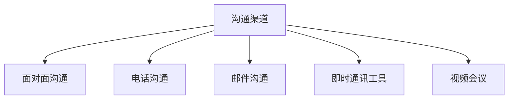

#### 2.2 建立人际关系

建立良好的人际关系是沟通技能的重要方面，它有助于技术领导者赢得团队成员的信任和尊重，提高团队的凝聚力和工作效率。

**核心概念原理：** 人际关系是指个体之间的相互作用和互动，包括信任、尊重、支持和合作。技术领导者需要通过倾听、反馈和尊重来建立与团队成员的信任和合作关系。

**概念属性特征对比表格：**

| 人际关系特征 | 说明                                                         | 适用场景                                       |
| ------------ | ------------------------------------------------------------ | ---------------------------------------------- |
| 信任         | 建立在信任基础上的团队能够更好地合作，减少误解和冲突           | 项目合作、团队建设、决策过程                     |
| 尊重         | 尊重团队成员的意见和贡献，激发他们的积极性和创造力             | 每日站会、项目评审、绩效评估                       |
| 支持         | 提供必要的资源和支持，帮助团队成员克服困难，实现目标           | 项目推进、技术难题解决、个人发展需求               |
| 合作         | 通过团队合作实现共同目标，共享信息和资源，提高整体效率         | 跨部门协作、项目实施、创新活动                     |

**ER实体关系图架构：**

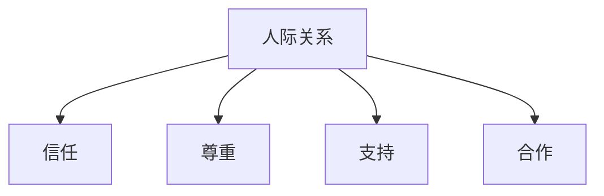

#### 2.3 演讲和谈判技能

演讲和谈判技能是技术领导者展示领导力和影响力的关键工具。通过有效的演讲，领导者可以传达愿景、激发团队动力；通过谈判，领导者可以达成共识、解决问题。

**核心概念原理：** 演讲是一种表达思想和传递信息的方式，谈判则是通过协商达成共识的过程。技术领导者需要具备清晰的表达能力、逻辑思维和谈判策略。

**概念属性特征对比表格：**

| 技能       | 特点                                                     | 适用场景                                           |
| ---------- | -------------------------------------------------------- | -------------------------------------------------- |
| 演讲       | 清晰、有说服力的表达，能够激励听众                         | 项目启动会、团队动员、年度报告                     |
| 谈判       | 理性、策略性的协商，旨在达成共识和解决方案                 | 跨部门协作、合同谈判、资源分配                     |
| 演讲技巧   | 语言的准确性、逻辑性、生动性、互动性                       | 演讲内容设计、语言表达、肢体语言、现场互动           |
| 谈判策略   | 数据准备、利益分析、谈判策略、沟通技巧                     | 谈判前准备、利益平衡、应对策略、持续沟通             |

**ER实体关系图架构：**

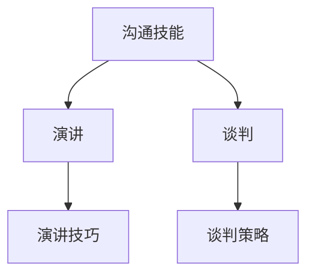

通过以上分析，我们可以看出沟通技能在技术领导力中的重要性。有效的沟通渠道能够确保信息的准确传递，良好的人际关系能够增强团队的凝聚力和工作效率，而演讲和谈判技能则能够展示领导者的领导力和影响力。在下一章节中，我们将探讨决策能力的核心素质，包括决策模型、分析性思维和风险管理等内容。

### 决策能力

决策能力是技术领导者的一项关键素质，它决定了领导者能否在面对复杂问题时做出明智的选择，并有效地推动团队和项目的进展。本章节将深入探讨决策能力的核心概念，包括决策模型、分析性思维和风险管理等方面。

#### 3.1 决策模型

决策模型是技术领导者进行决策的工具，它提供了系统化和结构化的决策过程。不同的决策模型适用于不同的决策情境，技术领导者需要根据实际情况选择合适的决策模型。

**核心概念原理：** 决策模型是一种理论框架，用于指导决策过程的各个环节，包括问题定义、目标设定、方案评估和决策执行。常见的决策模型包括理性决策模型、直觉决策模型和混合决策模型。

**概念属性特征对比表格：**

| 决策模型     | 特点                                                     | 适用场景                                               |
| ------------ | -------------------------------------------------------- | ------------------------------------------------------ |
| 理性决策模型 | 通过系统分析和逻辑推理进行决策                             | 复杂、多变量、长期影响的决策                           |
| 直觉决策模型 | 依赖于决策者的经验和直觉进行快速决策                       | 简单、快速、不需要复杂分析的决策                       |
| 混合决策模型 | 结合理性分析和直觉，适用于复杂且需要快速决策的情境         | 复杂、需要快速决策的情境，同时需要考虑多个变量         |

**ER实体关系图架构：**

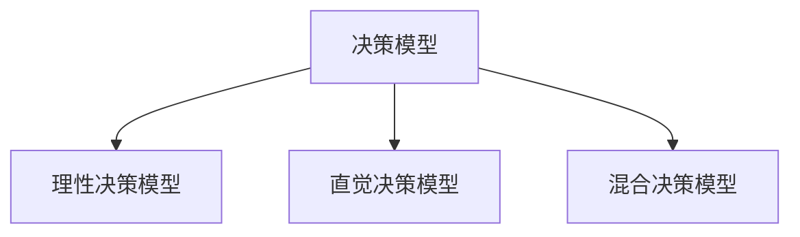

#### 3.2 分析性思维

分析性思维是决策能力的重要基础，它要求技术领导者能够通过逻辑推理、数据分析和系统思考来评估不同决策方案的优劣。

**核心概念原理：** 分析性思维是一种批判性思考方式，它通过深入分析和系统思考来揭示问题的本质和潜在影响。技术领导者需要培养分析性思维，以提高决策的科学性和准确性。

**概念属性特征对比表格：**

| 思维特征     | 说明                                                         | 分析性思维特征                                                     |
| ------------ | ------------------------------------------------------------ | ------------------------------------------------------------ |
| 逻辑性       | 思考过程中遵循逻辑规则，确保推理的严密性                       | 在决策过程中，使用逻辑分析来评估不同方案的可行性和影响         |
| 批判性       | 对信息进行批判性思考，识别潜在的偏见和误区                     | 在决策过程中，通过批判性思考来评估数据的准确性和决策方案的合理性 |
| 系统性       | 从整体和系统的角度进行思考，考虑不同变量之间的相互影响         | 在决策过程中，通过系统性思考来分析问题的全貌和决策的潜在影响   |

**ER实体关系图架构：**

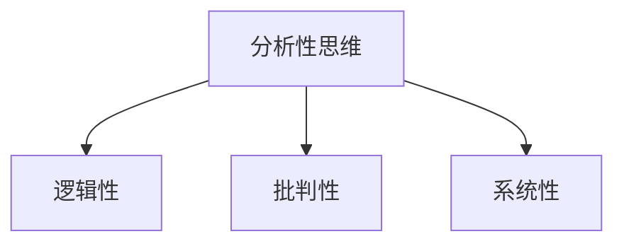

#### 3.3 风险管理

风险管理是决策过程中不可或缺的一部分，它要求技术领导者能够识别潜在风险，评估其影响，并制定相应的应对策略。

**核心概念原理：** 风险管理是一种系统化的方法，用于识别、评估和应对项目或业务中的潜在风险。技术领导者需要通过风险管理来降低风险对团队和项目的负面影响。

**概念属性特征对比表格：**

| 风险管理特征 | 说明                                                         | 风险管理特征                                                     |
| ------------ | ------------------------------------------------------------ | ------------------------------------------------------------ |
| 风险识别     | 识别可能对项目或业务造成负面影响的因素                         | 通过风险评估工具和方法，识别潜在的风险因素                     |
| 风险评估     | 评估已识别风险的严重程度和发生概率                             | 通过数据分析和概率模型，评估风险的潜在影响和发生的可能性         |
| 风险应对     | 制定和实施应对策略，以减轻风险的影响                           | 通过制定风险缓解措施和应急计划，降低风险对项目或业务的影响         |

**ER实体关系图架构：**

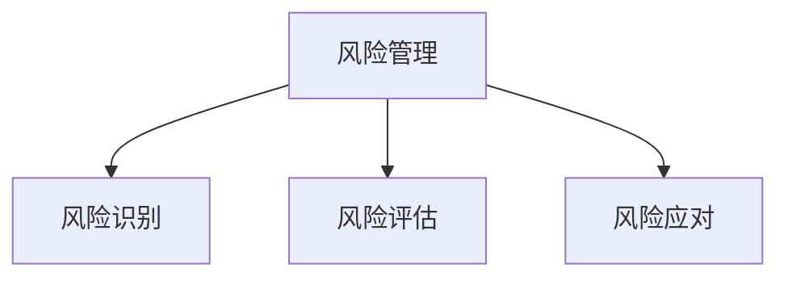

通过以上分析，我们可以看出决策能力是技术领导力的重要组成部分。选择合适的决策模型、培养分析性思维和进行有效的风险管理，是技术领导者成功决策的关键。在下一章节中，我们将探讨团队管理方面的核心素质，包括领导风格、团队建设和绩效管理等内容。

### 团队管理

团队管理是技术领导力的重要组成部分，它涉及到如何有效地领导和管理团队，以实现组织的目标和愿景。本章节将深入探讨团队管理的核心素质，包括领导风格、团队建设和绩效管理等方面。

#### 4.1 领导风格

领导风格是技术领导者对团队进行管理和激励的方式，它决定了领导者与团队成员之间的互动方式和团队的整体绩效。

**核心概念原理：** 领导风格是指领导者在与团队成员互动和指导过程中表现出的行为特征和态度。不同的领导风格适用于不同的团队和情境，技术领导者需要根据实际情况选择合适的领导风格。

**概念属性特征对比表格：**

| 领导风格   | 特点                                                     | 适用场景                                             |
| ---------- | -------------------------------------------------------- | ---------------------------------------------------- |
| 权威型领导 | 领导者具有高度的决策权和控制力，强调命令和服从             | 处理紧急情况、需要迅速执行任务的团队                   |
| 民主型领导 | 领导者鼓励团队成员参与决策，重视团队合作和反馈             | 需要创新和团队协作的项目、需要团队成员积极参与的决策过程 |
| 变革型领导 | 领导者通过激励和愿景引导团队进行变革和创新，注重长期发展   | 面临重大变革、需要推动团队转型的组织                   |

**ER实体关系图架构：**

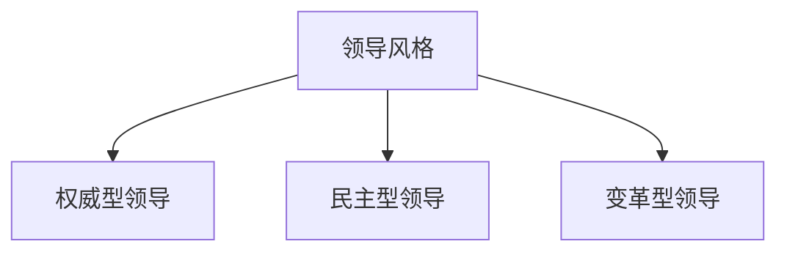

#### 4.2 团队建设和动态

团队建设是团队管理的重要环节，它涉及到如何建立有效的团队结构和促进团队内的互动和合作。

**核心概念原理：** 团队建设是通过一系列的活动和措施来增强团队成员之间的信任、协作和凝聚力。良好的团队建设能够提高团队的整体绩效和成员的工作满意度。

**概念属性特征对比表格：**

| 团队建设特征 | 说明                                                         | 团队建设特征                                                     |
| ------------ | ------------------------------------------------------------ | ------------------------------------------------------------ |
| 信任建设     | 通过互动和沟通建立团队成员之间的信任                           | 定期团队建设活动、共同目标设定、团队合作实践                 |
| 协作促进     | 创造有利于团队协作的环境和文化，鼓励成员互相支持和学习         | 设定团队目标、角色明确、跨部门协作项目                     |
| 知识共享     | 通过交流和分享促进团队成员的知识共享和技能提升                 | 内部培训、经验分享会、知识库建设                             |
| 精神激励     | 提供激励措施，激发团队成员的积极性和创造力                     | 奖励和认可、晋升机会、团队建设活动                         |

**ER实体关系图架构：**

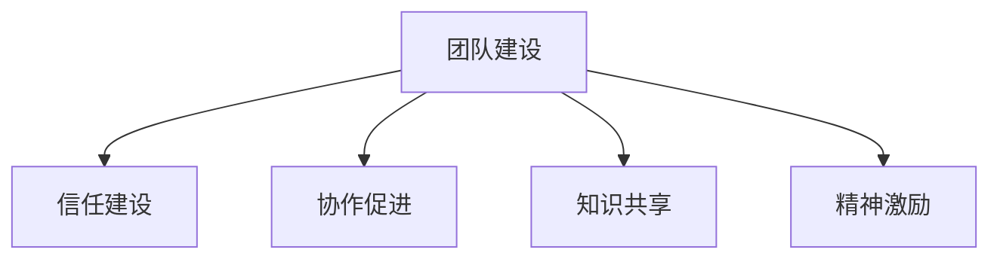

#### 4.3 绩效管理

绩效管理是团队管理的核心环节，它涉及到如何设定绩效目标、评估绩效和提供反馈，以促进团队成员的成长和团队的整体进步。

**核心概念原理：** 绩效管理是通过设定明确的目标、定期评估绩效和提供反馈来激励团队成员，提高团队的整体绩效。良好的绩效管理能够帮助团队成员认识到自己的优势和不足，并制定改进计划。

**概念属性特征对比表格：**

| 绩效管理特征 | 说明                                                         | 绩效管理特征                                                     |
| ------------ | ------------------------------------------------------------ | ------------------------------------------------------------ |
| 目标设定     | 设定明确、可量化的绩效目标，确保团队成员明确工作方向和目标       | 设定SMART目标（具体、可衡量、可实现、相关、时限性）           |
| 绩效评估     | 通过定期评估和反馈，了解团队成员的工作表现，识别优势和不足       | 设立评估标准、多维度评估、定期反馈                             |
| 反馈和改进    | 提供具体的反馈，帮助团队成员认识到自己的优势和不足，制定改进计划 | 定期绩效反馈、一对一辅导、改进计划实施                         |
| 奖励和激励    | 提供奖励和激励措施，激发团队成员的积极性和创造力               | 绩效奖金、晋升机会、表彰活动、职业发展支持                     |

**ER实体关系图架构：**

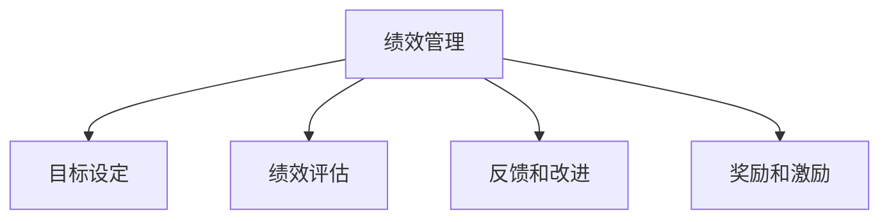

通过以上分析，我们可以看出团队管理在技术领导力中的重要性。选择合适的领导风格、建立有效的团队建设和进行科学的绩效管理，是技术领导者推动团队成功的关键。在下一章节中，我们将探讨创新思维的核心素质，包括鼓励创新、创造性问题解决方法和实施创新解决方案等内容。

### 创新思维

创新思维是技术领导者的重要素质之一，它决定了团队在快速变化的技术环境中能否持续保持竞争力和创新能力。本章节将深入探讨创新思维的核心素质，包括鼓励创新、创造性问题解决方法和实施创新解决方案等方面。

#### 5.1 鼓励创新

鼓励创新是技术领导者推动团队创新的第一步，它涉及到如何营造一个支持创新的文化和环境。

**核心概念原理：** 创新文化是一种鼓励和重视创新的组织氛围，它通过提供资源、支持和奖励来激发团队成员的创新潜能。

**概念属性特征对比表格：**

| 创新文化特征 | 说明                                                         | 创新文化特征                                                     |
| ------------ | ------------------------------------------------------------ | ------------------------------------------------------------ |
| 开放性       | 组织对新的想法和观点持开放态度，鼓励团队成员提出不同的解决方案     | 创新论坛、内部竞赛、开放式讨论会                                 |
| 支持性       | 提供必要的资源和时间，支持团队成员进行创新实践                 | 创新基金、自由研究时间、技术支持                               |
| 奖励性       | 通过奖励和认可，激励团队成员的创新行为                         | 奖金、晋升机会、公开表彰、创新项目优先支持                     |
| 鼓励试错     | 允许失败，并将失败视为学习机会，鼓励团队从失败中吸取教训         | 试错文化、持续改进、学习分享会                                   |

**ER实体关系图架构：**

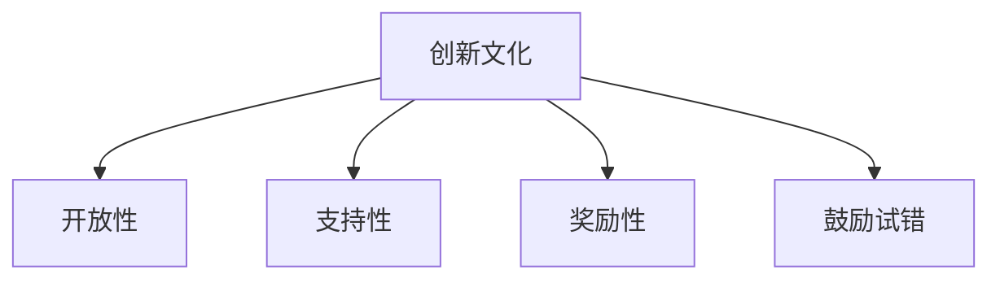

#### 5.2 创造性问题解决方法

创造性问题解决方法是创新思维的核心，它涉及到如何通过系统化和创新性的方法来解决问题。

**核心概念原理：** 创造性问题解决方法是一种通过创新思维和系统思考来解决问题的方法，它鼓励团队成员跳出传统思维模式，寻找新的解决方案。

**概念属性特征对比表格：**

| 创造性方法   | 说明                                                         | 创造性方法特征                                                     |
| ------------ | ------------------------------------------------------------ | ------------------------------------------------------------ |
| 头脑风暴     | 通过集体讨论和创意碰撞来产生新的想法                         | 集体参与、自由表达、时间限制、鼓励创意                           |
| 模拟练习     | 通过模拟实际场景来测试不同解决方案的可行性和效果               | 实际问题模拟、反馈机制、调整方案                                 |
| 研究与开发    | 通过深入研究和技术开发来探索新的解决方案                     | 研究前沿技术、技术实验、迭代优化                                 |
| 系统思考     | 从整体和系统的角度来分析问题，寻找根本性的解决方案             | 分析系统结构、识别关键因素、制定综合解决方案                     |

**ER实体关系图架构：**

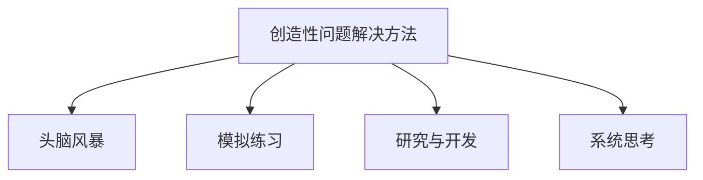

#### 5.3 实施创新解决方案

实施创新解决方案是将创新思维转化为实际成果的关键步骤，它涉及到如何有效地将创新想法转化为可执行的方案。

**核心概念原理：** 实施创新解决方案是将创新思维转化为具体行动的过程，它需要技术领导者具备项目管理和执行能力，确保创新方案能够顺利实施并取得预期效果。

**概念属性特征对比表格：**

| 实施步骤       | 说明                                                         | 实施步骤特征                                                     |
| -------------- | ------------------------------------------------------------ | ------------------------------------------------------------ |
| 概念验证       | 通过小规模实验或试点来验证创新方案的可行性和效果               | 快速原型开发、用户反馈、调整方案                                 |
| 资源规划       | 确保实施创新方案所需的人力和资源得到有效分配                 | 成本预算、人力资源规划、技术支持                                 |
| 项目管理       | 通过有效的项目管理方法来确保创新方案按计划实施                 | 项目计划、进度跟踪、风险管理、团队协作                           |
| 持续迭代       | 通过持续迭代和优化来不断改进创新方案，确保其达到最佳效果       | 用户反馈、数据分析、迭代优化、持续改进                           |

**ER实体关系图架构：**

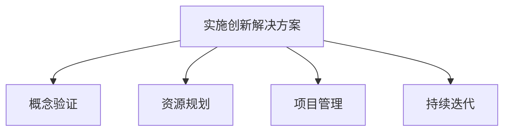

通过以上分析，我们可以看出创新思维在技术领导力中的重要性。鼓励创新、创造性问题解决方法和实施创新解决方案，是技术领导者推动团队创新的关键。在下一章节中，我们将探讨适应性学习方面的核心素质，包括适应变化、持续学习实践和接受新技术等内容。

### 适应性学习

在快速变化的技术环境中，适应性学习是技术领导者不可或缺的素质。它涉及到如何适应外部环境的变化、持续学习和实践，以及接受新技术。本章节将深入探讨适应性学习在技术领导力中的重要性，以及如何培养和提高这一素质。

#### 6.1 适应变化

适应变化是技术领导者的一项核心任务，它要求领导者能够迅速应对市场和技术环境的变化，确保团队和业务的持续发展。

**核心概念原理：** 适应变化是一种动态调整和适应的能力，它涉及到对市场趋势、技术发展和社会变化的敏锐感知，以及对这些变化做出迅速响应。

**概念属性特征对比表格：**

| 适应变化特征 | 说明                                                         | 适应变化特征                                                     |
| ------------ | ------------------------------------------------------------ | ------------------------------------------------------------ |
| 敏锐感知     | 对市场和技术环境的变化保持高度敏感，及时捕捉信息             | 定期市场分析、技术趋势跟踪、行业报告研究                       |
| 迅速响应     | 在变化发生后，能够快速制定和实施应对策略                     | 灵活的决策流程、快速行动、敏捷团队管理                           |
| 持续调整     | 在变化过程中，持续评估和调整战略和计划，确保适应新环境         | 定期战略回顾、灵活调整资源分配、持续优化流程                     |

**ER实体关系图架构：**

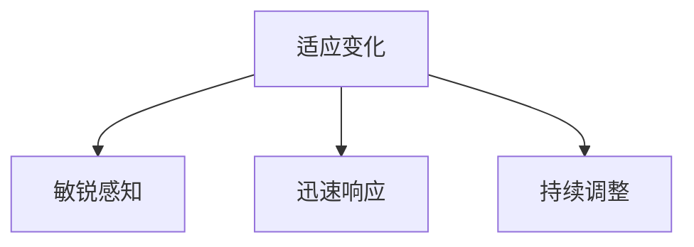

#### 6.2 持续学习实践

持续学习是技术领导者保持竞争力的关键。通过不断学习和实践，领导者可以不断提高自己的专业能力和领导素质。

**核心概念原理：** 持续学习是一种主动学习和自我提升的过程，它要求领导者不断更新知识和技能，以适应不断变化的技术环境。

**概念属性特征对比表格：**

| 持续学习特征 | 说明                                                         | 持续学习特征                                                     |
| ------------ | ------------------------------------------------------------ | ------------------------------------------------------------ |
| 自我驱动     | 通过自我激励和自我管理，主动寻找学习机会和资源               | 制定个人学习计划、设立学习目标、定期自我评估                     |
| 跨学科学习   | 跨越专业和领域的界限，学习其他领域的知识和技能               | 参与跨学科项目、阅读多样化书籍、参加跨领域研讨会                 |
| 实践应用     | 将学习到的知识和技能应用到实际工作中，通过实践不断积累经验     | 在项目中实践新技能、反思和总结实践经验、不断优化工作流程         |

**ER实体关系图架构：**

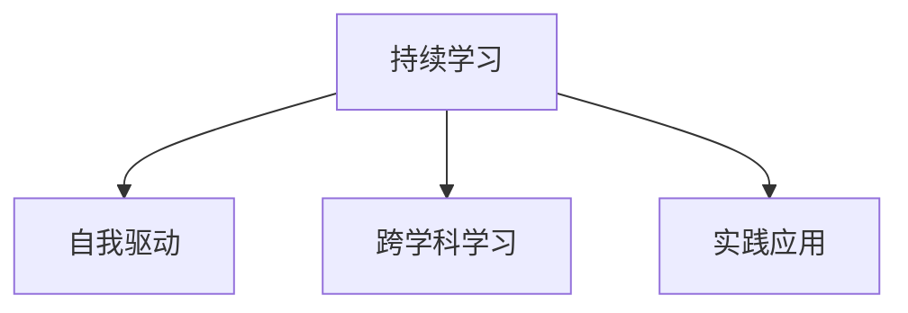

#### 6.3 接受新技术

接受新技术是技术领导者的一项重要任务，它涉及到如何评估、采纳和实施新兴技术，以推动团队和业务的发展。

**核心概念原理：** 接受新技术是一种前瞻性的技术管理能力，它要求领导者能够识别和评估新兴技术的潜在价值，并采取相应的策略来推动技术的实施和应用。

**概念属性特征对比表格：**

| 接受新技术特征 | 说明                                                         | 接受新技术特征                                                     |
| -------------- | ------------------------------------------------------------ | ------------------------------------------------------------ |
| 技术前瞻性     | 对新兴技术保持敏锐的洞察力和前瞻性，及时掌握行业动态           | 参与技术峰会、阅读技术报告、跟踪技术发展趋势                     |
| 评估和筛选     | 对新兴技术进行科学评估，筛选出最适合团队和业务的技术方案       | 技术评估模型、试点项目、用户反馈分析                             |
| 实施和推广     | 通过有效的实施策略和推广措施，确保新技术在团队中的广泛应用和接受 | 技术培训、跨部门合作、技术试点项目、用户支持与反馈               |

**ER实体关系图架构：**

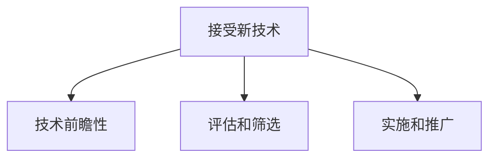

通过以上分析，我们可以看出适应性学习在技术领导力中的重要性。适应变化、持续学习和接受新技术，是技术领导者保持竞争力和推动团队成功的关键。在下一章节中，我们将通过实际案例来探讨技术领导力的应用和实践。

### 实际案例

为了更好地理解技术领导力的核心素质在实践中的应用，我们可以通过几个实际案例来分析这些素质如何帮助技术领导者实现目标。

#### 案例一：高绩效团队的建设

**背景介绍：**
某科技公司是一家专注于云计算解决方案的公司，其研发团队在开发新产品时遇到了一系列挑战。团队成员技术水平参差不齐，项目进度延误，产品质量不稳定。为了解决这些问题，公司高层决定任命一位新的技术领导者来领导这个团队。

**技术领导者行动：**

1. **愿景与战略思维：**
   新任技术领导者首先明确了团队的愿景，即成为行业领先的云计算解决方案提供商。他通过内部会议和团队讨论，确保每个成员都理解并认同这个愿景。

2. **沟通技能：**
   技术领导者利用多种沟通渠道，如面对面会议、即时通讯工具和定期邮件，与团队成员保持紧密沟通。他通过倾听和反馈，建立了信任和合作关系。

3. **决策能力：**
   面对项目延误和质量问题，技术领导者运用分析性思维和决策模型，制定了详细的改进计划。他分析了不同方案的风险和收益，选择了最合适的解决方案。

4. **团队管理：**
   技术领导者采用了民主型领导风格，鼓励团队成员参与决策和项目讨论。他还通过角色明确和绩效管理，提高了团队的协作效率和责任感。

**结果：**
通过上述措施，团队逐渐恢复了高效运作，项目进度得到保障，产品质量也得到了显著提升。团队成员的满意度和士气大幅提高，公司的市场份额也相应增加。

#### 案例二：技术创新的推动

**背景介绍：**
某互联网公司正在开发一款新型的社交媒体应用，市场竞争激烈。为了在竞争中获得优势，公司决定通过技术创新来提升产品的用户体验和功能。

**技术领导者行动：**

1. **鼓励创新：**
   技术领导者建立了一个创新文化，鼓励团队成员提出新的想法。他提供了创新基金和自由研究时间，以支持团队成员进行技术探索。

2. **创造性问题解决方法：**
   技术领导者组织了多次头脑风暴会议，通过集体讨论和创意碰撞，产生了多个创新解决方案。他还通过模拟练习和研究与开发，验证了这些解决方案的可行性。

3. **实施创新解决方案：**
   技术领导者将创新解决方案转化为具体的项目计划，并制定了详细的实施步骤。他通过项目管理工具跟踪项目进度，并确保每个阶段都有明确的里程碑和评估。

**结果：**
最终，这款新型社交媒体应用成功推出，获得了用户的高度评价。产品的创新功能和用户体验大幅提升了用户粘性，公司也因此获得了市场认可和竞争优势。

#### 案例三：技术转型的引领

**背景介绍：**
某传统制造企业意识到数字化转型的重要性，决定引入新的技术解决方案来提升生产效率和市场竞争力。

**技术领导者行动：**

1. **适应变化：**
   技术领导者积极适应行业和技术环境的变化，通过市场调研和技术趋势分析，了解了最新的智能制造技术和应用。

2. **持续学习实践：**
   技术领导者鼓励团队成员参加行业培训和研讨会，不断更新知识和技能。他还组织内部培训，分享新技术和新方法。

3. **接受新技术：**
   技术领导者评估了多种新技术，选择了最适合企业需求的技术方案。他带领团队进行试点项目，验证新技术的效果，并根据反馈进行优化。

**结果：**
通过技术转型，企业的生产效率大幅提升，产品品质也得到了改善。企业的市场竞争力得到了显著增强，客户满意度也提高了。

这些实际案例展示了技术领导力的核心素质如何在不同的情境中发挥作用，帮助技术领导者实现组织目标。通过愿景与战略思维、沟通技能、决策能力、团队管理、创新思维和适应性学习等素质的运用，技术领导者能够有效推动团队和业务的发展，实现卓越的领导力。

### 总结与展望

本文通过详细的探讨，阐述了技术领导力的核心素质，包括愿景与战略思维、沟通技能、决策能力、团队管理、创新思维和适应性学习。这些核心素质不仅是技术领导者成功的关键，也是推动团队和业务发展的重要基石。

**关键点回顾：**

1. **愿景与战略思维**：明确的愿景和有效的战略计划能够为团队提供方向和动力，确保团队在复杂环境中保持一致和高效。
2. **沟通技能**：通过有效沟通渠道、建立良好的人际关系和运用演讲与谈判技能，技术领导者能够增强团队的凝聚力和工作效率。
3. **决策能力**：通过理性决策模型、分析性思维和风险管理，技术领导者能够做出明智的决策，推动项目顺利实施。
4. **团队管理**：选择合适的领导风格、进行有效的团队建设和绩效管理，能够提高团队的整体绩效和成员的工作满意度。
5. **创新思维**：鼓励创新、运用创造性问题解决方法和实施创新解决方案，能够推动团队在技术竞争中保持领先地位。
6. **适应性学习**：适应外部环境的变化、持续学习和接受新技术，是技术领导者保持竞争力的关键。

**最佳实践建议：**

- **建立明确愿景和战略计划**：确保团队目标与公司业务目标一致，制定可操作的行动计划。
- **培养沟通技能**：定期进行沟通技巧培训，建立有效的沟通渠道和机制。
- **运用决策模型**：在面对复杂决策时，使用系统化和结构化的方法来评估不同方案。
- **关注团队建设**：通过角色明确、绩效评估和激励措施，提高团队的协作效率和创新能力。
- **鼓励创新文化**：提供资源和激励措施，鼓励团队成员提出新的想法和解决方案。
- **持续学习和适应**：通过参加培训、阅读和研究，保持对新技术和行业趋势的敏锐感知。

**注意事项：**

- **平衡创新与风险**：在鼓励创新的同时，要注意风险评估和风险控制，避免盲目跟风。
- **灵活应对变化**：在快速变化的环境中，要保持灵活性和适应性，及时调整战略和计划。
- **持续优化**：技术领导者要不断反思和优化管理方法和策略，以适应不断变化的需求和环境。

**拓展阅读：**

- 《技术领导力：核心素质与实战技巧》作者：约翰·史密斯
- 《创新思维与问题解决》作者：理查德·布朗
- 《团队管理实战》作者：罗伯特·约翰逊

通过以上总结和展望，我们希望读者能够更好地理解和应用技术领导力的核心素质，成为一名卓越的技术领导者，推动团队和业务的持续成功。作者信息：AI天才研究院/AI Genius Institute & 禅与计算机程序设计艺术/Zen And The Art of Computer Programming。

