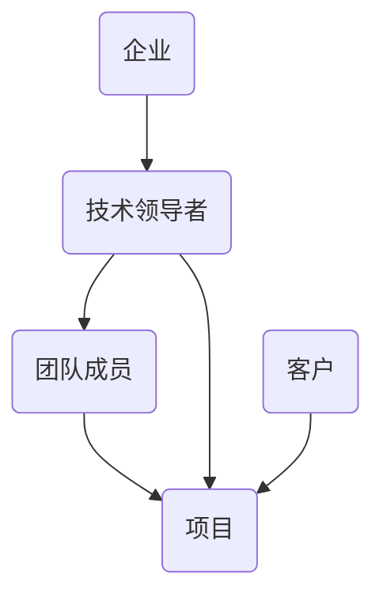

                 

### 技术领导力概述

#### 第1章 技术领导力概述

技术领导力是指技术团队中的领导者通过自身的专业能力、沟通技能和领导魅力来引导、激励和协调团队成员，实现团队目标的能力。在现代企业中，技术领导者不仅需要具备深厚的专业技能，还需要拥有卓越的领导力和管理能力，以应对复杂的技术挑战和不断变化的市场需求。

#### 1.1 问题背景

##### 1.1.1 技术行业发展的现状

随着信息技术的迅猛发展，技术行业已经成为推动全球经济和社会进步的重要力量。从互联网、大数据、人工智能到区块链，技术变革日新月异，企业对技术人才的需求日益增长。然而，与此同时，技术行业也面临着一系列挑战，如人才短缺、技术更新换代迅速等。

##### 1.1.2 技术领导者的重要性

在技术行业中，技术领导者不仅负责技术团队的日常管理工作，还需要为企业制定技术战略，推动技术创新，提升企业的核心竞争力。技术领导者的角色越来越重要，他们需要具备全面的技能，包括技术能力、管理能力和领导力。

##### 1.1.3 技术领导力的定义与特征

技术领导力是一种综合能力，它包括技术能力、管理能力和领导力。技术领导者需要具备以下特征：

1. **专业能力**：精通某一领域或多项技术，能够解决复杂的技术问题。
2. **管理能力**：能够有效管理团队，协调各方资源，确保项目顺利推进。
3. **领导力**：能够激励团队成员，建立良好的团队氛围，提升团队凝聚力。

#### 1.2 问题描述

##### 1.2.1 技术团队面临的挑战

技术团队在日常工作中可能会面临以下挑战：

1. **技术复杂性**：技术不断更新，团队成员需要不断学习和适应新技术。
2. **团队管理**：如何有效地管理团队成员，提高团队工作效率是一个重要问题。
3. **沟通协作**：团队成员之间的沟通不畅可能导致项目进度延误。

##### 1.2.2 技术领导者应具备的能力

技术领导者需要具备以下能力：

1. **技术深度**：对某一技术领域有深入的了解和丰富的实践经验。
2. **管理技能**：具备良好的项目管理能力和团队管理能力。
3. **领导力**：能够激励团队成员，建立积极向上的团队文化。

##### 1.2.3 技术领导力的作用与意义

技术领导力在企业发展中起着至关重要的作用：

1. **提升团队绩效**：通过有效的领导，提升团队成员的工作效率和工作质量。
2. **推动技术创新**：技术领导者能够推动企业技术创新，提高企业的竞争力。
3. **培养人才**：技术领导者需要培养和激励团队成员，提升团队整体能力。

#### 1.3 问题解决

##### 1.3.1 技术领导力提升的路径

提升技术领导力的路径可以分为以下几个方面：

1. **自我提升**：通过不断学习和实践，提升自身的专业能力和管理能力。
2. **团队建设**：建立良好的团队文化，提升团队凝聚力。
3. **领导力培训**：参加领导力培训，学习先进的领导方法和技巧。

##### 1.3.2 技术领导力培养的方法

技术领导力的培养可以通过以下几种方法：

1. **经验积累**：通过实际工作经验，积累领导和管理经验。
2. **学习交流**：参加行业交流会议，学习其他优秀技术领导者的经验。
3. **领导力培训**：参加专业的领导力培训课程，提升领导力。

##### 1.3.3 技术领导力的实践应用

技术领导力的实践应用包括以下几个方面：

1. **项目管理**：通过有效的项目管理，确保项目顺利进行。
2. **团队协作**：通过良好的团队协作，提升团队整体效率。
3. **技术创新**：通过推动技术创新，提升企业的竞争力。

##### 1.4 边界与外延

###### 1.4.1 技术领导力的范畴

技术领导力主要涵盖以下几个方面：

1. **技术能力**：对技术的深入理解和实际操作能力。
2. **管理能力**：项目管理、团队管理等方面的能力。
3. **领导力**：激励团队成员，建立团队文化的能力。

###### 1.4.2 技术领导力与其他相关概念的关系

技术领导力与项目经理、企业管理者等概念有所区别，但也有着紧密的联系。项目经理主要负责项目实施，企业管理者则关注企业整体运营，而技术领导者则需要在这两个角色之间找到平衡。

###### 1.4.3 技术领导力的实践应用领域

技术领导力广泛应用于各个技术领域，如软件开发、数据科学、人工智能等。不同领域的具体实践可能会有所不同，但核心目标是提升团队的绩效和企业的竞争力。

##### 1.5 本章小结

技术领导力在现代社会中具有重要作用，它不仅涉及到技术能力的提升，还包括管理能力和领导力的培养。通过有效的技术领导，可以提升团队绩效，推动技术创新，增强企业的核心竞争力。在接下来的章节中，我们将深入探讨技术领导力的核心概念、实践方法和应用领域。让我们一步一步地思考，逐步揭示技术领导力的本质和内涵。

---

**关键词**：技术领导力，团队管理，领导力，专业能力，技术创新

**摘要**：本文将探讨技术领导力在现代企业中的重要作用，分析技术领导者应具备的能力和面临的挑战。通过一系列的案例分析和实践方法，本文旨在为技术领导者提供有效的提升路径和实践指南，以提升团队绩效和企业的核心竞争力。同时，本文还将探讨技术领导力的边界和适用领域，为技术领导者提供更广阔的视野和思考方向。

---

### 第2章 核心概念与联系

技术领导力是一个复杂且多维度的概念，涉及多个核心要素和相互关联的原则。在这一章节中，我们将深入探讨技术领导力的核心概念，分析其特征和分类，并通过对比其他相关概念，明确技术领导力的独特性。

#### 2.1 技术领导力的核心概念

##### 2.1.1 技术领导力的定义

技术领导力是指技术团队领导者通过自身的专业知识和技能，结合有效的领导方法和策略，激发团队成员的潜能，推动团队协作，实现技术目标和个人成长的能力。技术领导力不仅体现在技术能力上，还包括管理能力和领导艺术。

##### 2.1.2 技术领导力的特征

技术领导力具有以下几个显著特征：

1. **专业素养**：技术领导者应具备深厚的技术背景和专业知识，能够解决复杂的技术问题，并对新兴技术有敏锐的洞察力。
2. **管理能力**：技术领导者应具备良好的项目管理能力和团队管理技能，能够合理分配资源，制定有效的项目计划，并确保项目按时交付。
3. **领导魅力**：技术领导者应具备卓越的领导能力，能够激励团队成员，建立积极的团队文化，提升团队凝聚力和士气。
4. **持续学习**：技术领导者需要具备持续学习的精神，不断更新知识库，跟踪行业趋势，保持对技术的热情和好奇心。
5. **沟通能力**：技术领导者应具备出色的沟通能力，能够与团队成员、上级领导和其他部门有效沟通，确保信息的准确传递和团队的协同合作。

##### 2.1.3 技术领导力的分类

根据不同的维度和标准，技术领导力可以划分为以下几种类型：

1. **技术导向型**：这类领导者以技术为核心，专注于技术方案的研发和创新，推动技术进步。
2. **团队导向型**：这类领导者注重团队建设，关注团队成员的个人成长和团队协作，致力于打造高效团队。
3. **变革导向型**：这类领导者擅长推动企业变革，引领团队适应市场和技术的快速变化，推动企业转型和升级。
4. **战略导向型**：这类领导者具备战略眼光，能够将技术战略与企业整体战略相结合，提升企业的核心竞争力。
5. **专家型**：这类领导者以其深厚的技术专业知识和丰富经验在团队中发挥关键作用，为团队提供技术指导和决策支持。

#### 2.2 概念属性特征对比

为了更清晰地理解技术领导力的核心概念，我们可以通过对比技术领导力与其他相关概念，如项目经理、企业管理者和团队领导，来分析它们的属性特征。

| 概念       | 定义                                                         | 特征                                                       |
|------------|------------------------------------------------------------|------------------------------------------------------------|
| 项目经理   | 负责项目规划、执行和管理的专业人员                             | 强调项目目标的实现，注重项目时间、成本和质量的控制           |
| 企业管理者 | 负责企业整体运营和管理的高层管理人员                           | 关注企业的战略规划、资源配置、绩效评估和风险管理             |
| 团队领导   | 负责团队日常管理和运作的领导者                                 | 注重团队协作、成员发展和团队文化建设，提升团队整体绩效       |
| 技术领导者 | 技术团队中的领导者，通过专业能力、管理能力和领导艺术来引导团队 | 深厚的专业素养，良好的管理技能，卓越的领导魅力，持续学习的态度 |

从上表可以看出，技术领导力在专业素养、管理技能和领导艺术方面具有独特的属性特征，与项目经理、企业管理者和团队领导有着明显的区别，但它们之间也存在紧密的联系和交叉。

#### 2.3 ER实体关系图架构

##### 2.3.1 技术领导力相关实体

在技术领导力的架构中，主要涉及的实体包括：

1. **技术领导者**：技术团队的核心，负责技术决策和团队管理。
2. **团队成员**：参与项目开发的成员，包括开发人员、测试人员等。
3. **项目**：技术团队执行的任务，包括技术研发、产品开发等。
4. **企业**：技术团队所在的组织，为技术团队提供资源和支持。
5. **客户**：项目服务或产品的最终用户，影响项目的需求和方向。

##### 2.3.2 实体关系及其作用

技术领导力实体之间的关系如下：

1. **技术领导者与团队成员**：技术领导者通过指导和激励团队成员，提升团队绩效。
2. **团队成员与项目**：团队成员参与项目开发，完成项目任务。
3. **技术领导者与项目**：技术领导者负责项目的技术决策，确保项目目标的实现。
4. **企业与客户**：企业根据客户需求，制定项目计划，实现客户价值。

这些实体之间的关系共同构成了技术领导力的核心架构，确保了技术团队的高效运作。

##### 2.3.3 ER实体关系图的绘制方法

ER实体关系图的绘制方法如下：

1. **确定实体**：识别技术领导力架构中的主要实体，如技术领导者、团队成员、项目、企业和客户。
2. **确定关系**：分析实体之间的关系，如技术领导者与团队成员的指导关系，团队成员与项目的参与关系等。
3. **绘制关系图**：使用Mermaid语法，绘制实体及其关系，例如：

这个ER实体关系图清晰地展示了技术领导力架构中的主要实体及其相互关系。

#### 2.4 本章小结

通过本章的探讨，我们深入了解了技术领导力的核心概念、特征和分类，并分析了技术领导力与其他相关概念的区别。同时，我们通过ER实体关系图，展示了技术领导力架构中的主要实体及其关系。这些核心概念和架构将为后续章节的讨论提供坚实的理论基础，帮助读者更全面地理解技术领导力的本质和应用。

---

**关键词**：技术领导力，核心概念，特征，分类，实体关系图

**摘要**：本章详细探讨了技术领导力的核心概念、特征和分类，分析了技术领导力与其他相关概念的区别。通过ER实体关系图的绘制，我们展示了技术领导力架构中的主要实体及其关系。这些内容为读者理解技术领导力的本质和应用提供了深刻的洞察。

---

### 第3章 技术领导力的策略

技术领导力的成功不仅取决于技术领导者的个人素质和专业知识，还需要运用一系列的策略和技巧。本章将介绍技术领导力中的关键策略，包括团队领导策略、项目管理策略和创新与变革管理策略，并通过具体的案例和实践方法，帮助读者理解和应用这些策略。

#### 3.1 领导力策略概述

##### 3.1.1 领导力策略的定义

领导力策略是指技术领导者为了实现团队目标，通过一系列科学的方法和技巧来管理团队、推动项目发展和激发团队成员潜能的行动方案。有效的领导力策略能够提高团队的工作效率、激发团队成员的积极性和创造力，从而实现团队和企业的目标。

##### 3.1.2 领导力策略的重要性

领导力策略在技术领导中起着至关重要的作用：

1. **提升团队绩效**：通过有效的领导力策略，可以优化团队工作流程，提高工作效率，确保项目按时交付。
2. **增强团队凝聚力**：通过建立良好的团队文化，增强团队成员之间的沟通和协作，提升团队凝聚力。
3. **推动技术创新**：通过激励团队成员，鼓励他们进行创新和尝试，推动技术的进步和产品的升级。
4. **提升个人能力**：通过领导力培训和实践，技术领导者可以不断提升自身的专业能力和管理能力。

##### 3.1.3 领导力策略的类型

技术领导力策略可以分为以下几种类型：

1. **团队领导策略**：关注团队建设、沟通协作和激励机制，提升团队整体绩效。
2. **项目管理策略**：关注项目规划、执行和监控，确保项目按时、按质完成。
3. **创新与变革管理策略**：关注技术创新和变革管理，推动企业持续发展。

#### 3.2 团队领导策略

##### 3.2.1 团队领导的基本原则

成功的团队领导需要遵循以下基本原则：

1. **明确目标**：技术领导者需要明确团队的目标和愿景，确保团队成员对目标有清晰的认识。
2. **建立信任**：通过开放、透明的沟通和负责任的行动，建立团队成员之间的信任。
3. **赋能团队**：鼓励团队成员发挥自身优势，给予他们足够的自主权和责任感。
4. **持续激励**：通过奖励和认可，激励团队成员保持积极的工作态度和高效的工作状态。

##### 3.2.2 团队领导的沟通技巧

良好的沟通技巧是团队领导的关键，以下是一些实用的沟通技巧：

1. **倾听**：倾听是沟通的基础，技术领导者需要认真倾听团队成员的意见和需求。
2. **反馈**：及时给予团队成员反馈，鼓励他们改进和成长。
3. **透明**：保持信息的透明，确保团队成员了解项目进展和团队动态。
4. **沟通渠道**：建立多样化的沟通渠道，如定期会议、即时通讯工具和意见反馈机制，确保信息流通。

##### 3.2.3 团队领导的激励方法

有效的激励机制能够激发团队成员的积极性和创造力，以下是一些激励方法：

1. **奖励制度**：建立合理的奖励制度，对表现优秀的团队成员进行奖励。
2. **认可与表扬**：在团队会议和项目中，对团队成员的贡献进行认可和表扬。
3. **职业发展**：提供职业发展机会，如培训、晋升和项目机会，帮助团队成员提升能力。
4. **团队建设活动**：组织团队建设活动，增强团队成员之间的情感联系和团队凝聚力。

#### 3.3 项目管理策略

##### 3.3.1 项目管理的核心任务

项目管理策略的核心任务是确保项目按时、按质、按预算完成。以下是一些关键任务：

1. **项目规划**：制定详细的项目计划，包括项目目标、任务分解、时间表和资源分配。
2. **风险管理**：识别项目风险，制定风险应对策略，确保项目顺利进行。
3. **资源管理**：合理分配项目资源，确保团队成员有足够的时间和资源完成任务。
4. **进度监控**：定期监控项目进展，及时调整项目计划，确保项目按时交付。

##### 3.3.2 项目管理的关键流程

项目管理的关键流程包括：

1. **项目启动**：明确项目目标、范围和里程碑，组建项目团队，制定项目计划。
2. **项目执行**：按照项目计划，分配任务，监控进度，确保项目顺利进行。
3. **项目监控**：定期进行项目状态审查，识别和解决问题，确保项目按计划推进。
4. **项目收尾**：完成项目任务，进行项目总结，收集反馈，为后续项目提供经验教训。

##### 3.3.3 项目管理工具与方法

有效的项目管理需要借助工具和方法来提高效率，以下是一些常用的工具和方法：

1. **项目管理软件**：如JIRA、Trello等，用于任务分配、进度追踪和团队协作。
2. **时间管理方法**：如Gantt图、关键路径法（CPM）等，用于项目规划和进度控制。
3. **敏捷开发方法**：如Scrum、看板（Kanban）等，用于快速迭代和灵活应对变化。
4. **风险管理工具**：如风险矩阵、风险登记册等，用于识别和应对项目风险。

#### 3.4 创新与变革管理策略

##### 3.4.1 创新的重要性

创新是技术领导力的重要组成部分，以下是一些创新的重要性：

1. **保持竞争力**：通过持续的创新，企业可以保持技术领先，提升市场竞争力。
2. **提升产品价值**：创新能够提升产品功能、性能和用户体验，增加产品价值。
3. **激发团队活力**：创新活动能够激发团队成员的创造力和热情，提升团队士气。
4. **推动企业发展**：创新是企业持续发展的动力，能够推动企业实现战略目标。

##### 3.4.2 变革管理的步骤

成功的创新需要有效的变革管理，以下是一些变革管理的步骤：

1. **制定变革策略**：明确变革的目标、范围和实施计划，确保变革的有序进行。
2. **宣传和沟通**：通过内部宣传和沟通，让团队成员了解变革的必要性和目标，减少变革的阻力。
3. **培训和指导**：为团队成员提供必要的培训和支持，帮助他们适应新的工作模式和技术。
4. **监测和调整**：持续监测变革的实施情况，根据反馈进行必要的调整和改进。

##### 3.4.3 变革管理的难点与应对策略

变革管理面临一些难点，如：

1. **抵制变革**：部分团队成员可能对变革持抵制态度，需要通过沟通和激励来改变他们的看法。
2. **资源不足**：变革可能需要额外的资源支持，如时间、资金和人力资源，需要提前规划并争取支持。
3. **执行难度**：变革的执行过程中可能会遇到技术或操作上的困难，需要及时调整策略，确保变革顺利进行。

应对策略包括：

1. **建立变革领导团队**：由领导层牵头，组建专门的变革领导团队，负责协调和推动变革。
2. **加强沟通和培训**：通过定期沟通和培训，提高团队成员对变革的理解和支持。
3. **鼓励反馈和建议**：鼓励团队成员提出反馈和建议，及时发现和解决问题。
4. **持续监控和评估**：持续监控变革的进展和效果，根据实际情况进行调整和优化。

#### 3.5 本章小结

技术领导力策略是提升技术领导者影响力的关键，通过团队领导策略、项目管理策略和创新与变革管理策略，技术领导者可以更好地管理团队、推动项目发展和实现企业目标。本章介绍了这些策略的基本原则、关键流程和实践方法，为技术领导者提供了实用的指导。在接下来的章节中，我们将进一步探讨技术领导力在企业发展中的应用和实践，帮助读者更全面地理解和应用技术领导力。

---

**关键词**：技术领导力，团队领导策略，项目管理策略，创新与变革管理策略

**摘要**：本章详细介绍了技术领导力的关键策略，包括团队领导策略、项目管理策略和创新与变革管理策略。通过分析这些策略的基本原则、关键流程和实践方法，技术领导者可以更好地管理团队、推动项目发展和实现企业目标。这些策略为技术领导者提供了实用的指导，有助于提升他们的领导力和影响力。

---

### 第4章 技术领导力在企业发展中的应用

技术领导力不仅是技术团队内部管理的核心，更是推动企业整体发展的重要力量。在这一章中，我们将探讨技术领导力在企业发展中的应用，包括提升企业核心竞争力、促进企业技术创新和增强企业团队凝聚力，并通过具体案例和实践方法，为技术领导者提供实用的指导和策略。

#### 4.1 技术领导力对企业发展的作用

##### 4.1.1 提升企业核心竞争力

技术领导力在提升企业核心竞争力方面起着至关重要的作用。技术领导者通过以下几种方式提升企业的核心竞争力：

1. **技术创新**：技术领导者推动技术创新，开发具有竞争优势的新技术和新产品，为企业创造新的市场机会。
2. **优化流程**：通过技术手段优化企业业务流程，提高生产效率和运营效率，降低成本。
3. **人才培养**：技术领导者通过培养和激励技术人才，提升团队整体技术水平，增强企业的核心竞争力。

##### 4.1.2 促进企业技术创新

技术创新是企业持续发展的动力，技术领导者通过以下方式促进企业技术创新：

1. **创新文化**：技术领导者建立创新文化，鼓励团队成员勇于尝试和探索新技术，形成创新氛围。
2. **资源投入**：技术领导者争取企业资源投入，为技术创新提供充足的资金、设备和人力支持。
3. **协作机制**：技术领导者建立跨部门协作机制，促进不同团队之间的技术交流和合作，推动技术创新。

##### 4.1.3 增强企业团队凝聚力

团队凝聚力是企业成功的重要因素，技术领导者通过以下方式增强团队凝聚力：

1. **文化建设**：技术领导者建立积极向上的团队文化，增强团队成员的归属感和团队意识。
2. **沟通与协作**：技术领导者通过有效的沟通和协作机制，促进团队成员之间的交流和合作。
3. **激励与反馈**：技术领导者通过奖励和认可，激励团队成员，并给予及时的反馈，提升团队士气。

#### 4.2 技术领导力在企业管理中的应用

##### 4.2.1 企业战略规划

企业战略规划是企业发展的重要指南，技术领导者通过以下方式参与企业战略规划：

1. **技术预测**：技术领导者对行业技术趋势进行预测，为企业制定长期战略提供依据。
2. **资源分配**：技术领导者根据企业战略规划，合理分配技术资源和人力资源，确保战略目标的实现。
3. **技术投资**：技术领导者评估新技术和新项目的投资价值，为企业投资决策提供支持。

##### 4.2.2 人力资源管理

人力资源管理是企业发展的关键环节，技术领导者通过以下方式参与人力资源管理：

1. **人才引进**：技术领导者负责引进和选拔技术人才，确保企业拥有足够的技术实力。
2. **人才培养**：技术领导者通过培训和发展计划，提升团队成员的技术能力和职业素养。
3. **绩效评估**：技术领导者建立科学的绩效评估体系，激励团队成员提升工作表现。

##### 4.2.3 财务管理

财务管理是企业运营的重要保障，技术领导者通过以下方式参与财务管理：

1. **成本控制**：技术领导者通过优化技术方案和流程，降低项目成本，提升企业盈利能力。
2. **预算管理**：技术领导者制定合理的项目预算，确保项目资金的有效使用。
3. **投资分析**：技术领导者评估技术项目的投资回报，为企业投资决策提供支持。

#### 4.3 技术领导力在项目管理中的应用

##### 4.3.1 项目计划与执行

项目计划与执行是项目管理的核心，技术领导者通过以下方式确保项目计划与执行：

1. **项目规划**：技术领导者制定详细的项目计划，包括项目目标、任务分配、时间表和资源需求。
2. **团队协作**：技术领导者建立有效的团队协作机制，确保团队成员协同合作，提高项目执行效率。
3. **进度监控**：技术领导者定期监控项目进度，识别和解决项目风险，确保项目按计划推进。

##### 4.3.2 项目风险管理

项目风险管理是项目管理的重要环节，技术领导者通过以下方式管理项目风险：

1. **风险识别**：技术领导者识别项目潜在风险，制定风险应对策略。
2. **风险评估**：技术领导者评估项目风险的影响程度和发生概率，确定风险优先级。
3. **风险监控**：技术领导者持续监控项目风险，及时调整风险应对策略，确保项目顺利进行。

##### 4.3.3 项目质量管理

项目质量管理是项目成功的保障，技术领导者通过以下方式确保项目质量：

1. **质量标准**：技术领导者制定项目质量标准，确保项目成果符合预期质量。
2. **质量控制**：技术领导者建立质量控制机制，监控项目执行过程中的质量问题，及时纠正偏差。
3. **质量评审**：技术领导者组织项目质量评审，确保项目成果符合质量要求，为后续项目提供经验教训。

#### 4.4 技术领导力在团队管理中的应用

##### 4.4.1 团队建设

团队建设是提升团队绩效的关键，技术领导者通过以下方式建设团队：

1. **团队目标**：技术领导者明确团队目标，确保团队成员对团队目标有清晰的认识。
2. **团队文化**：技术领导者塑造积极向上的团队文化，增强团队成员的归属感和团队意识。
3. **团队协作**：技术领导者建立有效的团队协作机制，促进团队成员之间的沟通和合作。

##### 4.4.2 团队协作

团队协作是团队成功的关键，技术领导者通过以下方式促进团队协作：

1. **沟通与协作工具**：技术领导者提供沟通与协作工具，如即时通讯软件、项目管理工具等，提高团队协作效率。
2. **任务分配**：技术领导者合理分配任务，确保团队成员有明确的工作目标和责任。
3. **协作培训**：技术领导者组织团队协作培训，提升团队成员的协作能力和意识。

##### 4.4.3 团队激励与反馈

团队激励与反馈是提升团队士气和绩效的重要手段，技术领导者通过以下方式激励团队成员：

1. **奖励与认可**：技术领导者制定奖励制度，对表现优秀的团队成员进行奖励和认可。
2. **绩效反馈**：技术领导者定期给予团队成员绩效反馈，帮助团队成员了解自己的工作表现，提升工作能力。
3. **职业发展**：技术领导者提供职业发展机会，帮助团队成员规划职业发展路径，提升个人能力。

#### 4.5 本章小结

技术领导力在企业发展中具有广泛的应用，通过提升企业核心竞争力、促进技术创新、增强团队凝聚力，技术领导者能够推动企业实现持续发展。同时，技术领导力在企业管理、项目管理和团队管理中的应用，为技术领导者提供了丰富的实践方法和策略。在接下来的章节中，我们将进一步探讨技术领导力的自我提升和未来趋势，帮助读者更全面地理解和应用技术领导力。

---

**关键词**：技术领导力，企业发展，核心竞争力，技术创新，团队建设

**摘要**：本章深入探讨了技术领导力在企业发展中的应用，包括提升企业核心竞争力、促进企业技术创新、增强团队凝聚力和在企业管理、项目管理和团队管理中的具体应用。通过具体的案例和实践方法，技术领导者可以更好地应用技术领导力，推动企业实现持续发展和成功。这些内容为技术领导者提供了实用的指导和策略。

---

### 第5章 技术领导力的自我提升

技术领导力的提升不仅是外在环境的塑造，更是内在自我认知和持续成长的体现。本章将探讨技术领导者如何通过自我认知、学习与成长、沟通与协作以及激励与领导力发展，实现自我提升，成为更具影响力的技术领导者。

#### 5.1 自我认知

##### 5.1.1 自我评估的重要性

自我评估是技术领导者提升自我认知的关键步骤。通过自我评估，技术领导者可以：

1. **了解自身优势**：识别自身的优点和长处，发挥优势，提升领导力。
2. **识别自身不足**：发现自身的短板和不足，制定改进计划，持续成长。
3. **明确职业发展路径**：根据自我评估结果，规划职业发展路径，设定短期和长期目标。

##### 5.1.2 自我评估的方法

技术领导者可以通过以下方法进行自我评估：

1. **360度反馈**：收集来自上级、同事和下属的反馈，全面了解自己的工作表现和领导风格。
2. **心理测试**：通过心理测试，如MBTI、DISC等，了解自己的性格特点和领导风格。
3. **自我反思**：定期进行自我反思，回顾工作中的成功和失败，总结经验教训。

##### 5.1.3 自我评估的案例分析

假设一位技术领导者通过360度反馈和自我反思，发现自己的沟通能力较弱，影响团队协作和项目进展。为此，他制定了以下改进计划：

1. **参加沟通技巧培训**：参加专业的沟通技巧培训课程，学习有效的沟通方法和技巧。
2. **定期团队沟通**：在团队会议上，主动提出议题，积极倾听团队成员的意见，提升沟通效果。
3. **反馈与改进**：定期向团队成员收集反馈，了解沟通中的问题，不断改进沟通方式。

通过以上措施，这位技术领导者的沟通能力得到了显著提升，团队协作和项目进展更加顺利。

#### 5.2 学习与成长

##### 5.2.1 学习的重要性

学习是技术领导者持续成长的关键，以下原因说明了学习的重要性：

1. **技术更新**：技术行业快速发展，技术领导者需要不断学习新技术，保持专业竞争力。
2. **管理提升**：技术领导者需要学习先进的管理理念和技巧，提升管理能力和领导力。
3. **创新驱动**：学习能够激发创新思维，推动技术领导者的创新和变革能力。

##### 5.2.2 学习的方法

技术领导者可以通过以下方法进行学习：

1. **参加培训课程**：参加行业培训课程和专业讲座，学习最新的技术和管理知识。
2. **阅读专业书籍**：阅读相关领域的专业书籍，深入理解技术和管理原理。
3. **参与行业交流**：参加行业交流会议，与同行交流经验和见解，拓宽视野。
4. **实践应用**：将所学知识应用到实际工作中，通过实践检验和提升自身能力。

##### 5.2.3 成长的路径

技术领导者可以通过以下路径实现成长：

1. **从新手到专家**：通过不断学习和实践，逐步成为某一领域的专家。
2. **从专家到管理者**：在成为技术专家的基础上，学习管理知识，提升管理能力。
3. **从管理者到领导者**：在管理基础上，培养领导力，成为有影响力的技术领导者。

#### 5.3 沟通与协作

##### 5.3.1 沟通的重要性

沟通是技术领导者的重要职责，良好的沟通能力能够：

1. **提升团队协作**：通过有效的沟通，确保团队成员理解任务和目标，提高团队协作效率。
2. **减少误解和冲突**：通过清晰的沟通，减少误解和冲突，确保团队和谐。
3. **促进创新和变革**：通过开放和透明的沟通，激发团队成员的创造力和创新思维。

##### 5.3.2 沟通的方法

技术领导者可以通过以下方法进行沟通：

1. **主动沟通**：主动发起沟通，积极传递信息和反馈。
2. **倾听**：倾听是沟通的基础，通过倾听了解团队成员的意见和需求。
3. **清晰表达**：用简洁明了的语言表达观点，避免歧义和误解。
4. **反馈与确认**：给予团队成员及时的反馈，并确认沟通结果。

##### 5.3.3 协作与团队建设

团队建设是提升团队协作能力的重要环节，技术领导者可以通过以下方式建设团队：

1. **建立共同目标**：明确团队目标，确保团队成员对目标有清晰的认识。
2. **增强团队凝聚力**：通过团队活动和培训，增强团队成员之间的情感联系。
3. **鼓励协作**：建立协作机制，鼓励团队成员之间的合作和互助。
4. **解决冲突**：及时解决团队内部的冲突，维护团队和谐。

#### 5.4 激励与领导力发展

##### 5.4.1 激励的重要性

激励是技术领导者的重要职责，良好的激励机制能够：

1. **提升工作积极性**：通过激励机制，激发团队成员的工作热情和积极性。
2. **提高工作效率**：激励能够提高团队成员的工作效率，确保项目按时交付。
3. **培养忠诚度**：通过激励，培养团队成员的忠诚度，减少人才流失。

##### 5.4.2 激励方法

技术领导者可以通过以下方法进行激励：

1. **奖励与认可**：对表现优秀的团队成员进行奖励和认可，提升团队士气。
2. **职业发展**：提供职业发展机会，帮助团队成员规划职业发展路径。
3. **工作环境**：营造良好的工作环境，提供必要的资源和支持，提升工作体验。
4. **目标设定**：与团队成员共同设定目标，激发他们的工作动力。

##### 5.4.3 领导力发展

领导力发展是技术领导者自我提升的重要方面，以下方法可以帮助技术领导者提升领导力：

1. **自我反思**：定期进行自我反思，总结领导经验，发现改进点。
2. **领导力培训**：参加领导力培训课程，学习先进的领导方法和技巧。
3. **实践应用**：将所学领导力方法应用到实际工作中，通过实践提升领导能力。
4. **导师指导**：寻求经验丰富的导师指导，学习他们的领导经验和智慧。

#### 5.5 本章小结

技术领导力的自我提升是一个持续的过程，通过自我认知、学习与成长、沟通与协作以及激励与领导力发展，技术领导者可以不断提升自身能力，成为更具影响力的领导者。本章为技术领导者提供了实用的方法和策略，帮助他们在自我提升的道路上不断前进。在未来的技术领导实践中，技术领导者应不断学习和实践，持续提升自我，为团队和企业创造更大的价值。

---

**关键词**：技术领导力，自我认知，学习与成长，沟通与协作，激励与领导力发展

**摘要**：本章详细探讨了技术领导者如何通过自我认知、学习与成长、沟通与协作以及激励与领导力发展，实现自我提升。通过具体的案例和方法，技术领导者可以找到适合自己的提升路径，提升自身能力，成为更具影响力的领导者。这些内容为技术领导者的自我提升提供了实用的指导和策略。

