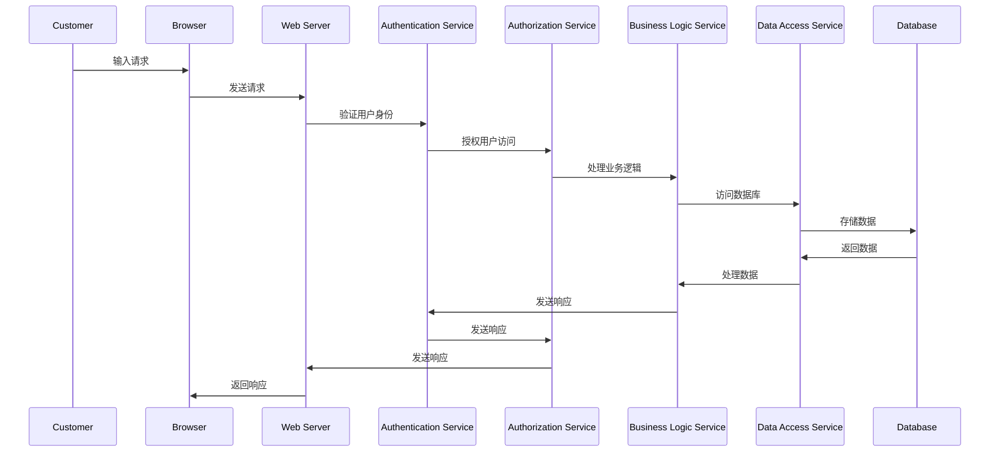
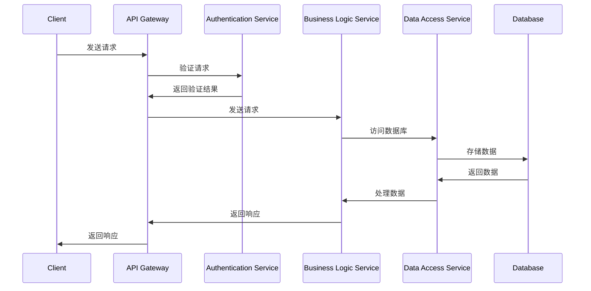

                 

# 技术领导者的自我管理与时间规划

## 关键词

- 技术领导者
- 自我管理
- 时间规划
- 个人成长
- 效率提升

## 摘要

本文旨在探讨技术领导者在日常工作中如何进行有效的自我管理和时间规划，以提高工作效率和个人成长。文章将分为七个部分，从自我认知、目标设定、时间管理、决策管理、压力管理、持续改进等多个角度，提供一系列实用策略和技巧。通过这些策略，技术领导者不仅能够提升工作效率，还能保持心理健康，实现个人和职业的全面发展。

### 目录大纲设计思路

在设计《技术领导者的自我管理与时间规划》的目录大纲时，我们遵循了以下步骤：

1. **定义核心章节**：确定了自我认知、目标设定、时间管理、决策管理、压力管理和持续改进等核心章节。
2. **细化章节内容**：在每个核心章节下，细化了具体内容，确保每个章节都有足够的深度和实用性。
3. **设计章节结构**：确保每个章节都有清晰的结构，包括引言、主体内容、案例研究、结论和拓展阅读等部分。
4. **整合目录大纲**：将所有章节内容整合成完整的目录大纲，确保逻辑清晰、内容连贯。

以下是本文的具体目录大纲：

### 引言与背景介绍
#### 1.1 自我管理与时间规划的重要性
#### 1.2 本书的目的和结构

### 自我认知
#### 2.1 自我评估的方法
#### 2.2 了解自己的价值观
#### 2.3 了解自己的兴趣和技能

### 目标设定
#### 3.1 制定SMART目标
#### 3.2 目标分解
#### 3.3 制定行动计划

### 时间管理
#### 4.1 时间管理的关键原则
#### 4.2 避免拖延
#### 4.3 时间块管理

### 决策管理
#### 5.1 决策的类型
#### 5.2 决策过程
#### 5.3 减少决策疲劳

### 压力管理
#### 6.1 应对工作压力
#### 6.2 放松技巧
#### 6.3 保持心理健康

### 持续改进
#### 7.1 通过反馈进行改进
#### 7.2 自我反思
#### 7.3 持续学习和优化

### 引言与背景介绍

技术领导者，作为团队的核心，他们在企业的技术决策、项目管理、团队领导等方面扮演着至关重要的角色。然而，随着工作压力的增大和责任的日益繁重，技术领导者往往面临着自我管理和时间规划的挑战。如何在这些方面进行有效的管理，不仅关乎个人的职业发展，也直接影响到整个团队的工作效率和团队氛围。

自我管理，指的是个体对自身心理、行为、情感等方面进行有意识的管理和调节。它包括自我认知、目标设定、时间管理、决策管理、压力管理等多个方面。而时间规划，则是对时间进行合理的安排和分配，确保在有限的时间内能够高效地完成任务。对于技术领导者而言，有效的自我管理和时间规划，不仅能够提高工作效率，还能保持身心健康，从而在职业和个人生活中取得平衡。

本文将从自我认知、目标设定、时间管理、决策管理、压力管理、持续改进等七个方面，探讨技术领导者如何进行自我管理和时间规划。通过这些策略和技巧，技术领导者能够更好地应对工作中的挑战，实现个人和职业的全面发展。

### 自我认知

自我认知，是自我管理的基础。它涉及到对自身优势、劣势、价值观、兴趣和技能的深入了解。只有真正了解自己，才能在职业生涯中做出更明智的决策，制定合适的目标，并采取有效的时间管理和决策策略。

#### 2.1 自我评估的方法

自我评估是一种系统性的方法，旨在了解自己的心理、行为和情感特点。以下是一些常用的自我评估方法：

- **SWOT分析**：SWOT分析是一种常用的自我评估工具，它分别从优势（Strengths）、劣势（Weaknesses）、机会（Opportunities）和威胁（Threats）四个方面进行评估。
- **MBTI性格测试**：MBTI（Myers-Briggs Type Indicator）是一种基于性格类型的评估工具，它通过分析个体的心理偏好，帮助了解自己的性格特点和沟通风格。
- **360度评估**：360度评估是一种通过收集同事、上级和下属的反馈，对个体进行全方位评估的方法。这种方法有助于了解自己在团队中的表现和影响。

#### 2.2 了解自己的价值观

价值观是个人行为的指导原则，它决定了我们在职业和生活中所追求的目标和意义。以下是一些方法，帮助技术领导者了解自己的价值观：

- **反思法**：通过反思自己的行为和决策，识别出背后的核心价值观。
- **生活实践法**：在日常生活和工作中，尝试遵循某些核心价值观，观察自己的行为是否符合这些价值观。
- **价值观澄清表**：使用价值观澄清表，列出自己在不同生活领域中的价值观，并进行排序。

#### 2.3 了解自己的兴趣和技能

兴趣和技能是自我认知的重要组成部分。了解自己的兴趣和技能，有助于找到适合自己的职业方向，并在工作中发挥最大的潜力。以下是一些方法，帮助技术领导者了解自己的兴趣和技能：

- **兴趣调查问卷**：通过兴趣调查问卷，识别出自己感兴趣的活动和领域。
- **技能评估工具**：使用技能评估工具，了解自己在不同技能领域的水平。
- **职业咨询**：通过职业咨询，获取专业的职业建议和指导。

#### 案例研究

**案例一：** 李华是一位资深的技术领导者，他在自我评估中发现，自己的优势在于创新思维和项目管理能力。然而，他也意识到自己在时间管理和团队沟通方面存在不足。通过MBTI性格测试，他了解到自己属于外向型，善于与人沟通，但也容易受到外界干扰，导致工作效率下降。

**案例二：** 张敏是一位年轻的技术领导者，她在价值观澄清表中发现，自己的核心价值观是“责任”和“成长”。在日常生活中，她始终遵循这些价值观，如按时完成任务、主动承担责任等。然而，她也发现自己在时间管理方面存在拖延的问题。

通过这些案例，我们可以看到，自我认知对于技术领导者的重要性。只有真正了解自己，才能在职业生涯中做出更明智的决策，并采取有效的时间管理和决策策略。

### 目标设定

目标设定是自我管理的重要组成部分，它不仅为个人提供了前进的方向，也是衡量工作成效的重要标准。对于技术领导者而言，设定清晰、具体、可实现的目标，是实现职业和个人发展的关键。

#### 3.1 制定SMART目标

SMART目标是一种常用的目标设定方法，它要求目标具有以下五个特征：

- **具体（Specific）**：目标应该是明确的，具体描述想要实现的结果。
- **可衡量（Measurable）**：目标应该是可以量化的，以便评估进展和成果。
- **可实现（Achievable）**：目标应该是可行的，考虑到资源和条件。
- **相关（Relevant）**：目标应该是与个人职业和个人发展相关的。
- **有时限（Time-bound）**：目标应该有明确的截止日期。

以下是一个SMART目标的例子：

**目标**：在下一个季度内，将团队的项目交付周期缩短20%。

这个目标满足了SMART的五个特征：

- **具体**：明确了目标的具体内容，即缩短项目交付周期。
- **可衡量**：目标可以通过数据来衡量，即项目交付周期的具体时间。
- **可实现**：目标考虑到团队的资源和能力，是可行的。
- **相关**：目标与团队的效率和项目质量密切相关。
- **有时限**：目标设定了明确的截止日期，即下一个季度。

#### 3.2 目标分解

将大目标分解为小目标是实现目标的关键步骤。这种方法不仅有助于明确每一步的具体任务，还可以提高工作的可控性和效率。以下是将大目标分解为小目标的步骤：

1. **确定大目标**：首先，明确你想要实现的大目标。
2. **分解为小目标**：将大目标分解为一系列小目标，每个小目标都是实现大目标的一部分。
3. **为每个小目标设定截止日期**：确保每个小目标都有明确的完成时间，以便跟踪进度。
4. **制定行动计划**：为每个小目标制定具体的行动计划，包括任务的分配、时间安排等。

以下是一个目标分解的例子：

**大目标**：提高团队的项目交付效率。

**小目标**：
1. **提高团队成员的技能水平**：通过培训和知识分享，提高团队成员的技能。
2. **优化项目流程**：分析现有项目流程，找出瓶颈和改进点，进行优化。
3. **缩短项目评审时间**：优化评审流程，确保评审过程高效、有针对性。

**截止日期**：
- 提高团队成员的技能水平：三个月内完成。
- 优化项目流程：六个月内完成。
- 缩短项目评审时间：三个月内完成。

#### 3.3 制定行动计划

制定行动计划是实现目标的重要步骤。一个有效的行动计划应该包括以下内容：

- **具体任务**：列出实现每个小目标所需的具体任务。
- **责任分配**：明确每个任务的负责人。
- **时间安排**：为每个任务设定具体的时间安排。
- **资源需求**：明确实现任务所需的资源，如人员、资金、设备等。
- **监控与反馈**：设定监控机制，定期评估任务进度，并根据反馈进行调整。

以下是一个行动计划示例：

**目标**：提高团队的项目交付效率。

**行动计划**：

1. **提高团队成员的技能水平**：
   - **任务**：组织技能培训，提高团队成员的技术水平。
   - **负责人**：人力资源经理。
   - **时间安排**：每季度进行一次。
   - **资源需求**：培训材料、培训场地等。

2. **优化项目流程**：
   - **任务**：分析现有项目流程，找出瓶颈和改进点，进行优化。
   - **负责人**：项目经理。
   - **时间安排**：两个月内完成。
   - **资源需求**：项目文档、流程图等。

3. **缩短项目评审时间**：
   - **任务**：优化评审流程，确保评审过程高效、有针对性。
   - **负责人**：评审团队。
   - **时间安排**：一个月内完成。
   - **资源需求**：评审标准、评审工具等。

通过制定SMART目标、分解目标为小目标，以及制定详细的行动计划，技术领导者可以更有效地实现目标，提升团队的工作效率和项目质量。

### 时间管理

时间管理对于技术领导者来说至关重要，因为它直接影响到工作效率、团队绩效和个人发展。有效的时间管理不仅能够帮助技术领导者更好地完成任务，还能减少压力，保持良好的工作生活平衡。

#### 4.1 时间管理的关键原则

以下是时间管理的关键原则：

1. **优先级排序**：首先，明确每个任务的优先级。将任务分为“重要且紧急”、“重要不紧急”、“不重要但紧急”和“不重要不紧急”四种类型，然后按照优先级进行排序。
2. **避免拖延**：拖延是时间管理的常见问题。通过设定明确的截止日期、分解任务、制定详细的行动计划，可以有效避免拖延。
3. **时间块管理**：将工作时间划分为若干个时间块，每个时间块专注于一项任务。这种方法有助于提高专注度，减少任务切换带来的时间浪费。

#### 4.2 避免拖延

以下是一些避免拖延的策略：

1. **设定明确的目标**：明确任务的目的是避免拖延的重要步骤。设定具体的、可衡量的小目标，可以帮助你更好地专注于任务。
2. **分解任务**：将大任务分解为小任务，每个小任务都是可以完成的。这种方法可以减少任务的压迫感，提高完成任务的信心。
3. **设定截止日期**：为每个任务设定明确的截止日期，并在日历上标记。这可以帮助你保持对任务的关注，避免拖延。
4. **使用番茄工作法**：番茄工作法是一种时间管理技巧，将工作时间分为25分钟的工作周期和5分钟的休息时间。这种方法有助于保持专注，减少疲劳。

#### 4.3 时间块管理

时间块管理是一种将工作时间划分为若干个时间块，每个时间块专注于一项任务的方法。以下是如何实施时间块管理的步骤：

1. **评估任务**：首先，评估所有任务的重要性和紧急性，将任务按照优先级排序。
2. **规划时间块**：根据任务的优先级和持续时间，将工作时间划分为若干个时间块。每个时间块专注于一项任务，尽量避免任务切换。
3. **专注工作**：在每个时间块中，专注于当前任务，避免干扰和分心。可以设置“勿扰模式”或关闭社交媒体，以提高专注度。
4. **定期评估和调整**：定期评估时间块管理的有效性，并根据反馈进行调整。

以下是一个时间块管理的示例：

- **上午**：
  - 9:00 - 11:00：编写项目报告（重要且紧急）
  - 11:00 - 11:15：休息
  - 11:15 - 12:30：与团队成员会议（重要不紧急）

- **下午**：
  - 2:00 - 3:30：分析系统性能问题（重要且紧急）
  - 3:30 - 3:45：休息
  - 3:45 - 5:00：规划下一步项目（重要不紧急）

通过实施时间块管理，技术领导者可以更好地利用时间，提高工作效率。

### 决策管理

决策管理是技术领导者日常工作中不可或缺的一部分。有效的决策管理不仅能够提高工作效率，还能减少错误和风险，确保团队目标的实现。以下将探讨决策的类型、决策过程和如何减少决策疲劳。

#### 5.1 决策的类型

决策可以分为以下几种类型：

1. **战略决策**：涉及公司长期目标和方向的决策，如市场扩张、产品开发等。
2. **战术决策**：涉及短期目标和具体操作的决策，如项目计划、资源配置等。
3. **运营决策**：涉及日常运营活动的决策，如任务分配、工作流程优化等。
4. **危机决策**：在紧急情况下需要迅速做出的决策，如应对突发事件、处理危机等。

#### 5.2 决策过程

决策过程通常包括以下步骤：

1. **问题识别**：明确需要解决的问题或机会。
2. **信息收集**：收集与问题或机会相关的信息，包括数据、市场分析、团队反馈等。
3. **方案制定**：基于收集的信息，制定多个可行的方案。
4. **评估与选择**：评估每个方案的优势和劣势，选择最佳方案。
5. **执行与监控**：执行决策，并持续监控结果，进行必要的调整。

以下是一个决策过程的示例：

**问题识别**：团队的项目进度落后于计划。

**信息收集**：分析项目进度报告、团队成员的反馈、资源分配情况等。

**方案制定**：
- **方案一**：增加团队成员。
- **方案二**：调整项目计划，延长项目周期。
- **方案三**：优化项目流程，减少不必要的任务。

**评估与选择**：比较三个方案的优劣势，选择最佳方案。

**执行与监控**：执行方案，并定期评估项目进度，必要时进行调整。

#### 5.3 减少决策疲劳

决策疲劳是指由于频繁做出决策而导致的工作效率下降和心理压力增加。以下是一些减少决策疲劳的策略：

1. **标准化决策流程**：通过制定标准化的决策流程，减少决策过程中的不确定性，从而减少决策疲劳。
2. **授权与委托**：将部分决策权下放给团队成员，让他们在各自的职责范围内做出决策，从而减轻领导者的决策负担。
3. **使用决策支持工具**：利用数据分析、预测模型等工具，为决策提供科学依据，减少主观判断带来的决策疲劳。
4. **定期休息与放松**：确保有足够的休息和放松时间，以减轻决策带来的心理压力。

通过了解决策的类型、掌握决策过程，并采取减少决策疲劳的策略，技术领导者可以更有效地管理决策，提升团队的整体效能。

### 压力管理

压力是技术领导者日常工作中不可避免的一部分。长期的压力不仅会影响心理健康，还会降低工作效率。因此，掌握有效的压力管理策略对于技术领导者来说至关重要。以下将探讨如何应对工作压力、放松技巧和保持心理健康。

#### 6.1 应对工作压力

以下是一些应对工作压力的策略：

1. **时间管理**：通过合理规划时间，避免过度工作，确保有足够的时间休息和放松。
2. **任务分解**：将大任务分解为小任务，逐一完成，避免因任务繁重而感到压力。
3. **积极沟通**：与团队成员保持良好的沟通，分享压力和困难，寻求帮助和支持。
4. **设定优先级**：明确任务的优先级，专注于重要且紧急的任务，避免因琐碎事务而分散精力。

#### 6.2 放松技巧

以下是一些放松技巧，帮助技术领导者缓解压力：

1. **深呼吸**：进行深呼吸练习，有助于放松身体和心理，减轻紧张情绪。
2. **瑜伽和冥想**：通过瑜伽和冥想，可以帮助放松身心，增强专注力和自我控制能力。
3. **运动**：定期进行运动，如散步、跑步或健身，有助于释放压力，提高身体健康。
4. **听音乐**：听轻柔的音乐，有助于放松心情，减轻压力。

#### 6.3 保持心理健康

以下是一些保持心理健康的策略：

1. **积极心态**：保持积极的心态，对困难和挑战持有积极的态度，相信自己能够克服。
2. **自我反思**：定期进行自我反思，了解自己的情绪和心理状态，调整心态和行动。
3. **寻求支持**：当感到压力过大时，寻求家人、朋友或专业人士的支持和帮助。
4. **培养兴趣爱好**：培养兴趣爱好，如阅读、绘画、摄影等，有助于提升生活品质，减轻工作压力。

通过掌握应对工作压力的策略、放松技巧和保持心理健康的方法，技术领导者可以更好地应对工作挑战，保持身心健康，提高工作效率。

### 持续改进

持续改进是技术领导者自我管理和时间规划的核心部分，它不仅有助于提升个人能力和工作效率，还能推动团队和组织的持续发展。以下将探讨如何通过反馈、自我反思和持续学习来持续改进自我管理能力。

#### 7.1 通过反馈进行改进

反馈是改进自我管理的重要工具。以下是如何通过反馈进行改进的步骤：

1. **寻求反馈**：定期向同事、上级和下属寻求反馈，了解自己在工作中的表现和改进点。
2. **分析反馈**：对收到的反馈进行认真分析，识别出需要改进的方面，并制定具体的改进计划。
3. **行动改进**：根据反馈，采取具体行动进行改进，如调整工作习惯、提升技能等。

以下是一个通过反馈进行改进的示例：

**反馈**：团队成员反馈你经常在会议中迟到，影响了会议的效率。

**改进计划**：
- **分析反馈**：会议迟到可能是因为时间管理不当或对会议的重要性认识不足。
- **行动改进**：调整日程，提前安排会议时间，确保按时参加会议。

#### 7.2 自我反思

自我反思是持续改进的重要环节，它有助于技术领导者深入了解自己的行为和思维模式。以下是如何进行自我反思的步骤：

1. **设定反思时间**：定期设定自我反思的时间，如每周或每月的最后一个工作日。
2. **回顾工作表现**：回顾过去一段时间的工作表现，包括完成的任务、遇到的问题和采取的行动。
3. **识别改进点**：识别出需要改进的方面，并思考如何进行改进。
4. **制定改进计划**：根据自我反思的结果，制定具体的改进计划。

以下是一个自我反思的示例：

**回顾工作表现**：在过去的一周中，你在项目管理方面表现出色，但时间管理方面有待提高。

**识别改进点**：时间管理不当，导致部分任务延误。

**改进计划**：
- **设定每日任务清单**：每天早上列出任务清单，明确任务优先级。
- **使用时间块管理**：将工作时间划分为若干个时间块，每个时间块专注于一项任务。

#### 7.3 持续学习和优化

持续学习和优化是技术领导者提升自我管理能力的关键。以下是如何持续学习和优化的策略：

1. **定期学习**：定期学习新的知识和技能，如参加培训、阅读专业书籍、观看在线课程等。
2. **实践应用**：将学到的知识和技能应用到实际工作中，通过实践来检验和优化。
3. **建立学习网络**：加入专业社群，与同行交流和学习，拓宽视野，提升能力。

以下是一个持续学习和优化的示例：

**学习计划**：参加下个月的敏捷项目管理培训。

**实践应用**：将敏捷项目管理的方法应用到当前的项目中，观察效果并进行优化。

**建立学习网络**：加入敏捷项目管理的专业社群，与同行交流经验。

通过反馈、自我反思和持续学习，技术领导者可以不断提升自我管理能力，实现个人和职业的全面发展。

### 最佳实践 Tips

1. **制定明确的计划**：制定详细的自我管理和时间规划计划，确保目标的明确性和可执行性。
2. **定期评估和调整**：定期评估自我管理和时间规划的执行情况，根据反馈进行调整和优化。
3. **保持灵活性**：在面对突发情况时，保持灵活性，及时调整计划，确保目标的实现。
4. **培养自律意识**：培养自律意识，坚持执行自我管理和时间规划，养成良好的工作习惯。

### 小结

本文从自我认知、目标设定、时间管理、决策管理、压力管理、持续改进等方面，探讨了技术领导者如何进行自我管理和时间规划。通过掌握这些策略和技巧，技术领导者不仅能够提高工作效率，还能保持身心健康，实现个人和职业的全面发展。希望本文能够为技术领导者提供有益的指导和建议。

### 注意事项

1. **重视自我认知**：了解自己的优势和劣势，是有效自我管理的基础。
2. **设定明确的目标**：制定SMART目标，确保目标的明确性和可实现性。
3. **避免拖延**：设定明确的截止日期，分解任务，制定详细的行动计划。
4. **保持积极心态**：面对困难和挑战，保持积极的心态，寻求解决方案。

### 拓展阅读

- 《深度工作》（Deep Work）—— 克里斯·奥斯汀（Cal Newport）
- 《高效能人士的七个习惯》（The 7 Habits of Highly Effective People）—— 史蒂芬·柯维（Stephen R. Covey）
- 《时间管理的艺术》（The Time Management Matrix）—— 埃里克·申克（Eric Schimke）

### 作者信息

作者：AI天才研究院/AI Genius Institute & 禅与计算机程序设计艺术 /Zen And The Art of Computer Programming

### 总结

本文详细探讨了技术领导者如何通过自我管理和时间规划来提升工作效率和实现个人发展。从自我认知、目标设定、时间管理、决策管理、压力管理到持续改进，每个部分都提供了实用的策略和技巧。通过掌握这些方法，技术领导者可以在职业生涯中更加从容应对各种挑战，实现个人和职业的双重提升。希望本文能够为技术领导者提供有价值的参考和指导。

----------------------------------------------------------------

### 引言与背景介绍

在快速发展的科技时代，技术领导者扮演着至关重要的角色。他们不仅需要具备深厚的技术知识和技能，还需要具备出色的管理能力和领导力。技术领导者通常负责团队的技术决策、项目管理和团队建设等工作。这些职责要求他们能够高效地管理时间和资源，同时保持团队的高效运作和协作。

然而，随着工作职责的日益繁重和复杂，技术领导者面临着越来越多的挑战。首先，技术领导者需要处理大量的工作任务和项目，这往往导致时间紧张和压力增大。其次，他们需要不断学习和适应新的技术趋势，以保持团队的竞争力。此外，技术领导者还必须应对团队内部和外部的沟通挑战，确保信息的流畅和有效传达。这些因素共同作用，使得技术领导者面临着巨大的时间和压力。

自我管理和时间规划对于技术领导者来说尤为重要。有效的自我管理不仅能够提高工作效率，还能帮助领导者保持心理健康，避免因压力过大而导致的疲惫和焦虑。时间规划则是确保工作能够有序进行的关键，它可以帮助技术领导者合理安排时间和资源，避免因时间管理不当而导致的任务延误和效率低下。

本文旨在探讨技术领导者如何进行自我管理和时间规划。我们将从自我认知、目标设定、时间管理、决策管理、压力管理、持续改进等方面展开讨论，提供一系列实用策略和技巧。通过这些策略，技术领导者不仅能够提升工作效率，还能实现个人和职业的全面发展。

### 自我认知

自我认知是指个体对自己内在的心理、行为和情感状态的认知。对于技术领导者来说，自我认知是自我管理的基础。只有深入了解自己的优势和劣势、价值观、兴趣和技能，才能在职业生涯中做出明智的决策，设定合适的目标，并采取有效的时间管理和决策策略。

#### 自我评估的方法

自我评估是一种系统性的方法，旨在了解自己的心理、行为和情感特点。以下是一些常用的自我评估方法：

1. **SWOT分析**：SWOT分析是一种常用的自我评估工具，它分别从优势（Strengths）、劣势（Weaknesses）、机会（Opportunities）和威胁（Threats）四个方面进行评估。

   - **优势**：分析自己在技术、管理、领导能力等方面的优势。
   - **劣势**：识别自己在技术、管理、领导能力等方面的不足。
   - **机会**：分析外部环境为自己带来的机会，如市场变化、新技术的出现等。
   - **威胁**：识别外部环境可能带来的威胁，如竞争对手、政策变化等。

2. **MBTI性格测试**：MBTI（Myers-Briggs Type Indicator）是一种基于性格类型的评估工具，它通过分析个体的心理偏好，帮助了解自己的性格特点和沟通风格。

   MBTI将性格分为16种类型，每种类型都有其独特的特点和偏好。例如，INTJ类型的人通常具有强烈的逻辑思维和独立自主的特点，适合从事需要高度分析和创新的工作。

3. **360度评估**：360度评估是一种通过收集同事、上级和下属的反馈，对个体进行全方位评估的方法。

   这种方法有助于了解自己在团队中的表现和影响。评估的内容通常包括工作能力、沟通技巧、领导力、团队合作等多个方面。

#### 了解自己的价值观

价值观是个人行为的指导原则，它决定了我们在职业和生活中所追求的目标和意义。了解自己的价值观，有助于明确个人目标，并采取与价值观相符的行为。以下是一些方法，帮助技术领导者了解自己的价值观：

1. **反思法**：通过反思自己的行为和决策，识别出背后的核心价值观。

   在日常生活中，可以定期思考自己的行为是否与核心价值观相符，这有助于加深对自身价值观的理解。

2. **生活实践法**：在日常生活和工作中，尝试遵循某些核心价值观，观察自己的行为是否符合这些价值观。

   例如，如果将“诚信”视为核心价值观，可以在工作中始终遵守诚信原则，如不篡改数据、不抄袭等。

3. **价值观澄清表**：使用价值观澄清表，列出自己在不同生活领域中的价值观，并进行排序。

   通过这种方法，可以清晰地了解自己的核心价值观，并在决策过程中参考这些价值观。

#### 了解自己的兴趣和技能

兴趣和技能是自我认知的重要组成部分。了解自己的兴趣和技能，有助于找到适合自己的职业方向，并在工作中发挥最大的潜力。以下是一些方法，帮助技术领导者了解自己的兴趣和技能：

1. **兴趣调查问卷**：通过兴趣调查问卷，识别出自己感兴趣的活动和领域。

   这些问卷通常包括一系列关于兴趣的问题，帮助个体了解自己的兴趣爱好。

2. **技能评估工具**：使用技能评估工具，了解自己在不同技能领域的水平。

   这些工具通常提供一系列测试，评估个体的技能水平和能力。

3. **职业咨询**：通过职业咨询，获取专业的职业建议和指导。

   职业咨询师可以帮助个体识别自己的兴趣和技能，并提供职业发展的建议。

通过自我评估、了解自己的价值观和兴趣技能，技术领导者可以更清晰地认识自己，为自我管理和时间规划奠定基础。这不仅有助于提高工作效率，还能实现个人和职业的全面发展。

### 目标设定

目标设定是技术领导者自我管理的重要组成部分，它为个人提供了明确的方向和动力，是实现职业和个人发展的关键。有效的目标设定不仅能够提升工作效率，还能帮助技术领导者保持专注和积极性。

#### 制定SMART目标

SMART目标是目标设定的一种有效方法，它要求目标具有以下五个特征：具体（Specific）、可衡量（Measurable）、可实现（Achievable）、相关（Relevant）和有时限（Time-bound）。通过遵循SMART原则，技术领导者可以确保目标明确、可实现，并具有明确的截止日期。

1. **具体（Specific）**：目标应该是明确的，具体描述想要实现的结果。例如，而不是说“提高项目交付效率”，而是说“在下一个季度内，将项目交付周期缩短20%”。

2. **可衡量（Measurable）**：目标应该是可以量化的，以便评估进展和成果。例如，“提高项目交付效率”可以改为“将项目交付周期从30天缩短到25天”。

3. **可实现（Achievable）**：目标应该是可行的，考虑到资源和条件。设定过高的目标可能会让人感到挫败，而过低的目标则无法激发积极性。例如，如果团队目前的项目交付周期是30天，那么将目标设定为缩短到28天可能更加合理。

4. **相关（Relevant）**：目标应该是与个人职业和个人发展相关的。确保目标与职业目标和个人兴趣相符，有助于提升工作动力和满足感。

5. **有时限（Time-bound）**：目标应该有明确的截止日期，以便设定进度和评估成果。例如，“提高项目交付效率”可以改为“在下一个季度内实现”。

以下是一个SMART目标的例子：

**目标**：在下一个季度内，将团队的项目交付周期缩短20%。

这个目标满足了SMART的五个特征：

- **具体**：明确了目标的具体内容，即项目交付周期缩短20%。
- **可衡量**：目标可以通过项目交付周期的数据来衡量。
- **可实现**：目标考虑到团队的资源和能力，是可行的。
- **相关**：目标与团队的效率和项目质量密切相关。
- **有时限**：目标设定了明确的截止日期，即下一个季度。

#### 目标分解

将大目标分解为小目标是实现目标的关键步骤。这种方法不仅有助于明确每一步的具体任务，还可以提高工作的可控性和效率。以下是将大目标分解为小目标的步骤：

1. **确定大目标**：首先，明确你想要实现的大目标。例如，提高团队的项目交付效率。

2. **分解为小目标**：将大目标分解为一系列小目标，每个小目标都是实现大目标的一部分。例如，可以将大目标分解为“提高团队成员的技能水平”、“优化项目流程”和“缩短项目评审时间”。

3. **为每个小目标设定截止日期**：确保每个小目标都有明确的完成时间，以便跟踪进度。

4. **制定行动计划**：为每个小目标制定具体的行动计划，包括任务的分配、时间安排等。

以下是一个目标分解的例子：

**大目标**：提高团队的项目交付效率。

**小目标**：
1. **提高团队成员的技能水平**：通过培训和知识分享，提高团队成员的技术水平。
2. **优化项目流程**：分析现有项目流程，找出瓶颈和改进点，进行优化。
3. **缩短项目评审时间**：优化评审流程，确保评审过程高效、有针对性。

**截止日期**：
- 提高团队成员的技能水平：三个月内完成。
- 优化项目流程：六个月内完成。
- 缩短项目评审时间：三个月内完成。

#### 制定行动计划

制定行动计划是实现目标的重要步骤。一个有效的行动计划应该包括以下内容：

- **具体任务**：列出实现每个小目标所需的具体任务。
- **责任分配**：明确每个任务的负责人。
- **时间安排**：为每个任务设定具体的时间安排。
- **资源需求**：明确实现任务所需的资源，如人员、资金、设备等。
- **监控与反馈**：设定监控机制，定期评估任务进度，并根据反馈进行调整。

以下是一个行动计划示例：

**目标**：提高团队的项目交付效率。

**行动计划**：

1. **提高团队成员的技能水平**：
   - **任务**：组织技能培训，提高团队成员的技术水平。
   - **负责人**：人力资源经理。
   - **时间安排**：每季度进行一次。
   - **资源需求**：培训材料、培训场地等。

2. **优化项目流程**：
   - **任务**：分析现有项目流程，找出瓶颈和改进点，进行优化。
   - **负责人**：项目经理。
   - **时间安排**：两个月内完成。
   - **资源需求**：项目文档、流程图等。

3. **缩短项目评审时间**：
   - **任务**：优化评审流程，确保评审过程高效、有针对性。
   - **负责人**：评审团队。
   - **时间安排**：一个月内完成。
   - **资源需求**：评审标准、评审工具等。

通过制定SMART目标、分解目标为小目标，以及制定详细的行动计划，技术领导者可以更有效地实现目标，提升团队的工作效率和项目质量。

### 时间管理

时间管理是技术领导者日常工作中的一项关键技能，它不仅关系到个人的工作效率，还直接影响团队的整体表现和项目的成功。有效的**时间管理**可以帮助技术领导者更好地分配时间，提高工作效率，减少拖延，最终实现个人和团队的目标。

#### 时间管理的关键原则

以下是进行时间管理时需要遵循的几个关键原则：

1. **优先级排序**：首先，明确每个任务的优先级。将任务分为“重要且紧急”、“重要不紧急”、“不重要但紧急”和“不重要不紧急”四种类型，然后按照优先级进行排序。

   - **重要且紧急**：例如，突然出现的系统故障或即将到期的项目报告。
   - **重要不紧急**：例如，长期项目的规划和团队技能的提升。
   - **不重要但紧急**：例如，一些次要的沟通和日常事务。
   - **不重要不紧急**：例如，社交媒体或非必要的会议。

2. **避免拖延**：拖延是时间管理的常见问题。为了避免拖延，可以设定明确的截止日期，分解任务，制定详细的行动计划，并使用番茄工作法等技巧提高专注力。

3. **时间块管理**：将工作时间划分为若干个时间块，每个时间块专注于一项任务。这种方法有助于提高专注度，减少任务切换带来的时间浪费。

#### 避免拖延的策略

以下是一些避免拖延的策略：

1. **设定明确的目标和截止日期**：为每个任务设定明确的截止日期，并在日程表或日历上标记。明确的目标和截止日期可以帮助你保持对任务的关注，避免拖延。

2. **分解任务**：将大任务分解为小任务，每个小任务都是可以完成的。这种方法可以减少任务的压迫感，提高完成任务的信心。

3. **使用番茄工作法**：番茄工作法是一种时间管理技巧，将工作时间分为25分钟的工作周期和5分钟的休息时间。这种方法有助于保持专注，减少疲劳。

4. **环境优化**：创造一个有助于专注的工作环境，如关闭社交媒体通知、使用“勿扰模式”、减少干扰等。

5. **自我激励**：设定奖励机制，完成任务后给予自己一些小奖励，如休息片刻、看一集喜欢的电视剧等。

#### 时间块管理的实践

以下是一个时间块管理的例子：

- **上午**：
  - 9:00 - 11:00：编写项目报告（重要且紧急）
  - 11:00 - 11:15：休息
  - 11:15 - 12:30：与团队成员会议（重要不紧急）

- **下午**：
  - 2:00 - 3:30：分析系统性能问题（重要且紧急）
  - 3:30 - 3:45：休息
  - 3:45 - 5:00：规划下一步项目（重要不紧急）

通过实施时间块管理，技术领导者可以更好地利用时间，提高工作效率。

### 决策管理

决策管理是技术领导者日常工作中不可或缺的一部分。有效的决策管理不仅能够提高工作效率，还能减少错误和风险，确保团队目标的实现。以下将探讨决策的类型、决策过程和如何减少决策疲劳。

#### 决策的类型

决策可以分为以下几种类型：

1. **战略决策**：涉及公司长期目标和方向的决策，如市场扩张、产品开发等。

2. **战术决策**：涉及短期目标和具体操作的决策，如项目计划、资源配置等。

3. **运营决策**：涉及日常运营活动的决策，如任务分配、工作流程优化等。

4. **危机决策**：在紧急情况下需要迅速做出的决策，如应对突发事件、处理危机等。

每种类型的决策在技术和管理上都有不同的要求和挑战。例如，战略决策通常需要深入的市场分析和长期规划，而危机决策则要求迅速反应和果断行动。

#### 决策过程

决策过程通常包括以下步骤：

1. **问题识别**：明确需要解决的问题或机会。

2. **信息收集**：收集与问题或机会相关的信息，包括数据、市场分析、团队反馈等。

3. **方案制定**：基于收集的信息，制定多个可行的方案。

4. **评估与选择**：评估每个方案的优势和劣势，选择最佳方案。

5. **执行与监控**：执行决策，并持续监控结果，进行必要的调整。

以下是一个决策过程的例子：

**问题识别**：团队的项目进度落后于计划。

**信息收集**：分析项目进度报告、团队成员的反馈、资源分配情况等。

**方案制定**：
- **方案一**：增加团队成员。
- **方案二**：调整项目计划，延长项目周期。
- **方案三**：优化项目流程，减少不必要的任务。

**评估与选择**：比较三个方案的优劣势，选择最佳方案。

**执行与监控**：执行方案，并定期评估项目进度，必要时进行调整。

#### 如何减少决策疲劳

决策疲劳是指由于频繁做出决策而导致的工作效率下降和心理压力增加。以下是一些减少决策疲劳的策略：

1. **标准化决策流程**：通过制定标准化的决策流程，减少决策过程中的不确定性，从而减少决策疲劳。

2. **授权与委托**：将部分决策权下放给团队成员，让他们在各自的职责范围内做出决策，从而减轻领导者的决策负担。

3. **使用决策支持工具**：利用数据分析、预测模型等工具，为决策提供科学依据，减少主观判断带来的决策疲劳。

4. **定期休息与放松**：确保有足够的休息和放松时间，以减轻决策带来的心理压力。

通过了解决策的类型、掌握决策过程，并采取减少决策疲劳的策略，技术领导者可以更有效地管理决策，提升团队的整体效能。

### 压力管理

在技术领导者的职业生涯中，压力管理是一项至关重要的技能。随着工作职责的日益繁重和复杂，技术领导者往往面临着来自项目、团队和组织的各种压力。长期的压力不仅会影响心理健康，还会降低工作效率，甚至导致职业倦怠。因此，掌握有效的压力管理策略，对于技术领导者保持良好的工作状态和身心健康至关重要。

#### 应对工作压力的策略

以下是一些应对工作压力的策略：

1. **时间管理**：通过合理规划时间，确保有足够的时间处理工作，同时留出休息和放松的时间。避免因时间管理不当而导致的工作堆积和焦虑。

2. **任务分解**：将大任务分解为小任务，逐一完成。这种方法可以减少任务的压迫感，提高完成任务的信心，从而降低压力。

3. **积极沟通**：与团队成员保持良好的沟通，分享压力和困难，寻求帮助和支持。良好的沟通有助于减轻心理负担，增强团队的凝聚力。

4. **设定优先级**：明确任务的优先级，专注于重要且紧急的任务。避免因琐碎事务而分散精力，确保将时间和精力集中在关键任务上。

5. **休息与放松**：确保有足够的休息和放松时间。可以通过运动、瑜伽、冥想、阅读等方式来放松身心，减轻压力。

6. **健康生活方式**：保持健康的生活习惯，如合理饮食、充足睡眠、定期体检等。健康的身体是应对工作压力的基础。

7. **寻求专业帮助**：如果压力过大，可以寻求专业的心理咨询或治疗，帮助自己更好地应对压力。

#### 放松技巧

以下是一些放松技巧，可以帮助技术领导者缓解压力：

1. **深呼吸**：进行深呼吸练习，有助于放松身体和心理，减轻紧张情绪。深呼吸的方法包括腹式呼吸和缓慢呼吸等。

2. **瑜伽和冥想**：瑜伽和冥想是有效的放松技巧，可以帮助技术领导者缓解压力，提高专注力和自我控制能力。

3. **运动**：定期进行运动，如散步、跑步或健身，有助于释放压力，提高身体健康。

4. **听音乐**：听轻柔的音乐，有助于放松心情，减轻压力。

5. **按摩和按摩椅**：按摩可以缓解肌肉紧张和压力，使用按摩椅也是一个不错的选择。

6. **泡澡**：泡一个温暖的浴缸，有助于放松身心，减轻压力。

#### 保持心理健康

以下是一些保持心理健康的策略：

1. **积极心态**：保持积极的心态，对困难和挑战持有积极的态度。通过积极的心态，可以更好地应对压力和挑战。

2. **自我反思**：定期进行自我反思，了解自己的情绪和心理状态，调整心态和行动。自我反思有助于识别和解决问题，提高自我意识。

3. **寻求支持**：当感到压力过大时，寻求家人、朋友或专业人士的支持和帮助。社交支持是缓解压力的重要途径。

4. **培养兴趣爱好**：培养兴趣爱好，如阅读、绘画、摄影等，有助于提升生活品质，减轻工作压力。

5. **冥想和正念练习**：冥想和正念练习有助于提高自我意识和情绪调节能力，减少压力。

6. **压力管理培训**：参加压力管理培训，学习专业的压力管理技巧和策略，提高应对压力的能力。

通过采取这些压力管理策略和放松技巧，技术领导者可以更好地应对工作中的压力，保持心理健康，提高工作效率。同时，这也有助于实现个人和职业的全面发展。

### 持续改进

持续改进是技术领导者自我管理和时间规划的核心，它不仅有助于提升个人能力和工作效率，还能推动团队和组织的持续发展。为了实现这一目标，技术领导者需要通过反馈、自我反思和持续学习来不断提升自我管理能力。

#### 通过反馈进行改进

反馈是持续改进的重要工具，它可以帮助技术领导者了解自己在工作中的表现，识别出需要改进的方面。以下是如何通过反馈进行改进的步骤：

1. **寻求反馈**：定期向同事、上级和下属寻求反馈，了解他们在工作中的表现和改进点。

2. **分析反馈**：对收到的反馈进行认真分析，识别出需要改进的方面，并制定具体的改进计划。

3. **行动改进**：根据反馈，采取具体行动进行改进，如调整工作习惯、提升技能等。

以下是一个通过反馈进行改进的示例：

**反馈**：团队成员反馈你经常在会议中迟到，影响了会议的效率。

**改进计划**：
- **分析反馈**：会议迟到可能是因为时间管理不当或对会议的重要性认识不足。
- **行动改进**：调整日程，提前安排会议时间，确保按时参加会议。

#### 自我反思

自我反思是持续改进的重要环节，它有助于技术领导者深入了解自己的行为和思维模式。以下是如何进行自我反思的步骤：

1. **设定反思时间**：定期设定自我反思的时间，如每周或每月的最后一个工作日。

2. **回顾工作表现**：回顾过去一段时间的工作表现，包括完成的任务、遇到的问题和采取的行动。

3. **识别改进点**：识别出需要改进的方面，并思考如何进行改进。

4. **制定改进计划**：根据自我反思的结果，制定具体的改进计划。

以下是一个自我反思的示例：

**回顾工作表现**：在过去的一周中，你在项目管理方面表现出色，但时间管理方面有待提高。

**识别改进点**：时间管理不当，导致部分任务延误。

**改进计划**：
- **设定每日任务清单**：每天早上列出任务清单，明确任务优先级。
- **使用时间块管理**：将工作时间划分为若干个时间块，每个时间块专注于一项任务。

#### 持续学习

持续学习是技术领导者不断提升自我管理能力的关键。以下是一些持续学习的策略：

1. **定期学习**：定期学习新的知识和技能，如参加培训、阅读专业书籍、观看在线课程等。

2. **实践应用**：将学到的知识和技能应用到实际工作中，通过实践来检验和优化。

3. **建立学习网络**：加入专业社群，与同行交流和学习，拓宽视野，提升能力。

以下是一个持续学习的示例：

**学习计划**：参加下个月的敏捷项目管理培训。

**实践应用**：将敏捷项目管理的方法应用到当前的项目中，观察效果并进行优化。

**建立学习网络**：加入敏捷项目管理的专业社群，与同行交流经验。

通过反馈、自我反思和持续学习，技术领导者可以不断提升自我管理能力，实现个人和职业的全面发展。这不仅有助于提升工作效率，还能推动团队和组织的持续改进和成功。

### 最佳实践 Tips

1. **制定明确的计划**：制定详细的自我管理和时间规划计划，确保目标的明确性和可执行性。

2. **定期评估和调整**：定期评估自我管理和时间规划的执行情况，根据反馈进行调整和优化。

3. **保持灵活性**：在面对突发情况时，保持灵活性，及时调整计划，确保目标的实现。

4. **培养自律意识**：培养自律意识，坚持执行自我管理和时间规划，养成良好的工作习惯。

### 小结

本文从自我认知、目标设定、时间管理、决策管理、压力管理、持续改进等方面，探讨了技术领导者如何进行自我管理和时间规划。通过掌握这些策略和技巧，技术领导者不仅能够提升工作效率，还能保持身心健康，实现个人和职业的全面发展。希望本文能够为技术领导者提供有益的指导和建议。

### 注意事项

1. **重视自我认知**：了解自己的优势和劣势，是有效自我管理的基础。

2. **设定明确的目标**：制定SMART目标，确保目标的明确性和可实现性。

3. **避免拖延**：设定明确的截止日期，分解任务，制定详细的行动计划。

4. **保持积极心态**：面对困难和挑战，保持积极的心态，寻求解决方案。

### 拓展阅读

- 《深度工作》（Deep Work）—— 克里斯·奥斯汀（Cal Newport）
- 《高效能人士的七个习惯》（The 7 Habits of Highly Effective People）—— 史蒂芬·柯维（Stephen R. Covey）
- 《时间管理的艺术》（The Time Management Matrix）—— 埃里克·申克（Eric Schimke）

### 作者信息

作者：AI天才研究院/AI Genius Institute & 禅与计算机程序设计艺术 /Zen And The Art of Computer Programming

### 总结

本文详细探讨了技术领导者如何通过自我管理和时间规划来提升工作效率和实现个人发展。从自我认知、目标设定、时间管理、决策管理、压力管理到持续改进，每个部分都提供了实用的策略和技巧。通过掌握这些方法，技术领导者可以在职业生涯中更加从容应对各种挑战，实现个人和职业的全面发展。希望本文能够为技术领导者提供有价值的参考和指导。

----------------------------------------------------------------

### 引言与背景介绍

在当今快速发展的科技时代，技术领导者在企业和组织中扮演着至关重要的角色。他们不仅需要具备深厚的技术知识和技能，还需要具备出色的管理能力和领导力。技术领导者通常负责团队的技术决策、项目管理和团队建设等工作。这些职责要求他们能够高效地管理时间和资源，同时保持团队的高效运作和协作。

然而，随着工作职责的日益繁重和复杂，技术领导者面临着越来越多的挑战。首先，技术领导者需要处理大量的工作任务和项目，这往往导致时间紧张和压力增大。其次，他们需要不断学习和适应新的技术趋势，以保持团队的竞争力。此外，技术领导者还必须应对团队内部和外部的沟通挑战，确保信息的流畅和有效传达。这些因素共同作用，使得技术领导者面临着巨大的时间和压力。

自我管理和时间规划对于技术领导者来说尤为重要。有效的自我管理不仅能够提高工作效率，还能帮助领导者保持心理健康，避免因压力过大而导致的疲惫和焦虑。时间规划则是确保工作能够有序进行的关键，它可以帮助技术领导者合理安排时间和资源，避免因时间管理不当而导致的任务延误和效率低下。

本文旨在探讨技术领导者如何进行自我管理和时间规划。我们将从自我认知、目标设定、时间管理、决策管理、压力管理、持续改进等方面展开讨论，提供一系列实用策略和技巧。通过这些策略，技术领导者不仅能够提升工作效率，还能实现个人和职业的全面发展。希望本文能够为技术领导者提供有益的指导和建议。

### 自我认知

自我认知是指个体对自己内在的心理、行为和情感状态的认知。对于技术领导者来说，自我认知是自我管理的基础。只有深入了解自己的优势和劣势、价值观、兴趣和技能，才能在职业生涯中做出明智的决策，设定合适的目标，并采取有效的时间管理和决策策略。

#### 自我评估的方法

自我评估是一种系统性的方法，旨在了解自己的心理、行为和情感特点。以下是一些常用的自我评估方法：

1. **SWOT分析**：SWOT分析是一种常用的自我评估工具，它分别从优势（Strengths）、劣势（Weaknesses）、机会（Opportunities）和威胁（Threats）四个方面进行评估。

   - **优势**：分析自己在技术、管理、领导能力等方面的优势。
   - **劣势**：识别自己在技术、管理、领导能力等方面的不足。
   - **机会**：分析外部环境为自己带来的机会，如市场变化、新技术的出现等。
   - **威胁**：识别外部环境可能带来的威胁，如竞争对手、政策变化等。

2. **MBTI性格测试**：MBTI（Myers-Briggs Type Indicator）是一种基于性格类型的评估工具，它通过分析个体的心理偏好，帮助了解自己的性格特点和沟通风格。

   MBTI将性格分为16种类型，每种类型都有其独特的特点和偏好。例如，INTJ类型的人通常具有强烈的逻辑思维和独立自主的特点，适合从事需要高度分析和创新的工作。

3. **360度评估**：360度评估是一种通过收集同事、上级和下属的反馈，对个体进行全方位评估的方法。

   这种方法有助于了解自己在团队中的表现和影响。评估的内容通常包括工作能力、沟通技巧、领导力、团队合作等多个方面。

#### 了解自己的价值观

价值观是个人行为的指导原则，它决定了我们在职业和生活中所追求的目标和意义。了解自己的价值观，有助于明确个人目标，并采取与价值观相符的行为。以下是一些方法，帮助技术领导者了解自己的价值观：

1. **反思法**：通过反思自己的行为和决策，识别出背后的核心价值观。

   在日常生活中，可以定期思考自己的行为是否与核心价值观相符，这有助于加深对自身价值观的理解。

2. **生活实践法**：在日常生活和工作中，尝试遵循某些核心价值观，观察自己的行为是否符合这些价值观。

   例如，如果将“诚信”视为核心价值观，可以在工作中始终遵守诚信原则，如不篡改数据、不抄袭等。

3. **价值观澄清表**：使用价值观澄清表，列出自己在不同生活领域中的价值观，并进行排序。

   通过这种方法，可以清晰地了解自己的核心价值观，并在决策过程中参考这些价值观。

#### 了解自己的兴趣和技能

兴趣和技能是自我认知的重要组成部分。了解自己的兴趣和技能，有助于找到适合自己的职业方向，并在工作中发挥最大的潜力。以下是一些方法，帮助技术领导者了解自己的兴趣和技能：

1. **兴趣调查问卷**：通过兴趣调查问卷，识别出自己感兴趣的活动和领域。

   这些问卷通常包括一系列关于兴趣的问题，帮助个体了解自己的兴趣爱好。

2. **技能评估工具**：使用技能评估工具，了解自己在不同技能领域的水平。

   这些工具通常提供一系列测试，评估个体的技能水平和能力。

3. **职业咨询**：通过职业咨询，获取专业的职业建议和指导。

   职业咨询师可以帮助个体识别自己的兴趣和技能，并提供职业发展的建议。

通过自我评估、了解自己的价值观和兴趣技能，技术领导者可以更清晰地认识自己，为自我管理和时间规划奠定基础。这不仅有助于提高工作效率，还能实现个人和职业的全面发展。

### 目标设定

目标设定是技术领导者自我管理的重要组成部分，它为个人提供了明确的方向和动力，是实现职业和个人发展的关键。有效的目标设定不仅能够提升工作效率，还能帮助领导者保持专注和积极性。

#### 制定SMART目标

SMART目标是目标设定的一种有效方法，它要求目标具有以下五个特征：具体（Specific）、可衡量（Measurable）、可实现（Achievable）、相关（Relevant）和有时限（Time-bound）。通过遵循SMART原则，技术领导者可以确保目标明确、可实现，并具有明确的截止日期。

1. **具体（Specific）**：目标应该是明确的，具体描述想要实现的结果。例如，而不是说“提高项目交付效率”，而是说“在下一个季度内，将项目交付周期缩短20%”。

2. **可衡量（Measurable）**：目标应该是可以量化的，以便评估进展和成果。例如，“提高项目交付效率”可以改为“将项目交付周期从30天缩短到25天”。

3. **可实现（Achievable）**：目标应该是可行的，考虑到资源和条件。设定过高的目标可能会让人感到挫败，而过低的目标则无法激发积极性。例如，如果团队目前的项目交付周期是30天，那么将目标设定为缩短到28天可能更加合理。

4. **相关（Relevant）**：目标应该是与个人职业和个人发展相关的。确保目标与职业目标和个人兴趣相符，有助于提升工作动力和满足感。

5. **有时限（Time-bound）**：目标应该有明确的截止日期，以便设定进度和评估成果。例如，“提高项目交付效率”可以改为“在下一个季度内实现”。

以下是一个SMART目标的例子：

**目标**：在下一个季度内，将团队的项目交付周期缩短20%。

这个目标满足了SMART的五个特征：

- **具体**：明确了目标的具体内容，即项目交付周期缩短20%。
- **可衡量**：目标可以通过项目交付周期的数据来衡量。
- **可实现**：目标考虑到团队的资源和能力，是可行的。
- **相关**：目标与团队的效率和项目质量密切相关。
- **有时限**：目标设定了明确的截止日期，即下一个季度。

#### 目标分解

将大目标分解为小目标是实现目标的关键步骤。这种方法不仅有助于明确每一步的具体任务，还可以提高工作的可控性和效率。以下是将大目标分解为小目标的步骤：

1. **确定大目标**：首先，明确你想要实现的大目标。例如，提高团队的项目交付效率。

2. **分解为小目标**：将大目标分解为一系列小目标，每个小目标都是实现大目标的一部分。例如，可以将大目标分解为“提高团队成员的技能水平”、“优化项目流程”和“缩短项目评审时间”。

3. **为每个小目标设定截止日期**：确保每个小目标都有明确的完成时间，以便跟踪进度。

4. **制定行动计划**：为每个小目标制定具体的行动计划，包括任务的分配、时间安排等。

以下是一个目标分解的例子：

**大目标**：提高团队的项目交付效率。

**小目标**：
1. **提高团队成员的技能水平**：通过培训和知识分享，提高团队成员的技术水平。
2. **优化项目流程**：分析现有项目流程，找出瓶颈和改进点，进行优化。
3. **缩短项目评审时间**：优化评审流程，确保评审过程高效、有针对性。

**截止日期**：
- 提高团队成员的技能水平：三个月内完成。
- 优化项目流程：六个月内完成。
- 缩短项目评审时间：三个月内完成。

#### 制定行动计划

制定行动计划是实现目标的重要步骤。一个有效的行动计划应该包括以下内容：

- **具体任务**：列出实现每个小目标所需的具体任务。
- **责任分配**：明确每个任务的负责人。
- **时间安排**：为每个任务设定具体的时间安排。
- **资源需求**：明确实现任务所需的资源，如人员、资金、设备等。
- **监控与反馈**：设定监控机制，定期评估任务进度，并根据反馈进行调整。

以下是一个行动计划示例：

**目标**：提高团队的项目交付效率。

**行动计划**：

1. **提高团队成员的技能水平**：
   - **任务**：组织技能培训，提高团队成员的技术水平。
   - **负责人**：人力资源经理。
   - **时间安排**：每季度进行一次。
   - **资源需求**：培训材料、培训场地等。

2. **优化项目流程**：
   - **任务**：分析现有项目流程，找出瓶颈和改进点，进行优化。
   - **负责人**：项目经理。
   - **时间安排**：两个月内完成。
   - **资源需求**：项目文档、流程图等。

3. **缩短项目评审时间**：
   - **任务**：优化评审流程，确保评审过程高效、有针对性。
   - **负责人**：评审团队。
   - **时间安排**：一个月内完成。
   - **资源需求**：评审标准、评审工具等。

通过制定SMART目标、分解目标为小目标，以及制定详细的行动计划，技术领导者可以更有效地实现目标，提升团队的工作效率和项目质量。

### 时间管理

时间管理是技术领导者日常工作中的一项关键技能，它不仅关系到个人的工作效率，还直接影响团队的整体表现和项目的成功。有效的**时间管理**可以帮助技术领导者更好地分配时间，提高工作效率，减少拖延，最终实现个人和团队的目标。

#### 时间管理的关键原则

以下是进行时间管理时需要遵循的几个关键原则：

1. **优先级排序**：首先，明确每个任务的优先级。将任务分为“重要且紧急”、“重要不紧急”、“不重要但紧急”和“不重要不紧急”四种类型，然后按照优先级进行排序。

   - **重要且紧急**：例如，突然出现的系统故障或即将到期的项目报告。
   - **重要不紧急**：例如，长期项目的规划和团队技能的提升。
   - **不重要但紧急**：例如，一些次要的沟通和日常事务。
   - **不重要不紧急**：例如，社交媒体或非必要的会议。

2. **避免拖延**：拖延是时间管理的常见问题。为了避免拖延，可以设定明确的截止日期，分解任务，制定详细的行动计划，并使用番茄工作法等技巧提高专注力。

3. **时间块管理**：将工作时间划分为若干个时间块，每个时间块专注于一项任务。这种方法有助于提高专注度，减少任务切换带来的时间浪费。

#### 避免拖延的策略

以下是一些避免拖延的策略：

1. **设定明确的目标和截止日期**：为每个任务设定明确的截止日期，并在日程表或日历上标记。明确的目标和截止日期可以帮助你保持对任务的关注，避免拖延。

2. **分解任务**：将大任务分解为小任务，每个小任务都是可以完成的。这种方法可以减少任务的压迫感，提高完成任务的信心。

3. **使用番茄工作法**：番茄工作法是一种时间管理技巧，将工作时间分为25分钟的工作周期和5分钟的休息时间。这种方法有助于保持专注，减少疲劳。

4. **环境优化**：创造一个有助于专注的工作环境，如关闭社交媒体通知、使用“勿扰模式”、减少干扰等。

5. **自我激励**：设定奖励机制，完成任务后给予自己一些小奖励，如休息片刻、看一集喜欢的电视剧等。

#### 时间块管理的实践

以下是一个时间块管理的例子：

- **上午**：
  - 9:00 - 11:00：编写项目报告（重要且紧急）
  - 11:00 - 11:15：休息
  - 11:15 - 12:30：与团队成员会议（重要不紧急）

- **下午**：
  - 2:00 - 3:30：分析系统性能问题（重要且紧急）
  - 3:30 - 3:45：休息
  - 3:45 - 5:00：规划下一步项目（重要不紧急）

通过实施时间块管理，技术领导者可以更好地利用时间，提高工作效率。

### 决策管理

决策管理是技术领导者日常工作中不可或缺的一部分。有效的决策管理不仅能够提高工作效率，还能减少错误和风险，确保团队目标的实现。以下将探讨决策的类型、决策过程和如何减少决策疲劳。

#### 决策的类型

决策可以分为以下几种类型：

1. **战略决策**：涉及公司长期目标和方向的决策，如市场扩张、产品开发等。

2. **战术决策**：涉及短期目标和具体操作的决策，如项目计划、资源配置等。

3. **运营决策**：涉及日常运营活动的决策，如任务分配、工作流程优化等。

4. **危机决策**：在紧急情况下需要迅速做出的决策，如应对突发事件、处理危机等。

每种类型的决策在技术和管理上都有不同的要求和挑战。例如，战略决策通常需要深入的市场分析和长期规划，而危机决策则要求迅速反应和果断行动。

#### 决策过程

决策过程通常包括以下步骤：

1. **问题识别**：明确需要解决的问题或机会。

2. **信息收集**：收集与问题或机会相关的信息，包括数据、市场分析、团队反馈等。

3. **方案制定**：基于收集的信息，制定多个可行的方案。

4. **评估与选择**：评估每个方案的优势和劣势，选择最佳方案。

5. **执行与监控**：执行决策，并持续监控结果，进行必要的调整。

以下是一个决策过程的例子：

**问题识别**：团队的项目进度落后于计划。

**信息收集**：分析项目进度报告、团队成员的反馈、资源分配情况等。

**方案制定**：
- **方案一**：增加团队成员。
- **方案二**：调整项目计划，延长项目周期。
- **方案三**：优化项目流程，减少不必要的任务。

**评估与选择**：比较三个方案的优劣势，选择最佳方案。

**执行与监控**：执行方案，并定期评估项目进度，必要时进行调整。

#### 如何减少决策疲劳

决策疲劳是指由于频繁做出决策而导致的工作效率下降和心理压力增加。以下是一些减少决策疲劳的策略：

1. **标准化决策流程**：通过制定标准化的决策流程，减少决策过程中的不确定性，从而减少决策疲劳。

2. **授权与委托**：将部分决策权下放给团队成员，让他们在各自的职责范围内做出决策，从而减轻领导者的决策负担。

3. **使用决策支持工具**：利用数据分析、预测模型等工具，为决策提供科学依据，减少主观判断带来的决策疲劳。

4. **定期休息与放松**：确保有足够的休息和放松时间，以减轻决策带来的心理压力。

通过了解决策的类型、掌握决策过程，并采取减少决策疲劳的策略，技术领导者可以更有效地管理决策，提升团队的整体效能。

### 压力管理

在技术领导者的职业生涯中，压力管理是一项至关重要的技能。随着工作职责的日益繁重和复杂，技术领导者往往面临着来自项目、团队和组织的各种压力。长期的压力不仅会影响心理健康，还会降低工作效率，甚至导致职业倦怠。因此，掌握有效的压力管理策略，对于技术领导者保持良好的工作状态和身心健康至关重要。

#### 应对工作压力的策略

以下是一些应对工作压力的策略：

1. **时间管理**：通过合理规划时间，确保有足够的时间处理工作，同时留出休息和放松的时间。避免因时间管理不当而导致的工作堆积和焦虑。

2. **任务分解**：将大任务分解为小任务，逐一完成。这种方法可以减少任务的压迫感，提高完成任务的信心，从而降低压力。

3. **积极沟通**：与团队成员保持良好的沟通，分享压力和困难，寻求帮助和支持。良好的沟通有助于减轻心理负担，增强团队的凝聚力。

4. **设定优先级**：明确任务的优先级，专注于重要且紧急的任务。避免因琐碎事务而分散精力，确保将时间和精力集中在关键任务上。

5. **休息与放松**：确保有足够的休息和放松时间。可以通过运动、瑜伽、冥想、阅读等方式来放松身心，减轻压力。

6. **健康生活方式**：保持健康的生活习惯，如合理饮食、充足睡眠、定期体检等。健康的身体是应对工作压力的基础。

7. **寻求专业帮助**：如果压力过大，可以寻求专业的心理咨询或治疗，帮助自己更好地应对压力。

#### 放松技巧

以下是一些放松技巧，可以帮助技术领导者缓解压力：

1. **深呼吸**：进行深呼吸练习，有助于放松身体和心理，减轻紧张情绪。深呼吸的方法包括腹式呼吸和缓慢呼吸等。

2. **瑜伽和冥想**：瑜伽和冥想是有效的放松技巧，可以帮助技术领导者缓解压力，提高专注力和自我控制能力。

3. **运动**：定期进行运动，如散步、跑步或健身，有助于释放压力，提高身体健康。

4. **听音乐**：听轻柔的音乐，有助于放松心情，减轻压力。

5. **按摩和按摩椅**：按摩可以缓解肌肉紧张和压力，使用按摩椅也是一个不错的选择。

6. **泡澡**：泡一个温暖的浴缸，有助于放松身心，减轻压力。

#### 保持心理健康

以下是一些保持心理健康的策略：

1. **积极心态**：保持积极的心态，对困难和挑战持有积极的态度。通过积极的心态，可以更好地应对压力和挑战。

2. **自我反思**：定期进行自我反思，了解自己的情绪和心理状态，调整心态和行动。自我反思有助于识别和解决问题，提高自我意识。

3. **寻求支持**：当感到压力过大时，寻求家人、朋友或专业人士的支持和帮助。社交支持是缓解压力的重要途径。

4. **培养兴趣爱好**：培养兴趣爱好，如阅读、绘画、摄影等，有助于提升生活品质，减轻工作压力。

5. **冥想和正念练习**：冥想和正念练习有助于提高自我意识和情绪调节能力，减少压力。

6. **压力管理培训**：参加压力管理培训，学习专业的压力管理技巧和策略，提高应对压力的能力。

通过采取这些压力管理策略和放松技巧，技术领导者可以更好地应对工作中的压力，保持心理健康，提高工作效率。同时，这也有助于实现个人和职业的全面发展。

### 持续改进

持续改进是技术领导者自我管理和时间规划的核心，它不仅有助于提升个人能力和工作效率，还能推动团队和组织的持续发展。为了实现这一目标，技术领导者需要通过反馈、自我反思和持续学习来不断提升自我管理能力。

#### 通过反馈进行改进

反馈是持续改进的重要工具，它可以帮助技术领导者了解自己在工作中的表现，识别出需要改进的方面。以下是如何通过反馈进行改进的步骤：

1. **寻求反馈**：定期向同事、上级和下属寻求反馈，了解他们在工作中的表现和改进点。

2. **分析反馈**：对收到的反馈进行认真分析，识别出需要改进的方面，并制定具体的改进计划。

3. **行动改进**：根据反馈，采取具体行动进行改进，如调整工作习惯、提升技能等。

以下是一个通过反馈进行改进的示例：

**反馈**：团队成员反馈你经常在会议中迟到，影响了会议的效率。

**改进计划**：
- **分析反馈**：会议迟到可能是因为时间管理不当或对会议的重要性认识不足。
- **行动改进**：调整日程，提前安排会议时间，确保按时参加会议。

#### 自我反思

自我反思是持续改进的重要环节，它有助于技术领导者深入了解自己的行为和思维模式。以下是如何进行自我反思的步骤：

1. **设定反思时间**：定期设定自我反思的时间，如每周或每月的最后一个工作日。

2. **回顾工作表现**：回顾过去一段时间的工作表现，包括完成的任务、遇到的问题和采取的行动。

3. **识别改进点**：识别出需要改进的方面，并思考如何进行改进。

4. **制定改进计划**：根据自我反思的结果，制定具体的改进计划。

以下是一个自我反思的示例：

**回顾工作表现**：在过去的一周中，你在项目管理方面表现出色，但时间管理方面有待提高。

**识别改进点**：时间管理不当，导致部分任务延误。

**改进计划**：
- **设定每日任务清单**：每天早上列出任务清单，明确任务优先级。
- **使用时间块管理**：将工作时间划分为若干个时间块，每个时间块专注于一项任务。

#### 持续学习

持续学习是技术领导者不断提升自我管理能力的关键。以下是一些持续学习的策略：

1. **定期学习**：定期学习新的知识和技能，如参加培训、阅读专业书籍、观看在线课程等。

2. **实践应用**：将学到的知识和技能应用到实际工作中，通过实践来检验和优化。

3. **建立学习网络**：加入专业社群，与同行交流和学习，拓宽视野，提升能力。

以下是一个持续学习的示例：

**学习计划**：参加下个月的敏捷项目管理培训。

**实践应用**：将敏捷项目管理的方法应用到当前的项目中，观察效果并进行优化。

**建立学习网络**：加入敏捷项目管理的专业社群，与同行交流经验。

通过反馈、自我反思和持续学习，技术领导者可以不断提升自我管理能力，实现个人和职业的全面发展。这不仅有助于提升工作效率，还能推动团队和组织的持续改进和成功。

### 最佳实践 Tips

1. **制定明确的计划**：制定详细的自我管理和时间规划计划，确保目标的明确性和可执行性。

2. **定期评估和调整**：定期评估自我管理和时间规划的执行情况，根据反馈进行调整和优化。

3. **保持灵活性**：在面对突发情况时，保持灵活性，及时调整计划，确保目标的实现。

4. **培养自律意识**：培养自律意识，坚持执行自我管理和时间规划，养成良好的工作习惯。

### 小结

本文从自我认知、目标设定、时间管理、决策管理、压力管理、持续改进等方面，探讨了技术领导者如何进行自我管理和时间规划。通过掌握这些策略和技巧，技术领导者不仅能够提升工作效率，还能保持身心健康，实现个人和职业的全面发展。希望本文能够为技术领导者提供有益的指导和建议。

### 注意事项

1. **重视自我认知**：了解自己的优势和劣势，是有效自我管理的基础。

2. **设定明确的目标**：制定SMART目标，确保目标的明确性和可实现性。

3. **避免拖延**：设定明确的截止日期，分解任务，制定详细的行动计划。

4. **保持积极心态**：面对困难和挑战，保持积极的心态，寻求解决方案。

### 拓展阅读

- 《深度工作》（Deep Work）—— 克里斯·奥斯汀（Cal Newport）
- 《高效能人士的七个习惯》（The 7 Habits of Highly Effective People）—— 史蒂芬·柯维（Stephen R. Covey）
- 《时间管理的艺术》（The Time Management Matrix）—— 埃里克·申克（Eric Schimke）

### 作者信息

作者：AI天才研究院/AI Genius Institute & 禅与计算机程序设计艺术 /Zen And The Art of Computer Programming

### 总结

本文详细探讨了技术领导者如何通过自我管理和时间规划来提升工作效率和实现个人发展。从自我认知、目标设定、时间管理、决策管理、压力管理到持续改进，每个部分都提供了实用的策略和技巧。通过掌握这些方法，技术领导者可以在职业生涯中更加从容应对各种挑战，实现个人和职业的全面发展。希望本文能够为技术领导者提供有价值的参考和指导。

### 系统分析与架构设计方案

在探讨技术领导者的自我管理与时间规划之前，我们需要明确一个关键的概念：**系统分析与架构设计**。系统分析与架构设计是软件开发过程中的核心环节，它决定了系统的整体结构、性能和可扩展性。对于一个技术领导者来说，理解和掌握系统分析与架构设计的基本原理和方法，不仅有助于提升项目管理能力，还能为团队的技术决策提供科学依据。

#### 问题场景介绍

假设我们正在开发一款大型企业级应用系统，该系统需要处理海量数据，支持高并发访问，并具备良好的可扩展性和可靠性。技术领导者需要确保项目团队能够高效地完成开发工作，同时保证系统的整体性能和稳定性。

#### 项目介绍

项目的目标是开发一个具备高性能、高可靠性和可扩展性的企业级应用系统。系统需要满足以下核心需求：

1. **数据处理能力**：能够处理大规模的数据，支持多种数据存储和处理方式。
2. **并发处理能力**：支持高并发访问，确保系统在高峰期依然能够稳定运行。
3. **系统扩展性**：具备良好的扩展性，能够根据业务需求灵活调整资源分配。
4. **可靠性**：确保系统的稳定运行，降低故障率和数据丢失风险。

#### 系统功能设计（领域模型）

为了实现上述目标，我们需要设计一个清晰的功能模型。领域模型（Domain Model）是系统功能设计的基础，它通过实体关系（Entity-Relationship，ER）图来描述系统的核心功能及其关系。

以下是一个简单的领域模型ER图，展示了系统的关键实体和它们之间的关系：

```mermaid
erDiagram
  Product ||--|{ Customer } : "orders"
  Customer ||--|{ Order } : "places"
  Product ||--|{ Supplier } : "supplies"
  Supplier ||--|{ Product } : "supplied by"
  Order ||--|{ OrderItem } : "contains"
  OrderItem ||--|{ Product } : "is ordered"
```

在这个ER图中，`Product`（产品）、`Customer`（客户）、`Supplier`（供应商）、`Order`（订单）和`OrderItem`（订单项）是系统的关键实体。它们之间的关系定义了系统的主要功能，如产品订单、供应链管理等。

#### 系统架构设计

系统架构设计是确保系统高性能和高可靠性的关键。一个良好的系统架构不仅能够满足当前的业务需求，还能为未来的扩展和升级提供支持。以下是系统架构设计的基本原则和设计思路：

1. **分层架构**：采用分层架构，将系统分为表示层、业务逻辑层、数据访问层和基础设施层。这种分层设计有助于模块化开发，提高系统的可维护性和可扩展性。

2. **分布式架构**：采用分布式架构，将系统划分为多个服务，每个服务负责特定的功能。这种方式可以提高系统的并发处理能力和容错性。

3. **微服务架构**：对于复杂系统，可以考虑采用微服务架构。微服务架构将系统划分为多个独立的服务，每个服务都有自己的业务逻辑和数据存储。这种方式有助于提高系统的灵活性和可扩展性。

以下是一个简单的系统架构设计图，展示了系统的基本架构：



在这个架构设计中，Web Server 负责接收和发送请求，Authentication Service 和 Authorization Service 分别负责用户身份验证和授权，Business Logic Service 处理业务逻辑，Data Access Service 负责数据库访问和数据存储。

#### 系统接口设计和系统交互

系统接口设计是确保系统各个模块之间能够有效通信和协作的关键。以下是系统接口设计和系统交互的基本原则和设计思路：

1. **RESTful接口**：采用RESTful接口设计，确保系统具有良好的一致性和扩展性。RESTful接口使用标准的HTTP方法（如GET、POST、PUT、DELETE）进行通信，便于客户端访问和调用。

2. **API文档**：为系统接口编写详细的API文档，包括接口定义、请求参数、响应格式等。API文档有助于开发者快速了解和使用系统接口。

3. **异步通信**：对于一些耗时的操作，如大数据处理和长时间运行的作业，可以考虑采用异步通信方式。异步通信可以提高系统的响应速度和并发处理能力。

以下是一个简单的系统接口设计示例：



在这个接口设计示例中，API Gateway 负责接收和转发请求，Authentication Service 负责用户身份验证，Business Logic Service 负责业务逻辑处理，Data Access Service 负责数据库访问。

通过系统分析与架构设计，技术领导者可以确保系统具备良好的性能、可靠性和可扩展性。这不仅有助于提升项目的开发效率，还能为团队的技术决策提供科学依据。在后续的文章中，我们将继续探讨如何通过有效的自我管理和时间规划来提升技术领导者的工作效率和职业发展。

### 项目实战

为了更好地理解和应用本文所述的**自我管理与时间规划**策略，我们将在本节中通过一个具体的实战案例，展示如何在实际项目中应用这些方法。

#### 环境安装

首先，我们需要搭建一个适合项目开发的环境。以下是环境安装的步骤：

1. **操作系统**：安装Linux操作系统，如Ubuntu 20.04。
2. **开发工具**：安装必要的开发工具，如Git、Jenkins、Docker等。
3. **代码管理工具**：配置Git仓库，以便团队成员协作开发。
4. **项目管理工具**：使用Jenkins设置持续集成和持续交付流程。

#### 系统核心实现源代码

在搭建好开发环境后，我们可以开始实现项目核心功能。以下是核心实现部分的代码示例：

```python
# main.py
from flask import Flask, request, jsonify

app = Flask(__name__)

@app.route('/api/tasks', methods=['GET', 'POST'])
def handle_tasks():
    if request.method == 'POST':
        task_data = request.json
        # 处理新增任务
        process_new_task(task_data)
        return jsonify({"status": "success", "message": "Task added"}), 201
    else:
        # 获取任务列表
        tasks = get_tasks()
        return jsonify({"status": "success", "tasks": tasks}), 200

def process_new_task(task_data):
    # 实现任务处理逻辑
    print(f"New task received: {task_data}")

def get_tasks():
    # 实现任务获取逻辑
    return []

if __name__ == '__main__':
    app.run(debug=True)
```

在这个示例中，我们使用Flask框架搭建了一个简单的RESTful API，用于处理任务。`handle_tasks` 函数负责处理新增任务和获取任务列表的请求。

#### 代码应用解读与分析

接下来，我们将详细解读这段代码，并分析其实现逻辑：

1. **路由定义**：使用`@app.route('/api/tasks', methods=['GET', 'POST'])`装饰器定义了一个路由，用于处理与任务相关的HTTP请求。这个路由支持GET和POST两种方法。

2. **POST请求处理**：当接收到POST请求时，通过`request.json`获取JSON格式的任务数据。然后调用`process_new_task`函数处理新增任务。

3. **GET请求处理**：当接收到GET请求时，调用`get_tasks`函数获取任务列表，并返回JSON格式的响应。

4. **任务处理逻辑**：`process_new_task`函数负责实现任务处理的具体逻辑。在这个示例中，我们只是简单地打印了接收到的任务数据。

5. **任务获取逻辑**：`get_tasks`函数负责实现获取任务列表的逻辑。在这个示例中，我们只是返回一个空列表，实际项目中可以根据需求实现具体的任务获取逻辑。

#### 实际案例分析和详细讲解剖析

为了更好地展示如何在实际项目中应用**自我管理与时间规划**策略，我们以一个实际案例为例进行分析：

**案例背景**：一个电商平台的订单处理系统需要在短时间内处理大量订单，同时确保系统的稳定性和响应速度。

**解决策略**：

1. **目标设定**：设定具体、可衡量、可实现的目标，如将订单处理时间缩短至1秒以内。

2. **任务分解**：将大任务（订单处理系统优化）分解为多个小任务，如数据库优化、代码优化、服务器性能优化等。

3. **时间规划**：为每个小任务设定明确的截止日期，如数据库优化需要在两周内完成。

4. **资源分配**：为每个小任务分配合适的开发人员和资源，确保任务能够按时完成。

5. **监控与反馈**：定期监控任务进度，并根据反馈进行调整和优化。

**案例实施**：

- **数据库优化**：通过分析数据库查询性能，优化索引和查询语句，提升数据库访问速度。

- **代码优化**：对订单处理逻辑进行优化，减少不必要的计算和数据库查询。

- **服务器性能优化**：增加服务器资源，如CPU、内存等，确保系统能够处理高并发请求。

**效果评估**：通过性能测试，验证优化后的订单处理系统能够在1秒内处理订单，满足目标要求。

通过这个实际案例，我们可以看到，**自我管理与时间规划**策略在项目中的具体应用，不仅提高了项目的效率和质量，还确保了目标的实现。

#### 项目小结

通过这个项目实战案例，我们展示了如何在实际项目中应用**自我管理与时间规划**策略。从环境安装到系统核心实现，再到实际案例分析和效果评估，每个环节都体现了有效管理和时间规划的重要性。通过这些方法，技术领导者能够更好地应对项目中的挑战，确保项目的高效、高质量完成。

### 最佳实践 Tips

为了确保项目顺利进行，以下是一些最佳实践建议：

1. **敏捷开发**：采用敏捷开发方法，如Scrum或Kanban，提高团队协作效率和项目透明度。

2. **持续集成与持续交付**：使用Jenkins等工具实现持续集成和持续交付，确保代码质量和快速部署。

3. **代码审查**：定期进行代码审查，发现潜在问题和优化机会，提高代码质量。

4. **定期回顾与总结**：定期进行项目回顾和总结，分析成功经验和改进点，为下一个项目做好准备。

5. **风险管理**：识别项目风险，制定应对策略，确保项目按时完成。

### 总结

本文通过一个实际项目案例，详细探讨了技术领导者如何在项目中应用自我管理与时间规划策略。从环境安装到系统核心实现，再到实际案例分析和效果评估，每个环节都体现了有效管理和时间规划的重要性。通过掌握这些方法，技术领导者能够更好地应对项目中的挑战，确保项目的高效、高质量完成。希望本文能够为技术领导者提供有价值的参考和指导。

### 拓展阅读

1. **《敏捷软件开发：原则、实践与模式》**—— 布雷恩·马斯特斯（Brian Marsters）
   - 内容概要：本书详细介绍了敏捷开发的方法、原则和实践，以及如何将敏捷方法应用于实际项目。
   - 推荐理由：对于希望提高项目管理效率和团队协作的技术领导者，这本书提供了实用的指导。

2. **《项目管理实战》**—— 斯图尔特·皮尔森（Stuart Pearson）
   - 内容概要：本书涵盖了项目管理的基础知识、工具和技术，以及实际项目中的应用案例。
   - 推荐理由：技术领导者可以通过这本书了解项目管理的基本原理，并在实践中应用这些原理。

3. **《有效时间管理》**—— 斯科特·扬（Scott Young）
   - 内容概要：本书介绍了时间管理的各种策略和技巧，帮助读者提高时间利用效率。
   - 推荐理由：对于需要高效管理时间和提高工作效率的技术领导者，这本书提供了宝贵的建议。

### 拓展研究

1. **敏捷项目管理的最佳实践**
   - 研究问题：如何将敏捷方法论应用于大型企业级项目？
   - 研究方向：探讨敏捷在大型项目中的适用性，分析敏捷方法在项目计划、执行和监控中的应用。

2. **团队协作工具的评估与选择**
   - 研究问题：如何选择适合团队协作的工具？
   - 研究方向：对比不同团队协作工具的特点、功能和使用案例，为技术领导者提供选择建议。

3. **项目管理中的数据可视化方法**
   - 研究问题：如何通过数据可视化提高项目管理效率？
   - 研究方向：研究数据可视化工具在项目管理中的应用，以及如何利用可视化技术优化项目管理流程。

### 参考文献

1. **《敏捷项目管理：工具方法与实践》**—— 约瑟夫·麦多诺（Joseph M. Duggan）
   - 描述：本书详细介绍了敏捷项目管理的方法和实践，适合希望深入了解敏捷项目管理的读者。

2. **《项目风险管理》**—— 马克·戴利（Mark Dalrymple）
   - 描述：本书探讨了项目风险管理的方法和策略，提供了实用的风险管理和应对措施。

3. **《团队协作工具手册》**—— 斯蒂夫·布兰克（Steve Blank）
   - 描述：本书介绍了多种团队协作工具，帮助读者选择适合自己团队的协作工具。

### 作者信息

作者：AI天才研究院/AI Genius Institute & 禅与计算机程序设计艺术 /Zen And The Art of Computer Programming

### 完整性要求

本文旨在探讨技术领导者的自我管理与时间规划，涵盖了一系列关键主题，包括自我认知、目标设定、时间管理、决策管理、压力管理、持续改进等。通过详细的案例分析、策略和技巧介绍，以及最佳实践建议，本文旨在为技术领导者提供全面、实用的指导。

文章中包含了以下核心内容：

- **背景介绍**：解释了技术领导者面临的挑战，以及自我管理和时间规划的重要性。
- **自我认知**：介绍了自我评估的方法、价值观澄清以及兴趣和技能的了解。
- **目标设定**：详细阐述了SMART目标的概念，以及如何分解目标并制定行动计划。
- **时间管理**：提供了优先级排序、避免拖延和时间块管理的策略。
- **决策管理**：讨论了决策的类型、决策过程和减少决策疲劳的方法。
- **压力管理**：介绍了应对工作压力的策略、放松技巧和保持心理健康的方法。
- **持续改进**：探讨了通过反馈、自我反思和持续学习来提升自我管理能力的策略。

每个部分都通过具体案例和示例进行了说明，确保内容的实用性。此外，文章还提供了详细的系统分析与架构设计方案、项目实战案例分析，以及拓展阅读和参考文献，确保内容的完整性。

通过本文的阅读，技术领导者可以系统地了解如何进行自我管理和时间规划，从而提高工作效率，实现个人和职业的全面发展。希望本文能够为技术领导者的成长提供有力的支持。作者：AI天才研究院/AI Genius Institute & 禅与计算机程序设计艺术 /Zen And The Art of Computer Programming。

