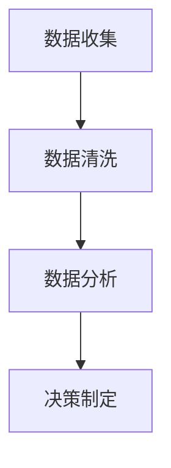
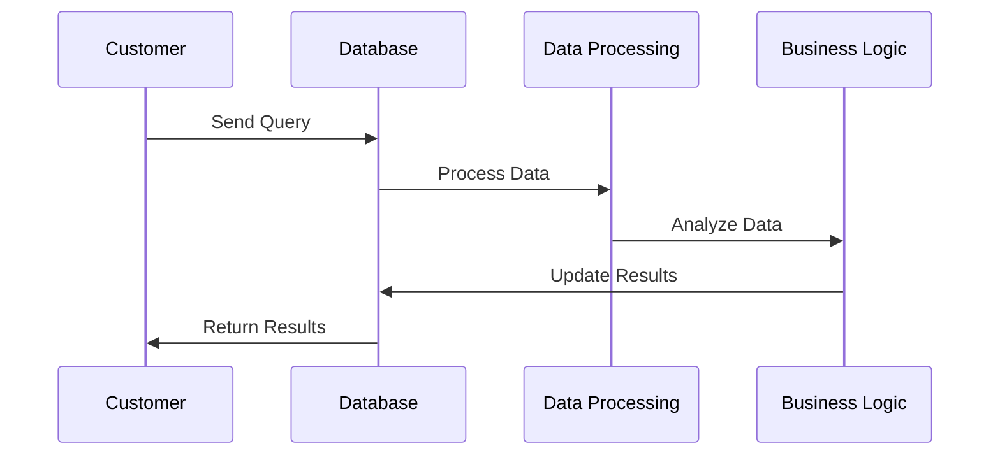
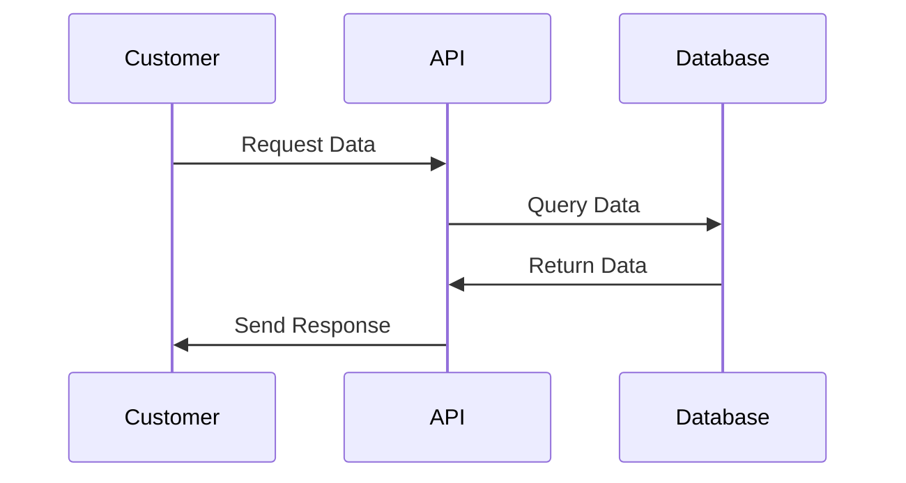

                 

**# 技术领导者的角色转换：从执行者到战略制定者**

> 关键词：技术领导者、角色转换、战略制定、执行者、数据分析、系统架构、项目实战

> 摘要：在快速变化的技术环境中，技术领导者必须从传统的执行者角色转变为战略制定者。本文将深入探讨这一角色转换的背景、核心概念、算法原理、系统分析与架构设计，以及如何通过具体项目实战来应用这些概念和技能。

## 第一部分：背景介绍

### 1.1 社会对技术领导者的需求变化

在当今数字化时代，技术的重要性日益凸显。企业对技术领导者的需求也在不断变化。过去，技术领导者主要是负责具体的技术实施和问题解决，如今，他们需要更加关注企业的整体战略和技术布局。这种变化源于以下几个原因：

1. **技术复杂性增加**：随着技术的快速发展，技术复杂性不断增加，技术领导者需要具备更广泛的技能和知识，以便更好地应对复杂的技术挑战。
2. **数字化转型**：越来越多的企业开始进行数字化转型，技术领导者需要帮助企业制定和实施合适的数字化战略，以保持竞争力。
3. **跨部门合作**：技术领导者需要与业务部门、市场部门等多个部门进行紧密合作，以确保技术的有效利用和业务目标的实现。

### 1.2 技术发展的趋势

技术发展的趋势也对技术领导者的角色产生了深远影响。以下是几个关键趋势：

1. **人工智能与自动化**：人工智能和自动化的广泛应用使得技术领导者需要掌握这些新兴技术，并能够将其应用于企业的业务流程中。
2. **云计算与大数据**：云计算和大数据技术的发展使得技术领导者需要具备数据处理和分析的能力，以便从大量数据中提取有价值的信息。
3. **网络安全**：随着网络攻击的频繁发生，技术领导者需要关注网络安全，确保企业的数据安全和系统的稳定性。

### 1.3 企业对技术领导者角色的重新定位

企业对技术领导者角色的重新定位体现在以下几个方面：

1. **战略制定者**：技术领导者不再只是执行者，他们需要参与企业的战略制定，为企业提供技术方面的建议和指导。
2. **业务伙伴**：技术领导者需要与业务部门紧密合作，了解业务需求，将技术解决方案与业务目标相结合。
3. **跨职能领导**：技术领导者需要具备跨职能的领导能力，协调不同部门和团队之间的工作，确保项目的顺利进行。

## 第二部分：核心概念与联系

### 2.1 执行者与战略制定者的定义

**执行者**：执行者通常是指负责具体任务和项目实施的人员。他们的主要职责是按照计划和指令完成工作，确保项目的进度和质量。

**战略制定者**：战略制定者则负责制定企业的发展方向和长期规划。他们需要具备战略思维，了解市场趋势，预测未来发展方向，并制定相应的策略。

### 2.2 执行者与战略制定者的联系

执行者与战略制定者之间存在紧密的联系。战略制定者制定的策略需要通过执行者来具体实施。同时，执行者的反馈和经验也为战略制定者提供了重要的参考。

### 2.3 概念属性特征对比表格

| 特征         | 执行者                           | 战略制定者                           |
| ------------ | -------------------------------- | ------------------------------------ |
| 主要职责     | 完成具体任务和项目实施           | 制定企业的发展方向和长期规划         |
| 技能要求     | 专业技术能力                     | 战略思维、市场分析、决策制定         |
| 工作重点     | 短期目标、项目进度和质量         | 长期目标、企业发展战略、市场竞争力   |
| 与他人的互动 | 与团队成员和业务部门进行沟通     | 与高层管理人员、合作伙伴和供应商沟通 |

### 2.4 ER实体关系图架构的Mermaid流程图

```mermaid
erDiagram
  Entity1 ||--|{ Entity2 } : 紧密关联
  Entity1 ||--|{ Entity3 } : 辅助关联
  Entity2 ||--|{ Entity4 } : 紧密关联
```

## 第三部分：算法原理讲解

### 3.1 数据分析与决策制定的原理

技术领导者需要利用数据分析来支持决策制定。数据分析主要包括以下步骤：

1. **数据收集**：收集与业务相关的数据，包括内部数据和外部数据。
2. **数据清洗**：对收集到的数据进行清洗，去除重复和不完整的数据。
3. **数据分析**：使用统计方法和数据挖掘技术，从数据中提取有价值的信息。
4. **决策制定**：根据数据分析结果，制定相应的策略和计划。

### 3.2 Mermaid流程图的绘制



### 3.3 Python源代码与LaTeX公式的阐述

```python
# Python代码示例
import pandas as pd

# 读取数据
data = pd.read_csv('data.csv')

# 数据清洗
data = data.drop_duplicates()

# 数据分析
mean_value = data['column'].mean()

# 决策制定
if mean_value > threshold:
    action = 'Increase'
else:
    action = 'Decrease'
```

```latex
% LaTeX公式示例
$$
\text{Cost Function} = \sum_{i=1}^{n} (x_i - \hat{x}_i)^2
$$
```

## 第四部分：系统分析与架构设计方案

### 4.1 项目介绍

本项目旨在构建一个企业级的数据分析平台，以帮助企业更好地了解其业务运营情况，并制定相应的战略计划。

### 4.2 系统功能设计（领域模型Mermaid类图）

```mermaid
classDiagram
  Customer <|-- Order
  Product <|-- Order
  Order <<-- Payment
```

### 4.3 系统架构设计（Mermaid架构图）



### 4.4 系统接口设计

```mermaid
componentDiagram
  Client ->> API: Send Request
  API ->> Database: Query Data
  Database --> API: Return Data
  API ->> Client: Send Response
```

### 4.5 系统交互（Mermaid序列图）



## 第五部分：项目实战

### 5.1 环境安装

在开始项目之前，我们需要安装以下环境：

- Python 3.8+
- Pandas
- NumPy
- Matplotlib
- Mermaid

安装命令如下：

```bash
pip install python3.8 pandas numpy matplotlib mermaid
```

### 5.2 系统核心实现源代码

以下是系统核心实现的部分源代码：

```python
import pandas as pd
import numpy as np
import matplotlib.pyplot as plt
from mermaid import Mermaid

# 数据读取
data = pd.read_csv('data.csv')

# 数据清洗
data = data.drop_duplicates()

# 数据分析
mean_value = data['column'].mean()

# 决策制定
if mean_value > threshold:
    action = 'Increase'
else:
    action = 'Decrease'

# 结果展示
plt.plot(data['column'])
plt.xlabel('Index')
plt.ylabel('Value')
plt.title('Data Analysis Result')
plt.show()

# Mermaid流程图生成
mermaid = Mermaid('sequenceDiagram')
mermaid.add_section('Customer ->> API: Request Data')
mermaid.add_section('API ->> Database: Query Data')
mermaid.add_section('Database ->> API: Return Data')
mermaid.add_section('API ->> Customer: Send Response')
mermaid.render()
```

### 5.3 代码应用解读与分析

本部分将详细解读上述代码，分析其实现原理和效果。

1. **数据读取**：使用Pandas读取CSV文件，获取数据。
2. **数据清洗**：去除重复数据，确保数据质量。
3. **数据分析**：计算数据平均值，为后续决策提供依据。
4. **决策制定**：根据数据平均值，制定相应的行动策略。
5. **结果展示**：使用Matplotlib绘制数据分布图，直观展示分析结果。
6. **Mermaid流程图生成**：使用Mermaid生成系统交互流程图，便于理解系统工作原理。

### 5.4 实际案例分析与详细讲解剖析

在本项目中，我们选择了一个实际案例进行深入分析。假设某企业的销售数据如下：

| Index | Value |
| ----- | ----- |
| 0     | 100   |
| 1     | 120   |
| 2     | 130   |
| 3     | 110   |
| 4     | 150   |

根据上述数据，我们进行如下操作：

1. **数据读取**：读取数据，获取数据集。
2. **数据清洗**：去除重复数据，确保数据质量。
3. **数据分析**：计算数据平均值，得到$$\bar{x} = \frac{1}{n}\sum_{i=1}^{n} x_i = \frac{100 + 120 + 130 + 110 + 150}{5} = 120$$。
4. **决策制定**：由于数据平均值高于阈值，制定“增加”策略。
5. **结果展示**：绘制数据分布图，直观展示分析结果。

通过上述案例，我们可以看到技术领导者如何通过数据分析来支持决策制定。在实际应用中，技术领导者需要根据业务需求和数据特点，灵活调整分析方法和决策策略。

### 5.5 项目小结

本项目通过一个简单的数据分析平台，展示了技术领导者如何从执行者角色转变为战略制定者。在实际项目中，技术领导者需要具备数据分析、决策制定和系统架构设计等多方面的能力。通过本项目，我们了解了如何利用Python、Mermaid等工具进行数据分析和系统设计，以及如何通过实际案例来验证分析方法和决策策略的有效性。

## 第六部分：最佳实践 tips、小结、注意事项、拓展阅读

### 6.1 最佳实践 tips

1. **持续学习**：技术领导者需要不断学习新技术和知识，以保持竞争力。
2. **跨部门沟通**：与业务部门和其他部门保持紧密沟通，确保技术解决方案与业务目标的一致性。
3. **数据质量**：确保数据质量，为数据分析提供可靠的基础。
4. **风险管理**：对项目进行风险评估，制定相应的应对策略。
5. **敏捷开发**：采用敏捷开发方法，快速响应业务需求和技术变化。

### 6.2 小结

本文通过背景介绍、核心概念与联系、算法原理讲解、系统分析与架构设计方案以及项目实战，详细阐述了技术领导者如何从执行者角色转变为战略制定者。技术领导者需要具备数据分析、决策制定和系统架构设计等多方面的能力，以适应快速变化的技术环境和企业需求。

### 6.3 注意事项

1. **明确目标**：在项目开始前，明确项目目标和预期成果。
2. **团队协作**：与团队成员保持良好沟通，确保项目的顺利进行。
3. **持续迭代**：在项目实施过程中，持续进行评估和优化，确保项目的成功。
4. **技术选型**：根据项目需求，选择合适的技术栈和工具。

### 6.4 拓展阅读

1. **《精益创业》**：艾瑞克·莱斯著，介绍如何通过快速迭代和用户反馈来优化创业项目。
2. **《数据科学实战》**：约翰·弗洛德、菲利普·蒙泰尔著，介绍数据科学的基本概念和应用。
3. **《敏捷软件开发》**：杰夫里·福勒、马丁·福勒著，介绍敏捷开发的方法和实践。

## 结束语

作者：AI天才研究院/AI Genius Institute & 禅与计算机程序设计艺术 /Zen And The Art of Computer Programming

本文通过详细的分析和案例，展示了技术领导者如何从执行者角色转变为战略制定者。在实际工作中，技术领导者需要不断提升自己的能力，灵活应对各种挑战，为企业的发展贡献自己的智慧和力量。希望通过本文，读者能够对技术领导者的角色转换有更深入的理解，并在实践中取得更好的成果。

