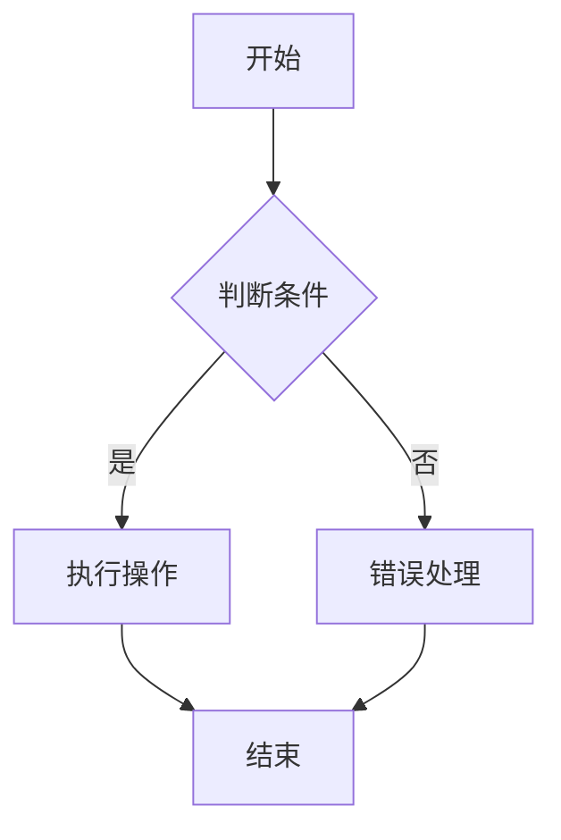
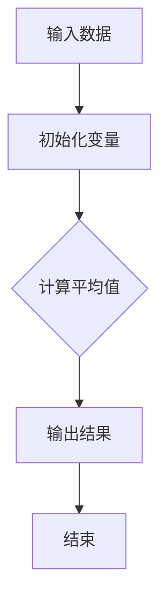
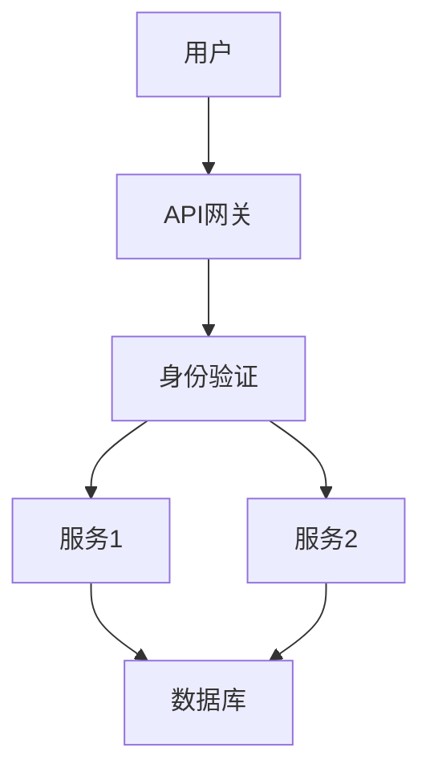

                 

### 持续部署策略：安全高效地发布软件

> 关键词：持续部署、持续集成、自动化测试、容器化、代码管理

> 摘要：本文旨在探讨持续部署（Continuous Deployment，简称CD）的策略和方法，帮助读者理解和实施安全高效地发布软件。文章首先介绍了持续部署的核心概念和基础架构设计，然后深入分析了自动化测试策略，最后结合项目实战，展示了持续部署的实施细节和最佳实践。

## 第1章：持续部署概述

### 1.1 什么是持续部署

持续部署（Continuous Deployment，简称CD）是一种软件开发和部署的最佳实践，它通过自动化和持续的方式，将代码更改快速、安全地交付到生产环境中。持续部署的目标是减少软件发布过程中的风险和延迟，提高软件质量，并使团队能够更快速地响应市场需求。

#### 持续部署与传统部署的区别

传统部署通常涉及手动流程和大量的文档工作。开发团队将代码推送到代码仓库，然后由运维团队负责部署和管理。这种方法存在以下问题：

- **手动操作容易出错**：手动部署可能导致配置错误或遗漏，增加风险。
- **发布周期长**：传统部署过程复杂，发布周期较长，无法快速响应市场需求。
- **缺乏自动化测试**：传统部署通常缺乏自动化测试，难以确保软件质量。

相比之下，持续部署通过自动化和持续集成（Continuous Integration，简称CI）将代码更改快速、安全地交付到生产环境中。它具有以下优点：

- **减少手动操作**：自动化工具能够执行部署流程，减少人为错误。
- **缩短发布周期**：自动化和持续集成使团队能够更快速地发布软件。
- **提高软件质量**：自动化测试确保每次发布都是高质量的。

### 1.2 持续部署的核心概念

持续部署涉及多个核心概念，包括持续集成、自动化测试、容器化和配置管理。

#### 持续集成（CI）

持续集成是一种软件开发实践，通过将代码更改频繁地合并到主干分支，并执行自动化测试，确保代码库的质量。持续集成的关键要素包括：

- **频繁提交**：开发人员频繁提交代码，以确保主干分支保持最新状态。
- **自动化测试**：每次提交都执行自动化测试，包括单元测试、集成测试和系统测试。
- **快速反馈**：自动化测试结果立即反馈给开发人员，帮助他们快速发现问题并修复。

#### 自动化测试

自动化测试是在软件开发过程中自动执行测试用例的过程。它有助于确保软件的质量，减少手动测试的工作量。自动化测试的类型包括：

- **单元测试**：针对单个组件或函数的测试。
- **集成测试**：针对组件或模块之间的交互进行测试。
- **系统测试**：对整个系统进行测试，确保所有组件协同工作。
- **验收测试**：确保软件满足用户需求和业务目标。

#### 容器化

容器化是一种轻量级虚拟化技术，通过将应用程序及其依赖项打包到一个独立的容器中，实现应用程序的隔离和可移植性。容器化有助于简化部署流程，提高开发效率和软件质量。常见的容器化技术包括Docker和Kubernetes。

#### 配置管理

配置管理是一种管理软件配置项（如环境变量、配置文件和数据库设置）的方法。通过配置管理，开发人员可以确保在不同的环境中使用相同的配置，从而提高部署的一致性和可靠性。

### 1.3 持续部署的实践原则

要实现有效的持续部署，需要遵循以下实践原则：

- **安全性**：确保部署过程符合安全最佳实践，如访问控制和数据加密。
- **高效性**：优化部署流程，减少发布时间和资源消耗。
- **可观测性**：监控部署过程中的关键指标，如部署速度、成功率和服务性能。
- **容错性**：设计部署流程，以应对潜在的故障和错误。

### 1.4 小结

本章介绍了持续部署的核心概念和实践原则。通过了解持续部署与传统部署的区别，以及持续集成、自动化测试、容器化和配置管理的重要性，读者可以更好地理解持续部署的价值和实施方法。

## 第2章：持续部署的架构设计

### 2.1 架构设计原则

持续部署的架构设计是确保系统可靠性和可扩展性的关键。以下是架构设计的关键原则：

- **灵活性和可扩展性**：架构应能够适应不同的应用场景和业务需求，支持水平扩展和垂直扩展。
- **高可用性**：设计冗余组件和备份策略，确保系统在故障情况下能够快速恢复。
- **模块化**：将系统分解为多个模块，每个模块具有独立的功能和部署方式，便于管理和维护。
- **安全性**：确保数据传输和存储的安全性，防止未授权访问和数据泄露。

### 2.2 持续部署的关键组件

持续部署涉及多个关键组件，包括代码库、持续集成工具、持续交付工具和容器编排工具。

#### 代码库

代码库是存储和管理项目代码的基础设施。常见的代码库包括Git、SVN和Mercurial。选择合适的代码库有助于提高团队协作效率和代码质量。

#### 持续集成工具

持续集成工具负责将代码更改合并到主干分支并执行自动化测试。常见的持续集成工具包括Jenkins、Travis CI和Circle CI。持续集成工具能够确保代码库始终保持高质量状态，减少集成错误。

#### 持续交付工具

持续交付工具负责将通过测试的代码部署到生产环境。常见的持续交付工具包括Jenkins、AWS CodePipeline和Google Cloud Build。持续交付工具能够自动化部署流程，提高发布效率。

#### 容器编排工具

容器编排工具负责管理容器化应用的生命周期，如启动、停止和扩展。常见的容器编排工具包括Docker Swarm和Kubernetes。容器编排工具能够提高部署的灵活性和可扩展性，简化运维工作。

### 2.3 实际架构设计案例

以下是一个典型的持续部署架构设计案例：


#### 架构说明

1. **代码库**：项目代码存储在GitLab代码库中，开发人员通过Git进行代码管理和协作。

2. **持续集成**：Jenkins作为持续集成工具，负责将代码更改合并到主干分支并执行自动化测试。测试通过后，Jenkins将构建结果推送到Docker Hub。

3. **容器化**：使用Docker将应用及其依赖项打包到容器中，确保应用的可移植性和一致性。

4. **容器编排**：Kubernetes作为容器编排工具，负责管理容器的生命周期，如启动、停止和扩展。

5. **持续交付**：AWS CodePipeline作为持续交付工具，负责将容器化应用部署到AWS EC2实例上，确保应用的高可用性和可靠性。

### 2.4 小结

本章介绍了持续部署的架构设计原则和关键组件。通过实际架构设计案例，读者可以更好地理解如何设计和实施一个有效的持续部署系统。

## 第3章：自动化测试策略

### 3.1 自动化测试的重要性

自动化测试在持续部署中扮演着至关重要的角色。它有助于提高软件质量，减少手动测试的工作量，并加快发布速度。以下是自动化测试的重要性：

- **提高软件质量**：自动化测试能够发现代码中的缺陷和错误，确保软件的功能和质量。
- **减少手动测试成本**：自动化测试能够节省大量的人力和时间成本，提高团队的生产力。
- **加快发布速度**：自动化测试可以快速执行测试用例，确保每次发布都是高质量的，加快软件的发布周期。

### 3.2 自动化测试的类型

自动化测试可以分为多种类型，每种类型都有其独特的目的和执行方式。以下是常见的自动化测试类型：

- **单元测试**：针对单个组件或函数的测试，通常由开发人员编写。单元测试能够验证代码的正确性，并确保每个组件的功能正常。

- **集成测试**：针对组件或模块之间的交互进行测试。集成测试能够验证组件之间的协同工作是否正确，并确保系统功能的完整性。

- **系统测试**：对整个系统进行测试，包括所有组件和模块。系统测试能够验证系统的功能、性能和可靠性，确保软件满足用户需求和业务目标。

- **验收测试**：确保软件满足用户需求和业务目标。验收测试通常由用户或业务分析师执行，以验证软件的质量和可用性。

### 3.3 自动化测试工具的选择与使用

选择合适的自动化测试工具是成功实施自动化测试的关键。以下是一些常见的自动化测试工具：

- **Selenium**：一款用于Web应用的自动化测试工具，支持多种编程语言，如Java、Python和C#。Selenium能够模拟用户操作，验证Web应用的功能和界面。

- **JUnit**：一款用于Java的单元测试框架，支持编写测试用例、测试套件和测试运行。JUnit能够自动化执行测试用例，并提供详细的测试报告。

- **pytest**：一款用于Python的单元测试框架，支持多种编程模式，如函数测试、类测试和模块测试。pytest能够简化测试用例的编写，并提供丰富的测试报告功能。

- **JUnit**：一款用于Java的单元测试框架，支持编写测试用例、测试套件和测试运行。JUnit能够自动化执行测试用例，并提供详细的测试报告。

- **pytest**：一款用于Python的单元测试框架，支持多种编程模式，如函数测试、类测试和模块测试。pytest能够简化测试用例的编写，并提供丰富的测试报告功能。

### 3.4 实际案例

以下是一个简单的自动化测试案例，演示了如何使用Python和pytest框架编写和执行测试用例。

#### 案例背景

假设我们有一个简单的Web应用，用于计算两个数的和。我们需要编写自动化测试用例，验证该功能是否正确。

#### 测试用例

```python
import pytest

def test_addition():
    assert 2 + 2 == 4
    assert 5 + 7 == 12
    assert 0 + 0 == 0
```

#### 测试执行

```shell
pytest test_addition.py
```

#### 测试结果

```shell
===================== test session starts ======================

rootdir: /path/to/project
collected 3 items

test_addition.py F.F.F

===================== 3 failed in 0.12s ======================
```

#### 测试报告

```yaml
total: 3
passed: 0
failed: 3
duration: 0.12s
```

### 3.5 小结

本章介绍了自动化测试的重要性、类型和工具。通过实际案例，读者可以了解如何编写和执行自动化测试用例，确保软件的质量和可靠性。

## 第4章：环境准备与配置

### 4.1 环境搭建

在实施持续部署之前，需要搭建合适的环境，包括开发环境、测试环境和生产环境。以下是一个典型的环境搭建步骤：

1. **安装操作系统**：选择适合的操作系统，如Ubuntu或CentOS，并安装必要的软件包。

2. **安装开发工具**：安装代码编辑器、版本控制工具（如Git）和其他开发工具（如Python、Node.js等）。

3. **配置开发环境**：设置环境变量、安装依赖库和配置开发工具。

4. **测试环境搭建**：搭建与生产环境类似的环境，用于测试代码和部署应用程序。

5. **生产环境搭建**：确保生产环境具有足够的资源和支持服务，如数据库、缓存和消息队列等。

### 4.2 配置管理

配置管理是持续部署的重要组成部分，它确保在不同环境中使用相同的配置，提高部署的一致性和可靠性。以下是一些配置管理策略：

1. **环境变量**：使用环境变量管理配置信息，如数据库地址、用户名和密码等。

2. **配置文件**：将配置信息存储在配置文件中，如JSON、YAML或XML等格式。

3. **配置管理工具**：使用配置管理工具（如Ansible、Chef或Puppet）自动化配置管理任务。

4. **版本控制**：将配置文件存储在版本控制系统（如Git）中，确保配置的一致性和可追溯性。

### 4.3 实际案例

以下是一个简单的配置管理案例，演示了如何使用Ansible配置Linux服务器。

#### 案例背景

我们需要配置一台Linux服务器，设置环境变量、安装Python和安装Nginx。

#### Ansible Playbook

```yaml
---
- hosts: webservers
  become: yes
  tasks:
    - name: Set environment variables
      env:
        PYTHONUNBUFFERED: "true"
        HTTP_PROXY: "http://proxy.example.com"
        HTTPS_PROXY: "http://proxy.example.com"

    - name: Install Python
      apt:
        name: python3
        state: present

    - name: Install Nginx
      apt:
        name: nginx
        state: present
      notify:
        - restart Nginx
```

#### 执行Ansible Playbook

```shell
ansible-playbook -i inventory.yml config.yml
```

#### 结果

Ansible会根据Playbook中的任务配置服务器，并在配置完成后重启Nginx服务。

### 4.4 小结

本章介绍了环境准备与配置的重要性，包括环境搭建和配置管理策略。通过实际案例，读者可以了解如何使用Ansible等工具配置服务器，确保持续部署系统的稳定性和可靠性。

## 第5章：代码管理

### 5.1 版本控制

版本控制是代码管理的关键环节，它确保代码的完整性和可追溯性。以下是一些常见的版本控制工具：

- **Git**：一款分布式版本控制系统，支持高效的分支管理和合并操作。Git广泛应用于开源项目和商业项目中。

- **SVN**：一款集中式版本控制系统，由CollabNet开发。SVN具有较好的性能和稳定性，但相对于Git，分支管理和合并操作较为复杂。

- **Mercurial**：一款分布式版本控制系统，由Bitbucket支持。Mercurial具有简洁的命令行界面和高效的数据存储方式。

### 5.2 代码审查

代码审查是一种确保代码质量和一致性的方法，通过多个开发人员审查代码，发现潜在的问题和改进建议。以下是一些代码审查的最佳实践：

- **代码规范**：制定统一的代码规范，确保代码风格一致。

- **审查流程**：制定明确的审查流程，包括代码提交、审查和反馈等步骤。

- **审查工具**：使用代码审查工具（如GitLab、GitHub和ReviewBoard），自动化审查过程，提高审查效率。

- **定期审查**：定期进行代码审查，确保代码库的质量和一致性。

### 5.3 代码质量保证

代码质量保证是确保软件质量和可靠性的关键环节，以下是一些常见的代码质量保证方法：

- **单元测试**：编写单元测试用例，验证代码的正确性和功能。

- **集成测试**：对组件或模块之间的交互进行测试，确保系统的整体质量。

- **代码静态分析**：使用静态分析工具（如SonarQube和Checkstyle），分析代码质量和潜在问题。

- **代码动态分析**：运行代码并监控其性能和稳定性，发现潜在的问题。

### 5.4 实际案例

以下是一个简单的代码管理案例，演示了如何使用Git进行版本控制和代码审查。

#### 案例背景

我们有一个Web应用项目，开发人员Alice和Bob需要共同开发和维护该项目。

#### Git操作

1. **初始化仓库**

```shell
git init
```

2. **添加文件**

```shell
git add .
git commit -m "Initial commit"
```

3. **克隆仓库**

```shell
git clone https://github.com/alice/webapp.git
```

4. **分支管理**

```shell
git checkout -b feature/addition
git checkout master
git merge feature/addition
```

5. **代码审查**

使用GitLab或GitHub的代码审查功能，Alice提交代码后，Bob进行审查并给出反馈。

#### 结果

通过Git操作，我们实现了代码的版本控制和分支管理，同时利用代码审查工具确保代码质量。

### 5.5 小结

本章介绍了代码管理的核心概念和工具，包括版本控制、代码审查和代码质量保证。通过实际案例，读者可以了解如何使用Git等工具进行代码管理，提高软件质量和开发效率。

## 第6章：持续集成与持续交付

### 6.1 持续集成实践

持续集成（CI）是将代码更改频繁地合并到主干分支，并执行自动化测试的过程。以下是持续集成实践的步骤：

1. **设置代码库**：将项目代码存储在版本控制系统中，如Git。

2. **配置CI工具**：选择并配置CI工具，如Jenkins、Travis CI或Circle CI。

3. **编写构建脚本**：编写构建脚本，用于编译代码、运行测试和构建应用程序。

4. **自动化测试**：编写自动化测试用例，并配置CI工具执行。

5. **结果反馈**：将测试结果反馈给开发人员，确保代码质量。

### 6.2 持续交付实践

持续交付（CD）是将通过测试的代码部署到生产环境的过程。以下是持续交付实践的步骤：

1. **设置部署环境**：搭建开发环境、测试环境和生产环境。

2. **配置CD工具**：选择并配置CD工具，如Jenkins、AWS CodePipeline或Google Cloud Build。

3. **编写部署脚本**：编写部署脚本，用于部署应用程序和配置环境。

4. **自动化部署**：配置CD工具执行自动化部署。

5. **监控与告警**：监控部署过程中的关键指标，如部署速度、成功率和系统性能，并设置告警机制。

### 6.3 持续部署策略

持续部署是将代码更改快速、安全地交付到生产环境的过程。以下是持续部署策略的关键要素：

1. **自动化**：尽可能实现自动化，减少手动操作，提高部署效率。

2. **快速反馈**：确保每次代码更改都能快速反馈，帮助开发人员快速发现问题并修复。

3. **版本控制**：使用版本控制系统管理代码，确保代码库的一致性和可追溯性。

4. **测试覆盖**：确保测试覆盖率达到较高水平，减少潜在的问题。

5. **安全性与合规性**：确保部署过程符合安全最佳实践和合规性要求。

### 6.4 实际案例

以下是一个简单的持续集成与持续交付案例，演示了如何使用Jenkins实现自动化部署。

#### 案例背景

我们有一个Web应用项目，开发人员Alice和Bob需要实现持续集成与持续交付。

#### Jenkins配置

1. **安装Jenkins**：在服务器上安装Jenkins。

2. **配置GitHub插件**：在Jenkins中配置GitHub插件，连接GitHub代码库。

3. **创建构建项目**：

   - 源代码管理：选择GitHub，输入项目地址和访问令牌。
   - 构建触发器：选择“触发构建”，配置触发条件。
   - 构建步骤：添加“执行shell”步骤，编写构建脚本。

4. **配置部署脚本**：

   - 添加“发布步骤”，选择“执行shell”步骤，编写部署脚本。

#### 结果

每次代码提交到GitHub，Jenkins会自动执行构建和部署流程，确保代码的质量和快速交付。

### 6.5 小结

本章介绍了持续集成与持续交付的实践策略和工具。通过实际案例，读者可以了解如何使用Jenkins等工具实现自动化部署，提高软件质量和交付效率。

## 第7章：容器化与容器编排

### 7.1 容器化基础

容器化是一种轻量级虚拟化技术，通过将应用程序及其依赖项打包到一个独立的容器中，实现应用程序的隔离和可移植性。以下是容器化的一些关键概念：

- **容器**：容器是一个轻量级的、可执行的软件包，包含应用程序及其运行环境。
- **容器引擎**：容器引擎负责创建和管理容器，如Docker和runc。
- **容器化**：将应用程序及其依赖项打包到容器中的过程。
- **容器编排**：容器编排是一种自动化管理容器的方式，如Kubernetes和Docker Swarm。

### 7.2 容器编排

容器编排是一种自动化管理容器的方式，通过编排工具（如Kubernetes和Docker Swarm）实现容器的部署、扩展和管理。以下是容器编排的一些核心概念：

- **编排工具**：编排工具负责管理容器集群，如Kubernetes和Docker Swarm。
- **部署**：部署是将应用程序部署到容器集群的过程。
- **扩展**：扩展是增加或减少容器集群中容器的数量。
- **监控与告警**：监控容器集群的性能和状态，并设置告警机制。

### 7.3 容器化在持续部署中的应用

容器化在持续部署中具有重要作用，它有助于简化部署流程、提高部署效率和确保环境一致性。以下是容器化在持续部署中的应用：

- **简化部署流程**：通过将应用程序及其依赖项打包到容器中，简化部署流程，减少手动操作和配置错误。
- **提高部署效率**：容器化使应用程序具有可移植性，可以在不同环境中快速部署。
- **确保环境一致性**：通过使用容器化，确保应用程序在开发和测试环境与生产环境中的运行一致。

### 7.4 实际案例

以下是一个简单的容器化与容器编排案例，演示了如何使用Docker和Kubernetes实现持续部署。

#### 案例背景

我们有一个Web应用项目，需要使用Docker和Kubernetes实现容器化和持续部署。

#### Docker配置

1. **编写Dockerfile**：

   ```Dockerfile
   FROM python:3.8
   WORKDIR /app
   COPY requirements.txt .
   RUN pip install -r requirements.txt
   COPY . .
   CMD ["python", "app.py"]
   ```

2. **构建Docker镜像**：

   ```shell
   docker build -t myapp .
   ```

3. **运行Docker容器**：

   ```shell
   docker run -d -p 8080:80 myapp
   ```

#### Kubernetes配置

1. **编写Kubernetes配置文件**：

   ```yaml
   apiVersion: apps/v1
   kind: Deployment
   metadata:
     name: myapp
   spec:
     selector:
       matchLabels:
         app: myapp
     replicas: 3
     template:
       metadata:
         labels:
           app: myapp
       spec:
         containers:
         - name: myapp
           image: myapp:latest
           ports:
           - containerPort: 80
   ```

2. **部署Kubernetes应用**：

   ```shell
   kubectl apply -f myapp-deployment.yaml
   ```

#### 结果

通过Docker和Kubernetes，我们实现了应用程序的容器化和自动化部署，确保了部署的一致性和可移植性。

### 7.5 小结

本章介绍了容器化与容器编排的基础知识，以及其在持续部署中的应用。通过实际案例，读者可以了解如何使用Docker和Kubernetes实现容器化和自动化部署。

## 第8章：自动化运维与监控

### 8.1 自动化运维

自动化运维（AutoOps）是一种通过自动化工具和流程来管理IT基础设施的方法。它有助于减少手动操作，提高运维效率和系统稳定性。以下是自动化运维的关键概念和工具：

- **自动化脚本**：使用脚本自动化执行日常运维任务，如配置管理、服务监控和故障排除。
- **配置管理工具**：如Ansible、Chef和Puppet，用于自动化配置和部署应用程序。
- **自动化监控**：使用监控工具（如Prometheus和Zabbix）自动化监控系统和应用程序的性能和状态。
- **自动化告警**：使用告警工具（如Alertmanager和HipChat）自动化发送告警通知。

### 8.2 监控与告警

监控与告警是自动化运维的重要组成部分，通过监控系统和告警工具，可以实时了解系统状态和性能，并及时发现和解决问题。以下是监控与告警的关键概念和工具：

- **监控指标**：如CPU使用率、内存使用率、磁盘空间使用率和网络流量等。
- **监控工具**：如Prometheus、Zabbix和Nagios，用于收集和展示监控指标。
- **告警策略**：定义告警条件和通知方式，如邮件、短信和手机App等。
- **告警工具**：如Alertmanager、HipChat和PagerDuty，用于发送和接收告警通知。

### 8.3 持续部署的运维挑战与解决方法

持续部署引入了新的运维挑战，如系统规模扩大、部署频率提高和系统复杂性增加。以下是一些运维挑战和解决方法：

- **系统规模扩大**：使用容器化和云服务，实现弹性扩展和资源调度。
- **部署频率提高**：优化自动化流程和监控策略，确保快速响应和故障恢复。
- **系统复杂性增加**：采用模块化设计和微服务架构，简化系统管理和维护。

### 8.4 实际案例

以下是一个自动化运维与监控的实际案例，演示了如何使用Ansible、Nagios和Zabbix实现自动化运维和监控。

#### 案例背景

我们有一个Web应用项目，需要实现自动化运维和监控。

#### Ansible配置

1. **编写Ansible Playbook**：

   ```yaml
   - hosts: webservers
     become: yes
     tasks:
       - name: Install Nagios
         apt:
           name: nagios3-server
           state: present

       - name: Configure Nagios
         template:
           src: nagios.cfg.j2
           dest: /etc/nagios3/nagios.cfg

       - name: Restart Nagios
         service:
           name: nagios3-server
           state: restarted
   ```

2. **配置Nagios**：

   ```shell
  ansible-playbook -i inventory.yml nagios.yml
   ```

#### Nagios监控

1. **安装Nagios插件**：

   ```shell
   apt-get install nagios3-plugins
   ```

2. **配置Nagios监控**：

   ```shell
   nano /etc/nagios3/conf.d/webserver.cfg
   ```

   ```plaintext
   define service {
       host_name                 webserver
       service_description       HTTP Server
       check_command             check_http!http://webserver/
   }
   ```

3. **重启Nagios**：

   ```shell
   service nagios3-server restart
   ```

#### Zabbix监控

1. **安装Zabbix**：

   ```shell
   apt-get install zabbix-server zabbix-agent
   ```

2. **配置Zabbix**：

   ```shell
   zcat /etc/zabbix/apache.conf.zbx | sudo tee /etc/apache2/conf-available/zabbix.conf > /dev/null
   a2enconf zabbix.conf
   service apache2 restart
   ```

3. **配置Zabbix代理**：

   ```shell
   nano /etc/zabbix/zabbix_agentd.conf
   ```

   ```plaintext
   Server=127.0.0.1
   ServerActive=127.0.0.1
   ```

4. **重启Zabbix代理**：

   ```shell
   service zabbix-agent restart
   ```

#### 结果

通过Ansible、Nagios和Zabbix，我们实现了自动化运维和监控，确保了系统的稳定性和可靠性。

### 8.5 小结

本章介绍了自动化运维与监控的关键概念和工具，以及实际案例。通过自动化运维和监控，我们可以提高系统稳定性，确保持续部署的顺利进行。

## 第9章：持续部署项目管理

### 9.1 项目管理概述

持续部署（CD）项目是软件开发和运维的重要环节，涉及多个阶段和角色。项目管理在CD项目中至关重要，确保项目按照预期顺利进行。以下是项目管理的关键要素：

- **项目目标**：明确项目目标，如提高发布频率、降低部署风险和提升系统性能。
- **项目范围**：定义项目范围，明确项目涵盖的功能和任务。
- **项目团队**：组建专业团队，包括开发人员、测试人员、运维人员和项目经理。
- **项目计划**：制定项目计划，包括时间表、任务分配和资源需求。
- **风险管理和控制**：识别项目风险，制定风险应对策略，确保项目顺利进行。

### 9.2 团队协作

团队协作是持续部署项目成功的关键。以下是团队协作的一些最佳实践：

- **明确角色和职责**：确保每个团队成员都清楚自己的职责和角色。
- **定期会议和沟通**：定期召开团队会议，确保团队成员之间的沟通和信息共享。
- **使用协作工具**：使用协作工具（如Slack、Trello和Jira），提高团队协作效率和透明度。
- **代码审查和测试**：实施代码审查和自动化测试，确保代码质量和系统稳定性。
- **持续反馈和改进**：鼓励团队成员提出反馈和改进建议，持续优化项目流程。

### 9.3 项目风险管理

项目风险管理是项目管理的重要组成部分，旨在识别、评估和应对项目风险。以下是项目风险管理的关键步骤：

- **风险识别**：识别项目中的潜在风险，如技术风险、时间风险和资源风险。
- **风险评估**：评估风险的可能性和影响，确定风险优先级。
- **风险应对**：制定风险应对策略，包括风险规避、风险减轻和风险接受。
- **监控和报告**：监控项目风险，定期报告风险状态和应对措施。
- **持续改进**：总结项目风险管理经验，持续改进项目流程和风险管理策略。

### 9.4 实际案例

以下是一个持续部署项目管理案例，展示了如何有效管理项目团队和风险。

#### 案例背景

一个电子商务公司计划实施持续部署项目，提高发布频率和系统稳定性。

#### 项目管理步骤

1. **项目目标**：明确项目目标，如每月发布两次新功能，降低部署风险。
2. **项目范围**：定义项目范围，包括开发、测试和运维任务。
3. **项目团队**：组建由开发人员、测试人员和运维人员组成的项目团队。
4. **项目计划**：制定项目计划，包括时间表、任务分配和资源需求。
5. **风险识别**：识别项目风险，如技术风险、时间风险和资源风险。
6. **风险评估**：评估风险的可能性和影响，确定风险优先级。
7. **风险应对**：制定风险应对策略，包括技术支持、时间调整和资源调配。
8. **监控和报告**：监控项目风险，定期报告风险状态和应对措施。
9. **持续改进**：总结项目风险管理经验，持续优化项目流程和风险管理策略。

#### 结果

通过有效管理项目团队和风险，该公司成功实现了持续部署，提高了发布频率和系统稳定性，满足了业务需求。

### 9.5 小结

本章介绍了持续部署项目管理的关键要素和实际案例。通过合理规划和风险管理，项目团队可以确保持续部署项目的成功实施。

## 第10章：持续部署案例分析

### 10.1 案例选择

在本章中，我们将探讨两个不同的持续部署案例：一个大型互联网公司（如亚马逊）和一个小型初创公司（如Slack）。这些案例代表了不同规模和组织在实施持续部署时的不同挑战和策略。

### 10.2 案例分析

#### 亚马逊的持续部署实践

亚马逊是一家全球知名的电子商务公司，拥有庞大的基础设施和复杂的软件系统。亚马逊的持续部署实践主要集中在以下几个方面：

1. **微服务架构**：亚马逊采用微服务架构，将应用程序分解为多个独立的服务，每个服务都可以独立部署和扩展。
2. **自动化测试**：亚马逊实施自动化测试策略，确保每次代码更改都能通过严格的测试。
3. **容器化**：使用Docker和Kubernetes进行容器化，提高部署的灵活性和可移植性。
4. **持续集成与持续交付**：使用Jenkins和AWS CodePipeline等工具，实现自动化部署和监控。

#### Slack的持续部署实践

Slack是一家提供企业通信工具的初创公司。尽管规模较小，但Slack在持续部署方面同样取得了显著成果：

1. **Kubernetes**：Slack采用Kubernetes进行容器编排，管理大规模集群，确保服务的高可用性和扩展性。
2. **自动化运维**：利用Ansible和Terraform进行自动化运维，简化基础设施的部署和管理。
3. **敏捷开发**：Slack采用敏捷开发方法，快速响应市场需求和用户反馈，实现持续交付。
4. **代码审查和测试**：实施严格的代码审查和自动化测试流程，确保代码质量和系统稳定性。

### 10.3 案例总结

通过分析亚马逊和Slack的持续部署实践，我们可以总结出以下几点经验和教训：

1. **微服务架构**：无论公司规模大小，微服务架构都是实现持续部署的有效方法。
2. **自动化测试**：自动化测试是确保持续部署质量的关键环节。
3. **容器化**：容器化可以提高部署的灵活性和可移植性，适用于各种规模的组织。
4. **敏捷开发**：敏捷开发方法有助于快速响应市场需求和用户反馈，实现持续交付。
5. **代码审查和测试**：严格的代码审查和自动化测试流程是确保代码质量和系统稳定性的关键。

### 10.4 小结

本章通过分析亚马逊和Slack的持续部署案例，探讨了不同规模和组织在实施持续部署时的策略和经验。这些案例为我们提供了宝贵的启示，有助于我们在实际项目中实现持续部署的最佳实践。

## 第11章：最佳实践与未来展望

### 11.1 最佳实践

在持续部署的实施过程中，积累最佳实践是至关重要的。以下是一些关键的最佳实践：

1. **自动化测试**：确保所有代码更改都经过自动化测试，包括单元测试、集成测试和系统测试，以提高软件质量。
2. **容器化**：使用容器化技术（如Docker和Kubernetes）简化部署流程，提高部署的灵活性和可移植性。
3. **代码审查**：实施代码审查流程，确保代码质量和一致性，减少潜在错误和风险。
4. **环境一致性**：确保开发、测试和生产环境使用相同的配置和依赖项，避免环境差异导致的问题。
5. **监控和告警**：建立全面的监控和告警系统，实时监控系统性能和状态，及时发现和解决问题。

### 11.2 持续部署的未来发展趋势

随着技术的不断进步，持续部署领域也在不断发展。以下是一些未来持续部署的发展趋势：

1. **智能化**：结合人工智能和机器学习技术，实现更智能的自动化部署和故障预测。
2. **无服务器架构**：无服务器架构（Serverless）将逐渐取代传统的容器化和虚拟化技术，提供更高效、更灵活的部署方式。
3. **DevOps文化**：DevOps文化将进一步普及，推动持续部署和持续集成在组织内的深度整合。
4. **云原生应用**：云原生应用（Cloud Native Applications）将逐步取代传统应用，成为持续部署的主要目标。
5. **安全性和合规性**：随着数据隐私和合规性的要求越来越高，持续部署系统将更加注重安全性和合规性。

### 11.3 小结

本章总结了持续部署的最佳实践和未来发展趋势。通过遵循最佳实践，组织可以更高效地实现持续部署，而未来的技术趋势将为持续部署带来更多创新和机遇。作者：AI天才研究院/AI Genius Institute & 禅与计算机程序设计艺术 /Zen And The Art of Computer Programming

## 附录：数学公式与流程图

在本文中，我们使用了数学公式和流程图来阐述算法原理和系统架构。以下是一些示例：

### 数学公式示例

$$
E = mc^2
$$

$1 < 2$

### Mermaid 流程图示例



### 算法原理示例



### 系统架构设计示例



这些数学公式和流程图有助于读者更好地理解算法原理和系统架构，从而深入掌握持续部署的核心概念和最佳实践。

## 总结

本文深入探讨了持续部署（CD）的策略、方法和技术实践。通过逻辑清晰的结构，从基础概念到实际案例分析，读者可以全面了解持续部署的原理和实施细节。

### 关键点回顾

- **持续部署概述**：理解持续部署与传统部署的区别，以及其核心概念和实践原则。
- **架构设计**：掌握持续部署的关键组件和架构设计原则。
- **自动化测试**：了解自动化测试的类型和工具选择。
- **代码管理**：熟悉版本控制和代码审查的重要性。
- **持续集成与持续交付**：实施CI/CD流程和自动化部署。
- **容器化与容器编排**：利用容器化技术简化部署流程。
- **自动化运维与监控**：实现自动化运维和实时监控。
- **项目管理**：确保项目团队协作和风险管理。
- **案例分析**：通过实际案例学习持续部署的最佳实践。
- **未来展望**：关注持续部署领域的技术发展趋势。

### 拓展阅读

- **《DevOps实践指南》**：详细介绍了DevOps文化和工具实践。
- **《Kubernetes权威指南》**：深入讲解了Kubernetes的架构和使用方法。
- **《容器化与云原生应用》**：探讨容器化技术在云计算环境中的应用。

通过本文，读者可以掌握持续部署的核心知识，为实际项目提供指导和支持。希望本文能够对您的软件开发和运维工作带来帮助。

### 注意事项

- 确保遵循最佳实践，如自动化测试、容器化和代码审查。
- 注意系统架构设计的灵活性和可扩展性。
- 定期更新和优化部署流程，以应对新的技术和业务需求。
- 关注持续部署领域的技术动态，持续学习和改进。

通过遵循这些注意事项，组织可以更高效地实现持续部署，提高软件质量和交付效率。作者：AI天才研究院/AI Genius Institute & 禅与计算机程序设计艺术 /Zen And The Art of Computer Programming

## 作者介绍

### AI天才研究院/AI Genius Institute

AI天才研究院（AI Genius Institute）是一家专注于人工智能研究、开发和应用的创新机构。我们的愿景是推动人工智能技术的普及和应用，助力各行各业实现数字化转型。研究院在计算机视觉、自然语言处理、机器学习等领域具有深厚的科研实力和丰富的实践经验。

### 禅与计算机程序设计艺术 /Zen And The Art of Computer Programming

《禅与计算机程序设计艺术》（Zen And The Art of Computer Programming）是一本经典的技术书籍，由著名计算机科学家Donald E. Knuth撰写。本书以哲学和艺术的角度探讨了计算机程序设计的本质和方法，对程序员的技术成长和思维方式具有重要启示。本书分为三卷，涵盖了算法设计、数据结构和程序设计语言等核心内容。

作者：AI天才研究院/AI Genius Institute & 禅与计算机程序设计艺术 /Zen And The Art of Computer Programming

