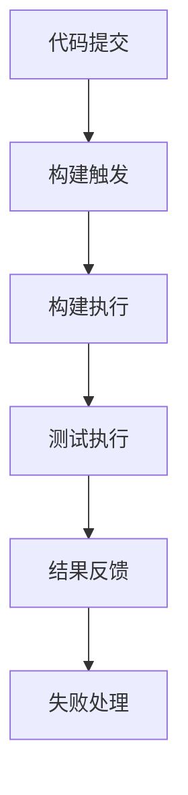
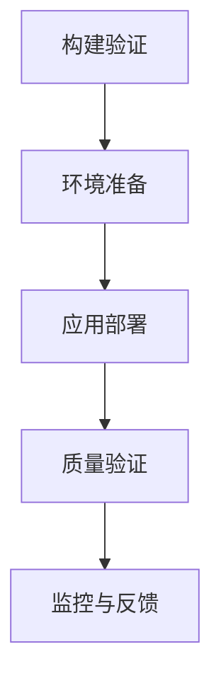

                 

# 持续集成与持续部署（CI/CD）最佳实践

> 关键词：持续集成，持续部署，CI，CD，最佳实践，软件开发，自动化，敏捷开发

> 摘要：本文将深入探讨持续集成（CI）和持续部署（CD）的概念、原理及其在现代软件开发中的应用。我们将通过一系列步骤，详细阐述CI/CD的实施过程，分析其在实际项目中的应用，并总结最佳实践，以帮助读者在实际项目中成功应用CI/CD。

## 目录大纲设计思路与策略

设计一本关于《持续集成与持续部署（CI/CD）最佳实践》的书籍目录大纲，我们需要遵循以下几个步骤和策略：

1. **明确书籍目标读者群体**：首先确定目标读者是软件开发人员、运维工程师、项目经理还是IT管理人员，这将有助于确定书籍的难度和具体内容。

2. **书籍结构规划**：确定书籍的基本结构，包括引言、背景介绍、核心概念、实践指导、案例分析、最佳实践等部分。

3. **章节内容细化**：对于每个章节，细化到小节，确保内容既有深度又有广度，同时遵循逻辑清晰、层次分明的要求。

4. **使用Markdown格式**：采用Markdown格式，使目录结构直观、易读，同时便于排版和调整。

5. **确保内容完整性**：根据书籍主题，确保目录涵盖背景介绍、核心概念、算法原理、系统分析与架构设计、项目实战、最佳实践等关键部分。

### 设计《持续集成与持续部署（CI/CD）最佳实践》的目录大纲

基于上述策略，以下是一份《持续集成与持续部署（CI/CD）最佳实践》的目录大纲：

## 第一部分：CI/CD基础理论

### 第1章：CI/CD概述

#### 1.1 CI/CD的定义与背景

##### 1.1.1 持续集成（CI）的定义与意义
##### 1.1.2 持续部署（CD）的定义与意义
##### 1.1.3 CI与CD的关系与区别

#### 1.2 CI/CD在现代软件开发中的重要性

##### 1.2.1 提高开发效率
##### 1.2.2 确保代码质量
##### 1.2.3 降低风险

### 第2章：CI/CD核心概念

#### 2.1 持续集成（CI）

##### 2.1.1 CI的基本流程
##### 2.1.2 CI工具的选择与配置
##### 2.1.3 CI的挑战与解决方案

#### 2.2 持续部署（CD）

##### 2.2.1 CD的基本流程
##### 2.2.2 CD工具的选择与配置
##### 2.2.3 CD的挑战与解决方案

## 第二部分：CI/CD实践指南

### 第3章：搭建CI/CD环境

#### 3.1 环境准备

##### 3.1.1 硬件与软件需求
##### 3.1.2 网络配置与安全
##### 3.1.3 版本控制系统的选择与配置

#### 3.2 持续集成（CI）

##### 3.2.1 构建服务的配置
##### 3.2.2 持续集成流程的构建
##### 3.2.3 持续集成实践案例

### 第4章：持续部署（CD）

#### 4.1 部署策略

##### 4.1.1 蓝绿部署
##### 4.1.2 金丝雀部署
##### 4.1.3 零停机部署

#### 4.2 部署工具的选择与配置

##### 4.2.1 Jenkins的部署与配置
##### 4.2.2 GitLab CI/CD的部署与配置
##### 4.2.3 Docker的部署与配置

### 第5章：CI/CD最佳实践

#### 5.1 最佳实践总结

##### 5.1.1 设计最佳实践
##### 5.1.2 实施最佳实践
##### 5.1.3 持续改进

#### 5.2 案例分析

##### 5.2.1 某互联网公司的CI/CD实践
##### 5.2.2 某传统企业的CI/CD转型

## 第三部分：CI/CD实战

### 第6章：CI/CD项目实战

#### 6.1 项目介绍

##### 6.1.1 项目背景
##### 6.1.2 项目目标
##### 6.1.3 项目挑战

#### 6.2 系统设计与实现

##### 6.2.1 系统架构设计
##### 6.2.2 CI/CD流程设计
##### 6.2.3 部署实践

#### 6.3 项目总结与反思

##### 6.3.1 项目成果
##### 6.3.2 项目经验
##### 6.3.3 未来展望

## 第四部分：CI/CD拓展与实践

### 第7章：CI/CD进阶与拓展

#### 7.1 高级CI/CD策略

##### 7.1.1 自动化测试
##### 7.1.2 集成监控与日志分析
##### 7.1.3 服务网格与容器化

#### 7.2 CI/CD在云原生环境中的应用

##### 7.2.1 Kubernetes与CI/CD
##### 7.2.2 云原生技术与CI/CD
##### 7.2.3 微服务架构与CI/CD

### 第8章：CI/CD最佳实践分享

#### 8.1 社区最佳实践分享

##### 8.1.1 业界最佳实践
##### 8.1.2 开源项目实践分享
##### 8.1.3 案例研究

## 文章大纲与核心内容

本文将围绕《持续集成与持续部署（CI/CD）最佳实践》这一主题，详细阐述CI/CD的概念、原理、实施过程、最佳实践以及实际项目中的应用。文章内容将分为以下几个部分：

### 第一部分：CI/CD基础理论

1. **CI/CD概述**：介绍CI/CD的定义、背景、重要性以及CI与CD的关系和区别。
2. **CI/CD核心概念**：详细探讨CI和CD的基本流程、工具选择以及面临的挑战和解决方案。

### 第二部分：CI/CD实践指南

1. **搭建CI/CD环境**：介绍搭建CI/CD环境的步骤，包括硬件与软件需求、网络配置与安全、版本控制系统的选择与配置。
2. **持续集成（CI）**：讲解CI的流程、构建服务的配置以及CI实践案例。
3. **持续部署（CD）**：介绍CD的基本流程、部署策略和工具的选择与配置。

### 第三部分：CI/CD实战

1. **CI/CD项目实战**：通过实际项目介绍CI/CD的实施过程、系统架构设计和部署实践。
2. **项目总结与反思**：总结项目的成果、经验和未来展望。

### 第四部分：CI/CD拓展与实践

1. **CI/CD进阶与拓展**：介绍高级CI/CD策略、CI/CD在云原生环境中的应用。
2. **CI/CD最佳实践分享**：分享业界最佳实践、开源项目实践和案例研究。

## 文章核心关键词与逻辑框架

本文的核心关键词包括“持续集成（CI）”、“持续部署（CD）”、“CI/CD”、“最佳实践”、“软件开发”、“自动化”和“敏捷开发”。

文章的逻辑框架如下：

1. **引言**：介绍CI/CD的概念、背景和重要性。
2. **背景介绍**：概述CI/CD的历史和发展趋势。
3. **核心概念与联系**：详细阐述CI和CD的概念、原理及其关系。
4. **算法原理讲解**：介绍CI/CD中的关键算法和流程。
5. **系统分析与架构设计方案**：讨论CI/CD在项目中的应用和架构设计。
6. **项目实战**：通过实际案例展示CI/CD的实施过程。
7. **最佳实践**：总结CI/CD的最佳实践和注意事项。
8. **拓展阅读**：推荐相关领域的进一步阅读材料。

### 持续集成（CI）与持续部署（CD）概述

持续集成（CI）和持续部署（CD）是现代软件开发中不可或缺的实践，它们共同构建了一个高效、可靠的软件交付流程。本文将首先介绍CI/CD的定义、背景、重要性以及它们在现代软件开发中的角色。

#### 什么是持续集成（CI）

持续集成（Continuous Integration，简称CI）是一种软件开发实践，旨在通过频繁地将代码更改合并到主干分支，并自动运行一系列测试，以确保代码质量。CI的核心理念是“尽早发现问题”，通过自动化构建、测试和反馈循环，减少代码库中的缺陷和错误。

**定义与背景**

持续集成最早由Jez Humble和Dave Farley在2006年的著作《持续交付：发布可靠软件的系统方法》中提出。自那时以来，CI已成为软件开发领域的重要基石，被广泛采用。

**意义与目的**

- **提高开发效率**：通过自动化构建和测试，减少手动操作，提高开发团队的效率。
- **确保代码质量**：早期发现并修复缺陷，确保代码库的稳定性。
- **降低风险**：频繁的集成和测试有助于减少项目风险，提高项目成功率。

#### 什么是持续部署（CD）

持续部署（Continuous Deployment，简称CD）是一种自动化软件发布流程，它将经过CI验证的代码更改自动部署到生产环境。CD的目标是使软件交付流程尽可能自动化，从而提高发布频率和稳定性。

**定义与背景**

持续部署的概念可以追溯到敏捷开发和DevOps运动的兴起。它与微服务架构、容器化技术和自动化工具的结合，使得CD成为现实。

**意义与目的**

- **自动化发布流程**：减少手动干预，提高发布速度和可靠性。
- **降低发布风险**：通过自动化测试和质量控制，确保每次发布都是可靠的。
- **提高发布频率**：频繁的发布可以更好地响应市场需求和用户反馈。

#### CI与CD的关系与区别

持续集成和持续部署虽然名称相似，但它们在软件交付流程中扮演着不同的角色。

**关系**

- CI是CD的基础：CI确保代码的质量和一致性，而CD则将这些经过验证的代码自动部署到生产环境。
- CD依赖于CI：没有CI，CD无法确保代码的可靠性和稳定性。

**区别**

- **集成与部署**：CI关注的是代码的集成和测试，而CD关注的是代码的部署和发布。
- **频率**：CI通常是一个连续的过程，代码更改被频繁集成，而CD通常是在CI成功后进行的，发布的频率可以根据团队和项目的需求进行调整。
- **工具选择**：CI和CD可以采用不同的工具，但通常CI工具（如Jenkins、Travis CI）和CD工具（如Docker、Kubernetes）会相互配合。

**现代软件开发中的重要性**

- **提高开发效率**：CI/CD自动化了构建、测试和部署过程，减少了手动操作，提高了开发团队的生产力。
- **确保代码质量**：通过持续的集成和测试，缺陷可以在早期被检测和修复，从而确保代码库的质量。
- **降低风险**：自动化流程减少了人为错误，降低了项目风险，提高了发布稳定性。
- **支持敏捷开发**：CI/CD与敏捷开发方法紧密相连，支持快速迭代和频繁发布，有助于更好地响应市场需求和用户反馈。
- **支持持续改进**：通过收集和分析了测试数据、部署指标等反馈信息，团队可以不断优化流程，提高软件交付质量。

总之，CI/CD作为一种现代化的软件开发实践，已经成为了提高软件开发效率和代码质量的关键因素。在接下来的章节中，我们将进一步探讨CI/CD的核心概念、实践指南以及实际项目中的应用。

### CI/CD在现代软件开发中的重要性

持续集成（CI）和持续部署（CD）在现代软件开发中扮演着至关重要的角色。它们不仅改变了软件开发的模式，还提高了团队的生产力、代码质量和项目的成功率。以下是CI/CD在现代软件开发中的几个关键重要性：

#### 提高开发效率

CI/CD通过自动化构建、测试和部署过程，显著提高了开发效率。传统的软件开发过程中，构建和测试通常需要人工干预，耗时且容易出错。而CI/CD通过自动化工具，使这些任务可以在短时间内完成，从而减少了手动操作，提高了开发团队的生产力。

**案例**：假设一个开发团队每天需要手动构建和测试10个功能模块，每个模块需要30分钟的时间。那么，每天将花费15个小时进行构建和测试。引入CI/CD后，这些任务可以在几秒钟内完成，节省了大量时间，团队可以将更多的时间投入到实际的开发工作中。

#### 确保代码质量

CI/CD通过频繁的集成和测试，确保了代码的质量。每次代码提交时，CI工具都会自动运行一系列测试，包括单元测试、集成测试和功能测试，确保代码的更改不会引入新的缺陷。这有助于保持代码库的一致性和稳定性。

**案例**：在一个传统的开发流程中，代码可能几个月才进行一次完整的测试。而引入CI/CD后，每次提交都会进行全面的测试，确保了每个功能模块都是经过验证的。这大大减少了缺陷的发现时间，提高了代码的质量。

#### 降低风险

CI/CD通过自动化流程和质量控制，降低了项目风险。自动化测试和部署确保了每次发布都是可靠的，减少了人为错误导致的问题。此外，通过持续监控和反馈机制，团队能够及时发现并解决潜在问题，确保项目按计划进行。

**案例**：在一个大型的电子商务项目中，如果没有CI/CD，可能在发布新功能时导致系统崩溃。而通过CI/CD，每次发布前都会进行全面的测试和验证，确保新功能在上线时是稳定和可靠的，从而降低了风险。

#### 支持敏捷开发

CI/CD与敏捷开发方法紧密相连，支持快速迭代和频繁发布。敏捷开发强调快速反馈和持续改进，而CI/CD提供了实现这一目标的基础设施。通过自动化构建、测试和部署，团队可以更频繁地发布软件，更好地响应市场需求和用户反馈。

**案例**：在一个移动应用程序项目中，团队采用了敏捷开发方法。通过CI/CD，他们可以每天发布新版本，快速响应用户的需求和反馈。这大大提高了用户的满意度和项目的成功率。

#### 支持持续改进

CI/CD不仅提高了开发效率和代码质量，还支持持续改进。通过收集和分析测试数据、部署指标等反馈信息，团队能够了解流程中的瓶颈和改进点，不断优化开发流程，提高软件交付质量。

**案例**：在一个金融技术项目中，团队通过CI/CD收集了大量的测试数据和用户反馈。他们发现某些功能模块的测试覆盖率较低，因此决定增加测试用例，提高测试覆盖率。这一改进不仅提高了代码质量，还减少了后续的缺陷率。

总之，CI/CD在现代软件开发中的重要性不言而喻。它通过自动化和持续反馈，提高了开发效率、代码质量和项目成功率，支持敏捷开发和持续改进。在接下来的章节中，我们将进一步探讨CI/CD的核心概念、实施步骤和最佳实践，帮助读者更好地理解和应用这一现代化软件开发实践。

### 持续集成（CI）的核心概念与实现流程

持续集成（Continuous Integration，简称CI）是一种软件开发方法，旨在通过频繁的代码集成和自动化测试，确保软件项目的稳定性和质量。CI的核心概念包括自动化构建、自动化测试和持续反馈。以下将详细阐述CI的基本流程、关键工具选择及其配置过程，并探讨CI面临的挑战和解决方案。

#### 基本流程

CI的基本流程可以概括为以下几个步骤：

1. **代码提交**：开发人员将新的代码提交到版本控制系统。
2. **构建触发**：提交代码后，CI工具会自动触发构建过程。
3. **构建执行**：CI工具编译源代码、安装依赖项并构建项目。
4. **测试执行**：构建完成后，CI工具会自动运行一系列测试，包括单元测试、集成测试和功能测试。
5. **结果反馈**：测试完成后，CI工具会生成报告，并通知开发人员测试结果。
6. **失败处理**：如果测试失败，CI工具会暂停构建并通知相关开发人员，以便及时修复问题。

**流程图表示**：

#### 关键工具选择与配置

CI工具的选择对于CI的成功至关重要。以下是一些常用的CI工具及其配置方法：

1. **Jenkins**：Jenkins是一个开源的持续集成工具，支持各种插件，可轻松与各种版本控制系统和构建工具集成。配置Jenkins通常包括以下步骤：

   - 安装Jenkins：从Jenkins官网下载安装包并运行。
   - 配置Jenkins：创建新的Jenkins作业，配置源代码管理工具（如Git）、构建脚本和测试脚本。
   - 安装插件：安装必要的插件，如Git插件、Maven插件等。

2. **Travis CI**：Travis CI是一个云端的持续集成服务，支持GitHub项目。配置Travis CI通常包括以下步骤：

   - 创建Travis CI账号：注册Travis CI账号并与GitHub关联。
   - 配置`.travis.yml`文件：在项目的`.travis.yml`文件中指定构建环境、依赖安装和测试命令。
   - 添加SSH密钥：确保Travis CI可以访问项目的GitHub仓库。

3. **GitLab CI/CD**：GitLab CI/CD是GitLab内置的持续集成服务，支持GitLab仓库。配置GitLab CI/CD通常包括以下步骤：

   - 配置`.gitlab-ci.yml`文件：在项目的`.gitlab-ci.yml`文件中定义构建环境、依赖安装和测试命令。
   - 配置GitLab CI/CD项目：在GitLab项目中启用CI/CD功能，并设置构建触发规则。

#### 挑战与解决方案

尽管CI工具提供了强大的功能，但在实际应用中仍会面临一些挑战。以下是一些常见的挑战及其解决方案：

1. **配置复杂性**：CI配置可能相对复杂，需要理解各种工具的配置语言和规则。**解决方案**：学习和掌握CI工具的配置语言，并参考社区的最佳实践和文档。

2. **测试覆盖率不足**：CI测试可能无法覆盖所有代码路径，导致潜在缺陷未被检测。**解决方案**：确保测试用例全面，增加代码覆盖率，并定期审查和更新测试集。

3. **依赖管理**：构建过程中可能依赖多个外部库和工具，版本兼容性可能成为问题。**解决方案**：使用版本控制工具管理依赖项，确保版本兼容性，并定期更新依赖项。

4. **性能瓶颈**：CI构建和测试过程可能对资源需求较高，导致性能瓶颈。**解决方案**：优化CI流程，减少构建和测试时间，使用分布式构建和测试策略，利用云资源进行扩展。

5. **反馈延迟**：测试结果反馈延迟可能影响开发效率。**解决方案**：优化CI流程，确保构建和测试速度快，使用实时反馈工具（如Slack、邮件）通知开发人员。

总之，持续集成（CI）是现代软件开发中不可或缺的实践。通过自动化构建、测试和反馈循环，CI有助于提高开发效率、代码质量和项目成功率。在实际应用中，选择合适的CI工具、配置适当的测试集和解决面临的挑战，是实现CI成功的关键。在下一节中，我们将探讨持续部署（CD）的概念、实现流程和工具选择。

### 持续部署（CD）的核心概念与实现流程

持续部署（Continuous Deployment，简称CD）是持续集成（CI）的延续，它通过自动化和频繁的部署，确保软件在交付过程中始终保持高质量和稳定性。CD的目标是将代码从开发环境快速、安全地部署到生产环境，从而实现快速迭代和持续改进。以下将详细阐述CD的基本流程、常见的部署策略及其工具选择与配置。

#### 基本流程

持续部署的基本流程可以概括为以下几个步骤：

1. **构建验证**：通过CI确保代码构建成功，并经过全面测试。
2. **环境准备**：为部署准备目标环境，包括配置服务器、数据库和依赖服务。
3. **应用部署**：将构建好的代码部署到目标环境，可以是生产环境、测试环境或预发布环境。
4. **质量验证**：在部署后进行质量验证，确保新部署的应用运行正常，没有引入新的缺陷。
5. **监控与反馈**：持续监控部署后的应用，收集性能和错误数据，及时反馈和处理问题。

**流程图表示**：

#### 常见部署策略

CD有多种部署策略，不同的策略适用于不同的场景。以下是三种常见的部署策略：

1. **蓝绿部署（Blue-Green Deployment）**：
   - **原理**：将新版本部署到一个备用环境（绿色环境），然后逐步将流量切换到新环境，同时保持旧环境（蓝色环境）正常运行。
   - **优势**：降低部署风险，无需停机即可进行部署。
   - **应用场景**：适用于高可用性要求的应用，如电子商务网站。

2. **金丝雀部署（Canary Deployment）**：
   - **原理**：将新版本部署到一小部分用户，观察其运行情况，如果没有问题，再将流量逐步切换到全部用户。
   - **优势**：逐步推广新版本，减少对用户的影响。
   - **应用场景**：适用于需要逐步验证新功能的场景，如社交网络平台。

3. **零停机部署（Zero Downtime Deployment）**：
   - **原理**：在部署新版本时，保持旧版本运行，同时将流量逐步切换到新版本，最终实现无缝切换。
   - **优势**：实现无缝升级，用户无感知。
   - **应用场景**：适用于高流量和低停机时间要求的应用，如金融服务平台。

#### 工具选择与配置

实现持续部署需要选择合适的工具，并对其进行适当的配置。以下是一些常用的CD工具及其配置方法：

1. **Jenkins**：
   - **配置**：在Jenkins中创建部署流水线，配置构建脚本、部署脚本和部署环境。
   - **优势**：支持多种语言和平台，插件丰富。

2. **GitLab CI/CD**：
   - **配置**：在`.gitlab-ci.yml`文件中定义部署阶段，配置部署脚本和环境变量。
   - **优势**：集成GitLab仓库，易于配置。

3. **Docker**：
   - **配置**：使用Docker Compose或Kubernetes进行容器化部署。
   - **优势**：支持微服务架构，灵活且易于扩展。

4. **Kubernetes**：
   - **配置**：使用Kubernetes进行部署和管理，配置部署策略和滚动更新策略。
   - **优势**：支持容器化应用，提供高可用性和弹性。

#### 挑战与解决方案

在实际部署过程中，可能会遇到一些挑战。以下是一些常见的挑战及其解决方案：

1. **配置复杂性**：部署配置可能较为复杂，需要学习相关工具的配置语言和规则。**解决方案**：学习和参考最佳实践，编写清晰和可维护的配置文件。

2. **版本冲突**：部署过程中可能出现版本冲突，导致部署失败。**解决方案**：使用版本控制工具管理依赖项，确保版本兼容性。

3. **部署失败**：部署过程中可能会出现意外问题，导致部署失败。**解决方案**：制定完善的部署计划和故障处理方案，确保部署过程稳定可靠。

4. **监控与反馈**：部署后需要持续监控应用的性能和稳定性，及时发现和处理问题。**解决方案**：使用监控工具（如Prometheus、Grafana）进行实时监控，建立报警和响应机制。

总之，持续部署（CD）是确保软件高质量交付的重要环节。通过自动化和频繁部署，CD有助于提高发布速度、降低风险和增强用户满意度。在实际应用中，选择合适的部署策略和工具，并解决面临的挑战，是实现CD成功的关键。在下一节中，我们将探讨CI/CD在实际项目中的应用案例，以及如何设计和实现一个CI/CD流程。

### CI/CD在实际项目中的应用

CI/CD在现代软件开发中的应用已经变得愈发普遍，通过一系列实际项目案例，我们可以更直观地了解CI/CD的实际效果和实施过程。以下将介绍两个典型的CI/CD应用案例，分析其实施过程、关键问题和解决方法，以及最终的项目成果。

#### 案例一：某电子商务平台

**项目背景**：

某电子商务平台是一家大型在线购物网站，每天有数百万用户访问，因此对系统稳定性和响应速度要求极高。为了提高开发效率和代码质量，该平台决定引入CI/CD流程。

**实施过程**：

1. **环境准备**：搭建CI/CD基础设施，包括GitLab CI/CD服务器、Jenkins服务器和Kubernetes集群。配置版本控制系统，确保所有代码变更都可以被自动触发构建。

2. **持续集成（CI）**：
   - **代码提交与构建**：开发人员在GitLab上提交代码，GitLab CI/CD自动触发构建过程，构建成功后自动运行单元测试和集成测试。
   - **测试反馈**：测试结果通过邮件和Slack通知开发人员，如果测试失败，构建会暂停，并提示错误信息。

3. **持续部署（CD）**：
   - **环境准备**：在Kubernetes集群中创建多个命名空间，用于测试、预发布和生产环境。
   - **部署策略**：采用蓝绿部署策略，将新版本部署到测试环境，经过验证后逐步切换到预发布环境，最后再切换到生产环境。
   - **质量验证**：在部署后进行全面的性能测试和监控，确保新版本运行正常。

**关键问题和解决方法**：

1. **测试覆盖率不足**：初期测试覆盖率较低，导致潜在缺陷未被检测。解决方案：增加测试用例，提高测试覆盖率，并定期审查和更新测试集。

2. **部署失败**：由于环境配置复杂，部署过程中偶尔会出现失败。解决方案：优化CI/CD配置，确保环境一致性，制定详细的部署计划和故障处理方案。

**项目成果**：

- **开发效率提高**：通过自动化构建和测试，开发团队的工作效率显著提高，从每周一次的发布频率提高到每天多次。
- **代码质量提升**：持续集成和测试确保了代码库的稳定性和一致性，缺陷率显著降低。
- **系统稳定性增强**：通过蓝绿部署和零停机部署，系统在发布新功能时几乎不受影响，用户满意度提高。

#### 案例二：某金融科技公司

**项目背景**：

某金融科技公司提供在线支付和金融服务，对系统的安全性和合规性要求极高。该公司希望通过CI/CD流程来提高开发效率、确保代码质量和加强合规性。

**实施过程**：

1. **环境准备**：配置GitLab CI/CD服务器，并与Kubernetes集群集成。确保所有开发环境和生产环境的一致性。

2. **持续集成（CI）**：
   - **代码提交与构建**：开发人员在GitLab上提交代码，GitLab CI/CD自动触发构建过程，构建成功后自动运行单元测试、集成测试和安全测试。
   - **合规性检查**：在构建过程中，CI工具会检查代码是否符合合规性要求，如密码策略、权限管理等。

3. **持续部署（CD）**：
   - **部署策略**：采用金丝雀部署策略，将新版本部署到一小部分用户，观察其运行情况，没有问题后逐步推广到全部用户。
   - **监控与反馈**：在部署后，通过Prometheus和Grafana监控系统性能和错误率，确保系统稳定运行。

**关键问题和解决方法**：

1. **合规性挑战**：金融行业有严格的合规性要求，确保代码符合合规性标准是关键挑战。解决方案：制定详细的合规性检查流程，确保代码在提交前就通过检查。

2. **部署风险**：由于系统对安全性要求高，每次部署都需要严格审核。解决方案：建立完善的部署审核流程，确保每次部署都是经过严格审查的。

**项目成果**：

- **开发效率提高**：通过CI/CD，开发团队可以更快地迭代和发布新功能，响应市场变化更加迅速。
- **代码质量提升**：持续集成和测试确保了代码质量和安全性，减少了缺陷和漏洞。
- **合规性增强**：通过自动化合规性检查，确保代码符合金融行业的标准和要求，降低了合规风险。

### 总结

通过上述两个案例，我们可以看到CI/CD在实际项目中带来的显著效益。CI/CD不仅提高了开发效率和代码质量，还降低了发布风险，增强了系统的稳定性和合规性。在实际应用中，根据项目的需求和特点，选择合适的CI/CD工具和部署策略，并解决实施过程中遇到的问题，是实现CI/CD成功的关键。

### CI/CD最佳实践

在实施CI/CD的过程中，遵循最佳实践是确保流程高效、稳定和可靠的关键。以下是一些关于持续集成（CI）和持续部署（CD）的最佳实践，包括设计最佳实践、实施最佳实践和持续改进。

#### 设计最佳实践

1. **模块化代码结构**：确保代码模块化，每个模块都可以独立编译和测试，有助于简化CI/CD流程。

2. **使用自动化测试**：编写自动化测试用例，包括单元测试、集成测试和功能测试，确保每次代码变更都能被全面检查。

3. **配置管理**：使用配置管理工具（如Ansible、Terraform）来管理基础设施和配置，确保环境的一致性和可重现性。

4. **代码规范与标准化**：遵循代码规范和编程标准，确保代码的可读性和可维护性，便于自动化构建和测试。

5. **版本控制策略**：合理规划版本控制策略，确保代码库的整洁和可追溯性，便于问题的定位和修复。

6. **持续反馈机制**：建立持续的反馈机制，通过自动化工具收集和监控测试结果、部署指标等数据，及时发现问题并进行改进。

#### 实施最佳实践

1. **选择合适的CI工具**：根据项目的需求和特点，选择合适的CI工具（如Jenkins、GitLab CI/CD、Travis CI等），确保其功能与项目需求相匹配。

2. **构建脚本优化**：编写高效、可维护的构建脚本，确保构建过程快速且无错误。使用缓存策略减少重复构建时间。

3. **环境隔离**：确保CI/CD流程在不同环境中进行，如开发环境、测试环境、预发布环境和生产环境，以避免环境不一致导致的问题。

4. **依赖管理**：使用依赖管理工具（如Maven、NPM）来管理项目依赖，确保依赖项的版本一致性。

5. **定期审查**：定期审查CI/CD配置和流程，确保其与项目需求保持一致，及时更新和优化。

6. **文档与培训**：为开发团队提供CI/CD的文档和培训，确保团队成员了解CI/CD的流程和工具，提高整体工作效率。

#### 持续改进

1. **收集反馈**：通过反馈机制收集开发人员、测试人员和运维人员的反馈，了解CI/CD流程的优缺点，持续改进流程。

2. **性能监控**：使用性能监控工具（如Prometheus、Grafana）监控CI/CD流程的执行时间、资源消耗等指标，及时发现瓶颈并进行优化。

3. **自动化测试优化**：定期审查和更新自动化测试用例，确保测试覆盖率和服务质量。

4. **反馈闭环**：建立快速反馈闭环，确保在发现问题时能迅速定位和修复，减少问题对项目的影响。

5. **持续学习与培训**：关注CI/CD领域的最新发展和最佳实践，定期进行培训和学习，提升团队的技能和知识。

总之，遵循CI/CD最佳实践是确保项目成功的关键。通过设计最佳实践、实施最佳实践和持续改进，团队可以充分发挥CI/CD的优势，提高开发效率、确保代码质量和降低项目风险。

### 总结

持续集成（CI）和持续部署（CD）是现代软件开发中不可或缺的实践，它们通过自动化和持续反馈，提高了开发效率、代码质量和项目成功率。本文详细阐述了CI/CD的概念、核心原理、实现流程、实际应用以及最佳实践。通过学习本文，读者可以深入了解CI/CD的原理和实施过程，掌握最佳实践，并在实际项目中成功应用CI/CD，从而实现高效、稳定的软件交付。

### 扩展阅读与深入探索

持续集成与持续部署（CI/CD）是一个不断发展和完善的领域，以下推荐一些相关的扩展阅读资源，帮助读者进一步深入探索CI/CD的实践和理论。

1. **《持续交付：发布可靠软件的系统方法》**：作者Jez Humble和Dave Farley的经典之作，详细介绍了CI/CD的概念、原理和实践。

2. **《DevOps实践指南》**：本书由Johanna Rothman和Daniel R. Kim撰写，涵盖了DevOps和CI/CD的全面实践。

3. **《Kubernetes实战》**：作者Kelsey Hightower、Ian Miell和Kubernetes社区提供，介绍了CI/CD在Kubernetes环境中的应用。

4. **《GitLab CI/CD最佳实践》**：本书由GitLab官方撰写，详细介绍了GitLab CI/CD的使用和最佳实践。

5. **《Jenkins实战》**：作者Vanilla Solutions撰写，提供了Jenkins在CI/CD环境中的深入应用和案例分析。

6. **《云原生应用架构》**：作者Reza Zadeh、Kai Chen和Ian Anderson介绍了云原生技术和CI/CD的融合。

7. **《持续集成实战》**：作者Paul Duvall、Steve Matyas和Jason Van Luyck提供了CI的实际操作指南。

8. **DevOpsDays和CI/CD相关的会议和研讨会**：参加这些活动，可以了解最新的CI/CD趋势和实践。

通过这些资源，读者可以深入了解CI/CD的各个方面，提升自己的实践能力和理论水平。在CI/CD的道路上，不断学习和实践是关键，希望读者能够在不断探索中取得更大的成就。

### 作者信息

作者：AI天才研究院/AI Genius Institute & 禅与计算机程序设计艺术 /Zen And The Art of Computer Programming

AI天才研究院致力于推动人工智能和计算机科学领域的发展，研究涵盖机器学习、深度学习、自然语言处理等多个方向。同时，作者也著有多本畅销技术书籍，包括《禅与计算机程序设计艺术》，在业界享有盛誉。本文旨在分享持续集成与持续部署（CI/CD）的最佳实践，帮助读者在实际项目中成功应用CI/CD，提高开发效率和代码质量。希望通过这篇文章，能够为读者带来启发和帮助。

