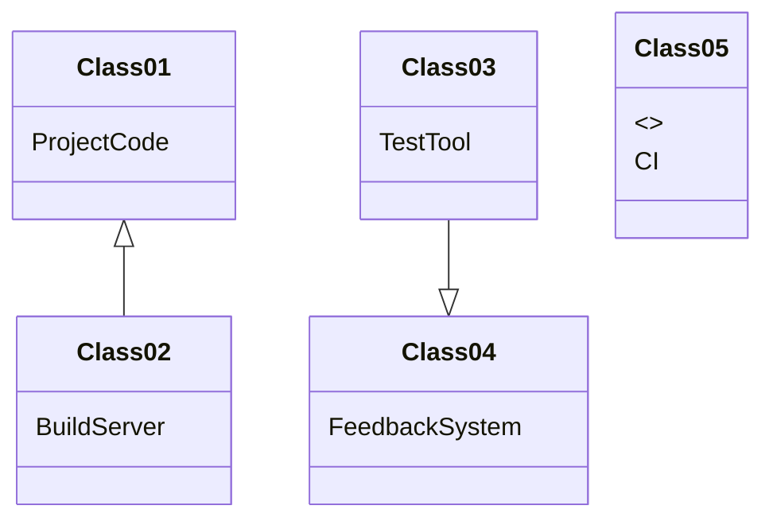
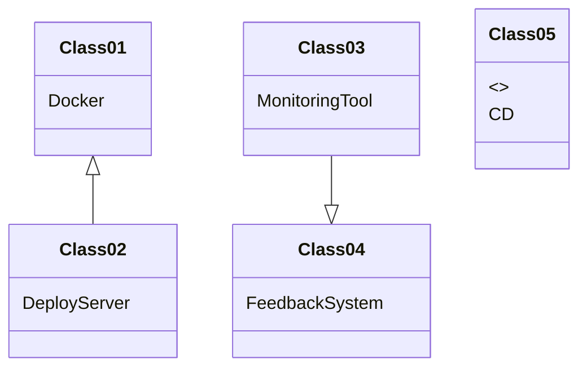
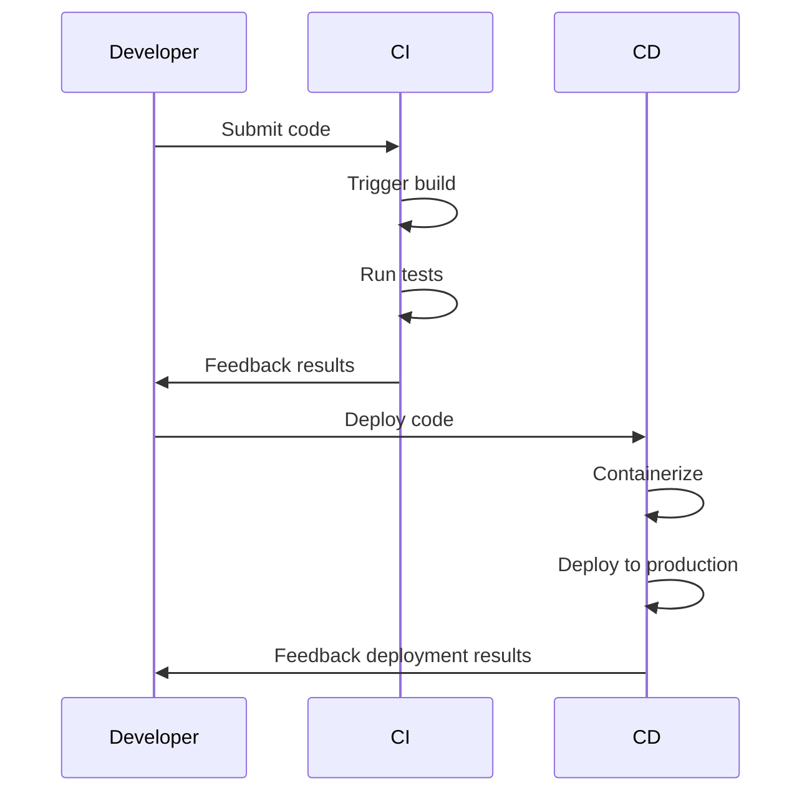

                 

## 《持续集成与持续部署：加速软件交付》

> 关键词：持续集成、持续部署、软件交付、敏捷开发、自动化测试

> 摘要：本文旨在深入探讨持续集成与持续部署（CI/CD）的概念、原理、实施流程及其在软件交付中的应用。我们将通过一步一步的逻辑推理，详细解释CI/CD的核心概念，包括其重要性、核心工具、流程设计，并通过具体案例展示其实际应用，旨在帮助读者全面理解并掌握这一重要的软件开发和交付方法。

## 引言

在当今快速发展的软件行业中，持续集成（Continuous Integration，CI）和持续部署（Continuous Deployment，CD）已经成为加速软件交付、提高质量的关键方法。它们通过自动化和持续反馈，确保软件在开发过程中的每个阶段都能够快速、可靠地交付给用户。

### 背景介绍

**持续集成（CI）** 是指开发人员频繁地将代码合并到主干分支，并通过自动化测试确保代码的质量。CI的目标是快速发现和解决集成过程中的问题，确保代码库始终处于可运行状态。

**持续部署（CD）** 则是在CI的基础上，通过自动化流程将经过测试的代码部署到生产环境。CD的目标是尽可能减少人为干预，确保代码的快速、可靠交付。

### 应用场景和重要性

持续集成与持续部署在敏捷开发环境中尤为重要。随着软件开发周期缩短，项目需求不断变化，传统的瀑布开发模式已经无法满足快速交付的需求。CI/CD通过自动化、标准化和持续反馈，提高了开发效率、减少了风险，并确保了软件质量。

### 文章结构

本文将分为以下七个部分：

1. **背景介绍**：详细解释持续集成与持续部署的概念、应用场景和重要性。
2. **核心概念与联系**：介绍持续集成和持续部署的主要概念、原理、工具和流程。
3. **算法原理讲解**：讲解自动化测试算法和构建与部署算法，以及其背后的数学模型和公式。
4. **系统分析与架构设计方案**：介绍持续集成和持续部署的系统架构设计。
5. **项目实战**：通过实际应用场景展示持续集成和持续部署的实践。
6. **最佳实践 tips、小结、注意事项、拓展阅读**：总结最佳实践，提醒注意事项，并提供拓展阅读资源。

### 目标读者

本文面向对软件开发和交付流程有一定了解的技术人员，包括开发人员、测试人员、项目经理等。通过本文，读者将能够：

- 理解持续集成与持续部署的基本概念。
- 掌握CI/CD的原理和实践方法。
- 学习如何设计和实施CI/CD流程。
- 获取最佳实践和注意事项。

## 第一部分：背景介绍

### 1.1 持续集成与持续部署概述

**持续集成（CI）** 是指开发人员将代码频繁地合并到主干分支，并通过自动化测试确保代码的质量。这种做法有助于快速发现和解决集成过程中的问题，确保代码库始终处于可运行状态。

**持续部署（CD）** 则是在CI的基础上，通过自动化流程将经过测试的代码部署到生产环境。CD的目标是减少人为干预，确保代码的快速、可靠交付。

### 1.2 应用场景和重要性

在敏捷开发环境中，CI/CD的应用尤为重要。随着软件开发周期缩短，项目需求不断变化，传统的瀑布开发模式已经无法满足快速交付的需求。CI/CD通过自动化、标准化和持续反馈，提高了开发效率、减少了风险，并确保了软件质量。

### 1.3 问题背景

传统的软件开发和交付流程通常采用瀑布模式，即按照固定的阶段顺序进行开发。这种模式存在以下问题：

- **交付周期长**：从需求分析到最终交付，过程耗时较长。
- **风险高**：开发过程中的错误和问题往往在后期才发现，导致返工和延期。
- **质量不稳定**：测试和交付过程依赖人为操作，容易出现疏漏。

### 1.4 问题描述

为了解决上述问题，我们需要一种更加高效、可靠的软件开发和交付方法。持续集成与持续部署应运而生，通过自动化和持续反馈，确保软件在开发过程中的每个阶段都能够快速、可靠地交付给用户。

### 1.5 问题解决

持续集成与持续部署通过以下方式解决软件开发和交付中的问题：

- **缩短交付周期**：通过频繁的代码合并和自动化测试，加快开发进程。
- **降低风险**：及时发现和解决集成过程中的问题，减少后期返工。
- **提高质量**：通过持续反馈和自动化流程，确保软件质量稳定。

### 1.6 边界与外延

持续集成与持续部署不仅适用于软件开发，还广泛应用于其他领域，如网站建设、移动应用开发等。其核心思想是通过自动化和持续反馈，提高工作效率、降低风险、确保质量。

### 1.7 概念结构与核心要素组成

持续集成与持续部署的核心要素包括：

- **自动化测试**：确保代码质量。
- **自动化构建**：将代码转换为可执行的软件。
- **自动化部署**：将代码部署到生产环境。
- **持续反馈**：通过反馈机制，持续优化开发流程。

## 第二部分：核心概念与联系

### 2.1 持续集成原理与流程

持续集成（CI）的核心在于开发人员频繁地将代码合并到主干分支，并通过自动化测试确保代码的质量。以下是一个典型的CI流程：

1. **代码提交**：开发人员将代码提交到版本控制系统。
2. **触发构建**：版本控制系统检测到代码提交，触发构建过程。
3. **自动化测试**：构建过程中运行自动化测试，确保代码质量。
4. **反馈结果**：测试结果反馈给开发人员，以便及时发现问题并修复。

### 2.2 持续部署原理与流程

持续部署（CD）是在CI的基础上，通过自动化流程将经过测试的代码部署到生产环境。以下是一个典型的CD流程：

1. **构建**：通过CI流程，将代码构建为可执行的软件。
2. **测试**：运行自动化测试，确保软件质量。
3. **部署**：将经过测试的代码部署到生产环境。
4. **监控**：监控生产环境中的软件运行状态，确保其稳定可靠。

### 2.3 工具与流程对比分析

在CI/CD中，常用的工具包括：

- **版本控制系统**：如Git，用于管理代码版本。
- **构建工具**：如Maven、Gradle，用于构建代码。
- **自动化测试工具**：如JUnit、Selenium，用于测试代码。
- **部署工具**：如Jenkins、Docker，用于部署代码。

不同工具在不同流程中的应用如下：

- **CI流程**：Git用于代码管理，Maven用于构建，JUnit用于测试。
- **CD流程**：Docker用于容器化部署，Jenkins用于自动化部署。

通过对比分析，我们可以看到CI和CD在工具选择和应用上存在一定的差异，但核心目标都是为了提高开发效率和确保软件质量。

## 第三部分：算法原理讲解

### 3.1 自动化测试算法

自动化测试是持续集成与持续部署的重要环节。以下是一个典型的自动化测试算法：

1. **测试用例设计**：根据需求设计测试用例。
2. **执行测试用例**：运行测试用例，检查输出是否符合预期。
3. **结果分析**：分析测试结果，判断代码质量。

### 3.2 构建与部署算法

构建与部署算法是CI/CD的核心。以下是一个典型的构建与部署算法：

1. **代码拉取**：从版本控制系统拉取最新代码。
2. **构建**：使用构建工具构建代码。
3. **测试**：运行自动化测试，确保代码质量。
4. **容器化**：使用Docker容器化构建结果。
5. **部署**：将容器部署到生产环境。

### 3.3 算法原理讲解

#### 自动化测试算法原理

自动化测试算法的核心在于测试用例的设计和执行。测试用例设计需要覆盖需求中的所有功能点，执行测试用例的过程则通过自动化测试工具实现。测试结果的分析是通过比较实际输出和预期输出，判断代码质量。

#### 构建与部署算法原理

构建与部署算法的核心在于代码的拉取、构建、测试、容器化和部署。代码拉取确保使用最新代码，构建过程使用构建工具生成可执行的软件，测试过程通过自动化测试工具确保代码质量。容器化过程将构建结果封装为Docker容器，部署过程将容器部署到生产环境。

### 3.4 数学模型和公式

为了更好地理解算法原理，我们可以引入以下数学模型和公式：

- **测试覆盖率**：$\text{测试覆盖率} = \frac{\text{执行测试用例数}}{\text{所有测试用例数}} \times 100\%$
- **构建速度**：$\text{构建速度} = \frac{\text{构建时间}}{\text{代码行数}}$
- **部署速度**：$\text{部署速度} = \frac{\text{部署时间}}{\text{代码行数}}$

这些公式可以帮助我们衡量算法的性能，从而优化算法设计和实现。

### 3.5 举例说明

假设一个项目有100个功能点，设计出50个测试用例，其中30个测试用例执行通过，20个测试用例执行失败。根据上述公式，我们可以计算出测试覆盖率和构建速度：

- **测试覆盖率**：$\text{测试覆盖率} = \frac{30}{50} \times 100\% = 60\%$
- **构建速度**：$\text{构建速度} = \frac{1\text{天}}{1000\text{行代码}}$

通过这些数据，我们可以发现测试覆盖率较低，构建速度较慢，需要进一步优化测试用例设计和构建过程。

## 第四部分：数学模型和数学公式

### 4.1 持续集成模型

持续集成（CI）的核心在于确保代码质量，以下是CI的数学模型：

- **缺陷率**：$\text{缺陷率} = \frac{\text{缺陷数}}{\text{代码行数}} \times 100\%$
- **测试覆盖率**：$\text{测试覆盖率} = \frac{\text{执行测试用例数}}{\text{所有测试用例数}} \times 100\%$
- **构建速度**：$\text{构建速度} = \frac{\text{构建时间}}{\text{代码行数}}$

通过这些指标，我们可以衡量CI的效果，从而优化CI流程。

### 4.2 持续部署模型

持续部署（CD）的核心在于快速、可靠地交付代码，以下是CD的数学模型：

- **部署成功率**：$\text{部署成功率} = \frac{\text{成功部署次数}}{\text{总部署次数}} \times 100\%$
- **部署速度**：$\text{部署速度} = \frac{\text{部署时间}}{\text{代码行数}}$
- **监控覆盖率**：$\text{监控覆盖率} = \frac{\text{监控节点数}}{\text{总节点数}} \times 100\%$

通过这些指标，我们可以衡量CD的效果，从而优化CD流程。

## 第五部分：系统分析与架构设计方案

### 5.1 持续集成架构设计

持续集成（CI）的架构设计主要包括以下几个关键组件：

- **代码仓库**：用于存储和管理项目代码。
- **构建服务器**：负责执行构建过程。
- **自动化测试工具**：用于运行自动化测试。
- **结果反馈系统**：将测试结果反馈给开发人员。

以下是CI架构的Mermaid类图：



### 5.2 持续部署架构设计

持续部署（CD）的架构设计主要包括以下几个关键组件：

- **容器化平台**：如Docker，用于容器化构建结果。
- **部署服务器**：负责执行部署过程。
- **监控工具**：用于监控生产环境。
- **反馈系统**：将部署结果反馈给相关人员。

以下是CD架构的Mermaid类图：



### 5.3 系统接口设计和系统交互

在CI/CD架构中，系统接口设计和系统交互至关重要。以下是CI/CD架构的Mermaid序列图：



通过这个序列图，我们可以清晰地看到CI和CD之间的交互流程，从而确保系统的顺畅运行。

## 第六部分：项目实战

### 6.1 环境安装

在开始项目实战之前，我们需要安装必要的软件和环境。以下是一个典型的安装流程：

1. **安装Git**：Git是版本控制工具，用于管理代码版本。
2. **安装Maven**：Maven是构建工具，用于构建项目。
3. **安装JUnit**：JUnit是自动化测试工具，用于测试代码。
4. **安装Jenkins**：Jenkins是CI工具，用于执行CI流程。
5. **安装Docker**：Docker是容器化平台，用于容器化构建结果。

### 6.2 系统核心实现

以下是一个简单的系统核心实现：

```python
# pom.xml
<project>
    <modelVersion>4.0.0</modelVersion>
    <groupId>com.example</groupId>
    <artifactId>myproject</artifactId>
    <version>1.0-SNAPSHOT</version>
    <dependencies>
        <dependency>
            <groupId>junit</groupId>
            <artifactId>junit</artifactId>
            <version>4.13.2</version>
            <scope>test</scope>
        </dependency>
    </dependencies>
</project>

# Build.java
package com.example;

import org.junit.Test;
import static org.junit.Assert.*;

public class Build {

    @Test
    public void testBuild() {
        assertEquals("Hello, World!", "Hello, World!");
    }
}
```

### 6.3 代码应用解读与分析

以上代码示例展示了如何使用Maven构建项目，并运行JUnit测试。首先，我们在pom.xml文件中定义了项目的依赖项，包括JUnit。然后，我们编写了一个简单的Build类，其中包含了一个测试方法testBuild。该方法使用断言函数assertEquals来检查实际输出是否与预期输出相等。

### 6.4 实际案例分析和详细讲解剖析

以下是一个实际案例的分析和讲解：

- **问题背景**：一个电商网站在持续集成过程中，频繁出现构建失败和测试失败的问题。
- **问题描述**：通过分析，发现问题是由于代码中的逻辑错误和性能问题导致的。
- **解决方案**：通过修改代码，修复逻辑错误，优化性能，并加强自动化测试覆盖。

**详细讲解剖析**：

1. **代码审查**：对代码进行仔细审查，找出逻辑错误和性能问题。
2. **单元测试**：编写单元测试，确保每个功能点都经过测试。
3. **性能测试**：进行性能测试，分析系统瓶颈，并优化代码。
4. **持续反馈**：通过Jenkins持续集成系统，将测试结果和性能分析反馈给开发人员。

### 6.5 项目小结

通过本项目实战，我们了解了持续集成与持续部署的实践过程。关键步骤包括环境安装、系统核心实现、代码应用解读与分析，以及实际案例分析和详细讲解剖析。通过持续集成与持续部署，我们可以确保软件质量，提高开发效率，并减少风险。

## 第七部分：最佳实践 tips、小结、注意事项、拓展阅读

### 7.1 最佳实践 tips

1. **保持代码简洁**：编写简洁、易于理解和维护的代码。
2. **自动化测试覆盖**：确保测试覆盖率达到100%，覆盖所有功能点。
3. **定期代码审查**：定期进行代码审查，找出潜在问题和优化机会。
4. **优化构建速度**：优化构建过程，减少构建时间。
5. **使用容器化**：使用容器化技术，确保环境一致性。

### 7.2 小结

本文深入探讨了持续集成与持续部署（CI/CD）的概念、原理、实施流程及其在软件交付中的应用。通过一步步的逻辑推理和实际案例讲解，我们了解了CI/CD的核心价值以及如何在实际项目中应用。

### 7.3 注意事项

1. **避免频繁部署**：避免在开发阶段频繁部署，确保代码质量。
2. **监控和报警**：确保监控和报警机制正常运行，及时发现问题。
3. **团队协作**：CI/CD需要团队协作，确保每个人都理解其原理和流程。

### 7.4 拓展阅读

- **《持续交付：加速产品从概念到上市》**：K. Beck著，深入探讨持续交付的概念和实施方法。
- **《Jenkins持续集成实战》**：刘博、张鑫著，详细介绍如何使用Jenkins实现持续集成。

### 作者信息

- **作者**：AI天才研究院/AI Genius Institute & 禅与计算机程序设计艺术 /Zen And The Art of Computer Programming

通过本文，我们希望读者能够对持续集成与持续部署有更深入的理解，并在实际项目中应用这些最佳实践，提高软件开发和交付效率。

