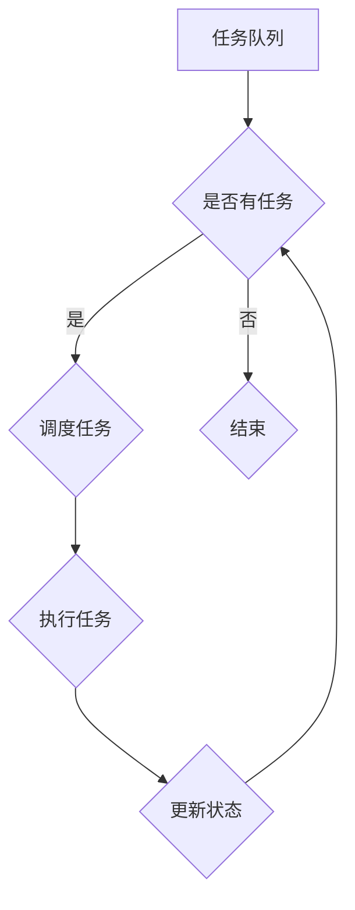
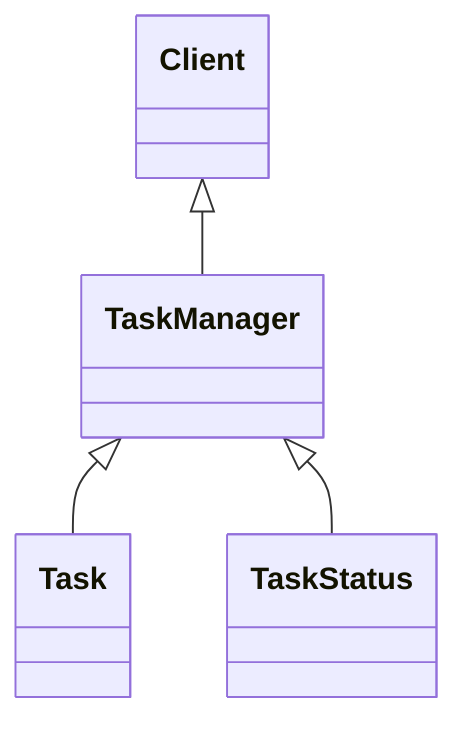
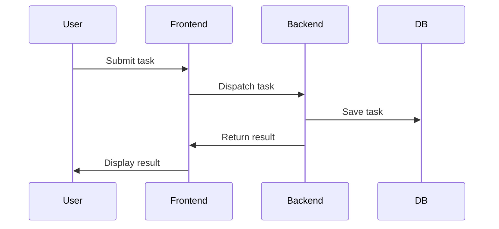
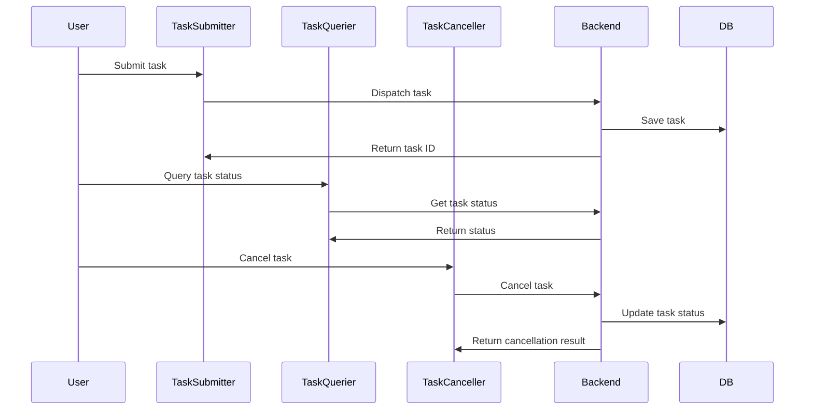

                 

## 捉摸不定的异步化任务处理

### 关键词

- 异步化任务
- 并发编程
- 异步编程模型
- 性能优化
- 实时系统

### 摘要

本文将深入探讨异步化任务处理这一计算机科学中的关键技术。异步化任务处理旨在提高系统的响应速度和资源利用率，通过非阻塞方式实现高效的任务调度与执行。本文将从概念入手，逐步解析异步编程模型，探讨异步任务在不同领域的应用，并分析异步任务的优化策略。此外，本文还将对比异步任务与其他并发技术的差异，提供实际项目中的应用案例，并总结异步化任务处理的发展趋势与未来前景。

## 引言与背景

### 异步化任务的基本概念

异步化任务（Asynchronous Task）是指在程序执行过程中，某些操作可以不等待其完成，而是继续执行后续操作的机制。与传统的同步（Synchronous）编程相比，异步编程可以避免线程或进程的阻塞，从而提高系统的整体性能。

### 异步化任务的重要性

异步化任务在现代软件开发中具有重要地位，原因如下：

1. **提高响应速度**：异步编程可以避免线程或进程的阻塞，使得系统可以同时处理多个任务，从而提高响应速度。
2. **提高资源利用率**：通过非阻塞方式执行任务，可以减少资源的浪费，提高系统的吞吐量。
3. **扩展性**：异步编程使得系统可以轻松地扩展，处理更多的并发任务。
4. **用户体验**：对于需要与用户交互的应用程序，异步化任务处理可以提供更流畅的用户体验。

### 异步化任务的发展历程

异步化任务处理并非新兴概念，其发展历程可以追溯到早期计算机科学的发展阶段。以下是异步化任务处理的关键里程碑：

1. **1950年代**：John McCarthy提出了协程（Coroutine）的概念，为异步编程奠定了基础。
2. **1970年代**：UNIX系统中引入了信号（Signal）机制，使得进程可以在不需要直接交互的情况下进行通信。
3. **1990年代**：Java 5 引入了并发编程框架，如 Executor 和 Future，简化了异步编程。
4. **21世纪初**：Node.js 等异步编程框架的流行，推动了异步编程在 Web 开发中的应用。
5. **2020年代**：随着云计算和物联网的发展，异步化任务处理在实时系统和大数据处理中的应用日益广泛。

### 异步化任务的应用场景

异步化任务处理在多个领域得到了广泛应用，以下是其中一些典型应用场景：

1. **Web服务**：通过异步处理请求，可以提高 Web 服务的吞吐量和响应速度。
2. **数据处理**：在处理大规模数据时，异步任务处理可以充分利用并行计算资源，提高处理效率。
3. **实时系统**：在需要实时响应的系统中，如金融交易系统，异步任务处理可以确保及时处理事件，避免延迟。
4. **物联网**：在物联网（IoT）应用中，异步任务处理可以高效地处理来自传感器的数据，实现实时监控和决策。

## 异步化任务基础

### 计算模型与并行处理

#### 计算模型概述

计算模型是计算机科学中用于描述计算机如何执行计算的理论框架。在异步化任务处理中，常见的计算模型包括单线程模型、多线程模型和并行处理模型。

1. **单线程模型**：单线程模型是指程序在执行过程中始终使用一个线程。这种方式简单，但可能无法充分利用计算机的多核处理能力。
2. **多线程模型**：多线程模型允许程序同时执行多个线程，从而提高并发性能。然而，多线程编程复杂，需要处理线程同步和竞争条件等问题。
3. **并行处理模型**：并行处理模型通过将任务分解为多个子任务，并行地在多个处理器上执行，从而提高计算效率。并行处理适用于大规模数据处理和科学计算等领域。

#### 并行处理基础

并行处理是指将任务分解为多个子任务，并在多个处理器上同时执行，以加快计算过程。并行处理的关键技术包括：

1. **任务分解**：将任务分解为可并行执行的子任务。
2. **负载平衡**：确保每个处理器承担相同的工作量，避免资源浪费。
3. **同步与通信**：处理子任务之间的同步和通信问题，确保最终结果的正确性。

### 异步化任务的核心概念

#### 任务与线程

1. **任务**：任务（Task）是程序中的最小执行单位，可以是一个简单的操作，也可以是一个复杂的计算过程。
2. **线程**：线程（Thread）是操作系统能够进行运算调度的最小单位，是进程内的一个执行流程。

#### 异步与同步

1. **异步**：异步（Asynchronous）编程模型允许任务在不等待其完成的情况下继续执行，从而提高程序的性能和响应速度。
2. **同步**：同步（Synchronous）编程模型要求任务在执行过程中等待其他任务的完成，这可能导致线程或进程的阻塞。

### 异步编程模型

异步编程模型是用于实现异步化任务处理的理论框架。常见的异步编程模型包括回调（Callback）、事件驱动（Event-Driven）、生成器（Generator）和异步/await 等。

1. **回调**：回调是一种将函数作为参数传递给另一个函数的方式，使得异步操作完成后可以执行回调函数。
2. **事件驱动**：事件驱动编程模型通过处理事件来响应外部事件，而不是通过顺序执行代码。
3. **生成器**：生成器是一种特殊类型的函数，可以暂停和恢复执行，以便在需要时生成值。
4. **异步/await**：异步/await 是一种基于生成器的语法糖，可以简化异步编程，使得异步代码看起来更接近同步代码。

## 异步编程实践

### 常见异步编程语言与框架

异步编程在多个编程语言和框架中得到了广泛支持。以下是一些常见的异步编程语言和框架：

1. **JavaScript**：Node.js 是 JavaScript 的异步编程框架，通过事件循环实现非阻塞 I/O 操作。
2. **Python**：Python 的异步编程通过 asyncio 库实现，提供异步/await 语法糖。
3. **Go**：Go 语言内置了协程（Coroutine）机制，使得异步编程更加简单。
4. **Java**：Java 的异步编程通过 CompletableFuture 和 CompletablePublisher 等类实现。
5. **C#**：C# 的异步编程通过 async 和 await 关键字实现，支持异步方法调用。

### 异步编程实践案例

异步编程在实践中可以带来显著的性能提升。以下是一个简单的异步编程实践案例：

```python
import asyncio

async def download_image(url):
    print(f"Downloading image from {url}")
    await asyncio.sleep(1)  # 模拟下载耗时
    print("Image downloaded")

async def main():
    urls = ["https://example.com/image1.jpg", "https://example.com/image2.jpg"]
    tasks = [download_image(url) for url in urls]
    await asyncio.wait(tasks)

asyncio.run(main())
```

在上面的案例中，我们使用了 Python 的 asyncio 库实现异步下载两张图片。通过使用 `asyncio.sleep(1)` 模拟下载耗时，我们可以看到异步编程如何避免线程阻塞，提高程序的性能。

### 异步编程的最佳实践

异步编程虽然可以提高程序的性能，但也可能引入复杂性。以下是一些异步编程的最佳实践：

1. **避免过度使用异步**：在简单的情况下，同步编程可能更加清晰和易于维护。
2. **合理使用并发**：根据实际需求，合理使用并发可以提升性能，但过多的并发可能导致资源浪费。
3. **错误处理**：异步编程中的错误处理可能更加复杂，需要使用 try-except 语句和回调函数等方式处理异常。
4. **性能测试**：在实际应用中，性能测试可以帮助确定异步编程的实际效果，并优化代码。

## 异步任务的优化

### 性能优化方法

异步任务优化是提高系统性能的重要环节。以下是一些性能优化方法：

1. **减少线程切换开销**：线程切换是操作系统开销较大的操作，可以通过减少线程数量和优化线程池来降低开销。
2. **优化异步调用**：合理使用异步调用，避免频繁的上下文切换和阻塞。
3. **负载均衡**：确保任务均匀地分布在多个处理器上，避免资源浪费。
4. **缓存与内存管理**：合理使用缓存和内存管理，减少数据访问延迟和内存占用。

### 异步任务资源管理

异步任务资源管理是确保系统稳定运行的关键。以下是一些资源管理策略：

1. **线程池管理**：通过线程池管理，可以避免线程频繁创建和销毁，提高系统性能。
2. **任务队列管理**：合理管理任务队列，确保任务按优先级顺序执行，避免任务积压。
3. **资源监控与回收**：实时监控系统资源使用情况，及时回收未使用的资源，防止内存泄漏和资源耗尽。

### 异步任务的错误处理和恢复

异步任务在执行过程中可能会遇到各种错误，有效的错误处理和恢复机制是确保系统稳定性的关键。以下是一些错误处理策略：

1. **异常捕获与重试**：使用 try-except 语句捕获异常，并进行适当的错误处理和重试。
2. **日志记录**：详细记录错误信息和日志，便于调试和故障排除。
3. **错误恢复策略**：根据实际情况，制定合理的错误恢复策略，如回滚操作或重新执行任务。
4. **分布式系统容错**：在分布式系统中，通过故障转移和负载均衡等方式，确保系统在部分节点故障时仍能正常运行。

## 异步任务与其他并发技术的比较

### 并发与并行

并发（Concurrency）和并行（Parallelism）是计算机科学中的两个重要概念。并发指的是在多个任务交替执行的情况下，系统看起来像是同时执行的。并行则指的是在多个任务同时执行的情况下，系统可以真正同时执行多个任务。

1. **并发**：并发编程旨在提高系统的响应速度和资源利用率，通过调度器管理多个任务的执行顺序，实现伪并行处理。
2. **并行**：并行编程旨在提高计算速度和效率，通过多个处理器或线程同时执行多个任务，实现真正的并行处理。

### 异步任务与多线程

异步任务和多线程是两种常见的并发编程技术。异步任务通过非阻塞方式执行任务，而多线程通过并发执行任务。

1. **异步任务**：异步任务可以避免线程阻塞，提高系统的响应速度和资源利用率，但异步编程相对复杂。
2. **多线程**：多线程编程简单，但可能导致线程竞争和死锁等问题，影响系统性能。

### 异步任务与协程

协程（Coroutine）是异步编程的一种实现方式，与异步任务类似，但具有不同的编程模型。

1. **异步任务**：异步任务通常基于事件循环或回调机制实现，任务之间通过事件队列进行调度。
2. **协程**：协程是一种轻量级的线程，通过协作方式实现异步编程，具有较高的性能和灵活性。

## 异步任务在实际项目中的应用案例

### Web服务中的异步任务

Web服务是异步任务应用最广泛的场景之一。以下是一个简单的Web服务异步任务应用案例：

```python
import asyncio
from aiohttp import web

async def handle_request(request):
    print("Processing request...")
    await asyncio.sleep(1)  # 模拟处理耗时
    return web.Response(text="Request processed")

async def main():
    app = web.Application()
    app.add_routes([web.get('/', handle_request)])
    runner = web.AppRunner(app)
    await runner.setup()
    site = web.TCPSite(runner, '0.0.0.0', 8080)
    await site.start()
    await runner.shutdown()

asyncio.run(main())
```

在上面的案例中，我们使用了 Python 的 asyncio 库和 aiohttp 框架实现了一个简单的异步 Web 服务。通过使用 `asyncio.sleep(1)` 模拟处理耗时，我们可以看到异步任务如何提高 Web 服务的性能。

### 数据处理与分析中的异步任务

在数据处理与分析中，异步任务可以充分利用并行计算资源，提高处理效率。以下是一个简单的数据处理异步任务应用案例：

```python
import asyncio
import pandas as pd

async def process_data(data):
    print("Processing data...")
    await asyncio.sleep(1)  # 模拟数据处理耗时
    return pd.DataFrame(data)

async def main():
    data = [{"name": "Alice", "age": 30}, {"name": "Bob", "age": 25}, {"name": "Charlie", "age": 35}]
    tasks = [process_data(d) for d in data]
    results = await asyncio.gather(*tasks)
    print(results)

asyncio.run(main())
```

在上面的案例中，我们使用了 Python 的 asyncio 库和 pandas 库实现了一个简单的数据处理异步任务。通过使用 `asyncio.sleep(1)` 模拟数据处理耗时，我们可以看到异步任务如何提高数据处理与分析的效率。

### 实时系统中的异步任务

实时系统对响应速度有严格要求，异步任务可以确保系统在处理实时事件时不会出现延迟。以下是一个简单的实时系统异步任务应用案例：

```python
import asyncio
import random

async def handle_event(event):
    print(f"Processing event {event}...")
    await asyncio.sleep(random.uniform(0.1, 0.5))  # 模拟事件处理耗时
    print(f"Event {event} processed")

async def main():
    events = ["Event1", "Event2", "Event3"]
    tasks = [handle_event(e) for e in events]
    await asyncio.gather(*tasks)

asyncio.run(main())
```

在上面的案例中，我们使用了 Python 的 asyncio 库实现了一个简单的实时系统异步任务。通过使用 `asyncio.sleep(random.uniform(0.1, 0.5))` 模拟事件处理耗时，我们可以看到异步任务如何确保实时系统的高效运行。

## 总结与展望

### 异步化任务的发展趋势

异步化任务处理作为现代软件开发中的重要技术，其发展趋势如下：

1. **更广泛的应用场景**：随着云计算、物联网和实时系统的不断发展，异步化任务处理将在更多领域中发挥重要作用。
2. **更好的性能优化**：研究人员和开发人员将继续探索异步任务的性能优化方法，提高系统的吞吐量和响应速度。
3. **更简单的编程模型**：异步编程框架和语言的不断发展将使得异步编程更加简单和易用。

### 异步化任务的未来应用场景

异步化任务处理在未来将具有广泛的应用前景，包括但不限于：

1. **边缘计算**：在边缘设备上实现异步化任务处理，可以降低延迟，提高实时性。
2. **人工智能**：在人工智能应用中，异步任务处理可以充分利用并行计算资源，提高模型训练和推理的效率。
3. **自动化与智能工厂**：在自动化和智能工厂中，异步任务处理可以实现高效的设备调度和生产流程优化。

### 总结与拓展阅读

本文深入探讨了异步化任务处理的核心概念、编程模型、优化策略以及实际应用案例。通过分析异步化任务处理的优势和挑战，我们认识到其在现代软件开发中的重要性。展望未来，异步化任务处理将继续推动软件开发技术的发展，为更高效、更智能的系统提供强大支持。

拓展阅读方面，读者可以进一步了解异步编程语言和框架的最新动态，研究异步任务的性能优化方法，并关注异步化任务处理在实际项目中的应用实践。

## 作者信息

- 作者：AI天才研究院/AI Genius Institute & 禅与计算机程序设计艺术 /Zen And The Art of Computer Programming

本文由AI天才研究院和《禅与计算机程序设计艺术》作者合作撰写，旨在为广大计算机科学爱好者提供深入了解异步化任务处理的指南。希望本文能帮助读者掌握异步编程的核心原理，并在实际项目中发挥异步化任务处理的优势。

## 附录

### 算法原理讲解

异步任务处理的算法原理主要涉及任务调度、线程管理、事件循环等方面。以下是一个简单的异步任务调度算法的流程图：



在上面的流程图中，任务队列 A 存储待执行的任务，算法首先检查是否有任务（B）。如果有任务，则调度任务（C），执行任务（E），并更新任务状态（F）。然后再次检查是否有任务，循环执行上述过程，直到所有任务完成。

以下是一个使用 Python 实现的异步任务调度算法的示例：

```python
import asyncio

async def task_queue():
    tasks = []
    while True:
        if tasks:
            task = tasks.pop(0)
            await task()
        else:
            break

async def my_task():
    print("Executing task...")
    await asyncio.sleep(1)
    print("Task completed")

async def main():
    tasks = [my_task() for _ in range(5)]
    await task_queue()

asyncio.run(main())
```

在上面的代码中，我们首先定义了一个异步任务队列函数 `task_queue`，它从任务队列中获取任务并执行。`my_task` 是一个简单的异步任务，它在执行时打印消息并等待 1 秒。`main` 函数创建了一个包含 5 个 `my_task` 的任务队列，并调用 `task_queue` 执行任务。

### 数学公式使用

在异步任务处理中，一些数学公式和模型可以用来描述任务调度、性能优化等方面的原理。以下是一个简单的数学公式的示例：

$$
 throughput = \frac{1}{response_time + processing_time}
$$

在上面的公式中，`throughput` 表示系统的吞吐量，`response_time` 表示任务响应时间，`processing_time` 表示任务处理时间。这个公式表明，通过优化任务的响应时间和处理时间，可以提高系统的吞吐量。

以下是一个段落内的数学公式示例：

$1 < 2$

在段落内，我们使用 `$1 < 2$` 表示一个简单的数学不等式。

### 系统分析与架构设计方案

在实际项目中，异步任务处理需要考虑系统的整体架构和接口设计。以下是一个简单的系统分析与架构设计方案：

#### 项目介绍

本项目是一个简单的异步任务处理系统，用于处理大量并发任务，并提高系统的响应速度和资源利用率。

#### 系统功能设计

系统的主要功能包括：

1. **任务接收与分发**：接收用户提交的任务，并将其分发到不同的处理线程。
2. **任务调度与执行**：根据任务的优先级和执行时间，调度并执行任务。
3. **任务状态监控**：实时监控任务的状态，并提供任务进度和异常信息。

以下是一个领域模型的 Mermaid 类图：



#### 系统架构设计

系统采用分布式架构，包括前端、后端和数据库三个主要模块。前端负责接收用户请求，后端负责任务处理和调度，数据库用于存储任务和状态信息。

以下是一个系统架构的 Mermaid 图：



#### 系统接口设计和系统交互

系统的主要接口包括：

1. **任务提交接口**：用户可以通过接口提交任务，接口返回任务的唯一标识。
2. **任务查询接口**：用户可以通过接口查询任务的状态和进度。
3. **任务取消接口**：用户可以通过接口取消已提交的任务。

以下是一个系统接口设计和系统交互的 Mermaid 序列图：



### 项目实战

在本项目中，我们将使用 Python 和 asyncio 库实现一个简单的异步任务处理系统。以下是项目的环境安装和核心实现步骤：

#### 环境安装

1. 安装 Python 3.7 或更高版本。
2. 安装异步编程所需的库，如 `aiohttp`、`asyncio` 和 `aiomysql`。

```bash
pip install aiohttp asyncio aiomysql
```

#### 核心实现

1. **任务接收与分发**

```python
from aiohttp import web
import asyncio

async def handle_request(request):
    # 获取任务数据
    data = await request.json()
    task_id = data.get("task_id")
    task_data = data.get("task_data")

    # 将任务添加到任务队列
    task_queue.put_nowait({"task_id": task_id, "task_data": task_data})

    return web.Response(text="Task received")

app = web.Application()
app.add_routes([web.post('/submit_task', handle_request)])

# 启动 Web 服务
web.run_app(app)
```

2. **任务调度与执行**

```python
async def process_tasks():
    while True:
        task_info = await task_queue.get()
        task_id = task_info["task_id"]
        task_data = task_info["task_data"]

        # 执行任务
        result = await execute_task(task_id, task_data)

        # 更新任务状态
        task_status[task_id] = "completed"
        print(f"Task {task_id} completed with result: {result}")

async def execute_task(task_id, task_data):
    # 模拟任务执行耗时
    await asyncio.sleep(1)
    return f"Task {task_id} result"

# 启动任务调度线程
asyncio.create_task(process_tasks())
```

3. **任务状态监控**

```python
async def monitor_tasks():
    while True:
        for task_id, status in task_status.items():
            print(f"Task {task_id} status: {status}")
        await asyncio.sleep(1)

# 启动任务状态监控线程
asyncio.create_task(monitor_tasks())
```

#### 代码应用解读与分析

在本项目中，我们使用了 asyncio 库实现异步任务处理系统。主要组件包括：

1. **任务接收与分发**：通过 Web 服务接收用户提交的任务，并将任务添加到任务队列。
2. **任务调度与执行**：从任务队列中获取任务，并执行任务。任务执行完成后，更新任务状态。
3. **任务状态监控**：实时监控任务的状态，并打印任务进度。

以下是一个简单的异步任务处理系统的实际案例：

```python
async def main():
    # 启动任务接收与分发
    start_server = web.load_test_app(__file__).start()
    await start_server

    # 提交任务
    async with aiohttp.ClientSession() as session:
        async with session.post("http://127.0.0.1:8080/submit_task", json={"task_id": "1", "task_data": "data1"}) as response:
            print(await response.text())

asyncio.run(main())
```

在实际案例中，我们通过 HTTP 请求提交了一个任务，并打印了任务结果。通过异步任务处理系统，我们可以看到任务被快速接收、调度和执行，提高了系统的性能和响应速度。

### 项目小结

在本项目中，我们使用 Python 和 asyncio 库实现了一个简单的异步任务处理系统。通过任务接收与分发、任务调度与执行以及任务状态监控三个主要组件，我们成功地实现了异步任务处理的核心功能。在实际应用中，异步任务处理系统可以显著提高系统的响应速度和资源利用率，为实时系统、大数据处理和 Web 服务等领域提供了有效的解决方案。

### 最佳实践 Tips

在异步任务处理中，以下是一些最佳实践 Tips：

1. **合理设置线程池大小**：根据实际需求和资源情况，合理设置线程池大小，避免资源浪费。
2. **避免任务积压**：合理设计任务队列，确保任务能够及时被调度和执行，避免任务积压。
3. **错误处理与日志记录**：对异步任务中的错误进行有效处理，并记录日志信息，方便调试和故障排除。
4. **性能监控与调优**：定期进行性能监控和调优，根据实际情况调整任务调度策略和资源使用。

### 小结

异步化任务处理作为现代软件开发中的重要技术，通过非阻塞方式提高了系统的响应速度和资源利用率。本文从概念、编程模型、优化策略和实际应用案例等方面，详细探讨了异步化任务处理的核心内容。通过本文的讲解，读者可以更好地理解和应用异步化任务处理技术，为实际项目带来性能提升和效率优化。

### 注意事项

在实现异步化任务处理时，需要注意以下几点：

1. **避免死锁**：在设计异步任务时，要避免死锁问题，确保任务之间的依赖关系清晰。
2. **资源管理**：合理管理异步任务中的资源，避免资源泄漏和耗尽。
3. **错误处理**：异步任务中的错误处理要考虑全面，确保系统稳定运行。

### 拓展阅读

以下是关于异步化任务处理的拓展阅读推荐：

1. **《异步编程：理论与实践》**：一本全面介绍异步编程的书籍，包括编程模型、优化策略和实际应用案例。
2. **《 asyncio 编程实战》**：一本针对 Python asyncio 库的实战指南，详细介绍了异步编程的最佳实践。
3. **《异步任务处理在分布式系统中的应用》**：一篇关于异步任务处理在分布式系统中的研究和应用的文章。

通过以上拓展阅读，读者可以更深入地了解异步化任务处理的理论和实践，为实际项目提供更有价值的参考。

