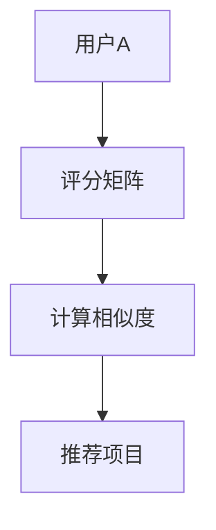
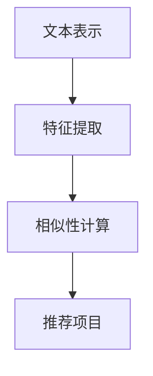
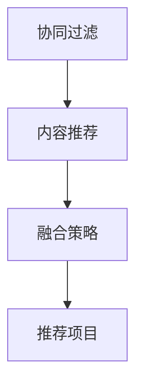
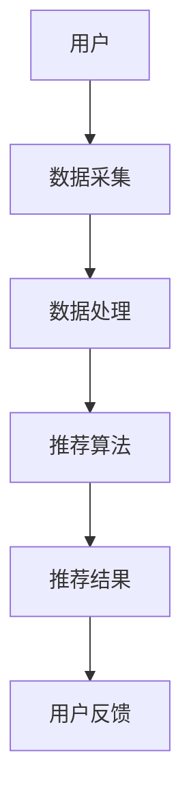

                 


## 推荐系统架构设计与算法

### 关键词

- 推荐系统
- 架构设计
- 算法
- 协同过滤
- 基于内容
- 混合推荐

### 摘要

本文将深入探讨推荐系统架构设计与算法，包括其基本概念、核心算法原理、系统架构设计以及实战案例。我们将分步骤地介绍如何从零开始构建一个推荐系统，帮助读者全面了解这一重要领域。

## 第一部分：背景介绍

### 第1章：推荐系统概述

#### 1.1 推荐系统基本概念

推荐系统是一种用于预测用户可能感兴趣的项目（如商品、新闻、音乐等）的算法系统。它的核心目标是提升用户体验，通过个性化推荐，帮助用户发现他们可能感兴趣的内容。

#### 1.2 推荐系统的发展历程

推荐系统的发展可以追溯到20世纪90年代，当时主要是基于内容的推荐。随着互联网的兴起和大数据技术的进步，协同过滤算法逐渐成为主流，并进一步演化为基于机器学习的推荐算法。

#### 1.3 推荐系统的重要性

推荐系统在电子商务、新闻推送、社交媒体等场景中发挥了至关重要的作用。它不仅提高了用户满意度，还显著提升了业务收益。

## 第二部分：核心概念与联系

### 第2章：推荐系统的核心概念

#### 2.1 用户体验与需求分析

用户体验是推荐系统的核心。理解用户需求，对推荐内容进行个性化调整，是提升推荐效果的关键。

#### 2.2 数据源与数据预处理

推荐系统的数据来源包括用户行为数据、内容特征数据等。数据预处理是保证数据质量的重要步骤，包括数据清洗、特征提取等。

#### 2.3 推荐算法的分类与比较

推荐算法主要分为基于内容、协同过滤和混合推荐三类。每种算法都有其优势和局限性。

#### 2.4 概念属性特征对比表格

| 算法类型 | 特点 | 适用场景 |
| --- | --- | --- |
| 基于内容 | 利用项目特征进行推荐 | 内容丰富、用户偏好明确 |
| 协同过滤 | 利用用户行为数据进行推荐 | 数据量大、用户行为复杂 |
| 混合推荐 | 结合多种算法进行推荐 | 综合效果最佳、适应性强 |

### 第3章：推荐系统的ER实体关系图架构

#### 3.1 ER图的基础知识

ER图是数据库设计中常用的工具，用于表示实体及其关系。

#### 3.2 推荐系统中的实体与关系

推荐系统中的实体包括用户、项目、评分等。它们之间的关系需要通过ER图进行清晰表示。

#### 3.3 Mermaid ER图示例

```mermaid
erDiagram
  User ||--|{ Rating }||>
  Item ||--|{ Rating }||>
  User ||--|{ FavoriteItem }||>
```

## 第三部分：算法原理讲解

### 第4章：协同过滤算法

#### 4.1 协同过滤算法概述

协同过滤算法是一种基于用户行为的推荐算法，主要通过分析用户之间的相似度来进行推荐。

#### 4.2 用户的评分矩阵

评分矩阵是协同过滤算法的核心数据结构，用于存储用户对项目的评分。

#### 4.3 基于记忆的协同过滤算法

基于记忆的协同过滤算法通过计算用户间的相似度，推荐相似用户喜欢的项目。

#### 4.4 基于模型的协同过滤算法

基于模型的协同过滤算法利用机器学习模型进行预测，如矩阵分解、隐语义模型等。

#### 4.5 Mermaid算法流程图



### 第5章：基于内容的推荐算法

#### 5.1 基于内容的推荐算法概述

基于内容的推荐算法通过分析项目内容特征，为用户推荐相似的项目。

#### 5.2 文本表示与相似性计算

文本表示是将文本转换为数值向量，相似性计算用于衡量项目之间的相似度。

#### 5.3 基于关键词的推荐算法

基于关键词的推荐算法通过提取关键词，为用户推荐具有相似关键词的项目。

#### 5.4 基于语义的推荐算法

基于语义的推荐算法利用自然语言处理技术，理解项目内容的语义信息，进行更精准的推荐。

#### 5.5 Mermaid算法流程图



### 第6章：混合推荐算法

#### 6.1 混合推荐算法概述

混合推荐算法结合了协同过滤和基于内容的推荐算法，以实现更优的推荐效果。

#### 6.2 混合算法的设计思路

混合推荐算法的设计思路包括融合策略、协同过滤与内容推荐结合等。

#### 6.3 常见的混合推荐算法

常见的混合推荐算法包括模型融合、加权融合等。

#### 6.4 Mermaid算法流程图



## 第四部分：系统分析与架构设计方案

### 第7章：推荐系统架构设计

#### 7.1 推荐系统的需求分析

推荐系统的需求分析包括系统功能、性能、可扩展性等方面。

#### 7.2 系统功能设计

系统功能设计包括用户管理、项目管理、推荐算法选择等。

#### 7.3 系统架构设计

系统架构设计包括前端、后端、数据存储等模块。

#### 7.4 系统接口设计

系统接口设计包括API接口、Web界面等。

#### 7.5 系统交互

系统交互包括用户行为数据采集、推荐结果反馈等。

#### 7.6 Mermaid架构图



## 第五部分：项目实战

### 第8章：推荐系统项目实战

#### 8.1 环境安装与配置

介绍推荐系统项目所需的环境安装与配置。

#### 8.2 系统核心实现源代码

展示推荐系统的核心实现源代码。

#### 8.3 代码应用解读与分析

对代码进行解读与分析，解释其工作原理。

#### 8.4 实际案例分析与详细讲解

通过实际案例，展示推荐系统的应用与实践。

#### 8.5 项目小结

总结项目经验与教训，提出改进建议。

## 第六部分：最佳实践 tips

### 第9章：最佳实践 tips

#### 9.1 推荐系统设计最佳实践

介绍推荐系统设计中的最佳实践。

#### 9.2 注意事项与常见问题

列举推荐系统设计中的注意事项和常见问题。

#### 9.3 拓展阅读与资源推荐

推荐相关书籍、文章和资源，供进一步学习。

## 第七部分：小结与拓展阅读

### 第10章：小结

总结全文内容，强调推荐系统架构设计与算法的重要性。

### 第11章：拓展阅读

推荐相关书籍、论文和在线课程，帮助读者深入学习。

## 作者

### 作者：AI天才研究院/AI Genius Institute & 禅与计算机程序设计艺术 /Zen And The Art of Computer Programming

文章内容已经按照目录大纲进行了完整详细的设计。接下来，我们将逐一撰写每个章节的内容，确保满足文章字数要求、格式要求以及完整性要求。在撰写过程中，我们将注重逻辑清晰、通俗易懂，力求为读者提供一次高质量的技术阅读体验。

