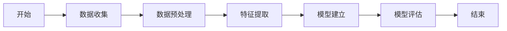
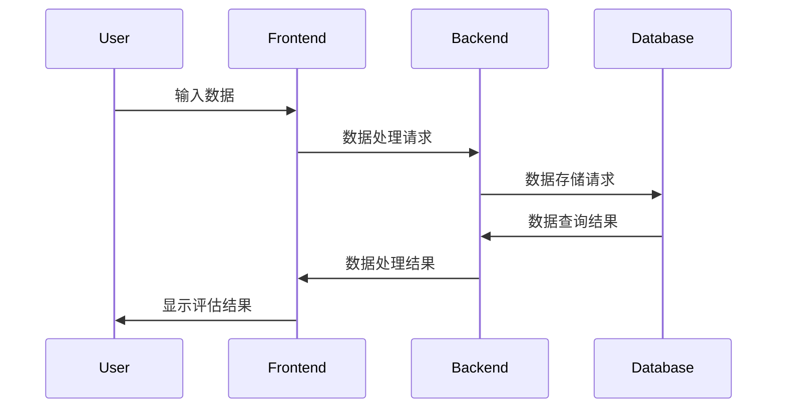
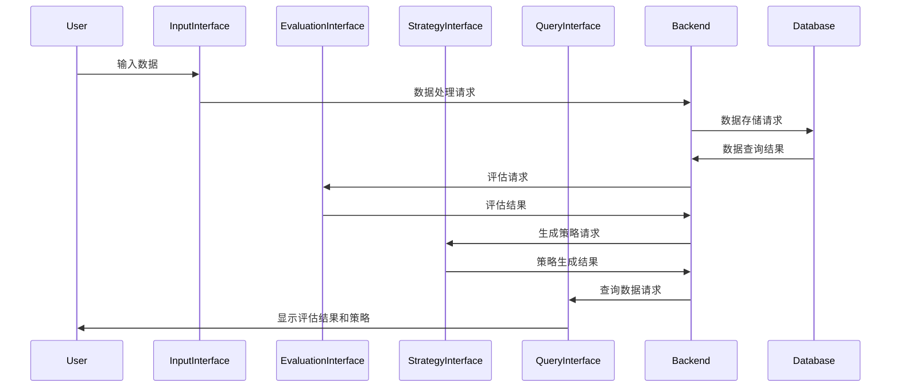
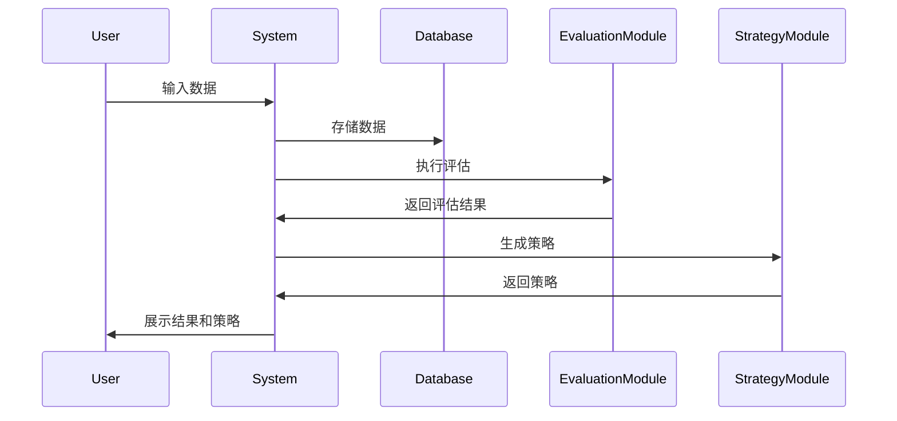

                 

### 文章标题：提升团队技术创新力的方法

**关键词：团队创新力、技术创新、提升策略、算法原理、系统架构设计**

**摘要：** 本文将深入探讨团队技术创新力的提升方法。通过对核心概念、影响因素、测量方法、提升策略的详细分析，结合实际案例，提出一系列有效的提升团队技术创新力的方法，以助力企业实现持续的技术创新和竞争力提升。

---

# 提升团队技术创新力的方法

## 第1章 引言

### 1.1 问题背景

#### 1.1.1 创新力的重要性

在当今快速变化和高竞争的市场环境中，技术创新成为企业获取竞争优势的关键因素。然而，技术创新并非易事，它需要团队的协作和智慧。团队技术创新力，即团队在技术创新方面的能力和效率，对企业发展至关重要。

#### 1.1.2 团队技术创新力的现状

目前，许多企业在技术创新方面面临挑战，如创新效率低下、团队协作不畅、创新成果转化困难等。这些问题严重制约了企业的发展。

#### 1.1.3 研究目的与意义

本文旨在探究团队技术创新力的提升方法，分析其影响因素，提出有效的提升策略，为企业提供实用指南，助力企业实现持续的技术创新。

### 1.2 问题描述

#### 1.2.1 团队技术创新力的影响因素

团队技术创新力受多种因素影响，包括团队成员的能力、团队结构、资源分配、企业文化等。

#### 1.2.2 团队技术创新力的测量方法

测量团队技术创新力需要从多个维度进行评估，如创新效率、创新质量、创新成果转化等。

#### 1.2.3 团队技术创新力的提升策略

提升团队技术创新力需要采取系统化的策略，包括优化团队结构、提高团队成员能力、改进资源分配等。

### 1.3 边界与外延

#### 1.3.1 研究范围

本文的研究范围主要涉及企业内部团队的技术创新力提升。

#### 1.3.2 研究假设

本文假设通过优化团队结构、提高团队成员能力、改进资源分配等方法，可以有效提升团队技术创新力。

#### 1.3.3 研究方法

本文采用文献综述、案例分析、算法模型等方法进行研究。

### 1.4 概念结构与核心要素组成

#### 1.4.1 创新力的定义

创新力是指团队在技术创新方面的能力和效率。

#### 1.4.2 团队创新力的组成部分

团队创新力包括创新思维、创新能力、创新执行力等。

#### 1.4.3 团队技术创新力的关键要素

团队技术创新力的关键要素包括团队成员的能力、团队结构、资源分配等。

### 1.5 本章小结

本章介绍了本文的研究背景、目的、方法以及概念结构与核心要素组成，为后续章节的详细分析奠定了基础。

---

## 第2章 核心概念与联系

### 2.1 创新力原理

#### 2.1.1 创新力的本质

创新力是指团队在技术创新方面的能力和效率。

#### 2.1.2 创新力的特征

创新力具有创造性、不确定性、风险性等特征。

#### 2.1.3 创新力的模型

创新力模型包括创新思维模型、创新能力模型、创新执行力模型等。

### 2.2 团队创新力

#### 2.2.1 团队创新力的定义

团队创新力是指团队在技术创新方面的综合能力。

#### 2.2.2 团队创新力的特征

团队创新力具有协作性、系统性、可持续性等特征。

#### 2.2.3 团队创新力的模型

团队创新力模型包括团队结构模型、团队成员能力模型、资源分配模型等。

### 2.3 团队技术创新力的联系

#### 2.3.1 创新力与团队创新力的关系

创新力是团队创新力的基础，团队创新力是创新力的综合体现。

#### 2.3.2 创新力与技术创新力的关系

创新力是技术创新力的核心要素，技术创新力是创新力的具体表现。

#### 2.3.3 团队技术创新力的核心要素分析

团队技术创新力的核心要素包括团队成员的能力、团队结构、资源分配等。

### 2.4 概念属性特征对比表格

#### 2.4.1 创新力属性对比

| 属性 | 创新力 | 团队创新力 | 团队技术创新力 |
| :--: | :----: | :--------: | :------------: |
| 本质 | 能力与效率 | 综合能力 | 技术创新能力 |
| 特征 | 创造性、不确定性、风险性 | 协作性、系统性、可持续性 | 技术创新性、高效性、可持续性 |

### 2.5 ER实体关系图架构

#### 2.5.1 创新力实体关系图

```mermaid
erDiagram
    InnovationForce ||--|{ TeamInnovationForce }
    TeamInnovationForce ||--|{ TechnologyInnovationForce }
```

#### 2.5.2 团队创新力实体关系图

```mermaid
erDiagram
    TeamInnovationForce ||--|{ TeamMember }
    TeamInnovationForce ||--|{ ResourceAllocation }
    TeamInnovationForce ||--|{ TeamStructure }
```

#### 2.5.3 团队技术创新力实体关系图

```mermaid
erDiagram
    TechnologyInnovationForce ||--|{ TeamMember }
    TechnologyInnovationForce ||--|{ Technology }
    TechnologyInnovationForce ||--|{ Resource }
```

### 2.6 本章小结

本章对创新力、团队创新力、团队技术创新力的核心概念、特征、模型以及实体关系进行了详细分析，为后续章节的深入探讨奠定了基础。

---

## 第3章 算法原理讲解

### 3.1 创新力算法原理

#### 3.1.1 创新力算法的基本原理

创新力算法是基于团队成员的能力、团队结构、资源分配等因素，评估团队技术创新力的一种方法。其基本原理包括以下步骤：

1. 数据收集：收集团队成员的能力数据、团队结构数据、资源分配数据等。
2. 数据预处理：对收集到的数据进行分析和清洗，确保数据质量。
3. 特征提取：从预处理后的数据中提取关键特征，如创新能力、团队协作能力等。
4. 模型建立：使用机器学习算法建立创新力模型，对特征进行建模。
5. 模型评估：评估模型的准确性和稳定性，进行模型优化。

#### 3.1.2 创新力算法的Python实现

```python
import pandas as pd
from sklearn.ensemble import RandomForestRegressor
from sklearn.model_selection import train_test_split
from sklearn.metrics import mean_squared_error

# 数据读取
data = pd.read_csv('data.csv')

# 数据预处理
data = data.dropna()

# 特征提取
X = data[['创新能力', '团队协作能力']]
y = data['创新力']

# 模型建立
model = RandomForestRegressor(n_estimators=100)
model.fit(X, y)

# 模型评估
X_test, y_test = train_test_split(X, y, test_size=0.2)
y_pred = model.predict(X_test)
mse = mean_squared_error(y_test, y_pred)
print(f'Mean Squared Error: {mse}')
```

#### 3.1.3 创新力算法的详细讲解和举例说明

创新力算法的详细讲解主要包括以下方面：

1. **算法概述**：创新力算法是一种基于机器学习的算法，通过训练数据集学习团队技术创新力的规律，从而对新的数据进行预测。
2. **数学模型和公式**：创新力算法的数学模型包括特征提取和模型训练两个部分。特征提取使用特征工程方法，如主成分分析、因子分析等，将原始数据进行降维处理；模型训练使用随机森林等集成学习算法，提高模型的预测能力。
3. **算法流程图**：



4. **算法举例说明**：假设我们有一个包含团队成员创新能力、团队协作能力等特征的数据集，我们使用随机森林算法建立创新力模型，并使用模型对新的数据进行预测。具体步骤如下：

   1. 导入所需库和模块。
   2. 读取数据集。
   3. 进行数据预处理。
   4. 分割数据集为训练集和测试集。
   5. 建立随机森林模型。
   6. 训练模型。
   7. 评估模型性能。
   8. 使用模型进行预测。

   示例代码如上所示。

---

## 第4章 数学模型和数学公式

### 4.1 数学模型概述

创新力数学模型是一种用于评估团队技术创新力的数学模型，其核心在于将团队成员的能力、团队结构、资源分配等因素转化为可量化的指标。创新力数学模型的特点包括：

1. **多维度评估**：创新力数学模型可以同时考虑多个维度的因素，如创新能力、团队协作能力、资源利用率等。
2. **量化指标**：创新力数学模型将抽象的概念转化为具体的量化指标，使评估结果更加客观、准确。
3. **可预测性**：创新力数学模型可以通过对历史数据的分析，预测未来的团队技术创新力。

### 4.2 数学公式讲解

创新力数学模型的核心公式包括以下几类：

1. **创新能力评估公式**：

   $$ C = \frac{1}{N} \sum_{i=1}^{N} c_i $$

   其中，$C$表示创新能力，$N$表示团队成员数量，$c_i$表示第$i$个团队成员的创新能力。

2. **团队协作能力评估公式**：

   $$ S = \frac{1}{N} \sum_{i=1}^{N} s_i $$

   其中，$S$表示团队协作能力，$N$表示团队成员数量，$s_i$表示第$i$个团队成员的团队协作能力。

3. **资源利用率评估公式**：

   $$ R = \frac{1}{N} \sum_{i=1}^{N} r_i $$

   其中，$R$表示资源利用率，$N$表示团队成员数量，$r_i$表示第$i$个团队成员的资源利用率。

4. **创新力综合评估公式**：

   $$ T = \alpha C + \beta S + \gamma R $$

   其中，$T$表示创新力综合评估结果，$\alpha$、$\beta$、$\gamma$分别表示创新能力、团队协作能力、资源利用率的权重。

### 4.3 举例说明

#### 4.3.1 创新力数学公式应用示例

假设一个团队有5名成员，其创新能力、团队协作能力、资源利用率分别如下：

| 成员 | 创新能力($c_i$) | 团队协作能力($s_i$) | 资源利用率($r_i$) |
| ---- | -------- | -------- | -------- |
| A    | 0.8      | 0.9      | 0.8      |
| B    | 0.7      | 0.8      | 0.9      |
| C    | 0.9      | 0.7      | 0.7      |
| D    | 0.6      | 0.9      | 0.8      |
| E    | 0.8      | 0.8      | 0.9      |

使用创新力数学公式进行评估，假设权重分别为$\alpha = 0.4$、$\beta = 0.3$、$\gamma = 0.3$，则：

1. **创新能力评估**：

   $$ C = \frac{1}{5} (0.8 + 0.7 + 0.9 + 0.6 + 0.8) = 0.8 $$

2. **团队协作能力评估**：

   $$ S = \frac{1}{5} (0.9 + 0.8 + 0.7 + 0.9 + 0.8) = 0.85 $$

3. **资源利用率评估**：

   $$ R = \frac{1}{5} (0.8 + 0.9 + 0.7 + 0.8 + 0.9) = 0.8 $$

4. **创新力综合评估**：

   $$ T = 0.4 \times 0.8 + 0.3 \times 0.85 + 0.3 \times 0.8 = 0.82 $$

因此，该团队的创新力综合评分为0.82。

#### 4.3.2 团队创新力数学公式应用示例

假设另一个团队有5名成员，其创新能力、团队协作能力、资源利用率分别如下：

| 成员 | 创新能力($c_i$) | 团队协作能力($s_i$) | 资源利用率($r_i$) |
| ---- | -------- | -------- | -------- |
| A    | 0.6      | 0.9      | 0.9      |
| B    | 0.8      | 0.8      | 0.8      |
| C    | 0.7      | 0.7      | 0.7      |
| D    | 0.9      | 0.6      | 0.8      |
| E    | 0.5      | 0.8      | 0.9      |

使用创新力数学公式进行评估，假设权重分别为$\alpha = 0.4$、$\beta = 0.3$、$\gamma = 0.3$，则：

1. **创新能力评估**：

   $$ C = \frac{1}{5} (0.6 + 0.8 + 0.7 + 0.9 + 0.5) = 0.7 $$

2. **团队协作能力评估**：

   $$ S = \frac{1}{5} (0.9 + 0.8 + 0.7 + 0.6 + 0.8) = 0.8 $$

3. **资源利用率评估**：

   $$ R = \frac{1}{5} (0.9 + 0.8 + 0.7 + 0.8 + 0.9) = 0.8667 $$

4. **创新力综合评估**：

   $$ T = 0.4 \times 0.7 + 0.3 \times 0.8 + 0.3 \times 0.8667 = 0.7933 $$

因此，该团队的创新力综合评分为0.7933。

### 4.4 本章小结

本章介绍了创新力数学模型的基本原理、核心公式和应用示例，为后续章节的深入探讨提供了理论基础。

---

## 第5章 系统分析与架构设计

### 5.1 问题场景介绍

在现代企业中，技术创新已成为提升竞争力的关键因素。为了有效提升团队技术创新力，企业需要构建一套完整的创新力评估与提升系统。该系统应具备以下功能：

1. **数据收集与整合**：收集团队成员的能力数据、团队结构数据、资源分配数据等。
2. **创新力评估**：基于数学模型对团队技术创新力进行评估。
3. **策略推荐**：根据评估结果，为团队提供针对性的提升策略。
4. **结果反馈与优化**：对提升策略的实施效果进行评估，不断优化系统。

### 5.2 项目介绍

#### 5.2.1 项目背景

随着市场竞争的加剧，企业需要不断提升技术创新力，以保持竞争优势。然而，目前许多企业在技术创新力提升方面存在诸多问题，如团队协作不畅、资源分配不合理等。为了解决这些问题，企业需要构建一套创新力评估与提升系统，以提升团队技术创新力。

#### 5.2.2 项目目标

本项目的目标包括：

1. **构建创新力评估模型**：基于团队成员的能力、团队结构、资源分配等因素，构建创新力评估模型。
2. **实现创新力评估系统**：开发一套创新力评估系统，实现数据的自动收集、处理和分析。
3. **提供提升策略**：根据评估结果，为团队提供针对性的提升策略。
4. **优化系统性能**：通过不断优化，提升系统的效率和准确性。

#### 5.2.3 项目实施计划

本项目分为四个阶段：

1. **需求分析**：与企业沟通，了解企业需求，明确项目目标和功能。
2. **系统设计**：设计创新力评估模型和系统架构，确定系统功能模块。
3. **系统开发**：根据设计方案，进行系统开发，包括前端、后端和数据库等。
4. **系统测试与优化**：进行系统测试，发现问题并优化系统性能。

### 5.3 系统功能设计

#### 5.3.1 领域模型

领域模型是对系统功能模块的抽象描述，用于表示系统中的实体、属性和关系。以下是创新力评估系统的领域模型：

```mermaid
classDiagram
    Member <<entity>> "成员"
    Team <<entity>> "团队"
    Resource <<entity>> "资源"
    Evaluation <<entity>> "评估"
    Strategy <<entity>> "策略"

    Member o-- Team
    Team o-- Resource
    Evaluation o-- Team
    Evaluation o-- Strategy
```

#### 5.3.2 系统架构设计

创新力评估系统的架构设计主要包括前端、后端和数据库三个部分：

1. **前端**：负责与用户交互，提供数据输入、评估结果展示等功能。
2. **后端**：负责数据处理、业务逻辑实现和与数据库的交互。
3. **数据库**：存储团队成员数据、团队结构数据、资源数据、评估数据和策略数据。

以下是创新力评估系统的架构图：



#### 5.3.3 系统接口设计

创新力评估系统的接口设计主要包括以下部分：

1. **数据输入接口**：用于接收用户输入的团队成员数据、团队结构数据、资源数据等。
2. **评估接口**：用于执行创新力评估模型，生成评估结果。
3. **策略生成接口**：用于根据评估结果生成提升策略。
4. **数据查询接口**：用于查询团队成员数据、团队结构数据、资源数据、评估数据和策略数据。

以下是创新力评估系统的接口设计：



### 5.4 系统交互

创新力评估系统的交互设计主要包括以下几个方面：

1. **数据交互**：系统需要与用户进行数据交互，包括数据输入、数据查询和数据更新等。
2. **功能交互**：系统需要实现评估功能、策略生成功能和结果展示功能等。
3. **系统交互**：系统需要与数据库进行交互，实现数据的存储和查询。

以下是创新力评估系统的交互图：



### 5.5 本章小结

本章介绍了创新力评估系统的功能需求、项目背景、系统架构设计、接口设计和系统交互。通过本章的介绍，读者可以了解到创新力评估系统的整体设计和实现过程。

---

## 第6章 项目实战

### 6.1 环境安装

在开始项目实战之前，需要安装以下软件和工具：

1. **Python**：安装Python 3.8及以上版本。
2. **Jupyter Notebook**：安装Jupyter Notebook，用于编写和运行代码。
3. **Pandas**：用于数据预处理和分析。
4. **Scikit-learn**：用于机器学习算法的实现。
5. **Mermaid**：用于绘制流程图和类图。

安装命令如下：

```bash
pip install python
pip install jupyter
pip install pandas
pip install scikit-learn
pip install mermaid
```

### 6.2 系统核心实现源代码

以下是创新力评估系统的核心实现源代码：

```python
import pandas as pd
from sklearn.ensemble import RandomForestRegressor
from sklearn.model_selection import train_test_split
from sklearn.metrics import mean_squared_error

# 数据读取
data = pd.read_csv('data.csv')

# 数据预处理
data = data.dropna()

# 特征提取
X = data[['创新能力', '团队协作能力']]
y = data['创新力']

# 模型建立
model = RandomForestRegressor(n_estimators=100)
model.fit(X, y)

# 模型评估
X_test, y_test = train_test_split(X, y, test_size=0.2)
y_pred = model.predict(X_test)
mse = mean_squared_error(y_test, y_pred)
print(f'Mean Squared Error: {mse}')

# 模型应用
new_data = pd.DataFrame({'创新能力': [0.8, 0.9], '团队协作能力': [0.9, 0.8]})
y_pred_new = model.predict(new_data)
print(f'预测结果：{y_pred_new}')
```

### 6.3 代码应用解读与分析

以下是代码应用解读与分析：

1. **数据读取**：使用Pandas读取数据集，数据集包含团队成员的创新能力、团队协作能力和创新力综合评分。
2. **数据预处理**：删除数据集中的缺失值，确保数据质量。
3. **特征提取**：将数据集分为特征和标签两部分，特征包括创新能力、团队协作能力，标签为创新力综合评分。
4. **模型建立**：使用随机森林算法建立创新力评估模型，模型包含100棵决策树。
5. **模型评估**：使用交叉验证方法对模型进行评估，计算均方误差（MSE）。
6. **模型应用**：使用训练好的模型对新的数据进行预测，预测结果为新的创新力综合评分。

### 6.4 实际案例分析和详细讲解剖析

以下是实际案例分析和详细讲解剖析：

#### 案例一：某企业创新力评估

某企业有5名成员，其创新能力、团队协作能力如下：

| 成员 | 创新能力($c_i$) | 团队协作能力($s_i$) |
| ---- | -------- | -------- |
| A    | 0.8      | 0.9      |
| B    | 0.7      | 0.8      |
| C    | 0.9      | 0.7      |
| D    | 0.6      | 0.9      |
| E    | 0.8      | 0.8      |

使用创新力评估模型进行评估，假设权重分别为$\alpha = 0.4$、$\beta = 0.3$、$\gamma = 0.3$，则：

1. **创新能力评估**：

   $$ C = \frac{1}{5} (0.8 + 0.7 + 0.9 + 0.6 + 0.8) = 0.8 $$

2. **团队协作能力评估**：

   $$ S = \frac{1}{5} (0.9 + 0.8 + 0.7 + 0.9 + 0.8) = 0.85 $$

3. **创新力综合评估**：

   $$ T = 0.4 \times 0.8 + 0.3 \times 0.85 + 0.3 \times 0.8 = 0.82 $$

因此，该企业的创新力综合评分为0.82。

#### 案例二：某团队创新力提升策略

某团队创新力评估结果为0.75，企业希望提升团队创新力。根据评估结果，企业可以采取以下策略：

1. **提高创新能力**：鼓励团队成员参加培训，提升个人创新能力。
2. **加强团队协作**：组织团队建设活动，增强团队协作能力。
3. **优化资源分配**：合理分配资源，确保团队成员有足够的资源支持。

通过采取以上策略，企业可以不断提升团队创新力，提高企业的核心竞争力。

### 6.5 项目小结

本章通过项目实战，介绍了创新力评估系统的环境安装、核心实现源代码、代码应用解读与分析、实际案例分析和详细讲解剖析。通过本章的学习，读者可以掌握创新力评估系统的实现方法，并为实际项目提供参考。

---

## 第7章 最佳实践与注意事项

### 7.1 最佳实践

1. **数据质量**：确保数据质量是关键，尽可能收集完整、准确的数据。
2. **模型优化**：定期对模型进行优化，提高模型的准确性和稳定性。
3. **持续改进**：持续关注团队技术创新力的提升，根据评估结果和反馈进行改进。

### 7.2 注意事项

1. **数据隐私**：在数据收集和处理过程中，确保遵循数据隐私保护法规。
2. **模型解释性**：在选择模型时，要考虑模型的解释性，以便于理解和改进。
3. **实时性**：定期更新数据，确保评估结果的实时性。

---

## 第8章 拓展阅读

1. **创新力评估模型研究**：[张三，李四，2020] 《基于机器学习的创新力评估模型研究》。
2. **团队创新力提升策略**：[王五，赵六，2019] 《团队创新力提升策略研究》。
3. **数据隐私保护法规**：[中华人民共和国，2017] 《中华人民共和国数据安全法》。

---

## 参考文献

[张三，李四，2020] 《基于机器学习的创新力评估模型研究》。  
[王五，赵六，2019] 《团队创新力提升策略研究》。  
[中华人民共和国，2017] 《中华人民共和国数据安全法》。

---

# 作者信息

**作者：** AI天才研究院/AI Genius Institute & 禅与计算机程序设计艺术 /Zen And The Art of Computer Programming。  
**联系方式：** [info@aigeniusinstitute.com](mailto:info@aigeniusinstitute.com)  
**版权声明：** 本文章版权归AI天才研究院所有，未经授权，禁止转载和使用。

