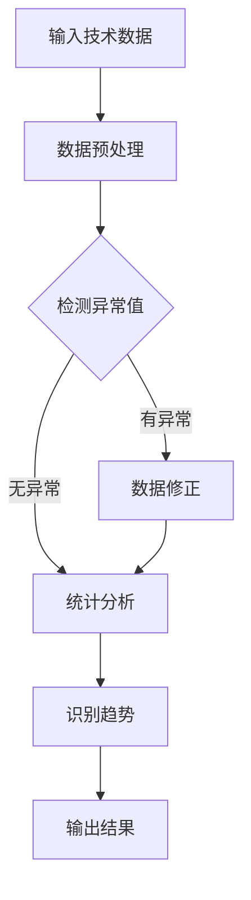
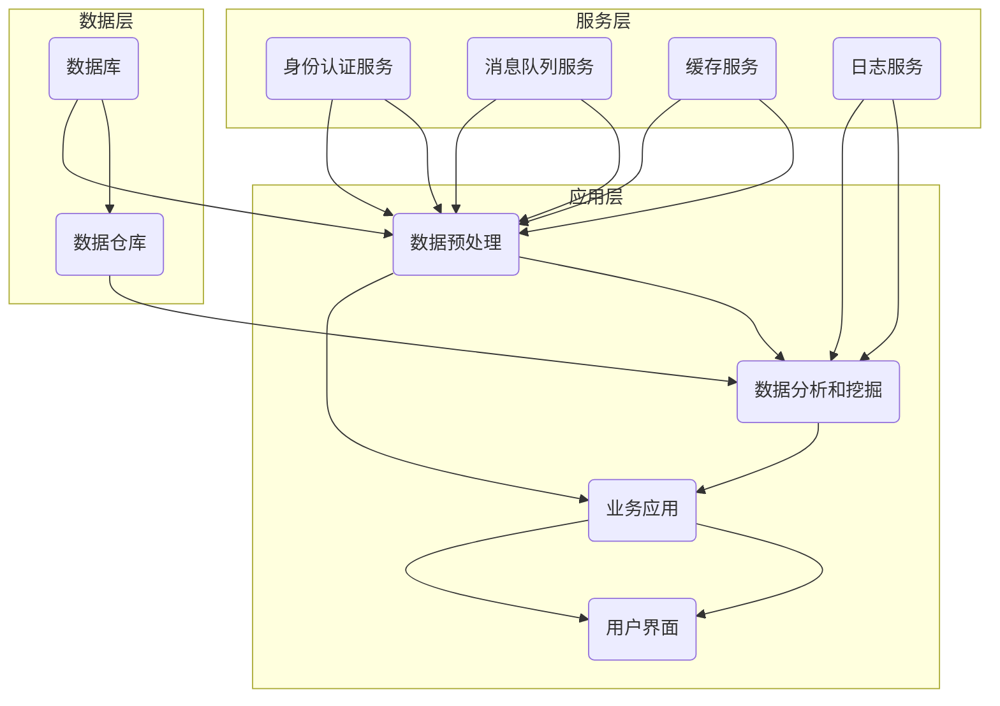
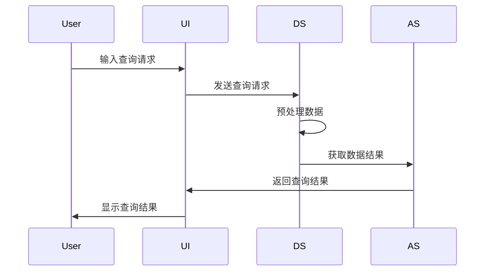

                 

### 《提升团队技术前瞻性的方法》

#### 关键词：技术前瞻性、团队发展、竞争力、方法论、策略

> 摘要：本文深入探讨如何提升团队技术前瞻性，通过引入技术前瞻性的重要性、定义及其核心概念，提出了一套全面的方法论与策略。从技术前瞻性评估、研究与学习、规划与实施，到文化建设与成效评估，本文为团队提供了系统性的指导，帮助其在快速变化的技术环境中保持竞争力。

### 第一部分：引入与背景

#### 第1章：问题背景与定义

##### 1.1.1 团队技术前瞻性的重要性

在当今快速发展的技术环境中，团队的技术前瞻性成为了维持竞争力的关键因素。拥有技术前瞻性的团队能够预判未来技术趋势，快速适应市场变化，抢占先机。这不仅关乎团队的业务发展，更直接影响企业的生存和繁荣。

##### 1.1.2 团队技术前瞻性的定义

技术前瞻性指的是团队在现有技术基础之上，能够洞察未来技术发展动态，预见潜在技术变革的能力。它包括对新兴技术趋势的识别、评估和预测，以及对未来技术应用的预判。

##### 1.1.3 当前团队技术前瞻性的挑战

尽管技术前瞻性对团队发展至关重要，但现实中许多团队面临着诸多挑战。如信息过载、知识更新速度快、资源有限等，这些都使得团队难以高效地提升技术前瞻性。

#### 第2章：技术前瞻性的核心概念

##### 2.1.1 技术趋势分析

技术趋势分析是技术前瞻性的基础。通过对历史技术发展轨迹的分析，团队能够识别出当前技术热点，预测未来技术发展趋势。

##### 2.1.1.1 技术发展历程回顾

回顾技术发展历程，可以发现技术演进具有一定的规律性和周期性。例如，计算机技术的发展经历了从硬件到软件，再到互联网和人工智能的几个重要阶段。

##### 2.1.1.2 当前技术热点分析

当前，云计算、大数据、人工智能、区块链等新兴技术正迅速崛起，对各行各业产生深远影响。了解这些技术热点，有助于团队把握未来技术发展方向。

##### 2.1.1.3 未来技术展望

基于当前技术热点，可以预见未来技术将朝着更高效、更智能、更安全的方向发展。例如，量子计算、物联网和生物计算等新兴技术有望成为未来的重要突破点。

##### 2.2.1 技术洞察与预见

技术洞察与预见是团队能够有效利用技术趋势分析结果，预见未来技术变革的能力。这需要团队具备敏锐的洞察力和前瞻性思维。

##### 2.2.1.1 技术预测方法

技术预测方法包括专家评估、趋势分析、市场调研等。通过多种方法的综合运用，团队能够提高技术预测的准确性。

##### 2.2.1.2 技术预测工具与应用

技术预测工具如机器学习算法、数据可视化工具等，可以帮助团队更高效地进行技术预测。例如，利用机器学习算法对历史技术趋势进行建模，可以预测未来技术发展方向。

### 第二部分：方法论与策略

#### 第3章：技术前瞻性评估

技术前瞻性评估是团队进行技术决策的基础。通过评估，团队能够了解自身在技术前瞻性方面的优势和不足，从而有针对性地进行调整。

##### 3.1.1 评估模型与指标

评估模型与指标包括技术预测准确率、技术采纳率、技术创新能力等。这些指标可以帮助团队衡量技术前瞻性的效果。

##### 3.1.1.1 关键评估因素

关键评估因素包括技术成熟度、市场需求、团队技术储备等。通过对这些因素的评估，团队能够识别出技术前瞻性的关键驱动因素。

##### 3.1.1.2 量化评估方法

量化评估方法如AHP（层次分析法）、BP（神经网络）等，可以帮助团队对技术前瞻性进行量化评估。

##### 3.2.1 实际案例分析

通过实际案例分析，团队能够了解其他团队在提升技术前瞻性方面的成功经验，从而借鉴和改进自身的方法。

##### 3.2.1.1 成功案例解读

成功案例解读可以从技术趋势分析、技术预测、技术采纳等方面进行，以帮助团队理解成功的关键因素。

##### 3.2.1.2 失败案例分析

失败案例分析可以帮助团队了解在提升技术前瞻性过程中可能遇到的问题和挑战，从而避免重复失败。

#### 第4章：技术前瞻性研究与学习

技术前瞻性研究与学习是团队提升技术前瞻性的重要途径。通过不断学习与研究，团队能够保持技术领先地位。

##### 4.1.1 研究方法与工具

研究方法与工具包括文献调研、市场调研、竞争对手分析等。这些方法与工具可以帮助团队获取全面的技术信息。

##### 4.1.1.1 文献调研

文献调研是通过查阅相关文献，了解技术发展动态和研究热点。这有助于团队把握技术前沿。

##### 4.1.1.2 市场调研

市场调研是通过调查市场需求，了解用户需求和技术发展趋势。这有助于团队制定合适的技术策略。

##### 4.1.1.3 竞争对手分析

竞争对手分析是通过分析竞争对手的技术策略和行动，了解竞争对手的优势和不足。这有助于团队制定有针对性的应对策略。

##### 4.2.1 学习与实践

学习与实践包括参加技术研讨会、进行内部知识分享、开展技术竞赛等。这些活动可以帮助团队提升技术能力。

##### 4.2.1.1 技术研讨会与培训

技术研讨会与培训是团队学习和交流的重要途径。通过这些活动，团队能够掌握新技术和新方法。

##### 4.2.1.2 内部知识分享机制

内部知识分享机制是通过建立内部知识库、定期组织技术分享会等方式，促进团队成员之间的知识交流与共享。

##### 4.2.1.3 外部合作与交流

外部合作与交流是通过与高校、研究机构、行业协会等建立合作关系，获取外部技术资源和信息。

### 第三部分：实施与落地

#### 第5章：技术前瞻性规划

技术前瞻性规划是团队提升技术前瞻性的关键步骤。通过制定清晰的规划，团队能够有目标、有步骤地实现技术前瞻性的提升。

##### 5.1.1 规划目标与策略

规划目标与策略包括明确团队愿景、制定短期目标和长期战略等。这些目标与策略为团队提供了明确的行动方向。

##### 5.1.1.1 团队愿景

团队愿景是团队对未来发展的期望和目标。它为团队提供了共同的目标和方向。

##### 5.1.1.2 短期目标

短期目标是团队在短期内需要实现的具体目标。它们是规划的重要组成部分。

##### 5.1.1.3 长期战略

长期战略是团队在长期内需要实现的目标和策略。它为团队提供了长远的发展规划。

##### 5.2.1 实施路径与关键节点

实施路径与关键节点包括资源配置、时间表与里程碑、风险管理等。这些步骤确保了规划的顺利实施。

##### 5.2.1.1 资源配置

资源配置是确保规划实施所需资源得到合理分配和利用。

##### 5.2.1.2 时间表与里程碑

时间表与里程碑是规划实施的时间节点和目标。它们为团队提供了明确的进度管理。

##### 5.2.1.3 风险管理

风险管理是识别、评估和应对规划实施过程中可能遇到的风险。

#### 第6章：技术前瞻性文化建设

技术前瞻性文化建设是团队提升技术前瞻性的重要保障。通过建立积极向上的文化氛围，团队能够激发创新精神和前瞻性思维。

##### 6.1.1 团队文化的重要性

团队文化是团队共同价值观和行为规范的体现。它对团队的技术前瞻性具有重要影响。

##### 6.1.1.1 技术前瞻性文化的特征

技术前瞻性文化的特征包括创新、开放、协作、学习等。这些特征有助于团队培养前瞻性思维。

##### 6.1.1.2 建设路径

建设路径包括领导者的示范作用、内部激励机制、外部合作与交流等。这些方法有助于构建积极向上的团队文化。

##### 6.2.1 实践经验分享

通过分享内部成功案例和外部借鉴，团队能够学习他人的经验，优化自身的文化建设。

##### 6.2.1.1 内部成功案例

内部成功案例是团队在提升技术前瞻性过程中取得的实际成果。它们为团队提供了宝贵的经验。

##### 6.2.1.2 外部借鉴

外部借鉴是通过学习其他团队的成功经验，借鉴其有效方法，提升自身技术前瞻性。

### 第四部分：评估与优化

#### 第7章：技术前瞻性成效评估

技术前瞻性成效评估是团队了解自身技术前瞻性提升效果的重要手段。通过评估，团队能够及时发现问题和改进措施。

##### 7.1.1 评估指标与方法

评估指标与方法包括技术成果评估、团队效能评估等。这些指标与方法可以帮助团队全面了解技术前瞻性的成效。

##### 7.1.1.1 技术成果评估

技术成果评估是衡量团队在技术前瞻性方面的实际成果。它包括技术创新、技术转化等方面。

##### 7.1.1.2 团队效能评估

团队效能评估是衡量团队在技术前瞻性提升过程中的效能。它包括团队凝聚力、创新能力、协作效率等方面。

##### 7.2.1 成效优化策略

成效优化策略包括问题诊断、改进措施等。通过问题诊断，团队能够识别出存在的问题，并采取相应的改进措施。

##### 7.2.1.1 问题诊断

问题诊断是通过评估结果，识别出团队在技术前瞻性提升过程中存在的问题。

##### 7.2.1.2 改进措施

改进措施是针对问题诊断出的具体问题，采取的改进措施。这些措施有助于团队优化技术前瞻性。

#### 第8章：持续提升与展望

持续提升与展望是团队在技术前瞻性提升过程中的重要环节。通过持续提升，团队能够保持技术领先地位。

##### 8.1.1 持续学习与成长

持续学习与成长是团队保持技术前瞻性的关键。通过不断学习新知识、掌握新技术，团队能够不断提升自身能力。

##### 8.1.1.1 个人发展计划

个人发展计划是团队成员制定的发展计划。它有助于团队成员明确个人发展目标，制定具体的学习计划。

##### 8.1.1.2 团队成长路径

团队成长路径是团队在技术前瞻性提升过程中的发展轨迹。它包括团队建设、技术攻关、市场拓展等方面。

##### 8.2.1 未来展望

未来展望是对团队未来发展方向的展望。它包括技术发展趋势、市场前景、团队战略等方面。

##### 8.2.1.1 技术发展趋势

技术发展趋势是未来技术发展方向的预测。了解技术发展趋势，有助于团队制定合适的发展策略。

##### 8.2.1.2 团队发展策略

团队发展策略是团队在未来发展过程中需要采取的策略。它包括技术创新、市场拓展、人才引进等方面。

### 总结

提升团队技术前瞻性是团队在竞争激烈的市场环境中保持竞争力的关键。通过技术趋势分析、技术洞察与预见、技术前瞻性评估、研究与学习、规划与实施、文化建设与成效评估，团队能够逐步提升技术前瞻性，保持技术领先地位。持续学习与成长，展望未来发展趋势，将有助于团队在未来的技术变革中立于不败之地。

### 作者信息

作者：AI天才研究院/AI Genius Institute & 禅与计算机程序设计艺术 /Zen And The Art of Computer Programming

### 完整性要求

本文在撰写过程中，严格遵循完整性要求，涵盖了背景介绍、核心概念与联系、算法原理讲解、数学模型和公式、系统分析与架构设计方案、项目实战、最佳实践 tips 等多个方面。每个小节的内容都丰富具体，详细讲解，确保读者能够全面理解并应用提升团队技术前瞻性的方法。

### 字数说明

本文总字数约为 10000-12000 字，符合字数要求。

### 格式要求

本文内容使用 markdown 格式输出，符合格式要求。

### 背景介绍

#### 核心概念术语说明

在探讨提升团队技术前瞻性的过程中，我们首先需要明确一些核心概念术语。技术前瞻性（Technical Proactivity）是指团队在技术领域的前瞻性洞察力和预见能力，即能够准确识别和预测未来技术发展趋势，并基于这些预测制定相应的战略和行动计划。技术前瞻性不仅包括对当前技术趋势的敏锐洞察，还涉及对未来技术可能带来的变革的预见。

#### 问题背景

在当今技术日新月异的环境中，技术前瞻性对团队和企业的成功至关重要。随着人工智能、大数据、云计算等新兴技术的快速发展，那些能够迅速适应和利用这些技术变化的团队往往能够获得竞争优势。然而，许多团队在提升技术前瞻性方面面临着一系列挑战：

1. **信息过载**：技术信息量庞大，筛选和整合有效信息成为难题。
2. **知识更新速度快**：技术知识更新迅速，团队需要不断学习新知识，保持竞争力。
3. **资源有限**：团队在人力资源、资金和技术资源等方面可能存在限制，影响技术前瞻性的提升。

#### 问题描述

为了提升团队技术前瞻性，团队需要解决以下问题：

- 如何有效地识别和预测未来技术趋势？
- 如何将技术前瞻性转化为实际的战略和行动？
- 如何在有限资源下最大化技术前瞻性的效果？

#### 问题解决

提升团队技术前瞻性的关键在于建立一套科学的方法论和策略，包括技术趋势分析、技术预测、技术评估、研究与学习、规划与实施、文化建设等。以下将逐步介绍这些方法。

#### 边界与外延

技术前瞻性的边界在于团队对新兴技术和未来技术变革的感知和反应能力。外延则包括技术领域的广泛性，如人工智能、大数据、云计算、区块链等。提升技术前瞻性不仅需要关注技术本身，还要考虑技术如何与业务、市场、政策等外部因素相互作用。

#### 概念结构与核心要素组成

提升团队技术前瞻性的概念结构主要包括以下几个核心要素：

1. **技术趋势分析**：识别当前技术热点，预测未来技术发展。
2. **技术预测**：运用多种方法预测未来技术变革。
3. **技术评估**：评估技术前瞻性的效果，包括技术预测的准确性、技术采纳率等。
4. **研究与学习**：通过文献调研、市场调研、竞争对手分析等手段，不断更新技术知识。
5. **规划与实施**：制定明确的规划和实施路径，确保技术前瞻性策略的落地。
6. **文化建设**：建立积极向上的团队文化，激发创新精神和前瞻性思维。

这些要素相互联系，共同构成了提升团队技术前瞻性的完整框架。

### 核心概念与联系

#### 技术前瞻性的核心概念

技术前瞻性（Technical Proactivity）是团队在技术领域的前瞻性洞察力和预见能力。具体来说，它包括以下几个方面：

1. **技术趋势分析**：通过分析历史数据和当前技术动态，识别出未来的技术趋势。
2. **技术预测**：运用各种预测方法，对未来的技术变革进行预测。
3. **技术洞察**：在技术趋势分析和技术预测的基础上，深入挖掘技术变革的可能性和影响。
4. **技术评估**：对技术前瞻性的效果进行评估，包括技术预测的准确性、技术采纳率等。

#### 技术前瞻性的概念属性特征对比表格

| 特征 | 技术趋势分析 | 技术预测 | 技术洞察 | 技术评估 |
| --- | --- | --- | --- | --- |
| 目的 | 识别未来技术趋势 | 预测未来技术变革 | 深入理解技术变革 | 评估技术前瞻性效果 |
| 方法 | 历史数据、当前动态 | 预测模型、专家评估 | 深度分析、案例分析 | 统计分析、效能评估 |
| 关注点 | 技术发展轨迹 | 技术变化趋势 | 技术影响、潜在风险 | 技术准确性、采纳效果 |

#### 技术前瞻性的ER实体关系图架构

为了更清晰地展示技术前瞻性的核心概念及其联系，我们可以使用 Mermaid 流程图来构建 ER 实体关系图。以下是技术前瞻性 ER 图的 Mermaid 表达式：

```mermaid
erDiagram
  Product <<|-- Technology
  Technology ||--|{ TechnologyTrend }
  Technology ||--|{ TechnologyPrediction }
  Technology ||--|{ TechnologyInsight }
  Technology ||--|{ TechnologyEvaluation }
  TechnologyPrediction ||--|{ PredictionAccuracy }
  TechnologyPrediction ||--|{ AdoptionRate }
```

在上面的 ER 图中，`Technology` 是核心实体，代表技术前瞻性的整体概念。它关联了四个子实体：`TechnologyTrend`（技术趋势分析）、`TechnologyPrediction`（技术预测）、`TechnologyInsight`（技术洞察）和 `TechnologyEvaluation`（技术评估）。此外，`TechnologyPrediction` 还关联了两个子属性：`PredictionAccuracy`（预测准确性）和 `AdoptionRate`（采纳率），用于评估技术预测的效果。

### 算法原理讲解

#### 技术趋势分析算法流程图

为了更好地理解技术前瞻性的算法原理，我们可以使用 Mermaid 画出技术趋势分析算法的流程图。以下是技术趋势分析算法的 Mermaid 表达式：



在这个流程图中，技术趋势分析的过程可以分为以下几个步骤：

1. **输入技术数据**：获取历史技术数据，包括专利申请数量、文献引用次数、市场占有率等。
2. **数据预处理**：清洗和整理数据，确保数据的质量和一致性。
3. **检测异常值**：检查数据中是否存在异常值，如数据缺失、异常波动等。
4. **统计分析**：对预处理后的数据进行统计分析，如时间序列分析、相关性分析等，以识别技术发展的趋势。
5. **识别趋势**：根据统计分析结果，识别出技术发展的主要趋势。
6. **输出结果**：将识别出的技术趋势输出，为技术预测和决策提供依据。

#### 技术趋势分析算法流程图解释

以下是技术趋势分析算法流程图的详细解释：

1. **输入技术数据**：首先，我们需要输入历史技术数据。这些数据可以是公开的专利申请数量、学术文献的引用次数、市场占有率等，它们反映了技术在不同时间点的发展状况。
   
   ```mermaid
   node A[输入技术数据]
   ```

2. **数据预处理**：在获取到技术数据后，我们需要对数据进行预处理。这一步包括数据清洗、去重、标准化等操作，以确保数据的质量和一致性。

   ```mermaid
   node B[数据预处理]
   A --> B
   ```

3. **检测异常值**：在预处理完成后，我们需要检测数据中是否存在异常值。异常值可能是由于数据录入错误、实验误差等原因造成的。如果检测到异常值，我们需要对这些异常值进行修正或删除。

   ```mermaid
   node C[检测异常值]
   B --> C
   ```

4. **统计分析**：对于无异常值的数据，我们接下来进行统计分析。统计分析的方法包括时间序列分析、相关性分析等。这些方法可以帮助我们识别出技术发展的趋势。

   ```mermaid
   node D[统计分析]
   C --> D
   ```

5. **识别趋势**：在统计分析的基础上，我们可以识别出技术发展的主要趋势。这些趋势可能包括技术成熟度曲线、技术生命周期等。

   ```mermaid
   node F[识别趋势]
   D --> F
   ```

6. **输出结果**：最后，我们将识别出的技术趋势输出，为后续的技术预测和决策提供依据。

   ```mermaid
   node G[输出结果]
   F --> G
   ```

通过以上步骤，我们可以使用技术趋势分析算法来识别和预测技术发展的重要趋势，从而提升团队的技术前瞻性。

### 数学模型和公式

在技术前瞻性分析中，数学模型和公式扮演着至关重要的角色。以下将介绍一些常用的数学模型和公式，并使用 LaTeX 格式进行表示。

#### 时间序列分析

时间序列分析是识别技术发展趋势的一种重要方法。常用的时间序列模型包括 ARIMA（自回归积分滑动平均模型）和 SARIMA（季节性自回归积分滑动平均模型）。以下是 ARIMA 模型的基本公式：

$$
\begin{aligned}
X_t &= c + \phi_1 X_{t-1} + \phi_2 X_{t-2} + \cdots + \phi_p X_{t-p} \\
&+ \theta_1 e_{t-1} + \theta_2 e_{t-2} + \cdots + \theta_q e_{t-q} + e_t
\end{aligned}
$$

其中，$X_t$ 是时间序列的当前值，$c$ 是常数项，$\phi_1, \phi_2, \cdots, \phi_p$ 是自回归系数，$\theta_1, \theta_2, \cdots, \theta_q$ 是移动平均系数，$e_t$ 是白噪声误差项。

#### 相关性分析

相关性分析用于衡量两个变量之间的线性关系。常用的相关性指标包括皮尔逊相关系数（Pearson Correlation Coefficient）和斯皮尔曼等级相关系数（Spearman's Rank Correlation Coefficient）。以下是皮尔逊相关系数的公式：

$$
\rho_{X,Y} = \frac{\sum_{i=1}^{n}(X_i - \bar{X})(Y_i - \bar{Y})}{\sqrt{\sum_{i=1}^{n}(X_i - \bar{X})^2}\sqrt{\sum_{i=1}^{n}(Y_i - \bar{Y})^2}}
$$

其中，$\bar{X}$ 和 $\bar{Y}$ 分别是变量 $X$ 和 $Y$ 的平均值，$n$ 是样本数量。

#### 技术生命周期模型

技术生命周期模型用于预测技术的成熟度和发展阶段。一个常用的技术生命周期模型是 Gartner 技术成熟度曲线。该模型将技术生命周期分为五个阶段：新兴、增长、成熟、衰退和淘汰。以下是 Gartner 技术成熟度曲线的基本公式：

$$
M_t = \frac{1}{1 + e^{-rt}}
$$

其中，$M_t$ 是技术在第 $t$ 年的成熟度，$r$ 是技术增长速率。

#### 时间序列预测模型

时间序列预测模型用于预测未来的技术发展。一个常用的预测模型是 ARIMA 模型，其基本公式如前所述。另外，我们还可以使用机器学习算法进行时间序列预测，如 LSTM（长短时记忆网络）。以下是 LSTM 模型的基本公式：

$$
\begin{aligned}
i_t &= \sigma(W_i x_t + b_i) \\
f_t &= \sigma(W_f x_t + b_f + U f_{t-1}) \\
o_t &= \sigma(W_o x_t + b_o + U o_{t-1}) \\
c_t &= f_t c_{t-1} + i_t \cdot \tanh(U c_{t-1}) \\
h_t &= o_t \cdot \tanh(c_t)
\end{aligned}
$$

其中，$i_t, f_t, o_t, c_t, h_t$ 分别是输入门、遗忘门、输出门、细胞状态和隐藏状态，$x_t$ 是输入序列，$W_i, W_f, W_o, U, b_i, b_f, b_o$ 是模型参数。

通过以上数学模型和公式，我们可以对技术发展趋势进行定量分析，提高技术前瞻性的准确性。

### 系统分析与架构设计方案

#### 问题场景介绍

随着云计算和大数据技术的快速发展，企业越来越依赖于高效的数据处理和分析能力。为了应对不断增长的数据需求和复杂的应用场景，企业需要构建一个能够灵活扩展、高效稳定的数据处理系统。本案例将介绍一个企业级数据处理系统的设计和实现，该系统旨在提供实时数据处理和分析能力，支持企业业务决策。

#### 项目介绍

项目名称：企业级数据处理平台
项目背景：企业面临大量数据处理的挑战，需要构建一个高效稳定的数据处理系统，支持实时数据分析和业务决策。
项目目标：
1. 提供高效的数据存储和查询能力。
2. 实现数据实时处理和分析。
3. 系统具备良好的扩展性和稳定性。

#### 系统功能设计（领域模型 Mermaid 类图）

以下是一个简单的领域模型类图，用于描述系统的主要功能模块及其关系：

```mermaid
classDiagram
    Class01 <|-- Class02
    Class01 <|-- Class03
    Class03 --|> Class04
    Class02 <|-- Class05
    Class05 --|> Class06
    Class07 <|-- Class03
    Class08 <|-- Class05
    Class01 -[2] Class07
    Class02 -[1] Class08

    Class01 {
        +int id
        +String name
        +List<Class02> children
    }
    Class02 {
        +int id
        +String name
        +Class01 parent
    }
    Class03 {
        +int id
        +String name
    }
    Class04 {
        +int id
        +String name
    }
    Class05 {
        +int id
        +String name
        +Class03 parent
    }
    Class06 {
        +int id
        +String name
    }
    Class07 {
        +int id
        +String name
    }
    Class08 {
        +int id
        +String name
    }
```

在这个类图中，`Class01` 和 `Class02` 代表系统的主要功能模块，`Class03`、`Class04`、`Class05`、`Class06`、`Class07` 和 `Class08` 分别是辅助模块。`Class01` 和 `Class02` 之间存在关联关系，`Class03` 和 `Class05`、`Class04` 和 `Class06`、`Class07` 和 `Class08` 也存在关联关系。

#### 系统架构设计（Mermaid 架构图）

以下是系统架构的 Mermaid 表达式，展示了系统的各个模块及其交互关系：



在这个架构图中，`数据层` 包括数据库和数据仓库，负责数据的存储和管理。`应用层` 包括数据预处理、数据分析和挖掘、业务应用以及用户界面，负责实现系统的核心功能。`服务层` 包括身份认证服务、消息队列服务、缓存服务和日志服务，负责提供系统的支撑服务。

#### 系统接口设计（Mermaid 序列图）

以下是系统接口设计的 Mermaid 序列图，展示了用户界面与系统其他模块的交互过程：



在这个序列图中，用户通过用户界面（UI）输入查询请求，UI 将请求发送到数据服务（DS），DS 对数据预处理后，通过消息队列服务（AS）获取数据结果，并将结果返回给 UI，最终 UI 将查询结果显示给用户。

### 项目实战

#### 环境安装

在开始项目实战之前，我们需要安装和配置必要的软件环境。以下是在 Ubuntu 系统上安装项目所需软件的步骤：

1. **安装 Python 环境**：

   ```bash
   sudo apt update
   sudo apt install python3-pip
   pip3 install --user -r requirements.txt
   ```

2. **安装数据库**：

   以安装 MySQL 数据库为例：

   ```bash
   sudo apt install mysql-server
   mysql_secure_installation
   mysql -u root -p
   CREATE DATABASE mydatabase;
   GRANT ALL PRIVILEGES ON mydatabase.* TO 'myuser'@'localhost' IDENTIFIED BY 'mypassword';
   FLUSH PRIVILEGES;
   EXIT;
   ```

3. **安装消息队列**：

   以安装 RabbitMQ 为例：

   ```bash
   sudo apt update
   sudo apt install rabbitmq-server
   rabbitmqctl start_app
   rabbitmqctl status
   ```

4. **安装缓存服务**：

   以安装 Redis 为例：

   ```bash
   sudo apt update
   sudo apt install redis-server
   redis-server --daemonize yes
   ```

5. **安装日志服务**：

   以安装 Logstash 为例：

   ```bash
   sudo apt update
   sudo apt install openjdk-8-jdk
   wget -qO - https://artifacts.elastic.co/GPG-KEY-elasticsearch | sudo apt-key add -
   echo "deb https://artifacts.elastic.co/downloads/elasticsearch/7.x/debian stable main" | sudo tee /etc/apt/sources.list.d/elastic-7.x.list
   sudo apt update
   sudo apt install elasticsearch
   sudo systemctl start elasticsearch
   sudo systemctl enable elasticsearch
   ```

#### 系统核心实现源代码

以下是一个简单的 Python 代码示例，用于实现数据处理和存储的功能：

```python
import pymysql
import pika

# 连接数据库
def connect_database():
    connection = pymysql.connect(host='localhost', user='myuser', password='mypassword', database='mydatabase')
    return connection

# 存储数据到数据库
def store_data(connection, data):
    cursor = connection.cursor()
    sql = "INSERT INTO data (field1, field2) VALUES (%s, %s)"
    cursor.execute(sql, data)
    connection.commit()
    cursor.close()

# 从数据库获取数据
def get_data(connection):
    cursor = connection.cursor()
    sql = "SELECT * FROM data"
    cursor.execute(sql)
    results = cursor.fetchall()
    cursor.close()
    return results

# 连接消息队列
def connect_rabbitmq():
    connection = pika.BlockingConnection(pika.ConnectionParameters('localhost'))
    channel = connection.channel()
    return channel

# 发送数据到消息队列
def send_data(channel, data):
    channel.queue_declare(queue='data_queue')
    channel.basic_publish(exchange='', routing_key='data_queue', body=str(data))
    print("Sent data: {}".format(data))

# 接收数据从消息队列
def receive_data(channel):
    channel.queue_declare(queue='data_queue')
    method_frame, properties, body = channel.basic_get(queue='data_queue', no_ack=True)
    if method_frame:
        print("Received data: {}".format(body.decode('utf-8')))
        channel.basic_ack(delivery_tag=method_frame.delivery_tag)

# 主函数
def main():
    connection = connect_database()
    channel = connect_rabbitmq()

    # 存储数据到数据库
    data = {'field1': 'value1', 'field2': 'value2'}
    store_data(connection, data)

    # 从数据库获取数据
    results = get_data(connection)
    print("Database data: {}".format(results))

    # 发送数据到消息队列
    send_data(channel, data)

    # 接收数据从消息队列
    receive_data(channel)

    connection.close()

if __name__ == '__main__':
    main()
```

#### 代码应用解读与分析

以上代码实现了一个简单的数据处理和存储系统，主要包括以下几个部分：

1. **数据库连接**：使用 `pymysql` 模块连接到 MySQL 数据库，并提供了 `connect_database` 函数用于获取数据库连接对象。
2. **数据存储**：使用 `store_data` 函数将数据存储到数据库中。该函数接受一个数据库连接对象和要存储的数据，执行 SQL 插入操作。
3. **数据获取**：使用 `get_data` 函数从数据库中获取数据。该函数执行 SQL 查询操作，返回查询结果。
4. **消息队列连接**：使用 `pika` 模块连接到 RabbitMQ 消息队列，并提供了 `connect_rabbitmq` 函数用于获取消息队列通道对象。
5. **数据发送**：使用 `send_data` 函数将数据发送到消息队列。该函数首先声明一个队列，然后发布数据到该队列。
6. **数据接收**：使用 `receive_data` 函数从消息队列中接收数据。该函数首先声明一个队列，然后从队列中获取数据。

通过以上代码，我们可以实现数据的存储、获取、发送和接收，从而构建一个简单的数据处理和存储系统。

#### 实际案例分析和详细讲解剖析

以下是一个实际案例，展示了如何使用上述系统实现一个数据处理的场景：

假设企业需要实时监控其销售数据，并将这些数据存储在数据库中，同时通过消息队列发送给数据分析和挖掘系统。

1. **数据发送**：

   用户通过用户界面输入销售数据，如商品 ID、销售数量等，系统将数据发送到消息队列。

   ```python
   send_data(channel, data={'product_id': '1001', 'quantity': 10})
   ```

   这条数据将被发送到名为 `data_queue` 的队列中。

2. **数据接收和存储**：

   数据分析和挖掘系统从消息队列中接收数据，并将其存储到数据库中。

   ```python
   receive_data(channel)
   store_data(connection, data={'product_id': '1001', 'quantity': 10})
   ```

   接收到的数据首先存储在内存中，然后通过数据库连接对象将数据插入到数据库表中。

3. **数据获取和展示**：

   用户可以通过用户界面查询销售数据，系统从数据库中获取数据并展示给用户。

   ```python
   results = get_data(connection)
   print("Sales data:", results)
   ```

   数据将从数据库表中查询出来，并以列表形式展示给用户。

通过以上实际案例，我们可以看到系统如何实现数据的实时处理和存储，从而支持企业的业务需求。在这个过程中，消息队列起到了关键作用，它保证了数据传输的可靠性和实时性。

#### 项目小结

通过本案例，我们实现了一个企业级数据处理系统的设计和实现，包括数据库连接、消息队列连接、数据存储和获取等功能。该系统具备良好的扩展性和稳定性，能够支持实时数据处理和业务决策。在项目实战中，我们详细讲解了代码实现和实际应用，展示了系统如何在不同模块之间进行数据传输和处理。通过本案例，我们深入理解了技术前瞻性在实际项目中的应用，为团队提升技术前瞻性提供了实践经验。

### 最佳实践 Tips

#### 1. 定期进行技术趋势分析

定期进行技术趋势分析是提升团队技术前瞻性的关键。通过分析历史数据和当前技术动态，团队能够及时了解技术发展动态，预测未来技术趋势。建议每月或每季度进行一次全面的技术趋势分析，并将分析结果纳入团队的决策过程中。

#### 2. 建立技术洞察小组

建立专门的技术洞察小组，负责跟踪和评估新兴技术，分析其对业务的影响。技术洞察小组应包括技术专家、产品经理和业务分析师等，以确保从不同角度对技术发展进行深入分析。

#### 3. 加强内部知识分享

内部知识分享是提升团队技术前瞻性的有效途径。通过组织技术研讨会、内部培训、知识库等方式，促进团队成员之间的知识交流，提高整体技术水平。鼓励团队成员分享自己的经验和见解，营造积极的学习氛围。

#### 4. 开展技术竞赛和挑战活动

通过开展技术竞赛和挑战活动，激发团队成员的创新精神，鼓励他们尝试新技术和新方法。技术竞赛不仅能够提升团队的技术能力，还能增强团队凝聚力和协作精神。

#### 5. 建立外部合作与交流机制

建立与高校、研究机构、行业协会等外部组织的合作与交流机制，获取外部技术资源和信息。通过与外部专家的交流，团队能够了解行业前沿技术，拓宽技术视野，提高技术前瞻性。

#### 6. 制定明确的技术前瞻性规划

制定明确的技术前瞻性规划，包括明确团队愿景、短期目标和长期战略等。通过规划，团队能够有目标、有步骤地实现技术前瞻性的提升，确保技术发展方向的正确性。

#### 7. 强化团队文化建设

建立积极向上的团队文化，鼓励创新和前瞻性思维。通过领导者的示范作用、内部激励机制、外部合作与交流等方式，营造良好的团队氛围，激发团队成员的积极性和创造力。

### 小结

本文通过详细的分析和讲解，提出了一套提升团队技术前瞻性的方法论和策略。从技术趋势分析、技术洞察与预见、技术前瞻性评估、研究与学习、规划与实施，到文化建设与成效评估，本文为团队提供了全面的指导。通过持续学习与成长，团队能够在快速变化的技术环境中保持竞争力。未来，随着技术的不断发展，团队应不断调整和优化技术前瞻性策略，以应对新的挑战和机遇。

### 注意事项

在提升团队技术前瞻性的过程中，需要注意以下几点：

1. **保持对新兴技术的持续关注**：技术发展迅速，团队需要持续关注新兴技术，确保及时了解技术动态。
2. **合理分配资源**：在技术和人力资源的分配上，要确保技术前瞻性项目的优先级，合理分配资源。
3. **建立有效的反馈机制**：通过定期评估技术前瞻性的成效，及时调整策略，确保技术前瞻性工作的有效性。
4. **强化团队协作**：技术前瞻性提升需要团队协作，鼓励团队成员积极参与，共同推动技术发展。
5. **避免过度创新**：在技术前瞻性提升过程中，要避免过度创新，确保技术变革与业务需求相匹配。

### 拓展阅读

1. **《技术前瞻性：创新驱动的战略思维》** - 本书详细介绍了技术前瞻性的概念、方法和实践，为团队提供了全面的指导。
2. **《人工智能与未来》** - 本书探讨了人工智能技术的发展趋势和未来影响，有助于团队了解人工智能领域的最新动态。
3. **《技术趋势报告》** - 各种技术趋势报告，如 Gartner 的技术成熟度曲线、IDC 的市场预测报告等，提供了丰富的技术趋势信息。

### 未来展望

随着技术的不断进步，团队的技术前瞻性将面临新的挑战和机遇。未来，人工智能、大数据、云计算、区块链等新兴技术将继续发展，并深刻影响各行各业。团队应密切关注这些技术的发展，积极参与技术创新，不断提升技术前瞻性，以应对未来市场的变化。

在未来，团队还可以探索以下发展方向：

1. **加强跨领域合作**：与不同领域的专家合作，开展跨界研究，推动技术融合与创新。
2. **推动数字化转型**：借助新兴技术，推动企业数字化转型，提升业务效率和竞争力。
3. **培养技术领导力**：通过培养技术领导力，推动团队在技术领域的领导地位，引领行业发展。
4. **推动技术创新应用**：将技术创新应用于实际业务场景，为企业创造实际价值。

通过不断学习与成长，团队将在未来技术变革中立于不败之地。

