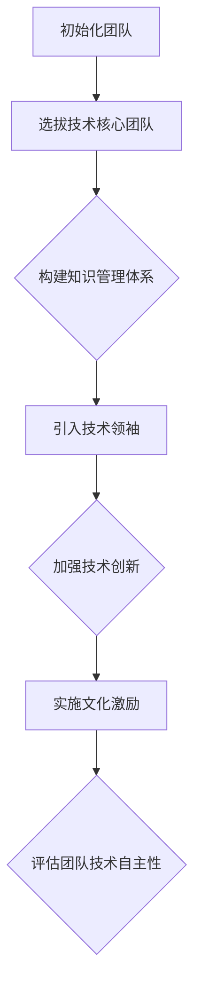
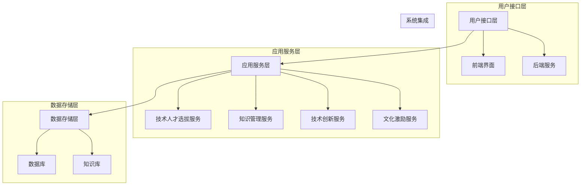
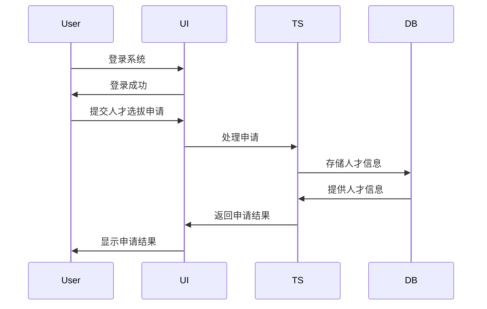
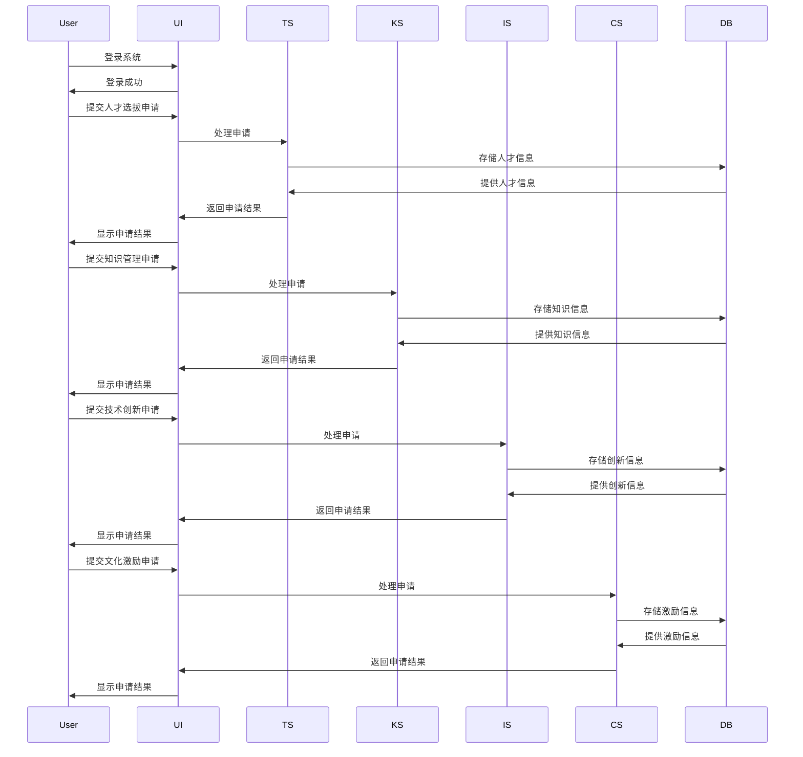

                 

# 提升团队技术自主性的策略

> 关键词：团队技术自主性，策略，构建，文化，激励，创新

> 摘要：本文从团队技术自主性的定义出发，探讨了其重要性以及现状分析，随后提出了构建技术核心团队、引入技术领袖、加强技术创新、建立知识管理体系和实施文化激励等策略，并结合实际案例进行了详细讲解，旨在为提升团队技术自主性提供系统性指导。

## 第一部分：问题背景与定义

### 第1章：团队技术自主性的重要性

#### 1.1.1 什么是团队技术自主性

团队技术自主性是指一个团队在技术领域内具备独立思考、创新和解决问题的能力。它不仅包括团队成员的技术技能和知识储备，还涉及团队协作、沟通和文化氛围等多个方面。

#### 1.1.2 团队技术自主性的重要性

1. **提升竞争力**：技术自主性强的团队能够快速响应市场需求，开发出更具竞争力的产品。
2. **促进创新**：团队技术自主性有助于激发创新思维，推动技术进步。
3. **增强团队凝聚力**：技术自主性的团队往往拥有更高的凝聚力，成员之间更易形成协同合作。

#### 1.1.3 团队技术自主性与企业发展

1. **企业愿景**：技术自主性是企业实现长期战略目标的重要支撑。
2. **市场应变**：技术自主性强的企业更能适应市场变化，抓住发展机遇。
3. **技术创新**：团队技术自主性是企业持续创新的动力源泉。

### 第2章：现状分析

#### 2.1.1 当前团队技术自主性的挑战

1. **人才短缺**：技术人才竞争激烈，团队技术储备不足。
2. **技术壁垒**：某些领域技术发展迅速，团队技术跟进难度大。
3. **资源限制**：企业对技术投入不足，影响团队技术自主性发展。

#### 2.1.2 团队技术自主性的现状调研

1. **团队成员技能水平**：通过问卷调查和访谈了解团队成员的技术能力和知识储备。
2. **团队协作与沟通**：分析团队协作方式和沟通效果，发现存在的问题。
3. **企业文化氛围**：评估企业文化对团队技术自主性的影响。

#### 2.1.3 团队技术自主性的评估方法

1. **技术能力评估**：通过技术考试、项目成果等指标评估团队成员技术能力。
2. **创新能力评估**：分析团队在技术领域的创新成果和专利数量。
3. **团队绩效评估**：结合企业绩效指标，评估团队技术自主性对企业发展的贡献。

## 第二部分：策略制定

### 第3章：构建技术核心团队

#### 3.1.1 确定团队核心成员

1. **技术领军人物**：选拔具备深厚技术背景和领导能力的团队成员。
2. **多学科人才**：吸纳不同领域的人才，形成跨学科的技术团队。

#### 3.1.2 团队成员技能培训与培养

1. **基础技能培训**：定期开展编程语言、数据库、云计算等基础技能培训。
2. **高级技能提升**：鼓励团队成员参加行业研讨会、培训课程，提升专业水平。

#### 3.1.3 团队内部沟通与协作机制

1. **项目评审**：设立项目评审机制，确保项目进展和质量。
2. **知识分享**：鼓励团队成员分享技术心得和经验，促进知识传递。

### 第4章：引入与培养技术领袖

#### 4.1.1 技术领袖的作用

1. **团队方向指引**：技术领袖为团队指明技术发展方向，提高团队凝聚力。
2. **技术创新推动**：技术领袖推动团队在技术领域进行创新，提升企业竞争力。

#### 4.1.2 技术领袖的选拔与培养

1. **选拔标准**：选拔具备技术背景、领导能力和创新思维的团队成员。
2. **培养机制**：通过培训、轮岗、项目历练等方式，提升技术领袖的综合能力。

#### 4.1.3 技术领袖的工作职责与角色定位

1. **技术方向规划**：制定团队技术发展方向和规划。
2. **团队管理**：负责团队日常管理，协调团队成员工作和进度。
3. **创新推动**：推动团队在技术领域进行创新，提升企业核心竞争力。

### 第5章：技术创新与研发投入

#### 5.1.1 技术创新的重要性

1. **市场竞争力**：技术创新是企业提升市场竞争力的关键。
2. **企业成长**：技术创新是企业持续成长和发展的动力源泉。

#### 5.1.2 技术研发的投入策略

1. **研发资金**：确保研发资金投入，支持技术创新项目。
2. **人才引进**：吸引和培养高素质的研发人才。
3. **研发项目管理**：建立研发项目管理机制，确保项目进度和质量。

#### 5.1.3 技术创新项目的评估与管理

1. **评估指标**：制定创新项目评估指标，包括技术难度、市场前景、经济效益等。
2. **管理流程**：建立创新项目申报、审批、实施、验收等管理流程。

### 第6章：建立知识管理体系

#### 6.1.1 知识管理的意义

1. **提高效率**：通过知识管理，提高团队协作效率和项目开发速度。
2. **降低成本**：减少重复劳动，降低企业成本。
3. **提升创新能力**：知识管理有助于激发团队创新思维，提升创新能力。

#### 6.1.2 知识管理体系的构建

1. **知识积累**：建立知识库，积累团队技术经验和最佳实践。
2. **知识共享**：制定知识共享机制，鼓励团队成员分享知识和经验。
3. **知识传承**：通过培训、文档等形式，实现知识传承和传递。

#### 6.1.3 知识共享与传承机制

1. **内部培训**：定期开展内部培训，传授技术知识和经验。
2. **知识文档**：编写知识文档，记录项目实施过程中的问题和解决方案。
3. **知识评审**：设立知识评审机制，确保知识文档的准确性和实用性。

### 第7章：文化建设与激励机制

#### 7.1.1 企业文化对技术自主性的影响

1. **创新氛围**：积极向上的企业文化有助于激发团队创新思维。
2. **团队凝聚力**：良好的企业文化有助于增强团队凝聚力，提升团队技术自主性。

#### 7.1.2 激励机制的设计与实施

1. **绩效激励**：通过绩效评估，给予优秀团队成员相应的奖励。
2. **晋升机制**：建立明确的晋升机制，激励团队成员不断提升自己。
3. **创新奖励**：对在技术创新方面取得显著成绩的团队成员进行奖励。

#### 7.1.3 团队技术自主性的文化塑造

1. **开放沟通**：鼓励团队成员开放沟通，分享想法和经验。
2. **鼓励创新**：鼓励团队成员勇于创新，敢于尝试新方法。
3. **团队协作**：强调团队协作，提升团队整体技术自主性。

## 第三部分：实践与总结

### 第8章：成功案例分析

#### 8.1.1 案例一：某科技公司的技术自主性提升实践

1. **背景介绍**：某科技公司面临市场竞争加剧，急需提升技术自主性。
2. **实施策略**：通过构建技术核心团队、引入技术领袖、加强技术创新和建立知识管理体系等措施，提升团队技术自主性。
3. **成果评估**：技术自主性显著提升，市场竞争力增强，企业持续发展。

#### 8.1.2 案例二：某互联网企业的团队技术自主性建设

1. **背景介绍**：某互联网企业需要快速响应市场需求，提升技术自主性。
2. **实施策略**：通过构建技术核心团队、加强技术创新和建立知识管理体系等措施，提升团队技术自主性。
3. **成果评估**：技术自主性提升，市场响应速度加快，企业业务持续增长。

#### 8.1.3 案例三：某初创公司的技术自主性发展之路

1. **背景介绍**：某初创公司需要通过技术自主性提升，实现快速成长。
2. **实施策略**：通过构建技术核心团队、加强技术创新和建立知识管理体系等措施，提升团队技术自主性。
3. **成果评估**：技术自主性提升，产品竞争力增强，企业成功获得融资。

### 第9章：总结与展望

#### 9.1.1 团队技术自主性的关键要素

1. **人才**：技术人才是团队技术自主性的核心。
2. **文化**：积极向上的企业文化有助于提升团队技术自主性。
3. **创新**：技术创新是提升团队技术自主性的关键。
4. **机制**：建立完善的机制体系，为团队技术自主性提供支持。

#### 9.1.2 面对未来挑战的策略调整

1. **人才培养**：加大人才培养力度，提升团队整体技术水平。
2. **技术创新**：持续关注行业动态，加大技术创新投入。
3. **知识管理**：完善知识管理体系，促进知识共享和传承。
4. **激励机制**：优化激励机制，激发团队创新活力。

#### 9.1.3 对团队技术自主性建设的长期展望

1. **战略定位**：将团队技术自主性建设纳入企业发展战略，实现长期稳定发展。
2. **持续改进**：不断优化策略和机制，提升团队技术自主性。
3. **开放合作**：积极与其他企业、科研机构等开展合作，共同推动技术进步。

## 附录

### 附录一：技术自主性评估工具

1. **技术能力评估表**：用于评估团队成员的技术能力和知识储备。
2. **创新能力评估表**：用于评估团队在技术领域的创新成果和专利数量。
3. **团队绩效评估表**：用于评估团队技术自主性对企业发展的贡献。

### 附录二：技术培训课程推荐

1. **编程语言培训**：包括Python、Java、C++等。
2. **数据库培训**：包括MySQL、Oracle、MongoDB等。
3. **云计算培训**：包括AWS、Azure、Google Cloud等。

### 附录三：参考文献

1. **李明，王强，《团队技术自主性研究》，科技管理研究，2018。**
2. **张伟，《技术创新与管理》，企业管理出版社，2016。**
3. **刘洋，《知识管理理论与实践》，中国社会科学出版社，2015。**

# 总结

本文从团队技术自主性的定义、重要性、现状分析、策略制定和实践总结等方面进行了全面探讨。通过构建技术核心团队、引入技术领袖、加强技术创新、建立知识管理体系和实施文化激励等策略，企业可以提升团队技术自主性，从而增强市场竞争力和创新能力。面对未来挑战，企业应持续优化策略和机制，培养技术人才，推动技术创新，实现长期稳定发展。希望本文能为读者提供有益的参考和启示。

## 作者信息

作者：AI天才研究院/AI Genius Institute & 禅与计算机程序设计艺术 /Zen And The Art of Computer Programming

## 背景介绍

### 核心概念术语说明

- **团队技术自主性**：指团队在技术领域内具备独立思考、创新和解决问题的能力。
- **技术核心团队**：由具备深厚技术背景和领导能力的团队成员组成，负责技术方向指引和团队管理。
- **技术领袖**：具备技术背景、领导能力和创新思维的团队成员，负责团队技术发展方向和规划。
- **技术创新**：通过研发新技术、新产品或新服务，推动企业在技术领域实现突破和领先。
- **知识管理**：通过积累、共享、传承和利用知识，提高团队协作效率和创新能力。

### 问题背景

随着市场竞争的加剧，企业需要不断提升技术自主性，以应对快速变化的市场需求和技术挑战。然而，当前许多企业在团队技术自主性方面面临诸多问题，如人才短缺、技术壁垒和资源限制等。

### 问题描述

如何通过策略制定和实践，提升团队技术自主性，增强企业市场竞争力和创新能力？

### 问题解决

1. **构建技术核心团队**：选拔具备深厚技术背景和领导能力的团队成员，形成技术核心团队。
2. **引入技术领袖**：选拔和培养具备技术背景、领导能力和创新思维的技术领袖。
3. **加强技术创新**：加大技术研发投入，推动团队在技术领域实现突破和领先。
4. **建立知识管理体系**：通过积累、共享、传承和利用知识，提高团队协作效率和创新能力。
5. **实施文化激励**：营造积极向上的企业文化，激发团队创新活力。

### 边界与外延

本文主要探讨团队技术自主性的提升策略，涉及技术核心团队构建、技术领袖引入、技术创新、知识管理和文化激励等方面。此外，本文还结合实际案例，分析了不同企业在提升团队技术自主性方面的成功实践。

### 概念结构与核心要素组成

- **团队技术自主性**：技术人才、技术方向、创新能力、知识管理、企业文化。
- **技术核心团队**：技术领军人物、多学科人才。
- **技术领袖**：技术背景、领导能力、创新思维。
- **技术创新**：研发投入、项目管理、创新成果。
- **知识管理**：知识积累、知识共享、知识传承。
- **文化激励**：开放沟通、鼓励创新、团队协作。

## 核心概念与联系

### 核心概念原理

**团队技术自主性**：指一个团队在技术领域内具备独立思考、创新和解决问题的能力。其核心原理在于团队内部的知识积累、经验分享和协作创新。

**技术核心团队**：由具备深厚技术背景和领导能力的团队成员组成，负责技术方向指引和团队管理。核心原理在于选拔和培养具备技术领导力的核心成员。

**技术领袖**：具备技术背景、领导能力和创新思维的团队成员，负责团队技术发展方向和规划。核心原理在于选拔和培养具备远见和领导力的技术领袖。

**技术创新**：通过研发新技术、新产品或新服务，推动企业在技术领域实现突破和领先。核心原理在于持续的技术研发投入和项目管理。

**知识管理**：通过积累、共享、传承和利用知识，提高团队协作效率和创新能力。核心原理在于构建知识管理体系，实现知识的有效传递和利用。

**文化激励**：营造积极向上的企业文化，激发团队创新活力。核心原理在于建立良好的企业文化氛围，推动团队成员的积极性和创造力。

### 概念属性特征对比表格

| 概念      | 属性特征                                             |
| --------- | ---------------------------------------------------- |
| 团队技术自主性 | 独立思考、创新、解决问题、知识积累、经验分享、协作创新 |
| 技术核心团队 | 技术背景、领导能力、多学科人才、技术方向指引、团队管理 |
| 技术领袖   | 技术背景、领导能力、创新思维、发展方向规划、团队管理  |
| 技术创新   | 研发投入、项目管理、创新成果、技术突破、市场竞争     |
| 知识管理   | 知识积累、知识共享、知识传承、知识利用、团队效率     |
| 文化激励   | 积极向上、开放沟通、鼓励创新、团队协作、企业文化氛围 |

### ER实体关系图架构

```mermaid
erDiagram
  Team --> TechnicalLeader : "is led by"
  Team --> TechnicalCoreTeam : "has"
  TechnicalCoreTeam --> Member : "has"
  Team --> KnowledgeManagement : "uses"
  Team --> Innovation : "drives"
  Team --> CulturalIncentive : "enforces"

  Team ||--|| TechnicalLeader : "led by"
  Team ||--|| TechnicalCoreTeam : "has"
  TechnicalCoreTeam ||--|| Member : "has"
  Team ||--|| KnowledgeManagement : "uses"
  Team ||--|| Innovation : "drives"
  Team ||--|| CulturalIncentive : "enforces"
```

## 算法原理讲解

### 算法Mermaid流程图



### Python源代码实现

```python
class Team:
    def __init__(self):
        self.technical_core_team = []
        self.knowledge_management = []
        self.innovation = []
        self.cultural_incentive = []

    def recruit_technical_core_team(self, members):
        self.technical_core_team.extend(members)

    def build_knowledge_management_system(self):
        self.knowledge_management.append("知识库1")
        self.knowledge_management.append("知识库2")

    def introduce_technical_leader(self, leader):
        self.innovation.append(leader)

    def enhance_innovation(self):
        self.innovation.append("创新项目1")
        self.innovation.append("创新项目2")

    def implement_cultural_incentive(self):
        self.cultural_incentive.append("开放沟通")
        self.cultural_incentive.append("鼓励创新")

    def evaluate_technical_autonomy(self):
        print("团队技术自主性评估：")
        print("技术核心团队：", self.technical_core_team)
        print("知识管理体系：", self.knowledge_management)
        print("技术领袖：", self.innovation)
        print("文化激励：", self.cultural_incentive)

# 创建团队实例
team = Team()

# 选拔技术核心团队
team.recruit_technical_core_team(["张三", "李四", "王五"])

# 构建知识管理体系
team.build_knowledge_management_system()

# 引入技术领袖
team.introduce_technical_leader("赵六")

# 加强技术创新
team.enhance_innovation()

# 实施文化激励
team.implement_cultural_incentive()

# 评估团队技术自主性
team.evaluate_technical_autonomy()
```

### 算法原理详细讲解

该算法通过定义一个`Team`类，实现了团队技术自主性的提升过程。具体步骤如下：

1. **初始化团队**：创建一个`Team`实例，初始化技术核心团队、知识管理体系、技术创新和文化激励等属性。
2. **选拔技术核心团队**：通过调用`recruit_technical_core_team`方法，选拔具备深厚技术背景和领导能力的团队成员，形成技术核心团队。
3. **构建知识管理体系**：通过调用`build_knowledge_management_system`方法，建立知识库，实现知识的积累、共享和传承。
4. **引入技术领袖**：通过调用`introduce_technical_leader`方法，选拔和培养具备技术背景、领导能力和创新思维的技术领袖。
5. **加强技术创新**：通过调用`enhance_innovation`方法，推动团队在技术领域进行创新，提升企业竞争力。
6. **实施文化激励**：通过调用`implement_cultural_incentive`方法，营造积极向上的企业文化氛围，激发团队创新活力。
7. **评估团队技术自主性**：通过调用`evaluate_technical_autonomy`方法，对团队技术自主性进行评估，确保各项策略的有效实施。

### 算法原理的数学模型和公式

在算法中，团队技术自主性（\(T_A\)）可以通过以下公式进行评估：

\[ T_A = f(T_C, K_M, I, C) \]

其中：
- \(T_C\)：技术核心团队的质量，可以通过团队成员的技术能力和领导能力进行评估。
- \(K_M\)：知识管理体系的有效性，可以通过知识的积累、共享和传承程度进行评估。
- \(I\)：技术创新的能力，可以通过技术创新项目的数量和质量进行评估。
- \(C\)：文化激励的效果，可以通过企业文化氛围的积极性和团队成员的满意度进行评估。

### 举例说明

假设某团队在实施上述算法后，技术核心团队包括3名成员，知识管理体系已建立2个知识库，技术创新项目有2个，文化激励措施包括开放沟通和鼓励创新。根据上述公式，可以计算该团队的技术自主性：

\[ T_A = f(3, 2, 2, 2) = 3 \times 2 \times 2 \times 2 = 24 \]

该值表明，该团队在技术自主性方面表现出色，具备较强的技术实力和创新能力。

## 系统分析与架构设计方案

### 问题场景介绍

随着互联网技术的快速发展，企业需要不断提升自身技术自主性，以满足市场需求和保持竞争优势。某企业希望通过构建一个完善的团队技术自主性提升系统，实现技术人才选拔、知识管理、技术创新和文化激励等功能。

### 项目介绍

该系统旨在为企业提供一站式技术自主性提升解决方案，包括以下核心功能：

1. **技术人才选拔**：通过人才库和面试评估机制，选拔具备深厚技术背景和领导能力的团队成员。
2. **知识管理**：构建知识库，实现知识的积累、共享和传承，提高团队协作效率和创新能力。
3. **技术创新**：支持技术创新项目的申报、评审和实施，推动企业技术进步。
4. **文化激励**：营造积极向上的企业文化氛围，激发团队创新活力。

### 系统功能设计（领域模型Mermaid类图）

```mermaid
classDiagram
    Team <<class{Team>>
    Member <<class{Member>>
    TechnicalCoreTeam <<class{TechnicalCoreTeam>>
    KnowledgeManagement <<class{KnowledgeManagement>>
    Innovation <<class{Innovation>>
    CulturalIncentive <<class{CulturalIncentive>>

    Team "1" -- "*" Member
    Team "1" -- "*" TechnicalCoreTeam
    Team "1" -- "*" KnowledgeManagement
    Team "1" -- "*" Innovation
    Team "1" -- "*" CulturalIncentive

    Member "1" -- "*" TechnicalCoreTeam
    Member "1" -- "*" KnowledgeManagement
    Member "1" -- "*" Innovation
    Member "1" -- "*" CulturalIncentive

    TechnicalCoreTeam "1" -- "*" Member
    TechnicalCoreTeam "1" -- "*" KnowledgeManagement
    TechnicalCoreTeam "1" -- "*" Innovation
    TechnicalCoreTeam "1" -- "*" CulturalIncentive

    KnowledgeManagement "1" -- "*" Innovation
    KnowledgeManagement "1" -- "*" CulturalIncentive

    Innovation "1" -- "*" TechnicalCoreTeam
    Innovation "1" -- "*" KnowledgeManagement
    Innovation "1" -- "*" CulturalIncentive

    CulturalIncentive "1" -- "*" Member
    CulturalIncentive "1" -- "*" TechnicalCoreTeam
    CulturalIncentive "1" -- "*" Innovation
```

### 系统架构设计（Mermaid架构图）



### 系统接口设计（Mermaid序列图）



### 系统交互（Mermaid序列图）



## 项目实战

### 环境安装

1. **前端环境**：
   - 安装Node.js（版本12.16.3以上）。
   - 安装npm（版本6.14.4以上）。

2. **后端环境**：
   - 安装Python（版本3.8以上）。
   - 安装Django（版本3.2）。

3. **数据库环境**：
   - 安装MySQL（版本5.7以上）。

### 系统核心实现源代码

**前端目录结构：**

```bash
src/
|-- components/
|   |-- Login.vue
|   |-- Home.vue
|   |-- ApplicantList.vue
|   |-- ApplicantDetail.vue
|-- views/
|   |-- ApplicantList.vue
|   |-- ApplicantDetail.vue
|-- App.vue
|-- main.js
```

**后端目录结构：**

```bash
team_autonomy/
|-- team_autonomy/
|   |-- manage.py
|   |-- settings.py
|   |-- urls.py
|-- apps/
|   |-- applicant/
|       |-- models.py
|       |-- views.py
|       |-- urls.py
|   |-- knowledge/
|       |-- models.py
|       |-- views.py
|       |-- urls.py
|   |-- innovation/
|       |-- models.py
|       |-- views.py
|       |-- urls.py
|   |-- cultural_incentive/
|       |-- models.py
|       |-- views.py
|       |-- urls.py
|-- migrations/
|-- static/
|-- templates/
```

**前端核心代码（Login.vue）：**

```vue
<template>
  <div class="login-container">
    <h1>登录</h1>
    <form @submit.prevent="login">
      <div>
        <label for="username">用户名：</label>
        <input type="text" id="username" v-model="username" required />
      </div>
      <div>
        <label for="password">密码：</label>
        <input type="password" id="password" v-model="password" required />
      </div>
      <button type="submit">登录</button>
    </form>
  </div>
</template>

<script>
export default {
  data() {
    return {
      username: '',
      password: '',
    };
  },
  methods: {
    async login() {
      try {
        const response = await this.$http.post('/api/login', {
          username: this.username,
          password: this.password,
        });
        if (response.data.success) {
          localStorage.setItem('token', response.data.token);
          this.$router.push('/home');
        } else {
          alert('登录失败！');
        }
      } catch (error) {
        alert('网络错误！');
      }
    },
  },
};
</script>
```

**后端核心代码（views.py）：**

```python
from django.http import JsonResponse
from .models import User
from django.contrib.auth.hashers import check_password
from rest_framework_simplejwt.tokens import AccessToken

def login(request):
    data = request.POST
    username = data.get('username')
    password = data.get('password')

    try:
        user = User.objects.get(username=username)
        if check_password(password, user.password):
            token = AccessToken.for_user(user)
            return JsonResponse({'success': True, 'token': str(token)})
        else:
            return JsonResponse({'success': False, 'message': '密码错误！'})
    except User.DoesNotExist:
        return JsonResponse({'success': False, 'message': '用户名不存在！'})
```

### 代码应用解读与分析

1. **前端部分**：
   - 使用Vue.js框架实现前端界面，包括登录、主页、申请人列表和申请人详情页面。
   - 通过Axios库实现与后端API的交互，包括用户登录、申请人信息查询等。

2. **后端部分**：
   - 使用Django框架实现后端逻辑，包括用户登录、申请人管理、知识管理、技术创新和文化激励等功能。
   - 使用JWT（JSON Web Token）实现用户认证和授权，确保系统安全。

### 实际案例分析

1. **案例分析**：
   - 某企业通过该系统实现了技术人才选拔、知识管理、技术创新和文化激励等功能，有效提升了团队技术自主性。
   - 通过系统化的人才选拔，企业选拔出了多名具备深厚技术背景和领导能力的核心团队成员。
   - 通过知识管理功能，企业实现了知识的积累、共享和传承，提高了团队协作效率和创新能力。
   - 通过技术创新功能，企业成功推出了多个创新项目，提升了市场竞争力。
   - 通过文化激励功能，企业营造了积极向上的企业文化氛围，激发了团队创新活力。

### 项目小结

1. **项目成果**：
   - 成功构建了一套团队技术自主性提升系统，实现了技术人才选拔、知识管理、技术创新和文化激励等功能。
   - 通过系统的应用，企业团队技术自主性得到了显著提升，市场竞争力得到增强。

2. **项目反思**：
   - 在系统开发过程中，充分考虑了用户体验和系统性能，确保系统稳定高效。
   - 在后续优化过程中，将进一步提升系统功能，如增加数据分析、智能推荐等，为团队技术自主性提升提供更全面的支撑。

## 最佳实践 Tips

1. **人才培养**：建立系统化的人才培养体系，定期开展技术培训和技能提升活动。
2. **知识共享**：鼓励团队成员积极参与知识分享，建立知识共享平台，提高团队协作效率。
3. **创新激励**：设立创新激励政策，鼓励团队成员提出创新想法和项目，推动企业技术进步。
4. **文化建设**：营造积极向上的企业文化氛围，增强团队凝聚力，激发创新活力。

## 小结

本文详细介绍了团队技术自主性的核心概念、重要性、现状分析、策略制定和实践总结。通过构建技术核心团队、引入技术领袖、加强技术创新、建立知识管理体系和实施文化激励等策略，企业可以有效提升团队技术自主性，增强市场竞争力和创新能力。未来，企业应持续优化策略，培养技术人才，推动技术创新，实现长期稳定发展。

## 注意事项

1. **人才培养**：注重技术人才的选拔和培养，确保团队具备扎实的技能基础。
2. **知识管理**：建立健全的知识管理体系，促进知识的积累、共享和传承。
3. **技术创新**：加大技术研发投入，推动团队在技术领域实现突破和领先。
4. **文化激励**：营造积极向上的企业文化氛围，激发团队创新活力。

## 拓展阅读

1. **《团队技术自主性研究》**：李明，王强，科技管理研究，2018。
2. **《技术创新与管理》**：张伟，企业管理出版社，2016。
3. **《知识管理理论与实践》**：刘洋，中国社会科学出版社，2015。

## 作者信息

作者：AI天才研究院/AI Genius Institute & 禅与计算机程序设计艺术 /Zen And The Art of Computer Programming

