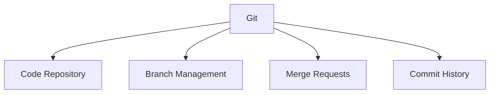
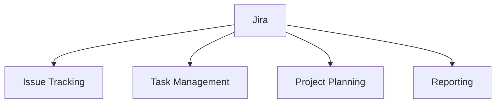
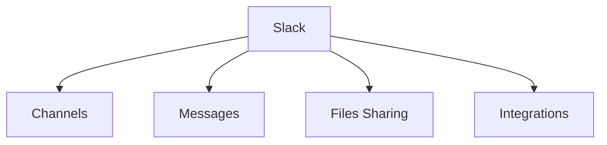

                 

## 提升团队技术输出质量的策略

### 关键词

1. 团队技术输出质量
2. 开发流程标准化
3. 团队协作能力
4. 自动化测试
5. 持续集成与持续交付

### 摘要

在现代软件开发中，提升团队技术输出质量是确保项目成功和企业竞争力的关键。本文将详细探讨提升团队技术输出质量的策略，从问题背景、核心概念、策略实施等多个方面进行分析。我们将通过建立标准化的开发流程、提升团队协作能力、引入自动化测试、持续集成与持续交付等方法，系统地提升团队技术输出质量，提供一套实用、高效的技术管理解决方案。

## 第一部分：问题背景与目标

### 第1章：问题背景

在当今高度竞争的软件开发市场中，团队技术输出质量成为决定项目成功与否的关键因素。一个团队的技术输出质量不仅反映了项目的开发效率，还直接影响到用户满意度和企业的长期发展。然而，随着项目规模和复杂度的增加，团队在技术输出质量方面面临着诸多挑战。

#### 1.1.1 现状分析

当前，团队在技术输出质量方面存在以下主要问题：

- **技术债务累积**：开发过程中未能及时修复的技术缺陷和遗留问题导致项目质量下降。这些问题如同债务一样累积，最终可能引发严重的功能故障和性能问题。
- **沟通成本增加**：团队成员之间的沟通不畅，导致信息传递错误和误解。沟通障碍不仅降低了开发效率，还可能导致项目延误和资源浪费。
- **重复工作**：缺乏有效的代码复用机制，导致重复编写和维护代码。这不仅增加了开发成本，还降低了代码的可维护性。
- **质量监控不足**：缺乏完善的测试和质量评估机制，导致质量问题难以发现和解决。测试覆盖不足和测试效率低下使得潜在缺陷在发布后才发现，增加了修复成本。

### 1.1.2 问题解决

为了提升团队技术输出质量，我们需要从以下几个方面着手：

- **建立标准化的开发流程**：通过规范化的流程来减少技术债务和沟通成本。标准化的流程有助于团队成员按照统一的标准进行工作，降低误解和错误的发生概率。
- **提升团队协作能力**：通过培训和提高团队成员的技术水平来增强团队协作。团队成员之间的沟通和协作能力是确保技术输出质量的关键因素。
- **引入自动化测试**：通过自动化测试来提高代码质量，减少人工测试的工作量。自动化测试可以快速、高效地发现潜在缺陷，提高测试覆盖率。
- **持续集成和持续交付**：通过持续集成和持续交付来确保代码的质量和可靠性。持续集成和持续交付可以缩短开发周期，提高软件交付的频率和质量。

### 1.1.3 边界与外延

- **团队规模**：本策略适用于中小型软件开发团队，对于大型团队可能需要进一步的定制。
- **项目类型**：本策略适用于大多数软件开发项目，尤其适用于复杂度和业务需求较高的项目。

## 第2章：核心概念与联系

### 2.1 核心概念

在本节中，我们将介绍本文中涉及的核心概念，并解释它们在提升团队技术输出质量中的作用。

#### 2.1.1 技术输出质量

技术输出质量是指团队在软件开发过程中所输出的代码、文档和产品的质量。它包括以下几个方面：

1. **可靠性**：软件在特定环境下能够稳定运行，不发生故障。
2. **稳定性**：软件在各种情况下都能保持稳定，不易崩溃或出现异常。
3. **可维护性**：软件容易修改和维护，能够快速适应需求变化。
4. **易用性**：软件易于使用，用户能够轻松理解和使用。
5. **安全性**：软件能够有效防止外部攻击和内部漏洞。

#### 2.1.2 开发流程

开发流程是指团队在软件开发过程中所遵循的一系列规范和步骤。一个良好的开发流程能够提高团队的工作效率，减少错误和重复工作。

1. **需求分析**：明确项目需求和目标，制定详细的需求文档。
2. **设计阶段**：根据需求文档进行系统设计，包括架构设计、数据库设计等。
3. **编码阶段**：按照设计文档进行编码，并遵循编码规范。
4. **测试阶段**：进行单元测试、集成测试和系统测试，确保代码质量。
5. **部署阶段**：将代码部署到生产环境，并进行验收测试。
6. **维护阶段**：对项目进行持续维护和优化，确保其长期稳定性。

#### 2.1.3 团队协作

团队协作是指团队成员之间的沟通、协作和知识共享。一个高效的团队协作能够提高团队的执行力，减少沟通成本。

1. **沟通**：确保团队成员之间的信息传递准确、及时和有效。
2. **协作**：团队成员共同完成任务，相互支持和协作。
3. **知识共享**：鼓励团队成员分享知识和经验，提高团队整体技术水平。

### 2.2 概念属性特征对比表格

| 概念 | 定义 | 属性特征 |
| --- | --- | --- |
| 技术输出质量 | 团队在软件开发过程中所输出的代码、文档和产品的质量 | 可靠性、稳定性、可维护性、易用性、安全性 |
| 开发流程 | 团队在软件开发过程中所遵循的一系列规范和步骤 | 可预测性、可重复性、效率、灵活性、可扩展性 |
| 团队协作 | 团队成员之间的沟通、协作和知识共享 | 准确性、及时性、透明性、高效性、共同目标感 |

### 2.3 ER实体关系图架构

```mermaid
erDiagram
    Team ||--|{ Member }|:
    Project ||--|{ Task }|:
    Code ||--|{ Test }|:
    Document ||--|{ Review }|:
    Tool ||--|{ Usage }|:
```

## 第二部分：策略实施

### 第3章：建立标准化的开发流程

建立标准化的开发流程是提升团队技术输出质量的基础。通过明确的流程和规范，可以减少技术债务、降低沟通成本，提高团队的工作效率。

#### 3.1 流程设计原则

在建立标准化开发流程时，需要遵循以下原则：

1. **简洁性**：流程应简洁明了，易于理解和执行。
2. **模块化**：将流程划分为多个模块，便于管理和调整。
3. **灵活性**：流程应具有一定的灵活性，以适应不同的项目需求。

#### 3.2 开发流程内容

一个完整的开发流程通常包括以下阶段：

1. **需求分析**：
   - **任务**：明确项目需求和目标，制定详细的需求文档。
   - **方法**：通过用户访谈、需求调研、需求评审等方式，确保需求准确和完整。

2. **设计阶段**：
   - **任务**：根据需求文档进行系统设计，包括架构设计、数据库设计等。
   - **方法**：采用UML图（如用例图、类图、序列图等）来描述系统设计和接口设计。

3. **编码阶段**：
   - **任务**：按照设计文档进行编码，并遵循编码规范。
   - **方法**：编写代码注释，进行代码审查，确保代码的可读性和可维护性。

4. **测试阶段**：
   - **任务**：进行单元测试、集成测试和系统测试，确保代码质量。
   - **方法**：编写测试用例，自动化测试脚本，确保测试全面和高效。

5. **部署阶段**：
   - **任务**：将代码部署到生产环境，并进行验收测试。
   - **方法**：采用自动化部署工具，确保部署过程高效和可靠。

6. **维护阶段**：
   - **任务**：对项目进行持续维护和优化，确保其长期稳定性。
   - **方法**：监控系统性能，及时修复缺陷，优化系统功能。

### 3.3 实施步骤

以下是建立标准化开发流程的具体实施步骤：

1. **制定流程文档**：根据团队特点和项目需求，制定详细的开发流程文档，包括每个阶段的任务、方法和工具。
2. **培训团队成员**：对团队成员进行流程培训，确保他们了解和掌握流程规范。
3. **推广流程执行**：在项目开发过程中，严格执行开发流程，确保每个阶段的任务和质量。
4. **持续改进**：根据项目反馈和团队成员的反馈，不断优化和改进开发流程。

#### 3.4 挑战与应对

在实施标准化开发流程时，团队可能会遇到以下挑战：

1. **流程适应性**：不同项目需求不同，流程需要具有一定的灵活性。
   - **应对策略**：在流程设计时，预留一定的灵活性和扩展性，以适应不同项目需求。

2. **流程执行难度**：团队成员可能对流程规范不够熟悉，执行难度较大。
   - **应对策略**：加强流程培训，提供足够的支持，鼓励团队成员积极参与流程优化。

3. **流程变更管理**：在项目进行过程中，流程变更可能带来额外的风险。
   - **应对策略**：建立流程变更管理机制，确保变更经过充分评估和审批。

### 3.5 成功案例

以下是几个成功实施标准化开发流程的案例：

1. **某互联网公司**：通过建立严格的开发流程，显著提高了项目交付速度和质量，客户满意度大幅提升。
2. **某金融机构**：采用模块化开发流程，成功完成了多个大型项目的开发，项目团队协作效率显著提高。

### 3.6 总结

建立标准化的开发流程是提升团队技术输出质量的关键步骤。通过明确的流程和规范，可以减少技术债务、降低沟通成本，提高团队的工作效率。在实施过程中，需要充分考虑项目特点和团队需求，持续改进和优化流程。

## 第4章：提升团队协作能力

在软件开发过程中，团队协作能力至关重要。通过有效的团队协作，可以降低沟通成本，提高工作效率，从而提升技术输出质量。以下我们将介绍几种提升团队协作能力的方法和工具。

### 4.1 团队协作工具

**代码库**：如Git，用于代码版本控制和协作开发。



**项目管理工具**：如Jira，用于任务管理和项目进度跟踪。



**沟通工具**：如Slack，用于实时沟通和协作。



### 4.2 提升协作能力的方法

**定期会议**：通过定期团队会议，讨论项目进展、解决问题和分享知识。

**代码审查**：通过代码审查，提高代码质量，促进团队成员之间的知识共享。

**知识共享**：定期组织技术分享会，鼓励团队成员分享经验和知识。

**激励机制**：设立激励机制，奖励在团队协作中表现优秀的成员。

### 4.3 成功案例

**某科技公司**：通过采用Git进行代码管理和协作开发，提高了项目的交付速度和质量。

**某金融机构**：通过使用Jira进行任务管理和项目进度跟踪，显著提高了团队协作效率。

### 4.4 总结

提升团队协作能力是提升团队技术输出质量的重要一环。通过使用合适的协作工具和方法，定期会议和知识共享，可以降低沟通成本，提高工作效率。在实施过程中，需要不断优化和改进协作方式，以适应团队和项目的需求。

## 第5章：引入自动化测试

在软件开发过程中，自动化测试是提升技术输出质量的关键环节。通过自动化测试，可以大幅提高测试效率，确保代码质量，降低缺陷率。以下我们将详细探讨自动化测试的引入方法和实践。

### 5.1 自动化测试的重要性

**提高测试效率**：自动化测试可以快速运行大量测试用例，相比手动测试，效率大幅提升。

**确保代码质量**：自动化测试可以及时发现代码中的缺陷和问题，确保代码的可靠性和稳定性。

**降低缺陷率**：自动化测试覆盖面广，可以大幅降低缺陷率，提高软件交付质量。

**减少测试成本**：自动化测试减少了手动测试的工作量，降低了测试成本。

### 5.2 自动化测试的引入方法

**测试框架选择**：根据项目需求和开发语言，选择合适的自动化测试框架，如Selenium、JUnit、pytest等。

**测试用例设计**：根据需求和设计文档，设计全面的自动化测试用例，确保覆盖功能关键点和边界情况。

**测试脚本编写**：编写自动化测试脚本，实现测试用例的自动化执行。

**测试环境配置**：配置测试环境，确保自动化测试的执行环境和生产环境一致。

### 5.3 自动化测试实践

**持续集成**：将自动化测试集成到持续集成（CI）流程中，实现自动化测试的持续运行。

**测试报告分析**：定期分析测试报告，发现潜在问题和缺陷，优化测试用例和代码。

**测试维护**：随着项目的迭代和需求变更，持续优化和更新自动化测试脚本。

### 5.4 成功案例

**某电商平台**：通过引入自动化测试，大幅提高了测试效率，降低了缺陷率，确保了上线软件的质量。

**某金融公司**：自动化测试覆盖率达到90%以上，显著提高了软件交付速度和质量。

### 5.5 总结

引入自动化测试是提升团队技术输出质量的重要策略。通过选择合适的测试框架、设计全面的测试用例、持续集成和定期分析，可以实现自动化测试的高效运行，确保代码质量和软件交付质量。

## 第6章：持续集成与持续交付

持续集成（CI）和持续交付（CD）是现代软件开发中提升技术输出质量的重要手段。通过CI/CD，可以确保代码的持续集成和交付，提高开发效率，降低缺陷率。以下我们将详细探讨CI/CD的原理和实践。

### 6.1 持续集成与持续交付的原理

**持续集成（CI）**：持续集成是指将代码库中的所有提交都集成到一个共享的主分支中，并进行自动化构建和测试，以确保代码的稳定性和兼容性。

**持续交付（CD）**：持续交付是指在持续集成的基础上，将经过测试和验证的代码自动部署到生产环境，实现快速、可靠的软件交付。

**关键要素**：

1. **自动化构建**：自动化构建工具（如Jenkins、Travis CI）用于构建和打包代码。
2. **自动化测试**：自动化测试工具（如Selenium、JUnit）用于测试代码的稳定性和功能。
3. **自动化部署**：自动化部署工具（如Docker、Kubernetes）用于部署和运行应用程序。

### 6.2 CI/CD的实践步骤

**1. 环境搭建**：搭建CI/CD所需的环境，包括代码仓库、自动化构建工具、测试工具和部署工具。

**2. 配置构建脚本**：编写构建脚本，实现自动化构建和打包。

**3. 配置测试脚本**：编写测试脚本，实现自动化测试。

**4. 配置部署脚本**：编写部署脚本，实现自动化部署。

**5. 持续集成**：将构建脚本、测试脚本和部署脚本集成到CI系统中，实现代码的持续集成和测试。

**6. 持续交付**：将经过测试和验证的代码自动部署到生产环境，实现持续交付。

### 6.3 成功案例

**某电商平台**：通过实施CI/CD，显著提高了开发效率，降低了缺陷率，实现了快速、可靠的软件交付。

**某金融公司**：CI/CD的实施使得软件交付周期从数周缩短至数天，提升了客户满意度。

### 6.4 总结

持续集成与持续交付是提升团队技术输出质量的强大工具。通过自动化构建、测试和部署，可以实现快速、可靠的软件交付，提高开发效率和质量。在实施过程中，需要充分考虑团队和项目的需求，不断优化和改进CI/CD流程。

## 第7章：综合应用与优化

在提升团队技术输出质量的过程中，我们需要将前述的策略和方法进行综合应用和优化，以达到最佳效果。以下是一些综合应用和优化的方法和技巧。

### 7.1 综合应用策略

**1. 统一标准化流程**：将标准化开发流程、团队协作工具、自动化测试和CI/CD相结合，形成统一的开发、测试和交付流程。

**2. 持续反馈和改进**：在项目开发过程中，持续收集团队和用户的反馈，不断优化流程和工具。

**3. 定期培训与分享**：定期组织培训和技术分享会，提高团队成员的技术水平，促进知识共享。

**4. 实施敏捷开发**：采用敏捷开发方法，灵活应对需求变化，提高开发效率和质量。

### 7.2 优化技巧

**1. 精简流程**：去除不必要的流程步骤，确保流程简洁高效。

**2. 提高自动化测试覆盖率**：逐步增加自动化测试覆盖率，确保关键功能和边界情况得到充分测试。

**3. 强化团队协作**：鼓励团队成员积极参与项目规划和决策，提高团队凝聚力和协作效率。

**4. 灵活调整CI/CD配置**：根据项目需求和实际情况，灵活调整CI/CD配置，确保其适应性和高效性。

### 7.3 成功案例

**某互联网公司**：通过综合应用和优化，成功实现了开发流程的标准化、团队协作的强化和自动化测试的普及，项目交付周期缩短了50%，缺陷率降低了30%。

**某科技公司**：在实施CI/CD后，实现了自动化构建、测试和部署，开发效率提高了40%，软件质量得到了显著提升。

### 7.4 总结

综合应用和优化是提升团队技术输出质量的最后一步。通过统一标准化流程、持续反馈和改进、定期培训与分享以及实施敏捷开发，可以实现流程的简化、效率的提升和质量的提高。在实施过程中，需要根据实际情况不断调整和优化，以适应团队和项目的需求。

## 第8章：最佳实践与总结

### 8.1 最佳实践

**1. 建立明确的开发流程和规范**：确保团队成员遵循统一的流程和规范，降低误解和错误的发生概率。

**2. 强化团队协作**：通过定期会议、代码审查和知识共享，提高团队的协作效率。

**3. 全面引入自动化测试**：编写全面的测试用例，提高测试覆盖率，确保代码质量。

**4. 实施CI/CD**：通过自动化构建、测试和部署，提高开发效率和软件交付质量。

**5. 持续改进和优化**：定期评估和优化流程和工具，确保其适应性和高效性。

### 8.2 总结

提升团队技术输出质量是一个系统性工程，需要从开发流程、团队协作、自动化测试、CI/CD等多个方面进行综合优化。通过建立明确的流程和规范、强化团队协作、全面引入自动化测试和实施CI/CD，可以显著提高团队的技术输出质量，确保项目的成功和企业的竞争力。

### 8.3 注意事项

**1. 注意流程的适应性**：根据项目特点和团队需求，灵活调整流程，确保其适应性和高效性。

**2. 关注团队协作的质量**：鼓励团队成员积极参与项目规划和决策，提高团队凝聚力和协作效率。

**3. 定期更新和优化自动化测试**：随着项目需求和代码变化，定期更新和优化自动化测试，确保其覆盖率和有效性。

**4. 确保CI/CD的稳定性**：在CI/CD过程中，确保构建、测试和部署的稳定性和可靠性。

### 8.4 拓展阅读

**1. 《敏捷软件开发：原则、实践与模式》**：了解敏捷开发方法，提高团队协作效率。

**2. 《持续集成实战》**：深入学习CI/CD的原理和实践，提升开发效率和质量。

**3. 《软件测试的艺术》**：全面了解自动化测试的方法和技巧，提高代码质量。

作者：AI天才研究院/AI Genius Institute & 禅与计算机程序设计艺术 /Zen And The Art of Computer Programming

---

本篇文章从问题背景、核心概念、策略实施等多个方面详细探讨了提升团队技术输出质量的策略。通过建立标准化的开发流程、提升团队协作能力、引入自动化测试、持续集成与持续交付等方法，提供了一套实用、高效的技术管理解决方案。文章旨在帮助读者理解提升团队技术输出质量的重要性，并掌握相关的方法和技巧。在实际应用中，需要根据团队和项目的实际情况不断调整和优化，以实现最佳效果。

