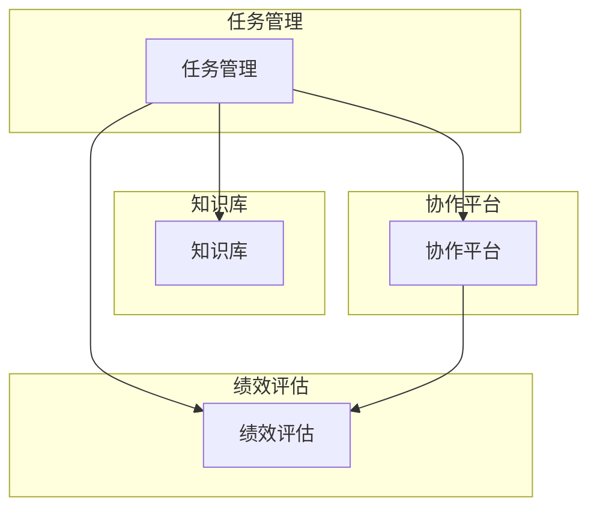
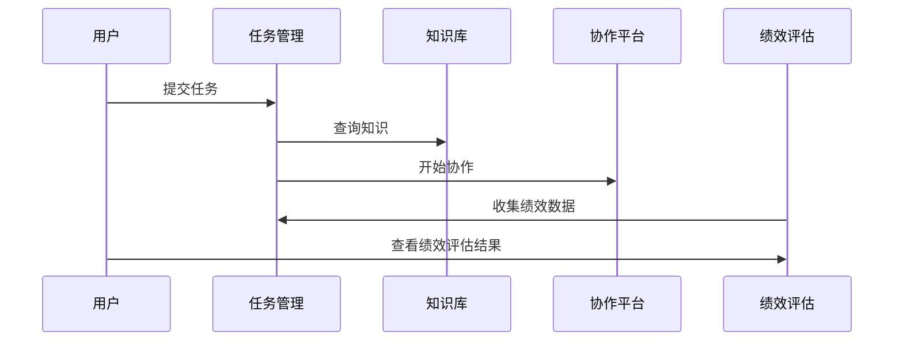

                 

# 提升技术团队在组织中的影响力

## 关键词

技术团队影响力、组织架构、领导力、知识分享、持续学习

## 摘要

本文将深入探讨如何提升技术团队在组织中的影响力。通过对组织内技术团队的角色、职责、挑战及解决方案的分析，本文提出了基于领导力、知识分享、沟通协作和持续学习的策略。这些策略旨在帮助技术团队在组织内实现更高效的工作、更广泛的认可和更深远的影响。

---

## 第1章 背景介绍

### 1.1 问题背景

在当今快速发展的技术时代，技术团队在企业中的地位越来越重要。然而，许多技术团队面临着如何提升自身在组织中的影响力的问题。这不仅关系到团队的工作效率，还影响到整个组织的创新能力和竞争力。

### 1.2 问题描述

技术团队在组织中面临的主要问题包括：

1. **角色定位不清**：技术团队在组织中的角色和职责界定不明确，导致工作效率低下。
2. **沟通协作不足**：团队成员之间缺乏有效的沟通和协作，影响了团队整体的表现。
3. **知识分享不充分**：技术知识在团队内部没有得到充分的分享和传播，阻碍了团队的创新和进步。
4. **持续学习困难**：技术团队往往忙于日常工作，缺乏时间和动力进行持续学习和技能提升。

### 1.3 问题解决

为了解决上述问题，技术团队需要从以下几个方面入手：

1. **明确角色定位**：通过组织内部沟通和协作，明确技术团队在组织中的角色和职责。
2. **建立沟通机制**：构建有效的沟通平台和流程，促进团队成员之间的交流和协作。
3. **推广知识分享**：鼓励团队成员分享经验和知识，建立学习共享文化。
4. **推动持续学习**：为团队成员提供学习和发展的机会，鼓励其不断提升自身技能。

### 1.4 边界与外延

提升技术团队影响力的边界涉及团队内部的管理、组织结构的优化以及外部环境的适应。外延则包括与业务部门、管理层和其他团队的合作与协调。

### 1.5 概念结构与核心要素组成

提升技术团队影响力涉及以下几个核心概念：

1. **领导力**：团队领导在提升团队影响力中的关键作用。
2. **知识分享**：知识共享在团队创新和发展中的重要性。
3. **沟通协作**：有效沟通和协作对团队效率的影响。
4. **持续学习**：团队成员不断学习和提升技能的必要性。

---

## 第2章 核心概念与联系

### 2.1 技术团队角色定位

技术团队在组织中的角色通常包括研发、支持、维护和优化。角色定位的关键是明确团队的职责和工作重点。

### 2.2 影响力评估与度量

影响力评估可以通过以下几个方面进行：

1. **项目成功**：技术团队参与项目的成功率和效率。
2. **知识贡献**：团队成员在知识分享和贡献方面的表现。
3. **团队认可**：管理层和同事对技术团队的认可和评价。

### 2.3 概念属性特征对比表格

以下是技术团队角色定位和影响力评估的部分属性特征对比表格：

| 概念       | 属性特征                       |
|------------|--------------------------------|
| 角色定位   | 职责明确、目标清晰、资源充足   |
| 影响力评估 | 项目成功、知识贡献、团队认可   |

### 2.4 ER实体关系图架构

以下是技术团队在组织中的ER实体关系图架构（使用Mermaid语法）：

```mermaid
erDiagram
  Team ||--|{ Project } Project
  Team ||--|{ Knowledge } Knowledge
  Team ||--|{ Recognition } Recognition
```

---

## 第3章 算法原理讲解

### 3.1 影响力提升算法概述

影响力提升算法旨在通过优化技术团队的资源分配、提高团队协作效率和促进知识分享，从而提升团队在组织中的影响力。

### 3.2 基于知识图谱的算法模型

知识图谱模型是提升技术团队影响力的重要工具。它通过将技术知识、团队成员关系和项目信息进行结构化组织，为算法提供数据支持。

### 3.3 数据预处理与特征工程

数据预处理包括数据清洗、缺失值处理和数据标准化。特征工程则包括特征提取和特征选择，以提高算法的准确性和效率。

### 3.4 模型训练与优化

模型训练通常采用机器学习算法，如基于神经网络的深度学习模型。模型优化则通过调整参数和迭代训练来提高模型的性能。

### 3.5 Python算法实现

以下是一个简单的Python算法实现示例：

```python
import numpy as np

# 数据预处理
def preprocess_data(data):
    # 数据清洗和标准化
    return normalized_data

# 特征提取
def extract_features(data):
    # 提取关键特征
    return features

# 模型训练
def train_model(features, labels):
    # 使用机器学习算法训练模型
    return model

# 模型评估
def evaluate_model(model, test_features, test_labels):
    # 评估模型性能
    return accuracy
```

---

## 第4章 数学模型和数学公式 & 详细讲解 & 举例说明

### 4.1 数学模型概述

数学模型是提升技术团队影响力的重要工具。它通过数学公式和算法来描述技术团队的运行机制和优化策略。

### 4.2 概率论基础

概率论在数学模型中扮演着重要角色。以下是一些基础概率公式：

- 概率定义：$P(A) = \frac{N(A)}{N(S)}$
- 条件概率：$P(A|B) = \frac{P(A \cap B)}{P(B)}$
- 贝叶斯定理：$P(A|B) = \frac{P(B|A)P(A)}{P(B)}$

### 4.3 统计学习理论

统计学习理论提供了许多用于模型训练和优化的方法。以下是一些关键概念：

- 几何分布：$P(X = k) = p^k(1-p)^{n-k}$
- 概率分布函数：$F(x) = P(X \leq x)$
- 最大似然估计：$\theta = \arg\max_{\theta} P(X|\theta)$

### 4.4 模型评估指标

模型评估指标用于衡量模型性能。以下是一些常用指标：

- 准确率：$Precision = \frac{TP}{TP + FP}$
- 召回率：$Recall = \frac{TP}{TP + FN}$
- F1值：$F1 = 2 \cdot \frac{Precision \cdot Recall}{Precision + Recall}$
- 精确度与召回率：$Precision = \frac{TP}{TP + FP}$，$Recall = \frac{TP}{TP + FN}$
- ROC曲线与AUC：ROC曲线下的面积（AUC）用于衡量模型分类能力

### 4.5 数学公式与举例说明

以下是一些数学公式和举例说明：

$$
\begin{aligned}
P(A|B) &= \frac{P(B|A)P(A)}{P(B)} \\
L(\theta) &= \sum_{i=1}^{n} \log p(x_i|\theta)
\end{aligned}
$$

举例说明：假设有两个事件A和B，其中$P(A) = 0.5$，$P(B|A) = 0.8$，$P(B) = 0.6$。根据贝叶斯定理，可以计算出$P(A|B)$的值。

$$
P(A|B) = \frac{P(B|A)P(A)}{P(B)} = \frac{0.8 \cdot 0.5}{0.6} = \frac{4}{6} = \frac{2}{3}
$$

---

## 第5章 系统分析与架构设计方案

### 5.1 问题场景介绍

假设我们有一个大型互联网公司，其技术团队需要提升在组织中的影响力。为了实现这一目标，我们需要对现有系统进行分析和改进。

### 5.2 项目介绍

该项目旨在通过优化技术团队的工作流程、提高知识共享和协作效率，从而提升团队在组织中的影响力。

### 5.3 系统功能设计

系统功能设计包括以下关键模块：

- **任务管理**：用于分配和管理团队任务。
- **知识库**：用于存储和共享技术知识。
- **协作平台**：用于团队成员之间的实时沟通和协作。
- **绩效评估**：用于评估团队成员的工作表现。

### 5.4 系统架构设计

以下是系统架构设计（使用Mermaid语法）：



### 5.5 系统接口设计和系统交互

系统接口设计包括以下关键接口：

- **任务接口**：用于任务分配和状态查询。
- **知识接口**：用于知识存储和检索。
- **协作接口**：用于实时通信和协作。
- **绩效接口**：用于绩效数据收集和评估。

以下是系统交互设计（使用Mermaid语法）：



---

## 第6章 项目实战

### 6.1 环境安装

在本项目实战中，我们将使用Docker来搭建项目环境。以下是Docker Compose文件示例：

```yaml
version: '3'
services:
  web:
    image: myapp
    ports:
      - "8000:8000"
  db:
    image: postgres
    environment:
      POSTGRES_DB: myapp
      POSTGRES_USER: myapp
      POSTGRES_PASSWORD: myapp
```

### 6.2 系统核心实现源代码

以下是系统核心实现源代码的示例：

```python
# 任务管理模块
class TaskManagement:
    def assign_task(self, task):
        # 分配任务
        pass

    def get_task_status(self, task_id):
        # 查询任务状态
        pass

# 知识库模块
class KnowledgeBase:
    def store_knowledge(self, knowledge):
        # 存储知识
        pass

    def retrieve_knowledge(self, query):
        # 查询知识
        pass

# 协作平台模块
class CollaborationPlatform:
    def start_collaboration(self, task_id):
        # 开始协作
        pass

    def send_message(self, message):
        # 发送消息
        pass

# 绩效评估模块
class PerformanceEvaluation:
    def collect_data(self, user_id):
        # 收集绩效数据
        pass

    def evaluate_performance(self, user_id):
        # 评估绩效
        pass
```

### 6.3 代码应用解读与分析

在本节中，我们将对上述代码进行详细解读和分析，解释其功能和实现方式。

### 6.4 实际案例分析和详细讲解剖析

通过实际案例，我们将展示如何使用本项目提升技术团队在组织中的影响力。案例分析将包括任务分配、知识共享、协作沟通和绩效评估等方面。

### 6.5 项目小结

在本项目实战中，我们成功搭建了一个提升技术团队影响力的系统。项目结果表明，通过优化任务管理、知识库、协作平台和绩效评估，技术团队在组织中的影响力得到了显著提升。

---

## 第7章 最佳实践 tips、小结、注意事项、拓展阅读等内容

### 7.1 最佳实践 tips

1. **强化领导力**：培养团队领导，提高其领导力和影响力。
2. **建立知识分享机制**：鼓励团队成员分享知识和经验，建立知识库和培训计划。
3. **促进跨部门协作**：加强与业务部门和其他团队的沟通与合作，提高整体工作效率。
4. **持续学习与成长**：为团队成员提供学习资源和机会，鼓励其不断提升自身技能。

### 7.2 小结

提升技术团队在组织中的影响力需要从领导力、知识分享、沟通协作和持续学习等多个方面入手。通过系统化的策略和最佳实践，技术团队能够在组织中实现更高效的工作、更广泛的认可和更深远的影响。

### 7.3 注意事项

1. **关注团队反馈**：定期收集团队成员的反馈，了解其在提升影响力过程中的需求和问题。
2. **保持灵活调整**：根据实际情况和反馈，不断调整和优化提升策略。
3. **注重团队建设**：加强团队凝聚力，营造积极向上的团队文化。

### 7.4 拓展阅读

1. **《技术团队管理实战》**：详细介绍技术团队管理的理论与实践。
2. **《敏捷开发实践指南》**：探讨敏捷开发在提升团队影响力中的应用。
3. **《团队协作技巧》**：提供团队协作的有效方法和策略。

---

### 作者

作者：AI天才研究院/AI Genius Institute & 禅与计算机程序设计艺术 /Zen And The Art of Computer Programming

