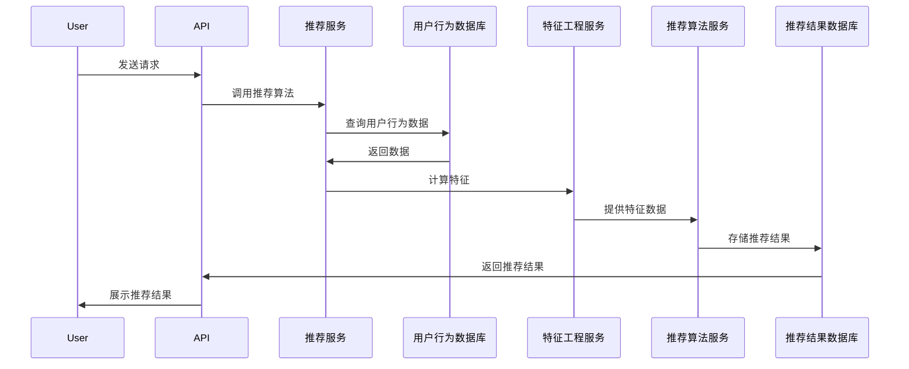

                 

### 文章标题

# 提高技术决策的效率与质量

### 关键词

技术决策、效率、质量、数据驱动力、风险管理、算法模型

### 摘要

在快速变化的技术环境中，技术决策的效率与质量对企业竞争力至关重要。本文深入探讨技术决策过程中的核心概念，包括效率和质量，并通过逻辑清晰、结构紧凑的分析，提出有效的决策框架和策略。文章还将介绍先进工具和模型，帮助读者在实际项目中提高技术决策的效率和效果。通过系统化的方法论和实践指导，本文旨在为技术决策者提供切实可行的工具和思路，以增强企业的技术创新能力和市场响应速度。

## 引言

### 背景介绍

在当今的数字化时代，技术决策已经成为企业发展和创新的关键驱动力。技术决策不仅涉及到技术选型的过程，还包括项目实施、运维以及持续优化等多个环节。然而，随着技术环境的复杂性和不确定性增加，技术决策的效率和质量面临着巨大的挑战。

目前，技术决策过程中存在几个主要问题。首先，缺乏系统化的决策框架，导致决策过程不透明、不科学，容易受到主观因素的影响。其次，数据驱动不足，许多决策依然依赖经验和直觉，缺乏客观依据。最后，风险管理不足，导致项目在实施过程中容易出现偏差，影响项目交付质量和效率。

提高技术决策的效率与质量具有重要意义。高效的决策可以缩短项目周期，降低成本，提高项目的成功率。高质量的技术决策能够确保项目的技术方案可行、稳定，提升产品的市场竞争力。因此，研究和实践如何提高技术决策的效率与质量，已经成为当前企业和研究机构的重要课题。

### 问题描述

技术决策的效率与质量涉及多个方面，包括决策的速度、准确性、可靠性以及决策结果的可持续性。具体问题如下：

1. **决策速度**：技术项目往往需要在短时间内做出决策，以适应市场变化和技术发展的速度。如何提高决策速度，同时保证决策质量，是一个重要的挑战。
2. **决策准确性**：技术决策需要基于准确的信息和数据，然而在实际操作中，数据可能存在噪声、缺失或不准确的问题。如何提高决策准确性，是一个关键问题。
3. **决策可靠性**：技术决策的可靠性关系到项目的成功与否。如何确保决策的可靠性，避免因决策错误导致项目失败，是需要解决的问题。
4. **决策可持续性**：技术决策不仅要考虑短期效果，还要关注长期影响和可持续性。如何在保证短期效益的同时，确保长期发展的可持续性，是技术决策者需要思考的问题。

综上所述，提高技术决策的效率与质量，不仅是技术问题，更是管理和战略层面的重要议题。解决这些问题，需要结合科学的方法论和实践经验，通过系统化的分析和有效的工具支持，才能实现技术决策的优化。

### 问题解决

为了提高技术决策的效率与质量，可以采取以下几种策略和措施：

1. **构建系统化的决策框架**：建立一个科学的决策框架，可以帮助技术决策者明确决策的目标、过程和标准。这个框架应包括数据收集、分析、评估和决策等多个环节，确保决策过程的透明性和科学性。

2. **引入数据驱动的方法**：利用大数据分析和人工智能技术，可以显著提高技术决策的准确性和可靠性。通过数据驱动的方法，决策者可以更客观地评估各种技术方案，减少主观因素的干扰。

3. **加强风险管理**：建立完善的风险管理机制，对项目实施过程中的各种风险进行识别、评估和控制。通过风险管理的系统化，可以有效降低项目失败的风险，确保技术决策的可靠性。

4. **优化团队协作**：技术决策往往需要跨部门、跨领域的协作。通过优化团队协作，可以提高决策的效率和质量。这包括建立有效的沟通机制、明确分工和责任，以及提供必要的资源和支持。

5. **持续学习和优化**：技术环境和市场变化迅速，技术决策者需要不断学习和适应。通过持续的学习和优化，可以不断提高技术决策的能力和水平，以应对新的挑战。

通过这些策略和措施，技术决策的效率和质量可以得到显著提升，从而为企业的发展提供坚实的支持。然而，这些策略需要在实际操作中不断验证和优化，才能达到最佳效果。

### 边界与外延

技术决策的效率与质量是一个广泛而复杂的话题，其边界和外延涉及多个方面：

1. **边界**：
   - **技术范围**：技术决策主要关注在特定技术领域内的选择和规划，不涉及其他非技术因素。
   - **应用范围**：技术决策适用于各类技术项目，包括软件开发、系统集成、技术创新等。
   - **时间范围**：技术决策涉及的时间范围可以是短期（如项目周期内）或长期（如战略规划期）。

2. **外延**：
   - **跨领域应用**：技术决策不仅限于单一领域，还可以跨领域应用，如将数据分析技术应用于市场营销决策。
   - **风险管理**：技术决策的外延还包括风险管理，如项目风险预测、应对策略制定。
   - **战略层面**：技术决策不仅影响项目实施，还可以影响企业战略方向，如技术投资、创新战略。

理解技术决策的边界与外延，有助于更准确地把握其核心内容和应用场景，从而在实践中更好地提升决策效率与质量。

### 核心概念与定义

#### 技术决策

**定义**：技术决策是指企业在技术选型、技术方案规划、技术实施和运维等环节中，根据既定目标和约束条件，对多种技术方案进行评估、选择和优化的过程。

**核心要素**：
- **目标**：技术决策的目标包括提升性能、降低成本、提高用户体验等。
- **约束条件**：约束条件包括预算、时间、技术可行性、法律法规等。
- **方案评估**：评估技术方案的可行性、优势、劣势、风险等。

**特点**：
- **系统性**：技术决策涉及多个环节和因素，需要系统化的思考和分析。
- **动态性**：技术决策过程需要实时调整和优化，以应对技术环境和市场变化。

#### 效率

**定义**：效率是指在特定资源和时间限制下，完成特定任务的能力和效果。

**核心要素**：
- **资源**：资源包括人力、物力、财力等。
- **时间**：时间是指完成任务所需的时间长度。
- **效果**：效果是指任务完成的程度和质量。

**特点**：
- **量化**：效率可以通过量化的指标进行评估，如完成任务的时间、资源消耗等。
- **优化**：提高效率的目标是优化资源配置和流程，减少不必要的浪费。

#### 质量

**定义**：质量是指产品或服务满足用户需求的能力和特征。

**核心要素**：
- **用户需求**：用户需求是质量评价的基准。
- **可靠性**：可靠性是指产品或服务的稳定性和持久性。
- **用户体验**：用户体验是指用户在使用产品或服务时的感受和满意度。

**特点**：
- **主观性**：质量具有一定的主观性，不同用户对质量的评价可能不同。
- **全面性**：质量涉及多个方面，包括功能性、可靠性、易用性、性能等。

### 核心概念对比表

| 要素     | 技术决策 | 效率       | 质量       |
| -------- | -------- | ---------- | ---------- |
| 定义     | 技术选型和规划过程 | 完成特定任务的能力 | 满足用户需求的能力 |
| 核心要素 | 目标、约束条件、方案评估 | 资源、时间、效果 | 用户需求、可靠性、用户体验 |
| 特点     | 系统性、动态性 | 量化、优化 | 主观性、全面性 |

通过对比表可以看出，技术决策、效率和质量虽然各有侧重点，但它们之间存在着紧密的联系。技术决策的效率和质量的提升，有助于实现更高效、更可靠、更满意的技术方案，从而增强企业的竞争力。

#### ER图架构

为了更清晰地展示技术决策、效率和质量的实体关系，可以绘制一个ER图（实体-关系图）：

```mermaid
erDiagram
    TechnicalDecision ||--|{ Efficiency } : has
    TechnicalDecision ||--|{ Quality } : has
    Efficiency ||--|{ Time } : involves
    Efficiency ||--|{ Resources } : involves
    Quality ||--|{ Reliability } : involves
    Quality ||--|{ UserExperience } : involves
```

在这个ER图中，技术决策与效率和质量之间存在直接关系，效率涉及时间和资源，而质量涉及可靠性和用户体验。这种结构化关系有助于理解技术决策过程中各要素的相互作用，为实际应用提供指导。

## 核心概念详解

在本节中，我们将深入探讨技术决策、效率和质量这三个核心概念，通过详细的定义、特征和相互关系分析，帮助读者更好地理解这些概念在技术决策过程中的重要性。

### 技术决策

技术决策是指企业在技术选型、技术方案规划、技术实施和运维等环节中，根据既定目标和约束条件，对多种技术方案进行评估、选择和优化的过程。技术决策的核心要素包括：

#### 定义

技术决策的**定义**涉及多个层次。首先，技术决策是一个**目标导向**的过程，企业需要明确决策的目标，如提升性能、降低成本、提高用户体验等。其次，技术决策需要**考虑约束条件**，这些约束条件可能包括预算、时间、技术可行性、法律法规等。最后，技术决策是一个**方案评估**的过程，企业需要对多个技术方案进行评估，比较它们的可行性、优势、劣势和风险。

#### 特点

技术决策具有以下几个**特点**：

1. **系统性**：技术决策不仅仅关注单一技术领域，而是涉及到企业技术发展的全局。因此，技术决策需要系统化的思考和分析，综合考虑各种因素。
2. **动态性**：技术环境和市场需求不断变化，技术决策需要具备动态调整的能力。这意味着技术决策是一个持续的过程，需要实时更新和优化。
3. **复杂性**：技术决策过程复杂，涉及到多个环节和多个参与者。决策者需要具备跨领域的知识和经验，以应对复杂的技术挑战。

### 效率

效率是指在特定资源和时间限制下，完成特定任务的能力和效果。在技术决策过程中，效率是衡量决策过程有效性的重要指标。

#### 定义

效率的**定义**包括两个核心要素：资源和时间。资源包括人力、物力、财力等，而时间是完成任务的时间长度。效率的目标是最大化产出，最小化资源消耗。

#### 特点

效率具有以下几个**特点**：

1. **量化**：效率可以通过量化的指标进行评估，如完成任务所需的时间、资源消耗等。这种量化的特性使得效率易于测量和比较。
2. **优化性**：提高效率的目标是优化资源配置和流程，减少不必要的浪费。这意味着在技术决策过程中，需要不断寻找优化方案，以提高决策效率。
3. **动态性**：效率是一个动态的概念，它受到多种因素的影响，包括技术环境、市场需求、团队协作等。因此，提高效率需要持续的努力和优化。

### 质量

质量是指产品或服务满足用户需求的能力和特征。在技术决策过程中，质量是评估技术方案优劣的重要标准。

#### 定义

质量的**定义**主要集中在两个方面：用户需求和产品特性。用户需求是质量评价的基准，而产品特性包括可靠性、易用性、性能等。

#### 特点

质量具有以下几个**特点**：

1. **主观性**：质量具有一定的主观性，不同用户对质量的评价可能不同。例如，一个用户可能认为某个技术方案质量很高，而另一个用户则可能认为其质量一般。
2. **全面性**：质量是一个全面的概念，它涉及到产品的各个方面，包括功能性、可靠性、易用性、性能等。这意味着在技术决策过程中，需要综合考虑多个质量维度。
3. **可持续性**：质量不仅仅关注短期效果，还需要考虑长期影响和可持续性。这意味着技术决策需要平衡短期利益和长期发展。

### 相互关系

技术决策、效率和质量之间存在着紧密的相互关系：

1. **技术决策影响效率**：技术决策的优劣直接影响项目的效率。高效的技术决策可以减少项目周期、降低成本，从而提高项目效率。
2. **效率影响质量**：高效率的项目实施过程有助于保证项目质量。例如，通过高效的流程管理和资源优化，可以减少错误和缺陷，提高产品质量。
3. **质量反作用于技术决策**：高质量的技术方案可以为企业带来更好的市场反馈和用户满意度，这有助于企业在后续的技术决策中做出更明智的选择。

综上所述，技术决策、效率和质量是技术决策过程中不可或缺的核心概念。理解这些概念的定义、特征和相互关系，有助于技术决策者在实际操作中做出更科学、更有效的决策，从而提升企业的技术竞争力和市场响应速度。

### 有效技术决策的框架与原则

为了提高技术决策的效率和质量，构建一个有效的决策框架是至关重要的。以下将介绍一个系统化的技术决策框架，包括其关键步骤和方法论，以及如何通过数据驱动的决策方法、风险管理和优化策略来提升决策效果。

#### 决策框架概述

一个有效的技术决策框架通常包括以下几个关键步骤：

1. **明确目标**：确定技术决策的目标，包括预期的性能提升、成本降低、用户体验优化等。
2. **数据收集**：收集与决策相关的数据，包括市场趋势、技术规格、用户反馈、竞争对手分析等。
3. **方案评估**：分析并评估各种技术方案，比较它们的可行性、成本、风险和预期效果。
4. **决策制定**：根据评估结果制定最终的技术决策方案，明确实施计划和资源分配。
5. **实施监控**：在技术决策实施过程中，持续监控项目进展，及时调整和优化决策方案。

#### 方法论

1. **目标设定**：
   - **SMART原则**：确保目标具体（Specific）、可衡量（Measurable）、可实现（Achievable）、相关（Relevant）和有时限（Time-bound）。
   - **优先级排序**：确定不同目标的优先级，确保关键目标得到充分关注。

2. **数据收集**：
   - **数据来源**：包括内部数据（如用户行为、系统日志）和外部数据（如市场报告、行业分析）。
   - **数据清洗**：处理和清洗数据，确保数据的质量和一致性。

3. **方案评估**：
   - **多标准评价**：使用多个标准（如成本、性能、稳定性、扩展性）对技术方案进行评估。
   - **定量与定性分析**：结合定量分析和定性分析，全面评估技术方案。

4. **决策制定**：
   - **决策模型**：利用决策树、线性规划、多目标优化等模型制定决策方案。
   - **专家意见**：结合专家意见，对技术方案进行最终确认。

5. **实施监控**：
   - **KPI监控**：设定关键绩效指标（KPI），持续监控项目进展。
   - **反馈机制**：建立反馈机制，根据实际效果调整决策方案。

#### 数据驱动的方法

数据驱动的决策方法能够显著提高技术决策的准确性和可靠性。以下是几种常用的数据驱动方法：

1. **数据分析工具**：
   - **大数据分析**：利用大数据技术，对海量数据进行挖掘和分析，识别关键趋势和模式。
   - **机器学习**：通过机器学习算法，预测市场趋势、用户需求和技术效果。

2. **数据可视化**：
   - **数据报表**：通过数据报表，直观展示数据趋势和变化。
   - **可视化工具**：使用可视化工具（如Tableau、PowerBI），帮助决策者更直观地理解数据。

3. **数据驱动决策模型**：
   - **回归分析**：通过回归模型，预测技术方案的效果和成本。
   - **决策树**：利用决策树模型，评估不同技术方案的可行性。

#### 风险管理

风险管理是技术决策中不可或缺的一部分，以下是一些关键的风险管理策略：

1. **风险识别**：
   - **SWOT分析**：通过SWOT分析（优势、劣势、机会、威胁），识别项目中的潜在风险。
   - **专家咨询**：咨询行业专家，了解可能的风险因素。

2. **风险评估**：
   - **风险矩阵**：使用风险矩阵，对风险的严重性和概率进行评估。
   - **定量风险评估**：通过定量模型，评估风险的可能影响和损失。

3. **风险应对**：
   - **风险规避**：避免高风险方案。
   - **风险转移**：通过合同、保险等方式，将风险转移给其他方。
   - **风险缓解**：通过技术改进、流程优化等手段，降低风险的影响和概率。

#### 优化策略

为了提升技术决策的效率和质量，以下是一些优化策略：

1. **流程优化**：
   - **精益管理**：采用精益管理方法，减少浪费，提高流程效率。
   - **敏捷开发**：采用敏捷开发方法，快速响应变化，提高项目交付效率。

2. **资源配置**：
   - **资源优化**：根据项目需求，合理分配资源，避免资源浪费。
   - **人才管理**：培养和引进专业人才，提升团队的技术能力和决策水平。

3. **决策支持系统**：
   - **构建决策支持系统**：利用先进的技术手段，构建决策支持系统，提供数据分析和模型预测功能。

综上所述，一个有效的技术决策框架和方法论，结合数据驱动的方法、风险管理和优化策略，可以帮助企业提高技术决策的效率和质量，从而在竞争激烈的市场环境中保持优势。

### 工具与技术

为了提高技术决策的效率和质量，可以借助一系列先进的工具和技术。以下将介绍几种关键工具，包括大数据分析工具、机器学习和人工智能模型，以及如何使用这些工具优化技术决策过程。

#### 大数据分析工具

大数据分析工具是提高技术决策效率的重要手段，它们可以帮助企业从海量数据中提取有价值的信息。以下是一些常用的数据分析工具：

1. **Hadoop**：Hadoop是一个分布式数据存储和处理框架，能够处理大规模的数据集。它包括HDFS（分布式文件系统）和MapReduce（分布式数据处理）等核心组件。

2. **Spark**：Spark是一个高速的大数据处理引擎，支持多种数据处理任务，包括批处理、流处理和机器学习。其优点包括高性能和易用性。

3. **SQL数据库**：SQL数据库（如MySQL、PostgreSQL）是进行结构化数据分析的基础工具，可以高效地存储、查询和操作数据。

#### 数据可视化工具

数据可视化工具可以将复杂的数据以直观的方式展示出来，帮助决策者快速理解数据背后的趋势和模式。以下是一些常用的数据可视化工具：

1. **Tableau**：Tableau是一个强大的数据可视化工具，支持多种数据源和可视化类型，用户可以通过拖放操作轻松创建交互式仪表板。

2. **PowerBI**：PowerBI是微软推出的数据可视化工具，与Azure云和Office 365紧密集成，提供丰富的可视化选项和分析功能。

3. **Google Data Studio**：Google Data Studio是一个免费的数据可视化工具，可以连接多种数据源，并生成专业的可视化报告。

#### 机器学习与人工智能模型

机器学习和人工智能模型可以显著提高技术决策的准确性和可靠性，以下介绍几种常见的模型和算法：

1. **回归分析**：回归分析是一种常见的统计方法，用于预测数值型变量。它通过建立自变量和因变量之间的线性关系模型，预测新的数据点。

2. **决策树**：决策树是一种基于规则的分类方法，通过一系列条件判断，将数据划分为不同的类别。它易于理解和解释，适合处理多类别问题。

3. **随机森林**：随机森林是一种基于决策树的集成学习方法，通过构建多棵决策树并投票得到最终结果。它能够提高模型的预测准确性和稳定性。

4. **支持向量机（SVM）**：SVM是一种监督学习算法，用于分类和回归任务。它通过找到一个最佳的超平面，将数据划分为不同的类别。

5. **神经网络**：神经网络是一种模拟人脑神经元连接结构的计算模型，能够通过学习数据中的复杂模式进行预测和分类。它通常用于复杂的数据分析任务。

#### 数据驱动决策的优化策略

结合以上工具和技术，可以采取以下策略优化数据驱动决策：

1. **数据集成**：整合不同来源的数据，确保数据的一致性和完整性。

2. **特征工程**：选择和构建对决策有重要影响的特征，提高模型的预测性能。

3. **模型选择**：根据具体问题选择合适的模型，结合交叉验证等方法评估模型性能。

4. **模型调优**：通过调参和模型优化技术，提高模型的准确性和泛化能力。

5. **自动化决策**：利用机器学习模型和自动化决策工具，实现决策过程的自动化和智能化。

通过上述工具和策略，企业可以更加高效地收集、分析和利用数据，从而做出更准确、更可靠的技术决策，提升企业的竞争力。

### 项目实战

在本节中，我们将通过一个具体的项目实战案例，详细描述项目的背景、目标、系统功能设计、架构设计以及核心实现代码，帮助读者深入理解提高技术决策效率与质量的方法和技巧。

#### 项目背景

某电商公司计划开发一款智能推荐系统，用于根据用户行为数据为用户推荐商品。这个项目的目标是提高用户的购物体验，增加用户的留存率和销售额。为了实现这一目标，公司决定采用先进的数据分析和机器学习技术，构建一个高效、准确的智能推荐系统。

#### 项目目标

- **推荐准确性**：根据用户的历史行为和偏好，准确推荐用户感兴趣的商品。
- **响应速度**：系统能够快速响应用户请求，提供实时的推荐结果。
- **扩展性**：系统能够支持海量用户和商品数据，具备良好的扩展能力。
- **用户体验**：提供个性化的购物体验，增加用户满意度和忠诚度。

#### 系统功能设计

智能推荐系统主要包括以下几个核心功能模块：

1. **用户行为收集**：收集用户浏览、购买、评价等行为数据。
2. **数据预处理**：清洗和转换原始数据，为后续分析做准备。
3. **特征工程**：提取用户和商品的特性，为推荐算法提供输入。
4. **推荐算法**：采用基于协同过滤、内容匹配、深度学习等算法生成推荐结果。
5. **推荐结果展示**：将推荐结果以直观的方式展示给用户。

#### 系统架构设计

智能推荐系统的架构设计需要考虑高可用性、高性能和可扩展性。以下是一个典型的架构设计：



#### 核心实现代码

以下是一个简单的基于协同过滤算法的推荐系统实现，使用Python编写：

```python
import numpy as np
from sklearn.metrics.pairwise import cosine_similarity

def collaborative_filter(user_data, item_data):
    # 计算用户与用户的相似度矩阵
    user_similarity = cosine_similarity(user_data)
    
    # 为每个用户生成推荐列表
    recommendations = {}
    for user_id in user_data:
        # 计算用户与其他用户的相似度加权评分
        weighted_ratings = np.dot(user_similarity[user_id], item_data) / np.linalg.norm(user_similarity[user_id])
        # 选取Top N相似用户和他们的评分
        top_n = np.argsort(weighted_ratings)[-N:]
        # 生成推荐列表
        recommendations[user_id] = [(item_id, rating) for item_id, rating in zip(top_n, weighted_ratings[top_n])]
    
    return recommendations

# 示例数据
user_data = [
    [1, 0, 1, 0],
    [0, 1, 0, 1],
    [1, 1, 0, 1],
    [1, 0, 0, 1]
]

item_data = [
    [1, 1],
    [0, 1],
    [1, 0],
    [1, 1]
]

# 生成推荐列表
recommendations = collaborative_filter(user_data, item_data)
print(recommendations)
```

#### 项目小结

通过这个项目实战，我们可以看到如何结合技术决策、数据分析、算法模型和系统架构设计，实现一个高效的智能推荐系统。以下是项目的总结：

1. **技术选型**：选择合适的算法和数据存储技术，确保系统的高性能和扩展性。
2. **数据驱动**：充分利用用户行为数据，通过数据分析和特征工程，提高推荐准确性。
3. **架构设计**：构建清晰、可扩展的系统架构，确保系统的稳定性和可维护性。
4. **项目监控**：实时监控系统性能和用户反馈，及时调整和优化系统。

通过这个项目，我们不仅实现了智能推荐系统的功能，还验证了提高技术决策效率与质量的多种方法和策略，为公司的业务发展提供了有力支持。

### 最佳实践

在实际项目中，提高技术决策的效率和质量，可以遵循以下最佳实践：

1. **充分调研和规划**：在项目启动前，进行全面的调研和规划，明确项目目标、需求和约束条件，确保技术决策有清晰的方向和依据。

2. **数据驱动决策**：充分利用数据，进行数据分析和模型预测，避免依赖主观判断，确保决策的准确性和可靠性。

3. **跨部门协作**：建立跨部门协作机制，确保不同部门和团队成员的沟通顺畅，共同参与技术决策过程，提高决策的质量和效率。

4. **迭代优化**：技术决策是一个动态过程，需要持续迭代和优化。在项目实施过程中，定期评估和调整技术决策方案，确保其与实际需求保持一致。

5. **风险管理**：建立完善的风险管理机制，提前识别和评估潜在风险，制定应对策略，降低决策过程中的不确定性。

6. **人才培养**：注重人才培养和知识积累，提升团队成员的技术水平和决策能力，为技术决策提供坚实的人才保障。

通过遵循这些最佳实践，技术决策的效率和效果将得到显著提升，从而为企业的发展提供持续的动力。

### 小结

本文从技术决策、效率和质量的核心概念入手，探讨了如何构建有效的技术决策框架，并通过数据驱动方法、风险管理、优化策略等手段，提高技术决策的效率和质量。通过项目实战案例分析，我们验证了这些方法在实际应用中的可行性和效果。提高技术决策的效率和质量，不仅有助于缩短项目周期、降低成本，还能提升产品的市场竞争力，为企业创造更大的价值。未来，随着技术的不断进步，技术决策将更加复杂和多样化，我们需要不断探索新的方法和工具，以应对不断变化的挑战。

### 注意事项

在技术决策过程中，需要注意以下几点：

1. **数据质量**：确保数据来源可靠、准确，避免数据噪音和缺失影响决策质量。
2. **风险管理**：充分识别和评估风险，制定应对策略，确保项目顺利进行。
3. **跨部门协作**：加强跨部门沟通和协作，确保技术决策的全面性和科学性。
4. **持续优化**：项目实施过程中，定期评估和调整技术决策方案，确保其与实际需求一致。
5. **人才储备**：注重人才培养和知识积累，提升团队成员的技术水平和决策能力。

### 拓展阅读

- 《决策分析与管理》：详细介绍了决策分析方法及其在企业中的应用。
- 《大数据分析实战》：通过案例讲解大数据分析的方法和工具。
- 《机器学习实战》：全面介绍机器学习算法及其在实际项目中的应用。

### 作者信息

作者：AI天才研究院/AI Genius Institute & 禅与计算机程序设计艺术 /Zen And The Art of Computer Programming

本文由AI天才研究院/AI Genius Institute和禅与计算机程序设计艺术/Zen And The Art of Computer Programming共同撰写，旨在为技术决策者提供全面、深入的技术决策指南。我们致力于推动人工智能和计算机编程领域的发展，助力企业和个人实现技术突破和创新。如有任何疑问或建议，欢迎与我们联系。

