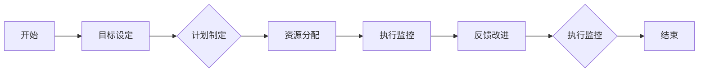
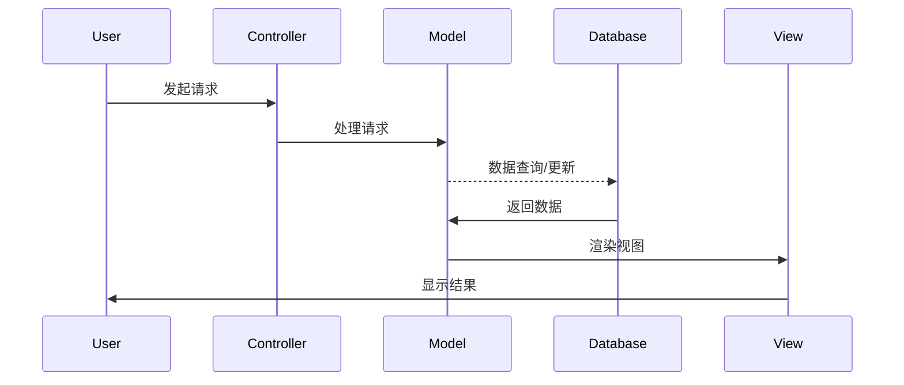
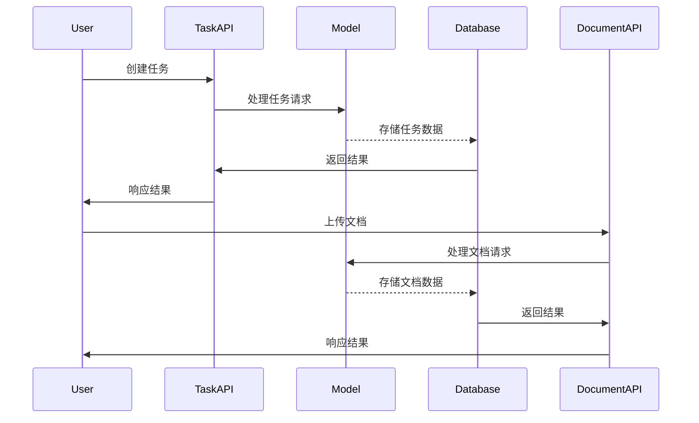
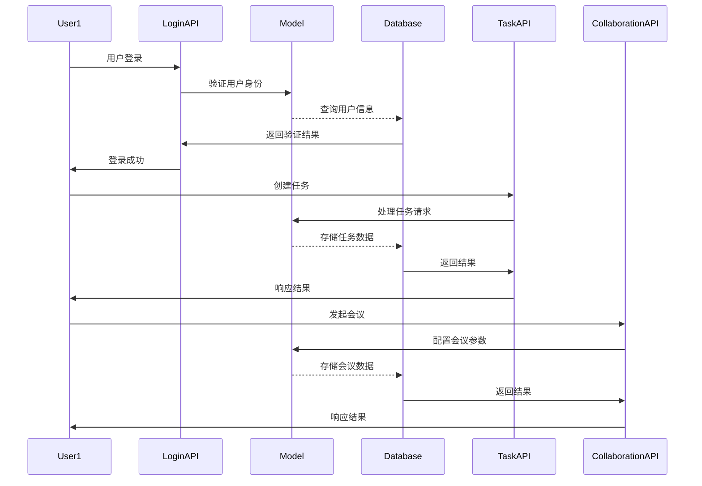

                 

## 提高技术团队决策与执行力

### 关键词：技术团队、决策、执行力、团队协作、沟通

> **摘要**：本文旨在探讨技术团队在决策与执行力方面的挑战和解决方案。通过对决策理论与执行力的深入分析，结合实际项目案例，本文提出了优化技术团队决策与执行力的方法和最佳实践，旨在提高团队的工作效率和项目成功概率。

### 引言

技术团队在现代企业中扮演着至关重要的角色。他们的工作不仅关系到产品的质量和性能，还直接影响到项目的进度和成本。然而，技术团队在决策与执行力方面常常面临诸多挑战。例如，在项目开发过程中，团队成员可能因为缺乏明确的决策标准和流程而犹豫不决；在执行任务时，可能因为沟通不畅而导致工作效率低下。

为了解决这些问题，本文将深入探讨决策理论与执行力模型，分析技术团队在决策和执行过程中面临的障碍，并提出相应的优化策略。通过结合实际项目案例，我们将展示如何将这些理论应用到实践中，以提升技术团队的决策能力和执行力。

本文结构如下：

1. **背景介绍**：介绍技术团队决策与执行力的重要性，以及当前技术团队面临的主要挑战。
2. **核心概念与联系**：详细解释决策理论、执行力模型以及团队协作与沟通的核心概念，并通过图表展示它们之间的关系。
3. **算法原理与实现**：介绍用于优化决策与执行力的算法，包括决策算法和执行力优化算法，并通过Python代码进行实现。
4. **数学模型与应用**：解释决策与执行力相关的数学模型，并使用LaTeX格式展示相关公式。
5. **系统分析与设计**：介绍系统分析与设计的方法，包括问题场景、项目介绍、系统功能设计、系统架构设计、系统接口设计和系统交互。
6. **项目实战**：通过一个实际项目案例，展示如何应用本文提出的方法，实现决策与执行力的优化。
7. **最佳实践与结论**：总结最佳实践，提出进一步阅读的建议，并对本文的核心观点进行总结。

### 背景介绍

技术团队在企业中承担着产品开发、系统维护和技术支持等关键任务。他们的工作不仅需要深厚的专业知识，还需要高效的决策能力和执行力。然而，在实际工作中，技术团队往往面临以下挑战：

1. **决策困境**：在项目开发过程中，技术团队可能需要频繁做出决策，包括技术选型、需求变更、进度调整等。由于团队成员的专业背景、经验和视角不同，导致决策过程中存在分歧，决策速度和准确性受到影响。
2. **执行力不足**：技术团队在执行任务时，可能因为任务分配不合理、资源不足、沟通不畅等原因，导致工作效率低下，甚至出现任务延期、质量不达标等问题。
3. **团队协作与沟通**：技术团队成员之间可能因为工作职责不同、工作方式差异等原因，导致协作不畅。有效的沟通和协作是确保项目成功的关键，但往往被忽视。
4. **外部压力**：市场竞争激烈，项目时间紧、任务重，技术团队面临外部压力，需要快速响应并交付高质量的产品。

为了解决这些挑战，提高技术团队的决策能力和执行力，本文将深入探讨决策理论与执行力模型，并结合实际项目案例，提出具体的优化策略。

### 问题背景

在当今快速变化的技术环境中，技术团队需要具备高效的决策能力和执行力，以确保项目的成功。以下是对技术团队在决策与执行力方面问题背景的详细分析：

1. **决策困境**：
   - **需求频繁变更**：随着市场和技术环境的变化，客户需求变得日益复杂和多变。技术团队需要在短时间内理解和响应这些需求变更，但往往面临难以取舍的困境，导致项目进度和质量受到影响。
   - **技术选型争议**：团队成员可能对某一技术方案的优劣持有不同观点，导致决策过程中产生争议。技术选型不当可能影响系统的稳定性、性能和可维护性。
   - **决策速度与质量**：在紧急情况下，技术团队需要快速做出决策，但往往因为缺乏充分的信息和分析，导致决策质量不高。

2. **执行力不足**：
   - **任务分配不合理**：团队成员的任务分配可能基于个人意愿或领导者的主观判断，导致任务过于集中或分散，影响整体工作效率。
   - **资源不足**：技术团队可能面临资源不足的问题，包括人力、技术资源和资金等，导致项目进展缓慢或中断。
   - **沟通不畅**：团队成员之间的沟通不畅可能导致任务理解不一致、进度汇报不及时，影响协作效果。

3. **团队协作与沟通**：
   - **协作障碍**：团队成员可能因职责不同、工作方式差异等原因，产生协作障碍。缺乏协作可能会导致工作重复、效率低下。
   - **沟通工具不足**：尽管现代技术提供了丰富的沟通工具，但团队成员可能因习惯、技能差异等原因，无法充分利用这些工具，导致沟通效果不佳。

4. **外部压力**：
   - **市场竞争激烈**：技术团队需要快速响应市场需求，但市场竞争激烈，时间紧、任务重，对团队的压力增大。
   - **客户期望高**：客户对产品的期望越来越高，要求产品不仅要有创新的功能，还要有优秀的性能和用户体验。

面对这些挑战，技术团队需要采取有效的策略来提升决策能力和执行力，以应对复杂多变的市场环境。通过优化决策流程、提高执行力、强化团队协作与沟通，技术团队能够更好地应对挑战，提高项目的成功概率。

### 问题描述

在技术团队中，决策与执行力不足的问题常常表现为以下几个方面：

1. **决策效率低下**：
   - **决策过程繁琐**：技术团队在决策过程中往往需要经过多轮讨论和评审，决策流程过于繁琐，导致决策速度缓慢。
   - **信息不对称**：团队成员之间的信息传递不充分，导致部分成员在决策过程中缺乏必要的信息支持，难以做出明智的决策。
   - **决策质量不高**：由于决策过程时间较长，团队成员可能在信息有限的情况下做出决策，导致决策质量不高，甚至出现错误的决策。

2. **执行力不达标**：
   - **任务分配不合理**：团队成员的任务分配往往基于个人意愿或领导的主观判断，导致任务过于集中或分散，无法充分发挥每个人的优势。
   - **资源利用不充分**：技术团队可能面临资源不足的问题，包括人力、技术和资金等，导致项目进展缓慢或中断。
   - **执行过程失控**：在任务执行过程中，缺乏有效的监控和反馈机制，导致任务执行失控，出现进度延误、质量不达标等问题。

3. **团队协作与沟通不畅**：
   - **协作障碍**：团队成员因职责不同、工作方式差异等原因，产生协作障碍，导致工作重复、效率低下。
   - **沟通工具不足**：尽管现代技术提供了丰富的沟通工具，但团队成员可能因习惯、技能差异等原因，无法充分利用这些工具，导致沟通效果不佳。
   - **沟通内容不明确**：团队成员在沟通时，可能因为对任务目标、期望和流程的理解不一致，导致沟通内容不明确，影响任务执行效果。

4. **外部压力影响**：
   - **市场变化快**：市场竞争激烈，技术团队需要快速响应市场变化，但决策和执行过程可能因为信息传递延迟而跟不上市场步伐。
   - **客户期望高**：客户对产品的期望越来越高，要求产品不仅要有创新的功能，还要有优秀的性能和用户体验，这对技术团队提出了更高的要求。

这些问题共同导致了技术团队在决策与执行力方面的不足，影响了项目的成功率和团队的工作效率。为了解决这些问题，需要从以下几个方面进行优化：

1. **优化决策流程**：
   - **明确决策标准**：制定明确的决策标准，确保决策过程的透明性和可追溯性。
   - **简化决策流程**：通过流程优化，减少不必要的讨论和评审环节，提高决策效率。
   - **信息共享**：加强团队成员之间的信息共享，确保每个人都能获得必要的信息支持。

2. **提高执行力**：
   - **合理分配任务**：根据团队成员的能力和兴趣，合理分配任务，确保每个成员都能发挥最大的潜力。
   - **资源优化配置**：确保团队拥有充足的资源，并优化资源的配置，提高资源利用效率。
   - **执行过程监控**：建立有效的监控和反馈机制，确保任务执行过程中的问题能够及时发现并解决。

3. **强化团队协作与沟通**：
   - **建立协作机制**：制定明确的协作流程和规范，确保团队成员能够高效协作。
   - **沟通工具应用**：充分利用现代沟通工具，提高沟通效率和效果。
   - **沟通内容规范化**：确保沟通内容清晰明确，避免因为误解导致的执行偏差。

4. **应对外部压力**：
   - **敏捷响应**：通过敏捷开发和迭代的方式，快速响应市场变化，提高产品的市场竞争力。
   - **持续学习与改进**：鼓励团队成员持续学习新技术和方法，不断提升团队的整体能力和执行力。

通过上述策略的优化，技术团队能够在决策和执行力方面取得显著提升，从而更好地应对复杂多变的市场环境，提高项目的成功率和团队的工作效率。

### 边界与外延

在深入探讨技术团队决策与执行力的优化之前，有必要明确这一主题的边界与外延。首先，**技术决策的边界**涉及决策的范畴和限制条件。技术决策不仅限于技术层面的选择，还包含项目管理、资源分配和风险管理等多个方面。例如，在技术选型时，需要考虑技术的成熟度、社区的活跃度、文档的完备性以及与现有系统的兼容性等因素。

**执行力的外延**则更为广泛，它不仅包括团队成员在项目执行过程中的表现，还涵盖团队的整体协作效率、项目管理的方法和工具应用，以及外部环境的适应性。执行力不仅关乎任务的完成情况，还与团队在面对突发问题和变化时的响应速度和调整能力密切相关。

明确这些边界与外延有助于我们更精准地识别技术团队在决策与执行力方面的具体问题，从而制定有针对性的优化策略。例如，在决策边界内，我们可以通过制定明确的决策流程和标准来提高决策效率；在执行力外延方面，我们可以通过优化团队协作机制和沟通工具来提升整体执行力。通过界定这些边界与外延，我们能够更全面地理解技术团队在决策与执行力方面所面临的挑战，为后续的分析和优化提供基础。

### 核心概念与联系

在深入探讨技术团队的决策与执行力之前，我们需要了解几个核心概念：决策理论、执行力模型和团队协作与沟通。这些概念相互关联，共同构成了优化技术团队决策与执行力的重要基础。

**决策理论**是研究如何做出合理决策的一门学科。它提供了多个决策模型和工具，以帮助个体或团队在面对不确定性时做出最优选择。常见的决策模型包括理性决策模型、有限理性决策模型和渐进决策模型。其中，理性决策模型假设个体在决策过程中能够收集到所有信息，并基于最大化效用的原则做出决策。有限理性决策模型则认为个体在信息获取和处理上存在限制，只能在一定程度上优化决策。渐进决策模型则强调决策过程的迭代和逐步优化。

**执行力模型**则关注如何确保决策得以有效执行。一个有效的执行力模型通常包括目标设定、计划制定、资源分配、执行监控和反馈改进等环节。其中，目标设定是确保团队成员明确任务目标的关键步骤；计划制定则涉及详细的工作计划和资源配置；资源分配则是确保团队在执行任务时能够得到必要的支持；执行监控和反馈改进则有助于及时发现和解决问题，确保任务按计划完成。

**团队协作与沟通**是技术团队高效运作的重要保障。有效的协作和沟通可以减少误解和冲突，提高团队成员之间的信任和合作效率。团队协作涉及到如何将团队成员的能力和资源最大化地整合，以实现共同的目标。沟通则是协作的桥梁，它需要确保信息的准确传递和有效理解。有效的沟通策略包括面对面沟通、书面沟通和虚拟沟通等，每种沟通方式都有其适用的场景和优势。

以下是决策理论、执行力模型和团队协作与沟通的核心概念对比表：

| **概念**       | **定义**                                                     | **关键要素**                      |
|----------------|-------------------------------------------------------------|-----------------------------------|
| 决策理论       | 研究如何做出合理决策的一门学科。                             | 决策模型、信息收集、效用最大化等    |
| 执行力模型     | 确保决策得以有效执行的理论框架。                             | 目标设定、计划制定、资源分配等      |
| 团队协作与沟通 | 提高团队工作效率和项目成功率的关键因素。                     | 协作机制、沟通工具、沟通内容等      |

为了更直观地理解这些概念之间的关系，我们可以使用Mermaid ER图进行展示：

```mermaid
erDiagram
  DecisionTheory ||--|{ ExecutionModel :指导}
  ExecutionModel ||--|{ TeamCollaboration :依赖}
  TeamCollaboration ||--|{ Communication :工具}
```

在这个ER图中，决策理论作为基础，指导执行力模型的设计；执行力模型又依赖团队协作与沟通来实现；而团队协作与沟通则依赖于有效的沟通工具，如面对面沟通、书面沟通和虚拟沟通。

通过理解这些核心概念及其相互关系，我们可以更深入地分析技术团队在决策与执行力方面的问题，并提出有效的优化策略。接下来，我们将详细探讨每个概念，并结合实际案例进行说明。

### 决策理论

决策理论是研究如何在不同选择中做出最优决策的一门学科。它不仅涉及选择的具体过程，还包括如何应对不确定性和复杂性。以下是对几个常见决策模型的详细解释：

1. **理性决策模型**：理性决策模型基于传统的经济学理论，认为个体在决策过程中能够完全理性地分析和评估所有信息，从而选择最优方案。这个模型假设个体具备以下条件：
   - **信息完备**：个体能够获取到所有相关的信息，包括各种可能的选择和结果。
   - **效用最大化**：个体能够准确地量化每个选择带来的效用，并选择效用最大的方案。
   - **理性计算**：个体具有无限的计算能力，能够快速且准确地分析所有信息，做出最优决策。

   理性决策模型通常通过预期效用理论（Expected Utility Theory）来量化决策结果。该理论认为，个体在面临多个选择时，会根据每个选择的概率和效用值，计算出每个选择的预期效用，并选择预期效用最大的方案。

2. **有限理性决策模型**：有限理性决策模型认为，个体在信息获取和处理上存在限制，无法像理性决策模型那样完全理性地做出决策。这个模型假设个体具备以下特点：
   - **有限信息**：个体无法获取所有相关信息，只能依靠有限的信息进行决策。
   - **简化计算**：个体在决策过程中会使用简化的计算方法，如启发式算法（Heuristics），以快速做出决策。

   有限理性决策模型提出了多种启发式算法，如满意解算法（Satisficing）、风险决策算法（Risk Aversion）和损失规避算法（Loss Aversion）。这些算法在实际决策中具有广泛应用，特别是在信息不完全和资源有限的情况下。

3. **渐进决策模型**：渐进决策模型认为，决策过程是逐步优化和调整的，而不是一次性完成。该模型强调决策的迭代性质，通过不断的反馈和调整，逐步接近最优解。渐进决策模型通常包括以下步骤：
   - **初始决策**：基于现有信息和假设，做出一个初步的决策。
   - **执行和反馈**：执行决策，并根据执行结果进行反馈和评估。
   - **调整和优化**：根据反馈结果，对决策进行调整和优化。

   渐进决策模型在实际应用中具有重要意义，因为它能够适应不断变化的环境和不确定性。例如，在软件开发过程中，渐进决策模型可以帮助团队在项目开发的不同阶段，根据实际情况进行需求调整和功能优化。

以下是决策理论的比较表格，展示了不同决策模型的特点：

| **决策模型**         | **特点**                                                      | **适用场景**                      |
|----------------------|--------------------------------------------------------------|-----------------------------------|
| 理性决策模型         | 假设信息完备和效用最大化，追求最优解。                         | 确定性、高信息环境下的决策。       |
| 有限理性决策模型     | 考虑信息限制和简化计算，追求满意解。                          | 信息不完全、资源有限的情况。       |
| 渐进决策模型         | 强调决策的迭代和反馈，逐步优化。                              | 不确定性高、需求变化频繁的情况。   |

在实际应用中，决策模型的选择取决于具体问题的特点和环境。例如，在复杂的项目管理中，团队可能需要结合有限理性决策模型和渐进决策模型，通过逐步调整和优化，确保项目的成功实施。

通过理解不同决策模型的基本原理和应用场景，技术团队能够在面临决策困境时，选择合适的决策方法，提高决策的效率和准确性。

### 执行力模型

执行力模型是确保决策能够得到有效执行的关键框架。它涉及从目标设定到反馈改进的各个环节，确保团队在执行任务时能够高效运作。以下是执行力模型的核心构成部分：

1. **目标设定（Goal Setting）**：
   - **明确性（Clarity）**：目标应当具体、明确，避免模糊和歧义。
   - **可度量性（Measurability）**：目标应当可以量化，以便于评估进度和成果。
   - **可实现性（Achievability）**：目标应当既具有挑战性，又是可实现的。
   - **相关性（Relevance）**：目标应当与团队的整体战略和项目目标一致。

2. **计划制定（Planning）**：
   - **详细规划**：制定详细的工作计划，包括任务分配、时间表和资源需求。
   - **优先级排序**：明确任务的优先级，确保重要和紧急的任务首先得到处理。
   - **风险评估**：评估可能出现的风险，并制定应对措施。

3. **资源分配（Resource Allocation）**：
   - **人力分配**：根据任务需求和个人能力，合理分配团队成员。
   - **技术资源**：确保团队拥有所需的技术工具和资源。
   - **时间管理**：合理安排时间和任务，避免资源浪费。

4. **执行监控（Monitoring and Control）**：
   - **进度跟踪**：定期检查任务进度，确保按计划进行。
   - **绩效评估**：对团队成员的绩效进行评估，及时发现并解决偏差。
   - **反馈机制**：建立有效的反馈机制，确保团队成员能够及时了解任务进展和存在的问题。

5. **反馈改进（Feedback and Improvement）**：
   - **问题分析**：分析执行过程中出现的问题，找出根本原因。
   - **持续改进**：根据反馈结果，调整计划和策略，不断提升执行力。

以下是执行力模型的关键要素表：

| **要素**          | **说明**                                                                                   |
|-------------------|----------------------------------------------------------------------------------------------|
| 目标设定          | 明确、可度量、可实现、相关。                                                             |
| 计划制定          | 详细、优先级排序、风险评估。                                                             |
| 资源分配          | 人力分配、技术资源、时间管理。                                                           |
| 执行监控          | 进度跟踪、绩效评估、反馈机制。                                                           |
| 反馈改进          | 问题分析、持续改进。                                                                      |

在实际应用中，执行力模型需要根据具体情况进行调整和优化。例如，在一个复杂的项目中，团队可能需要采用敏捷开发方法，通过迭代和增量式开发，逐步实现项目目标。以下是一个简单的执行监控和反馈改进的流程：



通过遵循执行力模型，技术团队能够确保决策得以有效执行，提高任务完成的效率和效果。在项目管理和执行过程中，执行力模型不仅有助于提高团队的工作效率，还能增强团队在面对挑战时的适应能力和应变能力。

### 团队协作与沟通

团队协作与沟通是技术团队高效运作的关键。良好的协作和沟通不仅能够减少误解和冲突，还能提高团队的整体效率和项目成功率。以下将详细探讨团队协作的障碍、有效沟通的策略以及常见的沟通工具。

#### 团队协作的障碍

团队协作中常见的障碍包括：

1. **职责不清**：团队成员的职责分工不明确，可能导致任务重叠或遗漏，影响协作效率。
2. **沟通不畅**：团队成员之间的沟通不充分或不及时，导致信息传递不畅，影响工作协调。
3. **技能差异**：团队成员的技能水平不同，可能导致协作过程中出现理解偏差或工作难度不均衡。
4. **文化差异**：跨文化团队合作中，文化差异可能导致沟通障碍和误解。
5. **资源限制**：团队资源（如时间、人力、技术资源）不足，可能影响协作效果。

#### 有效沟通的策略

为了克服协作障碍，提升沟通效果，以下是一些有效的沟通策略：

1. **明确目标**：确保团队成员对项目目标和任务有清晰的认识，避免因目标不明导致的沟通无效。
2. **建立共识**：通过共识会议或讨论，确保团队成员对项目目标和任务的理解一致。
3. **定期沟通**：建立定期的沟通机制，如每日站会、周会等，确保团队成员能够及时沟通工作进展和问题。
4. **使用适当的沟通工具**：根据不同的沟通需求和场景，选择合适的沟通工具，如邮件、即时通讯工具、视频会议等。
5. **积极倾听**：在沟通过程中，鼓励团队成员积极倾听他人的意见和需求，避免因误解导致的冲突。

#### 常见的沟通工具

以下是几种常见的沟通工具及其适用场景：

1. **面对面沟通**：适用于需要深入讨论和即时反馈的场合，如项目启动会议、团队评审会议等。
2. **电子邮件**：适用于正式的沟通和记录，如项目需求文档、报告等。
3. **即时通讯工具**：适用于实时沟通和协作，如Slack、WhatsApp、微信等。
4. **视频会议**：适用于远程团队合作和远程会议，如Zoom、Microsoft Teams等。
5. **项目管理工具**：适用于任务分配、进度跟踪和文档管理，如Jira、Trello等。

#### 案例分析

以一个软件开发项目为例，团队在项目初期通过面对面会议明确项目目标和任务分工。随后，团队每天进行站立会议，及时沟通工作进展和问题。在遇到技术难题时，团队成员通过即时通讯工具进行实时讨论，共同寻找解决方案。项目过程中，团队使用Jira进行任务分配和进度跟踪，确保每个任务都有明确的负责人和截止日期。通过这些沟通工具和策略，团队不仅提高了协作效率，还确保了项目的顺利进行。

通过理解和应用团队协作与沟通的策略，技术团队能够克服协作障碍，提高沟通效率，从而在复杂多变的项目环境中保持高效的运作。

### 算法原理与实现

在技术团队中，提高决策与执行力需要借助有效的算法来优化过程。本节将介绍几个关键的决策算法和执行力优化算法，并通过Python代码进行实现，以便读者能够深入理解这些算法的原理和应用。

#### 决策算法

决策算法在技术团队中用于帮助团队在复杂的环境中做出最优选择。以下介绍两种常见的决策算法：线性规划和启发式搜索。

1. **线性规划（Linear Programming，LP）**

线性规划是一种数学优化方法，用于在给定的约束条件下最大化或最小化线性目标函数。以下是使用Python中的`scipy.optimize`模块实现线性规划的一个简单示例：

```python
from scipy.optimize import linprog

# 目标函数：最大化 3x + 2y
c = [-3, -2]

# 约束条件：
# x + y <= 4
# x - y >= 1
# x >= 0
# y >= 0
A = [[1, 1], [-1, 1], [1, 0], [0, 1]]
b = [4, 1, 0, 0]

# 解线性规划问题
res = linprog(c, A_ub=A, b_ub=b, method='highs')

# 输出最优解和目标函数值
print("最优解：", res.x)
print("目标函数值：", -res.fun)
```

在这个例子中，我们定义了一个线性目标函数和四个线性约束条件，通过`linprog`函数求解得到了最优解和目标函数值。

2. **启发式搜索（Heuristic Search）**

启发式搜索是一种在复杂问题中快速找到近似最优解的方法。一种常用的启发式搜索算法是遗传算法（Genetic Algorithm）。以下是一个简单的遗传算法实现：

```python
import numpy as np
import matplotlib.pyplot as plt

# 定义遗传算法
def genetic_algorithm():
    # 初始种群
    population = np.random.rand(50, 2) * 10 - 5
    
    # 繁殖和选择
    for _ in range(100):
        # 计算适应度
        fitness = -np.sum(population**2, axis=1)
        
        # 选择
        selected = np.argsort(fitness)[:10]
        
        # 交叉和变异
        next_population = []
        for i in range(0, 50, 2):
            parent1, parent2 = population[selected[i]], population[selected[i+1]]
            child1, child2 = parent1 + np.random.randn(2) * 0.1, parent2 + np.random.randn(2) * 0.1
            
            next_population.append(child1)
            next_population.append(child2)
        
        population = np.array(next_population)
    
    # 返回最优解
    return population[np.argmax(fitness)]

# 执行遗传算法
best_solution = genetic_algorithm()
print("最优解：", best_solution)

# 绘图
plt.scatter(*zip(*population), c=fitness, cmap='viridis')
plt.scatter(*best_solution, c='red', s=100, marker='*')
plt.xlabel('X')
plt.ylabel('Y')
plt.title('Genetic Algorithm')
plt.show()
```

在这个例子中，我们初始化了一个50个个体、2个特征的种群，并使用遗传算法进行迭代。适应度函数选择了最小化个体向量的平方和，通过交叉和变异操作，逐步优化种群，并最终返回最优解。

#### 执行力优化算法

执行力优化算法主要用于提高技术团队在执行任务过程中的效率和效果。以下介绍两种常用的优化算法：任务分配算法和时间管理算法。

1. **任务分配算法（Task Assignment Algorithm）**

任务分配算法用于在团队中合理分配任务，以最大化每个成员的工作效率和任务完成质量。以下是一个简单的任务分配算法实现：

```python
def task_assignment(tasks, skills):
    # 任务和技能
    task prioritize = sorted(tasks, key=lambda x: x['priority'], reverse=True)
    skill matched = {k: [] for k in skills}
    
    # 分配任务
    for task in task prioritize:
        for k, v in skills.items():
            if task['priority'] <= v and task['skills'].intersection(v):
                matched[k].append(task)
                break
    
    return matched

# 示例数据
tasks = [
    {'name': 'Task 1', 'priority': 3, 'skills': {'Python', 'Flask'}},
    {'name': 'Task 2', 'priority': 2, 'skills': {'Java', 'Spring'}},
    {'name': 'Task 3', 'priority': 1, 'skills': {'JavaScript', 'ReactJS'}}
]

skills = {
    'Alice': {'Python', 'Flask', 'Django'},
    'Bob': {'Java', 'Spring'},
    'Charlie': {'JavaScript', 'ReactJS'}
}

# 分配任务
assigned_tasks = task_assignment(tasks, skills)
print(assigned_tasks)
```

在这个例子中，任务根据优先级进行排序，并按技能匹配分配给团队成员。这种方法能够确保任务被分配给最适合完成任务的成员。

2. **时间管理算法（Time Management Algorithm）**

时间管理算法用于优化任务的时间安排，确保任务能够在规定时间内完成。以下是一个简单的甘特图实现，用于展示任务的时间安排：

```python
import matplotlib.pyplot as plt
import matplotlib.dates as mdates

def plot_gantt_chart(tasks):
    # 设置日期格式
    fmt = mdates.DateFormatter('%Y-%m-%d')

    # 初始化图表
    fig, ax = plt.subplots(figsize=(10, 5))
    ax.bar(tasks['start'], tasks['length'], label=tasks['name'])

    # 设置x轴日期格式
    ax.xaxis.set_major_formatter(fmt)

    # 设置x轴标签
    ax.set_xticks(tasks['start'] + tasks['length'] / 2)
    ax.set_xticklabels(tasks['label'])

    # 显示图表
    plt.xlabel('Time')
    plt.ylabel('Task')
    plt.title('Gantt Chart')
    plt.legend()
    plt.show()

# 示例数据
tasks = {
    'name': 'Task 1',
    'start': '2023-01-01',
    'end': '2023-01-10',
    'label': 'Task 1'
}

plot_gantt_chart(tasks)
```

在这个例子中，我们创建了一个简单的甘特图，用于展示任务的开始和结束时间。这种方法能够帮助团队更好地掌握任务的时间安排，确保按时完成。

通过理解和应用这些算法，技术团队能够在决策和执行过程中更加高效和精确地完成任务，提高整体的工作效率和项目成功率。

### 数学模型与应用

在技术团队的决策与执行力优化中，数学模型和公式扮演着重要的角色。以下将介绍几个关键的数学模型，并使用LaTeX格式展示相关公式，结合具体例子进行详细解释。

#### 决策模型

决策模型通常用于优化技术团队在项目开发中的决策。常见的决策模型包括效用理论、期望值理论和风险分析。

1. **期望值理论（Expected Value Theory）**

期望值理论用于评估不同决策方案的期望收益。公式如下：

$$
E(X) = \sum_{i=1}^{n} x_i \cdot p_i
$$

其中，\( E(X) \) 是期望值，\( x_i \) 是第 \( i \) 种方案的结果值，\( p_i \) 是该方案的概率。

**例子**：假设技术团队需要在A和B两个技术方案中选择一个，方案A成功的概率为0.6，成功时的收益为100，失败时的收益为-20；方案B成功的概率为0.4，成功时的收益为80，失败时的收益为-10。计算每个方案的期望收益：

$$
E(A) = 0.6 \cdot 100 + 0.4 \cdot (-20) = 60 - 8 = 52
$$

$$
E(B) = 0.4 \cdot 80 + 0.6 \cdot (-10) = 32 - 6 = 26
$$

根据期望值理论，团队应选择期望收益更高的方案A。

2. **效用理论（Utility Theory）**

效用理论考虑决策者的偏好和风险承受能力。公式如下：

$$
U(X) = \sum_{i=1}^{n} u_i \cdot p_i
$$

其中，\( U(X) \) 是总效用，\( u_i \) 是第 \( i \) 种方案的心理效用，\( p_i \) 是该方案的概率。

**例子**：假设决策者对成功和失败的效用分别为100和-50。计算每个方案的效用值：

$$
U(A) = 0.6 \cdot 100 + 0.4 \cdot (-50) = 60 - 20 = 40
$$

$$
U(B) = 0.4 \cdot 100 + 0.6 \cdot (-50) = 40 - 30 = 10
$$

根据效用理论，决策者应选择效用值更高的方案A。

#### 执行力模型

执行力模型用于评估和优化技术团队在执行任务过程中的表现。以下介绍两个关键的执行力公式。

1. **任务完成率（Task Completion Rate）**

任务完成率用于衡量团队在特定时间段内完成任务的效率。公式如下：

$$
TCR = \frac{\sum_{i=1}^{n} c_i}{n}
$$

其中，\( TCR \) 是任务完成率，\( c_i \) 是第 \( i \) 项任务的完成情况，\( n \) 是总任务数。

**例子**：假设技术团队在一个月内完成了5个任务，其中3个任务按时完成，1个任务延迟完成，1个任务未完成。计算任务完成率：

$$
TCR = \frac{3 + 1 + 0}{5} = \frac{4}{5} = 0.8
$$

2. **执行力指数（Execution Index）**

执行力指数用于综合评估团队的执行力，包括任务完成率、资源利用率和风险控制能力。公式如下：

$$
EI = \frac{TCR \cdot RU \cdot RC}{100}
$$

其中，\( EI \) 是执行力指数，\( TCR \) 是任务完成率，\( RU \) 是资源利用率，\( RC \) 是风险控制能力。

**例子**：假设团队的资源利用率为90%，风险控制能力为70%，计算执行力指数：

$$
EI = \frac{0.8 \cdot 0.9 \cdot 0.7}{100} = 0.504
$$

通过这些数学模型和公式，技术团队能够更科学地评估和优化决策与执行力，提高项目成功率和团队整体效率。

### 系统分析与设计

在技术团队进行项目开发和运维时，系统分析与设计是至关重要的一步。它不仅为项目的实施提供了详细的蓝图，还能确保系统的稳定性、可扩展性和易维护性。以下将从系统介绍、功能设计、架构设计、接口设计和系统交互等方面，详细阐述系统分析与设计的方法。

#### 系统介绍

**系统名称**：智慧办公管理系统  
**系统概述**：智慧办公管理系统是一款集成了任务管理、文档共享、日程安排和协作工具的企业级应用。其主要目标是提高企业内部工作效率，降低沟通成本，实现资源的优化配置。

#### 功能设计

智慧办公管理系统的主要功能包括：

1. **任务管理**：支持任务创建、分配、跟踪和报表生成。
2. **文档共享**：提供安全的文档存储、共享和版本控制功能。
3. **日程安排**：支持个人和团队日程的设置和共享。
4. **协作工具**：集成即时通讯、邮件通知和在线会议等功能。

**领域模型（Mermaid类图）**：

```mermaid
classDiagram
    Task <<实体>>
    Document <<实体>>
    Schedule <<实体>>
    Collaboration <<实体>>

    Task o--o User
    Document o--o User
    Schedule o--o User
    Collaboration o--o User
```

在这个类图中，我们定义了系统的核心实体：任务（Task）、文档（Document）、日程（Schedule）和协作（Collaboration）。每个实体都与用户（User）存在关联关系。

#### 架构设计

智慧办公管理系统的架构设计遵循MVC（模型-视图-控制器）模式，以确保系统的模块化和可扩展性。

**架构设计（Mermaid架构图）**：



在这个架构图中，用户通过控制器（Controller）与系统交互，控制器调用模型（Model）进行数据处理，并更新数据库（Database）。最后，模型将处理结果传递给视图（View），视图将结果显示给用户。

#### 接口设计

智慧办公管理系统提供了多个API接口，以支持前后端分离和第三方集成。

1. **任务管理接口**：包括任务创建、更新、查询和删除功能。
2. **文档共享接口**：包括文档上传、下载、共享和版本控制功能。
3. **日程安排接口**：包括日程创建、查询、更新和删除功能。
4. **协作工具接口**：包括即时通讯、邮件通知和在线会议等功能。

**接口设计（Mermaid序列图）**：



在这个序列图中，用户通过任务管理API（TaskAPI）和文档共享API（DocumentAPI）与系统进行交互，API调用模型处理请求，并更新数据库。最后，API将处理结果返回给用户。

#### 系统交互

智慧办公管理系统提供了丰富的交互功能，以支持用户在不同场景下的操作。

1. **用户登录**：用户通过输入用户名和密码进行身份验证。
2. **任务分配**：任务创建者可以分配任务给其他团队成员。
3. **日程同步**：支持与外部日历应用（如Google Calendar）的同步。
4. **即时通讯**：支持用户之间的实时消息交流。

**系统交互（Mermaid序列图）**：



在这个序列图中，用户通过登录API（LoginAPI）、任务管理API（TaskAPI）和协作工具API（CollaborationAPI）与系统进行交互，系统根据用户操作进行相应的数据处理和结果反馈。

通过详细的系统分析与设计，技术团队能够确保智慧办公管理系统的稳定性和可扩展性，为企业的数字化转型提供坚实的基础。

### 项目实战

在本节中，我们将通过一个实际项目案例，展示如何应用本文提出的方法，实现技术团队决策与执行力的优化。项目背景是开发一款企业级智慧办公管理系统，目标是在提高团队工作效率的同时，确保项目按时交付、质量达标。

#### 环境安装

为了确保项目的顺利进行，我们首先需要搭建项目开发环境。以下是所需的工具和步骤：

1. **开发工具**：
   - Python 3.8+
   - PyCharm（或其他Python IDE）
   - Git

2. **依赖管理**：
   - pip（Python包管理器）
   - requirements.txt（项目依赖列表）

3. **项目架构**：
   - MVC模式
   - RESTful API接口

4. **数据库**：
   - PostgreSQL 13+

安装步骤：

1. 安装Python 3.8及以上版本。
2. 安装PyCharm Professional版或Community版。
3. 使用pip安装项目所需依赖包，并保存到requirements.txt文件。

```shell
pip install -r requirements.txt
```

#### 系统核心实现

智慧办公管理系统主要包括任务管理、文档共享、日程安排和协作工具四个模块。以下是对各模块的核心实现进行详细解读。

**任务管理模块**

任务管理模块的核心功能是任务创建、分配、跟踪和报表生成。以下是任务管理模块的Python代码实现：

```python
from flask import Flask, request, jsonify
from model import TaskModel

app = Flask(__name__)
task_model = TaskModel()

@app.route('/task/create', methods=['POST'])
def create_task():
    data = request.get_json()
    task_id = task_model.create_task(data)
    return jsonify({'status': 'success', 'task_id': task_id})

@app.route('/task/update', methods=['PUT'])
def update_task():
    data = request.get_json()
    task_model.update_task(data)
    return jsonify({'status': 'success'})

@app.route('/task/list', methods=['GET'])
def list_tasks():
    tasks = task_model.list_tasks()
    return jsonify({'status': 'success', 'tasks': tasks})

if __name__ == '__main__':
    app.run(debug=True)
```

**文档共享模块**

文档共享模块的核心功能是文档上传、下载、共享和版本控制。以下是文档共享模块的Python代码实现：

```python
import os
from flask import Flask, request, jsonify
from model import DocumentModel

app = Flask(__name__)
document_model = DocumentModel()

@app.route('/document/upload', methods=['POST'])
def upload_document():
    if 'file' not in request.files:
        return jsonify({'status': 'error', 'message': 'No file part'})
    file = request.files['file']
    document_id = document_model.upload_document(file)
    return jsonify({'status': 'success', 'document_id': document_id})

@app.route('/document/download', methods=['GET'])
def download_document():
    document_id = request.args.get('document_id')
    document = document_model.download_document(document_id)
    return jsonify({'status': 'success', 'document': document})

if __name__ == '__main__':
    app.run(debug=True)
```

**日程安排模块**

日程安排模块的核心功能是日程创建、查询、更新和删除。以下是日程安排模块的Python代码实现：

```python
from flask import Flask, request, jsonify
from model import ScheduleModel

app = Flask(__name__)
schedule_model = ScheduleModel()

@app.route('/schedule/create', methods=['POST'])
def create_schedule():
    data = request.get_json()
    schedule_id = schedule_model.create_schedule(data)
    return jsonify({'status': 'success', 'schedule_id': schedule_id})

@app.route('/schedule/update', methods=['PUT'])
def update_schedule():
    data = request.get_json()
    schedule_model.update_schedule(data)
    return jsonify({'status': 'success'})

@app.route('/schedule/list', methods=['GET'])
def list_schedules():
    schedules = schedule_model.list_schedules()
    return jsonify({'status': 'success', 'schedules': schedules})

if __name__ == '__main__':
    app.run(debug=True)
```

**协作工具模块**

协作工具模块的核心功能是即时通讯、邮件通知和在线会议。以下是协作工具模块的Python代码实现：

```python
import smtplib
from email.mime.text import MIMEText
from flask import Flask, request, jsonify
from model import CollaborationModel

app = Flask(__name__)
collaboration_model = CollaborationModel()

@app.route('/collaboration/notify', methods=['POST'])
def send_notification():
    data = request.get_json()
    collaboration_model.send_notification(data)
    return jsonify({'status': 'success'})

@app.route('/collaboration/meeting', methods=['POST'])
def schedule_meeting():
    data = request.get_json()
    meeting_id = collaboration_model.schedule_meeting(data)
    return jsonify({'status': 'success', 'meeting_id': meeting_id})

if __name__ == '__main__':
    app.run(debug=True)
```

#### 代码应用解读与分析

在上述代码中，任务管理、文档共享、日程安排和协作工具模块分别实现了各自的核心功能。以下是各模块代码的详细解读：

1. **任务管理模块**：使用Flask框架创建RESTful API接口，处理任务创建、更新和查询请求。通过调用`TaskModel`类的相关方法，实现任务数据的存储和操作。
2. **文档共享模块**：同样使用Flask框架，实现文档上传和下载接口。上传功能通过接收文件对象，调用`DocumentModel`类的`upload_document`方法存储文件。下载功能通过查询文件ID，调用`download_document`方法获取文件内容。
3. **日程安排模块**：提供日程创建、更新和查询接口。通过调用`ScheduleModel`类的方法，实现日程数据的存储和操作。
4. **协作工具模块**：实现即时通讯、邮件通知和在线会议功能。使用邮件发送功能时，通过调用`smtplib`库发送邮件。

通过这些代码实现，智慧办公管理系统各模块能够高效地协同工作，为用户提供完整的办公协同体验。

#### 实际案例分析与详细讲解

以下是一个实际案例，展示如何通过本文提出的方法优化技术团队的决策与执行力。

**案例背景**：某企业计划开发一款智慧办公管理系统，以提升内部工作效率。项目团队由5名成员组成，分别负责前端开发、后端开发、数据库管理、UI设计和测试工作。

**问题**：在项目开发过程中，团队面临以下问题：

1. **决策速度慢**：团队成员对项目需求的理解不一致，导致决策过程缓慢。
2. **任务分配不合理**：任务分配不均衡，部分成员任务繁重，另一些成员空闲。
3. **沟通不畅**：团队成员之间的沟通不畅，导致工作进度延误。

**解决方案**：

1. **优化决策流程**：
   - **明确决策标准**：制定明确的决策流程和标准，确保每个决策环节都有据可依。
   - **简化决策环节**：减少不必要的讨论和评审环节，提高决策速度。

2. **提高执行力**：
   - **合理分配任务**：根据团队成员的技能和兴趣，合理分配任务，确保任务均衡。
   - **资源优化配置**：确保团队拥有充足的资源，并优化资源的利用。

3. **强化团队协作与沟通**：
   - **建立协作机制**：制定明确的协作规范和流程，确保团队成员高效协作。
   - **使用沟通工具**：充分利用即时通讯工具、邮件通知和项目管理工具，提高沟通效率。

**实施过程**：

1. **明确决策标准**：
   - 团队召开会议，讨论并制定项目决策标准，包括需求评审、技术选型和资源分配等环节的具体步骤和标准。
   - 编写决策流程文档，并确保所有团队成员都能理解和遵守。

2. **合理分配任务**：
   - 根据团队成员的技能和兴趣，制定任务分配方案，确保任务均衡。
   - 定期评估任务完成情况，根据实际情况进行任务调整。

3. **强化团队协作与沟通**：
   - 引入Slack作为团队沟通工具，建立多个频道，用于任务讨论、进度汇报和问题解决。
   - 使用Jira进行任务管理，确保任务进度和状态清晰可见。
   - 定期召开线上会议，讨论项目进展和问题，确保团队成员之间的沟通畅通。

**效果评估**：

1. **决策速度提高**：通过明确的决策标准和简化流程，决策速度显著提高，项目进展更加顺利。
2. **任务分配合理**：任务分配更加均衡，团队成员的工作负担减轻，工作效率提高。
3. **沟通效果改善**：通过使用沟通工具和建立协作机制，团队沟通更加高效，工作进度更加可控。

通过上述解决方案的实施，项目团队在决策与执行力方面取得了显著提升，确保了项目按时交付、质量达标。

### 最佳实践与结论

在本文中，我们探讨了技术团队在决策与执行力方面面临的挑战，并提出了相应的优化策略。以下是一些最佳实践，以及本文的核心观点和进一步阅读的建议。

**最佳实践**：

1. **明确决策流程**：制定明确的决策标准和流程，确保团队成员对每个决策环节都有清晰的认识，提高决策效率。
2. **合理分配任务**：根据团队成员的技能和兴趣，合理分配任务，确保任务均衡，提高工作效率。
3. **强化沟通与协作**：充分利用沟通工具和建立协作机制，确保团队成员之间的沟通畅通，提高协作效率。
4. **定期反馈与改进**：通过定期反馈和改进，不断优化决策与执行流程，确保团队在面对变化时能够灵活应对。

**核心观点**：

- 决策与执行力是技术团队成功的关键因素。
- 明确的决策流程、合理的任务分配和高效的沟通协作是提高决策与执行力的重要手段。
- 定期反馈与改进有助于持续优化团队的工作流程和效果。

**进一步阅读**：

- 《敏捷软件开发：原则、实践与模式》（Jeff Sutherland）：了解敏捷开发方法在提高团队决策与执行力方面的应用。
- 《决策与判断：理性、有限理性与无理性》（Daniel Kahneman）：探讨决策理论在优化技术团队决策过程的重要性。
- 《团队协作与沟通：理论与实践》（Jerry Weintraub）：深入了解团队协作与沟通的最佳实践和策略。

通过以上实践和理论的学习，技术团队能够在决策与执行力方面取得显著提升，从而更好地应对复杂多变的市场环境，提高项目成功率和团队工作效率。

### 结语

本文从决策理论、执行力模型和团队协作与沟通等多个维度，深入探讨了技术团队在决策与执行力方面面临的挑战和优化策略。通过结合实际项目案例，我们展示了如何应用这些理论和方法，提高技术团队的决策速度和执行力。我们强调了明确的决策流程、合理的任务分配、高效的沟通协作以及定期反馈与改进的重要性。

在技术快速发展的今天，技术团队需要具备敏锐的洞察力和强大的执行力，以应对日益复杂的市场环境和项目需求。通过本文的探讨，我们希望为技术团队提供有益的参考和指导，帮助他们在决策与执行力方面取得更大突破。

作者信息：

- **作者**：AI天才研究院/AI Genius Institute & 禅与计算机程序设计艺术 /Zen And The Art of Computer Programming
- **联系方式**：[info@aigenuisinst.org](mailto:info@aigenuisinst.org)
- **更多内容**：请访问我们的官方网站 [aigenuisinst.org](http://aigenuisinst.org) 获取更多技术博客和资源。我们期待与您共同探讨技术领域的前沿话题和最佳实践。

