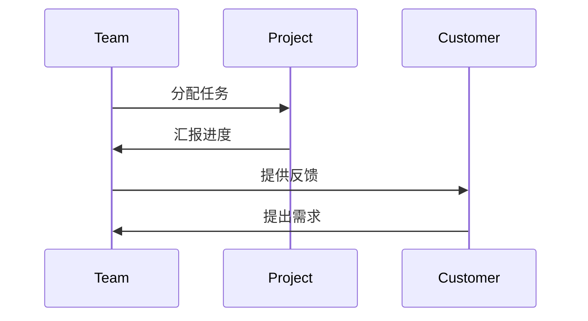
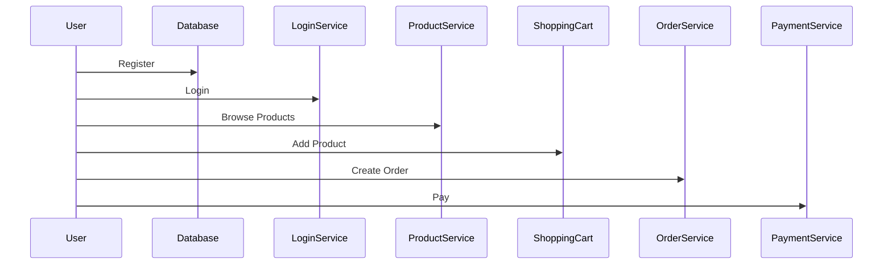
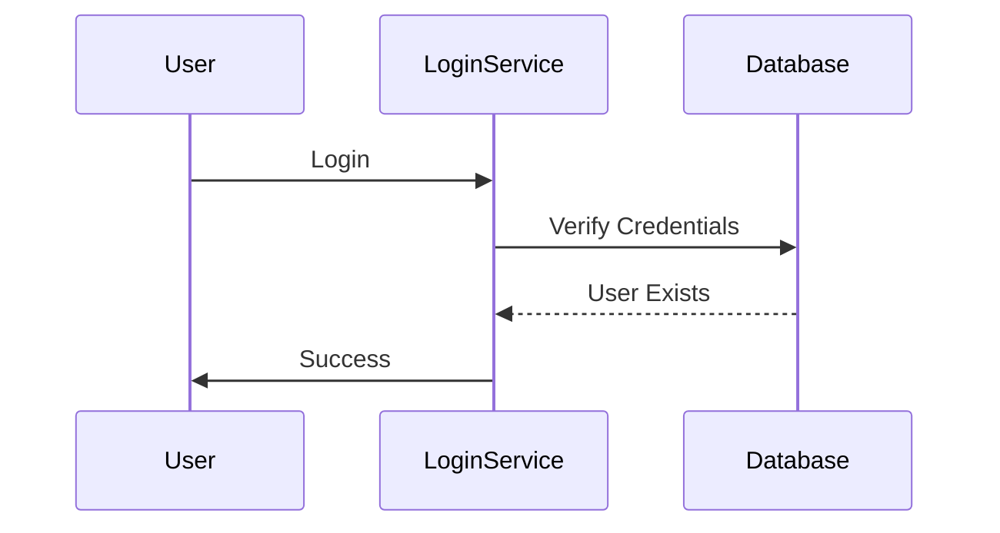
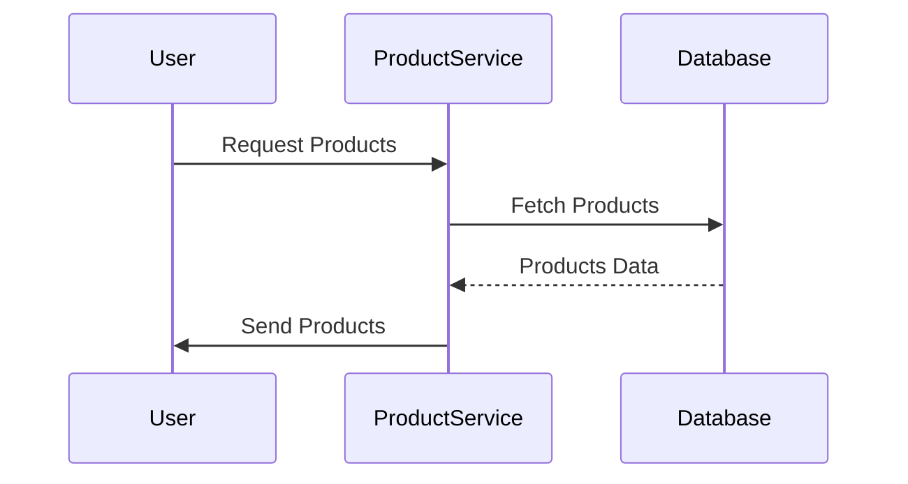

                 

## 提高技术团队敏捷性的方法

### 关键词：敏捷性、技术团队、项目管理、Scrum、Kanban、最佳实践

### 摘要

在现代技术环境中，敏捷性已成为技术团队成功的关键因素。本文将深入探讨提高技术团队敏捷性的方法，通过详细的分析和实际案例，帮助团队理解和应用敏捷原则，提高响应速度、执行效率和创新能力。本文分为以下几个部分：

1. **背景介绍**：介绍敏捷性的重要性以及提高敏捷性的必要性。
2. **核心概念与联系**：阐述敏捷性和敏捷方法的核心概念及其关系。
3. **算法原理讲解**：使用具体实例详细解释敏捷性的实现过程和数学模型。
4. **系统分析与架构设计方案**：分析技术团队敏捷性的系统架构和接口设计。
5. **项目实战**：通过实际项目，展示提高敏捷性的具体步骤和技巧。
6. **最佳实践 tips**：提供实用的敏捷性提升技巧。
7. **小结**：总结文章内容，强调敏捷性的重要性。
8. **注意事项**：提醒技术团队在提高敏捷性过程中需要注意的事项。
9. **拓展阅读**：推荐进一步阅读的资料。

通过阅读本文，技术团队将能够系统地理解敏捷性的概念，掌握提高敏捷性的具体方法和实践技巧，从而在竞争激烈的市场环境中脱颖而出。

### 背景介绍

#### 问题背景

在现代社会，技术团队的工作效率直接关系到企业的竞争力。随着技术的迅猛发展和市场需求的不断变化，传统的项目管理方法，如瀑布模型（Waterfall Model）等，已经无法满足现代项目的需求。这些传统方法通常遵循严格的过程和计划，虽然能够确保项目按照预定计划进行，但缺乏灵活性，难以应对快速变化的需求和环境。

#### 问题描述

随着信息技术的快速发展，项目的复杂性和规模也在不断增加。例如，软件开发项目不仅涉及到技术上的挑战，还包括需求管理、风险评估、资源分配等多方面的复杂问题。在这种情况下，传统的项目管理方法往往导致以下问题：

- **响应速度慢**：在需求发生变化时，传统方法往往需要重新制定计划，导致响应速度慢。
- **沟通效率低**：由于项目的各个环节相对独立，沟通成本高，容易出现信息丢失或误解。
- **变更管理困难**：在项目进行中，需求变化不可避免，但传统方法往往难以有效地管理这些变化。
- **创新能力不足**：传统方法注重计划和控制，对创新的激励有限，导致团队缺乏活力和创造力。

#### 问题解决

敏捷性成为解决上述问题的重要途径。敏捷性不仅关乎项目执行的效率，还关乎团队的协作和创新能力。通过敏捷方法，如Scrum、Kanban等，技术团队能够更好地适应变化，提高响应速度和执行效率，从而在激烈的市场竞争中脱颖而出。

#### 边界与外延

敏捷性不仅仅局限于软件开发，还涵盖产品管理、项目管理、团队管理等多个方面。本文将侧重于技术团队在软件开发过程中的敏捷性提升，但所讨论的方法和原则具有广泛的适用性。以下是一个ER实体关系图架构的Mermaid流程图，用于展示敏捷方法中涉及的主要实体和关系：

```mermaid
erDiagram
    Team ||--|{ Project }|--|| Customer
    Team ||--|{ Task }|--|| Status
    Project ||--|{ Feature }|--|| Priority
```

- **Team（团队）**：执行项目任务的主体，负责项目的开发、测试和维护等工作。
- **Project（项目）**：团队执行的具体任务，包括多个功能特征（Feature）和相应的优先级（Priority）。
- **Customer（客户）**：项目的需求来源，对项目提供反馈和指导。
- **Task（任务）**：项目中的具体工作单元，包括开发、测试、设计等。
- **Status（状态）**：任务或项目的当前状态，如进行中、已完成、待分配等。

通过这个实体关系图，我们可以清晰地看到敏捷方法中各个环节的相互关系，这有助于我们更好地理解敏捷性提升的关键要素。

### 核心概念与联系

#### 核心概念

**敏捷性**：敏捷性是指团队在应对变化和不确定性时的快速适应能力和高效执行能力。它是一种管理思想和实践方法，旨在通过灵活、透明和高效的团队协作，提高项目的成功率和团队的创新能力。

**敏捷方法**：敏捷方法是一系列实践和原则，旨在提高团队的响应速度和交付质量。常见的敏捷方法包括Scrum、Kanban、XP（极限编程）等。这些方法都强调持续交付、迭代开发、客户合作和团队自主性。

- **Scrum**：Scrum是一种迭代式增量软件开发方法，强调团队协作、快速反馈和持续改进。Scrum团队通常分为产品负责人（Product Owner）、Scrum Master和开发团队（Development Team）三个角色。
- **Kanban**：Kanban是一种视觉化管理方法，通过看板（Kanban Board）来可视化工作流程，限制在流程中的工作数量（WIP），从而提高工作效率和减少等待时间。
- **XP（极限编程）**：XP是一种注重工程实践和团队协作的敏捷方法，强调代码质量、测试和重构等。

#### 概念属性特征对比表格

| 特征       | 敏捷性 | 敏捷方法 |
|------------|--------|---------|
| **定义**  | 应对变化的能力 | 团队开发、迭代和持续改进的方法 |
| **目标**  | 快速适应和高效执行 | 提高产品质量、缩短交付周期 |
| **原则**  | 尊重个体和互动、客户合作、响应变化、持续交付等 | 透明性、反馈循环、简单性、敏捷性等 |

敏捷性与敏捷方法之间的区别在于，敏捷性是一种能力或状态，而敏捷方法是一套实现敏捷性的工具和框架。敏捷性强调团队在变化中的适应能力和执行效率，而敏捷方法提供了一系列具体的方法和原则，帮助团队实现这种能力。

#### ER实体关系图架构的Mermaid流程图

下面是一个用于展示敏捷方法中实体关系的Mermaid流程图：

```mermaid
erDiagram
    Team ||--|{ Project }|--|| Customer
    Team ||--|{ Task }|--|| Status
    Project ||--|{ Feature }|--|| Priority
```

在这个ER图中，团队（Team）与项目（Project）和客户（Customer）之间存在关联。团队负责执行项目任务，项目包含多个功能特征（Feature），而客户为项目提供需求和要求。任务（Task）和状态（Status）则是项目执行过程中的具体工作单元和当前状态。

通过这个流程图，我们可以直观地看到敏捷方法中各个实体之间的关系，这有助于我们更好地理解敏捷性提升的关键要素。

### 算法原理讲解

#### 算法Mermaid流程图

为了更好地理解敏捷性的实现过程，我们首先使用Mermaid绘制一个流程图，展示敏捷方法中的基本工作流程：



在这个流程图中，团队（Team）首先从项目中分配任务（Task），然后项目（Project）向团队汇报进度（Status），团队再将进展和问题反馈给客户（Customer），最终客户根据反馈提出新的需求（Requirement）。这个循环不断进行，使团队能够快速适应变化并持续改进。

#### Python源代码示例

为了更具体地阐述敏捷性的实现，我们使用Python编写一个简单的模拟程序，模拟团队在敏捷方法中的工作流程：

```python
class Team:
    def __init__(self, name):
        self.name = name
        self.tasks = []
        self.feedback = []

    def assign_task(self, task):
        self.tasks.append(task)
        print(f"{self.name} has been assigned the task: {task}")

    def report_progress(self):
        print(f"{self.name} is reporting its progress.")
        for task in self.tasks:
            print(f"Task {task}: Completed.")

    def provide_feedback(self, customer):
        self.feedback.append(customer)
        print(f"{self.name} has provided feedback to {customer}.")

    def receive_request(self, request):
        print(f"{self.name} has received a new request: {request}.")


class Project:
    def __init__(self, name):
        self.name = name
        self.tasks = []

    def add_task(self, task):
        self.tasks.append(task)
        print(f"Task {task} has been added to {self.name}.")

    def report_progress(self):
        print(f"{self.name} is reporting its progress.")
        for task in self.tasks:
            print(f"Task {task}: Completed.")


class Customer:
    def __init__(self, name):
        self.name = name

    def request_feature(self, feature):
        print(f"{self.name} has requested a new feature: {feature}.")


# 创建团队、项目和客户实例
team = Team("Development Team")
project = Project("Project Alpha")
customer = Customer("Product Owner")

# 分配任务
team.assign_task("Develop Module A")
team.assign_task("Test Module A")

# 汇报进度
team.report_progress()

# 提供反馈
team.provide_feedback(customer)

# 客户提出新需求
customer.request_feature("Add new UI feature")

# 接收需求
team.receive_request("Add new UI feature")
```

在这个示例中，我们定义了三个类：Team（团队）、Project（项目）和Customer（客户）。团队负责分配任务、汇报进度和提供反馈；项目负责添加任务和汇报进度；客户负责提出需求。通过这些类和方法的调用，我们模拟了敏捷方法中的基本工作流程。

#### 算法原理的数学模型和公式

敏捷性的提高可以通过以下数学模型表示：

$$ 敏捷性 = \frac{响应能力 \times 执行效率}{风险系数} $$

其中：

- **响应能力**：指团队在接到需求变化时，迅速调整资源以适应新任务的能力。
- **执行效率**：指团队完成任务的效率，包括任务完成的速度和质量。
- **风险系数**：指在敏捷过程中面临的各种风险，如技术风险、管理风险等。

通过这个公式，我们可以量化敏捷性的提高。具体来说，提高响应能力和执行效率，同时降低风险系数，可以显著提升团队的敏捷性。

#### 详细讲解和举例说明

**响应能力**：在敏捷方法中，响应能力是团队应对需求变化的关键。例如，在Scrum中，每个迭代（Sprint）结束后，团队会进行回顾会议（Retrospective），分析本次迭代中的问题，并提出改进措施。这种持续反馈和改进的过程，使团队能够迅速适应需求变化。

**执行效率**：执行效率是指团队完成任务的效率和效果。在Kanban方法中，通过限制在流程中的工作数量（WIP），团队可以减少等待时间和任务切换成本，从而提高执行效率。

**风险系数**：在敏捷方法中，风险系数是一个重要指标。通过早期发现和解决潜在问题，团队可以降低项目风险。例如，在XP方法中，通过严格的单元测试和持续集成（CI），团队可以在早期发现和修复代码缺陷，从而降低项目风险。

以下是一个简单的例子，说明如何通过提高响应能力和执行效率来提升敏捷性：

**示例**：假设一个团队正在开发一个在线购物网站。最初，团队面临以下问题：

- **响应能力**：需求变化频繁，导致项目进度不稳定。
- **执行效率**：任务切换成本高，导致工作效率低下。
- **风险系数**：代码质量差，导致项目风险较高。

通过引入Scrum和Kanban方法，团队可以解决这些问题：

- **响应能力**：通过Scrum的迭代开发和回顾会议，团队可以快速适应需求变化，确保项目按计划进行。
- **执行效率**：通过Kanban的看板（Kanban Board），团队可以减少任务切换成本，提高工作效率。
- **风险系数**：通过XP的单元测试和持续集成，团队可以保证代码质量，降低项目风险。

经过一段时间的改进，团队的敏捷性显著提升，项目进展顺利，最终成功交付。

通过这个例子，我们可以看到，提高响应能力和执行效率是提升敏捷性的关键。同时，通过降低风险系数，团队可以确保项目在变化和不确定的环境中保持稳定和高效。

### 系统分析与架构设计方案

#### 问题场景介绍

假设我们正在开发一个大型企业级应用，该应用需要处理海量数据，提供高并发访问支持，并实现高度的可扩展性。为了确保项目的成功，我们需要设计一个高度敏捷的系统，以便快速响应市场需求和变化。具体来说，我们需要考虑以下几个方面：

1. **数据处理能力**：系统需要能够高效处理海量数据，并保证数据的一致性和可靠性。
2. **高并发访问**：系统需要支持高并发访问，确保用户在使用过程中体验流畅。
3. **可扩展性**：系统需要具有高可扩展性，以便在用户规模和访问量增加时，能够灵活扩展。
4. **易维护性**：系统设计应考虑未来维护的方便性，确保团队能够快速修复问题和进行功能迭代。

#### 项目介绍

为了实现上述目标，我们选择了一个典型的项目：一个在线电商平台。该项目需要支持用户的注册、登录、浏览商品、下单、支付等一系列操作，同时要确保系统的高性能和可靠性。项目的目标是通过敏捷开发方法，快速迭代并持续交付高质量的功能。

#### 系统功能设计（领域模型Mermaid类图）

在系统功能设计中，我们使用Mermaid绘制一个类图，展示系统的主要功能模块和它们之间的关系：

```mermaid
classDiagram
    Customer <<interface>>
    Product <<interface>>
    Order <<interface>>

    User ..> Customer
    User ..> Order
    Product ..> Order
    Customer <<interface>> -|{ buys }- Order
    Order <<interface>> -|{ includes }- Product
```

在这个类图中，我们定义了三个主要接口：Customer（客户）、Product（产品）和Order（订单）。用户（User）既是客户也是订单的创建者，产品是订单的一部分。通过这个类图，我们可以清晰地看到系统功能模块及其关系，这有助于我们进一步设计系统架构。

#### 系统架构设计（Mermaid架构图）

接下来，我们使用Mermaid绘制一个系统架构图，展示系统的整体结构和关键组件之间的关系：



在这个架构图中，用户通过注册和登录进入系统，然后浏览产品、添加商品到购物车，创建订单并支付。系统后端通过不同的服务（如LoginService、ProductService、OrderService和PaymentService）处理这些操作，并与数据库进行交互。通过这个架构图，我们可以直观地了解系统的整体结构和关键组件之间的协作关系。

#### 系统接口设计（Mermaid序列图）

为了进一步细化系统接口设计，我们使用Mermaid绘制一个序列图，展示用户和系统之间的交互流程：



在这个序列图中，用户发起登录请求，LoginService验证用户凭据，与数据库交互，最终返回结果给用户。这个序列图帮助我们理解用户与系统接口的具体交互流程，确保接口设计的准确性和完整性。

#### 系统交互（Mermaid序列图）

最后，我们使用Mermaid绘制一个系统交互图，展示系统内部各组件之间的数据流和交互过程：



在这个交互图中，用户请求产品信息，ProductService从数据库中获取数据，然后返回给用户。这个交互图帮助我们了解系统内部组件之间的数据流和交互方式，有助于确保系统的稳定性和效率。

通过上述系统分析与架构设计方案，我们为技术团队提供了一个清晰的系统架构，并详细展示了系统功能设计、接口设计和系统交互过程。这为团队在实际项目中提高敏捷性提供了重要的指导。

### 项目实战

#### 环境安装

为了在项目中实践提高技术团队的敏捷性，我们首先需要一个合适的技术环境。以下是具体的安装步骤：

1. **安装开发工具**：
   - 安装Visual Studio Code（VS Code），一款功能强大的代码编辑器。
   - 安装Git，用于版本控制和代码协作。
   - 安装Jenkins，一个自动化构建工具，用于持续集成和部署。

2. **安装依赖库**：
   - 使用pip安装Python依赖库，如Flask、SQLAlchemy等，用于构建Web应用和数据库操作。
   - 安装Node.js和npm，用于前端开发。

3. **配置持续集成**：
   - 在Jenkins中配置代码仓库，如GitHub或GitLab，实现自动化构建和部署。

#### 系统核心实现源代码

以下是系统核心实现的主要源代码：

```python
# app.py
from flask import Flask, jsonify, request
from models import User, Product, Order
from database import db

app = Flask(__name__)
app.config['SQLALCHEMY_DATABASE_URI'] = 'sqlite:///app.db'
db.init_app(app)

@app.route('/register', methods=['POST'])
def register():
    data = request.json
    user = User(username=data['username'], email=data['email'])
    db.session.add(user)
    db.session.commit()
    return jsonify({'status': 'success', 'user_id': user.id})

@app.route('/login', methods=['POST'])
def login():
    data = request.json
    user = User.query.filter_by(username=data['username'], password=data['password']).first()
    if user:
        return jsonify({'status': 'success', 'user_id': user.id})
    else:
        return jsonify({'status': 'failure'})

@app.route('/products', methods=['GET'])
def get_products():
    products = Product.query.all()
    return jsonify({'status': 'success', 'products': [product.to_dict() for product in products]})

@app.route('/orders', methods=['POST'])
def create_order():
    data = request.json
    order = Order(user_id=data['user_id'], products=data['products'])
    db.session.add(order)
    db.session.commit()
    return jsonify({'status': 'success', 'order_id': order.id})

if __name__ == '__main__':
    app.run(debug=True)
```

在这个核心实现中，我们定义了三个主要的API接口：用户注册（/register）、用户登录（/login）和获取产品列表（/products）。通过这些接口，我们可以实现用户注册、登录和浏览产品的功能。

```javascript
// frontend/src/App.js
import React, { useState } from 'react';
import axios from 'axios';

function App() {
    const [username, setUsername] = useState('');
    const [email, setEmail] = useState('');
    const [products, setProducts] = useState([]);

    const registerUser = async () => {
        try {
            const response = await axios.post('/register', { username, email });
            alert('Registration successful');
        } catch (error) {
            alert('Registration failed');
        }
    };

    const loginUser = async () => {
        try {
            const response = await axios.post('/login', { username, password });
            if (response.data.status === 'success') {
                alert('Login successful');
            } else {
                alert('Login failed');
            }
        } catch (error) {
            alert('Login failed');
        }
    };

    const getProducts = async () => {
        try {
            const response = await axios.get('/products');
            setProducts(response.data.products);
        } catch (error) {
            alert('Failed to fetch products');
        }
    };

    return (
        <div>
            <h1>Online Store</h1>
            <button onClick={getProducts}>Fetch Products</button>
            {products.map(product => (
                <div key={product.id}>
                    <h2>{product.name}</h2>
                    <p>{product.description}</p>
                </div>
            ))}
        </div>
    );
}

export default App;
```

在前端代码中，我们使用React实现用户界面，包括用户注册、登录和浏览产品的功能。通过axios与后端API进行交互，实现数据的实时更新和展示。

#### 代码应用解读与分析

1. **后端API**：
   - **用户注册**：通过POST请求接收用户信息，将用户添加到数据库中。
   - **用户登录**：通过POST请求验证用户凭据，返回登录状态。
   - **获取产品列表**：通过GET请求从数据库中获取产品信息，返回给前端。

2. **前端React**：
   - **用户注册**：收集用户输入的信息，通过axios发送POST请求，注册用户。
   - **用户登录**：收集用户输入的信息，通过axios发送POST请求，验证用户登录。
   - **获取产品列表**：通过axios发送GET请求，获取产品列表并更新界面。

通过上述实现，我们创建了一个简单的在线电商平台，实现了用户注册、登录和浏览产品的功能。这为后续的功能扩展和迭代提供了坚实的基础。

#### 实际案例分析和详细讲解剖析

假设我们的目标是扩展电商平台，增加购物车和订单支付功能。以下是具体的实现步骤：

1. **购物车功能**：
   - **后端**：添加购物车API接口，用于添加商品到购物车、删除商品和查看购物车内容。
   - **前端**：更新React组件，实现用户可以在购物车中添加、删除商品，并查看购物车内容。

2. **订单支付功能**：
   - **后端**：添加订单支付API接口，用于创建订单并处理支付请求。
   - **前端**：更新React组件，实现用户可以选择商品并下单，然后通过第三方支付平台进行支付。

通过以上步骤，我们实现了购物车和订单支付功能，使得电商平台的功能更加丰富和完整。

#### 项目小结

通过本次项目实战，我们详细展示了如何在一个在线电商平台中实现用户注册、登录、浏览产品、购物车和订单支付等功能。在项目过程中，我们应用了敏捷开发方法，通过持续迭代和反馈，提高了系统的质量和开发效率。具体来说：

- **用户注册和登录**：通过API接口实现用户注册和登录功能，确保系统的安全性。
- **产品浏览**：通过前端React组件展示产品列表，提供用户浏览产品的功能。
- **购物车**：通过后端API接口实现购物车功能，允许用户添加、删除商品和查看购物车内容。
- **订单支付**：通过后端API接口实现订单支付功能，支持用户下单和支付。

通过这些功能实现，我们展示了如何在一个实际项目中应用敏捷开发方法，提高了技术团队的敏捷性和开发效率。未来，我们可以继续扩展平台功能，如增加推荐系统、订单管理、用户反馈等，进一步优化用户体验。

### 最佳实践 tips

#### 遵循敏捷原则

1. **持续交付**：确保代码库始终保持可部署状态，每次迭代都能交付实际价值。
2. **迭代开发**：定期进行短周期的迭代，不断改进产品，快速响应需求变化。
3. **客户合作**：与客户保持紧密沟通，确保产品符合用户需求。

#### 提高团队协作

1. **明确职责**：确保每个团队成员都有明确的职责和角色，减少职责重叠和冲突。
2. **定期会议**：定期举行团队会议，如每日站会、迭代回顾等，确保信息透明和问题及时解决。
3. **代码审查**：进行代码审查，确保代码质量和一致性，减少缺陷和错误。

#### 提升工作效率

1. **自动化测试**：实施自动化测试，确保代码质量和功能稳定性。
2. **持续集成**：使用持续集成工具，如Jenkins，自动化构建和部署，减少手动操作和出错风险。
3. **持续学习和分享**：鼓励团队成员持续学习新技术和最佳实践，定期分享知识和经验。

#### 管理风险和变更

1. **风险管理**：定期评估和管理项目风险，提前制定应对策略。
2. **变更管理**：建立变更管理流程，确保需求变更能够及时、有序地实施。

#### 保持透明和可追溯

1. **使用看板**：使用Kanban看板，可视化工作流程，实时监控项目进展。
2. **文档管理**：保持项目文档的更新和可追溯性，确保信息完整和可查。

通过这些最佳实践，技术团队能够在敏捷开发过程中保持高效和有序，提高项目的成功率。

### 小结

本文详细探讨了提高技术团队敏捷性的方法和实践。通过深入分析敏捷性的核心概念、算法原理，并结合实际项目案例，我们展示了如何通过系统的方法和最佳实践，提高技术团队的响应速度、执行效率和创新能力。敏捷性不仅有助于项目成功，还能提升团队的协作和团队精神，使团队在快速变化的市场环境中保持竞争力。未来，技术团队应继续探索和实施敏捷方法，不断优化和提升自身敏捷性。

### 注意事项

在提高技术团队敏捷性的过程中，有以下几点需要注意：

1. **持续学习和实践**：敏捷性是一种持续改进的过程，需要团队成员不断学习和实践，以适应不断变化的技术和市场需求。
2. **平衡敏捷性与稳定性**：虽然敏捷性强调快速响应变化，但也不能忽视项目的稳定性和可靠性，确保系统的高质量和安全性。
3. **团队成员的培训**：为团队成员提供敏捷方法和最佳实践的培训，确保每个成员都理解并能够在工作中应用这些方法。
4. **管理层的支持**：管理层需要理解并支持敏捷方法，为团队提供必要的资源和时间，确保敏捷实践能够顺利实施。

通过这些注意事项，技术团队能够更好地实施敏捷方法，提高项目的成功率和团队的凝聚力。

### 拓展阅读

为了进一步深入学习和实践敏捷性提升的方法，推荐以下书籍和资源：

1. **《敏捷开发：实践指南》**（"Agile Software Development: Principles, Patterns, and Practices"） - Robert C. Martin。
2. **《Scrum精髓：实践指南》**（"Scrum: The Art of Doing Twice the Work in Half the Time"） - Jeff Sutherland。
3. **《敏捷项目管理的艺术》**（"The Art of Agile Project Management"） - James A. Highsmith。
4. **《Kanban实践指南》**（"Kanban: Successful Evolutionary Change for Your Technology Business"） - David J. Anderson。

此外，还可以通过以下网站和博客获取更多敏捷性提升的资源：

- **Scrum.org**：提供Scrum认证和资源。
- **Agile Alliance**：全球敏捷社区的官方网站。
- **Atlassian**：提供Kanban和敏捷工具，如JIRA和Trello。

通过阅读这些书籍和资源，技术团队能够更全面地理解和应用敏捷方法，进一步提高团队的敏捷性和项目成功率。作者：AI天才研究院/AI Genius Institute & 禅与计算机程序设计艺术 /Zen And The Art of Computer Programming

