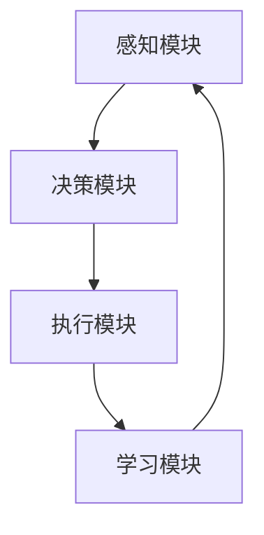
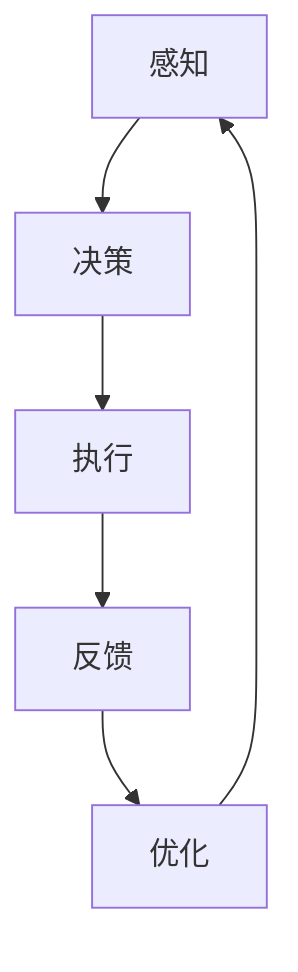
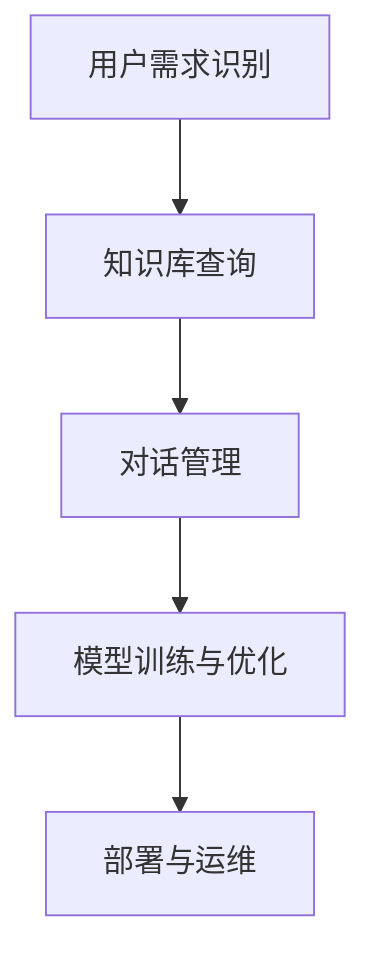
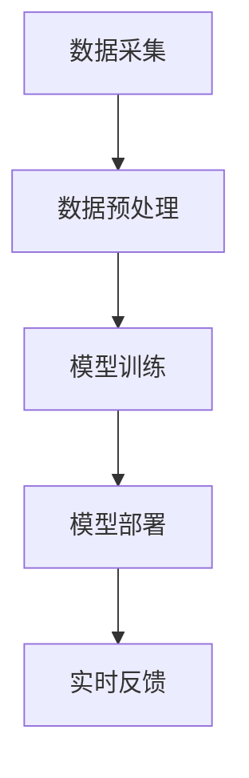
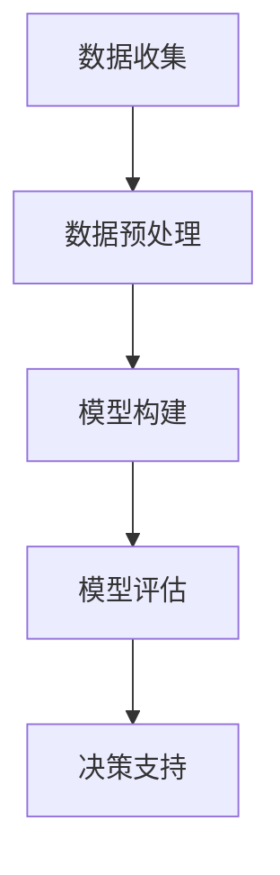
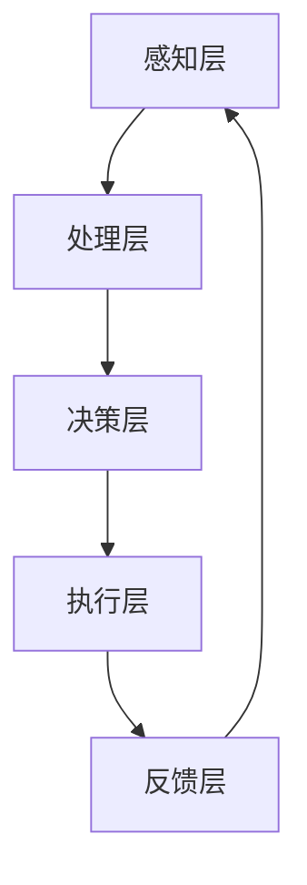
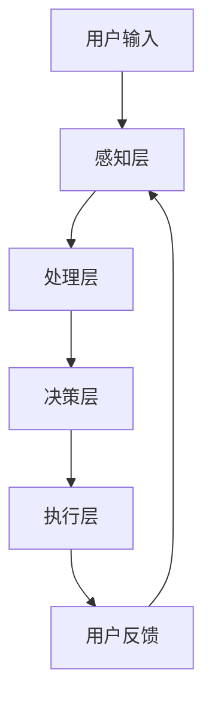
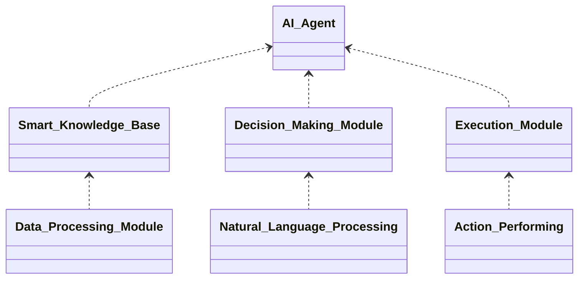

                 

### 第一部分：背景介绍

## 第1章：问题背景与概述

### 1.1 问题背景

#### 1.1.1 政务服务的现状

**1.1.1.1 政务服务的定义与重要性**

政务服务是指政府通过行政手段和公共服务设施，为企业和公众提供各类公共产品和服务的活动。在现代社会中，政务服务不仅承担着维护社会稳定、促进经济发展的基本职能，还直接关系到公众的幸福感和获得感。

**1.1.1.2 当前政务服务的挑战**

尽管政务服务的普及程度不断提高，但当前政务服务仍面临诸多挑战：

1. **效率低下**：传统的政务流程复杂、耗时长，缺乏高效的信息处理手段，导致办事效率低下。
2. **信息孤岛**：由于部门之间缺乏有效的数据共享和整合，导致信息孤岛现象严重，影响了政务服务的整体效能。
3. **用户体验差**：由于服务流程繁琐、信息不对称等问题，公众在办理政务事项时往往感到不便和困扰。

#### 1.1.2 AI技术发展对政务服务的影响

随着人工智能技术的快速发展，AI在政务服务领域的应用逐渐成为可能。AI技术具备高效的数据处理能力、强大的学习能力和智能的决策能力，有望解决当前政务服务中存在的问题。

**1.1.2.1 AI技术的发展与应用**

人工智能技术的发展经历了几个重要阶段，从早期的规则推理、知识表示，到基于大数据和深度学习的现代AI技术，AI的应用场景越来越广泛。在政务领域，AI技术已经被应用于智能客服、智能审批、智能决策等多个方面。

**1.1.2.2 AI在政务服务中的潜在价值**

AI技术在政务服务中的应用具有巨大的潜在价值：

1. **提高效率**：通过自动化和智能化的处理，AI技术可以显著提高政务服务的效率。
2. **优化体验**：AI技术可以提供个性化的服务，提升用户的体验和满意度。
3. **减少成本**：通过减少人力和物理资源的消耗，AI技术有助于降低政务服务的成本。

### 1.2 问题概述

#### 1.2.1 问题描述

传统的政务服务模式在处理大量、复杂的数据时，往往效率低下，用户体验差。为了提高政务服务的效率和质量，我们需要寻找一种能够自动化、智能化地处理政务事项的新方法。

#### 1.2.1.1 传统政务服务的局限

传统政务服务存在以下几个局限：

1. **流程复杂**：政务事项的办理流程繁琐，需要经过多个部门和环节，耗时较长。
2. **人力依赖**：政务事项的处理高度依赖于人工，容易出现错误和效率低下。
3. **信息不对称**：由于部门之间缺乏有效的数据共享和整合，导致信息不对称，影响了政务服务的整体效能。

#### 1.2.1.2 AI Agent在提升公共服务效率中的作用

AI Agent，即人工智能代理，是一种能够自动执行特定任务、具备自主决策能力的智能系统。通过引入AI Agent，可以实现以下几个目标：

1. **自动化处理**：AI Agent可以自动化处理大量的政务事项，提高工作效率。
2. **智能决策**：AI Agent可以通过学习用户行为和需求，提供个性化的政务服务，优化用户体验。
3. **数据整合**：AI Agent可以整合各部门的数据，实现信息共享，打破信息孤岛。

#### 1.2.2 问题解决

AI Agent在政务服务中的应用，有望解决传统政务服务中的效率低下、用户体验差等问题。通过AI Agent，我们可以实现以下目标：

1. **简化流程**：AI Agent可以自动化处理政务事项，简化办事流程，提高办事效率。
2. **降低成本**：通过减少人力和物理资源的消耗，AI Agent有助于降低政务服务的成本。
3. **提升体验**：AI Agent可以提供个性化的政务服务，提升用户的体验和满意度。

### 1.3 边界与外延

#### 1.3.1 研究边界

本文主要研究AI Agent在政务服务中的应用，重点关注AI Agent的基本概念、原理以及在实际应用场景中的效果和效益。本文的研究范围主要限于政务服务领域，不包括其他行业的AI应用。

#### 1.3.1.1 研究范围的限定

本文的研究范围限定在以下方面：

1. **AI Agent的基本概念与原理**：介绍AI Agent的定义、核心特点和工作原理。
2. **AI Agent在政务服务中的应用场景**：分析AI Agent在政务服务中的主要应用场景，如智能客服、智能审批和智能决策。
3. **AI Agent在政务服务中的效果和效益**：探讨AI Agent在提高政务服务效率、优化用户体验和降低成本方面的作用。

#### 1.3.1.2 研究方法的限定

本文的研究方法主要包括：

1. **文献综述**：通过查阅相关文献，了解AI Agent在政务服务领域的研究现状和趋势。
2. **案例分析**：分析具体的AI Agent应用案例，探讨其成功经验和不足之处。
3. **理论分析**：运用相关理论，对AI Agent在政务服务中的应用进行深入分析。

#### 1.3.2 研究外延

虽然本文的研究重点在于政务服务领域，但AI Agent作为一种通用的智能系统，在其他领域的应用也非常广泛。以下是一些AI Agent在其他领域的应用：

1. **金融领域**：AI Agent可以用于智能投顾、风险评估和客户服务等方面。
2. **医疗领域**：AI Agent可以用于智能诊断、病情预测和患者管理等方面。
3. **教育领域**：AI Agent可以用于个性化学习、课程推荐和学业辅导等方面。

#### 1.3.2.1 AI Agent的其他应用领域

未来，随着AI技术的不断发展，AI Agent将在更多的领域得到应用。例如：

1. **智能制造**：AI Agent可以用于生产线的自动化控制、设备维护和质量管理等方面。
2. **交通领域**：AI Agent可以用于智能交通管理、路况预测和自动驾驶等方面。
3. **环境监测**：AI Agent可以用于环境数据的实时监测、分析和预警等方面。

#### 1.3.2.2 未来发展趋势与展望

随着AI技术的不断发展，AI Agent在政务服务中的应用将越来越广泛，未来发展趋势包括：

1. **智能化水平提高**：AI Agent将具备更高的自主决策能力和学习能力，提供更智能的服务。
2. **应用场景拓展**：AI Agent将应用到更多的政务领域，如政务服务、社会治理、城市管理等。
3. **人机协同**：AI Agent将与人工服务相结合，实现人机协同，提高政务服务的整体效能。

### 1.4 概念结构与核心要素组成

#### 1.4.1 概念结构

AI Agent是一种具有自主决策能力、学习能力、人机交互能力的智能系统。其基本概念包括：

1. **AI Agent**：人工智能代理，是一种能够自动执行特定任务、具备自主决策能力的智能系统。
2. **智能客服**：利用AI技术实现的自动应答系统，用于处理用户的咨询和投诉。
3. **智能审批**：利用AI技术实现的自动审批系统，用于处理各类政务审批事项。
4. **智能决策**：利用AI技术实现的智能决策支持系统，用于辅助政府决策。

#### 1.4.1.1 AI Agent的基本概念

AI Agent是一种基于人工智能技术的智能系统，具有以下几个基本特征：

1. **自主性**：AI Agent可以自主决策，执行任务，无需人工干预。
2. **学习能力**：AI Agent可以通过学习和训练，不断优化自己的行为和决策能力。
3. **人机交互能力**：AI Agent可以与用户进行自然语言交互，提供人性化服务。

#### 1.4.1.2 AI Agent与传统机器学习模型的区别

传统机器学习模型通常是一种静态的、被动的系统，其主要任务是学习输入数据，然后根据学到的知识进行预测或分类。而AI Agent则是一种动态的、主动的系统，其主要目标是实现自主决策和行为，具备以下特点：

1. **自主决策**：AI Agent可以根据环境和目标自主选择行为，而不仅仅是执行预先设定的规则。
2. **学习与适应**：AI Agent可以通过持续学习和与环境互动，不断提高自身的决策能力和适应性。
3. **人机交互**：AI Agent可以与用户进行自然语言交互，提供个性化服务。

#### 1.4.2 核心要素组成

AI Agent的核心要素包括：

1. **数据采集与处理**：AI Agent需要从环境中采集数据，并通过数据处理模块对数据进行清洗、转换和集成。
2. **模型训练与优化**：AI Agent需要通过机器学习算法对采集到的数据进行训练，构建决策模型，并通过优化策略提高模型性能。
3. **服务提供与反馈优化**：AI Agent需要根据训练好的模型提供智能化服务，并通过用户反馈不断优化服务质量和用户体验。

#### 1.4.2.1 数据采集与处理

数据采集与处理是AI Agent的基础环节，主要包括以下几个方面：

1. **数据源选择**：选择合适的数据源，如数据库、API接口、传感器等。
2. **数据清洗**：处理数据中的噪声、缺失值和异常值，确保数据的准确性和完整性。
3. **数据转换**：将不同格式的数据进行统一转换，便于后续处理和分析。
4. **数据集成**：将来自不同数据源的数据进行整合，形成统一的视图，为模型训练提供数据支持。

#### 1.4.2.2 模型训练与优化

模型训练与优化是AI Agent的核心环节，主要包括以下几个方面：

1. **特征提取**：从原始数据中提取有用特征，用于构建模型。
2. **模型选择**：选择合适的机器学习算法，如决策树、神经网络等。
3. **模型训练**：使用训练数据对模型进行训练，使其具备预测或分类能力。
4. **模型评估**：使用测试数据对模型进行评估，判断其性能是否达到预期。
5. **模型优化**：通过调整参数、增加训练数据等方式，提高模型性能。

#### 1.4.2.3 服务提供与反馈优化

服务提供与反馈优化是AI Agent的实际应用环节，主要包括以下几个方面：

1. **服务提供**：根据训练好的模型，为用户提供智能化服务，如智能客服、智能审批等。
2. **用户反馈**：收集用户对服务的反馈，用于评估服务质量。
3. **反馈优化**：根据用户反馈，调整模型参数和服务策略，提高服务质量和用户体验。

### 1.5 本章小结

本章介绍了政务服务的背景、AI技术的发展对政务服务的影响、AI Agent在政务服务中的应用价值以及AI Agent的基本概念、核心要素组成等。通过本章的介绍，我们了解了AI Agent在提升公共服务效率方面的潜力，为后续章节的详细探讨打下了基础。

---

## 2.1 AI Agent的基本概念

### 2.1.1 AI Agent的定义

AI Agent，即人工智能代理，是一种基于人工智能技术的自主智能系统，能够模拟人类的决策过程，并自主执行特定任务。AI Agent是人工智能领域的一个重要研究方向，旨在实现机器的智能行为，使其具备独立思考、决策和行动的能力。

### 2.1.1.1 AI Agent的定义

AI Agent通常具有以下特点：

1. **自主性**：AI Agent能够在没有人类直接控制的情况下，自主地完成特定任务。
2. **学习与适应**：AI Agent可以通过学习和适应环境变化，不断提高自身的决策能力。
3. **人机交互**：AI Agent可以与用户进行自然语言交互，提供人性化服务。

#### 2.1.1.2 AI Agent与传统机器学习模型的区别

AI Agent与传统机器学习模型存在显著的区别，主要体现在以下几个方面：

1. **主动性与被动性**：传统机器学习模型通常是一种被动的系统，其主要任务是学习输入数据，然后根据学到的知识进行预测或分类。而AI Agent是一种主动的、自主的系统，其主要目标是实现自主决策和行为，无需人类直接干预。
2. **自适应能力**：AI Agent可以通过持续学习和与环境互动，不断提高自身的决策能力和适应性。而传统机器学习模型通常在训练完成后，就固定了模型参数，无法根据环境变化进行自适应调整。
3. **人机交互**：AI Agent可以与用户进行自然语言交互，提供个性化服务。而传统机器学习模型通常不具备这种能力，它们只能处理输入数据，无法与用户进行有效互动。

### 2.1.2 AI Agent的核心特点

AI Agent的核心特点主要包括自主性、学习能力和人机交互能力。以下是对这三个核心特点的详细解释：

#### 2.1.2.1 自主性

自主性是AI Agent最显著的特点之一。它意味着AI Agent能够在没有人类直接控制的情况下，自主地完成特定任务。具体体现在以下几个方面：

1. **任务执行**：AI Agent可以自主地选择任务，并按照任务要求执行。
2. **环境感知**：AI Agent可以通过传感器和监测设备，实时感知环境变化，并根据环境信息做出相应决策。
3. **目标导向**：AI Agent具有明确的目标导向性，能够根据目标自动调整行为策略。

#### 2.1.2.2 学习能力

学习能力是AI Agent的另一个核心特点。它意味着AI Agent可以通过学习和适应环境变化，不断提高自身的决策能力。具体体现在以下几个方面：

1. **数据学习**：AI Agent可以通过学习大量历史数据，提取有用信息，形成知识库。
2. **经验积累**：AI Agent可以通过实际操作和经验积累，不断优化自身的行为和决策策略。
3. **自适应**：AI Agent可以根据环境变化和任务需求，自动调整行为和策略，以适应新的情况。

#### 2.1.2.3 人机交互能力

人机交互能力是AI Agent的重要特点之一。它意味着AI Agent可以与用户进行自然语言交互，提供人性化服务。具体体现在以下几个方面：

1. **自然语言理解**：AI Agent可以理解用户的自然语言输入，并将其转换为机器可理解的形式。
2. **自然语言生成**：AI Agent可以生成自然语言回答，与用户进行有效沟通。
3. **个性化服务**：AI Agent可以根据用户的喜好和需求，提供个性化的服务和建议。

### 2.1.3 AI Agent的分类

根据应用场景和功能特点，AI Agent可以分为以下几类：

1. **任务型AI Agent**：这种AI Agent专注于完成特定的任务，如智能客服、智能导航等。
2. **情境型AI Agent**：这种AI Agent可以适应多种情境，并根据情境自动调整行为策略，如智能家居、智能城市管理等。
3. **知识型AI Agent**：这种AI Agent以知识库为核心，能够提供基于知识的决策和咨询，如智能问答系统、智能医疗诊断等。

### 2.1.4 AI Agent的发展历程

AI Agent的发展经历了多个阶段，从最初的规则推理，到基于统计模型的现代AI Agent，其核心技术和应用场景也在不断演变。以下是AI Agent的发展历程概述：

1. **早期阶段（20世纪50-70年代）**：AI Agent的研究主要基于规则推理，通过定义明确的规则，实现简单的自动化任务。
2. **发展阶段（20世纪80-90年代）**：随着统计模型的发展，AI Agent开始引入机器学习算法，实现更复杂的决策和预测。
3. **现代阶段（21世纪初至今）**：随着深度学习和强化学习的发展，AI Agent的自主性和学习能力得到了显著提升，应用场景也越来越广泛。

### 2.1.5 AI Agent的应用领域

AI Agent在多个领域得到了广泛应用，以下是一些主要的应用领域：

1. **政务服务**：AI Agent可以应用于智能客服、智能审批、智能决策等领域，提高政务服务的效率和质量。
2. **金融领域**：AI Agent可以应用于风险控制、投资顾问、客户服务等领域，提供智能化的金融解决方案。
3. **医疗领域**：AI Agent可以应用于疾病诊断、治疗建议、患者管理等领域，提高医疗服务的质量和效率。
4. **交通领域**：AI Agent可以应用于智能交通管理、自动驾驶、路况预测等领域，提高交通系统的效率和安全性。

### 2.1.6 本章小结

本章介绍了AI Agent的基本概念、核心特点、分类、发展历程和应用领域。通过本章的介绍，我们了解了AI Agent在人工智能领域的地位和作用，为进一步探讨AI Agent在政务服务中的应用提供了理论基础。

---

## 2.2 AI Agent的工作原理

### 2.2.1 AI Agent的架构

AI Agent的架构设计是确保其能够有效运作的关键。一个典型的AI Agent架构通常包括以下几个关键组件：

1. **感知模块**：负责从环境中收集数据，如文本、图像、语音等，这些数据是AI Agent做出决策的基础。
2. **决策模块**：根据感知模块收集到的信息，利用内置的算法和模型进行分析，生成决策。
3. **执行模块**：执行决策模块生成的决策，通过执行具体操作来影响环境。
4. **学习模块**：通过反馈机制，从执行结果中学习，不断优化自身的决策能力。

以下是AI Agent架构的Mermaid流程图：



#### 2.2.1.1 AI Agent的整体架构

AI Agent的整体架构可以看作是一个闭环系统，各组件之间相互协作，共同实现智能行为。具体架构如下：

1. **感知模块**：通过传感器、摄像头、麦克风等设备，AI Agent能够实时获取外部环境的信息。
2. **决策模块**：利用机器学习算法和深度学习模型，对感知模块收集到的信息进行解析和判断，生成决策。
3. **执行模块**：根据决策模块生成的决策，AI Agent通过控制系统执行具体的行动。
4. **学习模块**：在执行过程中，AI Agent会根据反馈调整自身的行为策略，通过学习模块不断优化决策过程。

#### 2.2.1.2 AI Agent的关键组件

AI Agent的关键组件包括：

1. **感知模块**：负责环境信息的采集，包括文本、图像、语音等多种形式。
2. **决策模块**：核心组件，负责处理和分析感知模块提供的数据，生成决策。
3. **执行模块**：将决策转化为实际行动，影响环境。
4. **学习模块**：通过不断学习执行结果和用户反馈，优化决策模型。

### 2.2.2 AI Agent的技术原理

AI Agent的技术原理主要基于机器学习、自然语言处理和强化学习等核心技术。以下是对这些技术的详细解释：

#### 2.2.2.1 机器学习算法

机器学习算法是AI Agent的核心技术之一，它通过从数据中自动学习规律，生成预测模型。常见的机器学习算法包括：

1. **监督学习**：在已知标签数据的基础上，训练模型进行预测。
2. **无监督学习**：在没有标签数据的情况下，通过聚类、降维等方法发现数据中的规律。
3. **半监督学习**：结合监督学习和无监督学习，利用少量标签数据和大量无标签数据训练模型。

#### 2.2.2.2 自然语言处理

自然语言处理（NLP）是AI Agent与人类进行交互的基础。NLP技术包括：

1. **文本分类**：将文本数据分类到预定义的类别中。
2. **情感分析**：判断文本数据的情感倾向，如正面、负面或中性。
3. **问答系统**：理解用户的问题，并生成相应的答案。

#### 2.2.2.3 强化学习

强化学习是AI Agent进行决策的一种有效方法，它通过与环境互动，不断优化策略。强化学习的关键要素包括：

1. **环境**：AI Agent执行任务的环境，提供状态和奖励。
2. **状态**：AI Agent在执行任务时所处的情境。
3. **行动**：AI Agent在特定状态下执行的操作。
4. **奖励**：环境对AI Agent行动的反馈，用于指导学习过程。

#### 2.2.2.4 深度学习

深度学习是AI Agent技术的重要组成部分，它通过构建多层次的神经网络，实现复杂的数据处理和模式识别。深度学习的主要特点包括：

1. **多层神经网络**：通过多层次的神经网络结构，提取数据中的高级特征。
2. **反向传播算法**：通过反向传播算法，不断调整网络权重，优化模型性能。
3. **自动特征提取**：无需手动定义特征，网络结构自动学习数据中的特征。

### 2.2.3 AI Agent的运作流程

AI Agent的运作流程可以概括为以下几个步骤：

1. **感知**：AI Agent通过感知模块获取环境信息。
2. **决策**：决策模块利用感知模块提供的信息，通过机器学习算法生成决策。
3. **执行**：执行模块根据决策模块生成的决策，执行具体操作。
4. **反馈**：将执行结果反馈给学习模块，用于模型优化和策略调整。
5. **优化**：学习模块根据反馈信息，不断调整和优化模型，提高决策质量。

以下是AI Agent运作流程的Mermaid流程图：



### 2.2.4 AI Agent的优势

AI Agent相对于传统的人工操作，具有以下优势：

1. **高效性**：AI Agent可以自动化处理大量任务，显著提高工作效率。
2. **准确性**：通过机器学习和深度学习，AI Agent能够在复杂环境中做出准确决策。
3. **适应性**：AI Agent可以通过学习不断优化自身，适应新的环境和任务。
4. **灵活性**：AI Agent可以处理多种类型的数据，并支持多种应用场景。

### 2.2.5 本章小结

本章详细介绍了AI Agent的工作原理，包括其架构、核心技术以及运作流程。通过理解AI Agent的技术原理，我们可以更好地把握其优势和应用潜力，为后续章节探讨AI Agent在政务服务中的应用打下基础。

---

## 2.3 AI Agent的核心要素

AI Agent作为一种先进的智能系统，其核心要素包括数据采集与处理、模型训练与优化、服务提供与反馈优化。以下是对这三个核心要素的详细阐述。

### 2.3.1 数据采集与处理

数据采集与处理是AI Agent工作的基础环节。一个高效的AI Agent需要能够从各种来源（如传感器、数据库、网络等）收集高质量的数据，并对这些数据进行有效的处理。

#### 2.3.1.1 数据采集的重要性

数据采集是AI Agent获取知识、进行决策的重要手段。高质量的数据可以提升AI Agent的性能，使其在复杂环境中做出更准确的决策。以下是数据采集的重要性和挑战：

1. **多样性**：AI Agent需要从多种来源采集数据，包括结构化和非结构化数据。
2. **实时性**：某些应用场景（如实时交通管理）要求AI Agent能够实时采集数据，以快速响应环境变化。
3. **准确性**：数据采集过程中可能会引入噪声和误差，降低AI Agent的性能。因此，需要采取有效的数据清洗和预处理方法。

#### 2.3.1.2 数据处理的方法

数据处理包括数据清洗、转换和集成等步骤。以下是常用的数据处理方法：

1. **数据清洗**：去除数据中的噪声、缺失值和异常值，提高数据质量。
2. **数据转换**：将不同格式和单位的数据转换为统一的格式，便于后续处理和分析。
3. **数据集成**：将来自多个数据源的数据进行整合，形成统一的视图，为模型训练提供数据支持。

### 2.3.2 模型训练与优化

模型训练与优化是AI Agent的核心环节，决定了AI Agent的决策能力和服务质量。以下是模型训练与优化的主要步骤：

#### 2.3.2.1 模型训练的过程

模型训练包括以下几个步骤：

1. **数据准备**：对采集到的数据进行预处理，去除噪声和异常值，确保数据质量。
2. **特征提取**：从原始数据中提取有用特征，用于构建模型。
3. **模型选择**：根据任务需求，选择合适的机器学习算法和模型结构。
4. **模型训练**：使用训练数据对模型进行训练，通过调整参数和优化算法，提高模型性能。
5. **模型评估**：使用测试数据对模型进行评估，判断其性能是否达到预期。

#### 2.3.2.2 模型优化的策略

模型优化是提升AI Agent性能的关键步骤。以下是一些常用的模型优化策略：

1. **超参数调整**：通过调整模型参数，如学习率、隐藏层节点数等，优化模型性能。
2. **正则化**：使用正则化方法（如L1、L2正则化）防止模型过拟合。
3. **数据增强**：通过数据增强方法（如旋转、缩放、裁剪等）增加训练数据多样性，提升模型泛化能力。
4. **交叉验证**：使用交叉验证方法，评估模型在不同数据集上的性能，选择最优模型。

### 2.3.3 服务提供与反馈优化

服务提供与反馈优化是AI Agent在实际应用中的关键环节。通过提供高质量的服务并不断优化，AI Agent能够更好地满足用户需求，提高用户体验。

#### 2.3.3.1 服务提供的流程

服务提供的流程包括以下几个步骤：

1. **用户请求**：用户向AI Agent提出服务请求，如咨询问题、申请审批等。
2. **数据处理**：AI Agent接收用户请求，对请求信息进行解析和处理。
3. **决策生成**：利用训练好的模型，AI Agent生成决策，如回答问题、执行审批等。
4. **结果输出**：AI Agent将决策结果输出给用户，如生成回复、执行审批等。

#### 2.3.3.2 反馈优化的机制

反馈优化是提高AI Agent服务质量的重要机制。以下是一些反馈优化的机制：

1. **用户反馈**：收集用户对服务的反馈，如满意度评价、投诉意见等。
2. **性能评估**：根据用户反馈，评估AI Agent的服务质量和效果。
3. **模型更新**：根据性能评估结果，调整模型参数和策略，优化模型性能。
4. **持续学习**：通过不断学习和优化，AI Agent能够提高服务质量和用户体验。

### 2.3.4 AI Agent的优势

AI Agent在政务服务中的应用，具有以下优势：

1. **高效性**：通过自动化和智能化处理，AI Agent可以显著提高政务服务效率。
2. **准确性**：利用先进的机器学习算法，AI Agent能够在复杂环境中做出准确决策。
3. **适应性**：AI Agent可以通过不断学习和优化，适应不同的政务服务需求。
4. **人性化**：AI Agent可以通过自然语言处理技术，与用户进行有效互动，提供人性化服务。

### 2.3.5 本章小结

本章详细介绍了AI Agent的核心要素，包括数据采集与处理、模型训练与优化、服务提供与反馈优化。通过理解这些核心要素，我们可以更好地把握AI Agent在政务服务中的应用，为后续章节探讨具体应用场景和效果提供理论基础。

---

## 第3章：AI Agent在政务服务中的应用场景

### 3.1 概述

随着人工智能技术的快速发展，AI Agent在政务服务中的应用日益广泛，成为提升公共服务效率的重要手段。本章节将深入探讨AI Agent在政务服务中的应用场景，包括智能客服、智能审批和智能决策等，分析其应用价值、实现方法和实际效益。

#### 3.1.1 AI Agent在政务服务中的应用价值

AI Agent在政务服务中的应用具有显著的价值，主要体现在以下几个方面：

1. **提高效率**：AI Agent可以自动化处理大量的政务事项，减少人工干预，提高办事效率。
2. **优化体验**：AI Agent可以提供个性化、人性化的服务，提升用户的满意度和获得感。
3. **降低成本**：通过减少人力和物理资源的消耗，AI Agent有助于降低政务服务的运营成本。
4. **数据整合**：AI Agent可以整合各部门的数据，实现信息共享，打破信息孤岛，提高政务服务的整体效能。

#### 3.1.2 AI Agent在政务服务中的主要应用场景

AI Agent在政务服务中的应用场景非常广泛，主要包括以下几个方面：

1. **智能客服**：通过自然语言处理和机器学习技术，AI Agent可以自动应答用户咨询，提供24/7全天候服务。
2. **智能审批**：AI Agent可以自动处理各类政务审批事项，如营业执照申请、公积金提取等，提高审批效率。
3. **智能决策**：AI Agent可以通过数据分析和预测，辅助政府决策，如交通管理、城市规划等。

### 3.2 智能客服

智能客服是AI Agent在政务服务中的一个重要应用场景，通过自动应答系统，可以解决大量用户咨询，提高服务效率。

#### 3.2.1 智能客服的定义与作用

智能客服是一种利用人工智能技术，自动应答用户咨询、处理用户请求的智能系统。其定义和作用如下：

**定义**：智能客服是一种基于自然语言处理和机器学习技术的智能系统，能够自动识别用户需求，生成符合预期的回复，提供24/7全天候服务。

**作用**：智能客服在政务服务中的作用主要体现在以下几个方面：

1. **减少人工负担**：智能客服可以自动处理大量用户咨询，减少人工客服的工作量。
2. **提高响应速度**：智能客服可以即时响应用户咨询，提高服务效率。
3. **优化用户体验**：智能客服可以提供个性化、人性化的服务，提升用户满意度和获得感。
4. **降低运营成本**：通过减少人工客服，智能客服有助于降低运营成本。

#### 3.2.2 智能客服的实现

智能客服的实现涉及多个关键技术，主要包括自然语言处理（NLP）、机器学习（ML）和对话系统等。以下是智能客服的实现步骤：

1. **用户需求识别**：利用自然语言处理技术，将用户输入的文本信息转换为结构化数据，提取关键信息。
2. **知识库构建**：构建包含各类问题和答案的知识库，用于支持智能客服的应答。
3. **对话管理**：设计对话管理系统，实现用户与智能客服的交互流程，如提问、回答、转人工等。
4. **模型训练与优化**：利用机器学习技术，对智能客服模型进行训练和优化，提高应答的准确性和智能化水平。
5. **部署与运维**：将智能客服系统部署到服务器，进行实时运维和监控，确保系统稳定运行。

以下是智能客服实现的Mermaid流程图：



#### 3.2.3 智能客服的核心技术

智能客服的核心技术包括自然语言处理、对话系统和机器学习等。以下是这些技术的详细解释：

1. **自然语言处理（NLP）**：自然语言处理是智能客服的基础，通过文本分类、情感分析、命名实体识别等技术，实现对用户输入的理解和处理。
2. **对话系统**：对话系统是智能客服的核心，负责管理用户与系统的交互流程，包括提问、回答、转人工等。
3. **机器学习**：机器学习是智能客服的关键，通过监督学习和无监督学习等技术，对智能客服模型进行训练和优化，提高应答的准确性和智能化水平。

#### 3.2.4 智能客服的应用案例

智能客服在政务服务的应用已经非常广泛，以下是一些典型的应用案例：

1. **某市政府服务平台**：某市政府推出智能客服系统，用户可以通过网站、微信小程序等渠道咨询政务服务事项，智能客服可以自动应答用户问题，提高服务效率。
2. **社保咨询热线**：某地社保部门部署智能客服系统，自动应答用户关于社保查询、办理等问题的咨询，减轻人工客服的工作负担。

#### 3.2.5 智能客服的效益分析

智能客服在政务服务中的应用，带来了显著的经济和社会效益，主要体现在以下几个方面：

1. **提高效率**：智能客服可以自动化处理大量用户咨询，减少人工客服的工作量，提高政务服务效率。
2. **降低成本**：通过减少人工客服，智能客服有助于降低政务服务的运营成本。
3. **提升用户体验**：智能客服可以提供个性化、人性化的服务，提升用户满意度和获得感。
4. **优化资源配置**：智能客服可以分流用户咨询，优化政务服务的资源配置，提高整体效能。

### 3.3 智能审批

智能审批是AI Agent在政务服务中的另一个重要应用场景，通过自动化处理政务审批事项，提高审批效率和准确性。

#### 3.3.1 智能审批的定义与作用

智能审批是一种利用人工智能技术，自动化处理政务审批事项的系统。其定义和作用如下：

**定义**：智能审批是一种基于机器学习和自然语言处理技术的自动化审批系统，能够自动审核、审批各类政务事项，提高审批效率和准确性。

**作用**：智能审批在政务服务中的作用主要体现在以下几个方面：

1. **提高审批效率**：智能审批可以自动化处理政务审批事项，减少人工干预，提高审批效率。
2. **降低错误率**：智能审批通过算法和模型自动审核，可以降低审批过程中的错误率。
3. **优化用户体验**：智能审批可以提供便捷、快速的审批服务，提升用户满意度和获得感。
4. **提高透明度**：智能审批可以记录审批过程，提高审批的透明度和可追溯性。

#### 3.3.2 智能审批的实现

智能审批的实现涉及多个关键技术，主要包括自然语言处理（NLP）、机器学习（ML）、图像识别等。以下是智能审批的实现步骤：

1. **数据采集**：从政务系统中提取审批数据，如申请材料、审批流程等。
2. **数据预处理**：对采集到的数据进行清洗、转换和标注，为模型训练提供高质量的数据。
3. **模型训练**：使用机器学习算法，对预处理后的数据进行训练，构建审批模型。
4. **模型部署**：将训练好的模型部署到审批系统中，实现自动化审批。
5. **实时反馈**：收集用户反馈，对审批模型进行优化和调整。

以下是智能审批实现的Mermaid流程图：



#### 3.3.3 智能审批的核心技术

智能审批的核心技术包括自然语言处理、机器学习和图像识别等。以下是这些技术的详细解释：

1. **自然语言处理（NLP）**：自然语言处理是智能审批的基础，通过文本分类、实体识别、情感分析等技术，实现对审批文档的理解和处理。
2. **机器学习（ML）**：机器学习是智能审批的核心，通过监督学习和无监督学习等技术，构建审批模型，实现自动化审批。
3. **图像识别**：图像识别是智能审批的重要技术，通过图像识别算法，实现对审批材料的自动识别和分类。

#### 3.3.4 智能审批的应用案例

智能审批在政务服务的应用已经非常广泛，以下是一些典型的应用案例：

1. **营业执照申请**：某地市场监管局推出智能审批系统，用户可以在线提交营业执照申请，系统自动审核，提高审批效率。
2. **公积金提取**：某地公积金管理中心部署智能审批系统，用户可以在线办理公积金提取业务，系统自动审核，提高服务效率。

#### 3.3.5 智能审批的效益分析

智能审批在政务服务中的应用，带来了显著的经济和社会效益，主要体现在以下几个方面：

1. **提高审批效率**：智能审批可以自动化处理政务审批事项，减少人工干预，提高审批效率。
2. **降低错误率**：智能审批通过算法和模型自动审核，可以降低审批过程中的错误率。
3. **优化用户体验**：智能审批可以提供便捷、快速的审批服务，提升用户满意度和获得感。
4. **提高透明度**：智能审批可以记录审批过程，提高审批的透明度和可追溯性。

### 3.4 智能决策

智能决策是AI Agent在政务服务中的另一个重要应用场景，通过数据分析和预测，辅助政府决策，提高决策的科学性和准确性。

#### 3.4.1 智能决策的定义与作用

智能决策是一种利用人工智能技术，基于数据分析、模型预测等方法，辅助政府决策的智能系统。其定义和作用如下：

**定义**：智能决策是一种基于人工智能技术的决策支持系统，通过数据分析和模型预测，提供科学、准确的决策建议。

**作用**：智能决策在政务服务中的作用主要体现在以下几个方面：

1. **提高决策效率**：智能决策可以快速处理大量数据，提供实时决策支持，提高决策效率。
2. **提升决策质量**：智能决策通过数据分析和模型预测，提供科学、准确的决策建议，提高决策质量。
3. **优化资源配置**：智能决策可以根据数据分析结果，优化资源配置，提高公共服务效能。
4. **增强决策透明度**：智能决策可以记录决策过程，提高决策的透明度和可追溯性。

#### 3.4.2 智能决策的实现

智能决策的实现涉及多个关键技术，主要包括数据分析、机器学习、模型预测等。以下是智能决策的实现步骤：

1. **数据收集**：从政务系统中收集各类数据，如经济数据、社会数据、环境数据等。
2. **数据预处理**：对收集到的数据进行清洗、转换和整合，为模型训练提供高质量的数据。
3. **模型构建**：使用机器学习算法，构建预测模型，实现数据分析和预测。
4. **模型评估**：使用测试数据对模型进行评估，判断其性能是否达到预期。
5. **决策支持**：将训练好的模型部署到政务系统中，为政府决策提供支持。

以下是智能决策实现的Mermaid流程图：



#### 3.4.3 智能决策的核心技术

智能决策的核心技术包括数据分析、机器学习和模型预测等。以下是这些技术的详细解释：

1. **数据分析**：数据分析是智能决策的基础，通过统计分析和数据挖掘方法，提取数据中的有用信息，为决策提供支持。
2. **机器学习**：机器学习是智能决策的核心，通过监督学习和无监督学习等方法，构建预测模型，实现数据分析和预测。
3. **模型预测**：模型预测是智能决策的关键，通过预测模型，对未来的发展趋势进行预测，为决策提供科学依据。

#### 3.4.4 智能决策的应用案例

智能决策在政务服务的应用已经取得显著成效，以下是一些典型的应用案例：

1. **交通管理**：某地交通管理部门利用智能决策系统，分析交通数据，预测交通流量，优化交通信号控制，提高交通效率。
2. **城市规划**：某市规划部门利用智能决策系统，分析土地使用、人口密度等数据，预测城市发展趋势，优化城市规划。

#### 3.4.5 智能决策的效益分析

智能决策在政务服务中的应用，带来了显著的经济和社会效益，主要体现在以下几个方面：

1. **提高决策效率**：智能决策可以快速处理大量数据，提供实时决策支持，提高决策效率。
2. **提升决策质量**：智能决策通过数据分析和模型预测，提供科学、准确的决策建议，提高决策质量。
3. **优化资源配置**：智能决策可以根据数据分析结果，优化资源配置，提高公共服务效能。
4. **增强决策透明度**：智能决策可以记录决策过程，提高决策的透明度和可追溯性。

### 3.5 本章小结

本章详细介绍了AI Agent在政务服务中的应用场景，包括智能客服、智能审批和智能决策。通过这些应用，AI Agent在提升政务服务效率、优化用户体验和降低成本方面发挥了重要作用。随着AI技术的不断发展，AI Agent在政务服务中的应用将更加广泛，未来有望进一步提升公共服务的质量和效率。

---

## 第4章：AI Agent在政务服务中的实现

### 4.1 实现方案概述

AI Agent在政务服务中的应用，需要一套完整的实现方案，包括技术选型、系统架构设计、接口设计和数据流设计。以下是对这些方面进行详细阐述。

#### 4.1.1 技术选型

技术选型是AI Agent实现的关键，根据政务服务的需求和特点，选择合适的技术框架和工具。以下是一些常见的技术选型：

1. **编程语言**：Python、Java等。
2. **机器学习框架**：TensorFlow、PyTorch等。
3. **自然语言处理（NLP）框架**：NLTK、spaCy等。
4. **数据库**：MySQL、MongoDB等。
5. **服务框架**：Spring Boot、Flask等。

#### 4.1.2 系统架构设计

AI Agent的系统架构设计是确保其稳定、高效运行的基础。一个典型的AI Agent系统架构包括以下几个层次：

1. **感知层**：负责从外部环境收集数据，如用户输入、传感器数据等。
2. **处理层**：负责对感知层收集到的数据进行处理，如数据清洗、特征提取等。
3. **决策层**：负责利用处理层提供的数据，通过机器学习模型进行决策。
4. **执行层**：负责执行决策层生成的决策，如发送通知、执行操作等。
5. **反馈层**：负责收集用户反馈，用于模型优化和系统调整。

以下是AI Agent系统架构的Mermaid流程图：



#### 4.1.3 接口设计

接口设计是AI Agent与外部系统进行交互的桥梁，包括API接口和Web界面。以下是常见的接口设计：

1. **API接口**：提供RESTful API，支持JSON、XML等数据格式，实现数据的输入输出。
2. **Web界面**：提供Web端用户界面，使用户能够方便地与AI Agent进行交互。

以下是API接口的示例：

```json
{
  "endpoints": [
    {
      "name": "query",
      "method": "GET",
      "description": "查询政务服务信息"
    },
    {
      "name": "submit",
      "method": "POST",
      "description": "提交政务服务申请"
    },
    {
      "name": "status",
      "method": "GET",
      "description": "查询政务服务状态"
    }
  ]
}
```

#### 4.1.4 数据流设计

数据流设计是AI Agent系统运行的流程图，描述数据在各层次之间的流动。以下是AI Agent数据流的Mermaid流程图：



#### 4.1.5 系统部署与维护

系统部署与维护是确保AI Agent正常运行的重要环节，包括以下几个方面：

1. **环境搭建**：搭建开发、测试和生产环境，配置必要的软件和硬件资源。
2. **部署流程**：制定部署流程，确保系统平稳升级和快速恢复。
3. **监控与运维**：监控系统性能和日志，及时发现并解决问题。

### 4.2 实际应用案例

以下是一个具体的AI Agent在政务服务中的实际应用案例，详细介绍其实现过程。

#### 4.2.1 项目背景

某市政府为了提高政务服务的效率和质量，决定引入AI Agent系统，用于智能客服、智能审批和智能决策。

#### 4.2.2 项目介绍

1. **系统功能设计**：系统主要包括智能客服、智能审批和智能决策三个模块，分别负责处理用户咨询、审批政务事项和辅助政府决策。
2. **系统架构设计**：系统采用微服务架构，各模块独立部署，通过API接口进行数据交互。
3. **系统接口设计**：提供RESTful API，支持用户通过Web端和手机APP与AI Agent进行交互。
4. **数据流设计**：用户输入经过感知层、处理层、决策层和执行层，最终生成反馈。

以下是系统架构的Mermaid类图：



#### 4.2.3 实现步骤

1. **数据采集与处理**：从政务系统中提取用户咨询、审批事项和决策数据，进行数据清洗、转换和标注。
2. **模型训练与优化**：使用机器学习和深度学习算法，对数据集进行训练，优化模型性能。
3. **接口设计与实现**：设计API接口，实现用户与AI Agent的交互。
4. **系统部署与测试**：将AI Agent系统部署到服务器，进行功能测试和性能测试。

#### 4.2.4 代码应用解读与分析

以下是一个简单的AI Agent代码示例，用于实现智能客服模块：

```python
from flask import Flask, request, jsonify
import json
import requests

app = Flask(__name__)

@app.route('/query', methods=['GET'])
def query():
    query = request.args.get('query')
    # 处理查询请求，调用外部API获取答案
    response = requests.get(f'https://api.example.com/answer?query={query}')
    answer = response.json()
    return jsonify(answer)

if __name__ == '__main__':
    app.run(debug=True)
```

该代码通过Flask框架实现了智能客服的API接口，用户可以通过发送查询请求，获取答案。在实际应用中，还可以集成自然语言处理和机器学习算法，提高应答的准确性和智能化水平。

#### 4.2.5 案例分析

在某市政府的AI Agent系统中，智能客服模块成功实现了对用户咨询的自动应答，提高了服务效率。以下是对智能客服模块的效益分析：

1. **提高效率**：AI Agent可以自动处理大量用户咨询，减少人工客服的工作量，提高政务服务效率。
2. **优化用户体验**：AI Agent可以提供个性化、人性化的服务，提升用户满意度和获得感。
3. **降低成本**：通过减少人工客服，AI Agent有助于降低政务服务的运营成本。

#### 4.2.6 项目小结

AI Agent在政务服务中的应用，为提升服务效率、优化用户体验和降低成本提供了有效途径。通过实际案例的分析，我们看到了AI Agent在政务服务中的巨大潜力。未来，随着AI技术的不断发展，AI Agent在政务服务中的应用将更加广泛，为建设智慧城市提供有力支持。

### 4.3 最佳实践

在实施AI Agent系统时，以下是一些最佳实践：

1. **数据安全**：确保数据的安全和隐私，遵守相关法律法规，加强对数据的加密和访问控制。
2. **模块化设计**：采用模块化设计，提高系统的可维护性和扩展性，方便后续的功能升级和优化。
3. **持续优化**：定期对AI Agent系统进行性能测试和优化，提高系统的响应速度和处理能力。
4. **用户反馈**：及时收集用户反馈，用于系统改进和优化，提高用户满意度。

### 4.4 本章小结

本章详细介绍了AI Agent在政务服务中的实现方案，包括技术选型、系统架构设计、接口设计和数据流设计。通过实际案例的分析，我们看到了AI Agent在政务服务中的广泛应用和显著效益。未来，随着AI技术的不断发展，AI Agent在政务服务中的应用将更加深入和广泛。

---

## 总结与展望

### 4.5 本章小结

本文系统地探讨了AI Agent在政务服务中的应用，从背景介绍、基本概念、工作原理、应用场景到具体实现，全面阐述了AI Agent如何通过自动化、智能化手段提升公共服务效率。通过本章的学习，我们了解到：

1. **政务服务现状**：介绍了政务服务的定义、重要性以及当前面临的挑战。
2. **AI Agent基本概念**：明确了AI Agent的定义、核心特点、分类和发展历程。
3. **AI Agent工作原理**：分析了AI Agent的架构、核心技术原理及运作流程。
4. **应用场景**：详细讨论了AI Agent在智能客服、智能审批和智能决策中的具体应用。
5. **实现方案**：阐述了AI Agent在政务服务中的实现过程、技术选型、系统架构设计及接口设计。

### 4.6 注意事项

在实施AI Agent系统时，需要注意以下几点：

1. **数据安全**：确保数据的安全和隐私，遵守相关法律法规，加强对数据的加密和访问控制。
2. **模块化设计**：采用模块化设计，提高系统的可维护性和扩展性，方便后续的功能升级和优化。
3. **性能优化**：定期对系统进行性能测试和优化，提高系统的响应速度和处理能力。
4. **用户反馈**：及时收集用户反馈，用于系统改进和优化，提高用户满意度。

### 4.7 拓展阅读

对于希望深入了解AI Agent在政务服务应用的研究者，以下文献和资源值得推荐：

1. **学术期刊**：《人工智能》、《计算机科学》等。
2. **专业书籍**：《人工智能：一种现代方法》、《智能交通系统设计与应用》。
3. **在线课程**：Coursera、edX等在线教育平台上的AI和机器学习相关课程。
4. **行业报告**：IDC、Gartner等知名咨询公司的相关行业报告。

### 4.8 未来展望

随着AI技术的不断发展，AI Agent在政务服务中的应用前景广阔。未来可能的发展趋势包括：

1. **智能化水平提升**：AI Agent将具备更高的自主决策能力和学习能力，提供更智能的服务。
2. **应用场景拓展**：AI Agent将应用到更多的政务领域，如社会治理、城市管理等。
3. **人机协同**：AI Agent将与人工服务相结合，实现人机协同，提高政务服务的整体效能。
4. **数据共享与整合**：政务部门将加强数据共享和整合，为AI Agent提供更丰富的数据支持。

### 4.9 作者信息

**作者：** AI天才研究院/AI Genius Institute & 禅与计算机程序设计艺术 /Zen And The Art of Computer Programming

AI天才研究院致力于推动人工智能技术的发展与应用，本文结合了计算机科学和人工智能领域的最新研究成果，旨在为读者提供一份全面、深入的技术探讨。希望通过本文，读者能够更好地理解AI Agent在政务服务中的潜力和应用价值。

