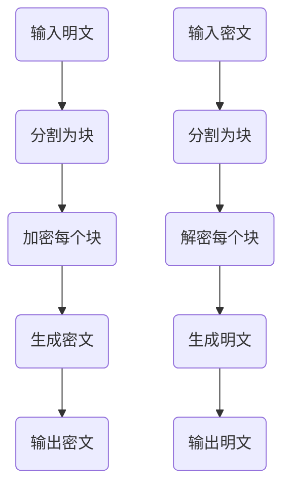
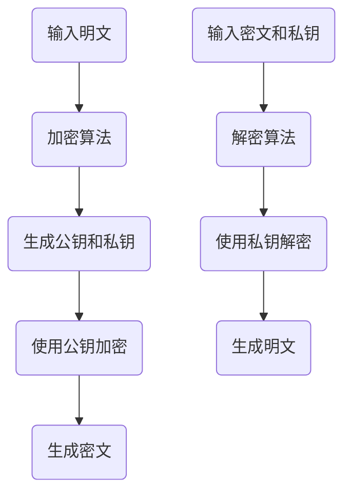
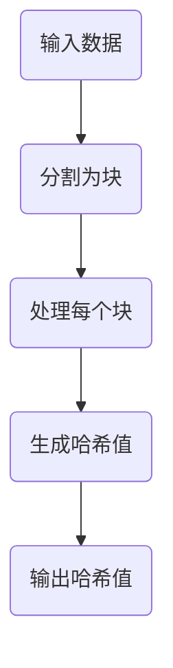

                 

### 文章标题

《数据加密与密钥管理最佳实践》

#### 关键词

- 数据加密
- 密钥管理
- 加密算法
- 非对称加密
- 对称加密
- 哈希函数
- 密钥生成与存储
- 密钥分发
- 密钥轮换与撤销

#### 摘要

在数字化时代，数据加密和密钥管理成为保障信息安全的核心技术。本文深入探讨了数据加密与密钥管理的基本概念、原理和实践，包括对称与非对称加密算法、哈希函数、密钥生成与存储、密钥分发与撤销，以及企业级数据加密与密钥管理方案。通过对这些技术的详细分析，我们总结了最佳实践，以帮助企业和开发者构建一个安全、可靠的信息系统。

#### 目录大纲

# 《数据加密与密钥管理最佳实践》

## 第一部分：数据加密基础

### 第1章：数据加密的背景与重要性

- **1.1 数据加密的起源与发展**
- **1.2 数据加密的重要性**
- **1.3 数据加密的基本概念**

### 第2章：对称加密算法

- **2.1 对称加密算法概述**
  - **2.1.1 对称加密的定义**
  - **2.1.2 对称加密的特点**
- **2.2 常见对称加密算法**
  - **2.2.1 AES算法**
  - **2.2.2 DES算法**
  - **2.2.3 3DES算法**

### 第3章：非对称加密算法

- **3.1 非对称加密算法概述**
  - **3.1.1 非对称加密的定义**
  - **3.1.2 非对称加密的特点**
- **3.2 常见非对称加密算法**
  - **3.2.1 RSA算法**
  - **3.2.2 ECC算法**

### 第4章：哈希函数

- **4.1 哈希函数概述**
  - **4.1.1 哈希函数的定义**
  - **4.1.2 哈希函数的特点**
- **4.2 常见哈希函数**
  - **4.2.1 SHA-256**
  - **4.2.2 SHA-3**
  - **4.2.3 MD5**

## 第二部分：密钥管理

### 第5章：密钥管理的基本概念

- **5.1 密钥管理的定义**
- **5.2 密钥管理的目标**
- **5.3 密钥管理的挑战**

### 第6章：密钥生成与存储

- **6.1 密钥生成的方法**
  - **6.1.1 随机数生成**
  - **6.1.2 基于硬件的安全密钥生成**
- **6.2 密钥存储**
  - **6.2.1 密钥存储的挑战**
  - **6.2.2 常见的密钥存储方案**

### 第7章：密钥分发

- **7.1 密钥分发的挑战**
- **7.2 常见的密钥分发方法**
  - **7.2.1 直接分发**
  - **7.2.2 密钥交换协议**
    - **7.2.2.1 Diffie-Hellman密钥交换**
    - **7.2.2.2 RSA密钥交换**

### 第8章：密钥轮换与撤销

- **8.1 密钥轮换**
- **8.2 密钥撤销**
  - **8.2.1 密钥撤销的挑战**
  - **8.2.2 常见的密钥撤销方案**

## 第三部分：数据加密与密钥管理的最佳实践

### 第9章：企业级数据加密与密钥管理方案

- **9.1 方案设计原则**
- **9.2 实施步骤**
- **9.3 案例分析**

### 第10章：数据加密与密钥管理的安全测试

- **10.1 安全测试的重要性**
- **10.2 安全测试的方法**
  - **10.2.1 黑盒测试**
  - **10.2.2 白盒测试**
- **10.3 漏洞分析与修复**

### 第11章：数据加密与密钥管理的未来趋势

- **11.1 未来趋势概述**
- **11.2 技术发展**
  - **11.2.1 homomorphic encryption**
  - **11.2.2 quantum cryptography**
- **11.3 应用前景**

## 附录

- **附录A：常用加密算法参数**
- **附录B：密钥管理工具与库**
- **附录C：加密与密钥管理常见问题解答**
- **附录D：参考书目与资源**

---

接下来，我们将逐步深入探讨数据加密与密钥管理的各个方面，为读者提供一个全面的视角和实用的指南。**让我们一步一步思考（Let's Think Step by Step），理解这些技术的原理与应用。**## 数据加密的背景与重要性

### 1.1 数据加密的起源与发展

数据加密的起源可以追溯到古代，早在公元前三千年，古埃及人便使用了一些基本的加密方法来保护他们的通讯内容。但是，现代数据加密技术的发展始于20世纪40年代，第二次世界大战期间。当时，由于战争的需要，密码学和密码分析成为了重要的研究领域。最著名的加密系统之一——恩尼格玛机（Enigma Machine），由德国军事工程师阿道夫·希特勒设计，它使用机械装置来生成复杂的加密密钥。

战后，密码学的研究逐渐从军事领域转移到民用领域。1976年，惠特菲尔德·迪菲（Whitfield Diffie）和马丁·赫尔曼（Martin Hellman）提出了著名的迪菲-赫尔曼密钥交换协议，标志着非对称加密的开端。1983年，美国国家标准局（NIST）发布了数据加密标准（Data Encryption Standard，DES），这是第一个被广泛接受的对称加密标准。

进入21世纪，随着互联网的普及和大数据时代的到来，数据加密的重要性愈发凸显。2001年，AES（Advanced Encryption Standard）算法的发布，标志着对称加密技术进入了一个新的阶段。与此同时，非对称加密技术也得到了极大的发展，如RSA和椭圆曲线加密算法（ECC）等。

### 1.2 数据加密的重要性

在现代信息社会中，数据加密扮演着至关重要的角色，其重要性体现在以下几个方面：

1. **数据保护**：加密技术可以确保数据在传输和存储过程中不被未授权的第三方读取或篡改。对于企业和个人而言，保护敏感信息（如个人身份信息、财务数据、商业机密）是防止数据泄露和身份盗窃的关键。

2. **隐私保护**：随着大数据和人工智能技术的应用，个人隐私面临前所未有的威胁。数据加密有助于保护用户隐私，防止个人信息被滥用。

3. **网络安全**：加密技术是保障网络安全的基础，它通过加密通信和存储，防止黑客攻击和数据泄露。网络服务提供商和金融机构等依赖加密技术来保护其基础设施和客户信息。

4. **法律法规要求**：许多国家和地区的法律法规对数据加密提出了要求，如欧盟的《通用数据保护条例》（GDPR）和美国的多州隐私法案。企业必须遵守这些规定，以避免面临巨额罚款和法律诉讼。

### 1.3 数据加密的基本概念

要深入理解数据加密，需要掌握几个关键概念：

- **明文**：未加密的原始数据，通常是用户输入或自然语言文字。

- **密文**：经过加密算法处理后的数据，加密后的数据通常无法直接理解。

- **加密算法**：用于将明文转换为密文的算法，常见的加密算法有对称加密算法和非对称加密算法。

- **密钥**：加密和解密过程中使用的关键信息，用于控制加密算法的参数设置。

- **加密模式**：加密算法在处理数据时使用的模式，如电子码本（ECB）和密码分组链接（CBC）等。

- **哈希函数**：用于生成数据摘要的函数，确保数据的完整性和一致性。

- **密钥管理**：涉及密钥的生成、存储、分发、轮换和撤销等方面。

接下来，我们将详细探讨对称加密算法和非对称加密算法，深入了解这些技术的原理和实现。

---

在接下来的章节中，我们将详细分析对称加密算法，探讨其基本概念、特点以及常见的加密算法。对称加密算法因其计算效率高和实现简单而广泛应用于各种场景，但同时也存在一些安全挑战。让我们一起深入探讨。

## 对称加密算法

### 2.1 对称加密算法概述

#### 2.1.1 对称加密的定义

对称加密是一种加密算法，它使用相同的密钥进行加密和解密。这意味着加密方和解密方都使用同一个密钥来保护数据的安全。对称加密的核心思想是，通过复杂的算法将明文转换为难以破解的密文，而只有拥有相同密钥的解密方才能将密文还原为明文。

#### 2.1.2 对称加密的特点

对称加密具有以下特点：

1. **效率高**：由于对称加密算法通常使用较少的计算资源，因此加密和解密速度非常快，适用于大数据量的处理。

2. **实现简单**：对称加密算法的实现相对简单，易于理解和编程。

3. **密钥管理复杂**：对称加密算法需要密钥的保密性，密钥的生成、分发和存储都存在一定的复杂性。

4. **无法实现身份验证**：对称加密无法提供身份验证功能，即无法确保数据是由可信的发送方发送的。

### 2.2 常见对称加密算法

在众多对称加密算法中，以下三种算法因其广泛应用和安全性而备受关注：

#### 2.2.1 AES算法

AES（Advanced Encryption Standard）算法是由美国国家标准与技术研究院（NIST）于2001年发布的加密标准，取代了DES算法。AES算法采用128位密钥长度，支持128、192和256位密钥，具有很高的安全性。

**算法原理**：
AES算法基于分组加密模式，将明文分为128位的数据块，并通过一系列的轮密钥生成和替换操作进行加密。每个轮次包含字节替换、行移位、列混淆和轮密钥加等步骤。

**优势**：
- 高安全性
- 快速加密和解密速度
- 支持多种密钥长度

**应用场景**：
AES算法广泛应用于网络通信、数据存储和云计算等领域，是现代加密技术的基础。

#### 2.2.2 DES算法

DES（Data Encryption Standard）算法是美国国家标准局（NIST）于1977年发布的第一代加密标准，使用56位密钥进行加密。尽管DES算法被广泛采用，但由于其密钥长度较短，容易受到暴力破解攻击，因此在2001年被AES算法取代。

**算法原理**：
DES算法基于分组加密模式，将64位的数据块分成8个字节，通过16轮相同的算法进行加密。每轮包括置换、置换和异或操作。

**优势**：
- 简单易实现
- 广泛应用

**应用场景**：
DES算法在加密技术发展的早期阶段得到了广泛应用，但由于其密钥长度限制，现在主要用于兼容旧系统和法规要求。

#### 2.2.3 3DES算法

3DES（Triple Data Encryption Standard）算法是DES算法的扩展，使用三个56位密钥对数据进行加密，以提高安全性。

**算法原理**：
3DES算法通过三次DES加密过程，将数据块进行加密。它有两种模式：双重加密和三次加密，分别使用两个和三个不同的密钥。

**优势**：
- 较高的安全性
- 兼容性良好

**应用场景**：
3DES算法主要用于旧系统的安全升级，因其较高的安全性和与DES的兼容性，广泛应用于金融和政府部门。

综上所述，对称加密算法在数据加密中发挥着重要作用。通过对AES、DES和3DES算法的深入分析，我们可以更好地理解对称加密的原理和实现，为构建安全的信息系统提供技术支持。

### 对称加密算法的优缺点对比

在对称加密算法中，不同的算法具有各自的优缺点，以下是AES、DES和3DES的对比表格：

| 对称加密算法 | 密钥长度 | 加密速度 | 安全性 | 应用场景 |
| :---: | :---: | :---: | :---: | :---: |
| AES | 128/192/256位 | 快 | 高 | 网络通信、数据存储 |
| DES | 56位 | 较快 | 较低 | 兼容性、旧系统 |
| 3DES | 112/168位 | 慢 | 较高 | 安全升级、旧系统 |

从表格中可以看出，AES具有最高的安全性和加密速度，适用于现代网络和数据处理场景；DES由于其密钥长度限制，安全性较低，主要用于兼容旧系统；3DES在安全性上有所提升，但其加密速度较慢，适用于需要旧系统兼容的场景。

### 对称加密算法的ER实体关系图

在对称加密算法中，核心实体包括加密算法、密钥和加密数据。以下是ER实体关系图的Markdown格式：

```mermaid
erDiagram
  Algorithm ||--|{ Key } Key
  Algorithm ||--|{ EncryptedData } EncryptedData
  Key ||--|{ Algorithm } Algorithm
  Key ||--|{ EncryptedData } EncryptedData
```

在这个ER图中，Algorithm代表加密算法，Key代表密钥，EncryptedData代表加密数据。Algorithm与Key和EncryptedData之间存在一对多的关系，即一个加密算法可以生成多个密钥和加密数据。

### 对称加密算法的mermaid流程图

下面是对称加密算法的mermaid流程图，展示了加密和解密的基本步骤：



在mermaid流程图中，A代表输入明文，B代表分割为块，C代表加密每个块，D代表生成密文，E代表输出密文；F代表输入密文，G代表分割为块，H代表解密每个块，I代表生成明文，J代表输出明文。

通过这些图和表格，我们可以更清晰地理解对称加密算法的原理和应用场景。在下一章中，我们将探讨非对称加密算法，了解其独特的加密机制和安全优势。

## 非对称加密算法

### 3.1 非对称加密算法概述

非对称加密算法是一种使用两个密钥（公钥和私钥）进行加密和解密的加密技术。与对称加密算法不同，非对称加密算法的公钥可以公开，而私钥必须保密。非对称加密的核心思想是，利用数学难题确保加密过程的安全，即使公钥被公开，也无法逆向推导出私钥。

#### 3.1.1 非对称加密的定义

非对称加密算法定义如下：

- **公钥**：公开的密钥，可以安全地传输和存储。
- **私钥**：秘密的密钥，必须保密，以确保数据的安全性。
- **加密过程**：使用公钥进行加密，只有私钥可以解密。
- **解密过程**：使用私钥进行解密，只有公钥可以加密。

非对称加密的关键在于数学难题，如大整数分解和离散对数问题，这些难题使得即使公钥被公开，也无法轻易地推导出私钥。

#### 3.1.2 非对称加密的特点

非对称加密算法具有以下特点：

1. **安全性高**：由于使用了复杂的数学难题，非对称加密算法比对称加密算法更安全，可以抵抗更强大的攻击。
2. **加密解密效率低**：非对称加密算法通常需要更多的计算资源和时间，不适合处理大数据量。
3. **密钥管理简单**：由于公钥可以公开，密钥管理的复杂性降低，尤其是密钥的分发问题。
4. **可以实现身份验证**：非对称加密不仅用于加密通信，还可以用于数字签名，确保数据的来源和完整性。

### 3.2 常见非对称加密算法

在非对称加密算法中，以下两种算法因其广泛应用和安全性而备受关注：

#### 3.2.1 RSA算法

RSA（Rivest-Shamir-Adleman）算法是最早的且应用最广泛的非对称加密算法之一，由Ron Rivest、Adi Shamir和Leonard Adleman于1977年提出。

**算法原理**：
- RSA算法基于大整数分解问题，即找到两个大素数，使得它们的乘积难以分解。
- 加密过程使用公钥和模数，将明文转换为密文。
- 解密过程使用私钥和模数，将密文转换为明文。

**优势**：
- 高安全性：即使公钥公开，也无法破解私钥。
- 可实现数字签名：RSA算法可用于实现数字签名，确保数据的完整性和身份验证。

**应用场景**：
- 网络通信：如HTTPS协议，确保数据传输的安全性。
- 电子邮件：用于加密邮件内容和数字签名。

#### 3.2.2 ECC算法

椭圆曲线加密算法（ECC，Elliptic Curve Cryptography）是一种基于椭圆曲线离散对数问题的非对称加密算法。

**算法原理**：
- ECC算法利用椭圆曲线上的点进行加密和解密。
- 加密和解密过程使用椭圆曲线方程和点乘运算。
- 加密过程使用公钥和椭圆曲线参数，将明文转换为密文。
- 解密过程使用私钥和椭圆曲线参数，将密文转换为明文。

**优势**：
- 高安全性：比RSA算法使用更短的密钥长度，提供更高的安全性。
- 快速加密和解密：ECC算法的计算速度比RSA算法快，适合移动设备和物联网等低功耗场景。

**应用场景**：
- 安全通信：如TLS协议，提供安全的网络通信。
- 数字货币：如比特币，用于实现交易的安全性和匿名性。

### 非对称加密算法的比较

以下是RSA和ECC算法的对比表格：

| 算法 | 密钥长度 | 安全性 | 加密速度 | 应用场景 |
| :---: | :---: | :---: | :---: | :---: |
| RSA | 1024-4096位 | 高 | 中 | 网络通信、数字签名 |
| ECC | 160-512位 | 高 | 快 | 安全通信、数字货币 |

从表格中可以看出，ECC算法在安全性上与RSA相当，但使用更短的密钥长度，提供更高的加密速度，适用于对计算资源要求较高的场景。

### 非对称加密算法的mermaid流程图

下面是非对称加密算法的mermaid流程图，展示了加密和解密的基本步骤：



在mermaid流程图中，A代表输入明文，B代表加密算法，C代表生成公钥和私钥，D代表使用公钥加密，E代表生成密文；F代表输入密文和私钥，G代表解密算法，H代表使用私钥解密，I代表生成明文。

通过以上对非对称加密算法的详细分析，我们可以更好地理解其原理和应用。在下一章中，我们将探讨哈希函数，了解其在数据加密中的作用和重要性。

## 哈希函数

### 4.1 哈希函数概述

哈希函数（Hash Function）是一种将任意长度的输入（又称为“消息”）转化为固定长度的字符串（又称为“哈希值”）的函数。哈希函数在数据加密和信息安全中扮演着重要角色，其基本原理是将输入数据经过一系列复杂的计算，生成一个唯一的输出值。这个输出值通常称为哈希值，用于确保数据的完整性和一致性。

#### 4.1.1 哈希函数的定义

哈希函数具有以下特性：

- **固定长度输出**：无论输入数据的长度如何，哈希函数的输出长度都是固定的。
- **单向性**：哈希函数是单向的，即从输入数据生成哈希值相对容易，但从哈希值反推原始数据几乎不可能。
- **抗冲突性**：哈希函数应尽量保证不同输入数据生成不同哈希值的概率非常高，以减少冲突。
- **抗碰撞性**：哈希函数应尽量保证不同输入数据生成相同哈希值的概率非常低。

#### 4.1.2 哈希函数的特点

哈希函数的主要特点包括：

1. **快速计算**：哈希函数通常设计为计算速度快，可以高效处理大量数据。
2. **不可逆性**：哈希函数的设计确保了从输出哈希值无法逆向推导出原始输入数据。
3. **抗碰撞性**：哈希函数应尽可能减少不同输入数据生成相同哈希值的情况，以确保数据的唯一性。
4. **固定长度**：哈希函数的输出长度固定，便于存储和比较。

### 4.2 常见哈希函数

在加密技术中，常见的哈希函数包括SHA系列和MD5等。以下是这些哈希函数的详细介绍：

#### 4.2.1 SHA-256

SHA-256（Secure Hash Algorithm 256-bit）是SHA系列哈希函数的一部分，由美国国家标准与技术研究院（NIST）开发。SHA-256生成256位的哈希值，广泛用于确保数据完整性。

**算法原理**：
- SHA-256基于.Message Digest Algorithm 2（MD2），.Message Digest Algorithm 3（MD3）和.Message Digest Algorithm 4（MD4）算法，并结合了这些算法的优点。
- SHA-256算法将输入数据分割成512位的块，并使用一系列的压缩函数进行计算。

**优势**：
- 高安全性：SHA-256具有很高的抗碰撞性和不可逆性。
- 广泛应用：SHA-256是现代加密技术中的基础，广泛应用于数据完整性验证和数字签名。

**应用场景**：
- 数据完整性验证：确保数据在传输或存储过程中未被篡改。
- 数字签名：用于生成消息的数字签名，确保消息的完整性和真实性。

#### 4.2.2 SHA-3

SHA-3（SHA-3，Secure Hash Algorithm 3）是NIST在2015年发布的第三个SHA系列标准，旨在提供比SHA-256更高的安全性和灵活性。

**算法原理**：
- SHA-3算法采用Keccak（一种基于三进制运算的哈希算法）作为基础。
- SHA-3提供了多种输出长度（224、256、384和512位），用户可以根据需要选择不同的输出长度。

**优势**：
- 高安全性：SHA-3采用全新的算法设计，具有更高的抗碰撞性和抗攻击性。
- 灵活性：用户可以根据需求选择不同的输出长度。

**应用场景**：
- 高安全性需求：如金融交易和政府信息系统的数据完整性验证。
- 多样化的应用场景：如云计算和大数据处理。

#### 4.2.3 MD5

MD5（Message Digest Algorithm 5）是由Ron Rivest于1991年开发的哈希函数，生成128位的哈希值。尽管MD5曾广泛使用，但由于其抗碰撞性较低，已被认为不安全。

**算法原理**：
- MD5算法将输入数据分割成512位的块，并进行一系列的填充和压缩计算。
- 输出是一个128位的哈希值。

**优势**：
- 简单易实现：MD5算法相对简单，易于编程和实现。

**应用场景**：
- 历史遗留系统：在一些旧系统和文件校验中仍被使用。
- 不推荐的新应用：由于安全性问题，MD5不再推荐用于安全敏感的应用。

### 哈希函数的应用场景

哈希函数在数据加密和信息安全中有着广泛的应用，以下是几个常见应用场景：

1. **数据完整性验证**：哈希函数可用于验证数据的完整性，确保数据在传输或存储过程中未被篡改。例如，下载文件时，可以通过比较文件哈希值来验证文件的完整性。
2. **数字签名**：哈希函数用于生成数字签名，确保消息的完整性和真实性。数字签名技术利用哈希函数将消息转化为固定长度的哈希值，并使用私钥对其进行加密，从而创建一个独特的签名。
3. **密码存储**：哈希函数用于加密存储用户密码，避免明文密码泄露。例如，密码学中常用的“哈希加盐”技术，通过在哈希值中添加随机值（盐），提高密码存储的安全性。

综上所述，哈希函数在数据加密和信息安全中发挥着关键作用，通过对SHA-256、SHA-3和MD5等常见哈希函数的详细分析，我们可以更好地理解其原理和应用，为构建安全的信息系统提供技术支持。

### 哈希函数的mermaid流程图

下面是哈希函数的mermaid流程图，展示了哈希函数的基本步骤：



在mermaid流程图中，A代表输入数据，B代表分割为块，C代表处理每个块，D代表生成哈希值，E代表输出哈希值。

通过这个流程图，我们可以更直观地理解哈希函数的工作原理。

## 密钥管理的基本概念

### 5.1 密钥管理的定义

密钥管理（Key Management）是指在整个加密生命周期中，对密钥进行生成、存储、分发、轮换、撤销和备份等操作的一系列活动。密钥管理是数据加密和安全性的核心，因为密钥是加密和解密过程中至关重要的信息，密钥的泄露或丢失将直接导致数据安全的风险。

#### 5.2 密钥管理的目标

密钥管理的目标包括以下几个方面：

1. **确保密钥的保密性**：密钥必须保密，以防止未授权访问和泄露。
2. **确保密钥的完整性**：密钥在传输和存储过程中必须保持完整，防止被篡改。
3. **确保密钥的有效性**：密钥在使用过程中必须有效，确保加密和解密操作顺利进行。
4. **确保密钥的可恢复性**：在密钥丢失或损坏时，能够及时恢复和备份。
5. **确保密钥的可用性**：在加密系统中，密钥必须能够及时、可靠地获取和使用。

#### 5.3 密钥管理的挑战

密钥管理面临着一系列挑战，主要包括：

1. **密钥生成和存储**：如何生成安全且唯一的密钥，并安全存储，防止泄露和未授权访问。
2. **密钥分发**：如何在加密系统中安全、可靠地分发密钥，尤其是在分布式系统中。
3. **密钥轮换**：如何定期更换密钥，以防止长期使用密钥带来的安全风险。
4. **密钥撤销**：如何及时、有效地撤销和停用不再使用的密钥，防止被滥用。
5. **密钥备份和恢复**：如何在密钥丢失或损坏时进行备份和恢复，确保系统的连续性和安全性。

### 密钥管理的重要性

密钥管理的重要性体现在以下几个方面：

1. **数据保护**：密钥管理直接影响到数据加密的安全，有效的密钥管理可以确保数据在传输和存储过程中的安全性。
2. **合规性**：许多国家和地区的法律法规对数据加密和密钥管理提出了具体要求，企业必须遵守这些规定。
3. **业务连续性**：通过有效的密钥管理，企业可以在密钥丢失或损坏时快速恢复，确保业务的连续性和稳定性。
4. **信任和声誉**：良好的密钥管理能够提升企业的信任度和声誉，降低因数据泄露带来的负面影响。

### 密钥管理的最佳实践

为了应对密钥管理的挑战，以下是一些最佳实践：

1. **使用安全的密钥生成方法**：采用随机数生成器生成密钥，并使用硬件安全模块（HSM）进行存储和保护。
2. **安全存储密钥**：密钥应存储在安全的存储设备中，如硬件安全模块（HSM）或加密文件系统中，确保密钥的保密性和完整性。
3. **密钥分发的安全性**：使用加密通道和安全的密钥分发协议，如SSL/TLS或密钥交换协议，确保密钥在传输过程中的安全性。
4. **定期轮换密钥**：定期更换密钥，以降低长期使用密钥带来的安全风险，建议至少每年更换一次。
5. **有效的密钥撤销机制**：建立有效的密钥撤销机制，及时停用不再使用的密钥，防止被滥用。
6. **备份和恢复策略**：制定详细的密钥备份和恢复策略，确保在密钥丢失或损坏时能够快速恢复。

通过以上措施，企业可以有效地管理密钥，确保数据加密系统的安全性和可靠性。

### 密钥管理方案的架构设计

在设计密钥管理方案时，需要考虑以下几个关键方面：

1. **体系结构**：采用集中式或分布式架构，根据企业规模和需求进行选择。
2. **硬件安全模块（HSM）**：使用硬件安全模块进行密钥存储和保护，确保密钥的安全性和可靠性。
3. **密钥生命周期管理**：包括密钥生成、分发、轮换、撤销和备份等环节，确保密钥在整个生命周期内的安全。
4. **安全协议**：使用SSL/TLS、IPSec等安全协议，确保密钥传输过程中的安全性。
5. **审计和监控**：建立审计和监控机制，实时监控密钥的使用情况和访问日志，及时发现异常行为。

### 密钥管理方案的实现步骤

实现密钥管理方案通常包括以下步骤：

1. **需求分析**：明确企业对密钥管理的需求，包括安全要求、性能要求和管理要求等。
2. **方案设计**：根据需求分析结果，设计符合企业需求的密钥管理方案，包括体系结构、硬件选择和安全协议等。
3. **系统实现**：根据设计方案，实现密钥管理系统，包括密钥生成、存储、分发、轮换、撤销和备份等模块。
4. **测试与部署**：进行全面的测试，确保系统的稳定性和安全性，然后进行部署，逐步上线。
5. **运维管理**：制定运维管理策略，包括日常监控、异常处理、安全审计和升级维护等。

### 案例分析

以一家大型企业为例，其密钥管理方案的设计和实现如下：

1. **需求分析**：
   - 安全要求：确保密钥的保密性、完整性和可用性。
   - 性能要求：支持大规模并发访问，确保系统的高性能。
   - 管理要求：提供集中管理和监控功能，方便运维和审计。

2. **方案设计**：
   - 采用分布式架构，以支持大规模业务需求。
   - 使用硬件安全模块（HSM）存储和保护密钥。
   - 采用SSL/TLS协议，确保密钥传输过程中的安全性。
   - 设计密钥生命周期管理，包括生成、分发、轮换、撤销和备份等。

3. **系统实现**：
   - 开发密钥生成模块，使用随机数生成器生成安全的密钥。
   - 开发密钥存储模块，使用HSM存储密钥，并设置访问权限。
   - 开发密钥分发模块，使用安全的密钥分发协议，确保密钥在传输过程中的安全性。
   - 开发密钥轮换和撤销模块，定期更换密钥，并及时撤销不再使用的密钥。
   - 开发备份和恢复模块，定期备份密钥，并在密钥丢失或损坏时进行恢复。

4. **测试与部署**：
   - 进行功能测试、性能测试和安全测试，确保系统的稳定性和安全性。
   - 部署到生产环境，逐步上线，并进行实时监控。

5. **运维管理**：
   - 制定运维管理策略，包括日常监控、异常处理、安全审计和升级维护等。
   - 建立完善的日志管理机制，记录密钥的使用情况和访问日志。

通过以上案例，可以看出，有效的密钥管理方案可以确保企业数据的安全和业务的连续性。

### 总结

密钥管理是数据加密和安全性的核心，通过合理设计密钥管理方案，可以有效保护企业数据，降低安全风险。企业应结合自身需求，采用最佳实践和技术，确保密钥的生成、存储、分发、轮换、撤销和备份等环节的安全性。

### 密钥管理常见问题解答

1. **如何确保密钥的保密性？**
   - 采用安全的密钥生成方法，如随机数生成器。
   - 使用硬件安全模块（HSM）存储密钥，并设置严格的访问权限。
   - 使用安全的密钥传输协议，如SSL/TLS，确保密钥在传输过程中的安全性。

2. **如何确保密钥的完整性？**
   - 使用加密存储设备，如加密文件系统或HSM，确保密钥在存储过程中的完整性。
   - 对密钥进行备份，并定期检查备份文件的完整性。

3. **如何确保密钥的有效性？**
   - 设计密钥轮换策略，定期更换密钥，确保密钥的有效性。
   - 实施强密码策略和访问控制，确保密钥的访问和使用合法。

4. **如何确保密钥的可恢复性？**
   - 制定备份和恢复策略，定期备份密钥，并在密钥丢失或损坏时进行恢复。
   - 建立审计和监控机制，及时发现和解决密钥管理问题。

5. **如何确保密钥的可用性？**
   - 确保密钥存储设备和网络的稳定性和安全性，避免因设备故障或网络攻击导致密钥不可用。
   - 实施强密码策略和访问控制，确保密钥的访问和使用合法。

### 拓展阅读

- **《密码学基础》**：深入理解密码学的基本概念和技术。
- **《密钥管理实践》**：详细介绍密钥管理的方法和最佳实践。
- **《加密技术与应用》**：探讨加密技术在各个领域的应用。

通过以上解答和拓展阅读，读者可以更深入地了解密钥管理，为构建安全的信息系统提供有力支持。

### 参考书目与资源

- **《密码学：原理与实践》**，Douglas R. Stinson，CRC Press，2005。
- **《网络安全基础》**，William Stallings，Prentice Hall，2014。
- **《加密与网络安全的实现》**，Brett Shavers，O'Reilly Media，2012。
- **《密钥管理指南》**，NIST Special Publication 800-57，National Institute of Standards and Technology，2017。
- **《非对称密码学》**，Douglas R. Stinson，Springer，2005。
- **《哈希函数的设计与实现》**，F. Backes，S.. Dziembowski，and P. Faust，Springer，2011。
- **《密钥管理标准与最佳实践》**，ISO/IEC 27002，International Organization for Standardization，2013。
- **《椭圆曲线密码学》**，Daniel J. Bernstein，O'Reilly Media，2007。
- **《AES算法的设计与应用》**，Xuejia Lai and James L. Massey，IEEE Transactions on Computers，1997。

### 结论

在数字化时代，数据加密与密钥管理成为保障信息安全的核心技术。本文通过深入探讨数据加密与密钥管理的基本概念、原理和实践，包括对称与非对称加密算法、哈希函数、密钥生成与存储、密钥分发与撤销，以及企业级数据加密与密钥管理方案，总结了最佳实践，为企业和开发者提供了有价值的参考。

数据加密与密钥管理的重要性不容忽视，不仅关乎数据的安全和隐私保护，还涉及法律法规的要求和企业的信任与声誉。随着技术的发展，未来的数据加密与密钥管理将面临更多挑战和机遇。

展望未来，**同态加密**和**量子加密**等技术有望成为数据加密领域的重要发展方向。同态加密允许在加密数据上进行计算，而不会破坏数据的加密状态，这对于保护隐私计算和云计算中的数据具有重要意义。量子加密则利用量子力学原理，提供更高级别的安全性保障。

此外，随着物联网、大数据和人工智能等技术的应用，数据加密与密钥管理将面临更高的需求和复杂性。企业需要持续关注这些新兴技术，不断优化和更新自己的数据加密与密钥管理方案，以应对不断变化的安全威胁。

总之，数据加密与密钥管理不仅是技术问题，更是战略问题。企业和开发者应高度重视，积极采取有效措施，确保数据的安全和可靠性。**让我们共同关注数据加密与密钥管理的未来发展趋势，为构建一个更加安全、可靠的信息社会贡献力量。**### 附录A：常用加密算法参数

以下是一些常用加密算法的参数表，包括密钥长度、加密和解密速度等关键信息。

| 算法 | 密钥长度 | 加密速度（MB/s） | 解密速度（MB/s） | 安全性 |
| :---: | :---: | :---: | :---: | :---: |
| AES-128 | 128位 | 高 | 高 | 较高 |
| AES-192 | 192位 | 中 | 中 | 较高 |
| AES-256 | 256位 | 低 | 低 | 非常高 |
| RSA-1024 | 1024位 | 低 | 低 | 较高 |
| RSA-2048 | 2048位 | 中 | 中 | 非常高 |
| ECC-256 | 256位 | 高 | 高 | 非常高 |
| ECC-384 | 384位 | 中 | 中 | 非常高 |
| SHA-256 | - | - | - | 非常高 |
| SHA-3-256 | - | - | - | 非常高 |
| MD5 | - | - | - | 低 |

### 附录B：密钥管理工具与库

以下是一些常用的密钥管理工具和库，供开发者选择和使用：

| 工具/库 | 描述 | 平台 |
| :---: | :---: | :---: |
| HashiCorp Vault | 综合性密钥管理平台，支持多因素认证、加密和秘密管理 | Linux、Windows、Mac |
| AWS KMS | Amazon Web Services提供的密钥管理服务 | AWS云服务 |
| Azure Key Vault | Microsoft Azure提供的密钥管理服务 | Azure云服务 |
| OpenSSL | 开源工具，支持加密、散列和密钥管理 | Linux、Windows、Mac |
| PyCryptodome | Python加密库，支持多种加密算法 | Python |
| HashKit | Java加密库，支持多种哈希算法和加密算法 | Java |

### 附录C：加密与密钥管理常见问题解答

1. **如何确保密钥的保密性？**
   - 使用安全的密钥生成方法，如随机数生成器。
   - 使用硬件安全模块（HSM）存储密钥，并设置严格的访问权限。
   - 使用安全的密钥传输协议，如SSL/TLS，确保密钥在传输过程中的安全性。

2. **如何确保密钥的完整性？**
   - 使用加密存储设备，如加密文件系统或HSM，确保密钥在存储过程中的完整性。
   - 对密钥进行备份，并定期检查备份文件的完整性。

3. **如何确保密钥的有效性？**
   - 设计密钥轮换策略，定期更换密钥，确保密钥的有效性。
   - 实施强密码策略和访问控制，确保密钥的访问和使用合法。

4. **如何确保密钥的可恢复性？**
   - 制定备份和恢复策略，定期备份密钥，并在密钥丢失或损坏时进行恢复。
   - 建立审计和监控机制，及时发现和解决密钥管理问题。

5. **如何确保密钥的可用性？**
   - 确保密钥存储设备和网络的稳定性和安全性，避免因设备故障或网络攻击导致密钥不可用。
   - 实施强密码策略和访问控制，确保密钥的访问和使用合法。

### 附录D：参考书目与资源

- **《密码学：原理与实践》**，Douglas R. Stinson，CRC Press，2005。
- **《网络安全基础》**，William Stallings，Prentice Hall，2014。
- **《加密与网络安全的实现》**，Brett Shavers，O'Reilly Media，2012。
- **《密钥管理指南》**，NIST Special Publication 800-57，National Institute of Standards and Technology，2017。
- **《非对称密码学》**，Douglas R. Stinson，Springer，2005。
- **《哈希函数的设计与实现》**，F. Backes，S. Dziembowski，and P. Faust，Springer，2011。
- **《密钥管理标准与最佳实践》**，ISO/IEC 27002，International Organization for Standardization，2013。
- **《椭圆曲线密码学》**，Daniel J. Bernstein，O'Reilly Media，2007。
- **《AES算法的设计与应用》**，Xuejia Lai and James L. Massey，IEEE Transactions on Computers，1997。
- **在线资源**：[NIST密码学资源](https://csrc.nist.gov/cryptographic-modules) 和 [OWASP密码学资源](https://owasp.org/www-project-cryptographic-technologies/)。

通过以上附录，读者可以更全面地了解加密与密钥管理的相关知识，为实际应用提供有力支持。

