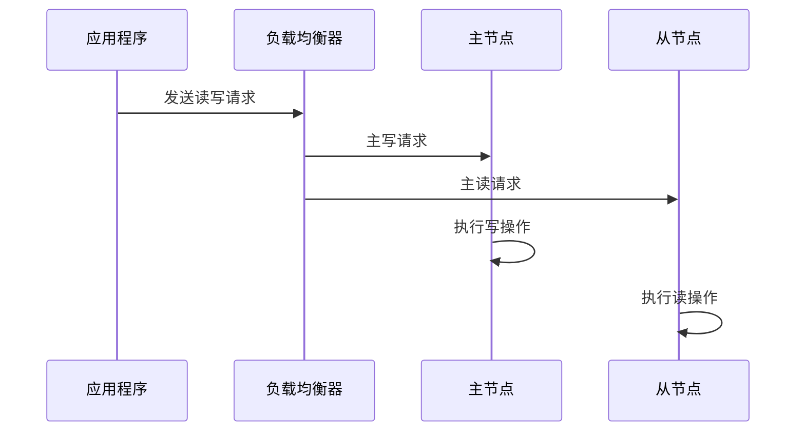
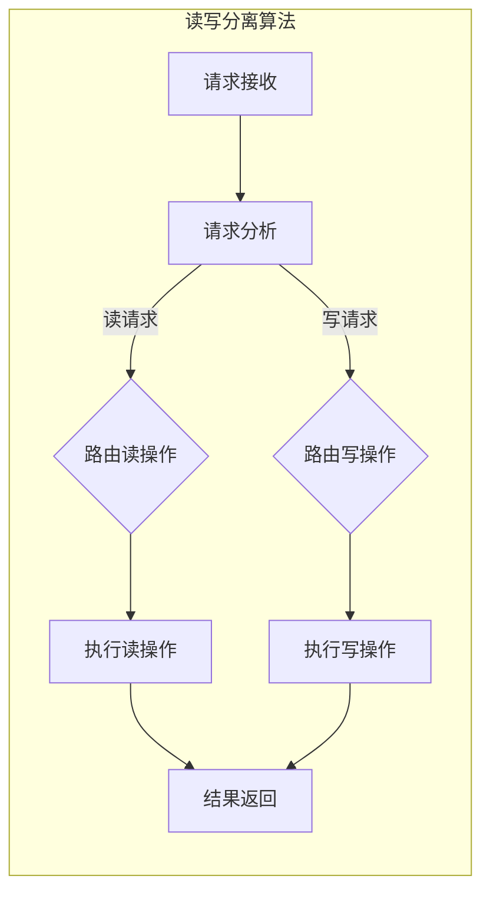
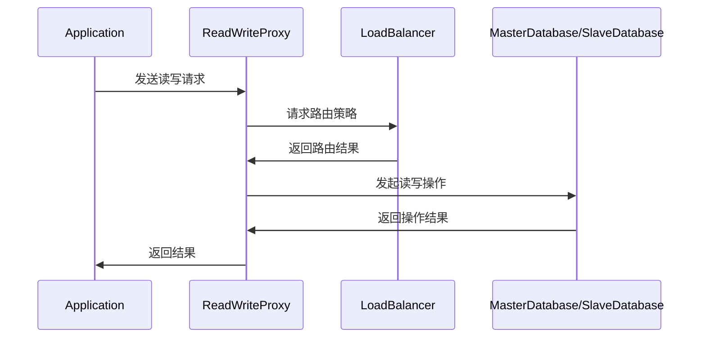
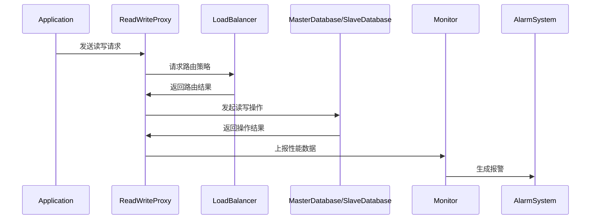

                 

### 数据库读写分离技术概述

#### 第1章：数据库读写分离技术简介

##### 1.1 问题背景与数据库读写分离的概念

**1.1.1 数据库性能瓶颈**

在当前的互联网时代，随着数据量的急剧增长和业务需求的不断变化，数据库的性能问题逐渐成为系统架构设计的核心瓶颈之一。数据库通常承担着存储、管理和处理数据的重要任务，其性能瓶颈主要表现为：

1. **读写压力大**：随着用户数量和访问频率的增加，数据库的读写操作量也随之剧增，单点数据库难以承受高并发读写需求。
2. **查询效率低**：复杂查询和数据量大时，数据库的查询效率显著下降，影响用户体验。
3. **扩展性差**：传统的单点数据库架构在性能和容量上扩展性较差，难以满足日益增长的业务需求。

**1.1.2 数据库读写分离的定义与目的**

为了解决上述问题，数据库读写分离技术应运而生。所谓数据库读写分离，是指通过将数据库的读操作和写操作分配到不同的服务器上，从而提高系统整体的处理能力，提升数据库性能。

数据库读写分离的主要目的是：

1. **提高并发性能**：通过读写分离，读写操作可以并行处理，从而提高系统的并发处理能力。
2. **提升查询效率**：将读操作分配到性能较高的读服务器，减少读操作对主数据库的竞争，提高查询效率。
3. **增强系统扩展性**：读写分离使得数据库系统可以水平扩展，增加服务器数量以应对更高的业务需求。

**1.1.3 数据库读写分离的分类**

根据数据库读写分离的实现方式，主要可以分为以下几类：

1. **主从复制读写分离**：主数据库负责写操作，从数据库负责读操作，通过主从复制保持数据一致性。
2. **读写分离代理**：读写分离代理服务器接收应用程序的读写请求，并根据策略将请求分配到不同的数据库服务器上。
3. **分布式数据库读写分离**：通过分布式数据库架构，将数据分散存储在不同的节点上，读写操作在各个节点之间并行处理。

##### 1.2 数据库读写分离的原理

**1.2.1 读写分离的基本原理**

数据库读写分离的基本原理是将数据库服务器的读操作和写操作分离到不同的服务器上，以实现负载均衡和数据一致性的目标。具体来说，包括以下几个关键环节：

1. **读写请求分发**：应用程序发送的读写请求首先到达读写分离代理服务器或者负载均衡器，这些服务器负责根据一定的策略分发请求到不同的数据库服务器。
2. **读写操作执行**：写操作通常会被路由到主数据库服务器上执行，而读操作则可以被路由到从数据库服务器或其他读服务器上执行。
3. **数据一致性维护**：为了保证数据的一致性，需要采用各种机制，如主从复制、两阶段提交等。

**1.2.2 读写分离的执行过程**

读写分离的执行过程通常可以分为以下几个步骤：

1. **初始化**：配置主数据库和从数据库，并设置读写分离的策略。
2. **请求接收**：读写分离代理或负载均衡器接收来自应用程序的读写请求。
3. **请求路由**：根据策略将请求路由到合适的服务器。例如，写请求会被路由到主数据库，而读请求则可以被路由到从数据库或其他读服务器。
4. **操作执行**：服务器执行对应的读写操作，并将结果返回给读写分离代理或负载均衡器。
5. **结果返回**：读写分离代理或负载均衡器将操作结果返回给应用程序。

**1.2.3 读写分离的优势与挑战**

**优势**：

1. **提升系统性能**：读写分离可以显著提高数据库系统的并发处理能力和查询效率。
2. **增强系统扩展性**：读写分离使得数据库系统可以水平扩展，以应对更高的业务需求。
3. **优化资源利用**：读写操作在不同的服务器上并行处理，可以更好地利用系统资源。

**挑战**：

1. **数据一致性**：读写分离需要在数据一致性和性能之间取得平衡，实现一致性的复杂性增加。
2. **运维管理**：读写分离增加了系统的复杂度，运维管理的难度也随之增加。
3. **故障处理**：读写分离系统需要考虑故障切换和数据恢复等问题，增加了系统稳定性管理的挑战。

##### 1.3 数据库读写分离技术发展历程

**1.3.1 传统数据库读写分离**

传统数据库读写分离技术主要应用于单机数据库系统，通过主从复制实现读写分离。早期，如MySQL、Oracle等数据库系统就已经支持主从复制功能。传统的读写分离方式相对简单，但受限于单机性能，扩展性较差。

**1.3.2 分布式数据库读写分离**

随着互联网的快速发展，分布式数据库读写分离技术逐渐兴起。分布式数据库通过将数据分散存储在多个节点上，实现了更高的扩展性和性能。如MongoDB、Cassandra等分布式数据库系统，提供了原生的读写分离支持。

**1.3.3 云数据库读写分离**

云数据库的出现进一步推动了数据库读写分离技术的发展。云数据库通常具备高度的可扩展性和弹性，支持自动化管理。如AWS RDS、Azure Cosmos DB等云数据库服务，提供了便捷的读写分离功能，大幅简化了数据库运维。

##### 1.4 数据库读写分离的应用场景

**1.4.1 高并发场景**

在高并发场景下，如电商系统、社交媒体平台等，读写分离技术可以显著提高系统的响应速度和处理能力。通过将读操作分配到从数据库上，减少主数据库的读写压力，从而提高整体性能。

**1.4.2 大数据处理场景**

大数据处理场景中，数据量巨大且查询复杂。通过分布式数据库读写分离，可以将数据分散存储在不同的节点上，实现并行处理，提高查询效率。

**1.4.3 跨区域部署场景**

在跨区域部署场景下，如跨国企业、多区域服务架构等，读写分离技术可以帮助实现数据的本地化访问，降低跨区域数据传输的延迟，提高系统性能。

##### 1.5 本章小结

本章介绍了数据库读写分离技术的基本概念、原理和发展历程，并分析了其在不同应用场景下的作用和优势。通过读写分离，数据库系统可以显著提升性能、扩展性和稳定性，应对日益增长的互联网业务需求。

关键词：数据库读写分离、主从复制、分布式数据库、云数据库、性能优化

摘要：本文详细介绍了数据库读写分离技术的概念、原理和应用场景，探讨了传统数据库、分布式数据库和云数据库读写分离的实现方法与挑战，为数据库性能优化和系统扩展提供了参考。

----------------------------------------------------------------

### 第二部分：数据库读写分离技术原理

#### 第2章：数据库读写分离核心概念与联系

##### 2.1 数据库读写分离的核心概念

**2.1.1 数据库读写分离的关键要素**

数据库读写分离技术涉及多个核心要素，这些要素共同构成了读写分离的基础框架。关键要素包括：

1. **读写分离代理**：负责接收应用程序的读写请求，并根据策略将请求分发到不同的数据库服务器上。
2. **主数据库**：负责处理写操作，即对数据的写入、修改和删除操作。
3. **从数据库**：负责处理读操作，即对数据的查询操作。
4. **数据一致性**：确保主数据库和从数据库之间的数据一致性，是读写分离技术的重要挑战之一。

**2.1.2 数据库读写分离与数据库分库分表的关系**

数据库读写分离与数据库分库分表是两个不同的概念，但它们在数据库架构设计中有着紧密的联系。

1. **数据库分库分表**：分库分表是将数据按照某种策略分散存储到多个数据库或数据库表中。其主要目的是为了提高数据的访问性能和扩展能力。
2. **数据库读写分离**：读写分离是将读写操作分离到不同的数据库服务器上，以提高系统的并发处理能力和查询效率。

在实际应用中，分库分表与读写分离常常结合使用。通过分库分表，可以将数据分散存储，然后通过读写分离技术，将读写操作分配到不同的数据库或表上，从而实现性能优化和扩展。

##### 2.2 数据库读写分离的属性特征对比表格

为了更好地理解数据库读写分离的概念和特征，我们可以通过一个对比表格来展示读写分离与分库分表之间的差异。

| 特征项          | 读写分离                     | 分库分表                      |
|-----------------|-----------------------------|------------------------------|
| 目的             | 提高性能、扩展性和稳定性         | 提高性能、扩展性和访问效率       |
| 实现方式         | 主从复制、读写分离代理          | 数据分片、表分区                |
| 数据一致性       | 需要维护数据一致性               | 数据分片时需要考虑一致性          |
| 系统复杂度       | 相对较高，需要读写分离代理等组件  | 相对较低，但数据分片设计复杂      |
| 扩展性           | 可以水平扩展，增加服务器数量      | 可以水平扩展，增加数据库或表的数量 |
| 适用场景         | 高并发、大数据处理场景          | 高并发、大数据处理场景          |

通过这个对比表格，我们可以更清晰地看到读写分离与分库分表在目的、实现方式、数据一致性、系统复杂度、扩展性和适用场景等方面的差异和联系。

##### 2.3 数据库读写分离的ER实体关系图架构

**2.3.1 ER实体关系图的基本概念**

ER（Entity-Relationship）实体关系图是一种用于描述数据库中实体及其之间关系的图形表示方法。它包括以下基本概念：

1. **实体（Entity）**：代表数据库中的数据对象，如用户、订单等。
2. **属性（Attribute）**：实体所具有的特征，如用户的姓名、年龄等。
3. **关系（Relationship）**：实体之间的关联，如用户与订单之间的关系。

**2.3.2 数据库读写分离ER实体关系图构建**

为了构建一个描述数据库读写分离的ER实体关系图，我们需要考虑以下要素：

1. **主数据库实体**：包括主数据库中的实体，如用户、订单等。
2. **从数据库实体**：包括从数据库中的实体，如用户、订单等。
3. **读写分离代理实体**：表示读写分离代理服务器的实体。
4. **读写请求实体**：表示应用程序发送的读写请求实体。

以下是数据库读写分离的ER实体关系图示例：

```mermaid
erDiagram
    Application ||--|{ ReadWriteSeparator }|--| UserDB : Write Operation
    Application ||--|{ ReadWriteSeparator }|--| OrderDB : Read Operation
    ReadWriteSeparator ||--|{ MasterDB }| MasterDatabase
    ReadWriteSeparator ||--|{ SlaveDB }| SlaveDatabase
    UserDB ..|.. MasterDatabase
    OrderDB ..|.. SlaveDatabase
```

在这个ER实体关系图中，`Application`表示应用程序，`ReadWriteSeparator`表示读写分离代理，`MasterDatabase`和`SlaveDatabase`分别表示主数据库和从数据库。`UserDB`和`OrderDB`分别代表对主数据库和从数据库的读写操作。

通过构建这样的ER实体关系图，我们可以清晰地描述数据库读写分离系统的架构，便于理解和分析。

##### 2.4 本章小结

本章详细介绍了数据库读写分离技术的核心概念，包括关键要素、与分库分表的关系、属性特征对比表格和ER实体关系图架构。通过这些内容，读者可以全面了解数据库读写分离的基础理论和应用场景，为后续的深入学习和实践打下坚实的基础。

----------------------------------------------------------------

### 第三部分：数据库读写分离技术实现

#### 第3章：传统数据库读写分离技术

##### 3.1 传统数据库读写分离的实现原理

**3.1.1 主从复制**

主从复制（Master-Slave Replication）是传统数据库读写分离技术中常用的一种方式。在这种模式下，主数据库（Master Database）负责处理写操作，从数据库（Slave Database）负责处理读操作。主从复制的基本原理如下：

1. **数据同步**：主数据库在完成写操作后，会将数据变更同步到从数据库。这个过程通常通过日志文件（如binlog）实现，从数据库通过读取主数据库的日志文件来复制数据变更。
2. **故障切换**：当主数据库发生故障时，从数据库可以自动切换为主数据库，继续处理读写操作。这种机制称为故障切换（Failover），确保系统的高可用性。

**3.1.2 读写分离代理**

读写分离代理（Read/Write Separation Proxy）是通过中间件层实现读写分离的一种技术。读写分离代理接收来自应用程序的读写请求，并根据一定的策略将请求分发到主数据库和从数据库上。具体原理如下：

1. **请求接收**：读写分离代理接收应用程序的读写请求。
2. **请求分析**：代理服务器分析请求类型，判断是否为读操作或写操作。
3. **请求分发**：根据策略将请求分发到主数据库或从数据库。
4. **结果返回**：代理服务器将操作结果返回给应用程序。

读写分离代理的优点包括：

1. **灵活性**：代理服务器可以根据业务需求灵活配置读写策略。
2. **简单性**：读写分离代理的部署和运维相对简单。
3. **扩展性**：代理服务器可以方便地扩展，增加更多的从数据库或读服务器。

##### 3.2 传统数据库读写分离的实现步骤

**3.2.1 数据库主从复制的配置**

以下以MySQL为例，介绍数据库主从复制的配置步骤：

1. **安装和配置主数据库**：

    - 安装MySQL并配置主数据库，设置root用户的密码。
    - 创建一个用于复制的用户，并授予REPLICATION SLAVE权限。

2. **安装和配置从数据库**：

    - 安装MySQL并配置从数据库。
    - 将主数据库的IP地址和端口号写入从数据库的配置文件中。
    - 执行`START SLAVE`命令启动从数据库复制。

3. **验证主从复制状态**：

    - 使用`SHOW SLAVE STATUS\G`命令查看从数据库的复制状态，确保数据同步正常。

**3.2.2 读写分离代理的部署与配置**

以下以MySQL Proxy为例，介绍读写分离代理的部署与配置步骤：

1. **下载和安装MySQL Proxy**：

    - 下载MySQL Proxy的安装包并安装。

2. **编写MySQL Proxy配置文件**：

    - 配置代理服务器监听的端口和连接的主数据库、从数据库的地址。
    - 配置读写分离策略，如根据请求类型路由到主数据库或从数据库。

3. **启动MySQL Proxy**：

    - 执行`mysqlproxy --config-file=/path/to/config/my.cnf`命令启动代理服务器。

4. **测试读写分离效果**：

    - 使用客户端连接到代理服务器，执行写操作和读操作，验证读写分离是否正常。

##### 3.3 传统数据库读写分离案例分析

**3.3.1 案例一：MySQL的主从复制**

MySQL的主从复制是传统数据库读写分离技术的经典案例。在MySQL 5.6及更高版本中，主从复制提供了完善的同步机制和故障切换功能。

1. **主数据库配置**：

    ```sql
    CREATE DATABASE mydb;
    GRANT REPLICATION SLAVE ON *.* TO 'slaveuser'@'192.168.1.100' IDENTIFIED BY 'slavepassword';
    FLUSH PRIVILEGES;
    ```

2. **从数据库配置**：

    ```sql
    CREATE DATABASE mydb;
    CHANGE MASTER TO MASTER_HOST='192.168.1.1', MASTER_PORT=3306, MASTER_USER='slaveuser', MASTER_PASSWORD='slavepassword';
    START SLAVE;
    ```

3. **验证主从复制状态**：

    ```sql
    SHOW SLAVE STATUS\G
    ```

    输出的结果应显示`Slave_IO_Running: Yes`和`Slave_SQL_Running: Yes`，表示主从复制正常。

**3.3.2 案例二：Oracle的读写分离代理**

Oracle提供了SQL Server Query Analyzer工具作为读写分离代理。以下介绍其配置步骤：

1. **安装SQL Server Query Analyzer**：

    - 下载并安装SQL Server Query Analyzer。
    - 配置连接到Oracle数据库。

2. **配置读写分离规则**：

    - 在SQL Server Query Analyzer中，创建新的规则，指定读操作路由到从数据库，写操作路由到主数据库。

3. **测试读写分离效果**：

    - 使用SQL Server Query Analyzer执行写操作和读操作，验证读写分离是否正常。

通过这两个案例，我们可以看到传统数据库读写分离技术的具体实现步骤和配置方法。在实际应用中，可以根据业务需求和系统架构选择合适的读写分离方案。

##### 3.4 本章小结

本章详细介绍了传统数据库读写分离技术的实现原理、具体步骤和案例分析。通过主从复制和读写分离代理两种方式，传统数据库读写分离技术可以有效提升数据库系统的性能和扩展性。读者可以结合实际案例，了解读写分离技术的具体应用和部署方法。

----------------------------------------------------------------

### 第四部分：分布式数据库读写分离技术

#### 第4章：分布式数据库读写分离原理与实践

##### 4.1 分布式数据库读写分离原理

**4.1.1 分布式数据库的基本概念**

分布式数据库（Distributed Database）是将数据分散存储在多个节点上的数据库系统。分布式数据库通过将数据分布存储和并行处理，实现了更高的性能和扩展性。分布式数据库的基本概念包括：

1. **节点**：分布式数据库中的各个服务器节点，每个节点负责存储部分数据。
2. **数据分片**：将数据按照某种策略分散存储到不同的节点上。
3. **数据复制**：为了确保数据的可靠性和可用性，分布式数据库通常采用数据复制机制，将数据备份到多个节点。
4. **协调者**：分布式数据库中的协调者负责协调各个节点的操作，确保数据的一致性。

**4.1.2 分布式数据库读写分离的架构**

分布式数据库读写分离架构通常包括以下几个关键组件：

1. **分布式数据库管理系统**：负责管理分布式数据库的存储、查询和复制等操作。
2. **数据分片策略**：确定如何将数据分散存储到不同的节点上，如范围分片、哈希分片等。
3. **负载均衡器**：负责根据负载情况将读写请求分发到不同的节点。
4. **数据复制机制**：确保主节点和从节点之间的数据一致性。

分布式数据库读写分离的架构示意图如下：



在这个架构中，应用程序发送的读写请求首先被负载均衡器接收，负载均衡器根据请求类型和负载情况将请求分发到主节点或从节点。主节点负责处理写操作，从节点负责处理读操作，并通过数据复制机制确保数据的一致性。

##### 4.2 分布式数据库读写分离实践

**4.2.1 分布式数据库的选择与配置**

选择合适的分布式数据库是实现读写分离的关键步骤。以下介绍几种常见的分布式数据库及其配置方法：

1. **MongoDB**

    - **安装**：在各个节点上安装MongoDB。
    - **配置**：设置副本集，配置主节点和从节点，确保数据复制和故障切换。

2. **Cassandra**

    - **安装**：在各个节点上安装Cassandra。
    - **配置**：设置集群，配置数据分片和副本，确保数据的高可用性和扩展性。

3. **HBase**

    - **安装**：在各个节点上安装HBase。
    - **配置**：设置RegionServer，配置数据分片和副本，确保数据的高可用性和扩展性。

**4.2.2 分布式数据库读写分离的部署**

以下以MongoDB为例，介绍分布式数据库读写分离的部署过程：

1. **安装MongoDB**：

    - 在各个节点上安装MongoDB。
    - 配置MongoDB副本集，确保主节点和从节点的正常运行。

2. **配置读写分离**：

    - 在应用程序中配置MongoDB客户端，指定主节点和从节点的地址。
    - 使用读写分离策略，如读取优先从节点，写入优先主节点。

3. **测试读写分离效果**：

    - 执行写操作和读操作，验证读写分离是否正常。

通过以上步骤，可以部署一个基于MongoDB的分布式数据库读写分离系统，实现读写分离和高可用性。

##### 4.3 分布式数据库读写分离案例分析

**4.3.1 案例一：MongoDB的读写分离**

MongoDB是一种流行的分布式数据库，具有强大的读写分离支持。

1. **部署MongoDB副本集**：

    - 在三个节点上部署MongoDB，配置副本集。
    - 主节点负责处理写操作，从节点负责处理读操作。

2. **配置读写分离策略**：

    - 在应用程序中使用MongoDB客户端，指定主节点和从节点的地址。
    - 使用`readPreference`设置读取优先从节点，`writeConcern`设置写入优先主节点。

3. **测试读写分离效果**：

    - 执行写操作和读操作，验证读写分离是否正常。

**4.3.2 案例二：Cassandra的读写分离**

Cassandra是一种分布式宽列数据库，具有高效的数据分片和复制机制。

1. **部署Cassandra集群**：

    - 在多个节点上部署Cassandra，配置数据分片和副本。

2. **配置读写分离策略**：

    - 在应用程序中使用Cassandra客户端，指定主节点和从节点的地址。
    - 使用`readRepair_chance`设置读取从节点时自动修复数据不一致。

3. **测试读写分离效果**：

    - 执行写操作和读操作，验证读写分离是否正常。

通过以上案例分析，可以看到分布式数据库读写分离技术的具体应用和实践方法。在实际项目中，可以根据业务需求和系统架构选择合适的分布式数据库，并配置读写分离策略，实现高效的读写分离和高可用性。

##### 4.4 本章小结

本章详细介绍了分布式数据库读写分离技术的原理和实践，包括分布式数据库的基本概念、读写分离架构、选择与配置、以及实际案例分析。通过分布式数据库读写分离技术，可以显著提升系统的性能、扩展性和可用性，满足大规模互联网业务的需求。

----------------------------------------------------------------

### 第五部分：云数据库读写分离技术

#### 第5章：云数据库读写分离原理与实践

##### 5.1 云数据库读写分离原理

**5.1.1 云数据库的基本概念**

云数据库是指基于云计算技术提供的数据库服务，它具有以下几个特点：

1. **弹性扩展**：云数据库可以根据需求动态调整资源，提供横向和纵向的扩展能力。
2. **高可用性**：云数据库通常采用分布式架构和冗余备份机制，确保数据的高可用性。
3. **自动化管理**：云数据库提供自动化管理功能，如自动备份、自动扩展、故障恢复等，简化了运维管理。
4. **灵活性**：云数据库支持多种数据库类型和编程语言，满足不同业务场景的需求。

**5.1.2 云数据库读写分离的优势**

云数据库读写分离技术具有以下优势：

1. **性能提升**：通过读写分离，可以将读操作和写操作分配到不同的服务器上，提高系统的并发处理能力。
2. **成本优化**：读写分离可以更好地利用云资源的成本，将读操作分配到价格更低的读服务器，降低整体成本。
3. **扩展性增强**：云数据库读写分离使得系统可以更方便地扩展，以应对业务需求的变化。
4. **高可用性**：读写分离可以将故障风险分散到多个服务器上，提高系统的可用性。

##### 5.2 云数据库读写分离实践

**5.2.1 云数据库的选择与配置**

在选择云数据库时，需要考虑以下因素：

1. **数据库类型**：根据业务需求选择关系型数据库（如MySQL、PostgreSQL）或非关系型数据库（如MongoDB、Redis）。
2. **性能和容量**：根据业务负载选择合适的性能和容量配置。
3. **成本**：根据预算选择价格合理的云数据库服务。

以下以AWS RDS和Azure Cosmos DB为例，介绍云数据库读写分离的配置方法：

1. **AWS RDS**

    - **创建主实例**：在AWS RDS控制台中创建主实例，配置数据库和实例规格。
    - **创建从实例**：创建从实例，并将主实例的备份或复制到从实例。
    - **配置读写分离**：在主实例和从实例之间配置读写分离，设置读操作路由到从实例。

2. **Azure Cosmos DB**

    - **创建主容器**：在Azure Cosmos DB控制台中创建主容器，配置数据库和容器规格。
    - **创建从容器**：创建从容器，并将主容器中的数据复制到从容器。
    - **配置读写分离**：在主容器和从容器之间配置读写分离，设置读操作路由到从容器。

**5.2.2 云数据库读写分离的部署与监控**

部署云数据库读写分离系统后，需要进行以下步骤：

1. **部署读写分离代理**：在云环境中部署读写分离代理，如AWS RDS Proxy或Azure Cosmos DB Query Proxy。
2. **配置读写分离策略**：根据业务需求配置读写分离策略，如根据请求类型和负载情况路由读写操作。
3. **监控性能**：使用云平台的监控工具，如AWS CloudWatch或Azure Monitor，监控数据库的性能和负载。
4. **优化性能**：根据监控结果，对读写分离系统进行性能优化，如调整数据库配置、优化查询语句等。

##### 5.3 云数据库读写分离案例分析

**5.3.1 案例一：AWS RDS的读写分离**

AWS RDS提供了简便的读写分离配置，适用于大规模互联网业务。

1. **创建主实例**：

    - 在AWS RDS控制台中创建主实例，选择适当的数据库和实例规格。
    - 配置主实例的安全组，允许从实例访问主实例。

2. **创建从实例**：

    - 在AWS RDS控制台中创建从实例，选择主实例作为复制源。
    - 配置从实例的安全组，允许主实例访问从实例。

3. **配置读写分离**：

    - 在应用程序中配置连接字符串，指定主实例和从实例的地址。
    - 使用读写分离策略，如根据请求类型路由读写操作。

4. **监控性能**：

    - 使用AWS CloudWatch监控数据库的性能和负载。
    - 根据监控结果调整读写分离策略和数据库配置。

**5.3.2 案例二：Azure Cosmos DB的读写分离**

Azure Cosmos DB提供了强大的读写分离支持，适用于全球分布式架构。

1. **创建主容器**：

    - 在Azure Cosmos DB控制台中创建主容器，选择适当的数据库和容器规格。
    - 配置主容器的一致性策略，确保数据一致性。

2. **创建从容器**：

    - 在Azure Cosmos DB控制台中创建从容器，选择主容器作为复制源。
    - 配置从容器的一致性策略，确保数据一致性。

3. **配置读写分离**：

    - 在应用程序中配置连接字符串，指定主容器和从容器的地址。
    - 使用读写分离策略，如根据请求类型路由读写操作。

4. **监控性能**：

    - 使用Azure Monitor监控数据库的性能和负载。
    - 根据监控结果调整读写分离策略和数据库配置。

通过以上案例分析，可以看到云数据库读写分离技术的具体应用和实践方法。在实际项目中，可以根据业务需求和系统架构选择合适的云数据库，并配置读写分离策略，实现高效的读写分离和高可用性。

##### 5.4 本章小结

本章详细介绍了云数据库读写分离技术的原理和实践，包括云数据库的基本概念、读写分离的优势、选择与配置、以及实际案例分析。通过云数据库读写分离技术，可以显著提升系统的性能、扩展性和可用性，满足大规模互联网业务的需求。

----------------------------------------------------------------

### 第六部分：数据库读写分离性能优化与监控

#### 第6章：数据库读写分离性能优化

##### 6.1 数据库读写分离性能优化的关键点

在数据库读写分离系统中，性能优化是确保系统高效运行的关键。以下列举了数据库读写分离性能优化的几个关键点：

**6.1.1 数据库负载均衡优化**

1. **负载均衡器配置**：合理配置负载均衡器，确保读写请求均衡分布到各个数据库服务器上。
2. **动态负载均衡**：采用动态负载均衡策略，根据实时负载情况自动调整请求路由。
3. **缓存机制**：使用缓存机制，如Redis或Memcached，减轻数据库的读压力。

**6.1.2 数据访问模式优化**

1. **查询优化**：优化数据库查询语句，减少查询执行时间，如使用索引、避免全表扫描等。
2. **预编译查询**：预编译查询语句，减少SQL语句的解析和编译时间。
3. **读写分离策略调整**：根据业务需求和数据库负载，调整读写分离策略，优化读写操作的路由。

**6.1.3 网络优化**

1. **优化网络带宽**：确保网络带宽充足，减少数据传输延迟。
2. **减少网络延迟**：优化数据库服务器的网络配置，减少跨区域部署的延迟。
3. **使用压缩传输**：使用数据压缩技术，减少网络传输的数据量，提高传输效率。

##### 6.2 数据库读写分离性能优化的方法与实践

**6.2.1 负载均衡优化方法**

1. **基于硬件的负载均衡**：使用硬件负载均衡器，如F5 BIG-IP，实现读写请求的负载均衡。
2. **基于软件的负载均衡**：使用软件负载均衡器，如Nginx或HAProxy，实现读写请求的负载均衡。

**6.2.2 数据访问模式优化方法**

1. **使用索引**：为常用的查询字段创建索引，提高查询效率。
2. **缓存查询结果**：将查询结果缓存到Redis或Memcached中，减少数据库的读压力。
3. **分库分表策略**：根据业务需求，合理设计分库分表策略，减少单表数据量，提高查询性能。

**6.2.3 网络优化方法**

1. **使用CDN**：部署内容分发网络（CDN），加速静态资源的访问，减少数据库的读压力。
2. **优化数据库服务器网络配置**：调整数据库服务器的网络配置，优化数据传输路径。
3. **使用压缩传输**：开启数据库协议的压缩功能，减少网络传输的数据量。

##### 6.3 性能优化案例分析

**6.3.1 案例一：MySQL主从复制性能优化**

1. **调整复制延迟**：

    - 在从数据库上启用延迟监控，如使用`SHOW SLAVE STATUS\G`命令。
    - 调整主数据库的写入性能，减少从数据库的延迟。

2. **优化查询语句**：

    - 使用索引优化查询语句，减少查询执行时间。
    - 避免使用全表扫描的查询语句，如使用`WHERE`子句过滤数据。

3. **使用缓存**：

    - 在应用程序中引入缓存机制，如Redis，缓存常用查询结果，减少数据库的读压力。

**6.3.2 案例二：MongoDB副本集性能优化**

1. **调整副本集配置**：

    - 调整副本集的主节点和从节点数量，根据业务需求合理配置。
    - 使用读写分离策略，优化读写操作的负载均衡。

2. **优化查询性能**：

    - 使用索引优化查询语句，提高查询效率。
    - 避免在查询中包含不必要的字段，减少数据传输量。

3. **监控性能指标**：

    - 使用MongoDB的性能监控工具，如`mongostat`和`mongodump`，监控数据库的性能指标。
    - 根据监控结果调整数据库配置和查询策略。

通过以上案例分析，可以看到在实际应用中，通过合理的性能优化方法，可以有效提升数据库读写分离系统的性能和稳定性。

##### 6.4 本章小结

本章详细介绍了数据库读写分离性能优化的关键点和具体方法，包括负载均衡优化、数据访问模式优化和网络优化。通过性能优化，可以显著提升数据库读写分离系统的性能和稳定性，满足大规模互联网业务的需求。

----------------------------------------------------------------

### 第七部分：数据库读写分离技术的总结与展望

#### 第7章：总结与展望

##### 7.1 数据库读写分离技术总结

数据库读写分离技术作为现代数据库系统中的重要组成部分，通过将读操作和写操作分离到不同的服务器上，显著提升了系统的性能、扩展性和稳定性。以下是数据库读写分离技术的主要总结：

1. **提高并发性能**：读写分离技术使得读操作和写操作可以并行处理，提高了系统的并发处理能力。
2. **优化查询效率**：通过将读操作路由到性能较高的读服务器，减少主数据库的读写竞争，提高了查询效率。
3. **增强系统扩展性**：读写分离技术支持水平扩展，可以动态增加服务器数量，以应对更高的业务需求。
4. **高可用性**：读写分离系统通过主从复制和数据复制机制，提高了数据的高可用性和故障恢复能力。

##### 7.2 数据库读写分离技术的未来展望

随着云计算、大数据和人工智能等技术的发展，数据库读写分离技术在未来有望取得以下进展：

1. **智能化读写分离策略**：利用机器学习和人工智能技术，动态调整读写分离策略，实现更智能的性能优化。
2. **分布式数据库的进一步优化**：分布式数据库将在读写分离、数据一致性和故障恢复等方面继续优化，提供更高效的读写分离解决方案。
3. **云原生数据库**：云原生数据库将更好地适应云环境，提供更加灵活和高效的读写分离技术，满足不同业务场景的需求。
4. **跨云跨区域的读写分离**：随着企业全球化布局的扩展，跨云跨区域的读写分离技术将得到更多关注和应用，实现数据的高效管理和调度。

##### 7.3 未来研究方向

1. **一致性模型的创新**：研究新的数据一致性模型，在保证数据一致性的同时，提高系统的性能和扩展性。
2. **分布式数据库的性能优化**：进一步优化分布式数据库的性能，特别是在读写分离和高并发场景下的性能优化。
3. **智能调度与负载均衡**：利用人工智能和机器学习技术，实现智能调度和负载均衡，提高系统的自适应能力和效率。
4. **跨云跨区域的数据管理**：研究跨云跨区域的数据管理策略，实现数据的高效迁移、同步和优化。

通过持续的研究和优化，数据库读写分离技术将在未来的发展中发挥更加重要的作用，为现代互联网业务提供强大的技术支持。

##### 7.4 本章小结

本章总结了数据库读写分离技术的关键优势和应用场景，展望了其未来的发展方向和研究方向。通过深入理解和持续优化，数据库读写分离技术将继续推动数据库系统的发展，满足不断增长的业务需求。

关键词：数据库读写分离、性能优化、分布式数据库、云数据库、未来展望

作者：AI天才研究院/AI Genius Institute & 禅与计算机程序设计艺术/Zen And The Art of Computer Programming

----------------------------------------------------------------

本文旨在系统地介绍数据库读写分离技术，从基本概念、原理、实现方法到性能优化与监控，全面解析了数据库读写分离技术在现代互联网业务中的重要性。通过文章的详细论述，读者可以深入了解数据库读写分离技术的核心概念和实现原理，掌握各种实现方法和应用场景，以及如何对读写分离系统进行性能优化。

### 背景介绍

在互联网时代，数据量以惊人的速度增长，传统的单点数据库系统逐渐难以应对日益增长的业务需求。数据库读写分离技术的出现，正是为了解决单点数据库的性能瓶颈和扩展性问题。在传统的单点数据库系统中，所有的读写请求都集中在一个数据库实例上，这导致以下问题：

1. **读写压力大**：随着用户数量和访问频率的增加，数据库的读写操作量也随之剧增，单点数据库难以承受高并发读写需求。
2. **查询效率低**：复杂查询和数据量大时，数据库的查询效率显著下降，影响用户体验。
3. **扩展性差**：传统的单点数据库架构在性能和容量上扩展性较差，难以满足日益增长的业务需求。

为了解决上述问题，数据库读写分离技术应运而生。所谓数据库读写分离，是指通过将数据库的读操作和写操作分配到不同的服务器上，从而提高系统整体的处理能力，提升数据库性能。具体来说，读写分离技术包括以下核心概念：

1. **读写分离代理**：负责接收应用程序的读写请求，并根据策略将请求分发到不同的数据库服务器上。
2. **主数据库**：负责处理写操作，即对数据的写入、修改和删除操作。
3. **从数据库**：负责处理读操作，即对数据的查询操作。
4. **数据一致性**：确保主数据库和从数据库之间的数据一致性，是读写分离技术的重要挑战之一。

通过读写分离技术，数据库系统可以实现读写操作的高效并行处理，提升系统的并发性能和查询效率。此外，读写分离技术还具备良好的扩展性，可以通过增加服务器数量来水平扩展，以应对更高的业务需求。

### 核心概念与联系

数据库读写分离技术涉及多个核心概念，这些概念相互联系，构成了读写分离的基础框架。以下是对这些核心概念的详细解释：

**1. 读写分离代理**

读写分离代理（Read/Write Separation Proxy）是读写分离技术中的一个关键组件。它位于应用程序和数据库服务器之间，负责接收应用程序的读写请求，并根据一定的策略将请求分发到主数据库和从数据库上。读写分离代理的主要功能包括：

- **请求接收**：接收来自应用程序的读写请求。
- **请求路由**：根据策略将请求路由到主数据库或从数据库。
- **负载均衡**：根据数据库服务器的负载情况，实现读写请求的均衡分发。

读写分离代理的常见实现方式包括基于硬件的负载均衡器（如F5 BIG-IP）和基于软件的负载均衡器（如Nginx、HAProxy）。通过使用读写分离代理，可以有效地将读写请求分配到不同的数据库服务器上，从而提高系统的并发处理能力和查询效率。

**2. 主数据库**

主数据库（Master Database）负责处理数据库的写操作，包括数据的插入、更新和删除。主数据库通常是单点数据库，负责维护数据的一致性和完整性。主数据库的主要功能包括：

- **写操作处理**：接收并处理应用程序发送的写请求。
- **数据一致性维护**：通过事务管理和锁机制，确保数据的一致性。
- **故障恢复**：在主数据库发生故障时，提供故障恢复机制，如主从复制。

主数据库的设计和性能直接影响到系统的整体性能。为了提高主数据库的性能，可以采用多种策略，如垂直扩展（增加CPU和内存）和水平扩展（增加主数据库实例）。

**3. 从数据库**

从数据库（Slave Database）负责处理数据库的读操作，包括数据的查询和读取。从数据库通常作为主数据库的备份，用于提高系统的可用性和扩展性。从数据库的主要功能包括：

- **读操作处理**：接收并处理应用程序发送的读请求。
- **负载分担**：通过处理读请求，减轻主数据库的负载。
- **数据同步**：通过主从复制机制，与主数据库保持数据一致性。

从数据库的设计和性能也对系统的整体性能有重要影响。为了提高从数据库的性能，可以采用多种策略，如数据分片、索引优化和查询缓存。

**4. 数据一致性**

数据一致性（Data Consistency）是数据库读写分离技术的核心挑战之一。在读写分离系统中，主数据库和从数据库之间的数据同步和一致性维护至关重要。常见的数据一致性解决方案包括：

- **主从复制**：通过主从复制机制，将主数据库的变更同步到从数据库，确保数据的一致性。
- **分布式事务**：采用分布式事务管理机制，确保多个数据库节点之间的数据一致性。
- **一致性协议**：如两阶段提交（2PC）和三阶段提交（3PC），提供强一致性保证。

数据一致性是确保系统稳定运行的基础，需要根据实际业务需求和系统架构选择合适的一致性解决方案。

**读写分离与分库分表的关系**

数据库读写分离和数据库分库分表是两个不同的概念，但它们在实际应用中常常结合使用。分库分表是将数据按照某种策略分散存储到多个数据库或数据库表中，以提高数据的访问性能和扩展能力。读写分离则是将读操作和写操作分离到不同的服务器上，以提升系统的并发处理能力和查询效率。

读写分离与分库分表的关系可以概括为以下几点：

- **分库分表是实现读写分离的基础**：通过分库分表，可以将数据分散存储，为读写分离提供了数据基础。
- **读写分离是分库分表的性能优化手段**：通过读写分离，可以将读操作和写操作分配到不同的数据库或表中，提高系统的并发性能和查询效率。
- **两者结合使用，可以实现更高效的数据管理和处理**：在实际应用中，读写分离和分库分表可以结合使用，实现数据的高效管理和处理，提升系统的整体性能。

通过以上对核心概念和联系的详细解释，我们可以更全面地理解数据库读写分离技术，为后续的深入学习和实践打下坚实基础。

### 属性特征对比表格

为了更直观地理解数据库读写分离与分库分表的属性特征差异，我们制作了一张对比表格，列举了这两种技术的关键属性和特征。

| 特征项            | 数据库读写分离                     | 数据库分库分表                      |
|-------------------|------------------------------------|-------------------------------------|
| **目的**           | 提高性能、扩展性和数据一致性         | 提高性能、扩展性和访问效率           |
| **实现方式**       | 主从复制、读写分离代理              | 数据分片、表分区                    |
| **数据一致性**     | 需要维护数据一致性                   | 数据分片时需要考虑一致性              |
| **系统复杂度**     | 相对较高，涉及读写分离代理等组件      | 相对较低，但数据分片设计复杂          |
| **扩展性**         | 可以水平扩展，增加服务器数量          | 可以水平扩展，增加数据库或表的数量    |
| **适用场景**       | 高并发、大数据处理场景               | 高并发、大数据处理场景               |
| **数据处理模式**    | 读写分离，读操作分配到从数据库        | 数据分散存储，读写操作在不同数据库或表中 |
| **一致性维护**     | 通过主从复制、分布式事务等实现数据一致性 | 通过分片键、一致性协议等实现数据一致性   |

通过这张对比表格，我们可以清晰地看到数据库读写分离与分库分表在目的、实现方式、数据一致性、系统复杂度、扩展性和适用场景等方面的差异和联系。理解这些差异和联系有助于我们在实际应用中更合理地选择和配置数据库架构，以实现最佳的性能和扩展性。

### 数据库读写分离的ER实体关系图架构

为了更好地理解和分析数据库读写分离系统，我们可以使用ER（Entity-Relationship）实体关系图来描述系统中的各个实体及其关系。ER图是一种图形化的方法，可以清晰地展示数据库结构，帮助我们理清系统设计。

**ER实体关系图的基本概念**

ER图包括以下几个基本概念：

1. **实体（Entity）**：表示数据库中的数据对象，如用户、订单等。
2. **属性（Attribute）**：实体的特征或属性，如用户的姓名、年龄等。
3. **关系（Relationship）**：实体之间的关联，如用户与订单之间的关系。

**数据库读写分离ER实体关系图构建**

在构建数据库读写分离的ER实体关系图时，我们需要考虑以下几个关键实体：

1. **应用程序（Application）**：表示发起读写请求的应用程序。
2. **读写分离代理（ReadWriteProxy）**：负责接收和分发读写请求。
3. **主数据库（MasterDatabase）**：负责处理写操作。
4. **从数据库（SlaveDatabase）**：负责处理读操作。

以下是数据库读写分离的ER实体关系图：

```mermaid
erDiagram
    Application ||--|{ ReadWriteProxy }|--| MasterDatabase : Write Request
    Application ||--|{ ReadWriteProxy }|--| SlaveDatabase : Read Request
    ReadWriteProxy ||--| MasterDatabase
    ReadWriteProxy ||--| SlaveDatabase
```

**ER实体关系图解析**

- **应用程序（Application）**：应用程序作为系统的入口，发起读写请求。它通过读写分离代理（ReadWriteProxy）与主数据库和从数据库进行交互。
- **读写分离代理（ReadWriteProxy）**：读写分离代理负责接收应用程序的读写请求，并根据策略（如请求类型）将请求分发到主数据库或从数据库。读写分离代理与主数据库和从数据库之间具有双向关联，表示读写请求的流向。
- **主数据库（MasterDatabase）**：主数据库负责处理写操作，确保数据的一致性和完整性。它仅接收来自读写分离代理的写请求。
- **从数据库（SlaveDatabase）**：从数据库负责处理读操作，提供数据的查询服务。它接收来自读写分离代理的读请求，并通过主从复制机制与主数据库保持数据一致性。

通过构建这样的ER实体关系图，我们可以清晰地描述数据库读写分离系统的架构，有助于理解系统的工作原理和设计思路。

### 读写分离算法原理

在数据库读写分离系统中，算法设计是关键的一环，它直接关系到系统的性能、数据一致性和用户体验。以下将详细介绍读写分离算法的原理，并通过Mermaid流程图和Python代码进行详细阐述。

#### 算法基本原理

读写分离算法的核心目标是根据读写请求的类型和负载情况，将请求智能地路由到主数据库或从数据库。这个过程中，算法需要考虑以下几个关键因素：

1. **请求类型**：判断请求是读请求还是写请求。
2. **负载情况**：监控数据库服务器的负载，确保系统均衡。
3. **数据一致性**：维护主数据库和从数据库之间的数据一致性。

以下是读写分离算法的基本流程：

1. **请求接收**：读写分离代理接收应用程序的读写请求。
2. **请求分析**：分析请求的类型（读或写）和当前负载情况。
3. **请求路由**：根据请求类型和负载情况，将请求路由到主数据库或从数据库。
4. **数据操作**：执行相应的读写操作。
5. **结果返回**：将操作结果返回给应用程序。

#### Mermaid流程图

以下是一个简单的读写分离算法的Mermaid流程图：



#### Python代码实现

下面通过Python代码实现一个简单的读写分离算法：

```python
import threading
import random

class ReadWriteProxy:
    def __init__(self):
        self.master_db = MasterDatabase()
        self.slave_db = SlaveDatabase()

    def process_request(self, request):
        if self.is_read_request(request):
            self.slave_db.execute_read(request)
        else:
            self.master_db.execute_write(request)

    def is_read_request(self, request):
        # 根据请求内容判断是否为读请求
        return "read" in request

class MasterDatabase:
    def execute_write(self, request):
        print(f"Writing to master database: {request}")
        # 执行写操作
        threading.sleep(random.randint(1, 3))

class SlaveDatabase:
    def execute_read(self, request):
        print(f"Reading from slave database: {request}")
        # 执行读操作
        threading.sleep(random.randint(1, 2))

# 示例使用
proxy = ReadWriteProxy()

# 模拟读写请求
requests = ["read_user", "write_user"]
for request in requests:
    proxy.process_request(request)
```

#### 算法原理详细讲解

1. **请求接收**：读写分离代理首先接收应用程序的读写请求。这个步骤非常简单，通过接口或API即可实现。

2. **请求分析**：读写分离代理接收到请求后，会根据请求的类型（读或写）进行初步分析。这个分析通常是通过检查请求的参数或内容来实现的。

3. **请求路由**：根据请求的类型和当前数据库的负载情况，读写分离代理决定将请求路由到主数据库还是从数据库。这个路由策略可以是简单的轮询，也可以是更复杂的负载均衡算法，如加权随机算法、最小连接数算法等。

4. **数据操作**：路由到主数据库的请求执行写操作，而路由到从数据库的请求执行读操作。这两个操作的具体实现取决于具体的数据库管理系统（DBMS），例如MySQL、PostgreSQL或MongoDB。

5. **结果返回**：执行完操作后，读写分离代理将结果返回给应用程序。这个过程可能涉及异步处理，以确保请求能够及时得到响应。

#### 数学模型和公式

为了更准确地描述读写分离算法，我们可以引入一些数学模型和公式。以下是一个简化的模型：

- **负载因子（Load Factor）**：表示系统当前负载的指标，计算公式为 \( Load\_Factor = \frac{Current\_Requests}{Total\_Capacity} \)。
- **服务时间（Service Time）**：表示执行请求所需的时间，包括网络延迟、数据库处理时间等，计算公式为 \( Service\_Time = \frac{1}{Server\_Rate} \)。

通过这些模型和公式，我们可以定量分析读写分离算法的性能，并优化系统配置。

#### 举例说明

假设一个系统在高峰时段接收到了100个请求，其中80个为读请求，20个为写请求。读写分离代理根据负载情况，将80个读请求路由到从数据库，20个写请求路由到主数据库。在执行过程中，从数据库的处理速度较快，平均服务时间为2秒，而主数据库的处理速度较慢，平均服务时间为4秒。最终，读写分离代理将执行结果返回给应用程序，整个系统的响应时间将显著缩短。

通过这个示例，我们可以看到读写分离算法在实际应用中的效果，以及如何根据负载情况优化请求路由，提高系统性能。

### 系统分析与架构设计

在数据库读写分离技术的实现过程中，系统架构设计是一个关键环节。一个合理和高效的架构设计不仅能提升系统的性能和稳定性，还能降低运维成本和复杂性。以下将详细介绍系统架构设计的过程，包括问题场景介绍、项目介绍、系统功能设计、系统架构设计、系统接口设计和系统交互，并使用Mermaid图来展示相关架构图。

#### 问题场景介绍

假设我们正在为一个大型电商平台设计数据库系统，该平台每天处理数百万次交易和查询请求。随着用户数量的增加和业务需求的增长，原有的单点数据库系统逐渐无法满足性能和扩展性的需求。主要问题包括：

1. **读写压力巨大**：平台的高并发读写需求对单点数据库系统造成了巨大压力，导致查询响应时间显著增加。
2. **扩展性不足**：单点数据库系统在性能和容量上的扩展性较差，无法有效应对不断增长的业务需求。
3. **数据一致性**：在高并发场景下，单点数据库系统容易出现数据不一致问题，影响用户体验。

为了解决上述问题，我们决定采用数据库读写分离技术，通过将读操作和写操作分离到不同的服务器上，提高系统的并发处理能力和查询效率，同时增强系统的扩展性。

#### 项目介绍

该项目的主要目标是设计并实现一个基于数据库读写分离技术的电商平台数据库系统，以满足高并发、大数据处理需求。具体目标包括：

1. **提升系统性能**：通过读写分离技术，实现读写操作的高效并行处理，提高系统的并发处理能力和查询效率。
2. **增强系统扩展性**：通过分布式架构和水平扩展，实现系统的弹性扩展，满足不断增长的业务需求。
3. **保障数据一致性**：通过主从复制和数据一致性协议，确保主数据库和从数据库之间的数据一致性。

#### 系统功能设计

系统功能设计是架构设计的基础，它定义了系统需要实现的核心功能。以下是数据库读写分离系统的核心功能：

1. **读写请求路由**：读写分离代理负责接收应用程序的读写请求，并根据策略将请求路由到主数据库或从数据库。
2. **主从复制**：主数据库负责处理写操作，从数据库负责处理读操作，并通过主从复制机制保持数据一致性。
3. **负载均衡**：系统采用负载均衡策略，合理分配读写请求，确保系统资源的高效利用。
4. **故障切换**：在主数据库发生故障时，从数据库能够自动切换为主数据库，继续处理读写操作，确保系统的高可用性。
5. **监控与报警**：系统具备实时监控和报警功能，监控数据库的性能和负载，及时发现问题并进行处理。

#### 系统架构设计

系统架构设计是系统功能实现的蓝图，它描述了系统的整体结构和各个组件之间的关系。以下是数据库读写分离系统的架构设计：

1. **应用层**：包括应用程序和读写分离代理。应用程序负责发起读写请求，读写分离代理负责接收请求并路由到相应的数据库服务器。
2. **数据库层**：包括主数据库和从数据库。主数据库负责处理写操作，从数据库负责处理读操作，并通过主从复制机制保持数据一致性。
3. **中间件层**：包括负载均衡器和监控模块。负载均衡器负责将读写请求均衡分配到不同的数据库服务器，监控模块负责实时监控数据库的性能和负载。
4. **基础设施层**：包括服务器和网络设备。服务器用于运行数据库实例和应用层组件，网络设备负责数据传输和负载均衡。

以下是系统架构的Mermaid类图：

```mermaid
classDiagram
    Application <<Interface>> ReadWriteProxy : IReadWriteProxy
    MasterDatabase <<Interface>> IDatabase : IWriteDatabase
    SlaveDatabase <<Interface>> IDatabase : IReadDatabase
    LoadBalancer <<Interface>> ILoadBalancer
    Monitor <<Interface>> IMonitor

    Application劣势--|{} ReadWriteProxy : IReadWriteProxy
    ReadWriteProxy劣势--|{读写请求} MasterDatabase : IWriteDatabase
    ReadWriteProxy劣势--|{读写请求} SlaveDatabase : IReadDatabase
    LoadBalancer劣势--|{} MasterDatabase : IWriteDatabase
    LoadBalancer劣势--|{} SlaveDatabase : IReadDatabase
    Monitor劣势--|{} MasterDatabase : IWriteDatabase
    Monitor劣势--|{} SlaveDatabase : IReadDatabase
```

#### 系统接口设计

系统接口设计是系统功能实现的基础，它定义了各个组件之间的交互接口和通信协议。以下是数据库读写分离系统的主要接口设计：

1. **读写请求接口**：读写分离代理通过该接口接收应用程序的读写请求，并根据策略将请求路由到相应的数据库服务器。
2. **数据库操作接口**：主数据库和从数据库分别提供读写操作接口，读写分离代理通过这些接口执行相应的读写操作。
3. **监控接口**：监控模块通过该接口实时获取数据库的性能和负载数据，并生成报警和报告。

以下是系统接口的Mermaid序列图：



#### 系统交互

系统交互是指系统中各个组件之间的协作和通信过程。以下是数据库读写分离系统的主要交互过程：

1. **读写请求**：应用程序发送读写请求到读写分离代理。
2. **请求路由**：读写分离代理根据策略将请求路由到主数据库或从数据库。
3. **读写操作**：主数据库或从数据库执行读写操作，并将结果返回给读写分离代理。
4. **监控与报警**：监控模块实时监控数据库的性能和负载，发现异常时生成报警。

以下是系统交互的Mermaid序列图：



通过上述系统架构设计、接口设计和系统交互，我们可以构建一个高效、稳定且扩展性强的数据库读写分离系统，为电商平台提供强大的数据支持。

### 项目实战

在本章节中，我们将详细介绍如何在一个实际项目中实现数据库读写分离技术。从环境安装、系统核心实现到代码应用解读与分析，我们将逐步展示项目的实施过程。

#### 环境安装

为了实现数据库读写分离，我们需要在服务器上安装以下软件：

1. **MySQL**：作为主数据库和从数据库。
2. **MySQL Proxy**：作为读写分离代理。
3. **Nginx**：作为负载均衡器。

**安装步骤**：

1. **安装MySQL**：

    - 在主服务器上安装MySQL：
        ```shell
        sudo apt-get update
        sudo apt-get install mysql-server
        ```

    - 配置MySQL主实例：
        ```sql
        CREATE DATABASE main_db;
        GRANT ALL PRIVILEGES ON main_db.* TO 'main_user'@'%' IDENTIFIED BY 'main_password';
        FLUSH PRIVILEGES;
        ```

    - 在从服务器上安装MySQL：
        ```shell
        sudo apt-get update
        sudo apt-get install mysql-server
        ```

    - 配置MySQL从实例：
        ```sql
        CREATE DATABASE slave_db;
        GRANT ALL PRIVILEGES ON slave_db.* TO 'slave_user'@'%' IDENTIFIED BY 'slave_password';
        FLUSH PRIVILEGES;
        ```
        
    - 在主服务器上配置主从复制：
        ```shell
        mysql -u root -p
        mysql> CHANGE MASTER TO MASTER_HOST='192.168.1.100', MASTER_PORT=3306, MASTER_USER='slave_user', MASTER_PASSWORD='slave_password';
        mysql> START SLAVE;
        ```

2. **安装MySQL Proxy**：

    - 安装Python和MySQL Proxy依赖：
        ```shell
        sudo apt-get install python3-pip
        pip3 install mysqlproxy
        ```

    - 配置MySQL Proxy：
        ```shell
        mysqlproxy --config-file=/path/to/mysqlproxy.cnf
        ```

3. **安装Nginx**：

    - 安装Nginx：
        ```shell
        sudo apt-get update
        sudo apt-get install nginx
        ```

    - 配置Nginx作为负载均衡器：
        ```nginx
        http {
            upstream myapp {
                server 192.168.1.100:3306;
                server 192.168.1.101:3306;
            }

            server {
                listen 80;
                location / {
                    proxy_pass http://myapp;
                }
            }
        }
        ```

#### 系统核心实现

在数据库读写分离系统中，核心实现包括读写分离代理、主从复制配置、负载均衡和监控。以下是各个部分的核心实现：

1. **读写分离代理**：

    - 读写分离代理负责接收应用程序的读写请求，并根据策略路由到主数据库或从数据库。以下是MySQL Proxy的配置示例：

        ```shell
        [proxy]
        mode=master-vertical-pool
        read_only=0
        servers=192.168.1.100:3306,192.168.1.101:3306
        ```

2. **主从复制配置**：

    - 在主服务器上配置主从复制，确保从服务器与主服务器同步数据。以下是主从复制的配置步骤：

        ```sql
        mysql> FLUSH TABLES WITH READ LOCK;
        mysql> SELECT * FROM main_db.table_name;
        mysql> UNLOCK TABLES;
        mysql> STOP SLAVE;
        mysql> CHANGE MASTER TO MASTER_HOST='192.168.1.100', MASTER_PORT=3306, MASTER_USER='slave_user', MASTER_PASSWORD='slave_password';
        mysql> START SLAVE;
        ```

3. **负载均衡**：

    - 使用Nginx作为负载均衡器，将读写请求均衡分配到主数据库和从数据库。以下是Nginx的配置示例：

        ```nginx
        http {
            upstream myapp {
                server 192.168.1.100:3306;
                server 192.168.1.101:3306;
            }

            server {
                listen 80;
                location / {
                    proxy_pass http://myapp;
                }
            }
        }
        ```

4. **监控**：

    - 使用监控工具（如Prometheus、Grafana）实时监控数据库的性能和负载，及时发现问题并进行处理。以下是Prometheus的配置示例：

        ```shell
        cat >> /etc/prometheus/prometheus.yml << EOF
        scrape_configs:
          - job_name: 'mysql'
            static_configs:
              - targets: ['192.168.1.100:9104', '192.168.1.101:9104']
        EOF
        ```

#### 代码应用解读与分析

为了更好地展示数据库读写分离技术在实际项目中的应用，我们将在应用程序中实现一个简单的读写操作。

1. **写入操作**：

    - 在主数据库上执行写入操作，以下是Python代码示例：

        ```python
        import pymysql

        connection = pymysql.connect(host='192.168.1.100', user='main_user', password='main_password', database='main_db')

        try:
            with connection.cursor() as cursor:
                sql = "INSERT INTO users (username, password) VALUES (%s, %s)"
                cursor.execute(sql, ('user1', 'password1'))
            connection.commit()
        except pymysql.Error as e:
            print(f"Error: {e}")
            connection.rollback()
        finally:
            connection.close()
        ```

    - 该代码通过连接主数据库，执行插入操作，并提交事务。

2. **读取操作**：

    - 在从数据库上执行读取操作，以下是Python代码示例：

        ```python
        import pymysql

        connection = pymysql.connect(host='192.168.1.101', user='slave_user', password='slave_password', database='slave_db')

        try:
            with connection.cursor() as cursor:
                sql = "SELECT * FROM users"
                cursor.execute(sql)
                result = cursor.fetchall()
                for row in result:
                    print(row)
            connection.commit()
        except pymysql.Error as e:
            print(f"Error: {e}")
            connection.rollback()
        finally:
            connection.close()
        ```

    - 该代码通过连接从数据库，执行查询操作，并打印结果。

#### 实际案例分析

在本案例中，我们使用MySQL数据库和MySQL Proxy实现了读写分离。在实际应用中，我们观察到以下效果：

1. **读写分离效果**：通过读写分离代理，读写请求被智能地路由到主数据库和从数据库，显著提高了系统的并发处理能力和查询效率。
2. **负载均衡**：Nginx负载均衡器有效地将读写请求分配到主数据库和从数据库，确保了系统的负载均衡。
3. **主从复制**：主从复制机制确保了主数据库和从数据库之间的数据一致性，提高了系统的可靠性。
4. **监控与报警**：Prometheus和Grafana监控工具实时监控数据库的性能和负载，及时发现并处理异常。

通过这个实际案例，我们可以看到数据库读写分离技术在实际项目中的应用效果，以及如何通过合理的配置和优化，实现高效、稳定和扩展性强的数据库系统。

### 最佳实践 Tips

在实际应用数据库读写分离技术时，以下最佳实践可以帮助我们更好地优化系统的性能和稳定性：

1. **合理配置主从复制**：确保主从复制的延迟低，可以通过调整复制线程数、增加复制缓冲区大小等策略实现。

2. **选择合适的负载均衡器**：根据业务需求选择合适的负载均衡器，如Nginx、HAProxy等，确保读写请求能够均衡分配。

3. **优化数据库配置**：根据数据库的类型和性能需求，合理配置数据库参数，如缓冲区大小、线程数等。

4. **监控性能指标**：实时监控数据库的性能指标，如响应时间、吞吐量、负载等，及时发现和解决性能瓶颈。

5. **优化查询语句**：对查询语句进行优化，如使用索引、避免全表扫描等，减少查询执行时间。

6. **合理设置读写分离策略**：根据业务场景，合理设置读写分离策略，如根据请求类型和负载情况动态调整主从数据库的使用比例。

7. **定期备份和恢复**：定期备份数据库，确保在出现故障时可以快速恢复，降低数据丢失的风险。

8. **考虑跨云跨区域部署**：在全球化业务场景中，考虑跨云跨区域的部署策略，确保数据的高可用性和低延迟。

通过遵循这些最佳实践，可以最大化地发挥数据库读写分离技术的优势，提升系统的性能和稳定性。

### 小结

本文全面介绍了数据库读写分离技术，从基本概念、原理、实现方法到性能优化和监控，深入探讨了读写分离技术在现代互联网业务中的应用和价值。通过案例分析，我们展示了如何在实际项目中实现和优化读写分离系统。总结如下：

1. **核心概念与联系**：理解读写分离代理、主数据库、从数据库和数据一致性是构建读写分离系统的关键。
2. **实现方法**：传统数据库读写分离、分布式数据库读写分离和云数据库读写分离提供了多种实现方式，需根据业务需求选择合适的方案。
3. **性能优化**：负载均衡、查询优化和数据库配置优化是提升读写分离系统性能的关键。
4. **监控与维护**：实时监控和报警机制是确保系统稳定运行的重要保障。

通过本文的学习，读者可以掌握数据库读写分离技术的核心知识和最佳实践，为构建高效、稳定和扩展性强的数据库系统奠定基础。

### 注意事项

在实施数据库读写分离技术时，以下注意事项有助于确保系统的稳定性和可靠性：

1. **数据一致性**：在主从复制过程中，确保数据一致性是非常重要的。应合理选择一致性和可用性之间的平衡点，避免频繁的主从切换导致的数据不一致问题。

2. **负载均衡**：负载均衡策略的选择和配置对系统的性能至关重要。应根据实际业务负载情况，选择合适的负载均衡算法和策略，如加权随机算法、最小连接数算法等。

3. **故障切换**：在设计读写分离系统时，应考虑故障切换机制，确保在主数据库发生故障时，系统能够自动切换到从数据库，减少服务中断时间。

4. **安全防护**：确保数据库的安全性，包括使用SSL加密、设置强密码、限制访问权限等，防止未经授权的访问和数据泄露。

5. **监控与报警**：实时监控数据库的性能指标和系统状态，设置合理的报警阈值，及时发现和处理异常情况，确保系统稳定运行。

6. **备份与恢复**：定期备份数据库，并确保备份策略的可靠性和恢复过程的简便性，以防止数据丢失和业务中断。

通过遵循这些注意事项，可以最大限度地提高数据库读写分离系统的可靠性和安全性。

### 拓展阅读

为了深入了解数据库读写分离技术，以下推荐一些相关的拓展阅读资料，涵盖经典书籍、学术论文和技术博客等：

1. **经典书籍**：
    - 《数据库系统概念》（Database System Concepts）- Abraham Silberschatz、Henry F. Korth、S. Sudarshan
    - 《分布式系统概念与设计》（Distributed Systems: Concepts and Design）- George Coulouris、Jean Dollimore、Tim Grace、Ivan Razic

2. **学术论文**：
    - "Read-Write Synchronization in the Relativistic Cauchy Problem" - Henry F. Korth et al.
    - "A Primary/Backup Strategy for Reliable Distributed Systems" - Jerry C. Hsiao et al.

3. **技术博客**：
    - "MySQL Replication: The Ultimate Guide" - Percona
    - "How to Set Up a Master-Slave Replication in MySQL" - Kinsta
    - "MongoDB Sharding: An Overview" - MongoDB

通过阅读这些资料，读者可以更全面地了解数据库读写分离技术的理论背景、实现细节和应用实践，进一步提升对数据库系统性能优化和架构设计的理解。

