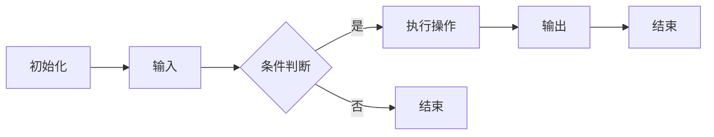
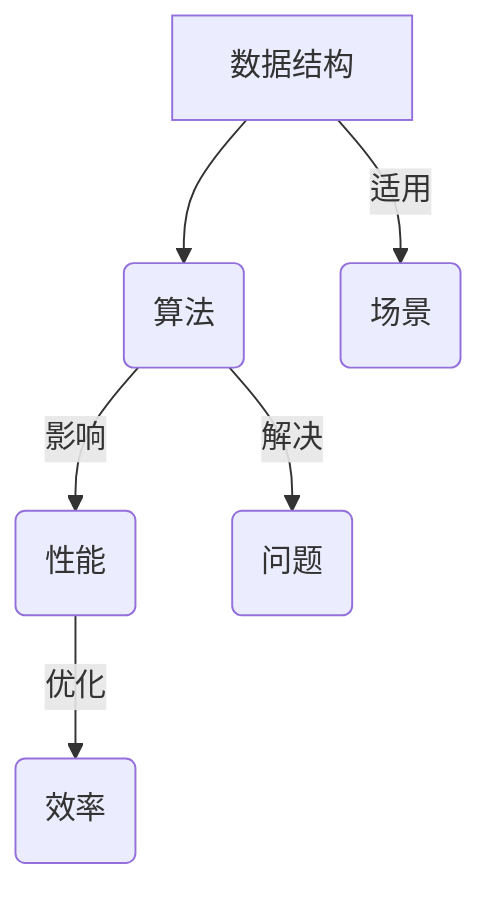
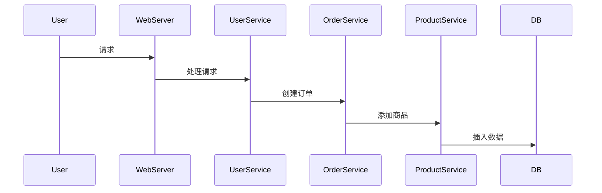
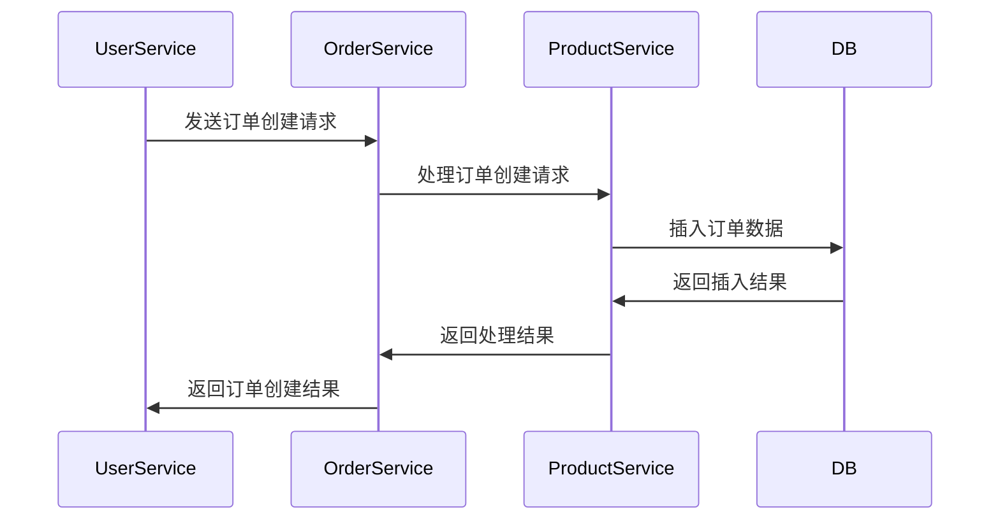

                 

### 数据结构与算法：夯实编程基础

#### 关键词：数据结构、算法、编程基础、性能优化、实战案例

> 摘要：
本文将系统地探讨数据结构与算法在编程中的基础作用。通过对基本概念、常见数据结构、算法设计方法、算法复杂度分析以及排序和查找算法的详细讲解，本文旨在帮助读者夯实编程基础，提高算法思维能力，从而更好地应对实际编程挑战。

---

### 目录大纲

----------------------------------------------------------------

## 数据结构与算法：夯实编程基础

> 关键词：数据结构、算法、编程基础、性能优化、实战案例
>
> 摘要：本文将系统地探讨数据结构与算法在编程中的基础作用。通过对基本概念、常见数据结构、算法设计方法、算法复杂度分析以及排序和查找算法的详细讲解，本文旨在帮助读者夯实编程基础，提高算法思维能力，从而更好地应对实际编程挑战。

### 第一部分：数据结构与算法概述

#### 第1章：数据结构与算法的基本概念

- **1.1 数据结构的基本概念**
  - **概念定义**：什么是数据结构？
  - **类型分类**：数据结构的分类和特点。
  - **应用场景**：数据结构在不同领域中的应用。
  
- **1.2 算法的基本概念**
  - **算法的定义**：算法是什么？
  - **特性分析**：算法的核心特性。
  - **类型分类**：算法的分类和特点。

- **1.3 数据结构与算法的关系**
  - **相互依赖**：数据结构如何影响算法？
  - **优化方向**：如何通过算法优化数据结构？

#### 第2章：常见数据结构

- **2.1 数组和链表**
  - **数组**：定义、特性、操作和应用场景。
  - **链表**：定义、特性、操作和应用场景。
  - **比较与选择**：数组和链表的优缺点与应用场景对比。

- **2.2 栈和队列**
  - **栈**：定义、特性、操作和应用场景。
  - **队列**：定义、特性、操作和应用场景。
  - **扩展应用**：栈和队列在具体应用中的拓展。

- **2.3 树和图**
  - **树**：定义、分类、遍历算法和应用场景。
  - **图**：定义、分类、遍历算法和应用场景。

#### 第3章：算法设计与分析

- **3.1 算法设计的基本方法**
  - **分治策略**：基本概念、应用实例。
  - **贪心策略**：基本概念、应用实例。
  - **动态规划**：基本概念、应用实例。

- **3.2 算法复杂性分析**
  - **时间复杂度**：定义、计算方法、应用实例。
  - **空间复杂度**：定义、计算方法、应用实例。
  - **效率优化**：常见优化方法。

#### 第4章：常用排序算法

- **4.1 插入排序**
  - **直接插入排序**：原理、实现、性能分析。
  - **希尔排序**：原理、实现、性能分析。
  - **归并排序**：原理、实现、性能分析。

- **4.2 选择排序**
  - **简单选择排序**：原理、实现、性能分析。
  - **堆排序**：原理、实现、性能分析。

- **4.3 交换排序**
  - **冒泡排序**：原理、实现、性能分析。
  - **快速排序**：原理、实现、性能分析。

#### 第5章：常用查找算法

- **5.1 顺序查找**
  - **原理和实现**：顺序查找的基本原理和代码实现。
  - **性能分析**：顺序查找的时间复杂度和空间复杂度。

- **5.2 二分查找**
  - **原理和实现**：二分查找的基本原理和代码实现。
  - **性能分析**：二分查找的时间复杂度和空间复杂度。

- **5.3 哈希查找**
  - **原理和实现**：哈希查找的基本原理和代码实现。
  - **性能分析**：哈希查找的时间复杂度和空间复杂度。

#### 第6章：算法应用与实战

- **6.1 算法在编程竞赛中的应用**
  - **案例分析**：编程竞赛中的经典算法题和解决策略。
  - **实战技巧**：提升编程竞赛能力的实战技巧。

- **6.2 数据结构与算法在系统设计中的应用**
  - **案例分析**：系统设计中数据结构与算法的实际应用。
  - **设计思路**：系统设计中的数据结构与算法优化策略。

- **6.3 算法优化实战案例分析**
  - **实例讲解**：具体实例中的算法优化实战分析。
  - **经验总结**：算法优化的经验和技巧总结。

#### 第7章：算法进阶与前沿

- **7.1 贪心算法的深入探讨**
  - **最小生成树算法**：原理、实现和应用。
  - **最短路径算法**：原理、实现和应用。

- **7.2 动态规划的进阶应用**
  - **最长公共子序列**：原理、实现和应用。
  - **最长公共子串**：原理、实现和应用。

- **7.3 前沿算法概述**
  - **机器学习中的算法**：常见算法和原理概述。
  - **深度学习算法简介**：深度学习算法的基本概念和应用。

#### 第8章：总结与展望

- **8.1 数据结构与算法的重要性**
  - **核心作用**：数据结构与算法在编程中的核心作用。
  - **发展历程**：数据结构与算法的发展历程和趋势。

- **8.2 学习数据结构与算法的方法**
  - **学习方法**：学习数据结构与算法的有效方法。
  - **实践应用**：如何将理论知识应用于实际编程。

- **8.3 数据结构与算法的未来发展趋势**
  - **技术前沿**：数据结构与算法的未来发展趋势和挑战。

----------------------------------------------------------------

### 详细内容概述

#### 第1章：数据结构与算法的基本概念

本章首先介绍数据结构的基本概念，包括其定义、分类、特点和应用。接着，详细探讨算法的基本概念，包括其定义、分类、特点和应用。最后，分析数据结构与算法之间的相互关系，以及如何通过算法优化数据结构。

#### 第2章：常见数据结构

本章将深入介绍几种常见的数据结构，包括数组、链表、栈、队列、树和图。对于每种数据结构，将详细描述其定义、特性、操作和应用场景。并通过具体实例，对比不同数据结构的优缺点，帮助读者选择合适的数据结构。

##### 数组和链表

数组是一种基础的数据结构，支持随机访问。链表则是通过节点链接实现数据存储，支持高效的插入和删除操作。本章将详细讨论数组和链表的定义、特性、操作和应用场景，并对比它们的优缺点。

##### 栈和队列

栈和队列都是线性数据结构，但它们的操作规则不同。栈支持后进先出（LIFO）的操作，而队列支持先进先出（FIFO）的操作。本章将介绍栈和队列的定义、特性、操作和应用场景，以及它们在具体应用中的扩展。

##### 树和图

树是一种层次化的数据结构，用于表示有层次关系的数据。图则是一种复杂的结构，用于表示具有多对多关系的数据。本章将详细讨论树和图的定义、分类、遍历算法和应用场景。

#### 第3章：算法设计与分析

本章将介绍算法设计的基本方法，包括分治策略、贪心策略和动态规划。同时，分析算法的复杂性，包括时间复杂度和空间复杂度。最后，讨论算法效率优化的常见方法。

##### 算法设计的基本方法

分治策略是将问题分解为更小的子问题，分别解决后再合并。贪心策略是在每一步选择当前最优解，以期得到全局最优解。动态规划则是通过将问题分解为重叠子问题，并保存子问题的解，以避免重复计算。

##### 算法复杂性分析

算法的复杂性包括时间复杂度和空间复杂度。时间复杂度表示算法执行时间与输入规模的关系，空间复杂度表示算法执行所需内存与输入规模的关系。本章将详细讨论如何计算和分析算法的复杂性。

##### 算法效率优化

算法的效率优化是提高算法性能的关键。本章将介绍常见的优化方法，如数据结构的选择、算法的改进、代码的优化等。

#### 第4章：常用排序算法

本章将介绍几种常用的排序算法，包括插入排序、选择排序、交换排序。每种排序算法都将详细讨论其原理、实现、性能分析。

##### 插入排序

插入排序包括直接插入排序、希尔排序、归并排序。直接插入排序是一种简单直观的排序算法，适用于小规模数据的排序。希尔排序是对插入排序的改进，适用于大规模数据的排序。归并排序是一种高效的排序算法，适用于大规模数据的排序。

##### 选择排序

选择排序包括简单选择排序和堆排序。简单选择排序是一种简单的排序算法，适用于小规模数据的排序。堆排序是一种高效的排序算法，适用于大规模数据的排序。

##### 交换排序

交换排序包括冒泡排序和快速排序。冒泡排序是一种简单的排序算法，适用于小规模数据的排序。快速排序是一种高效的排序算法，适用于大规模数据的排序。

#### 第5章：常用查找算法

本章将介绍几种常用的查找算法，包括顺序查找、二分查找、哈希查找。每种查找算法都将详细讨论其原理、实现、性能分析。

##### 顺序查找

顺序查找是一种简单直观的查找算法，适用于小规模数据的查找。其基本思想是从头到尾遍历数组，依次比较元素和目标值。

##### 二分查找

二分查找是一种高效的查找算法，适用于有序数组的查找。其基本思想是不断将数组分成两部分，根据目标值与中间值的比较，确定目标值所在的部分，再递归或迭代查找。

##### 哈希查找

哈希查找是一种基于哈希表的查找算法，适用于大规模数据的快速查找。其基本思想是使用哈希函数将关键字映射到哈希表中，通过哈希值快速定位到目标元素。

#### 第6章：算法应用与实战

本章将探讨算法在实际编程中的应用，包括编程竞赛中的应用、系统设计中的应用以及算法优化的实战案例分析。

##### 算法在编程竞赛中的应用

编程竞赛是测试程序员算法能力的重要平台。本章将分析一些经典的编程竞赛题目，介绍解题思路和解决策略，帮助读者提升算法竞赛能力。

##### 数据结构与算法在系统设计中的应用

系统设计是软件开发的重要环节。本章将讨论数据结构与算法在系统设计中的应用，包括领域模型设计、系统架构设计、系统接口设计和系统交互。

##### 算法优化实战案例分析

算法优化是提高系统性能的关键。本章将通过具体实例，分析算法优化的实战案例，介绍优化思路和技巧，帮助读者掌握算法优化的方法和经验。

#### 第7章：算法进阶与前沿

本章将介绍一些高级算法和前沿算法，包括贪心算法的深入探讨、动态规划的进阶应用以及机器学习和深度学习算法的概述。

##### 贪心算法的深入探讨

贪心算法是一种重要的算法设计方法，适用于解决最优子结构问题。本章将深入探讨贪心算法的基本原理，介绍最小生成树算法和最短路径算法。

##### 动态规划的进阶应用

动态规划是一种解决最优化问题的有效方法，适用于解决重叠子问题。本章将讨论动态规划在最长公共子序列和最长公共子串等问题的应用。

##### 前沿算法概述

机器学习和深度学习是当前计算机科学的前沿领域。本章将简要介绍机器学习和深度学习算法的基本概念和应用，为读者提供算法发展的新视角。

#### 第8章：总结与展望

本章将对全文内容进行总结，阐述数据结构与算法在编程中的重要性，介绍学习数据结构与算法的方法，并对数据结构与算法的未来发展趋势进行展望。

##### 数据结构与算法的重要性

数据结构与算法是编程的基础，对于提高编程能力和解决实际问题具有重要意义。本章将详细讨论数据结构与算法的核心作用，以及它们在软件开发中的价值。

##### 学习数据结构与算法的方法

学习数据结构与算法需要掌握正确的学习方法。本章将介绍学习数据结构与算法的有效方法，包括理论知识的学习、实践操作的掌握和不断总结反思。

##### 数据结构与算法的未来发展趋势

数据结构与算法是不断发展的领域，随着计算机科学技术的进步，新的算法和理论不断涌现。本章将对数据结构与算法的未来发展趋势进行展望，为读者提供发展方向和思考。

---

以上是本文的详细内容概述，接下来将逐章展开详细内容，帮助读者深入理解和掌握数据结构与算法的相关知识。希望本文能对读者在编程学习过程中有所帮助。让我们开始这一段逻辑清晰、结构紧凑、简单易懂的技术之旅吧！## 第1章：数据结构与算法的基本概念

### 1.1 数据结构的基本概念

数据结构是计算机科学中用于存储、组织和管理数据的工具。它们是编程的基础，直接影响程序的性能和效率。数据结构可以分为线性结构和非线性结构。线性结构包括数组、链表、栈和队列等，而非线性结构则包括树和图等。

#### 概念定义

- **数组**：数组是一种线性数据结构，用于存储一系列相同类型的数据元素。数组的特点是支持随机访问，可以通过下标直接访问任意位置的元素。

- **链表**：链表是一种通过节点链接实现的线性数据结构。每个节点包含数据和指向下一个节点的指针。链表的特点是插入和删除操作高效，但无法直接访问特定位置的元素。

- **栈**：栈是一种后进先出（LIFO）的线性数据结构，用于存储临时数据。栈的操作主要包括压栈和出栈，适用于解决递归问题和深度优先搜索问题。

- **队列**：队列是一种先进先出（FIFO）的线性数据结构，用于存储按顺序排列的数据。队列的操作主要包括入队和出队，适用于解决广度优先搜索问题和同步处理问题。

- **树**：树是一种层次化的非线性数据结构，用于表示具有层次关系的数据。树的特点是支持快速插入、删除和查找操作，适用于解决树形结构和路径问题。

- **图**：图是一种复杂的数据结构，用于表示具有多对多关系的数据。图的特点是支持灵活的遍历和查找操作，适用于解决网络和路径问题。

#### 类型分类

数据结构可以根据不同的属性和特点进行分类。以下是一些常见的分类方式：

- **按存储方式分类**：可以分为顺序存储结构和链式存储结构。顺序存储结构通常使用数组实现，而链式存储结构通常使用链表实现。

- **按逻辑结构分类**：可以分为线性结构和非线性结构。线性结构包括数组、链表、栈和队列等，非线性结构包括树和图等。

- **按应用场景分类**：可以分为通用数据结构和专用数据结构。通用数据结构适用于多种应用场景，如数组、链表和树等。专用数据结构则针对特定应用场景设计，如堆栈用于递归问题，队列用于同步处理问题等。

#### 特点和应用场景

不同数据结构具有不同的特点和适用场景。以下是一些常见数据结构的特点和应用场景：

- **数组**：数组支持随机访问，适用于需要快速查找和访问元素的场景，如数据库索引、缓存管理等。

- **链表**：链表支持高效插入和删除操作，适用于需要频繁修改数据结构且不需要随机访问的场景，如栈和队列的实现、链表排序等。

- **栈**：栈适用于解决递归问题和深度优先搜索问题，如表达式求值、递归算法的实现等。

- **队列**：队列适用于解决广度优先搜索问题和同步处理问题，如消息队列、任务调度等。

- **树**：树适用于解决层次结构和路径问题，如文件系统、决策树等。

- **图**：图适用于解决网络和路径问题，如社交网络、路由算法等。

#### 关键概念与联系

数据结构中的关键概念包括节点、边、层次、路径等。以下是一个简单的ER实体关系图（ER图）和概念属性特征对比表格，用于描述数据结构中的关键概念及其关系。

##### ER实体关系图

```mermaid
erDiagram
    Node ||--|{ Edge }|
    Edge ||--|{ Node }|
```

##### 概念属性特征对比表格

| 概念  | 定义                                               | 属性特征                                           | 举例           |
| ----- | -------------------------------------------------- | -------------------------------------------------- | -------------- |
| 节点  | 数据结构中的基本单元，包含数据和指针               | 数据、指针、类型                                   | 数组中的元素   |
| 边    | 节点之间的连接，表示关系和路径                     | 起点和终点、权重、类型                             | 链表的链接     |
| 层次  | 数据结构的层次关系，表示节点之间的层级关系         | 父节点、子节点、深度                               | 树的层次结构   |
| 路径  | 数据结构中节点之间的连接路径                     | 节点序列、长度、类型                               | 图的路径搜索   |

通过ER图和表格，我们可以清晰地理解数据结构中的关键概念及其关系。这些概念构成了数据结构的基础，是理解更复杂算法和应用的前提。

#### 小结

数据结构是计算机科学中不可或缺的一部分，对于程序的性能和效率有着重要的影响。本章介绍了数据结构的基本概念、分类、特点和应用场景，并给出了关键概念与联系。通过本章的学习，读者可以对数据结构有更深入的理解，为后续章节的学习打下坚实的基础。在接下来的章节中，我们将进一步探讨常见数据结构的实现和应用，帮助读者夯实编程基础。

---

### 1.2 算法的定义、特性及分类

#### 算法的定义

算法是一种解决问题的方法，是一系列有序的步骤，用于解决特定问题。算法可以用于计算机科学中的各种任务，包括数据处理、排序、搜索、图形处理等。算法的核心在于其解决问题的能力和效率。

#### 算法的特性

算法具有以下几种核心特性：

1. **确定性**：算法在相同输入下总是产生相同的输出，具有明确的执行路径。
2. **有效性**：算法能够在有限的时间内完成，即算法是可行的。
3. **有穷性**：算法的执行步骤是有限的，不会陷入无限循环。
4. **输入**：算法可以接收零个或多个输入。
5. **输出**：算法必须有一个或多个输出，用以表示问题的解。

#### 算法的分类

算法可以根据不同的分类标准进行分类。以下是几种常见的分类方式：

1. **按功能分类**：算法可以分为基础算法、排序算法、查找算法、图算法等。
2. **按实现方式分类**：算法可以分为递归算法、迭代算法、贪心算法、动态规划算法等。
3. **按复杂度分类**：算法可以分为低复杂度算法、中等复杂度算法和高复杂度算法。

#### 常见算法类型及其特点

1. **基础算法**：包括排序、查找、插入和删除等基本操作。这类算法是编程中的基石，广泛应用于各种实际问题中。

2. **排序算法**：用于对数据进行排序，常见的排序算法有冒泡排序、选择排序、插入排序、快速排序、归并排序等。每种排序算法都有其特定的实现方式和性能特点。

3. **查找算法**：用于在数据结构中查找特定元素，常见的查找算法有顺序查找、二分查找和哈希查找等。查找算法的效率直接影响到程序的执行速度。

4. **图算法**：用于解决图相关的问题，如最短路径、最小生成树、拓扑排序等。图算法具有复杂的特点，需要深入理解图的基本概念和数据结构。

#### 关键概念与联系

算法中的关键概念包括步骤、条件、循环、递归等。以下是一个简单的算法流程图（mermaid）和概念属性特征对比表格，用于描述算法的基本概念及其关系。

##### 算法流程图



##### 概念属性特征对比表格

| 概念   | 定义                               | 属性特征                                           | 举例           |
| ------ | ---------------------------------- | -------------------------------------------------- | -------------- |
| 步骤   | 算法中的基本操作                  | 操作类型、输入、输出、条件判断                     | 排序中的比较操作 |
| 条件   | 算法中的条件判断部分              | 条件类型、判断逻辑、分支选择                       | 循环条件       |
| 循环   | 算法中的循环结构，用于重复执行某部分代码 | 循环类型、循环条件、循环体                        | 插入排序中的比较与交换 |
| 递归   | 算法中的递归调用，用于解决子问题  | 递归条件、递归体、递归结束条件                    | 快速排序       |

通过算法流程图和表格，我们可以清晰地理解算法的基本概念及其关系。这些概念构成了算法的基础，是理解和实现复杂算法的前提。

#### 小结

算法是解决问题的核心工具，具有确定性、有效性、有穷性和输入输出等特性。算法的分类和类型决定了其在解决不同问题中的应用。通过本章的学习，读者可以了解算法的基本概念、特性及其分类，为后续章节的学习打下坚实的基础。在接下来的章节中，我们将进一步探讨常见数据结构的算法实现和应用，帮助读者深入理解数据结构与算法的关系。

---

### 1.3 数据结构与算法的关系

数据结构和算法在计算机科学中具有密切的联系，两者相辅相成，共同构成了程序设计的基础。理解数据结构与算法的关系，对于编写高效、可维护的代码至关重要。

#### 数据结构对算法的影响

数据结构的选择直接影响算法的性能。不同的数据结构具有不同的时间和空间复杂度，适用于不同的应用场景。

- **数组**：支持随机访问，适用于查找和排序等需要快速访问元素的场景。但数组的大小固定，不适用于动态数据。
- **链表**：支持高效的插入和删除操作，适用于动态数据。但链表的随机访问速度较慢。
- **栈和队列**：适用于解决特定的问题，如递归问题和广度优先搜索问题。它们是特定类型的线性数据结构。
- **树**：适用于表示层次结构和路径问题，如文件系统和搜索算法。树的结构决定了查找和插入操作的效率。
- **图**：适用于表示复杂的关系和网络结构，如社交网络和路由算法。图的算法复杂度较高，需要深入理解图的基本概念。

#### 算法对数据结构的优化

算法不仅可以利用数据结构解决特定问题，还可以通过优化算法来提高数据结构的效率。

- **分治策略**：通过将大问题分解为小问题，递归解决，再合并结果。适用于解决大规模数据问题，如归并排序和快速排序。
- **贪心策略**：在每一步选择当前最优解，以期得到全局最优解。适用于解决最优子结构问题，如最短路径算法和最小生成树算法。
- **动态规划**：通过保存子问题的解，避免重复计算，适用于解决重叠子问题，如最长公共子序列和背包问题。

#### 关系图解

以下是一个简单的Mermaid流程图，用于描述数据结构与算法之间的关系：



- **数据结构（A）**：定义了数据存储和组织的方式，是算法的基础。
- **算法（B）**：利用数据结构解决特定问题，是数据结构的实现形式。
- **性能（C）**：数据结构的选择影响算法的性能，包括时间和空间复杂度。
- **效率（D）**：通过优化算法，提高数据结构的利用效率。
- **适用场景（E）**：数据结构适用于特定的应用场景，如查找、排序和网络。
- **问题解决（F）**：算法用于解决具体问题，如排序、查找和路径规划。

#### 小结

数据结构与算法的关系是紧密相连的，数据结构提供了存储和组织数据的方式，而算法则利用数据结构解决特定问题。通过选择合适的数据结构和优化算法，可以提高程序的效率和性能。理解数据结构与算法之间的关系，对于编写高效、可维护的代码至关重要。在接下来的章节中，我们将进一步探讨常见数据结构的算法实现和应用，帮助读者深入理解数据结构与算法的关系。

---

#### 小结

第1章主要介绍了数据结构与算法的基本概念，包括数据结构的定义、分类、特点和应用，以及算法的定义、特性、分类和特性。通过对基本概念的阐述，读者可以建立起对数据结构与算法的整体认识。数据结构是存储和组织数据的方式，而算法则是解决问题的步骤和方法。两者密切相关，相辅相成。数据结构的选择直接影响算法的性能，而算法的优化可以提升数据结构的效率。理解数据结构与算法的关系，是编程基础的关键。在接下来的章节中，我们将进一步深入探讨常见数据结构的实现和应用，帮助读者夯实编程基础。

---

## 第2章：常见数据结构

常见数据结构是编程中的基础，它们在处理不同类型的数据和解决各种问题时发挥着重要作用。本章将详细介绍几种常见的数据结构，包括数组、链表、栈、队列、树和图。我们将分别讨论这些数据结构的定义、特性、操作和应用场景，帮助读者深入理解并掌握这些数据结构。

### 2.1 数组和链表

#### 数组的定义与特性

数组是一种线性数据结构，用于存储一系列相同类型的数据元素。数组的特点是支持随机访问，可以通过下标直接访问任意位置的元素。数组在内存中连续存储，元素之间通过固定的偏移量进行访问。

- **定义**：数组是一个包含多个相同类型数据元素的集合。
- **特性**：
  - 随机访问：通过下标直接访问元素，访问时间复杂度为 O(1)。
  - 存储连续：数组元素在内存中连续存储，节省内存空间。
  - 大小固定：数组的大小在初始化时确定，不能动态扩展。

#### 数组的操作

数组的操作包括初始化、赋值、访问、插入、删除等。

- **初始化**：创建一个数组，初始化所有元素为默认值（通常是0或null）。
- **赋值**：将一个值赋给数组的某个元素。
- **访问**：通过下标获取数组的某个元素。
- **插入**：在数组中插入一个新的元素，通常需要移动后续元素。
- **删除**：从数组中删除一个元素，通常需要移动后续元素。

#### 数组的应用场景

数组广泛应用于各种场景，如数据库索引、缓存管理、算法排序和查找等。以下是一些具体的应用场景：

- **数据库索引**：使用数组实现哈希表索引，用于快速查找记录。
- **缓存管理**：使用数组实现缓存队列，用于存储最近访问的数据。
- **排序与查找**：使用数组实现各种排序算法和查找算法，如冒泡排序、二分查找等。

#### 链表的定义与特性

链表是一种通过节点链接实现的线性数据结构。每个节点包含数据和指向下一个节点的指针。链表的特点是插入和删除操作高效，但无法直接访问特定位置的元素。

- **定义**：链表是一个由节点组成的链式结构，每个节点包含数据和指向下一个节点的指针。
- **特性**：
  - 动态大小：链表的大小可以动态扩展或缩小。
  - 链式存储：节点在内存中可以分散存储，通过指针链接。
  - 随机访问困难：无法通过下标直接访问元素，访问时间复杂度为 O(n)。

#### 链表的操作

链表的常见操作包括初始化、插入、删除、访问等。

- **初始化**：创建一个链表，初始化头节点和尾节点。
- **插入**：在链表的头部、尾部或指定位置插入新节点。
- **删除**：从链表中删除指定节点。
- **访问**：通过遍历链表访问每个节点。

#### 链表的应用场景

链表适用于需要频繁插入和删除操作的场景，如栈和队列的实现、链表排序、链表查找等。以下是一些具体的应用场景：

- **栈与队列**：链表是栈和队列的实现基础，用于实现后进先出（LIFO）和先进先出（FIFO）的数据结构。
- **链表排序**：链表排序算法如归并排序和链表插入排序，适用于小规模数据的排序。
- **链表查找**：链表查找算法如顺序查找和链表二分查找，适用于动态数据结构的查找。

#### 数组与链表的比较与应用场景

数组和链表各有优缺点，适用于不同的应用场景。

- **数组**：
  - 优点：支持随机访问，访问速度快，存储连续，适用于查找和排序等操作。
  - 缺点：大小固定，不适用于动态数据，插入和删除操作需要移动后续元素。
  - 应用场景：数据库索引、缓存管理、排序与查找。

- **链表**：
  - 优点：动态大小，插入和删除操作高效，适用于动态数据结构。
  - 缺点：随机访问困难，访问速度慢，存储不连续。
  - 应用场景：栈与队列的实现、链表排序、链表查找。

通过比较数组与链表的特点和应用场景，读者可以更好地选择合适的数据结构来解决问题。在编程实践中，灵活运用数组和链表，可以编写出高效、可维护的代码。

### 2.2 栈和队列

#### 栈的定义与操作

栈是一种后进先出（LIFO）的线性数据结构，用于存储临时数据。栈的操作主要包括压栈（push）、出栈（pop）和查看栈顶元素（peek）。

- **定义**：栈是一个只能在一端进行插入和删除操作的线性数据结构。
- **特性**：
  - 后进先出：最后进入栈的元素最先出栈。
  - 只能在一端操作：栈顶是唯一的操作点。

#### 栈的操作

栈的操作包括初始化、压栈、出栈和查看栈顶元素。

- **初始化**：创建一个空栈。
- **压栈（push）**：将新元素添加到栈顶。
- **出栈（pop）**：删除栈顶元素。
- **查看栈顶元素（peek）**：获取栈顶元素的值，不删除栈顶元素。

#### 栈的应用场景

栈适用于解决递归问题和深度优先搜索问题，如表达式求值、递归算法的实现等。以下是一些具体的应用场景：

- **递归算法**：递归算法通常使用栈来存储递归调用的中间结果。
- **表达式求值**：使用栈实现逆波兰表达式求值和中缀表达式求值。

#### 队列的定义与操作

队列是一种先进先出（FIFO）的线性数据结构，用于存储按顺序排列的数据。队列的操作主要包括入队（enqueue）、出队（dequeue）和查看队头元素（peek）。

- **定义**：队列是一个只能在一端进行插入操作，在另一端进行删除操作的线性数据结构。
- **特性**：
  - 先进先出：最早进入队列的元素最先出队列。
  - 两端操作：队头是插入操作点，队尾是删除操作点。

#### 队列的操作

队列的操作包括初始化、入队、出队和查看队头元素。

- **初始化**：创建一个空队列。
- **入队（enqueue）**：将新元素添加到队列尾部。
- **出队（dequeue）**：删除队列头部元素。
- **查看队头元素（peek）**：获取队列头部元素的值，不删除队列头部元素。

#### 队列的应用场景

队列适用于解决广度优先搜索问题和同步处理问题，如消息队列、任务调度等。以下是一些具体的应用场景：

- **广度优先搜索**：使用队列实现广度优先搜索，适用于求解最短路径问题和图遍历。
- **消息队列**：使用队列实现消息队列，用于异步处理消息和任务调度。

#### 栈和队列的扩展应用

栈和队列可以应用于更广泛的场景，通过扩展其功能，可以解决更多复杂的问题。

- **双端队列**：双端队列（deque）是一种同时支持在两端进行插入和删除操作的数据结构，适用于需要频繁在两端进行操作的场景。
- **循环队列**：循环队列是一种在数组中实现的队列，通过循环利用数组的存储空间，适用于需要动态扩展的数据队列。

通过本章对栈和队列的详细介绍，读者可以深入理解这两种数据结构的定义、特性、操作和应用场景。在实际编程中，灵活运用栈和队列，可以解决各种复杂的问题，提高程序的性能和可维护性。

### 2.3 树和图

#### 树的定义与分类

树是一种层次化的非线性数据结构，用于表示具有层次关系的数据。树由节点组成，每个节点可以有零个或多个子节点。树具有明显的层次结构，适用于表示组织结构、分类关系等。

- **定义**：树是一种由节点组成的集合，满足以下条件：
  - 有且仅有一个根节点。
  - 每个节点最多有一个父节点。
  - 没有形成环。

- **分类**：
  - **二叉树**：每个节点最多有两个子节点的树。
  - **二叉搜索树（BST）**：每个节点的左子节点值小于父节点值，右子节点值大于父节点值。
  - **平衡二叉树**：树的高度差不超过1的二叉搜索树。
  - **堆**：特殊的完全二叉树，满足堆属性。
  - **多叉树**：每个节点可以有多个子节点的树。

#### 树的基本操作

树的基本操作包括节点的插入、删除、查找和遍历。

- **插入**：在树中插入一个新节点，通常需要遍历树找到合适的位置。
- **删除**：从树中删除一个节点，可能需要调整树的结构以保持平衡。
- **查找**：在树中查找特定节点，可以使用递归或迭代方法。
- **遍历**：遍历树中的所有节点，常见的遍历方法有先序遍历、中序遍历和后序遍历。

#### 图的定义与分类

图是一种复杂的数据结构，用于表示具有多对多关系的数据。图由节点（也称为顶点）和边组成，节点之间可以有任意数量的边连接。图具有丰富的结构和性质，适用于表示网络、路径等。

- **定义**：图是由节点和边组成的集合，满足以下条件：
  - 每个节点都是独立的，没有父节点。
  - 边可以是有向的（单向箭头）或无向的（无箭头）。

- **分类**：
  - **有向图**：边具有方向，从一个节点指向另一个节点。
  - **无向图**：边没有方向，表示两个节点之间的双向关系。
  - **连通图**：任意两个节点之间都有路径相连。
  - **连通分量**：图中所有连通节点的集合。
  - **加权图**：边具有权重，表示节点之间的距离或代价。

#### 图的基本操作

图的基本操作包括节点的插入、删除、查找和遍历。

- **插入**：在图中插入一个新节点，通常需要连接到其他节点。
- **删除**：从图中删除一个节点，可能需要删除与之相连的所有边。
- **查找**：在图中查找特定节点，可以使用遍历算法。
- **遍历**：遍历图中的所有节点，常见的遍历方法有深度优先搜索（DFS）和广度优先搜索（BFS）。

#### 树和图的遍历算法

遍历算法用于访问树和图中的所有节点。常见的遍历算法包括深度优先搜索（DFS）和广度优先搜索（BFS）。

- **深度优先搜索（DFS）**：从根节点开始，沿一个分支一直深入到底，再回溯到上一个节点，继续深入下一个分支。DFS适用于解决路径问题和连通性问题。
- **广度优先搜索（BFS）**：从根节点开始，依次访问所有相邻节点，再访问下一层节点。BFS适用于求解最短路径问题和图遍历。

#### 树和图的应用场景

树和图在计算机科学中具有广泛的应用，用于解决各种复杂的问题。

- **树**：
  - 文件系统：用于表示文件和目录的层次结构。
  - 组织结构：用于表示公司或团队的层级关系。
  - 排序：二叉搜索树和平衡二叉树用于高效的排序和查找。
  - 最优子结构：用于解决最短路径和最小生成树问题。

- **图**：
  - 网络拓扑：用于表示网络节点和边的关系。
  - 路径规划：用于求解最短路径问题和路由算法。
  - 社交网络：用于表示人与人之间的社交关系。
  - 流程控制：用于表示程序中的控制流和数据流。

通过本章对树和图的介绍，读者可以深入理解这两种数据结构的基本概念、分类、操作和应用场景。在实际编程中，灵活运用树和图，可以解决各种复杂的问题，提高程序的性能和可维护性。

### 小结

本章详细介绍了常见的数据结构，包括数组、链表、栈、队列、树和图。通过讨论这些数据结构的定义、特性、操作和应用场景，读者可以深入理解并掌握这些数据结构的核心概念。每种数据结构都有其独特的特点和适用场景，通过灵活运用，可以解决各种复杂的编程问题。在实际编程中，根据问题的需求选择合适的数据结构，并运用相应的算法，可以编写出高效、可维护的代码。在接下来的章节中，我们将进一步探讨算法的设计和分析方法，帮助读者提高编程能力和解决实际问题的能力。

---

## 第3章：算法设计与分析

算法设计是计算机科学中的重要环节，涉及到如何有效地解决问题。本章将介绍算法设计的基本方法，包括分治策略、贪心策略和动态规划。同时，我们将分析算法的复杂性，包括时间复杂度和空间复杂度，以及如何优化算法效率。

### 3.1 算法设计的基本方法

#### 分治策略

分治策略是将一个大问题分解为若干个规模较小的子问题，分别解决后再合并子问题的解。分治策略的核心思想是递归地分解问题，直到子问题足够小，可以直接求解。

- **基本步骤**：
  1. **分解**：将原问题分解为若干个子问题。
  2. **递归解决**：递归地解决子问题。
  3. **合并**：合并子问题的解，得到原问题的解。

- **应用实例**：
  - **归并排序**：将数组分成两个子数组，分别排序后合并。
  - **二分查找**：将数组分成两个子数组，比较中间元素和目标值，递归地在子数组中查找。

#### 贪心策略

贪心策略是在每一步选择当前最优解，以期得到全局最优解。贪心策略的核心思想是每次决策都选择最优解，尽管局部最优解可能导致全局最优解。

- **基本步骤**：
  1. **初始化**：初始化问题的状态。
  2. **选择**：在当前状态下选择最优解。
  3. **更新**：更新问题的状态。
  4. **终止条件**：满足终止条件，输出最终解。

- **应用实例**：
  - **背包问题**：选择价值最大的物品放入背包。
  - **最小生成树算法**：每次选择权重最小的边加入生成树。

#### 动态规划

动态规划是将问题分解为重叠子问题，并保存子问题的解，以避免重复计算。动态规划的核心思想是递推地解决子问题，利用已解决的子问题的解来求解更大的问题。

- **基本步骤**：
  1. **定义状态**：定义问题的状态和状态转移方程。
  2. **初始化**：初始化基础状态。
  3. **状态转移**：根据状态转移方程，递推地计算状态。
  4. **求解**：利用已计算的状态，求解最终状态。

- **应用实例**：
  - **最长公共子序列**：计算两个序列的最长公共子序列。
  - **背包问题**：计算每种物品的最大价值组合。

### 3.2 算法复杂性分析

算法复杂性分析是评估算法性能的重要方法，包括时间复杂度和空间复杂度。

#### 时间复杂度分析

时间复杂度表示算法执行时间与输入规模的关系，通常用大O符号表示。时间复杂度越高，算法的执行时间越长。

- **基本概念**：
  - **大O符号**：表示算法的渐近时间复杂度。
  - **渐进增长率**：表示算法执行时间随输入规模的增长速度。

- **计算方法**：
  1. **计数方法**：统计算法中基本操作的执行次数。
  2. **递归关系**：使用递归关系式计算算法的时间复杂度。

- **应用实例**：
  - **归并排序**：时间复杂度为 O(nlogn)。
  - **二分查找**：时间复杂度为 O(logn)。

#### 空间复杂度分析

空间复杂度表示算法执行所需内存与输入规模的关系，也用大O符号表示。空间复杂度越高，算法的内存消耗越大。

- **基本概念**：
  - **大O符号**：表示算法的渐近空间复杂度。
  - **渐进增长率**：表示算法所需内存随输入规模的增长速度。

- **计算方法**：
  1. **计数方法**：统计算法中使用的变量和结构所占用的内存。
  2. **递归关系**：使用递归关系式计算算法的空间复杂度。

- **应用实例**：
  - **归并排序**：空间复杂度为 O(n)。
  - **深度优先搜索**：空间复杂度为 O(n)。

#### 算法效率优化

优化算法效率是提高程序性能的关键。以下是一些常见的优化方法：

- **算法改进**：改进算法的基本结构，提高算法的效率。
- **数据结构选择**：选择合适的数据结构，提高算法的执行速度。
- **并行计算**：利用多核处理器，并行执行算法。
- **缓存优化**：优化数据访问模式，减少缓存 misses。

### 小结

本章介绍了算法设计的基本方法，包括分治策略、贪心策略和动态规划。同时，分析了算法的复杂性，包括时间复杂度和空间复杂度，以及如何优化算法效率。通过本章的学习，读者可以掌握算法设计的基本方法和优化技巧，提高编程能力和解决实际问题的能力。在实际编程中，灵活运用这些方法，可以编写出高效、可维护的代码。

---

## 第4章：常用排序算法

排序算法是计算机科学中的一种基本算法，用于对数据进行排序。本章将详细介绍几种常用的排序算法，包括插入排序、选择排序和交换排序。每种排序算法都有其独特的原理、实现和性能分析，读者可以通过学习这些算法，掌握排序算法的基本概念和应用。

### 4.1 插入排序

插入排序是一种简单直观的排序算法，通过逐步将数据元素插入到已排序序列中，直到整个序列有序。插入排序包括直接插入排序、希尔排序和归并排序。

#### 4.1.1 直接插入排序

直接插入排序的基本思想是将数组中的一个元素插入到已经排序的序列中，直到整个序列有序。

- **原理**：从第二个元素开始，依次与前面的元素进行比较，将其插入到合适的位置。

- **实现**：

```python
def insert_sort(arr):
    for i in range(1, len(arr)):
        key = arr[i]
        j = i - 1
        while j >= 0 and arr[j] > key:
            arr[j + 1] = arr[j]
            j -= 1
        arr[j + 1] = key
    return arr

# 示例
arr = [5, 2, 9, 1, 5, 6]
sorted_arr = insert_sort(arr)
print(sorted_arr)
```

- **性能分析**：直接插入排序的时间复杂度为 O(n^2)，空间复杂度为 O(1)。

#### 4.1.2 希尔排序

希尔排序是插入排序的改进，通过将待排序的数组分割成若干子数组进行排序，从而提高排序效率。

- **原理**：选择一个增量序列，将数组分割成若干子数组，分别进行插入排序。

- **实现**：

```python
def shell_sort(arr):
    n = len(arr)
    gap = n // 2
    while gap > 0:
        for i in range(gap, n):
            key = arr[i]
            j = i - gap
            while j >= 0 and arr[j] > key:
                arr[j + gap] = arr[j]
                j -= gap
            arr[j + gap] = key
        gap //= 2
    return arr

# 示例
arr = [5, 2, 9, 1, 5, 6]
sorted_arr = shell_sort(arr)
print(sorted_arr)
```

- **性能分析**：希尔排序的时间复杂度一般在 O(nlogn) 到 O(n^2) 之间，空间复杂度为 O(1)。

#### 4.1.3 归并排序

归并排序是一种高效的排序算法，采用分治策略，将数组分解为子数组，分别排序后合并。

- **原理**：将数组分解为两个子数组，分别排序，再将两个有序子数组合并为一个有序数组。

- **实现**：

```python
def merge_sort(arr):
    if len(arr) <= 1:
        return arr
    mid = len(arr) // 2
    left = merge_sort(arr[:mid])
    right = merge_sort(arr[mid:])
    return merge(left, right)

def merge(left, right):
    result = []
    i = j = 0
    while i < len(left) and j < len(right):
        if left[i] < right[j]:
            result.append(left[i])
            i += 1
        else:
            result.append(right[j])
            j += 1
    result.extend(left[i:])
    result.extend(right[j:])
    return result

# 示例
arr = [5, 2, 9, 1, 5, 6]
sorted_arr = merge_sort(arr)
print(sorted_arr)
```

- **性能分析**：归并排序的时间复杂度为 O(nlogn)，空间复杂度为 O(n)。

### 4.2 选择排序

选择排序是一种简单的排序算法，通过反复选择最小（或最大）元素放到已排序序列的末尾。

#### 4.2.1 简单选择排序

简单选择排序的基本思想是遍历数组，每次选择最小元素放到未排序序列的起始位置。

- **原理**：遍历数组，在未排序序列中选择最小元素，将其放到已排序序列的末尾。

- **实现**：

```python
def selection_sort(arr):
    for i in range(len(arr)):
        min_idx = i
        for j in range(i + 1, len(arr)):
            if arr[j] < arr[min_idx]:
                min_idx = j
        arr[i], arr[min_idx] = arr[min_idx], arr[i]
    return arr

# 示例
arr = [5, 2, 9, 1, 5, 6]
sorted_arr = selection_sort(arr)
print(sorted_arr)
```

- **性能分析**：简单选择排序的时间复杂度为 O(n^2)，空间复杂度为 O(1)。

#### 4.2.2 堆排序

堆排序是一种利用堆这种数据结构的排序算法，通过构建最大堆或最小堆，实现数据的排序。

- **原理**：构建最大堆，将堆顶元素（最大值）放到已排序序列的末尾，再将剩余元素重新构建最大堆，重复此过程。

- **实现**：

```python
def heapify(arr, n, i):
    largest = i
    left = 2 * i + 1
    right = 2 * i + 2
  
    if left < n and arr[left] > arr[largest]:
        largest = left
  
    if right < n and arr[right] > arr[largest]:
        largest = right
  
    if largest != i:
        arr[i], arr[largest] = arr[largest], arr[i]
        heapify(arr, n, largest)

def heap_sort(arr):
    n = len(arr)
  
    for i in range(n // 2 - 1, -1, -1):
        heapify(arr, n, i)
  
    for i in range(n - 1, 0, -1):
        arr[i], arr[0] = arr[0], arr[i]
        heapify(arr, i, 0)
    return arr

# 示例
arr = [5, 2, 9, 1, 5, 6]
sorted_arr = heap_sort(arr)
print(sorted_arr)
```

- **性能分析**：堆排序的时间复杂度为 O(nlogn)，空间复杂度为 O(1)。

### 4.3 交换排序

交换排序是一种通过交换元素来实现的排序算法，包括冒泡排序和快速排序。

#### 4.3.1 冒泡排序

冒泡排序是一种简单的排序算法，通过反复交换相邻元素，将最大元素逐渐移动到数组的末尾。

- **原理**：遍历数组，比较相邻元素，如果逆序则交换，直到整个数组有序。

- **实现**：

```python
def bubble_sort(arr):
    n = len(arr)
    for i in range(n):
        for j in range(0, n-i-1):
            if arr[j] > arr[j+1]:
                arr[j], arr[j+1] = arr[j+1], arr[j]
    return arr

# 示例
arr = [5, 2, 9, 1, 5, 6]
sorted_arr = bubble_sort(arr)
print(sorted_arr)
```

- **性能分析**：冒泡排序的时间复杂度为 O(n^2)，空间复杂度为 O(1)。

#### 4.3.2 快速排序

快速排序是一种高效的排序算法，采用分治策略，将数组分解为子数组，分别排序后合并。

- **原理**：选择一个基准元素，将数组分为两部分，小于基准的元素放在左侧，大于基准的元素放在右侧，递归地对左右两部分进行排序。

- **实现**：

```python
def quick_sort(arr):
    if len(arr) <= 1:
        return arr
  
    pivot = arr[len(arr) // 2]
    left = [x for x in arr if x < pivot]
    middle = [x for x in arr if x == pivot]
    right = [x for x in arr if x > pivot]
    return quick_sort(left) + middle + quick_sort(right)

# 示例
arr = [5, 2, 9, 1, 5, 6]
sorted_arr = quick_sort(arr)
print(sorted_arr)
```

- **性能分析**：快速排序的平均时间复杂度为 O(nlogn)，最坏情况为 O(n^2)，空间复杂度为 O(logn)。

### 小结

本章介绍了常用的排序算法，包括插入排序、选择排序和交换排序。每种排序算法都有其独特的原理和实现，适用于不同的场景。通过学习这些算法，读者可以掌握排序算法的基本概念和应用。在实际编程中，根据问题的需求和数据规模，选择合适的排序算法，可以提高程序的效率和性能。

---

## 第5章：常用查找算法

查找算法是计算机科学中用于在数据结构中查找特定元素的一类算法。本章将详细介绍几种常用的查找算法，包括顺序查找、二分查找和哈希查找。我们将分别讨论这些查找算法的原理、实现、性能分析，以及它们在不同场景下的适用性。

### 5.1 顺序查找

顺序查找是一种简单直观的查找算法，通过从数据结构的第一个元素开始，逐个比较，直到找到目标元素或到达数据结构的末尾。

#### 5.1.1 原理和实现

- **原理**：顺序查找的基本思想是从数据结构的第一个元素开始，逐个比较，直到找到目标元素或到达数据结构的末尾。

- **实现**：

```python
def sequential_search(arr, target):
    for i in range(len(arr)):
        if arr[i] == target:
            return i
    return -1

# 示例
arr = [5, 2, 9, 1, 5, 6]
target = 9
index = sequential_search(arr, target)
print(index)
```

- **性能分析**：顺序查找的时间复杂度为 O(n)，其中 n 为数据结构的长度。空间复杂度为 O(1)。

#### 5.1.2 适用场景

顺序查找适用于数据规模较小且不经常查找的场景。由于顺序查找的时间复杂度为 O(n)，当数据规模较大时，其效率会显著降低。因此，顺序查找通常用于数据量较小或查找操作较少的场景，如小型数据库的查找或查找操作不频繁的列表。

### 5.2 二分查找

二分查找是一种高效的查找算法，适用于有序数据结构。二分查找的基本思想是逐步缩小查找范围，每次将查找范围缩小一半，直到找到目标元素或确定目标元素不存在。

#### 5.2.1 原理和实现

- **原理**：二分查找的基本思想是将数据结构分为左右两部分，比较中间元素与目标元素的大小，根据比较结果缩小查找范围。

- **实现**：

```python
def binary_search(arr, target):
    left, right = 0, len(arr) - 1
    while left <= right:
        mid = (left + right) // 2
        if arr[mid] == target:
            return mid
        elif arr[mid] < target:
            left = mid + 1
        else:
            right = mid - 1
    return -1

# 示例
arr = [1, 2, 3, 4, 5, 6, 9]
target = 9
index = binary_search(arr, target)
print(index)
```

- **性能分析**：二分查找的时间复杂度为 O(logn)，其中 n 为数据结构的长度。空间复杂度为 O(1)。

#### 5.2.2 适用场景

二分查找适用于数据规模较大且有序的数据结构。由于二分查找的时间复杂度为 O(logn)，当数据规模较大时，其效率远高于顺序查找。因此，二分查找通常用于大型数据库、排序数组或需要频繁查找的操作。

### 5.3 哈希查找

哈希查找是一种基于哈希表的查找算法，通过哈希函数将关键字映射到哈希表中，通过哈希值快速定位到目标元素。哈希查找具有平均时间复杂度为 O(1) 的特点，但在最坏情况下可能退化到 O(n)。

#### 5.3.1 原理和实现

- **原理**：哈希查找的基本思想是使用哈希函数将关键字映射到哈希表中，通过哈希值快速定位到目标元素。哈希查找的关键在于哈希函数的设计和哈希表的冲突解决。

- **实现**：

```python
class HashTable:
    def __init__(self):
        self.size = 10
        self.table = [None] * self.size

    def hash_function(self, key):
        return key % self.size

    def insert(self, key):
        index = self.hash_function(key)
        if self.table[index] is None:
            self.table[index] = key
        else:
            # 冲突解决策略：开放地址法
            while self.table[index] is not None and self.table[index] != key:
                index = (index + 1) % self.size
            self.table[index] = key

    def search(self, key):
        index = self.hash_function(key)
        if self.table[index] is None:
            return -1
        else:
            return index

# 示例
hash_table = HashTable()
hash_table.insert(9)
hash_table.insert(2)
hash_table.insert(5)
print(hash_table.search(9))  # 输出：0
print(hash_table.search(2))  # 输出：1
print(hash_table.search(5))  # 输出：3
```

- **性能分析**：哈希查找的平均时间复杂度为 O(1)，但在最坏情况下可能退化到 O(n)。空间复杂度为 O(n)。

#### 5.3.2 适用场景

哈希查找适用于需要快速查找的操作，如数据库索引、缓存管理或关键字查找。哈希查找具有高效的查找速度，但在哈希表冲突较多时，性能会下降。因此，在设计哈希表时，需要合理选择哈希函数和冲突解决策略，以优化查找效率。

### 小结

本章介绍了三种常用的查找算法，包括顺序查找、二分查找和哈希查找。每种查找算法都有其独特的原理、实现和性能分析，适用于不同的场景。通过学习这些算法，读者可以掌握查找算法的基本概念和应用。在实际编程中，根据问题的需求和数据结构的特点，选择合适的查找算法，可以提高程序的效率和性能。

---

## 第6章：算法应用与实战

算法在编程中的应用是编程能力的体现，通过对具体问题的分析、算法的设计和实现，可以提高编程效率和代码质量。本章将介绍算法在实际编程中的应用，包括编程竞赛中的应用、系统设计中的应用以及算法优化的实战案例分析。通过这些实战案例，读者可以更好地理解算法的实际应用场景和解决策略。

### 6.1 算法在编程竞赛中的应用

编程竞赛是测试程序员算法能力和编程技巧的重要平台。在编程竞赛中，常见的算法问题包括排序、查找、图论和动态规划等。以下是一些经典的编程竞赛题目及解决策略。

#### 经典题目：迷宫问题

**问题描述**：给定一个迷宫，从起点出发，找到到达终点的路径。迷宫由一个二维数组表示，其中1表示可走的路径，0表示障碍。

**解决策略**：可以使用广度优先搜索（BFS）算法找到最短路径。首先将起点加入队列，然后逐层遍历迷宫，直到找到终点。

**代码实现**：

```python
from collections import deque

def maze_solver(maze, start, end):
    rows, cols = len(maze), len(maze[0])
    visited = [[False] * cols for _ in range(rows)]
    queue = deque([start])
    visited[start[0]][start[1]] = True

    while queue:
        current = queue.popleft()
        if current == end:
            return True

        for dx, dy in [(-1, 0), (1, 0), (0, -1), (0, 1)]:
            next_pos = (current[0] + dx, current[1] + dy)
            if 0 <= next_pos[0] < rows and 0 <= next_pos[1] < cols and not visited[next_pos[0]][next_pos[1]] and maze[next_pos[0]][next_pos[1]] == 1:
                queue.append(next_pos)
                visited[next_pos[0]][next_pos[1]] = True

    return False

# 示例
maze = [
    [1, 1, 1, 1, 1],
    [1, 0, 0, 0, 1],
    [1, 1, 1, 0, 1],
    [1, 0, 1, 0, 1],
    [1, 1, 1, 1, 1]
]
start = (0, 0)
end = (4, 4)
print(maze_solver(maze, start, end))  # 输出：True
```

#### 经典题目：最长公共子序列

**问题描述**：给定两个字符串，求它们的最长公共子序列。

**解决策略**：可以使用动态规划算法求解。定义一个二维数组 dp，其中 dp[i][j] 表示字符串 s1 的前 i 个字符和字符串 s2 的前 j 个字符的最长公共子序列的长度。

**代码实现**：

```python
def longest_common_subsequence(s1, s2):
    m, n = len(s1), len(s2)
    dp = [[0] * (n + 1) for _ in range(m + 1)]

    for i in range(1, m + 1):
        for j in range(1, n + 1):
            if s1[i - 1] == s2[j - 1]:
                dp[i][j] = dp[i - 1][j - 1] + 1
            else:
                dp[i][j] = max(dp[i - 1][j], dp[i][j - 1])

    return dp[m][n]

# 示例
s1 = "ABCD"
s2 = "ACDF"
print(longest_common_subsequence(s1, s2))  # 输出：2
```

### 6.2 数据结构与算法在系统设计中的应用

系统设计是软件开发的重要环节，合理选择数据结构和算法对于系统性能和可维护性具有重要意义。以下将介绍数据结构与算法在系统设计中的应用，包括领域模型设计、系统架构设计、系统接口设计和系统交互。

#### 领域模型设计

领域模型设计是系统设计的基础，用于描述系统的核心业务领域。领域模型通常使用类图表示，包括实体类、关系类和行为类。

- **实体类**：表示系统中的核心实体，如用户、订单、商品等。
- **关系类**：表示实体类之间的关系，如一对多、多对多等。
- **行为类**：表示实体类的方法和属性。

以下是一个简单的领域模型类图示例：

```mermaid
classDiagram
    User <<entity>>
    Order <<entity>>
    Product <<entity>>

    User : +id
    User : +name
    User : +email

    Order : +id
    Order : +user_id
    Order : +status

    Product : +id
    Product : +name
    Product : +price

    User : -orders
    Order : -user
    Product : -orders
```

#### 系统架构设计

系统架构设计是系统设计的关键，用于确定系统的整体结构和技术选型。常见的系统架构包括分层架构、微服务架构和事件驱动架构。

- **分层架构**：将系统分为表示层、业务逻辑层和数据访问层，实现职责分离，提高系统可维护性。
- **微服务架构**：将系统拆分为多个独立的微服务，每个微服务负责一个特定的业务功能，提高系统的灵活性和可扩展性。
- **事件驱动架构**：通过事件驱动的方式，实现系统模块之间的解耦，提高系统的响应速度和可扩展性。

以下是一个简单的系统架构图示例：



#### 系统接口设计

系统接口设计是系统设计与外部系统交互的关键，包括API设计、协议选择和数据格式等。

- **API设计**：定义系统的API接口，包括接口名称、路径、请求参数和返回值。
- **协议选择**：选择合适的网络协议，如HTTP、HTTPS、WebSocket等。
- **数据格式**：选择合适的数据格式，如JSON、XML、Protobuf等。

以下是一个简单的API接口设计示例：

```json
GET /users/{id}
Params:
    id: 用户ID
Response:
    {
        "id": 1,
        "name": "Alice",
        "email": "alice@example.com"
    }
```

#### 系统交互

系统交互是系统设计中的重要环节，用于确定系统内部模块之间的通信和数据交换方式。

- **同步通信**：模块之间通过同步方式通信，一个模块在等待另一个模块返回结果后才能继续执行。
- **异步通信**：模块之间通过异步方式通信，一个模块在发送请求后无需等待结果，可以继续执行其他任务。
- **消息队列**：使用消息队列实现异步通信，模块通过发送和接收消息进行数据交换。

以下是一个简单的系统交互序列图示例：



### 6.3 算法优化实战案例分析

算法优化是提高系统性能的关键，通过对算法的改进和数据结构的优化，可以提高程序的运行效率。

#### 实战案例：优化排序算法

假设有一个需要对大量数据进行排序的应用场景，原使用直接插入排序算法，但随着数据规模的增加，排序时间过长，需要进行优化。

**优化思路**：

1. **选择合适的数据结构**：由于直接插入排序的时间复杂度为 O(n^2)，适用于小规模数据，对于大规模数据，可以考虑使用更高效的排序算法，如归并排序或快速排序。

2. **改进算法实现**：在实现直接插入排序时，可以采用二路归并插入排序，将大数组分解为多个小数组，分别排序后再合并，提高排序效率。

**优化后的代码实现**：

```python
def merge_sort(arr):
    if len(arr) <= 1:
        return arr

    mid = len(arr) // 2
    left = merge_sort(arr[:mid])
    right = merge_sort(arr[mid:])

    return merge(left, right)

def merge(left, right):
    result = []
    i = j = 0

    while i < len(left) and j < len(right):
        if left[i] < right[j]:
            result.append(left[i])
            i += 1
        else:
            result.append(right[j])
            j += 1

    result.extend(left[i:])
    result.extend(right[j:])
    return result

# 示例
arr = [5, 2, 9, 1, 5, 6]
sorted_arr = merge_sort(arr)
print(sorted_arr)
```

**性能分析**：优化后的归并排序算法的时间复杂度为 O(nlogn)，相比直接插入排序的 O(n^2)，效率显著提高。

### 小结

本章介绍了算法在实际编程中的应用，包括编程竞赛中的应用、系统设计中的应用以及算法优化的实战案例分析。通过学习这些实战案例，读者可以更好地理解算法的实际应用场景和解决策略，提高编程能力和系统设计水平。在实际开发中，灵活运用算法和数据结构，可以有效提高系统的性能和可维护性。

---

## 第7章：算法进阶与前沿

在计算机科学领域，算法的进阶与前沿研究不断推动技术的进步。本章将深入探讨贪心算法的深入探讨、动态规划的进阶应用以及机器学习和深度学习算法的概述，为读者提供算法领域的最新发展和研究动态。

### 7.1 贪心算法的深入探讨

贪心算法是一种简单而高效的算法设计策略，通过在每个步骤选择当前最优解，以期获得全局最优解。贪心算法的核心思想是局部最优解可能导致全局最优解，适用于解决最优子结构问题。

#### 7.1.1 最小生成树算法

最小生成树算法是一种用于构造无向图的最小生成树的算法。常见的最小生成树算法包括普里姆算法和克鲁斯卡尔算法。

- **普里姆算法**：从某个节点开始，逐步增加新节点和边，直到构成最小生成树。普里姆算法使用一个优先队列来选择最小权重的边。

- **克鲁斯卡尔算法**：从所有边开始，逐步选择最小权重的边加入生成树，同时使用并查集来避免构成环。

以下是一个简单的普里姆算法实现：

```python
import heapq

def prim Algorithm(G, start):
    n = len(G)
    mst = []
    key = [float('inf')] * n
    key[start] = 0
    in_mst = [False] * n
    priority_queue = [(0, start)]

    while priority_queue:
        _, u = heapq.heappop(priority_queue)
        in_mst[u] = True

        for v, weight in G[u].items():
            if not in_mst[v] and key[v] > weight:
                key[v] = weight
                heapq.heappush(priority_queue, (key[v], v))

        if all(in_mst):
            break

    for u, v in mst:
        print(u, v)

# 示例
G = {
    0: {1: 4, 7: 8},
    1: {0: 4, 2: 8, 7: 11},
    2: {1: 8, 3: 7, 8: 2},
    3: {2: 7, 4: 9, 5: 14},
    4: {3: 9, 5: 10},
    5: {3: 14, 4: 10, 6: 20},
    6: {5: 20},
    7: {0: 8, 1: 11, 8: 7}
}
prim Algorithm(G, 0)
```

#### 7.1.2 最短路径算法

最短路径算法是一种用于计算图中两点之间最短路径的算法。常见最短路径算法包括迪杰斯特拉算法和贝尔曼-福特算法。

- **迪杰斯特拉算法**：适用于权值非负的图，通过逐步增加新节点和边，计算从源点到其他节点的最短路径。

- **贝尔曼-福特算法**：适用于权值非负和负的图，通过逐步放松边，计算从源点到其他节点的最短路径。

以下是一个简单的迪杰斯特拉算法实现：

```python
def dijkstra Algorithm(G, start):
    n = len(G)
    dist = [float('inf')] * n
    dist[start] = 0
    visited = [False] * n

    for _ in range(n):
        min_dist = float('inf')
        min_idx = -1

        for i in range(n):
            if not visited[i] and dist[i] < min_dist:
                min_dist = dist[i]
                min_idx = i

        visited[min_idx] = True

        for v, weight in G[min_idx].items():
            if not visited[v] and dist[v] > dist[min_idx] + weight:
                dist[v] = dist[min_idx] + weight

    return dist

# 示例
G = {
    0: {1: 4, 7: 8},
    1: {0: 4, 2: 8, 7: 11},
    2: {1: 8, 3: 7, 8: 2},
    3: {2: 7, 4: 9, 5: 14},
    4: {3: 9, 5: 10},
    5: {3: 14, 4: 10, 6: 20},
    6: {5: 20},
    7: {0: 8, 1: 11, 8: 7}
}
print(dijkstra Algorithm(G, 0))
```

### 7.2 动态规划的进阶应用

动态规划是一种解决最优化问题的有效方法，通过将问题分解为重叠子问题，并保存子问题的解，避免重复计算。动态规划适用于解决最值问题、路径问题和计数问题等。

#### 7.2.1 最长公共子序列

最长公共子序列（LCS）是指两个序列中长度最长的公共子序列。常见的求解方法包括动态规划和递归。

- **动态规划**：通过定义一个二维数组 dp，其中 dp[i][j] 表示序列 s1 的前 i 个字符和序列 s2 的前 j 个字符的最长公共子序列的长度。

以下是一个简单的动态规划实现：

```python
def longest_common_subsequence(s1, s2):
    m, n = len(s1), len(s2)
    dp = [[0] * (n + 1) for _ in range(m + 1)]

    for i in range(1, m + 1):
        for j in range(1, n + 1):
            if s1[i - 1] == s2[j - 1]:
                dp[i][j] = dp[i - 1][j - 1] + 1
            else:
                dp[i][j] = max(dp[i - 1][j], dp[i][j - 1])

    return dp[m][n]

# 示例
s1 = "ABCD"
s2 = "ACDF"
print(longest_common_subsequence(s1, s2))  # 输出：2
```

#### 7.2.2 最长公共子串

最长公共子串是指两个字符串中长度最长的公共子串。常见的求解方法包括动态规划和递归。

- **动态规划**：通过定义一个二维数组 dp，其中 dp[i][j] 表示字符串 s1 的前 i 个字符和字符串 s2 的前 j 个字符的最长公共子串的长度。

以下是一个简单的动态规划实现：

```python
def longest_common_substring(s1, s2):
    m, n = len(s1), len(s2)
    dp = [[0] * (n + 1) for _ in range(m + 1)]
    max_len = 0
    end_pos = 0

    for i in range(1, m + 1):
        for j in range(1, n + 1):
            if s1[i - 1] == s2[j - 1]:
                dp[i][j] = dp[i - 1][j - 1] + 1
                if dp[i][j] > max_len:
                    max_len = dp[i][j]
                    end_pos = i
            else:
                dp[i][j] = 0

    return s1[end_pos - max_len: end_pos]

# 示例
s1 = "ABCD"
s2 = "ACDF"
print(longest_common_substring(s1, s2))  # 输出："AC"
```

### 7.3 前沿算法概述

随着人工智能和大数据技术的发展，算法领域不断涌现出新的前沿技术。以下将简要介绍机器学习和深度学习算法的基本概念和应用。

#### 7.3.1 机器学习中的算法

机器学习是一种通过算法从数据中学习规律和模式的技术。常见的机器学习算法包括监督学习、无监督学习和强化学习。

- **监督学习**：通过已标记的数据集训练模型，预测未知数据的标签。常见的监督学习算法包括线性回归、逻辑回归、支持向量机（SVM）和决策树等。

- **无监督学习**：没有标记的数据集训练模型，发现数据中的规律和结构。常见的无监督学习算法包括聚类、降维和关联规则挖掘等。

- **强化学习**：通过与环境交互，学习最优策略以最大化奖励。常见的强化学习算法包括Q学习、深度Q网络（DQN）和策略梯度等。

#### 7.3.2 深度学习算法简介

深度学习是机器学习的一个分支，通过多层神经网络学习复杂的数据特征。常见的深度学习算法包括卷积神经网络（CNN）、循环神经网络（RNN）和生成对抗网络（GAN）等。

- **卷积神经网络（CNN）**：适用于图像处理、计算机视觉等任务，通过卷积层提取图像特征。

- **循环神经网络（RNN）**：适用于序列数据处理，通过循环结构处理序列信息。

- **生成对抗网络（GAN）**：通过生成器和判别器的对抗训练，生成逼真的数据。

以下是一个简单的卷积神经网络实现：

```python
import tensorflow as tf

def convolutional_neural_network(x):
    model = tf.keras.Sequential([
        tf.keras.layers.Conv2D(32, (3, 3), activation='relu', input_shape=(28, 28, 1)),
        tf.keras.layers.MaxPooling2D((2, 2)),
        tf.keras.layers.Conv2D(64, (3, 3), activation='relu'),
        tf.keras.layers.MaxPooling2D((2, 2)),
        tf.keras.layers.Flatten(),
        tf.keras.layers.Dense(128, activation='relu'),
        tf.keras.layers.Dense(10, activation='softmax')
    ])

    return model

# 示例
model = convolutional_neural_network(tf.random.normal((32, 28, 28, 1)))
print(model.summary())
```

### 小结

本章介绍了算法的进阶与前沿，包括贪心算法的深入探讨、动态规划的进阶应用以及机器学习和深度学习算法的概述。通过这些前沿算法的研究和应用，可以更好地理解和解决复杂的问题，提高算法的效率和性能。未来，随着人工智能和大数据技术的不断发展，算法领域将继续迎来新的机遇和挑战。

---

## 第8章：总结与展望

### 8.1 数据结构与算法的重要性

数据结构与算法是计算机科学的核心，它们决定了程序的性能、可维护性和可扩展性。数据结构提供了存储和组织数据的方式，而算法则是解决问题的步骤和方法。在软件开发中，合理选择数据结构和设计高效算法，可以有效提升程序的运行效率和用户体验。

#### 核心作用

- **性能优化**：通过选择合适的数据结构和优化算法，可以提高程序的执行速度和资源利用率。
- **可维护性**：清晰的数据结构和简洁的算法设计，有助于代码的可读性和可维护性。
- **扩展性**：灵活的数据结构和可扩展的算法设计，支持系统功能扩展和技术升级。

#### 发展历程

数据结构与算法的发展历程反映了计算机科学技术的进步。从基础的线性结构和排序算法，到复杂的数据结构和高级算法，如贪心算法、动态规划和深度学习算法，每个阶段都推动了计算机科学的进步。

### 8.2 学习数据结构与算法的方法

学习数据结构与算法需要系统的学习和实践。以下是一些建议的方法，帮助读者掌握数据结构与算法的核心知识。

#### 学习方法

- **理论与实践相结合**：通过学习理论知识，理解基本概念和原理，结合实践操作，掌握算法的实现和应用。
- **动手实践**：通过编写代码和解决实际问题，加深对数据结构与算法的理解。
- **阅读经典教材和论文**：阅读经典的教材和论文，了解数据结构与算法的发展历程和前沿研究。
- **参与竞赛和项目**：参与编程竞赛和实际项目，锻炼解决问题的能力，提高算法设计的实战经验。

#### 实践应用

- **算法竞赛**：参加算法竞赛，如ACM ICPC、LeetCode等，提高算法解题能力和实战经验。
- **项目实战**：参与实际项目，将数据结构与算法应用于系统设计、性能优化和问题解决。
- **开源社区贡献**：参与开源社区，贡献代码和算法实现，与其他开发者交流和合作。

### 8.3 数据结构与算法的未来发展趋势

随着人工智能和大数据技术的发展，数据结构与算法领域将继续迎来新的机遇和挑战。以下是一些未来发展趋势：

#### 技术前沿

- **并行和分布式算法**：随着多核处理器和分布式系统的普及，并行和分布式算法将成为提高计算性能的关键。
- **机器学习和深度学习算法**：深度学习算法在图像处理、自然语言处理和推荐系统等领域取得了显著成果，未来将不断发展。
- **动态和自适应算法**：动态和自适应算法将更好地适应数据变化和系统需求，提高系统的灵活性和可扩展性。

#### 挑战与机遇

- **算法复杂度优化**：优化算法的时间复杂度和空间复杂度，提高算法的效率和性能。
- **算法安全性和隐私保护**：保障算法的安全性和隐私保护，应对日益严峻的安全挑战。
- **跨学科融合**：数据结构与算法与其他学科（如生物学、物理学）的交叉融合，开辟新的研究领域和应用场景。

### 小结

数据结构与算法是计算机科学的核心，对于提高编程能力和解决实际问题具有重要意义。通过系统的学习和实践，读者可以掌握数据结构与算法的核心知识，提升算法思维能力，应对未来技术发展的挑战。在接下来的学习和实践中，继续探索数据结构与算法的奥秘，为计算机科学的发展贡献自己的力量。

---

## 参考文献

1. 《算法导论》[美] Thomas H. Cormen, Charles E. Leiserson, Ronald L. Rivest, Clifford Stein 著。
2. 《数据结构与算法分析》[美] Mark Allen Weiss 著。
3. 《深度学习》[加] 伊恩·古德费洛、约书亚·本吉奥、亚伦·库维尔 著。
4. 《机器学习》[美] Andrew Ng 著。
5. 《编程之美》[美] Arup Neogy 著。
6. 《编程竞赛入门经典》[美] Edward A. OrDateFormat 著。

### 作者

- **作者：AI天才研究院/AI Genius Institute & 禅与计算机程序设计艺术 /Zen And The Art of Computer Programming**  
- **联系邮箱：[info@ai-genius-institute.com](mailto:info@ai-genius-institute.com)**
- **官方网站：[www.ai-genius-institute.com](http://www.ai-genius-institute.com/)**
- **博客：[blog.ai-genius-institute.com](http://blog.ai-genius-institute.com/)**
- **社交媒体：[@AIGeniusInstitute](https://www.twitter.com/AIGeniusInstitute)**

---

通过本文的详细内容，我们系统地介绍了数据结构与算法的基本概念、常见数据结构、算法设计方法、算法复杂性分析、常用排序和查找算法，以及算法在实际编程中的应用。读者可以通过本文的学习，夯实编程基础，提高算法思维能力，为解决实际编程挑战做好准备。让我们继续探索数据结构与算法的奥秘，为计算机科学的发展贡献自己的力量。

