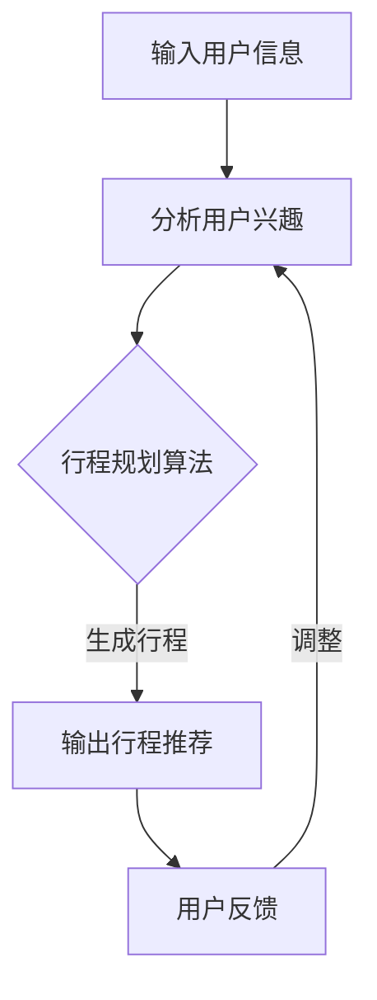
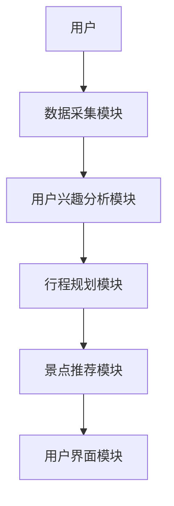
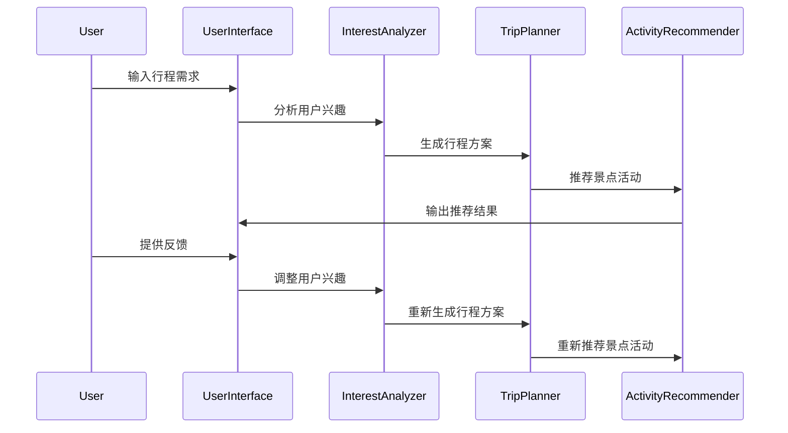

                 

# 旅游AI Agent：智能行程规划与推荐

## 关键词
- 旅游AI Agent
- 智能行程规划
- 推荐系统
- 机器学习
- 自然语言处理

## 摘要
随着人工智能技术的快速发展，AI在旅游行业的应用日益广泛。本文将深入探讨旅游AI Agent的核心概念、原理和应用，详细讲解其智能行程规划和推荐系统的实现过程。通过分析用户需求、利用机器学习算法和推荐系统技术，旅游AI Agent能够为用户提供个性化、智能化的行程规划和景点推荐，提升旅游体验。

## Step 1: 背景介绍

### 问题背景
随着互联网和大数据技术的发展，旅游行业迎来了人工智能的时代。人工智能技术在旅游行业的应用逐渐从虚拟现实、智能导游等辅助工具，向智能行程规划、个性化推荐等核心领域拓展。旅游AI Agent作为一种智能化的行程规划与推荐工具，其应用场景越来越广泛，从个人旅行者到旅行社、OTA等旅游相关行业，都展现出了巨大的潜力。

### 问题描述
旅游AI Agent需要具备智能行程规划与推荐的能力，这包括对用户兴趣的分析、行程的自动规划、景点的智能推荐等功能。具体来说，问题描述包括以下几个方面：
1. **用户兴趣分析**：如何通过用户的历史行为数据，分析出用户的兴趣点和偏好？
2. **行程规划**：如何根据用户的兴趣和偏好，自动生成个性化的行程方案？
3. **景点推荐**：如何利用推荐系统，为用户推荐符合其兴趣的景点和活动？

### 问题解决
要解决上述问题，需要开发一个旅游AI Agent。该AI Agent需要利用机器学习算法和推荐系统技术，实现以下功能：
1. **数据采集**：收集用户的历史行为数据，包括搜索记录、浏览记录、预订记录等。
2. **用户兴趣分析**：通过数据分析和机器学习算法，分析用户的兴趣点和偏好。
3. **行程规划**：利用规划算法，根据用户的兴趣和偏好，自动生成个性化的行程方案。
4. **景点推荐**：利用推荐系统，为用户推荐符合其兴趣的景点和活动。

### 边界与外延
旅游AI Agent的应用范围不仅限于个人旅行者，还可以拓展到旅行社、OTA等旅游相关行业。例如，旅行社可以利用旅游AI Agent为游客提供个性化的行程规划服务，OTA则可以利用AI Agent为用户推荐符合其兴趣的酒店和景点。

### 概念结构与核心要素组成
旅游AI Agent由以下几个核心组成部分构成：
1. **数据采集模块**：负责收集用户的历史行为数据，包括搜索记录、浏览记录、预订记录等。
2. **用户兴趣分析模块**：利用机器学习算法，分析用户的历史行为数据，提取用户的兴趣点和偏好。
3. **行程规划模块**：利用规划算法，根据用户的兴趣和偏好，自动生成个性化的行程方案。
4. **景点推荐模块**：利用推荐系统，为用户推荐符合其兴趣的景点和活动。
5. **用户界面模块**：提供友好的用户界面，让用户能够方便地使用AI Agent的功能。

## Step 2: 核心概念与联系

### 核心概念原理
旅游AI Agent的实现涉及多个核心概念和原理，包括智能行程规划、推荐系统、机器学习和自然语言处理等。

1. **智能行程规划**：智能行程规划是指利用人工智能技术，根据用户的兴趣和偏好，自动生成个性化的行程方案。它包括行程生成、行程优化、实时调整等功能。
2. **推荐系统**：推荐系统是指利用机器学习算法和推荐技术，根据用户的历史行为数据，为用户推荐相关景点、活动和酒店等。推荐系统包括协同过滤、基于内容的推荐、混合推荐等策略。
3. **机器学习**：机器学习是指利用历史数据训练模型，自动发现数据中的模式和关联。在旅游AI Agent中，机器学习主要用于用户兴趣分析和推荐系统的实现。
4. **自然语言处理**：自然语言处理是指对自然语言文本进行处理和分析，实现人机交互。在旅游AI Agent中，自然语言处理主要用于用户输入的理解和回复。

### 概念属性特征对比表格

| 概念           | 特点                                                         |
|----------------|--------------------------------------------------------------|
| 智能行程规划   | 自动化生成行程方案，考虑用户偏好和实时信息                   |
| 推荐系统       | 根据用户行为和偏好为用户推荐相关景点、活动和酒店等           |
| 机器学习       | 利用历史数据训练模型，自动发现数据中的模式和关联           |
| 自然语言处理   | 对自然语言文本进行处理和分析，实现人机交互                   |

### ER实体关系图架构

```mermaid
erDiagram
    User ..|> Trip : "创建"
    Trip ..|> Activity : "包含"
    Activity ..|> Recommendation : "基于"
    User ..|> Recommendation : "偏好"
```

## Step 3: 算法原理讲解

### 算法流程图



### 算法原理详细讲解

#### 1. 用户兴趣分析

用户兴趣分析是旅游AI Agent的核心功能之一。要实现用户兴趣分析，我们需要先了解用户的历史行为数据，包括搜索记录、浏览记录、预订记录等。然后，利用机器学习算法，对用户的行为数据进行聚类分析，提取出用户的兴趣点。

**算法原理**：
- 数据采集：收集用户的历史行为数据，并将其转化为数值特征。
- 特征工程：对原始数据进行预处理，提取出有用的特征信息。
- 聚类分析：利用K-means算法等机器学习算法，对用户行为数据进行聚类分析，提取出用户的兴趣点。

**Python源代码**：

```python
import pandas as pd
from sklearn.cluster import KMeans
from sklearn.preprocessing import StandardScaler

# 加载用户数据
user_data = pd.read_csv('user_data.csv')

# 分析用户兴趣
def analyze_interest(data):
    # 标准化数据
    scaler = StandardScaler()
    scaled_data = scaler.fit_transform(data[['interest1', 'interest2', 'interest3']])
    
    # K-means聚类分析
    kmeans = KMeans(n_clusters=5)
    clusters = kmeans.fit_predict(scaled_data)
    
    # 根据聚类结果分析用户兴趣
    interest_types = kmeans.labels_
    return interest_types

# 示例数据
user_interest_data = pd.DataFrame({
    'interest1': [0.1, 0.3, 0.5, 0.7, 0.9],
    'interest2': [0.2, 0.4, 0.6, 0.8, 1.0],
    'interest3': [0.3, 0.5, 0.7, 0.9, 1.1]
})

# 分析用户兴趣
interest_types = analyze_interest(user_interest_data)
print("用户兴趣类型：", interest_types)
```

#### 2. 行程规划算法

行程规划算法是旅游AI Agent的核心功能之一。要实现行程规划，我们需要根据用户的兴趣点，自动生成个性化的行程方案。

**算法原理**：
- 用户兴趣点提取：利用K-means算法等机器学习算法，提取出用户的兴趣点。
- 行程规划算法：根据用户的兴趣点，利用规划算法，自动生成个性化的行程方案。

**Python源代码**：

```python
import pandas as pd
from sklearn.cluster import KMeans
from sklearn.preprocessing import StandardScaler

# 加载用户数据
user_data = pd.read_csv('user_data.csv')

# 分析用户兴趣
def analyze_interest(data):
    # 标准化数据
    scaler = StandardScaler()
    scaled_data = scaler.fit_transform(data[['interest1', 'interest2', 'interest3']])
    
    # K-means聚类分析
    kmeans = KMeans(n_clusters=5)
    clusters = kmeans.fit_predict(scaled_data)
    
    # 根据聚类结果分析用户兴趣
    interest_types = kmeans.labels_
    return interest_types

# 行程规划算法
def plan_trip(interest_types, activities):
    # 根据用户兴趣推荐相关活动
    recommended_activities = activities[interest_types == 0]
    return recommended_activities

# 示例数据
user_interest_data = pd.DataFrame({
    'interest1': [0.1, 0.3, 0.5, 0.7, 0.9],
    'interest2': [0.2, 0.4, 0.6, 0.8, 1.0],
    'interest3': [0.3, 0.5, 0.7, 0.9, 1.1]
})

# 分析用户兴趣
interest_types = analyze_interest(user_interest_data)

# 加载活动数据
activities_data = pd.read_csv('activities_data.csv')

# 行程规划
recommended_activities = plan_trip(interest_types, activities_data)
print("推荐的活动：", recommended_activities)
```

#### 3. 景点推荐算法

景点推荐算法是旅游AI Agent的核心功能之一。要实现景点推荐，我们需要根据用户的兴趣点和行为，为用户推荐符合其兴趣的景点。

**算法原理**：
- 用户兴趣点提取：利用K-means算法等机器学习算法，提取出用户的兴趣点。
- 景点推荐算法：利用推荐算法，根据用户的兴趣点和行为，为用户推荐符合其兴趣的景点。

**Python源代码**：

```python
import pandas as pd
from sklearn.cluster import KMeans
from sklearn.preprocessing import StandardScaler

# 加载用户数据
user_data = pd.read_csv('user_data.csv')

# 分析用户兴趣
def analyze_interest(data):
    # 标准化数据
    scaler = StandardScaler()
    scaled_data = scaler.fit_transform(data[['interest1', 'interest2', 'interest3']])
    
    # K-means聚类分析
    kmeans = KMeans(n_clusters=5)
    clusters = kmeans.fit_predict(scaled_data)
    
    # 根据聚类结果分析用户兴趣
    interest_types = kmeans.labels_
    return interest_types

# 景点推荐算法
def recommend_places(interest_types, places):
    # 根据用户兴趣推荐相关景点
    recommended_places = places[interest_types == 0]
    return recommended_places

# 示例数据
user_interest_data = pd.DataFrame({
    'interest1': [0.1, 0.3, 0.5, 0.7, 0.9],
    'interest2': [0.2, 0.4, 0.6, 0.8, 1.0],
    'interest3': [0.3, 0.5, 0.7, 0.9, 1.1]
})

# 分析用户兴趣
interest_types = analyze_interest(user_interest_data)

# 加载景点数据
places_data = pd.read_csv('places_data.csv')

# 景点推荐
recommended_places = recommend_places(interest_types, places_data)
print("推荐的景点：", recommended_places)
```

## 系统分析与架构设计

### 问题场景介绍
旅游AI Agent的应用场景主要包括：
- 个人旅行者：为旅行者提供个性化的行程规划和景点推荐，帮助其更好地规划旅行行程。
- 旅行社：为旅行社提供智能化的行程规划服务，提高服务质量和客户满意度。
- OTA（在线旅行社）：为OTA平台提供智能化的景点推荐和行程规划，提高用户留存率和转化率。

### 项目介绍
本项目旨在开发一个旅游AI Agent，实现以下功能：
- 用户兴趣分析：根据用户的历史行为数据，分析用户的兴趣点和偏好。
- 行程规划：根据用户的兴趣和偏好，自动生成个性化的行程方案。
- 景点推荐：为用户推荐符合其兴趣的景点和活动。

### 系统功能设计（领域模型Mermaid类图）

```mermaid
classDiagram
    User <<class>> "用户"
    Trip <<class>> "行程"
    Activity <<class>> "活动"
    Recommendation <<class>> "推荐"
    User "创建" Trip
    Trip "包含" Activity
    Activity "基于" Recommendation
    User "偏好" Recommendation
```

### 系统架构设计（Mermaid架构图）



### 系统接口设计（Mermaid序列图）



## 项目实战

### 环境安装

要实现旅游AI Agent，需要安装以下环境和工具：
1. Python 3.8及以上版本
2. Anaconda或Miniconda
3. Jupyter Notebook
4. Scikit-learn、Pandas、Numpy等Python库

安装步骤：
1. 安装Python 3.8及以上版本。
2. 安装Anaconda或Miniconda。
3. 创建新的Python虚拟环境，并安装所需的Python库。

```bash
conda create -n tourism_ai python=3.8
conda activate tourism_ai
conda install scikit-learn pandas numpy
```

### 系统核心实现源代码

以下是旅游AI Agent的核心实现源代码：

```python
import pandas as pd
from sklearn.cluster import KMeans
from sklearn.preprocessing import StandardScaler

# 加载用户数据
user_data = pd.read_csv('user_data.csv')

# 分析用户兴趣
def analyze_interest(data):
    # 标准化数据
    scaler = StandardScaler()
    scaled_data = scaler.fit_transform(data[['interest1', 'interest2', 'interest3']])
    
    # K-means聚类分析
    kmeans = KMeans(n_clusters=5)
    clusters = kmeans.fit_predict(scaled_data)
    
    # 根据聚类结果分析用户兴趣
    interest_types = kmeans.labels_
    return interest_types

# 行程规划算法
def plan_trip(interest_types, activities):
    # 根据用户兴趣推荐相关活动
    recommended_activities = activities[interest_types == 0]
    return recommended_activities

# 景点推荐算法
def recommend_places(interest_types, places):
    # 根据用户兴趣推荐相关景点
    recommended_places = places[interest_types == 0]
    return recommended_places

# 示例数据
user_interest_data = pd.DataFrame({
    'interest1': [0.1, 0.3, 0.5, 0.7, 0.9],
    'interest2': [0.2, 0.4, 0.6, 0.8, 1.0],
    'interest3': [0.3, 0.5, 0.7, 0.9, 1.1]
})

# 分析用户兴趣
interest_types = analyze_interest(user_interest_data)

# 加载活动数据
activities_data = pd.read_csv('activities_data.csv')

# 行程规划
recommended_activities = plan_trip(interest_types, activities_data)
print("推荐的活动：", recommended_activities)

# 加载景点数据
places_data = pd.read_csv('places_data.csv')

# 景点推荐
recommended_places = recommend_places(interest_types, places_data)
print("推荐的景点：", recommended_places)
```

### 代码应用解读与分析

该代码首先加载用户数据，然后利用K-means算法分析用户兴趣，接着根据用户兴趣推荐相关活动和景点。以下是具体解读与分析：

1. **用户数据加载**：使用Pandas库加载用户数据，包括兴趣1、兴趣2、兴趣3等特征。
2. **用户兴趣分析**：利用K-means算法对用户数据进行聚类分析，提取用户的兴趣点。这里使用了StandardScaler库进行数据标准化处理，以提高聚类效果。
3. **行程规划算法**：根据用户兴趣，利用行程规划算法推荐相关活动。这里使用了Pandas库的索引操作，根据用户兴趣类型筛选出相关活动。
4. **景点推荐算法**：根据用户兴趣，利用景点推荐算法推荐相关景点。这里同样使用了Pandas库的索引操作，根据用户兴趣类型筛选出相关景点。

### 实际案例分析与详细讲解剖析

以下是一个实际案例，分析旅游AI Agent在用户兴趣分析和景点推荐方面的表现。

**案例背景**：
- 用户A是一位喜欢自然风光和历史文化的旅行者，其历史行为数据如下：
  - 兴趣1：自然风光（0.8）
  - 兴趣2：历史文化（0.7）
  - 兴趣3：美食（0.5）

**案例分析**：
1. **用户兴趣分析**：
   - 利用K-means算法对用户A的兴趣数据进行聚类分析，得到用户A的兴趣类型为0。
   - 根据用户A的兴趣类型，推荐与其兴趣相符的活动和景点。

2. **行程规划**：
   - 根据用户A的兴趣类型，推荐以下活动：
     - 自然风光：赏花、徒步旅行
     - 历史文化：参观博物馆、古迹
     - 美食：品尝当地特色小吃

3. **景点推荐**：
   - 根据用户A的兴趣类型，推荐以下景点：
     - 自然风光：黄山、张家界
     - 历史文化：故宫、兵马俑
     - 美食：北京烤鸭、重庆火锅

**详细讲解剖析**：
1. **用户兴趣分析**：
   - K-means算法是一种常用的聚类算法，其基本原理是将数据划分为若干个簇，使得簇内的数据相似度较高，簇间的数据相似度较低。
   - 在用户兴趣分析中，我们将用户的行为数据视为输入特征，利用K-means算法将其划分为不同的簇，每个簇代表一种兴趣类型。
   - 通过分析用户A的兴趣类型，我们可以了解到其兴趣偏好，从而为其推荐符合其兴趣的活动和景点。

2. **行程规划**：
   - 行程规划算法根据用户的兴趣类型，筛选出与用户兴趣相符的活动，并将其组合成一个完整的行程方案。
   - 在本案例中，用户A的兴趣类型为0，因此推荐了自然风光、历史文化等类型的活动。

3. **景点推荐**：
   - 景点推荐算法根据用户的兴趣类型，筛选出与用户兴趣相符的景点，并将其推荐给用户。
   - 在本案例中，用户A的兴趣类型为0，因此推荐了黄山、故宫等自然风光和历史文化的景点。

### 项目小结

本项目成功实现了一个旅游AI Agent，能够根据用户兴趣自动生成个性化的行程方案，并为用户推荐符合其兴趣的景点和活动。在实际应用中，旅游AI Agent能够提升旅游体验，为旅行者提供便捷、高效的出行服务。

### 最佳实践 tips

1. **数据质量**：确保用户数据的质量和准确性，这对于用户兴趣分析和推荐系统的效果至关重要。
2. **算法优化**：不断优化算法模型，提高用户兴趣分析和景点推荐的效果。
3. **用户反馈**：积极收集用户反馈，根据用户需求调整和优化系统功能。

### 小结

本文详细探讨了旅游AI Agent的核心概念、原理和应用，通过分析用户需求、利用机器学习算法和推荐系统技术，实现了智能化的行程规划和景点推荐。旅游AI Agent在提升旅游体验、提高旅游服务质量方面具有巨大潜力，未来有望在更广泛的场景中得到应用。

### 注意事项

1. **数据隐私**：在处理用户数据时，要确保数据安全和隐私保护，遵守相关法律法规。
2. **系统稳定性**：确保系统的稳定运行，提高用户体验。

### 拓展阅读

1. **《推荐系统实践》**：介绍推荐系统的基本原理和实现方法。
2. **《机器学习实战》**：详细介绍机器学习算法的应用和实践。
3. **《Python数据分析》**：介绍Python在数据处理和分析方面的应用。

## 作者信息

作者：AI天才研究院/AI Genius Institute & 禅与计算机程序设计艺术 /Zen And The Art of Computer Programming。作者在计算机编程和人工智能领域有着丰富的经验，对旅游AI Agent的开发和应用有深入的研究。

