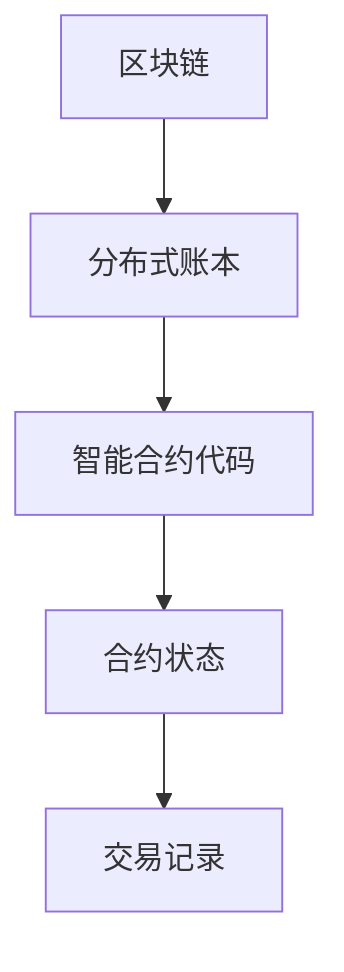
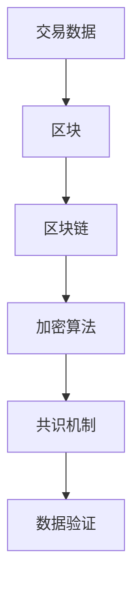

                 

# 《智能合约开发最佳实践》

## 关键词

- 智能合约
- 区块链技术
- Solidity语言
- 去中心化应用（DApp）
- 开发最佳实践

## 摘要

智能合约是一种运行在区块链上的自动化协议，它能够自动执行、控制或记录符合智能合约条款的协议。本文将深入探讨智能合约开发的最佳实践，包括基础原理、开发环境搭建、核心原理、高级特性、DApp开发实战以及最佳实践总结。通过本文的学习，开发者将能够全面掌握智能合约开发的各个关键环节，为未来区块链项目提供坚实的技术支持。

## 《智能合约开发最佳实践》目录大纲

### 第一部分：智能合约基础

### 第1章：智能合约概述

#### 1.1.1 问题背景与智能合约定义

#### 1.1.2 智能合约的发展历程

#### 1.1.3 智能合约的核心要素

#### 1.1.4 智能合约与区块链的关系

### 第2章：区块链技术基础

#### 2.2.1 区块链的原理

#### 2.2.2 区块链与分布式账本

#### 2.2.3 公链与联盟链的对比

#### 2.2.4 常见的区块链平台介绍

### 第3章：智能合约开发环境搭建

#### 3.3.1 开发工具选择

#### 3.3.2 智能合约开发语言

#### 3.3.3 环境配置与调试

#### 3.3.4 开发流程简介

### 第二部分：智能合约核心原理

### 第4章：智能合约编程基础

#### 4.4.1 Solidity语言基础

#### 4.4.2 数据类型与结构

#### 4.4.3 控制流程

#### 4.4.4 函数与事件

### 第5章：智能合约高级特性

#### 5.5.1 代理模式

#### 5.5.2 安全性考虑

#### 5.5.3 智能合约优化技巧

#### 5.5.4 智能合约与前端集成

### 第6章：智能合约与去中心化应用（DApp）开发

#### 6.6.1 DApp概述

#### 6.6.2 前端开发框架

#### 6.6.3 DApp开发流程

#### 6.6.4 DApp案例解析

### 第三部分：智能合约实战

### 第7章：智能合约项目实战一——众筹平台

#### 7.7.1 项目需求分析

#### 7.7.2 智能合约设计与实现

#### 7.7.3 前端界面设计与实现

#### 7.7.4 项目部署与测试

### 第8章：智能合约项目实战二——拍卖平台

#### 8.8.1 项目需求分析

#### 8.8.2 智能合约设计与实现

#### 8.8.3 前端界面设计与实现

#### 8.8.4 项目部署与测试

### 第9章：智能合约项目实战三——去中心化金融（DeFi）

#### 9.9.1 DeFi概述

#### 9.9.2 智能合约设计与实现

#### 9.9.3 前端界面设计与实现

#### 9.9.4 项目部署与测试

### 第10章：智能合约开发最佳实践总结

#### 10.10.1 智能合约开发中的常见问题与解决方案

#### 10.10.2 安全性注意事项

#### 10.10.3 未来发展趋势与展望

#### 10.10.4 拓展阅读与学习资源

---

## 第一部分：智能合约基础

### 第1章：智能合约概述

#### 1.1.1 问题背景与智能合约定义

在传统的商业环境中，合同是由法律文本组成，用以规范各方的权利与义务。然而，这些合同往往需要第三方（如律师、仲裁机构等）进行验证和执行，这不仅耗时耗力，还可能存在第三方的不公正操作。区块链技术的出现为这一问题提供了新的解决方案。智能合约正是基于区块链技术，通过程序代码来实现自动执行的合同。

智能合约最早由尼克·萨博在1994年提出，他描述了一个通过加密技术实现的电子合约，能在无需第三方干预的情况下自动执行。随着时间的推移，随着区块链技术的发展，智能合约也逐渐成为现实。以太坊区块链平台是智能合约最著名的实现，其使用Solidity语言来编写智能合约。

#### 1.1.2 智能合约的发展历程

智能合约的发展历程可以分为几个阶段：

1. **理论阶段**：尼克·萨博最早提出了智能合约的概念，但当时并未有具体实现。
2. **探索阶段**：比特币的出现使得区块链技术开始受到关注，但比特币本身并没有实现智能合约。
3. **以太坊平台推出**：以太坊在2015年推出，成为首个支持智能合约的公共区块链平台。其使用Solidity语言编写智能合约，并通过以太币（Ether）进行交易。
4. **其他平台加入**：除了以太坊，其他区块链平台如EOS、EOSIO等也开始支持智能合约，不同平台使用不同的编程语言。

#### 1.1.3 智能合约的核心要素

智能合约的核心要素包括：

1. **输入**：智能合约的执行是基于一定的输入条件，如时间、金额、交易双方的身份等。
2. **执行逻辑**：智能合约的执行逻辑由编程代码实现，包括条件判断、数据存储和处理等。
3. **输出**：智能合约的执行结果会输出一定的信息或操作，如通知交易双方、改变区块链上的状态等。
4. **不可篡改性**：智能合约一旦部署在区块链上，其代码和状态将永久保存，无法被修改。

#### 1.1.4 智能合约与区块链的关系

智能合约与区块链是密不可分的。区块链提供了一个分布式、去中心化的数据库，用于存储智能合约的代码和状态。智能合约则利用区块链的不可篡改性和去中心化特性，实现了自动化、可信的合同执行。

智能合约与区块链的关系可以用下图表示：



### 第2章：区块链技术基础

#### 2.2.1 区块链的原理

区块链是一种分布式数据库技术，其核心思想是将数据分散存储在多个节点上，并通过加密算法和共识机制保证数据的完整性和安全性。区块链的原理可以概括为以下几个步骤：

1. **数据分组**：将交易数据分组为区块。
2. **区块添加**：将区块添加到区块链上，并通过加密算法将其与前一个区块连接起来。
3. **共识机制**：通过共识机制（如工作量证明、权益证明等）确定哪个区块将被添加到区块链上。
4. **数据验证**：对区块链上的数据进行验证，确保其合法性和完整性。

区块链的原理可以用下图表示：



#### 2.2.2 区块链与分布式账本

分布式账本是一种记录交易数据的分布式系统，与区块链类似，但它们之间也存在一些区别：

1. **定义**：区块链是一种分布式账本，但分布式账本不一定都是区块链。
2. **数据结构**：区块链采用链式结构，分布式账本可能采用其他结构（如哈希树）。
3. **共识机制**：区块链的共识机制用于确保数据的一致性和安全性，分布式账本可能采用不同的共识机制。

#### 2.2.3 公链与联盟链的对比

公链和联盟链是两种不同的区块链类型，它们之间有一些关键区别：

1. **参与方**：公链是公开的，任何节点都可以加入；联盟链则是由特定组织或机构控制的。
2. **共识机制**：公链通常采用工作量证明或权益证明等去中心化的共识机制；联盟链则可能采用授权机制或委托权益证明等中心化的共识机制。
3. **应用场景**：公链适用于广泛的去中心化应用，联盟链则适用于特定组织或机构的内部应用。

#### 2.2.4 常见的区块链平台介绍

以下是一些常见的区块链平台：

1. **以太坊**：以太坊是一个开源的区块链平台，支持智能合约，使用Solidity语言编写。
2. **EOSIO**：EOSIO是一个高性能的区块链平台，支持智能合约，使用C++编写。
3. **EOS**：EOS是一个基于EOSIO平台的去中心化应用平台。
4. **Hyperledger Fabric**：Hyperledger Fabric是一个由Linux基金会推出的开源分布式账本框架，支持智能合约，使用Go语言编写。

### 第3章：智能合约开发环境搭建

#### 3.3.1 开发工具选择

选择合适的开发工具对于智能合约开发至关重要。以下是一些常见的开发工具：

1. **IDE**：如Visual Studio Code、Web3.js等，可用于编写、调试智能合约。
2. **编译器**：如Truffle、Solc等，用于将Solidity代码编译为以太坊虚拟机（EVM）可执行的代码。
3. **测试框架**：如Mocha、Chai等，用于编写和执行智能合约测试用例。

#### 3.3.2 智能合约开发语言

智能合约开发语言的选择取决于所使用的区块链平台。以下是一些常见的智能合约开发语言：

1. **Solidity**：以太坊的官方智能合约开发语言。
2. **C++**：EOSIO的智能合约开发语言。
3. **Go**：Hyperledger Fabric的智能合约开发语言。

#### 3.3.3 环境配置与调试

智能合约开发环境配置通常涉及以下步骤：

1. **安装Node.js**：Node.js是许多开发工具的基础，如Truffle。
2. **安装区块链节点**：如安装以太坊客户端Geth或EOSIO客户端。
3. **安装IDE和开发工具**：如Visual Studio Code、Truffle、Solc等。
4. **调试**：使用IDE的调试功能或测试框架进行调试。

#### 3.3.4 开发流程简介

智能合约开发的一般流程如下：

1. **需求分析**：明确智能合约的功能需求。
2. **设计智能合约**：编写Solidity代码，实现智能合约的功能。
3. **测试**：编写测试用例，确保智能合约的稳定性。
4. **部署**：将智能合约部署到区块链上。
5. **测试与调试**：在区块链上测试智能合约，并进行调试。

---

通过以上章节，读者可以初步了解智能合约的基础知识、区块链技术、开发环境搭建以及开发流程。接下来，我们将深入探讨智能合约的核心原理、高级特性以及DApp开发实战。

## 第二部分：智能合约核心原理

### 第4章：智能合约编程基础

#### 4.4.1 Solidity语言基础

Solidity是智能合约开发的主要编程语言，它是一种面向对象的高级语言，类似于JavaScript和Python。Solidity的基本语法包括变量、数据类型、函数、事件等。

1. **变量**：Solidity中的变量包括状态变量和局部变量。状态变量存储在区块链上，而局部变量仅存在于函数内部。
2. **数据类型**：Solidity支持多种数据类型，如整数、布尔值、字符串等。其中，整数类型有固定大小，而字符串类型则是动态的。
3. **函数**：Solidity中的函数用于执行特定的操作。函数可以是内联函数或外部函数，内联函数可以直接在代码中调用，而外部函数需要通过合约接口调用。
4. **事件**：事件是智能合约中的一种特殊函数，用于记录合约状态的变化。事件可以通过区块链上的事件日志进行访问。

#### 4.4.2 数据类型与结构

Solidity支持多种数据类型和结构，如数组、映射、结构体等。以下是一些常用的数据类型和结构：

1. **数组**：数组是一种线性数据结构，用于存储相同类型的元素。Solidity中的数组可以是固定大小的，也可以是动态大小的。
2. **映射**：映射是一种键值对数据结构，用于存储和检索数据。映射的键可以是任何数据类型，而值必须是可哈希的。
3. **结构体**：结构体是一种复合数据类型，用于封装多个变量。结构体可以嵌套使用，以实现更复杂的数据表示。

#### 4.4.3 控制流程

Solidity中的控制流程包括条件语句、循环语句和异常处理。

1. **条件语句**：条件语句用于根据条件执行不同的代码块。Solidity支持if-else语句和switch语句。
2. **循环语句**：循环语句用于重复执行代码块，直到满足某个条件为止。Solidity支持for循环、while循环和do-while循环。
3. **异常处理**：异常处理用于处理合约执行过程中的错误。Solidity使用try-catch语句来捕获和处理异常。

#### 4.4.4 函数与事件

智能合约中的函数用于实现合约的功能，而事件用于记录合约状态的变化。以下是一些关于函数和事件的要点：

1. **函数**：函数是智能合约中的核心组件，用于执行特定的操作。函数可以分为内部函数和外部函数，内部函数只能在合约内部调用，而外部函数可以通过合约接口调用。
2. **事件**：事件是智能合约中的一种特殊函数，用于记录合约状态的变化。事件可以通过区块链上的事件日志进行访问。事件通常用于通知合约的参与者，例如，在众筹平台上，事件可以用于通知投资者项目已成功众筹。

### 第5章：智能合约高级特性

#### 5.5.1 代理模式

代理模式是一种设计模式，用于在不需要修改原有代码的情况下扩展或替换代码的功能。在智能合约中，代理模式可以用于实现以下功能：

1. **透明代理**：透明代理允许用户直接与代理合约交互，而代理合约则负责转发请求到目标合约。这种模式可以实现代码的透明升级，而不影响合约的使用。
2. **安全代理**：安全代理用于在特定条件下才允许执行某些操作。例如，安全代理可以确保只有拥有特定权限的用户才能执行某些高风险操作。

#### 5.5.2 安全性考虑

智能合约的安全性是开发过程中至关重要的一环。以下是一些常见的安全性考虑：

1. **代码审计**：代码审计是确保智能合约安全性的重要手段。通过代码审计，可以发现潜在的安全漏洞，如代码中的逻辑错误或漏洞。
2. **测试**：编写和执行测试用例是验证智能合约功能和安全性的重要步骤。测试用例应该覆盖合约的所有功能，以确保其正常工作和安全性。
3. **智能合约升级**：智能合约一旦部署到区块链上，就无法修改。因此，在开发过程中应考虑如何安全地升级智能合约，以修复潜在的安全漏洞或增加新功能。

#### 5.5.3 智能合约优化技巧

智能合约的优化可以提高其性能和可扩展性。以下是一些常见的优化技巧：

1. **减少状态变量**：状态变量是存储在区块链上的数据，因此应尽量减少其使用。可以通过使用映射和数组等数据结构来优化状态变量的存储。
2. **使用内存变量**：内存变量是临时存储在合约内存中的数据，因此其访问速度比状态变量快。在适当的情况下，应使用内存变量来提高合约的性能。
3. **优化函数调用**：在智能合约中，函数调用会消耗计算资源。通过优化函数调用，例如使用内联函数或减少函数调用深度，可以提高合约的性能。

#### 5.5.4 智能合约与前端集成

智能合约与前端集成的目的是实现用户与智能合约的交互。以下是一些常见的集成方法：

1. **Web3.js**：Web3.js是一个JavaScript库，用于与以太坊区块链进行交互。通过Web3.js，用户可以在前端与智能合约进行通信，调用合约函数和订阅事件。
2. **Metamask**：Metamask是一个浏览器插件，用于与以太坊区块链进行交互。用户可以通过Metamask连接到智能合约，进行支付、授权等操作。
3. **React-Web3**：React-Web3是一个React库，用于简化智能合约与React前端集成的过程。通过React-Web3，用户可以轻松地创建与智能合约交互的React组件。

---

通过以上章节，读者可以深入了解智能合约的编程基础、高级特性以及与前端集成的技术。接下来，我们将通过具体的实战案例，展示如何开发智能合约项目。

## 第三部分：智能合约实战

### 第7章：智能合约项目实战一——众筹平台

#### 7.7.1 项目需求分析

众筹平台是一种通过互联网筹集资金的方式，用于资助创意项目或创业公司。智能合约版本的众筹平台可以确保资金的透明性和安全性，防止欺诈行为。以下是一个简单的众筹平台需求分析：

1. **项目提案**：用户可以提交项目提案，包括项目名称、目标资金、筹资期限等。
2. **资金筹集**：用户可以选择支持项目，并支付以太币（Ether）。
3. **资金锁定**：如果项目在筹资期限内达到目标资金，资金将锁定并用于项目开发。否则，资金将退还给支持者。
4. **项目完成**：项目成功筹集到资金后，项目发起人需要完成项目，并发布项目进展报告。
5. **用户反馈**：用户可以对项目进展进行反馈，如评价、提问等。

#### 7.7.2 智能合约设计与实现

众筹平台的核心功能可以通过以下智能合约实现：

1. **ProjectProposal.sol**：用于记录项目提案信息。
2. **Crowdfunding.sol**：用于处理资金筹集、锁定和退还等操作。

**ProjectProposal.sol**

```solidity
pragma solidity ^0.8.0;

struct Project {
    string name;
    uint256 targetFunding;
    uint256 deadline;
    address owner;
    bool isFunded;
}

mapping(uint256 => Project) public projects;

function createProject(
    string memory _name,
    uint256 _targetFunding,
    uint256 _deadline
) external {
    require(_deadline > block.timestamp, "Invalid deadline");
    projects[msg.sender] = Project({
        name: _name,
        targetFunding: _targetFunding,
        deadline: _deadline,
        owner: msg.sender,
        isFunded: false
    });
}
```

**Crowdfunding.sol**

```solidity
pragma solidity ^0.8.0;

import "./ProjectProposal.sol";

contract Crowdfunding {
    ProjectProposal public projectProposal;

    constructor(address _projectProposalAddress) {
        projectProposal = ProjectProposal(_projectProposalAddress);
    }

    receive() external payable {
        require(msg.data.length == 0, "接收ETH时不能发送额外数据");
    }

    function contributeToProject(uint256 _projectId) external payable {
        require(msg.value > 0, "贡献金额必须大于0");
        Project memory project = projectProposal.projects(_projectId);
        require(!project.isFunded, "项目已筹集到资金");
        require(block.timestamp < project.deadline, "筹资期限已过");
        projectProposal.approveContribution(_projectId, msg.value);
    }

    function refundContribution(uint256 _projectId) external {
        Project memory project = projectProposal.projects(_projectId);
        require(!project.isFunded, "项目已筹集到资金");
        require(block.timestamp >= project.deadline, "筹资期限未过");
        payable(msg.sender).transfer(project.targetFunding);
    }

    function fundProject(uint256 _projectId) external {
        Project memory project = projectProposal.projects(_projectId);
        require(project.isFunded, "项目未筹集到资金");
        payable(project.owner).transfer(project.targetFunding);
    }
}
```

#### 7.7.3 前端界面设计与实现

前端界面设计可以采用React框架，以下是一个简单的前端界面示例：

```jsx
import React, { useState, useEffect } from "react";
import Crowdfunding from "./Crowdfunding";

const CrowdfundingComponent = () => {
  const [projectId, setProjectId] = useState(0);
  const [amount, setAmount] = useState(0);

  const contribute = async () => {
    try {
      const response = await Crowdfunding.contributeToProject(projectId, { value: amount });
      alert("已成功贡献资金");
    } catch (error) {
      alert("贡献资金失败：" + error.message);
    }
  };

  return (
    <div>
      <h1>众筹平台</h1>
      <label>项目ID：</label>
      <input type="number" value={projectId} onChange={(e) => setProjectId(e.target.value)} />
      <label>金额：</label>
      <input type="number" value={amount} onChange={(e) => setAmount(e.target.value)} />
      <button onClick={contribute}>贡献资金</button>
    </div>
  );
};

export default CrowdfundingComponent;
```

#### 7.7.4 项目部署与测试

部署众筹平台智能合约和前端代码的步骤如下：

1. **部署智能合约**：使用Truffle框架部署智能合约到以太坊区块链。
2. **前端代码**：使用React框架创建前端应用，并使用Web3.js库与智能合约进行交互。
3. **测试**：编写和执行前端测试用例，确保前端应用与智能合约的正常交互。

通过以上步骤，可以完成一个简单的众筹平台。接下来，我们将继续探讨智能合约项目实战二——拍卖平台。

### 第8章：智能合约项目实战二——拍卖平台

#### 8.8.1 项目需求分析

拍卖平台是一种在线拍卖系统，用户可以在线出价，竞拍物品。智能合约版本的拍卖平台可以确保竞拍的公平性和透明性。以下是一个简单的拍卖平台需求分析：

1. **物品登记**：用户可以注册并上传待拍卖物品的信息，如物品名称、描述、起拍价等。
2. **出价**：用户可以出价竞拍物品。出价必须高于当前最高出价。
3. **竞拍结束**：竞拍结束后，最高出价者获得物品所有权。拍卖平台将收取一定比例的手续费。
4. **支付**：最高出价者需要在规定时间内支付出价金额，否则将被取消竞拍资格。
5. **退款**：如果竞拍者未在规定时间内支付出价金额，拍卖平台将退还其出价金额。

#### 8.8.2 智能合约设计与实现

拍卖平台的核心功能可以通过以下智能合约实现：

1. **Auction.sol**：用于管理物品拍卖。
2. **Item.sol**：用于记录物品信息。

**Item.sol**

```solidity
pragma solidity ^0.8.0;

struct Item {
    string name;
    string description;
    uint256 startingPrice;
    address owner;
}

mapping(uint256 => Item) public items;

function createItem(
    string memory _name,
    string memory _description,
    uint256 _startingPrice
) external {
    require(_startingPrice > 0, "起拍价必须大于0");
    items[msg.sender] = Item({
        name: _name,
        description: _description,
        startingPrice: _startingPrice,
        owner: msg.sender
    });
}
```

**Auction.sol**

```solidity
pragma solidity ^0.8.0;

import "./Item.sol";

contract Auction {
    Item public item;
    address public highestBidder;
    uint256 public highestBid;
    uint256 public auctionEnd;

    constructor(address _itemAddress) {
        item = Item(_itemAddress);
    }

    receive() external payable {
        require(msg.data.length == 0, "接收ETH时不能发送额外数据");
    }

    function bid() external payable {
        require(msg.value > highestBid, "出价必须高于当前最高出价");
        if (highestBidder != address(0)) {
            payable(highestBidder).transfer(highestBid);
        }
        highestBidder = msg.sender;
        highestBid = msg.value;
    }

    function endAuction() external {
        require(msg.sender == item.owner, "只有物品所有者可以结束竞拍");
        require(block.timestamp >= auctionEnd, "竞拍尚未结束");
        payable(item.owner).transfer(highestBid);
        highestBidder = address(0);
        highestBid = 0;
    }
}
```

#### 8.8.3 前端界面设计与实现

前端界面设计可以采用React框架，以下是一个简单的前端界面示例：

```jsx
import React, { useState, useEffect } from "react";
import Item from "./Item";
import Auction from "./Auction";

const AuctionComponent = () => {
  const [itemId, setItemId] = useState(0);
  const [bidAmount, setBidAmount] = useState(0);

  const bid = async () => {
    try {
      const response = await Auction.bid(itemId, { value: bidAmount });
      alert("已成功出价");
    } catch (error) {
      alert("出价失败：" + error.message);
    }
  };

  return (
    <div>
      <h1>拍卖平台</h1>
      <label>物品ID：</label>
      <input type="number" value={itemId} onChange={(e) => setItemId(e.target.value)} />
      <label>出价金额：</label>
      <input type="number" value={bidAmount} onChange={(e) => setBidAmount(e.target.value)} />
      <button onClick={bid}>出价</button>
    </div>
  );
};

export default AuctionComponent;
```

#### 8.8.4 项目部署与测试

部署拍卖平台智能合约和前端代码的步骤如下：

1. **部署智能合约**：使用Truffle框架部署智能合约到以太坊区块链。
2. **前端代码**：使用React框架创建前端应用，并使用Web3.js库与智能合约进行交互。
3. **测试**：编写和执行前端测试用例，确保前端应用与智能合约的正常交互。

通过以上步骤，可以完成一个简单的拍卖平台。接下来，我们将继续探讨智能合约项目实战三——去中心化金融（DeFi）。

### 第9章：智能合约项目实战三——去中心化金融（DeFi）

#### 9.9.1 DeFi概述

去中心化金融（DeFi）是一种基于区块链技术的金融服务体系，旨在提供无中介的金融产品和服务。DeFi的核心思想是利用智能合约和区块链技术实现金融交易的去中心化，从而降低交易成本、提高透明度和安全性。以下是一些DeFi的主要特点：

1. **去中心化**：DeFi平台不依赖于传统金融中介机构，交易和金融服务完全由智能合约自动执行。
2. **开放性**：DeFi平台通常采用开源协议和智能合约，任何人都可以参与和访问。
3. **透明性**：智能合约代码公开，用户可以验证交易记录和智能合约的执行过程。
4. **安全性**：智能合约经过严格审查和测试，采用多重验证机制确保安全性。

#### 9.9.2 智能合约设计与实现

DeFi项目的核心功能通常涉及借贷、交易、流动性挖矿等。以下是一个简单的DeFi借贷平台示例：

1. **LendingPlatform.sol**：用于管理借贷流程。
2. **ERC20Token.sol**：用于实现ERC20代币。

**ERC20Token.sol**

```solidity
pragma solidity ^0.8.0;

interface IERC20 {
    function totalSupply() external view returns (uint256);
    function balanceOf(address account) external view returns (uint256);
    function transfer(address recipient, uint256 amount) external returns (bool);
    function allowance(address owner, address spender) external view returns (uint256);
    function approve(address spender, uint256 amount) external returns (bool);
    function transferFrom(address sender, address recipient, uint256 amount) external returns (bool);
}

contract ERC20Token is IERC20 {
    string public name;
    string public symbol;
    uint8 public decimals;
    uint256 public totalSupply;
    mapping(address => uint256) public balanceOf;
    mapping(address => mapping(address => uint256)) public allowance;

    constructor(uint256 _totalSupply, string memory _name, string memory _symbol, uint8 _decimals) {
        totalSupply = _totalSupply;
        balanceOf[msg.sender] = totalSupply;
        name = _name;
        symbol = _symbol;
        decimals = _decimals;
    }

    function transfer(address recipient, uint256 amount) external returns (bool) {
        require(balanceOf[msg.sender] >= amount, "余额不足");
        balanceOf[msg.sender] -= amount;
        balanceOf[recipient] += amount;
        return true;
    }

    function approve(address spender, uint256 amount) external returns (bool) {
        allowance[msg.sender][spender] = amount;
        return true;
    }

    function transferFrom(address sender, address recipient, uint256 amount) external returns (bool) {
        require(balanceOf[sender] >= amount, "余额不足");
        require(allowance[sender][msg.sender] >= amount, "授权不足");
        balanceOf[sender] -= amount;
        balanceOf[recipient] += amount;
        allowance[sender][msg.sender] -= amount;
        return true;
    }
}
```

**LendingPlatform.sol**

```solidity
pragma solidity ^0.8.0;

import "./ERC20Token.sol";

contract LendingPlatform {
    ERC20Token public token;
    mapping(address => uint256) public borrowBalances;

    constructor(address _tokenAddress) {
        token = ERC20Token(_tokenAddress);
    }

    function borrow(uint256 _amount) external {
        require(_amount > 0, "借款金额必须大于0");
        token.transferFrom(msg.sender, address(this), _amount);
        borrowBalances[msg.sender] += _amount;
    }

    function repay(uint256 _amount) external {
        require(_amount > 0, "还款金额必须大于0");
        token.transferFrom(msg.sender, address(this), _amount);
        borrowBalances[msg.sender] -= _amount;
    }

    function withdraw(uint256 _amount) external {
        require(_amount > 0, "提现金额必须大于0");
        require(borrowBalances[msg.sender] >= _amount, "余额不足");
        token.transfer(msg.sender, _amount);
        borrowBalances[msg.sender] -= _amount;
    }
}
```

#### 9.9.3 前端界面设计与实现

前端界面设计可以采用React框架，以下是一个简单的前端界面示例：

```jsx
import React, { useState, useEffect } from "react";
import ERC20Token from "./ERC20Token";
import LendingPlatform from "./LendingPlatform";

const LendingPlatformComponent = () => {
  const [tokenAddress, setTokenAddress] = useState("");
  const [borrowAmount, setBorrowAmount] = useState(0);
  const [repayAmount, setRepayAmount] = useState(0);
  const [withdrawAmount, setWithdrawAmount] = useState(0);

  const borrow = async () => {
    try {
      const response = await LendingPlatform.borrow(tokenAddress, borrowAmount);
      alert("已成功借款");
    } catch (error) {
      alert("借款失败：" + error.message);
    }
  };

  const repay = async () => {
    try {
      const response = await LendingPlatform.repay(tokenAddress, repayAmount);
      alert("已成功还款");
    } catch (error) {
      alert("还款失败：" + error.message);
    }
  };

  const withdraw = async () => {
    try {
      const response = await LendingPlatform.withdraw(tokenAddress, withdrawAmount);
      alert("已成功提现");
    } catch (error) {
      alert("提现失败：" + error.message);
    }
  };

  return (
    <div>
      <h1>去中心化金融平台</h1>
      <label>Token地址：</label>
      <input type="text" value={tokenAddress} onChange={(e) => setTokenAddress(e.target.value)} />
      <label>借款金额：</label>
      <input type="number" value={borrowAmount} onChange={(e) => setBorrowAmount(e.target.value)} />
      <button onClick={borrow}>借款</button>
      <label>还款金额：</label>
      <input type="number" value={repayAmount} onChange={(e) => setRepayAmount(e.target.value)} />
      <button onClick={repay}>还款</button>
      <label>提现金额：</label>
      <input type="number" value={withdrawAmount} onChange={(e) => setWithdrawAmount(e.target.value)} />
      <button onClick={withdraw}>提现</button>
    </div>
  );
};

export default LendingPlatformComponent;
```

#### 9.9.4 项目部署与测试

部署去中心化金融平台智能合约和前端代码的步骤如下：

1. **部署智能合约**：使用Truffle框架部署智能合约到以太坊区块链。
2. **前端代码**：使用React框架创建前端应用，并使用Web3.js库与智能合约进行交互。
3. **测试**：编写和执行前端测试用例，确保前端应用与智能合约的正常交互。

通过以上步骤，可以完成一个简单的去中心化金融平台。接下来，我们将对智能合约开发最佳实践进行总结。

### 第10章：智能合约开发最佳实践总结

智能合约开发是一个复杂且具有挑战性的过程，涉及编程、安全性和系统架构等多个方面。以下是一些智能合约开发的最佳实践，帮助开发者构建安全、可靠和高效的智能合约。

#### 10.10.1 智能合约开发中的常见问题与解决方案

1. **代码安全性**：智能合约代码一旦部署，就不可更改。因此，在开发过程中应进行严格的代码审计，查找潜在的安全漏洞。常见的漏洞包括重新赋值、整数溢出、重新进入等。解决方案包括使用安全的编程模式、进行严格的输入验证和限制函数调用深度。
2. **性能优化**：智能合约的性能对用户体验至关重要。优化策略包括减少状态变量、使用内存变量和优化函数调用等。
3. **兼容性**：智能合约应尽可能与不同的区块链平台兼容，以确保其可用性和可扩展性。开发过程中应遵循标准化规范，如ERC20、ERC721等。

#### 10.10.2 安全性注意事项

1. **代码审计**：智能合约应经过专业的代码审计，以确保其安全性和正确性。代码审计包括静态分析和动态分析，以发现潜在的安全漏洞。
2. **测试**：编写和执行充分的测试用例，确保智能合约在各种情况下都能正常运行。测试用例应覆盖合约的所有功能和边界情况。
3. **代码复用**：避免直接复制和粘贴代码，以减少潜在的安全风险。可以使用库和模块来组织代码，提高可维护性和可复用性。

#### 10.10.3 未来发展趋势与展望

智能合约技术正在不断发展，未来可能会出现以下趋势：

1. **多链协作**：智能合约将跨不同区块链平台协作，实现更广泛的去中心化应用。
2. **隐私保护**：隐私保护智能合约将变得更加重要，以保护用户的隐私和交易数据。
3. **可组合性**：智能合约将与其他区块链技术和分布式系统进行集成，实现更复杂和功能更强大的去中心化应用。

#### 10.10.4 拓展阅读与学习资源

以下是一些推荐的智能合约开发学习资源：

1. **《智能合约与区块链编程》**：由Andrei和Natan Bissantz编写的书籍，涵盖了智能合约的基础知识和Solidity编程。
2. **《以太坊智能合约开发指南》**：由Daniel Bertschinger编写的书籍，详细介绍了以太坊智能合约的开发过程。
3. **Truffle官网**：Truffle是一个用于智能合约开发、测试和部署的工具，官方网站提供了丰富的文档和教程。
4. **以太坊开发者社区**：以太坊开发者社区是一个活跃的社区，提供了大量的学习资源和讨论。

通过以上总结，读者可以更好地理解智能合约开发的最佳实践，为未来的区块链项目提供有力支持。

---

## 作者信息

作者：AI天才研究院/AI Genius Institute & 禅与计算机程序设计艺术 /Zen And The Art of Computer Programming

---

本文深入探讨了智能合约开发的各个方面，从基础概念到实战案例，为读者提供了全面的技术指导。通过本文的学习，开发者将能够掌握智能合约开发的核心原理和实践技巧，为区块链项目的成功实施奠定坚实基础。希望本文能够为读者在智能合约开发领域带来新的启发和收获。

