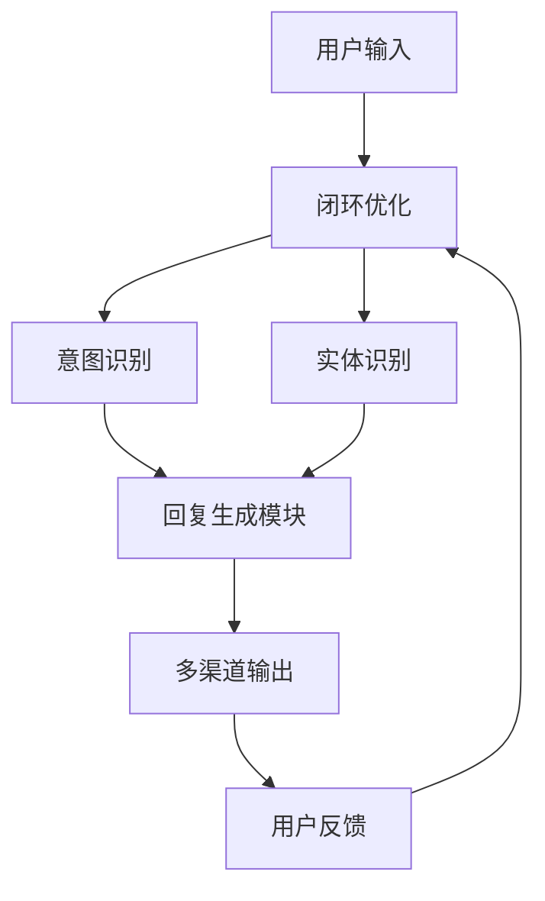
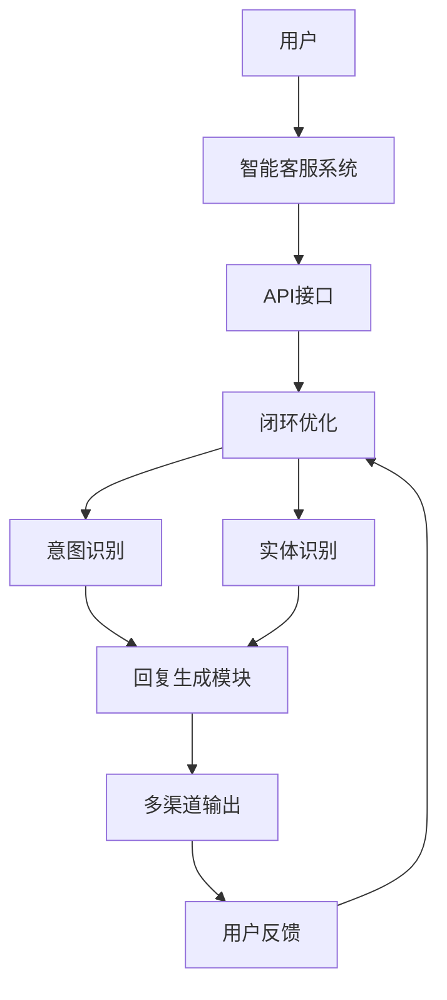

                 

### 智能客服革命：AI大模型改变服务业

关键词：智能客服、AI大模型、技术变革、服务业、用户体验

摘要：随着人工智能技术的飞速发展，智能客服正在引发服务业的深刻变革。本文将从智能客服的兴起与变革、AI大模型在客服领域的应用、智能客服解决方案以及未来发展趋势等方面，全面探讨智能客服革命如何改变服务业，提升用户体验。

### 第一部分：智能客服革命概述

#### 第1章：智能客服的兴起与变革

智能客服是指通过人工智能技术实现与用户自动交互的服务系统，能够提供快速、准确、个性化的服务。在过去的几年里，智能客服的发展经历了从基于规则的小型系统到如今基于AI大模型的全能型系统的转变。

##### **背景介绍**

- **概念术语说明**：智能客服（Intelligent Customer Service），AI大模型（Large-scale AI Model），服务业（Service Industry）。
- **问题背景**：随着互联网的普及和用户需求的多样化，传统的人工客服难以满足高效、个性化的服务需求。
- **问题描述**：用户在寻求服务时，常常遇到响应慢、处理效率低、服务质量不稳定等问题。
- **问题解决**：智能客服的出现，通过AI技术提升客服效率和用户体验，解决了传统客服的瓶颈。

##### **核心概念与联系**

- **核心概念原理**：智能客服的核心在于自然语言处理（NLP）和机器学习（ML），通过理解用户意图和提供相关回答，实现自动化客服。
- **概念属性特征对比表格**：

  | 特征       | 传统客服                   | 智能客服                     |
  |------------|----------------------------|------------------------------|
  | 交互方式   | 人工对话                  | 自动化对话                  |
  | 响应速度   | 较慢                       | 极快                         |
  | 服务质量   | 受限于人工客服能力        | 通过AI技术提高服务质量      |
  | 成本       | 较高                       | 成本降低                     |

- **ER实体关系图架构**：

  ```mermaid
  graph TB
  A[用户] --> B[智能客服系统]
  B --> C[自然语言处理模块]
  B --> D[机器学习模块]
  B --> E[知识库]
  ```

#### 第2章：AI大模型在客服领域的应用

AI大模型是指经过大量数据训练，能够处理复杂任务的深度学习模型。在客服领域，AI大模型的应用使得智能客服能够实现更高水平的服务。

##### **背景介绍**

- **概念术语说明**：AI大模型（Large-scale AI Model），深度学习（Deep Learning），神经网络（Neural Network）。
- **问题背景**：传统AI模型在处理复杂任务时存在局限，难以实现高效智能客服。
- **问题描述**：如何提高智能客服的智能水平和处理复杂问题的能力。
- **问题解决**：通过AI大模型，智能客服能够更好地理解用户意图，提供个性化服务。

##### **核心概念与联系**

- **核心概念原理**：AI大模型基于神经网络，通过大量数据训练，能够自动学习和优化，提升客服系统的智能水平。
- **概念属性特征对比表格**：

  | 特征           | 传统AI模型                 | AI大模型                     |
  |----------------|---------------------------|-----------------------------|
  | 训练数据规模   | 小数据集                   | 大数据集                     |
  | 模型复杂度     | 简单网络结构               | 复杂网络结构                 |
  | 学习能力       | 有限学习                   | 强大学习能力                 |

- **ER实体关系图架构**：

  ```mermaid
  graph TB
  A[用户数据] --> B[AI大模型]
  B --> C[自然语言处理模块]
  B --> D[机器学习模块]
  B --> E[知识库]
  ```

#### 第3章：智能客服的核心技术与原理

智能客服的核心技术包括自然语言处理、机器学习等。这些技术共同构成了智能客服的基础，使其能够实现自动化、智能化的服务。

##### **背景介绍**

- **概念术语说明**：自然语言处理（NLP），机器学习（ML），深度学习（Deep Learning），神经网络（Neural Network）。
- **问题背景**：传统客服系统在处理自然语言任务时效率低下，难以实现高效智能服务。
- **问题描述**：如何利用AI技术提升客服系统的智能处理能力。
- **问题解决**：通过自然语言处理和机器学习技术，智能客服能够更好地理解和处理用户需求。

##### **核心概念与联系**

- **核心概念原理**：
  - **自然语言处理（NLP）**：将自然语言转化为计算机可以理解的形式，实现人机交互。
  - **机器学习（ML）**：通过数据训练，使计算机自动学习和优化，提升任务处理能力。
  - **深度学习（Deep Learning）**：基于神经网络的一种机器学习方法，能够处理复杂任务。
- **概念属性特征对比表格**：

  | 特征           | 自然语言处理             | 机器学习                     |
  |----------------|-------------------------|-----------------------------|
  | 目标           | 理解和生成自然语言       | 自动化和优化任务处理         |
  | 技术原理       | 语言模型、词向量、语义分析 | 数据集、模型训练、优化       |
  | 应用领域       | 文本分类、情感分析、对话系统 | 预测、决策、推荐系统         |

- **ER实体关系图架构**：

  ```mermaid
  graph TB
  A[用户输入] --> B[自然语言处理模块]
  B --> C[意图识别]
  B --> D[实体识别]
  C --> E[回复生成模块]
  D --> E
  ```

### 第二部分：智能客服解决方案

#### 第4章：智能客服系统架构设计

智能客服系统的架构设计是确保系统高效、稳定、可扩展的关键。本章节将详细探讨智能客服系统的功能模块设计、技术选型以及安全性设计。

##### **背景介绍**

- **问题场景介绍**：在电商、金融、电信等众多行业中，智能客服已经成为提升用户体验、降低运营成本的重要工具。
- **项目介绍**：智能客服系统是一个面向用户、支持多渠道、多语言、多场景的综合性服务系统。
- **系统功能设计**：
  - **用户输入**：支持文本、语音等多种输入方式。
  - **意图识别**：通过自然语言处理技术，识别用户的意图。
  - **实体识别**：识别用户输入中的关键信息，如用户ID、商品名称等。
  - **回复生成**：根据识别的结果，生成相应的回复。
  - **知识库管理**：维护和更新客服系统的知识库，提高服务效率。

##### **系统架构设计**



##### **系统接口设计和系统交互**



#### 第5章：智能客服关键算法

智能客服的关键算法是实现智能处理的核心。本章节将详细讲解自然语言处理算法、机器学习算法在客服中的应用以及常见问题的自动解决策略。

##### **自然语言处理算法**

自然语言处理（NLP）是智能客服的核心技术之一。常用的NLP算法包括词向量、语言模型、语义分析等。

- **词向量**：将自然语言文本转换为向量表示，便于计算机处理。
- **语言模型**：预测文本的下一个单词或句子，用于生成自然语言回复。
- **语义分析**：理解文本的含义，提取关键信息，用于意图识别和实体识别。

##### **机器学习算法在客服中的应用**

机器学习算法在智能客服中的应用包括分类、预测、推荐等。

- **分类算法**：将用户输入分类到不同的类别，如请求类型、情感分类等。
- **预测算法**：预测用户的后续行为或需求，如购买意图、咨询问题等。
- **推荐算法**：根据用户的历史行为和偏好，推荐相关的服务或产品。

##### **常见问题的自动解决策略**

智能客服系统需要能够自动解决常见问题，以提高服务效率。常见的自动解决策略包括：

- **自动化回复**：根据预设的规则和模板，自动生成回复。
- **知识库查询**：从知识库中查询相关答案，提供解决方案。
- **多轮对话**：通过多轮对话，逐步理解用户问题，提供更准确的答案。

#### 第6章：智能客服系统的实战案例

本章节将通过电商、金融、电信等行业的实战案例，展示智能客服系统在实际应用中的效果和优势。

##### **案例一：电商平台的智能客服系统**

- **项目背景**：电商平台用户量大，客服需求高，传统人工客服难以满足需求。
- **系统实现**：采用自然语言处理和机器学习技术，实现自动识别用户意图和提供个性化服务。
- **效果分析**：智能客服系统大幅提升了客服效率，降低了运营成本，提高了用户满意度。

##### **案例二：金融行业的智能客服系统**

- **项目背景**：金融行业对服务质量要求高，传统人工客服成本高。
- **系统实现**：采用深度学习技术，实现高精度意图识别和智能回答。
- **效果分析**：智能客服系统提高了客服效率，降低了成本，提升了客户体验。

##### **案例三：电信运营商的智能客服系统**

- **项目背景**：电信运营商客服需求大，用户分布在各个渠道。
- **系统实现**：支持多渠道接入，如电话、短信、在线聊天等，实现一体化服务。
- **效果分析**：智能客服系统提高了服务效率，减少了人工成本，提升了用户满意度。

### 第三部分：智能客服的未来发展趋势

#### 第7章：智能客服的挑战与机遇

智能客服在发展过程中面临诸多挑战，同时也拥有广阔的发展机遇。

##### **7.1 智能客服面临的挑战**

- **数据质量**：智能客服依赖于大量高质量的数据，数据质量直接影响客服效果。
- **隐私保护**：智能客服涉及用户隐私，如何保护用户隐私成为一大挑战。
- **跨领域应用**：不同行业的需求和特点不同，智能客服需要具备跨领域应用能力。
- **技术更新**：AI技术更新迅速，智能客服系统需要不断迭代更新。

##### **7.2 智能客服的发展机遇**

- **市场规模**：随着AI技术的发展和用户需求的提升，智能客服市场前景广阔。
- **技术突破**：深度学习、自然语言处理等技术的突破，将为智能客服带来更多可能。
- **跨界合作**：智能客服与其他行业的融合，将创造出更多应用场景和商业价值。

#### 第8章：智能客服的未来展望

智能客服的未来将更加智能化、个性化，全面融入各个行业，提升服务质量和用户体验。

##### **8.1 智能客服的技术发展趋势**

- **AI大模型的深化应用**：AI大模型将在智能客服中发挥更大作用，实现更智能的服务。
- **多模态交互**：智能客服将支持多种交互方式，如语音、文本、图像等，提供更丰富的用户体验。
- **知识图谱**：通过知识图谱技术，智能客服将更好地理解和处理复杂问题。

##### **8.2 智能客服的行业应用前景**

- **电商**：智能客服将提高电商平台的用户体验，降低客服成本，提升转化率。
- **金融**：智能客服将提高金融服务的效率，降低风险，提升客户满意度。
- **电信**：智能客服将提高电信运营商的服务质量，降低运营成本，增强客户黏性。

##### **8.3 智能客服的未来挑战与应对策略**

- **数据隐私**：智能客服将采取更加严格的数据保护措施，确保用户隐私安全。
- **跨领域应用**：智能客服将加强对不同行业的理解和适应能力，提供定制化服务。
- **持续迭代**：智能客服将保持技术的不断更新，以适应快速变化的市场需求。

### 附录

#### 附录A：常用工具与资源

- **自然语言处理工具**：NLTK、spaCy、TensorFlow、PyTorch等。
- **机器学习框架**：scikit-learn、XGBoost、CatBoost等。
- **智能客服平台**：Rasa、Botpress、Ada等。

#### 附录B：智能客服项目案例列表

- **电商平台**：阿里巴巴、京东、亚马逊等。
- **金融行业**：招商银行、中国工商银行、花旗银行等。
- **电信行业**：中国移动、中国电信、美国AT&T等。

#### 附录C：参考资料与推荐阅读

- **《智能客服技术与应用》**：详细介绍了智能客服的核心技术和应用场景。
- **《深度学习入门》**：讲解了深度学习的基础知识，适合初学者学习。
- **《自然语言处理综合教程》**：系统介绍了自然语言处理的基本原理和应用。

### 总结

智能客服革命正在改变服务业，AI大模型的应用将进一步提升客服系统的智能水平和用户体验。在未来，智能客服将继续融合新技术，开拓新应用场景，为服务业带来更多价值。让我们一起期待智能客服的更加美好未来。

### 作者信息

作者：AI天才研究院/AI Genius Institute & 禅与计算机程序设计艺术 /Zen And The Art of Computer Programming

### 注意事项

1. 在实施智能客服项目时，需要充分考虑用户隐私和数据安全。
2. 智能客服系统需要不断迭代优化，以适应市场变化和用户需求。
3. 智能客服的发展离不开跨领域合作，共同探索更多应用场景。

### 拓展阅读

1. **《智能客服系统的设计与实现》**：详细讲解了智能客服系统的架构设计和关键算法。
2. **《深度学习在智能客服中的应用》**：介绍了深度学习在智能客服中的具体应用案例。
3. **《智能客服行业研究报告》**：分析了智能客服行业的市场现状和发展趋势。

