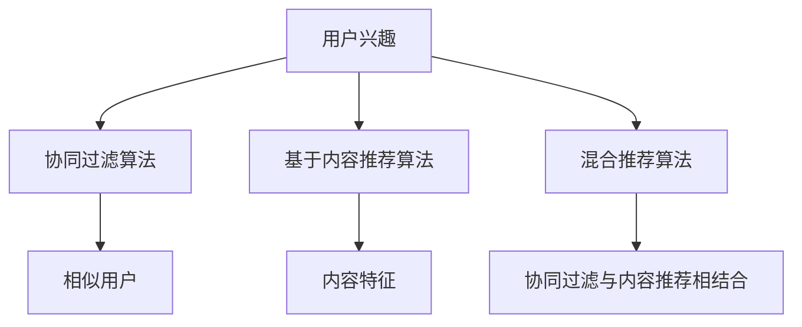
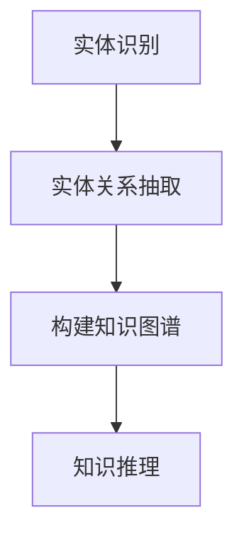
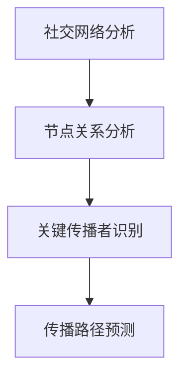

                 

## 有效进行技术分享与知识传播

### 引言

在当今高速发展的信息技术时代，技术分享与知识传播已成为推动技术创新、促进知识交流的重要手段。随着互联网的普及，人们对于技术知识的需求日益增长，有效进行技术分享与知识传播成为企业和个人面临的重要课题。本文旨在深入探讨技术分享与知识传播的核心概念、方法与策略，以帮助读者更好地理解和掌握这一领域的关键要素。

### 第一部分：背景介绍

#### 第1章 问题背景

1.1 问题描述

技术分享与知识传播在当今信息化社会中具有重要意义。随着互联网的普及和社交媒体的发展，人们对于技术知识的需求日益增长，而有效进行技术分享与知识传播成为企业和个人面临的重要课题。

1.2 问题解决

为了有效解决技术分享与知识传播的问题，我们需要了解技术分享与知识传播的核心概念、方法与策略，从而提高技术知识的传播效果和受众接受度。

1.3 边界与外延

技术分享与知识传播的边界主要包括技术知识、传播渠道、受众群体等方面。外延则涉及到技术领域的多元化、传播手段的多样化以及知识获取与传播的全球化趋势。

1.4 概念结构与核心要素组成

技术分享与知识传播的基本概念结构包括知识、技术、传播渠道、受众等核心要素。其中，知识是核心内容，技术是支撑手段，传播渠道是知识传递的桥梁，受众是知识接受者。

### 第二部分：核心概念与联系

#### 第2章 核心概念

2.1 技术分享

技术分享是指将个人或组织的技术知识和经验通过各种渠道进行传播和分享的过程。技术分享不仅有助于提高个人和组织的知名度，还能促进技术知识的传播和积累。

2.2 知识传播

知识传播是指将知识从一方传递到另一方，使其在不同个体或群体中扩散和共享的过程。知识传播的方式包括口头传播、书面传播、电子传播等。

2.3 传播渠道

传播渠道是知识传递的桥梁，包括线上和线下两种形式。线上传播渠道主要包括社交媒体、博客、论坛等；线下传播渠道则包括会议、讲座、研讨会等。

#### 第3章 算法原理讲解

3.1 技术分享与知识传播的算法

为了提高技术分享与知识传播的效果，我们可以借助一些算法来实现。以下介绍几种常见的算法原理：

##### 3.1.1 内容推荐算法

内容推荐算法是一种基于用户兴趣和行为数据的算法，旨在向用户推荐其可能感兴趣的内容。常见的推荐算法有协同过滤、基于内容的推荐、混合推荐等。

**Mermaid流程图：**

##### 3.1.2 知识图谱算法

知识图谱算法是一种基于图论和语义分析的算法，用于构建实体关系网络，从而实现知识的组织和传播。常见的知识图谱算法有基于规则的方法、基于机器学习的方法等。

**Mermaid流程图：**

##### 3.1.3 社交网络分析算法

社交网络分析算法是一种用于分析社交网络结构和传播路径的算法。通过分析社交网络中的节点关系，可以识别关键传播者、预测传播趋势等。

**Mermaid流程图：**

### 第三部分：数学模型和公式

#### 第4章 数学模型和数学公式

4.1 技术分享与知识传播的数学模型

技术分享与知识传播的过程可以用数学模型进行描述。以下介绍两种常见的数学模型：

##### 4.1.1 指数衰减模型

指数衰减模型是一种描述信息传播速度和范围的模型。其公式如下：
$$
f(t) = e^{-kt}
$$
其中，$f(t)$ 表示时间 $t$ 时的信息传播量，$k$ 表示衰减系数。

##### 4.1.2 多项式衰减模型

多项式衰减模型是一种更复杂的信息传播模型，其公式如下：
$$
f(t) = \frac{1}{1 + kt}
$$
其中，$f(t)$ 表示时间 $t$ 时的信息传播量，$k$ 表示衰减系数。

### 第四部分：系统分析与架构设计

#### 第5章 系统分析与架构设计

5.1 问题场景介绍

5.2 系统功能设计

5.3 系统架构设计

5.4 系统接口设计

5.5 系统交互

### 第五部分：项目实战

#### 第6章 项目实战

6.1 环境安装

6.2 系统核心实现

6.3 代码应用解读与分析

6.4 实际案例分析与详细讲解剖析

6.5 项目小结

### 第六部分：最佳实践、小结、注意事项、拓展阅读

#### 第7章 最佳实践

7.1 最佳实践

7.2 小结

7.3 注意事项

7.4 拓展阅读

---

**作者：AI天才研究院/AI Genius Institute & 禅与计算机程序设计艺术 /Zen And The Art of Computer Programming**

