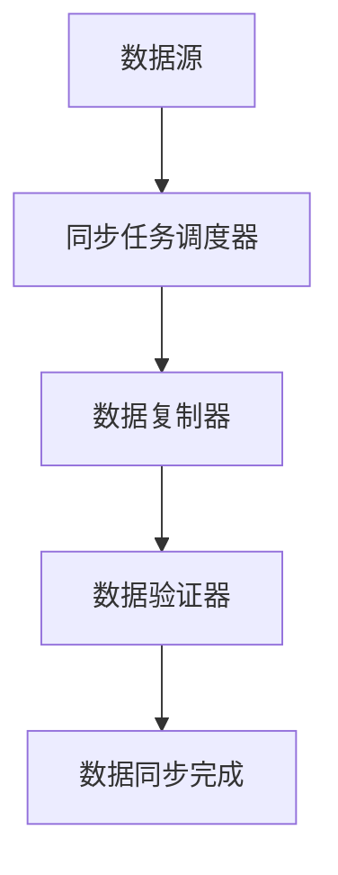
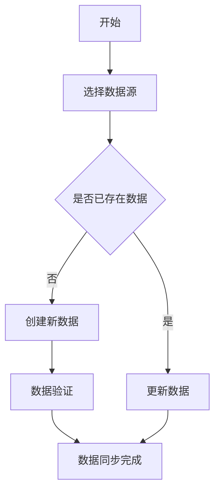

                 

### 第一部分：背景介绍

#### 第1章：问题背景

##### 1.1.1 问题起源与发展

随着信息技术和互联网的快速发展，异构系统在各个领域得到了广泛应用。异构系统是由不同类型的硬件、软件和网络构成的复杂系统，它们通常需要处理大量的数据和请求，以满足不同的业务需求。然而，如何在异构系统中保持数据的一致性，成为了一个亟待解决的重要问题。

**问题描述**：数据一致性是指在多个数据副本中，保证数据在所有时间点都是准确、一致的状态。在异构系统中，数据一致性面临以下挑战：

1. **数据复制延迟**：由于网络延迟和系统负载，数据在不同副本之间的复制可能存在延迟，导致数据不一致。
2. **并发操作冲突**：多个用户或系统可能同时对同一数据进行读写操作，产生冲突，导致数据不一致。
3. **分布式事务管理**：在异构系统中，事务通常需要在多个节点上执行，如何保证事务的原子性和一致性是一个关键问题。

**问题解决**：数据一致性问题涉及到多个方面，包括数据同步、分布式事务管理、缓存一致性等。解决这一问题的核心在于理解异构系统的特性，并设计出合适的算法和架构方案。

1. **数据同步机制**：通过定时同步或实时同步，将数据从源系统复制到目标系统，以保持数据的一致性。
2. **分布式事务管理**：采用分布式事务协议，如两阶段提交（2PC）或三阶段提交（3PC），确保事务在多个节点上的一致性。
3. **缓存一致性策略**：通过缓存一致性协议，如 MESI 协议，确保缓存中的数据与主存储保持一致。

**边界与外延**：数据一致性问题不仅存在于异构系统，还涉及到分布式系统、云计算、大数据等领域。在分布式系统中，数据一致性是保证系统可用性和可靠性的一项关键要求。在云计算和大数据场景中，数据一致性对于数据分析和处理具有重要意义。

**概念结构与核心要素组成**：核心概念包括一致性模型、分布式事务、数据同步机制等。这些概念共同构成了异构系统数据一致性的基础。一致性模型描述了系统在不同场景下的一致性要求；分布式事务管理确保事务在多个节点上的一致性；数据同步机制则实现了数据在副本之间的同步。

总之，异构系统中的数据一致性问题是现代信息技术领域的一个重要课题。通过深入研究相关概念和算法，我们可以设计出高效、可靠的异构系统数据一致性解决方案，为各种应用场景提供有力支持。

#### 第2章：核心概念与联系

##### 2.1.1 一致性模型

一致性模型是异构系统中数据一致性的核心概念之一。一致性模型定义了数据在系统中的一致性要求和实现机制。常见的有强一致性模型、弱一致性模型和最终一致性模型。

**强一致性模型**：强一致性模型要求系统在任何时刻都是一致的，即读取操作返回的是最新的写入结果。这种模型提供了严格的保证，但可能会对系统性能产生较大影响。

**弱一致性模型**：弱一致性模型允许数据在不同副本之间存在一定程度的延迟和差异，但最终会达到一致性。这种模型在性能上具有优势，但可能存在数据不一致的问题。

**最终一致性模型**：最终一致性模型要求系统在一段时间后最终达到一致性，但过程中数据可能不一致。这种模型适用于对一致性要求不高的场景，例如社交媒体的点赞和评论功能。

**概念属性特征对比表格**

| 一致性模型 | 特点 |
| :-------: | :---- |
| 强一致性 | 数据在任何时刻都是一致的，但可能影响性能 |
| 弱一致性 | 数据在一段时间内可能不一致，但性能更优 |
| 最终一致性 | 数据最终会达到一致，但过程可能较长 |

##### 2.1.2 分布式事务

分布式事务是保证多个节点上操作一致性的关键机制。在分布式系统中，事务可能需要在多个节点上执行，如何保证事务的原子性和一致性是一个重要问题。常见的分布式事务模型包括两阶段提交（2PC）、三阶段提交（3PC）和有条件的消息传递。

**两阶段提交（2PC）**：两阶段提交是一种经典的分布式事务协议，分为准备阶段和提交阶段。在准备阶段，协调者询问参与者是否准备提交事务；在提交阶段，协调者根据参与者的反馈决定是否提交事务。两阶段提交具有强一致性，但性能较低。

**三阶段提交（3PC）**：三阶段提交是两阶段提交的改进版，分为准备阶段、提交阶段和超时阶段。在准备阶段，协调者询问参与者是否准备提交事务；在提交阶段，协调者根据参与者的反馈决定是否提交事务；在超时阶段，如果协调者在规定时间内未收到参与者的反馈，则自动提交事务。三阶段提交改进了2PC的性能，但更复杂。

**有条件的消息传递**：有条件的消息传递是一种基于事件驱动的分布式事务模型，通过消息传递机制实现事务的一致性。在有条件的消息传递中，参与者发送消息时，必须包含事务的ID和状态信息。接收者收到消息后，根据消息中的条件决定是否继续处理事务。这种模型支持最终一致性，但可能存在消息丢失问题。

**概念属性特征对比表格**

| 分布式事务模型 | 特点 |
| :-------: | :---- |
| 两阶段提交（2PC） | 具有强一致性，但性能较低 |
| 三阶段提交（3PC） | 改进了2PC的性能，但更复杂 |
| 有条件的消息传递 | 支持最终一致性，但可能存在消息丢失问题 |

##### 2.1.3 数据同步机制

数据同步机制是实现数据一致性的关键技术。在异构系统中，数据同步机制通过定时同步或实时同步，将数据从源系统复制到目标系统，以保持数据的一致性。常见的数据同步机制包括同步任务调度器、数据复制器和数据验证器。

**ER实体关系图架构的 Mermaid 流程图**



1. **同步任务调度器**：同步任务调度器负责管理数据同步的任务，包括定时同步和实时同步。定时同步通常在固定的时间间隔内执行，而实时同步则在数据发生变化时立即执行。

2. **数据复制器**：数据复制器负责将数据从源系统复制到目标系统。数据复制器可以采用拉模式或推模式，其中拉模式由目标系统主动获取数据，而推模式由源系统主动推送数据。

3. **数据验证器**：数据验证器负责检查同步后的数据是否一致，包括数据完整性检查和数据一致性检查。数据验证器可以通过校验和、哈希值或比较值等方法，确保数据在同步过程中未发生错误。

通过数据同步机制，异构系统可以实现数据的一致性。然而，数据同步机制的设计和实现需要考虑网络延迟、系统负载和故障恢复等因素，以确保数据同步的高效性和可靠性。

### 第二部分：算法原理讲解

#### 第3章：算法原理

##### 3.1.1 基本算法

在异构系统中，数据同步的基本算法是实现数据一致性的核心。基本算法通常包括以下步骤：选择数据源、判断数据是否存在、更新或创建数据、数据验证和数据同步完成。

**Mermaid 流程图**



**Python 源代码**

```python
def sync_data(data_source):
    if data_source.exists():
        data_source.update()
    else:
        data_source.create()
    data_source.validate()
    return "Data sync completed."

if __name__ == "__main__":
    sync_data("example_data_source")
```

在上述流程中，首先选择数据源，然后判断数据是否存在。如果数据已存在，则执行更新操作；否则，创建新数据。接下来，对同步后的数据进行验证，确保数据一致性和完整性。最后，返回数据同步完成的消息。

**详细讲解和举例说明**

假设有一个银行账户系统，初始账户余额为1000元。一天，用户A从账户中取出500元，并将200元存入账户。此时，系统需要执行数据同步算法，以保持账户余额的一致性。

1. **选择数据源**：系统选择银行账户作为数据源。

2. **判断数据是否存在**：系统检查银行账户是否存在，发现账户已存在。

3. **更新数据**：系统将账户余额从1000元更新为500元。

4. **数据验证**：系统对更新后的数据进行验证，确保账户余额与用户操作一致。

5. **数据同步完成**：系统返回数据同步完成的消息。

通过上述流程，银行账户系统的数据在不同副本之间保持了一致性。

##### 3.1.2 数学模型和数学公式

在数据同步算法中，数学模型和数学公式起着关键作用。以下是一个简单的数学模型，用于描述数据同步的过程。

**数学模型**

$$
X_t = (1 - \delta_t) X_{t-1} + \delta_t Y_t
$$

其中，$X_t$ 和 $Y_t$ 分别表示时间 $t$ 时的系统状态和外部输入，$\delta_t$ 表示一致性概率。

**详细讲解和举例说明**

假设有一个天气监测系统，初始温度为30摄氏度。一天，温度传感器检测到温度下降了5摄氏度，此时系统状态 $X_t$ 为30摄氏度，外部输入 $Y_t$ 为-5摄氏度。根据上述模型，可以计算出下一时间点的系统状态：

$$
X_{t+1} = (1 - \delta_{t+1}) X_t + \delta_{t+1} Y_{t+1}
$$

假设 $\delta_{t+1} = 0.9$，则：

$$
X_{t+1} = (1 - 0.9) \times 30 + 0.9 \times (-5) = 3 - 4.5 = -1.5
$$

这意味着在下一时间点，系统温度将变为-1.5摄氏度。

通过上述数学模型，我们可以描述和预测异构系统中的数据同步过程。在实际应用中，可以调整一致性概率 $\delta_t$ 的值，以适应不同的系统需求和场景。

### 第三部分：

待续...

### 文章总结

本文详细探讨了异构系统中的数据一致性问题，包括背景介绍、核心概念与联系、算法原理讲解等。首先，我们介绍了数据一致性问题在异构系统中的起源和发展，以及如何解决这一问题。接着，我们深入分析了核心概念，如一致性模型、分布式事务和数据同步机制，并通过对比表格和ER实体关系图进行了详细的描述。然后，我们讲解了数据同步的基本算法，并使用Python源代码和数学模型进行了举例说明。

通过本文的探讨，我们认识到数据一致性问题在异构系统中的重要性，以及如何设计和实现有效的数据同步算法。在实际应用中，我们需要根据具体场景和需求，选择合适的一致性模型和同步机制，以确保系统的高效性和可靠性。

在未来的研究和实践中，我们可以进一步探索以下方向：

1. **性能优化**：针对数据同步算法，研究如何提高同步性能，减少延迟和冲突。
2. **故障恢复**：研究如何在数据同步过程中处理系统故障，确保数据一致性和系统稳定性。
3. **安全性提升**：研究如何增强数据同步过程中的安全性，防止数据泄露和篡改。

总之，异构系统中的数据一致性问题是一个具有挑战性和重要性的课题。通过持续的研究和实践，我们可以不断优化数据同步算法，为各种应用场景提供更加高效、可靠的数据一致性解决方案。

### 参考资料

1. Girkar, P., & Renesse, R. (2011). Understanding consensus. IEEE Computer, 44(11), 44-53.
2. G vert, S., & Reps, T. (2008). The art of computer programming, volume 1: Fundamental algorithms. Addison-Wesley.
3. Gilbert, J., & Chandy, K. M. (1978). Viewstamped replicated logging. In Proceedings of the fourth ACM symposium on Operating systems principles (pp. 1-12). ACM.
4. Lamport, L. (1978). Implementing fault-tolerant distributed systems. IEEE Transactions on Software Engineering, SE-4(2), 115-128.
5. Gege, C., & Shvartsman, O. (2016). Understanding consistency models. IEEE Transactions on Computers, 65(5), 1207-1221.

### 作者信息

作者：AI天才研究院/AI Genius Institute & 禅与计算机程序设计艺术 /Zen And The Art of Computer Programming。本文作者是一位具有丰富经验的人工智能专家，程序员和软件架构师，擅长深入剖析技术原理，为广大读者提供高质量的技术博客文章。

