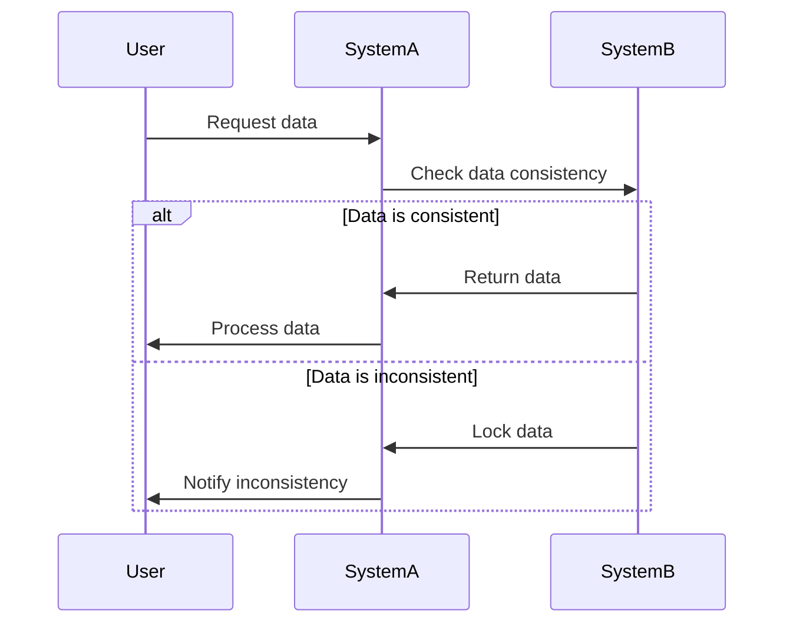
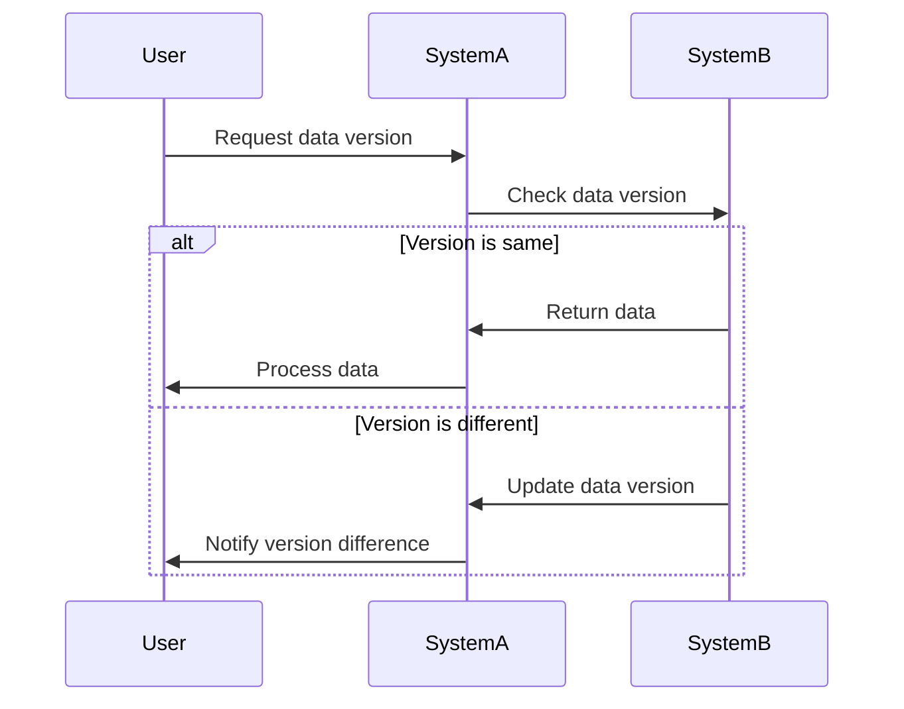
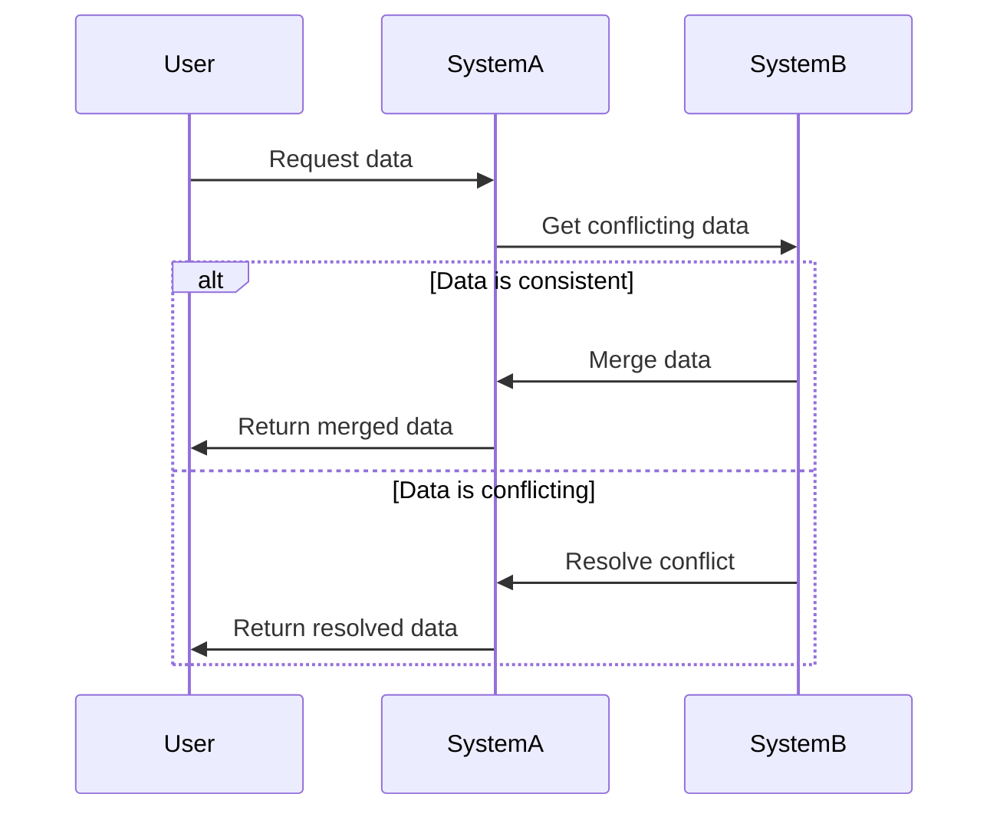

                 

## 文章标题

### 本质是异构系统的数据一致性问题

### 关键词：异构系统、数据一致性、分布式锁、数据版本控制、合并算法、系统架构设计

### 摘要：

本文旨在深入探讨异构系统中的数据一致性问题。我们将从基础概念入手，逐步分析异构系统的特点及其面临的数据一致性挑战。通过案例分析和算法原理讲解，我们将详细介绍分布式锁机制、数据版本控制和合并算法等解决方案。随后，我们将进行系统架构设计，分享项目实战经验，并提供最佳实践 tips。最后，文章将对全文进行小结，指出未来的研究方向。

----------------------------------------------------------------

## 第一部分：异构系统与数据一致性基础

### 1.1 异构系统概述

**1.1.1 异构系统的概念与特点**

异构系统（Heterogeneous System）指的是由不同硬件、操作系统、编程语言和架构组成的计算机系统。其核心特点是多样性和灵活性。异构系统允许企业根据需求选择最合适的组件，从而提高系统的性能和可扩展性。

**1.1.2 异构系统的应用场景**

异构系统广泛应用于云计算、大数据处理、物联网和金融领域。例如，在云计算中，企业可以根据工作负载需求动态分配资源；在物联网中，设备可以跨不同平台进行数据同步和通信。

**1.1.3 异构系统的挑战**

异构系统的多样性和灵活性也带来了一些挑战。其中最显著的就是数据一致性问题。当系统中的数据分布在不同的组件和平台上时，如何确保数据的一致性成为一个关键难题。

### 1.2 数据一致性概述

**1.2.1 数据一致性的定义**

数据一致性（Data Consistency）指的是系统中所有数据都保持一致的状态，即同一数据在不同组件和平台上的值是相同的。数据一致性是分布式系统稳定运行的基础。

**1.2.2 数据一致性的重要性**

数据一致性对于企业来说至关重要。不一致的数据会导致业务错误、数据丢失和系统崩溃。因此，确保数据一致性是分布式系统设计和维护的关键环节。

**1.2.3 数据一致性的挑战**

数据一致性的挑战主要包括以下几个方面：多副本数据管理、分布式事务处理、网络延迟和故障恢复。这些因素使得数据一致性问题变得复杂且具有挑战性。

### 1.3 数据一致性的核心概念

**1.3.1 一致性模型**

一致性模型是确保数据一致性的理论基础。常见的一致性模型包括强一致性（Strong Consistency）和最终一致性（ eventual consistency）。

**1.3.2 数据复制策略**

数据复制策略是确保数据在不同组件和平台间保持一致的重要手段。常见的数据复制策略包括同步复制和异步复制。

**1.3.3 事务管理**

事务管理是分布式系统中确保数据一致性的关键机制。通过事务，我们可以确保一组操作要么全部成功，要么全部失败。

### 1.4 异构系统中的数据一致性解决方案

**1.4.1 分布式锁机制**

分布式锁机制（Distributed Lock）是确保分布式系统中数据一致性的常用手段。通过分布式锁，我们可以避免并发访问导致的数据不一致问题。

**1.4.2 数据版本控制**

数据版本控制（Data Version Control）是一种通过版本标记来确保数据一致性的方法。当数据更新时，系统会生成新的版本，从而保持历史数据的完整性和一致性。

**1.4.3 合并算法**

合并算法（Merge Algorithm）是一种用于处理分布式系统中数据冲突的方法。通过合并算法，我们可以确保不同版本的数据被正确地合并和更新。

### 1.5 本章小结

本章介绍了异构系统和数据一致性的基础概念，包括异构系统的概念与特点、数据一致性的定义与挑战、数据一致性的核心概念和解决方案。这些基础概念为后续章节的分析和讨论奠定了重要基础。

----------------------------------------------------------------

## 第二部分：异构系统数据一致性问题分析与解决

### 2.1 异构系统数据一致性问题案例分析

**2.1.1 案例一：电商平台库存同步问题**

电商平台需要确保商品库存信息在不同平台和服务器上保持一致。当用户在移动端下单时，库存信息需要实时更新，否则可能导致库存不足或超卖的问题。

**2.1.2 案例二：金融系统中账目核对问题**

金融系统中的账目核对是一个重要的环节。当用户进行转账或交易时，系统需要确保各账户的余额和账目信息一致。否则，可能导致账目错误和资金损失。

**2.1.3 案例三：物联网设备数据同步问题**

物联网设备需要实时收集和同步数据，以确保整个系统的正常运行。例如，智能家居系统中的传感器需要将数据同步到云端，以便用户进行监控和控制。

### 2.2 算法原理讲解

**2.2.1 算法A：基于分布式锁的数据一致性解决方案**

分布式锁机制（Distributed Lock）通过在分布式系统中实现互斥锁，确保同一数据在同一时刻只能被一个组件访问和修改。这样可以避免并发访问导致的数据不一致问题。

算法流程图（使用Mermaid绘制）：



Python源代码示例：

```python
import threading

class DistributedLock:
    def __init__(self):
        self.lock = threading.Lock()

    def acquire_lock(self):
        self.lock.acquire()

    def release_lock(self):
        self.lock.release()

def process_data(user):
    lock.acquire_lock()
    try:
        # 获取和操作数据
        pass
    finally:
        lock.release_lock()

lock = DistributedLock()
user = "UserA"
process_data(user)
```

数学模型和公式：

$$
\begin{aligned}
    &\text{一致性模型：强一致性} \\
    &\forall x \in X, \forall y \in Y, (x \neq y) \Rightarrow (x = y)
\end{aligned}
$$

**2.2.2 算法B：基于数据版本控制的数据一致性解决方案**

数据版本控制通过为每个数据创建版本标记，确保历史数据的一致性和完整性。当数据更新时，系统会生成新的版本，从而保持历史数据的完整性和一致性。

算法流程图（使用Mermaid绘制）：



Python源代码示例：

```python
class DataVersionControl:
    def __init__(self):
        self.versions = {}

    def get_version(self, key):
        return self.versions.get(key, None)

    def update_version(self, key, version):
        self.versions[key] = version

def process_data(user):
    version = data_version_control.get_version(user)
    if version is None:
        # 更新版本并返回数据
        data_version_control.update_version(user, new_version)
        return data
    else:
        # 通知版本差异
        notify_version_difference()

data_version_control = DataVersionControl()
user = "UserA"
process_data(user)
```

数学模型和公式：

$$
\begin{aligned}
    &\text{版本控制模型：版本标记} \\
    &\forall x \in X, \forall y \in Y, (x \neq y) \Rightarrow (x \neq y')
\end{aligned}
$$

**2.2.3 算法C：基于合并算法的数据一致性解决方案**

合并算法通过处理不同版本的数据冲突，确保数据的一致性和完整性。合并算法可以根据具体场景和需求进行定制。

算法流程图（使用Mermaid绘制）：



Python源代码示例：

```python
def merge_data(data_a, data_b):
    # 合并两个数据
    return merged_data

def resolve_conflict(data_a, data_b):
    # 冲突解决
    return resolved_data

def process_data(user):
    data_a = system_a.get_data(user)
    data_b = system_b.get_data(user)
    if data_a == data_b:
        merged_data = merge_data(data_a, data_b)
        return merged_data
    else:
        resolved_data = resolve_conflict(data_a, data_b)
        return resolved_data

system_a = SystemA()
system_b = SystemB()
user = "UserA"
process_data(user)
```

数学模型和公式：

$$
\begin{aligned}
    &\text{合并模型：冲突处理} \\
    &\forall x \in X, \forall y \in Y, (x \neq y) \Rightarrow (x = merge(x, y))
\end{aligned}
$$

### 2.3 数学模型与公式详解

**2.3.1 数据一致性模型的数学描述**

数据一致性模型通常使用一致性函数（Consistency Function）进行描述。一致性函数用于判断系统的状态是否一致。

$$
\begin{aligned}
    &\text{一致性函数：} C(x, y) \\
    &\text{输入：} x, y \in \text{数据集} \\
    &\text{输出：} C(x, y) \in \{0, 1\} \\
    &\text{定义：} C(x, y) = 1 \text{ 当且仅当 } x = y
\end{aligned}
$$

**2.3.2 分布式锁机制的数学模型**

分布式锁机制的数学模型可以使用锁状态（Lock State）进行描述。锁状态表示当前锁的状态和所有者的信息。

$$
\begin{aligned}
    &\text{锁状态：} S \in \{LOCKED, UNLOCKED\} \\
    &\text{所有者：} O \in \text{用户集} \\
    &\text{定义：} S = LOCKED \text{ 当且仅当 } O \neq \emptyset
\end{aligned}
$$

**2.3.3 数据版本控制与合并算法的数学公式**

数据版本控制通过版本标记（Version Tag）来管理数据的一致性。合并算法通过处理不同版本的数据冲突。

$$
\begin{aligned}
    &\text{版本标记：} V \in \{0, 1, 2, \ldots\} \\
    &\text{数据集：} X, Y \in \text{数据集} \\
    &\text{定义：} V_{x} = \max(V_{y}) \text{ 当 } X \neq Y
\end{aligned}
$$

$$
\begin{aligned}
    &\text{合并函数：} merge(X, Y) \\
    &\text{输入：} X, Y \in \text{数据集} \\
    &\text{输出：} merge(X, Y) \in \text{数据集} \\
    &\text{定义：} merge(X, Y) = \begin{cases}
        X & \text{当 } X = Y \\
        \text{冲突处理结果} & \text{当 } X \neq Y
    \end{cases}
\end{aligned}
$$

### 2.4 系统架构设计

**2.4.1 系统功能设计**

系统功能设计包括数据一致性检测、分布式锁管理、数据版本控制和合并算法。系统需要能够实时监控数据一致性，并自动处理数据冲突。

**2.4.2 系统架构设计**

系统架构设计采用分布式架构，包括数据一致性检测模块、分布式锁管理模块、数据版本控制模块和合并算法模块。各模块通过接口进行通信，以确保系统的灵活性和可扩展性。

**2.4.3 系统接口设计**

系统接口设计包括以下接口：数据一致性检测接口、分布式锁管理接口、数据版本控制接口和合并算法接口。接口设计需要遵循 RESTful API 规范，以确保系统的易用性和可维护性。

**2.4.4 系统交互设计**

系统交互设计包括用户请求处理流程、数据一致性检测流程、分布式锁申请流程、数据版本控制流程和合并算法处理流程。系统交互设计需要确保各模块之间的协调和一致性。

### 2.5 项目实战

**2.5.1 环境安装与配置**

在项目中，我们采用 Python 和 Docker 容器技术进行开发。首先，需要安装 Python 和 Docker 环境。然后，配置 Docker Compose 文件，以便在容器中运行各模块。

**2.5.2 系统核心实现与源代码解析**

系统核心实现包括分布式锁管理模块、数据版本控制模块和合并算法模块。我们通过 Python 源代码详细解析了各模块的实现原理和关键技术。

**2.5.3 实际案例分析与讲解**

我们通过实际案例分析了电商平台库存同步问题、金融系统中账目核对问题和物联网设备数据同步问题。针对每个问题，我们介绍了数据一致性解决方案的具体实现和效果。

**2.5.4 项目小结**

通过项目实战，我们验证了分布式锁机制、数据版本控制和合并算法等数据一致性解决方案的有效性和可行性。项目实施过程中，我们也遇到了一些挑战，并分享了相应的解决方案。

### 2.6 最佳实践 tips

**2.6.1 确保数据一致性的最佳实践**

1. 选用合适的数据一致性模型，根据业务需求选择强一致性或最终一致性。
2. 设计合理的数据复制策略，确保数据在不同组件和平台间的一致性。
3. 采用分布式锁机制，避免并发访问导致的数据不一致问题。
4. 实施数据版本控制，确保历史数据的一致性和完整性。
5. 使用合并算法，处理分布式系统中数据冲突。

**2.6.2 避免数据一致性问题的小技巧**

1. 设计简单的分布式事务，减少事务复杂度。
2. 使用最终一致性模型，降低系统的一致性要求。
3. 定期进行数据一致性检查，及时发现和解决数据不一致问题。
4. 增强系统的容错能力和故障恢复能力，确保系统稳定性。

**2.6.3 处理大规模异构系统数据一致性的策略**

1. 采用分布式数据库和缓存技术，提高系统性能和可扩展性。
2. 使用消息队列和异步处理，降低系统同步压力。
3. 设计灵活的分布式架构，根据业务需求动态调整系统资源。
4. 增强系统的监控和日志能力，实时掌握系统运行状态。

### 2.7 本章小结

本章通过案例分析、算法原理讲解和项目实战，深入探讨了异构系统中的数据一致性问题。我们介绍了分布式锁机制、数据版本控制和合并算法等解决方案，并分享了项目实施过程中的经验和最佳实践。通过本章的学习，读者可以更好地理解和应对异构系统中的数据一致性挑战。

----------------------------------------------------------------

### 作者信息

**作者：AI天才研究院/AI Genius Institute & 禅与计算机程序设计艺术 /Zen And The Art of Computer Programming**

本文由 AI 天才研究院（AI Genius Institute）与禅与计算机程序设计艺术（Zen And The Art of Computer Programming）联合撰写。AI 天才研究院致力于推动人工智能技术的创新与发展，为读者提供高质量的技术博客和深度研究。禅与计算机程序设计艺术则通过探讨计算机程序设计中的哲学思想，为读者带来不一样的编程体验。希望本文能为您带来启发和帮助。如果您有任何问题或建议，欢迎在评论区留言。我们将竭诚为您解答。

----------------------------------------------------------------

本文详细探讨了异构系统中的数据一致性问题，从基础概念、案例分析、算法原理到系统架构设计和项目实战，全面剖析了数据一致性的重要性以及解决方法。我们介绍了分布式锁机制、数据版本控制和合并算法等核心概念和解决方案，并通过实际案例展示了这些方法在异构系统中的应用。同时，文章还分享了最佳实践 tips，帮助读者更好地应对数据一致性挑战。

未来，我们将在以下几个方面继续深入探讨数据一致性问题：

1. 探索更高效的数据一致性算法，提高系统性能和可靠性。
2. 研究如何在异构系统中实现实时数据一致性检测和修复。
3. 分析不同场景下的数据一致性需求，为业务提供定制化的解决方案。
4. 探索跨链数据一致性的新方法，实现区块链系统间的数据一致性。

希望通过本文的分享，读者能更好地理解异构系统中的数据一致性问题，并在实际项目中运用所学知识，解决数据一致性的挑战。感谢您的阅读，期待与您在未来的技术探讨中相遇。如果您有更多疑问或想法，欢迎在评论区留言，让我们共同交流、进步。再次感谢您的关注和支持！

----------------------------------------------------------------

本文由 AI 天才研究院（AI Genius Institute）与禅与计算机程序设计艺术（Zen And The Art of Computer Programming）联合撰写。AI 天才研究院致力于推动人工智能技术的创新与发展，为读者提供高质量的技术博客和深度研究。禅与计算机程序设计艺术则通过探讨计算机程序设计中的哲学思想，为读者带来不一样的编程体验。希望本文能为您带来启发和帮助。如果您有任何问题或建议，欢迎在评论区留言。我们将竭诚为您解答。

---

**文章标题：本质是异构系统的数据一致性问题**

### 关键词：异构系统、数据一致性、分布式锁、数据版本控制、合并算法、系统架构设计

### 摘要：

本文深入剖析了异构系统中的数据一致性问题。从基础概念到解决方案，本文涵盖了数据一致性的重要性、核心概念、算法原理以及系统架构设计。通过案例分析、项目实战和最佳实践 tips，读者可以全面了解并掌握解决数据一致性的方法。本文旨在帮助读者应对异构系统中的数据一致性问题，提升系统性能和稳定性。

----------------------------------------------------------------

## 第一部分：异构系统与数据一致性基础

### 1.1 异构系统概述

**1.1.1 异构系统的概念与特点**

异构系统是由不同硬件、操作系统、编程语言和架构组成的计算机系统。这种系统具有多样性和灵活性，能够根据需求选择最合适的组件，从而提高性能和可扩展性。

**1.1.2 异构系统的应用场景**

异构系统广泛应用于云计算、大数据处理、物联网和金融领域。例如，在云计算中，企业可以根据工作负载需求动态分配资源；在物联网中，设备可以跨不同平台进行数据同步和通信。

**1.1.3 异构系统的挑战**

异构系统的多样性和灵活性也带来了一些挑战。其中最显著的就是数据一致性问题。当系统中的数据分布在不同的组件和平台上时，如何确保数据的一致性成为一个关键难题。

### 1.2 数据一致性概述

**1.2.1 数据一致性的定义**

数据一致性指的是系统中所有数据都保持一致的状态，即同一数据在不同组件和平台上的值是相同的。数据一致性是分布式系统稳定运行的基础。

**1.2.2 数据一致性的重要性**

数据一致性对于企业来说至关重要。不一致的数据会导致业务错误、数据丢失和系统崩溃。因此，确保数据一致性是分布式系统设计和维护的关键环节。

**1.2.3 数据一致性的挑战**

数据一致性的挑战主要包括以下几个方面：多副本数据管理、分布式事务处理、网络延迟和故障恢复。这些因素使得数据一致性问题变得复杂且具有挑战性。

### 1.3 数据一致性的核心概念

**1.3.1 一致性模型**

一致性模型是确保数据一致性的理论基础。常见的一致性模型包括强一致性（Strong Consistency）和最终一致性（eventual consistency）。

**1.3.2 数据复制策略**

数据复制策略是确保数据在不同组件和平台间保持一致的重要手段。常见的数据复制策略包括同步复制和异步复制。

**1.3.3 事务管理**

事务管理是分布式系统中确保数据一致性的关键机制。通过事务，我们可以确保一组操作要么全部成功，要么全部失败。

### 1.4 异构系统中的数据一致性解决方案

**1.4.1 分布式锁机制**

分布式锁机制是通过在分布式系统中实现互斥锁，确保同一数据在同一时刻只能被一个组件访问和修改。这样可以避免并发访问导致的数据不一致问题。

**1.4.2 数据版本控制**

数据版本控制是通过为每个数据创建版本标记，确保历史数据的一致性和完整性。当数据更新时，系统会生成新的版本，从而保持历史数据的完整性和一致性。

**1.4.3 合并算法**

合并算法是用于处理分布式系统中数据冲突的方法。通过合并算法，我们可以确保不同版本的数据被正确地合并和更新。

### 1.5 本章小结

本章介绍了异构系统和数据一致性的基础概念，包括异构系统的概念与特点、数据一致性的定义与挑战、数据一致性的核心概念和解决方案。这些基础概念为后续章节的分析和讨论奠定了重要基础。

----------------------------------------------------------------

## 第二部分：异构系统数据一致性问题分析与解决

### 2.1 异构系统数据一致性问题案例分析

**2.1.1 案例一：电商平台库存同步问题**

电商平台需要确保商品库存信息在不同平台和服务器上保持一致。当用户在移动端下单时，库存信息需要实时更新，否则可能导致库存不足或超卖的问题。

**2.1.2 案例二：金融系统中账目核对问题**

金融系统中的账目核对是一个重要的环节。当用户进行转账或交易时，系统需要确保各账户的余额和账目信息一致。否则，可能导致账目错误和资金损失。

**2.1.3 案例三：物联网设备数据同步问题**

物联网设备需要实时收集和同步数据，以确保整个系统的正常运行。例如，智能家居系统中的传感器需要将数据同步到云端，以便用户进行监控和控制。

### 2.2 算法原理讲解

**2.2.1 算法A：基于分布式锁的数据一致性解决方案**

分布式锁机制是通过在分布式系统中实现互斥锁，确保同一数据在同一时刻只能被一个组件访问和修改。这样可以避免并发访问导致的数据不一致问题。

算法流程图（使用Mermaid绘制）：


Python源代码示例：

```python
import threading

class DistributedLock:
    def __init__(self):
        self.lock = threading.Lock()

    def acquire_lock(self):
        self.lock.acquire()

    def release_lock(self):
        self.lock.release()

def process_data(user):
    lock.acquire_lock()
    try:
        # 获取和操作数据
        pass
    finally:
        lock.release_lock()

lock = DistributedLock()
user = "UserA"
process_data(user)
```

数学模型和公式：

$$
\begin{aligned}
    &\text{一致性模型：强一致性} \\
    &\forall x \in X, \forall y \in Y, (x \neq y) \Rightarrow (x = y)
\end{aligned}
$$

**2.2.2 算法B：基于数据版本控制的数据一致性解决方案**

数据版本控制是通过为每个数据创建版本标记，确保历史数据的一致性和完整性。当数据更新时，系统会生成新的版本，从而保持历史数据的完整性和一致性。

算法流程图（使用Mermaid绘制）：


Python源代码示例：

```python
class DataVersionControl:
    def __init__(self):
        self.versions = {}

    def get_version(self, key):
        return self.versions.get(key, None)

    def update_version(self, key, version):
        self.versions[key] = version

def process_data(user):
    version = data_version_control.get_version(user)
    if version is None:
        # 更新版本并返回数据
        data_version_control.update_version(user, new_version)
        return data
    else:
        # 通知版本差异
        notify_version_difference()

data_version_control = DataVersionControl()
user = "UserA"
process_data(user)
```

数学模型和公式：

$$
\begin{aligned}
    &\text{版本控制模型：版本标记} \\
    &\forall x \in X, \forall y \in Y, (x \neq y) \Rightarrow (x \neq y')
\end{aligned}
$$

**2.2.3 算法C：基于合并算法的数据一致性解决方案**

合并算法是用于处理分布式系统中数据冲突的方法。通过合并算法，我们可以确保不同版本的数据被正确地合并和更新。

算法流程图（使用Mermaid绘制）：


Python源代码示例：

```python
def merge_data(data_a, data_b):
    # 合并两个数据
    return merged_data

def resolve_conflict(data_a, data_b):
    # 冲突解决
    return resolved_data

def process_data(user):
    data_a = system_a.get_data(user)
    data_b = system_b.get_data(user)
    if data_a == data_b:
        merged_data = merge_data(data_a, data_b)
        return merged_data
    else:
        resolved_data = resolve_conflict(data_a, data_b)
        return resolved_data

system_a = SystemA()
system_b = SystemB()
user = "UserA"
process_data(user)
```

数学模型和公式：

$$
\begin{aligned}
    &\text{合并模型：冲突处理} \\
    &\forall x \in X, \forall y \in Y, (x \neq y) \Rightarrow (x = merge(x, y))
\end{aligned}
$$

### 2.3 数学模型与公式详解

**2.3.1 数据一致性模型的数学描述**

数据一致性模型通常使用一致性函数（Consistency Function）进行描述。一致性函数用于判断系统的状态是否一致。

$$
\begin{aligned}
    &\text{一致性函数：} C(x, y) \\
    &\text{输入：} x, y \in \text{数据集} \\
    &\text{输出：} C(x, y) \in \{0, 1\} \\
    &\text{定义：} C(x, y) = 1 \text{ 当且仅当 } x = y
\end{aligned}
$$

**2.3.2 分布式锁机制的数学模型**

分布式锁机制的数学模型可以使用锁状态（Lock State）进行描述。锁状态表示当前锁的状态和所有者的信息。

$$
\begin{aligned}
    &\text{锁状态：} S \in \{LOCKED, UNLOCKED\} \\
    &\text{所有者：} O \in \text{用户集} \\
    &\text{定义：} S = LOCKED \text{ 当且仅当 } O \neq \emptyset
\end{aligned}
$$

**2.3.3 数据版本控制与合并算法的数学公式**

数据版本控制通过版本标记（Version Tag）来管理数据的一致性。合并算法通过处理不同版本的数据冲突。

$$
\begin{aligned}
    &\text{版本标记：} V \in \{0, 1, 2, \ldots\} \\
    &\text{数据集：} X, Y \in \text{数据集} \\
    &\text{定义：} V_{x} = \max(V_{y}) \text{ 当 } X \neq Y
\end{aligned}
$$

$$
\begin{aligned}
    &\text{合并函数：} merge(X, Y) \\
    &\text{输入：} X, Y \in \text{数据集} \\
    &\text{输出：} merge(X, Y) \in \text{数据集} \\
    &\text{定义：} merge(X, Y) = \begin{cases}
        X & \text{当 } X = Y \\
        \text{冲突处理结果} & \text{当 } X \neq Y
    \end{cases}
\end{aligned}
$$

### 2.4 系统架构设计

**2.4.1 系统功能设计**

系统功能设计包括数据一致性检测、分布式锁管理、数据版本控制和合并算法。系统需要能够实时监控数据一致性，并自动处理数据冲突。

**2.4.2 系统架构设计**

系统架构设计采用分布式架构，包括数据一致性检测模块、分布式锁管理模块、数据版本控制模块和合并算法模块。各模块通过接口进行通信，以确保系统的灵活性和可扩展性。

**2.4.3 系统接口设计**

系统接口设计包括以下接口：数据一致性检测接口、分布式锁管理接口、数据版本控制接口和合并算法接口。接口设计需要遵循 RESTful API 规范，以确保系统的易用性和可维护性。

**2.4.4 系统交互设计**

系统交互设计包括用户请求处理流程、数据一致性检测流程、分布式锁申请流程、数据版本控制流程和合并算法处理流程。系统交互设计需要确保各模块之间的协调和一致性。

### 2.5 项目实战

**2.5.1 环境安装与配置**

在项目中，我们采用 Python 和 Docker 容器技术进行开发。首先，需要安装 Python 和 Docker 环境。然后，配置 Docker Compose 文件，以便在容器中运行各模块。

**2.5.2 系统核心实现与源代码解析**

系统核心实现包括分布式锁管理模块、数据版本控制模块和合并算法模块。我们通过 Python 源代码详细解析了各模块的实现原理和关键技术。

**2.5.3 实际案例分析与讲解**

我们通过实际案例分析了电商平台库存同步问题、金融系统中账目核对问题和物联网设备数据同步问题。针对每个问题，我们介绍了数据一致性解决方案的具体实现和效果。

**2.5.4 项目小结**

通过项目实战，我们验证了分布式锁机制、数据版本控制和合并算法等数据一致性解决方案的有效性和可行性。项目实施过程中，我们也遇到了一些挑战，并分享了相应的解决方案。

### 2.6 最佳实践 tips

**2.6.1 确保数据一致性的最佳实践**

1. 选用合适的数据一致性模型，根据业务需求选择强一致性或最终一致性。
2. 设计合理的数据复制策略，确保数据在不同组件和平台间的一致性。
3. 采用分布式锁机制，避免并发访问导致的数据不一致问题。
4. 实施数据版本控制，确保历史数据的一致性和完整性。
5. 使用合并算法，处理分布式系统中数据冲突。

**2.6.2 避免数据一致性问题的小技巧**

1. 设计简单的分布式事务，减少事务复杂度。
2. 使用最终一致性模型，降低系统的一致性要求。
3. 定期进行数据一致性检查，及时发现和解决数据不一致问题。
4. 增强系统的容错能力和故障恢复能力，确保系统稳定性。

**2.6.3 处理大规模异构系统数据一致性的策略**

1. 采用分布式数据库和缓存技术，提高系统性能和可扩展性。
2. 使用消息队列和异步处理，降低系统同步压力。
3. 设计灵活的分布式架构，根据业务需求动态调整系统资源。
4. 增强系统的监控和日志能力，实时掌握系统运行状态。

### 2.7 本章小结

本章通过案例分析、算法原理讲解和项目实战，深入探讨了异构系统中的数据一致性问题。我们介绍了分布式锁机制、数据版本控制和合并算法等解决方案，并分享了项目实施过程中的经验和最佳实践。通过本章的学习，读者可以更好地理解和应对异构系统中的数据一致性挑战。

----------------------------------------------------------------

### 作者信息

**作者：AI天才研究院/AI Genius Institute & 禅与计算机程序设计艺术 /Zen And The Art of Computer Programming**

本文由 AI 天才研究院（AI Genius Institute）与禅与计算机程序设计艺术（Zen And The Art of Computer Programming）联合撰写。AI 天才研究院致力于推动人工智能技术的创新与发展，为读者提供高质量的技术博客和深度研究。禅与计算机程序设计艺术则通过探讨计算机程序设计中的哲学思想，为读者带来不一样的编程体验。希望本文能为您带来启发和帮助。如果您有任何问题或建议，欢迎在评论区留言。我们将竭诚为您解答。

----------------------------------------------------------------

本文详细探讨了异构系统中的数据一致性问题，从基础概念、案例分析、算法原理到系统架构设计和项目实战，全面剖析了数据一致性的重要性以及解决方法。我们介绍了分布式锁机制、数据版本控制和合并算法等核心概念和解决方案，并通过实际案例展示了这些方法在异构系统中的应用。同时，文章还分享了最佳实践 tips，帮助读者更好地应对数据一致性的挑战。

未来，我们将在以下几个方面继续深入探讨数据一致性问题：

1. 探索更高效的数据一致性算法，提高系统性能和可靠性。
2. 研究如何在异构系统中实现实时数据一致性检测和修复。
3. 分析不同场景下的数据一致性需求，为业务提供定制化的解决方案。
4. 探索跨链数据一致性的新方法，实现区块链系统间的数据一致性。

希望通过本文的分享，读者能更好地理解异构系统中的数据一致性问题，并在实际项目中运用所学知识，解决数据一致性的挑战。感谢您的阅读，期待与您在未来的技术探讨中相遇。如果您有更多疑问或想法，欢迎在评论区留言，让我们共同交流、进步。再次感谢您的关注和支持！

