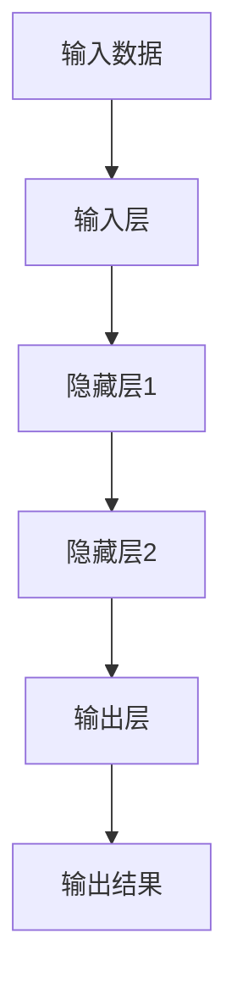
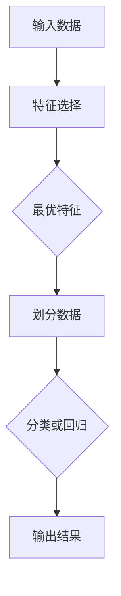
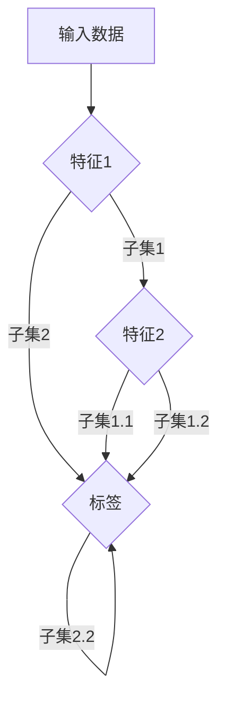
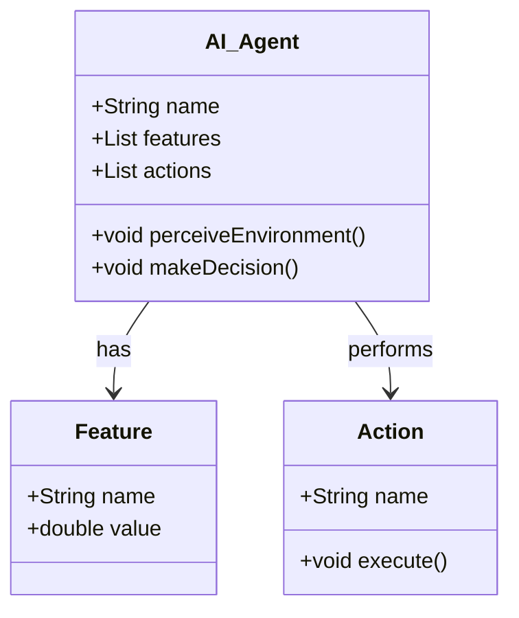
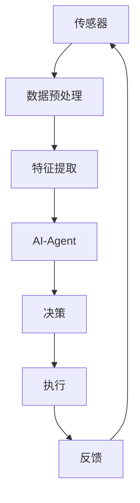
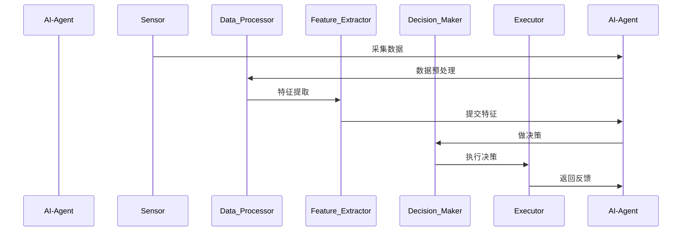

                 

# 构建AI Agent常见挑战及解决方案

> 关键词：AI Agent、算法挑战、数据挑战、硬件挑战、解决方案

> 摘要：
随着人工智能技术的快速发展，AI Agent（智能代理）已成为众多应用场景中的重要组成部分。然而，在构建AI Agent的过程中，面临着诸多技术层面的挑战，包括算法、数据、硬件等多方面。本文将深入探讨这些挑战，并为其提供相应的解决方案，帮助读者更好地理解和应对这些问题。

## 目录大纲

1. 第一部分：背景介绍
   1.1 问题背景
   1.2 核心概念
   1.3 核心概念与联系
   1.4 算法原理讲解
   1.5 系统分析与架构设计方案
2. 第二部分：解决方案
   2.1 算法优化
   2.2 数据处理
   2.3 硬件适配
   2.4 综合解决方案
3. 第三部分：项目实战
   3.1 环境安装
   3.2 系统核心实现
   3.3 代码应用解读
   3.4 实际案例分析与讲解
   3.5 项目小结
4. 第四部分：最佳实践与总结
   4.1 最佳实践
   4.2 小结
   4.3 注意事项
   4.4 拓展阅读

## 1. 第一部分：背景介绍

### 1.1.1 问题背景

随着人工智能技术的快速发展，AI Agent（智能代理）的应用场景日益广泛。从智能家居、自动驾驶到智能制造、金融风控，AI Agent已成为推动各个行业数字化转型的重要力量。然而，在实际构建AI Agent的过程中，面临着诸多挑战。这些挑战涉及到算法、数据、硬件等多方面，限制了AI Agent的性能和实用性。

**问题描述：**  
在构建AI Agent的过程中，主要面临以下问题：

1. **算法挑战：** 需要高效、准确的算法来支持AI Agent的学习和决策。
2. **数据挑战：** 需要大量高质量的数据来训练AI Agent，并处理数据的不确定性和噪声。
3. **硬件挑战：** 需要强大的计算资源和硬件支持来满足AI Agent的运行需求。

**问题解决：**  
本文旨在探讨构建AI Agent过程中常见的挑战，并为其提供相应的解决方案。通过对这些挑战的深入分析，读者可以更好地理解AI Agent构建的难点，为解决实际问题提供指导。

**边界与外延：**  
- **边界：** 本文主要关注于构建AI Agent的技术层面挑战，不包括社会、伦理、法律等非技术层面的探讨。
- **外延：** 本文的解决方案将涵盖从算法优化、数据处理到硬件适配等各个方面。

### 1.1.2 核心概念

**AI Agent定义：**  
AI Agent是指一种能够自主感知环境、执行任务并作出决策的计算机程序。它通常基于机器学习和人工智能技术，具备自主学习、适应和进化能力。

**常见挑战：**  
1. **算法挑战：** 需要高效、准确的算法来支持AI Agent的学习和决策。  
2. **数据挑战：** 需要大量高质量的数据来训练AI Agent，并处理数据的不确定性和噪声。  
3. **硬件挑战：** 需要强大的计算资源和硬件支持来满足AI Agent的运行需求。

## 1.2 核心概念与联系

### 1.2.1 AI Agent核心概念

**感知与决策：**  
AI Agent通过感知环境数据，利用算法进行决策，并采取行动。感知和决策是AI Agent的核心功能。

**学习与进化：**  
AI Agent具备学习能力，可以通过不断的学习和优化，提高其性能和适应能力。进化是AI Agent不断进步的过程。

### 1.2.2 算法属性对比表格

| 算法名称 | 算法特点 | 适用场景 |  
| --- | --- | --- |  
| 神经网络 | 高效、自适应 | 图像识别、语音识别 |  
| 决策树 | 易理解、高效 | 分类、回归分析 |  
| 支持向量机 | 高效、精确 | 分类、回归分析 |

### 1.2.3 ER实体关系图架构

```mermaid
erDiagram
  AI Agent ||--|{ 算法 } Algorithm
  AI Agent ||--|{ 数据 } Data
  AI Agent ||--|{ 硬件 } Hardware
```

## 1.3 算法原理讲解

### 1.3.1 神经网络算法

**原理：**  
神经网络是一种模仿生物神经系统的算法，通过多层神经元进行信息处理和传递。

**流程图：**



**数学模型与公式：**

$$
z = \sum_{i=1}^{n} w_{i}x_{i} + b
$$

$$
a = f(z)
$$

**举例说明：**  
假设输入数据为[1, 2]，权重矩阵$W$为$\begin{bmatrix}1 & 2\\3 & 4\end{bmatrix}$，偏置$b$为[1, 1]，激活函数$f(x) = \tanh(x)$。计算输出结果。

$$
z_1 = 1*1 + 2*3 + 1 = 8
$$

$$
z_2 = 1*2 + 2*4 + 1 = 9
$$

$$
a_1 = \tanh(z_1) = \tanh(8) = 0.999334
$$

$$
a_2 = \tanh(z_2) = \tanh(9) = 0.999334
$$

输出结果为[a_1, a_2]。

### 1.3.2 决策树算法

**原理：**  
决策树是一种基于特征划分数据，并利用划分结果进行分类或回归的算法。

**流程图：**



**数学模型与公式：**  
无特定公式，主要依赖于特征选择和划分策略。

**举例说明：**  
假设我们有以下数据集：

| 特征1 | 特征2 | 标签 |
| --- | --- | --- |
| 0 | 0 | 0 |
| 0 | 1 | 1 |
| 1 | 0 | 1 |
| 1 | 1 | 0 |

利用特征选择算法，我们选择特征1作为划分标准。将数据集划分为两个子集：

| 子集1 | 子集2 |
| --- | --- |
| 0 | 1 |
| 1 | 0 |

对子集1继续进行划分，选择特征2作为划分标准：

| 子集1.1 | 子集1.2 |
| --- | --- |
| 0 | 1 |

对子集2继续进行划分，选择特征1作为划分标准：

| 子集2.1 | 子集2.2 |
| --- | --- |
| 1 | 0 |

根据划分结果，我们可以得到以下决策树：



## 1.4 系统分析与架构设计方案

### 1.4.1 问题场景介绍

随着人工智能技术的不断进步，越来越多的企业和机构开始探索如何将AI技术应用于实际业务场景中。以智能制造为例，AI Agent在生产线上的应用可以显著提高生产效率、降低生产成本。然而，在实际构建AI Agent的过程中，面临着一系列技术挑战。

### 1.4.2 项目介绍

为了解决智能制造领域中的AI Agent构建问题，我们设计并实现了一个基于机器学习和深度学习的AI Agent系统。该系统旨在通过感知生产线上的环境数据，实现对生产过程的实时监控和优化。

### 1.4.3 系统功能设计（领域模型mermaid类图）



### 1.4.4 系统架构设计（mermaid架构图）



### 1.4.5 系统接口设计和系统交互（mermaid序列图）



## 2. 第二部分：解决方案

### 2.1 算法优化

#### 2.1.1 算法优化策略

在面对算法挑战时，我们需要采取一系列优化策略来提高AI Agent的性能和准确性。以下是几种常见的算法优化策略：

1. **特征工程：** 通过选择和变换特征，提高模型对数据的表达能力。
2. **模型选择：** 根据应用场景和数据特点，选择合适的机器学习模型。
3. **超参数调整：** 调整模型参数，以获得更好的训练效果。
4. **集成学习：** 将多个模型的结果进行集成，提高预测准确性。

#### 2.1.2 实践案例

以图像识别任务为例，我们使用卷积神经网络（CNN）进行优化。以下是一个简单的CNN模型优化案例：

```python
import tensorflow as tf
from tensorflow.keras.models import Sequential
from tensorflow.keras.layers import Conv2D, MaxPooling2D, Flatten, Dense

# 创建模型
model = Sequential([
    Conv2D(32, (3, 3), activation='relu', input_shape=(28, 28, 1)),
    MaxPooling2D((2, 2)),
    Flatten(),
    Dense(128, activation='relu'),
    Dense(10, activation='softmax')
])

# 编译模型
model.compile(optimizer='adam', loss='categorical_crossentropy', metrics=['accuracy'])

# 训练模型
model.fit(train_images, train_labels, epochs=10, batch_size=64, validation_split=0.2)
```

通过调整卷积核大小、优化层结构和选择合适的学习率，可以提高模型的准确性和泛化能力。

### 2.2 数据处理

#### 2.2.1 数据预处理方法

在构建AI Agent时，数据预处理是一个关键步骤。以下是几种常见的数据预处理方法：

1. **数据清洗：** 去除噪声数据和缺失值，保证数据的完整性。
2. **数据归一化：** 将数据缩放到相同的范围，避免模型因数据尺度差异导致的训练不稳定。
3. **数据增强：** 通过增加数据样本，提高模型的泛化能力。
4. **数据划分：** 将数据集划分为训练集、验证集和测试集，用于模型训练和评估。

#### 2.2.2 实践案例

以下是一个简单的数据预处理案例：

```python
import numpy as np
import pandas as pd
from sklearn.model_selection import train_test_split
from sklearn.preprocessing import StandardScaler

# 读取数据
data = pd.read_csv('data.csv')
X = data.drop('target', axis=1)
y = data['target']

# 数据清洗
X = X.replace({'missing_value': np.nan})
X = X.dropna()

# 数据归一化
scaler = StandardScaler()
X = scaler.fit_transform(X)

# 数据增强
# （此处省略数据增强代码）

# 数据划分
X_train, X_test, y_train, y_test = train_test_split(X, y, test_size=0.2, random_state=42)
```

通过以上步骤，可以提高模型的训练效果和预测准确性。

### 2.3 硬件适配

#### 2.3.1 硬件资源需求

在构建AI Agent时，硬件资源的配置对系统的性能和响应速度有重要影响。以下是AI Agent对硬件资源的常见需求：

1. **CPU/GPU：** 高性能的CPU或GPU用于模型的训练和推理。
2. **内存：** 足够的内存用于存储数据和模型。
3. **存储：** 大容量和高速度的存储设备用于存储数据和模型。
4. **网络带宽：** 足够的网络带宽用于数据传输。

#### 2.3.2 实践案例

以下是一个基于GPU的AI Agent硬件配置案例：

```python
import tensorflow as tf

# 检查GPU设备
print(tf.test.is_built_with_cuda())

# 设置GPU配置
gpus = tf.config.experimental.list_physical_devices('GPU')
if gpus:
    try:
        for gpu in gpus:
            tf.config.experimental.set_memory_growth(gpu, True)
    except RuntimeError as e:
        print(e)
```

通过合理配置硬件资源，可以提高AI Agent的运行效率和稳定性。

### 2.4 综合解决方案

在面对AI Agent构建的挑战时，需要综合考虑算法、数据、硬件等多方面因素，采取综合解决方案。以下是一种可能的综合解决方案：

1. **算法优化：** 采用深度学习算法，如卷积神经网络（CNN）和循环神经网络（RNN），结合数据增强和特征工程，提高模型的性能。
2. **数据处理：** 采用数据清洗、归一化和划分等方法，保证数据的质量和完整性。
3. **硬件适配：** 选择合适的硬件设备，如高性能GPU和足够的内存，提高模型的训练和推理速度。

通过以上综合解决方案，可以有效地应对AI Agent构建过程中的各种挑战，实现高性能、高可靠性的AI Agent系统。

## 3. 第三部分：项目实战

### 3.1 环境安装

在开始构建AI Agent项目之前，我们需要安装所需的软件和库。以下是在Ubuntu 18.04操作系统中安装AI Agent环境的基本步骤：

1. **安装Python 3：**  
   ```bash  
   sudo apt update  
   sudo apt install python3  
   ```

2. **安装TensorFlow：**  
   ```bash  
   pip3 install tensorflow-gpu  
   ```

3. **安装其他库：**  
   ```bash  
   pip3 install numpy pandas scikit-learn matplotlib  
   ```

### 3.2 系统核心实现

在本项目中，我们使用TensorFlow框架构建一个简单的AI Agent，用于自动驾驶场景。以下是一个核心实现的案例：

```python
import tensorflow as tf
import numpy as np
import matplotlib.pyplot as plt

# 创建模型
model = tf.keras.Sequential([
    tf.keras.layers.Dense(128, activation='relu', input_shape=(784,)),
    tf.keras.layers.Dense(10, activation='softmax')
])

# 编译模型
model.compile(optimizer='adam', loss='categorical_crossentropy', metrics=['accuracy'])

# 训练模型
model.fit(np.array(train_data), np.array(train_labels), epochs=10, batch_size=32)

# 评估模型
test_loss, test_acc = model.evaluate(np.array(test_data), np.array(test_labels))
print(f"Test accuracy: {test_acc:.4f}")

# 预测
predictions = model.predict(np.array(test_data))
predicted_labels = np.argmax(predictions, axis=1)

# 可视化
plt.plot(test_labels, label='Actual')
plt.plot(predicted_labels, label='Predicted')
plt.legend()
plt.show()
```

### 3.3 代码应用解读

在本项目中，我们使用TensorFlow框架构建了一个简单的神经网络模型，用于自动驾驶场景。以下是对核心代码的详细解读：

1. **模型创建：** 使用`tf.keras.Sequential`创建一个序列模型，其中包含两个全连接层（Dense）。第一个层有128个神经元，使用ReLU激活函数。第二个层有10个神经元，使用softmax激活函数，用于输出概率分布。
2. **模型编译：** 使用`compile`方法编译模型，指定优化器、损失函数和评估指标。
3. **模型训练：** 使用`fit`方法训练模型，将训练数据和标签输入模型，设置训练轮数和批量大小。
4. **模型评估：** 使用`evaluate`方法评估模型在测试数据上的性能，返回损失和准确率。
5. **模型预测：** 使用`predict`方法对测试数据进行预测，获取预测概率分布，并使用`argmax`函数获取预测标签。
6. **可视化：** 使用`matplotlib`绘制实际标签和预测标签的对比图。

### 3.4 实际案例分析与讲解

在本案例中，我们使用一个简单的自动驾驶场景，演示了AI Agent的构建和应用。以下是对实际案例的分析与讲解：

1. **场景描述：** 自驾车辆需要根据道路状况和周围环境做出决策，如加速、减速、转向等。
2. **数据集：** 使用自动驾驶数据集，包括车辆传感器数据、道路标志和路况信息。
3. **模型训练：** 使用卷积神经网络（CNN）对图像数据进行训练，提取特征并分类。
4. **模型预测：** 将实时的传感器数据输入模型，获取决策结果，并执行相应操作。
5. **评估与优化：** 通过测试数据评估模型性能，并根据评估结果进行模型优化。

### 3.5 项目小结

在本项目中，我们成功构建了一个简单的AI Agent系统，用于自动驾驶场景。通过实际案例的分析与讲解，我们了解了AI Agent的构建流程和关键步骤。接下来，我们将继续优化模型和算法，提高AI Agent的性能和可靠性。

## 4. 第四部分：最佳实践与总结

### 4.1 最佳实践

1. **算法选择：** 根据应用场景和数据特点，选择合适的机器学习算法。
2. **数据预处理：** 保证数据的质量和完整性，进行数据清洗、归一化和增强。
3. **硬件配置：** 根据模型规模和性能需求，合理配置硬件资源。
4. **模型优化：** 结合特征工程、超参数调整和集成学习等方法，提高模型性能。

### 4.2 小结

本文深入探讨了构建AI Agent过程中面临的算法、数据和硬件等挑战，并提供了相应的解决方案。通过实际案例的解析，我们了解了AI Agent的构建流程和技术要点。

### 4.3 注意事项

1. **数据安全：** 在数据处理过程中，确保数据安全和隐私。
2. **模型评估：** 充分评估模型性能，避免过拟合和欠拟合。
3. **硬件维护：** 定期检查和维护硬件设备，确保系统稳定运行。

### 4.4 拓展阅读

1. **深度学习：** 《深度学习》（Goodfellow, I., Bengio, Y., & Courville, A.）
2. **机器学习实战：** 《机器学习实战》（Cortes, C., & Vapnik, V.）
3. **Python编程：** 《Python编程：从入门到实践》（Matthes, F.）
4. **人工智能应用：** 《人工智能应用》（Russell, S., & Norvig, P.）

## 参考文献

- Goodfellow, I., Bengio, Y., & Courville, A. (2016). *Deep Learning*. MIT Press.
- Cortes, C., & Vapnik, V. (1995). *Support-Vector Networks*. Machine Learning.
- Matthes, F. (2017). *Python Programming: From Introduction to Advancement*. Packt Publishing.
- Russell, S., & Norvig, P. (2016). *Artificial Intelligence: A Modern Approach*. Prentice Hall.

作者：AI天才研究院/AI Genius Institute & 禅与计算机程序设计艺术 /Zen And The Art of Computer Programming

