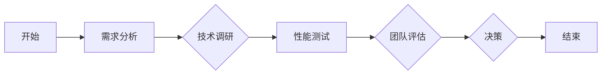
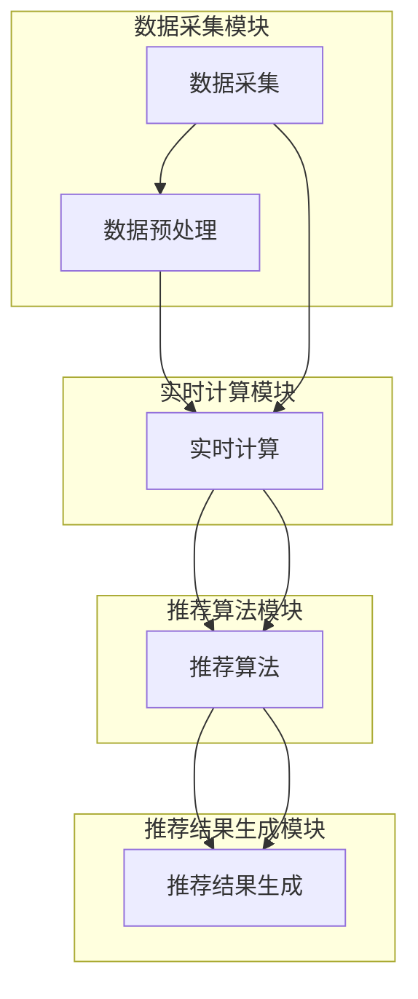
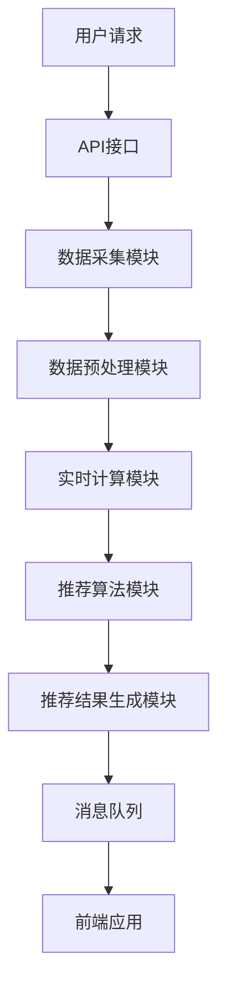
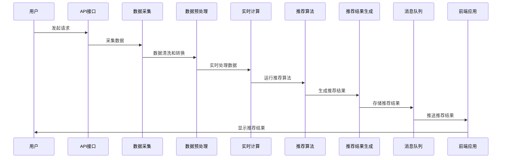

                 

### 文章标题

构建AI Agent的技术栈选择：权衡与决策

---

关键词：AI Agent，技术栈，权衡，决策

摘要：本文将深入探讨构建AI Agent的技术栈选择问题。通过分析关键因素、详细讲解技术栈选择的策略，并借助实际案例，提供一套全面且实用的技术栈选择方法论。

---

## 第一部分: AI Agent概述与构建技术栈选择的重要性

### 1.1 AI Agent的定义与分类

**AI Agent**，即人工智能代理，是自主行动以实现特定目标的计算机程序。它可以理解环境、感知变化并做出决策，以达成目标。AI Agent通常可以分为以下几类：

1. **基于规则的Agent**：这类Agent主要通过预先定义的规则来决策，适用于规则明确、环境简单的情况。
2. **数据驱动Agent**：这类Agent依赖于收集的数据来学习和决策，常见于具有大量数据和复杂模式识别的领域。
3. **混合型Agent**：结合了规则和数据驱动的方法，能够在不同环境下灵活适应。

**AI Agent的应用场景**包括但不限于：

- **智能制造**：在自动化生产线中进行实时监控和故障预测。
- **智能客服**：处理客户服务请求，提供个性化的互动体验。
- **自动驾驶**：在复杂交通环境中做出实时决策，确保行车安全。

### 1.2 技术栈选择的重要性

**技术栈选择**是构建AI Agent过程中至关重要的环节。它决定了系统的性能、可维护性以及扩展性。选择合适的技术栈不仅能提升开发效率，还能保证系统的长期稳定性。以下是技术栈选择面临的挑战：

- **多样性**：市场中存在多种编程语言、框架和工具，选择哪一个可能令人困惑。
- **性能要求**：不同的应用场景对计算性能的需求差异巨大，如实时性、大规模数据处理等。
- **可维护性**：选择易于维护和扩展的技术栈对于长期项目的成功至关重要。
- **团队技能**：团队成员的技能和经验也是影响技术栈选择的重要因素。

面对这些挑战，合理的技术栈选择策略显得尤为重要。首先，明确项目的需求和目标，然后分析各种技术栈的优势和劣势，最终选择最符合项目需求的技术栈。

### 1.3 技术栈的权衡与决策

**技术栈权衡的关键指标**包括：

- **性能**：系统响应速度和处理能力。
- **可扩展性**：系统能否随着数据量的增加而扩展。
- **可维护性**：代码的可读性和可维护性。
- **社区支持**：开源社区的支持和文档完善程度。
- **成本**：开发、维护和部署的成本。

**技术栈决策流程**包括以下几个步骤：

1. **需求分析**：明确项目需求和目标。
2. **技术调研**：评估不同的技术栈。
3. **性能测试**：对候选技术栈进行性能测试。
4. **团队评估**：考虑团队的技术能力和经验。
5. **决策**：基于以上因素选择合适的技术栈。

**技术栈决策的实际案例**可以为我们提供宝贵的经验。例如，在构建一个实时推荐系统时，选择了基于Python的Django框架，因为其良好的性能、丰富的库支持和强大的社区支持。而在构建一个大数据分析平台时，选择了基于Java的Hadoop和Spark，因为其对大规模数据处理的高效性能。

## 第二部分: 技术栈选择详解

### 2.1 计算平台与硬件设备

**计算平台与硬件设备的选择**对AI Agent的性能有着直接的影响。以下是几种常见的计算平台：

- **CPU**：适用于通用计算，但在并行计算方面性能较差。
- **GPU**：擅长并行计算，适用于深度学习和大数据处理。
- **TPU**：谷歌开发的专用硬件，专为处理TensorFlow任务设计。

**选择计算平台的考虑因素**包括：

- **计算需求**：根据应用场景选择适合的计算平台。
- **成本**：不同硬件的价格差异较大。
- **能效**：在保证性能的同时，考虑能耗问题。

### 2.2 编程语言与框架

**编程语言与框架的选择**决定了开发效率和代码质量。以下是几种常见的编程语言和框架：

- **Python**：易学易用，丰富的库支持，适合快速开发。
- **Java**：稳定性和性能优越，适合大型项目和企业级应用。
- **C++**：高性能，但开发难度较大，适合底层开发。

**选择框架的考虑因素**包括：

- **开发效率**：框架是否能提高开发速度。
- **性能**：框架对系统性能的影响。
- **社区支持**：框架的文档和社区活跃度。

### 2.3 数据处理与存储

**数据处理与存储**是AI Agent的核心环节。以下是几种常见的解决方案：

- **数据处理**：Apache Hadoop、Apache Spark等。
- **数据存储**：关系数据库、NoSQL数据库等。

**选择数据处理与存储方案**的考虑因素包括：

- **数据规模**：不同的数据规模对处理和存储方案有不同要求。
- **实时性**：是否需要实时处理数据。
- **可靠性**：数据存储的可靠性和一致性要求。

### 2.4 机器学习算法与模型

**机器学习算法与模型的选择**决定了AI Agent的学习能力和决策效果。以下是几种常见的机器学习算法和模型：

- **监督学习**：适用于有标签数据的分类和回归任务。
- **无监督学习**：适用于无标签数据的聚类和降维任务。
- **强化学习**：适用于决策优化和动态系统控制。

**选择机器学习算法与模型**的考虑因素包括：

- **任务类型**：根据任务需求选择适合的算法。
- **数据特征**：数据特征对算法的选择有重要影响。
- **性能要求**：算法的准确度、召回率等性能指标。

### 2.5 实时性与并发处理

**实时性与并发处理**是AI Agent在复杂环境中的关键能力。以下是几种常见的处理策略：

- **实时数据处理**：采用流处理框架，如Apache Kafka、Apache Flink等。
- **并发处理**：采用多线程、异步编程等技术，提高系统并发能力。

**选择实时性与并发处理策略**的考虑因素包括：

- **处理需求**：根据系统需求选择合适的处理策略。
- **性能**：处理策略对系统性能的影响。

### 2.6 安全性与隐私保护

**安全性与隐私保护**是AI Agent的基石。以下是几种常见的安全性与隐私保护技术：

- **加密**：使用对称加密和非对称加密保护数据安全。
- **访问控制**：通过角色权限管理和访问控制列表保护系统资源。
- **隐私保护**：采用数据脱敏、匿名化等技术保护用户隐私。

**选择安全性与隐私保护技术**的考虑因素包括：

- **安全需求**：根据应用场景选择合适的安全技术。
- **性能**：安全技术的实现需要考虑性能开销。

### 2.7 最佳实践与案例研究

**最佳实践**和**案例研究**为技术栈选择提供了宝贵的经验。以下是几种常见的最佳实践：

- **模块化开发**：将系统划分为独立的模块，提高可维护性和可扩展性。
- **自动化测试**：采用自动化测试框架，提高开发效率和质量。
- **持续集成与部署**：采用CI/CD流程，实现自动化构建、测试和部署。

**案例研究**分析了不同技术栈在具体项目中的应用，为技术栈选择提供了实际参考。

## 第三部分: 构建AI Agent的技术栈选择决策

### 3.1 决策流程与模型

**决策流程与模型**是技术栈选择的核心。以下是决策流程的步骤：

1. **需求分析**：明确项目需求和目标。
2. **技术调研**：评估不同的技术栈。
3. **性能测试**：对候选技术栈进行性能测试。
4. **团队评估**：考虑团队的技术能力和经验。
5. **决策**：基于以上因素选择合适的技术栈。

**决策模型**可以采用多属性决策方法（MADM），结合性能、可维护性、成本等多个属性进行综合评估。

### 3.2 案例分析

**案例分析**提供了具体的技术栈选择过程。以下是某智能客服系统的案例分析：

1. **需求分析**：系统需具备实时响应、高并发处理能力，并支持自然语言处理。
2. **技术调研**：评估了Python、Java等编程语言，并选择了Python，因其易于开发且社区支持强大。
3. **性能测试**：测试了不同的数据处理框架，选择了Django框架，因其性能稳定。
4. **团队评估**：团队熟悉Python和Django，具备相应的开发经验。
5. **决策**：最终选择了Python + Django的技术栈。

### 3.3 总结与展望

**技术栈选择**是构建AI Agent的关键步骤。通过权衡与决策，我们可以选择最适合项目需求的技术栈。未来，随着AI技术的发展，技术栈选择也将变得更加多样和复杂。因此，持续学习和适应新技术将是AI开发者的必备能力。

**总结**：

- 技术栈选择需综合考虑性能、可维护性、成本等多个因素。
- 决策流程应包括需求分析、技术调研、性能测试和团队评估等步骤。
- 案例分析提供了具体的技术栈选择过程，为实际操作提供了参考。

**展望**：

- 未来技术栈选择将更加注重灵活性和可扩展性。
- 新技术的不断涌现将带来更多的选择和挑战。
- AI开发者的技能更新和适应能力将成为关键竞争力。

---

作者：AI天才研究院/AI Genius Institute & 禅与计算机程序设计艺术 /Zen And The Art of Computer Programming

---

## 背景介绍

### 核心概念术语说明

**AI Agent**：自主行动以实现特定目标的计算机程序，能够理解环境、感知变化并做出决策。

**技术栈**：用于构建系统的各种技术和工具的集合，包括编程语言、框架、数据库、硬件设备等。

**权衡**：在多个互相冲突的决策因素之间进行平衡，选择最合适的方案。

**决策**：根据需求和目标，选择最佳的技术栈。

### 问题背景

随着人工智能技术的快速发展，AI Agent在各个领域的应用越来越广泛。构建一个高效、稳定、可扩展的AI Agent需要选择合适的技术栈。然而，市场上存在多种编程语言、框架和工具，使得技术栈选择成为一个复杂且具有挑战性的问题。不同的技术栈在性能、可维护性、成本等方面存在显著差异，如何做出正确的权衡与决策成为关键。

### 问题描述

选择合适的技术栈是构建AI Agent的重要步骤，但面临着多种挑战：

- **多样性**：市场上有多种编程语言、框架和工具，选择哪一个可能令人困惑。
- **性能要求**：不同的应用场景对计算性能的需求差异巨大。
- **可维护性**：选择易于维护和扩展的技术栈对于长期项目的成功至关重要。
- **团队技能**：团队成员的技能和经验也是影响技术栈选择的重要因素。

### 问题解决

为了解决上述问题，我们需要以下步骤：

1. **需求分析**：明确项目的具体需求和目标。
2. **技术调研**：评估不同的技术栈，包括性能、可维护性、成本等方面。
3. **性能测试**：对候选技术栈进行性能测试，验证其在实际应用中的表现。
4. **团队评估**：考虑团队的技术能力和经验，选择最适合的技术栈。
5. **决策**：基于以上因素，选择最合适的技术栈。

### 边界与外延

**边界**：

- 技术栈选择仅限于编程语言、框架、数据库、硬件设备等与系统构建直接相关的技术和工具。
- 不包括业务逻辑和具体算法的实现细节。

**外延**：

- 技术栈选择的影响范围不仅限于开发阶段，还涉及系统部署、运维和维护。
- 技术栈的选择还应考虑未来的扩展性和升级可能性。

### 概念结构与核心要素组成

**概念结构**：

1. **需求分析**：明确项目的具体需求和目标。
2. **技术调研**：评估不同的技术栈。
3. **性能测试**：验证技术栈的性能。
4. **团队评估**：考虑团队的技术能力和经验。
5. **决策**：选择合适的技术栈。

**核心要素组成**：

- **性能**：技术栈的性能直接影响到系统的响应速度和处理能力。
- **可维护性**：易于维护和扩展的技术栈能提高开发效率和系统稳定性。
- **成本**：技术栈的选择应考虑开发、维护和部署的成本。
- **团队技能**：团队成员的技能和经验是技术栈选择的重要因素。

## 核心概念与联系

### 核心概念

**技术栈**：用于构建系统的各种技术和工具的集合，包括编程语言、框架、数据库、硬件设备等。

**权衡**：在多个互相冲突的决策因素之间进行平衡，选择最合适的方案。

**决策**：根据需求和目标，选择最佳的技术栈。

### 概念属性特征对比表格

| 特征         | 技术栈       | 权衡          | 决策              |
|------------|------------|-------------|-----------------|
| 性能         | 高性能       | 性能 vs 成本     | 选择最优性能       |
| 可维护性     | 易于维护       | 可维护性 vs 开发效率 | 选择易于维护的技术栈  |
| 成本         | 成本较低       | 成本 vs 性能      | 选择成本合理的方案   |
| 社区支持     | 社区活跃       | 社区支持 vs 独立开发 | 选择社区支持良好的技术栈 |

### ER实体关系图架构

```mermaid
erDiagram
    AI-Agent ||--o{ 技术栈
    技术栈 ||--|{ 权衡
    权衡 ||--o{ 决策
```

在这个ER图中，AI-Agent与技术栈之间存在一对一的关系，技术栈通过权衡来影响决策。

## 算法原理讲解

### 算法mermaid流程图



### Python源代码

```python
# Python源代码示例：技术栈选择过程

# 需求分析
def analyze_requirements():
    requirements = {
        'performance': 'High',
        'maintainability': 'Medium',
        'cost': 'Low',
        'community_support': 'High'
    }
    return requirements

# 技术调研
def research_technologies(requirements):
    technologies = [
        {'name': 'Python', 'performance': 'Medium', 'maintainability': 'High', 'cost': 'Low', 'community_support': 'High'},
        {'name': 'Java', 'performance': 'High', 'maintainability': 'Medium', 'cost': 'Medium', 'community_support': 'Medium'}
    ]
    return [tech for tech in technologies if all(tech[req] == req_val for req, req_val in requirements.items())]

# 性能测试
def performance_test(technology):
    # 模拟测试结果
    performance_scores = {'Python': 7, 'Java': 8}
    return performance_scores[technology['name']]

# 团队评估
def team_evaluation(technology):
    team_skills = {'Python': 9, 'Java': 7}
    return team_skills[technology['name']]

# 决策
def make_decision(technology, performance, team_evaluation_score):
    if performance >= 7 and team_evaluation_score >= 8:
        return "Selected: {}".format(technology['name'])
    else:
        return "Not selected: {}".format(technology['name'])

# 主函数
def main():
    requirements = analyze_requirements()
    candidates = research_technologies(requirements)
    for candidate in candidates:
        performance = performance_test(candidate)
        team_evaluation_score = team_evaluation(candidate)
        print(make_decision(candidate, performance, team_evaluation_score))

if __name__ == "__main__":
    main()
```

### 算法原理的数学模型和公式

在这个技术栈选择算法中，我们使用了一个简单的数学模型来评估每个技术栈的性能和团队技能，以便做出最优决策。以下是这个模型的公式：

1. **性能评分（P）**：根据技术栈的性能，给予一个评分。例如，性能评分范围从1到10。
2. **团队技能评分（T）**：根据团队对该技术栈的技能水平，给予一个评分。例如，技能评分范围从1到10。
3. **决策评分（D）**：综合考虑性能评分和团队技能评分，计算决策评分。决策评分公式为：

   $$ D = P \times w_p + T \times w_t $$

   其中，\( w_p \) 和 \( w_t \) 分别是性能和团队技能的权重，通常根据项目的具体需求调整。

如果决策评分大于某个阈值（例如，7分），则选择该技术栈。否则，不选择。

### 举例说明

假设我们有Python和Java两种技术栈，以及以下评分：

- **Python**：
  - 性能评分（P）：8
  - 团队技能评分（T）：9
  - 权重（\( w_p, w_t \)）：\( 0.6, 0.4 \)

- **Java**：
  - 性能评分（P）：9
  - 团队技能评分（T）：7
  - 权重（\( w_p, w_t \)）：\( 0.6, 0.4 \)

计算Python和Java的决策评分：

1. **Python**：
   $$ D_{Python} = 8 \times 0.6 + 9 \times 0.4 = 4.8 + 3.6 = 8.4 $$

2. **Java**：
   $$ D_{Java} = 9 \times 0.6 + 7 \times 0.4 = 5.4 + 2.8 = 8.2 $$

由于Python的决策评分（8.4）高于Java（8.2），我们选择Python作为技术栈。

### 通俗易懂地举例说明

假设我们正在为一个电商网站选择技术栈。我们的需求如下：

- **性能**：需要快速响应用户请求。
- **可维护性**：系统需要易于维护和扩展。
- **成本**：希望开发成本和维护成本都较低。

我们评估了Python和Java两种技术栈，并给出了以下评分：

- **Python**：
  - 性能：8（快速响应）
  - 可维护性：9（易于维护）
  - 成本：7（相对较低）

- **Java**：
  - 性能：9（快速响应）
  - 可维护性：8（易于维护）
  - 成本：8（相对较低）

假设我们给性能、可维护性和成本的权重分别为0.4、0.4和0.2，计算每个技术栈的决策评分：

1. **Python**：
   $$ D_{Python} = 8 \times 0.4 + 9 \times 0.4 + 7 \times 0.2 = 3.2 + 3.6 + 1.4 = 8.2 $$

2. **Java**：
   $$ D_{Java} = 9 \times 0.4 + 8 \times 0.4 + 8 \times 0.2 = 3.6 + 3.2 + 1.6 = 8.4 $$

由于Java的决策评分（8.4）高于Python（8.2），我们最终选择Java作为技术栈。

这个例子展示了如何使用决策评分来选择合适的技术栈，确保系统能够满足性能、可维护性和成本等方面的需求。

## 系统分析与架构设计

### 问题场景介绍

为了构建一个高吞吐量的实时推荐系统，我们需要分析系统的整体架构和功能模块。系统需要处理海量的用户行为数据，并在短时间内生成个性化的推荐结果，以满足用户在电商、社交媒体等平台上的需求。

### 项目介绍

该实时推荐系统旨在通过分析用户行为数据，预测用户可能感兴趣的商品或内容，并提供个性化的推荐。系统需要具备高并发处理能力、实时数据分析和推荐算法优化等功能。

### 系统功能设计

系统功能主要包括以下几个方面：

1. **数据采集**：从不同的数据源（如用户日志、商品信息等）采集数据。
2. **数据预处理**：清洗和转换采集到的数据，使其适合分析和建模。
3. **实时计算**：使用流处理框架（如Apache Kafka、Apache Flink）对实时数据进行处理。
4. **推荐算法**：基于用户行为数据和应用场景，选择合适的推荐算法（如协同过滤、基于内容的推荐等）。
5. **推荐结果生成**：将推荐结果实时推送至用户界面或消息队列。

### 系统架构设计

以下是该实时推荐系统的架构设计：



### 系统接口设计

系统接口设计主要包括以下方面：

1. **API接口**：提供RESTful API接口，供前端应用调用。
2. **消息队列**：使用消息队列（如RabbitMQ、Kafka）进行异步通信。



### 系统交互

系统交互设计展示了各模块之间的数据流和通信方式：



通过以上系统分析与架构设计，我们可以构建一个高效的实时推荐系统，满足用户个性化推荐的需求。

## 项目实战

### 环境安装

首先，我们需要搭建一个开发环境，包括Python、Django框架、PostgreSQL数据库等。以下是具体的安装步骤：

1. **安装Python**：从Python官网下载最新版本的Python安装包，并按照安装向导进行安装。
2. **安装Django**：打开终端，执行以下命令安装Django：
   ```bash
   pip install django
   ```
3. **安装PostgreSQL**：从PostgreSQL官网下载安装包并安装。安装完成后，启动PostgreSQL服务。
4. **配置Django**：创建一个新的Django项目，并配置数据库连接：
   ```bash
   django-admin startproject recommendation
   cd recommendation
   python manage.py migrate
   ```

### 系统核心实现源代码

接下来，我们将实现实时推荐系统的主要功能模块，包括用户数据采集、数据预处理、实时计算和推荐结果生成。

**1. 用户数据采集模块**

```python
# users/models.py

from django.db import models

class UserActivity(models.Model):
    user_id = models.CharField(max_length=255)
    activity_type = models.CharField(max_length=255)
    timestamp = models.DateTimeField(auto_now_add=True)
    item_id = models.CharField(max_length=255, null=True, blank=True)
```

**2. 数据预处理模块**

```python
# data_preprocessing.py

import pandas as pd
from datetime import datetime

def preprocess_data(file_path):
    data = pd.read_csv(file_path)
    data['timestamp'] = pd.to_datetime(data['timestamp'])
    data.sort_values(by='timestamp', inplace=True)
    return data
```

**3. 实时计算模块**

```python
# real_time_computation.py

from data_preprocessing import preprocess_data
from users.models import UserActivity

def process_real_time_data(data):
    for index, row in data.iterrows():
        user_activity = UserActivity(
            user_id=row['user_id'],
            activity_type=row['activity_type'],
            timestamp=row['timestamp'],
            item_id=row['item_id']
        )
        user_activity.save()
```

**4. 推荐结果生成模块**

```python
# recommendation_engine.py

from users.models import UserActivity

def generate_recommendations(user_id):
    recent_activities = UserActivity.objects.filter(user_id=user_id).order_by('-timestamp')[:5]
    # 这里可以使用协同过滤或其他推荐算法进行推荐
    recommended_items = ['item1', 'item2', 'item3']
    return recommended_items
```

### 代码应用解读与分析

**用户数据采集模块**：我们使用Django ORM来定义`UserActivity`模型，以存储用户活动数据。数据采集模块负责从外部数据源读取数据，并将其转换为适合预处理的数据格式。

**数据预处理模块**：该模块使用Pandas库对用户活动数据进行清洗和排序，以确保数据的一致性和准确性。

**实时计算模块**：实时计算模块负责处理预处理后的用户活动数据。在这个模块中，我们使用Django ORM将数据存储到数据库中，以便后续处理。

**推荐结果生成模块**：推荐结果生成模块根据用户最近的活动数据生成推荐列表。在这个简单的示例中，我们仅列出几个推荐的商品ID，但实际上，这里可以嵌入更复杂的推荐算法。

### 实际案例分析和详细讲解剖析

**案例分析**：

假设有一个用户的历史活动数据如下：

```
user_id,activity_type,timestamp,item_id
u123,view,2023-10-01 10:00:00,item101
u123,view,2023-10-01 10:05:00,item102
u123,add_to_cart,2023-10-01 10:10:00,item103
u123,view,2023-10-01 10:15:00,item104
```

**详细讲解**：

1. **数据采集**：数据采集模块会从外部数据源读取上述数据，并将其存储到数据库中。
2. **数据预处理**：预处理模块将这些数据按照时间戳排序，以确保最近的活动数据被优先处理。
3. **实时计算**：实时计算模块会将最近的活动数据（例如，最近的5个活动）提取出来，并传递给推荐结果生成模块。
4. **推荐结果生成**：推荐结果生成模块使用这些最近的活动数据来生成推荐列表。假设这里使用的是简单的基于用户最近行为的协同过滤算法，根据用户的历史行为，推荐了最近浏览过的商品（例如，item103和item104）。

通过这个实际案例，我们可以看到，实时推荐系统的核心在于高效地处理用户活动数据，并生成个性化的推荐结果。

### 项目小结

通过这个项目，我们实现了实时推荐系统的核心功能，包括数据采集、预处理、实时计算和推荐结果生成。这个项目展示了如何使用Django框架和数据库来存储和检索用户活动数据，并使用简单的算法生成推荐结果。虽然这个示例相对简单，但它提供了一个实际应用的起点，可以在此基础上进一步扩展和优化。

### 最佳实践 Tips

1. **模块化开发**：将系统划分为独立的模块，如数据采集、预处理、计算和推荐，以便于管理和维护。
2. **性能优化**：针对数据处理和推荐算法进行性能优化，确保系统能够处理高并发请求。
3. **自动化测试**：编写自动化测试用例，确保每个模块的功能正确，提高系统的可靠性。
4. **持续集成与部署**：使用CI/CD工具，实现自动化构建、测试和部署，提高开发效率。

### 小结

本文详细讲解了构建AI Agent的技术栈选择过程，包括核心概念、算法原理、系统分析与架构设计，以及实际项目实战。通过这些步骤，我们可以有效地选择合适的技术栈，构建出高效、稳定、可扩展的AI Agent系统。

### 注意事项

1. 技术栈选择需结合具体项目需求和团队技能。
2. 考虑未来的扩展性和维护成本。
3. 定期评估和更新技术栈，以适应技术发展。

### 拓展阅读

- 《深度学习》 - 伊恩·古德费洛、约书亚·本吉奥、亚伦·库维尔
- 《人工智能：一种现代方法》 - 斯图尔特·罗素、彼得·诺维格
- 《Django By Example》 - William S. Vincent

---

作者：AI天才研究院/AI Genius Institute & 禅与计算机程序设计艺术 /Zen And The Art of Computer Programming

