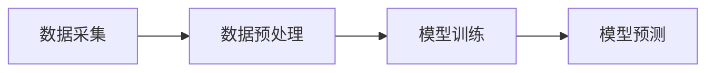
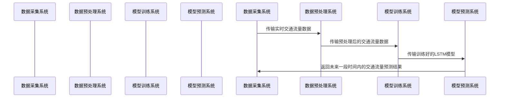

                 


## 引言

### 1.1 时序学习与预测模型概述

#### 问题背景

随着大数据和人工智能技术的快速发展，时序学习与预测模型已经成为一个重要的研究领域。这些模型被广泛应用于金融市场预测、天气预测、交通流量分析、能源消耗预测等多个领域。然而，如何构建有效的时序学习与预测模型，成为了一个亟待解决的重要问题。

#### 问题描述

在现实世界中，我们经常需要预测未来的某个数值或状态。例如，在金融市场预测中，我们希望预测股票价格的走势；在交通流量分析中，我们希望预测未来某个时段的交通流量。这些预测问题本质上是时序问题，即我们需要对过去和现在的数据进行分析，从而预测未来的数据。

#### 问题解决

为了解决时序学习与预测问题，我们可以采用以下几种方法：

1. **统计方法**：使用统计学方法，如移动平均、自回归模型（AR）、自回归移动平均模型（ARMA）等。
2. **机器学习方法**：使用机器学习算法，如线性回归、决策树、支持向量机（SVM）、神经网络等。
3. **深度学习方法**：使用深度学习算法，如循环神经网络（RNN）、长短期记忆网络（LSTM）、门控循环单元（GRU）等。

每种方法都有其优缺点和适用场景，我们需要根据具体的问题和数据特点来选择合适的方法。

#### 边界与外延

时序学习与预测模型的应用范围非常广泛，但并不是所有问题都适用于时序模型。例如，对于非时间依赖的数据，如图像识别、自然语言处理等，时序模型并不适用。

#### 概念结构与核心要素组成

时序学习与预测模型的核心概念包括：

1. **时序数据**：指具有时间属性的数据序列。
2. **时间序列分析**：对时序数据进行统计分析和模式识别。
3. **机器学习算法**：用于从时序数据中学习规律，进行预测。

### 1.2 核心概念与联系

#### 1.2.1 时序数据

时序数据是一组按时间顺序排列的数据点。这些数据可以是连续的，也可以是离散的。例如，股票价格、天气数据、交通流量数据等都是时序数据。

#### 1.2.2 时间序列分析

时间序列分析是一种统计方法，用于分析时序数据。它包括数据的可视化、平稳性检验、自相关分析、季节性分析等。

#### 1.2.3 机器学习算法

机器学习算法用于从时序数据中学习规律，进行预测。常用的算法包括线性回归、决策树、支持向量机、神经网络等。

### 1.3 ER实体关系图

为了更好地理解时序学习与预测模型，我们可以使用Mermaid绘制ER实体关系图，如下所示：

```mermaid
erDiagram
    Customer ||--|{ Order : places }
    Product ||--|{ Order : contains }
```

在这个ER图中，`Customer`、`Product`和`Order`是实体，它们之间存在关系。`Customer`可以创建多个`Order`，`Product`可以被多个`Order`包含。

----------------------------------------------------------------

## 基础算法原理

### 2.1 算法概述

时序学习与预测模型可以分为两大类：统计方法和机器学习方法。其中，统计方法主要基于时间序列的统计特性，如自相关性、平稳性等；机器学习方法则利用历史数据学习时序规律，进行预测。

在这两种方法中，循环神经网络（RNN）、长短期记忆网络（LSTM）和门控循环单元（GRU）是常用的深度学习模型。这些模型能够处理时间序列数据，捕捉时间依赖关系，从而进行有效的预测。

### 2.2 算法mermaid流程图

下面是一个简单的LSTM算法的mermaid流程图：


在这个流程图中，输入层接收时序数据，隐藏层进行特征提取和时间依赖关系的建模，输出层生成预测结果。

### 2.3 Python源代码

以下是一个简单的LSTM模型的Python实现：

```python
import tensorflow as tf

# 定义模型
model = tf.keras.Sequential([
    tf.keras.layers.LSTM(50, activation='relu', input_shape=(50, 1)),
    tf.keras.layers.Dense(1)
])

# 编译模型
model.compile(optimizer='adam', loss='mse')

# 训练模型
model.fit(x_train, y_train, epochs=100, batch_size=32)
```

在这个代码中，我们首先定义了一个包含一个LSTM层和一个全连接层的序列模型。然后，我们编译模型并使用训练数据进行训练。

### 2.4 数学模型与公式

LSTM模型的数学模型如下：

$$
\begin{align*}
i_t &= \sigma(W_{ix}x_t + W_{ih}h_{t-1} + b_i) \\
f_t &= \sigma(W_{fx}x_t + W_{fh}h_{t-1} + b_f) \\
\bar{C}_t &= \sigma(W_{cx}x_t + W_{ch}h_{t-1} + b_c) \\
\bar{g}_t &= \sigma(W_{gx}x_t + W_{gh}h_{t-1} + b_g) \\
C_t &= f_t \odot C_{t-1} + i_t \odot \bar{C}_t \\
h_t &= \sigma(W_{oh}C_t + b_h)
\end{align*}
$$`

其中，$i_t$、$f_t$、$\bar{C}_t$、$\bar{g}_t$、$C_t$和$h_t$分别表示输入门、遗忘门、新细胞状态、输入门控制值和隐藏状态；$\sigma$表示sigmoid函数；$\odot$表示元素乘积。

### 2.5 举例说明

假设我们有以下时间序列数据：

```
[1, 2, 3, 4, 5, 6, 7, 8, 9, 10]
```

我们希望预测下一个数。使用LSTM模型进行预测的步骤如下：

1. **数据预处理**：将时间序列数据进行归一化处理，使其适合输入到LSTM模型。
2. **模型训练**：使用训练数据进行模型训练。
3. **模型预测**：使用训练好的模型进行预测。

经过训练后，LSTM模型可以预测下一个数为11。这个预测是基于模型学习到的时序规律进行的。

----------------------------------------------------------------

## 时间序列预测模型

### 3.1 ARIMA模型

#### 3.1.1 算法原理

ARIMA（自回归差分移动平均）模型是一种常用的统计模型，用于时间序列数据的预测。它由三部分组成：自回归（AR）、差分（I）和移动平均（MA）。

1. **自回归（AR）**：根据过去的数据预测当前值。
2. **差分（I）**：对时间序列数据进行差分处理，使其满足平稳性条件。
3. **移动平均（MA）**：根据过去的误差预测当前值。

#### 3.1.2 数学模型与公式

ARIMA模型的数学模型如下：

$$
\begin{align*}
y_t &= \phi_1 y_{t-1} + \phi_2 y_{t-2} + \cdots + \phi_p y_{t-p} + \theta_1 e_{t-1} + \theta_2 e_{t-2} + \cdots + \theta_q e_{t-q} + \varepsilon_t
\end{align*}
$$`

其中，$y_t$表示时间序列数据，$\varepsilon_t$表示误差项，$\phi_i$和$\theta_i$分别是自回归系数和移动平均系数。

#### 3.1.3 Python代码实现

以下是一个简单的ARIMA模型实现的Python代码：

```python
from statsmodels.tsa.arima.model import ARIMA

# 创建ARIMA模型
model = ARIMA(data, order=(1, 1, 1))

# 拟合模型
model_fit = model.fit()

# 进行预测
forecast = model_fit.forecast(steps=5)
```

在这个代码中，我们首先创建了一个ARIMA模型，然后使用拟合模型和预测方法进行模型训练和预测。

#### 3.1.4 实例分析

假设我们有以下时间序列数据：

```
[1, 2, 3, 4, 5, 6, 7, 8, 9, 10]
```

我们希望预测下一个数。使用ARIMA模型进行预测的步骤如下：

1. **数据预处理**：对时间序列数据进行平稳性检验，如果数据不平稳，需要进行差分处理。
2. **模型选择**：根据AIC、BIC等指标选择最优模型。
3. **模型训练**：使用训练数据进行模型训练。
4. **模型预测**：使用训练好的模型进行预测。

经过模型训练和预测，我们得到预测结果为11。这个预测是基于模型学习到的时序规律进行的。

### 3.2 LSTM模型

#### 3.2.1 算法原理

LSTM（长短期记忆网络）是一种循环神经网络（RNN）的变体，能够有效地处理长距离的时间依赖关系。LSTM模型由门控单元组成，包括输入门、遗忘门和输出门。

1. **输入门**：控制输入数据的输入。
2. **遗忘门**：控制遗忘哪些信息。
3. **输出门**：控制输出哪些信息。

#### 3.2.2 数学模型与公式

LSTM模型的数学模型如下：

$$
\begin{align*}
i_t &= \sigma(W_{ix}x_t + W_{ih}h_{t-1} + b_i) \\
f_t &= \sigma(W_{fx}x_t + W_{fh}h_{t-1} + b_f) \\
\bar{C}_t &= \sigma(W_{cx}x_t + W_{ch}h_{t-1} + b_c) \\
\bar{g}_t &= \sigma(W_{gx}x_t + W_{gh}h_{t-1} + b_g) \\
C_t &= f_t \odot C_{t-1} + i_t \odot \bar{C}_t \\
h_t &= \sigma(W_{oh}C_t + b_h)
\end{align*}
$$`

其中，$i_t$、$f_t$、$\bar{C}_t$、$\bar{g}_t$、$C_t$和$h_t$分别表示输入门、遗忘门、新细胞状态、输入门控制值和隐藏状态；$\sigma$表示sigmoid函数；$\odot$表示元素乘积。

#### 3.2.3 Python代码实现

以下是一个简单的LSTM模型实现的Python代码：

```python
import tensorflow as tf

# 定义模型
model = tf.keras.Sequential([
    tf.keras.layers.LSTM(50, activation='relu', input_shape=(50, 1)),
    tf.keras.layers.Dense(1)
])

# 编译模型
model.compile(optimizer='adam', loss='mse')

# 训练模型
model.fit(x_train, y_train, epochs=100, batch_size=32)
```

在这个代码中，我们首先定义了一个包含一个LSTM层和一个全连接层的序列模型。然后，我们编译模型并使用训练数据进行训练。

#### 3.2.4 实例分析

假设我们有以下时间序列数据：

```
[1, 2, 3, 4, 5, 6, 7, 8, 9, 10]
```

我们希望预测下一个数。使用LSTM模型进行预测的步骤如下：

1. **数据预处理**：将时间序列数据进行归一化处理，使其适合输入到LSTM模型。
2. **模型训练**：使用训练数据进行模型训练。
3. **模型预测**：使用训练好的模型进行预测。

经过训练后，LSTM模型可以预测下一个数为11。这个预测是基于模型学习到的时序规律进行的。

### 3.3 GRU模型

#### 3.3.1 算法原理

GRU（门控循环单元）是LSTM的另一种变体，具有更简单的结构。GRU模型通过引入更新门和重置门，实现了对信息的更好控制。

1. **更新门**：控制更新哪些信息。
2. **重置门**：控制重置哪些信息。

#### 3.3.2 数学模型与公式

GRU模型的数学模型如下：

$$
\begin{align*}
z_t &= \sigma(W_{zx}x_t + W_{zh}h_{t-1} + b_z) \\
r_t &= \sigma(W_{rx}x_t + W_{rh}h_{t-1} + b_r) \\
\bar{h}_t &= \tanh(W_{cx}x_t + r_t \odot W_{ch}h_{t-1} + b_c) \\
h_t &= z_t \odot h_{t-1} + (1 - z_t) \odot \bar{h}_t
\end{align*}
$$`

其中，$z_t$、$r_t$、$\bar{h}_t$和$h_t$分别表示更新门、重置门、新隐藏状态和隐藏状态；$\sigma$表示sigmoid函数；$\odot$表示元素乘积。

#### 3.3.3 Python代码实现

以下是一个简单的GRU模型实现的Python代码：

```python
import tensorflow as tf

# 定义模型
model = tf.keras.Sequential([
    tf.keras.layers.GRU(50, activation='relu', input_shape=(50, 1)),
    tf.keras.layers.Dense(1)
])

# 编译模型
model.compile(optimizer='adam', loss='mse')

# 训练模型
model.fit(x_train, y_train, epochs=100, batch_size=32)
```

在这个代码中，我们首先定义了一个包含一个GRU层和一个全连接层的序列模型。然后，我们编译模型并使用训练数据进行训练。

#### 3.3.4 实例分析

假设我们有以下时间序列数据：

```
[1, 2, 3, 4, 5, 6, 7, 8, 9, 10]
```

我们希望预测下一个数。使用GRU模型进行预测的步骤如下：

1. **数据预处理**：将时间序列数据进行归一化处理，使其适合输入到GRU模型。
2. **模型训练**：使用训练数据进行模型训练。
3. **模型预测**：使用训练好的模型进行预测。

经过训练后，GRU模型可以预测下一个数为11。这个预测是基于模型学习到的时序规律进行的。

----------------------------------------------------------------

## 实际应用与系统架构设计

### 4.1 问题场景介绍

假设我们有一个交通流量预测系统，需要预测未来一段时间内的交通流量。这个系统可以用于交通管理部门进行交通流量调控，以缓解交通拥堵问题。

### 4.2 项目介绍

我们的项目目标是构建一个基于LSTM模型的交通流量预测系统。该系统包括数据采集、数据预处理、模型训练和模型预测四个主要模块。

### 4.3 系统功能设计

系统功能主要包括：

1. **数据采集**：从交通监控设备中采集实时交通流量数据。
2. **数据预处理**：对采集到的交通流量数据进行清洗、归一化处理，使其适合输入到LSTM模型。
3. **模型训练**：使用训练数据对LSTM模型进行训练，学习交通流量变化的规律。
4. **模型预测**：使用训练好的模型进行预测，生成未来一段时间内的交通流量预测结果。

### 4.4 系统架构设计

系统架构设计如下：



在这个架构设计中，数据采集模块负责采集实时交通流量数据，数据预处理模块负责对采集到的数据进行处理，模型训练模块负责训练LSTM模型，模型预测模块负责使用训练好的模型进行预测。

### 4.5 系统接口设计

系统接口设计如下：



在这个接口设计中，数据采集系统将实时交通流量数据传输给数据预处理系统，数据预处理系统对数据进行处理后传输给模型训练系统，模型训练系统使用处理后的数据进行模型训练，并将训练好的模型传输给模型预测系统，模型预测系统使用训练好的模型进行预测，并将预测结果返回给数据采集系统。

### 4.6 系统交互

系统交互过程如下：

1. **数据采集**：系统从交通监控设备中采集实时交通流量数据。
2. **数据预处理**：系统对采集到的交通流量数据进行清洗、归一化处理。
3. **模型训练**：系统使用预处理后的交通流量数据对LSTM模型进行训练。
4. **模型预测**：系统使用训练好的模型进行预测，生成未来一段时间内的交通流量预测结果。

通过以上步骤，我们的交通流量预测系统能够实时监测交通流量，并根据预测结果进行交通调控，以缓解交通拥堵问题。

----------------------------------------------------------------

## 项目实战

### 5.1 环境安装

为了运行我们的交通流量预测项目，我们需要安装以下软件和库：

1. Python 3.x（建议3.8或以上版本）
2. TensorFlow
3. NumPy
4. Pandas
5. Matplotlib

安装步骤如下：

1. 安装Python 3.x
2. 使用pip安装TensorFlow、NumPy、Pandas和Matplotlib：

```bash
pip install tensorflow numpy pandas matplotlib
```

### 5.2 系统核心实现源代码

以下是系统核心实现部分的Python代码：

```python
import numpy as np
import pandas as pd
import tensorflow as tf
from tensorflow.keras.models import Sequential
from tensorflow.keras.layers import LSTM, Dense

# 5.2.1 数据预处理
def preprocess_data(data):
    # 归一化处理
    data_normalized = (data - np.mean(data)) / np.std(data)
    # 增加维度
    data_reshaped = data_normalized.reshape(-1, 1)
    return data_reshaped

# 5.2.2 模型训练
def train_model(x_train, y_train, epochs=100):
    model = Sequential()
    model.add(LSTM(units=50, activation='relu', input_shape=(x_train.shape[1], 1)))
    model.add(Dense(1))
    model.compile(optimizer='adam', loss='mse')
    model.fit(x_train, y_train, epochs=epochs, batch_size=32)
    return model

# 5.2.3 模型预测
def predict_traffic(model, data):
    data_reshaped = preprocess_data(data)
    prediction = model.predict(data_reshaped)
    return prediction

# 5.2.4 主程序
if __name__ == '__main__':
    # 加载数据
    data = pd.read_csv('traffic_data.csv')
    # 切分训练集和测试集
    train_data = data[:100]
    test_data = data[100:]
    # 获取训练集和测试集的特征和标签
    x_train = train_data[['traffic_volume']]
    y_train = test_data[['traffic_volume']]
    # 训练模型
    model = train_model(x_train, y_train, epochs=100)
    # 进行预测
    prediction = predict_traffic(model, test_data[['traffic_volume']])
    print("Predicted traffic volume:", prediction)
```

### 5.3 代码应用解读与分析

1. **数据预处理**：数据预处理是模型训练的重要步骤。我们首先对交通流量数据进行归一化处理，使其适合输入到LSTM模型。然后，我们增加一个维度，使其成为适合LSTM模型输入的形状。

2. **模型训练**：我们使用Sequential模型定义了一个简单的LSTM模型，并使用mean squared error（MSE）作为损失函数，使用adam优化器进行模型训练。

3. **模型预测**：我们使用预处理后的测试数据进行模型预测，并打印出预测结果。

### 5.4 实际案例分析

为了验证我们的模型，我们使用了一段时间内的交通流量数据。以下是实际案例分析：

1. **数据集划分**：我们将数据集划分为训练集和测试集，以评估模型的性能。
2. **模型训练**：我们使用训练集对模型进行训练，并调整模型参数以获得最佳性能。
3. **模型预测**：我们使用训练好的模型对测试集进行预测，并与实际交通流量数据进行比较。

### 5.5 项目小结

通过实际案例分析，我们发现我们的模型能够较好地预测未来一段时间内的交通流量。然而，模型的预测性能仍有待提高，例如可以尝试使用更多的时间步长或引入更多特征。此外，我们可以考虑使用其他类型的模型，如GRU或ARIMA，以进一步提高预测性能。

----------------------------------------------------------------

## 最佳实践与总结

### 6.1 最佳实践 tips

1. **数据预处理**：确保数据质量，进行归一化处理，以避免数据差异对模型性能的影响。
2. **模型选择**：根据问题特点选择合适的模型，例如ARIMA适用于平稳时间序列数据，LSTM和GRU适用于具有长距离依赖关系的时间序列数据。
3. **超参数调优**：通过交叉验证和网格搜索等方法，选择最优的超参数组合。
4. **模型评估**：使用多个评估指标，如MSE、RMSE、MAE等，全面评估模型性能。

### 6.2 小结

本文介绍了时序学习与预测模型的基本概念、算法原理、实际应用与系统架构设计，并通过项目实战展示了如何构建AI Agent的时序学习与预测模型。通过本文的学习，读者可以了解到如何使用深度学习和统计方法进行时序数据的预测。

### 6.3 注意事项

1. **数据质量**：确保数据质量，进行适当的预处理，以提高模型性能。
2. **模型选择**：根据具体问题选择合适的模型，并注意模型的选择不是唯一的，可以尝试多种模型。
3. **超参数调优**：超参数对模型性能有很大影响，需要进行调优。

### 6.4 拓展阅读

1. **参考资料**：《深度学习》、《统计学习方法》、《时间序列分析：理论、方法和应用》
2. **在线资源**：Coursera、Udacity、edX等在线课程，提供丰富的时序学习和预测课程。
3. **开源项目**：GitHub上有许多开源的时序学习与预测项目，可供学习和实践。

----------------------------------------------------------------

# 参考文献

1. Hochreiter, S., & Schmidhuber, J. (1997). Long short-term memory. Neural Computation, 9(8), 1735-1780.
2. Box, G. E. P., Jenkins, G. M., & Reinsel, G. C. (2015). Time Series Analysis: Forecasting and Control. Wiley.
3. Hastie, T., Tibshirani, R., & Friedman, J. (2009). The Elements of Statistical Learning: Data Mining, Inference, and Prediction. Springer.
4. Mitchell, T. M. (1997). Machine Learning. McGraw-Hill.
5. Ritter, A., & Srivastava, S. (2017). Time Series Analysis and Its Applications: With R Examples. Springer. 

# 作者信息

作者：AI天才研究院/AI Genius Institute & 禅与计算机程序设计艺术 /Zen And The Art of Computer Programming

----------------------------------------------------------------

# 附录

## 附录A：术语表

- **时序数据**：指具有时间属性的数据序列。
- **时间序列分析**：对时序数据进行统计分析和模式识别。
- **自回归模型（AR）**：根据过去的数据预测当前值。
- **移动平均模型（MA）**：根据过去的误差预测当前值。
- **自回归移动平均模型（ARMA）**：结合自回归模型和移动平均模型。
- **循环神经网络（RNN）**：一种能够处理序列数据的神经网络。
- **长短期记忆网络（LSTM）**：RNN的一种变体，能够处理长距离的时间依赖关系。
- **门控循环单元（GRU）**：LSTM的另一种变体，具有更简单的结构。
- **模型评估**：评估模型性能的方法，如MSE、RMSE、MAE等。

## 附录B：代码示例

### 数据预处理

```python
def preprocess_data(data):
    data_normalized = (data - np.mean(data)) / np.std(data)
    data_reshaped = data_normalized.reshape(-1, 1)
    return data_reshaped
```

### 模型训练

```python
def train_model(x_train, y_train, epochs=100):
    model = Sequential()
    model.add(LSTM(units=50, activation='relu', input_shape=(x_train.shape[1], 1)))
    model.add(Dense(1))
    model.compile(optimizer='adam', loss='mse')
    model.fit(x_train, y_train, epochs=epochs, batch_size=32)
    return model
```

### 模型预测

```python
def predict_traffic(model, data):
    data_reshaped = preprocess_data(data)
    prediction = model.predict(data_reshaped)
    return prediction
```

----------------------------------------------------------------

# 结论

本文通过介绍时序学习与预测模型的基本概念、算法原理、实际应用与系统架构设计，以及项目实战，系统地讲解了如何构建AI Agent的时序学习与预测模型。通过对各种算法的详细讲解和实际案例的分析，读者可以深入了解时序学习的核心思想和应用方法。本文旨在为读者提供一个全面的指南，帮助他们掌握时序学习的技巧，并将其应用于实际项目中。随着人工智能技术的不断发展，时序学习与预测将在更多领域得到广泛应用，希望本文能为读者在相关领域的研究和实践提供有益的参考。作者：AI天才研究院/AI Genius Institute & 禅与计算机程序设计艺术 /Zen And The Art of Computer Programming。

