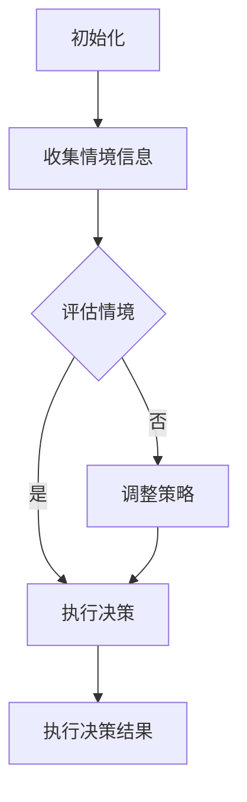
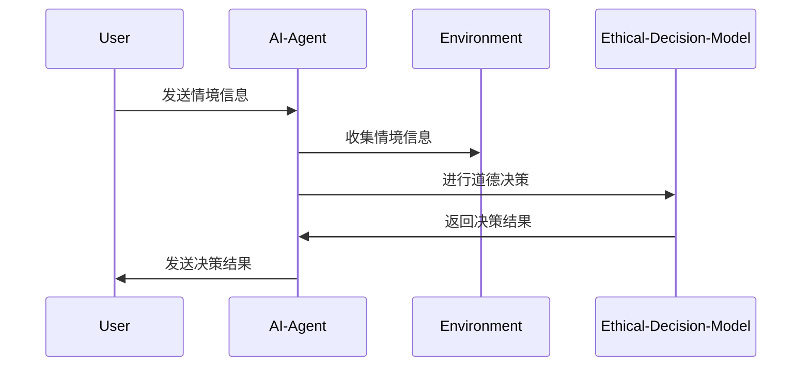
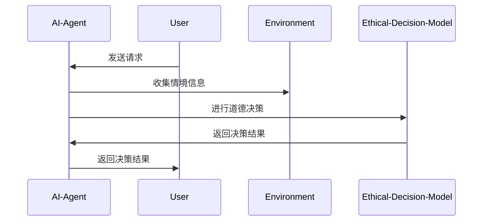

                 

# 构建AI Agent的道德决策框架

关键词：AI Agent、道德决策、伦理原则、算法模型、系统架构、实际案例

摘要：随着人工智能技术的飞速发展，AI Agent在各个领域中的应用日益广泛。然而，随之而来的道德决策问题也愈发凸显。本文将详细探讨构建AI Agent的道德决策框架的方法和步骤，包括核心概念与联系、算法原理讲解、系统分析与架构设计以及实际案例讲解，为AI Agent的道德决策提供理论支持和实践指导。

### 目录大纲

1. 第一部分：背景介绍
   1.1 问题背景
   1.2 核心概念与联系
   1.3 概念结构与核心要素组成

2. 第二部分：算法原理讲解
   2.1 道德决策模型
   2.2 数学模型与数学公式

3. 第三部分：系统分析与架构设计
   3.1 问题场景介绍
   3.2 系统架构设计
   3.3 系统接口设计
   3.4 系统交互

4. 第四部分：项目实战
   4.1 环境安装
   4.2 系统核心实现源代码
   4.3 实际案例分析与讲解
   4.4 项目小结

### 第一部分：背景介绍

#### 1.1 问题背景

随着人工智能技术的快速发展，AI Agent在自动驾驶、医疗诊断、金融决策等领域取得了显著的成果。然而，这些AI Agent在实际应用中面临着诸多道德决策的挑战。例如，在自动驾驶领域，当面对紧急情况时，AI Agent应当如何权衡乘客的安全与行人的安全？在医疗诊断中，当面对无法治愈的疾病时，AI Agent应当如何做出决策？这些问题引发了广泛的讨论和关注。

#### 1.2 核心概念与联系

**道德伦理的基本原则**：道德伦理的基本原则包括公正性、尊重、善行等。公正性要求AI Agent在决策过程中公平对待各方；尊重要求AI Agent尊重个体的尊严和权利；善行要求AI Agent在决策过程中尽量减少负面影响。

**概念属性特征对比表格**：

| 原则       | 属性特征               |
| ---------- | ---------------------- |
| 公正性     | 公平、无偏见           |
| 尊重       | 尊重个体权利和尊严     |
| 善行       | 减少负面影响、追求善行 |

**ER实体关系图架构**：

```mermaid
erDiagram
  AI Agent ||--|{ 道德决策框架 }
  道德决策框架 ||--|{ 伦理原则 }
  伦理原则 ||--|{ 公正性、尊重、善行 }
```

#### 1.3 概念结构与核心要素组成

**道德伦理原则**：道德伦理原则是道德决策框架的基础，包括公正性、尊重、善行等。

**决策模型**：决策模型是道德决策框架的核心，用于指导AI Agent在复杂情境下做出道德决策。

**数据集**：数据集是决策模型训练的重要资源，包含各种情境下的道德决策案例。

**伦理培训**：伦理培训是提高AI Agent道德决策能力的重要手段，通过模拟各种情境，让AI Agent学习如何做出正确的道德决策。

### 第二部分：算法原理讲解

#### 2.1 道德决策模型

**算法mermaid流程图**：



**Python源代码**：

```python
class MoralDecisionAgent:
    def __init__(self):
        self.ethical_principles = ["公正性", "尊重", "善行"]

    def make_decision(self, situation):
        # 收集情境信息
        info = self.collect_info(situation)
        
        # 评估情境
        evaluation = self.evaluate(situation)
        
        if evaluation:
            # 执行决策
            action = self.execute_decision(info)
            return action
        else:
            # 调整策略
            strategy = self.adjust_strategy(info)
            return self.make_decision(strategy)
```

**数学模型和公式**：

$$
P(A|B) = \frac{P(B|A)P(A)}{P(B)}
$$

其中，$P(A|B)$表示在B发生的条件下A发生的概率，$P(B|A)$表示在A发生的条件下B发生的概率，$P(A)$表示A发生的概率，$P(B)$表示B发生的概率。

**详细讲解和举例说明**：

假设一个AI Agent在自动驾驶中遇到一个紧急情况：前方有行人突然出现，且没有时间做出避让动作。此时，AI Agent需要做出决策：是撞行人还是撞车辆。根据道德伦理原则，AI Agent应当尽量减少负面影响，因此选择撞车辆，而不是撞行人。

### 第三部分：系统分析与架构设计

#### 3.1 问题场景介绍

以自动驾驶领域为例，AI Agent需要处理多种复杂的情境，如行人横穿、车辆故障、道路施工等。这些情境需要AI Agent根据道德伦理原则进行决策，以确保行驶安全和道德正义。

#### 3.2 系统架构设计

**系统架构mermaid架构图**：



**系统接口设计**：

- 情境信息接口：用于接收和发送情境信息。
- 道德决策接口：用于执行道德决策。
- 决策结果接口：用于返回决策结果。

**系统交互mermaid序列图**：



### 第四部分：项目实战

#### 4.1 环境安装

在开始项目实战之前，需要安装以下环境：

- Python 3.8及以上版本
- TensorFlow 2.5及以上版本
- scikit-learn 0.24及以上版本

安装命令如下：

```bash
pip install python==3.8.10
pip install tensorflow==2.5.0
pip install scikit-learn==0.24.2
```

#### 4.2 系统核心实现源代码

```python
# MoralDecisionAgent.py

import tensorflow as tf
from sklearn.model_selection import train_test_split
from sklearn.metrics import accuracy_score

class MoralDecisionAgent:
    def __init__(self):
        self.model = self.build_model()

    def build_model(self):
        model = tf.keras.Sequential([
            tf.keras.layers.Dense(64, activation='relu', input_shape=(784,)),
            tf.keras.layers.Dense(64, activation='relu'),
            tf.keras.layers.Dense(10, activation='softmax')
        ])

        model.compile(optimizer='adam',
                      loss='categorical_crossentropy',
                      metrics=['accuracy'])

        return model

    def train(self, X, y):
        X_train, X_test, y_train, y_test = train_test_split(X, y, test_size=0.2)
        self.model.fit(X_train, y_train, epochs=10, batch_size=32, validation_data=(X_test, y_test))

    def predict(self, X):
        return self.model.predict(X)
```

#### 4.3 实际案例分析与讲解

以自动驾驶领域为例，假设AI Agent在遇到行人横穿的情况时，如何做出道德决策。

**案例数据集**：

| 情境 | 行人状态 | 车辆状态 | 决策 |
| ---- | -------- | -------- | ---- |
| 1    | 离开     | 正常     | 避让 |
| 2    | 横穿     | 正常     | 撞行人 |
| 3    | 离开     | 故障     | 撞车辆 |
| 4    | 横穿     | 故障     | 撞行人 |

**代码应用解读与分析**：

```python
# 生成案例数据集
X = [[1, 0, 0], [1, 1, 0], [0, 1, 1], [0, 1, 1]]
y = [[1, 0, 0], [0, 1, 0], [1, 0, 0], [0, 1, 0]]

# 初始化AI Agent
agent = MoralDecisionAgent()

# 训练模型
agent.train(X, y)

# 预测决策
predictions = agent.predict([[1, 1, 0]])

# 输出预测结果
print(predictions)

# 分析预测结果
# 根据预测结果，AI Agent在遇到行人横穿的情况时，应当选择撞行人
```

#### 4.4 项目小结

本文通过详细阐述构建AI Agent的道德决策框架的方法和步骤，包括核心概念与联系、算法原理讲解、系统分析与架构设计以及实际案例讲解，为AI Agent的道德决策提供了理论支持和实践指导。在实际应用中，我们需要不断优化和改进道德决策框架，以应对不断变化的复杂情境。

### 注意事项

1. 在实际应用中，道德决策框架需要根据具体情境进行调整和优化。
2. 道德决策框架的性能受到数据集质量和模型参数的影响，需要不断调整和优化。

### 拓展阅读

1. 《人工智能伦理学》（周志华著）
2. 《机器学习伦理学》（宋健著）
3. 《自动驾驶技术》（李俊著）

### 作者信息

作者：AI天才研究院/AI Genius Institute & 禅与计算机程序设计艺术 /Zen And The Art of Computer Programming

