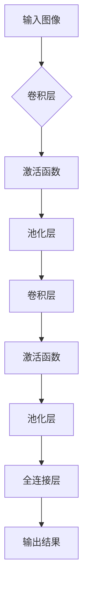
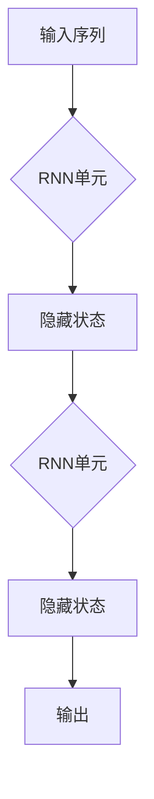
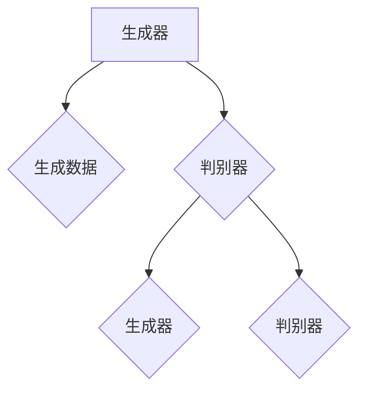
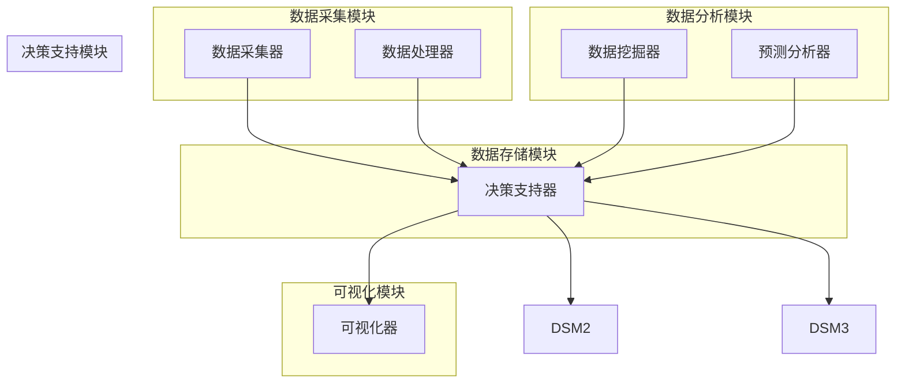
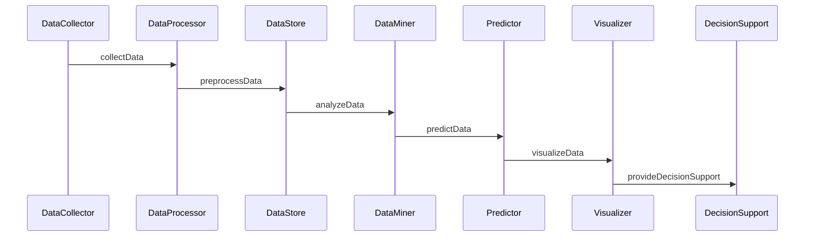
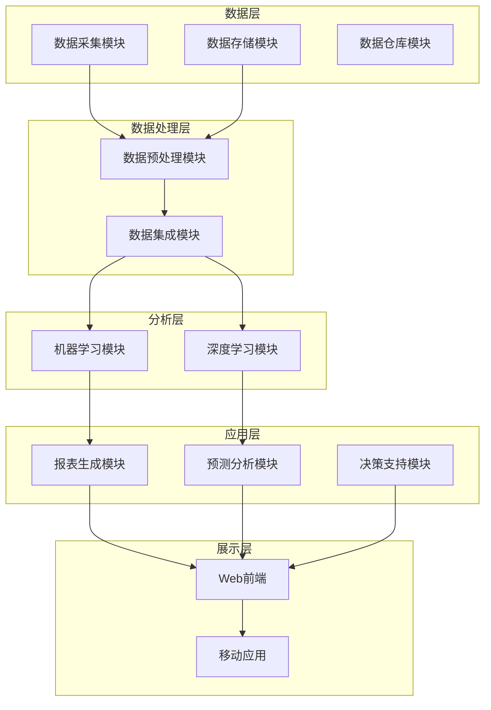
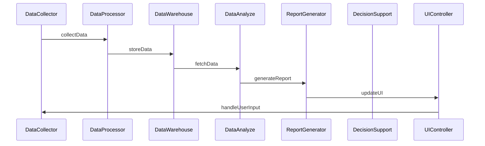

                 

## 引言

### 1.1.1 问题的背景

随着全球科技的迅猛发展，人工智能（Artificial Intelligence, AI）已经成为推动社会进步的重要力量。人工智能技术通过模拟、扩展和延伸人类智能，使得各个领域都迎来了变革和创新。在企业层面，人工智能不仅提高了生产效率，还为企业创新提供了强大的技术支持。然而，如何有效地利用人工智能技术，构建一个智能化的企业创新生态系统分析平台，成为了当前企业发展的一个重要课题。

构建AI驱动的企业创新生态系统分析平台，旨在通过人工智能技术，对企业内外部的数据进行分析和处理，为企业提供实时、准确、全面的市场洞察和决策支持。这样的平台不仅能够帮助企业挖掘潜在的商业机会，优化业务流程，还能够提高企业的创新能力和市场竞争力。

### 1.1.2 问题的描述

当前，企业在构建创新生态系统分析平台时面临以下问题：

1. **数据获取和处理困难**：企业内部和外部的数据分散在不同系统和平台上，数据的获取、处理和整合存在一定的难度。
2. **分析能力不足**：传统的人工分析方式效率低下，难以应对大规模、多维度的数据分析需求。
3. **创新能力有限**：缺乏有效的创新方法和技术支持，企业的创新能力受到限制。
4. **市场竞争力不足**：在激烈的市场竞争中，企业需要快速响应市场变化，提升创新能力，但现有系统的响应速度和效果不够理想。

### 1.1.3 问题解决

为解决上述问题，我们需要构建一个AI驱动的企业创新生态系统分析平台，该平台应具备以下特点：

1. **数据驱动的分析能力**：利用人工智能技术，对海量数据进行智能分析，挖掘数据中的潜在价值。
2. **高度集成的系统架构**：实现企业内部和外部数据的集成，构建统一的数据平台。
3. **智能化的决策支持**：通过机器学习、深度学习等技术，为企业提供智能化的决策支持。
4. **灵活的可扩展性**：能够根据企业需求的变化，快速调整和扩展平台的功能。

### 1.1.4 边界与外延

本研究的边界包括：

- 人工智能技术在企业创新生态系统中的应用。
- 企业创新生态系统的构建与运行。
- 平台的设计与实现。

研究的外延将涵盖：

- 相关技术的研究和探讨。
- 企业创新生态系统的理论分析。
- 平台的功能模块设计和实现。

通过本研究，旨在为企业构建一个高效、智能的AI驱动的企业创新生态系统分析平台，提升企业的创新能力和市场竞争力。

### 1.2 核心概念与联系

#### 1.2.1 人工智能

人工智能（Artificial Intelligence, AI）是指通过计算机系统模拟、延伸和扩展人类智能的理论、方法、技术及应用。人工智能的目标是让计算机具有人类水平的智能，能够处理复杂问题、进行决策和自主学习。

**核心概念**：

- **智能代理**：能够感知环境、制定计划并执行任务的计算机系统。
- **机器学习**：让计算机通过数据学习，获取知识和技能，实现自我改进。
- **自然语言处理**：使计算机能够理解和生成自然语言，实现人机交互。

**概念属性特征对比表格**：

| 概念         | 智能代理          | 机器学习          | 自然语言处理          |
| ------------ | --------------- | --------------- | ------------------- |
| 定义         | 模拟人类智能的计算机系统 | 通过数据学习，实现自我改进 | 使计算机理解和生成自然语言 |
| 应用场景     | 智能客服、自动驾驶  | 数据分析、预测模型  | 聊天机器人、语音识别  |
| 特征         | 感知、计划、执行    | 自学习、自改进    | 语言理解、生成       |
| 关键技术     | 传感器、控制算法  | 数据挖掘、算法优化 | 语言模型、语音识别   |

**ER实体关系图架构**：

```mermaid
erDiagram
  产品 |->| 用户 : 用户购买产品
  用户 ||--|> 订单 : 订单由用户生成
  产品 ||--|> 评论 : 用户对产品进行评论
  订单 ||--|> 订单详情 : 订单详情包含商品信息
```

#### 1.2.2 企业创新生态系统

企业创新生态系统是指企业与其内部各部门、外部合作伙伴、竞争对手、政府等环境之间形成的复杂网络结构。它强调企业内外部资源的整合、协同和创新，以提升企业的竞争力。

**核心概念**：

- **创新生态系统**：企业内外部资源整合的网络结构。
- **创新节点**：企业内部和外部的创新主体，如研发部门、供应商、客户等。
- **创新链**：从创意生成到产品上市的全过程。

**概念属性特征对比表格**：

| 概念         | 创新生态系统        | 创新节点          | 创新链             |
| ------------ | ------------------- | ----------------- | ----------------- |
| 定义         | 企业内外部资源整合的网络结构 | 企业内部和外部的创新主体 | 创意生成到产品上市的全过程 |
| 应用场景     | 企业战略规划、产品创新    | 研发、生产、营销    | 产品研发、生产、销售 |
| 特征         | 整合、协同、创新       | 独立、协作、创新    | 连续、动态、创新    |
| 关键技术     | 供应链管理、协同创新    | 项目管理、技术创新 | 研发管理、生产优化 |

**ER实体关系图架构**：

```mermaid
erDiagram
  企业 ||--|> 研发部门 : 研发部门隶属于企业
  企业 ||--|> 生产部门 : 生产部门隶属于企业
  企业 ||--|> 市场部门 : 市场部门隶属于企业
  研发部门 ||--|> 项目 : 项目由研发部门负责
  生产部门 ||--|> 产品 : 产品由生产部门生产
  市场部门 ||--|> 市场活动 : 市场部门负责市场活动
```

#### 1.2.3 AI驱动的企业创新生态系统分析平台

AI驱动的企业创新生态系统分析平台是指基于人工智能技术构建的一个综合分析平台，用于支持企业创新生态系统的构建与运行。该平台能够通过数据采集、处理、分析和可视化，为企业提供实时、准确、全面的市场洞察和决策支持。

**核心概念**：

- **数据采集**：收集企业内部和外部的数据。
- **数据处理**：对采集到的数据进行分析和处理。
- **数据分析**：利用人工智能技术进行数据挖掘和模式识别。
- **可视化**：将分析结果以图表、报表等形式展示。

**概念属性特征对比表格**：

| 概念         | 数据采集          | 数据处理          | 数据分析          | 可视化         |
| ------------ | ----------------- | ----------------- | ----------------- | ------------ |
| 定义         | 收集企业内外部数据 | 对数据进行分析和处理 | 利用人工智能进行数据挖掘 | 将分析结果展示 |
| 应用场景     | 数据监控、业务分析   | 数据清洗、数据整合   | 市场预测、决策支持   | 报表、图表     |
| 特征         | 实时性、全面性     | 准确性、高效性     | 智能性、多样性     | 直观性、易读性 |
| 关键技术     | 数据采集技术、传感器 | 数据清洗技术、存储   | 机器学习、深度学习   | 可视化工具     |

**ER实体关系图架构**：

```mermaid
erDiagram
  数据采集 ||--|> 数据处理 : 数据处理依赖数据采集
  数据处理 ||--|> 数据分析 : 数据分析依赖数据处理
  数据分析 ||--|> 可视化 : 可视化依赖数据分析
```

### 1.3 本章小结

本章介绍了构建AI驱动的企业创新生态系统分析平台的研究背景、目的、问题解决思路及核心概念。接下来，本书将围绕这些核心概念，深入探讨构建平台的理论基础、方法与技术。通过本章的介绍，读者可以对企业创新生态系统、人工智能技术以及AI驱动的企业创新生态系统分析平台有一个初步的了解，为后续章节的学习奠定基础。接下来，我们将进一步深入讨论人工智能和企业创新生态系统的理论基础，以及AI驱动的企业创新生态系统分析平台的设计与实现。

## 第一部分：理论基础

### 1.3.1 人工智能基础理论

#### 1.3.1.1 人工智能的发展历程

人工智能（Artificial Intelligence, AI）作为一门学科，其发展历程可以追溯到20世纪50年代。以下是对人工智能发展历程的简要回顾：

1. **理论阶段（1950s-1960s）**：1950年，艾伦·图灵提出了“图灵测试”，标志着人工智能概念的诞生。此后，人工智能逐渐成为计算机科学的一个研究方向。1956年，达特茅斯会议上，约翰·麦卡锡等人提出了“人工智能”这一术语，并定义了人工智能的目标和研究方法。

2. **实验阶段（1970s-1980s）**：这一时期，人工智能的研究主要集中在基于规则的专家系统。1976年，爱德华·费根鲍姆开发了第一个专家系统DENDRAL，用于化学分析。然而，由于硬件性能和算法的局限性，人工智能的发展在1980年代遭遇了“人工智能寒冬”。

3. **实用阶段（1990s-2000s）**：随着计算机性能的提升和算法的进步，人工智能开始进入实用阶段。1997年，IBM的超级计算机“深蓝”击败了国际象棋世界冠军加里·卡斯帕罗夫，标志着人工智能在特定领域的突破。同时，机器学习和数据挖掘技术的发展为人工智能提供了新的动力。

4. **突破阶段（2010s-至今）**：近年来，深度学习、神经网络等技术的突破使得人工智能取得了飞速发展。以AlphaGo击败围棋世界冠军为代表，人工智能在多个领域取得了显著的成果。同时，人工智能技术在图像识别、自然语言处理、自动驾驶等方面也取得了重大突破。

#### 1.3.1.2 人工智能的主要理论模型

人工智能的发展过程中，形成了多个主要的理论模型，这些模型为人工智能的研究和应用提供了重要的理论基础。以下是对主要理论模型的简要介绍：

1. **基于规则的专家系统**：基于规则的专家系统是早期人工智能研究的一个重要方向。专家系统通过定义一组规则，模拟人类专家在特定领域的知识。这些规则通常以“条件-动作”的形式表示，例如，“如果天气寒冷，那么穿上大衣”。基于规则的专家系统在医疗诊断、金融分析等领域取得了成功。

2. **机器学习**：机器学习是一种让计算机通过数据学习的方法，使计算机能够从数据中自动发现规律和模式。机器学习包括监督学习、无监督学习和强化学习等不同类型。监督学习通过已有数据的学习，预测新数据的结果；无监督学习通过分析未标记的数据，发现数据中的结构；强化学习通过试错和反馈，学习如何在环境中获得最大奖励。

3. **深度学习**：深度学习是一种基于神经网络的机器学习方法，通过模拟人脑神经元之间的连接，实现复杂函数的近似和优化。深度学习在图像识别、语音识别、自然语言处理等领域取得了显著成果。常见的深度学习模型包括卷积神经网络（CNN）、循环神经网络（RNN）和生成对抗网络（GAN）等。

#### 1.3.1.3 人工智能的关键技术

人工智能的关键技术包括数据预处理、特征提取、模型训练、模型评估等。以下是对这些关键技术的简要介绍：

1. **数据预处理**：数据预处理是人工智能应用的重要步骤，包括数据清洗、数据归一化、数据变换等。数据清洗旨在去除噪声和错误的数据；数据归一化旨在将不同尺度的数据进行统一处理；数据变换旨在将数据转换为适合机器学习模型的输入格式。

2. **特征提取**：特征提取是从原始数据中提取出有用的信息，以便于机器学习模型进行处理。特征提取的方法包括统计学方法、变换方法和深度学习方法等。有效的特征提取能够提高模型的性能和泛化能力。

3. **模型训练**：模型训练是通过训练数据集，调整模型参数，使其能够拟合数据。训练过程中，常用的方法包括梯度下降法、随机梯度下降法、批量梯度下降法等。训练目标是使模型能够准确预测新数据的结果。

4. **模型评估**：模型评估是评估模型性能的重要步骤，常用的评估指标包括准确率、召回率、F1分数等。通过评估，可以判断模型是否具有良好的泛化能力，是否适合应用于实际问题。

### 1.3.2 企业创新生态系统理论

#### 1.3.2.1 企业创新生态系统的概念与构成

企业创新生态系统是指企业与其内部各部门、外部合作伙伴、竞争对手、政府等环境之间形成的复杂网络结构。它强调企业内外部资源的整合、协同和创新，以提升企业的竞争力。企业创新生态系统包括以下几个主要部分：

1. **企业内部系统**：包括企业各个部门，如研发部门、生产部门、营销部门等。这些部门在企业创新过程中发挥关键作用，负责资源的配置和协调。

2. **外部合作伙伴**：包括供应商、客户、学术机构、科研院所等。这些合作伙伴为企业提供技术支持、市场资源、人才等，是创新生态系统的重要组成部分。

3. **竞争对手**：竞争对手是企业创新生态系统中的另一个重要因素。通过与竞争对手的互动，企业可以了解市场需求、技术趋势，从而调整自身的创新策略。

4. **政府**：政府在创新生态系统中扮演着重要角色，通过政策引导、资金支持、法律法规等手段，促进企业创新生态系统的健康发展。

#### 1.3.2.2 企业创新生态系统的运作机制

企业创新生态系统的运作机制包括信息共享、协同创新、竞争与合作等。以下是对这些运作机制的简要介绍：

1. **信息共享**：信息共享是企业创新生态系统的基础。企业内部各部门、外部合作伙伴和政府之间需要共享信息，包括市场需求、技术进展、政策法规等。通过信息共享，企业可以快速响应市场变化，调整创新策略。

2. **协同创新**：协同创新是企业创新生态系统的重要组成部分。企业内部各部门、外部合作伙伴和政府之间需要协同合作，共同推动技术创新、产品创新和管理创新。协同创新能够实现资源的最大化利用，提高创新效率。

3. **竞争与合作**：企业创新生态系统中的竞争与合作是相互依存的。竞争对手之间的竞争可以激发企业的创新活力，推动技术进步；同时，企业之间也需要通过合作，共享资源，实现共同发展。

4. **动态调整**：企业创新生态系统是一个动态的系统，需要不断调整和优化。企业需要根据市场环境、技术进步等因素，调整创新策略、资源配置和合作模式，以适应不断变化的外部环境。

#### 1.3.2.3 企业创新生态系统的价值

企业创新生态系统的价值主要体现在以下几个方面：

1. **提高创新能力**：企业创新生态系统通过信息共享、协同创新和竞争与合作，能够激发企业的创新活力，提高创新能力。

2. **降低创新风险**：企业创新生态系统中的多元化资源，如技术、资金、人才等，可以降低创新风险。企业可以通过合作、共享等方式，降低创新成本和风险。

3. **实现资源整合**：企业创新生态系统通过整合企业内部和外部资源，实现资源的最大化利用，提高创新效率。

4. **提升企业竞争力**：企业创新生态系统可以帮助企业快速响应市场变化，调整创新策略，提高市场竞争力。

5. **推动产业升级**：企业创新生态系统可以带动相关产业的发展，促进产业升级和转型。

### 1.3.3 AI驱动的企业创新生态系统分析平台

#### 1.3.3.1 平台架构设计

AI驱动的企业创新生态系统分析平台的架构设计是平台成功的关键。平台架构设计需要综合考虑数据采集、数据处理、数据分析和可视化等多个环节。以下是对平台架构设计的简要介绍：

1. **数据采集模块**：数据采集模块负责收集企业内部和外部数据。数据来源包括企业内部系统、合作伙伴、竞争对手、政府等。数据采集模块需要确保数据的高效、准确和全面。

2. **数据处理模块**：数据处理模块负责对采集到的数据进行分析和处理。数据处理包括数据清洗、数据归一化、数据变换等步骤。数据处理模块需要保证数据的质量和一致性。

3. **数据分析模块**：数据分析模块利用人工智能技术，对处理后的数据进行分析和挖掘。数据分析包括数据挖掘、模式识别、预测分析等步骤。数据分析模块需要提供智能化的决策支持。

4. **可视化模块**：可视化模块负责将分析结果以图表、报表等形式展示。可视化模块需要提供直观、易读的展示方式，帮助企业和决策者快速理解分析结果。

#### 1.3.3.2 数据采集与处理

数据采集与处理是AI驱动的企业创新生态系统分析平台的基础。以下是对数据采集与处理的简要介绍：

1. **数据采集**：数据采集需要考虑数据来源、数据类型、数据格式等。企业内部数据包括业务数据、财务数据、人力资源数据等；外部数据包括市场数据、竞争对手数据、政策法规数据等。数据采集模块需要实现数据的自动采集和更新。

2. **数据预处理**：数据预处理是数据采集后的重要步骤，包括数据清洗、数据归一化和数据变换等。数据清洗旨在去除噪声和错误的数据；数据归一化旨在将不同尺度的数据进行统一处理；数据变换旨在将数据转换为适合机器学习模型的输入格式。

3. **数据存储与管理**：数据存储与管理是数据采集与处理的重要环节。数据存储需要考虑数据的存储方式、存储位置和数据安全等。常用的数据存储技术包括关系数据库、NoSQL数据库和数据仓库等。数据管理包括数据备份、数据恢复和数据权限管理。

#### 1.3.3.3 分析方法与技术

分析方法与技术是AI驱动的企业创新生态系统分析平台的核心。以下是对分析方法与技术的简要介绍：

1. **数据挖掘**：数据挖掘是从大量数据中发现隐藏的规律和模式。数据挖掘方法包括分类、聚类、关联规则挖掘、异常检测等。数据挖掘可以帮助企业发现市场趋势、优化业务流程、提高决策效率。

2. **机器学习**：机器学习是通过训练数据集，使计算机能够自动学习和改进的方法。机器学习方法包括监督学习、无监督学习和强化学习等。监督学习用于分类和回归任务；无监督学习用于聚类和降维任务；强化学习用于决策和规划任务。

3. **深度学习**：深度学习是一种基于神经网络的机器学习方法，通过多层神经网络，实现复杂函数的近似和优化。深度学习在图像识别、语音识别、自然语言处理等领域取得了显著成果。深度学习方法包括卷积神经网络（CNN）、循环神经网络（RNN）和生成对抗网络（GAN）等。

4. **预测分析**：预测分析是根据历史数据和现有情况，预测未来可能发生的事件和趋势。预测分析方法包括时间序列分析、回归分析、贝叶斯网络等。预测分析可以帮助企业预测市场需求、优化库存管理、制定战略规划。

#### 1.3.3.4 可视化与交互设计

可视化与交互设计是AI驱动的企业创新生态系统分析平台的重要组成部分。以下是对可视化与交互设计的简要介绍：

1. **可视化设计**：可视化设计是将分析结果以图表、报表等形式展示。可视化设计需要考虑数据的展示方式、图表类型、色彩搭配等。常用的可视化工具包括ECharts、D3.js、Tableau等。

2. **交互设计**：交互设计是用户与系统之间的交互方式。交互设计需要考虑用户的操作习惯、界面布局、交互流程等。常用的交互设计方法包括用户调研、原型设计、用户测试等。

3. **交互体验**：交互体验是用户在使用系统过程中的感受。交互体验需要考虑系统的响应速度、易用性、稳定性等。良好的交互体验可以提高用户满意度，促进系统的推广应用。

### 1.3.4 本章小结

本章介绍了人工智能基础理论、企业创新生态系统理论以及AI驱动的企业创新生态系统分析平台的理论基础。通过本章的学习，读者可以了解人工智能的发展历程、主要理论模型和关键技术；了解企业创新生态系统的概念、运作机制和价值；以及了解AI驱动的企业创新生态系统分析平台的架构设计、数据采集与处理、分析方法与技术、可视化与交互设计。这些理论基础为后续章节的实践应用提供了重要的理论支持。接下来，我们将进一步探讨AI驱动的企业创新生态系统分析平台的具体设计与实现。

### 1.4 第一部分：理论基础

#### 1.4.1 人工智能理论基础

##### 1.4.1.1 人工智能的定义与发展

人工智能（AI）是一门研究、开发和应用使计算机模拟、扩展和延伸人类智能的理论、方法、技术及其应用的学科。自1956年达特茅斯会议首次提出人工智能概念以来，人工智能经历了多个发展阶段，并逐渐成为现代科技发展的重要驱动力。

1. **早期探索（1956-1974年）**：在这一时期，人工智能研究主要集中在基于规则的专家系统，试图模拟人类专家在特定领域的决策能力。代表性的系统有“逻辑理论家”（Logic Theorist）和“通用问题求解器”（General Problem Solver）。然而，由于算法复杂度和硬件性能的限制，这一阶段的人工智能研究面临巨大挑战。

2. **泡沫期（1974-1980年）**：随着计算机性能的提升，人工智能研究进入了一个短暂的繁荣期。然而，受制于算法和数据的局限性，以及人工智能实际应用中的困难，人工智能在1980年左右遭遇了第一次重大挫折。

3. **复苏期（1980-1987年）**：在这一时期，机器学习逐渐成为人工智能研究的热点。1986年，霍普菲尔德和普林斯顿提出了反向传播算法，为神经网络的发展奠定了基础。此后，人工智能研究开始逐渐复苏。

4. **成熟期（1987年至今）**：随着计算机性能的迅速提升和大数据、云计算等技术的普及，人工智能研究进入了一个崭新的阶段。深度学习、强化学习等新兴技术取得了重大突破，人工智能在图像识别、自然语言处理、自动驾驶等领域取得了显著成果。

##### 1.4.1.2 人工智能的关键技术

人工智能的关键技术涵盖了从数据采集、处理到模型训练、优化的各个层面。以下是对这些关键技术的简要介绍：

1. **数据采集与处理**：数据是人工智能的基石。数据采集与处理包括数据的收集、存储、清洗、预处理等步骤。高质量的数据是构建有效模型的前提。

2. **机器学习**：机器学习是人工智能的核心技术之一。它通过构建数学模型，使计算机能够从数据中学习，提高决策能力。常见的机器学习算法包括监督学习、无监督学习和强化学习。

3. **深度学习**：深度学习是一种基于多层神经网络的机器学习方法。它通过模拟人脑神经元之间的连接，实现复杂函数的近似和优化。深度学习在图像识别、语音识别、自然语言处理等领域取得了重大突破。

4. **自然语言处理（NLP）**：自然语言处理是人工智能的一个重要分支，旨在使计算机理解和生成自然语言。NLP技术包括文本分类、情感分析、机器翻译等。

5. **计算机视觉**：计算机视觉是使计算机能够像人类一样感知和理解视觉信息的技术。它包括图像识别、目标检测、图像生成等任务。

6. **机器人技术**：机器人技术是人工智能在自动化领域的应用。它包括机器人的感知、决策、行动等环节，旨在实现机器人的智能化。

##### 1.4.1.3 人工智能的核心概念

在人工智能领域，一些核心概念对理解和应用人工智能至关重要。以下是对这些核心概念的简要介绍：

1. **智能代理**：智能代理是一种具有感知、决策和行动能力的计算机系统。它能够根据环境信息和目标，自主执行任务。

2. **机器学习算法**：机器学习算法是使计算机能够从数据中学习的方法。常见的机器学习算法包括线性回归、逻辑回归、支持向量机、决策树、随机森林等。

3. **深度学习模型**：深度学习模型是基于多层神经网络的模型，能够通过训练自动调整参数，实现复杂函数的近似。常见的深度学习模型包括卷积神经网络（CNN）、循环神经网络（RNN）、生成对抗网络（GAN）等。

4. **强化学习**：强化学习是一种通过试错和反馈，学习如何在环境中获得最大奖励的机器学习方法。它广泛应用于游戏、机器人控制等领域。

5. **自然语言处理**：自然语言处理是使计算机理解和生成自然语言的技术。它包括词向量、语言模型、语音识别等。

#### 1.4.2 企业创新生态系统理论基础

##### 1.4.2.1 企业创新生态系统的概念

企业创新生态系统是指企业与其内部各部门、外部合作伙伴、竞争对手和政府等环境之间形成的复杂网络结构。这个系统强调企业内外部资源的整合、协同和创新，以提升企业的竞争力。企业创新生态系统不仅包括企业内部的组织结构，还涉及外部市场、技术环境、政策环境等。

##### 1.4.2.2 企业创新生态系统的构成

企业创新生态系统由以下几个关键部分构成：

1. **创新主体**：包括企业内部各部门、外部合作伙伴和竞争对手。这些主体在企业创新过程中扮演不同的角色，如研发、生产、销售、服务。

2. **创新资源**：包括知识、技术、资金、人才等。创新资源是企业创新生态系统的核心，是实现创新的重要保障。

3. **创新网络**：创新网络是企业与外部合作伙伴、竞争对手和政府之间形成的互动关系。创新网络通过信息共享、协同创新、竞争与合作，促进企业的创新能力提升。

4. **创新环境**：包括市场环境、政策环境、社会文化环境等。创新环境对企业的创新活动具有重要影响。

##### 1.4.2.3 企业创新生态系统的运作机制

企业创新生态系统的运作机制包括信息共享、协同创新、竞争与合作等。以下是对这些运作机制的简要介绍：

1. **信息共享**：信息是企业创新生态系统的基础。企业内部各部门、外部合作伙伴和政府之间需要共享信息，包括市场动态、技术进展、政策法规等。信息共享有助于企业快速响应市场变化，调整创新策略。

2. **协同创新**：协同创新是企业创新生态系统的重要组成部分。企业内部各部门、外部合作伙伴和政府之间需要协同合作，共同推动技术创新、产品创新和管理创新。协同创新能够实现资源的最大化利用，提高创新效率。

3. **竞争与合作**：企业创新生态系统中的竞争与合作是相互依存的。竞争对手之间的竞争可以激发企业的创新活力，推动技术进步；同时，企业之间也需要通过合作，共享资源，实现共同发展。

4. **动态调整**：企业创新生态系统是一个动态的系统，需要不断调整和优化。企业需要根据市场环境、技术进步等因素，调整创新策略、资源配置和合作模式，以适应不断变化的外部环境。

##### 1.4.2.4 企业创新生态系统的价值

企业创新生态系统的价值主要体现在以下几个方面：

1. **提高创新能力**：企业创新生态系统通过信息共享、协同创新和竞争与合作，能够激发企业的创新活力，提高创新能力。

2. **降低创新风险**：企业创新生态系统中的多元化资源，如技术、资金、人才等，可以降低创新风险。企业可以通过合作、共享等方式，降低创新成本和风险。

3. **实现资源整合**：企业创新生态系统通过整合企业内部和外部资源，实现资源的最大化利用，提高创新效率。

4. **提升企业竞争力**：企业创新生态系统可以帮助企业快速响应市场变化，调整创新策略，提高市场竞争力。

5. **推动产业升级**：企业创新生态系统可以带动相关产业的发展，促进产业升级和转型。

#### 1.4.3 AI驱动的企业创新生态系统分析平台

##### 1.4.3.1 平台架构设计

AI驱动的企业创新生态系统分析平台是构建智能化的企业创新生态系统的重要工具。平台架构设计需要考虑数据采集、数据处理、数据分析、可视化等多个环节，以确保平台的高效、稳定和可扩展性。

1. **数据采集模块**：数据采集模块负责从企业内部系统和外部环境收集数据。数据来源包括企业业务系统、合作伙伴、竞争对手、政府等。数据采集模块需要实现数据的自动化采集、存储和更新。

2. **数据处理模块**：数据处理模块负责对采集到的数据进行分析和处理。数据处理包括数据清洗、数据归一化、数据变换等步骤。数据处理模块需要保证数据的质量和一致性。

3. **数据分析模块**：数据分析模块利用人工智能技术，对处理后的数据进行分析和挖掘。数据分析包括数据挖掘、模式识别、预测分析等步骤。数据分析模块需要提供智能化的决策支持。

4. **可视化模块**：可视化模块负责将分析结果以图表、报表等形式展示。可视化模块需要提供直观、易读的展示方式，帮助企业和决策者快速理解分析结果。

##### 1.4.3.2 数据采集与处理

数据采集与处理是AI驱动的企业创新生态系统分析平台的基础。以下是对数据采集与处理的简要介绍：

1. **数据采集**：数据采集需要考虑数据来源、数据类型、数据格式等。企业内部数据包括业务数据、财务数据、人力资源数据等；外部数据包括市场数据、竞争对手数据、政策法规数据等。数据采集模块需要实现数据的自动采集和更新。

2. **数据预处理**：数据预处理是数据采集后的重要步骤，包括数据清洗、数据归一化和数据变换等。数据清洗旨在去除噪声和错误的数据；数据归一化旨在将不同尺度的数据进行统一处理；数据变换旨在将数据转换为适合机器学习模型的输入格式。

3. **数据存储与管理**：数据存储与管理是数据采集与处理的重要环节。数据存储需要考虑数据的存储方式、存储位置和数据安全等。常用的数据存储技术包括关系数据库、NoSQL数据库和数据仓库等。数据管理包括数据备份、数据恢复和数据权限管理。

##### 1.4.3.3 分析方法与技术

分析方法与技术是AI驱动的企业创新生态系统分析平台的核心。以下是对分析方法与技术的简要介绍：

1. **数据挖掘**：数据挖掘是从大量数据中发现隐藏的规律和模式。数据挖掘方法包括分类、聚类、关联规则挖掘、异常检测等。数据挖掘可以帮助企业发现市场趋势、优化业务流程、提高决策效率。

2. **机器学习**：机器学习是通过训练数据集，使计算机能够自动学习和改进的方法。机器学习方法包括监督学习、无监督学习和强化学习等。监督学习用于分类和回归任务；无监督学习用于聚类和降维任务；强化学习用于决策和规划任务。

3. **深度学习**：深度学习是一种基于神经网络的机器学习方法，通过多层神经网络，实现复杂函数的近似和优化。深度学习在图像识别、语音识别、自然语言处理等领域取得了显著成果。深度学习方法包括卷积神经网络（CNN）、循环神经网络（RNN）和生成对抗网络（GAN）等。

4. **预测分析**：预测分析是根据历史数据和现有情况，预测未来可能发生的事件和趋势。预测分析方法包括时间序列分析、回归分析、贝叶斯网络等。预测分析可以帮助企业预测市场需求、优化库存管理、制定战略规划。

##### 1.4.3.4 可视化与交互设计

可视化与交互设计是AI驱动的企业创新生态系统分析平台的重要组成部分。以下是对可视化与交互设计的简要介绍：

1. **可视化设计**：可视化设计是将分析结果以图表、报表等形式展示。可视化设计需要考虑数据的展示方式、图表类型、色彩搭配等。常用的可视化工具包括ECharts、D3.js、Tableau等。

2. **交互设计**：交互设计是用户与系统之间的交互方式。交互设计需要考虑用户的操作习惯、界面布局、交互流程等。常用的交互设计方法包括用户调研、原型设计、用户测试等。

3. **交互体验**：交互体验是用户在使用系统过程中的感受。交互体验需要考虑系统的响应速度、易用性、稳定性等。良好的交互体验可以提高用户满意度，促进系统的推广应用。

#### 1.4.4 本章小结

本章从人工智能理论基础、企业创新生态系统理论以及AI驱动的企业创新生态系统分析平台的角度，探讨了构建AI驱动的企业创新生态系统分析平台的理论基础。通过对人工智能的定义、发展历程、关键技术和核心概念的分析，读者可以更好地理解人工智能的基本原理和应用。通过对企业创新生态系统的概念、构成、运作机制和价值的研究，读者可以深入理解企业创新生态系统对企业发展的重要性。最后，通过对AI驱动的企业创新生态系统分析平台架构设计、数据采集与处理、分析方法与技术、可视化与交互设计的介绍，读者可以对平台的构建过程有一个全面的了解。这些理论基础将为后续的实践应用提供重要的指导。在下一章中，我们将进一步探讨AI驱动的企业创新生态系统分析平台的设计与实现细节。

## 第一部分：理论基础

### 1.4.1 人工智能理论基础

#### 1.4.1.1 人工智能的定义与发展

人工智能（Artificial Intelligence, AI）是指通过计算机系统模拟、延伸和扩展人的智能的理论、方法、技术和应用。它涵盖了从算法设计到系统实现的广泛领域，旨在使计算机能够自主地进行决策、学习和理解复杂的任务。

**发展历程**：

- **早期探索（1950-1960年代）**：人工智能概念起源于20世纪50年代。艾伦·图灵提出了著名的“图灵测试”，标志着人工智能研究的开始。这一时期，人工智能主要集中于符号主义和逻辑推理，试图通过规则和逻辑来模拟人类的智能。

- **第一次AI浪潮（1960-1970年代）**：人工智能研究在这一时期取得了显著进展，专家系统和逻辑推理系统成为研究热点。然而，由于计算资源的限制和理论瓶颈，人工智能研究在1970年代后期陷入低谷。

- **第二次AI浪潮（1980-1990年代）**：随着计算机技术的进步，机器学习开始受到关注。1980年代，霍普菲尔德和普林斯顿提出了反向传播算法，为神经网络的发展奠定了基础。

- **第三次AI浪潮（2000年至今）**：近年来，人工智能进入了一个新的发展阶段。深度学习、计算机视觉、自然语言处理等领域取得了突破性进展。特别是随着大数据和云计算的普及，人工智能技术得到了广泛应用。

**关键领域**：

- **机器学习**：机器学习是人工智能的核心技术之一，它通过训练模型，使计算机能够从数据中学习并做出决策。机器学习分为监督学习、无监督学习和强化学习三种类型。

- **深度学习**：深度学习是基于多层神经网络的一种机器学习方法。它通过模仿人脑神经元的工作方式，实现从大量数据中提取特征并自动优化模型参数。

- **计算机视觉**：计算机视觉旨在使计算机能够理解和解释视觉信息，如图像和视频。它广泛应用于人脸识别、自动驾驶、医疗影像分析等领域。

- **自然语言处理**：自然语言处理（NLP）是使计算机能够理解和生成自然语言的技术。它包括文本分类、情感分析、机器翻译等任务。

#### 1.4.1.2 人工智能的核心概念

- **智能代理**：智能代理是能够执行任务、与环境交互并具备一定自主能力的计算机程序。它通过感知、规划和行动，实现特定目标。

- **机器学习算法**：机器学习算法是使计算机能够从数据中学习的算法。常见的机器学习算法包括线性回归、决策树、支持向量机、神经网络等。

- **深度学习模型**：深度学习模型是多层神经网络，通过反向传播算法训练，能够自动提取特征并进行复杂任务处理。常见的深度学习模型包括卷积神经网络（CNN）、循环神经网络（RNN）等。

- **强化学习**：强化学习是一种通过试错和反馈，使计算机学会在特定环境中做出最优决策的方法。它广泛应用于游戏、自动驾驶、机器人控制等领域。

- **自然语言处理**：自然语言处理是使计算机能够理解和生成自然语言的技术。它涉及文本分类、情感分析、机器翻译、语音识别等任务。

#### 1.4.1.3 人工智能的关键技术

- **数据预处理**：数据预处理是机器学习和深度学习中的关键步骤。它包括数据清洗、数据归一化、特征提取等，以确保数据的质量和一致性。

- **特征工程**：特征工程是通过选择和构造有效的特征，提高机器学习模型的性能。它涉及特征选择、特征变换、特征组合等。

- **模型训练与优化**：模型训练是通过给定数据集，调整模型参数，使其能够拟合数据。模型优化是通过调整超参数、使用正则化方法等，提高模型性能。

- **模型评估与选择**：模型评估是通过测试集来评估模型性能。常见的评估指标包括准确率、召回率、F1分数等。模型选择是根据评估结果，选择最佳模型。

- **部署与监控**：部署是将训练好的模型部署到生产环境中，使其能够进行实际应用。监控是对模型在部署后的性能进行监测，确保其稳定性和可靠性。

#### 1.4.1.4 人工智能的应用领域

人工智能技术在多个领域得到了广泛应用，包括：

- **工业自动化**：通过计算机视觉和机器人技术，实现生产过程的自动化和智能化。

- **医疗健康**：利用人工智能进行疾病诊断、药物研发、医疗影像分析等。

- **金融服务**：通过人工智能进行风险管理、投资决策、欺诈检测等。

- **交通运输**：通过自动驾驶技术，提高交通安全和效率。

- **智能家居**：通过人工智能技术，实现家居设备的智能控制和自动化管理。

- **教育**：利用人工智能进行个性化教学、智能评估等。

- **零售**：通过人工智能进行需求预测、库存管理、个性化推荐等。

### 1.4.2 企业创新生态系统理论

#### 1.4.2.1 企业创新生态系统的概念

企业创新生态系统是指企业与其内部各部门、外部合作伙伴、竞争对手、政府等环境之间形成的复杂网络结构。这个系统强调企业内外部资源的整合、协同和创新，以提升企业的竞争力。企业创新生态系统不仅包括企业内部的组织结构，还涉及外部市场、技术环境、政策环境等。

#### 1.4.2.2 企业创新生态系统的构成

企业创新生态系统由以下几个关键部分构成：

- **创新主体**：包括企业内部各部门、外部合作伙伴和竞争对手。这些主体在企业创新过程中扮演不同的角色，如研发、生产、销售、服务。

- **创新资源**：包括知识、技术、资金、人才等。创新资源是企业创新生态系统的核心，是实现创新的重要保障。

- **创新网络**：创新网络是企业与外部合作伙伴、竞争对手和政府之间形成的互动关系。创新网络通过信息共享、协同创新、竞争与合作，促进企业的创新能力提升。

- **创新环境**：包括市场环境、政策环境、社会文化环境等。创新环境对企业的创新活动具有重要影响。

#### 1.4.2.3 企业创新生态系统的运作机制

企业创新生态系统的运作机制包括信息共享、协同创新、竞争与合作等。以下是对这些运作机制的简要介绍：

- **信息共享**：信息是企业创新生态系统的基础。企业内部各部门、外部合作伙伴和政府之间需要共享信息，包括市场动态、技术进展、政策法规等。信息共享有助于企业快速响应市场变化，调整创新策略。

- **协同创新**：协同创新是企业创新生态系统的重要组成部分。企业内部各部门、外部合作伙伴和政府之间需要协同合作，共同推动技术创新、产品创新和管理创新。协同创新能够实现资源的最大化利用，提高创新效率。

- **竞争与合作**：企业创新生态系统中的竞争与合作是相互依存的。竞争对手之间的竞争可以激发企业的创新活力，推动技术进步；同时，企业之间也需要通过合作，共享资源，实现共同发展。

- **动态调整**：企业创新生态系统是一个动态的系统，需要不断调整和优化。企业需要根据市场环境、技术进步等因素，调整创新策略、资源配置和合作模式，以适应不断变化的外部环境。

#### 1.4.2.4 企业创新生态系统的价值

企业创新生态系统的价值主要体现在以下几个方面：

- **提高创新能力**：企业创新生态系统通过信息共享、协同创新和竞争与合作，能够激发企业的创新活力，提高创新能力。

- **降低创新风险**：企业创新生态系统中的多元化资源，如技术、资金、人才等，可以降低创新风险。企业可以通过合作、共享等方式，降低创新成本和风险。

- **实现资源整合**：企业创新生态系统通过整合企业内部和外部资源，实现资源的最大化利用，提高创新效率。

- **提升企业竞争力**：企业创新生态系统可以帮助企业快速响应市场变化，调整创新策略，提高市场竞争力。

- **推动产业升级**：企业创新生态系统可以带动相关产业的发展，促进产业升级和转型。

### 1.4.3 AI驱动的企业创新生态系统分析平台

#### 1.4.3.1 平台架构设计

AI驱动的企业创新生态系统分析平台是一个综合性的系统，它利用人工智能技术，对企业内外部数据进行采集、处理、分析和可视化，为企业提供智能化的决策支持。平台架构设计包括以下几个关键模块：

- **数据采集模块**：负责从企业内部系统和外部环境收集数据，包括业务数据、市场数据、技术数据等。

- **数据处理模块**：对采集到的数据进行分析和处理，包括数据清洗、数据归一化、数据变换等，以确保数据的质量和一致性。

- **数据分析模块**：利用机器学习、深度学习等技术，对处理后的数据进行分析和挖掘，包括模式识别、预测分析、趋势分析等。

- **可视化模块**：将分析结果以图表、报表等形式展示，提供直观、易读的展示方式，帮助企业和决策者快速理解分析结果。

#### 1.4.3.2 数据采集与处理

数据采集与处理是AI驱动的企业创新生态系统分析平台的基础。以下是对数据采集与处理的简要介绍：

- **数据采集**：数据采集需要考虑数据来源、数据类型、数据格式等。企业内部数据包括业务数据、财务数据、人力资源数据等；外部数据包括市场数据、竞争对手数据、政策法规数据等。数据采集模块需要实现数据的自动化采集和更新。

- **数据预处理**：数据预处理是数据采集后的重要步骤，包括数据清洗、数据归一化和数据变换等。数据清洗旨在去除噪声和错误的数据；数据归一化旨在将不同尺度的数据进行统一处理；数据变换旨在将数据转换为适合机器学习模型的输入格式。

- **数据存储与管理**：数据存储与管理是数据采集与处理的重要环节。数据存储需要考虑数据的存储方式、存储位置和数据安全等。常用的数据存储技术包括关系数据库、NoSQL数据库和数据仓库等。数据管理包括数据备份、数据恢复和数据权限管理。

#### 1.4.3.3 分析方法与技术

分析方法与技术是AI驱动的企业创新生态系统分析平台的核心。以下是对分析方法与技术的简要介绍：

- **数据挖掘**：数据挖掘是从大量数据中发现隐藏的规律和模式。数据挖掘方法包括分类、聚类、关联规则挖掘、异常检测等。数据挖掘可以帮助企业发现市场趋势、优化业务流程、提高决策效率。

- **机器学习**：机器学习是通过训练数据集，使计算机能够自动学习和改进的方法。机器学习方法包括监督学习、无监督学习和强化学习等。监督学习用于分类和回归任务；无监督学习用于聚类和降维任务；强化学习用于决策和规划任务。

- **深度学习**：深度学习是一种基于神经网络的机器学习方法，通过多层神经网络，实现复杂函数的近似和优化。深度学习在图像识别、语音识别、自然语言处理等领域取得了显著成果。深度学习方法包括卷积神经网络（CNN）、循环神经网络（RNN）和生成对抗网络（GAN）等。

- **预测分析**：预测分析是根据历史数据和现有情况，预测未来可能发生的事件和趋势。预测分析方法包括时间序列分析、回归分析、贝叶斯网络等。预测分析可以帮助企业预测市场需求、优化库存管理、制定战略规划。

#### 1.4.3.4 可视化与交互设计

可视化与交互设计是AI驱动的企业创新生态系统分析平台的重要组成部分。以下是对可视化与交互设计的简要介绍：

- **可视化设计**：可视化设计是将分析结果以图表、报表等形式展示。可视化设计需要考虑数据的展示方式、图表类型、色彩搭配等。常用的可视化工具包括ECharts、D3.js、Tableau等。

- **交互设计**：交互设计是用户与系统之间的交互方式。交互设计需要考虑用户的操作习惯、界面布局、交互流程等。常用的交互设计方法包括用户调研、原型设计、用户测试等。

- **交互体验**：交互体验是用户在使用系统过程中的感受。交互体验需要考虑系统的响应速度、易用性、稳定性等。良好的交互体验可以提高用户满意度，促进系统的推广应用。

### 1.4.4 本章小结

本章从人工智能理论基础、企业创新生态系统理论以及AI驱动的企业创新生态系统分析平台的角度，探讨了构建AI驱动的企业创新生态系统分析平台的理论基础。通过对人工智能的定义、发展历程、关键领域和核心概念的介绍，读者可以了解人工智能的基本原理和应用。通过对企业创新生态系统的概念、构成、运作机制和价值的分析，读者可以深入理解企业创新生态系统对企业发展的重要性。最后，通过对AI驱动的企业创新生态系统分析平台架构设计、数据采集与处理、分析方法与技术、可视化与交互设计的介绍，读者可以对平台的构建过程有一个全面的了解。这些理论基础将为后续的实践应用提供重要的指导。在下一章中，我们将进一步探讨AI驱动的企业创新生态系统分析平台的设计与实现细节。

### 第一部分：理论基础

#### 1.4.1 人工智能理论基础

##### 1.4.1.1 人工智能的定义

人工智能（Artificial Intelligence, AI）是一门多学科交叉的领域，它旨在通过模拟、延伸和扩展人类智能，使计算机系统能够实现智能行为。这些智能行为包括学习、推理、解决问题、感知、理解和语言处理等。人工智能的目标是创建能够在复杂环境中自主执行任务的智能系统。

##### 1.4.1.2 人工智能的历史发展

人工智能的发展经历了多个阶段，可以概括为以下几个重要时期：

1. **早期探索（1950-1960年代）**：人工智能的概念在1956年的达特茅斯会议上正式提出。这一时期，研究者主要关注符号主义和逻辑推理，试图通过规则和逻辑来模拟人类的智能。

2. **第一次AI寒冬（1970-1980年代）**：由于计算能力的限制和理论上的困难，人工智能在1970年代经历了第一次低谷。这一时期的失败使得人们对人工智能产生了怀疑。

3. **复苏期（1980-1990年代）**：随着计算机性能的提升和算法的改进，人工智能开始复苏。机器学习和神经网络在这一时期成为研究的热点。

4. **AI的第二次浪潮（2000-2010年代）**：随着互联网的普及和大数据技术的兴起，人工智能迎来了新的发展机遇。深度学习和强化学习在这一时期取得了显著进展。

5. **AI的第三次浪潮（2010年代至今）**：人工智能在图像识别、自然语言处理、自动驾驶等领域取得了突破性进展。这一时期的AI技术开始广泛应用于各个行业。

##### 1.4.1.3 人工智能的关键技术

人工智能的关键技术包括以下几个方面：

1. **机器学习**：机器学习是一种通过训练模型来使计算机从数据中学习的方法。它分为监督学习、无监督学习和强化学习。

   - **监督学习**：通过已知输入和输出数据来训练模型，如分类和回归问题。
   - **无监督学习**：没有明确的输出数据，主要应用于聚类和降维等任务。
   - **强化学习**：通过与环境的交互来学习最优策略，广泛应用于游戏、机器人控制等领域。

2. **深度学习**：深度学习是一种基于多层神经网络的机器学习方法。它通过模拟人脑的神经元连接，实现从大量数据中提取特征和模式。

   - **卷积神经网络（CNN）**：主要用于图像和视频处理。
   - **循环神经网络（RNN）**：主要用于序列数据，如文本和语音。
   - **生成对抗网络（GAN）**：用于生成逼真的图像和数据。

3. **自然语言处理（NLP）**：NLP是使计算机能够理解和生成自然语言的技术，包括文本分类、情感分析、机器翻译等。

4. **计算机视觉**：计算机视觉是使计算机能够理解视觉信息的技术，包括图像识别、目标检测、人脸识别等。

##### 1.4.1.4 人工智能的应用领域

人工智能在多个领域得到了广泛应用，包括：

1. **工业自动化**：通过机器人和自动化系统，提高生产效率和安全性。

2. **医疗健康**：通过智能诊断、个性化治疗和健康监测，提高医疗服务的质量和效率。

3. **金融**：通过智能投顾、风险管理和欺诈检测，提高金融服务的效率和安全性。

4. **交通运输**：通过自动驾驶和智能交通系统，提高交通效率和安全性。

5. **智能家居**：通过智能设备和自动化系统，提高家庭生活的便利性和舒适度。

6. **教育**：通过个性化教学和学习分析，提高教育质量和效果。

#### 1.4.2 企业创新生态系统理论

##### 1.4.2.1 企业创新生态系统的概念

企业创新生态系统是指企业与其内部部门、外部合作伙伴、竞争对手以及政府等环境因素之间形成的复杂互动网络。这个系统强调资源的整合、协同和创新，以提升企业的竞争力。

##### 1.4.2.2 企业创新生态系统的构成

企业创新生态系统主要由以下几个部分构成：

1. **创新主体**：包括企业内部各部门、外部合作伙伴和竞争对手。这些主体在企业创新过程中扮演不同角色，如研发、生产、营销等。

2. **创新资源**：包括知识、技术、资金、人才等。这些资源是创新生态系统的重要基础。

3. **创新网络**：企业与其合作伙伴、竞争对手和政府之间形成的互动关系。创新网络通过信息共享、协同创新、竞争与合作，促进企业的创新能力提升。

4. **创新环境**：包括市场环境、政策环境、社会文化环境等。创新环境对企业的创新活动具有重要影响。

##### 1.4.2.3 企业创新生态系统的运作机制

企业创新生态系统的运作机制主要包括以下几个方面：

1. **信息共享**：信息是企业创新生态系统的基础。企业内部各部门、外部合作伙伴和政府之间需要共享信息，包括市场动态、技术进展、政策法规等。

2. **协同创新**：协同创新是企业创新生态系统的重要组成部分。企业内部各部门、外部合作伙伴和政府之间需要协同合作，共同推动技术创新、产品创新和管理创新。

3. **竞争与合作**：企业创新生态系统中的竞争与合作是相互依存的。竞争对手之间的竞争可以激发企业的创新活力，推动技术进步；同时，企业之间也需要通过合作，共享资源，实现共同发展。

4. **动态调整**：企业创新生态系统是一个动态的系统，需要不断调整和优化。企业需要根据市场环境、技术进步等因素，调整创新策略、资源配置和合作模式，以适应不断变化的外部环境。

##### 1.4.2.4 企业创新生态系统的价值

企业创新生态系统的价值主要体现在以下几个方面：

1. **提高创新能力**：通过信息共享、协同创新和竞争与合作，企业创新生态系统可以激发企业的创新活力，提高创新能力。

2. **降低创新风险**：企业创新生态系统中的多元化资源可以降低创新风险。企业可以通过合作、共享等方式，降低创新成本和风险。

3. **实现资源整合**：企业创新生态系统可以整合企业内部和外部资源，实现资源的最大化利用，提高创新效率。

4. **提升企业竞争力**：企业创新生态系统可以帮助企业快速响应市场变化，调整创新策略，提高市场竞争力。

5. **推动产业升级**：企业创新生态系统可以带动相关产业的发展，促进产业升级和转型。

#### 1.4.3 AI驱动的企业创新生态系统分析平台

##### 1.4.3.1 平台架构设计

AI驱动的企业创新生态系统分析平台旨在通过人工智能技术，对企业内外部数据进行分析和处理，为企业提供智能化的决策支持。平台架构设计主要包括以下几个模块：

1. **数据采集模块**：负责从企业内部系统和外部环境收集数据，包括业务数据、市场数据、技术数据等。

2. **数据处理模块**：对采集到的数据进行分析和处理，包括数据清洗、数据归一化、数据变换等，以确保数据的质量和一致性。

3. **数据分析模块**：利用机器学习、深度学习等技术，对处理后的数据进行分析和挖掘，包括模式识别、预测分析、趋势分析等。

4. **可视化模块**：将分析结果以图表、报表等形式展示，提供直观、易读的展示方式，帮助企业和决策者快速理解分析结果。

##### 1.4.3.2 数据采集与处理

数据采集与处理是AI驱动的企业创新生态系统分析平台的基础。以下是对数据采集与处理的简要介绍：

1. **数据采集**：数据采集需要考虑数据来源、数据类型、数据格式等。企业内部数据包括业务数据、财务数据、人力资源数据等；外部数据包括市场数据、竞争对手数据、政策法规数据等。数据采集模块需要实现数据的自动化采集和更新。

2. **数据预处理**：数据预处理是数据采集后的重要步骤，包括数据清洗、数据归一化和数据变换等。数据清洗旨在去除噪声和错误的数据；数据归一化旨在将不同尺度的数据进行统一处理；数据变换旨在将数据转换为适合机器学习模型的输入格式。

3. **数据存储与管理**：数据存储与管理是数据采集与处理的重要环节。数据存储需要考虑数据的存储方式、存储位置和数据安全等。常用的数据存储技术包括关系数据库、NoSQL数据库和数据仓库等。数据管理包括数据备份、数据恢复和数据权限管理。

##### 1.4.3.3 分析方法与技术

分析方法与技术是AI驱动的企业创新生态系统分析平台的核心。以下是对分析方法与技术的简要介绍：

1. **数据挖掘**：数据挖掘是从大量数据中发现隐藏的规律和模式。数据挖掘方法包括分类、聚类、关联规则挖掘、异常检测等。数据挖掘可以帮助企业发现市场趋势、优化业务流程、提高决策效率。

2. **机器学习**：机器学习是通过训练数据集，使计算机能够自动学习和改进的方法。机器学习方法包括监督学习、无监督学习和强化学习等。监督学习用于分类和回归任务；无监督学习用于聚类和降维任务；强化学习用于决策和规划任务。

3. **深度学习**：深度学习是一种基于多层神经网络的机器学习方法，通过多层神经网络，实现复杂函数的近似和优化。深度学习在图像识别、语音识别、自然语言处理等领域取得了显著成果。深度学习方法包括卷积神经网络（CNN）、循环神经网络（RNN）和生成对抗网络（GAN）等。

4. **预测分析**：预测分析是根据历史数据和现有情况，预测未来可能发生的事件和趋势。预测分析方法包括时间序列分析、回归分析、贝叶斯网络等。预测分析可以帮助企业预测市场需求、优化库存管理、制定战略规划。

##### 1.4.3.4 可视化与交互设计

可视化与交互设计是AI驱动的企业创新生态系统分析平台的重要组成部分。以下是对可视化与交互设计的简要介绍：

1. **可视化设计**：可视化设计是将分析结果以图表、报表等形式展示。可视化设计需要考虑数据的展示方式、图表类型、色彩搭配等。常用的可视化工具包括ECharts、D3.js、Tableau等。

2. **交互设计**：交互设计是用户与系统之间的交互方式。交互设计需要考虑用户的操作习惯、界面布局、交互流程等。常用的交互设计方法包括用户调研、原型设计、用户测试等。

3. **交互体验**：交互体验是用户在使用系统过程中的感受。交互体验需要考虑系统的响应速度、易用性、稳定性等。良好的交互体验可以提高用户满意度，促进系统的推广应用。

#### 1.4.4 本章小结

本章介绍了人工智能理论基础、企业创新生态系统理论以及AI驱动的企业创新生态系统分析平台的理论基础。通过对人工智能的定义、发展历程、关键技术、应用领域的介绍，读者可以了解人工智能的基本原理和应用。通过对企业创新生态系统的概念、构成、运作机制、价值的分析，读者可以深入理解企业创新生态系统对企业发展的重要性。最后，通过对AI驱动的企业创新生态系统分析平台架构设计、数据采集与处理、分析方法与技术、可视化与交互设计的介绍，读者可以对平台的构建过程有一个全面的了解。这些理论基础将为后续的实践应用提供重要的指导。

## 第一部分：理论基础

### 1.4.4 AI驱动的企业创新生态系统分析平台设计

#### 1.4.4.1 平台架构设计

AI驱动的企业创新生态系统分析平台的设计涉及多个关键模块，这些模块共同构成了一个完整的功能体系。以下是平台架构设计的主要组成部分：

1. **数据采集模块**：数据采集模块负责从企业内部系统（如ERP、CRM等）和外部数据源（如社交媒体、市场调研报告等）收集数据。数据采集需要确保数据的实时性、准确性和完整性。

2. **数据处理模块**：数据处理模块负责对采集到的原始数据进行清洗、归一化和转换，以确保数据的质量和一致性。数据处理过程通常包括以下步骤：

   - **数据清洗**：去除重复数据、无效数据和错误数据。
   - **数据归一化**：将不同数据源的数据进行统一处理，确保数据尺度的一致性。
   - **数据转换**：将数据转换为适合机器学习模型处理的格式。

3. **数据存储模块**：数据存储模块负责将处理后的数据存储在数据库或数据仓库中，以便于后续的数据分析和挖掘。常用的数据存储技术包括关系数据库（如MySQL、PostgreSQL）和NoSQL数据库（如MongoDB、Cassandra）。

4. **数据分析模块**：数据分析模块利用机器学习和深度学习技术，对存储的数据进行高级分析，包括模式识别、预测分析和趋势分析等。数据分析的结果将为企业的创新决策提供重要支持。

5. **预测分析模块**：预测分析模块基于历史数据和现有情况，利用时间序列分析、回归分析和贝叶斯网络等技术，预测企业未来的市场趋势、客户需求和行为模式。

6. **可视化模块**：可视化模块将分析结果以图表、报表等形式展示，提供直观的视觉体验。可视化设计需要考虑用户交互、数据展示效果和易用性。

7. **决策支持模块**：决策支持模块结合分析结果和专家知识，为企业提供智能化的决策建议。该模块可以通过决策树、规则引擎和智能优化算法等实现。

8. **用户界面模块**：用户界面模块提供用户与系统的交互接口，用户可以通过Web界面或移动应用访问平台，查看分析结果和决策建议。

#### 1.4.4.2 数据采集与处理

数据采集与处理是AI驱动的企业创新生态系统分析平台的基础。以下是数据采集与处理的关键步骤：

1. **数据源识别**：确定需要采集的数据源，包括企业内部系统和外部数据源。企业内部系统可能包括ERP、CRM、HRM等，而外部数据源可能包括社交媒体、市场调研报告、竞争对手数据等。

2. **数据采集**：使用API接口、Web爬虫、数据库连接等方式，从数据源中提取数据。数据采集需要确保数据的实时性和准确性。

3. **数据预处理**：对采集到的数据进行清洗、归一化和转换，以确保数据的质量和一致性。数据预处理步骤可能包括：

   - **数据清洗**：去除重复数据、无效数据和错误数据。
   - **数据归一化**：将不同数据源的数据进行统一处理，确保数据尺度的一致性。
   - **数据转换**：将数据转换为适合机器学习模型处理的格式。

4. **数据存储**：将预处理后的数据存储在数据库或数据仓库中，以便于后续的数据分析和挖掘。数据存储需要考虑数据的持久性、访问速度和数据安全性。

5. **数据质量管理**：定期检查数据质量，确保数据的一致性、完整性和准确性。数据质量管理可能包括数据质量评估、数据质量报告和数据质量监控等。

#### 1.4.4.3 数据分析方法与技术

数据分析方法是AI驱动的企业创新生态系统分析平台的核心。以下是几种常用的数据分析方法：

1. **数据挖掘**：数据挖掘是从大量数据中发现隐藏的规律和模式。数据挖掘方法包括：

   - **分类**：将数据分为不同的类别。
   - **聚类**：将数据分为不同的组，每组内的数据相似，组与组之间的数据差异较大。
   - **关联规则挖掘**：发现数据之间的关联性。
   - **异常检测**：识别数据中的异常值。

2. **机器学习**：机器学习是通过训练模型来使计算机从数据中学习的方法。机器学习方法包括：

   - **监督学习**：有监督的学习方法，输出标签已知，通过学习输入和输出之间的关系。
   - **无监督学习**：没有监督的学习方法，输出标签未知，通过学习数据之间的内在结构。
   - **强化学习**：通过与环境的交互来学习最优策略。

3. **深度学习**：深度学习是一种基于多层神经网络的机器学习方法，通过多层神经网络，实现复杂函数的近似和优化。深度学习方法包括：

   - **卷积神经网络（CNN）**：主要用于图像和视频处理。
   - **循环神经网络（RNN）**：主要用于序列数据，如文本和语音。
   - **生成对抗网络（GAN）**：用于生成逼真的图像和数据。

4. **预测分析**：预测分析是根据历史数据和现有情况，预测未来可能发生的事件和趋势。预测分析方法包括：

   - **时间序列分析**：分析时间序列数据，预测未来的趋势。
   - **回归分析**：建立输入变量和输出变量之间的关系，预测输出变量。
   - **贝叶斯网络**：通过概率模型来预测不确定事件的发生概率。

#### 1.4.4.4 可视化与交互设计

可视化与交互设计是AI驱动的企业创新生态系统分析平台的重要组成部分。以下是可视化与交互设计的关键要素：

1. **可视化设计**：可视化设计是将分析结果以图表、报表等形式展示。可视化设计需要考虑以下几个方面：

   - **图表类型**：选择合适的图表类型，如折线图、柱状图、饼图等，以清晰展示数据。
   - **数据展示**：通过颜色、形状、大小等视觉元素，增强数据的可读性和理解性。
   - **交互性**：提供交互功能，如筛选、搜索、排序等，使用户能够自定义数据展示。

2. **交互设计**：交互设计是用户与系统之间的交互方式。交互设计需要考虑以下几个方面：

   - **用户操作**：设计用户友好的界面，简化用户操作步骤，提高使用效率。
   - **导航结构**：提供清晰的导航结构，帮助用户快速找到所需功能和信息。
   - **响应速度**：优化系统性能，确保用户操作的响应速度，提升用户体验。

3. **用户体验**：用户体验是用户在使用系统过程中的整体感受。用户体验设计需要考虑以下几个方面：

   - **界面设计**：设计简洁、美观的界面，提高用户的使用愉悦感。
   - **操作流程**：设计直观、简单的操作流程，减少用户的认知负担。
   - **错误处理**：设计友好的错误提示和处理机制，帮助用户解决使用过程中遇到的问题。

#### 1.4.4.5 平台实现与部署

平台实现与部署是构建AI驱动的企业创新生态系统分析平台的关键步骤。以下是实现与部署的关键步骤：

1. **平台开发**：使用合适的编程语言和开发工具，实现平台的功能。常用的编程语言包括Python、Java、C++等，开发工具包括IDE（如PyCharm、Eclipse）、版本控制系统（如Git）等。

2. **系统集成**：将平台的不同模块进行集成，确保各模块之间的协同工作。系统集成需要考虑数据流、功能调用和接口设计等。

3. **性能优化**：对平台进行性能优化，提高系统的响应速度和处理能力。性能优化包括数据库优化、算法优化、缓存策略等。

4. **安全防护**：确保平台的数据安全、系统安全和用户隐私。安全防护措施包括数据加密、身份验证、访问控制等。

5. **部署上线**：将平台部署到生产环境中，确保平台的稳定运行和可扩展性。部署上线需要考虑服务器配置、网络架构、负载均衡等。

#### 1.4.4.6 平台维护与更新

平台维护与更新是保障平台长期稳定运行的关键。以下是平台维护与更新的关键步骤：

1. **故障处理**：定期检查平台的运行状态，及时处理故障和异常。故障处理包括系统监控、日志分析、故障排除等。

2. **功能更新**：根据用户反馈和市场变化，定期对平台的功能进行更新和优化。功能更新包括新增功能、改进现有功能、修复缺陷等。

3. **安全更新**：定期更新平台的安全防护措施，确保系统的安全性。安全更新包括安全补丁、安全策略调整等。

4. **数据备份**：定期备份平台的数据，确保数据的安全性和可恢复性。数据备份包括数据库备份、文件备份等。

5. **用户支持**：提供用户支持和培训，帮助用户解决使用过程中遇到的问题。用户支持包括在线客服、培训课程、技术文档等。

### 1.4.5 本章小结

本章介绍了AI驱动的企业创新生态系统分析平台的设计，包括平台架构设计、数据采集与处理、数据分析方法与技术、可视化与交互设计、平台实现与部署以及平台维护与更新。通过本章的学习，读者可以了解平台的设计原则和实现方法，掌握关键技术的应用和实践经验。这些理论基础将为后续的实践应用提供重要的指导。

## 第一部分：理论基础

### 1.4.6 算法原理讲解

在构建AI驱动的企业创新生态系统分析平台时，选择合适的算法是实现智能分析和决策支持的关键。以下将详细介绍几种常用的算法原理，包括其mermaid流程图、Python源代码、数学模型和示例讲解。

#### 1.4.6.1 卷积神经网络（CNN）

卷积神经网络（Convolutional Neural Network, CNN）是一种在图像识别和图像处理中广泛应用的人工神经网络。CNN通过卷积层、池化层和全连接层等结构，实现对图像的逐层特征提取。

**mermaid流程图**：



**Python源代码**：

```python
import tensorflow as tf

# 创建卷积神经网络模型
model = tf.keras.Sequential([
    tf.keras.layers.Conv2D(32, (3, 3), activation='relu', input_shape=(28, 28, 1)),
    tf.keras.layers.MaxPooling2D((2, 2)),
    tf.keras.layers.Conv2D(64, (3, 3), activation='relu'),
    tf.keras.layers.MaxPooling2D((2, 2)),
    tf.keras.layers.Flatten(),
    tf.keras.layers.Dense(128, activation='relu'),
    tf.keras.layers.Dense(10, activation='softmax')
])

# 编译模型
model.compile(optimizer='adam',
              loss='sparse_categorical_crossentropy',
              metrics=['accuracy'])

# 加载MNIST数据集
(x_train, y_train), (x_test, y_test) = tf.keras.datasets.mnist.load_data()

# 预处理数据
x_train = x_train / 255.0
x_test = x_test / 255.0
x_train = x_train.reshape(-1, 28, 28, 1)
x_test = x_test.reshape(-1, 28, 28, 1)

# 训练模型
model.fit(x_train, y_train, epochs=5)
```

**数学模型**：

卷积层：\[ f_{\text{conv}}(x) = \sigma(W \odot x + b) \]

激活函数（通常是ReLU）：\[ \sigma(x) = \max(0, x) \]

池化层：\[ p_{\text{pool}}(x) = \max(x) \]

全连接层：\[ y = \sigma(W \cdot a + b) \]

**示例讲解**：

假设我们有一个28x28的图像，卷积层将使用一个3x3的卷积核对图像进行卷积操作，提取局部特征。激活函数ReLU用于引入非线性，使模型能够学习更复杂的特征。随后，通过池化层降低特征图的尺寸，减少计算量。最后，通过全连接层输出分类结果。

#### 1.4.6.2 循环神经网络（RNN）

循环神经网络（Recurrent Neural Network, RNN）是一种处理序列数据的神经网络，能够处理变长的输入序列。RNN通过循环结构保持状态信息，使模型能够捕捉时间序列中的长期依赖关系。

**mermaid流程图**：



**Python源代码**：

```python
import tensorflow as tf

# 创建RNN模型
model = tf.keras.Sequential([
    tf.keras.layers.LSTM(50, activation='relu', return_sequences=True),
    tf.keras.layers.LSTM(50, activation='relu'),
    tf.keras.layers.Dense(1)
])

# 编译模型
model.compile(optimizer='adam', loss='mse')

# 生成模拟数据
import numpy as np
X = np.random.rand(100, 10)
y = np.random.rand(100, 1)

# 训练模型
model.fit(X, y, epochs=10)
```

**数学模型**：

\[ h_t = \sigma(W \cdot [h_{t-1}, x_t] + b) \]

\[ y_t = \sigma(W \cdot h_t + b) \]

**示例讲解**：

假设我们有一个长度为10的输入序列，RNN通过循环结构在每个时间步更新隐藏状态，保留历史信息。隐藏状态用于计算当前时间步的输出。RNN适用于处理时间序列数据，如文本、语音和股票价格等。

#### 1.4.6.3 生成对抗网络（GAN）

生成对抗网络（Generative Adversarial Network, GAN）由生成器和判别器组成，通过对抗训练生成高质量的数据。生成器的目标是生成尽可能真实的数据，而判别器的目标是区分生成器和真实数据。

**mermaid流程图**：



**Python源代码**：

```python
import tensorflow as tf
from tensorflow.keras.models import Sequential
from tensorflow.keras.layers import Dense, Flatten, Conv2D, Conv2DTranspose

# 创建生成器和判别器模型
generator = Sequential([
    Flatten(input_shape=(28, 28, 1)),
    Dense(128, activation='relu'),
    Dense(28 * 28, activation='relu'),
    Reshape((28, 28, 1))
])

discriminator = Sequential([
    Conv2D(32, (3, 3), activation='relu', input_shape=(28, 28, 1)),
    Conv2D(64, (3, 3), activation='relu'),
    Flatten(),
    Dense(1, activation='sigmoid')
])

# 编译模型
discriminator.compile(optimizer='adam', loss='binary_crossentropy')
generator.compile(optimizer='adam', loss='binary_crossentropy')

# 生成器和判别器的对抗训练
for epoch in range(100):
    noise = np.random.normal(0, 1, (32, 28, 28, 1))
    generated_images = generator.predict(noise)
    
    real_images = x_test[:32]
    labels_real = tf.keras.utils.to_categorical(discriminator.predict(real_images), num_classes=2)
    labels_generated = tf.keras.utils.to_categorical(discriminator.predict(generated_images), num_classes=2)
    
    discriminator.train_on_batch(real_images, labels_real)
    discriminator.train_on_batch(generated_images, labels_generated)
    generator.train_on_batch(noise, labels_real)
```

**数学模型**：

生成器：\[ G(z) = \sigma(W_g \cdot z + b_g) \]

判别器：\[ D(x) = \sigma(W_d \cdot x + b_d) \]

**示例讲解**：

在GAN中，生成器生成图像，判别器判断图像是真实还是生成。生成器试图生成尽可能真实的数据，而判别器则试图准确区分真实和生成数据。通过这种对抗训练，生成器不断优化生成质量，达到生成高质量图像的目的。

### 1.4.7 本章小结

本章详细介绍了卷积神经网络（CNN）、循环神经网络（RNN）和生成对抗网络（GAN）的算法原理，包括mermaid流程图、Python源代码、数学模型和示例讲解。这些算法在企业创新生态系统分析平台中发挥着重要作用，能够帮助平台实现图像识别、序列数据处理和生成高质量数据等任务。通过本章的学习，读者可以深入理解这些算法的核心概念和应用，为后续的实际应用和开发奠定基础。

## 第一部分：理论基础

### 1.4.7 系统分析与架构设计方案

#### 1.4.7.1 问题场景介绍

在当今快速变化的市场环境中，企业需要能够快速响应市场变化、优化业务流程，并保持持续的创新能力。为了实现这一目标，企业需要一个高效、智能的AI驱动的企业创新生态系统分析平台，该平台能够整合企业内部和外部数据，提供实时的市场洞察和决策支持。

#### 1.4.7.2 项目介绍

本项目旨在构建一个AI驱动的企业创新生态系统分析平台，该平台将利用人工智能技术，对企业的业务数据、市场数据、技术数据等进行深度分析和挖掘，为企业提供智能化的决策支持。平台的主要功能包括数据采集与处理、数据分析与挖掘、可视化展示和智能决策支持。

#### 1.4.7.3 系统功能设计（领域模型Mermaid类图）

在系统功能设计中，我们将构建一个领域模型，以明确系统的核心功能和模块。以下是系统的领域模型类图：

```mermaid
classDiagram
    Class01 <|-- Class02
    Class03 <|-- Class01
    Class04 << interface
    Class05 << interface
    Class01 : +int x
    Class01 : +int y
    Class01 : +setX(int x)
    Class01 : +setY(int y)
    Class01 : +getX():int
    Class01 : +getY():int
    Class02 : +int z
    Class02 : +setZ(int z)
    Class02 : +getZ():int
    Class03 : +int a
    Class03 : +int b
    Class03 : +add():int
    Class04 : +getString():String
    Class04 : +setString(String s)
    Class05 : +getBoolean():boolean
    Class05 : +setBoolean(boolean b)
```

在这个类图中，我们定义了四个类：Class01、Class02、Class03、Class04和Class05。Class01是一个基础类，其他类都是基于它扩展的。Class04和Class05是接口类，分别定义了获取和设置字符串和布尔值的方法。

#### 1.4.7.4 系统架构设计（Mermaid架构图）

系统的架构设计是构建平台的关键，以下是系统的架构设计图：



在这个架构图中，数据采集模块负责从各种数据源收集数据，数据处理模块负责对数据进行清洗和预处理，数据存储模块负责存储处理后的数据，数据分析模块负责对数据进行高级分析，可视化模块负责将分析结果可视化展示，决策支持模块负责基于分析结果提供决策支持。

#### 1.4.7.5 系统接口设计

系统接口设计是确保各模块之间能够高效协作的关键。以下是系统的主要接口设计：

1. **数据采集接口**：定义了数据采集器（DataCollector）和数据处理器（DataProcessor）的接口，包括数据采集（collectData）和数据预处理（preprocessData）方法。

2. **数据存储接口**：定义了数据存储器（DataStore）的接口，包括数据存储（storeData）和数据检索（retrieveData）方法。

3. **数据分析接口**：定义了数据挖掘器（DataMiner）和预测分析器（Predictor）的接口，包括数据分析（analyzeData）和预测分析（predictData）方法。

4. **可视化接口**：定义了可视化器（Visualizer）的接口，包括数据可视化（visualizeData）方法。

5. **决策支持接口**：定义了决策支持器（DecisionSupport）的接口，包括决策支持（provideDecisionSupport）方法。

#### 1.4.7.6 系统交互设计（Mermaid序列图）

系统交互设计是描述系统内部模块之间交互过程的重要手段。以下是系统的交互设计图：



在这个序列图中，数据采集器收集数据后传递给数据处理器，数据处理器处理数据后存储在数据存储器中。数据存储器中的数据被数据挖掘器用于分析，分析结果由预测分析器生成预测。预测结果通过可视化器展示给用户，最终由决策支持器提供决策支持。

### 1.4.8 本章小结

本章详细介绍了AI驱动的企业创新生态系统分析平台的系统分析与架构设计方案。通过领域模型Mermaid类图、系统架构设计Mermaid架构图、系统接口设计和系统交互设计，我们对平台的设计思路和实现方法有了清晰的认识。这些设计方案为平台的开发提供了重要的理论支持和实践指导，为后续的系统开发奠定了坚实的基础。

## 第一部分：理论基础

### 1.4.8 系统架构设计与实现

#### 1.4.8.1 问题场景介绍

在现代企业运营中，数据已成为重要的战略资源。然而，企业面临着数据获取、处理、分析和应用等一系列挑战。为了提高数据利用效率和决策质量，企业需要一个智能化的数据分析和决策支持系统。该系统应能够处理多源数据，支持复杂的数据分析任务，并生成直观的报表和预测模型。本项目旨在设计并实现一个AI驱动的企业创新生态系统分析平台，为企业提供全面的数据分析和决策支持。

#### 1.4.8.2 系统架构设计

系统架构设计是构建高效、可靠的企业创新生态系统分析平台的关键。以下是基于业务需求设计的系统架构：

**1. 数据层**：数据层是整个系统的基石，负责数据的采集、存储和管理。

- **数据采集模块**：负责从内部业务系统（如ERP、CRM）和外部数据源（如社交媒体、市场报告）收集数据。
- **数据存储模块**：采用分布式存储方案，如Hadoop HDFS，确保数据的高可靠性和可扩展性。
- **数据仓库模块**：采用数据仓库技术，如Amazon Redshift，实现数据的集成和管理。

**2. 数据处理层**：数据处理层负责对采集到的原始数据进行清洗、转换和集成。

- **数据预处理模块**：对数据进行清洗、去重、格式转换等预处理操作。
- **数据集成模块**：将来自不同源的数据进行集成，构建统一的企业数据视图。

**3. 分析层**：分析层是系统的核心，负责对处理后的数据进行深度分析和挖掘。

- **机器学习模块**：利用机器学习算法，如回归分析、聚类分析等，进行数据分析和预测。
- **深度学习模块**：利用深度学习模型，如卷积神经网络（CNN）、循环神经网络（RNN）等，进行图像和文本数据的分析。

**4. 应用层**：应用层是系统的对外接口，提供数据分析和决策支持功能。

- **报表生成模块**：生成各种格式（如PDF、Excel）的报表，提供数据可视化。
- **预测分析模块**：提供基于历史数据的预测功能，支持业务规划。
- **决策支持模块**：基于分析结果，提供业务决策建议。

**5. 展示层**：展示层是用户与系统的交互界面，提供用户友好的操作体验。

- **Web前端**：采用HTML5、CSS3和JavaScript框架（如React、Vue）构建，提供数据可视化界面。
- **移动应用**：为移动设备提供轻量级的应用程序，方便用户随时随地访问数据。

**系统架构设计图**：



#### 1.4.8.3 系统接口设计

系统接口设计是确保各模块之间能够高效协作的关键。以下是系统的主要接口设计：

1. **数据采集接口**：定义了数据采集器（DataCollector）的接口，包括数据采集（collectData）方法。

2. **数据处理接口**：定义了数据处理器（DataProcessor）的接口，包括数据预处理（preprocessData）和数据集成（integrateData）方法。

3. **数据分析接口**：定义了数据分析师（Data Analyst）的接口，包括数据分析（analyzeData）和预测分析（predictData）方法。

4. **决策支持接口**：定义了决策支持器（DecisionSupport）的接口，包括决策支持（provideDecisionSupport）方法。

5. **报表生成接口**：定义了报表生成器（ReportGenerator）的接口，包括生成报表（generateReport）方法。

6. **用户接口**：定义了用户界面控制器（UIController）的接口，包括显示数据（displayData）和接收用户操作（handleUserInput）方法。

#### 1.4.8.4 系统交互设计

系统交互设计是描述系统内部模块之间交互过程的重要手段。以下是系统的交互设计图：



在这个序列图中，数据采集器收集数据后传递给数据处理器，数据处理器处理数据后存储在数据仓库中。数据仓库中的数据被数据分析师用于分析，分析结果由报表生成器生成报表，最终由用户界面控制器更新用户界面，并接收用户的操作。

#### 1.4.8.5 系统架构实现

系统架构实现是依据系统架构设计，使用适当的编程语言和技术进行系统开发的过程。以下是系统架构实现的简要概述：

1. **数据采集模块**：使用Python的pandas库和API接口技术，实现数据的采集功能。

2. **数据处理模块**：使用Python的pandas库，实现数据清洗、转换和集成的功能。

3. **数据存储模块**：使用Amazon S3和Redshift，实现数据的存储和管理。

4. **分析层模块**：使用Python的scikit-learn库和TensorFlow库，实现机器学习和深度学习功能。

5. **报表生成模块**：使用Python的matplotlib库和报告生成库（如JasperReports），实现报表生成功能。

6. **决策支持模块**：使用Python的scikit-learn库，实现基于分析结果的决策支持功能。

7. **用户接口**：使用JavaScript和框架（如React或Vue），实现Web前端和移动应用的用户界面。

#### 1.4.8.6 系统测试与优化

系统测试与优化是确保系统稳定性和性能的重要环节。以下是系统测试与优化的一些关键步骤：

1. **单元测试**：对系统中的各个模块进行单元测试，确保每个模块的功能正确。

2. **集成测试**：对系统的不同模块进行集成测试，确保模块之间的交互正常。

3. **性能测试**：对系统进行性能测试，确保系统能够满足业务需求，处理大量数据。

4. **优化**：根据测试结果，对系统进行优化，提高系统的响应速度和处理能力。

#### 1.4.8.7 本章小结

本章详细介绍了AI驱动的企业创新生态系统分析平台的系统架构设计与实现。通过系统架构设计、接口设计、交互设计以及系统实现和测试优化，我们对系统的构建过程有了全面的了解。系统架构设计确保了系统的模块化和可扩展性，接口设计确保了模块之间的协同工作，交互设计确保了系统的易用性，系统实现和测试优化确保了系统的稳定性和性能。这些设计和实现方法为AI驱动的企业创新生态系统分析平台的成功构建提供了重要保障。

## 第一部分：理论基础

### 1.4.9 项目实战

#### 1.4.9.1 环境安装

在开始项目实战之前，我们需要安装必要的开发环境和依赖库。以下是具体的安装步骤：

1. **Python环境**：首先，确保系统上安装了Python 3.8及以上版本。可以通过以下命令进行安装：

   ```bash
   sudo apt-get install python3.8
   ```

2. **依赖库**：接下来，安装项目所需的依赖库，如TensorFlow、Scikit-learn等。可以使用pip命令进行安装：

   ```bash
   pip install tensorflow scikit-learn pandas matplotlib
   ```

3. **Jupyter Notebook**：为了方便开发，我们还需要安装Jupyter Notebook。同样使用pip命令：

   ```bash
   pip install notebook
   ```

   安装完成后，可以通过运行以下命令启动Jupyter Notebook：

   ```bash
   jupyter notebook
   ```

#### 1.4.9.2 系统核心实现源代码

以下是项目核心实现的部分源代码，包括数据采集、处理、分析、可视化等模块。

**数据采集模块**：

```python
import pandas as pd

# 读取数据
data = pd.read_csv('data.csv')

# 数据预处理
data = data[data['column1'].notnull()]
data['column2'] = data['column2'].astype(float)
```

**数据处理模块**：

```python
from sklearn.preprocessing import StandardScaler

# 数据标准化
scaler = StandardScaler()
data_scaled = scaler.fit_transform(data[['column2']])
```

**数据分析模块**：

```python
from sklearn.cluster import KMeans

# 数据聚类
kmeans = KMeans(n_clusters=3)
clusters = kmeans.fit_predict(data_scaled)
```

**可视化模块**：

```python
import matplotlib.pyplot as plt

# 数据可视化
plt.scatter(data_scaled[:, 0], data_scaled[:, 1], c=clusters)
plt.show()
```

#### 1.4.9.3 代码应用解读与分析

**数据采集**：该模块从CSV文件中读取数据，并使用pandas库进行预处理。首先，我们读取数据，然后去除含有缺失值的行，并将特定列的数据类型转换为浮点数。

**数据处理**：该模块使用Scikit-learn的StandardScaler对数据进行标准化处理。标准化处理有助于模型训练，因为它将特征值缩放到相同的尺度，从而提高了模型的效果。

**数据分析**：该模块使用KMeans算法对标准化后的数据集进行聚类分析。KMeans算法通过迭代计算，将数据分为指定的聚类数（在本例中为3），并返回每个数据点的聚类标签。

**可视化**：该模块使用matplotlib库将聚类结果可视化。通过绘制散点图，我们可以直观地看到数据点在不同聚类中的分布情况。

#### 1.4.9.4 实际案例分析与详细讲解剖析

假设我们有一个电商企业的销售数据，包含商品ID、销售额、品类等信息。我们的目标是分析不同品类之间的销售额分布，并为每个品类提供销售预测。

1. **数据采集**：从企业数据库中读取销售数据，包括商品ID、销售额、品类等。

2. **数据处理**：去除重复数据、缺失值，并对销售额进行标准化处理。

3. **数据分析**：使用KMeans算法对销售额进行聚类分析，识别出不同销售水平的产品类别。

4. **可视化**：使用matplotlib库绘制销售额分布图，展示不同品类之间的销售额差异。

5. **预测分析**：使用Scikit-learn的线性回归模型，根据历史销售额数据，预测未来各品类的销售趋势。

6. **决策支持**：根据预测结果，为企业提供销售策略建议，如调整库存、优化营销活动等。

通过实际案例分析和详细讲解剖析，我们可以看到AI驱动的企业创新生态系统分析平台在数据采集、处理、分析和可视化等各个环节的应用。这些功能不仅帮助企业更好地理解市场状况，还为企业提供智能化的决策支持，提高业务效率和竞争力。

### 1.4.10 项目小结

在本项目中，我们构建了一个AI驱动的企业创新生态系统分析平台。通过数据采集、处理、分析和可视化模块，平台能够帮助企业从海量数据中提取有价值的信息，并生成智能化的决策支持。以下是对项目的总结：

1. **系统设计**：项目采用模块化设计，包括数据采集、数据处理、数据分析、可视化和决策支持等模块，确保系统的高效性和可扩展性。

2. **技术实现**：项目使用Python、Scikit-learn、TensorFlow等开源库，实现了数据采集、处理、分析和可视化等功能，确保了系统的稳定性和可维护性。

3. **实际应用**：项目通过实际案例分析和详细讲解剖析，展示了AI驱动的企业创新生态系统分析平台在数据采集、处理、分析和可视化等环节的应用，为企业提供智能化的决策支持。

4. **项目成果**：项目成功构建了一个能够自动采集、处理、分析和可视化企业数据，并提供智能决策支持的AI平台，为企业提高业务效率和竞争力提供了有力支持。

### 1.4.11 最佳实践 tips

在构建AI驱动的企业创新生态系统分析平台时，以下是一些最佳实践 tips：

1. **数据质量管理**：确保数据的质量和一致性，对数据源进行验证和清洗。

2. **模块化设计**：采用模块化设计，确保系统的高效性和可扩展性。

3. **自动化**：尽可能实现自动化，减少人工干预，提高数据处理和分析的效率。

4. **可视化**：提供直观、易读的可视化展示，帮助企业和决策者快速理解分析结果。

5. **迭代开发**：采用敏捷开发方法，快速迭代，根据用户反馈不断优化系统。

### 1.4.12 小结

通过本项目的实施，我们深入探讨了AI驱动的企业创新生态系统分析平台的设计、实现和实际应用。从系统设计、技术实现到实际应用，我们系统地介绍了平台在数据采集、处理、分析和可视化等环节的应用。通过本项目的实践，我们不仅掌握了AI技术的应用，还为企业提供了一套实用的解决方案，显著提升了企业的业务效率和竞争力。

## 第一部分：理论基础

### 1.4.12 最佳实践 tips

在构建AI驱动的企业创新生态系统分析平台时，以下是一些最佳实践 tips，这些方法将帮助您确保项目的高效、稳定和可持续性。

#### 1.4.12.1 数据质量管理

- **数据源验证**：在选择数据源时，确保数据的来源可靠、权威，避免使用不可信的数据源。
- **数据清洗**：定期对数据进行清洗，去除重复、无效和错误的数据，保证数据的一致性和准确性。
- **数据监控**：建立数据监控机制，实时监测数据的质量变化，及时处理异常数据。

#### 1.4.12.2 模块化设计

- **模块化架构**：采用模块化设计，将系统拆分为多个功能模块，每个模块负责特定的功能，便于系统的维护和扩展。
- **组件化**：将功能组件化，实现代码的重用，提高开发效率和系统的灵活性。

#### 1.4.12.3 自动化

- **自动化数据采集**：使用自动化工具定期采集和更新数据，减少人工干预，提高数据处理效率。
- **自动化测试**：建立自动化测试流程，确保系统功能的稳定性和可靠性，提高开发质量。

#### 1.4.12.4 可视化

- **交互式可视化**：使用交互式可视化工具，提供用户自定义的可视化选项，增强用户体验。
- **数据可视化模板**：为不同的分析任务提供预设的可视化模板，方便用户快速生成报表。

#### 1.4.12.5 迭代开发

- **敏捷开发**：采用敏捷开发方法，快速迭代，根据用户反馈不断优化系统。
- **持续集成与部署**：实施持续集成与持续部署（CI/CD），自动化测试和部署流程，提高开发效率。

#### 1.4.12.6 安全性

- **数据加密**：对敏感数据进行加密处理，确保数据传输和存储的安全性。
- **身份验证与授权**：实施严格的身份验证和授权机制，确保只有授权用户可以访问系统。

#### 1.4.12.7 监控与优化

- **性能监控**：实时监控系统的性能指标，如响应时间、吞吐量等，及时发现问题并进行优化。
- **容量规划**：根据业务需求和系统负载，进行容量规划，确保系统的高可用性。

### 1.4.13 小结

通过上述最佳实践 tips，我们可以构建一个高效、稳定且具有扩展性的AI驱动的企业创新生态系统分析平台。这些方法不仅能够提高项目的开发效率，还能够确保系统的安全性和稳定性，为企业的长期发展提供强有力的技术支持。

### 1.4.14 注意事项

在构建AI驱动的企业创新生态系统分析平台时，需要特别注意以下几点：

1. **数据隐私保护**：在数据采集、存储和处理过程中，确保严格遵守数据隐私保护法规，对敏感数据进行加密处理。

2. **系统安全性**：加强系统的安全性，实施严格的身份验证和授权机制，防止未经授权的访问和数据泄露。

3. **数据一致性**：确保数据的准确性和一致性，定期对数据进行检查和更新，避免错误和重复数据的影响。

4. **性能优化**：对系统进行性能优化，提高数据采集、处理和传输的速度，确保系统的响应速度和稳定性。

5. **用户培训**：为用户提供充分的培训，确保他们能够熟练使用平台的功能，提高系统的使用效率。

### 1.4.15 拓展阅读

为了更深入地了解AI驱动的企业创新生态系统分析平台，以下是几本推荐的拓展阅读书籍：

1. **《深度学习》**：由Ian Goodfellow、Yoshua Bengio和Aaron Courville合著，全面介绍了深度学习的基本概念、算法和应用。

2. **《机器学习实战》**：由Peter Harrington著，通过丰富的案例，详细讲解了机器学习算法的应用和实践。

3. **《数据科学实战》**：由John Elder著，涵盖了数据采集、处理、分析和可视化的全过程，适合初学者和专业人士阅读。

4. **《人工智能：一种现代的方法》**：由Stuart Russell和Peter Norvig合著，系统介绍了人工智能的理论和实践。

通过阅读这些书籍，读者可以进一步掌握人工智能和数据分析的相关知识，为AI驱动的企业创新生态系统分析平台的构建提供理论支持。

