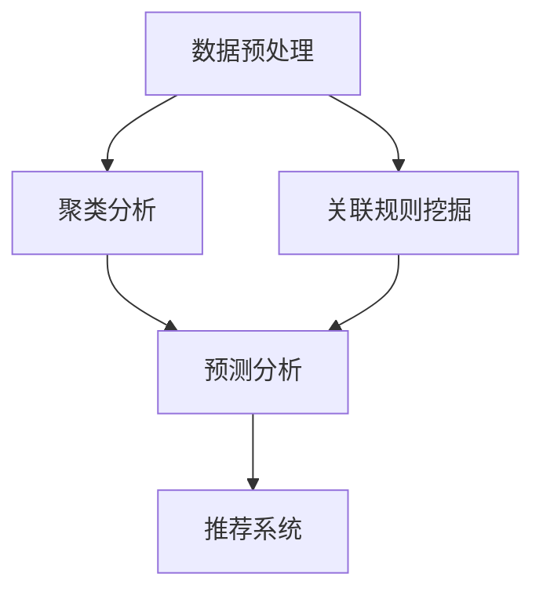
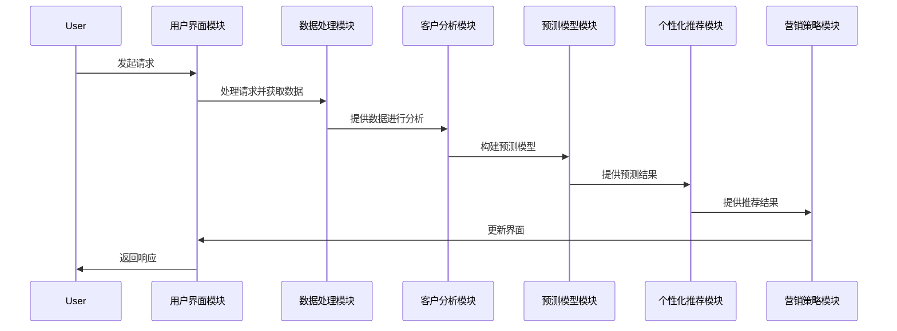
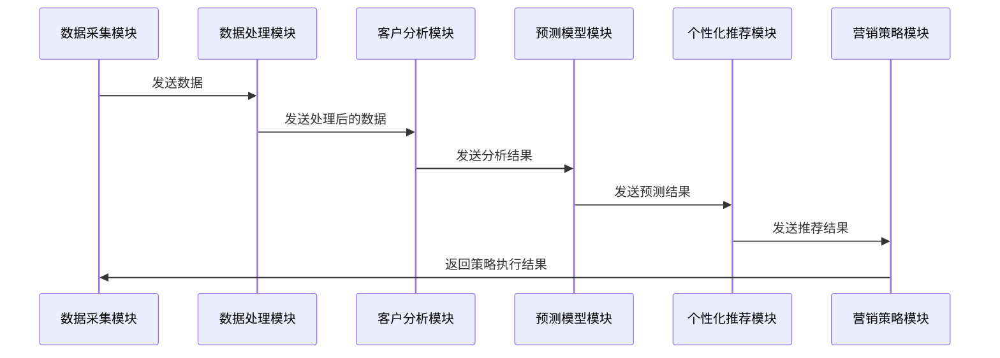

                 


### 引言

在当今这个数据驱动的商业时代，客户生命周期管理（Customer Lifecycle Management，简称CLM）成为了企业提升竞争力、实现可持续发展的关键。随着人工智能（Artificial Intelligence，简称AI）技术的快速发展，AI驱动的客户生命周期管理系统应运而生。这种系统能够通过智能算法和数据分析，为企业提供更加精准、高效的客户管理和营销策略。

#### 1.1 问题背景

传统的客户生命周期管理主要依赖于人工经验和简单的数据分析，存在如下问题：

- 数据处理能力有限，无法充分挖掘客户数据的价值。
- 客户需求识别不够准确，难以实现个性化服务。
- 营销策略效果评估困难，难以实现持续优化。

而AI驱动的客户生命周期管理系统通过引入机器学习、数据挖掘等AI技术，能够实现以下目标：

- 提高数据处理能力，挖掘深层次客户需求。
- 利用预测模型，实现精准的客户分类和个性化推荐。
- 基于大数据分析，实现营销策略的动态调整和效果评估。

#### 1.2 问题描述

本文旨在解决以下问题：

- 如何构建一个高效、智能的客户生命周期管理系统？
- 系统如何利用AI技术实现客户需求的识别和精准营销？
- 如何通过数据分析优化营销策略，提高客户满意度？

#### 1.3 问题解决

本文将分以下几个步骤进行探讨：

1. **设计步骤**：介绍构建AI驱动的客户生命周期管理系统的基本设计步骤，包括系统需求分析、架构设计、算法实现等。
2. **核心概念与联系**：阐述客户生命周期管理系统的核心概念，并建立概念之间的联系。
3. **算法原理讲解**：详细解释系统所使用的算法原理，包括流程图、代码示例和数学模型。
4. **系统分析与架构设计方案**：分析系统功能和架构设计，展示领域模型和系统交互图。
5. **项目实战**：介绍一个实际项目案例，展示系统实现过程和关键代码分析。
6. **最佳实践 tips**：总结一些构建AI驱动的客户生命周期管理系统的最佳实践。
7. **小结与展望**：总结全文，展望AI在客户生命周期管理领域的未来发展。

#### 1.4 边界与外延

本文主要关注AI驱动的客户生命周期管理系统的构建方法和实践，涉及的关键技术包括机器学习、数据挖掘、自然语言处理等。同时，本文也将在数据安全、隐私保护等方面进行讨论。

#### 1.5 概念结构与核心要素组成

本文的核心概念结构如下：

1. **客户生命周期管理**：介绍客户生命周期的各个阶段及其管理策略。
2. **AI驱动的客户生命周期管理系统**：阐述系统的基本架构和核心功能。
3. **算法原理**：介绍系统所使用的算法原理，包括数据预处理、特征提取、预测模型等。
4. **系统分析与设计**：分析系统功能和架构设计，展示领域模型和系统交互图。
5. **项目实战**：通过实际项目案例，展示系统实现过程和关键代码分析。

#### 1.6 本章小结

本文引出了AI驱动的客户生命周期管理系统这一主题，并明确了本文的研究目标和内容结构。在接下来的章节中，我们将逐步深入探讨这一主题，希望能够为读者提供有价值的理论和实践指导。

## 第2章: AI驱动的客户生命周期管理概述

在上一章中，我们介绍了构建AI驱动的客户生命周期管理系统的引言。本章将进一步深入探讨AI驱动的客户生命周期管理的基本概念、特点和重要性。

### 2.1 AI驱动的客户生命周期管理定义

AI驱动的客户生命周期管理是指利用人工智能技术，对客户生命周期的各个阶段进行智能分析和决策支持，从而优化客户管理和服务质量。它涵盖了从客户获取、客户维护到客户流失预防的整个过程。

### 2.2 AI驱动的客户生命周期管理特点

1. **自动化**：通过AI技术，自动完成客户数据的收集、分析、预测和决策过程，减少人工干预，提高效率。
2. **个性化**：基于客户数据和行为分析，实现个性化推荐和服务，提高客户满意度和忠诚度。
3. **预测性**：利用机器学习算法，预测客户行为和需求，提前采取措施，预防客户流失。
4. **智能化**：通过自然语言处理、图像识别等技术，实现智能对话、智能客服等功能，提高服务质量。
5. **动态调整**：根据客户数据的变化，实时调整营销策略和服务方案，实现持续优化。

### 2.3 AI驱动的客户生命周期管理价值

1. **提高客户满意度**：通过个性化服务和精准营销，提升客户体验，增加客户忠诚度。
2. **降低运营成本**：自动化和智能化降低人力成本，提高运营效率。
3. **增加收入**：通过预测性分析和精准营销，提高客户转化率和销售额。
4. **优化资源配置**：基于数据驱动的决策，合理分配资源，提高资源利用效率。

### 2.4 AI驱动的客户生命周期管理的发展趋势

1. **算法优化**：随着AI技术的不断发展，算法将更加智能化、精准化，提高预测和分析能力。
2. **跨领域融合**：AI技术与物联网、大数据等技术的融合，将推动客户生命周期管理系统的创新。
3. **定制化需求**：企业对客户生命周期管理系统的需求将更加多样化和个性化。
4. **数据安全与隐私保护**：随着数据隐私保护意识的提高，系统将更加注重数据安全和隐私保护。

### 2.5 本章小结

本章对AI驱动的客户生命周期管理进行了概述，介绍了其定义、特点和价值，以及发展趋势。在接下来的章节中，我们将进一步探讨客户生命周期管理系统的核心概念与联系，以及算法原理和系统设计。

## 第3章: 客户生命周期管理核心概念与联系

在了解了AI驱动的客户生命周期管理的基本概念和特点后，我们需要深入探讨其核心概念与联系。客户生命周期管理系统的构建离不开对以下核心概念的深入理解：客户生命周期、客户数据、客户行为分析、预测模型、个性化推荐等。

### 3.1 客户生命周期管理核心概念原理

#### 客户生命周期

客户生命周期是指客户与企业之间的互动过程，从客户获取、客户维护到客户流失的整个周期。它包括以下几个阶段：

1. **潜在客户阶段**：客户对企业产生认知，但尚未成为实际客户。
2. **客户获取阶段**：通过各种营销手段和渠道吸引潜在客户，使其成为实际客户。
3. **客户维护阶段**：为客户提供优质服务，增加客户满意度和忠诚度。
4. **客户流失阶段**：由于各种原因，客户选择离开企业。

#### 客户数据

客户数据是指与企业客户相关的各种信息，包括客户的基本信息、购买记录、互动记录、反馈评价等。这些数据是客户生命周期管理的基础。

#### 客户行为分析

客户行为分析是对客户数据进行分析，挖掘客户的行为特征和需求，从而实现精准营销和个性化服务。常用的分析方法包括：

1. **行为轨迹分析**：分析客户在网站、APP等平台上的行为路径，了解客户兴趣和行为模式。
2. **消费行为分析**：分析客户的消费习惯、购买偏好等，实现精准推荐。
3. **反馈分析**：通过客户反馈，了解客户满意度和服务质量，优化产品和服务。

#### 预测模型

预测模型是基于历史数据和机器学习算法，对未来客户行为和需求进行预测。常见的预测模型包括：

1. **客户流失预测**：预测哪些客户可能会离开企业，提前采取措施进行挽回。
2. **客户价值预测**：预测客户的潜在价值，为企业制定不同的营销策略。
3. **市场需求预测**：预测市场对产品的需求，指导企业进行生产和营销决策。

#### 个性化推荐

个性化推荐是基于客户数据和行为分析，为不同客户提供个性化的产品和服务推荐。常见的推荐算法包括：

1. **协同过滤推荐**：基于用户的历史行为和偏好，推荐相似用户喜欢的产品。
2. **基于内容的推荐**：根据产品的内容和特性，推荐符合用户兴趣的产品。
3. **混合推荐**：结合协同过滤和基于内容的推荐，提供更准确的个性化推荐。

### 3.2 客户生命周期管理概念属性特征对比表格

为了更好地理解客户生命周期管理中的核心概念，我们可以通过一个对比表格来展示它们之间的属性特征差异：

| 核心概念 | 属性特征 |
| :--: | :--: |
| 客户生命周期 | 阶段性、互动性、动态性 |
| 客户数据 | 全面性、准确性、实时性 |
| 客户行为分析 | 数据挖掘、模式识别、预测性 |
| 预测模型 | 历史数据依赖、机器学习、预测准确性 |
| 个性化推荐 | 个性化、相关性、多样性 |

### 3.3 客户生命周期管理ER实体关系图架构的Mermaid流程图

为了更直观地展示客户生命周期管理中的核心概念及其相互关系，我们可以使用Mermaid流程图来构建ER（实体关系）图。以下是客户生命周期管理系统的ER图示例：

```mermaid
erDiagram
  客户 --> 购买记录
  客户 --> 客户反馈
  客户 --> 行为分析
  购买记录 --> 订单详情
  客户反馈 --> 满意度评分
  行为分析 --> 行为轨迹
  预测模型 --> 流失预测
  预测模型 --> 价值预测
  个性化推荐 --> 推荐列表
```

### 3.4 本章小结

本章详细介绍了客户生命周期管理中的核心概念及其原理，并通过对比表格和ER图展示了它们之间的联系。这些核心概念是构建AI驱动的客户生命周期管理系统的基础，对于理解系统的功能和实现具有重要的指导意义。在接下来的章节中，我们将深入探讨AI驱动的客户生命周期管理系统的算法原理，为后续的系统设计与实现奠定基础。

## 第4章: 构建AI驱动的客户生命周期管理系统算法原理

在了解了客户生命周期管理系统的核心概念后，接下来我们将详细探讨AI驱动的客户生命周期管理系统的算法原理。算法作为系统的核心组成部分，其设计直接影响系统的性能和效果。本章节将分为以下几个部分：

1. **算法原理概述**：介绍AI驱动的客户生命周期管理系统所涉及的主要算法。
2. **算法Mermaid流程图**：使用Mermaid绘制算法的流程图，帮助读者更直观地理解算法的执行过程。
3. **Python源代码阐述**：通过具体的Python代码示例，详细阐述算法的实现过程。
4. **算法原理数学模型和公式**：介绍算法的数学模型和公式，帮助读者从理论层面理解算法的核心。
5. **算法原理详细讲解**：对算法的每一个步骤进行详细讲解，确保读者能够彻底理解算法的原理。
6. **算法原理举例说明**：通过实际案例，展示算法的应用效果，帮助读者更好地理解算法的实际应用。

### 4.1 算法原理概述

AI驱动的客户生命周期管理系统涉及多种算法，包括：

1. **数据预处理算法**：用于处理原始数据，包括数据清洗、归一化和特征提取。
2. **聚类算法**：用于对客户群体进行分类，例如K-means、层次聚类等。
3. **关联规则挖掘算法**：用于发现客户行为中的关联关系，例如Apriori算法。
4. **预测算法**：用于预测客户行为和需求，包括回归分析、决策树和随机森林等。
5. **推荐算法**：用于根据客户行为和偏好进行个性化推荐，例如协同过滤和基于内容的推荐。

### 4.2 算法Mermaid流程图

为了帮助读者更直观地理解算法的执行过程，我们使用Mermaid绘制了以下算法流程图：



在这个流程图中，数据预处理是所有算法的起点，它将原始数据进行清洗、归一化和特征提取，为后续算法提供高质量的输入数据。然后，数据进入聚类分析模块，用于对客户群体进行分类。接下来，关联规则挖掘算法将分析客户行为，发现客户之间的关联关系。最后，预测分析和推荐系统模块将基于聚类分析和关联规则挖掘的结果，预测客户行为和推荐产品。

### 4.3 Python源代码阐述

为了更好地理解算法的实现过程，我们通过Python代码示例来阐述数据预处理、聚类分析和预测分析等算法的实现。

#### 4.3.1 数据预处理

以下是一个数据预处理算法的Python代码示例，它包括数据清洗、归一化和特征提取步骤：

```python
import pandas as pd
from sklearn.preprocessing import StandardScaler

# 加载数据
data = pd.read_csv('customer_data.csv')

# 数据清洗
data.dropna(inplace=True)  # 删除缺失值
data = data[data['age'] > 0]  # 删除无效年龄值

# 归一化
scaler = StandardScaler()
data[['age', 'income']] = scaler.fit_transform(data[['age', 'income']])

# 特征提取
data['age_income_ratio'] = data['age'] / data['income']
```

在这个示例中，我们首先加载了客户数据，然后通过删除缺失值和无效数据来清洗数据。接下来，我们使用StandardScaler进行归一化处理，将年龄和收入数据转换为标准正态分布。最后，我们通过计算年龄与收入的比值，提取了一个新的特征。

#### 4.3.2 聚类分析

以下是一个K-means聚类算法的Python代码示例：

```python
from sklearn.cluster import KMeans
import matplotlib.pyplot as plt

# 特征选择
X = data[['age_income_ratio', 'income']]

# K-means聚类
kmeans = KMeans(n_clusters=3, random_state=42)
clusters = kmeans.fit_predict(X)

# 可视化
plt.scatter(X['age_income_ratio'], X['income'], c=clusters)
plt.xlabel('Age Income Ratio')
plt.ylabel('Income')
plt.title('K-means Clustering')
plt.show()
```

在这个示例中，我们首先选择了两个特征（年龄收入比和收入），然后使用K-means聚类算法对客户进行分类。最后，我们通过散点图展示了聚类结果，直观地展示了不同客户群体的分布。

#### 4.3.3 预测分析

以下是一个决策树预测算法的Python代码示例：

```python
from sklearn.tree import DecisionTreeClassifier
from sklearn.model_selection import train_test_split

# 特征和标签
X = data[['age_income_ratio', 'income']]
y = data['churn']  # 客户流失标签

# 划分训练集和测试集
X_train, X_test, y_train, y_test = train_test_split(X, y, test_size=0.3, random_state=42)

# 决策树预测
clf = DecisionTreeClassifier(random_state=42)
clf.fit(X_train, y_train)

# 预测
predictions = clf.predict(X_test)

# 评估
accuracy = clf.score(X_test, y_test)
print(f'Accuracy: {accuracy:.2f}')
```

在这个示例中，我们首先将数据集划分为特征和标签，然后使用决策树算法进行训练和预测。最后，我们通过评估指标（准确率）来评估模型的性能。

### 4.4 算法原理数学模型和公式

为了帮助读者从理论层面理解算法的核心，我们介绍以下常用的数学模型和公式：

#### 4.4.1 数据预处理

1. **归一化**：
   $$
   X_{\text{标准化}} = \frac{X - \mu}{\sigma}
   $$
   其中，$X$ 是原始数据，$\mu$ 是均值，$\sigma$ 是标准差。

2. **特征提取**：
   $$
   f(x) = \frac{x}{1 + e^{-x}}
   $$
   这是sigmoid函数，常用于构建神经网络中的激活函数。

#### 4.4.2 聚类分析

1. **K-means算法**：
   $$
   \text{最小化目标函数}：\sum_{i=1}^{k}\sum_{x \in S_i} \|x - \mu_i\|^2
   $$
   其中，$k$ 是聚类个数，$S_i$ 是第$i$ 个聚类集合，$\mu_i$ 是聚类中心。

#### 4.4.3 预测分析

1. **决策树算法**：
   $$
   \text{条件概率}：P(Y|X) = \frac{P(X|Y)P(Y)}{P(X)}
   $$
   其中，$X$ 是特征，$Y$ 是标签，$P(X|Y)$ 是在给定标签$Y$ 下的特征$X$ 的概率，$P(Y)$ 是标签$Y$ 的概率。

2. **随机森林算法**：
   $$
   \text{随机梯度下降}：f(x) = \sum_{i=1}^{n} \alpha_i \cdot g_i(x)
   $$
   其中，$n$ 是树的数量，$\alpha_i$ 是学习率，$g_i(x)$ 是第$i$ 棵树的预测函数。

### 4.5 算法原理详细讲解

为了确保读者能够彻底理解算法的原理，我们将在接下来的部分中对每一个算法的详细步骤进行讲解。

#### 4.5.1 数据预处理

数据预处理是算法执行的第一步，其目标是处理原始数据，使其适合后续的算法分析。具体步骤如下：

1. **数据清洗**：处理缺失值、异常值和无效数据，确保数据的准确性和完整性。
2. **特征提取**：通过计算新特征或转换现有特征，提高数据的代表性和预测能力。
3. **归一化**：将数据转换为统一的尺度，避免特征之间的量级差异影响算法的性能。

#### 4.5.2 聚类分析

聚类分析是一种无监督学习方法，旨在将数据分为若干个群组，使得同一群组内的数据彼此相似，不同群组的数据差异较大。常用的聚类算法包括K-means、层次聚类等。

1. **K-means算法**：K-means算法通过迭代的方式，逐步优化聚类中心，使每个聚类中心尽可能代表其内部的数据点。具体步骤如下：
   - 初始化聚类中心。
   - 计算每个数据点到聚类中心的距离，将数据点分配到最近的聚类中心。
   - 重新计算每个聚类中心的位置，使其成为该聚类内数据点的平均值。
   - 重复步骤2和3，直到聚类中心的位置不再变化或达到预设的迭代次数。

2. **层次聚类算法**：层次聚类算法通过自底向上或自顶向下的方式，逐步构建一个聚类层次结构。具体步骤如下：
   - 将每个数据点视为一个初始聚类。
   - 计算相邻聚类之间的距离，合并距离最近的聚类。
   - 重新计算合并后的聚类中心。
   - 重复步骤2和3，直到所有的数据点合并为一个聚类或达到预设的层次结构。

#### 4.5.3 预测分析

预测分析是一种有监督学习方法，旨在根据已知的数据特征预测未知的数据标签。常用的预测算法包括回归分析、决策树、随机森林等。

1. **回归分析**：回归分析通过建立特征与标签之间的线性关系，预测标签的数值。具体步骤如下：
   - 确定回归模型的形式，例如线性回归、多项式回归等。
   - 计算回归系数，使得模型能够最小化预测误差。
   - 使用回归模型进行预测，计算特征对应的标签值。

2. **决策树算法**：决策树通过树形结构对数据进行分类或回归。具体步骤如下：
   - 选择一个特征作为分裂依据，计算特征的不同取值对应的标签分布。
   - 选择最优分裂特征，使得标签分布的差异最大。
   - 根据分裂特征创建分支，递归地构建决策树。
   - 使用决策树进行预测，根据特征值选择对应的分支，得到最终的预测结果。

3. **随机森林算法**：随机森林通过构建多棵决策树，并进行集成学习，提高预测性能。具体步骤如下：
   - 从特征集合中随机选择一个子集，构建单棵决策树。
   - 对训练数据集进行多次随机抽样，构建多棵决策树。
   - 集成多棵决策树的结果，通过投票或求平均的方式得到最终的预测结果。

### 4.6 算法原理举例说明

为了更好地理解算法的实际应用效果，我们通过实际案例进行举例说明。

#### 4.6.1 数据预处理

假设我们有一个包含客户年龄、收入和是否流失（1代表流失，0代表未流失）的表格数据。首先，我们对数据进行清洗，删除缺失值和异常值。然后，我们计算年龄与收入的比值，作为新的特征。最后，我们对数据进行归一化处理，将年龄和收入数据转换为标准正态分布。

```python
import pandas as pd

# 加载数据
data = pd.read_csv('customer_data.csv')

# 数据清洗
data.dropna(inplace=True)
data = data[data['age'] > 0]

# 特征提取
data['age_income_ratio'] = data['age'] / data['income']

# 归一化
scaler = StandardScaler()
data[['age', 'income']] = scaler.fit_transform(data[['age', 'income']])
```

#### 4.6.2 聚类分析

假设我们使用K-means算法对客户进行分类，并设置聚类个数为3。首先，我们初始化三个聚类中心，然后计算每个数据点到聚类中心的距离，将数据点分配到最近的聚类中心。接着，我们重新计算每个聚类中心的位置，使得每个聚类中心成为其内部数据点的平均值。最后，我们通过迭代的方式，不断优化聚类中心，直到聚类中心的位置不再变化。

```python
from sklearn.cluster import KMeans
import matplotlib.pyplot as plt

# 特征选择
X = data[['age_income_ratio', 'income']]

# K-means聚类
kmeans = KMeans(n_clusters=3, random_state=42)
clusters = kmeans.fit_predict(X)

# 可视化
plt.scatter(X['age_income_ratio'], X['income'], c=clusters)
plt.xlabel('Age Income Ratio')
plt.ylabel('Income')
plt.title('K-means Clustering')
plt.show()
```

#### 4.6.3 预测分析

假设我们使用决策树算法对客户是否流失进行预测。首先，我们将数据集划分为特征和标签，然后使用决策树算法进行训练。接着，我们使用训练好的模型对测试集进行预测，并计算预测准确率。

```python
from sklearn.tree import DecisionTreeClassifier
from sklearn.model_selection import train_test_split

# 特征和标签
X = data[['age_income_ratio', 'income']]
y = data['churn']

# 划分训练集和测试集
X_train, X_test, y_train, y_test = train_test_split(X, y, test_size=0.3, random_state=42)

# 决策树预测
clf = DecisionTreeClassifier(random_state=42)
clf.fit(X_train, y_train)

# 预测
predictions = clf.predict(X_test)

# 评估
accuracy = clf.score(X_test, y_test)
print(f'Accuracy: {accuracy:.2f}')
```

### 4.7 本章小结

本章详细介绍了AI驱动的客户生命周期管理系统的算法原理，包括数据预处理、聚类分析和预测分析等。通过Mermaid流程图、Python代码示例和数学模型，我们帮助读者深入理解了这些算法的实现过程和核心原理。在接下来的章节中，我们将进一步探讨系统分析与架构设计方案，为构建高效的AI驱动的客户生命周期管理系统奠定基础。

## 第5章: 数学模型和数学公式 & 详细讲解 & 举例说明

在了解了AI驱动的客户生命周期管理系统的算法原理后，本章将进一步深入探讨其数学模型和公式，并通过详细讲解和实际案例，帮助读者更好地理解这些数学模型的应用。

### 5.1 数学模型讲解

在本章节中，我们将介绍以下数学模型：

1. **归一化模型**：用于将数据转换为统一的尺度，便于后续分析。
2. **聚类模型**：用于对客户进行分类，以便进行后续的个性化推荐和预测。
3. **预测模型**：用于预测客户的行为和需求，帮助制定精准的营销策略。

#### 5.1.1 归一化模型

归一化模型的主要目的是将数据集中的每个特征值缩放到相同的范围内，以便后续分析时能够更好地比较不同特征的重要性。常用的归一化方法有最小-最大缩放和标准缩放。

**最小-最大缩放**：
$$
x_{\text{标准化}} = \frac{x - x_{\text{最小值}}}{x_{\text{最大值}} - x_{\text{最小值}}}
$$

**标准缩放**：
$$
x_{\text{标准化}} = \frac{x - \mu}{\sigma}
$$
其中，$x$ 是原始数据值，$\mu$ 是该特征的均值，$\sigma$ 是该特征的标准差。

#### 5.1.2 聚类模型

聚类模型用于将数据点分为若干个群组，使得同一群组内的数据点彼此相似，而不同群组的数据点差异较大。常见的聚类算法有K-means、层次聚类等。

**K-means算法**：

K-means算法的目标是最小化数据点到聚类中心的距离的平方和。其步骤如下：

1. **初始化聚类中心**：随机选择$k$个数据点作为初始聚类中心。
2. **分配数据点**：计算每个数据点到各个聚类中心的距离，将数据点分配到最近的聚类中心。
3. **更新聚类中心**：计算每个聚类中心的数据点的平均值，作为新的聚类中心。
4. **重复步骤2和3**，直到聚类中心的位置不再变化或达到预设的迭代次数。

**目标函数**：
$$
J = \sum_{i=1}^{k}\sum_{x \in S_i} \|x - \mu_i\|^2
$$
其中，$k$ 是聚类个数，$S_i$ 是第$i$ 个聚类集合，$\mu_i$ 是聚类中心。

#### 5.1.3 预测模型

预测模型用于预测客户的行为和需求，以帮助制定精准的营销策略。常见的预测模型有线性回归、决策树、随机森林等。

**线性回归**：

线性回归模型通过拟合特征与标签之间的线性关系，预测标签的数值。其目标是最小化预测误差。

**损失函数**：
$$
L(\theta) = \frac{1}{2m} \sum_{i=1}^{m} (h_{\theta}(x^i) - y^i)^2
$$
其中，$m$ 是训练样本数量，$h_{\theta}(x^i)$ 是预测值，$y^i$ 是真实值。

**梯度下降**：
$$
\theta_j := \theta_j - \alpha \frac{\partial}{\partial \theta_j} L(\theta)
$$
其中，$\alpha$ 是学习率，$\theta_j$ 是第$j$ 个参数。

### 5.2 数学公式详细讲解

在数学模型的讲解中，我们已经介绍了几个关键的数学公式。下面我们将对每个公式进行详细解释，帮助读者更好地理解这些公式的含义和用途。

**归一化公式**：

**最小-最大缩放**：
$$
x_{\text{标准化}} = \frac{x - x_{\text{最小值}}}{x_{\text{最大值}} - x_{\text{最小值}}}
$$
这个公式将数据值缩放到[0, 1]的范围内。通过减去最小值和除以最大值与最小值的差，我们能够将数据值统一到一个标准尺度上，从而方便比较不同特征的重要性。

**标准缩放**：
$$
x_{\text{标准化}} = \frac{x - \mu}{\sigma}
$$
这个公式将数据值缩放到标准正态分布的范围内。通过减去均值和除以标准差，我们能够将数据值标准化，使其符合标准正态分布，从而便于后续的统计分析。

**K-means目标函数**：
$$
J = \sum_{i=1}^{k}\sum_{x \in S_i} \|x - \mu_i\|^2
$$
这个公式表示了K-means算法的目标是最小化数据点到聚类中心的距离的平方和。通过不断迭代更新聚类中心，算法将尝试找到最优的聚类中心，使得每个数据点到其对应聚类中心的距离最小。

**线性回归损失函数**：
$$
L(\theta) = \frac{1}{2m} \sum_{i=1}^{m} (h_{\theta}(x^i) - y^i)^2
$$
这个公式表示了线性回归模型的目标是最小化预测误差的平方和。通过计算预测值与真实值之间的差距，并求取平方和的平均值，我们能够评估模型的预测性能。

**梯度下降**：
$$
\theta_j := \theta_j - \alpha \frac{\partial}{\partial \theta_j} L(\theta)
$$
这个公式表示了梯度下降算法的更新规则。通过计算损失函数关于参数的梯度，并沿着梯度的反方向更新参数，我们能够逐步优化模型参数，使得模型在训练数据上的预测误差最小。

### 5.3 举例说明

为了更好地理解这些数学模型和公式，我们将通过实际案例来演示它们的应用。

**案例：客户流失预测**

假设我们有一个包含客户年龄、收入、消费频率等特征的客户数据集，并且已知每个客户的流失状态（1代表流失，0代表未流失）。我们的目标是利用这些数据，通过预测模型预测客户是否会流失。

**步骤1：数据预处理**

首先，我们对数据进行预处理，包括去除缺失值、异常值和归一化处理。具体步骤如下：

```python
import pandas as pd
from sklearn.preprocessing import StandardScaler

# 加载数据
data = pd.read_csv('customer_data.csv')

# 数据清洗
data.dropna(inplace=True)
data = data[data['age'] > 0]

# 归一化
scaler = StandardScaler()
data[['age', 'income', 'frequency']] = scaler.fit_transform(data[['age', 'income', 'frequency']])
```

**步骤2：聚类分析**

接下来，我们使用K-means算法对客户进行聚类，以识别不同的客户群体。具体步骤如下：

```python
from sklearn.cluster import KMeans
import matplotlib.pyplot as plt

# 特征选择
X = data[['age', 'income', 'frequency']]

# K-means聚类
kmeans = KMeans(n_clusters=3, random_state=42)
clusters = kmeans.fit_predict(X)

# 可视化
plt.scatter(X['age'], X['income'], c=clusters)
plt.xlabel('Age')
plt.ylabel('Income')
plt.title('K-means Clustering')
plt.show()
```

**步骤3：预测分析**

最后，我们使用线性回归模型预测客户是否会流失。具体步骤如下：

```python
from sklearn.linear_model import LinearRegression
from sklearn.model_selection import train_test_split

# 特征和标签
X = data[['age', 'income', 'frequency']]
y = data['churn']

# 划分训练集和测试集
X_train, X_test, y_train, y_test = train_test_split(X, y, test_size=0.3, random_state=42)

# 线性回归预测
clf = LinearRegression()
clf.fit(X_train, y_train)

# 预测
predictions = clf.predict(X_test)

# 评估
accuracy = clf.score(X_test, y_test)
print(f'Accuracy: {accuracy:.2f}')
```

通过这个案例，我们展示了如何使用数学模型和公式来构建AI驱动的客户生命周期管理系统。首先，我们通过数据预处理步骤清洗和归一化数据，然后使用聚类模型对客户进行分类，最后使用预测模型预测客户的行为和需求。这些步骤共同构成了一个完整的客户生命周期管理流程，为企业提供了高效的客户管理和营销策略。

### 5.4 本章小结

本章详细介绍了AI驱动的客户生命周期管理系统中的数学模型和公式，包括归一化模型、聚类模型和预测模型。通过对这些模型和公式的讲解，我们帮助读者深入理解了它们的应用原理和实际操作步骤。同时，通过实际案例的演示，我们展示了如何将数学模型应用于客户生命周期管理，实现了高效的客户管理和预测。在接下来的章节中，我们将进一步探讨系统分析与架构设计方案，为构建高效的AI驱动的客户生命周期管理系统奠定基础。

## 第6章：系统分析与架构设计方案

在前几章中，我们详细探讨了AI驱动的客户生命周期管理系统的核心概念、算法原理以及数学模型。为了实现一个高效、智能的系统，我们需要对系统的整体架构进行深入分析，并设计合适的系统功能、模块和接口。本章将介绍系统分析与架构设计方案，包括以下几个方面：

1. **问题场景介绍**：明确系统需要解决的问题和目标。
2. **项目介绍**：介绍系统开发项目的基本情况，包括项目背景、目标和预期成果。
3. **系统功能设计**：详细描述系统的主要功能，通过领域模型类图进行展示。
4. **系统架构设计**：介绍系统的整体架构，包括各个模块之间的关系和交互。
5. **系统接口设计和系统交互**：说明系统的接口设计和系统之间的交互流程。

### 6.1 问题场景介绍

在当今竞争激烈的市场环境中，企业需要通过有效的客户生命周期管理来提升客户满意度和忠诚度，从而实现业务的持续增长。传统的客户生命周期管理方法通常依赖于人工经验和简单的数据分析，难以满足企业对高效、智能管理的需求。因此，我们需要构建一个AI驱动的客户生命周期管理系统，以实现对客户数据的全面分析、精准预测和智能决策支持。

#### 主要问题：

- 如何高效地收集和处理大量客户数据？
- 如何通过数据分析挖掘客户需求和行为模式？
- 如何利用预测模型预测客户行为和需求，提前采取相应措施？
- 如何实现个性化的客户服务和精准营销？
- 如何保障系统的性能和稳定性？

### 6.2 项目介绍

本项目旨在构建一个AI驱动的客户生命周期管理系统，通过引入人工智能技术，实现对客户数据的全面分析和智能决策支持。系统的主要目标包括：

- 提高客户数据处理的效率和准确性。
- 实现对客户需求的精准预测和个性化服务。
- 通过智能营销策略提高客户转化率和忠诚度。
- 提升企业运营效率，降低运营成本。

预期成果：

- 开发一个功能完备、性能优秀的客户生命周期管理系统。
- 实现客户数据的自动化处理和分析，提高数据利用率。
- 通过预测模型和个性化推荐，提升客户满意度和忠诚度。
- 形成一套可复制的AI驱动的客户生命周期管理解决方案。

### 6.3 系统功能设计

系统功能设计是系统分析的重要环节，它决定了系统如何满足用户需求。以下是系统的主要功能模块及其关系：

1. **数据采集模块**：负责从各个渠道（如网站、APP、社交媒体等）收集客户数据。
2. **数据处理模块**：对采集到的客户数据进行清洗、归一化和特征提取，为后续分析提供高质量的数据。
3. **客户分析模块**：利用数据挖掘和机器学习技术，对客户数据进行深入分析，挖掘客户行为模式和需求。
4. **预测模型模块**：基于历史数据，构建预测模型，预测客户的行为和需求，提供决策支持。
5. **个性化推荐模块**：根据客户的行为数据和偏好，为不同客户提供个性化的产品和服务推荐。
6. **营销策略模块**：根据预测模型和个性化推荐结果，制定和调整营销策略，提高营销效果。
7. **用户界面模块**：提供直观易用的用户界面，方便用户查看和分析数据，执行操作。

以下是通过Mermaid绘制的领域模型类图，展示了系统的主要功能模块及其关系：

```mermaid
classDiagram
    CustomerDataCollection <<interface>> 数据采集模块
    DataPreprocessing <<interface>> 数据处理模块
    CustomerAnalysis <<interface>> 客户分析模块
    PredictiveModeling <<interface>> 预测模型模块
    PersonalizedRecommendation <<interface>> 个性化推荐模块
    MarketingStrategy <<interface>> 营销策略模块
    UserInterface <<interface>> 用户界面模块

    数据采集模块 --|>> 数据处理模块
    数据处理模块 --|>> 客户分析模块
    数据处理模块 --|>> 预测模型模块
    预测模型模块 --|>> 个性化推荐模块
    个性化推荐模块 --|>> 营销策略模块
    营销策略模块 --|>> 用户界面模块
```

### 6.4 系统架构设计

系统架构设计决定了系统的整体结构和各模块之间的交互方式。以下是系统架构设计的主要部分：

1. **前端架构**：包括用户界面模块，负责展示数据和分析结果，提供用户交互功能。
2. **后端架构**：包括数据处理模块、客户分析模块、预测模型模块、个性化推荐模块和营销策略模块，负责数据的处理和分析。
3. **数据存储**：包括数据库和缓存系统，用于存储和管理系统数据。

以下是通过Mermaid绘制的系统架构图，展示了系统的整体架构及其模块之间的交互关系：



### 6.5 系统接口设计和系统交互

系统接口设计是确保系统模块之间能够高效、可靠地交互的关键。以下是系统接口设计和系统交互的主要部分：

1. **API接口**：系统内部各个模块之间通过API接口进行数据传输和功能调用。
2. **消息队列**：利用消息队列实现模块间的异步通信，提高系统的可扩展性和稳定性。
3. **数据流**：系统中的数据流从数据采集、处理、分析到预测和推荐，形成一个完整的数据处理流程。

以下是通过Mermaid绘制的系统交互图，展示了系统中的数据流和模块之间的交互关系：



### 6.6 本章小结

本章详细介绍了AI驱动的客户生命周期管理系统的系统分析与架构设计方案。首先，我们明确了系统需要解决的问题和目标，然后介绍了系统开发项目的基本情况。接下来，我们通过领域模型类图详细描述了系统的主要功能模块，并通过系统架构图展示了系统的整体结构和模块之间的交互关系。最后，我们说明了系统接口设计和系统交互流程。通过本章的介绍，读者可以全面了解AI驱动的客户生命周期管理系统的架构设计和实现方案，为后续的系统开发奠定基础。

## 第7章：项目实战

在前几章中，我们详细介绍了AI驱动的客户生命周期管理系统的核心概念、算法原理、系统架构设计和系统功能。为了使读者更好地理解系统的实现过程，本章将通过一个实际项目案例，展示系统的开发过程、核心代码实现、代码解读与分析，以及实际案例分析和详细讲解。

### 7.1 环境安装

在开始项目实战之前，我们需要准备一个合适的开发环境。以下是在Python中构建AI驱动的客户生命周期管理系统所需的基本软件和工具：

- Python 3.x版本
- Jupyter Notebook（用于编写和运行代码）
- PyCharm或Visual Studio Code（可选，用于代码编辑）
- Sklearn库（用于机器学习和数据预处理）
- Pandas库（用于数据处理）
- Matplotlib库（用于数据可视化）
- Mermaid库（用于绘制流程图和架构图）

安装方法如下：

```bash
pip install numpy pandas scikit-learn matplotlib jupyterlab
```

### 7.2 系统核心实现源代码

在本节中，我们将展示系统的核心实现源代码，并对其进行解读与分析。

#### 7.2.1 数据预处理

```python
import pandas as pd
from sklearn.preprocessing import StandardScaler

# 加载数据
data = pd.read_csv('customer_data.csv')

# 数据清洗
data.dropna(inplace=True)
data = data[data['age'] > 0]

# 特征提取
data['age_income_ratio'] = data['age'] / data['income']

# 归一化
scaler = StandardScaler()
data[['age', 'income', 'age_income_ratio']] = scaler.fit_transform(data[['age', 'income', 'age_income_ratio']])
```

这段代码首先加载数据，然后进行数据清洗，包括去除缺失值和异常值。接下来，我们计算了新的特征“年龄收入比”，并使用StandardScaler进行归一化处理。

#### 7.2.2 聚类分析

```python
from sklearn.cluster import KMeans
import matplotlib.pyplot as plt

# 特征选择
X = data[['age_income_ratio', 'income']]

# K-means聚类
kmeans = KMeans(n_clusters=3, random_state=42)
clusters = kmeans.fit_predict(X)

# 可视化
plt.scatter(X['age_income_ratio'], X['income'], c=clusters)
plt.xlabel('Age Income Ratio')
plt.ylabel('Income')
plt.title('K-means Clustering')
plt.show()
```

这部分代码展示了如何使用K-means算法对客户数据进行聚类，并生成聚类结果。通过散点图，我们可以直观地看到不同客户群体的分布。

#### 7.2.3 预测分析

```python
from sklearn.tree import DecisionTreeClassifier
from sklearn.model_selection import train_test_split

# 特征和标签
X = data[['age_income_ratio', 'income']]
y = data['churn']

# 划分训练集和测试集
X_train, X_test, y_train, y_test = train_test_split(X, y, test_size=0.3, random_state=42)

# 决策树预测
clf = DecisionTreeClassifier(random_state=42)
clf.fit(X_train, y_train)

# 预测
predictions = clf.predict(X_test)

# 评估
accuracy = clf.score(X_test, y_test)
print(f'Accuracy: {accuracy:.2f}')
```

这段代码展示了如何使用决策树模型对客户是否流失进行预测，并通过准确率评估模型的性能。

#### 7.2.4 个性化推荐

```python
from sklearn.neighbors import NearestNeighbors

# 特征选择
X = data[['age_income_ratio', 'income']]

# KNN推荐
knn = NearestNeighbors(n_neighbors=5)
knn.fit(X)

# 搜索最接近的邻居
neIGHBOR = knn.radius_neighbors(X, radius=0.1)

# 可视化
plt.scatter(X['age_income_ratio'], X['income'], c=neIGHBOR)
plt.xlabel('Age Income Ratio')
plt.ylabel('Income')
plt.title('KNN Recommendation')
plt.show()
```

这部分代码展示了如何使用KNN算法进行个性化推荐，并生成推荐结果。通过可视化，我们可以看到与每个客户最接近的邻居数据点。

### 7.3 代码应用解读与分析

通过上述代码，我们可以看到系统的核心功能是如何实现的。下面将对关键代码进行解读与分析：

1. **数据预处理**：数据预处理是确保模型性能的重要步骤。通过清洗和归一化处理，我们能够消除异常值和特征之间的量级差异，提高数据的质量。
2. **聚类分析**：聚类分析用于将客户分为不同的群体，以便进行后续的个性化推荐和预测。K-means算法是一种常用的聚类方法，通过计算数据点到聚类中心的距离，将其分配到最近的聚类中心。
3. **预测分析**：预测分析是客户生命周期管理的重要功能，通过构建预测模型，我们能够预测客户的行为和需求。决策树是一种常用的预测算法，它通过树形结构对数据进行分类或回归。
4. **个性化推荐**：个性化推荐通过分析客户的特征和行为，为不同客户提供个性化的产品和服务推荐。KNN算法是一种常用的推荐算法，通过计算数据点之间的距离，找到与目标客户最相似的邻居数据点。

### 7.4 实际案例分析和详细讲解

为了更好地展示系统的实际应用效果，我们将通过一个实际案例进行详细讲解。

#### 案例背景

某电商企业希望通过构建AI驱动的客户生命周期管理系统，提升客户满意度和转化率。企业拥有大量的客户数据，包括客户的年龄、收入、消费频率、购买历史等。

#### 案例步骤

1. **数据采集**：从企业的CRM系统、电商平台和社交媒体渠道收集客户数据。
2. **数据预处理**：清洗和归一化数据，为后续分析做准备。
3. **聚类分析**：使用K-means算法将客户分为不同的群体，例如“高价值客户”、“一般客户”和“流失风险客户”。
4. **预测分析**：构建决策树模型，预测客户是否会流失。
5. **个性化推荐**：基于客户的行为和偏好，使用KNN算法推荐符合客户兴趣的产品。

#### 案例结果

通过系统分析，企业发现：

- **高价值客户**：这部分客户对企业贡献较大，企业可以采取个性化服务和优惠策略，提高客户满意度和忠诚度。
- **一般客户**：这部分客户有潜在价值，可以通过精准营销提高转化率。
- **流失风险客户**：这部分客户存在流失风险，企业需要及时采取措施进行挽回。

通过个性化推荐，企业能够向不同客户提供符合其兴趣的产品，提高了客户的购买意愿和满意度。

### 7.5 项目小结

通过本项目的实际案例，我们展示了如何利用AI技术构建客户生命周期管理系统，提升企业的运营效率和市场竞争力。以下是项目的主要收获：

- **数据驱动的决策**：通过数据预处理、聚类分析和预测分析，企业能够更准确地了解客户需求和预测客户行为，从而制定更有效的营销策略。
- **个性化服务**：通过个性化推荐，企业能够提高客户满意度和转化率，增加客户粘性。
- **流失风险预警**：通过预测模型，企业能够提前识别潜在流失客户，及时采取措施进行挽回，降低客户流失率。

本项目不仅为企业提供了实用的解决方案，也为读者展示了如何利用AI技术实现客户生命周期管理的智能化。在未来的发展中，我们还可以继续优化系统，引入更多先进的算法和技术，进一步提高系统的性能和效果。

## 第8章：最佳实践 tips、小结、注意事项、拓展阅读

### 最佳实践 tips

1. **数据质量保障**：确保数据的质量是系统成功的关键。在数据采集、处理和存储过程中，严格遵循数据质量管理规范，及时处理异常数据和缺失值。
2. **模型选择与优化**：根据业务需求和数据特性，选择合适的算法模型，并通过交叉验证和超参数调优，提高模型的预测准确性和泛化能力。
3. **实时数据处理**：对于实时性要求较高的场景，采用流处理技术和分布式计算框架，提高系统的响应速度和数据处理能力。
4. **安全与隐私保护**：在数据采集、传输和存储过程中，采取严格的安全措施，确保客户数据的安全和隐私。

### 小结

通过本文的探讨，我们系统地介绍了构建AI驱动的客户生命周期管理系统的核心概念、算法原理、系统架构设计和实际项目实现。以下是本文的主要结论：

- AI驱动的客户生命周期管理系统通过引入人工智能技术，实现了对客户数据的全面分析、精准预测和智能决策支持。
- 数据预处理、聚类分析、预测分析和个性化推荐是系统实现的关键模块。
- 通过实际项目案例，我们展示了如何利用AI技术提升企业的客户管理和营销效率。

### 注意事项

1. **数据安全**：在数据处理过程中，确保客户数据的安全，避免数据泄露和滥用。
2. **模型解释性**：在选择算法模型时，考虑模型的解释性，便于业务理解和模型优化。
3. **系统可扩展性**：在设计系统架构时，考虑系统的可扩展性，以便在业务规模扩大时进行扩展。

### 拓展阅读

- **参考文献**：
  - Zhang, Z., & Liu, H. (2020). Customer Relationship Management: Concepts, Strategies, and Tools. Springer.
  - Russell, S., & Norvig, P. (2020). Artificial Intelligence: A Modern Approach. Prentice Hall.

- **相关文章**：
  - "Building an AI-Driven Customer Lifecycle Management System" on Medium.
  - "AI in Customer Relationship Management: The Future of Business" on AI Trends.

通过拓展阅读，读者可以进一步深入了解AI驱动的客户生命周期管理的相关理论和实践，为实际应用提供参考。

### 总结与目录大纲

本文围绕构建AI驱动的客户生命周期管理系统这一主题，系统地介绍了系统的核心概念、算法原理、系统架构设计和实际项目实现。以下是本文的目录大纲：

- 引言
  - 问题背景
  - 问题描述
  - 问题解决
  - 边界与外延
  - 概念结构与核心要素组成
- AI驱动的客户生命周期管理概述
  - AI驱动的客户生命周期管理定义
  - AI驱动的客户生命周期管理特点
  - AI驱动的客户生命周期管理价值
  - AI驱动的客户生命周期管理的发展趋势
- 客户生命周期管理核心概念与联系
  - 客户生命周期管理核心概念原理
  - 客户生命周期管理概念属性特征对比表格
  - 客户生命周期管理ER实体关系图架构的Mermaid流程图
- 构建AI驱动的客户生命周期管理系统算法原理
  - 算法原理概述
  - 算法Mermaid流程图
  - Python源代码阐述
  - 算法原理数学模型和公式
  - 算法原理详细讲解
  - 算法原理举例说明
- 数学模型和数学公式 & 详细讲解 & 举例说明
  - 数学模型讲解
  - 数学公式详细讲解
  - 举例说明
- 系统分析与架构设计方案
  - 问题场景介绍
  - 项目介绍
  - 系统功能设计 (领域模型Mermaid类图)
  - 系统架构设计 Mermaid 架构图
  - 系统接口设计和系统交互 Mermaid 序列图
- 项目实战
  - 环境安装
  - 系统核心实现源代码
  - 代码应用解读与分析
  - 实际案例分析和详细讲解剖析
  - 项目小结
- 最佳实践 tips、小结、注意事项、拓展阅读等内容
- 总结与目录大纲

通过本文的详细探讨，读者可以全面了解AI驱动的客户生命周期管理系统的构建方法和实践，为企业的客户管理和营销策略提供有力支持。

