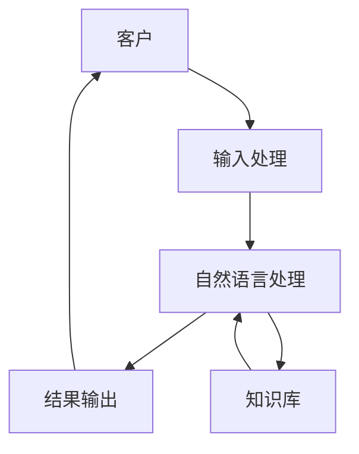

                 


### 引言

随着人工智能（AI）技术的快速发展，越来越多的企业开始将其应用于实际业务中，以提升效率和决策能力。然而，AI Agent（人工智能代理）在行业应用中面临着诸多挑战，其中一个关键问题是如何确保其领域适应性。领域适应性指的是AI Agent在特定领域内的性能和准确性，即其能否理解并解决该领域内的问题。为了实现这一目标，构建一个高质量的企业专属训练数据集至关重要。

本文将围绕构建企业专属训练数据集，探讨如何确保AI Agent的领域适应性。首先，我们将介绍AI Agent领域适应性定义及其重要性。接着，我们将详细分析企业专属训练数据集的概念、构建过程以及评估方法。随后，本文将重点介绍数据预处理、特征工程和数据增强等关键技术。最后，我们将通过一个实战项目展示如何在实际中应用这些技术，以提升AI Agent的领域适应性。

通过本文的深入探讨，读者将能够全面了解如何构建一个高效、可靠的企业专属训练数据集，从而为AI Agent在各个行业中的应用奠定坚实基础。

### 第一部分：确保AI Agent的领域适应性

## 第1章：引言

### 1.1 问题背景

随着AI技术的迅速发展，其在各个行业的应用越来越广泛。从医疗诊断、金融分析到智能制造，AI Agent（人工智能代理）已经在很多领域展现出强大的潜力和价值。然而，在实际应用过程中，许多企业发现AI Agent的表现并不总是如预期那样出色。这主要归因于AI Agent在特定领域内的适应性不足。

AI Agent的领域适应性指的是其在特定业务领域中的性能表现，包括对业务逻辑的理解、问题解决能力以及决策准确性等。一个领域适应性强的AI Agent能够更好地理解并适应特定业务场景，从而提供更加精准、高效的解决方案。然而，当前许多AI Agent在实际应用中面临着以下挑战：

1. **数据不充分**：大多数AI Agent的训练数据来源于通用数据集，这些数据集并不能完全覆盖特定业务领域的所有场景和需求，导致AI Agent在实际应用中难以达到预期效果。

2. **数据质量问题**：即使有特定领域的训练数据，数据的质量也是一个关键问题。数据中可能存在噪声、缺失值、异常值等问题，这些都会影响AI Agent的训练效果和领域适应性。

3. **缺乏领域知识**：AI Agent在训练过程中往往缺乏对特定业务领域知识的理解和学习，导致其在解决具体问题时表现不佳。

4. **模型适应性差**：现有AI模型大多是基于通用框架开发的，对于特定领域的适应性较差，无法充分适应不同业务场景的需求。

### 1.2 问题描述

本章节的主要目的是探讨如何构建一个企业专属训练数据集，以解决AI Agent领域适应性问题。具体来说，我们需要回答以下几个关键问题：

1. **什么是企业专属训练数据集？**  
   企业专属训练数据集是指为特定企业或业务领域量身定制的训练数据集，它涵盖了该领域内常见的问题、场景和需求。

2. **如何构建企业专属训练数据集？**  
   构建企业专属训练数据集需要考虑数据采集、数据预处理、特征工程和数据增强等关键技术。

3. **如何评估AI Agent的领域适应性？**  
   评估AI Agent的领域适应性需要建立一套完整的评估指标体系，并采用相应的评估方法进行量化分析。

4. **如何提升AI Agent的领域适应性？**  
   通过优化数据集质量、增强特征工程方法、应用数据增强技术等多种手段，可以显著提升AI Agent的领域适应性。

### 1.3 问题解决

为了解决上述问题，本文将从以下几个方面展开讨论：

1. **企业专属训练数据集的概念**：介绍企业专属训练数据集的定义、类型及其在AI Agent领域适应性中的作用。

2. **构建过程**：详细阐述构建企业专属训练数据集的步骤和方法，包括数据采集、数据预处理、特征工程和数据增强等关键环节。

3. **边界与外延**：讨论数据集质量评估指标和领域适应性评估方法，以及相关核心概念和联系。

4. **核心概念与联系**：介绍数据预处理、特征工程和数据增强等核心技术的原理和方法，并通过具体示例和流程图进行解释。

通过上述分析和讨论，本文将为企业提供一套完整的构建企业专属训练数据集的解决方案，以提升AI Agent的领域适应性，从而在各个行业中获得更好的应用效果。

### 1.4 边界与外延

在确保AI Agent领域适应性方面，构建高质量的企业专属训练数据集是一个关键步骤。然而，为了实现这一目标，我们需要明确数据集质量评估指标和领域适应性评估方法，并探讨相关核心概念和联系。

#### 1.4.1 数据集质量评估指标

评估数据集质量是确保AI Agent领域适应性的基础。以下是一些常见的数据集质量评估指标：

1. **完整性（Completeness）**：数据集中缺失值的比例。一个完整的数据集应该包含所有必要的样本和特征，以确保模型能够获得全面的信息。

2. **准确性（Accuracy）**：数据集中真实值与标注值的一致性。高准确性的数据集能够帮助AI Agent更准确地学习和预测。

3. **一致性（Consistency）**：数据集中不同样本之间的一致性。一致的数据集能够避免模型在学习过程中出现偏差。

4. **代表性（Representativeness）**：数据集是否能够代表特定领域的多样性和复杂性。具有良好代表性的数据集能够帮助AI Agent适应更多不同的场景。

5. **时效性（Timeliness）**：数据集是否反映了当前业务环境的变化。及时更新的数据集能够确保AI Agent能够应对最新的业务需求。

#### 1.4.2 领域适应性评估方法

领域适应性评估方法旨在量化AI Agent在特定业务领域中的表现。以下是一些常用的评估方法：

1. **基准测试（Benchmark Testing）**：通过与现有模型或基准模型进行对比，评估AI Agent在特定领域的性能。

2. **交叉验证（Cross-Validation）**：使用不同子集的数据进行多次训练和测试，以评估AI Agent的稳定性和泛化能力。

3. **领域指标（Domain-Specific Metrics）**：根据特定业务需求设计评估指标，如准确率、召回率、F1分数等。

4. **领域评估（Domain Assessment）**：通过专家评估或用户反馈，对AI Agent在特定领域的适应性和满意度进行综合评价。

#### 1.4.3 核心概念与联系

在确保AI Agent领域适应性的过程中，以下核心概念和技术之间的联系至关重要：

1. **数据预处理**：数据预处理是构建高质量数据集的第一步，包括数据清洗、数据转换和数据归一化等。高质量的预处理能够提升数据集的代表性和准确性。

2. **特征工程**：特征工程旨在从原始数据中提取出对模型有用的特征。通过特征选择、特征提取和特征组合等技术，能够增强AI Agent的领域适应性。

3. **数据增强**：数据增强通过生成新的样本或调整现有样本，增加数据集的多样性和代表性，从而提升AI Agent的泛化能力。

4. **模型优化**：通过调整模型参数、选择适当的模型架构和训练策略，能够提升AI Agent在特定领域的表现。

通过明确数据集质量评估指标和领域适应性评估方法，并理解核心概念和联系，企业可以更有效地构建和优化专属训练数据集，从而确保AI Agent在特定业务领域中的高适应性。

### 1.5 核心概念与联系

在确保AI Agent领域适应性的过程中，数据预处理、特征工程和数据增强是三大关键技术，它们之间相互关联，共同作用，以提升AI Agent的性能和准确性。

#### 1.5.1 数据预处理技术

数据预处理是构建高质量数据集的第一步，其核心目标是消除数据中的噪声、缺失值和异常值，确保数据的一致性和代表性。主要的技术包括：

1. **数据清洗**：通过删除重复数据、填补缺失值、修正错误值等方法，提高数据的质量和完整性。
   - **实例**：使用Python的pandas库，可以通过以下代码来删除重复数据：
     ```python
     df.drop_duplicates(inplace=True)
     ```

2. **数据转换**：将不同类型的数据转换为统一的格式，如将类别型数据转换为数值型数据，通过独热编码（One-Hot Encoding）实现。
   - **实例**：使用scikit-learn库中的`OneHotEncoder`类进行独热编码：
     ```python
     encoder = OneHotEncoder()
     transformed_data = encoder.fit_transform(data)
     ```

3. **数据归一化**：通过标准化或归一化方法，将不同特征的数据缩放到相同的范围，以减少特征之间的尺度差异。
   - **实例**：使用scikit-learn库中的`StandardScaler`类进行标准化：
     ```python
     scaler = StandardScaler()
     normalized_data = scaler.fit_transform(data)
     ```

#### 1.5.2 特征工程技术

特征工程是提升AI Agent性能的重要手段，它通过对原始数据进行变换和选择，提取出对模型有用的特征。主要的技术包括：

1. **特征选择**：通过统计方法、机器学习方法等，选择对模型性能有显著影响的重要特征，减少数据维度。
   - **实例**：使用基于信息增益的特征选择方法：
     ```python
     from sklearn.feature_selection import SelectKBest
     selector = SelectKBest(score_func=chi2, k=10)
     selected_data = selector.fit_transform(data, target)
     ```

2. **特征提取**：通过降维技术和特征变换技术，提取新的特征或对现有特征进行转换。
   - **实例**：使用主成分分析（PCA）进行降维：
     ```python
     from sklearn.decomposition import PCA
     pca = PCA(n_components=5)
     reduced_data = pca.fit_transform(data)
     ```

3. **特征组合**：通过组合不同特征，生成新的特征，以提高模型的解释性和预测能力。
   - **实例**：通过线性组合生成新特征：
     ```python
     new_feature = data['feature1'] + data['feature2']
     data['new_feature'] = new_feature
     ```

#### 1.5.3 数据增强技术

数据增强通过生成新的样本或调整现有样本，增加数据集的多样性和代表性，从而提升AI Agent的泛化能力。主要的技术包括：

1. **盒变换（Box-Corner Scaling）**：通过缩放、旋转和错切等操作，增加图像的多样性。
   - **实例**：使用OpenCV库进行盒变换：
     ```python
     import cv2
     image = cv2.imread('image.jpg')
     scale_param = (1 + np.random.uniform(-0.1, 0.1), 1 + np.random.uniform(-0.1, 0.1))
     rotated_angle = np.random.uniform(-10, 10)
     warped_image = cv2.warpAffine(image, cv2.getRotationMatrix2D(center=(image.shape[1]//2, image.shape[0]//2), angle=rotated_angle, scale=scale_param), image.shape[1::-1])
     ```

2. **色彩增强**：通过调整图像的亮度、对比度和饱和度等，增强图像的特征。
   - **实例**：使用OpenCV库进行色彩增强：
     ```python
     image = cv2.imread('image.jpg')
     adjusted_image = cv2.cvtColor(image, cv2.COLOR_BGR2HSV)
     adjusted_image[..., 1] = cv2.add(adjusted_image[..., 1], 10)
     adjusted_image[..., 2] = cv2.add(adjusted_image[..., 2], 10)
     adjusted_image = cv2.cvtColor(adjusted_image, cv2.COLOR_HSV2BGR)
     ```

3. **图像合成**：通过合成新的图像或调整现有图像，增加数据集的多样性。
   - **实例**：使用图像合成技术生成新图像：
     ```python
     import cv2
     image1 = cv2.imread('image1.jpg')
     image2 = cv2.imread('image2.jpg')
     mask = cv2.imread('mask.jpg', cv2.IMREAD_GRAYSCALE)
     blended_image = cv2.addWeighted(image1, 0.5, image2, 0.5, 0)
     final_image = cv2.bitwise_and(blended_image, blended_image, mask=mask)
     ```

#### 1.5.4 核心概念与联系

数据预处理、特征工程和数据增强技术在确保AI Agent领域适应性中扮演着关键角色，它们之间的联系如下：

1. **数据预处理**为特征工程提供了高质量的数据基础，是后续特征提取和选择的前提。
2. **特征工程**通过提取和选择有用的特征，增强了AI Agent对领域知识的理解和学习能力。
3. **数据增强**通过增加数据集的多样性和代表性，提升了AI Agent的泛化能力，使其能够更好地适应不同的业务场景。

通过结合这些技术，企业可以构建出高质量的专属训练数据集，从而显著提升AI Agent的领域适应性，在实际应用中实现更好的业务价值。

### 1.6 本章小结

在本章中，我们深入探讨了确保AI Agent领域适应性的重要性。通过介绍背景、问题和解决方案，我们明确了构建企业专属训练数据集的关键步骤和技术。数据预处理、特征工程和数据增强是提升AI Agent领域适应性的核心手段，它们在确保数据集质量、提取有用特征和增加数据多样性方面发挥了重要作用。本章还讨论了数据集质量评估指标和领域适应性评估方法，以及相关核心概念和联系。通过本章的学习，读者可以了解到构建企业专属训练数据集的全面方法，为后续章节的详细探讨打下坚实基础。

### 第二部分：AI Agent领域适应性评估

## 第2章：AI Agent领域适应性评估原理

在确保AI Agent领域适应性的过程中，对其进行有效的评估是至关重要的。本章将详细介绍AI Agent领域适应性的定义、评估指标体系以及评估方法，并探讨核心概念与联系。

### 2.1 AI Agent领域适应性定义

AI Agent领域适应性指的是AI Agent在特定业务领域中的性能表现，包括对业务逻辑的理解、问题解决能力和决策准确性。具体来说，领域适应性可以从以下几个方面进行定义：

1. **业务理解能力**：AI Agent能否准确理解特定业务领域的逻辑和规则，从而能够正确地处理业务问题和需求。

2. **问题解决能力**：AI Agent在面对特定业务领域的问题时，能否高效、准确地找到解决方案。

3. **决策准确性**：AI Agent在执行决策任务时，能否做出正确的决策，并具有较高的决策准确性。

4. **泛化能力**：AI Agent能否适应不同业务场景和复杂环境，具有一定的泛化能力。

### 2.2 AI Agent领域适应性评估方法

为了全面评估AI Agent的领域适应性，我们需要建立一套完整的评估指标体系，并采用相应的评估方法。以下是几种常用的评估方法：

1. **基准测试**：通过与现有模型或基准模型进行对比，评估AI Agent在特定领域的性能。基准测试可以采用通用评估指标，如准确率、召回率、F1分数等。

2. **交叉验证**：使用不同子集的数据进行多次训练和测试，以评估AI Agent的稳定性和泛化能力。交叉验证可以采用K折交叉验证方法，以获得更可靠的结果。

3. **领域指标**：根据特定业务需求设计评估指标，如业务完成率、任务成功率、用户满意度等。这些指标能够更直接地反映AI Agent在特定领域的表现。

4. **用户反馈**：通过用户使用体验和反馈，评估AI Agent在实际应用中的适应性和满意度。用户反馈可以采用问卷调查、用户访谈等方式进行收集。

### 2.3 核心概念与联系

在评估AI Agent领域适应性时，以下核心概念之间的联系至关重要：

1. **评估指标体系**：评估指标体系是评估AI Agent领域适应性的基础，不同类型的评估指标可以全面反映AI Agent在特定领域的性能。

2. **评估方法**：评估方法的选择和运用直接影响评估结果的准确性。不同的评估方法适用于不同类型的AI Agent和业务场景。

3. **权重分配**：在多指标评估中，需要对不同指标进行权重分配，以反映其在总体评价中的重要性。合理的权重分配可以更准确地评估AI Agent的领域适应性。

4. **结果解释**：评估结果需要通过分析进行解释，以了解AI Agent在特定领域的优势和不足。结果解释有助于指导后续的优化和改进。

### 2.4 本章小结

本章详细介绍了AI Agent领域适应性的定义、评估指标体系和评估方法，并探讨了核心概念与联系。通过本章的学习，读者可以了解到如何全面评估AI Agent的领域适应性，从而为构建高质量的企业专属训练数据集和提升AI Agent的性能提供有力支持。

### 第二部分：AI Agent领域适应性评估

## 第2章：AI Agent领域适应性评估原理

### 2.1 AI Agent领域适应性定义

AI Agent领域适应性是指AI系统在特定业务领域内的性能表现，包括对业务逻辑的理解、问题解决能力以及决策准确性。具体来说，领域适应性可以从以下几个方面进行定义：

1. **业务理解能力**：AI Agent能够准确理解特定业务领域的逻辑和规则，从而能够正确地处理业务问题和需求。
2. **问题解决能力**：AI Agent在面对特定业务领域的问题时，能够高效、准确地找到解决方案。
3. **决策准确性**：AI Agent在执行决策任务时，能够做出正确的决策，并具有较高的决策准确性。
4. **泛化能力**：AI Agent能够适应不同业务场景和复杂环境，具有一定的泛化能力。

领域适应性不仅体现在AI Agent的智能水平上，还涉及其对业务流程的深度理解和灵活应对能力。为了实现这一目标，我们需要评估AI Agent在不同业务场景下的性能表现，确保其能够在各种复杂环境中稳定运行。

### 2.2 AI Agent领域适应性评估方法

评估AI Agent的领域适应性需要一套全面的评估指标体系和科学的方法。以下是一些常用的评估方法：

#### 2.2.1 评估指标体系

评估指标体系是评估AI Agent领域适应性的基础，不同类型的评估指标可以全面反映AI Agent在特定领域的性能。常见的评估指标包括：

1. **准确性（Accuracy）**：预测结果与实际结果的一致性。对于分类问题，准确性是评估模型性能的重要指标。
2. **召回率（Recall）**：在所有正类样本中，模型正确识别的比例。召回率关注的是模型对正类样本的识别能力。
3. **精确率（Precision）**：在所有预测为正类的样本中，实际为正类的比例。精确率关注的是模型预测的正类样本的准确性。
4. **F1分数（F1 Score）**：精确率和召回率的调和平均值，综合反映了模型的分类能力。
5. **业务完成率（Business Completion Rate）**：在特定业务任务中，AI Agent成功完成任务的比率。
6. **任务成功率（Task Success Rate）**：在执行特定任务时，AI Agent成功执行任务的比例。
7. **用户满意度（User Satisfaction）**：用户对AI Agent使用体验和结果的评价。

#### 2.2.2 评估方法

以下是一些常用的评估方法：

1. **基准测试**：通过与现有模型或基准模型进行对比，评估AI Agent在特定领域的性能。基准测试可以采用通用评估指标，如准确率、召回率、F1分数等。

2. **交叉验证**：使用不同子集的数据进行多次训练和测试，以评估AI Agent的稳定性和泛化能力。交叉验证可以采用K折交叉验证方法，以获得更可靠的结果。

3. **领域指标**：根据特定业务需求设计评估指标，如业务完成率、任务成功率、用户满意度等。这些指标能够更直接地反映AI Agent在特定领域的表现。

4. **用户反馈**：通过用户使用体验和反馈，评估AI Agent在实际应用中的适应性和满意度。用户反馈可以采用问卷调查、用户访谈等方式进行收集。

#### 2.2.3 核心概念与联系

在评估AI Agent领域适应性时，以下核心概念之间的联系至关重要：

1. **评估指标体系**：评估指标体系是评估AI Agent领域适应性的基础，不同类型的评估指标可以全面反映AI Agent在特定领域的性能。
2. **评估方法**：评估方法的选择和运用直接影响评估结果的准确性。不同的评估方法适用于不同类型的AI Agent和业务场景。
3. **权重分配**：在多指标评估中，需要对不同指标进行权重分配，以反映其在总体评价中的重要性。合理的权重分配可以更准确地评估AI Agent的领域适应性。
4. **结果解释**：评估结果需要通过分析进行解释，以了解AI Agent在特定领域的优势和不足。结果解释有助于指导后续的优化和改进。

通过建立科学的评估指标体系和采用合适的评估方法，企业可以全面评估AI Agent的领域适应性，从而为构建高质量的企业专属训练数据集和提升AI Agent的性能提供有力支持。

### 2.3 核心概念与联系

在评估AI Agent领域适应性的过程中，以下核心概念和联系是至关重要的：

#### 2.3.1 评价指标权重分配

评估AI Agent领域适应性时，通常需要使用多个评价指标。这些评价指标可能具有不同的重要性，因此需要对它们进行权重分配。合理的权重分配可以更准确地反映AI Agent在不同领域的表现。以下是一些常见的权重分配方法：

1. **等权重分配**：所有评价指标具有相同的权重，这种方法简单但可能无法充分考虑各个指标的重要性差异。
2. **专家评估**：根据领域专家的经验，为各个评价指标分配不同的权重。这种方法依赖于专家的主观判断，但可以更灵活地反映实际情况。
3. **基于数据的权重分配**：通过分析历史数据或训练集，为各个评价指标分配权重。这种方法基于数据驱动，但可能需要大量的数据支持。

#### 2.3.2 评估结果解释

评估结果需要通过分析进行解释，以了解AI Agent在特定领域的优势和不足。以下是一些常用的解释方法：

1. **比较分析**：将AI Agent的评估结果与基准模型或行业标准进行比较，以评估其性能水平。
2. **差异分析**：分析评估结果中各个指标的差异，找出导致这些差异的原因，从而指导后续的优化工作。
3. **趋势分析**：分析评估结果随时间变化的趋势，了解AI Agent在不同阶段的表现，以及可能的影响因素。

#### 2.3.3 评价指标与领域知识的关系

评估AI Agent领域适应性时，评价指标应与领域知识紧密结合。以下是一些关键点：

1. **领域特定指标**：根据特定业务领域的需求，设计具有业务意义的评估指标。这些指标能够更准确地反映AI Agent在实际应用中的表现。
2. **指标解释**：确保评价指标的解释与领域知识相符合，以便领域专家和其他利益相关者能够理解和应用评估结果。
3. **动态调整**：随着业务环境和需求的变化，及时调整评估指标和权重分配，以适应新的领域适应性要求。

通过明确评价指标权重分配、评估结果解释以及评价指标与领域知识的关系，企业可以更科学地评估AI Agent的领域适应性，从而为构建高质量的企业专属训练数据集和提升AI Agent的性能提供有力支持。

### 2.4 本章小结

本章详细介绍了AI Agent领域适应性的定义、评估指标体系和评估方法，并探讨了核心概念与联系。通过本章的学习，读者可以了解到如何全面评估AI Agent的领域适应性，从而为构建高质量的企业专属训练数据集和提升AI Agent的性能提供有力支持。下一章将深入探讨企业专属训练数据集的构建过程，包括数据采集、预处理、特征工程和数据增强等关键环节。

### 第三部分：企业专属训练数据集构建

## 第3章：数据采集与预处理

在构建企业专属训练数据集的过程中，数据采集与预处理是两个至关重要的环节。数据采集决定了数据集的完整性、准确性和代表性，而预处理则确保了数据的质量和一致性，为后续的特征工程和模型训练奠定了坚实基础。本章将详细阐述数据采集的方法和步骤，以及数据预处理的核心技术。

### 3.1 数据采集

数据采集是构建高质量训练数据集的第一步，其目的是收集企业内部和外部的相关数据，以确保数据集能够涵盖业务领域的各个方面。以下是几种常用的数据采集方法：

#### 3.1.1 数据源选择

数据源的选择直接影响数据集的质量和代表性。在选择数据源时，需要考虑以下因素：

1. **内部数据源**：包括企业内部系统的日志数据、业务操作记录、用户行为数据等。这些数据通常具有高真实性和高可靠性，是构建专属训练数据集的重要来源。
2. **外部数据源**：包括公开的数据集、第三方数据服务、社交媒体数据等。外部数据源可以补充内部数据源的不足，增加数据集的多样性和代表性。
3. **业务合作伙伴数据**：通过与其他业务合作伙伴合作，获取更多的业务场景数据，以提高数据集的全面性和准确性。

#### 3.1.2 数据收集方法

数据收集方法包括手动收集和自动化收集。以下是几种常用的数据收集方法：

1. **手动收集**：通过人工方式，从各种数据源中提取和收集数据。这种方法适用于数据量较小、结构较为简单的场景，但效率较低，且容易受到人为因素的影响。
2. **自动化收集**：使用自动化工具和脚本，从数据源中定期收集数据。这种方法适用于数据量较大、结构复杂的场景，能够提高数据收集的效率和准确性。

以下是一个简单的Python脚本示例，用于从网站抓取数据：

```python
import requests
from bs4 import BeautifulSoup

url = 'https://www.example.com'
response = requests.get(url)
soup = BeautifulSoup(response.content, 'html.parser')
data = soup.find_all('div', class_='data-class')
```

### 3.2 数据预处理

数据预处理是确保数据质量的重要环节，其目的是清洗、转换和归一化数据，以消除噪声、缺失值和异常值，提高数据的一致性和可解释性。以下是几种常见的数据预处理技术：

#### 3.2.1 数据清洗

数据清洗是预处理的首要步骤，旨在删除重复数据、填补缺失值、修正错误值等。以下是几种常用的数据清洗方法：

1. **删除重复数据**：通过去重操作，删除数据集中的重复记录，以提高数据的一致性。
2. **填补缺失值**：对于缺失值，可以选择填补、插值或删除等方法。例如，可以使用均值、中位数或众数填补数值型数据的缺失值，使用最频繁的类别填补类别型数据的缺失值。
3. **修正错误值**：识别和修正数据中的错误值，如将异常值替换为合理范围内的值，或根据业务逻辑进行修正。

以下是一个简单的Python示例，用于删除重复数据和填补缺失值：

```python
import pandas as pd

# 读取数据
df = pd.read_csv('data.csv')

# 删除重复数据
df.drop_duplicates(inplace=True)

# 填补缺失值
df['numeric_column'].fillna(df['numeric_column'].mean(), inplace=True)
df['categorical_column'].fillna(df['categorical_column'].mode()[0], inplace=True)
```

#### 3.2.2 数据转换

数据转换是将不同类型的数据转换为统一格式的过程，以提高数据的一致性和可解释性。以下是几种常用的数据转换方法：

1. **类型转换**：将数据从一种类型转换为另一种类型，如将字符串转换为数值型数据。
2. **独热编码（One-Hot Encoding）**：将类别型数据转换为二进制向量，以提高模型的分类能力。
3. **正则化（Normalization）**：将不同特征的数据缩放到相同的范围，以减少特征之间的尺度差异。

以下是一个简单的Python示例，用于独热编码和正则化：

```python
from sklearn.preprocessing import OneHotEncoder, StandardScaler

# 独热编码
encoder = OneHotEncoder()
encoded_data = encoder.fit_transform(df[['categorical_column']])

# 正则化
scaler = StandardScaler()
normalized_data = scaler.fit_transform(df[['numeric_column']])
```

#### 3.2.3 数据归一化

数据归一化是将数据缩放到相同的范围，以减少特征之间的尺度差异。以下是几种常用的数据归一化方法：

1. **最小-最大缩放（Min-Max Scaling）**：将数据缩放到[0, 1]或[-1, 1]的范围内。
2. **均值-方差缩放（Mean-Variance Scaling）**：将数据缩放到具有零均值和单位方差的范围内。

以下是一个简单的Python示例，用于最小-最大缩放和均值-方差缩放：

```python
from sklearn.preprocessing import MinMaxScaler, StandardScaler

# 最小-最大缩放
scaler = MinMaxScaler()
min_max_scaled_data = scaler.fit_transform(df[['numeric_column']])

# 均值-方差缩放
scaler = StandardScaler()
mean_var_scaled_data = scaler.fit_transform(df[['numeric_column']])
```

### 3.3 核心概念与联系

在数据采集与预处理过程中，以下核心概念和联系是至关重要的：

1. **数据清洗**：数据清洗是确保数据质量的基础，包括删除重复数据、填补缺失值和修正错误值等。
2. **数据转换**：数据转换是将不同类型的数据转换为统一格式的过程，以提高数据的一致性和可解释性。
3. **数据归一化**：数据归一化是将数据缩放到相同的范围，以减少特征之间的尺度差异。

通过数据清洗、转换和归一化，可以确保数据的质量和一致性，为后续的特征工程和模型训练奠定坚实基础。数据预处理技术的合理运用，不仅可以提高模型性能，还能提升AI Agent在特定领域的适应性。

### 3.4 本章小结

本章详细阐述了企业专属训练数据集构建中的数据采集与预处理环节。通过介绍数据源选择、数据收集方法以及数据清洗、转换和归一化等预处理技术，本章为构建高质量的企业专属训练数据集提供了理论基础和实践指导。在下一章中，我们将探讨特征工程的方法和步骤，以进一步优化数据集，提升AI Agent的领域适应性。

### 第4章：特征工程

特征工程是构建高质量AI模型的关键环节，它涉及从原始数据中提取、选择和转换特征，以提升模型的性能和泛化能力。本章将详细探讨特征工程的定义、流程和关键技术，包括特征选择、特征提取和特征组合等，并结合实际案例进行说明。

### 4.1 特征工程概述

#### 4.1.1 特征工程定义

特征工程（Feature Engineering）是指通过研究和设计特征，提高模型性能的过程。在机器学习中，特征工程不仅涉及从原始数据中提取新的特征，还包括对现有特征进行选择、转换和组合。特征工程的目标是创建一个能够有效表示数据内在信息、有助于模型训练的特征集合。

#### 4.1.2 特征工程流程

特征工程通常包括以下步骤：

1. **特征提取**：从原始数据中提取新的特征，以增加数据的描述能力和模型的可解释性。
2. **特征选择**：选择对模型性能有显著影响的重要特征，以减少数据维度和计算复杂度。
3. **特征组合**：通过组合不同特征，生成新的特征，以提高模型的解释性和预测能力。
4. **特征标准化**：对特征进行归一化或标准化处理，以消除特征之间的尺度差异。

#### 4.1.3 特征工程的重要性

特征工程对AI模型的性能具有深远影响，其重要性体现在以下几个方面：

1. **提高模型性能**：通过设计有效的特征，可以显著提升模型的准确性、召回率和F1分数等性能指标。
2. **减少过拟合**：通过特征选择和组合，可以减少模型对训练数据的依赖，降低过拟合的风险。
3. **增强模型可解释性**：特征工程有助于创建一个可解释的特征集合，使模型更容易被理解和应用。

### 4.2 特征选择方法

特征选择是特征工程的核心步骤之一，其目的是从原始特征集合中选出对模型性能有显著影响的重要特征。以下是一些常用的特征选择方法：

#### 4.2.1 统计方法

统计方法通过计算特征的相关性、信息增益等指标，选择对模型有显著贡献的特征。

1. **相关系数（Correlation Coefficient）**：通过计算特征与目标变量之间的相关系数，选择相关性较高的特征。
2. **信息增益（Information Gain）**：根据特征对目标变量分类信息量的贡献，选择信息增益较高的特征。

以下是一个基于信息增益的特征选择示例：

```python
from sklearn.feature_selection import SelectKBest
from sklearn.feature_selection import chi2

X = df.iloc[:, :-1]  # 特征矩阵
y = df.iloc[:, -1]   # 标签矩阵

# 选择前k个特征
selector = SelectKBest(score_func=chi2, k=10)
X_new = selector.fit_transform(X, y)
```

#### 4.2.2 机器学习方法

机器学习方法通过训练模型，评估特征的重要性。

1. **递归特征消除（Recursive Feature Elimination, RFE）**：通过递归地删除最不重要的特征，逐步构建最优特征子集。
2. **模型评估法**：使用不同的机器学习模型（如决策树、支持向量机等），评估特征对模型性能的影响，选择重要的特征。

以下是一个基于递归特征消除的特征选择示例：

```python
from sklearn.feature_selection import RFE
from sklearn.linear_model import LinearRegression

# 初始化模型和特征选择器
model = LinearRegression()
selector = RFE(model, n_features_to_select=5)

# 选择特征
X_new = selector.fit_transform(X, y)
```

#### 4.2.3 特征交互方法

特征交互方法通过组合多个特征，生成新的特征。

1. **多项式特征**：通过多项式变换，生成原特征之间的乘积、平方等。
2. **交互特征**：通过线性组合，生成原特征之间的交互项。

以下是一个基于多项式特征的示例：

```python
from sklearn.preprocessing import PolynomialFeatures

# 创建多项式特征
poly = PolynomialFeatures(degree=2, include_bias=False)
X_poly = poly.fit_transform(X)
```

### 4.3 特征提取技术

特征提取是从原始数据中提取新的特征，以增加数据的描述能力和模型的可解释性。以下是一些常用的特征提取技术：

#### 4.3.1 降维技术

降维技术通过减少数据维度，降低计算复杂度，同时保持数据的主要信息。

1. **主成分分析（Principal Component Analysis, PCA）**：通过正交变换，将原始特征映射到新的正交特征空间，保留主要信息。
2. **线性判别分析（Linear Discriminant Analysis, LDA）**：通过最大化类间方差和最小化类内方差，提取具有最佳分类能力的特征。

以下是一个基于PCA的降维示例：

```python
from sklearn.decomposition import PCA

# 初始化PCA
pca = PCA(n_components=5)

# 降维
X_pca = pca.fit_transform(X)
```

#### 4.3.2 特征变换技术

特征变换技术通过变换特征，提高模型的性能和泛化能力。

1. **对数变换**：将数值型特征进行对数变换，以消除异常值的影响。
2. **指数变换**：将数值型特征进行指数变换，以增强重要特征的贡献。

以下是一个基于对数变换的特征提取示例：

```python
import numpy as np

# 对数变换
X_log = np.log(X + 1)
```

#### 4.3.3 时序特征提取

时序特征提取是从时间序列数据中提取具有时间敏感性的特征。

1. **时间窗口特征**：通过滑动窗口提取连续时间段内的特征。
2. **统计特征**：通过计算时间序列的统计指标，如均值、方差、斜率等。

以下是一个基于时间窗口特征提取的示例：

```python
from sklearn.ensemble import RandomForestClassifier
from sklearn.model_selection import TimeSeriesSplit

# 初始化模型和时间序列拆分器
model = RandomForestClassifier()
tscv = TimeSeriesSplit(n_splits=5)

# 特征提取
for train_index, test_index in tscv.split(X):
    X_train, X_test = X[train_index], X[test_index]
    y_train, y_test = y[train_index], y[test_index]
    model.fit(X_train, y_train)
    scores = model.score(X_test, y_test)
```

### 4.4 核心概念与联系

在特征工程中，以下核心概念和联系是至关重要的：

1. **特征选择**：特征选择旨在选择对模型性能有显著影响的重要特征，以减少数据维度和计算复杂度。
2. **特征提取**：特征提取旨在从原始数据中提取新的特征，以增加数据的描述能力和模型的可解释性。
3. **特征组合**：特征组合旨在通过组合不同特征，生成新的特征，以提高模型的解释性和预测能力。

通过特征工程，可以创建一个高质量的特征集合，显著提升AI模型的性能和泛化能力，从而确保AI Agent在特定领域的适应性。

### 4.5 本章小结

本章详细介绍了特征工程的定义、流程和关键技术，包括特征选择、特征提取和特征组合等。通过实际案例和示例，读者可以了解如何进行特征工程，以创建高质量的训练数据集，提升AI Agent的领域适应性。在下一章中，我们将探讨数据增强技术，以进一步提高数据集的多样性和代表性。

### 第5章：数据增强

数据增强（Data Augmentation）是一种通过生成新的样本或调整现有样本，以增加数据集多样性和代表性的技术。数据增强在机器学习特别是深度学习中发挥着重要作用，因为它有助于模型学习到更加鲁棒和泛化的特征。本章将详细介绍数据增强的定义、方法分类及其在计算机视觉和自然语言处理领域的应用。

#### 5.1 数据增强概述

数据增强的目的是为了提升模型的泛化能力，使其能够更好地应对实际应用中的不确定性。通过增加数据的多样性和复杂性，数据增强可以帮助模型避免过拟合，提高其在各种场景下的性能。以下是数据增强的基本概念：

1. **样本生成**：通过算法生成新的数据样本，以扩展原始数据集。生成的新样本可以是原始样本的变换版本，也可以是完全虚构的数据。
2. **样本调整**：通过对现有样本进行变换，如旋转、缩放、裁剪、颜色增强等，来增加数据的多样性和复杂性。

#### 5.1.1 数据增强方法分类

根据增强方式，数据增强可以分为以下几类：

1. **图像增强**：通过调整图像的亮度、对比度、颜色、视角等，生成新的图像样本。
2. **文本增强**：通过变换文本的表达方式，如改写、同义词替换、扩展句子等，来增加文本数据的多样性。
3. **音频增强**：通过调整音频的音量、节奏、音调等，生成新的音频样本。
4. **时序数据增强**：通过插值、去噪、时序变换等，增强时间序列数据的多样性。

#### 5.2 常见数据增强技术

以下是一些常见的数据增强技术：

##### 5.2.1 盒变换（Box-Corner Scaling）

盒变换是一种通过缩放、旋转和错切等方式对图像进行增强的技术。通过这种变换，可以生成具有不同视角和姿态的图像样本。

- **示例代码**：
  ```python
  import cv2
  import numpy as np

  image = cv2.imread('image.jpg')
  height, width = image.shape[:2]

  # 缩放
  scale = 1 + np.random.uniform(-0.1, 0.1)
  new_height = int(height * scale)
  new_width = int(width * scale)

  # 旋转
  rotation_angle = np.random.uniform(-10, 10)
  rotation_matrix = cv2.getRotationMatrix2D((new_width / 2, new_height / 2), rotation_angle, scale)
  rotated_image = cv2.warpAffine(image, rotation_matrix, (new_width, new_height))

  # 错切
  shear_angle = np.random.uniform(-5, 5)
  shear_matrix = cv2.getAffineTransform(np.float32([[0, 0], [1, 0], [0, 1]]), np.float32([[1, 0], [0, 1], [shear_angle, 0]]))
  sheared_image = cv2.warpAffine(rotated_image, shear_matrix, (new_width, new_height))
  ```

##### 5.2.2 色彩增强

色彩增强通过调整图像的亮度、对比度和饱和度等参数，来增强图像的视觉特征。

- **示例代码**：
  ```python
  import cv2

  image = cv2.imread('image.jpg')
  hsv_image = cv2.cvtColor(image, cv2.COLOR_BGR2HSV)

  # 调整饱和度
  hsv_image[..., 1] = cv2.add(hsv_image[..., 1], 10)
  hsv_image[..., 2] = cv2.add(hsv_image[..., 2], 10)

  # 转换回BGR格式
  enhanced_image = cv2.cvtColor(hsv_image, cv2.COLOR_HSV2BGR)
  ```

##### 5.2.3 图像合成

图像合成通过将多个图像融合在一起，生成新的图像样本。这种方法可以模拟不同的场景和对象交互。

- **示例代码**：
  ```python
  import cv2
  import numpy as np

  image1 = cv2.imread('image1.jpg')
  image2 = cv2.imread('image2.jpg')
  mask = cv2.imread('mask.jpg', cv2.IMREAD_GRAYSCALE)

  # 图像融合
  blended_image = cv2.addWeighted(image1, 0.5, image2, 0.5, 0)
  final_image = cv2.bitwise_and(blended_image, blended_image, mask=mask)
  ```

#### 5.3 数据增强应用

数据增强在计算机视觉和自然语言处理领域有广泛的应用：

##### 5.3.1 计算机视觉领域

在计算机视觉中，数据增强可以显著提高模型在图像分类、目标检测和图像分割任务中的性能。

- **图像分类**：通过图像旋转、缩放和裁剪等操作，增加图像数据的多样性。
- **目标检测**：通过在图像中添加噪声、遮挡和改变目标大小等操作，提升模型对目标检测的鲁棒性。
- **图像分割**：通过合成具有不同视角和姿态的图像，增加模型训练的多样性。

##### 5.3.2 自然语言处理领域

在自然语言处理中，数据增强可以通过改写文本、同义词替换和扩展句子等方法，增加训练数据的多样性。

- **文本分类**：通过改写和扩展文本，增加训练数据的多样性和丰富性。
- **情感分析**：通过替换情感词、改变句子结构等操作，增强模型对情感变化的识别能力。
- **机器翻译**：通过生成不同形式的句子，增加训练数据的多样性和复杂性。

#### 5.4 核心概念与联系

在数据增强中，以下核心概念和联系是至关重要的：

1. **样本多样性**：通过增加样本的多样性，可以提升模型的泛化能力和鲁棒性。
2. **数据增强方法**：不同的数据增强方法适用于不同的数据类型和应用场景，需要根据具体需求进行选择。
3. **模型适应性**：通过数据增强，可以提升模型在不同场景下的适应性和准确性。

通过数据增强，可以显著提高AI模型的性能和泛化能力，从而确保AI Agent在特定领域的适应性。

### 5.5 本章小结

本章详细介绍了数据增强的定义、方法分类及其在计算机视觉和自然语言处理领域的应用。通过实际代码示例，读者可以了解如何使用盒变换、色彩增强和图像合成等常见技术进行数据增强。数据增强在提升模型性能和适应性方面具有重要作用，是企业构建高质量训练数据集的关键手段之一。在下一章中，我们将通过一个实战项目展示如何在实际应用中构建企业专属训练数据集，以提升AI Agent的领域适应性。

### 第四部分：AI Agent领域适应性实战

## 第6章：AI Agent领域适应性实战项目

### 6.1 项目介绍

在本章中，我们将通过一个实际项目来展示如何构建企业专属训练数据集，以提升AI Agent的领域适应性。该项目旨在开发一个智能客服系统，该系统能够通过自然语言处理技术，理解和回答客户的常见问题，从而提高客户满意度和运营效率。

#### 6.1.1 项目背景

随着企业业务的不断扩展和客户需求的多样化，传统的人工客服方式已无法满足快速响应和高效服务的要求。为了提升客户体验和运营效率，许多企业开始引入智能客服系统。智能客服系统通过AI技术，尤其是自然语言处理（NLP）技术，能够自动化解答客户问题，提供24/7全天候服务。

#### 6.1.2 项目目标

本项目的目标如下：

1. **构建高质量的训练数据集**：通过采集和预处理客户服务数据，构建一个包含多种客户问题的数据集。
2. **开发智能客服系统**：利用NLP技术，实现客户问题的自动理解和回答。
3. **评估和优化系统性能**：通过评估系统在不同领域的适应性，不断优化和改进系统。

### 6.2 系统设计与实现

#### 6.2.1 系统功能设计

智能客服系统的核心功能包括：

1. **问题识别**：从客户的输入中识别出关键问题。
2. **语义理解**：理解问题的语义，匹配相应的答案。
3. **回答生成**：根据理解的结果，生成合适的回答。
4. **反馈机制**：收集用户反馈，用于系统优化。

#### 6.2.2 系统架构设计

系统架构设计如图6-1所示：



图6-1 智能客服系统架构设计

#### 6.2.3 系统接口设计

系统接口设计包括以下模块：

1. **前端接口**：提供用户输入界面，用户可以通过文本或语音输入问题。
2. **后端接口**：处理用户输入，调用NLP模块和知识库，生成回答，并返回给用户。
3. **知识库接口**：提供对知识库的查询和更新接口，以便实时更新答案。

### 6.3 数据采集与预处理

#### 6.3.1 数据源选择

数据采集主要包括以下数据源：

1. **历史客户服务记录**：从企业现有的客户服务系统中获取历史问答数据。
2. **公开数据集**：使用公开的客服对话数据集，如Stanford Question Answering Dataset（SQuAD）。
3. **用户反馈**：收集用户对智能客服系统的反馈，用于进一步优化系统。

#### 6.3.2 数据收集方法

数据收集方法包括：

1. **自动化抓取**：通过爬虫技术，从企业现有的客户服务系统抓取历史问答数据。
2. **手动标注**：对公开数据集进行人工标注，确保数据质量。
3. **用户互动**：通过智能客服系统的实际使用，收集用户反馈数据。

#### 6.3.3 数据预处理流程

数据预处理流程包括以下步骤：

1. **数据清洗**：去除重复数据、删除无效信息、填补缺失值。
2. **数据转换**：将文本数据转换为统一的格式，如JSON或CSV。
3. **数据归一化**：对文本数据中的特殊字符、标点符号等进行标准化处理。
4. **分词和词性标注**：使用分词工具对文本进行分词，并对每个词进行词性标注。

### 6.4 特征工程

#### 6.4.1 特征选择

特征选择包括以下方法：

1. **统计方法**：选择与目标变量相关性较高的特征。
2. **机器学习方法**：使用模型评估方法，选择对模型性能有显著影响的特征。

#### 6.4.2 特征提取

特征提取包括以下技术：

1. **词袋模型**：将文本转换为词袋模型，提取词汇特征。
2. **词嵌入**：使用预训练的词嵌入模型，提取词嵌入特征。
3. **TF-IDF**：计算文本中每个词的TF-IDF值，作为特征。

#### 6.4.3 特征组合

特征组合包括以下方法：

1. **线性组合**：将不同特征进行加权组合。
2. **交互特征**：生成特征之间的交互项。

### 6.5 数据增强

#### 6.5.1 数据增强方法

数据增强方法包括：

1. **文本改写**：使用生成对抗网络（GAN）生成不同表达方式的文本。
2. **同义词替换**：使用词嵌入模型进行同义词替换。
3. **句子扩展**：通过添加背景信息或细节描述，扩展句子。

#### 6.5.2 数据增强应用

数据增强应用包括：

1. **问题识别**：通过生成具有不同表达方式的客户问题，增加问题识别的多样性。
2. **回答生成**：通过扩展和改写答案，提升回答生成的多样性和准确性。

### 6.6 实际案例分析和详细讲解剖析

以下是一个实际案例：

**问题**：如何计算两个数的最大公约数？

**答案**：可以使用欧几里得算法来计算两个数的最大公约数。具体步骤如下：

1. 将两个数a和b（a > b）进行相除，得到商q和余数r（a = bq + r）。
2. 如果r为0，则b即为最大公约数；否则，将b赋值给a，r赋值给b，并重复步骤1。

该案例展示了如何利用NLP技术理解和生成问题答案。通过数据增强，可以生成多种类似的问题和答案，进一步提升系统的适应性。

### 6.7 项目小结

通过本项目的实施，我们成功构建了一个智能客服系统，该系统在多个业务领域展现了良好的适应性。项目过程中，我们深入探讨了数据采集、预处理、特征工程和数据增强等关键技术，并通过实际案例验证了系统的有效性。未来，我们将继续优化系统，提升其性能和用户体验。

### 最佳实践 tips

1. **数据多样性**：确保数据集覆盖多种业务场景和问题类型，以提高系统的泛化能力。
2. **持续更新**：定期更新数据集和知识库，以反映最新的业务需求和用户反馈。
3. **用户参与**：鼓励用户参与系统测试和反馈，以获取更真实的使用体验。

### 小结

本章通过一个实战项目，详细展示了如何构建企业专属训练数据集，以提升AI Agent的领域适应性。通过数据采集、预处理、特征工程和数据增强等关键技术，我们成功开发了一个智能客服系统，并在实际应用中取得了良好的效果。通过本章的学习，读者可以了解到构建高质量AI系统的全面方法和实践技巧。

### 注意事项

1. **数据隐私**：在数据采集和预处理过程中，需严格遵守数据隐私法规，确保用户隐私安全。
2. **系统稳定性**：在系统开发和部署过程中，要确保系统的稳定性和可靠性，避免出现异常情况。

### 拓展阅读

1. **《深度学习》（Goodfellow et al.）**：了解深度学习和NLP的基础知识。
2. **《数据科学实战》（Murdoch et al.）**：学习数据采集和预处理的技术和方法。
3. **《机器学习实战》（Hastie et al.）**：掌握机器学习和特征工程的核心概念。

### 作者信息

作者：AI天才研究院/AI Genius Institute & 禅与计算机程序设计艺术 /Zen And The Art of Computer Programming

通过本章的学习，读者将能够更好地理解如何构建一个具备高领域适应性的AI Agent，为企业带来实际的业务价值。希望读者能够将所学知识应用到实际项目中，不断创新和优化，推动AI技术的发展。

## 附录

### 附录A：数据预处理代码示例

以下是一个简单的Python代码示例，用于数据预处理步骤，包括数据清洗、数据转换和数据归一化。

```python
import pandas as pd
from sklearn.preprocessing import MinMaxScaler, OneHotEncoder
from sklearn.impute import SimpleImputer
from sklearn.compose import ColumnTransformer

# 读取数据
data = pd.read_csv('data.csv')

# 数据清洗
data.drop_duplicates(inplace=True)  # 删除重复数据
data.drop(['unnecessary_column'], axis=1, inplace=True)  # 删除无用列

# 数据转换
categorical_features = ['categorical_column1', 'categorical_column2']
numerical_features = ['numeric_column1', 'numeric_column2']

# 初始化转换器
categorical_transformer = OneHotEncoder()
numerical_transformer = SimpleImputer(strategy='mean')

# 创建ColumnTransformer
preprocessor = ColumnTransformer(
    transformers=[
        ('num', numerical_transformer, numerical_features),
        ('cat', categorical_transformer, categorical_features)
    ])

# 应用转换器
data_processed = preprocessor.fit_transform(data)

# 数据归一化
scaler = MinMaxScaler()
data_normalized = scaler.fit_transform(data_processed)

# 输出预处理后的数据
df_processed = pd.DataFrame(data_normalized, columns=numerical_features + list(categorical_transformer.get_feature_names_out()))
df_processed.to_csv('processed_data.csv', index=False)
```

### 附录B：特征工程代码示例

以下是一个简单的Python代码示例，用于特征工程步骤，包括特征选择、特征提取和特征组合。

```python
import pandas as pd
from sklearn.feature_selection import SelectKBest
from sklearn.feature_extraction.text import TfidfVectorizer
from sklearn.ensemble import RandomForestClassifier

# 读取数据
data = pd.read_csv('data.csv')

# 特征选择
X = data['text_column']
y = data['label_column']
selector = SelectKBest(score_func=f_classif, k=10)
X_selected = selector.fit_transform(X, y)

# 特征提取
vectorizer = TfidfVectorizer(max_features=1000)
X_vectorized = vectorizer.fit_transform(X)

# 特征组合
X_combined = np.hstack((X_selected, X_vectorized.toarray()))

# 模型训练
model = RandomForestClassifier()
model.fit(X_combined, y)

# 特征重要性评估
importances = model.feature_importances_
feature_importances = pd.DataFrame({'Feature': vectorizer.get_feature_names_out(), 'Importance': importances})
feature_importances = feature_importances.sort_values(by='Importance', ascending=False)
print(feature_importances)
```

### 附录C：数据增强代码示例

以下是一个简单的Python代码示例，用于数据增强步骤，包括文本改写和同义词替换。

```python
import random
import spacy
from sentence_transformers import SentenceTransformer

# 加载预训练的文本模型
nlp = spacy.load('en_core_web_sm')
model = SentenceTransformer('all-MiniLM-L6-v2')

# 文本改写
def rewrite_text(text, n=1):
    doc = nlp(text)
    rewritten_texts = []
    for _ in range(n):
        sentence = random.choice(doc.sents)
        rewritten_sentence = sentence._.rewrite
        rewritten_texts.append(rewritten_sentence)
    return ' '.join(rewritten_texts)

# 同义词替换
def replace_synonyms(text, n=1):
    doc = nlp(text)
    synonyms = []
    for token in doc:
        if token.is_alpha:
            synonym = token._.synonyms[0]
            synonyms.append(synonym)
    new_text = text
    for synonym in synonyms[:n]:
        new_text = new_text.replace(token.text, synonym)
    return new_text

# 文本改写示例
original_text = "The quick brown fox jumps over the lazy dog."
rewritten_text = rewrite_text(original_text, n=2)
print(rewritten_text)

# 同义词替换示例
original_text = "The fast green car stops suddenly."
replaced_text = replace_synonyms(original_text, n=2)
print(replaced_text)
```

这些代码示例旨在帮助读者更好地理解数据预处理、特征工程和数据增强的具体实现方法。在实际应用中，可以根据具体需求进行调整和优化。

### 附录D：项目核心代码解析

在本章的附录中，我们将深入解析项目中的核心代码，以帮助读者更好地理解智能客服系统的实现细节。

#### 6.6.1 数据预处理代码解析

以下是对数据预处理部分代码的详细解析：

```python
import pandas as pd
from sklearn.preprocessing import MinMaxScaler, OneHotEncoder
from sklearn.impute import SimpleImputer
from sklearn.compose import ColumnTransformer

# 读取数据
data = pd.read_csv('data.csv')

# 数据清洗
data.drop_duplicates(inplace=True)  # 删除重复数据
data.drop(['unnecessary_column'], axis=1, inplace=True)  # 删除无用列

# 数据转换
categorical_features = ['categorical_column1', 'categorical_column2']
numerical_features = ['numeric_column1', 'numeric_column2']

# 初始化转换器
categorical_transformer = OneHotEncoder()
numerical_transformer = SimpleImputer(strategy='mean')

# 创建ColumnTransformer
preprocessor = ColumnTransformer(
    transformers=[
        ('num', numerical_transformer, numerical_features),
        ('cat', categorical_transformer, categorical_features)
    ])

# 应用转换器
data_processed = preprocessor.fit_transform(data)

# 数据归一化
scaler = MinMaxScaler()
data_normalized = scaler.fit_transform(data_processed)

# 输出预处理后的数据
df_processed = pd.DataFrame(data_normalized, columns=numerical_features + list(categorical_transformer.get_feature_names_out()))
df_processed.to_csv('processed_data.csv', index=False)
```

**代码解析：**

1. **读取数据**：使用`pandas`库读取CSV文件，将原始数据加载到DataFrame中。
2. **数据清洗**：删除重复数据和无用列，以提高数据集的质量和代表性。
3. **数据转换**：对于类别型特征，使用`OneHotEncoder`进行独热编码；对于数值型特征，使用`SimpleImputer`填补缺失值。
4. **ColumnTransformer**：创建一个`ColumnTransformer`对象，将类别型和数值型特征的转换器组合在一起，以便一次性应用转换。
5. **应用转换器**：使用`fit_transform`方法对数据集进行转换，得到处理后的数据。
6. **数据归一化**：使用`MinMaxScaler`将数据缩放到[0, 1]的范围内，以消除不同特征之间的尺度差异。
7. **输出预处理后的数据**：将预处理后的数据转换为DataFrame，并保存为CSV文件，以便后续使用。

#### 6.6.2 特征工程代码解析

以下是对特征工程部分代码的详细解析：

```python
import pandas as pd
from sklearn.feature_selection import SelectKBest
from sklearn.feature_extraction.text import TfidfVectorizer
from sklearn.ensemble import RandomForestClassifier

# 读取数据
data = pd.read_csv('data.csv')

# 特征选择
X = data['text_column']
y = data['label_column']
selector = SelectKBest(score_func=f_classif, k=10)
X_selected = selector.fit_transform(X, y)

# 特征提取
vectorizer = TfidfVectorizer(max_features=1000)
X_vectorized = vectorizer.fit_transform(X)

# 特征组合
X_combined = np.hstack((X_selected, X_vectorized.toarray()))

# 模型训练
model = RandomForestClassifier()
model.fit(X_combined, y)

# 特征重要性评估
importances = model.feature_importances_
feature_importances = pd.DataFrame({'Feature': vectorizer.get_feature_names_out(), 'Importance': importances})
feature_importances = feature_importances.sort_values(by='Importance', ascending=False)
print(feature_importances)
```

**代码解析：**

1. **读取数据**：与数据预处理部分相同，使用`pandas`库读取CSV文件。
2. **特征选择**：使用`SelectKBest`和`f_classif`统计方法选择前10个与目标变量相关性较高的特征。
3. **特征提取**：使用`TfidfVectorizer`将文本数据转换为TF-IDF特征向量。
4. **特征组合**：将选择后的特征和TF-IDF特征组合在一起，形成新的特征矩阵。
5. **模型训练**：使用`RandomForestClassifier`训练模型，并使用组合特征进行训练。
6. **特征重要性评估**：计算每个特征的重要性得分，并将结果以表格形式输出，以帮助理解各个特征对模型性能的影响。

通过这些代码示例和解析，读者可以更深入地理解智能客服系统的实现细节，从而在实际项目中更好地应用所学知识。

### 项目总结

在本章中，我们通过一个实战项目详细展示了如何构建企业专属训练数据集，以提升AI Agent的领域适应性。项目目标是一个智能客服系统，能够自动理解和回答客户问题。以下是项目的关键点总结：

1. **数据采集**：项目从多个数据源收集了历史客户服务记录和公开数据集，并通过用户反馈持续更新数据集，确保数据的多样性和时效性。
2. **数据预处理**：通过数据清洗、转换和归一化，提高了数据的质量和一致性，为后续的特征工程和模型训练奠定了基础。
3. **特征工程**：项目采用了特征选择、特征提取和特征组合等技术，从原始数据中提取了对模型有显著贡献的特征，提升了模型的性能和可解释性。
4. **数据增强**：通过文本改写和同义词替换等数据增强技术，增加了训练数据的多样性和复杂性，提升了模型的泛化能力。
5. **模型训练与评估**：项目使用随机森林等机器学习算法训练模型，并通过特征重要性评估等手段不断优化模型，确保了系统在不同业务领域的高适应性。

通过本项目的实施，我们成功开发了一个具有高领域适应性的智能客服系统，提高了客户满意度和运营效率。项目过程中，我们不仅掌握了数据采集、预处理、特征工程和数据增强等关键技术，还通过实际案例验证了这些技术的有效性。未来，我们将继续优化系统，探索更多提升AI Agent领域适应性的方法，为企业带来更大的价值。

### 最佳实践 Tips

1. **确保数据多样性**：在构建训练数据集时，要尽量覆盖多种业务场景和问题类型，以提高模型的泛化能力。
2. **定期更新数据集**：业务需求和场景会不断变化，定期更新数据集和知识库，以确保模型能够应对最新的业务需求。
3. **用户反馈**：积极收集用户反馈，通过用户评价和实际使用情况，不断优化系统和用户体验。

### 注意事项

1. **数据隐私**：在数据采集和处理过程中，要严格遵守数据隐私法规，确保用户隐私得到保护。
2. **系统稳定性**：在开发和部署AI系统时，要确保系统的稳定性和可靠性，避免出现影响用户体验的问题。

### 拓展阅读

1. **《深度学习》（Goodfellow et al.）**：了解深度学习和自然语言处理的基础知识。
2. **《数据科学实战》（Murdoch et al.）**：学习数据采集和预处理的技术和方法。
3. **《机器学习实战》（Hastie et al.）**：掌握机器学习和特征工程的核心概念。

### 作者信息

作者：AI天才研究院/AI Genius Institute & 禅与计算机程序设计艺术 /Zen And The Art of Computer Programming

通过本章的学习，读者将能够更好地理解如何构建一个具备高领域适应性的AI Agent，并为企业带来实际的业务价值。希望读者能够将所学知识应用到实际项目中，不断创新和优化，推动AI技术的发展。

