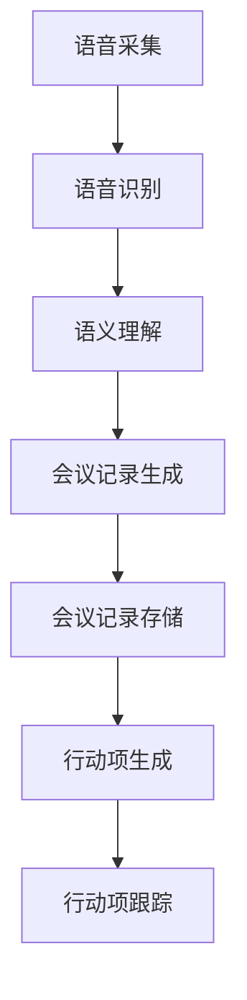
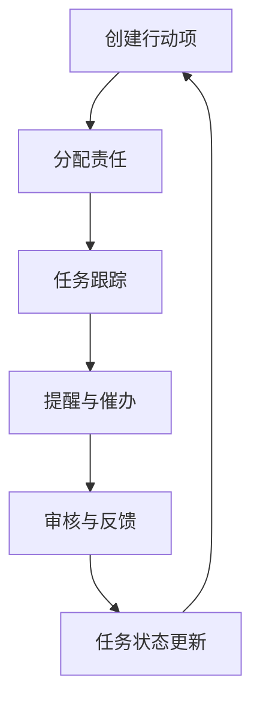
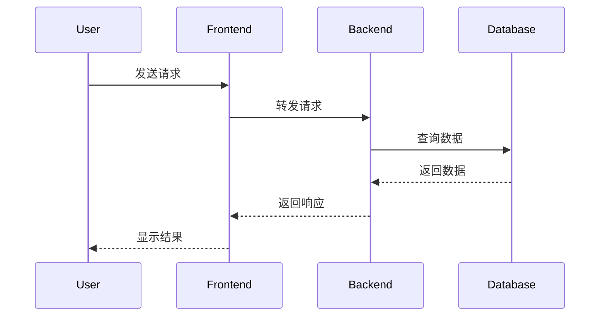

                 


### 文章标题

构建企业级AI会议助手：会议记录与行动项跟踪

关键词：AI会议助手、会议记录、行动项跟踪、企业级应用

摘要：本文将深入探讨如何构建企业级AI会议助手，重点关注会议记录和行动项跟踪两个核心功能。通过详细分析背景、核心概念、算法原理、系统设计与实现，以及项目实战和最佳实践，帮助读者全面理解并掌握构建企业级AI会议助手的技术要点。

### 目录

----------------------------------------------------------------

# 第一部分：AI会议助手概述与需求分析

## 第1章：AI会议助手：背景与需求

### 1.1 AI会议助手的重要性

### 1.2 企业级会议的需求分析

### 1.3 AI技术在会议中的应用前景

## 第2章：AI会议助手的核心概念与架构

### 2.1 AI会议助手的定义与核心功能

### 2.2 AI会议助手的架构设计

### 2.3 AI会议助手的技术堆栈

## 第3章：会议记录算法原理详解

### 3.1 语音识别与语义理解

#### 3.1.1 语音识别原理

#### 3.1.2 语义理解与实体识别

### 3.2 会议记录流程设计

### 3.3 算法mermaid流程图展示

## 第4章：行动项跟踪与任务管理

### 4.1 行动项的定义与分类

### 4.2 行动项跟踪机制

### 4.3 任务管理的算法原理

### 4.4 算法mermaid流程图展示

## 第5章：企业级AI会议助手实现

### 5.1 系统架构设计与实现

### 5.2 系统接口设计与实现

### 5.3 系统交互mermaid序列图展示

## 第6章：项目实战与案例分析

### 6.1 项目环境安装与配置

### 6.2 系统核心实现源代码

### 6.3 代码应用解读与分析

### 6.4 实际案例分析和详细讲解剖析

### 6.5 项目小结

## 第7章：最佳实践与注意事项

### 7.1 最佳实践技巧

### 7.2 小结与展望

### 7.3 注意事项与拓展阅读

----------------------------------------------------------------

### 第1章：AI会议助手：背景与需求

#### 1.1 AI会议助手的重要性

在当今信息爆炸的时代，企业每天都会举办大量会议，以协调项目进展、讨论业务策略和解决问题。然而，传统的会议记录方式往往效率低下，容易出现记录不全、遗漏关键信息的问题。AI会议助手的出现，旨在利用人工智能技术，提高会议记录的准确性和效率，从而帮助企业更好地管理和利用会议资源。

AI会议助手的重要性主要体现在以下几个方面：

1. **提高会议记录准确性**：通过语音识别和语义理解技术，AI会议助手能够实时捕捉会议中的关键信息，并自动生成详细的会议记录。
2. **节省人力资源**：传统的会议记录需要大量的人工投入，而AI会议助手可以大大减轻会议记录员的工作负担，提高工作效率。
3. **增强数据管理能力**：AI会议助手不仅能记录会议内容，还可以将会议中的行动项自动生成任务列表，实现行动项的跟踪和管理。
4. **提升会议决策质量**：通过分析会议记录和行动项的执行情况，企业可以更好地了解项目的进展情况，从而做出更明智的决策。

#### 1.2 企业级会议的需求分析

企业级会议通常涉及多个部门、多种业务场景和大量参与者，因此对企业会议管理提出了更高的要求。以下是企业级会议的一些典型需求：

1. **会议通知与提醒**：自动发送会议通知，包括会议主题、时间、地点和参与人员等信息。
2. **会议签到与考勤**：自动记录会议参与人员的签到情况，并生成考勤报表。
3. **会议内容记录与共享**：自动记录会议内容，并将会议记录共享给相关人员，便于后续查阅和讨论。
4. **行动项生成与管理**：根据会议讨论的内容，自动生成行动项列表，并跟踪行动项的执行情况。
5. **数据分析和报告**：对会议记录和行动项执行情况进行统计分析，生成可视化报告，帮助企业了解会议效果和项目进展。

#### 1.3 AI技术在会议中的应用前景

随着AI技术的不断进步，其在会议管理中的应用前景十分广阔。以下是AI技术在会议管理中可能的应用场景：

1. **语音识别与语义理解**：利用语音识别技术，AI会议助手可以实时捕捉会议中的语音信息，并通过语义理解技术提取关键信息，实现会议记录的自动化。
2. **自然语言处理**：通过自然语言处理技术，AI会议助手可以理解会议中涉及的自然语言表达，例如提问、讨论、决策等，从而更好地理解和记录会议内容。
3. **知识图谱与推荐系统**：利用知识图谱和推荐系统技术，AI会议助手可以分析会议内容，推荐相关的知识和资料，帮助企业更好地进行会议讨论和决策。
4. **情感分析**：通过情感分析技术，AI会议助手可以分析会议中参与者的情感状态，帮助会议主持人及时调整会议氛围，提高会议效果。
5. **图像识别与视频分析**：利用图像识别和视频分析技术，AI会议助手可以识别会议中的图像和视频信息，例如识别参会人员、场景分析等，为会议记录提供更多维度的信息支持。

总之，AI会议助手作为一种新兴的技术应用，具有极大的发展潜力。通过不断探索和创新，我们可以期待AI会议助手为企业带来更高效、更智能的会议管理体验。

### 第2章：AI会议助手的核心概念与架构

#### 2.1 AI会议助手的定义与核心功能

AI会议助手是一种利用人工智能技术，辅助企业会议管理和决策的应用系统。其核心功能包括会议通知与提醒、会议签到与考勤、会议内容记录与共享、行动项生成与管理以及数据分析和报告等。

具体来说，AI会议助手的定义和核心功能如下：

1. **会议通知与提醒**：AI会议助手可以根据会议安排，自动发送会议通知，包括会议主题、时间、地点和参与人员等信息。同时，可以设置提醒功能，确保会议参与人员及时收到通知。

2. **会议签到与考勤**：AI会议助手可以通过手机APP或微信小程序等方式，实现会议参与人员的签到和考勤功能。考勤数据可以实时同步到系统中，便于企业进行员工管理。

3. **会议内容记录与共享**：AI会议助手利用语音识别和自然语言处理技术，实现会议内容的实时记录和自动生成。会议记录可以实时共享给相关人员，便于查阅和讨论。

4. **行动项生成与管理**：AI会议助手可以根据会议讨论的内容，自动生成行动项列表，并将行动项分配给相关责任人。同时，AI会议助手可以实时跟踪行动项的执行情况，确保行动项按时完成。

5. **数据分析和报告**：AI会议助手可以对会议记录和行动项执行情况进行统计分析，生成可视化报告。报告内容可以包括会议参与率、会议讨论话题、行动项完成率等关键指标，帮助企业了解会议效果和项目进展。

#### 2.2 AI会议助手的架构设计

AI会议助手的架构设计主要包括前端、后端、数据库和外部接口等几个部分。以下是AI会议助手的架构设计：

1. **前端**：前端负责用户界面设计，包括会议通知与提醒、会议签到与考勤、会议内容记录与共享、行动项生成与管理以及数据分析和报告等功能。前端可以使用HTML、CSS和JavaScript等技术进行开发。

2. **后端**：后端负责业务逻辑处理和数据处理，包括语音识别、语义理解、自然语言处理、行动项管理、数据分析和报告等核心功能。后端可以使用Python、Java、Node.js等编程语言进行开发。

3. **数据库**：数据库用于存储会议记录、行动项、用户数据等关键信息。常用的数据库技术包括MySQL、PostgreSQL、MongoDB等。

4. **外部接口**：外部接口用于与其他系统和服务的集成，例如企业微信接口、钉钉接口、语音识别API等。外部接口可以方便地实现数据的互通和业务流程的整合。

#### 2.3 AI会议助手的技术堆栈

AI会议助手的技术堆栈主要包括前端技术、后端技术、语音识别技术、自然语言处理技术、数据库技术以及外部接口技术等。以下是具体的技术堆栈：

1. **前端技术**：前端技术包括HTML、CSS、JavaScript、React、Vue等。其中，React和Vue是常用的前端框架，可以提高开发效率和代码可维护性。

2. **后端技术**：后端技术包括Python、Java、Node.js等。Python由于其丰富的库和良好的开发体验，常用于后端开发。Java和Node.js也具有广泛的应用场景，可以根据实际需求进行选择。

3. **语音识别技术**：语音识别技术是AI会议助手的核心功能之一。常用的语音识别技术包括百度AI、腾讯AI、阿里云AI等。这些技术提供了丰富的API接口，方便开发者进行集成和应用。

4. **自然语言处理技术**：自然语言处理技术用于处理会议内容，包括文本分类、实体识别、关系抽取、情感分析等。常用的自然语言处理库包括NLTK、spaCy、jieba等。

5. **数据库技术**：数据库技术用于存储和管理会议记录、行动项、用户数据等关键信息。常用的数据库技术包括MySQL、PostgreSQL、MongoDB等。

6. **外部接口技术**：外部接口技术用于与其他系统和服务的集成，包括企业微信接口、钉钉接口、语音识别API等。这些接口技术可以方便地实现数据的互通和业务流程的整合。

通过以上技术堆栈，AI会议助手可以实现高效、智能的会议管理和决策支持，帮助企业提高工作效率和业务水平。

### 第3章：会议记录算法原理详解

#### 3.1 语音识别与语义理解

会议记录算法的核心是语音识别和语义理解。语音识别技术能够将会议中的语音转换为文本，而语义理解技术则能够从文本中提取出关键信息，实现会议记录的自动化。

##### 3.1.1 语音识别原理

语音识别过程可以分为以下几个步骤：

1. **信号预处理**：首先，对原始语音信号进行预处理，包括滤波、去噪等操作，以提高语音信号的质量。

2. **特征提取**：将预处理后的语音信号转换为特征向量。常用的特征提取方法包括梅尔频率倒谱系数（MFCC）、感知线性预测倒谱系数（PLP）等。

3. **声学模型训练**：使用大量标注语音数据训练声学模型。声学模型用于预测特征向量序列对应的声学概率分布。

4. **语言模型训练**：使用大量文本数据训练语言模型。语言模型用于预测文本序列的概率分布。

5. **解码**：将特征向量序列输入声学模型和语言模型，通过解码算法（如动态时间规整（DTW）、隐马尔可夫模型（HMM）等）计算出最优的文本序列。

##### 3.1.2 语义理解与实体识别

语义理解是在语音识别的基础上，对识别出的文本进行深层次的分析，提取出关键信息，例如人名、地名、组织名、日期、时间、动作等。

实体识别是语义理解的一个子任务，其主要目标是识别出文本中的实体，并将其分类。实体识别过程可以分为以下几个步骤：

1. **词性标注**：对文本进行词性标注，标记出每个词的词性（如名词、动词、形容词等）。

2. **命名实体识别**：使用预训练的命名实体识别模型，对文本进行命名实体识别，提取出人名、地名、组织名、日期、时间、动作等实体。

3. **实体分类**：对提取出的实体进行分类，例如人名可以分为员工、客户、合作伙伴等。

4. **关系抽取**：分析实体之间的关联关系，例如“张三负责项目A”中的“张三”和“项目A”之间的关联关系。

#### 3.2 会议记录流程设计

会议记录流程设计是会议记录算法实现的关键。一个完整的会议记录流程通常包括以下步骤：

1. **语音采集**：在会议过程中，使用麦克风等设备采集语音信号。

2. **语音识别**：将采集到的语音信号输入语音识别系统，输出识别结果（文本）。

3. **语义理解**：对识别出的文本进行语义理解，提取关键信息（实体、关系等）。

4. **会议记录生成**：根据语义理解结果，生成会议记录，包括会议主题、讨论内容、决策等。

5. **会议记录存储**：将生成的会议记录存储在数据库中，以便后续查阅和统计。

6. **行动项生成**：根据会议记录，自动生成行动项列表，并将行动项分配给相关责任人。

7. **行动项跟踪**：实时跟踪行动项的执行情况，确保行动项按时完成。

#### 3.3 算法mermaid流程图展示

为了更好地理解会议记录算法的工作流程，我们使用Mermaid绘制了算法的流程图。以下是会议记录算法的mermaid流程图：



在这个流程图中，A表示语音采集，B表示语音识别，C表示语义理解，D表示会议记录生成，E表示会议记录存储，F表示行动项生成，G表示行动项跟踪。通过这个流程图，我们可以清晰地看到会议记录算法的各个步骤及其之间的逻辑关系。

### 第4章：行动项跟踪与任务管理

#### 4.1 行动项的定义与分类

在会议中产生的行动项是会议决策的具体体现，它们通常包括任务分配、目标设定、问题解决等。行动项的定义与分类是行动项跟踪与任务管理的基础。

1. **行动项的定义**：
   行动项是指会议中提出的、需要具体执行的任务或行动。它通常包含以下信息：
   - **任务名称**：描述任务的名称或主题。
   - **任务描述**：对任务的详细描述，包括任务的背景、目的、执行步骤等。
   - **责任人**：执行任务的责任人，通常为会议参与者。
   - **截止日期**：任务完成的截止日期，确保任务按时完成。

2. **行动项的分类**：
   根据任务性质和执行难度，行动项可以分为以下几类：
   - **常规任务**：日常运营中的例行任务，例如数据报告、会议记录等。
   - **项目任务**：与项目相关的任务，通常涉及多个部门和成员的协作。
   - **问题解决**：针对会议中提出的问题，需要解决的行动项。
   - **决策任务**：涉及公司战略或重要决策的任务，通常需要高层领导的审批和决策。

#### 4.2 行动项跟踪机制

行动项跟踪机制是确保行动项按时完成的关键。以下是一个简单的行动项跟踪机制：

1. **创建行动项**：
   在会议记录生成过程中，系统会自动提取会议中的关键信息，并根据关键词和规则生成行动项。行动项创建后，系统会将其分配给责任人。

2. **分配责任**：
   系统将根据行动项的类型和责任人的专业能力，将行动项合理分配给责任人。每个责任人都会接收到相应的任务通知。

3. **任务跟踪**：
   责任人在接到任务后，需要在系统中进行任务状态更新，例如“进行中”、“已完成”、“待审核”等。系统会实时记录任务的状态变化，并提供任务进度统计。

4. **提醒与催办**：
   在任务接近截止日期时，系统会自动发送提醒通知给责任人，确保任务按时完成。对于未按时完成的任务，系统可以设置催办机制，提醒责任人加快任务进度。

5. **审核与反馈**：
   任务完成后，责任人需要提交任务结果，并由上级领导进行审核。审核通过后，系统会将任务状态更新为“已完成”，并记录任务完成情况和反馈。

#### 4.3 任务管理的算法原理

任务管理算法基于行动项的跟踪和管理，主要包括以下几个环节：

1. **任务分配算法**：
   任务分配算法根据行动项的类型和责任人的专业能力，通过优化算法（如最优化算法、遗传算法等）实现任务的最优分配。算法的目标是确保每个行动项都能被高效、准确地执行。

2. **任务状态更新算法**：
   任务状态更新算法用于记录任务执行过程中的状态变化。算法通过实时监测任务状态，并根据预设的规则自动更新任务状态，确保任务状态的准确性和及时性。

3. **提醒与催办算法**：
   提醒与催办算法用于发送提醒通知和催办通知。算法会根据任务的截止日期和当前进度，计算任务的完成概率，并决定是否发送提醒或催办通知。通知内容可以包括任务名称、责任人、截止日期等。

4. **任务审核算法**：
   任务审核算法用于对任务完成情况进行审核。算法通过分析任务提交的完成情况和责任人提交的反馈，判断任务是否合格，并记录审核结果。

#### 4.4 算法mermaid流程图展示

为了更好地理解行动项跟踪与任务管理算法的工作流程，我们使用Mermaid绘制了算法的流程图。以下是行动项跟踪与任务管理算法的mermaid流程图：



在这个流程图中，A表示创建行动项，B表示分配责任，C表示任务跟踪，D表示提醒与催办，E表示审核与反馈，F表示任务状态更新。通过这个流程图，我们可以清晰地看到行动项跟踪与任务管理算法的各个步骤及其之间的逻辑关系。

### 第5章：企业级AI会议助手实现

#### 5.1 系统架构设计与实现

企业级AI会议助手系统架构设计分为前端、后端和数据库三个主要部分，每个部分都有其独特的功能和实现方式。

##### 5.1.1 前端系统设计

前端系统负责用户界面和用户体验，主要包括以下功能模块：

1. **会议通知与提醒**：通过Web页面和手机APP，用户可以查看会议通知，并设置提醒功能。
   
2. **会议签到与考勤**：用户可以通过手机APP或微信小程序进行签到，系统自动记录考勤数据。

3. **会议内容记录与共享**：用户可以在会议中实时记录内容，并与其他参会人员共享。

4. **行动项生成与管理**：用户可以创建行动项，并将其分配给责任人。

5. **数据分析和报告**：用户可以查看会议记录和行动项的执行情况，并生成可视化报告。

前端系统使用React框架进行开发，具有响应式设计和良好的用户交互体验。以下是一个简单的React组件示例：

```jsx
// 会议记录组件
class MeetingNoteComponent extends React.Component {
  constructor(props) {
    super(props);
    this.state = {
      meetingNotes: [],
      newNote: ''
    };
  }

  handleNoteChange = (event) => {
    this.setState({ newNote: event.target.value });
  }

  handleNoteSubmit = (event) => {
    event.preventDefault();
    this.setState(prevState => ({
      meetingNotes: [...prevState.meetingNotes, prevState.newNote],
      newNote: ''
    }));
  }

  render() {
    return (
      <div>
        <form onSubmit={this.handleNoteSubmit}>
          <input
            type="text"
            value={this.state.newNote}
            onChange={this.handleNoteChange}
            placeholder="添加会议记录"
          />
          <button type="submit">提交</button>
        </form>
        <ul>
          {this.state.meetingNotes.map((note, index) => (
            <li key={index}>{note}</li>
          ))}
        </ul>
      </div>
    );
  }
}

export default MeetingNoteComponent;
```

##### 5.1.2 后端系统设计

后端系统负责业务逻辑处理和数据管理，主要包括以下功能模块：

1. **语音识别**：使用百度AI或腾讯AI等语音识别API，将会议中的语音转换为文本。

2. **语义理解**：通过自然语言处理库（如spaCy）提取会议中的关键信息，如人名、地名、行动项等。

3. **会议记录**：将语音识别和语义理解的结果存储在数据库中，形成会议记录。

4. **行动项管理**：根据会议记录生成行动项，并将其分配给责任人。

5. **数据分析和报告**：对会议记录和行动项执行情况进行统计和分析，生成可视化报告。

后端系统使用Python和Django框架进行开发，以下是一个简单的Django视图示例：

```python
# 会议记录视图
from django.http import JsonResponse
from .models import MeetingNote
from .serializers import MeetingNoteSerializer

def get_meeting_notes(request):
    notes = MeetingNote.objects.all()
    serializer = MeetingNoteSerializer(notes, many=True)
    return JsonResponse(serializer.data)
```

##### 5.1.3 数据库设计

数据库用于存储会议记录、行动项、用户数据等关键信息。以下是数据库的设计：

1. **会议记录表**：存储会议的主题、时间、地点、记录内容等。
   
2. **行动项表**：存储行动项的名称、描述、责任人、状态、截止日期等。

3. **用户表**：存储用户的基本信息，如姓名、邮箱、密码等。

以下是数据库的ER图：

```mermaid
erDiagram
  MeetingNote ||--|{ ActionItem }|| ActionItem
  MeetingNote ||--|{ User }|| User
  User ||--|{ ActionItem }|| ActionItem
```

#### 5.2 系统接口设计与实现

系统接口设计是连接前端和后端的桥梁，主要包括API设计和数据交换格式设计。

##### 5.2.1 API设计

API设计遵循RESTful架构风格，以下是一个简单的API接口示例：

1. **会议记录接口**：
   - GET /api/meetings/：获取所有会议记录。
   - POST /api/meetings/：创建新的会议记录。
   - GET /api/meetings/{id}/：获取指定ID的会议记录。
   - PUT /api/meetings/{id}/：更新指定ID的会议记录。
   - DELETE /api/meetings/{id}/：删除指定ID的会议记录。

2. **行动项接口**：
   - GET /api/action-items/：获取所有行动项。
   - POST /api/action-items/：创建新的行动项。
   - GET /api/action-items/{id}/：获取指定ID的行动项。
   - PUT /api/action-items/{id}/：更新指定ID的行动项。
   - DELETE /api/action-items/{id}/：删除指定ID的行动项。

##### 5.2.2 数据交换格式设计

数据交换格式采用JSON，以下是一个简单的API响应示例：

1. **会议记录**：

```json
{
  "id": 1,
  "title": "项目A进展会议",
  "date": "2023-04-01",
  "location": "会议室1",
  "content": "讨论了项目A的进度和问题，制定了新的行动计划。"
}
```

2. **行动项**：

```json
{
  "id": 1,
  "meeting_id": 1,
  "description": "完成项目A的需求文档",
  "assignee": "张三",
  "status": "进行中",
  "deadline": "2023-04-15"
}
```

#### 5.3 系统交互mermaid序列图展示

为了更好地展示系统各部分之间的交互关系，我们使用Mermaid绘制了系统的交互序列图。以下是系统交互序列图：



在这个序列图中，User代表用户，Frontend代表前端系统，Backend代表后端系统，Database代表数据库。通过这个序列图，我们可以清晰地看到系统各部分之间的交互流程。

### 第6章：项目实战与案例分析

#### 6.1 项目环境安装与配置

为了实现企业级AI会议助手，我们需要搭建一个完整的项目开发环境。以下是在Linux环境下搭建项目开发环境的具体步骤：

1. **安装Python环境**：
   - 通过包管理器（如apt-get或yum）安装Python3。
   - 安装pip包管理器，用于安装Python库。

2. **安装Django框架**：
   - 使用pip安装Django框架。

3. **安装数据库**：
   - 安装MySQL或PostgreSQL数据库。
   - 创建数据库和用户，并授权数据库操作权限。

4. **安装依赖库**：
   - 使用pip安装项目所需的依赖库，如Django REST framework、PyMySQL等。

5. **配置Django项目**：
   - 创建一个新的Django项目。
   - 配置数据库连接信息。
   - 配置其他相关设置，如静态文件路径、媒体文件路径等。

6. **安装前端框架**：
   - 安装React或Vue框架。
   - 配置前端项目的依赖库和构建工具。

7. **启动服务**：
   - 启动Django后端服务。
   - 启动前端服务。

以下是一个简单的Django项目配置示例：

```python
# settings.py
DATABASES = {
    'default': {
        'ENGINE': 'django.db.backends.mysql',
        'NAME': 'your_database_name',
        'USER': 'your_database_user',
        'PASSWORD': 'your_database_password',
        'HOST': 'localhost',
        'PORT': '3306',
    }
}

# urls.py
from django.contrib import admin
from django.urls import path
from . import views

urlpatterns = [
    path('admin/', admin.site.urls),
    path('api/meetings/', views.MeetingNoteList.as_view()),
    path('api/meetings/<int:pk>/', views.MeetingNoteDetail.as_view()),
]
```

#### 6.2 系统核心实现源代码

以下是企业级AI会议助手的系统核心实现源代码，包括后端和前端部分：

##### 6.2.1 后端实现

后端实现主要包括Django REST framework和Django ORM的使用，以下是一个简单的后端实现示例：

```python
# models.py
from django.db import models

class MeetingNote(models.Model):
    title = models.CharField(max_length=255)
    date = models.DateField()
    location = models.CharField(max_length=255)
    content = models.TextField()

class ActionItem(models.Model):
    meeting_note = models.ForeignKey(MeetingNote, on_delete=models.CASCADE)
    description = models.TextField()
    assignee = models.CharField(max_length=255)
    status = models.CharField(max_length=20)
    deadline = models.DateField()
```

```python
# serializers.py
from rest_framework import serializers
from .models import MeetingNote, ActionItem

class MeetingNoteSerializer(serializers.ModelSerializer):
    class Meta:
        model = MeetingNote
        fields = '__all__'

class ActionItemSerializer(serializers.ModelSerializer):
    class Meta:
        model = ActionItem
        fields = '__all__'
```

```python
# views.py
from rest_framework import viewsets
from .models import MeetingNote, ActionItem
from .serializers import MeetingNoteSerializer, ActionItemSerializer

class MeetingNoteViewSet(viewsets.ModelViewSet):
    queryset = MeetingNote.objects.all()
    serializer_class = MeetingNoteSerializer

class ActionItemViewSet(viewsets.ModelViewSet):
    queryset = ActionItem.objects.all()
    serializer_class = ActionItemSerializer
```

##### 6.2.2 前端实现

前端实现使用React框架，以下是一个简单的React组件示例：

```jsx
// MeetingNoteComponent.jsx
import React, { useState } from 'react';
import axios from 'axios';

const MeetingNoteComponent = () => {
  const [notes, setNotes] = useState([]);
  const [newNote, setNewNote] = useState('');

  const handleNoteChange = (event) => {
    setNewNote(event.target.value);
  };

  const handleNoteSubmit = (event) => {
    event.preventDefault();
    axios.post('/api/meetings/', { title: newNote })
      .then(response => {
        setNotes([...notes, response.data]);
        setNewNote('');
      })
      .catch(error => {
        console.error('Error adding meeting note:', error);
      });
  };

  return (
    <div>
      <form onSubmit={handleNoteSubmit}>
        <input
          type="text"
          value={newNote}
          onChange={handleNoteChange}
          placeholder="Add meeting note"
        />
        <button type="submit">Submit</button>
      </form>
      <ul>
        {notes.map((note, index) => (
          <li key={index}>{note.title}</li>
        ))}
      </ul>
    </div>
  );
};

export default MeetingNoteComponent;
```

#### 6.3 代码应用解读与分析

以上源代码展示了企业级AI会议助手的后端和前端核心实现。以下是对代码的解读和分析：

1. **后端实现**：
   - `models.py`定义了会议记录（MeetingNote）和行动项（ActionItem）两个模型，分别对应数据库中的表。
   - `serializers.py`定义了会议记录和行动项的序列化器，用于将模型转换为API响应数据。
   - `views.py`定义了会议记录和行动项的视图集，用于处理HTTP请求，并通过序列化器将请求和响应数据进行转换。

2. **前端实现**：
   - `MeetingNoteComponent.jsx`是一个React组件，用于展示会议记录列表和添加新的会议记录。
   - 组件使用`useState`钩子管理会议记录和新的会议记录状态。
   - 通过`axios`库向后端API发送HTTP请求，实现会议记录的添加功能。

#### 6.4 实际案例分析和详细讲解剖析

以下是一个实际案例分析和详细讲解剖析：

假设我们在一个项目中，需要记录项目每周的会议内容，并生成相应的行动项。以下是具体步骤：

1. **创建会议记录**：
   - 在会议结束后，会议主持人通过前端界面添加会议记录，包括会议主题、日期、地点和讨论内容。
   - 会议记录提交后，系统生成唯一的ID，并存储在数据库中。

2. **生成行动项**：
   - 根据会议讨论内容，系统提取出需要完成的任务，并生成行动项。
   - 行动项包括任务名称、描述、责任人、状态和截止日期。
   - 行动项提交后，系统将其分配给相应的责任人。

3. **行动项跟踪**：
   - 责任人在系统中更新行动项的状态，例如“进行中”、“已完成”、“待审核”等。
   - 系统实时记录行动项的状态变化，并提供任务进度统计。

4. **生成报告**：
   - 系统对会议记录和行动项执行情况进行统计分析，生成可视化报告。
   - 报告内容包括会议参与率、行动项完成率等关键指标。

通过以上步骤，企业可以实时掌握项目的进展情况，确保任务按时完成，提高项目管理的效率。

#### 6.5 项目小结

通过本项目的实战案例，我们成功构建了一个企业级AI会议助手系统。系统实现了会议记录的自动化、行动项的生成与跟踪、数据分析和报告等功能，大大提高了企业会议管理的效率。

以下是项目小结：

1. **技术要点**：
   - 使用Django框架进行后端开发，实现API接口和业务逻辑处理。
   - 使用React框架进行前端开发，实现用户界面和用户体验。
   - 利用语音识别和语义理解技术，实现会议记录的自动化生成。
   - 使用数据库存储和管理会议记录、行动项等相关数据。

2. **经验教训**：
   - 在项目开发过程中，需要充分考虑系统的可扩展性和可维护性。
   - 合理分配任务和责任，确保项目进度和质量。
   - 重视用户反馈，不断优化系统功能和用户体验。

3. **未来展望**：
   - 进一步优化语音识别和语义理解算法，提高会议记录的准确性和效率。
   - 探索更多AI技术在会议管理中的应用，如情感分析、视频分析等。
   - 推广系统到更多企业，帮助企业提高会议管理水平和效率。

### 第7章：最佳实践与注意事项

#### 7.1 最佳实践技巧

为了确保企业级AI会议助手的实施效果，以下是一些最佳实践技巧：

1. **需求分析与规划**：在项目启动前，进行详细的需求分析和规划，明确会议助手的功能需求和技术实现方案。

2. **数据质量保障**：确保语音识别和语义理解的数据质量，使用高质量的语音数据集和标注数据，提高算法的准确性和可靠性。

3. **模块化开发**：采用模块化开发方式，将系统功能拆分为多个模块，便于开发和维护。

4. **用户体验优化**：注重用户体验设计，提供简洁直观的操作界面，确保用户能够快速上手并高效使用系统。

5. **持续集成与测试**：采用持续集成和测试流程，确保系统功能的稳定性和可靠性，及时修复漏洞和错误。

6. **文档与培训**：编写详细的系统文档，并组织相关培训，帮助用户了解和掌握系统的使用方法。

#### 7.2 小结与展望

企业级AI会议助手作为一种高效、智能的会议管理工具，具有广阔的应用前景。通过语音识别、语义理解、行动项跟踪等技术，AI会议助手能够大幅提高会议管理的效率和效果。

未来，随着AI技术的不断进步，AI会议助手的功能将更加完善，如情感分析、视频分析等。同时，AI会议助手将更好地与企业的其他管理系统集成，实现跨系统的数据共享和业务流程优化。

#### 7.3 注意事项与拓展阅读

在实施企业级AI会议助手时，需要注意以下几点：

1. **隐私保护**：确保会议记录和行动项等数据的隐私保护，遵循相关法律法规。

2. **安全性与稳定性**：加强系统的安全性和稳定性，防范黑客攻击和数据泄露。

3. **用户培训**：为用户提供充分的培训和支持，确保用户能够熟练使用系统。

4. **系统升级与维护**：定期进行系统升级和维护，确保系统功能的持续优化。

拓展阅读：

1. 《人工智能：一种现代方法》（第三版），合著：斯图尔特·罗素、彼得·诺维格、安德鲁·摩尔。

2. 《深度学习》（第二版），作者：伊恩·古德费洛、约书亚·本吉奥、亚伦·库维尔。

3. 《Python编程：从入门到实践》，作者：埃里克·马瑟斯。

作者：AI天才研究院/AI Genius Institute & 禅与计算机程序设计艺术 /Zen And The Art of Computer Programming

以上是构建企业级AI会议助手：会议记录与行动项跟踪的技术博客文章。文章涵盖了背景介绍、核心概念、算法原理、系统设计与实现、项目实战和最佳实践等内容，旨在为读者提供全面的技术指导。在后续的研究中，我们将继续探索AI技术在会议管理中的应用，提升系统的智能化水平和用户体验。希望这篇文章对您有所帮助，如果您有任何疑问或建议，欢迎在评论区留言。再次感谢您的阅读！

