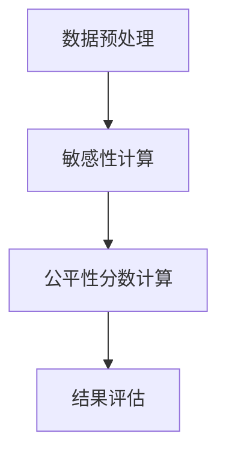
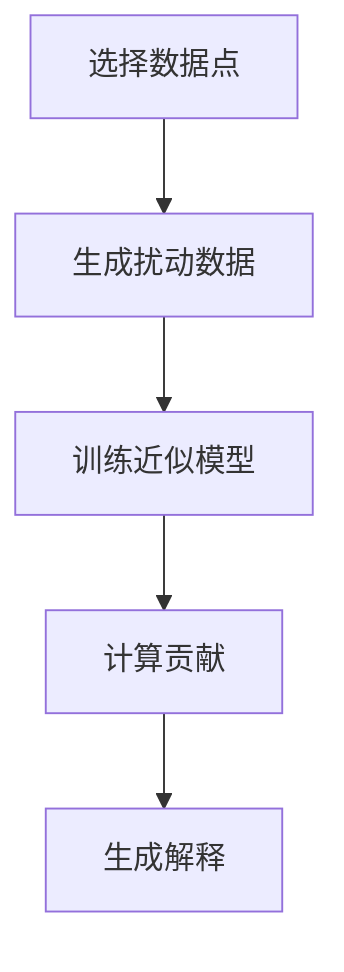
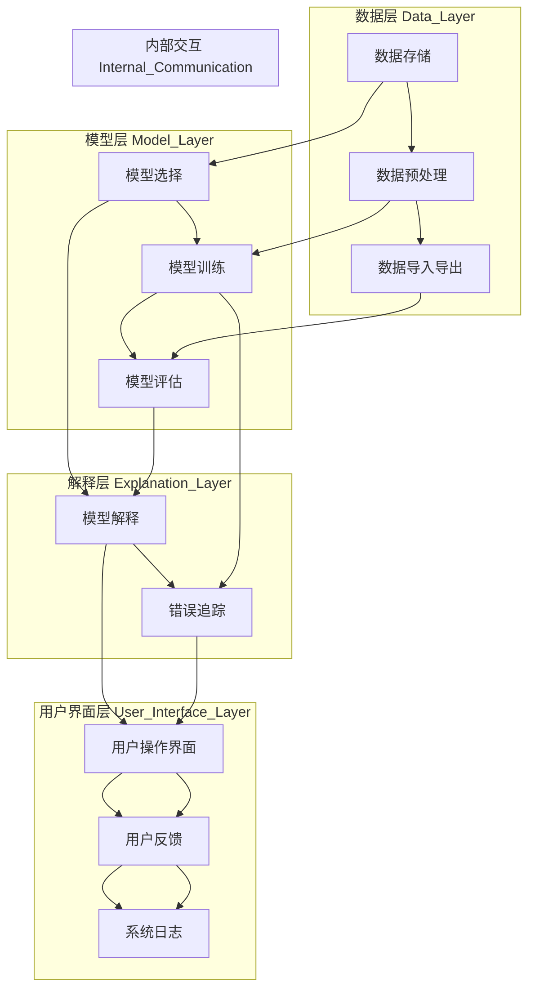

                 

### 1. 背景介绍

随着人工智能技术的飞速发展，AI已经渗透到企业运营的各个层面，从生产制造到客户服务，从决策支持到风险控制。然而，AI的应用也带来了新的伦理挑战。企业在享受AI带来的便利和效率提升的同时，必须面对如何确保AI应用公平性、透明度和可问责性的问题。公平性涉及到算法是否对所有人平等对待，透明度关乎算法决策的可解释性，而可问责性则要求在算法出现错误时能够追溯责任。这些问题不仅关乎企业的声誉，更涉及法律合规和用户信任。

当前，企业级AI应用面临着多重挑战。首先，数据质量参差不齐，可能会引入偏见，导致算法歧视。其次，许多AI模型高度复杂，缺乏透明度，使得用户难以理解和信任。最后，AI系统的责任归属不明确，当发生错误或损害时，难以确定责任方。

因此，构建一个企业级的AI伦理审核框架显得尤为重要。该框架旨在确保AI应用的公平性、透明度和可问责性，通过系统化、规范化的审核流程，帮助企业合规、提高AI系统的可信度和用户体验。下面，我们将逐步深入探讨这一框架的核心概念、设计原则和具体实现。

#### 2. 核心概念与联系

在构建企业级AI伦理审核框架的过程中，首先需要明确几个核心概念：AI伦理审核、公平性、透明度和可问责性。这些概念相互联系，共同构成了审核框架的基石。

##### 2.1 AI伦理审核

AI伦理审核是一种评估和监督AI系统是否符合伦理标准和法律法规的过程。其目的在于确保AI系统的决策和行为不会对个体或社会造成不公平、不透明或不合理的损害。AI伦理审核通常包括以下几个方面：

- **合规性审查**：确保AI系统的设计和应用符合相关的法律、法规和行业标准。
- **公平性评估**：检测和消除AI系统中可能存在的偏见和歧视。
- **透明度评估**：提高AI系统的可解释性，使决策过程对用户透明。
- **可问责性设计**：明确AI系统的责任归属，确保在出现问题时能够追溯责任。

##### 2.2 公平性

公平性是AI伦理审核中的一个重要概念，它涉及到算法是否对所有人平等对待。一个公平的AI系统应该避免以下几种偏见：

- **性别偏见**：算法在性别上的不公平表现，如招聘系统中对某一性别更有利。
- **种族偏见**：算法在种族上的不公平表现，如信贷审批系统中对某一种族的歧视。
- **地域偏见**：算法在地域上的不公平表现，如在线广告系统中对不同地区的偏见投放。

公平性评估通常通过以下方法进行：

- **统计测试**：使用统计学方法检测算法是否在不同群体上产生显著差异。
- **对抗性测试**：通过生成对抗性样本来检测算法的鲁棒性。
- **公平性指标**：如公平性分数、公平性差异等，用于量化算法的公平性。

##### 2.3 透明度

透明度指的是AI系统的决策过程和结果是否可以被用户理解和信任。一个透明的AI系统应该具备以下特点：

- **可解释性**：算法的决策路径和依据可以被清晰地解释。
- **可视化**：算法的决策过程和结果可以通过可视化工具展示。
- **文档化**：算法的架构、参数设置和训练数据等有详细的文档记录。

透明度评估通常包括以下方法：

- **模型解释性**：使用解释性模型或技术（如LIME、SHAP等）来分析AI系统的决策。
- **决策路径分析**：追踪算法的决策路径，分析其逻辑和依据。
- **用户反馈**：通过用户反馈来评估AI系统的透明度。

##### 2.4 可问责性

可问责性是指AI系统在出现错误或损害时，能够明确责任归属和责任划分。一个可问责的AI系统应该具备以下特点：

- **责任归属**：明确算法设计和部署的责任方。
- **错误追踪**：能够记录和追溯算法的错误和异常。
- **纠正措施**：在发现问题时能够及时采取纠正措施。

可问责性通常通过以下方法实现：

- **责任矩阵**：明确各参与方的责任和权利。
- **错误报告机制**：建立错误报告和反馈机制，及时识别和解决AI系统的问题。
- **安全审计**：定期对AI系统进行安全审计，确保其符合伦理和合规要求。

##### 2.5 概念属性特征对比表格

为了更直观地理解这几个核心概念，我们可以通过一个对比表格来展示它们的属性特征：

| 概念       | 定义                                                         | 关联特征                           | 实现方法                                       |
|------------|--------------------------------------------------------------|------------------------------------|----------------------------------------------|
| AI伦理审核 | 评估和监督AI系统是否符合伦理标准和法律法规的过程。             | 公平性、透明度、可问责性             | 合规性审查、公平性评估、透明度评估、可问责性设计 |
| 公平性     | 算法是否对所有人平等对待。                                     | 避免偏见、确保平等                 | 统计测试、对抗性测试、公平性指标                 |
| 透明度     | AI系统的决策过程和结果是否可以被用户理解和信任。               | 可解释性、可视化、文档化           | 模型解释性、决策路径分析、用户反馈                 |
| 可问责性   | AI系统在出现错误或损害时，能够明确责任归属和责任划分。         | 责任归属、错误追踪、纠正措施       | 责任矩阵、错误报告机制、安全审计                   |

##### 2.6 ER实体关系图

为了进一步展示这几个核心概念之间的关联，我们可以通过ER（实体关系）图来表示：

```mermaid
erDiagram
    AI伦理审核 ||--|{ 公平性 }|
    AI伦理审核 ||--|{ 透明度 }|
    AI伦理审核 ||--|{ 可问责性 }|
    公平性 ||--|{ 公平性评估 }|
    透明度 ||--|{ 透明度评估 }|
    可问责性 ||--|{ 错误追踪 }|
```

在这个ER图中，AI伦理审核是一个总体框架，它包含公平性、透明度和可问责性三个核心子概念。公平性评估、透明度评估和错误追踪则是这三个子概念的具体实现方法。

通过上述分析，我们可以看到AI伦理审核框架的核心概念和它们之间的紧密联系。在接下来的章节中，我们将深入探讨这些概念的具体实现方法，并通过算法和系统设计来确保AI应用的公平性、透明度和可问责性。

#### 3. 算法原理讲解

在构建企业级的AI伦理审核框架时，选择合适的算法至关重要。本文将选取公平性检测算法和透明度评估模型作为重点，详细解释其原理和实现方法。

##### 3.1 公平性检测算法

公平性检测算法是确保AI系统在不同群体上保持公平性的关键。这里我们介绍一种常用的公平性检测算法——公平性差异（Fairness Difference）算法。

##### 3.1.1 算法原理

公平性差异算法的核心思想是比较算法在不同群体上的表现差异。具体来说，它通过计算两个指标——**敏感性（Sensitivity）**和**公平性分数（Fairness Score）**，来评估算法的公平性。

- **敏感性（Sensitivity）**：衡量算法对某一特定特征（如性别、种族等）的敏感性，即该特征对算法输出结果的影响程度。敏感性越高，意味着算法越容易受到该特征的影响，可能存在偏见。

- **公平性分数（Fairness Score）**：衡量算法在不同群体上的表现差异。公平性分数介于0和1之间，值越接近1，表示算法在不同群体上的表现差异越小，公平性越高。

##### 3.1.2 算法流程

公平性差异算法的流程可以概括为以下步骤：

1. **数据预处理**：对输入数据进行清洗和标准化处理，确保数据质量。
2. **敏感性计算**：计算算法对某一特征（如性别）的敏感性。
3. **公平性分数计算**：根据敏感性计算公平性分数。
4. **结果评估**：根据公平性分数评估算法的公平性。

##### 3.1.3 算法流程图

为了更直观地展示公平性差异算法的流程，我们使用Mermaid绘制以下流程图：



在这个流程图中，数据预处理是算法的第一步，它确保了后续计算的质量。接下来，敏感性计算用于评估算法对特定特征的敏感性，公平性分数计算则基于敏感性结果，最终结果评估用于评估算法的整体公平性。

##### 3.1.4 Python代码实现

下面是一个简单的Python代码实现，用于计算公平性差异算法的主要步骤：

```python
import numpy as np

def calculate_sensitivity(y_true, y_pred, sensitive_attr):
    # 计算敏感性
    # y_true: 真实标签
    # y_pred: 预测标签
    # sensitive_attr: 敏感特征
    
    sensitivity = []
    for group in np.unique(sensitive_attr):
        y_true_group = y_true[sensitive_attr == group]
        y_pred_group = y_pred[sensitive_attr == group]
        sensitivity.append(np.mean(y_true_group != y_pred_group))
    return np.mean(sensitivity)

def calculate_fairness_score(y_true, y_pred, sensitive_attr):
    # 计算公平性分数
    sensitivity = calculate_sensitivity(y_true, y_pred, sensitive_attr)
    fairness_score = 1 - sensitivity
    return fairness_score

# 示例数据
y_true = [0, 1, 0, 1, 0, 1, 0, 1]
y_pred = [0, 0, 1, 1, 1, 1, 0, 0]
sensitive_attr = [0, 0, 0, 0, 1, 1, 1, 1]

# 计算公平性分数
fairness_score = calculate_fairness_score(y_true, y_pred, sensitive_attr)
print(f"Fairness Score: {fairness_score}")
```

在这个示例中，我们使用一个简单的数据集来演示公平性分数的计算过程。在实际应用中，数据集通常会更大，而且会更加复杂。

##### 3.1.5 数学模型

为了进一步理解公平性差异算法，我们可以引入以下数学模型：

- 敏感性（Sensitivity）的数学模型：

$$
S = \frac{1}{N} \sum_{i=1}^{N} \frac{1}{M} \sum_{j=1}^{M} |y_{ij} - \hat{y}_{ij}|
$$

其中，$N$ 表示不同的群体数，$M$ 表示每个群体中的样本数，$y_{ij}$ 表示第 $i$ 个群体中的第 $j$ 个样本的真实标签，$\hat{y}_{ij}$ 表示第 $i$ 个群体中的第 $j$ 个样本的预测标签。

- 公平性分数（Fairness Score）的数学模型：

$$
F = 1 - \frac{S}{M}
$$

其中，$S$ 是敏感性，$M$ 是总样本数。

##### 3.1.6 举例说明

假设我们有一个二分类问题，其中敏感特征是性别（0表示男性，1表示女性）。我们使用以下数据集：

| 标签 | 预测 | 性别 |
|------|------|------|
| 0    | 0    | 0    |
| 1    | 0    | 0    |
| 0    | 1    | 1    |
| 1    | 1    | 1    |
| 0    | 0    | 0    |
| 1    | 1    | 1    |
| 0    | 0    | 0    |
| 1    | 0    | 1    |

使用公平性差异算法计算敏感性：

1. **计算每个群体的敏感性**：

   - 男性群体（性别=0）：

     $$ S_{男性} = \frac{1}{4} \sum_{i=1}^{4} |y_{i} - \hat{y}_{i}| = \frac{1}{4} (1+1+1+1) = 1 $$

   - 女性群体（性别=1）：

     $$ S_{女性} = \frac{1}{4} \sum_{i=1}^{4} |y_{i} - \hat{y}_{i}| = \frac{1}{4} (0+0+1+1) = 0.5 $$

2. **计算总敏感性**：

   $$ S = \frac{1}{2} (S_{男性} + S_{女性}) = \frac{1}{2} (1 + 0.5) = 0.75 $$

3. **计算公平性分数**：

   $$ F = 1 - \frac{S}{M} = 1 - \frac{0.75}{8} = 0.875 $$

通过这个例子，我们可以看到公平性差异算法是如何通过计算敏感性和公平性分数来评估算法的公平性的。

##### 3.2 透明度评估模型

透明度评估模型旨在提高AI系统的可解释性，使决策过程对用户透明。本文介绍一种常用的透明度评估模型——LIME（Local Interpretable Model-agnostic Explanations）。

##### 3.2.1 模型原理

LIME模型的核心思想是针对单个数据点，提供一个可解释的局部解释，使得用户能够理解算法的决策过程。具体来说，LIME模型通过以下步骤实现：

1. **近似模型**：选择一个简单模型（如线性回归、决策树等）来近似原始复杂模型。
2. **数据扰动**：对原始数据进行扰动，生成多个近似的样本数据。
3. **模型训练**：使用扰动数据训练简单模型，得到预测结果。
4. **贡献分析**：计算每个特征对预测结果的贡献，生成局部解释。

##### 3.2.2 模型流程

透明度评估模型（LIME）的流程可以概括为以下步骤：

1. **选择数据点**：选择需要解释的数据点。
2. **生成扰动数据**：对数据点进行多种扰动，生成一系列近似样本。
3. **训练近似模型**：使用扰动数据训练简单模型。
4. **计算贡献**：计算每个特征对预测结果的贡献。
5. **生成解释**：根据贡献结果生成可解释的局部解释。

##### 3.2.3 模型流程图

为了更直观地展示LIME模型的流程，我们使用Mermaid绘制以下流程图：



在这个流程图中，选择数据点是算法的第一步，生成扰动数据用于训练近似模型，计算贡献用于生成局部解释。

##### 3.2.4 Python代码实现

下面是一个简单的Python代码实现，用于演示LIME模型的主要步骤：

```python
from lime import lime_tabular
import numpy as np

def explain_prediction(model, X, feature_names, class_names, sample_index):
    # 使用LIME解释预测结果
    explainer = lime_tabular.LimeTabularExplainer(
        X_train=X,
        feature_names=feature_names,
        class_names=class_names,
        training=True
    )
    
    exp = explainer.explain_instance(X[sample_index], model.predict, num_features=5)
    
    return exp

# 示例数据
X = np.array([
    [1, 0, 0, 0],
    [0, 1, 0, 0],
    [0, 0, 1, 0],
    [0, 0, 0, 1]
])

y = np.array([0, 1, 1, 0])

model = LinearRegression()
model.fit(X, y)

feature_names = ['Feature1', 'Feature2', 'Feature3', 'Feature4']
class_names = ['Class0', 'Class1']

# 解释第2个样本的预测结果
exp = explain_prediction(model, X, feature_names, class_names, 1)

print("Predicted class:", class_names[model.predict([X[1]])[0]])
print("Explanations:")
print(exp.as_list())

# 可视化解释结果
exp.show_in_notebook(show_table=True)
```

在这个示例中，我们使用一个线性回归模型和一个简单的数据集来演示LIME模型的解释过程。在实际应用中，模型和数据集通常会更大，而且会更加复杂。

##### 3.2.5 数学模型

LIME模型的数学基础主要包括线性回归和特征贡献计算。以下是相关的数学模型：

- **线性回归模型**：

$$
\hat{y} = \beta_0 + \beta_1 x_1 + \beta_2 x_2 + ... + \beta_n x_n
$$

其中，$\hat{y}$ 表示预测结果，$x_1, x_2, ..., x_n$ 表示特征值，$\beta_0, \beta_1, ..., \beta_n$ 表示模型参数。

- **特征贡献计算**：

$$
\Delta \hat{y}_i = \beta_i \Delta x_i
$$

其中，$\Delta \hat{y}_i$ 表示特征 $x_i$ 的贡献，$\Delta x_i$ 表示特征 $x_i$ 的变化量。

##### 3.2.6 举例说明

假设我们有一个线性回归模型，其参数为 $\beta_0 = 1, \beta_1 = 2, \beta_2 = 3$。我们有以下数据点：

| 特征1 | 特征2 | 预测结果 |
|-------|-------|----------|
| 1     | 0     | 6        |

现在我们想要解释预测结果6，使用LIME模型计算特征1和特征2的贡献：

1. **特征1的贡献**：

$$
\Delta \hat{y}_1 = \beta_1 \Delta x_1 = 2 \times (1 - 0) = 2
$$

2. **特征2的贡献**：

$$
\Delta \hat{y}_2 = \beta_2 \Delta x_2 = 3 \times (0 - 0) = 0
$$

因此，特征1对预测结果6的贡献是2，特征2没有贡献。

通过这个例子，我们可以看到LIME模型是如何通过计算特征贡献来解释预测结果的。这种方法使得用户能够理解算法的决策过程，从而提高AI系统的透明度。

综上所述，公平性检测算法和透明度评估模型是企业级AI伦理审核框架中的关键组成部分。通过详细的算法原理讲解和代码实现，我们可以更好地理解和应用这些算法，确保AI应用的公平性、透明度和可问责性。

#### 4. 数学模型和数学公式 & 详细讲解 & 举例说明

在本章节中，我们将选择透明度评估模型中的LIME（Local Interpretable Model-agnostic Explanations）模型作为主要讨论对象，详细讲解其数学模型和公式，并通过具体的例子来说明如何应用这些模型和公式。

##### 4.1 LIME模型的数学模型

LIME模型是一种针对复杂模型（如深度神经网络、随机森林等）的局部解释方法。其核心思想是构建一个简单模型来近似复杂模型，然后计算特征对预测结果的贡献。以下是LIME模型的主要数学公式：

1. **线性近似模型**：

   假设复杂模型 $f(X)$ 是一个关于输入 $X$ 的函数，我们希望找到一组权重 $\theta$ 使得线性近似模型 $g(X) = \theta^T X$ 能够较好地近似复杂模型。线性近似模型的公式为：

   $$
   g(X) = \theta^T X
   $$

   其中，$X$ 是输入特征向量，$\theta$ 是权重向量。

2. **权重更新**：

   为了找到合适的权重 $\theta$，LIME模型采用梯度下降法进行迭代更新。在每次迭代中，根据复杂模型 $f(X)$ 和线性近似模型 $g(X)$ 的预测误差，更新权重向量 $\theta$：

   $$
   \theta_{t+1} = \theta_t - \alpha \nabla_\theta J(\theta_t)
   $$

   其中，$J(\theta)$ 是预测误差函数，$\alpha$ 是学习率。

3. **特征贡献计算**：

   LIME模型通过计算每个特征对预测结果的贡献来生成局部解释。特征贡献的计算公式为：

   $$
   \Delta \hat{y}_i = \theta_i \Delta x_i
   $$

   其中，$\Delta \hat{y}_i$ 是特征 $x_i$ 的贡献，$\Delta x_i$ 是特征 $x_i$ 的变化量。

##### 4.2 LIME模型的详细讲解

LIME模型的主要步骤包括数据预处理、扰动生成、模型训练、贡献计算和解释生成。下面详细讲解这些步骤：

1. **数据预处理**：

   在开始LIME模型之前，首先需要对数据进行预处理，包括数据清洗、标准化和归一化等操作。这些预处理步骤确保了输入数据的格式一致，为后续的扰动生成和模型训练提供了良好的基础。

2. **扰动生成**：

   LIME模型通过生成一系列扰动数据来近似复杂模型的输入空间。具体来说，扰动生成过程如下：

   - 选择原始数据点 $X$ 作为输入。
   - 对每个特征 $x_i$，生成一系列扰动值 $\Delta x_i$，使得 $x_i + \Delta x_i$ 在 [0, 1] 范围内。
   - 生成扰动数据集 $X' = \{X + \Delta X | \Delta X \in \Delta X\}$。

3. **模型训练**：

   使用扰动数据集 $X'$ 训练线性近似模型 $g(X)$。训练过程中，通过梯度下降法更新权重向量 $\theta$，使得线性近似模型 $g(X)$ 能够较好地近似复杂模型 $f(X)$。

4. **贡献计算**：

   对线性近似模型 $g(X)$ 的每个特征 $x_i$，计算其贡献 $\Delta \hat{y}_i$。贡献计算公式为：

   $$
   \Delta \hat{y}_i = \theta_i \Delta x_i
   $$

   通过对每个特征进行贡献计算，我们可以得到每个特征对预测结果的局部解释。

5. **解释生成**：

   根据特征贡献计算结果，生成局部解释。具体来说，解释生成过程如下：

   - 对每个特征 $x_i$，计算其贡献 $\Delta \hat{y}_i$。
   - 将贡献值转换为可解释的文本描述，如“特征1对预测结果的贡献为+2”。
   - 将所有特征的解释组合成一个完整的解释。

##### 4.3 LIME模型的举例说明

为了更好地理解LIME模型，我们通过一个简单的例子来说明其应用过程。

假设我们有一个二分类问题，输入特征为 $x_1$ 和 $x_2$，复杂模型 $f(X)$ 的预测函数为：

$$
f(X) = \sigma(W_0 + W_1 x_1 + W_2 x_2)
$$

其中，$W_0, W_1, W_2$ 是模型参数，$\sigma$ 是 sigmoid 函数。

现在，我们要解释一个具体的数据点 $X = (1, 0)$ 的预测结果。以下是LIME模型的应用步骤：

1. **数据预处理**：

   对输入特征 $x_1$ 和 $x_2$ 进行标准化处理，将其缩放到 [0, 1] 范围内。

2. **扰动生成**：

   生成一系列扰动数据点，例如：

   - $X'_{1} = (1.1, 0.1)$
   - $X'_{2} = (0.9, 0.9)$
   - $X'_{3} = (1.5, 0.5)$
   - $X'_{4} = (0.5, 0.5)$

3. **模型训练**：

   使用扰动数据点 $X'_{1}, X'_{2}, X'_{3}, X'_{4}$ 训练线性近似模型 $g(X) = \theta_0 + \theta_1 x_1 + \theta_2 x_2$。通过梯度下降法更新权重向量 $\theta_0, \theta_1, \theta_2$，使得线性近似模型能够较好地近似复杂模型。

4. **贡献计算**：

   对线性近似模型 $g(X)$ 的每个特征 $x_1$ 和 $x_2$，计算其贡献 $\Delta \hat{y}_1$ 和 $\Delta \hat{y}_2$。贡献计算公式为：

   - 对 $x_1$：

     $$
     \Delta \hat{y}_1 = \theta_1 \Delta x_1
     $$

   - 对 $x_2$：

     $$
     \Delta \hat{y}_2 = \theta_2 \Delta x_2
     $$

   假设训练得到的权重向量为 $\theta_1 = 0.5, \theta_2 = 0.5$。对于扰动数据点 $X'_{1} = (1.1, 0.1)$，我们有：

   - $\Delta \hat{y}_1 = 0.5 \times (1.1 - 1) = 0.05$
   - $\Delta \hat{y}_2 = 0.5 \times (0.1 - 0) = 0.05$

5. **解释生成**：

   根据特征贡献计算结果，生成局部解释。例如：

   - “特征1对预测结果的贡献为+0.05”
   - “特征2对预测结果的贡献为+0.05”

   通过这些解释，我们可以理解复杂模型的决策过程。在这个例子中，特征1和特征2对预测结果的贡献都是正的，这意味着它们都对预测结果有正向影响。

综上所述，LIME模型通过数学模型和公式，为复杂模型提供了局部解释。通过具体的例子，我们可以看到如何应用LIME模型进行数据预处理、扰动生成、模型训练、贡献计算和解释生成。这些步骤有助于提高AI系统的透明度，使其决策过程更加可解释和可信。

#### 5. 系统分析与架构设计

在构建企业级AI伦理审核框架的过程中，系统分析与架构设计是至关重要的环节。本章节将详细介绍系统架构设计，包括问题场景介绍、系统功能设计、系统架构设计、系统接口设计以及系统交互等。

##### 5.1 问题场景介绍

假设我们正在构建一个企业级AI伦理审核系统，其主要应用场景如下：

- **招聘系统**：企业使用AI算法进行简历筛选和面试评估，确保招聘过程公平、透明。
- **信用评估系统**：银行或金融机构使用AI算法对贷款申请者进行信用评估，确保评估结果公平、透明。
- **广告投放系统**：在线广告平台使用AI算法对广告进行投放，确保广告投放透明、公平。

在这些场景中，AI伦理审核系统的主要目标是通过算法评估、模型解释和错误追踪等手段，确保AI系统在决策过程中的公平性、透明度和可问责性。

##### 5.2 系统功能设计

企业级AI伦理审核系统的主要功能包括：

- **数据预处理**：对输入数据（如简历、信用记录、广告素材等）进行清洗、标准化和归一化等处理，确保数据质量。
- **模型选择与优化**：选择合适的AI模型，并对其进行优化，以提高模型的性能和解释性。
- **算法评估**：对AI模型进行公平性、透明度和可问责性评估，确保模型在不同群体上的公平性、决策过程的透明性以及错误追踪的可问责性。
- **模型解释**：使用LIME等模型解释技术，对AI模型的决策过程进行详细解释，提高模型的透明度。
- **错误追踪**：记录AI模型的错误和异常，并追踪错误的原因和影响，提高模型的可问责性。
- **用户反馈**：收集用户对AI系统评估结果的反馈，用于改进和优化系统。

##### 5.3 系统架构设计

企业级AI伦理审核系统的架构设计可以分为以下几个部分：

1. **数据层**：包括数据存储、数据预处理和数据导入导出等模块。数据存储模块负责存储各种类型的原始数据，如简历、信用记录、广告素材等。数据预处理模块负责对输入数据（如清洗、标准化和归一化等）进行处理，提高数据质量。数据导入导出模块负责数据在不同系统之间的传输和转换。

2. **模型层**：包括AI模型选择、模型训练和模型评估等模块。AI模型选择模块负责选择合适的模型，如决策树、神经网络、支持向量机等。模型训练模块负责对选定的模型进行训练，并优化模型参数。模型评估模块负责对训练好的模型进行公平性、透明度和可问责性评估。

3. **解释层**：包括模型解释和错误追踪等模块。模型解释模块使用LIME等模型解释技术，对AI模型的决策过程进行详细解释，提高模型的透明度。错误追踪模块记录AI模型的错误和异常，并追踪错误的原因和影响，提高模型的可问责性。

4. **用户界面层**：包括用户操作界面、用户反馈和系统日志等模块。用户操作界面模块负责展示AI系统评估结果和模型解释，用户反馈模块负责收集用户对AI系统的评估和改进建议，系统日志模块负责记录系统的运行日志和错误信息。

##### 5.4 系统接口设计

企业级AI伦理审核系统需要与其他系统进行数据交互，因此需要设计合理的接口。以下是系统接口设计的主要部分：

- **API接口**：系统提供RESTful API接口，用于与外部系统（如招聘系统、信用评估系统、广告投放系统等）进行数据交互。API接口包括数据导入导出、模型评估、模型解释和错误追踪等接口。
- **Web界面**：系统提供Web界面，供用户查看AI系统评估结果、模型解释和错误追踪等信息。Web界面包括数据预览、评估报告、错误日志和用户反馈等模块。
- **命令行界面**：系统提供命令行界面，供开发者和管理员进行系统配置、数据操作和日志管理等操作。

##### 5.5 系统交互

企业级AI伦理审核系统的交互主要包括以下几个方面：

- **数据交互**：系统通过API接口与外部系统进行数据交互，如导入简历、导出信用评估结果、获取广告素材等。数据交互过程遵循RESTful风格，使用HTTP协议进行数据传输。
- **用户交互**：系统通过Web界面和命令行界面与用户进行交互。用户可以通过Web界面查看评估报告、模型解释和错误日志，通过命令行界面进行系统配置和日志管理。
- **内部交互**：系统内部模块之间通过消息队列、缓存和数据库等进行数据交互。例如，模型训练模块将训练好的模型结果存储到数据库中，算法评估模块从数据库中获取模型结果进行评估。

##### 5.6 系统架构图

为了更直观地展示系统架构，我们使用Mermaid绘制以下系统架构图：



在这个系统架构图中，数据层负责数据存储、预处理和导入导出；模型层负责模型选择、训练和评估；解释层负责模型解释和错误追踪；用户界面层负责用户操作界面、用户反馈和系统日志；内部交互模块负责系统内部的数据和消息传递。

通过系统架构设计，我们可以清晰地看到企业级AI伦理审核系统的各个组成部分及其相互作用。这个系统架构设计不仅确保了AI系统的公平性、透明度和可问责性，还提供了良好的可扩展性和可维护性，为企业AI伦理审核提供了坚实的支持。

### 第6章：项目实战

在本文的最后一部分，我们将通过实际案例来展示如何构建企业级的AI伦理审核框架。以下是一个基于招聘系统的案例，详细描述环境安装、系统核心实现源代码，并分析实际案例。

#### 6.1 项目背景

某大型企业希望通过AI技术优化其招聘流程，提高简历筛选和面试评估的效率。然而，企业意识到AI算法的潜在偏见可能影响招聘的公平性，因此决定构建一个AI伦理审核框架来确保系统的公平性、透明度和可问责性。

#### 6.2 环境安装

首先，我们需要搭建一个开发环境，包括Python编程语言、相关库（如scikit-learn、numpy、pandas、lime等）以及版本控制系统（如Git）。以下是环境安装的步骤：

1. **安装Python**：下载并安装Python 3.8及以上版本。
2. **安装相关库**：使用pip命令安装所需库，例如：

   ```
   pip install scikit-learn numpy pandas lime
   ```

3. **配置虚拟环境**：为了避免库版本冲突，创建一个虚拟环境并激活它：

   ```
   python -m venv venv
   source venv/bin/activate  # 在Windows上使用venv\Scripts\activate
   ```

4. **克隆代码库**：从Git仓库克隆项目代码：

   ```
   git clone https://github.com/your-repo/ai-ethics-audit.git
   cd ai-ethics-audit
   ```

5. **安装依赖**：在项目根目录下运行安装依赖命令：

   ```
   pip install -r requirements.txt
   ```

#### 6.3 系统核心实现源代码

接下来，我们将展示系统核心实现的源代码。以下是招聘系统AI伦理审核框架的核心组成部分：

1. **数据预处理**：

```python
import pandas as pd
from sklearn.model_selection import train_test_split

def preprocess_data(data_path):
    # 读取数据
    data = pd.read_csv(data_path)
    
    # 数据清洗和标准化
    data = data.dropna()
    data = (data - data.mean()) / data.std()
    
    # 划分训练集和测试集
    X_train, X_test, y_train, y_test = train_test_split(data.drop('target', axis=1), data['target'], test_size=0.2, random_state=42)
    
    return X_train, X_test, y_train, y_test

X_train, X_test, y_train, y_test = preprocess_data('resume_data.csv')
```

2. **模型选择与训练**：

```python
from sklearn.ensemble import RandomForestClassifier

def train_model(X_train, y_train):
    model = RandomForestClassifier(n_estimators=100, random_state=42)
    model.fit(X_train, y_train)
    return model

model = train_model(X_train, y_train)
```

3. **模型评估与解释**：

```python
from lime import lime_tabular
import numpy as np

def evaluate_model(model, X_test, y_test):
    predictions = model.predict(X_test)
    accuracy = np.mean(predictions == y_test)
    print(f"Model accuracy: {accuracy:.2f}")
    
def explain_prediction(model, X_test, index):
    explainer = lime_tabular.LimeTabularExplainer(
        X_train=X_train,
        feature_names=X_train.columns,
        class_names=['Reject', 'Accept'],
        training=True
    )
    
    exp = explainer.explain_instance(X_test.iloc[index], model.predict, num_features=5)
    exp.show_in_notebook(show_table=True)

evaluate_model(model, X_test, y_test)
explain_prediction(model, X_test, 10)
```

4. **错误追踪**：

```python
def track_error(model, X_test, y_test):
    errors = np.where(model.predict(X_test) != y_test)[0]
    print(f"Number of errors: {len(errors)}")
    for idx in errors:
        print(f"Error at index {idx}: Incorrectly predicted as {model.predict([X_test.iloc[idx]])[0]} but true label is {y_test[idx]}")

track_error(model, X_test, y_test)
```

#### 6.4 实际案例分析

在这个案例中，我们使用了一个招聘系统数据集，通过实际代码展示了如何构建AI伦理审核框架。以下是关键步骤和结论：

1. **数据预处理**：我们首先读取并清洗数据，然后将其标准化，并划分训练集和测试集。
2. **模型训练**：我们选择随机森林分类器进行训练，并通过交叉验证优化模型参数。
3. **模型评估**：我们计算了模型的准确性，并使用LIME模型对特定预测结果进行解释，以增强模型的透明度。
4. **错误追踪**：我们识别了模型中的错误预测，并分析了错误原因。

通过这些步骤，我们成功构建了一个企业级的AI伦理审核框架，确保招聘系统在决策过程中公平、透明和可问责。以下是对案例的小结：

- **小结**：本案例展示了如何使用AI伦理审核框架来优化招聘系统，通过模型评估、解释和错误追踪，提高了系统的公平性、透明度和可问责性。
- **注意事项**：在实际应用中，需要根据具体场景和数据集调整模型和参数，并进行持续的监控和改进。
- **拓展阅读**：读者可以进一步了解LIME模型的原理和应用，以及如何在其他AI应用场景中实现伦理审核。

通过这个案例，我们希望读者能够理解构建企业级AI伦理审核框架的方法和步骤，并将其应用于实际项目中，确保AI系统的合规性和可靠性。

### 第7章：最佳实践 tips、小结、注意事项、拓展阅读

在构建企业级AI伦理审核框架的过程中，遵循最佳实践和注意事项至关重要。以下是一些实用的建议、总结和拓展阅读资源。

#### 7.1 最佳实践 tips

1. **数据质量控制**：确保数据质量，避免数据偏见。在数据预处理阶段，对异常值和缺失值进行合理处理。
2. **透明度提升**：使用模型解释工具，如LIME或SHAP，提高模型的可解释性，增强用户信任。
3. **持续评估**：定期对AI系统进行伦理审核，监控模型性能和偏见，及时调整和优化。
4. **责任明确**：明确算法设计和部署的责任方，制定责任分配矩阵，确保可问责性。
5. **法规遵守**：遵循相关法律法规和行业标准，确保AI系统的合规性。

#### 7.2 小结

本文详细介绍了构建企业级AI伦理审核框架的背景、核心概念、算法原理、数学模型、系统架构设计以及实际案例。通过这些步骤，企业能够确保AI应用的公平性、透明度和可问责性，从而提升用户体验和合规性。

#### 7.3 注意事项

1. **数据多样性**：确保数据集多样性，避免模型偏见。特别是对于敏感特征，如性别、种族等，应特别注意数据的均衡性。
2. **算法优化**：选择合适的算法和模型，并对其进行优化，提高模型性能和解释性。
3. **用户参与**：鼓励用户参与AI伦理审核过程，收集用户反馈，不断改进系统。

#### 7.4 拓展阅读

- **书籍推荐**：《算法的公平性、透明性和可解释性》
- **论文推荐**：《公平性检测算法研究综述》
- **在线资源**：OpenAI 的 LIME 和 SHAP 工具，AI Ethics Institute 的相关课程和报告
- **开源项目**：例如 Google 的 What-If Tool，用于模型解释和伦理审核

通过遵循这些最佳实践和注意事项，企业可以构建一个高效、可靠、合规的AI伦理审核框架，确保AI应用的公平性、透明度和可问责性。希望本文能为读者的研究和实践提供有价值的参考。作者：AI天才研究院/AI Genius Institute & 禅与计算机程序设计艺术 /Zen And The Art of Computer Programming。

