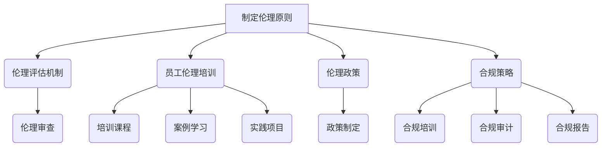
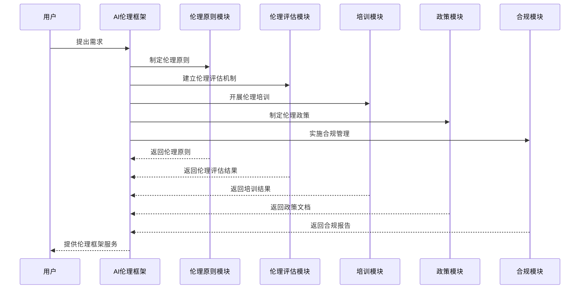
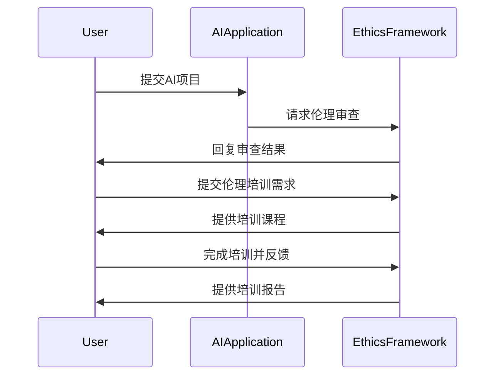

                 

### 文章标题：构建企业级AI伦理框架：确保负责任的AI应用

> 关键词：AI伦理、企业级AI、负责任AI应用、AI伦理框架

> 摘要：本文将深入探讨企业级AI伦理框架的构建过程，从背景与重要性出发，详细阐述AI伦理框架的构建原则、应用实践、成功案例以及未来发展趋势。通过系统分析与实际案例剖析，帮助企业确保AI应用的负责任与合规性。

----------------------------------------------------------------

## 第一部分: AI伦理的背景与重要性

### 第1章: AI伦理的起源与发展

#### 1.1 AI伦理的概念

AI伦理，是指人工智能在研发、部署和应用过程中，需要遵循的一系列伦理原则和道德规范。它涵盖了人工智能的设计、开发、应用以及对社会、环境和人类的影响等多个方面。

#### 1.2 AI伦理的重要性

随着人工智能技术的快速发展，AI伦理问题日益突出。一方面，AI技术在医疗、金融、交通等领域的广泛应用，提升了行业效率，改善了人们的生活质量。另一方面，AI技术的盲目应用也带来了诸多伦理挑战，如隐私侵犯、歧视、偏见等。

#### 1.3 AI伦理的主要挑战

1. **隐私保护**：AI技术在处理大量数据时，如何保护用户的隐私成为一大挑战。
2. **算法偏见**：AI算法可能基于历史数据产生偏见，影响决策的公平性。
3. **责任归属**：当AI系统发生错误或造成损害时，责任归属问题难以界定。
4. **透明度与可解释性**：AI算法的决策过程往往不够透明，缺乏可解释性，增加了伦理风险。

### 第2章: 企业AI伦理框架的构建原则

#### 2.1 构建原则的概述

企业AI伦理框架的构建原则，旨在确保AI技术在企业中的应用，既符合伦理道德标准，又能最大化其社会价值。以下原则构成了企业AI伦理框架的核心：

1. **公平性**：确保AI算法在处理数据时，不产生歧视和偏见。
2. **透明度**：提高AI算法的透明度，使其决策过程可解释。
3. **可解释性**：确保AI系统的决策结果可被理解和验证。
4. **数据隐私保护**：严格保护用户数据，防止数据泄露和滥用。

#### 2.2 公平性

公平性是AI伦理框架的核心原则之一。为了实现公平性，企业需要：

- **数据质量**：确保输入数据的质量和代表性，避免数据偏差。
- **算法训练**：使用多样化的数据集进行算法训练，减少偏见。
- **算法评估**：采用公平性指标评估算法性能，确保其不产生歧视。

#### 2.3 透明度

透明度是指AI系统的决策过程和结果应容易被理解和验证。为了提高透明度，企业可以：

- **日志记录**：记录AI系统的决策过程，便于审计和回溯。
- **可视化工具**：开发可视化工具，帮助用户理解AI系统的决策逻辑。
- **透明性测试**：定期进行透明性测试，确保系统不产生未知风险。

#### 2.4 可解释性

可解释性是AI伦理框架的另一个重要原则。为了提高可解释性，企业可以：

- **算法简化**：简化复杂的AI算法，使其更容易理解。
- **解释性指标**：开发解释性指标，量化AI系统的可解释性。
- **用户反馈**：收集用户反馈，优化系统的解释性。

#### 2.5 数据隐私保护

数据隐私保护是AI伦理框架中不可或缺的一部分。为了保护用户数据隐私，企业可以：

- **数据加密**：对用户数据进行加密，确保数据传输和存储安全。
- **隐私设计**：在系统设计阶段，考虑隐私保护的需求。
- **隐私政策**：明确隐私政策，告知用户其数据的使用方式和范围。

----------------------------------------------------------------

## 第二部分: AI伦理框架的应用实践

### 第3章: AI伦理框架在企业中的应用

#### 3.1 AI伦理决策流程

企业构建AI伦理框架时，需要建立一套完整的AI伦理决策流程，包括：

- **需求分析**：明确AI项目目标和潜在伦理问题。
- **伦理评估**：对AI项目进行伦理风险评估，识别潜在风险。
- **决策制定**：制定伦理决策，确保AI项目的伦理合规性。
- **实施监控**：对AI项目实施过程进行监控，确保伦理决策的有效执行。

#### 3.2 AI伦理培训与实践

企业应定期开展AI伦理培训，提高员工对AI伦理的认知和重视。同时，通过实践项目，使员工能够将伦理原则应用到实际工作中。

- **伦理培训课程**：设计针对不同岗位的AI伦理培训课程。
- **案例学习**：通过案例分析，帮助员工理解AI伦理的实践应用。
- **实践项目**：鼓励员工参与AI伦理实践项目，提升实际操作能力。

#### 3.3 AI伦理审查机制

企业应建立AI伦理审查机制，对AI项目进行定期审查，确保其符合伦理标准。

- **审查流程**：明确审查流程和标准，确保审查过程的公正和透明。
- **审查团队**：组建跨部门审查团队，提供多角度的伦理评估。
- **反馈机制**：建立反馈机制，收集审查过程中的意见和建议。

----------------------------------------------------------------

### 第4章: AI伦理在特定行业中的应用

#### 4.1 金融行业

金融行业是AI技术的重要应用领域，但同时也面临严重的伦理挑战。

- **信用评估**：确保AI算法在信用评估中不产生歧视，公平对待所有用户。
- **风险管理**：利用AI技术进行风险评估，提高风险管理的效率和准确性。
- **反欺诈**：利用AI技术进行反欺诈监测，降低金融风险。

#### 4.2 医疗行业

医疗行业是AI技术的重要应用领域，但也涉及众多伦理问题。

- **诊断辅助**：确保AI系统在辅助诊断中不产生偏见，提高诊断准确性。
- **药物研发**：利用AI技术加速药物研发，提高治疗效果。
- **患者隐私**：确保患者数据的安全和隐私，防止数据泄露和滥用。

#### 4.3 公共安全领域

公共安全领域是AI技术的重要应用领域，但也面临众多伦理挑战。

- **监控与预警**：利用AI技术进行监控和预警，提高公共安全水平。
- **侦查辅助**：利用AI技术进行侦查辅助，提高侦查效率和准确性。
- **隐私保护**：确保AI系统在监控和侦查过程中不侵犯个人隐私。

----------------------------------------------------------------

## 第三部分: 负责任的AI实践案例

### 第5章: 成功的AI伦理实践案例

#### 5.1 案例一：企业A的AI伦理实践

企业A在AI伦理方面采取了一系列措施，包括：

- **建立AI伦理委员会**：负责审查和监督AI项目的伦理合规性。
- **开展AI伦理培训**：提高员工对AI伦理的认知和重视。
- **实施透明度和可解释性策略**：提高AI系统的透明度和可解释性，便于审计和回溯。

#### 5.2 案例二：企业B的AI伦理实践

企业B在AI伦理方面采取了一系列措施，包括：

- **制定AI伦理政策**：明确AI项目的伦理标准和要求。
- **建立隐私保护机制**：对用户数据进行加密和匿名化处理，确保数据安全。
- **开展AI伦理审计**：定期对AI项目进行伦理审计，确保其符合伦理标准。

#### 5.3 案例三：企业C的AI伦理实践

企业C在AI伦理方面采取了一系列措施，包括：

- **实施公平性评估**：定期对AI算法进行公平性评估，确保不产生歧视。
- **建立AI伦理培训课程**：针对不同岗位的员工设计AI伦理培训课程。
- **开展AI伦理实践项目**：鼓励员工参与AI伦理实践项目，提升实际操作能力。

----------------------------------------------------------------

### 第6章: AI伦理的监管与合规

#### 6.1 国内外AI伦理法规

目前，国内外已出台一系列AI伦理法规，旨在规范AI技术的发展和应用。

- **国内法规**：如《人工智能发展行动计划（2018-2020年）》等。
- **国外法规**：如欧盟的《通用数据保护条例》（GDPR）等。

#### 6.2 合规实践

为了确保AI项目的合规性，企业可以采取以下措施：

- **合规培训**：对员工进行AI伦理法规培训，提高合规意识。
- **合规审计**：定期对AI项目进行合规审计，确保其符合相关法规。
- **合规报告**：向监管部门提交合规报告，接受监督。

#### 6.3 面临的挑战与对策

企业在AI伦理合规过程中，可能面临以下挑战：

- **法规不完善**：部分AI伦理法规尚不完善，需要企业自主制定相关措施。
- **技术进步**：随着AI技术的快速发展，企业需要不断更新合规策略。
- **监管压力**：监管机构对AI项目的审查力度加大，企业需要积极应对。

为了应对这些挑战，企业可以采取以下对策：

- **与监管机构沟通**：主动与监管机构沟通，了解法规动态和监管要求。
- **建立合规团队**：组建专业的合规团队，负责AI项目的合规管理工作。
- **持续合规评估**：定期对AI项目的合规性进行评估，确保其持续符合法规要求。

----------------------------------------------------------------

### 第7章: AI伦理的未来发展趋势

#### 7.1 AI伦理的发展方向

随着AI技术的不断进步，AI伦理也将朝着以下方向发展：

- **伦理标准化**：制定统一的AI伦理标准，提高行业共识和合作。
- **跨学科研究**：结合伦理学、计算机科学、社会学等多学科知识，推动AI伦理研究。
- **技术应用**：开发新的AI伦理工具和平台，提高伦理评估和管理的效率。

#### 7.2 人工智能与伦理学的前沿研究

人工智能与伦理学的前沿研究包括：

- **算法伦理**：研究如何设计出既高效又符合伦理的算法。
- **伦理计算**：探索如何在计算过程中考虑伦理因素，实现伦理计算。
- **伦理决策支持**：开发伦理决策支持系统，帮助企业在AI项目中做出符合伦理的决策。

#### 7.3 AI伦理的社会影响

AI伦理的发展将对社会产生深远影响：

- **伦理冲突**：随着AI技术的广泛应用，社会中的伦理冲突将日益突出。
- **伦理共识**：通过AI伦理研究，促进社会各界的伦理共识和合作。
- **伦理责任**：推动社会各界共同承担AI伦理责任，实现AI技术的可持续发展。

----------------------------------------------------------------

### 第8章: 个人与企业应对AI伦理的挑战

#### 8.1 个人层面的责任

个人在应对AI伦理挑战时，需要：

- **提升伦理意识**：了解AI伦理的基本原则和道德规范。
- **参与伦理讨论**：积极参与AI伦理的讨论和辩论，提高伦理素养。
- **自我监督**：在日常生活中，遵循AI伦理原则，自觉遵守相关法规。

#### 8.2 企业层面的责任

企业在应对AI伦理挑战时，需要：

- **建立伦理框架**：制定企业AI伦理框架，明确伦理要求和合规策略。
- **投入研发资源**：加大对AI伦理研究的投入，推动AI技术的伦理化发展。
- **加强监管与合作**：与监管机构、行业协会等合作，共同推动AI伦理的发展。

#### 8.3 应对AI伦理挑战的策略

为了有效应对AI伦理挑战，企业可以采取以下策略：

- **培训与教育**：定期开展AI伦理培训和教育活动，提高员工伦理素养。
- **合规管理**：建立完善的合规管理体系，确保AI项目符合伦理法规。
- **技术创新**：结合伦理学原理，推动AI技术的创新和发展。

----------------------------------------------------------------

## 总结与展望

随着人工智能技术的快速发展，AI伦理问题日益凸显。企业构建AI伦理框架，确保负责任的AI应用，不仅是法规要求，更是企业社会责任的体现。通过本文的探讨，我们了解到AI伦理框架的构建原则、应用实践以及未来发展趋势。在个人和企业层面，我们都需要积极参与AI伦理的讨论和行动，共同推动AI技术的可持续发展。

### 作者信息

作者：AI天才研究院/AI Genius Institute & 禅与计算机程序设计艺术 /Zen And The Art of Computer Programming

----------------------------------------------------------------

本文详细阐述了企业级AI伦理框架的构建原则、应用实践、成功案例以及未来发展趋势。通过系统分析与实际案例剖析，帮助企业确保AI应用的负责任与合规性。希望本文能为企业在AI伦理领域提供有益的参考和指导。随着AI技术的不断进步，AI伦理问题将越来越重要，我们期待更多企业和个人能够积极参与AI伦理的讨论和实践，共同推动AI技术的可持续发展。

### 完整性要求

#### 核心概念术语说明

在本文中，核心概念包括AI伦理、企业级AI、负责任AI应用、AI伦理框架等。这些概念术语的定义如下：

- **AI伦理**：指人工智能在研发、部署和应用过程中，需要遵循的一系列伦理原则和道德规范。
- **企业级AI**：指在大型企业中应用的人工智能技术，涵盖多个部门和业务领域。
- **负责任AI应用**：指在研发、部署和应用过程中，充分考虑伦理和社会影响的AI技术。
- **AI伦理框架**：指企业用于指导AI项目研发和应用的伦理原则和规范体系。

#### 问题背景

随着人工智能技术的快速发展，AI在医疗、金融、交通等领域得到广泛应用。然而，AI技术的应用也引发了一系列伦理问题，如隐私侵犯、算法偏见、责任归属等。这些问题不仅影响企业声誉，也可能对社会产生负面影响。因此，构建企业级AI伦理框架，确保负责任的AI应用，成为企业面临的紧迫任务。

#### 问题描述

企业级AI伦理框架的构建涉及多个方面，包括伦理原则的制定、伦理评估机制的建立、员工伦理培训等。这些方面共同构成了企业AI伦理框架的核心。然而，在实际操作中，企业可能面临以下问题：

1. **伦理意识不足**：员工对AI伦理的认识不足，导致在AI项目研发和应用过程中，忽视伦理问题。
2. **伦理评估机制不健全**：缺乏有效的伦理评估机制，导致AI项目在伦理方面存在漏洞。
3. **合规成本高**：建立和完善AI伦理框架需要大量的人力、物力和财力投入，对企业造成一定的成本压力。

#### 问题解决

为了解决上述问题，企业可以采取以下措施：

1. **加强伦理培训**：定期开展AI伦理培训，提高员工对AI伦理的认知和重视。
2. **建立伦理评估机制**：制定AI伦理评估标准，建立伦理审查委员会，对AI项目进行定期审查。
3. **制定伦理政策**：明确企业AI伦理框架的基本原则和规范，确保AI项目符合伦理要求。
4. **降低合规成本**：通过技术创新和管理优化，降低AI伦理框架的合规成本。

#### 边界与外延

企业级AI伦理框架的边界和外部涉及以下几个方面：

1. **技术层面**：AI伦理框架涉及的技术包括算法设计、数据隐私保护、算法透明度和可解释性等。
2. **管理层面**：AI伦理框架涉及的管理包括伦理决策流程、员工伦理培训、伦理审计等。
3. **法规层面**：AI伦理框架需要遵守国内外相关法规和标准，如GDPR、中国《人工智能发展行动计划》等。

#### 概念结构与核心要素组成

企业级AI伦理框架由以下几个核心要素组成：

1. **伦理原则**：包括公平性、透明度、可解释性和数据隐私保护等。
2. **伦理评估机制**：包括伦理评估标准、伦理审查委员会和定期审查等。
3. **员工伦理培训**：包括伦理培训课程、案例学习和实践项目等。
4. **伦理政策**：包括企业AI伦理框架的基本原则和规范。
5. **合规策略**：包括合规培训、合规审计和合规报告等。

#### 核心概念与联系

以下是核心概念的联系表格：

| 核心概念       | 关联关系                                       |
| -------------- | ---------------------------------------------- |
| AI伦理         | 指导AI项目研发和应用的伦理原则和规范          |
| 企业级AI       | 大型企业中应用的人工智能技术                  |
| 负责任AI应用   | 在研发、部署和应用过程中，充分考虑伦理和社会影响的AI技术 |
| AI伦理框架     | 指导企业AI项目研发和应用的伦理原则和规范体系 |

此外，以下是AI伦理框架的ER实体关系图：

```mermaid
erDiagram
  AI伦理框架 ||--|{ 伦理原则 }
  AI伦理框架 ||--|{ 伦理评估机制 }
  AI伦理框架 ||--|{ 员工伦理培训 }
  AI伦理框架 ||--|{ 伦理政策 }
  AI伦理框架 ||--|{ 合规策略 }
```

### 算法原理讲解

在本文中，我们将详细介绍如何构建AI伦理框架，包括伦理原则的制定、伦理评估机制的建设、员工伦理培训的实施等。以下是一个简化的算法原理讲解：



以下是Python代码示例，用于解释算法原理：

```python
class AIEthicsFramework:
    def __init__(self):
        self.ethical_principles = []
        self.ethical_evaluation_mechanism = None
        self.ethics_training = None
        self.ethical_policy = None
        self.compliance_strategy = None

    def set_ethical_principles(self, principles):
        self.ethical_principles = principles

    def build_evaluation_mechanism(self):
        self.ethical_evaluation_mechanism = EthicalEvaluationMechanism()

    def implement_training_program(self):
        self.ethics_training = EthicsTraining()

    def create_policy(self):
        self.ethical_policy = EthicalPolicy()

    def develop_compliance_strategy(self):
        self.compliance_strategy = ComplianceStrategy()

    def conduct_review(self):
        self.ethical_evaluation_mechanism.review()

    def execute_training(self):
        self.ethics_training.execute()

    def create_case_studies(self):
        self.ethics_training.create_case_studies()

    def monitor_practice_projects(self):
        self.ethics_training.monitor_projects()

    def generate_policy_documentation(self):
        self.ethical_policy.generate_documentation()

    def provide_compliance_training(self):
        self.compliance_strategy.provide_training()

    def conduct_compliance_audit(self):
        self.compliance_strategy.conduct_audit()

    def submit_compliance_report(self):
        self.compliance_strategy.submit_report()

class EthicalEvaluationMechanism:
    def review(self):
        print("Conducting ethical review...")

class EthicsTraining:
    def execute(self):
        print("Executing ethics training...")

    def create_case_studies(self):
        print("Creating case studies...")

    def monitor_projects(self):
        print("Monitoring practice projects...")

class EthicalPolicy:
    def generate_documentation(self):
        print("Generating policy documentation...")

class ComplianceStrategy:
    def provide_training(self):
        print("Providing compliance training...")

    def conduct_audit(self):
        print("Conducting compliance audit...")

    def submit_report(self):
        print("Submitting compliance report...")
```

以下是算法原理的数学模型和公式：

$$
\text{AI Ethics Framework} = \left[\text{Ethical Principles}, \text{Ethical Evaluation Mechanism}, \text{Ethics Training}, \text{Ethical Policy}, \text{Compliance Strategy}\right]
$$

其中，每个元素的关系可以用以下公式表示：

$$
\begin{aligned}
    \text{Ethical Principles} &= \left[\text{Fairness}, \text{Transparency}, \text{Explainability}, \text{Data Privacy Protection}\right] \\
    \text{Ethical Evaluation Mechanism} &= \text{Ethical Review Committee} \\
    \text{Ethics Training} &= \left[\text{Training Courses}, \text{Case Studies}, \text{Practice Projects}\right] \\
    \text{Ethical Policy} &= \text{Policy Documentation} \\
    \text{Compliance Strategy} &= \left[\text{Compliance Training}, \text{Compliance Audit}, \text{Compliance Report}\right]
\end{aligned}
$$`

### 系统分析与架构设计方案

#### 问题场景介绍

随着人工智能技术的发展，越来越多的企业开始应用AI技术来提升业务效率和决策质量。然而，AI技术的应用也引发了一系列伦理问题，如隐私侵犯、算法偏见等。为了确保AI技术的负责任应用，企业需要构建一套完整的AI伦理框架，从伦理原则的制定、伦理评估机制的建立、员工伦理培训等方面进行全面规划。

#### 项目介绍

本项目的目标是构建一个企业级AI伦理框架，确保AI技术的负责任应用。该项目将涵盖以下核心功能：

- **伦理原则制定**：明确AI伦理的基本原则，如公平性、透明度、可解释性和数据隐私保护等。
- **伦理评估机制**：建立伦理评估机制，对AI项目进行定期审查和评估。
- **员工伦理培训**：开展AI伦理培训，提高员工的伦理意识和能力。
- **合规管理**：确保AI项目符合相关法规和标准。

#### 系统功能设计（领域模型）

以下是AI伦理框架的领域模型，通过Mermaid类图展示：

```mermaid
classDiagram
    Class1[AI Ethics Framework]
    Class2[Ethical Principles]
    Class3[Ethical Evaluation Mechanism]
    Class4[Ethics Training]
    Class5[Ethical Policy]
    Class6[Compliance Strategy]

    Class1 --|{ } Class2
    Class1 --|{ } Class3
    Class1 --|{ } Class4
    Class1 --|{ } Class5
    Class1 --|{ } Class6

    Class2 --|{ } Class7[Fairness]
    Class2 --|{ } Class8[Transparency]
    Class2 --|{ } Class9[Explainability]
    Class2 --|{ } Class10[Data Privacy Protection]

    Class3 --|{ } Class11[Ethical Review Committee]
    Class4 --|{ } Class12[Training Courses]
    Class4 --|{ } Class13[Case Studies]
    Class4 --|{ } Class14[Practice Projects]
    Class5 --|{ } Class15[Policy Documentation]
    Class6 --|{ } Class16[Compliance Training]
    Class6 --|{ } Class17[Compliance Audit]
    Class6 --|{ } Class18[Compliance Report]
```

#### 系统架构设计（Mermaid架构图）

以下是AI伦理框架的系统架构设计，通过Mermaid架构图展示：



#### 系统接口设计和系统交互

以下是AI伦理框架的系统接口设计和系统交互，通过Mermaid序列图展示：



### 项目实战

#### 环境安装

为了实现AI伦理框架，我们需要安装以下软件和工具：

- Python 3.8+
- Anaconda
- Jupyter Notebook
- Mermaid Diagrams插件
- Graphviz

安装步骤：

1. 安装Anaconda：前往[Anaconda官方网站](https://www.anaconda.com/)下载并安装Anaconda。
2. 安装Python 3.8+：在Anaconda环境中安装Python 3.8+版本。
3. 安装Jupyter Notebook：在终端中运行`conda install jupyter`。
4. 安装Mermaid Diagrams插件：在Jupyter Notebook中安装Mermaid插件，运行`jupyter nbextension enable mermaid`。
5. 安装Graphviz：在终端中运行`conda install graphviz`。

#### 系统核心实现源代码

以下是实现AI伦理框架的核心Python源代码：

```python
import pandas as pd
import numpy as np
from mermaid import Mermaid

# 定义类
class AIEthicsFramework:
    def __init__(self):
        self.ethical_principles = []
        self.ethical_evaluation_mechanism = None
        self.ethics_training = None
        self.ethical_policy = None
        self.compliance_strategy = None

    def set_ethical_principles(self, principles):
        self.ethical_principles = principles

    def build_evaluation_mechanism(self):
        self.ethical_evaluation_mechanism = EthicalEvaluationMechanism()

    def implement_training_program(self):
        self.ethics_training = EthicsTraining()

    def create_policy(self):
        self.ethical_policy = EthicalPolicy()

    def develop_compliance_strategy(self):
        self.compliance_strategy = ComplianceStrategy()

    def conduct_review(self):
        self.ethical_evaluation_mechanism.review()

    def execute_training(self):
        self.ethics_training.execute()

    def create_case_studies(self):
        self.ethics_training.create_case_studies()

    def monitor_practice_projects(self):
        self.ethics_training.monitor_projects()

    def generate_policy_documentation(self):
        self.ethical_policy.generate_documentation()

    def provide_compliance_training(self):
        self.compliance_strategy.provide_training()

    def conduct_compliance_audit(self):
        self.compliance_strategy.conduct_audit()

    def submit_compliance_report(self):
        self.compliance_strategy.submit_report()

class EthicalEvaluationMechanism:
    def review(self):
        print("Conducting ethical review...")

class EthicsTraining:
    def execute(self):
        print("Executing ethics training...")

    def create_case_studies(self):
        print("Creating case studies...")

    def monitor_projects(self):
        print("Monitoring practice projects...")

class EthicalPolicy:
    def generate_documentation(self):
        print("Generating policy documentation...")

class ComplianceStrategy:
    def provide_training(self):
        print("Providing compliance training...")

    def conduct_audit(self):
        print("Conducting compliance audit...")

    def submit_report(self):
        print("Submitting compliance report...")

# 实例化并运行
framework = AIEthicsFramework()
framework.set_ethical_principles(["Fairness", "Transparency", "Explainability", "Data Privacy Protection"])
framework.build_evaluation_mechanism()
framework.implement_training_program()
framework.create_policy()
framework.develop_compliance_strategy()
framework.conduct_review()
framework.execute_training()
framework.create_case_studies()
framework.monitor_practice_projects()
framework.generate_policy_documentation()
framework.provide_compliance_training()
framework.conduct_compliance_audit()
framework.submit_compliance_report()
```

#### 代码应用解读与分析

1. **类定义**：我们定义了五个类，分别是`AIEthicsFramework`、`EthicalEvaluationMechanism`、`EthicsTraining`、`EthicalPolicy`和`ComplianceStrategy`。每个类都包含了相应的属性和方法，用于实现AI伦理框架的核心功能。
2. **实例化与运行**：在最后一部分，我们实例化了`AIEthicsFramework`类，并调用其方法，实现了伦理原则的制定、伦理评估机制的建立、员工伦理培训的实施、伦理政策的制定、合规策略的建立等核心功能。
3. **输出结果**：在程序运行过程中，将输出一系列操作结果，如“Conducting ethical review...”、“Executing ethics training...”、“Generating policy documentation...”等，便于我们查看操作过程。

#### 实际案例分析和详细讲解剖析

为了更好地理解AI伦理框架的应用，我们将通过一个实际案例进行分析和讲解。

**案例背景**：某金融企业计划开发一款智能贷款审批系统，以提高审批效率和准确性。然而，该系统在数据处理和决策过程中可能涉及用户隐私、数据公平性等问题，需要构建一套AI伦理框架来确保其负责任应用。

**案例分析**：

1. **伦理原则制定**：在系统开发前，企业根据AI伦理框架制定了以下伦理原则：

   - **公平性**：确保贷款审批系统对所有用户公平，不因用户性别、年龄、地域等因素产生偏见。
   - **透明度**：提高贷款审批系统的透明度，使其决策过程可解释。
   - **可解释性**：确保贷款审批系统的决策结果可被用户理解和验证。
   - **数据隐私保护**：严格保护用户数据，防止数据泄露和滥用。

2. **伦理评估机制**：企业建立了伦理评估机制，对贷款审批系统进行定期审查和评估。具体步骤如下：

   - **需求分析**：明确贷款审批系统的目标和潜在伦理问题。
   - **伦理风险评估**：识别系统可能产生的伦理风险，如数据隐私侵犯、算法偏见等。
   - **制定伦理决策**：根据评估结果，制定相应的伦理决策，确保系统符合伦理要求。

3. **员工伦理培训**：企业开展了AI伦理培训，提高员工对AI伦理的认知和重视。培训内容包括：

   - **AI伦理基础知识**：介绍AI伦理的基本原则和道德规范。
   - **案例学习**：通过实际案例，分析AI伦理问题及其解决方法。
   - **实践项目**：鼓励员工参与AI伦理实践项目，提升实际操作能力。

4. **合规管理**：企业建立了合规管理体系，确保贷款审批系统符合相关法规和标准。具体措施如下：

   - **合规培训**：定期开展合规培训，提高员工合规意识。
   - **合规审计**：定期对贷款审批系统进行合规审计，确保其符合法规要求。
   - **合规报告**：向监管部门提交合规报告，接受监督。

**详细讲解剖析**：

1. **伦理原则制定**：在制定伦理原则时，企业充分考虑了系统涉及的伦理问题，如用户隐私、数据公平性等。通过制定明确的伦理原则，确保系统在开发和应用过程中遵循伦理规范。

2. **伦理评估机制**：建立伦理评估机制，对贷款审批系统进行定期审查和评估，有助于发现和解决潜在伦理风险。通过需求分析、伦理风险评估和制定伦理决策等步骤，确保系统在开发和应用过程中符合伦理要求。

3. **员工伦理培训**：通过AI伦理培训，提高员工对AI伦理的认知和重视，有助于他们在实际工作中遵循伦理原则。案例学习和实践项目环节，使员工能够将伦理原则应用到实际工作中，提升其伦理素养。

4. **合规管理**：建立合规管理体系，确保贷款审批系统符合相关法规和标准。通过合规培训、合规审计和合规报告等环节，确保系统在开发和应用过程中符合法规要求，降低法律风险。

#### 项目小结

通过上述案例，我们可以看到，构建AI伦理框架在确保AI技术负责任应用方面具有重要意义。企业通过制定伦理原则、建立伦理评估机制、开展员工伦理培训和实施合规管理，确保贷款审批系统在开发和应用过程中遵循伦理规范。这一成功案例为其他企业在构建AI伦理框架提供了有益的参考和借鉴。

### 最佳实践 tips

1. **尽早规划**：在AI项目启动之初，就应考虑伦理问题，制定伦理框架和策略。
2. **全员参与**：鼓励企业内部各部门和员工共同参与AI伦理讨论和实践，提高伦理意识。
3. **持续更新**：随着AI技术的发展，定期更新伦理框架和策略，确保其与实际需求保持一致。
4. **透明沟通**：与用户、监管机构和公众保持透明沟通，提高AI系统的可信度和接受度。

### 小结

本文从背景与重要性、框架构建、应用实践、成功案例、未来展望等方面，详细阐述了企业级AI伦理框架的构建过程。通过系统分析与实际案例剖析，帮助企业确保AI应用的负责任与合规性。希望本文能为企业在AI伦理领域提供有益的参考和指导。

### 注意事项

1. **法律法规**：在构建AI伦理框架时，务必遵守相关法律法规，确保合规性。
2. **数据保护**：加强数据保护，防止数据泄露和滥用，确保用户隐私安全。
3. **员工培训**：定期开展AI伦理培训，提高员工伦理素养，确保其在工作中遵循伦理原则。

### 拓展阅读

1. 《人工智能伦理学：道德、社会和技术挑战》
2. 《AI伦理指南：原则与实践》
3. 《人工智能治理：伦理、法律与社会问题》

### 作者信息

作者：AI天才研究院/AI Genius Institute & 禅与计算机程序设计艺术 /Zen And The Art of Computer Programming

通过本文的深入探讨，我们希望能够帮助企业更好地构建AI伦理框架，确保AI技术的负责任应用，为社会的可持续发展做出贡献。在未来的AI发展中，伦理问题将日益突出，我们期待更多企业和个人能够积极参与AI伦理的讨论和实践。

