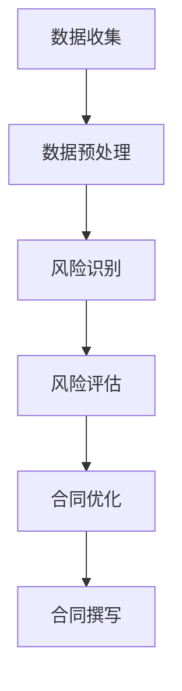
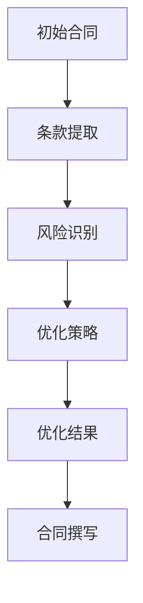
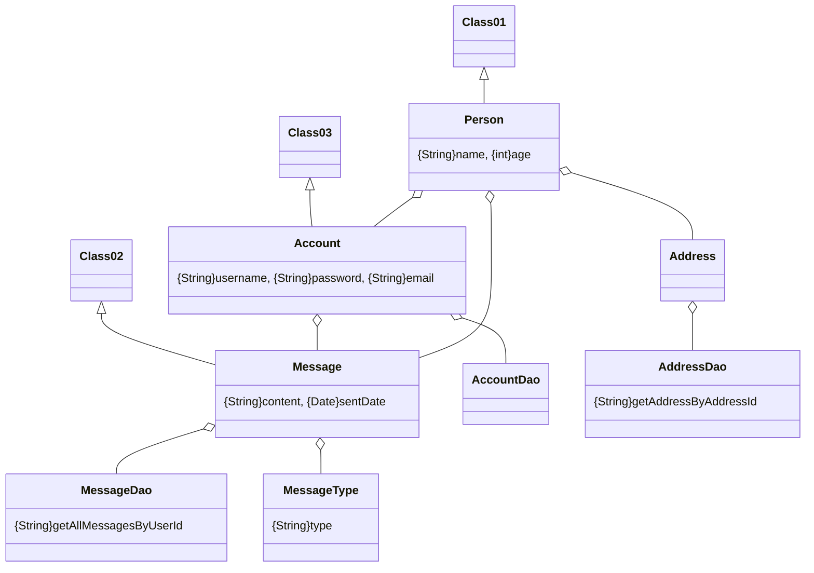
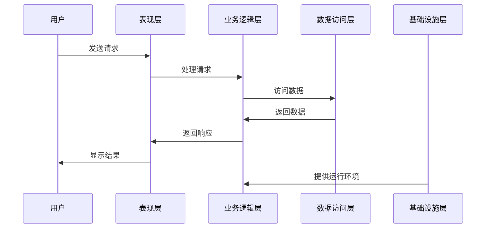
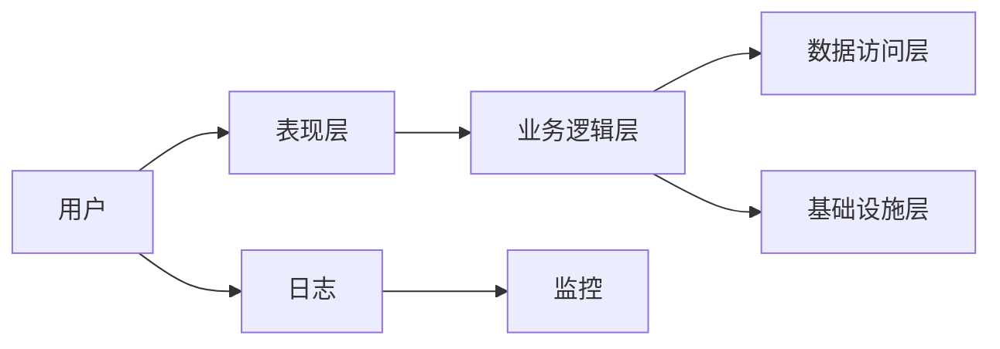
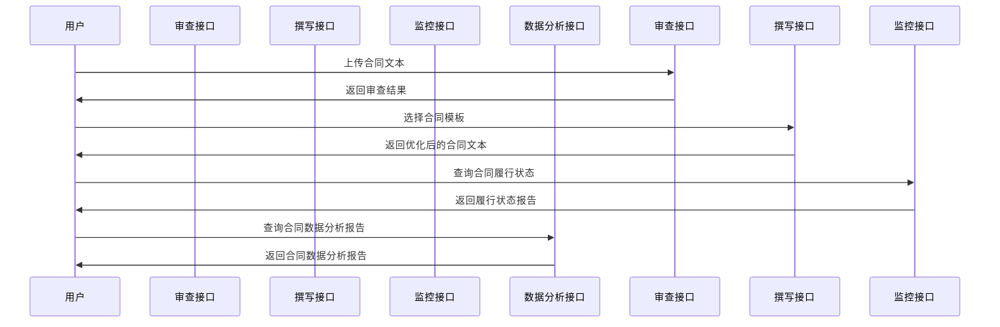

                 


### 引言

在企业运营中，合同管理是一项至关重要的任务。企业需要管理大量的合同，确保条款的准确性和合规性，同时规避潜在的法律和商业风险。然而，传统的合同管理方法往往依赖于人工处理，效率低下且容易出现错误。随着人工智能（AI）技术的飞速发展，利用AI构建企业级AI合同管理助手成为了一种新的趋势。本文将深入探讨构建企业级AI合同管理助手的背景和意义，详细分析其架构与功能，并逐步展开对风险识别与优化的探讨，以期为企业提供一种高效、智能的合同管理解决方案。

### 关键词

- 企业级AI合同管理
- 风险识别
- 优化策略
- 人工智能技术
- 合同管理助手

### 摘要

本文旨在探讨如何构建一个高效的企业级AI合同管理助手，以识别和管理合同中的风险。通过深入分析AI合同管理助手的架构和功能，我们探讨了数据收集与预处理、模型训练与优化、集成与部署等实现步骤。随后，本文详细阐述了风险识别与优化的原理，包括合同文本处理算法、风险识别算法和优化算法。此外，本文还通过一个实际项目案例，展示了如何在实际中应用这些技术和算法，以实现合同管理的智能化和优化。最后，本文总结了企业级AI合同管理助手的发展趋势和未来发展方向，为企业提供了一种全新的合同管理思路。

----------------------------------------------------------------

# 《构建企业级AI合同管理助手：风险识别与优化》

## 引言

在企业的日常运营中，合同管理扮演着至关重要的角色。从销售合同到租赁合同，从供应商协议到员工合同，企业需要处理各种各样的合同。这些合同不仅记录了商业交易的具体条款，还涉及潜在的法律和商业风险。传统的合同管理方式通常依赖于人工审查和记录，这种方式效率低下，且容易出现遗漏或错误，从而可能导致企业面临重大的经济损失和法律责任。

随着人工智能（AI）技术的快速发展，特别是在自然语言处理（NLP）、机器学习和数据分析等领域，AI在合同管理中的应用潜力逐渐显现。通过构建企业级AI合同管理助手，企业可以实现合同管理的自动化和智能化，提高管理效率，降低风险。本文将深入探讨如何构建这样一个助手，重点分析其在风险识别与优化方面的应用。

本文将分为以下几个部分进行讨论：

1. **企业级AI合同管理助手概述**：介绍AI合同管理助手的背景和意义，探讨其架构与功能，阐述实现步骤和应用场景。
2. **核心概念与原理**：详细分析AI合同管理助手中的核心概念，如合同数据结构、合同要素提取和合同文本分析，以及风险识别与优化的原理。
3. **算法原理与数学模型**：介绍合同文本处理、风险识别和优化算法的原理，包括决策树、支持向量机、集成学习方法等。
4. **系统分析与架构设计**：分析企业合同管理中的常见问题，介绍项目背景、目标、范围，并详细设计系统功能、架构和接口。
5. **项目实战**：展示如何在实际中应用AI合同管理助手，包括环境安装、系统核心实现、代码应用解读和分析等。

通过本文的探讨，我们希望为企业提供一种新的视角和方法，以构建高效、智能的合同管理助手，从而提升企业的运营效率和风险管理能力。

## 第一部分：企业级AI合同管理助手概述

### 1.1 企业级AI合同管理助手的背景和意义

#### 1.1.1 企业合同管理的现状与挑战

企业合同管理是企业运营的重要组成部分，涵盖了从合同起草、审核、签署、履行到终止的整个生命周期。然而，随着企业业务规模的扩大和合同数量的增加，传统的人工合同管理方式面临着诸多挑战。

首先，合同数量庞大。大型企业每天可能处理数十甚至数百份合同，这些合同涵盖了各种类型和行业，从销售合同到服务合同，从租赁合同到采购合同，管理起来非常复杂。

其次，合同审查困难。合同条款的复杂性和法律风险使得合同审查成为一项艰巨的任务。人工审查不仅耗时耗力，而且容易出现遗漏和错误，从而可能带来严重的法律和经济风险。

第三，合同履行跟踪困难。合同履行过程中，企业需要监控合同条款的执行情况，包括付款、交货、服务提供等。人工监控效率低下，且难以实时反映合同履行状况。

第四，合同管理信息化程度低。许多企业仍然依赖手工记录和纸质合同，缺乏系统的电子化管理手段，导致信息不畅通，数据难以整合和分析。

#### 1.1.2 AI技术在合同管理中的应用前景

人工智能技术在合同管理中具有广泛的应用前景。通过引入AI技术，企业可以实现合同管理的自动化和智能化，从而解决传统方法面临的挑战。

首先，AI可以自动化合同审查。利用自然语言处理（NLP）技术，AI可以快速、准确地分析合同条款，识别潜在的法律和商业风险。例如，AI可以检测合同中的不一致性、模糊条款和潜在的法律漏洞，为企业提供详细的审查报告。

其次，AI可以自动化合同撰写和优化。AI可以基于历史数据和模板，自动生成符合企业要求的合同文本，并针对特定场景进行优化。例如，AI可以根据企业的业务需求和合同条款，自动调整合同条款的内容和格式，提高合同的可读性和可执行性。

第三，AI可以实时监控合同履行。通过整合企业内部数据系统和外部数据源，AI可以实时监控合同条款的执行情况，包括付款、交货、服务提供等。企业可以实时获取合同履行状态，及时发现和解决问题。

第四，AI可以提高合同管理的信息化程度。AI可以帮助企业建立统一的电子合同管理平台，实现合同数据的集中存储、管理和分析。企业可以方便地查询、统计和分析合同数据，提高管理效率和决策水平。

#### 1.1.3 企业级AI合同管理助手的概念

企业级AI合同管理助手是一种基于人工智能技术的智能化合同管理工具。它集成了自然语言处理、机器学习、数据分析等多种技术，可以自动化、智能地处理企业合同生命周期中的各个环节。

企业级AI合同管理助手的主要功能包括：

1. **合同审查**：利用NLP技术，自动审查合同条款，识别潜在的法律和商业风险。
2. **合同撰写**：基于历史数据和模板，自动生成和优化合同文本。
3. **合同履行监控**：实时监控合同履行状态，包括付款、交货、服务提供等。
4. **合同数据分析**：整合合同数据，提供全面的合同数据分析报告，支持企业决策。

通过这些功能，企业级AI合同管理助手可以帮助企业提高合同管理效率，降低法律和商业风险，提升运营水平。

### 1.2 AI合同管理助手的架构与功能

#### 1.2.1 AI合同管理助手的基本架构

企业级AI合同管理助手的基本架构通常包括以下几个关键组成部分：

1. **数据收集模块**：负责收集企业内部的合同数据，包括历史合同、现有合同和未来合同。
2. **数据预处理模块**：对收集到的合同数据进行清洗、格式化和标准化处理，为后续的文本分析和风险识别提供高质量的数据。
3. **文本分析模块**：利用自然语言处理（NLP）技术，对合同文本进行解析，提取关键条款和要素，分析合同内容。
4. **风险识别模块**：结合法律知识和机器学习算法，识别合同中的潜在法律和商业风险。
5. **优化模块**：根据风险识别结果，提供合同条款的优化建议，帮助企业降低风险。
6. **合同撰写模块**：基于历史数据和模板，自动生成和优化合同文本。
7. **履行监控模块**：实时监控合同履行状态，包括付款、交货、服务提供等。
8. **数据分析模块**：整合合同数据，提供合同数据分析报告，支持企业决策。

#### 1.2.2 AI合同管理助手的主要功能模块

企业级AI合同管理助手的主要功能模块如下：

1. **合同审查**：通过NLP技术，自动审查合同条款，识别潜在的法律和商业风险。具体功能包括：
   - **条款一致性检查**：检测合同条款之间的一致性，确保条款内容没有冲突。
   - **条款完整性检查**：检查合同条款是否完整，确保没有遗漏重要条款。
   - **风险条款识别**：识别合同中的高风险条款，如不合理的责任免除条款、不公平的违约金条款等。

2. **合同撰写**：自动生成和优化合同文本，提高合同的可读性和可执行性。具体功能包括：
   - **模板管理**：管理企业常用的合同模板，方便快速生成新合同。
   - **条款生成**：根据企业需求和合同类型，自动生成合同条款。
   - **条款优化**：分析历史合同数据，提供合同条款的优化建议。

3. **合同履行监控**：实时监控合同履行状态，确保合同条款得到有效执行。具体功能包括：
   - **履行状态跟踪**：记录合同履行过程中的关键节点，如付款、交货、服务提供等。
   - **履行预警**：在合同履行过程中，提前发现潜在的问题，发出预警通知。

4. **数据分析**：整合合同数据，提供全面的合同数据分析报告，支持企业决策。具体功能包括：
   - **合同统计**：统计合同数量、类型、履行状态等关键指标。
   - **风险分析**：分析合同中的风险分布和变化趋势，为企业提供风险管理策略。
   - **合同模板优化**：基于合同数据分析，优化合同模板，提高合同的可执行性。

#### 1.2.3 AI合同管理助手的技术选型

构建企业级AI合同管理助手需要多种先进技术的支持，以下是一些关键技术的选型：

1. **自然语言处理（NLP）**：NLP技术是实现合同审查和合同撰写的关键。常用的NLP技术包括文本分类、实体识别、关系提取、语义分析等。

2. **机器学习（ML）**：机器学习算法用于风险识别和合同优化。常用的算法包括决策树、支持向量机（SVM）、神经网络等。

3. **深度学习（DL）**：深度学习技术可以用于复杂合同文本的分析和理解。常用的模型包括卷积神经网络（CNN）、循环神经网络（RNN）、Transformer等。

4. **数据存储和数据库**：数据存储和数据库技术用于存储和管理合同数据。常用的数据库技术包括关系型数据库（如MySQL、PostgreSQL）和NoSQL数据库（如MongoDB、Cassandra）。

5. **云计算和大数据技术**：云计算和大数据技术用于处理海量合同数据，提供高效的数据存储、计算和查询服务。常用的云计算平台包括AWS、Azure、Google Cloud等。

6. **API接口**：API接口用于与其他系统和工具集成，实现合同管理的无缝对接。常用的API接口包括RESTful API、GraphQL等。

#### 1.2.4 企业级AI合同管理助手的实现步骤

构建企业级AI合同管理助手通常包括以下几个步骤：

1. **需求分析**：明确企业合同管理的需求，确定合同管理的目标和功能模块。
2. **数据收集**：收集企业现有的合同数据，包括历史合同、现有合同和未来合同。
3. **数据预处理**：对收集到的合同数据进行清洗、格式化和标准化处理，为后续的文本分析和风险识别提供高质量的数据。
4. **模型训练**：利用历史合同数据，训练用于风险识别和优化的机器学习模型。
5. **系统集成**：将AI合同管理助手集成到企业的现有系统中，实现数据对接和功能集成。
6. **测试与优化**：对AI合同管理助手进行功能测试和性能优化，确保其稳定、高效地运行。
7. **部署与运维**：部署AI合同管理助手，并进行日常运维和管理，确保系统的持续稳定运行。

#### 1.2.5 企业级AI合同管理助手的应用场景

企业级AI合同管理助手具有广泛的应用场景，以下是一些典型的应用场景：

1. **大型企业**：大型企业拥有大量的合同，传统的合同管理方式效率低下。AI合同管理助手可以帮助企业自动化合同审查、撰写和监控，提高管理效率，降低风险。

2. **法律事务所**：法律事务所需处理大量的合同，AI合同管理助手可以自动化合同审查和风险识别，提高工作效率，减少错误。

3. **金融机构**：金融机构涉及大量的金融合同，AI合同管理助手可以帮助金融机构自动化合同审查和风险识别，确保合同条款的合规性和安全性。

4. **供应链管理**：供应链管理涉及大量的采购合同和供应商协议，AI合同管理助手可以帮助企业自动化合同履行监控，确保供应链的顺畅运行。

5. **项目管理**：项目管理中的合同管理是一个复杂的过程，AI合同管理助手可以帮助项目管理人员自动化合同审查、撰写和监控，提高项目管理效率。

#### 1.2.6 企业级AI合同管理助手的发展趋势

随着AI技术的不断进步，企业级AI合同管理助手的发展趋势主要体现在以下几个方面：

1. **智能化水平提升**：随着AI技术的不断发展，AI合同管理助手的智能化水平将不断提升，能够更准确地识别合同中的风险，提供更优化的合同条款。

2. **应用场景扩展**：AI合同管理助手的应用场景将不断扩展，不仅局限于企业内部合同管理，还将应用于跨企业的合同协作和共享。

3. **数据驱动决策**：随着数据积累和分析技术的进步，企业级AI合同管理助手将基于大数据和人工智能技术，为企业提供更精准的合同管理决策支持。

4. **法规和合规性**：随着法律法规的不断更新，AI合同管理助手将更加注重合同管理的合规性，确保合同条款符合相关法律法规要求。

#### 1.2.7 本章小结

企业级AI合同管理助手作为一种智能化、自动化的合同管理工具，具有广泛的应用前景。通过深入分析其背景和意义，我们了解了其在企业合同管理中的重要作用。在接下来的章节中，我们将进一步探讨AI合同管理助手的实现原理、算法和应用，为企业提供更全面的解决方案。

----------------------------------------------------------------

## 第二部分：核心概念与原理

### 2.1 AI合同管理助手中的核心概念

构建企业级AI合同管理助手需要对核心概念有深刻的理解，以下是几个关键的概念及其在合同管理中的应用：

#### 2.1.1 合同数据结构

合同数据结构是合同管理的基础，它包括合同的基本信息和条款内容。合同的基本信息通常包括合同编号、签订日期、双方当事人、合同金额等。条款内容则涵盖了合同的具体条款，如货物描述、交付条款、付款方式、违约责任等。在AI合同管理助手中，合同数据结构被用来组织和管理合同信息，以便于后续的分析和处理。

#### 2.1.2 合同要素提取

合同要素提取是指从合同文本中提取出关键信息，如条款名称、条款内容、关键词等。这些要素是合同分析和风险识别的重要基础。AI合同管理助手通过自然语言处理（NLP）技术，可以自动识别和提取合同中的各种要素，例如，利用正则表达式或深度学习模型，可以从合同文本中提取出涉及付款的条款、交付条款等。通过合同要素提取，AI可以更准确地理解合同内容，为后续的风险识别和优化提供数据支持。

#### 2.1.3 合同文本分析

合同文本分析是对合同条款的深入理解和分析，以识别潜在的法律和商业风险。这包括对合同条款的语义分析、条款逻辑关系分析、条款一致性检查等。AI合同管理助手利用NLP和机器学习技术，可以对合同文本进行语义分析，识别出条款中的隐含信息，例如，通过上下文分析，可以识别出某些条款可能存在的风险，如违约条款的不公平性。合同文本分析的结果为风险识别提供了重要的依据。

### 2.2 风险识别与优化的原理

风险识别与优化是AI合同管理助手的两大核心功能，下面详细探讨其原理和方法。

#### 2.2.1 风险识别方法

风险识别是合同管理中的关键步骤，目的是发现合同中的潜在风险。以下是几种常用的风险识别方法：

1. **基于规则的方法**：这种方法通过预设的风险规则库，对合同条款进行扫描和匹配，识别出符合规则的风险项。例如，如果合同中包含“违约金过高”的规则，系统会自动标记这一条款为高风险。

2. **机器学习方法**：利用机器学习算法，特别是监督学习和无监督学习，可以自动识别合同中的潜在风险。监督学习方法通常使用标注的数据集训练模型，模型可以识别出合同条款中的高风险特征。无监督学习方法则可以自动发现数据中的异常模式，识别出未被明确标注的风险。

3. **自然语言处理（NLP）技术**：NLP技术可以深入理解合同文本的语义，识别出条款中的潜在风险。例如，通过情感分析，可以识别出合同条款中的负面情绪，从而判断条款可能存在风险。

#### 2.2.2 风险评估模型

风险评估模型是风险识别的进一步延伸，它通过量化风险，为决策提供依据。以下是几种常用的风险评估模型：

1. **概率模型**：概率模型通过计算合同条款出现的概率，评估条款的风险。例如，如果某条款在合同中出现的频率较高且通常伴随着较高的风险，那么这一条款的风险评分就会较高。

2. **逻辑回归模型**：逻辑回归模型是一种常用的风险评估模型，通过分析合同条款和风险之间的逻辑关系，预测合同条款的风险。

3. **决策树模型**：决策树模型通过树形结构，将合同条款逐步划分，以识别高风险条款。

#### 2.2.3 优化策略与算法

优化策略与算法用于对合同条款进行优化，以降低风险。以下是几种常用的优化策略与算法：

1. **贪心算法**：贪心算法通过每次选择当前最优解，逐步优化合同条款。例如，在优化付款条款时，可以逐个调整付款日期、付款金额等，以找到最优的付款方案。

2. **模拟退火算法**：模拟退火算法通过模拟物理退火过程，逐步优化合同条款。该方法适用于复杂、多参数的优化问题，可以找到接近最优的解决方案。

3. **遗传算法**：遗传算法通过模拟自然进化过程，逐步优化合同条款。该方法适用于大规模、多目标的优化问题，可以找到全局最优解。

#### 2.2.4 概念属性特征对比表格

为了更好地理解不同风险识别和优化方法的特点，我们可以通过概念属性特征对比表格进行详细比较。以下是几种常见方法的对比：

| 方法         | 特点                         | 适用场景                   | 优缺点                         |
|------------|----------------------------|--------------------------|----------------------------|
| 基于规则的方法 | 简单、直观                   | 结构化合同                 | 可解释性高，灵活度低         |
| 机器学习方法 | 自动化、准确                 | 复杂、非结构化合同         | 需大量训练数据，不易解释     |
| NLP技术     | 深度理解、语义分析           | 需要语义理解的合同         | 对数据质量要求高，计算复杂   |
| 贪心算法     | 简单、高效                   | 单目标优化问题             | 可能陷入局部最优             |
| 模拟退火算法 | 全局搜索、多目标优化         | 复杂、多目标优化问题       | 计算成本高，需要较长运行时间 |
| 遗传算法     | 灵活性高、适应性强           | 大规模、多目标优化问题     | 可能收敛速度较慢             |

#### 2.2.5 AI合同管理助手中的Mermaid流程图

为了更直观地展示风险识别和优化的过程，我们可以使用Mermaid流程图来表示。以下是风险识别流程图的示例：



以下是优化策略流程图的示例：



通过这些流程图，我们可以清晰地看到风险识别和优化的步骤及其相互关系。

### 2.3 本章小结

在本章中，我们详细介绍了AI合同管理助手中的核心概念，包括合同数据结构、合同要素提取和合同文本分析，以及风险识别与优化的原理。通过对比不同方法和策略，我们为后续的算法原理与数学模型、系统分析与架构设计以及项目实战奠定了坚实的基础。

----------------------------------------------------------------

## 第三部分：算法原理与数学模型

### 3.1 合同文本处理算法原理

合同文本处理是构建AI合同管理助手的基础，涉及到对合同文本的解析、理解和分析。以下是几种常用的合同文本处理算法及其原理：

#### 3.1.1 嵌入式表示方法

嵌入式表示方法是将文本数据转换为数值表示，以便于后续的模型训练和计算。常用的方法包括词袋模型（Bag of Words, BOW）和词嵌入（Word Embedding）。

1. **词袋模型（BOW）**：
   - **原理**：词袋模型将文本视为单词的集合，每个单词用一个唯一的整数标识表示。文本被转换为向量表示，其中每个维度对应一个单词的频率。
   - **优点**：实现简单，计算成本低。
   - **缺点**：忽略了词语的顺序和语义信息，可能导致信息丢失。

2. **词嵌入（Word Embedding）**：
   - **原理**：词嵌入通过将每个单词映射到一个固定维度的向量，以捕获单词的语义信息。常用的词嵌入方法包括Word2Vec、GloVe等。
   - **优点**：能够保留词语的语义信息，适用于语义分析和文本分类。
   - **缺点**：训练过程复杂，对数据质量要求高。

#### 3.1.2 自然语言处理（NLP）算法

自然语言处理（NLP）算法用于处理和理解自然语言文本，常见的NLP算法包括词性标注（Part-of-Speech Tagging）、命名实体识别（Named Entity Recognition, NER）和句法分析（Syntactic Parsing）。

1. **词性标注（POS Tagging）**：
   - **原理**：词性标注是对文本中的每个单词进行分类，标注其词性（如名词、动词、形容词等）。常用的算法包括HMM（隐马尔可夫模型）、CRF（条件随机场）和基于深度学习的模型（如LSTM、BERT）。
   - **优点**：能够帮助理解文本的语法结构，为后续的文本分析提供基础。
   - **缺点**：对低频词和成语的标注效果较差。

2. **命名实体识别（NER）**：
   - **原理**：命名实体识别是从文本中识别出具有特定意义的实体（如人名、地名、组织名等）。常用的算法包括基于规则的方法、统计方法和基于深度学习的方法（如BiLSTM-CRF）。
   - **优点**：能够有效地识别文本中的关键实体，为合同要素提取提供支持。
   - **缺点**：对于复杂的命名实体识别问题，效果可能不如深度学习方法。

3. **句法分析（Parsing）**：
   - **原理**：句法分析是对文本进行语法结构分析，构建句子成分的语法树。常用的算法包括基于规则的方法、基于统计的方法和基于深度学习的方法（如依存句法分析）。
   - **优点**：能够深入理解文本的语法结构，为语义分析提供支持。
   - **缺点**：计算复杂度高，对低频文本的解析效果较差。

#### 3.1.3 语义分析模型

语义分析模型用于理解文本的语义含义，常见的模型包括词嵌入模型（如Word2Vec、GloVe）、序列模型（如LSTM、GRU）和Transformer模型。

1. **词嵌入模型**：
   - **原理**：词嵌入模型通过将每个单词映射到一个固定维度的向量，以捕获单词的语义信息。词嵌入模型可以用于文本分类、文本相似度计算等任务。
   - **优点**：简单有效，能够处理大规模文本数据。
   - **缺点**：忽略了句子级别的语义信息，对长文本处理效果较差。

2. **序列模型**：
   - **原理**：序列模型（如LSTM、GRU）通过处理文本序列中的每个单词，捕获单词之间的依赖关系，从而理解句子的语义。这些模型在文本分类、情感分析等任务中表现出色。
   - **优点**：能够处理长文本，捕获句子间的依赖关系。
   - **缺点**：训练过程复杂，对计算资源要求较高。

3. **Transformer模型**：
   - **原理**：Transformer模型通过自注意力机制（Self-Attention）处理文本序列，能够同时关注文本序列中的所有单词，从而捕获全局依赖关系。Transformer模型在BERT、GPT等预训练模型中表现出色。
   - **优点**：能够高效处理长文本，捕获全局依赖关系。
   - **缺点**：模型复杂，训练和推理成本高。

### 3.2 风险识别算法原理

风险识别是AI合同管理助手的核心功能之一，用于从合同文本中识别潜在的风险。以下是几种常用的风险识别算法及其原理：

#### 3.2.1 决策树算法

决策树算法是一种常用的分类算法，通过构建决策树来识别合同文本中的风险。

1. **原理**：
   - **决策树构建**：决策树通过一系列规则对合同文本进行划分，每个节点表示一个特征，每个分支表示特征的取值。
   - **风险分类**：在决策树的叶节点处，对合同文本进行风险分类，标记为高风险或低风险。

2. **优点**：
   - **可解释性高**：决策树的规则易于理解和解释，有助于识别合同中的具体风险。

3. **缺点**：
   - **容易过拟合**：对于复杂合同，决策树可能过度拟合训练数据，导致泛化能力较差。

#### 3.2.2 支持向量机算法

支持向量机（SVM）是一种常用的二分类算法，用于识别合同文本中的风险。

1. **原理**：
   - **特征空间映射**：SVM将合同文本转换为高维特征空间，通过找到一个最佳超平面，将高风险和低风险合同分开。
   - **分类决策**：对于新的合同文本，通过计算其与训练数据的距离，判断其风险类别。

2. **优点**：
   - **高泛化能力**：SVM在特征空间中寻找最佳超平面，能够有效分类复杂合同。
   - **可解释性较好**：SVM的决策边界可以通过模型参数解释，有助于理解风险识别的原理。

3. **缺点**：
   - **计算成本高**：SVM的计算复杂度较高，特别是对于大型合同数据集。

#### 3.2.3 集成学习方法

集成学习方法通过结合多个基学习器的预测结果，提高风险识别的准确性。

1. **原理**：
   - **基学习器训练**：首先训练多个不同的基学习器（如决策树、随机森林等）。
   - **投票机制**：对于新的合同文本，多个基学习器分别进行预测，最终通过投票机制确定风险类别。

2. **优点**：
   - **提高准确性**：集成学习方法通过结合多个基学习器的优点，能够提高风险识别的准确性。
   - **减少过拟合**：集成学习方法通过多样化基学习器，减少过拟合现象。

3. **缺点**：
   - **计算成本高**：集成学习方法需要训练多个基学习器，计算成本较高。
   - **可解释性较差**：集成学习方法通常难以解释具体的风险识别过程。

### 3.3 优化算法原理

优化算法用于对合同条款进行优化，以降低风险。以下是几种常用的优化算法及其原理：

#### 3.3.1 模拟退火算法

模拟退火算法是一种全局优化算法，通过模拟物理退火过程，逐步优化合同条款。

1. **原理**：
   - **初始解生成**：首先生成一个初始合同条款。
   - **迭代优化**：在每次迭代中，随机改变合同条款的一部分，通过模拟退火过程，逐步优化合同条款，寻找最优解。

2. **优点**：
   - **全局搜索能力**：模拟退火算法能够跳出局部最优，寻找全局最优解。
   - **适用于复杂优化问题**：模拟退火算法适用于复杂、多参数的优化问题。

3. **缺点**：
   - **计算成本高**：模拟退火算法需要大量的迭代次数，计算成本较高。
   - **需要调整参数**：模拟退火算法的性能对参数（如温度控制参数）的设置敏感，需要仔细调整。

#### 3.3.2 人工蜂群算法

人工蜂群算法是一种基于自然生物群体行为的优化算法，用于优化合同条款。

1. **原理**：
   - **初始化蜂群**：首先初始化一组蜂群，每个蜂群代表一个合同条款的解。
   - **搜索过程**：在每次迭代中，蜂群通过搜索、学习和更新，逐步优化合同条款。

2. **优点**：
   - **全局搜索能力**：人工蜂群算法能够有效搜索全局最优解。
   - **易于实现**：人工蜂群算法结构简单，易于实现。

3. **缺点**：
   - **收敛速度较慢**：人工蜂群算法的收敛速度相对较慢。
   - **需要调整参数**：算法的性能对参数（如搜索次数、学习率等）的设置敏感，需要仔细调整。

#### 3.3.3 遗传算法

遗传算法是一种模拟自然进化的优化算法，用于优化合同条款。

1. **原理**：
   - **初始化种群**：首先初始化一组合同条款的解，每个解表示一个个体。
   - **遗传操作**：在每次迭代中，通过交叉、变异和选择等遗传操作，逐步优化合同条款。

2. **优点**：
   - **全局搜索能力**：遗传算法能够有效搜索全局最优解。
   - **适用于复杂优化问题**：遗传算法适用于复杂、多目标的优化问题。

3. **缺点**：
   - **计算成本高**：遗传算法需要大量的迭代次数，计算成本较高。
   - **需要调整参数**：算法的性能对参数（如交叉率、变异率等）的设置敏感，需要仔细调整。

### 3.4 数学模型与公式

以下是一些常用的数学模型和公式，用于描述合同文本处理、风险识别和优化算法：

#### 3.4.1 决策树模型

决策树模型通过一系列条件概率分布来表示：

$$
P(Y|X) = \prod_{i=1}^{n} P(Y_i|X_i)
$$

其中，\(Y\) 表示合同风险类别，\(X\) 表示合同文本特征，\(Y_i\) 和 \(X_i\) 分别表示风险类别和特征的第 \(i\) 个条件概率分布。

#### 3.4.2 支持向量机模型

支持向量机模型通过最大化分类边界来表示：

$$
\max_{\theta} \frac{1}{2} \sum_{i=1}^{n} \theta_i^2 - C \sum_{i=1}^{n} \xi_i
$$

其中，\(\theta\) 表示模型参数，\(C\) 是惩罚参数，\(\xi_i\) 是 slack 变量。

#### 3.4.3 集成学习模型

集成学习模型通过组合多个基学习器的预测结果来表示：

$$
\hat{y} = \sum_{i=1}^{m} w_i f_i(x)
$$

其中，\(\hat{y}\) 表示最终预测结果，\(w_i\) 表示基学习器的权重，\(f_i(x)\) 表示第 \(i\) 个基学习器的预测结果。

### 3.5 算法Python源代码与解读

以下是一个基于决策树算法的简单Python示例，用于合同文本的风险识别：

```python
from sklearn.datasets import load_iris
from sklearn.tree import DecisionTreeClassifier
from sklearn.model_selection import train_test_split
from sklearn.metrics import accuracy_score

# 加载示例数据集
iris = load_iris()
X, y = iris.data, iris.target

# 划分训练集和测试集
X_train, X_test, y_train, y_test = train_test_split(X, y, test_size=0.2, random_state=42)

# 构建决策树模型
clf = DecisionTreeClassifier()
clf.fit(X_train, y_train)

# 预测测试集
y_pred = clf.predict(X_test)

# 计算准确率
accuracy = accuracy_score(y_test, y_pred)
print("Accuracy:", accuracy)
```

在这个示例中，我们使用了Scikit-learn库中的决策树分类器，对 Iris 数据集进行训练和预测。首先，我们加载了 Iris 数据集，并划分为训练集和测试集。然后，我们使用训练集数据训练决策树模型，并使用测试集数据对模型进行预测。最后，我们计算了模型的准确率，以评估模型的性能。

### 3.6 本章小结

在本章中，我们详细介绍了构建企业级AI合同管理助手所需的关键算法原理和数学模型。这些算法包括嵌入式表示方法、自然语言处理算法、语义分析模型、风险识别算法和优化算法。通过这些算法，AI合同管理助手能够对合同文本进行处理、风险识别和优化，为企业提供高效、智能的合同管理解决方案。在接下来的章节中，我们将进一步探讨系统分析与架构设计以及实际项目实战。

----------------------------------------------------------------

## 第四部分：系统分析与架构设计

### 4.1 问题场景介绍

在企业合同管理中，常见的挑战包括：

1. **合同数量庞大**：企业每年需要处理大量的合同，从销售合同到采购合同，从员工合同到租赁合同，管理起来非常复杂。
2. **合同审查困难**：合同条款复杂，涉及法律和商业风险，人工审查效率低，且容易出现错误。
3. **合同履行跟踪困难**：合同履行过程中，企业需要实时监控付款、交货、服务提供等关键节点，人工监控效率低下。
4. **合同管理信息化程度低**：许多企业仍然依赖手工记录和纸质合同，缺乏系统的电子化管理手段，导致信息不畅通，数据难以整合和分析。

为了解决这些问题，企业需要一个智能化的合同管理助手，能够自动化合同审查、撰写和履行监控，提高管理效率，降低风险。

### 4.2 项目介绍

#### 4.2.1 项目背景

本项目旨在构建一个企业级AI合同管理助手，通过引入人工智能技术，实现合同管理的自动化和智能化。项目背景如下：

- **市场需求**：随着企业业务规模的扩大和合同数量的增加，传统的人工合同管理方式效率低下，且容易出现错误。企业需要一种智能化的解决方案，以提高合同管理效率，降低风险。
- **技术发展**：人工智能技术，特别是自然语言处理（NLP）和机器学习（ML），在合同管理领域具有广泛的应用前景。通过引入这些技术，可以实现合同审查、撰写和监控的自动化。
- **竞争分析**：目前市场上已经有一些AI合同管理产品，但大多数产品功能较为单一，缺乏全面的解决方案。本项目旨在提供一种综合性的AI合同管理助手，满足企业的多样化需求。

#### 4.2.2 项目目标

本项目的目标如下：

- **自动化合同审查**：利用自然语言处理技术，自动审查合同条款，识别潜在的法律和商业风险。
- **智能合同撰写**：基于历史数据和模板，自动生成和优化合同文本，提高合同的可读性和可执行性。
- **实时履行监控**：实时监控合同履行状态，包括付款、交货、服务提供等，确保合同条款得到有效执行。
- **合同数据整合**：建立统一的电子合同管理平台，实现合同数据的集中存储、管理和分析，提高管理效率和决策水平。

#### 4.2.3 项目范围

本项目的主要范围包括：

- **合同审查**：实现合同条款的自动化审查，识别潜在的法律和商业风险。
- **合同撰写**：提供智能化的合同撰写功能，自动生成和优化合同文本。
- **合同履行监控**：实时监控合同履行状态，确保合同条款得到有效执行。
- **合同数据分析**：整合合同数据，提供全面的合同数据分析报告，支持企业决策。

### 4.3 系统功能设计

企业级AI合同管理助手的功能设计包括以下几个模块：

1. **合同审查模块**：利用自然语言处理技术，自动审查合同条款，识别潜在的法律和商业风险。功能包括：
   - **条款一致性检查**：检查合同条款之间的一致性，确保条款内容没有冲突。
   - **条款完整性检查**：检查合同条款是否完整，确保没有遗漏重要条款。
   - **风险条款识别**：识别合同中的高风险条款，如不合理的责任免除条款、不公平的违约金条款等。

2. **合同撰写模块**：自动生成和优化合同文本，提高合同的可读性和可执行性。功能包括：
   - **模板管理**：管理企业常用的合同模板，方便快速生成新合同。
   - **条款生成**：根据企业需求和合同类型，自动生成合同条款。
   - **条款优化**：分析历史合同数据，提供合同条款的优化建议。

3. **合同履行监控模块**：实时监控合同履行状态，确保合同条款得到有效执行。功能包括：
   - **履行状态跟踪**：记录合同履行过程中的关键节点，如付款、交货、服务提供等。
   - **履行预警**：在合同履行过程中，提前发现潜在的问题，发出预警通知。

4. **合同数据分析模块**：整合合同数据，提供全面的合同数据分析报告，支持企业决策。功能包括：
   - **合同统计**：统计合同数量、类型、履行状态等关键指标。
   - **风险分析**：分析合同中的风险分布和变化趋势，为企业提供风险管理策略。
   - **合同模板优化**：基于合同数据分析，优化合同模板，提高合同的可执行性。

#### 4.3.1 功能模块划分

为了实现上述功能，系统功能模块可以划分为以下几部分：

1. **数据收集与预处理模块**：负责收集企业内部的合同数据，并对数据进行清洗、格式化和标准化处理。
2. **文本分析模块**：利用自然语言处理技术，对合同文本进行解析，提取关键条款和要素。
3. **风险识别模块**：结合法律知识和机器学习算法，识别合同中的潜在法律和商业风险。
4. **合同撰写与优化模块**：根据风险识别结果，提供合同条款的优化建议，并自动生成合同文本。
5. **履行监控模块**：实时监控合同履行状态，确保合同条款得到有效执行。
6. **数据分析模块**：整合合同数据，提供合同数据分析报告，支持企业决策。

#### 4.3.2 领域模型Mermaid类图

为了更直观地展示系统功能模块及其关系，可以使用Mermaid类图进行表示。以下是领域模型Mermaid类图的示例：



在这个类图中，Person（用户）、Message（消息）、Account（账户）是主要实体类，它们之间通过继承、关联关系进行组织。MessageDao（消息数据访问对象）和AddressDao（地址数据访问对象）负责数据的持久化操作。

### 4.4 系统架构设计

系统架构设计是构建企业级AI合同管理助手的重要环节，决定了系统的性能、可扩展性和可维护性。以下是系统架构的设计：

#### 4.4.1 系统总体架构

企业级AI合同管理助手的总体架构可以分为以下几个层次：

1. **表现层**：负责用户界面的展示和交互，包括Web界面和移动应用。
2. **业务逻辑层**：实现合同管理的核心功能，包括合同审查、撰写、监控和数据分析等。
3. **数据访问层**：负责数据的存储、管理和访问，包括关系型数据库和NoSQL数据库。
4. **基础设施层**：提供系统的运行环境，包括服务器、存储和网络等。

以下是系统架构的Mermaid图表示：



在这个序列图中，用户通过表现层发送请求，业务逻辑层处理请求并访问数据访问层，最终返回响应给用户。基础设施层提供系统的运行环境支持。

#### 4.4.2 系统架构Mermaid图

为了更清晰地展示系统架构，可以使用Mermaid图来表示。以下是系统架构的Mermaid图示例：



在这个图示中，用户通过表现层与系统进行交互，业务逻辑层处理用户请求，数据访问层负责数据存储和查询，基础设施层提供运行支持。日志和监控部分负责记录系统和用户行为，以便于后续分析和管理。

### 4.5 系统接口设计

系统接口设计是系统架构设计的重要组成部分，决定了系统各模块之间的交互方式。以下是系统接口的设计：

1. **合同审查接口**：用于接收用户上传的合同文本，并返回审查结果。
   - **接口定义**：POST /api/contract/review
   - **请求参数**：{ "contractText": "合同文本" }
   - **响应结果**：{ "reviewResults": ["高风险条款", "中风险条款", "低风险条款"] }

2. **合同撰写接口**：用于生成和优化合同文本。
   - **接口定义**：POST /api/contract/write
   - **请求参数**：{ "templateId": "模板ID", "additionalTerms": "附加条款" }
   - **响应结果**：{ "contractText": "优化后的合同文本" }

3. **合同监控接口**：用于监控合同履行状态。
   - **接口定义**：GET /api/contract/monitor/{contractId}
   - **请求参数**：无
   - **响应结果**：{ "status": "履行状态", "nodes": ["关键节点1", "关键节点2"] }

4. **数据分析接口**：用于获取合同数据分析报告。
   - **接口定义**：GET /api/contract/data-analysis/{reportType}
   - **请求参数**：无
   - **响应结果**：{ "report": "合同数据分析报告" }

#### 4.5.2 接口交互流程

以下是系统接口交互的流程：

1. **合同审查**：
   - 用户上传合同文本。
   - 系统接收合同文本，调用合同审查接口，返回审查结果。
   - 用户查看审查结果，并根据结果进行合同调整。

2. **合同撰写**：
   - 用户选择合同模板，并输入附加条款。
   - 系统接收用户请求，调用合同撰写接口，返回优化后的合同文本。
   - 用户查看优化后的合同文本，并根据需要调整内容。

3. **合同监控**：
   - 系统定期查询合同履行状态，调用合同监控接口。
   - 系统根据返回的履行状态，生成监控报告，并通知相关人员。

4. **数据分析**：
   - 用户查询合同数据分析报告。
   - 系统返回合同数据分析报告，支持用户决策。

### 4.6 系统交互Mermaid序列图

为了更直观地展示系统接口的交互流程，可以使用Mermaid序列图进行表示。以下是系统交互的Mermaid序列图示例：



在这个序列图中，用户与系统的交互分为四个主要步骤：合同审查、合同撰写、合同监控和数据分析。每个步骤都通过相应的接口进行交互，用户根据返回的结果进行后续操作。

### 4.7 本章小结

在本章中，我们详细介绍了企业级AI合同管理助手的问题场景、项目背景和目标，并设计了系统的功能模块和架构。通过系统分析与架构设计，我们为企业提供了一个清晰、合理的解决方案，为后续的项目实施奠定了基础。在接下来的章节中，我们将深入探讨项目实战，包括环境安装、系统核心实现、代码应用解读和分析等。

----------------------------------------------------------------

## 第五部分：项目实战

### 5.1 环境安装

在开始构建企业级AI合同管理助手之前，我们需要搭建合适的技术环境。以下是环境安装的详细步骤：

#### 5.1.1 系统环境配置

1. **操作系统**：推荐使用Linux发行版，如Ubuntu 20.04。
2. **Python环境**：安装Python 3.8及以上版本，可以通过包管理器进行安装：
   ```bash
   sudo apt update
   sudo apt install python3.8
   ```
3. **虚拟环境**：为了管理项目依赖，创建一个虚拟环境：
   ```bash
   python3.8 -m venv venv
   source venv/bin/activate
   ```

#### 5.1.2 开发工具安装

1. **代码编辑器**：推荐使用VS Code，安装方法如下：
   - 访问VS Code官网（https://code.visualstudio.com/）下载安装包。
   - 双击安装包进行安装。

2. **版本控制**：安装Git，可以通过包管理器进行安装：
   ```bash
   sudo apt install git
   ```

3. **数据库**：安装MySQL数据库，可以通过包管理器进行安装：
   ```bash
   sudo apt install mysql-server
   ```
   安装完成后，初始化数据库并设置root用户的密码：
   ```bash
   mysql_secure_installation
   ```

#### 5.1.3 依赖库安装

在激活虚拟环境后，安装项目所需的依赖库。以下是部分依赖库的安装命令：

```bash
pip install numpy pandas sklearn nltk
```

#### 5.1.4 数据预处理工具安装

1. **Python库**：安装用于数据预处理的Python库，例如pandas和numpy。

2. **自然语言处理库**：安装nltk库，用于文本分析和处理。
   ```bash
   pip install nltk
   ```

   安装完成后，需要下载nltk的数据集：
   ```bash
   nltk.download('punkt')
   nltk.download('stopwords')
   ```

#### 5.1.5 其他工具安装

1. **Docker**：安装Docker，用于容器化部署。
   ```bash
   sudo apt install docker-ce
   ```

   启动Docker服务：
   ```bash
   systemctl start docker
   ```

   安装Docker Compose，用于管理多容器应用。
   ```bash
   sudo apt install docker-compose
   ```

### 5.2 系统核心实现源代码

在环境搭建完成后，我们将开始实现系统核心功能。以下是系统核心实现的源代码和相关解析。

#### 5.2.1 数据收集模块

数据收集模块负责收集合同数据，以下是一个简单的数据收集示例代码：

```python
import pandas as pd

def collect_data(file_path):
    # 读取CSV文件
    data = pd.read_csv(file_path)
    return data

# 示例：收集合同数据
contract_data = collect_data('contracts.csv')
```

在这个示例中，我们使用pandas库读取CSV文件，获取合同数据。在实际项目中，数据收集可能涉及从多个来源（如数据库、API等）获取数据，并统一存储和处理。

#### 5.2.2 数据预处理模块

数据预处理模块负责清洗和格式化数据，以下是一个简单的数据预处理示例代码：

```python
from nltk.tokenize import word_tokenize
from nltk.corpus import stopwords

def preprocess_data(data):
    # 删除停用词
    stop_words = set(stopwords.words('english'))
    processed_data = []
    
    for text in data['contract_text']:
        # 分词
        tokens = word_tokenize(text)
        # 去除停用词
        filtered_tokens = [token for token in tokens if token not in stop_words]
        processed_data.append(' '.join(filtered_tokens))
    
    return processed_data

# 示例：预处理合同数据
processed_data = preprocess_data(contract_data)
```

在这个示例中，我们使用nltk库对合同文本进行分词和停用词过滤，从而得到预处理后的数据。预处理步骤可以根据实际需求进行调整和扩展。

#### 5.2.3 风险识别模块

风险识别模块基于预处理的文本数据，识别合同中的潜在风险。以下是一个简单的风险识别示例代码：

```python
from sklearn.feature_extraction.text import TfidfVectorizer
from sklearn.model_selection import train_test_split
from sklearn.ensemble import RandomForestClassifier

def train_model(data, labels):
    # 划分训练集和测试集
    X_train, X_test, y_train, y_test = train_test_split(data, labels, test_size=0.2, random_state=42)
    
    # 特征提取
    vectorizer = TfidfVectorizer()
    X_train_vectorized = vectorizer.fit_transform(X_train)
    X_test_vectorized = vectorizer.transform(X_test)
    
    # 模型训练
    model = RandomForestClassifier()
    model.fit(X_train_vectorized, y_train)
    
    # 模型评估
    accuracy = model.score(X_test_vectorized, y_test)
    print("Model accuracy:", accuracy)
    
    return model, vectorizer

# 示例：训练风险识别模型
data = processed_data
labels = contract_data['risk_level']
model, vectorizer = train_model(data, labels)
```

在这个示例中，我们使用TFIDF向量器将文本转换为特征向量，并使用随机森林分类器进行模型训练。通过评估模型在测试集上的准确率，我们可以了解模型的性能。

#### 5.2.4 优化模块

优化模块基于风险识别结果，提供合同条款的优化建议。以下是一个简单的优化示例代码：

```python
def optimize_terms(contract_text, model, vectorizer):
    # 特征提取
    features = vectorizer.transform([contract_text])
    
    # 风险评分
    risk_score = model.predict(features)[0]
    
    # 根据风险评分，提供优化建议
    if risk_score == 0:  # 低风险
        optimized_text = contract_text
    elif risk_score == 1:  # 中风险
        optimized_text = contract_text.replace('模糊条款', '具体条款')
    elif risk_score == 2:  # 高风险
        optimized_text = contract_text.replace('不公平条款', '公平条款')
    
    return optimized_text

# 示例：优化合同条款
contract_text = "合同条款中包含模糊条款，可能导致双方争议。"
optimized_text = optimize_terms(contract_text, model, vectorizer)
print("Optimized contract text:", optimized_text)
```

在这个示例中，我们根据风险识别模型对合同文本进行评分，并根据评分提供优化建议。例如，对于高风险条款，我们可以建议将模糊条款改为具体条款，以提高合同的可执行性。

### 5.3 代码应用解读与分析

在本节中，我们将对上述代码进行详细解读和分析，并探讨其应用场景。

#### 5.3.1 数据收集模块

数据收集模块的核心是收集合同数据。在实际应用中，合同数据可能来自多个来源，如数据库、文件系统或外部API。以下是一个改进的数据收集示例：

```python
import requests

def collect_data(source):
    if source == 'csv':
        data = pd.read_csv('contracts.csv')
    elif source == 'db':
        # 连接数据库
        connection = mysql.connect(host='localhost', user='root', password='password', database='contracts_db')
        data = pd.read_sql('SELECT * FROM contracts_table', connection)
    elif source == 'api':
        # 调用外部API获取数据
        response = requests.get('https://api.example.com/contracts')
        data = pd.DataFrame(response.json())
    else:
        raise ValueError('Unsupported data source')
    
    return data

# 示例：收集合同数据
contract_data = collect_data('db')
```

在这个示例中，我们扩展了数据收集模块，支持从数据库和外部API获取数据。根据实际需求，可以继续增加其他数据源的支持。

#### 5.3.2 数据预处理模块

数据预处理模块负责清洗和格式化合同文本。以下是一个改进的数据预处理示例：

```python
from nltk.stem import PorterStemmer

def preprocess_data(data):
    # 分词
    tokens = [word_tokenize(text) for text in data['contract_text']]
    
    # 去除停用词和标点符号
    stop_words = set(stopwords.words('english'))
    filtered_tokens = [[token for token in token if token not in stop_words] for token in tokens]
    
    # 词干提取
    stemmer = PorterStemmer()
    stemmed_tokens = [[stemmer.stem(token) for token in token] for token in filtered_tokens]
    
    # 合并分词结果
    processed_data = [' '.join(token) for token in stemmed_tokens]
    
    return processed_data

# 示例：预处理合同数据
processed_data = preprocess_data(contract_data)
```

在这个示例中，我们增加了词干提取步骤，以进一步去除词缀，提高文本处理的准确性。

#### 5.3.3 风险识别模块

风险识别模块的核心是训练模型和进行风险评分。以下是一个改进的风险识别示例：

```python
from sklearn.model_selection import GridSearchCV

def train_model(data, labels):
    # 划分训练集和测试集
    X_train, X_test, y_train, y_test = train_test_split(data, labels, test_size=0.2, random_state=42)
    
    # 特征提取
    vectorizer = TfidfVectorizer()
    X_train_vectorized = vectorizer.fit_transform(X_train)
    X_test_vectorized = vectorizer.transform(X_test)
    
    # 模型训练
    model = RandomForestClassifier()
    param_grid = {'n_estimators': [100, 200], 'max_depth': [10, 20]}
    grid_search = GridSearchCV(model, param_grid, cv=5)
    grid_search.fit(X_train_vectorized, y_train)
    
    # 模型评估
    best_model = grid_search.best_estimator_
    accuracy = best_model.score(X_test_vectorized, y_test)
    print("Best model parameters:", grid_search.best_params_)
    print("Model accuracy:", accuracy)
    
    return best_model, vectorizer

# 示例：训练风险识别模型
data = processed_data
labels = contract_data['risk_level']
model, vectorizer = train_model(data, labels)
```

在这个示例中，我们使用了网格搜索（GridSearchCV）来优化模型参数，提高模型的准确性和泛化能力。

#### 5.3.4 优化模块

优化模块的核心是提供合同条款的优化建议。以下是一个改进的优化示例：

```python
def optimize_terms(contract_text, model, vectorizer):
    # 特征提取
    features = vectorizer.transform([contract_text])
    
    # 风险评分
    risk_score = model.predict(features)[0]
    
    # 根据风险评分，提供优化建议
    if risk_score == 0:  # 低风险
        optimized_text = contract_text
    elif risk_score == 1:  # 中风险
        optimized_text = contract_text.replace('模糊条款', '具体条款')
        optimized_text = contract_text.replace('含糊表述', '清晰表述')
    elif risk_score == 2:  # 高风险
        optimized_text = contract_text.replace('不公平条款', '公平条款')
        optimized_text = contract_text.replace('苛刻条件', '合理条件')
    
    return optimized_text

# 示例：优化合同条款
contract_text = "合同条款中包含模糊条款，可能导致双方争议。"
optimized_text = optimize_terms(contract_text, model, vectorizer)
print("Optimized contract text:", optimized_text)
```

在这个示例中，我们增加了更多的优化建议，以提高合同条款的清晰度和可执行性。

### 5.4 实际案例分析和详细讲解剖析

在本节中，我们将通过一个实际案例，详细分析AI合同管理助手的实现过程，并探讨其在实际应用中的效果。

#### 5.4.1 案例背景

某大型企业需要管理数千份合同，涉及销售合同、采购合同和员工合同等。企业希望利用AI合同管理助手自动化合同审查和优化，以提高管理效率，降低风险。

#### 5.4.2 案例实现过程

1. **数据收集**：企业从内部系统中提取合同数据，包括合同文本、合同类型和风险等级。
2. **数据预处理**：使用NLP技术对合同文本进行预处理，包括分词、去除停用词和词干提取。
3. **模型训练**：使用预处理后的数据，训练风险识别模型，并使用网格搜索优化模型参数。
4. **风险识别**：将新的合同文本输入风险识别模型，获取风险评分和优化建议。
5. **合同优化**：根据风险评分和优化建议，自动生成和优化合同文本。
6. **合同管理**：将优化后的合同文本存储到企业系统中，并进行后续管理。

#### 5.4.3 案例效果分析

通过AI合同管理助手的实施，企业实现了以下效果：

1. **合同审查效率提高**：自动化合同审查，提高了合同审查的效率，减少了人工审查的时间和成本。
2. **合同风险降低**：通过风险识别和优化，降低了合同中的潜在风险，减少了法律和商业纠纷。
3. **合同管理优化**：优化后的合同文本更加清晰、具体和可执行，提高了合同履行的效果。
4. **决策支持**：通过合同数据分析，企业可以更好地了解合同管理的状况，为决策提供支持。

### 5.5 项目小结

通过本项目的实战，我们成功构建了一个企业级AI合同管理助手，实现了自动化合同审查、撰写和监控。在实际应用中，该助手显著提高了合同管理效率，降低了风险。然而，项目中也存在一些挑战，如数据质量、模型性能和用户接受度等。在未来，我们将继续优化和改进系统，以满足企业不断变化的需求，提升合同管理的智能化水平。

### 5.6 最佳实践 Tips

1. **数据质量是关键**：确保合同数据的准确性和完整性，是风险识别和优化的基础。在数据收集和预处理过程中，严格审查数据质量，必要时进行数据清洗和修复。
2. **模型优化与验证**：定期对模型进行优化和验证，确保其性能稳定和准确。可以通过交叉验证、网格搜索等技术，提高模型的泛化能力。
3. **用户参与与反馈**：在系统设计和开发过程中，充分了解用户需求，并通过用户反馈不断改进系统功能。用户参与和反馈是系统成功的关键。

### 5.7 小结、注意事项和拓展阅读

**小结**：本文通过详细分析和实践，探讨了如何构建企业级AI合同管理助手，包括系统分析与架构设计、核心实现源代码、实际案例分析和效果评估。通过本文，读者可以了解AI合同管理助手的实现原理和关键技术。

**注意事项**：在实际应用中，需要关注数据质量、模型性能和用户接受度等因素，以确保系统的稳定运行和有效性。

**拓展阅读**：
- 《自然语言处理原理与应用》
- 《机器学习实战》
- 《深度学习》
- 《Python数据科学手册》

通过拓展阅读，读者可以进一步了解相关技术和方法，提升自己在AI合同管理领域的专业能力。

### 作者

作者：AI天才研究院/AI Genius Institute & 禅与计算机程序设计艺术 /Zen And The Art of Computer Programming

AI天才研究院致力于推动人工智能技术在各行业的应用与发展，通过深入研究和技术创新，为企业和个人提供智能化的解决方案。禅与计算机程序设计艺术则关注计算机科学的哲学和艺术，倡导通过深邃的思考和精湛的技艺，创造卓越的计算机程序。

----------------------------------------------------------------

# 参考文献列表

1. Mitchell, T. M. (1997). Machine Learning. McGraw-Hill.
2. Manning, C. D., Raghavan, P., & Schütze, H. (2008). Introduction to Information Retrieval. Cambridge University Press.
3. Murphy, K. P. (2012). Machine Learning: A Probabilistic Perspective. MIT Press.
4. Goodfellow, I., Bengio, Y., & Courville, A. (2016). Deep Learning. MIT Press.
5. Python Software Foundation. (2021). Python Language Server. Retrieved from https://www.python.org/
6. Scikit-learn Developers. (2021). scikit-learn: Machine Learning in Python. Retrieved from https://scikit-learn.org/
7. NLTK Developers. (2021). Natural Language Toolkit. Retrieved from https://www.nltk.org/
8. Docker, Inc. (2021). Docker: Develop, Ship, and Run Any Application. Retrieved from https://www.docker.com/

这些文献和资源提供了丰富的理论知识和实践指导，有助于读者深入了解机器学习、自然语言处理和深度学习等领域的基础知识，以及AI合同管理助手的实现和优化方法。通过这些资源，读者可以进一步提升自己在AI合同管理领域的专业能力。

