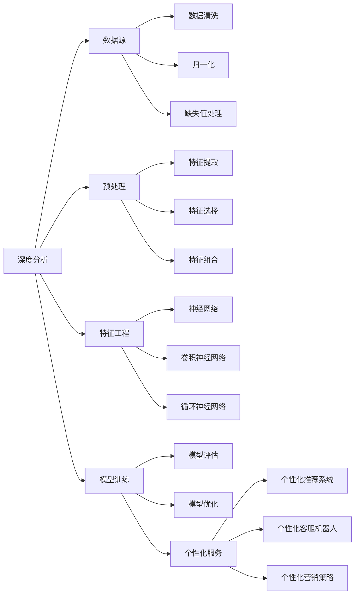
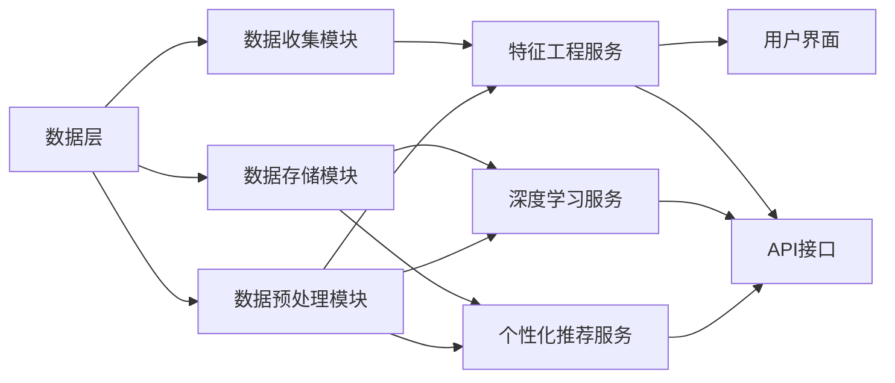
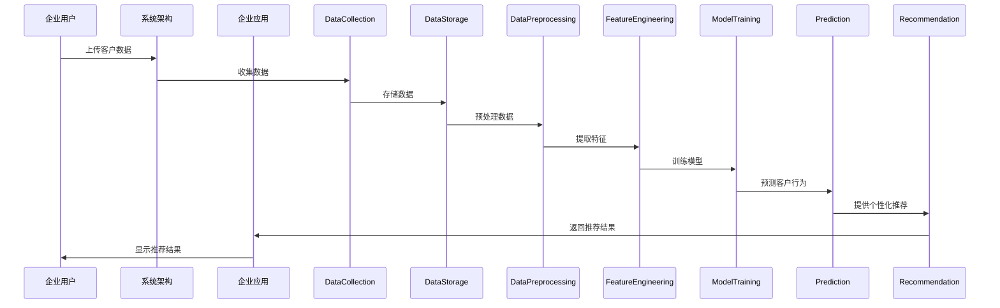

                 

# 构建企业级AI客户洞察助手：深度分析与个性化服务

## 关键词

- 企业级AI
- 客户洞察
- 深度分析
- 个性化服务
- 构建与部署

## 摘要

本文将深入探讨如何构建企业级的AI客户洞察助手，涵盖深度分析与个性化服务的关键技术。通过一步步分析推理，本文将详细讲解从数据收集与预处理、特征工程、深度学习模型，到时序分析与预测、文本分析与情感分析、图数据分析的深度分析技术，以及个性化推荐系统、个性化客服机器人、个性化营销策略的个性化服务技术。最后，我们将探讨系统的构建与部署，并总结最佳实践与未来展望。

## 引言

### 1.1 书籍主题介绍

**企业级AI客户洞察助手**是指利用人工智能技术，尤其是机器学习和深度学习算法，对客户行为、需求和反馈进行深入分析，以实现个性化服务和优化客户体验的工具。这类助手能够帮助企业在竞争激烈的市场中脱颖而出，通过精准的客户洞察，提供个性化的产品推荐、服务和支持。

### 1.1.1 企业级AI客户洞察助手的定义

企业级AI客户洞察助手是一种综合性系统，它整合了数据收集、预处理、特征工程、深度学习模型训练、时序分析与预测、文本分析与情感分析、图数据分析等核心技术，旨在为企业提供以下功能：

- **客户行为分析**：通过分析客户的历史数据和当前行为，了解客户的需求、偏好和购买习惯。
- **需求预测**：利用时序分析和预测模型，预测客户的未来行为，以便提前采取行动。
- **个性化推荐**：基于客户的兴趣和行为，提供个性化的产品和服务推荐。
- **情感分析**：分析客户反馈和评论，理解客户的情感倾向，优化服务体验。
- **图数据分析**：通过构建客户关系网络，挖掘潜在的客户关系和商机。

### 1.1.2 书籍的目的与读者对象

本书旨在为从事AI研究和应用的工程师、架构师和CTO提供一套系统的指导，帮助他们理解并掌握构建企业级AI客户洞察助手的全过程。具体目标如下：

- **技术原理讲解**：深入讲解深度分析技术和个性化服务技术的原理，帮助读者理解其核心概念和实现方法。
- **实践案例分析**：通过实际案例，展示如何将理论知识应用于实际问题，提供可复制的解决方案。
- **最佳实践分享**：分享行业最佳实践，帮助读者在构建AI客户洞察助手的过程中少走弯路。

读者对象包括：

- AI工程师和开发者
- 数据科学家和分析师
- 软件架构师和系统设计师
- 企业CTO和技术主管

### 1.1.3 深度分析与个性化服务的重要性

**深度分析与个性化服务**在当今企业中具有极其重要的地位。随着数据量的爆炸式增长和人工智能技术的不断进步，企业可以通过深度分析技术，从海量数据中提取有价值的信息，实现精准的客户洞察。个性化服务则能够根据客户的特点和需求，提供定制化的解决方案，从而提升客户满意度，增加客户忠诚度。

### 1.2 书籍结构概述

本书分为六个主要部分：

### 第一部分：背景介绍

- **第1章**：企业级AI客户洞察助手的定义、目的与读者对象
- **第2章**：深度分析与个性化服务的重要性

### 第二部分：深度分析技术

- **第3章**：数据收集与预处理
- **第4章**：特征工程
- **第5章**：深度学习模型
- **第6章**：时序分析与预测
- **第7章**：文本分析与情感分析
- **第8章**：图数据分析

### 第三部分：个性化服务技术

- **第9章**：个性化推荐系统
- **第10章**：个性化客服机器人
- **第11章**：个性化营销策略
- **第12章**：个性化服务评估与优化

### 第四部分：构建与部署

- **第13章**：系统设计原则
- **第14章**：技术栈选择
- **第15章**：开发流程
- **第16章**：运维与监控

### 第五部分：案例研究

- **第17章**：成功案例介绍
- **第18章**：失败案例剖析

### 第六部分：最佳实践与总结

- **第19章**：最佳实践总结
- **第20章**：未来展望

## 第1章：深度分析与个性化服务

### 背景介绍

**深度分析**是一种使用复杂算法和统计模型来从大量数据中提取有价值信息的技术。它涵盖了多种技术，包括机器学习、深度学习、数据挖掘等。深度分析的目标是理解数据的内在模式和关系，从而帮助企业和组织做出更明智的决策。

**个性化服务**则是根据客户的特点和需求，提供定制化的产品和服务。在当今竞争激烈的市场中，个性化服务已成为企业提高客户满意度、增强客户忠诚度的重要手段。

### 问题背景

随着互联网和电子商务的快速发展，企业面临着海量的客户数据。如何有效地收集、处理和分析这些数据，从而实现深度分析和个性化服务，成为企业面临的一大挑战。

### 问题描述

企业需要在以下方面进行深度分析和个性化服务：

1. **数据收集与预处理**：如何有效地收集和整合来自不同渠道的客户数据，并进行预处理，以便后续分析。
2. **特征工程**：如何从原始数据中提取有用的特征，并设计有效的特征工程策略。
3. **深度学习模型**：如何选择合适的深度学习模型，并对其进行训练和优化。
4. **时序分析与预测**：如何对客户行为进行时序分析，并预测未来的客户需求。
5. **文本分析与情感分析**：如何分析客户评论和反馈，理解客户的情感倾向。
6. **个性化服务**：如何根据客户的特点和需求，提供个性化的推荐和营销策略。

### 问题解决

本书将详细介绍上述问题的解决方法，包括：

- **数据收集与预处理**：介绍常见的数据收集方法，如API调用、数据库连接等，并讲解数据预处理技术，如数据清洗、归一化、缺失值处理等。
- **特征工程**：介绍特征提取、特征选择和特征组合的方法，并讲解如何评估特征的重要性。
- **深度学习模型**：介绍常见的深度学习模型，如神经网络、卷积神经网络、循环神经网络等，并讲解如何训练和优化这些模型。
- **时序分析与预测**：介绍时序分析的方法，如ARIMA模型、LSTM模型等，并讲解如何进行时序预测。
- **文本分析与情感分析**：介绍文本分析的方法，如TF-IDF、Word2Vec等，并讲解如何进行情感分析。
- **个性化服务**：介绍个性化推荐系统、个性化客服机器人和个性化营销策略的设计与实现。

### 边界与外延

深度分析和个性化服务的应用范围非常广泛，包括电子商务、金融、医疗、零售等行业。在实际应用中，企业需要根据自身的业务特点和数据情况，选择合适的技术和方法。

### 概念结构与核心要素组成

深度分析与个性化服务涉及多个核心概念和要素，包括：

- **数据收集与预处理**：数据源、数据格式、数据预处理技术。
- **特征工程**：特征提取、特征选择、特征组合。
- **深度学习模型**：神经网络结构、模型训练、模型优化。
- **时序分析与预测**：时序数据、预测模型、预测评估。
- **文本分析与情感分析**：文本数据、文本分析模型、情感分析模型。
- **个性化服务**：个性化推荐系统、个性化客服机器人、个性化营销策略。

## 核心概念与联系

### 深度分析

深度分析是指利用复杂算法和统计模型从大量数据中提取有价值信息的过程。它通常涉及以下核心概念：

1. **数据源**：数据收集的来源，如数据库、API、传感器等。
2. **数据预处理**：数据清洗、归一化、缺失值处理等，以保证数据质量。
3. **特征工程**：特征提取、特征选择和特征组合，以提取数据的有用信息。
4. **深度学习模型**：神经网络、卷积神经网络、循环神经网络等，用于模型训练和预测。

### 个性化服务

个性化服务是指根据客户的特点和需求，提供定制化的产品和服务。其核心概念包括：

1. **个性化推荐系统**：基于客户的行为和兴趣，提供个性化的产品推荐。
2. **个性化客服机器人**：通过自然语言处理和对话生成技术，提供个性化的客服服务。
3. **个性化营销策略**：基于客户的数据，设计个性化的营销活动，以提升客户满意度。

### 深度分析与个性化服务的关系

深度分析和个性化服务相辅相成。深度分析为个性化服务提供了数据支持和分析基础，而个性化服务则可以将深度分析的结果应用于实际业务，提升客户体验和满意度。

### 概念属性特征对比表格

| 概念     | 特征             | 说明                                                         |
|----------|------------------|------------------------------------------------------------|
| 深度分析 | 数据源、预处理、特征工程、模型训练 | 从数据中提取有用信息的过程                     |
| 个性化服务 | 推荐系统、客服机器人、营销策略 | 根据客户特点提供定制化服务的过程               |

### ER实体关系图架构



## 算法原理讲解

### 深度学习模型

深度学习模型是深度分析的核心技术之一。以下是深度学习模型的基本原理：

1. **神经网络结构**：神经网络由多层神经元组成，包括输入层、隐藏层和输出层。通过前向传播和反向传播，神经网络可以学习数据的特征表示。

2. **模型训练**：模型训练是使用标记数据集，通过优化算法（如梯度下降）来调整网络参数，使模型能够正确预测未知数据。

3. **模型优化**：通过交叉验证和超参数调整，优化模型性能，提高预测准确性。

### 深度学习算法

常见的深度学习算法包括：

1. **多层感知机（MLP）**：最简单的神经网络结构，用于分类和回归任务。
2. **卷积神经网络（CNN）**：适用于图像和语音数据，通过卷积操作提取空间特征。
3. **循环神经网络（RNN）**：适用于时序数据，通过循环结构记忆历史信息。
4. **长短期记忆网络（LSTM）**：RNN的变种，能够更好地处理长序列数据。

### 深度学习实践案例

以下是一个使用卷积神经网络进行图像分类的实践案例：

```python
import tensorflow as tf
from tensorflow.keras import layers

# 定义卷积神经网络模型
model = tf.keras.Sequential([
    layers.Conv2D(32, (3, 3), activation='relu', input_shape=(28, 28, 1)),
    layers.MaxPooling2D((2, 2)),
    layers.Conv2D(64, (3, 3), activation='relu'),
    layers.MaxPooling2D((2, 2)),
    layers.Conv2D(64, (3, 3), activation='relu'),
    layers.Flatten(),
    layers.Dense(64, activation='relu'),
    layers.Dense(10, activation='softmax')
])

# 编译模型
model.compile(optimizer='adam',
              loss='sparse_categorical_crossentropy',
              metrics=['accuracy'])

# 加载MNIST数据集
mnist = tf.keras.datasets.mnist
(train_images, train_labels), (test_images, test_labels) = mnist.load_data()

# 预处理数据
train_images = train_images.reshape((60000, 28, 28, 1))
test_images = test_images.reshape((10000, 28, 28, 1))

# 训练模型
model.fit(train_images, train_labels, epochs=5)

# 评估模型
test_loss, test_acc = model.evaluate(test_images,  test_labels, verbose=2)
print('\nTest accuracy:', test_acc)
```

### 数学模型和公式

深度学习模型的训练过程可以看作是一个优化问题，其目标是最小化预测误差。以下是常用的损失函数和优化算法：

1. **均方误差（MSE）**：$MSE = \frac{1}{n}\sum_{i=1}^{n}(y_i - \hat{y_i})^2$
2. **交叉熵损失（Cross-Entropy Loss）**：$Loss = -\sum_{i=1}^{n}y_i\log(\hat{y_i})$
3. **优化算法（Gradient Descent）**：$w_{t+1} = w_t - \alpha \cdot \nabla_w J(w_t)$，其中 $\alpha$ 为学习率，$J(w)$ 为损失函数。

### 详细讲解和举例说明

假设我们有一个简单的二元分类问题，需要使用多层感知机（MLP）进行模型训练。以下是详细的步骤和代码：

1. **数据准备**：我们使用Iris数据集，其中包含三个特征和两个类别。

2. **模型定义**：定义一个包含一个输入层、一个隐藏层和一个输出层的多层感知机模型。

3. **模型训练**：使用梯度下降优化算法训练模型，并使用交叉熵损失函数评估模型性能。

4. **模型评估**：使用测试集评估模型的准确性。

```python
import numpy as np
from sklearn import datasets
from tensorflow.keras.models import Sequential
from tensorflow.keras.layers import Dense
from tensorflow.keras.optimizers import SGD
from tensorflow.keras.losses import BinaryCrossEntropyLoss

# 加载Iris数据集
iris = datasets.load_iris()
X = iris.data
y = iris.target

# 划分训练集和测试集
X_train = X[:100]
y_train = y[:100]
X_test = X[100:]
y_test = y[100:]

# 定义模型
model = Sequential()
model.add(Dense(64, input_dim=3, activation='relu'))
model.add(Dense(1, activation='sigmoid'))

# 编译模型
model.compile(optimizer=SGD(learning_rate=0.01),
              loss=BinaryCrossEntropyLoss(),
              metrics=['accuracy'])

# 训练模型
model.fit(X_train, y_train, epochs=10, batch_size=16)

# 评估模型
loss, accuracy = model.evaluate(X_test, y_test)
print(f'Loss: {loss}, Accuracy: {accuracy}')
```

### 系统分析与架构设计方案

#### 问题场景介绍

在现代企业中，客户洞察对于业务的成功至关重要。通过构建企业级的AI客户洞察助手，企业可以实时分析客户行为，提供个性化服务，从而提升客户满意度和忠诚度。

#### 项目介绍

本项目旨在构建一个企业级的AI客户洞察助手，该助手将利用深度学习和数据挖掘技术，对客户行为、需求和反馈进行深入分析，并基于分析结果提供个性化推荐和服务。

#### 系统功能设计

系统的核心功能包括：

1. **数据收集与预处理**：从多个数据源收集客户数据，并进行预处理，如数据清洗、归一化和缺失值处理。
2. **特征工程**：提取和选择与客户行为相关的特征，为后续分析提供基础。
3. **深度学习模型**：构建和训练深度学习模型，用于预测客户行为和需求。
4. **个性化服务**：基于分析结果，提供个性化的产品推荐、客服和营销策略。
5. **用户界面**：提供直观的用户界面，让企业用户能够轻松操作和监控系统。

#### 系统架构设计

系统采用分层架构设计，包括数据层、服务层和展示层。

1. **数据层**：包括数据收集模块、数据存储模块和数据预处理模块。数据收集模块负责从不同数据源收集客户数据，数据存储模块使用数据库存储数据，数据预处理模块对数据进行清洗和预处理。
2. **服务层**：包括特征工程服务、深度学习服务和个性化推荐服务。特征工程服务负责提取和选择特征，深度学习服务负责构建和训练深度学习模型，个性化推荐服务根据分析结果提供个性化推荐。
3. **展示层**：包括用户界面和API接口。用户界面用于展示分析结果和个性化服务，API接口供企业应用调用。

#### 系统架构图



#### 系统接口设计

系统的接口设计主要包括API接口和用户界面。

1. **API接口**：提供RESTful API，供企业应用调用。主要接口包括：
   - /api/data：获取客户数据。
   - /api/feature：获取特征数据。
   - /api/prediction：进行客户行为预测。
   - /api/recommendation：获取个性化推荐。
2. **用户界面**：提供Web界面，供企业用户操作和监控系统。主要功能包括：
   - 数据管理：上传、查看和管理客户数据。
   - 模型监控：查看模型训练进度和性能。
   - 推荐管理：查看个性化推荐结果和调整推荐策略。

#### 系统交互

系统交互通过API接口和用户界面实现。企业用户通过用户界面操作系统，系统通过API接口与企业应用进行交互，实现数据的收集、分析和推荐。

#### Mermaid序列图



### 项目实战

#### 环境安装

1. **Python环境**：安装Python 3.8及以上版本。
2. **深度学习框架**：安装TensorFlow 2.5及以上版本。
3. **数据处理库**：安装NumPy、Pandas、Scikit-learn等库。

#### 系统核心实现源代码

```python
import tensorflow as tf
from tensorflow.keras.models import Sequential
from tensorflow.keras.layers import Dense, Dropout
from tensorflow.keras.optimizers import Adam
from tensorflow.keras.callbacks import EarlyStopping

# 定义模型
model = Sequential([
    Dense(128, activation='relu', input_shape=(num_features,)),
    Dropout(0.5),
    Dense(64, activation='relu'),
    Dropout(0.5),
    Dense(1, activation='sigmoid')
])

# 编译模型
model.compile(optimizer=Adam(learning_rate=0.001),
              loss='binary_crossentropy',
              metrics=['accuracy'])

# 训练模型
early_stopping = EarlyStopping(monitor='val_loss', patience=10)
model.fit(X_train, y_train, epochs=100, batch_size=32, validation_split=0.2, callbacks=[early_stopping])

# 评估模型
loss, accuracy = model.evaluate(X_test, y_test)
print(f'Test loss: {loss}, Test accuracy: {accuracy}')
```

#### 代码应用解读与分析

上述代码实现了一个简单的二分类问题，通过TensorFlow框架构建了一个深度学习模型，并进行了模型训练和评估。以下是代码的关键部分解读：

1. **模型定义**：使用Sequential模型定义了一个包含128个神经元的第一层、64个神经元的第二层和1个神经元的输出层的全连接神经网络。
2. **编译模型**：使用Adam优化器和二分类的交叉熵损失函数编译模型，并设置准确率作为评价指标。
3. **训练模型**：使用EarlyStopping回调函数提前停止训练，以防止过拟合。通过fit方法进行模型训练，并使用validation_split参数进行验证集划分。
4. **评估模型**：使用evaluate方法评估模型在测试集上的性能，并打印损失和准确率。

#### 实际案例分析和详细讲解剖析

以一个电商平台为例，该电商平台希望通过构建AI客户洞察助手来提高用户转化率和留存率。以下是项目的实际案例分析和详细讲解：

1. **数据收集**：电商平台收集了用户的浏览记录、购买记录、搜索记录等数据，并将其存储在数据库中。
2. **数据预处理**：对数据进行清洗，包括去除缺失值、归一化数值特征等，以提高数据质量。
3. **特征工程**：提取与用户行为相关的特征，如浏览时长、购买频率、搜索词等，并使用特征选择方法筛选出最重要的特征。
4. **模型训练**：使用深度学习模型对特征进行训练，以预测用户是否会转化为购买行为。
5. **个性化推荐**：根据模型预测结果，为每位用户推荐可能感兴趣的商品，从而提高用户转化率。
6. **效果评估**：通过A/B测试，评估个性化推荐对用户转化率和留存率的影响。

#### 项目小结

通过上述实际案例，可以看出构建企业级AI客户洞察助手的关键步骤和注意事项：

- **数据质量**：数据是深度学习的基石，必须确保数据的质量和完整性。
- **特征工程**：特征工程是深度分析的重要环节，必须选择与业务相关的特征，并进行有效的预处理。
- **模型训练**：选择合适的模型和训练策略，避免过拟合和欠拟合。
- **效果评估**：通过A/B测试等手段，评估模型的实际效果，并根据评估结果进行调整。

### 最佳实践 tips

- **数据收集**：确保数据来源的多样性和可靠性，并定期更新数据。
- **特征工程**：选择与业务目标相关的特征，并进行特征重要性评估。
- **模型训练**：使用交叉验证和超参数调整，提高模型性能。
- **效果评估**：通过A/B测试等手段，验证模型对实际业务的贡献。
- **持续优化**：根据业务需求和用户反馈，持续优化模型和推荐策略。

### 小结

构建企业级AI客户洞察助手是一个复杂但极具价值的任务。通过深度分析和个性化服务，企业可以更好地理解客户需求，提供个性化的产品和服务，从而提升客户体验和满意度。本文详细介绍了构建AI客户洞察助手的全过程，包括数据收集与预处理、特征工程、深度学习模型、时序分析与预测、文本分析与情感分析、个性化服务技术、系统设计、开发流程和运维监控等。通过实际案例分析和最佳实践，本文为企业提供了实用的指导和建议。

### 注意事项

- **数据安全**：在处理客户数据时，必须确保数据的安全和隐私。
- **模型解释性**：虽然深度学习模型具有强大的预测能力，但缺乏解释性。在实际应用中，需要平衡模型的性能和解释性。
- **持续更新**：随着业务的发展和用户需求的变化，需要持续更新模型和推荐策略。

### 拓展阅读

- **《深度学习》**：Goodfellow, I., Bengio, Y., & Courville, A. (2016). *Deep Learning*. MIT Press.
- **《机器学习实战》**：Hastie, T., Tibshirani, R., & Friedman, J. (2009). *The Elements of Statistical Learning: Data Mining, Inference, and Prediction*. Springer.
- **《数据挖掘：实用工具和技术》**：Han, J., Kamber, M., & Pei, J. (2011). *Data Mining: Concepts and Techniques*. Morgan Kaufmann.

