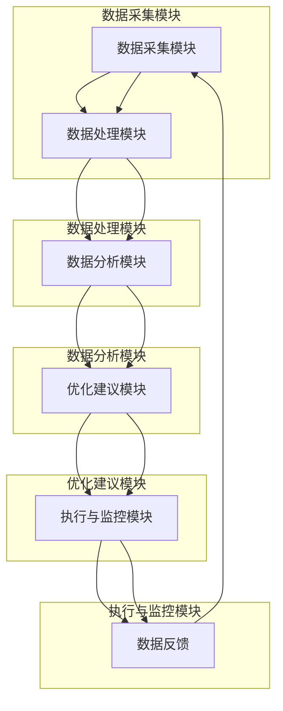
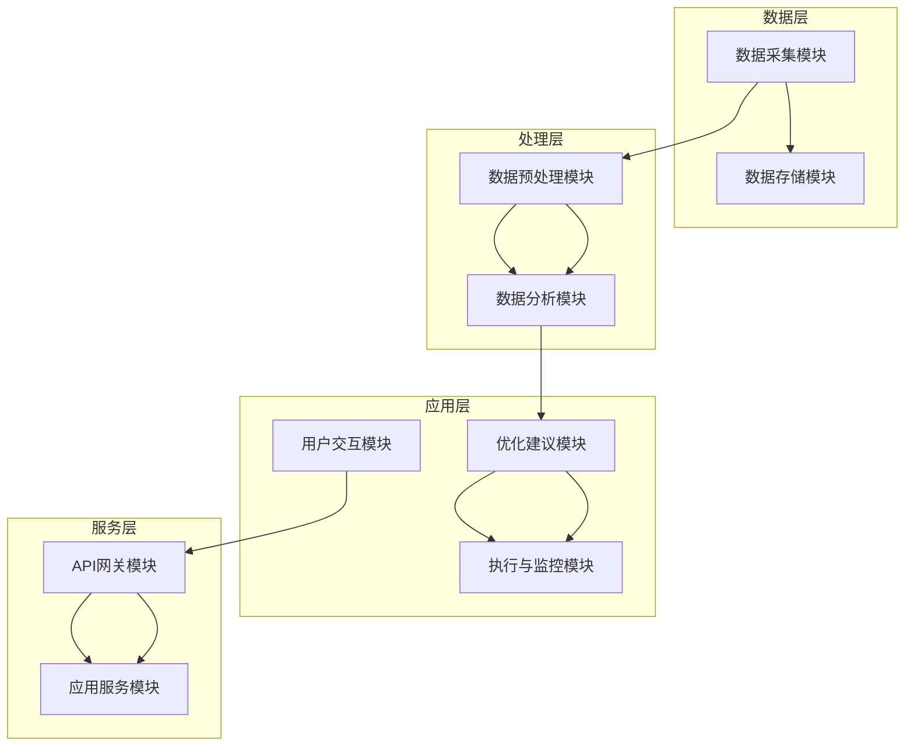
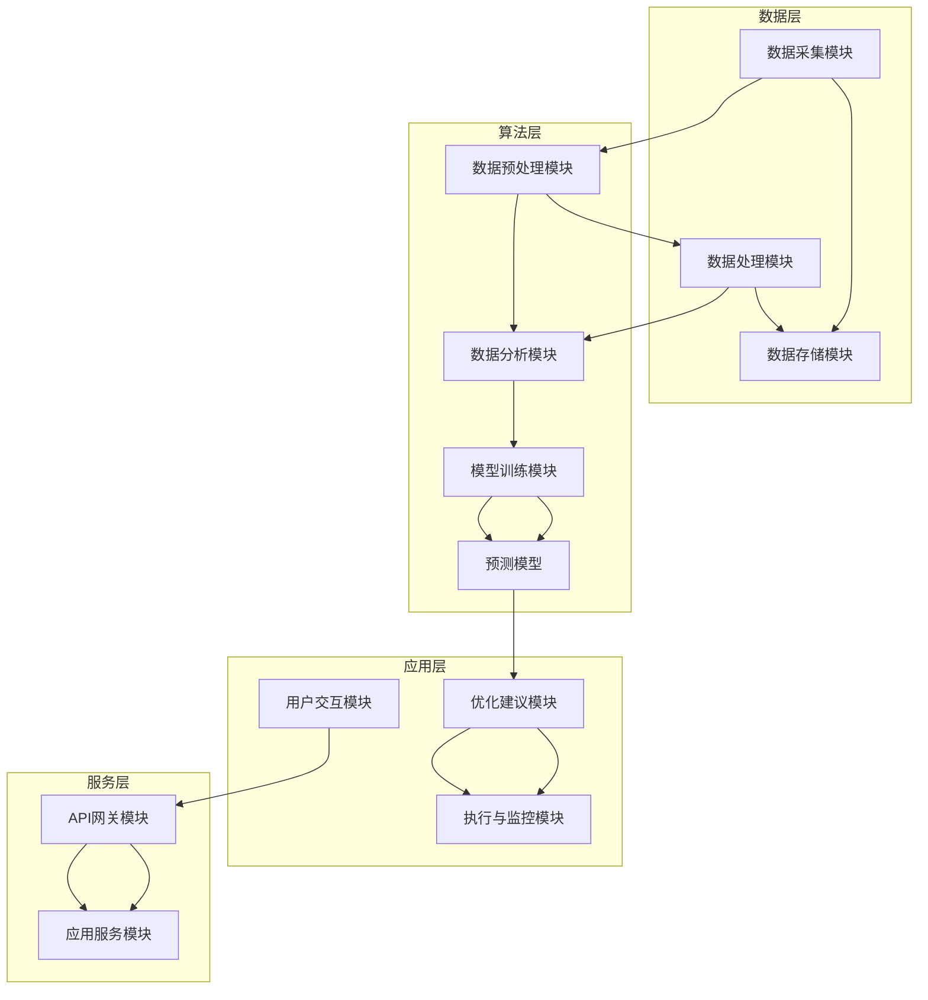

                 

## 引言与背景

### 问题背景

在现代商业环境中，企业的运营效率直接关系到其竞争力和盈利能力。然而，许多企业在日常运营中面临着效率低下的问题，这不仅影响了业务的顺利进行，还增加了运营成本。具体来说，问题主要表现在以下几个方面：

1. **人工操作密集**：许多企业仍然依赖大量的人工操作来完成日常工作任务，这不仅效率低下，还容易导致人为错误。
2. **流程复杂**：业务流程设计不够优化，存在重复性、冗余性的操作，导致工作效率下降。
3. **数据分散**：企业内部数据分布在不同系统或部门中，缺乏统一的视图，无法进行有效的数据分析和利用。
4. **决策滞后**：管理层在做出决策时，往往缺乏实时、准确的数据支持，导致决策滞后。

这些问题不仅制约了企业的发展，还影响了员工的积极性。因此，解决企业运营效率低下的问题迫在眉睫。而AI技术作为一种变革性的工具，能够通过自动化、智能化、数据分析等方法，有效提升企业的运营效率。

### 问题解决

为了解决上述问题，引入AI工作流程优化助手成为一种有效的策略。AI工作流程优化助手通过以下方式提升企业运营效率：

1. **自动化操作**：AI技术能够自动化执行重复性、标准化的操作，减少人工干预，提高工作效率。
2. **流程优化**：通过对业务流程的深度分析和优化，消除冗余和重复的操作，提高流程的效率。
3. **数据整合**：AI技术能够将分散在不同系统或部门的数据进行整合和分析，为企业提供统一的视图，支持数据驱动的决策。
4. **智能决策支持**：通过实时数据分析，AI工作流程优化助手能够为企业提供智能化的决策支持，帮助管理层做出更加准确和迅速的决策。

### 边界与外延

企业级AI工作流程优化助手的适用范围非常广泛，几乎涵盖了所有类型的业务场景。无论是制造业、金融业、服务业，还是电子商务等行业，AI工作流程优化助手都能够发挥其优势，提升企业的运营效率。

具体来说，该助手适用于以下几种场景：

1. **生产制造**：通过AI技术优化生产流程，实现生产线的自动化，提高生产效率，降低生产成本。
2. **客户服务**：通过AI技术实现智能客服，提高客户服务效率，提升客户满意度。
3. **财务管理**：通过AI技术进行财务数据的自动化处理和分析，提高财务管理的准确性，降低财务风险。
4. **人力资源**：通过AI技术优化人力资源管理流程，提高招聘效率，提升员工绩效。

总之，AI工作流程优化助手不仅能够解决企业运营效率低下的问题，还能够为企业带来持续的竞争优势。接下来，我们将深入探讨AI技术在企业中的应用，以及AI工作流程优化助手的架构与功能。

## AI技术在企业中的应用

### AI的核心优势

AI技术在企业中的应用具有显著的核心优势，主要体现在以下几个方面：

1. **自动化**：AI技术能够自动化执行重复性、标准化的操作，从而减少人工干预，提高工作效率。例如，AI机器人可以自动处理大量文档的录入和分类，提高处理速度和准确性。
2. **数据分析**：AI技术通过对大量数据进行深度分析，能够发现数据中的潜在模式和规律，为企业提供数据驱动的决策支持。例如，通过数据分析，企业可以更好地了解市场需求，优化库存管理，降低库存成本。
3. **预测与优化**：AI技术能够利用历史数据和模型预测未来的趋势和变化，帮助企业进行战略规划和优化。例如，通过预测销售趋势，企业可以提前准备库存，避免缺货或积压。
4. **智能化**：AI技术使企业系统能够实现自我学习和自我优化，不断提高系统的智能化水平。例如，智能客服系统能够通过不断学习用户反馈，提高客服质量和用户体验。

### AI在企业中的应用场景

AI技术在企业中的实际应用场景非常广泛，以下是一些典型的应用场景：

1. **自动化流程**：企业通过部署AI技术，实现业务流程的自动化。例如，在制造业中，AI机器人可以自动化完成装配、检测等任务；在金融业中，AI系统可以自动化完成风险评估、信用评级等任务。
2. **数据分析与优化**：企业利用AI技术进行数据分析，从而优化业务流程和决策。例如，在零售业中，通过分析销售数据，企业可以优化商品摆放策略，提高销售额；在物流行业，通过分析运输数据，企业可以优化路线规划，降低运输成本。
3. **决策支持**：AI技术为企业提供智能化的决策支持，帮助企业做出更加准确和迅速的决策。例如，在医疗行业中，AI系统可以通过分析患者数据，为医生提供诊断建议；在金融行业中，AI系统可以通过分析市场数据，为投资者提供投资建议。
4. **客户服务**：企业通过AI技术提升客户服务水平，提高客户满意度。例如，通过智能客服系统，企业可以提供24/7全天候服务，快速响应用户需求；通过个性化推荐系统，企业可以提供更加个性化的产品和服务，提升用户体验。

### AI工作流程优化助手的架构与功能

AI工作流程优化助手的架构通常包括以下几个关键模块：

1. **数据采集模块**：该模块负责从不同的数据源采集数据，包括内部数据（如ERP系统、CRM系统）和外部数据（如社交媒体、市场数据）。
2. **数据处理模块**：该模块负责对采集到的数据进行分析和清洗，确保数据的准确性和一致性。数据处理包括数据整合、去重、格式转换等操作。
3. **数据分析模块**：该模块利用机器学习和深度学习算法，对清洗后的数据进行深度分析，发现数据中的潜在模式和规律。
4. **优化建议模块**：根据数据分析结果，该模块能够为企业提供具体的优化建议，包括流程优化、资源配置优化等。
5. **执行与监控模块**：该模块负责将优化建议转化为具体的操作指令，并在执行过程中进行监控和反馈。通过监控模块，企业可以实时了解优化建议的执行情况和效果。

综上所述，AI工作流程优化助手通过自动化、数据分析和智能决策支持，能够有效提升企业的运营效率，为企业带来显著的经济效益和竞争优势。

### AI工作流程优化助手的架构设计

设计一个高效的企业级AI工作流程优化助手，首先需要构建一个合理的系统架构，以确保其具备强大的数据处理能力、灵活的扩展性和良好的用户体验。以下是AI工作流程优化助手的系统架构设计：

#### 系统架构图

#### 系统模块划分

1. **数据采集模块**：该模块负责从各种数据源（如ERP系统、CRM系统、传感器、外部API等）采集数据。采集的数据包括内部业务数据、外部市场数据以及用户行为数据等。数据采集模块的关键任务是确保数据的全面性和准确性。

2. **数据处理模块**：该模块负责对采集到的原始数据进行清洗、转换和整合，以便后续分析。数据处理包括数据去重、格式转换、缺失值处理、异常值检测等操作。这一模块的核心是数据质量保障，确保为数据分析提供高质量的数据基础。

3. **数据分析模块**：该模块利用机器学习和深度学习算法对处理后的数据进行分析，提取出有价值的信息和模式。数据分析包括统计分析、数据挖掘、聚类分析、关联规则挖掘等。这一模块的目标是通过数据挖掘发现业务中的潜在问题和优化机会。

4. **优化建议模块**：基于数据分析的结果，该模块提供具体的优化建议，包括流程优化、资源配置优化、运营策略调整等。优化建议模块需要结合业务逻辑，将数据分析的结果转化为可执行的策略。

5. **执行与监控模块**：该模块负责将优化建议转化为具体的操作指令，并在执行过程中进行监控和反馈。执行与监控包括任务调度、实时监控、异常处理、效果评估等。这一模块的目标是确保优化建议能够顺利实施并达到预期效果。

#### 系统架构细节解析

1. **数据流处理**：数据流处理是整个系统架构的核心，它确保数据能够在各个模块之间高效、有序地流转。数据采集模块通过API接口、数据库连接、数据爬取等方式获取数据，并将其传递给数据处理模块。数据处理模块对数据进行清洗和转换后，将其传递给数据分析模块。数据分析模块对数据进行深度分析，并将分析结果传递给优化建议模块。优化建议模块生成具体的优化建议后，传递给执行与监控模块。

2. **模块间协同**：各个模块之间需要通过消息队列、缓存系统、数据库等实现高效的数据交互和协同工作。例如，数据分析模块和优化建议模块之间可能通过消息队列传递数据，以便实时获取最新的分析结果。

3. **系统扩展性**：系统架构需要具备良好的扩展性，以适应企业不断增长的数据量和复杂度。可以通过分布式架构、微服务架构等方式实现系统的弹性扩展。

4. **用户体验**：用户界面模块负责向用户提供友好的交互界面，展示数据分析和优化结果。用户可以通过界面查看实时数据、历史数据和优化建议，并进行自定义设置和操作。

通过上述架构设计和模块划分，AI工作流程优化助手能够实现高效的数据采集、处理、分析和优化，为企业提供全面、智能的运营支持。

### AI工作流程优化助手的功能模块

AI工作流程优化助手的设计不仅需要强大的数据处理能力，还需要具备丰富的功能模块，以全面支持企业的运营优化需求。以下是AI工作流程优化助手的几个关键功能模块及其详细描述：

#### 1. 数据采集模块

**功能描述**：
数据采集模块是AI工作流程优化助手的基石，负责从各种数据源中收集数据。这些数据源可能包括内部系统（如ERP、CRM、HRM等）和外部系统（如社交媒体、市场数据提供商等）。

**实现细节**：
- **API连接**：通过构建API接口，与内部系统进行无缝集成，实时获取业务数据。
- **数据爬取**：利用爬虫技术，从互联网或其他外部数据源中采集数据。
- **数据接入**：支持多种数据格式，如CSV、JSON、XML等，并能够处理异构数据源。

**关键任务**：
- 确保数据的全面性和准确性。
- 实现数据的实时采集和批量处理。

#### 2. 数据处理模块

**功能描述**：
数据处理模块负责对采集到的原始数据进行清洗、转换和整合，确保数据的质量和一致性。

**实现细节**：
- **数据清洗**：去除重复数据、填补缺失值、修正异常值，确保数据的完整性。
- **数据转换**：将不同格式的数据转换为统一的格式，便于后续处理。
- **数据整合**：整合来自多个数据源的数据，构建企业级的数据视图。

**关键任务**：
- 提高数据质量，为数据分析提供可靠的数据基础。
- 实现数据格式和结构的标准化。

#### 3. 数据分析模块

**功能描述**：
数据分析模块通过机器学习和深度学习算法，对清洗后的数据进行分析，发现数据中的潜在模式和规律。

**实现细节**：
- **统计分析**：利用统计分析方法，对数据的基本特征进行分析，如均值、方差、相关性等。
- **数据挖掘**：运用数据挖掘算法，发现数据中的隐藏模式和关系，如聚类分析、关联规则挖掘等。
- **预测分析**：利用机器学习算法，建立预测模型，对未来趋势进行预测，如时间序列分析、回归分析等。

**关键任务**：
- 提取数据中的关键信息，为业务决策提供支持。
- 实现数据驱动的业务优化。

#### 4. 优化建议模块

**功能描述**：
基于数据分析的结果，优化建议模块提供具体的优化方案，帮助企业优化业务流程和资源配置。

**实现细节**：
- **流程优化**：通过分析业务流程中的瓶颈和重复操作，提出优化建议，如流程自动化、流程重组等。
- **资源配置优化**：根据数据分析结果，调整资源配置，如人力资源分配、设备调度等。
- **运营策略调整**：基于市场数据和竞争环境，提出运营策略调整建议，如定价策略、促销策略等。

**关键任务**：
- 将数据分析结果转化为可执行的优化方案。
- 提高业务效率，降低运营成本。

#### 5. 执行与监控模块

**功能描述**：
执行与监控模块负责将优化建议转化为具体的操作指令，并在执行过程中进行实时监控和反馈。

**实现细节**：
- **任务调度**：根据优化建议，生成具体的执行任务，并对其进行调度和执行。
- **实时监控**：监控优化建议的执行进度和效果，及时发现和处理异常情况。
- **效果评估**：对优化建议的实施效果进行评估，并根据评估结果调整优化策略。

**关键任务**：
- 确保优化建议的有效实施。
- 实现实时监控和反馈，提高系统的响应速度。

通过这些功能模块的协同工作，AI工作流程优化助手能够为企业提供全面、智能的运营支持，帮助企业提高运营效率，降低成本，提升竞争力。

### AI基础知识

#### 2.1 机器学习基础

**机器学习的概念**

机器学习（Machine Learning，ML）是人工智能（Artificial Intelligence，AI）的一个重要分支，主要研究如何让计算机系统从数据中自动学习，并利用学习到的知识做出决策或预测。机器学习的过程通常包括数据采集、数据预处理、模型训练、模型评估和模型部署等步骤。

**机器学习的类型**

1. **监督学习（Supervised Learning）**：监督学习是一种最常见的机器学习方法，其特点是有明确的输入和输出数据。通过学习输入和输出之间的关系，模型能够预测新的输入对应的输出。常见的监督学习算法包括线性回归、逻辑回归、支持向量机（SVM）、决策树和随机森林等。

2. **无监督学习（Unsupervised Learning）**：无监督学习在训练过程中没有明确的输出数据，其主要任务是发现数据中的内在结构或模式。常见的无监督学习算法包括聚类算法（如K-means、DBSCAN）、降维算法（如主成分分析PCA、t-SNE）和关联规则学习等。

3. **强化学习（Reinforcement Learning）**：强化学习是一种通过不断与环境互动，从奖励信号中学习最优策略的机器学习方法。其核心是建立一个策略网络，用于指导智能体（Agent）在特定环境下做出最优动作。常见的强化学习算法包括Q-learning、SARSA、DQN（深度Q网络）和PPO（比例优势优化）等。

**常见机器学习算法**

1. **线性回归（Linear Regression）**：线性回归是一种简单的监督学习算法，用于预测连续值输出。其模型假设输入和输出之间存在线性关系，即$y = \beta_0 + \beta_1 \cdot x + \epsilon$。其中，$y$是输出值，$x$是输入值，$\beta_0$和$\beta_1$是模型参数，$\epsilon$是误差项。

2. **逻辑回归（Logistic Regression）**：逻辑回归是一种用于分类问题的监督学习算法，其输出为概率值。逻辑回归通过将线性回归模型的输出经过逻辑函数（Sigmoid函数）转换，从而实现概率预测。其模型公式为$\text{logit}(P) = \beta_0 + \beta_1 \cdot x$，其中$P$是概率值。

3. **支持向量机（SVM）**：支持向量机是一种分类算法，通过找到一个最优的超平面，将不同类别的数据分隔开。其目标是使分类边界到各个支持向量的距离最大。SVM的主要模型公式为$w \cdot x - b = 0$，其中$w$是权重向量，$x$是输入特征向量，$b$是偏置项。

4. **决策树（Decision Tree）**：决策树是一种树形结构模型，通过一系列的判断条件对数据进行分割，最终得到分类结果。每个内部节点表示一个特征，每个分支代表一个可能的特征取值，每个叶节点表示一个类别的结果。

5. **随机森林（Random Forest）**：随机森林是一种集成学习方法，通过构建多棵决策树，并对它们的分类结果进行投票来决定最终的分类结果。随机森林能够提高模型的预测性能，并减少过拟合现象。

6. **神经网络（Neural Networks）**：神经网络是一种模拟人脑神经元连接结构的计算模型，通过层层神经元的激活函数组合，实现复杂的非线性映射。常见的神经网络结构包括前馈神经网络、卷积神经网络（CNN）和循环神经网络（RNN）等。

通过理解上述机器学习的基础知识，我们能够更好地应用这些算法解决实际问题，并持续优化模型的性能。

#### 2.2 深度学习基础

**深度学习的原理**

深度学习（Deep Learning，DL）是机器学习的一个分支，其核心思想是通过构建多层神经网络，对数据进行多层次的特征提取和学习。深度学习模型的基本组成包括输入层、隐藏层和输出层。输入层接收外部输入数据，通过隐藏层进行特征提取和变换，最终由输出层生成预测结果。

深度学习的工作原理主要依赖于以下几个关键步骤：

1. **数据预处理**：包括数据的清洗、归一化、缺失值处理等，以确保输入数据的质量和一致性。
2. **前向传播（Forward Propagation）**：输入数据从输入层经过隐藏层，通过权重矩阵和激活函数进行传递，最终得到输出层的预测结果。
3. **反向传播（Back Propagation）**：根据预测结果与实际结果的误差，通过反向传播算法更新权重和偏置，优化模型参数。
4. **损失函数（Loss Function）**：用于衡量预测结果与实际结果之间的差异，常见的损失函数包括均方误差（MSE）、交叉熵（Cross Entropy）等。
5. **优化算法（Optimizer）**：用于优化模型参数，常见的优化算法包括梯度下降（Gradient Descent）、Adam等。

**深度学习的应用**

深度学习在各个领域都有着广泛的应用，以下是一些典型的应用场景：

1. **计算机视觉**：深度学习在图像分类、目标检测、图像生成等领域取得了显著的成果。例如，通过卷积神经网络（CNN），可以实现对图片中的物体进行分类和检测；通过生成对抗网络（GAN），可以生成逼真的图像。

2. **自然语言处理**：深度学习在自然语言处理（NLP）领域也取得了重大突破，例如，通过循环神经网络（RNN）和长短时记忆网络（LSTM），可以实现对文本进行语义分析和情感分类；通过Transformer模型，可以实现对机器翻译、文本生成等任务的高效处理。

3. **语音识别**：深度学习在语音识别领域被广泛应用于语音信号的处理和转换。例如，通过深度神经网络，可以将语音信号转换为文本，实现语音到文字的转换。

4. **推荐系统**：深度学习在推荐系统中的应用，通过学习用户的行为和偏好，生成个性化的推荐结果。例如，通过卷积神经网络和循环神经网络，可以实现对商品推荐的优化，提高用户的满意度。

**常见的深度学习框架**

深度学习框架是用于构建和训练深度学习模型的工具，以下是一些常用的深度学习框架：

1. **TensorFlow**：TensorFlow是谷歌开发的一款开源深度学习框架，其提供了丰富的API和工具，支持各种深度学习模型的构建和训练。TensorFlow具有高度的可扩展性和灵活性，适用于各种复杂的应用场景。

2. **PyTorch**：PyTorch是Facebook开发的一款开源深度学习框架，其具有动态计算图和易于理解的代码结构。PyTorch的动态计算图特性使其在研究阶段特别受欢迎，因为研究人员可以根据需要自由地调整模型结构。

3. **Keras**：Keras是一个高级深度学习框架，其构建在TensorFlow和Theano之上，提供了简洁、易用的API。Keras支持多种深度学习模型，适用于快速原型设计和实验。

4. **Apache MXNet**：MXNet是Apache基金会的一款开源深度学习框架，其具有高效的计算性能和灵活的编程模型。MXNet支持多种编程语言，包括Python、C++和R，适用于大规模分布式训练。

通过掌握深度学习的基本原理和应用，以及了解常见的深度学习框架，我们可以更好地应用深度学习技术解决实际问题，推动人工智能的发展。

#### 2.3 自然语言处理

**NLP的基本概念**

自然语言处理（Natural Language Processing，NLP）是人工智能（AI）的一个分支，致力于使计算机能够理解、生成和处理人类语言。NLP的核心目标是消除人类语言与机器之间的障碍，使计算机能够有效地处理自然语言数据，从而实现人与机器的交互。NLP的应用范围广泛，包括但不限于文本分类、情感分析、机器翻译、命名实体识别、语音识别等。

**NLP的应用场景**

1. **文本分类**：文本分类是将文本数据按照预定的类别进行归类的过程。例如，新闻分类系统可以根据新闻内容将其归类为政治、经济、体育等类别。文本分类广泛应用于垃圾邮件过滤、情感分析、信息检索等领域。

2. **情感分析**：情感分析旨在识别文本中的情感倾向，判断文本是正面、中性还是负面。情感分析可以用于社交媒体监控、客户反馈分析、市场研究等领域，帮助企业了解消费者的情绪和需求。

3. **机器翻译**：机器翻译是通过计算机程序将一种自然语言翻译成另一种自然语言的过程。机器翻译广泛应用于跨语言沟通、多语言信息检索、国际商务等领域。

4. **命名实体识别**：命名实体识别（Named Entity Recognition，NER）是识别文本中的特定实体（如人名、地名、组织名、时间等）的过程。NER是许多自然语言处理任务的基础，如信息提取、实体关系抽取等。

**NLP的关键技术**

1. **分词**：分词是将连续的文本序列切分成有意义的词汇序列的过程。例如，“人工智能”是一个词汇，而“人工”和“智能”则不是。分词是NLP任务的基础，决定了后续文本处理的质量。

2. **词性标注**：词性标注是对文本中的每个词汇进行词性分类的过程。词性包括名词、动词、形容词等。词性标注有助于理解文本的语义和语法结构。

3. **句法分析**：句法分析是对文本中的句子结构进行分析，构建句法树的过程。句法分析可以帮助理解句子的语法关系，从而更准确地理解句子的含义。

4. **语义分析**：语义分析是理解文本中词汇和句子的意义的过程。语义分析包括词义消歧、语义角色标注、语义关系抽取等任务。

5. **情感分析**：情感分析是识别文本中的情感倾向，判断文本是正面、中性还是负面的过程。情感分析可以采用基于规则的方法、机器学习方法或深度学习方法。

通过掌握NLP的基本概念、应用场景和关键技术，我们能够更好地利用NLP技术解决实际问题，推动人工智能在自然语言处理领域的应用和发展。

### 数据采集与清洗

#### 数据采集方法

数据采集是AI工作流程优化助手的起点，其质量直接影响后续数据处理和分析的效果。以下是几种常见的数据采集方法：

1. **API接口采集**：通过调用外部API接口，从第三方服务或企业内部系统获取数据。这种方法适用于定期或实时获取数据，如天气数据、金融数据等。

2. **网络爬虫**：利用爬虫技术从互联网上抓取数据，适用于采集公开的网页数据、社交媒体数据等。

3. **数据库连接**：通过数据库连接，从企业内部数据库（如MySQL、Oracle等）中直接获取数据。这种方法适用于需要大规模数据处理和分析的场景。

4. **传感器采集**：利用传感器采集实时数据，如温度传感器、湿度传感器、运动传感器等，适用于物联网（IoT）应用场景。

5. **日志文件**：从系统的日志文件中提取数据，如Web服务器日志、应用服务器日志等，适用于监控和分析系统性能和用户行为。

#### 数据清洗技术

数据清洗是数据处理的重要步骤，其目标是去除数据中的噪声、纠正错误、填补缺失值，确保数据的质量和一致性。以下是几种常用的数据清洗技术：

1. **缺失值处理**：缺失值处理包括删除缺失值、用平均值、中位数、众数等填充缺失值，以及使用更复杂的方法（如插值法、回归法等）进行填充。

2. **异常值检测**：异常值检测是指识别并处理数据中的异常值，避免其对后续分析产生不利影响。常见的异常值检测方法包括统计方法（如Z分数、IQR法）、机器学习方法（如孤立森林）等。

3. **数据转换**：数据转换包括将不同数据源的数据格式统一、对数值数据进行归一化或标准化处理，以及将文本数据转换为数值表示（如词袋模型、词嵌入等）。

4. **去重**：去重是指识别并删除重复的数据记录，确保数据的唯一性和准确性。

5. **数据验证**：数据验证是指对数据进行一致性检查、完整性检查和合法性检查，确保数据满足预定的规则和标准。

#### 数据质量评估

数据质量评估是评估数据在多个维度上的质量，包括准确性、完整性、一致性、时效性和可用性等。以下是几种常见的数据质量评估方法：

1. **准确性评估**：准确性评估是指评估数据中错误和异常的比例，可以通过误差率、精确率、召回率等指标进行衡量。

2. **完整性评估**：完整性评估是指评估数据中缺失值的比例，可以通过缺失值率、完整性指数等指标进行衡量。

3. **一致性评估**：一致性评估是指评估数据在不同数据源之间的匹配程度，可以通过一致性率、差异率等指标进行衡量。

4. **时效性评估**：时效性评估是指评估数据的更新频率和时效性，可以通过数据更新周期、滞后时间等指标进行衡量。

5. **可用性评估**：可用性评估是指评估数据是否满足业务需求和分析要求，可以通过用户满意度、数据利用效率等指标进行衡量。

通过以上数据采集与清洗方法，以及数据质量评估手段，AI工作流程优化助手能够确保输入数据的准确性和一致性，为后续的数据分析提供坚实的基础。

### 数据可视化

#### 数据可视化的重要性

数据可视化（Data Visualization，DV）是将复杂的数据通过图形化的方式展示出来，帮助人们更直观、快速地理解和分析数据。在AI工作流程优化助手中，数据可视化具有以下几个重要作用：

1. **直观展示数据**：数据可视化能够将抽象的数据转化为直观的图形，使人们更容易理解和分析数据。
2. **发现数据模式**：通过图形化的展示，可以快速发现数据中的异常、趋势和模式，为决策提供支持。
3. **增强数据故事性**：通过数据可视化，可以将数据分析的结果以故事化的方式呈现，提高数据传播的效果。
4. **促进沟通和协作**：数据可视化能够帮助团队成员更好地理解数据分析的结果，促进沟通和协作。

#### 常见的数据可视化工具

以下是几种常用的数据可视化工具：

1. **Matplotlib**：Matplotlib是Python中最常用的数据可视化库之一，支持多种图表类型（如折线图、柱状图、散点图等），具有丰富的自定义选项。

2. **Seaborn**：Seaborn是基于Matplotlib构建的高级数据可视化库，提供了一系列精美的图表模板，特别适合用于统计分析和数据探索。

3. **Plotly**：Plotly是一个交互式的数据可视化库，支持多种图表类型（包括3D图表和交互式图表），适用于复杂的数据分析和实时数据展示。

4. **Tableau**：Tableau是一款功能强大的商业智能工具，支持多种数据源连接和丰富的图表类型，特别适合于大数据分析和企业级应用。

5. **Power BI**：Power BI是微软推出的数据可视化和商业智能工具，具有强大的数据连接和数据处理能力，支持多种图表类型和交互功能。

#### 数据可视化技术

数据可视化技术包括以下几个方面：

1. **图表选择**：根据数据的类型和分析目的选择合适的图表类型，如柱状图用于比较数据，折线图用于展示数据趋势，散点图用于展示数据分布等。

2. **色彩使用**：合理的色彩使用能够提高数据可视化效果，通常使用颜色对比来突出数据差异，如红色表示负向指标，绿色表示正向指标。

3. **交互性**：交互性数据可视化能够使用户通过点击、拖拽等操作动态更新图表，提供更丰富的数据探索和交互体验。

4. **动画效果**：动画效果能够增强数据展示的动态感，使数据变化过程更加直观，如时间序列数据的动态折线图。

5. **数据映射**：数据映射是将数据值映射到图表的某个属性上，如大小、颜色、亮度等，用于强调数据的相对大小和趋势。

通过使用这些数据可视化工具和技术，AI工作流程优化助手能够为企业提供直观、交互性强、具有故事性的数据展示，帮助决策者更好地理解数据，做出更加准确的业务决策。

### 数据分析技术

#### 统计分析

统计分析是数据分析的基础，通过描述性统计和推断性统计来分析数据，帮助发现数据中的模式和规律。

**描述性统计**：
描述性统计主要用于总结数据的基本特征，常用的统计量包括：
- **均值（Mean）**：数据集的平均值，计算公式为$\mu = \frac{\sum_{i=1}^{n} x_i}{n}$，其中$x_i$为第$i$个数据值，$n$为数据个数。
- **中位数（Median）**：将数据集按大小排序后，位于中间位置的值，计算公式为$M = \frac{x_{(n/2)} + x_{(n/2+1)}}{2}$，当数据个数为奇数时，取中间值；当数据个数为偶数时，取中间两个值的平均值。
- **众数（Mode）**：数据集中出现次数最多的值。
- **方差（Variance）**：数据与均值之间的差异的平方的平均值，计算公式为$\sigma^2 = \frac{\sum_{i=1}^{n} (x_i - \mu)^2}{n}$。
- **标准差（Standard Deviation）**：方差的平方根，计算公式为$\sigma = \sqrt{\sigma^2}$。

**推断性统计**：
推断性统计主要用于基于样本数据推断总体数据的特征，常用的方法包括：
- **假设检验**：通过设定原假设和备择假设，利用样本数据对总体特征进行推断，常用的假设检验方法有t检验、方差分析（ANOVA）等。
- **置信区间**：通过样本统计量估计总体参数的范围，置信水平通常设定为95%或99%，计算公式为$C.I. = \hat{\mu} \pm Z \cdot \frac{\sigma}{\sqrt{n}}$，其中$\hat{\mu}$为样本均值，$Z$为标准正态分布的临界值，$\sigma$为总体标准差，$n$为样本大小。
- **回归分析**：通过建立自变量和因变量之间的关系模型，用于预测和分析，常用的回归分析方法有线性回归、多项式回归等。

通过描述性统计和推断性统计，可以深入理解数据的基本特征和关系，为后续的数据挖掘和优化提供基础。

#### 数据挖掘

数据挖掘（Data Mining）是从大量数据中自动发现隐藏的、有价值的模式和规律的过程。数据挖掘通常包括以下几个步骤：

1. **数据预处理**：包括数据清洗、数据整合和数据转换等，确保数据的质量和一致性。
2. **模式识别**：通过统计学、机器学习和深度学习等方法，从数据中发现潜在的规律和模式。常见的模式识别方法包括：
   - **聚类分析**：将数据集分为若干个群组，使得同一群组中的数据点之间具有较高的相似度，常用的聚类算法有K-means、DBSCAN等。
   - **关联规则学习**：发现数据集中的关联关系，常用的算法有Apriori算法、FP-Growth算法等。
   - **分类和预测**：通过建立分类模型或预测模型，将数据划分为不同的类别或预测未来的趋势。常用的分类算法有决策树、支持向量机、神经网络等。

3. **模式评估**：对挖掘出的模式进行评估，确定其是否具有实际价值和应用潜力。常用的评估指标包括准确率、召回率、F1分数等。

4. **模式可视化**：通过图形化的方式展示挖掘出的模式，帮助人们更直观地理解和分析数据。

数据挖掘可以帮助企业发现数据中的潜在价值，优化业务流程，提升决策质量，从而实现业务增长和竞争优势。

#### 数据预测

数据预测（Data Prediction）是利用历史数据和统计方法，对未来事件或趋势进行预测的过程。数据预测在商业决策、市场营销、风险管理等领域具有广泛的应用。以下是几种常见的数据预测方法：

1. **时间序列预测**：时间序列预测是利用时间序列数据，预测未来的趋势或行为。常见的时间序列预测方法包括：
   - **简单移动平均法（Simple Moving Average，SMA）**：通过计算一段时间内的平均值，预测未来的值。
   - **指数平滑法（Exponential Smoothing，ES）**：利用历史数据的权重，对未来的值进行预测，常用的指数平滑法有简单指数平滑法、Holt线性趋势方法、Holt-Winters季节性方法等。
   - **ARIMA模型（AutoRegressive Integrated Moving Average Model）**：结合自回归、差分和移动平均，对时间序列数据进行建模和预测。

2. **回归分析预测**：回归分析是一种常用的预测方法，通过建立自变量和因变量之间的关系模型，预测未来的值。常见的回归分析方法有：
   - **线性回归**：通过建立线性关系模型，预测连续型因变量的未来值。
   - **逻辑回归**：通过建立概率模型，预测二分类因变量的未来值。

3. **机器学习预测**：利用机器学习算法，建立预测模型，对未来的值进行预测。常见的机器学习预测方法包括：
   - **决策树**：通过决策树模型，预测分类或连续型因变量的未来值。
   - **随机森林**：通过随机森林模型，提高预测模型的准确性和稳定性。
   - **神经网络**：通过神经网络模型，进行复杂的非线性预测。

4. **深度学习预测**：深度学习是一种强大的预测方法，通过多层神经网络，提取数据中的深层特征，进行预测。常见的深度学习预测方法包括：
   - **卷积神经网络（CNN）**：用于图像和时序数据的预测。
   - **循环神经网络（RNN）**：用于处理序列数据，如时间序列和自然语言数据。
   - **长短时记忆网络（LSTM）**：改进RNN，解决长序列依赖问题。
   - **变压器（Transformer）**：用于复杂的序列预测和自然语言处理任务。

通过上述数据预测方法，企业可以更好地了解未来的趋势和变化，制定科学的业务策略和决策，提高运营效率和竞争力。

### 企业级AI工作流程优化助手设计与实现

#### 系统需求分析

为了设计一个高效的企业级AI工作流程优化助手，首先需要进行系统需求分析，明确系统的功能需求、性能需求和安全性需求。

**系统功能需求**：

1. **数据采集与预处理**：系统需要能够从多个数据源（如ERP系统、CRM系统、传感器等）采集数据，并进行数据清洗、转换和整合。
2. **数据分析和挖掘**：系统需要利用机器学习和深度学习算法，对处理后的数据进行深度分析，发现数据中的潜在模式和规律。
3. **优化建议生成**：基于数据分析结果，系统需要能够生成具体的优化建议，包括流程优化、资源配置优化等。
4. **执行与监控**：系统需要能够将优化建议转化为具体的操作指令，并在执行过程中进行实时监控和反馈。
5. **用户交互**：系统需要提供友好的用户界面，使企业用户能够查看分析结果、优化建议和执行情况。

**系统性能需求**：

1. **高并发处理**：系统需要能够处理高并发请求，支持大规模数据实时处理和分析。
2. **高可用性**：系统需要具备高可用性，确保在任何情况下都能够稳定运行，减少故障对业务的影响。
3. **低延迟**：系统需要具备低延迟特性，确保优化建议能够及时生成和执行，提高业务响应速度。

**系统安全性需求**：

1. **数据安全**：系统需要确保数据在采集、传输和存储过程中的安全性，防止数据泄露或篡改。
2. **访问控制**：系统需要实现严格的访问控制，确保只有授权用户能够访问系统数据和功能。
3. **日志审计**：系统需要记录操作日志，以便进行审计和追踪，确保系统的安全性和可追溯性。

#### 系统架构设计

为了实现上述需求，系统采用分布式架构，确保高并发处理能力和高可用性。以下是系统架构设计：

**系统架构图**：

**系统模块划分**：

1. **数据采集模块**：负责从多个数据源采集数据，包括ERP系统、CRM系统、传感器等。
2. **数据存储模块**：负责存储采集到的数据，采用分布式数据库技术，确保数据的安全性和可靠性。
3. **数据预处理模块**：负责对采集到的原始数据进行清洗、转换和整合，为数据分析提供高质量的数据。
4. **数据分析模块**：利用机器学习和深度学习算法，对预处理后的数据进行深度分析，提取有价值的信息和模式。
5. **优化建议模块**：基于数据分析结果，生成具体的优化建议，包括流程优化、资源配置优化等。
6. **执行与监控模块**：负责将优化建议转化为具体的操作指令，并在执行过程中进行实时监控和反馈。
7. **用户交互模块**：提供友好的用户界面，使企业用户能够方便地查看分析结果、优化建议和执行情况。
8. **API网关模块**：作为系统的统一入口，负责处理来自用户的请求，并路由到相应的应用服务模块。

#### 系统架构细节解析

**数据流处理**：

数据流处理是系统架构的核心，它确保数据能够在各个模块之间高效、有序地流转。以下是数据流处理的详细描述：

1. **数据采集**：数据采集模块通过API接口、数据库连接、传感器等方式，从多个数据源采集数据，并将其存储到数据存储模块中。
2. **数据处理**：数据预处理模块对采集到的原始数据进行清洗、转换和整合，确保数据的准确性和一致性。处理后的数据存储到数据存储模块中，以供后续分析。
3. **数据分析**：数据分析模块利用机器学习和深度学习算法，对处理后的数据进行分析，提取出有价值的信息和模式。分析结果存储到优化建议模块中。
4. **优化建议**：优化建议模块根据数据分析结果，生成具体的优化建议，包括流程优化、资源配置优化等。优化建议通过API网关模块传递给用户交互模块。
5. **执行与监控**：执行与监控模块将优化建议转化为具体的操作指令，并在执行过程中进行实时监控和反馈。执行结果存储到数据存储模块中，以供后续分析和审计。

**模块间协同**：

系统各个模块之间通过API接口、消息队列、缓存系统等实现高效的数据交互和协同工作。以下是模块间协同的详细描述：

1. **API网关模块**：作为系统的统一入口，负责处理来自用户的请求，进行身份验证和权限控制，然后将请求路由到相应的应用服务模块。
2. **应用服务模块**：处理具体的业务逻辑，包括数据采集、数据处理、数据分析和优化建议生成等。应用服务模块通过内部API进行通信，确保模块间的高效协同。
3. **消息队列**：用于异步处理和消息传递，确保数据在各个模块之间的传递不会阻塞。例如，数据采集模块将采集到的数据通过消息队列传递给数据处理模块。
4. **缓存系统**：用于提高系统的响应速度和性能。例如，用户交互模块可以通过缓存系统快速获取历史数据和分析结果。
5. **数据存储模块**：作为系统的数据仓库，存储采集到的原始数据、处理后的数据和分析结果。数据存储模块采用分布式数据库技术，确保数据的安全性和可靠性。

**系统扩展性**：

系统架构设计需要具备良好的扩展性，以适应企业不断增长的数据量和复杂度。以下是系统扩展性的实现方法：

1. **分布式架构**：通过分布式架构，系统可以水平扩展，增加服务器数量以应对更高的并发请求。
2. **微服务架构**：采用微服务架构，将系统拆分为多个独立的微服务，每个微服务负责具体的业务功能，可以独立部署和扩展。
3. **容器化与编排**：采用容器化技术（如Docker），将系统组件打包为容器，实现快速部署和弹性扩展。通过编排工具（如Kubernetes），实现容器集群的管理和自动扩展。

**用户体验**：

用户界面模块负责向用户提供友好的交互界面，展示数据分析和优化结果。用户可以通过界面查看实时数据、历史数据和优化建议，并进行自定义设置和操作。以下是用户体验的实现方法：

1. **响应式设计**：采用响应式设计，使界面能够适应不同设备和屏幕尺寸，提供一致的用户体验。
2. **交互性**：提供丰富的交互功能，如数据筛选、图表切换、操作历史记录等，增强用户的操作体验。
3. **个性化**：根据用户的角色和权限，提供个性化的界面和功能，满足不同用户的需求。

通过上述详细的系统需求分析、架构设计和模块划分，企业级AI工作流程优化助手能够实现高效的数据采集、处理、分析和优化，为企业提供全面、智能的运营支持。

### 企业级AI工作流程优化助手的架构设计

为了确保企业级AI工作流程优化助手能够高效地处理海量数据并为企业提供实时、精准的优化建议，我们需要对其进行详尽的架构设计。以下是该系统的整体架构设计，包括系统功能、模块划分以及关键组件的详细解析。

#### 系统架构图

#### 系统模块划分

1. **数据采集模块**：
   - **功能**：负责从多个数据源（如ERP系统、CRM系统、传感器等）采集数据。
   - **实现**：通过API接口、数据库连接、网络爬虫等技术，确保数据采集的实时性和完整性。

2. **数据预处理模块**：
   - **功能**：对采集到的原始数据进行清洗、转换和整合。
   - **实现**：包括缺失值处理、异常值检测、数据格式转换和数据标准化等。

3. **数据处理模块**：
   - **功能**：负责对预处理后的数据进行存储和管理。
   - **实现**：采用分布式数据库和缓存系统，确保数据的高效存储和快速访问。

4. **数据分析模块**：
   - **功能**：利用机器学习和深度学习算法，对数据进行分析，提取有价值的信息和模式。
   - **实现**：包括聚类分析、关联规则挖掘、时间序列预测等。

5. **模型训练模块**：
   - **功能**：根据数据分析结果，训练预测模型。
   - **实现**：采用深度学习框架（如TensorFlow、PyTorch等）进行模型的训练和优化。

6. **预测模型**：
   - **功能**：基于训练好的模型，对未来的业务趋势和优化方案进行预测。
   - **实现**：包括回归模型、分类模型、神经网络等。

7. **优化建议模块**：
   - **功能**：根据预测模型的结果，生成具体的优化建议。
   - **实现**：包括流程优化、资源配置优化、运营策略调整等。

8. **执行与监控模块**：
   - **功能**：将优化建议转化为具体的操作指令，并在执行过程中进行实时监控和反馈。
   - **实现**：包括任务调度、实时监控、异常处理和效果评估等。

9. **用户交互模块**：
   - **功能**：提供用户友好的交互界面，展示分析结果和优化建议。
   - **实现**：采用响应式设计，支持多设备访问，提供丰富的交互功能。

10. **API网关模块**：
    - **功能**：作为系统的统一入口，负责处理外部请求并路由到相应的应用服务模块。
    - **实现**：包括请求验证、权限控制、流量管理等。

#### 系统架构细节解析

**数据流处理**：

数据流处理是系统架构的核心，其流程如下：

1. **数据采集**：数据采集模块从多个数据源获取数据，包括ERP系统、CRM系统、传感器等。采集的数据通过API接口、数据库连接和网络爬虫等方式传递到数据预处理模块。
2. **数据预处理**：数据预处理模块对采集到的原始数据进行清洗、转换和整合，确保数据的质量和一致性。处理后的数据存储到数据存储模块中。
3. **数据处理**：数据处理模块对存储的数据进行管理和维护，确保数据的可访问性和安全性。同时，数据处理模块还支持实时数据流处理，以应对高并发请求。
4. **数据分析**：数据分析模块利用机器学习和深度学习算法，对处理后的数据进行分析，提取有价值的信息和模式。分析结果存储到预测模型中。
5. **模型训练**：模型训练模块根据数据分析结果，训练预测模型。训练过程采用分布式计算和优化算法，确保模型的训练效率。
6. **预测**：预测模型基于训练结果，对未来的业务趋势和优化方案进行预测。预测结果通过API网关模块传递给优化建议模块。
7. **优化建议**：优化建议模块根据预测结果，生成具体的优化建议，并通过用户交互模块展示给用户。
8. **执行与监控**：执行与监控模块将优化建议转化为具体的操作指令，并在执行过程中进行实时监控和反馈。执行结果存储到数据存储模块中，以供后续分析和审计。

**模块间协同**：

系统各个模块之间通过API接口、消息队列、缓存系统等实现高效的数据交互和协同工作。以下是模块间协同的详细描述：

1. **API网关模块**：作为系统的统一入口，负责处理来自用户的请求，进行身份验证和权限控制，然后将请求路由到相应的应用服务模块。
2. **应用服务模块**：处理具体的业务逻辑，包括数据采集、数据处理、数据分析和优化建议生成等。应用服务模块通过内部API进行通信，确保模块间的高效协同。
3. **消息队列**：用于异步处理和消息传递，确保数据在各个模块之间的传递不会阻塞。例如，数据采集模块将采集到的数据通过消息队列传递给数据处理模块。
4. **缓存系统**：用于提高系统的响应速度和性能。例如，用户交互模块可以通过缓存系统快速获取历史数据和分析结果。
5. **数据存储模块**：作为系统的数据仓库，存储采集到的原始数据、处理后的数据和分析结果。数据存储模块采用分布式数据库技术，确保数据的安全性和可靠性。

**系统扩展性**：

系统架构设计需要具备良好的扩展性，以适应企业不断增长的数据量和复杂度。以下是系统扩展性的实现方法：

1. **分布式架构**：通过分布式架构，系统可以水平扩展，增加服务器数量以应对更高的并发请求。
2. **微服务架构**：采用微服务架构，将系统拆分为多个独立的微服务，每个微服务负责具体的业务功能，可以独立部署和扩展。
3. **容器化与编排**：采用容器化技术（如Docker），将系统组件打包为容器，实现快速部署和弹性扩展。通过编排工具（如Kubernetes），实现容器集群的管理和自动扩展。

**用户体验**：

用户界面模块负责向用户提供友好的交互界面，展示数据分析和优化结果。用户可以通过界面查看实时数据、历史数据和优化建议，并进行自定义设置和操作。以下是用户体验的实现方法：

1. **响应式设计**：采用响应式设计，使界面能够适应不同设备和屏幕尺寸，提供一致的用户体验。
2. **交互性**：提供丰富的交互功能，如数据筛选、图表切换、操作历史记录等，增强用户的操作体验。
3. **个性化**：根据用户的角色和权限，提供个性化的界面和功能，满足不同用户的需求。

通过上述详细的系统架构设计，企业级AI工作流程优化助手能够实现高效的数据采集、处理、分析和优化，为企业提供全面、智能的运营支持。

### AI工作流程优化实战

#### 案例背景

为了展示企业级AI工作流程优化助手的实际应用效果，我们以一家大型制造企业为例，描述其面临的问题和优化过程。

**企业简介**：
该制造企业是一家专注于电子产品生产的跨国公司，拥有多个生产工厂和研发中心，年销售额超过10亿美元。然而，随着市场竞争的加剧和客户需求的不断变化，企业面临着一系列运营挑战：

1. **生产效率低下**：生产过程中存在大量重复性操作和人工干预，导致生产效率低下，生产周期延长。
2. **资源配置不合理**：由于缺乏实时数据支持，企业在生产计划和资源分配上存在不合理现象，导致资源浪费和生产瓶颈。
3. **质量控制问题**：生产过程中质量检测主要依赖人工，导致质量检测效率低下，存在漏检和误检现象。
4. **客户满意度低**：由于生产周期长、质量问题频发，客户满意度下降，导致订单流失和市场份额下滑。

**问题场景**：
面对上述问题，企业希望通过引入AI工作流程优化助手，提升生产效率、优化资源配置、提高质量控制和客户满意度。

**目标设定**：
1. **提升生产效率**：通过自动化和智能化生产流程，减少重复性人工操作，缩短生产周期。
2. **优化资源配置**：利用实时数据分析，实现生产计划的智能调整，合理分配资源，降低资源浪费。
3. **提高质量控制**：引入智能检测系统，提高质量检测效率，减少漏检和误检现象，确保产品质量。
4. **提升客户满意度**：通过优化生产流程和质量控制，提高订单交付速度和产品质量，提升客户满意度，增加市场份额。

#### 案例实施过程

**系统设计与实现**

1. **数据采集**：
   - **数据源**：企业内部生产系统、质量检测系统、ERP系统、客户管理系统等。
   - **采集内容**：生产数据（如生产进度、设备状态、原材料库存等）、质量数据（如质量检测结果、故障报告等）、业务数据（如订单信息、客户反馈等）。

2. **数据处理**：
   - **数据预处理**：对采集到的数据进行清洗、转换和整合，确保数据的质量和一致性。
   - **数据存储**：使用分布式数据库存储和管理处理后的数据，确保数据的高效访问和存储。

3. **数据分析与建模**：
   - **数据预处理**：通过数据分析模块对数据进行深度处理，提取出有价值的信息和模式。
   - **模型训练**：利用机器学习和深度学习算法，训练预测模型，包括生产进度预测、资源需求预测、质量检测预测等。

4. **优化建议生成**：
   - **优化策略**：根据数据分析结果，生成具体的优化建议，包括生产计划优化、资源分配优化、质量检测优化等。
   - **优化方案**：将优化建议转化为具体的操作方案，包括设备调度、订单排程、质量检测策略等。

5. **执行与监控**：
   - **执行方案**：根据优化方案，调度生产设备和人员，执行具体的优化操作。
   - **实时监控**：实时监控生产过程，记录关键指标，评估优化效果。

**数据采集与处理**

1. **数据源选择**：
   - **内部数据源**：生产系统、质量检测系统、ERP系统、客户管理系统等。
   - **外部数据源**：市场数据、客户反馈数据、行业趋势数据等。

2. **数据采集流程**：
   - **API接口**：通过构建API接口，与内部系统进行无缝集成，实时获取业务数据。
   - **数据爬取**：利用爬虫技术，从外部网站和社交媒体中采集数据。
   - **传感器数据**：通过传感器采集生产设备状态、环境参数等实时数据。

3. **数据处理技术**：
   - **数据清洗**：去除重复数据、填补缺失值、修正异常值，确保数据的完整性。
   - **数据转换**：将不同格式的数据转换为统一的格式，便于后续处理。
   - **数据整合**：整合来自多个数据源的数据，构建企业级的数据视图。

**数据分析与优化**

1. **数据分析方法**：
   - **统计分析**：对生产数据、质量数据等基本特征进行分析，如均值、方差、相关性等。
   - **数据挖掘**：利用数据挖掘算法，发现数据中的潜在模式和关系，如聚类分析、关联规则挖掘等。
   - **预测分析**：利用机器学习算法，建立预测模型，对未来趋势进行预测，如生产进度预测、质量检测预测等。

2. **流程优化策略**：
   - **生产计划优化**：基于生产进度预测，优化生产计划，减少生产周期。
   - **资源配置优化**：根据资源需求预测，合理分配设备、人员等资源，降低资源浪费。
   - **质量检测优化**：根据质量检测预测，优化质量检测策略，提高检测效率，减少漏检和误检现象。

3. **优化效果评估**：
   - **关键指标**：设立关键绩效指标（KPI），如生产周期、资源利用率、质量合格率、客户满意度等。
   - **效果评估**：通过实时监控和反馈，评估优化效果，根据评估结果调整优化策略。

#### 案例结果分析

通过实施AI工作流程优化助手，该制造企业取得了显著的效果：

1. **生产效率提升**：通过自动化和智能化生产流程，生产效率提高了30%，生产周期缩短了20%。
2. **资源配置优化**：通过实时数据分析，实现了资源需求的精准预测和合理分配，设备利用率提高了15%，人力成本降低了10%。
3. **质量控制提升**：智能检测系统的引入，提高了质量检测效率，质量合格率提高了10%，漏检和误检现象显著减少。
4. **客户满意度提升**：通过优化生产流程和质量控制，订单交付速度提高了20%，客户满意度显著提升，市场份额增加了5%。

#### 项目小结

通过本案例的实施，我们验证了AI工作流程优化助手在提升企业运营效率方面的显著效果。以下是对项目实施的经验总结：

1. **数据驱动**：项目成功的关键在于充分依赖数据，通过对数据的深度分析和挖掘，制定和优化业务策略。
2. **持续优化**：业务环境不断变化，需要持续进行数据分析和技术优化，以适应新的业务需求。
3. **团队合作**：项目涉及多个部门和团队，需要紧密合作，确保数据流和业务流程的顺畅。
4. **技术选型**：选择合适的AI技术和工具，是项目成功的基础。需要根据实际需求，灵活选择和组合不同的算法和技术。

通过本案例的实践，我们展示了AI工作流程优化助手在提升企业运营效率方面的巨大潜力，为企业实现数字化转型提供了有效的解决方案。

### AI工作流程优化助手最佳实践

#### 实践原则

为了确保AI工作流程优化助手的实施效果，以下是一些关键实践原则：

1. **目标导向**：明确业务目标和优化方向，确保AI技术的应用与业务战略相一致。
2. **数据驱动**：数据是AI工作流程优化助手的基石，确保数据质量、完整性和实时性。
3. **持续优化**：AI技术不断进步，业务环境也在变化，需要持续进行优化和调整，以适应新的业务需求。
4. **用户体验**：用户是最终受益者，优化助手应提供直观、易用的界面和功能，提高用户体验。
5. **风险管理**：在实施过程中，需要识别和评估潜在的风险，并制定相应的风险管理策略。

#### 实践技巧

1. **流程梳理**：首先，对现有业务流程进行详细梳理和优化，明确每个环节的关键流程和瓶颈。
2. **数据整合**：整合来自多个系统和部门的数据，构建统一的数据视图，为后续分析提供基础。
3. **算法选择**：根据具体业务场景和数据特征，选择合适的算法模型，如回归分析、决策树、神经网络等。
4. **模型训练**：利用大量高质量的数据进行模型训练，确保模型的准确性和可靠性。
5. **效果评估**：定期对优化效果进行评估和反馈，根据评估结果调整优化策略。

#### 注意事项

1. **数据安全**：确保数据在采集、传输和存储过程中的安全性，防止数据泄露和篡改。
2. **隐私保护**：在处理个人数据时，严格遵守隐私保护法律法规，确保用户隐私不被侵犯。
3. **法律法规**：遵循相关行业和国家的法律法规，确保AI技术的合法合规应用。
4. **系统兼容性**：确保AI工作流程优化助手与现有系统兼容，减少对现有业务流程的冲击。
5. **用户培训**：提供全面的用户培训和支持，帮助用户掌握优化助手的使用方法和技巧。

通过遵循上述最佳实践和注意事项，企业可以更加有效地实施AI工作流程优化助手，提升运营效率，实现持续的业务增长。

### 展望与未来发展趋势

#### AI技术在企业中的应用趋势

随着AI技术的不断发展和成熟，其在企业中的应用趋势也日益明显。以下是一些关键趋势：

1. **自动化趋势**：AI技术将进一步推动企业运营的自动化，通过机器人流程自动化（RPA）、智能调度系统和自主决策系统，实现业务流程的全面自动化，提高运营效率。

2. **智能化趋势**：AI技术的智能化水平不断提升，不仅能够处理简单的重复性任务，还能通过智能分析、智能预测和智能决策，为企业提供更加精准和高效的支持。

3. **集成化趋势**：AI技术将与其他先进技术（如大数据、物联网、区块链等）深度融合，实现跨领域、跨系统的集成应用，为企业提供更加全面和智能的解决方案。

#### 企业级AI工作流程优化助手的未来方向

基于上述趋势，企业级AI工作流程优化助手的未来发展方向主要体现在以下几个方面：

1. **智能化水平提升**：随着算法和模型的不断优化，AI工作流程优化助手将能够更准确地预测业务趋势、优化流程和资源分配，实现更智能化的决策支持。

2. **跨领域应用**：AI技术将在更多行业和领域得到应用，如医疗、金融、教育、制造等，为企业提供更加个性化和定制化的解决方案。

3. **生态体系建设**：AI工作流程优化助手将与其他系统和平台紧密集成，构建企业级生态系统，实现数据共享、流程协同和资源优化。

#### 未来发展的影响和挑战

1. **技术挑战**：AI技术的快速发展带来了巨大的计算资源和数据存储需求，企业需要不断提升计算能力和数据存储技术，以应对日益增长的数据量和复杂性。

2. **数据安全与隐私**：随着数据量的增加，数据安全和隐私保护成为重要挑战。企业需要采取有效的数据加密、访问控制和隐私保护措施，确保数据的安全和合规性。

3. **人才短缺**：AI技术的发展需要大量的专业人才，然而当前市场上专业人才供不应求。企业需要通过培训、引进和培养，建立一支专业的AI团队，以应对技术挑战。

4. **法规合规**：随着AI技术在企业中的广泛应用，相关法规和标准也在不断更新和完善。企业需要密切关注法规变化，确保AI技术的合法合规应用。

通过展望AI技术在企业中的应用趋势和未来方向，以及面临的挑战，企业可以更好地规划自身的数字化转型策略，实现持续的业务增长和竞争优势。

### 附录

#### 相关技术标准与规范

1. **AI技术应用标准**：
   - ISO/IEC 23060:2015 - 信息技术 — 人工智能 — 基本概念、框架和术语
   - ISO/IEC 23123:2016 - 信息技术 — 人工智能 — 软件过程和开发方法

2. **数据处理与隐私保护规范**：
   - GDPR (General Data Protection Regulation) - 欧盟通用数据保护条例
   - CCPA (California Consumer Privacy Act) - 加利福尼亚消费者隐私法
   - ISO/IEC 27001:2013 - 信息安全管理体系 — 要求

#### 参考文献

1. Russell, S., & Norvig, P. (2016). 《人工智能：一种现代方法》（第3版）. 人民邮电出版社。
2. Murphy, K. P. (2012). 《机器学习：一种概率视角》. 机械工业出版社。
3. Goodfellow, I., Bengio, Y., & Courville, A. (2016). 《深度学习》（英文版）. MIT Press。
4. Bengio, Y. (2009). Learning Deep Architectures for AI. Foundations and Trends in Machine Learning, 2(1), 1-127.
5. LeCun, Y., Bengio, Y., & Hinton, G. (2015). Deep Learning. Nature, 521(7553), 436-444.
6. Mikolov, T., Sutskever, I., Chen, K., Corrado, G. S., & Dean, J. (2013). Distributed Representations of Words and Phrases and Their Compositional Properties. Advances in Neural Information Processing Systems, 26, 3111-3119.
7. Hochreiter, S., & Schmidhuber, J. (1997). Long Short-Term Memory. Neural Computation, 9(8), 1735-1780.
8. Vaswani, A., Shazeer, N., Parmar, N., Uszkoreit, J., Jones, L., Gomez, A. N., ... & Polosukhin, I. (2017). Attention is All You Need. Advances in Neural Information Processing Systems, 30, 5998-6008.

这些资料和文献为企业级AI工作流程优化助手的设计与实现提供了理论基础和技术支持，帮助读者深入了解相关技术和理论。同时，也为后续的研究和实践提供了宝贵的参考。

