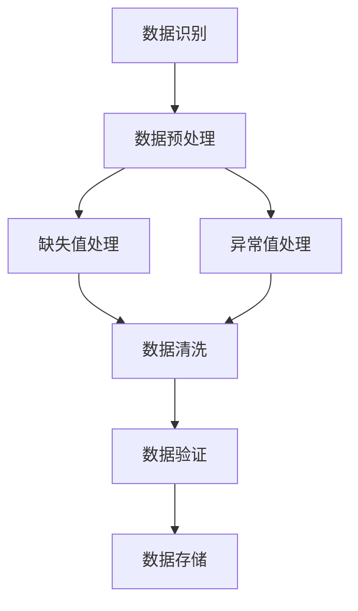
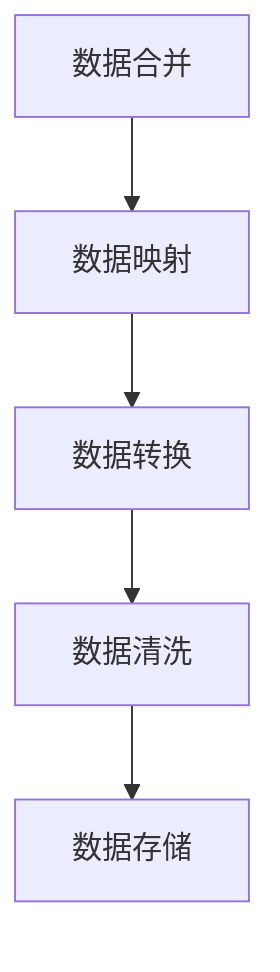
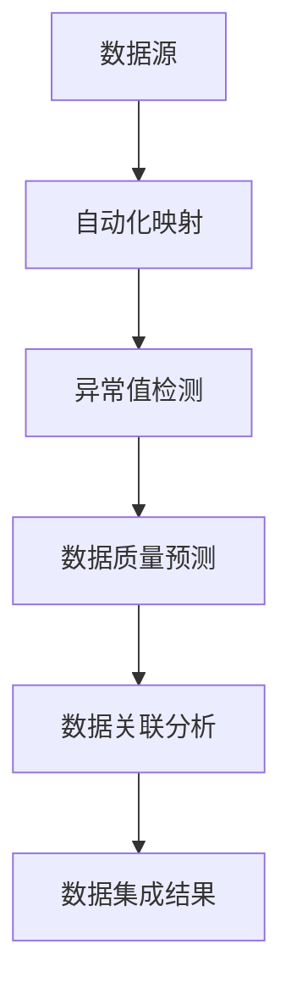
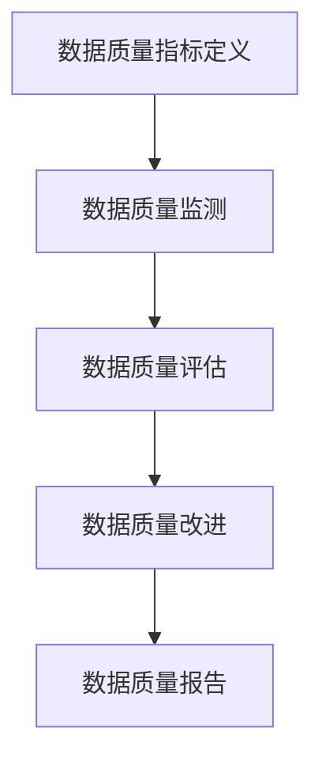
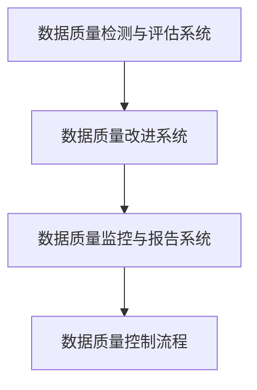
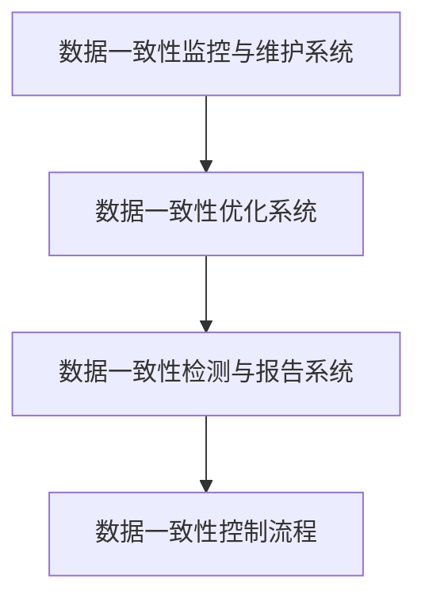

                 

## 构建企业级AI数据治理助手：确保数据质量与一致性

### 关键词：数据治理，AI，数据质量，一致性，企业级系统

### 摘要：
本文章深入探讨了构建企业级AI数据治理助手的必要性和方法，重点分析了数据质量与一致性的核心问题。文章首先介绍了数据治理的基本概念和重要性，然后探讨了AI技术在数据治理中的应用，接着详细阐述了数据质量和一致性的定义、评估方法和解决方案。文章进一步讲解了企业级AI数据治理架构的设计原则、工具选择和应用案例。最后，文章提出了数据治理策略的最佳实践，展望了未来的发展趋势，并给出了进一步的学习资源推荐。

### 目录

----------------------------------------------------------------

## 第一部分：引言与背景

### 第1章：引言

#### 1.1 问题的背景与重要性
- 数据治理的重要性
- AI在企业中的角色
- 数据质量与一致性的挑战

#### 1.2 书籍概述与目标
- 书籍的总体架构
- 阅读对象
- 学习目标

## 第二部分：数据治理基础

### 第2章：数据治理基础

#### 2.1 数据治理的概念
- 数据治理的定义
- 数据治理的目标
- 数据治理的组成部分

#### 2.2 数据质量
- 数据质量的定义
- 数据质量的关键特性
- 数据质量的评估方法

#### 2.3 数据一致性
- 数据一致性的定义
- 数据一致性的挑战
- 数据一致性的解决方案

## 第三部分：AI数据治理技术

### 第3章：AI数据治理技术

#### 3.1 AI在数据治理中的应用
- AI技术的概述
- AI在数据治理中的优势

#### 3.2 数据清洗
- 数据清洗的概念
- 数据清洗的主要步骤
- AI在数据清洗中的应用

#### 3.3 数据集成
- 数据集成的概念
- 数据集成的策略
- AI在数据集成中的应用

## 第四部分：企业级AI数据治理架构设计

### 第4章：企业级AI数据治理架构设计

#### 4.1 数据治理架构概述
- 数据治理架构的设计原则
- 数据治理架构的组成部分

#### 4.2 数据质量管理系统设计
- 数据质量检测与评估系统设计
- 数据质量改进系统设计

#### 4.3 数据一致性管理设计
- 数据一致性监控与维护系统设计
- 数据一致性优化系统设计

## 第五部分：AI数据治理工具与应用

### 第5章：AI数据治理工具与应用

#### 5.1 数据治理工具介绍
- 数据治理工具的选择标准
- 常见的数据治理工具介绍

#### 5.2 AI数据治理案例分析
- 案例一：数据质量管理案例
- 案例二：数据一致性管理案例

#### 5.3 AI数据治理实践
- AI数据治理实践的关键步骤
- 实践中的挑战与解决方案

## 第六部分：AI数据治理策略与最佳实践

### 第6章：AI数据治理策略与最佳实践

#### 6.1 数据治理策略
- 数据治理策略的制定
- 数据治理策略的实施

#### 6.2 最佳实践
- 数据治理最佳实践案例
- 数据治理策略优化建议

#### 6.3 注意事项
- 数据治理中的常见问题
- 数据治理中的风险管理

## 第七部分：未来展望与趋势

### 第7章：未来展望与趋势

#### 7.1 AI数据治理的发展趋势
- AI数据治理的未来发展方向
- 数据治理技术的新趋势

#### 7.2 挑战与机遇
- 数据治理面临的挑战
- 数据治理带来的机遇

#### 7.3 结语
- 书籍总结
- 进一步学习资源推荐

----------------------------------------------------------------

### 第1章：引言

#### 1.1 问题的背景与重要性

在现代企业中，数据已成为最宝贵的资产之一。然而，随着数据量的爆炸式增长和数据来源的多样性，企业面临着数据质量与一致性的巨大挑战。这不仅影响企业的业务决策，还可能导致严重的商业风险。

**数据治理的重要性：** 数据治理是一种管理和维护数据的方法论，其目的是确保数据的准确性、完整性、可用性和一致性。良好的数据治理能够提高数据质量，降低数据风险，从而提升企业的竞争力。

**AI在企业中的角色：** 人工智能（AI）技术的发展为数据治理提供了强大的工具。AI能够通过自动化的方式识别数据中的错误、异常和模式，从而提高数据清洗和数据集成的效率。

**数据质量与一致性的挑战：** 企业在数据治理中面临的主要挑战包括数据冗余、数据不一致、数据缺失和数据错误。这些问题可能导致业务流程的中断，影响企业的运营效率。

#### 1.2 书籍概述与目标

本书旨在提供一个全面的指南，帮助企业和开发者构建企业级AI数据治理助手。本书将涵盖以下主题：

1. 数据治理基础，包括数据治理的概念、数据质量和数据一致性。
2. AI数据治理技术，介绍AI在数据治理中的应用。
3. 企业级AI数据治理架构设计，包括数据质量管理系统和数据一致性管理系统。
4. AI数据治理工具与应用，介绍常见的数据治理工具和案例分析。
5. 数据治理策略与最佳实践，包括数据治理策略的制定和实施。
6. 未来展望与趋势，探讨AI数据治理的发展方向和挑战。

通过本书，读者将能够：

- 理解数据治理的概念和重要性。
- 掌握AI数据治理的基本原理和工具。
- 设计和实现企业级AI数据治理系统。
- 应用最佳实践，提高数据质量和一致性。

#### 1.3 阅读对象

本书适合以下读者：

- 数据科学家和数据工程师，需要了解如何利用AI技术进行数据治理。
- 企业IT管理人员，希望提高企业的数据管理能力。
- 数据治理咨询师，希望了解最新的AI数据治理技术和最佳实践。
- AI和大数据领域的开发者，希望深入了解数据治理的实战应用。

#### 1.4 学习目标

通过阅读本书，读者将能够：

- 掌握数据治理的基本概念和原则。
- 了解AI技术在数据治理中的应用。
- 设计和实现企业级AI数据治理系统。
- 应用最佳实践，确保数据质量和一致性。
- 了解AI数据治理的未来发展趋势。

### 第2章：数据治理基础

#### 2.1 数据治理的概念

数据治理是指一系列管理和控制数据的方法和流程，以确保数据的准确性、完整性、可用性和一致性。数据治理的目的是最大化数据的业务价值，同时降低数据风险。

**数据治理的目标：** 
- 确保数据的质量和完整性。
- 提高数据可用性和可访问性。
- 降低数据风险和合规风险。
- 支持企业的战略决策。

**数据治理的组成部分：** 数据治理通常包括以下组成部分：

- 数据策略：定义企业的数据战略、目标和方针。
- 数据架构：设计企业的数据架构，包括数据模型、数据仓库和数据集成。
- 数据标准：制定数据标准，确保数据的一致性和质量。
- 数据管理：实施数据管理流程，包括数据备份、恢复和数据安全。
- 数据质量：监控和改进数据质量，确保数据满足业务需求。
- 数据治理组织：建立数据治理组织，负责数据治理的实施和监督。

#### 2.2 数据质量

数据质量是指数据满足业务需求的能力。高质量的数据能够支持准确的业务分析和决策。数据质量的关键特性包括：

- 准确性：数据是否真实、正确和可靠。
- 完整性：数据是否完整，没有缺失或重复。
- 一致性：数据在不同系统、来源和应用之间是否一致。
- 可用性：数据是否易于访问和使用。
- 时效性：数据是否是最新的，是否反映了当前的业务状态。

**数据质量的评估方法：**
- 自查表：通过调查和问答来评估数据质量。
- 数据质量仪表板：使用仪表板和可视化工具来监控数据质量。
- 数据质量评估工具：使用自动化工具来评估数据质量，如数据质量检测器、数据清洗工具等。

#### 2.3 数据一致性

数据一致性是指数据在不同系统、来源和应用之间的一致性。数据一致性的挑战主要包括：

- 数据冗余：同一数据在不同系统中重复存储。
- 数据不一致：同一数据在不同系统中存在差异。
- 数据孤岛：不同系统之间的数据无法共享和集成。

**数据一致性的解决方案：**
- 数据标准化：制定统一的数据标准和规范，确保数据在不同系统之间的一致性。
- 数据集成：通过数据集成技术，将不同系统中的数据统一到一个数据源。
- 数据同步：实时或定期同步不同系统之间的数据，确保数据的一致性。

#### 2.4 数据治理的边界与外延

数据治理不仅涉及技术层面，还包括组织文化和业务流程。以下是对数据治理边界与外延的探讨：

- **技术层面：** 数据治理需要技术工具的支持，如数据仓库、数据集成工具、数据质量工具等。
- **组织层面：** 数据治理需要企业的组织结构和流程支持，如数据治理委员会、数据治理团队、数据所有权等。
- **业务流程：** 数据治理需要与企业的业务流程相结合，确保数据在业务流程中的有效管理和使用。

### 2.5 数据治理的核心概念与联系

为了更好地理解数据治理，我们需要探讨几个核心概念及其相互关系。以下是一个核心概念属性特征对比表格，帮助我们更清晰地理解这些概念：

| 概念         | 定义                                                         | 特征对比                                                         |
| ------------ | ------------------------------------------------------------ | ------------------------------------------------------------ |
| 数据治理     | 管理数据的方法论，确保数据的准确性、完整性、可用性和一致性。 | 包括数据策略、数据架构、数据标准、数据管理等。                 |
| 数据质量     | 数据满足业务需求的能力。                                     | 包括准确性、完整性、一致性、可用性和时效性。                   |
| 数据一致性   | 数据在不同系统、来源和应用之间的一致性。                     | 解决数据冗余、不一致和数据孤岛问题。                           |
| 数据完整性   | 数据的完整性和无缺失。                                       | 确保数据没有重复、缺失或错误。                                 |
| 数据可用性   | 数据易于访问和使用。                                         | 确保数据在需要时可以快速、方便地获取。                          |
| 数据安全性   | 数据的保密性、完整性和可用性。                               | 确保数据不被未授权访问、篡改或丢失。                           |

#### 数据治理的ER实体关系图架构

为了更好地理解数据治理的组成部分和关系，我们可以使用Mermaid语法绘制一个ER实体关系图。以下是一个简单的ER图示例：

```mermaid
erDiagram
  DataGovernance ||--|{ DataStrategy : 包含 |
  DataGovernance ||--|{ DataArchitecture : 设计 |
  DataGovernance ||--|{ DataStandard : 标准 |
  DataGovernance ||--|{ DataManagement : 管理 |
  DataQuality ||--|{ Accuracy : 准确性 |
  DataQuality ||--|{ Completeness : 完整性 |
  DataQuality ||--|{ Consistency : 一致性 |
  DataQuality ||--|{ Availability : 可用性 |
  DataQuality ||--|{ Timeliness : 时效性 |
  DataConsistency ||--|{ DataStandardization : 标准化 |
  DataConsistency ||--|{ DataIntegration : 集成 |
  DataConsistency ||--|{ DataSynchronization : 同步 |
```

这个ER图展示了数据治理的核心组成部分及其相互关系。通过ER图，我们可以清晰地看到数据治理、数据质量、数据一致性和数据安全性等概念之间的关系。

### 第3章：AI数据治理技术

#### 3.1 AI在数据治理中的应用

人工智能（AI）技术在数据治理中具有广泛的应用。AI能够通过自动化、智能化的方式提高数据治理的效率和质量。以下是AI在数据治理中的几个关键应用：

**1. 数据清洗：** 数据清洗是数据治理的重要步骤，旨在识别和纠正数据中的错误、异常和冗余。AI技术可以通过机器学习算法自动识别数据模式，从而更高效地清洗数据。

**2. 数据集成：** 数据集成是将来自不同来源的数据合并到统一数据源的过程。AI技术可以帮助自动识别和匹配不同数据源中的数据，从而实现高效的数据集成。

**3. 数据质量监测与改进：** AI技术可以实时监测数据质量，并通过预测分析技术预测数据质量问题，从而提前采取改进措施。

**4. 数据分类与标注：** AI技术可以帮助自动分类和标注数据，从而提高数据处理的效率。

**5. 数据可视化：** AI技术可以通过生成可视化图表和报告，帮助用户更直观地理解数据。

#### 3.2 数据清洗

数据清洗是数据治理的关键步骤，旨在识别和纠正数据中的错误、异常和冗余。以下是数据清洗的主要步骤：

**1. 数据识别：** 确定需要清洗的数据集，包括数据来源、格式和内容。

**2. 数据预处理：** 对数据进行预处理，包括数据格式转换、缺失值处理、异常值处理等。

**3. 数据清洗：** 使用算法和规则清洗数据，包括删除重复记录、纠正错误、填补缺失值等。

**4. 数据验证：** 对清洗后的数据进行验证，确保数据质量达到预期标准。

**5. 数据存储：** 将清洗后的数据存储到目标数据仓库或数据库中，以便后续使用。

以下是使用Mermaid语法绘制的数据清洗流程图：



#### 3.3 数据集成

数据集成是将来自不同来源的数据合并到统一数据源的过程。以下是数据集成的策略：

**1. 数据合并：** 将多个数据源中的数据进行合并，生成一个新的数据集。

**2. 数据映射：** 将不同数据源中的数据映射到统一的数据模型。

**3. 数据转换：** 对数据进行转换，以确保数据格式和结构的一致性。

**4. 数据清洗：** 在集成过程中对数据进行清洗，以提高数据质量。

**5. 数据存储：** 将集成后的数据存储到统一的数据仓库或数据库中。

以下是使用Mermaid语法绘制的数据集成流程图：



#### 3.4 AI在数据集成中的应用

AI技术可以在数据集成过程中发挥重要作用，以下是几个应用示例：

**1. 自动化数据映射：** 使用机器学习算法自动识别和映射不同数据源中的数据字段，提高数据集成的效率。

**2. 异常值检测：** 使用AI技术检测和纠正数据集成过程中的异常值，提高数据质量。

**3. 数据质量预测：** 使用AI技术预测数据集成过程中的潜在质量问题，提前采取改进措施。

**4. 数据关联分析：** 使用AI技术分析不同数据源之间的关联性，提高数据集成的效果。

以下是使用Mermaid语法绘制的AI在数据集成中的应用流程图：



#### 3.5 数据质量监测与改进

数据质量监测与改进是确保数据持续高质量的重要环节。以下是几个关键步骤：

**1. 数据质量指标定义：** 定义数据质量的关键指标，如准确性、完整性、一致性等。

**2. 数据质量监测：** 使用数据质量监测工具实时监控数据质量，发现潜在问题。

**3. 数据质量评估：** 对数据质量进行定期评估，识别存在的问题。

**4. 数据质量改进：** 根据评估结果，采取改进措施，提高数据质量。

**5. 数据质量报告：** 定期生成数据质量报告，向相关人员进行反馈。

以下是使用Mermaid语法绘制的数据质量监测与改进流程图：



### 第4章：企业级AI数据治理架构设计

#### 4.1 数据治理架构概述

企业级AI数据治理架构是确保数据质量和一致性的关键。一个有效的数据治理架构需要综合考虑技术、组织和流程等方面。以下是数据治理架构的设计原则：

**1. 统一的数据战略：** 明确企业的数据战略目标，确保数据治理工作与企业的战略目标一致。

**2. 整合的数据架构：** 设计一个整合的数据架构，包括数据仓库、数据湖、数据模型等，以支持数据治理。

**3. 标准化的数据标准：** 制定统一的数据标准，确保数据在不同系统之间的一致性。

**4. 自动化的数据处理：** 使用自动化工具和算法提高数据处理效率，降低人工干预。

**5. 安全的数据管理：** 确保数据的安全性和隐私性，遵循相关法规和标准。

**6. 透明的数据治理流程：** 建立透明的数据治理流程，确保所有相关人员都能了解数据治理的工作内容。

**7. 专业的数据治理团队：** 建立专业的数据治理团队，负责数据治理的规划、执行和监督。

#### 4.2 数据质量管理系统设计

数据质量管理系统是确保数据质量和一致性的关键组件。以下是数据质量管理系统的主要组成部分：

**1. 数据质量检测与评估系统：** 使用AI技术和算法对数据进行质量检测和评估，识别数据中的错误、异常和冗余。

**2. 数据质量改进系统：** 根据数据质量评估结果，采取改进措施，提高数据质量。

**3. 数据质量监控与报告系统：** 实时监控数据质量，生成数据质量报告，向相关人员提供反馈。

**4. 数据质量控制流程：** 建立数据质量控制流程，确保数据质量持续满足业务需求。

以下是使用Mermaid语法绘制的数据质量管理系统架构图：



#### 4.3 数据一致性管理设计

数据一致性管理是确保数据在不同系统、来源和应用之间的一致性。以下是数据一致性管理的主要组成部分：

**1. 数据一致性监控与维护系统：** 监控数据在不同系统、来源和应用之间的不一致性，采取维护措施确保数据一致性。

**2. 数据一致性优化系统：** 对数据一致性进行优化，提高数据一致性水平。

**3. 数据一致性检测与报告系统：** 检测数据一致性，生成报告，向相关人员提供反馈。

**4. 数据一致性控制流程：** 建立数据一致性控制流程，确保数据一致性满足业务需求。

以下是使用Mermaid语法绘制的数据一致性管理系统架构图：



### 第5章：AI数据治理工具与应用

#### 5.1 数据治理工具介绍

在构建企业级AI数据治理系统时，选择合适的工具至关重要。以下是几种常见的数据治理工具及其特点：

**1. Talend：** Talend是一个集成平台，提供数据集成、数据质量和数据管理的功能。它支持各种数据源和目标，具有高性能和易用性。

**2. Informatica：** Informatica是一个成熟的数据集成平台，提供广泛的数据治理功能，包括数据质量、数据集成和数据安全管理。

**3. IBM InfoSphere：** IBM InfoSphere提供全面的数据治理解决方案，包括数据集成、数据质量和数据安全等功能。

**4. SAS：** SAS提供数据治理工具，包括数据质量、数据集成和数据发现等功能。它具有强大的数据分析和预测功能。

**5. OpenText：** OpenText提供数据治理工具，包括数据质量、数据管理和数据安全等功能。它支持多种数据源和平台。

#### 5.2 AI数据治理案例分析

以下是一个数据质量管理案例：

**案例背景：** 一家大型零售企业需要确保其销售数据的质量，以支持业务分析和决策。

**解决方案：** 
- 使用AI技术进行数据质量监测，识别数据中的错误和异常。
- 使用数据清洗工具进行数据清洗，纠正错误和填补缺失值。
- 使用数据质量仪表板实时监控数据质量，生成报告。

**效果：** 数据质量得到显著提升，业务决策更加准确。

以下是一个数据一致性管理案例：

**案例背景：** 一家金融机构需要确保其客户数据在不同系统之间的一致性。

**解决方案：**
- 使用AI技术进行数据一致性监测，识别数据不一致性。
- 使用数据集成工具进行数据同步，确保数据一致性。
- 使用数据一致性仪表板实时监控数据一致性，生成报告。

**效果：** 数据一致性水平得到显著提升，业务流程更加顺畅。

#### 5.3 AI数据治理实践

在实施AI数据治理时，以下是几个关键步骤：

**1. 需求分析：** 分析企业的数据治理需求，确定数据治理的目标和范围。

**2. 工具选择：** 根据需求选择合适的数据治理工具。

**3. 数据集成：** 使用数据集成工具将不同来源的数据集成到统一的数据仓库。

**4. 数据清洗：** 使用AI技术和数据清洗工具对数据进行清洗，提高数据质量。

**5. 数据质量监测：** 使用AI技术和数据质量监测工具实时监控数据质量。

**6. 数据一致性监测：** 使用AI技术和数据一致性监测工具确保数据一致性。

**7. 数据治理策略制定：** 制定数据治理策略，确保数据治理工作持续进行。

**8. 数据治理培训：** 对相关人员提供数据治理培训，确保他们了解数据治理的重要性和方法。

#### 5.4 挑战与解决方案

在实施AI数据治理时，企业可能会面临以下挑战：

**1. 数据质量问题：** 数据质量问题可能导致业务决策失误。解决方案是使用AI技术和数据清洗工具进行数据清洗。

**2. 数据不一致性：** 数据不一致性可能导致业务流程中断。解决方案是使用AI技术和数据集成工具确保数据一致性。

**3. 数据安全风险：** 数据治理过程中可能涉及敏感数据。解决方案是使用数据加密和访问控制等技术确保数据安全。

**4. 数据治理成本：** 数据治理可能需要大量时间和资源。解决方案是采用自动化工具和优化流程，降低数据治理成本。

### 第6章：AI数据治理策略与最佳实践

#### 6.1 数据治理策略

数据治理策略是指一系列指导和行动方针，用于确保数据的质量、一致性和安全性。以下是制定数据治理策略的关键步骤：

**1. 定义数据治理目标：** 明确企业的数据治理目标，如提高数据质量、确保数据一致性、降低数据风险等。

**2. 评估数据治理现状：** 分析企业的数据治理现状，包括数据质量、数据一致性、数据安全等方面。

**3. 确定数据治理原则：** 制定数据治理原则，如数据准确性、完整性、一致性、可用性等。

**4. 制定数据治理流程：** 设计数据治理的流程，包括数据采集、数据存储、数据清洗、数据集成、数据质量监测等。

**5. 建立数据治理组织：** 建立数据治理组织，包括数据治理委员会、数据治理团队等，负责数据治理的实施和监督。

**6. 制定数据治理计划：** 制定详细的执行计划，包括时间表、资源需求、职责分配等。

**7. 持续改进：** 持续评估和改进数据治理策略，确保其与业务需求保持一致。

#### 6.2 最佳实践

以下是一些数据治理的最佳实践：

**1. 使用数据质量指标：** 制定数据质量指标，如准确性、完整性、一致性、可用性等，并定期进行评估。

**2. 实施自动化数据清洗：** 使用自动化工具进行数据清洗，提高效率和质量。

**3. 建立数据治理流程：** 建立明确的数据治理流程，确保数据从采集到存储、处理、分析的全过程得到有效管理。

**4. 实施数据分类和标签：** 对数据进行分类和标签，以便于管理和检索。

**5. 确保数据安全：** 实施数据加密、访问控制等技术，确保数据安全。

**6. 定期培训：** 对相关人员定期进行数据治理培训，提高数据治理意识和能力。

**7. 利用AI技术：** 利用AI技术进行数据质量监测、数据清洗和数据关联分析，提高数据治理的效率。

#### 6.3 注意事项

在实施数据治理时，需要注意以下几点：

**1. 数据治理需要全员参与：** 数据治理不仅是IT部门的责任，也需要业务部门、管理层等全员参与。

**2. 数据治理需要持续改进：** 数据治理不是一次性的任务，而是一个持续的过程，需要不断评估和改进。

**3. 数据治理需要平衡效率与质量：** 在保证数据质量的同时，也需要考虑数据治理的效率和成本。

**4. 数据治理需要与业务需求紧密结合：** 数据治理的目标是支持业务需求，因此需要与业务部门密切合作。

**5. 数据治理需要遵循法规和标准：** 数据治理需要遵循相关的法规和标准，如GDPR、ISO 27001等。

### 第7章：未来展望与趋势

#### 7.1 AI数据治理的发展趋势

随着AI技术的不断进步，AI数据治理也在不断演进。以下是AI数据治理的发展趋势：

**1. 自动化与智能化：** AI技术将进一步自动化数据治理流程，提高数据治理的效率和质量。

**2. 人工智能驱动的数据质量监测：** 利用AI技术进行数据质量监测，能够实时发现数据质量问题，并自动采取改进措施。

**3. 多源异构数据的整合：** 随着数据来源的多样性，AI数据治理将能够更好地整合多源异构数据，提高数据一致性。

**4. 数据隐私与安全：** 数据隐私和安全将是未来AI数据治理的重要方向，确保数据在治理过程中的安全性和合规性。

**5. 透明与可解释性：** 为了提高数据治理的透明度和可解释性，AI技术将能够更好地解释数据治理决策和结果。

#### 7.2 挑战与机遇

在AI数据治理的发展过程中，企业将面临以下挑战：

**1. 数据质量与安全：** 数据质量和安全是数据治理的核心问题，需要不断优化和加强。

**2. 数据治理成本：** 数据治理需要投入大量的人力、时间和资源，企业需要平衡成本与效益。

**3. 数据隐私与合规：** 随着数据隐私法规的日益严格，企业需要确保数据治理符合相关法规要求。

然而，AI数据治理也为企业带来了新的机遇：

**1. 提高业务效率：** AI数据治理能够提高数据治理的效率，为企业带来更准确的业务分析和决策支持。

**2. 创新业务模式：** AI数据治理可以帮助企业发现新的业务机会，创新业务模式。

**3. 数据驱动决策：** AI数据治理能够提供更丰富的数据资源，支持数据驱动决策。

### 结语

本文系统地介绍了构建企业级AI数据治理助手的必要性和方法，从数据治理基础、AI数据治理技术、数据治理架构设计到数据治理策略与最佳实践，全面探讨了确保数据质量与一致性的关键问题。随着AI技术的不断发展，AI数据治理将成为企业提升竞争力的重要手段。

作者：AI天才研究院/AI Genius Institute & 禅与计算机程序设计艺术 /Zen And The Art of Computer Programming

