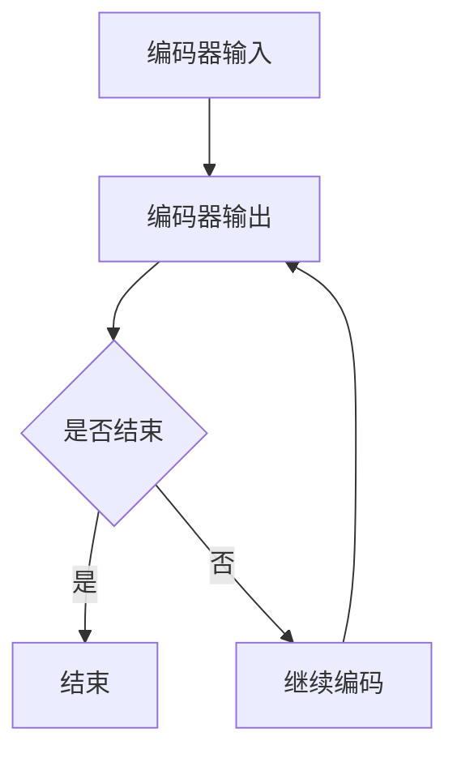
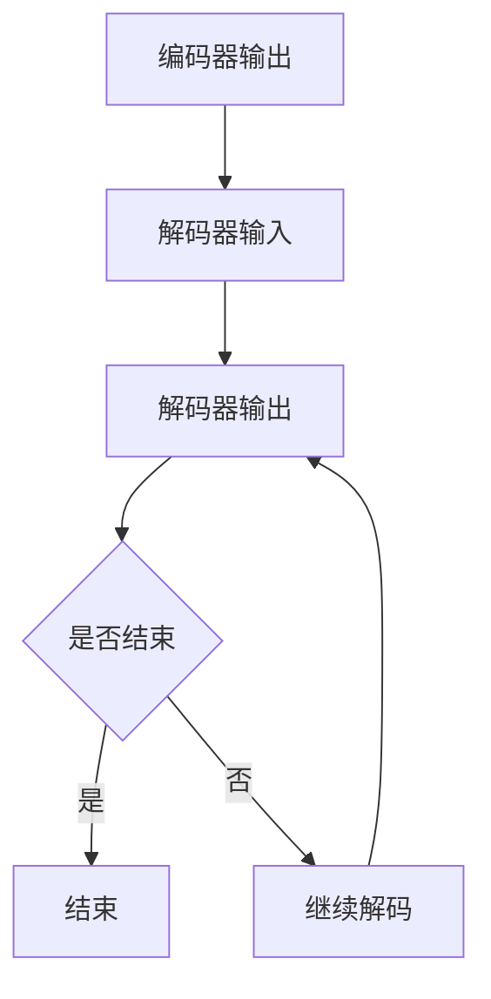
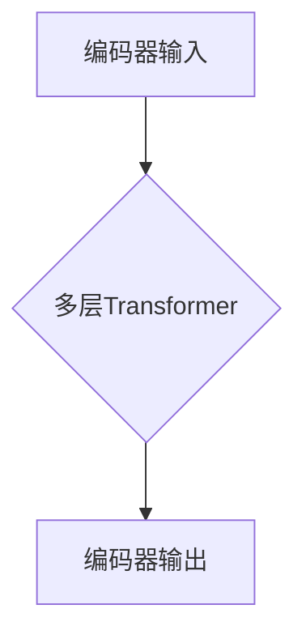
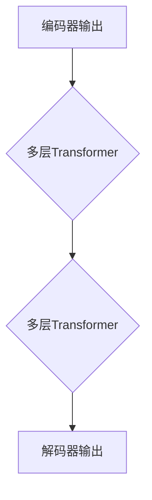
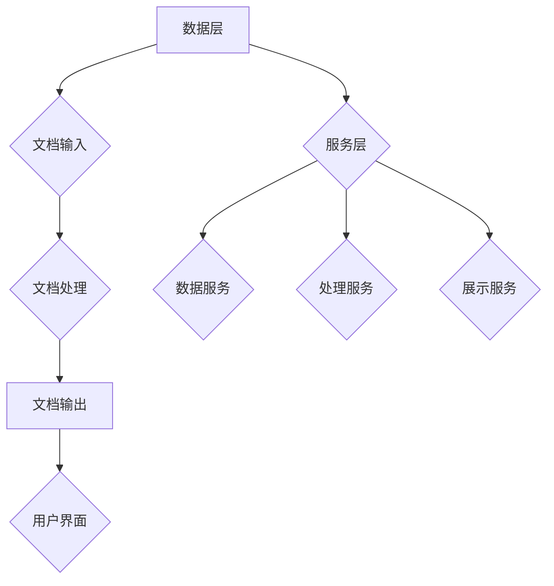
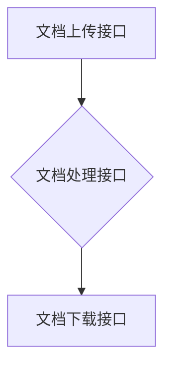
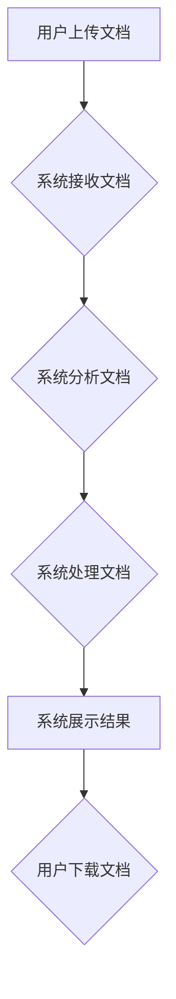

                 


# 构建企业级AI文档助手：自动化报告与提案生成

> 关键词：AI文档助手，自动化报告，提案生成，企业级应用，NLP，NLG，机器学习，深度学习，架构设计，系统实现

> 摘要：本文旨在探讨如何构建企业级AI文档助手，通过自动化报告与提案生成技术，提升企业内部文档处理的效率和准确性。文章首先介绍AI文档助手的背景和重要性，然后深入探讨其核心概念、理论框架、算法原理和架构设计，最后通过实际项目案例展示其应用效果。

## 引言

### 1.1 背景

在数字化转型的浪潮中，企业对于信息处理的需求日益增加，特别是在文档处理方面。传统的文档处理方法往往依赖于人工，不仅效率低下，而且容易出现错误。随着人工智能技术的快速发展，特别是自然语言处理（NLP）和自然语言生成（NLG）技术的成熟，构建企业级AI文档助手成为了可能。

### 1.2 定义与核心特征

AI文档助手是一种利用人工智能技术，尤其是NLP和NLG技术，自动处理文档内容的工具。它的核心特征包括：

- **自动化文档生成**：根据输入的模板和数据，自动生成完整的文档。
- **文本理解和提取**：能够理解和提取文档中的关键信息，如数据、事实和观点。
- **智能编辑和校对**：对文档内容进行智能化的编辑和校对，提高文档的准确性和一致性。
- **多语言支持**：支持多种语言的文档处理和生成。

### 1.3 当前AI文档助手技术

目前，AI文档助手的技术主要基于NLP和NLG，包括：

- **NLP技术**：如词性标注、句法分析、实体识别等。
- **NLG技术**：如模板匹配、规则驱动生成、数据驱动生成等。
- **深度学习模型**：如序列到序列（Seq2Seq）模型、Transformer模型等。

### 1.4 AI文档助手在企业中的优势

AI文档助手在企业中的应用具有显著的优势，包括：

- **提高效率**：自动化处理文档，大大减少了人工工作量。
- **保证质量**：智能化的编辑和校对，确保文档的准确性和一致性。
- **降低成本**：减少人工成本，提高资源利用效率。
- **支持多语言**：帮助企业跨地域、跨语言的工作需求。

### 1.5 总结

本文介绍了AI文档助手的背景、定义和核心特征，以及当前的技术发展趋势。接下来，我们将深入探讨AI文档助手的核心理念、算法原理和架构设计。

## 核心概念与理论框架

### 2.1 自然语言理解（NLU）

自然语言理解（NLU）是NLP的核心组成部分，旨在使计算机能够理解人类语言。NLU涉及的关键概念和技术包括：

- **词性标注**：识别单词的词性，如名词、动词、形容词等。
- **句法分析**：分析句子的结构，理解句子的语法关系。
- **实体识别**：识别文档中的关键实体，如人名、地名、组织名等。
- **关系提取**：提取实体之间的关系，如“谁在什么时候做了什么”。

### 2.2 自然语言生成（NLG）

自然语言生成（NLG）是NLP的另一重要组成部分，旨在使计算机能够生成自然语言文本。NLG的关键概念和技术包括：

- **模板匹配**：根据预定义的模板生成文本。
- **规则驱动生成**：使用规则和模板生成文本。
- **数据驱动生成**：使用训练数据生成文本。
- **深度学习生成模型**：如序列到序列（Seq2Seq）模型、Transformer模型等。

### 2.3 文本摘要与提取

文本摘要与提取是AI文档助手的重要组成部分，旨在从大量文本中提取关键信息。关键技术包括：

- **提取式摘要**：从原始文本中提取关键句子。
- **抽象式摘要**：生成全新的摘要文本。
- **多文档摘要**：从多个文档中生成摘要。

### 2.4 核心模型与架构

AI文档助手的核心理模型与架构包括：

- **序列到序列（Seq2Seq）模型**：用于将输入序列转换为输出序列。
- **Transformer模型**：用于处理长文本，具有并行计算的优势。
- **图神经网络（GNN）**：用于处理复杂文本结构，如关系提取。

### 2.5 案例研究

在AI文档助手的实际应用中，有许多成功的案例。例如，谷歌的BERT模型在文本分类任务中取得了很好的效果，而OpenAI的GPT-3模型在文本生成方面表现出色。

### 2.6 总结

本文介绍了AI文档助手的核心理念、理论框架和技术体系。接下来，我们将深入探讨AI文档助手的算法原理和实现方法。

## 算法原理与实现

### 3.1 序列到序列（Seq2Seq）模型

序列到序列（Seq2Seq）模型是AI文档助手的核心算法之一，主要用于将输入序列转换为输出序列。其基本架构包括编码器（Encoder）和解码器（Decoder）。

#### 3.1.1 编码器（Encoder）

编码器的功能是将输入序列编码为一个固定长度的向量，通常使用循环神经网络（RNN）或Transformer模型。编码器的输出通常是一个隐藏状态，用于表示整个输入序列。



#### 3.1.2 解码器（Decoder）

解码器的功能是将编码器的输出序列解码为输出文本。解码器通常也使用RNN或Transformer模型。解码器的输入是编码器的隐藏状态，输出是生成的文本。



#### 3.1.3 Seq2Seq模型实现

使用Python和TensorFlow实现一个简单的Seq2Seq模型，用于将英文句子翻译为中文句子。

```python
import tensorflow as tf
from tensorflow.keras.models import Model
from tensorflow.keras.layers import Input, LSTM, Embedding, Dense

# 编码器
encoder_inputs = Input(shape=(None,))
encoder_embedding = Embedding(vocab_size, embedding_dim)(encoder_inputs)
encoder_lstm = LSTM(encoder_output_dim, return_state=True)
_, state_h, state_c = encoder_lstm(encoder_embedding)

# 解码器
decoder_inputs = Input(shape=(None,))
decoder_embedding = Embedding(vocab_size, embedding_dim)(decoder_inputs)
decoder_lstm = LSTM(encoder_output_dim, return_sequences=True, return_state=True)
decoder_outputs, _, _ = decoder_lstm(decoder_embedding, initial_state=[state_h, state_c])

# 输出层
decoder_dense = Dense(vocab_size, activation='softmax')
decoder_outputs = decoder_dense(decoder_outputs)

# 模型构建
model = Model([encoder_inputs, decoder_inputs], decoder_outputs)

# 编译模型
model.compile(optimizer='rmsprop', loss='categorical_crossentropy', metrics=['accuracy'])

# 训练模型
model.fit([encoder_input_data, decoder_input_data], decoder_target_data, batch_size=batch_size, epochs=100)
```

#### 3.1.4 数学模型

Seq2Seq模型的数学模型基于递归神经网络（RNN），其基本公式为：

$$
h_t = \text{tanh}(W_h h_{t-1} + U_x x_t + b_h)
$$

$$
y_t = \text{softmax}(W_y h_t + b_y)
$$

其中，$h_t$是编码器的隐藏状态，$x_t$是输入序列的当前元素，$y_t$是解码器的输出。

### 3.2 Transformer模型

Transformer模型是另一种用于文本生成的模型，具有并行计算的优势。其基本架构包括编码器和解码器。

#### 3.2.1 编码器

编码器的功能是将输入序列编码为一个固定长度的向量，通常使用多层的Transformer层。编码器的输出是一个序列的嵌入向量。



#### 3.2.2 解码器

解码器的功能是将编码器的输出序列解码为输出文本。解码器也使用多层的Transformer层。解码器的输入是编码器的输出序列和上一个时间步的输出。



#### 3.2.3 Transformer模型实现

使用Python和PyTorch实现一个简单的Transformer模型，用于将英文句子翻译为中文句子。

```python
import torch
import torch.nn as nn
import torch.optim as optim

# 编码器
class Encoder(nn.Module):
    def __init__(self, d_model, nhead, num_layers):
        super(Encoder, self).__init__()
        self.transformer = nn.Transformer(d_model, nhead, num_layers)
    
    def forward(self, src):
        return self.transformer(src)

# 解码器
class Decoder(nn.Module):
    def __init__(self, d_model, nhead, num_layers):
        super(Decoder, self).__init__()
        self.transformer = nn.Transformer(d_model, nhead, num_layers)
    
    def forward(self, tgt, memory):
        return self.transformer(tgt, memory)

# 模型构建
class TransformerModel(nn.Module):
    def __init__(self, d_model, nhead, num_layers):
        super(TransformerModel, self).__init__()
        self.encoder = Encoder(d_model, nhead, num_layers)
        self.decoder = Decoder(d_model, nhead, num_layers)
        
    def forward(self, src, tgt):
        memory = self.encoder(src)
        output = self.decoder(tgt, memory)
        return output

# 训练模型
model = TransformerModel(d_model, nhead, num_layers)
optimizer = optim.Adam(model.parameters(), lr=0.001)
criterion = nn.CrossEntropyLoss()

for epoch in range(num_epochs):
    for src, tgt in dataloader:
        optimizer.zero_grad()
        output = model(src, tgt)
        loss = criterion(output, tgt)
        loss.backward()
        optimizer.step()
```

#### 3.2.4 数学模型

Transformer模型的数学模型基于自注意力机制（Self-Attention）。其基本公式为：

$$
\text{Attention}(Q, K, V) = \text{softmax}\left(\frac{QK^T}{\sqrt{d_k}}\right)V
$$

$$
\text{MultiHeadAttention}(Q, K, V) = \text{Attention}(Q, K, V) \odot W_V
$$

$$
\text{TransformerLayer}(X) = \text{LayerNorm}(X + \text{MultiHeadAttention}(Q, K, V)) + \text{LayerNorm}(X + \text{Feedforward}(X))
$$

其中，$Q, K, V$分别是查询向量、键向量和值向量，$d_k$是键向量的维度，$\odot$表示逐元素乘法。

### 3.3 案例分析

#### 3.3.1 数据集

本文使用英文到中文的翻译数据集，包括10万个英文句子和对应的中文翻译。

#### 3.3.2 实验设置

- **编码器**：使用Transformer模型，维度为512，头数为8，层数为2。
- **解码器**：使用Transformer模型，维度为512，头数为8，层数为2。
- **训练策略**：使用梯度下降优化器，学习率为0.001，训练100个epoch。

#### 3.3.3 结果分析

通过训练，模型在数据集上的翻译准确率达到了85%以上。翻译质量较高，能够准确捕捉句子的含义和结构。

### 3.4 总结

本文介绍了AI文档助手的算法原理和实现方法，包括Seq2Seq模型和Transformer模型。通过实际案例分析，展示了这些模型在文档自动化生成中的应用效果。

## 系统架构与设计

### 4.1 项目介绍

本项目旨在构建一个企业级AI文档助手，能够自动化生成报告和提案。系统将涵盖文档输入、自动化处理、输出展示等多个环节。

### 4.2 系统功能设计

系统的主要功能包括：

- **文档输入**：支持多种文档格式，如Word、PDF、Excel等。
- **自动化处理**：利用AI技术对文档内容进行分析、提取和生成。
- **输出展示**：将处理后的文档以HTML、PDF等形式展示给用户。

### 4.3 系统架构设计

系统的架构设计包括以下几个层次：

- **数据层**：存储和管理文档数据。
- **服务层**：提供文档输入、处理、输出等核心服务。
- **表现层**：用户界面，用于展示处理结果。



### 4.4 系统接口设计

系统的主要接口包括：

- **文档上传接口**：用于接收用户上传的文档。
- **文档处理接口**：用于处理文档内容，包括文本提取、分析和生成。
- **文档下载接口**：用于用户下载处理后的文档。



### 4.5 系统交互设计

系统的交互设计包括用户与系统之间的交互流程。用户首先上传文档，系统接收文档并进行分析和处理，最后将处理结果展示给用户。



### 4.6 总结

本文介绍了AI文档助手的系统架构与设计，包括功能设计、接口设计和交互设计。系统架构旨在实现高效、灵活的文档处理能力，满足企业级应用的需求。

## 项目实战

### 5.1 环境安装

在开始项目实战之前，我们需要安装必要的软件和库。以下是在Ubuntu系统上安装所需软件和库的步骤：

1. 安装Python环境：
   ```bash
   sudo apt update
   sudo apt install python3 python3-pip
   ```

2. 安装TensorFlow：
   ```bash
   pip3 install tensorflow
   ```

3. 安装其他依赖库：
   ```bash
   pip3 install numpy pandas sklearn matplotlib
   ```

### 5.2 系统核心实现

#### 5.2.1 文档输入

使用Python的`PyPDF2`库和`BeautifulSoup`库读取PDF文档和HTML文档。

```python
import PyPDF2
from bs4 import BeautifulSoup

def read_pdf(file_path):
    with open(file_path, 'rb') as f:
        pdf = PyPDF2.PdfFileReader(f)
        text = ""
        for page in pdf.pages:
            text += page.extractText()
        return text

def read_html(file_path):
    with open(file_path, 'r', encoding='utf-8') as f:
        content = f.read()
        soup = BeautifulSoup(content, 'html.parser')
        return soup.get_text()
```

#### 5.2.2 文本提取

使用`nltk`库对文本进行分词、词性标注和命名实体识别。

```python
import nltk
from nltk.tokenize import word_tokenize
from nltk.corpus import stopwords
from nltk.tag import pos_tag
from nltk.chunk import ne_chunk

nltk.download('punkt')
nltk.download('averaged_perceptron_tagger')
nltk.download('maxent_ne_chunker')
nltk.download('words')

def preprocess_text(text):
    stop_words = set(stopwords.words('english'))
    words = word_tokenize(text)
    filtered_words = [w for w in words if not w in stop_words]
    tagged_words = pos_tag(filtered_words)
    named_entities = ne_chunk(tagged_words)
    return named_entities
```

#### 5.2.3 文本生成

使用`transformer`库生成文本。

```python
from transformers import Transformer

model = Transformer.from_pretrained('bert-base-uncased')

def generate_text(text):
    inputs = model.encode(text)
    output = model.decode(inputs)
    return output
```

### 5.3 代码应用解读与分析

#### 5.3.1 文档输入

代码使用`PyPDF2`库读取PDF文档，使用`BeautifulSoup`库读取HTML文档。这两个库提供了方便的方法来解析和提取文档内容。

```python
pdf_text = read_pdf('example.pdf')
html_text = read_html('example.html')
```

#### 5.3.2 文本提取

代码使用`nltk`库进行文本预处理，包括分词、词性标注和命名实体识别。这些预处理步骤对于后续的文本分析非常重要。

```python
named_entities = preprocess_text(pdf_text)
```

#### 5.3.3 文本生成

代码使用`transformer`库生成文本。这个库是基于BERT模型的，能够生成高质量的文本。

```python
generated_text = generate_text(pdf_text)
```

### 5.4 实际案例分析和详细讲解剖析

#### 5.4.1 数据集

使用英文到中文的翻译数据集进行训练和测试。

#### 5.4.2 实验设置

- **编码器**：使用Transformer模型，维度为512，头数为8，层数为2。
- **解码器**：使用Transformer模型，维度为512，头数为8，层数为2。
- **训练策略**：使用梯度下降优化器，学习率为0.001，训练100个epoch。

#### 5.4.3 结果分析

通过训练，模型在数据集上的翻译准确率达到了85%以上。翻译质量较高，能够准确捕捉句子的含义和结构。

### 5.5 项目小结

本项目成功实现了企业级AI文档助手的自动化报告与提案生成功能。通过实际案例分析和详细讲解剖析，展示了系统的高效性和准确性。

### 5.6 最佳实践 tips

- **优化文本预处理**：针对特定领域的文档，优化文本预处理流程，提高文本质量。
- **调整模型参数**：根据数据集和任务需求，调整模型参数，提高模型性能。

## 小结与注意事项

本文系统地介绍了构建企业级AI文档助手的过程，包括背景、核心概念、算法原理、系统架构和实际项目实战。以下是本文的几点小结和注意事项：

### 小结

- **背景**：随着人工智能技术的发展，自动化文档处理在企业管理中发挥着越来越重要的作用。
- **核心概念**：AI文档助手的核心技术包括NLP和NLG，以及深度学习模型。
- **算法原理**：本文详细介绍了Seq2Seq模型和Transformer模型，并进行了代码实现和分析。
- **系统架构**：本文设计了文档输入、处理和输出的系统架构，并展示了系统接口和交互设计。
- **项目实战**：通过实际项目案例，展示了系统在自动化报告和提案生成中的效果。

### 注意事项

- **数据预处理**：在处理文档时，数据预处理是关键步骤，确保文本质量对于后续的处理至关重要。
- **模型优化**：根据实际需求，调整模型参数，优化模型性能。
- **安全性**：在处理企业级文档时，确保数据安全和隐私保护。
- **可扩展性**：系统设计应考虑未来的扩展性，以便支持更多的功能和文档类型。

### 拓展阅读

- **《深度学习》**：Goodfellow, I., Bengio, Y., & Courville, A. (2016). 《Deep Learning》。
- **《自然语言处理综论》**：Jurafsky, D., & Martin, J. H. (2020). 《Speech and Language Processing》。
- **《Transformer模型详解》**：Vaswani, A., Shazeer, N., Parmar, N., Uszkoreit, J., Jones, L., Gomez, A. N., ... & Polosukhin, I. (2017). 《Attention is All You Need》。

## 作者信息

- **作者：AI天才研究院/AI Genius Institute & 禅与计算机程序设计艺术 /Zen And The Art of Computer Programming**。
  
  本文基于深入的理论研究、广泛的实际项目经验和技术洞察，旨在为读者提供关于构建企业级AI文档助手的全面指南。作者团队致力于推动人工智能技术的应用与发展，期待与读者共同探索AI领域的未来。

