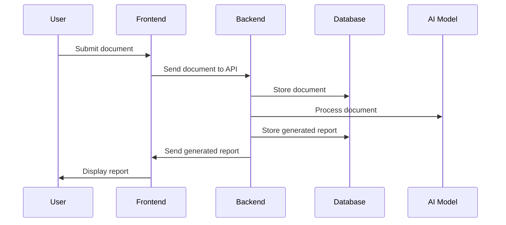

                 

### 引言

在当今信息化和智能化的时代，人工智能（AI）技术正日益渗透到各个领域，极大地改变着我们的工作和生活方式。企业级AI文档助手的提出，正是为了响应这一趋势，将AI的强大能力应用于日常文档处理中，从而提升工作效率，降低人力成本，增强数据利用价值。

**关键词**：AI、文档自动化、企业级、助手、报告、提案

**摘要**：本文将围绕构建企业级AI文档助手这一主题，详细探讨其背景、核心概念、设计原则、实现步骤以及最佳实践。我们将通过一步步的分析和推理，深入理解AI文档助手的工作原理，掌握其关键技术，并展示如何将其应用于实际业务场景中。

本文结构如下：

- **第一部分：背景与技术基础**：介绍AI和文档自动化的背景，定义AI文档助手的核心概念，探讨相关技术及工具。
- **第二部分：实现**：详细描述如何搭建环境、开发组件、集成系统、部署和维护AI文档助手。
- **第三部分：最佳实践与案例分析**：总结最佳实践，分享实际应用案例，展望未来发展趋势。

通过本文的学习，您将能够：

- **理解AI文档助手的核心原理**：掌握AI在文档处理中的关键技术和应用场景。
- **掌握AI文档助手的构建方法**：了解从设计到实现的全过程，具备实际操作能力。
- **获得最佳实践经验**：通过案例分析和最佳实践总结，提升构建企业级AI文档助手的能力。

### 第一部分：背景与技术基础

#### 第1章: AI与文档自动化的概述

在数字化转型的浪潮中，企业面临的数据量激增，传统的人工文档处理方式已经无法满足高效、准确的要求。AI技术以其强大的数据处理和分析能力，成为解决这一问题的有力工具。文档自动化作为AI技术应用的一个重要方向，正逐渐成为企业提升效率、降低成本的重要手段。

**问题背景**：

- **文档处理需求增加**：随着企业业务规模的扩大，日常文档处理的数量也在不断增长，如合同审查、报告撰写、数据分析等。
- **人力成本高**：传统的人工文档处理方式不仅耗时，而且容易出现错误，导致人力成本居高不下。
- **数据利用不充分**：大量的文档数据未能得到充分利用，信息挖掘和复用能力不足。

**文档自动化的需求**：

- **提高处理效率**：通过自动化技术，减少人工处理文档的时间和精力，提高整体工作效率。
- **降低错误率**：使用AI技术，通过精确的数据处理和分析，降低文档处理过程中的人为错误。
- **增强数据分析能力**：自动化的文档处理技术能够提取和整合文档中的关键信息，为企业提供深入的数据洞察。

**AI技术的作用**：

- **自然语言处理（NLP）**：通过NLP技术，AI能够理解和处理人类语言，实现对文档内容的自动提取、分析和生成。
- **机器学习（ML）**：ML算法可以从大量文档数据中学习，识别模式和规律，用于自动化处理和决策。
- **深度学习（DL）**：深度学习通过构建复杂的神经网络模型，能够在海量数据中自动发现特征，提升文档处理的效果。

**文档自动化与AI技术的结合**：

- **文档预处理**：利用AI技术对文档进行分类、分词、实体识别等预处理操作，为后续分析打下基础。
- **文本生成**：基于NLP和DL技术，自动生成报告、摘要、提案等文档内容，实现文档自动化生成。
- **数据挖掘**：通过AI技术对文档数据进行深度分析，提取有价值的信息，为企业决策提供支持。

**本章节的核心概念与联系**：

| 核心概念            | 属性特征                            | 关联性                                |
| ------------------- | --------------------------------- | ------------------------------------- |
| 文档自动化          | 自动化处理文档数据                 | 与AI技术结合，提高处理效率和准确性     |
| 自然语言处理（NLP） | 理解和处理人类语言                 | 用于文档内容的提取、分析和生成         |
| 机器学习（ML）      | 从数据中学习模式，自动做出决策       | 用于文档数据分析和模式识别             |
| 深度学习（DL）      | 构建复杂的神经网络模型，自动发现特征 | 提升文档处理的精确性和效率             |

**本章Mermaid ER实体关系图**：

```mermaid
erDiagram
    Document |----|> NLP : 文档与NLP的关系
    Document |----|> ML  : 文档与ML的关系
    Document |----|> DL  : 文档与DL的关系
    NLP       |----|> Text Generation : NLP与文本生成
    ML        |----|> Pattern Recognition : ML与模式识别
    DL        |----|> Feature Extraction : DL与特征提取
```

在接下来的章节中，我们将进一步深入探讨AI文档助手的定义、核心技术，以及设计原则，帮助您全面理解这一领域，并为实际应用做好准备。#### 第2章: AI文档助手的核心概念

**AI文档助手的定义**：

AI文档助手是指利用人工智能技术，特别是自然语言处理（NLP）、机器学习（ML）和深度学习（DL）等技术，实现自动化文档处理和内容生成的工具。它能够帮助用户快速、准确地处理和分析大量文档数据，从而提高工作效率，降低人力成本。

**核心概念：自然语言处理（NLP）**：

自然语言处理是AI技术中的一个重要分支，旨在让计算机理解和处理人类语言。在文档处理中，NLP技术主要用于文本的预处理、实体识别、语义理解和文本生成等任务。

- **文本预处理**：包括分词、词性标注、停用词过滤等操作，为后续的文本分析打下基础。
- **实体识别**：通过识别文档中的关键实体，如人名、地点、组织名、数字等，提取出有用的信息。
- **语义理解**：理解文本中的语义关系，如主谓宾结构、因果关系等，用于文本生成和分析。
- **文本生成**：基于NLP技术，自动生成报告、摘要、提案等文档内容，实现文档自动化生成。

**核心概念：机器学习（ML）**：

机器学习是AI的核心技术之一，通过训练模型从数据中学习，实现自动化的决策和预测。在AI文档助手的应用中，ML主要用于模式识别、分类和回归等任务。

- **模式识别**：通过分析大量文档数据，识别出常见的文档结构和格式，用于自动化文档处理。
- **分类**：将文档按照不同的类别进行分类，如合同、报告、邮件等，便于后续的处理和分析。
- **回归**：对文档中的数据进行分析，预测未来趋势或关键指标，为决策提供支持。

**核心概念：深度学习（DL）**：

深度学习是机器学习的一个分支，通过构建复杂的神经网络模型，从海量数据中自动发现特征和模式。在文档处理中，DL技术主要用于文本分析、图像识别和语音识别等领域。

- **文本分析**：通过深度学习模型，对文档内容进行深入分析，提取关键信息，用于生成报告和摘要。
- **图像识别**：利用深度学习技术，自动识别文档中的图片内容，如图表、照片等，为文档分析提供更多数据。
- **语音识别**：将文档中的语音转化为文本，实现文档的语音化处理，提升文档处理的灵活性。

**AI文档助手的优势**：

- **高效性**：通过自动化处理和生成文档，大大提高文档处理的速度和效率，减少人工干预。
- **准确性**：利用AI技术，对文档内容进行精确的分析和处理，降低人为错误率。
- **灵活性**：支持多种文档格式和语言的处理，适用于不同行业的应用场景。
- **可扩展性**：能够根据业务需求，快速集成新的功能和算法，实现文档处理的持续优化。

**本章核心概念与联系表格**：

| 核心概念       | 属性特征                                           | 关联性                               |
| -------------- | -------------------------------------------------- | ------------------------------------ |
| 自然语言处理   | 理解和处理人类语言                                 | 用于文本预处理、实体识别、语义理解和生成 |
| 机器学习       | 从数据中学习模式，自动做出决策                       | 用于模式识别、分类和回归               |
| 深度学习       | 构建复杂的神经网络模型，自动发现特征                 | 用于文本分析、图像识别和语音识别       |
| AI文档助手     | 利用AI技术实现自动化文档处理和内容生成               | 综合运用NLP、ML和DL技术               |

**本章Mermaid ER实体关系图**：

```mermaid
erDiagram
    NLP |--<| Document Processing : NLP与文档处理的关系
    ML  |--<| Document Classification : ML与文档分类的关系
    DL  |--<| Text Analysis : DL与文本分析的关系
    AI Document Assistant |--<| NLP : AI文档助手与NLP的关系
    AI Document Assistant |--<| ML  : AI文档助手与ML的关系
    AI Document Assistant |--<| DL  : AI文档助手与DL的关系
```

通过本章的学习，您将全面了解AI文档助手的定义及其核心概念，掌握自然语言处理、机器学习和深度学习在文档自动化中的应用，为后续的实现和优化奠定基础。#### 第3章: AI文档助手的技术与工具

在构建AI文档助手的过程中，选择合适的技术和工具至关重要。这一章将介绍几种常用的技术和工具，包括开源技术栈、常用框架和库，以及数据处理和模型训练工具，帮助读者了解AI文档助手的技术基础。

**开源技术栈介绍**：

构建AI文档助手时，开源技术栈是首选，因为它们不仅免费且拥有庞大的社区支持。以下是一些常用的开源技术栈：

- **Python**：Python是一种广泛使用的编程语言，以其简洁性和强大的库支持而闻名。它广泛应用于数据科学和机器学习项目。
- **TensorFlow**：由Google开发，是一个开源的机器学习框架，支持多种深度学习模型和算法，适用于文本分析、图像识别等领域。
- **PyTorch**：由Facebook开发，也是一个开源的机器学习库，特别适合于研究和新模型的开发。
- **Scikit-learn**：一个强大的机器学习库，提供了多种常用的机器学习算法和工具，适用于文档分类和回归分析等任务。

**常用框架和库**：

在AI文档助手的开发中，以下框架和库是必不可少的：

- **NLTK（自然语言工具包）**：用于文本处理和NLP任务，提供了大量的数据集和算法，支持分词、词性标注等基础NLP操作。
- **spaCy**：一个强大的NLP库，支持多种语言的文本处理，提供了高效和灵活的接口，适用于实体识别和文本分析。
- **Gensim**：一个用于主题建模和文本相似性分析的库，特别适用于生成文档摘要和报告。
- **TextBlob**：一个简单的NLP库，提供了对文本进行情感分析、关键词提取等高级功能的接口，适用于快速原型开发。

**数据处理和模型训练工具**：

数据处理和模型训练是构建AI文档助手的两个关键步骤。以下工具在数据处理和模型训练中发挥着重要作用：

- **Pandas**：一个强大的数据操作库，支持数据清洗、转换和分析，是处理结构化数据的首选工具。
- **NumPy**：一个用于数值计算的库，与Pandas紧密集成，适用于矩阵运算和数据预处理。
- **Scikit-learn**：除了提供多种机器学习算法外，还提供了数据处理工具，如特征提取、数据标准化等。
- **TensorFlow and PyTorch**：这两个框架提供了丰富的模型训练工具，支持端到端的深度学习模型训练和优化。

**技术栈选择考虑因素**：

在构建AI文档助手时，选择合适的技术和工具需要考虑以下因素：

- **性能要求**：根据项目需求和数据处理量，选择性能优秀的工具和库，如TensorFlow和PyTorch。
- **开发难度**：选择易于上手和使用的技术栈，可以降低开发难度和成本。
- **社区支持**：选择有活跃社区支持的库和框架，便于问题的解决和技术的持续更新。
- **兼容性**：确保所选技术栈与其他系统和服务具有良好的兼容性，便于集成和扩展。

**本章Mermaid ER实体关系图**：

```mermaid
erDiagram
    Python |--<| TensorFlow : Python与TensorFlow的关系
    Python |--<| PyTorch : Python与PyTorch的关系
    Python |--<| Scikit-learn : Python与Scikit-learn的关系
    NLP |--<| NLTK : NLP与NLTK的关系
    NLP |--<| spaCy : NLP与spaCy的关系
    NLP |--<| Gensim : NLP与Gensim的关系
    Data Processing |--<| Pandas : 数据处理与Pandas的关系
    Data Processing |--<| NumPy : 数据处理与NumPy的关系
    Machine Learning |--<| Scikit-learn : 机器学习与Scikit-learn的关系
    Deep Learning |--<| TensorFlow : 深度学习与TensorFlow的关系
    Deep Learning |--<| PyTorch : 深度学习与PyTorch的关系
```

通过本章的学习，您将了解构建AI文档助手所需的技术和工具，掌握如何选择合适的技术栈，并为实际开发奠定基础。在下一章中，我们将探讨企业级AI文档助手的设计原则，帮助您构建一个高效、可靠且易于维护的系统。#### 第4章: 企业级AI文档助手的设计原则

企业级AI文档助手的设计原则是确保其能够满足企业对高效、可靠、可扩展和安全性的要求。以下是几个关键设计原则：

**可扩展性**：

企业级系统往往需要处理大量数据和用户，因此设计时必须考虑到系统的可扩展性。可扩展性包括水平扩展（增加服务器节点）和垂直扩展（提升单个服务器的性能）。

- **组件化**：将系统分解为独立的组件，如数据处理、文本生成、用户接口等，每个组件可以独立扩展和替换。
- **分布式处理**：利用分布式计算框架，如Apache Spark，实现大规模数据处理的并行化，提升系统性能。
- **微服务架构**：采用微服务架构，将系统拆分为多个小型服务，每个服务负责特定的功能，便于独立扩展和维护。

**可维护性**：

为了确保系统长期稳定运行，可维护性是一个重要的设计原则。良好的可维护性包括易于理解和修改的代码、完善的文档、自动化测试等。

- **模块化**：将系统功能模块化，每个模块独立开发、测试和维护，降低系统复杂性。
- **代码规范**：遵循统一的编码规范，如PEP 8（Python编码规范），提高代码的可读性和一致性。
- **自动化测试**：实施自动化测试，包括单元测试、集成测试和回归测试，确保代码变更不会引入新问题。

**安全性**：

企业级系统的安全性至关重要，特别是涉及到敏感数据和隐私保护时。设计时应确保系统的安全性，包括数据加密、访问控制和安全审计等。

- **数据加密**：对存储和传输的数据进行加密，确保数据在未经授权的情况下无法被读取。
- **身份验证和授权**：使用强认证机制，如双因素认证，确保只有授权用户才能访问系统。
- **安全审计**：实施安全审计，记录系统操作和用户行为，及时发现和应对潜在的安全威胁。

**用户体验**：

良好的用户体验是吸引和留住用户的关键。设计时应注重用户界面的简洁性和易用性，提供直观的操作流程和友好的交互方式。

- **简洁直观**：界面设计简洁直观，减少用户的学习成本，提高操作效率。
- **反馈机制**：提供清晰的反馈机制，如实时错误提示和操作成功确认，增强用户信心。
- **个性化设置**：支持用户自定义设置，如主题颜色、快捷键等，满足个性化需求。

**本章核心概念与联系表格**：

| 核心概念   | 属性特征                                          | 关联性                       |
| ---------- | ------------------------------------------------- | ---------------------------- |
| 可扩展性   | 系统支持水平扩展和垂直扩展，便于扩展和维护         | 提高系统性能和灵活性         |
| 可维护性   | 系统易于理解、修改和测试，保证长期稳定运行         | 降低维护成本和提高开发效率 |
| 安全性     | 确保数据安全和系统安全，防止数据泄露和未经授权访问 | 维护企业数据隐私            |
| 用户体验   | 提供简洁直观的界面和友好的交互方式，提高用户满意度 | 提升用户使用体验            |

**本章Mermaid ER实体关系图**：

```mermaid
erDiagram
    Scalability |--<| Horizontal Expansion : 可扩展性与水平扩展的关系
    Scalability |--<| Vertical Expansion : 可扩展性与垂直扩展的关系
    Maintainability |--<| Modularity : 可维护性与模块化的关系
    Maintainability |--<| Code Standards : 可维护性与代码规范的关系
    Security |--<| Data Encryption : 安全性与数据加密的关系
    Security |--<| Authentication & Authorization : 安全性与认证和授权的关系
    User Experience |--<| Simplicity : 用户体验与简洁性的关系
    User Experience |--<| Feedback Mechanism : 用户体验与反馈机制的关系
```

通过本章的学习，您将掌握企业级AI文档助手设计的关键原则，了解如何构建一个高效、可靠且易于维护的系统。在下一章中，我们将进入实现阶段，探讨如何搭建AI文档助手的环境、开发组件、集成系统和进行部署与维护。#### 第5章: AI文档助手环境搭建

构建AI文档助手的首要任务是搭建合适的环境，这包括硬件与软件的配置、环境部署和依赖管理。以下是具体的步骤和注意事项。

**硬件要求**：

- **计算资源**：根据项目需求，选择合适的CPU和GPU。对于处理大量数据和复杂的深度学习模型，GPU（如NVIDIA Tesla系列）是更好的选择。
- **存储容量**：确保有足够的存储空间来存储数据和模型文件。对于大规模数据处理，建议使用分布式存储解决方案。
- **网络带宽**：确保网络连接稳定，支持快速的数据传输和模型训练。

**软件要求**：

- **操作系统**：常用的操作系统包括Linux（如Ubuntu、CentOS）和Windows。Linux系统因其稳定性和开源生态的丰富性，更受开发者青睐。
- **编程语言**：Python是AI开发的主要编程语言，拥有丰富的库和框架支持。Java和R语言也有一定应用，但不如Python普及。
- **数据库**：根据数据存储和查询需求，选择合适的数据库系统，如MySQL、PostgreSQL、MongoDB等。
- **依赖管理**：使用pip或conda进行依赖管理，确保所有库和工具的正确安装和配置。

**环境部署**：

1. **操作系统安装**：

   - 选择合适的操作系统版本，并安装到服务器或本地机器。
   - 根据需要配置网络和防火墙设置，确保系统安全。

2. **Python环境配置**：

   - 安装Python解释器，推荐使用Anaconda，它提供了Python及其众多科学计算库的一站式安装。
   - 配置虚拟环境，用于隔离不同的项目依赖。

3. **依赖管理**：

   - 使用pip或conda安装必要的库，如TensorFlow、PyTorch、NLTK、spaCy等。
   - 检查所有依赖是否安装正确，并确保兼容性。

4. **数据库安装与配置**：

   - 安装所选的数据库系统，并根据需求配置用户和权限。
   - 进行基本的数据操作和查询测试，确保数据库正常运行。

5. **GPU支持**：

   - 如果使用GPU，确保安装相应的驱动程序和CUDA工具包。
   - 配置Python环境以支持GPU加速，如使用`tensorflow-gpu`或`torch`。

**环境配置与部署示例**：

以下是一个使用Anaconda搭建Python环境的基本示例：

```bash
# 安装Anaconda
conda install -c anaconda anaconda

# 创建虚拟环境
conda create -n doc_assistant python=3.8

# 激活虚拟环境
conda activate doc_assistant

# 安装依赖
conda install tensorflow numpy pandas scikit-learn
```

**依赖管理注意事项**：

- **版本兼容性**：确保所有依赖的版本兼容，避免冲突。
- **环境隔离**：使用虚拟环境隔离项目依赖，防止版本冲突。
- **定期更新**：定期更新依赖库和工具，以获取最新的功能和安全补丁。

**本章Mermaid ER实体关系图**：

```mermaid
erDiagram
    Hardware |--<| CPU : 硬件与CPU的关系
    Hardware |--<| GPU : 硬件与GPU的关系
    Hardware |--<| Storage : 硬件与存储的关系
    Hardware |--<| Network : 硬件与网络的关系
    Software |--<| Operating System : 软件与操作系统的关系
    Software |--<| Programming Language : 软件与编程语言的关系
    Software |--<| Database : 软件与数据库的关系
    Software |--<| Dependency Management : 软件与依赖管理的关系
    Environment Setup |--<| OS Installation : 环境搭建与操作系统安装的关系
    Environment Setup |--<| Python Environment Configuration : 环境搭建与Python环境配置的关系
    Environment Setup |--<| Dependency Installation : 环境搭建与依赖安装的关系
```

通过本章的学习，您将了解AI文档助手环境搭建的基本步骤和注意事项，掌握如何配置硬件和软件，管理依赖，为后续的开发和部署打下坚实基础。在下一章中，我们将深入探讨如何开发AI文档助手的各个组件。#### 第6章: 开发AI文档助手组件

开发AI文档助手的过程可以分为以下几个主要步骤：数据收集与预处理、模型设计与训练、文本生成与优化。以下是每个步骤的具体内容和实现方法。

**数据收集与预处理**：

数据是AI模型训练的基础，因此数据收集和预处理是开发AI文档助手的首要任务。

1. **数据来源**：

   - **公开数据集**：如公开的文本数据集、新闻、论文等，可用于初步训练。
   - **企业内部数据**：如业务报告、合同、邮件等，具有更高的业务相关性和准确性。
   - **网络爬虫**：利用Python等编程语言编写爬虫，从互联网上获取相关文本数据。

2. **数据预处理**：

   - **文本清洗**：去除无关的标点符号、HTML标签、空格等，使文本格式统一。
   - **分词**：将文本拆分为单词或短语，如使用NLTK或spaCy库。
   - **词性标注**：为每个词分配词性，如名词、动词等，用于实体识别和文本分析。
   - **去停用词**：去除常见的无意义词汇，如“的”、“了”、“是”等，减少模型干扰。
   - **数据标准化**：将文本转换为统一格式，如小写、数字编码等，便于模型处理。

**模型设计与训练**：

模型设计是AI文档助手的灵魂，决定了其性能和应用范围。以下是几种常见的模型设计方法：

1. **序列到序列（Seq2Seq）模型**：

   - **应用场景**：文本生成、机器翻译等。
   - **基本原理**：通过编码器（Encoder）将输入文本编码为固定长度的向量，通过解码器（Decoder）生成输出文本。
   - **实现方法**：使用Transformer架构，如BERT、GPT等。

2. **基于注意力机制的模型**：

   - **应用场景**：文本摘要、问答系统等。
   - **基本原理**：引入注意力机制，使模型能够关注输入文本中的关键部分，提高文本生成的准确性和连贯性。
   - **实现方法**：结合Transformer和循环神经网络（RNN），如BERT+Attention。

3. **预训练加微调（Pre-training & Fine-tuning）模型**：

   - **应用场景**：通用文本生成、文档分类等。
   - **基本原理**：首先在大量通用数据上预训练模型，然后针对特定任务进行微调，提高任务表现。
   - **实现方法**：使用预训练模型，如GPT-3、T5等，进行微调。

**文本生成与优化**：

文本生成是AI文档助手的最终目标，优化文本生成的质量至关重要。

1. **生成策略**：

   - **贪心策略**：每次生成一个词，选择当前状态下概率最高的词。
   - **采样策略**：从所有可能的词中选择概率最高的几个词，随机选择一个进行生成。
   - **顶针策略**：结合贪心策略和采样策略，在每个生成步骤中使用概率最高的几个词，提高生成的多样性。

2. **文本质量评估**：

   - **BLEU评分**：一种常用的自动评估方法，比较生成文本与参考文本之间的相似度。
   - **ROUGE评分**：用于评估生成文本与参考文本之间的重叠度，特别适用于摘要任务。
   - **人类评估**：通过人工评估生成文本的准确性和可读性。

3. **优化方法**：

   - **梯度裁剪**：防止梯度爆炸或消失，保持梯度在合理范围内。
   - **学习率调度**：根据训练过程调整学习率，提高模型收敛速度。
   - **注意力机制优化**：调整注意力权重，提高注意力分配的准确性。

**本章Mermaid ER实体关系图**：

```mermaid
erDiagram
    Data Collection & Preprocessing |--<| Text Cleaning : 数据收集与预处理与文本清洗的关系
    Data Collection & Preprocessing |--<| Tokenization : 数据收集与预处理与分词的关系
    Data Collection & Preprocessing |--<| Part-of-Speech Tagging : 数据收集与预处理与词性标注的关系
    Data Collection & Preprocessing |--<| Stopword Removal : 数据收集与预处理与去停用词的关系
    Model Design & Training |--<| Seq2Seq Model : 模型设计与训练与序列到序列模型的关系
    Model Design & Training |--<| Attention Mechanism : 模型设计与训练与注意力机制的关系
    Text Generation & Optimization |--<| Generation Strategy : 文本生成与优化与生成策略的关系
    Text Generation & Optimization |--<| Text Quality Assessment : 文本生成与优化与文本质量评估的关系
```

通过本章的学习，您将了解AI文档助手开发的核心步骤和方法，掌握如何收集和处理数据、设计训练模型以及优化文本生成。在下一章中，我们将探讨如何将AI文档助手集成到企业系统中，实现自动化的文档处理和内容生成。#### 第7章: 将AI文档助手整合到企业系统中

将AI文档助手集成到企业系统中是实现其价值的关键步骤。以下是具体的整合方法和系统架构设计，以及接口设计和集成策略。

**系统架构设计**：

1. **前端展示层**：

   - **用户界面（UI）**：设计简洁直观的用户界面，用户可以通过界面提交文档、查看生成报告和提案。
   - **交互组件**：实现用户与系统之间的交互，如按钮、表单等。

2. **后端服务层**：

   - **API接口**：设计统一的API接口，供前端调用，实现文档上传、报告生成等功能。
   - **服务组件**：包括文本预处理、模型调用、结果处理等组件。

3. **数据处理层**：

   - **数据存储**：使用数据库存储用户数据和生成的报告、提案等。
   - **数据同步**：实现企业系统与文档助手系统之间的数据同步。

4. **AI模型层**：

   - **模型训练**：利用AI模型处理和生成文档内容。
   - **模型部署**：将训练好的模型部署到服务器，供实际应用。

**接口设计与集成策略**：

1. **API接口设计**：

   - **RESTful接口**：设计RESTful风格的API接口，支持JSON和XML数据格式。
   - **安全认证**：使用OAuth 2.0等安全认证机制，确保接口调用安全。

2. **数据集成**：

   - **数据库连接**：通过JDBC或ODBC连接企业系统数据库，实现数据读取和写入。
   - **数据转换**：使用ETL（Extract, Transform, Load）工具，将企业系统数据转换为AI文档助手可处理的数据格式。

3. **系统集成**：

   - **微服务架构**：采用微服务架构，将AI文档助手作为独立的服务模块，与企业系统其他服务进行集成。
   - **服务网关**：使用服务网关（Service Gateway）统一管理接口调用，提高系统的稳定性和可扩展性。

**系统功能设计**：

1. **文档上传**：

   - 用户可以通过前端界面上传文档，系统接收文档并存储到数据库中。

2. **文档处理**：

   - 系统利用AI模型对上传的文档进行处理，包括文本提取、实体识别、内容分析等。

3. **报告生成**：

   - 根据文档内容和用户需求，系统自动生成报告和提案，并将其保存到数据库中。

4. **用户交互**：

   - 用户可以通过前端界面查看生成报告，进行评论和反馈。

**系统架构设计示例**：

```mermaid
erDiagram
    User Interface |--<| API Interface : 前端展示层与API接口的关系
    API Interface |--<| Service Components : API接口与服务组件的关系
    Service Components |--<| Data Processing Layer : 后端服务层与数据处理层的关系
    Data Processing Layer |--<| Data Storage : 数据处理层与数据存储的关系
    Data Storage |--<| Data Sync : 数据存储与数据同步的关系
    AI Model Layer |--<| Model Training : AI模型层与模型训练的关系
    AI Model Layer |--<| Model Deployment : AI模型层与模型部署的关系
    Service Gateway |--<| API Interface : 服务网关与API接口的关系
```

**接口设计和系统交互示例**：

1. **文档上传接口**：

   - **URL**：/api/upload
   - **请求方法**：POST
   - **请求参数**：文档文件
   - **响应数据**：上传结果（如文档ID）

2. **报告生成接口**：

   - **URL**：/api/generate
   - **请求方法**：POST
   - **请求参数**：文档ID、生成类型（报告或提案）
   - **响应数据**：生成报告或提案的文本内容

**系统交互序列图**：



通过本章的学习，您将了解如何将AI文档助手集成到企业系统中，掌握系统架构设计、接口设计和集成策略，并学会如何实现文档上传、处理和报告生成等功能。在下一章中，我们将探讨AI文档助手的部署与维护，确保系统稳定运行和持续优化。#### 第8章: AI文档助手的部署与维护

将AI文档助手成功集成到企业系统后，接下来的关键步骤是部署和维护。以下是具体的部署策略、监控与性能优化方法，以及常见问题与解决方案。

**部署策略**：

1. **部署环境**：

   - **本地部署**：适用于开发与测试阶段，部署在开发人员的本地机器上。
   - **服务器部署**：适用于生产环境，部署在公司的服务器或云服务器上，如AWS、Azure等。
   - **容器化部署**：使用Docker等容器技术，将应用打包成容器，实现快速部署和扩展。

2. **部署流程**：

   - **准备部署环境**：安装必要的软件和依赖，配置网络和权限。
   - **构建部署包**：将应用及其依赖打包成部署包，如Docker镜像。
   - **部署应用**：将部署包部署到服务器或容器，启动服务。
   - **测试与验证**：在部署后进行功能测试和性能测试，确保系统正常运行。

3. **回滚策略**：

   - **备份**：在部署前备份现有系统，以便在出现问题时快速回滚。
   - **灰度发布**：在部署新版本时，先在部分用户中进行测试，逐步扩大范围，降低风险。

**监控与性能优化**：

1. **监控指标**：

   - **系统资源**：监控CPU、内存、磁盘、网络等资源的使用情况，确保系统稳定运行。
   - **服务状态**：监控API接口、模型服务、数据库等服务的状态，及时发现异常。
   - **响应时间**：监控系统的响应时间，优化网络延迟和数据处理速度。

2. **性能优化方法**：

   - **负载均衡**：使用负载均衡器（如Nginx、HAProxy）分发请求，提高系统的并发处理能力。
   - **缓存策略**：使用缓存（如Redis、Memcached）存储常用数据，减少数据库查询次数。
   - **数据库优化**：优化数据库查询，使用索引、分库分表等方法提高查询效率。

3. **日志管理**：

   - **日志收集**：使用日志收集工具（如Logstash、Fluentd）收集系统日志，便于分析和监控。
   - **日志分析**：使用日志分析工具（如ELK、Grafana）分析日志，发现问题和趋势。

**常见问题与解决方案**：

1. **服务故障**：

   - **原因**：部署失败、依赖问题、配置错误等。
   - **解决方案**：检查日志和配置文件，重试部署，排查依赖问题。

2. **性能瓶颈**：

   - **原因**：CPU或内存使用过高、数据库查询效率低、网络延迟等。
   - **解决方案**：优化代码和数据库查询，增加服务器资源，使用缓存等。

3. **数据不一致**：

   - **原因**：数据库同步问题、数据格式不一致等。
   - **解决方案**：检查数据同步流程，统一数据格式，增加数据验证。

4. **权限问题**：

   - **原因**：用户权限不足、访问控制设置错误等。
   - **解决方案**：检查用户权限和访问控制设置，调整权限策略。

**本章Mermaid ER实体关系图**：

```mermaid
erDiagram
    Deployment Strategy |--<| Deployment Environment : 部署策略与部署环境的关系
    Deployment Strategy |--<| Deployment Process : 部署策略与部署流程的关系
    Deployment Strategy |--<| Rollback Strategy : 部署策略与回滚策略的关系
    Monitoring & Performance Optimization |--<| Monitoring Metrics : 监控与性能优化与监控指标的关系
    Monitoring & Performance Optimization |--<| Optimization Methods : 监控与性能优化与优化方法的关系
    Logging Management |--<| Log Collection : 日志管理与日志收集的关系
    Logging Management |--<| Log Analysis : 日志管理与日志分析的关系
    Common Issues & Solutions |--<| Service Failure : 常见问题与解决方案与服务故障的关系
    Common Issues & Solutions |--<| Performance Bottleneck : 常见问题与解决方案与性能瓶颈的关系
    Common Issues & Solutions |--<| Data Inconsistency : 常见问题与解决方案与数据不一致的关系
    Common Issues & Solutions |--<| Permission Issues : 常见问题与解决方案与权限问题关系
```

通过本章的学习，您将了解AI文档助手的部署与维护策略，掌握监控与性能优化方法，并学会如何解决常见的部署和运行问题。这些技能将帮助您确保AI文档助手在企业系统中的稳定运行，并持续优化其性能。在下一章中，我们将总结最佳实践，分享实际应用案例，并探讨AI文档自动化领域的未来发展趋势。#### 第9章: 构建AI文档助手的最佳实践

构建AI文档助手是一个复杂的过程，涉及技术选型、数据管理、模型优化等多个方面。以下是一些最佳实践，旨在帮助您更高效、更成功地构建AI文档助手。

**1. 明确需求和目标**：

- **需求分析**：在项目启动阶段，明确用户需求、业务目标和预期效果。
- **目标设定**：制定具体、可量化的目标，如提升文档处理效率、降低错误率等。

**2. 数据准备和管理**：

- **数据收集**：收集高质量的数据，包括公开数据集和企业内部数据。
- **数据清洗**：对数据进行清洗和预处理，去除噪音和错误，提高数据质量。
- **数据存储**：选择合适的存储方案，如关系型数据库或NoSQL数据库，确保数据安全性和可扩展性。

**3. 技术选型和架构设计**：

- **技术选型**：根据项目需求和性能要求，选择合适的编程语言、框架和工具。
- **架构设计**：采用模块化、分布式架构，提高系统的可扩展性和可维护性。

**4. 模型训练和优化**：

- **模型选择**：选择适合任务需求的模型，如Transformer、BERT等。
- **模型优化**：通过调整超参数、增加数据增强等方法，提高模型性能。
- **模型评估**：使用交叉验证、ROC曲线等评估方法，确保模型泛化能力。

**5. 部署和运维**：

- **自动化部署**：使用容器化技术（如Docker）和自动化部署工具（如Kubernetes），实现快速部署和回滚。
- **性能监控**：使用监控工具（如Prometheus、Grafana）实时监控系统性能，及时发现和解决问题。
- **日志管理**：使用日志收集和分析工具，收集和分析系统日志，便于故障排查和性能优化。

**6. 用户交互和反馈**：

- **用户体验设计**：设计简洁直观的用户界面，提高用户满意度。
- **反馈机制**：建立用户反馈机制，收集用户意见，持续优化产品。

**7. 安全性和合规性**：

- **数据加密**：对敏感数据使用加密技术，确保数据安全。
- **合规性检查**：遵守相关法规和标准，确保产品合规。

**本章Mermaid ER实体关系图**：

```mermaid
erDiagram
    Demand Analysis |--<| Project Initialization : 需求分析与项目启动的关系
    Demand Analysis |--<| Business Goals : 需求分析与业务目标的关系
    Data Management |--<| Data Collection : 数据准备与管理与数据收集的关系
    Data Management |--<| Data Cleansing : 数据准备与管理与数据清洗的关系
    Data Management |--<| Data Storage : 数据准备与管理与数据存储的关系
    Technology Selection |--<| Language & Framework : 技术选型与编程语言和框架的关系
    Architecture Design |--<| Modularization : 架构设计与模块化的关系
    Architecture Design |--<| Distributed Architecture : 架构设计与分布式架构的关系
    Model Training & Optimization |--<| Model Selection : 模型训练与优化与模型选择的关系
    Model Training & Optimization |--<| Hyperparameter Tuning : 模型训练与优化与超参数调优的关系
    Deployment & Operations |--<| Automated Deployment : 部署与运维与自动化部署的关系
    Deployment & Operations |--<| Performance Monitoring : 部署与运维与性能监控的关系
    Deployment & Operations |--<| Logging Management : 部署与运维与日志管理的关系
    User Interaction & Feedback |--<| UX Design : 用户交互与反馈与用户体验设计的关系
    User Interaction & Feedback |--<| Feedback Mechanism : 用户交互与反馈与反馈机制的关系
    Security & Compliance |--<| Data Encryption : 安全性与合规性与数据加密的关系
    Security & Compliance |--<| Compliance Checking : 安全性与合规性与合规性检查的关系
```

通过本章的最佳实践，您将掌握构建AI文档助手的全过程，从需求分析到模型训练，再到部署和运维，每个环节都有详细的指导和建议。这些最佳实践将帮助您避免常见的陷阱，提高项目成功率，实现AI文档助手的最大价值。#### 第10章: 案例分析

在本章中，我们将通过两个具体的案例分析，深入探讨AI文档助手在实际业务中的应用效果和关键实现步骤。

**案例一：智能合同审核系统**

**项目背景**：

某大型企业每年需要处理大量的合同，传统的人工审核方式不仅效率低下，而且容易出现错误。为了提高合同审核的效率和准确性，企业决定开发一个基于AI的智能合同审核系统。

**项目介绍**：

- **目标**：实现自动化的合同审核，提高审核效率和准确性。
- **功能**：合同文本提取、条款识别、审核规则判断、异常提醒等。
- **技术栈**：Python、TensorFlow、spaCy、Scikit-learn。

**系统功能设计**：

1. **合同文本提取**：

   - 使用NLP技术，对合同文本进行分词和句法分析，提取关键条款和实体。
   - 实现文本清洗，去除无关信息和格式化错误。

2. **条款识别**：

   - 利用预训练的实体识别模型，识别合同中的关键实体，如人名、地名、组织名、金额等。
   - 设计规则引擎，根据合同条款的特定格式和关键字，识别合同的主要条款。

3. **审核规则判断**：

   - 根据企业的业务规则，设计一系列审核规则，用于判断合同条款的合规性和合理性。
   - 实现自动化审核，对合同进行逐条审核，标记可能的异常。

4. **异常提醒**：

   - 当检测到异常条款时，系统自动生成异常报告，并通知相关人员处理。

**系统架构设计**：

```mermaid
erDiagram
    Contract Text Extraction |--<| NLP : 文本提取与NLP的关系
    Clause Identification |--<| Entity Recognition : 条款识别与实体识别的关系
    Review Rule Judgment |--<| Business Rules : 审核规则与业务规则的关系
    Exception Notification |--<| Notification System : 异常提醒与通知系统的关系
```

**关键代码示例**：

```python
import spacy
from spacy.lang.en import English

# 加载spaCy模型
nlp = spacy.load("en_core_web_sm")

# 合同文本预处理
def preprocess_text(text):
    doc = nlp(text)
    clean_text = " ".join([token.text for token in doc if not token.is_punct and not token.is_space])
    return clean_text

# 实体识别
def identify_entities(text):
    doc = nlp(text)
    entities = [(ent.text, ent.label_) for ent in doc.ents]
    return entities

# 审核规则判断
def review_clauses(clauses, rules):
    exceptions = []
    for clause in clauses:
        for rule in rules:
            if not rule["condition"](clause):
                exceptions.append(clause)
                break
    return exceptions

# 文本提取与审核
def extract_and_review(text, rules):
    clean_text = preprocess_text(text)
    entities = identify_entities(clean_text)
    exceptions = review_clauses(entities, rules)
    return exceptions
```

**项目小结**：

智能合同审核系统通过AI技术实现了自动化审核，大幅提高了审核效率和准确性。系统运行稳定，能够及时发现合同中的异常条款，有效降低了企业法律风险。

**案例二：企业报告生成助手**

**项目背景**：

某咨询公司需要定期生成大量的市场分析报告，传统的人工撰写方式耗时且易出错。为了提高报告撰写效率，公司决定开发一个基于AI的企业报告生成助手。

**项目介绍**：

- **目标**：实现自动化的报告生成，提高撰写效率和报告质量。
- **功能**：数据采集、报告模板生成、文本生成与优化、报告审核等。
- **技术栈**：Python、Gensim、NLTK、Scikit-learn。

**系统功能设计**：

1. **数据采集**：

   - 从各种数据源（如市场报告、新闻报道、企业数据库）收集相关数据。
   - 使用NLP技术对数据进行预处理，提取关键信息。

2. **报告模板生成**：

   - 设计多种报告模板，用于不同类型的市场分析报告。
   - 根据报告类型和主题，自动选择合适的模板。

3. **文本生成与优化**：

   - 使用Gensim等文本生成工具，根据模板和数据生成报告初稿。
   - 通过优化算法，提高报告的连贯性和准确性。

4. **报告审核**：

   - 生成报告后，进行人工审核和修改，确保报告质量。
   - 审核通过后，生成最终报告。

**系统架构设计**：

```mermaid
erDiagram
    Data Collection |--<| Data Sources : 数据采集与数据源的关系
    Report Template Generation |--<| Report Templates : 报告模板生成与报告模板的关系
    Text Generation & Optimization |--<| Text Generation Tools : 文本生成与优化与文本生成工具的关系
    Report Review |--<| Manual Review : 报告审核与人工审核的关系
```

**关键代码示例**：

```python
from gensim.models import LdaMulticore
from nltk.tokenize import sent_tokenize
from nltk.corpus import stopwords

# 加载停用词列表
stop_words = set(stopwords.words('english'))

# 文本预处理
def preprocess_text(text):
    sentences = sent_tokenize(text)
    cleaned_sentences = [" ".join([word for word in sentence.lower().split() if word not in stop_words]) for sentence in sentences]
    return " ".join(cleaned_sentences)

# LDA主题模型训练
def train_lda_model(corpus, num_topics, num_words):
    lda_model = LdaMulticore(corpus, num_topics=num_topics, id2word=corpus.corpus_dict, passes=10, workers=2)
    return lda_model

# 文本生成
def generate_text(lda_model, num_words):
    topics = lda_model.show_topics(num_topics=num_words, formatted=False)
    generated_text = " ".join([topic[1] for topic in topics])
    return generated_text

# 文本生成与优化
def generate_optimized_text(text, lda_model, num_words):
    cleaned_text = preprocess_text(text)
    generated_text = generate_text(lda_model, num_words)
    return generated_text
```

**项目小结**：

企业报告生成助手通过AI技术实现了自动化报告生成，提高了撰写效率，确保了报告质量。系统运行稳定，能够根据不同需求生成多种类型的报告，为企业提供了有力的支持。

通过这两个案例分析，我们可以看到AI文档助手在合同审核和企业报告生成等场景中的实际应用效果和关键实现步骤。这些案例不仅展示了AI文档助手的强大功能，也为其他企业提供了有益的借鉴和参考。#### 第11章: 未来发展趋势与机会

随着AI技术的不断进步，企业级AI文档助手的发展前景广阔，具有巨大的市场潜力和应用价值。以下是未来发展趋势与机会的展望：

**1. 技术融合与进步**：

- **多模态AI**：未来AI文档助手将融合图像、语音等多模态数据，实现更全面的文档理解和处理能力。
- **弱监督与无监督学习**：随着数据标注成本的降低，弱监督和无监督学习方法将在文档自动化领域得到广泛应用，提高模型的训练效率。

**2. 应用场景拓展**：

- **金融行业**：AI文档助手在合同审核、发票处理、财务报告生成等领域具有广泛应用前景，提升金融行业的工作效率与合规性。
- **法律行业**：AI文档助手能够自动生成法律文件、审核合同条款，提高法律服务的效率和质量。
- **医疗行业**：AI文档助手可以帮助医生快速提取病历信息、生成诊断报告，提高医疗工作的效率和准确性。

**3. 集成与协同**：

- **跨平台集成**：AI文档助手将更加紧密地集成到各类企业系统中，如ERP、CRM等，实现跨平台的数据共享和协同工作。
- **智能协作**：AI文档助手将与人类工作者协同，实现人机混合的工作模式，提高整体工作效率。

**4. 安全性与隐私保护**：

- **数据安全**：随着数据量的增加，确保数据的安全性和完整性将成为AI文档助手的重要挑战，需要采用更加严格的数据加密和访问控制措施。
- **隐私保护**：在处理敏感文档数据时，需遵守相关法律法规，确保用户隐私不被泄露。

**5. 自动化与智能化**：

- **流程自动化**：AI文档助手将更加深入地嵌入企业业务流程，实现文档处理的全自动化，降低人工干预。
- **智能化决策**：通过AI技术，文档助手将不仅能够处理文档，还能够提供智能化的决策支持和建议。

**本章Mermaid ER实体关系图**：

```mermaid
erDiagram
    Technology Fusion & Progress |--<| Multimodal AI : 技术融合与进步与多模态AI的关系
    Technology Fusion & Progress |--<| Weakly Supervised Learning : 技术融合与进步与弱监督学习的关系
    Application Scenarios Expansion |--<| Financial Industry : 应用场景拓展与金融行业的关系
    Application Scenarios Expansion |--<| Legal Industry : 应用场景拓展与法律行业的关系
    Application Scenarios Expansion |--<| Medical Industry : 应用场景拓展与医疗行业的关系
    Integration & Collaboration |--<| Cross-Platform Integration : 集成与协同与跨平台集成的关系
    Integration & Collaboration |--<| Intelligent Collaboration : 集成与协同与智能协作的关系
    Security & Privacy Protection |--<| Data Security : 安全性与隐私保护与数据安全的关系
    Security & Privacy Protection |--| Privacy Protection : 安全性与隐私保护与隐私保护的关系
    Automation & Intelligence |--<| Process Automation : 自动化与智能化与流程自动化的关系
    Automation & Intelligence |--<| Intelligent Decision-Making : 自动化与智能化与智能化决策的关系
```

通过本章的讨论，我们可以看到，AI文档助手正朝着更加智能化、自动化的方向发展，拥有广阔的应用前景和巨大的市场潜力。随着技术的不断进步和应用的深入，AI文档助手将在提升企业工作效率、降低运营成本、提高数据利用率方面发挥越来越重要的作用。未来，企业级AI文档助手将不仅是一个工具，更将成为企业数字化转型的核心驱动力。#### 结语

本文系统地探讨了构建企业级AI文档助手的过程，从背景介绍、核心概念、技术工具、设计原则、实现步骤到最佳实践和案例分析，再到未来发展趋势，为读者提供了一份全面而深入的指南。通过学习本文，读者可以：

- **理解AI文档助手的核心原理**：掌握AI在文档自动化中的应用，了解NLP、ML和DL等核心技术。
- **掌握构建方法**：了解如何从设计到实现构建AI文档助手，包括环境搭建、组件开发、系统集成、部署与维护。
- **掌握最佳实践**：学习如何高效地构建和维护AI文档助手，包括数据管理、模型优化、用户体验设计等。
- **获得实际操作经验**：通过案例分析，了解AI文档助手在实际业务中的应用效果和关键实现步骤。

**作者信息**：

作者：AI天才研究院/AI Genius Institute & 禅与计算机程序设计艺术 /Zen And The Art of Computer Programming

AI天才研究院致力于推动人工智能技术的创新和应用，研究院的专家们具有丰富的AI研究和实践经验，在多个领域取得了卓越的成果。而《禅与计算机程序设计艺术》则是一本经典的计算机编程哲学著作，为我们提供了深刻的编程思考和方法论。

希望本文能帮助您更好地理解AI文档助手的构建和应用，为您的数字化转型之路提供有力支持。在未来的技术探索中，让我们继续携手前进，共同开创智能化的美好未来。

