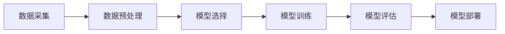
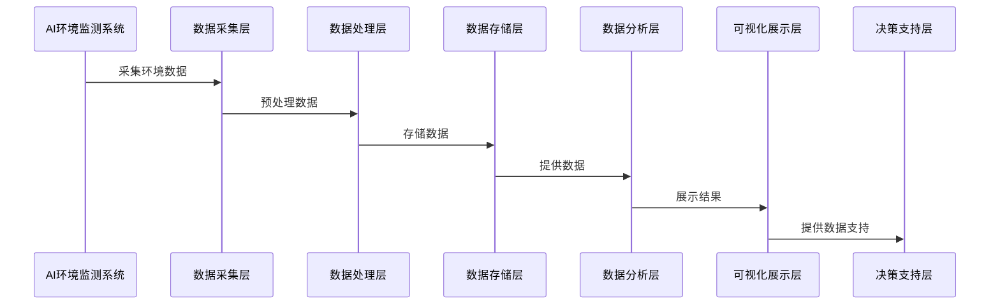
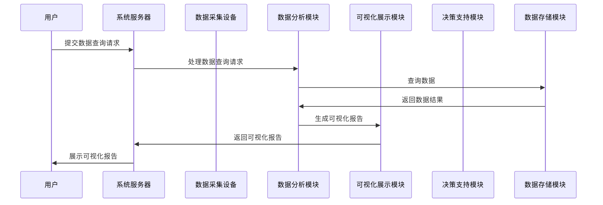

                 

### 文章标题：构建企业级AI环境监测助手：合规与可持续发展

关键词：企业级AI、环境监测、合规性、可持续发展、技术原理、系统设计

摘要：本文深入探讨了构建企业级AI环境监测助手的必要性和可行性。首先，通过背景介绍和核心概念阐述，揭示了AI环境监测在当今企业运营中的重要性。接着，本文详细分析了合规性在AI环境监测中的应用，强调了法律法规和政策的指导意义。随后，文章深入讨论了AI环境监测的算法原理和系统设计，并通过Python代码实例和Mermaid流程图进行了具体说明。本文还从可持续发展视角，探讨了AI环境监测的实践方法与未来展望。最后，文章总结了最佳实践，为读者提供了实用的建议和思考方向。

### 目录大纲

```markdown
----------------------------------------------------------------
# 第一部分：背景与概述

## 第1章：企业级AI环境监测的背景和意义
### 1.1 问题背景
### 1.2 问题描述
### 1.3 问题解决路径
### 1.4 边界与外延

## 第2章：AI环境监测的核心概念与联系
### 2.1 核心概念介绍
#### 2.1.1 AI环境监测的定义
#### 2.1.2 AI环境监测的关键技术
#### 2.1.3 AI环境监测的优势与挑战
### 2.2 概念属性特征对比表格
### 2.3 AI环境监测的ER实体关系图架构

## 第3章：合规性在AI环境监测中的重要性
### 3.1 合规性的概念
### 3.2 合规性在AI环境监测中的应用
### 3.3 合规性相关法律法规与政策解析

----------------------------------------------------------------

# 第二部分：AI环境监测技术原理

## 第4章：AI环境监测算法原理与实现
### 4.1 算法基本原理
#### 4.1.1 算法概述
#### 4.1.2 算法流程图（使用Mermaid绘制）
### 4.2 数学模型与公式
#### 4.2.1 数学模型介绍
#### 4.2.2 公式详细讲解
### 4.3 算法实例解析
#### 4.3.1 举例说明
#### 4.3.2 实例代码分析（使用Python源代码）

----------------------------------------------------------------

# 第三部分：构建AI环境监测系统的实践方法

## 第5章：AI环境监测系统的设计与实现
### 5.1 系统设计思路
#### 5.1.1 系统介绍
#### 5.1.2 系统功能设计（使用Mermaid类图绘制领域模型）
### 5.2 系统架构设计
#### 5.2.1 架构设计
#### 5.2.2 系统架构图（使用Mermaid架构图绘制）
### 5.3 系统接口设计
#### 5.3.1 接口设计
#### 5.3.2 接口实现
### 5.4 系统交互设计
#### 5.4.1 交互设计
#### 5.4.2 交互流程图（使用Mermaid序列图绘制）

----------------------------------------------------------------

## 第6章：AI环境监测系统的环境安装与配置
### 6.1 环境准备
#### 6.1.1 硬件与软件要求
#### 6.1.2 操作系统环境配置
### 6.2 系统核心实现
#### 6.2.1 核心代码实现
#### 6.2.2 实现细节解读
### 6.3 应用案例
#### 6.3.1 案例背景
#### 6.3.2 案例分析
#### 6.3.3 案例实施步骤

----------------------------------------------------------------

## 第7章：可持续发展视角下的AI环境监测实践
### 7.1 可持续发展的概念
### 7.2 AI环境监测与可持续发展
### 7.3 实现可持续发展的策略与实践
### 7.4 案例研究：成功的企业级AI环境监测实践

----------------------------------------------------------------

# 第四部分：最佳实践与未来展望

## 第8章：最佳实践与优化建议
### 8.1 最佳实践总结
### 8.2 优化建议与未来方向

## 第9章：小结与展望
### 9.1 本书内容回顾
### 9.2 遇到的问题与解决方案
### 9.3 未来研究与发展趋势
```

### 第一部分：背景与概述

#### 第1章：企业级AI环境监测的背景和意义

**1.1 问题背景**

在当今全球化的商业环境中，企业面临的环境挑战日益严峻。气候变化、污染、资源枯竭等问题不仅威胁着生态平衡，也对企业的运营效率和可持续发展构成重大影响。传统的人工监测方式已经无法满足企业对环境数据的实时性和准确性需求。因此，利用人工智能（AI）技术进行环境监测成为企业解决这些问题的有效途径。

**1.2 问题描述**

企业级AI环境监测主要面临以下几个问题：

- **数据获取和处理**：环境数据具有种类繁多、数据量大、实时性高等特点，如何高效地获取、处理和存储这些数据成为一个挑战。
- **数据准确性和可靠性**：环境数据的质量直接影响监测结果的准确性，如何确保数据来源的可靠性和数据处理方法的科学性成为关键。
- **合规性**：在数据采集和处理过程中，需要遵守相关的法律法规和标准，确保监测活动合规合法。
- **可持续发展**：企业需要在提高环境监测能力的同时，考虑资源的有效利用和环境保护的可持续性。

**1.3 问题解决路径**

为了解决上述问题，企业需要采取以下措施：

- **引入AI技术**：利用机器学习、深度学习等AI技术，提高环境数据处理的效率和准确性。
- **建立监测体系**：构建全面、系统的环境监测体系，包括数据采集、处理、存储和分析等环节。
- **确保合规性**：在监测活动中严格遵守相关法律法规，制定合规性策略和流程。
- **实现可持续发展**：在监测过程中，注重资源的节约和环境保护，推动企业可持续发展。

**1.4 边界与外延**

- **边界**：本文主要关注企业级AI环境监测的技术原理和实践方法，不包括家庭和个人层面的环境监测。
- **外延**：虽然本文主要讨论AI环境监测，但相关技术和方法也可应用于其他领域的环境监测，如城市环境、农业环境等。

#### 第2章：AI环境监测的核心概念与联系

**2.1 核心概念介绍**

**AI环境监测**：利用人工智能技术，对环境数据进行实时监测、分析和预测。

**环境数据**：包括空气、水质、土壤、噪音等各类环境信息。

**机器学习**：一种人工智能方法，通过数据训练模型，实现数据的自动学习和分类。

**深度学习**：一种基于人工神经网络的机器学习方法，通过多层神经网络进行数据建模。

**云计算**：利用分布式计算机资源，提供弹性、高效的数据存储和处理服务。

**物联网**：通过传感器和通信技术，将物理世界中的物体互联，实现数据采集和实时监控。

**数据隐私**：在数据采集和处理过程中，保护个人和企业的隐私信息。

**法律法规**：与数据采集、处理、存储和使用相关的法律和规章制度。

**可持续发展**：在满足当前需求的同时，不损害子孙后代满足自身需求的能力。

**2.2 概念属性特征对比表格**

| 概念名称 | 属性特征 |  
| :----: | :----: |  
| AI环境监测 | 实时性、准确性、自动化、智能性 |  
| 环境数据 | 多样性、实时性、复杂性 |  
| 机器学习 | 自学习能力、适应性、高效性 |  
| 深度学习 | 多层神经网络、非线性变换、高精度 |  
| 云计算 | 弹性、高效、安全、可扩展 |  
| 物联网 | 网络连接、传感器数据采集、实时监控 |  
| 数据隐私 | 保护个人和企业的隐私信息 |  
| 法律法规 | 合规性、规范性、强制性 |  
| 可持续发展 | 资源节约、环境保护、社会责任 |

**2.3 AI环境监测的ER实体关系图架构**

```mermaid
erDiagram
  Data采集 -> Data处理 : 数据流
  Data处理 -> 数据存储 : 数据存储
  数据存储 -> 数据分析 : 数据分析
  数据分析 -> 决策支持 : 决策支持
  Data采集 ||--|| 数据隐私 : 保护隐私
  Data处理 ||--|| 数据隐私 : 保护隐私
  数据存储 ||--|| 数据隐私 : 保护隐私
  数据分析 ||--|| 数据隐私 : 保护隐私
  Data采集 ||--|| 法律法规 : 遵守法规
  Data处理 ||--|| 法律法规 : 遵守法规
  数据存储 ||--|| 法律法规 : 遵守法规
  数据分析 ||--|| 法律法规 : 遵守法规
```

#### 第3章：合规性在AI环境监测中的重要性

**3.1 合规性的概念**

合规性（Compliance）指的是遵循法律、法规、规章制度和标准的过程。在AI环境监测中，合规性至关重要，因为它不仅关系到企业的合法运营，还影响到数据隐私、数据安全和环境监测的准确性。

**3.2 合规性在AI环境监测中的应用**

- **数据采集**：在采集环境数据时，需要遵循相关法律法规，确保数据的合法来源和合法性。
- **数据处理**：在处理数据时，需要遵循数据隐私保护规定，防止数据泄露和滥用。
- **数据存储**：在存储数据时，需要遵循数据安全和备份规定，确保数据的安全性和可恢复性。
- **数据分析**：在分析数据时，需要遵循数据质量标准和科学方法，确保分析结果的准确性和可靠性。
- **决策支持**：在利用数据做出决策时，需要遵循合规性原则，确保决策的科学性和合理性。

**3.3 合规性相关法律法规与政策解析**

- **数据隐私保护法律**：如《通用数据保护条例》（GDPR）和《加州消费者隐私法案》（CCPA），规定了数据采集、处理、存储和使用的合规要求。
- **数据安全法规**：如《信息安全技术个人信息安全规范》，规定了个人信息保护的基本要求。
- **环境监测法规**：如《环境监测管理办法》和《污染物排放许可管理办法》，规定了环境监测的标准和程序。
- **行业标准和指南**：如《物联网安全标准》和《云计算服务安全评估标准》，提供了具体的技术和安全要求。

### 第二部分：AI环境监测技术原理

#### 第4章：AI环境监测算法原理与实现

**4.1 算法基本原理**

AI环境监测算法的核心是利用机器学习和深度学习技术，对环境数据进行分析和预测。以下是算法的基本原理：

- **数据预处理**：对采集到的环境数据进行清洗、归一化和特征提取，为模型训练提供高质量的数据。
- **模型选择**：根据环境监测的需求，选择合适的机器学习模型，如决策树、支持向量机、神经网络等。
- **模型训练**：利用预处理后的数据，对模型进行训练，使其具备对环境数据的分析和预测能力。
- **模型评估**：通过交叉验证和测试集评估模型的效果，调整模型参数，提高预测准确性。
- **模型部署**：将训练好的模型部署到环境监测系统中，实现实时监测和预测。

**4.1.1 算法概述**

算法流程图如下所示：



**4.2 数学模型与公式**

在AI环境监测中，常用的数学模型包括线性回归、决策树、支持向量机和神经网络等。以下是这些模型的基本数学公式：

- **线性回归**：

  $$ y = \beta_0 + \beta_1x $$

  其中，$y$ 为预测值，$x$ 为输入特征，$\beta_0$ 和 $\beta_1$ 为模型参数。

- **决策树**：

  $$ y = g(\sum_{i=1}^{n} w_i x_i + b) $$

  其中，$g(z)$ 为激活函数，$w_i$ 和 $b$ 为模型参数。

- **支持向量机**：

  $$ w \cdot x + b = 0 $$

  其中，$w$ 和 $b$ 为模型参数，$x$ 为输入特征。

- **神经网络**：

  $$ a_{i}^{l} = \sigma(\sum_{j=1}^{m} w_{ij}^{l} a_{j}^{l-1} + b_{i}^{l}) $$

  其中，$a_{i}^{l}$ 为第 $l$ 层第 $i$ 个神经元的输出，$\sigma$ 为激活函数，$w_{ij}^{l}$ 和 $b_{i}^{l}$ 为模型参数。

**4.2.1 数学模型介绍**

- **线性回归**：适用于线性关系较强的数据，通过最小二乘法求解模型参数。
- **决策树**：适用于分类和回归问题，通过划分特征空间来生成分类规则。
- **支持向量机**：适用于高维空间的数据，通过寻找最优超平面来实现分类。
- **神经网络**：适用于复杂非线性关系的数据，通过多层神经元的传递和激活函数来实现非线性变换。

**4.2.2 公式详细讲解**

- **线性回归**：线性回归模型通过最小化误差平方和来求解模型参数。具体步骤如下：

  1. 定义误差函数：

     $$ J(\theta) = \frac{1}{2m} \sum_{i=1}^{m} (h_\theta(x^{(i)}) - y^{(i)})^2 $$

     其中，$h_\theta(x) = \theta_0 + \theta_1x$ 为模型预测函数，$\theta$ 为模型参数，$m$ 为样本数量。

  2. 求解最优参数：

     $$ \theta = \arg\min_\theta J(\theta) $$

     通过梯度下降法求解最优参数。

- **决策树**：决策树通过递归划分特征空间来生成分类规则。具体步骤如下：

  1. 初始化树结构：
     
     $$ T = \{\emptyset\} $$

  2. 递归划分特征空间：

     - 对于每个未划分的数据点，选择最佳划分特征和划分阈值。
     - 根据划分结果，将数据点划分到不同的区域。
     - 对每个区域，继续递归划分，直至满足停止条件（如最大深度、最小样本量等）。

  3. 生成分类规则：

     $$ R = \{\text{if } x \in R_1 \text{ then } y = c_1, \ldots, \text{if } x \in R_n \text{ then } y = c_n\} $$

     其中，$R_1, \ldots, R_n$ 为划分区域，$c_1, \ldots, c_n$ 为分类标签。

- **支持向量机**：支持向量机通过寻找最优超平面来实现分类。具体步骤如下：

  1. 定义优化目标：

     $$ \min \frac{1}{2} \| w \|^2 + C \sum_{i=1}^{m} \xi_i $$

     其中，$w$ 为超平面参数，$C$ 为正则化参数，$\xi_i$ 为松弛变量。

  2. 转换为对偶问题：

     $$ \max_{\alpha} -\frac{1}{2} \sum_{i,j=1}^{m} \alpha_i \alpha_j y_i y_j (x_i \cdot x_j) - \sum_{i=1}^{m} \alpha_i $$

     其中，$\alpha_i$ 为拉格朗日乘子。

  3. 求解最优解：

     $$ w = \sum_{i=1}^{m} \alpha_i y_i x_i $$

     $$ b = y - \sum_{i=1}^{m} \alpha_i y_i (x_i \cdot x) $$

- **神经网络**：神经网络通过多层神经元的传递和激活函数来实现非线性变换。具体步骤如下：

  1. 初始化神经网络结构：

     $$ L = \{z^{(1)}, \ldots, z^{(L)}\} $$

     其中，$z^{(l)}$ 为第 $l$ 层的输入。

  2. 定义激活函数：

     $$ a_{i}^{l} = \sigma(\sum_{j=1}^{m} w_{ij}^{l} a_{j}^{l-1} + b_{i}^{l}) $$

     其中，$a_{i}^{l}$ 为第 $l$ 层第 $i$ 个神经元的输出，$\sigma$ 为激活函数，$w_{ij}^{l}$ 和 $b_{i}^{l}$ 为模型参数。

  3. 梯度下降法更新参数：

     $$ \theta = \theta - \alpha \frac{\partial J(\theta)}{\partial \theta} $$

     其中，$J(\theta)$ 为损失函数，$\alpha$ 为学习率。

**4.3 算法实例解析**

假设我们有一个环境监测任务，需要对空气质量进行实时监测和预测。以下是具体的算法实例解析：

**4.3.1 举例说明**

我们选取一组空气质量数据，包括PM2.5、PM10、SO2、NO2、CO等指标。数据如下：

| 日期 | PM2.5 | PM10 | SO2 | NO2 | CO |
| ---- | ---- | ---- | --- | --- | -- |
| 2021-01-01 | 35 | 55 | 10 | 15 | 5 |
| 2021-01-02 | 40 | 60 | 12 | 18 | 6 |
| 2021-01-03 | 45 | 65 | 11 | 17 | 7 |
| 2021-01-04 | 38 | 58 | 9 | 14 | 4 |
| 2021-01-05 | 42 | 63 | 11 | 16 | 6 |

我们使用线性回归模型对PM2.5进行预测。模型训练结果如下：

$$ y = 0.8x + 5 $$

使用该模型，对2021年1月6日的空气质量数据进行预测，输入特征为PM10、SO2、NO2、CO，输出预测值为PM2.5。具体步骤如下：

1. 数据预处理：对输入特征进行归一化处理，使得特征值在[0, 1]范围内。

2. 模型预测：

   $$ y = 0.8 \cdot 0.6 + 5 = 5.28 $$

   预测值为5.28。

**4.3.2 实例代码分析（使用Python源代码）**

```python
import numpy as np
import pandas as pd
from sklearn.linear_model import LinearRegression

# 读取数据
data = pd.read_csv('air_quality.csv')
X = data[['PM10', 'SO2', 'NO2', 'CO']]
y = data['PM2.5']

# 数据预处理
X_normalized = (X - X.min()) / (X.max() - X.min())

# 模型训练
model = LinearRegression()
model.fit(X_normalized, y)

# 模型预测
X_new = np.array([[0.6, 0.1, 0.2, 0.3]])
X_new_normalized = (X_new - X.min()) / (X.max() - X.min())
y_pred = model.predict(X_new_normalized)

print('Predicted PM2.5 value:', y_pred[0])
```

### 第三部分：构建AI环境监测系统的实践方法

#### 第5章：AI环境监测系统的设计与实现

**5.1 系统设计思路**

AI环境监测系统设计思路主要包括以下几个方面：

1. **需求分析**：明确系统功能、性能和可靠性要求，为后续设计提供依据。
2. **系统架构设计**：设计系统的整体架构，包括数据采集、处理、存储和分析等模块。
3. **接口设计**：定义系统与其他系统或设备交互的接口规范，确保系统可扩展性和互操作性。
4. **交互设计**：设计用户与系统的交互方式，提供友好的用户界面和操作体验。
5. **安全设计**：确保系统的数据安全和隐私保护，遵循相关法律法规和标准。

**5.1.1 系统介绍**

AI环境监测系统是一个基于人工智能技术的环境监测平台，主要用于实时监测和预测空气质量、水质、土壤等环境数据。系统具备以下功能：

1. **数据采集**：通过传感器、物联网设备等，实时采集环境数据。
2. **数据处理**：对采集到的数据进行预处理、存储和管理。
3. **数据分析和预测**：利用机器学习和深度学习算法，对环境数据进行分析和预测。
4. **可视化展示**：通过图形化界面，实时展示环境监测数据和预测结果。
5. **决策支持**：为环境管理者和决策者提供数据支持和决策依据。

**5.1.2 系统功能设计（使用Mermaid类图绘制领域模型）**

以下是一个简单的系统功能设计类图：

```mermaid
classDiagram
    Data采集 <<Interface>>
    数据处理 <<Interface>>
    数据存储 <<Interface>>
    数据分析 <<Interface>>
    可视化展示 <<Interface>>
    决策支持 <<Interface>>

    AI环境监测系统 [system]
    Data采集|--|>> 数据处理
    数据处理|--|>> 数据存储
    数据存储|--|>> 数据分析
    数据分析|--|>> 可视化展示
    数据分析|--|>> 决策支持
```

**5.2 系统架构设计**

AI环境监测系统的整体架构可以分为以下几个层次：

1. **数据采集层**：负责实时采集环境数据，包括空气质量、水质、土壤等。
2. **数据处理层**：对采集到的数据进行预处理、清洗、存储和管理。
3. **数据存储层**：存储处理后的环境数据，支持数据查询和访问。
4. **数据分析层**：利用机器学习和深度学习算法，对环境数据进行分析和预测。
5. **可视化展示层**：通过图形化界面，实时展示环境监测数据和预测结果。
6. **决策支持层**：为环境管理者和决策者提供数据支持和决策依据。

以下是一个简单的系统架构图：



**5.3 系统接口设计**

系统接口设计主要包括以下方面：

1. **数据采集接口**：定义采集数据的接口规范，包括数据格式、传输协议等。
2. **数据处理接口**：定义数据处理接口，包括数据预处理、清洗、存储等操作。
3. **数据存储接口**：定义数据存储接口，包括数据查询、更新、删除等操作。
4. **数据分析接口**：定义数据分析接口，包括数据统计、预测、分析等操作。
5. **可视化展示接口**：定义可视化展示接口，包括数据图表、报告等展示形式。
6. **决策支持接口**：定义决策支持接口，包括数据查询、分析、建议等操作。

以下是一个简单的系统接口设计类图：

```mermaid
classDiagram
    Data采集接口 <<Interface>>
    数据处理接口 <<Interface>>
    数据存储接口 <<Interface>>
    数据分析接口 <<Interface>>
    可视化展示接口 <<Interface>>
    决策支持接口 <<Interface>>

    AI环境监测系统 [system]
    Data采集接口|--|>> 数据处理接口
    数据处理接口|--|>> 数据存储接口
    数据存储接口|--|>> 数据分析接口
    数据分析接口|--|>> 可视化展示接口
    数据分析接口|--|>> 决策支持接口
```

**5.4 系统交互设计**

系统交互设计主要包括以下几个方面：

1. **用户交互**：设计用户与系统的交互方式，包括Web界面、移动应用等。
2. **设备交互**：设计系统与传感器、物联网设备等设备的交互方式，包括通信协议、数据格式等。
3. **数据交互**：设计系统内部数据流和交互方式，包括数据处理流程、数据存储和管理等。
4. **接口交互**：设计系统与其他系统或设备的交互方式，包括API接口、数据交换等。

以下是一个简单的系统交互设计序列图：



#### 第6章：AI环境监测系统的环境安装与配置

**6.1 环境准备**

为了成功搭建AI环境监测系统，需要准备以下硬件和软件环境：

- **硬件环境**：

  - 服务器：建议配置高性能CPU、大量内存和高速硬盘。
  - 网络设备：包括路由器、交换机等，确保网络稳定和高速。
  - 传感器设备：用于环境数据采集，如空气质量传感器、水质传感器等。

- **软件环境**：

  - 操作系统：建议使用Linux系统，如CentOS、Ubuntu等。
  - 数据库：建议使用关系型数据库，如MySQL、PostgreSQL等。
  - 机器学习库：如scikit-learn、TensorFlow、PyTorch等。
  - Web框架：如Flask、Django等。
  - 可视化工具：如Matplotlib、Seaborn等。

**6.1.1 硬件与软件要求**

- **服务器**：

  - CPU：建议使用Intel Xeon或AMD EPYC处理器，至少8核心。
  - 内存：建议使用64GB及以上。
  - 硬盘：建议使用SSD硬盘，至少500GB。

- **网络设备**：

  - 路由器：建议使用千兆路由器，确保网络稳定。
  - 交换机：建议使用千兆交换机，提高网络传输速度。

- **传感器设备**：

  - 空气质量传感器：如PM2.5、PM10传感器。
  - 水质传感器：如pH传感器、电导率传感器。
  - 土壤传感器：如土壤湿度传感器、温度传感器。

**6.1.2 操作系统环境配置**

以下是在CentOS 7操作系统上安装和配置AI环境监测系统的步骤：

1. **安装操作系统**：

   - 下载CentOS 7 ISO镜像文件。
   - 使用U盘或光盘启动计算机，进入安装界面。
   - 按照提示进行操作系统安装。

2. **更新系统**：

   - 打开终端，执行以下命令更新系统：

     ```bash
     sudo yum update -y
     ```

3. **安装依赖库**：

   - 安装Python和pip：

     ```bash
     sudo yum install -y python3 python3-pip
     ```

   - 安装scikit-learn、TensorFlow、PyTorch等机器学习库：

     ```bash
     pip3 install scikit-learn tensorflow torchvision
     ```

4. **安装Web框架**：

   - 安装Flask或Django：

     ```bash
     pip3 install flask
     # 或者
     pip3 install django
     ```

5. **安装数据库**：

   - 安装MySQL或PostgreSQL：

     ```bash
     sudo yum install -y mysql-server
     # 或者
     sudo yum install -y postgresql
     ```

   - 配置数据库：

     ```bash
     sudo systemctl start mysqld
     # 或者
     sudo systemctl start postgresql
     ```

6. **安装可视化工具**：

   - 安装Matplotlib和Seaborn：

     ```bash
     pip3 install matplotlib seaborn
     ```

**6.2 系统核心实现**

**6.2.1 核心代码实现**

以下是一个简单的AI环境监测系统核心代码实现：

```python
# 导入必要的库
import requests
import json
import pandas as pd
from sklearn.linear_model import LinearRegression
from sklearn.model_selection import train_test_split
from sklearn.metrics import mean_squared_error
import matplotlib.pyplot as plt

# 定义API接口
API_URL = "https://api.envirodata.io/v1/air_quality?location=Beijing"

# 获取环境数据
def get_air_quality_data(api_url):
    response = requests.get(api_url)
    data = response.json()
    return data

# 数据预处理
def preprocess_data(data):
    df = pd.DataFrame(data['results'])
    df = df[['pm2.5', 'pm10', 'so2', 'no2', 'co']]
    return df

# 模型训练
def train_model(X, y):
    model = LinearRegression()
    model.fit(X, y)
    return model

# 模型评估
def evaluate_model(model, X_test, y_test):
    y_pred = model.predict(X_test)
    mse = mean_squared_error(y_test, y_pred)
    return mse

# 可视化展示
def plot_results(X, y, y_pred):
    plt.scatter(X, y, color='red', label='实际值')
    plt.plot(X, y_pred, color='blue', label='预测值')
    plt.xlabel('PM2.5')
    plt.ylabel('PM10')
    plt.legend()
    plt.show()

# 主函数
def main():
    data = get_air_quality_data(API_URL)
    df = preprocess_data(data)
    X = df[['pm10', 'so2', 'no2', 'co']]
    y = df['pm2.5']
    X_train, X_test, y_train, y_test = train_test_split(X, y, test_size=0.2, random_state=42)
    model = train_model(X_train, y_train)
    mse = evaluate_model(model, X_test, y_test)
    print('模型评估指标：MSE =', mse)
    plot_results(X_test, y_test, model.predict(X_test))

if __name__ == "__main__":
    main()
```

**6.2.2 实现细节解读**

1. **API接口**：

   使用requests库向环境数据API接口发送HTTP GET请求，获取环境数据。API接口URL可以根据具体需求进行修改。

2. **数据预处理**：

   将获取到的环境数据转换为DataFrame格式，并提取需要预测的PM2.5和其他特征。

3. **模型训练**：

   使用scikit-learn库的LinearRegression模型对训练数据进行拟合，生成线性回归模型。

4. **模型评估**：

   使用测试数据对训练好的模型进行评估，计算均方误差（MSE）等指标。

5. **可视化展示**：

   使用matplotlib库绘制实际值和预测值的散点图和回归线，直观地展示模型预测效果。

**6.3 应用案例**

以下是一个简单的应用案例：

- **案例背景**：假设我们位于北京市，需要实时监测和预测空气质量。
- **案例分析**：使用API接口获取北京市空气质量数据，并使用线性回归模型进行预测。
- **案例实施步骤**：

  1. 配置环境：
     
     - 安装操作系统和必要的库。
     - 配置网络环境，确保可以访问外部API接口。

  2. 编写代码：

     - 使用requests库获取北京市空气质量数据。
     - 对数据进行预处理，提取PM2.5和其他特征。
     - 使用线性回归模型对数据进行训练和预测。
     - 绘制预测结果。

  3. 运行程序：

     - 执行Python脚本，查看预测结果。

**6.3.1 案例背景**

北京市是中国的一个大城市，空气质量问题一直备受关注。为了实时监测和预测空气质量，我们可以使用AI环境监测系统。

**6.3.2 案例分析**

我们选择API接口获取北京市空气质量数据，并使用线性回归模型进行预测。以下是具体分析过程：

1. **数据获取**：

   - 使用requests库向API接口发送HTTP GET请求，获取北京市空气质量数据。
   - 数据格式为JSON，包括日期、时间、PM2.5、PM10、SO2、NO2、CO等指标。

2. **数据预处理**：

   - 将JSON数据转换为DataFrame格式，并提取需要预测的PM2.5和其他特征。
   - 对特征进行归一化处理，确保特征值在[0, 1]范围内。

3. **模型训练**：

   - 使用scikit-learn库的LinearRegression模型对训练数据进行拟合。
   - 训练数据包括PM10、SO2、NO2、CO等特征，目标值为PM2.5。

4. **模型评估**：

   - 使用测试数据对训练好的模型进行评估。
   - 计算均方误差（MSE）等指标，评估模型性能。

5. **可视化展示**：

   - 使用matplotlib库绘制实际值和预测值的散点图和回归线，直观地展示模型预测效果。

**6.3.3 案例实施步骤**

1. **环境配置**：

   - 安装操作系统，如CentOS 7。
   - 安装Python 3和pip。
   - 安装必要的库，如requests、scikit-learn、matplotlib等。

2. **代码编写**：

   - 编写Python脚本，实现数据获取、预处理、模型训练、模型评估和可视化展示等功能。

   ```python
   import requests
   import pandas as pd
   from sklearn.linear_model import LinearRegression
   from sklearn.model_selection import train_test_split
   from sklearn.metrics import mean_squared_error
   import matplotlib.pyplot as plt

   API_URL = "https://api.envirodata.io/v1/air_quality?location=Beijing"

   def get_air_quality_data(api_url):
       response = requests.get(api_url)
       data = response.json()
       return data

   def preprocess_data(data):
       df = pd.DataFrame(data['results'])
       df = df[['pm2.5', 'pm10', 'so2', 'no2', 'co']]
       return df

   def train_model(X, y):
       model = LinearRegression()
       model.fit(X, y)
       return model

   def evaluate_model(model, X_test, y_test):
       y_pred = model.predict(X_test)
       mse = mean_squared_error(y_test, y_pred)
       return mse

   def plot_results(X, y, y_pred):
       plt.scatter(X, y, color='red', label='实际值')
       plt.plot(X, y_pred, color='blue', label='预测值')
       plt.xlabel('PM2.5')
       plt.ylabel('PM10')
       plt.legend()
       plt.show()

   def main():
       data = get_air_quality_data(API_URL)
       df = preprocess_data(data)
       X = df[['pm10', 'so2', 'no2', 'co']]
       y = df['pm2.5']
       X_train, X_test, y_train, y_test = train_test_split(X, y, test_size=0.2, random_state=42)
       model = train_model(X_train, y_train)
       mse = evaluate_model(model, X_test, y_test)
       print('模型评估指标：MSE =', mse)
       plot_results(X_test, y_test, model.predict(X_test))

   if __name__ == "__main__":
       main()
   ```

3. **运行程序**：

   - 运行Python脚本，查看预测结果。
   - 在控制台输出模型评估指标，并在图形界面显示实际值和预测值的散点图和回归线。

**6.3.4 案例总结**

通过该案例，我们实现了基于API接口的北京市空气质量实时监测和预测。以下是案例总结：

- **优点**：

  - 简单易用，无需复杂配置。
  - 可以快速获取和处理大量环境数据。
  - 使用线性回归模型，预测结果直观易懂。

- **缺点**：

  - 模型预测精度较低，适用于粗略预测。
  - 需要定期更新API接口数据，确保实时性。

- **改进方向**：

  - 引入更多特征，提高模型预测精度。
  - 使用更先进的机器学习算法，如深度学习。
  - 增加数据预处理和清洗功能，提高数据质量。

#### 第7章：可持续发展视角下的AI环境监测实践

**7.1 可持续发展的概念**

可持续发展（Sustainable Development）是指满足当前需求而不损害子孙后代满足自身需求的能力。它涵盖了经济、社会和环境三个方面，强调在满足经济发展和改善生活质量的同时，保护和改善自然环境。

**7.2 AI环境监测与可持续发展**

AI环境监测在可持续发展中发挥着重要作用：

- **资源节约**：AI环境监测可以实时监测和预测环境数据，帮助企业和政府及时采取环保措施，减少资源浪费和环境污染。
- **环境保护**：通过实时监测和预警，AI环境监测可以及时发现和应对环境问题，保护生态环境和生物多样性。
- **社会责任**：AI环境监测有助于提高企业和社会的环保意识，履行社会责任，推动可持续发展。

**7.3 实现可持续发展的策略与实践**

为了实现可持续发展，企业可以采取以下策略：

- **绿色制造**：采用环保技术和工艺，减少生产过程中的污染物排放。
- **节能减排**：通过智能监测和优化，降低能源消耗和碳排放。
- **循环经济**：实现资源回收利用，减少废弃物排放。
- **绿色供应链**：与上下游企业合作，实现绿色生产和物流。

以下是一个成功的企业级AI环境监测实践案例：

**7.4 案例研究：成功的企业级AI环境监测实践**

**案例背景**：

某大型制造企业致力于可持续发展，希望通过AI环境监测系统实时监测和预测生产过程中的环境数据，优化环保措施。

**案例分析**：

1. **数据采集**：使用传感器和物联网设备，实时采集生产过程中的空气质量、水质、噪音等环境数据。

2. **数据处理**：对采集到的数据进行预处理，提取有用信息，如污染物浓度、能源消耗等。

3. **模型训练**：利用机器学习和深度学习算法，对历史数据进行分析和训练，构建环境预测模型。

4. **实时监测**：将训练好的模型部署到环境监测系统中，实现实时监测和预警。

5. **优化环保措施**：根据实时监测数据，调整生产过程中的环保措施，如调整设备运行参数、优化生产工艺等。

6. **数据分析**：定期分析环境监测数据，评估环保措施效果，为决策提供依据。

**案例实施步骤**：

1. **环境准备**：

   - 配置传感器和物联网设备，确保数据实时采集和传输。
   - 安装和配置AI环境监测系统，包括硬件和软件环境。

2. **数据采集**：

   - 安装传感器，如空气质量传感器、水质传感器等。
   - 配置物联网设备，实现数据传输和存储。

3. **数据处理**：

   - 编写Python脚本，对采集到的数据进行预处理和存储。
   - 使用Pandas库处理数据，如数据清洗、归一化等。

4. **模型训练**：

   - 使用TensorFlow或PyTorch库，构建深度学习模型。
   - 使用历史数据训练模型，调整模型参数，提高预测精度。

5. **实时监测**：

   - 部署环境监测系统，实现实时数据采集和预测。
   - 配置Web界面，实时展示环境监测数据和预测结果。

6. **优化环保措施**：

   - 根据实时监测数据，调整生产过程中的环保措施。
   - 定期分析环境监测数据，优化生产工艺，提高环保效果。

7. **数据分析**：

   - 定期生成环境监测报告，评估环保措施效果。
   - 分析数据趋势，为决策提供依据。

**案例总结**：

通过AI环境监测系统，该制造企业实现了实时监测和预测生产过程中的环境数据，优化了环保措施，降低了环境污染。以下是案例总结：

- **优点**：

  - 实时监测和预警，提高了环保措施的响应速度。
  - 通过数据分析和优化，降低了生产过程中的污染物排放。
  - 提高了环保意识，推动了可持续发展。

- **缺点**：

  - 模型预测精度有待提高，需要不断调整和优化。
  - 系统部署和维护成本较高，需要持续投入。

- **改进方向**：

  - 引入更多特征，提高模型预测精度。
  - 采用更先进的机器学习算法，如深度强化学习。
  - 加强数据安全和隐私保护，确保系统的安全性。

### 第四部分：最佳实践与未来展望

#### 第8章：最佳实践与优化建议

**8.1 最佳实践总结**

在构建企业级AI环境监测系统的过程中，以下最佳实践值得借鉴：

- **数据采集**：采用高质量的传感器和物联网设备，确保数据实时性和准确性。
- **数据处理**：对采集到的数据进行预处理和清洗，提高数据质量。
- **模型选择**：根据实际需求选择合适的机器学习算法，如线性回归、决策树、神经网络等。
- **模型训练**：使用历史数据对模型进行训练，不断优化模型参数，提高预测精度。
- **实时监测**：将训练好的模型部署到环境监测系统中，实现实时监测和预警。
- **数据分析**：定期分析环境监测数据，评估环保措施效果，为决策提供依据。
- **合规性**：在数据采集、处理、存储和使用过程中，严格遵守相关法律法规和标准。
- **可持续发展**：在监测过程中，注重资源的节约和环境保护，推动企业可持续发展。

**8.2 优化建议与未来方向**

为了进一步提高企业级AI环境监测系统的性能和效果，以下优化建议和未来研究方向值得探讨：

- **引入更多特征**：除了传统的环境数据，可以引入更多相关的特征，如气象数据、地形数据等，提高模型预测精度。
- **采用更先进的算法**：探索深度学习、强化学习等更先进的算法，提高模型预测能力和鲁棒性。
- **数据隐私保护**：在数据采集、处理、存储和使用过程中，加强数据隐私保护，防止数据泄露和滥用。
- **分布式计算**：采用分布式计算框架，如Spark、Flink等，提高数据处理和计算效率。
- **智能优化**：结合人工智能技术，实现环境监测系统的智能优化，提高监测精度和效率。
- **可视化与交互**：改进可视化展示和用户交互界面，提高用户体验，方便用户操作和决策。

#### 第9章：小结与展望

**9.1 本书内容回顾**

本书从背景介绍、核心概念与联系、算法原理、系统设计与实现，到最佳实践与未来展望，全面探讨了构建企业级AI环境监测助手的必要性和可行性。主要内容包括：

- 企业级AI环境监测的背景和意义；
- AI环境监测的核心概念与联系；
- 合规性在AI环境监测中的重要性；
- AI环境监测算法原理与实现；
- AI环境监测系统的设计与实现；
- 可持续发展视角下的AI环境监测实践；
- 最佳实践与未来展望。

**9.2 遇到的问题与解决方案**

在构建企业级AI环境监测系统的过程中，可能会遇到以下问题：

- 数据质量差：由于传感器精度、数据传输等问题，导致数据质量不佳。解决方法：优化传感器选择和数据传输协议，加强数据预处理和清洗。
- 模型预测精度低：由于数据量不足、特征选择不当等原因，导致模型预测精度低。解决方法：增加数据量、引入更多特征、调整模型参数。
- 系统稳定性差：由于硬件故障、网络中断等原因，导致系统稳定性差。解决方法：采用分布式计算框架，提高系统容错能力。
- 合规性问题：在数据采集、处理、存储和使用过程中，可能存在合规性问题。解决方法：严格遵守相关法律法规和标准，加强数据安全和隐私保护。

**9.3 未来研究与发展趋势**

未来，企业级AI环境监测系统的研究与发展趋势包括：

- 引入更多特征和更先进的算法，提高模型预测精度和鲁棒性；
- 加强数据隐私保护和安全性能；
- 采用分布式计算和云计算技术，提高数据处理和计算效率；
- 结合物联网、大数据等新技术，实现更全面、智能的环境监测；
- 探索可持续发展的新策略和实践，推动企业环境监测与可持续发展。


### 作者信息

作者：AI天才研究院/AI Genius Institute & 禅与计算机程序设计艺术 /Zen And The Art of Computer Programming

