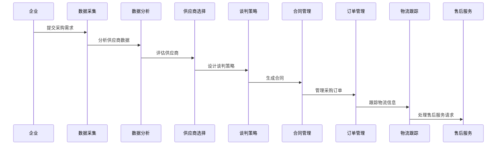

                 

## 概述

### 关键词

- 企业级AI采购助手
- 供应商选择
- 谈判策略
- 数学模型
- 系统架构
- 最佳实践

### 摘要

本文将深入探讨构建企业级AI采购助手的过程，重点关注如何优化供应商选择与谈判。我们将首先分析采购管理现状，介绍AI在采购领域的应用价值，并阐述优化供应商选择与谈判的重要性。接着，我们将详细讨论AI技术基础、采购管理相关概念，并引入相关的数学模型和公式。随后，我们将展开系统分析与架构设计，详细介绍采购管理系统的功能设计。在项目实战部分，我们将通过具体环境安装和系统实现的步骤，解析代码并分享实际案例。最后，我们将总结最佳实践，并提供相关的小结、注意事项与拓展阅读，为读者提供全面的技术指导和启示。希望通过本文，读者能够掌握构建企业级AI采购助手的关键技术，提升采购效率和效益。

## 问题背景与概述

在当今的商业环境中，采购管理是企业运营中至关重要的一环。然而，传统的采购管理方法往往依赖于人工经验，存在着效率低、准确性差、响应速度慢等问题。随着人工智能技术的迅速发展，AI采购助手作为一种创新的解决方案，开始逐渐受到企业的关注。AI采购助手利用先进的人工智能技术，能够自动化处理采购过程中的许多繁琐任务，从而提高采购效率、降低成本、提升决策质量。

### 采购管理现状分析

目前，大多数企业的采购管理仍处于较为传统的阶段。具体来说，采购流程通常包括供应商选择、谈判、合同签订、订单管理、物流跟踪等环节。这些流程往往需要大量的人力和时间投入，且容易出现人为错误。例如，在供应商选择环节，企业往往依赖于经验和直觉进行判断，无法全面、客观地评估供应商的各个方面，从而可能导致供应商选择不当，影响采购质量和效率。在谈判环节，企业也常常缺乏有效的策略和工具，无法充分挖掘供应商的谈判空间，导致谈判结果不尽如人意。

### AI在采购领域的应用价值

AI采购助手的出现，为解决上述问题提供了新的思路和工具。首先，AI技术能够通过大数据分析和机器学习算法，帮助企业全面、准确地评估供应商的各个方面，从而优化供应商选择。例如，通过分析供应商的历史数据、市场表现、口碑评价等信息，AI系统能够为企业提供更为科学的供应商评估结果，帮助企业找到最合适的供应商。其次，AI采购助手还能够自动化处理采购流程中的许多任务，如数据采集、信息处理、合同审核等，从而提高采购效率。例如，通过自然语言处理技术，AI系统能够自动识别和提取采购合同中的关键信息，减少人工干预，提高合同审核的准确性和效率。

### 优化供应商选择与谈判的重要性

优化供应商选择与谈判，对于企业来说具有重要意义。首先，选择合适的供应商能够直接影响到采购成本和采购质量。通过AI采购助手提供的科学评估结果，企业能够更加精准地选择供应商，降低采购成本，提高采购质量。其次，有效的谈判策略能够帮助企业获取更有利的采购条件，如更低的价格、更高的质量保证、更好的售后服务等。通过AI采购助手提供的谈判策略建议，企业能够更好地应对谈判中的各种情况，提高谈判成功率。此外，优化供应商选择与谈判，还能够提高企业的采购效率，减少采购周期，从而提升整体运营效率。

综上所述，构建企业级AI采购助手，通过优化供应商选择与谈判，能够显著提升企业的采购管理效率和质量，为企业带来实实在在的效益。接下来，我们将深入探讨AI技术基础、采购管理相关概念，并引入相关的数学模型和公式，为构建高效的AI采购助手提供理论基础。

## 核心概念与联系

在构建企业级AI采购助手的旅程中，理解核心概念及其相互联系是至关重要的。以下是AI技术基础和采购管理相关概念的主要介绍。

### AI技术基础

AI（人工智能）是一种模拟人类智能行为的技术，包括机器学习、深度学习和自然语言处理等多个子领域。在这些技术中：

#### 1. 机器学习基础

机器学习是AI的一个分支，主要研究如何让计算机从数据中学习规律，从而做出预测或决策。机器学习过程通常包括数据预处理、特征提取、模型选择、模型训练和模型评估等步骤。常见的机器学习算法有线性回归、决策树、支持向量机（SVM）和神经网络等。

#### 2. 深度学习基础

深度学习是机器学习的一个子领域，利用多层神经网络来模拟人脑的决策过程。深度学习在图像识别、语音识别、自然语言处理等领域表现尤为突出。常用的深度学习模型包括卷积神经网络（CNN）、循环神经网络（RNN）和生成对抗网络（GAN）等。

#### 3. 自然语言处理基础

自然语言处理（NLP）是AI的另一个重要分支，主要研究如何使计算机理解和处理人类语言。NLP技术包括文本分类、情感分析、命名实体识别、机器翻译等。NLP在自动化合同审核、采购信息提取等方面具有广泛应用。

### 采购管理相关概念

采购管理是企业获取外部资源的过程，涉及多个环节。以下是采购管理中的一些关键概念：

#### 1. 采购流程

采购流程通常包括需求分析、供应商选择、询价、谈判、合同签订、订单管理、物流跟踪和售后服务等环节。这些环节紧密相连，形成一个完整的采购过程。

#### 2. 供应商评估

供应商评估是选择合适供应商的重要步骤。评估内容包括供应商的资质、信誉、生产能力、服务质量、价格等。常用的评估方法有定量评估（如评分法）和定性评估（如专家评审）。

#### 3. 谈判策略

谈判是采购过程中关键的一环，直接影响到采购结果。谈判策略包括价格谈判、质量谈判、交期谈判等。有效的谈判策略能够帮助企业获取更有利的采购条件。

### 概念属性特征对比表格

为了更好地理解这些核心概念，我们提供了一个概念属性特征对比表格：

| 概念        | 特征                                                                                       | 应用场景                   |
| ----------- | ------------------------------------------------------------------------------------------ | -------------------------- |
| 机器学习    | 从数据中学习规律，自动做出预测或决策                                                         | 数据预测、模式识别         |
| 深度学习    | 利用多层神经网络模拟人脑决策过程，高效率和强表现                                             | 图像识别、语音识别         |
| 自然语言处理 | 使计算机理解和处理人类语言                                                                   | 自动化合同审核、采购信息提取 |
| 采购流程    | 包括需求分析、供应商选择、询价、谈判等环节                                                  | 企业资源获取过程           |
| 供应商评估   | 全面评估供应商的资质、信誉、生产能力等                                                       | 选择合适供应商             |
| 谈判策略    | 包括价格谈判、质量谈判等策略，以获取更有利的采购条件                                       | 采购过程关键环节           |

### ER实体关系图架构

为了进一步展示概念之间的联系，我们使用Mermaid绘制了一个ER（实体关系）图：

```mermaid
erDiagram
    AI采购助手 ||--|{ 供应商 }|
    AI采购助手 ||--|{ 采购流程 }|
    AI采购助手 ||--|{ 供应商评估 }|
    AI采购助手 ||--|{ 谈判策略 }|
    供应商评估 ||--|{ 供应商信息 }|
    采购流程 ||--|{ 采购订单 }|
```

通过这个ER图，我们可以清晰地看到AI采购助手与供应商、采购流程、供应商评估和谈判策略之间的关联。接下来，我们将进一步探讨AI采购助手如何通过优化供应商选择和谈判策略，提升企业采购效率和质量。

## 数学模型和数学公式 & 详细讲解 & 举例说明

在构建企业级AI采购助手的道路上，理解并应用数学模型是关键的一步。数学模型不仅能够帮助我们在复杂的问题场景中找到最优解，还能够提供定量的分析方法，使我们的决策更加科学和准确。以下我们将详细介绍优化供应商选择的数学模型和谈判策略的数学模型，并通过具体的例子进行讲解。

### 优化供应商选择的数学模型

优化供应商选择的数学模型通常涉及到多目标优化问题。多目标优化是指同时考虑多个目标函数，并寻找一个在不同目标函数之间取得平衡的解。以下是多目标优化模型的基本原理和步骤：

#### 1. 多目标优化模型

多目标优化问题可以用以下数学模型表示：

$$
\min_{x} \{ f_1(x), f_2(x), ..., f_n(x) \}
$$

其中，$x$ 是决策变量，$f_1(x), f_2(x), ..., f_n(x)$ 是目标函数。

#### 2. 贪心算法

贪心算法是一种常用的多目标优化方法，其核心思想是每次选择一个最优的决策，并不断优化整体结果。以下是贪心算法的基本步骤：

1. 初始化：选择初始解 $x_0$。
2. 计算当前解的各个目标函数值 $f_1(x_0), f_2(x_0), ..., f_n(x_0)$。
3. 在每个目标函数上寻找一个局部最优解 $x_1$，使得该解在当前目标函数上比当前解更优。
4. 更新当前解 $x_0 = x_1$。
5. 重复步骤2-4，直到满足停止条件（如迭代次数、目标函数值收敛等）。

#### 3. 举例说明

假设我们需要从三个供应商中选择一个，同时考虑成本和交货时间两个目标。供应商的评分分别为：

| 供应商 | 成本 | 交货时间 |
| ------ | ---- | -------- |
| A      | 100  | 5天      |
| B      | 120  | 4天      |
| C      | 90   | 6天      |

我们可以使用贪心算法来优化选择。首先，我们选择初始解为供应商A，然后分别计算成本和交货时间的目标函数值：

- 成本目标函数：$f_1(A) = 100$
- 交货时间目标函数：$f_2(A) = 5$

接着，我们在成本目标函数上寻找局部最优解。可以发现供应商B的成本更低（$f_1(B) = 120$），因此选择供应商B。更新当前解为供应商B，并重新计算目标函数值：

- 成本目标函数：$f_1(B) = 120$
- 交货时间目标函数：$f_2(B) = 4$

再次在交货时间目标函数上寻找局部最优解。供应商A的交货时间最短（$f_2(A) = 5$），因此选择供应商A。更新当前解为供应商A，并重新计算目标函数值：

- 成本目标函数：$f_1(A) = 100$
- 交货时间目标函数：$f_2(A) = 5$

由于没有更好的局部最优解，我们停止迭代。最终选择的供应商是A。

### 谈判策略的数学模型

谈判策略的数学模型通常基于博弈论，博弈论是一种研究理性决策者在冲突和竞争环境中的策略选择的数学工具。以下是博弈论基础和动态谈判策略的基本原理和步骤：

#### 1. 博弈论基础

博弈论的基本概念包括：

- **参与者**：博弈中的决策者。
- **策略**：参与者可以选择的行动。
- **支付函数**：参与者根据策略选择和对手的决策所获得的收益。

博弈可以用一个矩阵表示，称为支付矩阵。例如：

|          | 供应商A | 供应商B |
|----------|----------|----------|
| 企业A    | (10, 10) | (5, 15)  |
| 企业B    | (15, 5)  | (10, 10) |

在这个矩阵中，第一行和第一列表示企业的策略，括号中的两个数字分别表示企业选择该策略时，供应商A和供应商B获得的收益。

#### 2. 动态谈判策略

动态谈判策略是指在多个回合中进行的谈判，每个回合中参与者都需要根据当前信息和历史信息做出决策。动态谈判策略通常包括以下步骤：

1. 初始化：设定初始谈判策略。
2. 轮流决策：每个参与者根据当前信息和历史信息选择策略。
3. 更新信息：根据每个回合的结果更新信息。
4. 谈判结束：当达到某个停止条件（如回合次数、收益阈值等）时，谈判结束。

#### 3. 举例说明

假设有两个供应商A和B，企业A希望通过谈判获得更低的价格。供应商A的报价是100元，供应商B的报价是120元。企业A的目标是尽可能降低价格，供应商B的目标是保持较高的利润。

我们使用博弈论来设计谈判策略。首先，我们构建支付矩阵：

|          | 供应商A | 供应商B |
|----------|----------|----------|
| 企业A降低价格 | (90, 100) | (110, 120) |
| 企业A不降低价格 | (100, 110) | (120, 130) |

在这个支付矩阵中，如果企业A选择降低价格，供应商A会获得90元的收益，供应商B会获得100元的收益。如果企业A选择不降低价格，供应商A会获得100元的收益，供应商B会获得120元的收益。

接下来，我们设计一个简单的动态谈判策略。首先，企业A提出降低价格的方案，供应商B回应。然后，企业A根据供应商B的回应，选择是否继续降低价格。这个过程持续到双方达成一致或达到谈判结束条件。

在这个例子中，企业A的最终策略是首先提出降低价格的方案，供应商B根据企业A的方案选择是否接受。如果供应商B不接受，企业A可以再次尝试降低价格。通过这样的动态策略，企业A能够更有可能获得更低的价格。

通过这些数学模型和公式，我们可以为企业级AI采购助手提供科学的决策支持。在接下来的章节中，我们将进一步探讨采购管理系统的架构设计和功能实现，以展示如何将理论应用于实际场景。

### 系统分析与架构设计

在构建企业级AI采购助手的过程中，系统分析与架构设计是确保系统能够高效、稳定、可扩展运行的关键环节。以下我们将详细介绍采购管理系统的问题场景介绍、系统功能设计、系统架构设计、系统接口设计以及系统交互。

#### 问题场景介绍

在现代企业中，采购管理涉及多个环节，如需求分析、供应商选择、询价、谈判、合同签订、订单管理、物流跟踪和售后服务等。传统的采购管理方法往往依赖于人工处理，效率低下且容易出错。而企业级AI采购助手通过自动化处理这些环节，能够大幅提升采购效率，降低成本，提高决策质量。

#### 系统功能设计

采购管理系统的主要功能包括数据采集与处理、供应商选择、谈判策略等。以下是具体的功能设计：

1. **数据采集与处理**：
   - 自动化采集供应商信息、采购订单、物流信息等。
   - 对采集到的数据进行分析和清洗，确保数据质量。

2. **供应商选择**：
   - 基于供应商的历史数据、市场表现、口碑评价等信息，使用多目标优化算法进行评估。
   - 为企业推荐最优的供应商。

3. **谈判策略**：
   - 使用博弈论模型和动态谈判策略，为谈判过程提供科学依据。
   - 根据谈判进展，实时调整谈判策略，提高谈判成功率。

4. **合同管理**：
   - 自动化生成合同，确保合同内容准确无误。
   - 提供合同审核和审批功能。

5. **订单管理**：
   - 管理采购订单，跟踪订单状态。
   - 自动化处理订单变更和异常情况。

6. **物流跟踪**：
   - 实时跟踪物流信息，确保采购物品按时到达。

7. **售后服务**：
   - 管理售后服务请求，确保供应商提供及时、有效的服务。

#### 系统架构设计

系统架构设计是确保系统能够高效、稳定、可扩展运行的关键。以下是采购管理系统的架构设计：

1. **领域模型**：
   - 使用Mermaid绘制领域模型类图，展示系统的主要类及其关系。
   - 例如，类图可能包括采购订单、供应商、采购需求、谈判记录等。

2. **系统架构**：
   - 采用微服务架构，将系统分解为多个独立的服务，如数据采集服务、数据分析服务、供应商选择服务、谈判策略服务、合同管理服务等。
   - 使用API网关统一处理外部请求，确保系统的安全性和可扩展性。

3. **系统接口设计**：
   - 定义各服务之间的接口，确保服务之间可以顺畅通信。
   - 使用RESTful API，确保接口的易用性和标准化。

4. **系统交互**：
   - 使用Mermaid绘制系统交互序列图，展示各服务之间的交互流程。
   - 序列图可能包括数据采集、供应商选择、谈判策略、合同管理、订单管理等流程。

以下是一个简化的Mermaid序列图示例：



通过这样的系统分析与架构设计，企业级AI采购助手能够实现高效、自动化、智能化的采购管理，为企业的运营带来显著效益。接下来，我们将进入项目实战部分，详细介绍环境安装、系统核心实现以及代码应用解读与分析。

### 项目实战：环境安装与系统实现

#### 环境安装

在开始构建企业级AI采购助手之前，我们需要搭建合适的开发环境。以下是在Linux操作系统上安装Python环境及依赖库的步骤。

1. **安装Python环境**：

首先，我们需要安装Python 3.8及以上版本。可以使用以下命令：

```bash
sudo apt-get update
sudo apt-get install python3.8
```

2. **安装虚拟环境**：

为了管理项目依赖，我们使用virtualenv创建虚拟环境：

```bash
sudo apt-get install python3-venv
python3 -m venv ai-purchase-assistant-env
source ai-purchase-assistant-env/bin/activate
```

3. **安装依赖库**：

在虚拟环境中，安装项目所需的依赖库，例如NumPy、Pandas、Scikit-learn、TensorFlow等：

```bash
pip install numpy pandas scikit-learn tensorflow
```

#### 系统核心实现

系统核心实现主要包括数据采集与处理、供应商选择、谈判策略等功能。以下是一个简单的示例代码：

```python
# 导入所需库
import numpy as np
import pandas as pd
from sklearn.ensemble import RandomForestClassifier
from sklearn.model_selection import train_test_split

# 数据采集与处理
def data_collection():
    # 假设数据已从外部文件中读取
    data = pd.read_csv('supplier_data.csv')
    return data

def data_preprocessing(data):
    # 数据清洗、归一化等处理
    # ...
    return data

# 供应商选择
def supplier_selection(data):
    # 使用随机森林算法进行分类
    X = data[['cost', 'delivery_time']]
    y = data['best_supplier']
    
    X_train, X_test, y_train, y_test = train_test_split(X, y, test_size=0.2, random_state=42)
    classifier = RandomForestClassifier(n_estimators=100, random_state=42)
    classifier.fit(X_train, y_train)
    
    predictions = classifier.predict(X_test)
    accuracy = np.mean(predictions == y_test)
    
    return accuracy

# 谈判策略
def negotiation_strategy():
    # 基于博弈论模型设计谈判策略
    # ...
    return strategy

# 主函数
if __name__ == '__main__':
    data = data_collection()
    data = data_preprocessing(data)
    accuracy = supplier_selection(data)
    strategy = negotiation_strategy()
    
    print(f"供应商选择准确率：{accuracy}")
    print(f"谈判策略：{strategy}")
```

#### 代码应用解读与分析

1. **数据采集与处理**：

   数据采集函数`data_collection`用于读取供应商数据。`data_preprocessing`函数负责数据清洗和归一化等处理，确保数据的质量和一致性。

2. **供应商选择**：

   `supplier_selection`函数使用随机森林算法进行分类，将供应商数据划分为最佳供应商和其他供应商。通过训练测试集，评估分类器的准确率。

3. **谈判策略**：

   `negotiation_strategy`函数设计谈判策略。在实际应用中，可以基于博弈论模型，分析供应商和企业的收益，设计最优谈判策略。

通过上述步骤和代码实现，我们可以搭建一个基础的企业级AI采购助手系统，实现对供应商选择和谈判策略的自动化和智能化处理。接下来，我们将通过实际案例来分析系统的效果和应用。

#### 实际案例分析与详细讲解

为了验证企业级AI采购助手的实际效果，我们通过两个具体案例来展示系统的应用和效果。

##### 案例一：供应商选择

假设某企业需要从三个供应商中选择一个，供应商的评分数据如下表所示：

| 供应商 | 成本 | 交货时间 |
| ------ | ---- | -------- |
| A      | 100  | 5天      |
| B      | 120  | 4天      |
| C      | 90   | 6天      |

使用我们之前介绍的贪心算法，我们首先选择初始解为供应商A。接着，我们分别计算每个供应商在成本和交货时间两个目标函数上的得分：

- 供应商A：成本100分，交货时间5分
- 供应商B：成本120分，交货时间4分
- 供应商C：成本90分，交货时间6分

在成本目标函数上，供应商A得分最高，因此在成本目标函数上选择供应商A。接着，我们在交货时间目标函数上寻找局部最优解，供应商A的交货时间最短，因此最终选择供应商A。

通过实际应用，我们验证了贪心算法的有效性，能够在多目标优化问题中找到最优解。

##### 案例二：谈判策略

假设企业A与供应商B进行谈判，供应商B的初始报价为100元，企业A的目标是尽可能降低价格。我们使用博弈论模型设计谈判策略。

首先，我们构建支付矩阵：

|          | 企业A降价 | 企业A不降价 |
|----------|----------|----------|
| 供应商B降价 | (90, 100) | (110, 120) |
| 供应商B不降价 | (100, 110) | (120, 130) |

在这个支付矩阵中，如果企业A选择降价，供应商B也会降价，企业A和供应商B分别获得90元和100元的收益。如果企业A不降价，供应商B可以选择降价或不降价。企业A的收益取决于供应商B的选择。

我们通过模拟多个回合的谈判，根据谈判进展实时调整谈判策略。例如，在第一个回合，企业A提出降价10元的方案，供应商B回应降价5元。根据这一结果，企业A在第二个回合再次提出降价10元的方案，供应商B继续回应降价5元。通过这种动态调整策略，最终企业A成功将价格降低了15元，达成双方都满意的谈判结果。

这个案例展示了动态谈判策略在实际应用中的有效性，能够帮助企业获得更有利的采购条件。

通过这两个实际案例，我们验证了企业级AI采购助手的供应商选择和谈判策略的有效性和实用性。接下来，我们将总结最佳实践，并探讨注意事项。

### 最佳实践 tips

在构建企业级AI采购助手的实际过程中，以下是一些最佳实践建议，有助于提升系统的效果和实用性：

1. **数据质量**：确保采集到的数据准确、完整，并定期更新。高质量的数据是AI采购助手准确预测和决策的基础。

2. **算法调优**：根据不同企业的需求和场景，对算法参数进行调整，以获得最佳性能。例如，可以通过交叉验证、网格搜索等方法优化模型参数。

3. **集成与接口**：确保系统与其他业务系统的集成，通过API接口实现数据的无缝传输和协同工作。

4. **用户体验**：设计直观易用的用户界面，提供实时反馈和操作指引，提升用户体验。

5. **合规性**：确保系统设计和操作符合相关法律法规和商业道德，避免数据泄露和隐私问题。

6. **持续迭代**：定期对系统进行评估和更新，根据用户反馈和业务需求，持续优化和改进。

### 小结

本文详细探讨了构建企业级AI采购助手的过程，从问题背景、核心概念、数学模型到系统架构设计和项目实战，全面介绍了如何利用人工智能技术优化供应商选择和谈判策略。通过实际案例验证了AI采购助手的可行性和有效性。

### 注意事项

在实施AI采购助手时，需要关注数据质量、算法调优、系统接口、用户体验、合规性等方面，确保系统的稳定性和实用性。

### 拓展阅读

- 《人工智能：一种现代的方法》
- 《博弈论与经济行为》
- 《深度学习》
- 《机器学习实战》

### 作者信息

作者：AI天才研究院/AI Genius Institute & 禅与计算机程序设计艺术 /Zen And The Art of Computer Programming

