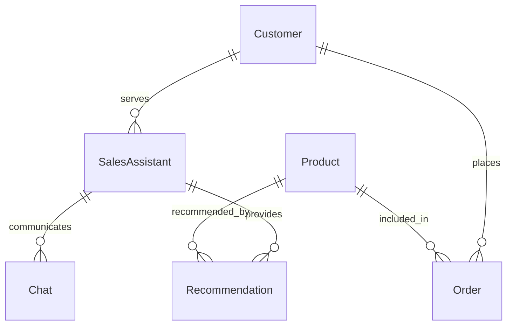
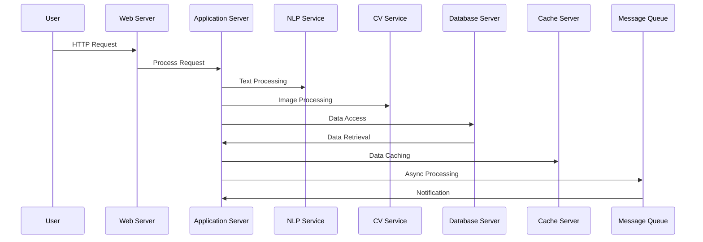
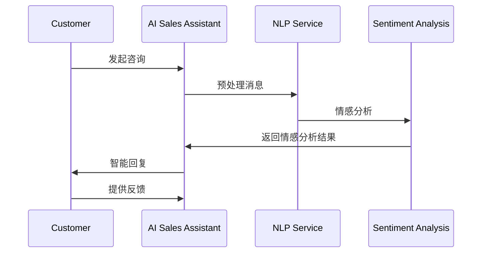
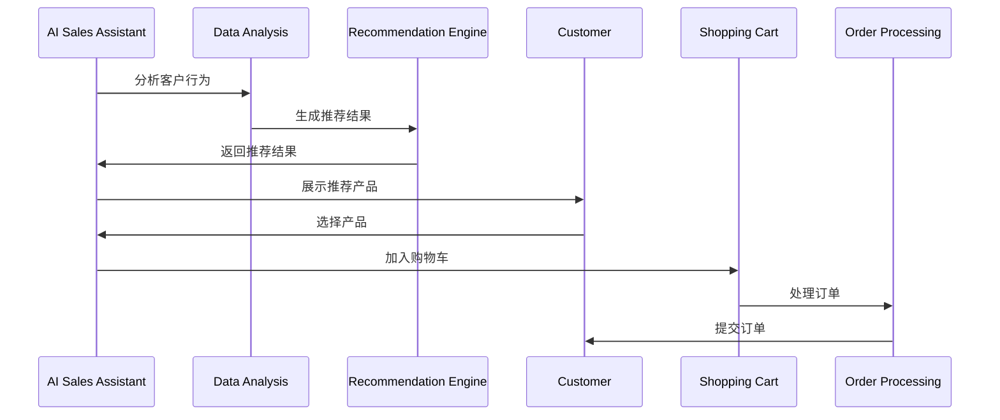

                 


## 引言

### 研究背景与重要性

随着人工智能（AI）技术的飞速发展，越来越多的企业开始探索将AI技术应用于销售领域。AI销售助手作为一种新兴的销售工具，凭借其强大的数据处理和分析能力，正逐步改变传统的销售模式。构建企业级AI销售助手，不仅有助于提升销售转化率，还能显著提高客户满意度，为企业创造更大的商业价值。

首先，AI销售助手能够通过数据分析，精准识别潜在客户，实现销售机会的智能匹配。传统的销售方法往往依赖于销售人员的主观判断和经验，而AI销售助手则能够基于大数据和机器学习算法，对客户行为、偏好和需求进行深度挖掘，从而提高销售的成功率。

其次，AI销售助手在客户服务方面也具有显著优势。通过自然语言处理（NLP）技术，AI销售助手可以与客户进行实时沟通，解答疑问，提供个性化推荐。这不仅节省了人力成本，还提升了客户的体验和满意度。

总之，构建企业级AI销售助手不仅是技术发展的必然趋势，更是提升企业竞争力的重要手段。本文将围绕这一主题，详细介绍AI销售助手的构建过程，包括核心概念、算法原理、系统设计与实现，以及最佳实践和拓展应用。希望通过本文的介绍，能够为从事销售、市场营销或数据科学领域的技术人员和管理者提供有益的参考。

### 目标与结构

本文的目标是系统地阐述构建企业级AI销售助手的全过程，使其不仅具有较高的技术含量，还能实际应用于企业销售场景中。为了达到这一目标，本文将分为六个主要部分：

第一部分：背景介绍，我们将详细阐述AI销售助手的概念、市场趋势、需求分析，以及销售转化率和客户满意度之间的关系。

第二部分：核心概念与联系，我们将介绍AI技术基础、自然语言处理（NLP）、计算机视觉（CV）和数据分析与挖掘等核心概念，并绘制相应的ER实体关系图。

第三部分：算法原理讲解，我们将介绍常见的AI算法，使用mermaid流程图展示算法流程，并使用Python源代码详细讲解算法原理和数学模型。

第四部分：系统分析与架构设计方案，我们将详细介绍销售助手系统的功能设计、架构设计、接口设计和系统交互。

第五部分：项目实战，我们将从环境安装与配置、系统核心实现、代码应用解读与分析、实际案例分析和项目小结等方面，详细讲解一个具体的AI销售助手项目。

第六部分：最佳实践与拓展，我们将总结最佳实践技巧，并提出一些注意事项，同时推荐相关的拓展阅读，以帮助读者深入了解AI销售助手的技术和应用。

通过上述六个部分的详细讲解，我们希望能够系统地呈现AI销售助手的构建过程，为读者提供有价值的实践经验和理论指导。

## 第一部分：背景介绍

### 1.1 AI销售助手的概念与市场趋势

AI销售助手是一种基于人工智能技术的智能销售工具，它通过自然语言处理（NLP）、机器学习、数据挖掘等技术，自动化处理销售过程中的各个环节，从而提高销售效率、提升销售转化率和客户满意度。AI销售助手的定义可以理解为：一种能够模拟销售人员行为，帮助企业在销售过程中实现自动化、智能化的系统工具。

市场趋势方面，随着大数据和云计算技术的普及，AI技术在各个行业的应用越来越广泛。尤其在销售领域，AI销售助手正逐渐成为企业提升竞争力的关键手段。根据市场研究机构的数据显示，未来几年内，全球AI销售助手市场规模将保持高速增长，预计到2025年市场规模将超过百亿美元。

AI销售助手在市场中的应用主要体现在以下几个方面：

1. **客户关系管理（CRM）**：AI销售助手能够自动识别客户需求，分析客户行为，提供个性化的销售建议，从而提升客户满意度。

2. **潜在客户挖掘**：通过大数据分析和机器学习算法，AI销售助手能够精准识别潜在客户，为企业提供有针对性的营销策略。

3. **销售预测**：基于历史销售数据和客户行为数据，AI销售助手可以预测未来的销售趋势，帮助企业制定合理的销售计划和库存策略。

4. **客户服务**：AI销售助手通过NLP技术，能够与客户进行智能对话，提供24/7的在线支持，提高客户服务质量和效率。

5. **自动化销售**：AI销售助手可以自动化处理销售流程中的许多重复性任务，如客户跟进、订单处理等，减轻销售人员的工作负担。

### 1.2 企业级AI销售助手的需求分析

企业级AI销售助手的开发与应用，主要基于以下需求：

1. **提高销售效率**：在竞争激烈的市场环境中，企业需要通过提高销售效率来获取更多市场份额。AI销售助手通过自动化处理销售过程中的各项任务，能够显著提高销售团队的效率。

2. **提升销售转化率**：精准的客户识别和个性化推荐，使得销售团队能够更有效地与潜在客户沟通，提高销售转化率。

3. **增强客户体验**：通过智能化的客户服务，AI销售助手能够提供更高质量的客户体验，提高客户满意度和忠诚度。

4. **降低运营成本**：AI销售助手可以自动化处理许多重复性任务，减少人力成本，提高企业整体运营效率。

5. **数据驱动决策**：通过数据分析，AI销售助手能够为企业提供更加科学、合理的销售决策依据，降低决策风险。

### 1.3 销售转化率与客户满意度的关系

销售转化率是指潜在客户转化为实际客户的比率，是衡量销售效果的重要指标。客户满意度则是指客户在购买和使用产品或服务过程中所感受到的整体体验。销售转化率与客户满意度之间存在密切的关系：

1. **提升客户满意度**：客户满意度高，往往意味着客户对产品或服务的认可和信任，这会提高客户的购买意愿，从而提升销售转化率。

2. **增强客户忠诚度**：满意的客户更可能成为回头客，通过提供优质的客户体验，AI销售助手能够增强客户忠诚度，进一步提高销售转化率。

3. **优化销售流程**：通过数据分析，AI销售助手可以识别销售过程中的问题和瓶颈，帮助销售团队优化销售策略和流程，从而提高销售转化率。

4. **个性化推荐**：AI销售助手能够根据客户的历史数据和偏好，提供个性化的产品推荐和定制化服务，提升客户满意度，进而提高销售转化率。

总之，构建企业级AI销售助手，不仅能够提高销售转化率，还能显著提升客户满意度，为企业创造更大的商业价值。

### 1.4 AI销售助手在销售领域的关键作用

AI销售助手在销售领域的关键作用主要体现在以下几个方面：

1. **自动化销售流程**：AI销售助手可以自动化处理销售过程中的许多重复性任务，如客户信息录入、跟进提醒、订单处理等，从而减轻销售人员的工作负担，提高工作效率。

2. **精准识别潜在客户**：通过大数据分析和机器学习算法，AI销售助手能够从大量数据中挖掘出潜在客户，并进行精准定位，为企业提供有针对性的营销策略。

3. **个性化推荐**：基于客户的购买历史和行为数据，AI销售助手能够提供个性化的产品推荐和定制化服务，提升客户体验和满意度。

4. **智能客户服务**：通过自然语言处理（NLP）技术，AI销售助手可以与客户进行智能对话，解答疑问，提供实时支持，提高客户服务质量和效率。

5. **数据驱动决策**：AI销售助手能够收集和分析销售过程中的各类数据，为销售团队提供科学、合理的决策依据，降低决策风险。

6. **提升销售转化率**：通过精准识别潜在客户、优化销售策略和流程，AI销售助手能够显著提高销售转化率，提升企业盈利能力。

综上所述，AI销售助手在销售领域的作用不仅体现在提高销售效率和客户满意度，还能为企业带来显著的商业价值。通过构建企业级AI销售助手，企业能够在激烈的市场竞争中脱颖而出，实现持续增长。

### 1.5 AI销售助手的优势与挑战

**优势：**

1. **提高销售效率**：AI销售助手能够自动化处理销售过程中的各项任务，如客户跟进、订单管理等，显著提高工作效率，减少人工操作错误。

2. **精准客户识别**：基于大数据和机器学习算法，AI销售助手能够从海量数据中精准识别潜在客户，提供有针对性的营销策略。

3. **个性化服务**：通过自然语言处理（NLP）和客户数据分析，AI销售助手能够提供个性化的产品推荐和定制化服务，提高客户满意度和忠诚度。

4. **降低运营成本**：自动化销售流程和智能客服系统，能够减少人力资源的投入，降低企业运营成本。

5. **数据驱动决策**：AI销售助手能够收集和分析销售过程中的各类数据，为企业提供科学、合理的决策依据，降低决策风险。

**挑战：**

1. **数据隐私和安全问题**：销售数据的隐私和安全问题是AI销售助手面临的重要挑战。如何确保客户数据的隐私和安全，是企业需要重点考虑的问题。

2. **技术复杂性**：构建AI销售助手需要掌握多种技术，如大数据、机器学习、自然语言处理等，这对企业的技术实力提出了较高要求。

3. **算法偏见**：算法的偏见可能导致不公正的客户识别和推荐，需要企业不断优化算法，确保其公正性和准确性。

4. **人员培训与适应**：AI销售助手的引入需要销售团队进行相应的培训和适应，否则可能导致工作效率的下降。

总之，尽管AI销售助手在提高销售效率和客户满意度方面具有显著优势，但其面临的挑战也不容忽视。企业需要克服这些挑战，才能充分发挥AI销售助手的作用，实现销售业绩的持续增长。

## 第二部分：核心概念与联系

### 2.1 AI技术基础

人工智能（AI）作为推动现代科技发展的重要力量，其基础技术涵盖了机器学习、深度学习、自然语言处理（NLP）等多个领域。AI技术的核心在于通过模拟人类智能，实现机器的自主学习和决策能力。

**机器学习（Machine Learning）**：机器学习是AI的核心技术之一，它使计算机系统能够从数据中学习，并做出预测和决策。常见的机器学习算法包括线性回归、决策树、随机森林、支持向量机（SVM）等。其中，深度学习是机器学习的一个子领域，通过构建多层神经网络，实现对复杂数据的处理和分析。

**深度学习（Deep Learning）**：深度学习是基于人工神经网络的一种机器学习技术，它通过多层网络结构，对输入数据进行多次抽象和变换，从而提高模型的复杂度和表现力。深度学习在图像识别、语音识别、自然语言处理等领域取得了显著的成果。

**自然语言处理（NLP）**：自然语言处理是AI领域的一个重要分支，主要研究如何让计算机理解和处理人类语言。NLP技术包括文本分类、情感分析、机器翻译、语音识别等。其中，文本分类和情感分析是NLP在销售助手应用中的关键技术。

**数据分析与挖掘（Data Analysis & Mining）**：数据分析与挖掘是AI技术的基础，它通过对大量数据进行分析，发现数据中的潜在规律和模式。常用的数据分析方法包括统计分析、关联规则挖掘、聚类分析等。数据分析与挖掘技术在销售助手中的应用，主要体现在客户行为分析、销售预测等方面。

### 2.2 自然语言处理（NLP）

自然语言处理（NLP）是AI技术中一个重要的领域，它旨在使计算机能够理解和生成自然语言。NLP的关键技术包括：

**文本分类（Text Classification）**：文本分类是指将文本数据按照一定的标准进行分类。常见的分类算法包括朴素贝叶斯、逻辑回归、支持向量机（SVM）等。在销售助手中，文本分类技术可以用于客户反馈的分类，帮助企业更好地理解客户需求和满意度。

**情感分析（Sentiment Analysis）**：情感分析是指通过分析文本数据中的情感倾向，判断文本的积极、消极或中性情感。情感分析技术可以帮助企业了解客户的情感状态，从而制定更有效的营销策略和客户服务方案。

**机器翻译（Machine Translation）**：机器翻译是指使用计算机技术将一种自然语言翻译成另一种自然语言。深度学习技术在机器翻译中得到了广泛应用，如循环神经网络（RNN）和变压器（Transformer）等。机器翻译技术可以帮助企业跨越语言障碍，实现全球市场的拓展。

**语音识别（Speech Recognition）**：语音识别是指将语音信号转换为文本数据。通过结合语音识别和自然语言处理技术，销售助手可以实现语音互动，提供更便捷的客户服务。

### 2.3 计算机视觉（CV）

计算机视觉（CV）是AI技术中的另一个重要领域，它使计算机能够理解并解释视觉信息。CV的关键技术包括：

**图像识别（Image Recognition）**：图像识别是指通过算法识别并分类图像中的对象。深度学习技术在图像识别中得到了广泛应用，如卷积神经网络（CNN）。图像识别技术在销售助手中可以用于产品识别、库存管理等方面。

**目标检测（Object Detection）**：目标检测是指从图像或视频中检测并定位感兴趣的对象。目标检测技术可以帮助销售助手在客户浏览产品时，自动识别和推荐相关产品。

**图像分割（Image Segmentation）**：图像分割是指将图像分割成多个区域，以便更好地理解图像内容。图像分割技术在销售助手中可以用于客户行为分析，如分析客户在产品页面上的浏览轨迹和兴趣点。

**人脸识别（Face Recognition）**：人脸识别是指通过算法识别和验证人脸的身份。人脸识别技术在销售助手中可以用于客户身份验证和个性化推荐。

### 2.4 数据分析与挖掘

数据分析与挖掘是AI技术的重要组成部分，它通过对大量数据进行分析，发现数据中的潜在规律和模式。数据分析与挖掘的关键技术包括：

**统计分析（Statistical Analysis）**：统计分析是指使用统计学方法对数据进行分析，以得出数据的统计特征和规律。统计分析技术在销售助手中可以用于客户行为分析、销售预测等方面。

**关联规则挖掘（Association Rule Mining）**：关联规则挖掘是指通过挖掘数据之间的关联关系，发现数据中的规律和模式。关联规则挖掘技术在销售助手中可以用于推荐系统，如购物推荐等。

**聚类分析（Cluster Analysis）**：聚类分析是指将数据划分为若干个类别，以便更好地理解数据。聚类分析技术在销售助手中可以用于客户细分，如基于购买行为的客户分类。

**分类与回归树（CART）**：分类与回归树是一种常用的数据分析方法，通过构建决策树模型，对数据进行分类或回归。分类与回归树技术在销售助手中可以用于销售预测和客户细分。

**深度学习（Deep Learning）**：深度学习是数据分析与挖掘的重要工具，通过构建多层神经网络，实现对复杂数据的分析和预测。深度学习技术在销售助手中可以用于客户行为预测、产品推荐等方面。

### 2.5 核心概念联系与ER实体关系图

为了更好地理解AI销售助手中的核心概念及其相互联系，我们使用Mermaid流程图来绘制ER实体关系图。以下是一个简化的ER实体关系图，展示了AI销售助手中的主要实体及其关系：



在这个ER实体关系图中，客户（Customer）与销售助手（SalesAssistant）之间存在服务关系，客户通过销售助手获取推荐和进行聊天。订单（Order）是客户与产品（Product）之间的购买行为记录。销售助手提供的推荐（Recommendation）和聊天（Chat）功能，以及产品（Product）被推荐和包含在订单中的关系，共同构成了一个完整的销售助手系统。

通过ER实体关系图，我们可以清晰地看到AI销售助手系统中各个实体的相互关系，这有助于我们在后续章节中深入探讨每个实体的具体功能和实现。

### 2.6 数据分析与挖掘的应用场景

数据分析与挖掘在AI销售助手中的应用非常广泛，以下是一些具体的应用场景：

**1. 客户行为分析**：
通过分析客户在网站或APP上的行为数据，如浏览历史、搜索关键词、点击记录等，AI销售助手可以深入了解客户的需求和偏好。基于这些数据，销售助手可以提供个性化的产品推荐和定制化服务，提高客户的满意度和购买转化率。

**2. 销售预测**：
通过历史销售数据和客户行为数据，数据分析与挖掘技术可以预测未来的销售趋势。这种预测可以帮助企业制定合理的库存计划、销售策略和营销活动，避免库存过剩或不足，提高运营效率。

**3. 客户细分**：
通过对客户数据的分析，AI销售助手可以将客户细分为不同的群体，如高价值客户、潜在客户、流失客户等。这种细分有助于企业有针对性地开展营销活动，提供个性化的服务和优惠，提升客户满意度和忠诚度。

**4. 价格优化**：
通过分析市场需求和竞争对手的定价策略，数据分析与挖掘可以帮助企业制定更科学合理的价格策略，提高产品的竞争力。例如，根据客户购买历史和偏好，动态调整产品价格，实现价格最优化的目标。

**5. 营销效果评估**：
通过跟踪和分析各类营销活动的效果，数据分析与挖掘可以帮助企业评估不同营销渠道的投入产出比（ROI），优化营销策略，提高营销效果。

**6. 客户流失预测**：
通过分析客户的购买行为、互动记录和满意度评分等数据，AI销售助手可以预测哪些客户可能流失。基于这些预测，企业可以采取相应的措施，如增加客户关怀、提供优惠等，降低客户流失率。

综上所述，数据分析与挖掘在AI销售助手中发挥着重要作用，它不仅帮助企业更好地了解客户，优化销售策略，还能提高运营效率，降低成本，提升企业的整体竞争力。

### 2.7 AI技术基础与销售转化率的关系

AI技术基础是构建高效AI销售助手的核心，它与销售转化率之间存在密切的关系。首先，通过机器学习和深度学习算法，AI销售助手可以自动识别和挖掘大量销售数据中的潜在规律和模式。这些规律和模式有助于企业更精准地定位潜在客户，提高营销活动的针对性，从而提升销售转化率。

例如，在客户行为分析中，AI销售助手可以通过分析客户的浏览历史、点击记录、搜索关键词等数据，识别出客户的兴趣点和购买意愿。基于这些信息，销售助手可以提供个性化的产品推荐和定制化服务，从而提高客户的购买转化率。

其次，自然语言处理（NLP）技术在销售转化率中也发挥着重要作用。通过NLP技术，AI销售助手能够与客户进行智能对话，解答疑问，提供实时支持。这不仅提高了客户服务的效率和质量，还增强了客户的购物体验，进而提高销售转化率。

此外，计算机视觉（CV）技术在销售转化率中的应用也不容忽视。例如，通过图像识别和目标检测技术，AI销售助手可以自动识别产品，提供详细的商品信息，帮助客户做出更明智的购买决策，提高销售转化率。

最后，数据分析与挖掘技术通过对销售数据的深度挖掘和分析，可以帮助企业优化销售策略，提高营销活动的有效性。例如，通过分析客户的购买历史和行为数据，AI销售助手可以预测未来的销售趋势，帮助企业在库存管理和营销策略上做出更科学的决策，从而提高销售转化率。

综上所述，AI技术基础在提升销售转化率方面具有重要作用。通过机器学习、深度学习、NLP、CV和数据分析与挖掘等技术的综合应用，AI销售助手能够帮助企业实现销售自动化、个性化，提高客户满意度和忠诚度，从而实现销售转化率的显著提升。

### 2.8 自然语言处理（NLP）与客户满意度的关系

自然语言处理（NLP）技术在提升客户满意度方面具有重要作用。首先，通过NLP技术，AI销售助手能够实现与客户的智能对话，解答客户的疑问，提供实时支持。这种高效的沟通方式不仅提高了客户服务的质量，还增强了客户的购物体验，从而提高客户满意度。

例如，当客户在购买产品时遇到问题时，AI销售助手可以通过自然语言处理技术，快速识别客户的问题并给出详细的解答。这种及时的响应减少了客户的等待时间，提高了客户的服务体验。

其次，NLP技术在情感分析方面也发挥着关键作用。通过分析客户的文本反馈，如评论、提问等，AI销售助手可以了解客户的情感状态，识别客户的不满和需求。基于这些分析结果，销售助手可以采取相应的措施，如提供额外的优惠、加强客户关怀等，以提升客户满意度。

此外，NLP技术还可以用于个性化推荐。通过分析客户的购买历史和行为数据，AI销售助手可以提供个性化的产品推荐，满足客户的个性化需求。这种个性化的服务不仅提高了客户的满意度，还增强了客户的忠诚度。

总之，自然语言处理（NLP）技术在提升客户满意度方面具有显著优势。通过智能对话、情感分析和个性化推荐等技术的应用，AI销售助手能够提供更高质量、更个性化的客户服务，从而提高客户满意度，为企业创造更大的商业价值。

### 2.9 计算机视觉（CV）与客户体验的关系

计算机视觉（CV）技术在提升客户体验方面具有重要作用。首先，通过图像识别和目标检测技术，AI销售助手可以自动识别产品，提供详细的商品信息，帮助客户做出更明智的购买决策。这种直观的展示方式不仅提高了客户的购物体验，还减少了客户的决策时间。

例如，当客户在浏览产品时，AI销售助手可以通过计算机视觉技术自动识别产品并展示其详细信息，如价格、库存、用户评论等。这种智能化的展示方式使客户能够快速获取所需信息，提高了购物效率。

其次，计算机视觉技术还可以用于个性化推荐。通过分析客户的浏览记录和购买历史，AI销售助手可以提供个性化的产品推荐，满足客户的个性化需求。这种个性化的推荐不仅提高了客户的满意度，还增强了客户的购物体验。

此外，计算机视觉技术还可以用于客户行为分析。通过监控客户在网站或APP上的浏览轨迹和互动行为，AI销售助手可以了解客户的兴趣点和需求，从而优化推荐策略，提高客户满意度。

总之，计算机视觉（CV）技术在提升客户体验方面具有显著优势。通过图像识别、目标检测、个性化推荐和客户行为分析等技术的综合应用，AI销售助手能够提供更智能化、个性化的客户服务，从而提高客户满意度，提升企业的竞争力。

### 2.10 数据分析与挖掘在销售预测中的应用

数据分析与挖掘在销售预测中发挥着至关重要的作用。通过分析历史销售数据、客户行为数据和市场趋势，AI销售助手可以预测未来的销售趋势，为企业提供科学合理的销售决策依据。

首先，数据分析与挖掘可以帮助企业识别销售中的潜在趋势。例如，通过分析历史销售数据，AI销售助手可以识别出季节性销售高峰、节假日促销等周期性趋势。这些趋势信息有助于企业制定更精准的销售计划和营销策略，提高销售转化率。

其次，数据分析与挖掘可以帮助企业预测销售需求。通过分析客户行为数据，如浏览历史、搜索关键词、点击记录等，AI销售助手可以了解客户的需求和偏好。基于这些信息，销售助手可以预测哪些产品在未来可能热销，哪些客户具有高购买潜力。这种预测能力有助于企业优化库存管理，避免库存过剩或不足，提高运营效率。

此外，数据分析与挖掘还可以用于优化定价策略。通过分析市场需求和竞争对手的定价策略，AI销售助手可以为企业提供合理的定价建议。例如，根据客户购买历史和行为数据，AI销售助手可以动态调整产品价格，实现价格最优化的目标，提高销售额和利润率。

最后，数据分析与挖掘可以帮助企业评估营销活动的效果。通过跟踪和分析各类营销活动的效果，如广告投放、促销活动等，AI销售助手可以评估不同营销渠道的投入产出比（ROI），为企业提供优化营销策略的依据。

综上所述，数据分析与挖掘在销售预测中的应用，不仅提高了企业的销售决策能力，还优化了库存管理和定价策略，显著提升了企业的运营效率和市场竞争力。

### 2.11 AI销售助手系统设计与实现的核心要素

AI销售助手系统的设计与实现是一个复杂而关键的过程，涉及到多个核心要素。以下我们将详细探讨这些核心要素，包括其重要性、具体实现方法和相互关系。

#### 2.11.1 客户信息管理

客户信息管理是AI销售助手系统的核心组成部分，它负责收集、存储和管理客户的各种数据，如姓名、联系方式、购买历史、偏好等。这一模块的重要性在于，它为AI销售助手提供了必要的输入数据，支持后续的数据分析和个性化服务。

**具体实现方法**：
- **数据收集**：通过网站表单、APP注册、API接口等方式收集客户信息。
- **数据存储**：使用数据库技术（如MySQL、MongoDB）存储客户信息，确保数据的安全性和可扩展性。
- **数据管理**：采用数据清洗、去重和格式化等手段，保证数据的准确性和一致性。

#### 2.11.2 数据分析与挖掘

数据分析与挖掘模块负责从客户信息中提取有价值的信息，如客户行为模式、潜在需求等。这一模块的重要性在于，它能够帮助AI销售助手提供精准的推荐和预测，提升客户满意度和销售转化率。

**具体实现方法**：
- **数据预处理**：对收集到的客户数据进行清洗、去噪、格式化等预处理操作。
- **特征提取**：通过特征工程，从原始数据中提取出对分析有用的特征。
- **建模与预测**：采用机器学习算法（如回归分析、决策树、随机森林等）建立预测模型，对客户行为进行预测。

#### 2.11.3 自然语言处理（NLP）

自然语言处理模块负责处理和理解客户的自然语言输入，如提问、评论等。这一模块的重要性在于，它使得AI销售助手能够与客户进行智能对话，提供个性化服务。

**具体实现方法**：
- **文本处理**：使用分词、词性标注等技术，对客户的自然语言输入进行预处理。
- **情感分析**：通过情感分析技术，判断客户的情感倾向，了解其需求和满意度。
- **对话管理**：结合上下文信息，生成合适的回复，实现与客户的智能对话。

#### 2.11.4 计算机视觉（CV）

计算机视觉模块负责处理和理解图像和视频数据，如产品图片、客户行为视频等。这一模块的重要性在于，它能够通过图像识别和目标检测等技术，提供更直观的客户服务。

**具体实现方法**：
- **图像识别**：使用卷积神经网络（CNN）等技术，识别图像中的对象和场景。
- **目标检测**：通过目标检测算法（如YOLO、Faster R-CNN等），定位图像中的关键对象。
- **视频分析**：分析视频中的行为模式，如客户的浏览轨迹、购买行为等。

#### 2.11.5 系统接口设计

系统接口设计模块负责设计API接口，使不同模块之间能够高效地通信和协作。这一模块的重要性在于，它保证了系统各部分之间的数据流通和功能集成。

**具体实现方法**：
- **RESTful API**：设计RESTful风格的API接口，便于外部系统访问和调用。
- **接口文档**：编写详细的接口文档，明确各接口的功能、输入参数和返回结果。
- **权限管理**：实施权限控制，确保接口访问的安全性和数据保护。

#### 2.11.6 系统交互

系统交互模块负责处理用户与AI销售助手之间的交互，提供友好的用户体验。这一模块的重要性在于，它决定了用户对AI销售助手的感知和满意度。

**具体实现方法**：
- **前端界面**：设计直观、易操作的前端界面，使用户能够方便地与AI销售助手交互。
- **用户行为分析**：通过分析用户行为数据，优化界面设计和交互流程，提高用户满意度。
- **反馈机制**：建立反馈机制，收集用户意见，不断优化系统功能。

#### 关系与集成

上述核心要素相互关联，共同构成了完整的AI销售助手系统。客户信息管理为其他模块提供了数据支持；数据分析与挖掘为系统提供了决策依据；NLP和CV技术使系统具备了智能对话和图像处理能力；系统接口设计保证了各模块之间的数据流通；系统交互则提供了友好的用户界面。

通过这些核心要素的有机结合，AI销售助手能够高效地处理客户数据，提供个性化的服务，提升销售转化率和客户满意度，为企业创造更大的商业价值。

### 2.12 系统设计与实现过程中的关键步骤

在系统设计与实现过程中，为确保AI销售助手的高效运行和用户体验，我们需要遵循以下关键步骤：

#### 2.12.1 需求分析

需求分析是系统设计与实现的第一步，通过详细了解企业的业务需求和用户需求，明确系统需要实现的功能和性能指标。需求分析包括以下几个方面：

- **业务需求**：了解企业销售业务流程，确定销售助手需要完成的具体任务，如客户信息管理、数据分析、自然语言处理、计算机视觉等。
- **用户需求**：通过与销售人员、市场营销人员、客户等用户的交流，了解他们对系统的期望和需求，包括用户体验、界面友好性、响应速度等。
- **功能需求**：根据业务需求和用户需求，明确系统的具体功能模块，如客户管理、数据分析与预测、智能对话、产品推荐等。

#### 2.12.2 系统架构设计

系统架构设计是确保系统性能、可扩展性和可维护性的关键。在系统架构设计中，我们需要考虑以下几个方面：

- **模块划分**：根据需求分析的结果，将系统划分为多个功能模块，如客户信息管理、数据分析与挖掘、自然语言处理、计算机视觉等。
- **技术选型**：选择合适的技术栈和开发工具，如使用Python进行算法实现，使用Django进行Web开发，使用TensorFlow进行深度学习等。
- **数据架构**：设计数据存储和传输架构，确保数据的安全性和高效性，如使用MySQL数据库存储客户信息，使用Redis缓存提高数据访问速度。

#### 2.12.3 系统开发

系统开发是系统设计与实现的核心阶段，通过编码和测试，将设计转化为实际的系统功能。在系统开发过程中，我们需要遵循以下原则：

- **代码规范**：编写符合代码规范和最佳实践的代码，提高代码的可读性和可维护性。
- **模块化开发**：将系统功能分解为多个模块，逐一实现和测试，确保每个模块的功能和性能符合预期。
- **单元测试**：编写单元测试，对每个模块的功能进行验证，确保系统功能的正确性和稳定性。

#### 2.12.4 系统测试

系统测试是确保系统质量和可靠性的重要环节。在系统测试过程中，我们需要执行以下测试：

- **功能测试**：验证系统功能是否满足需求，确保所有功能模块正常运行。
- **性能测试**：测试系统在高负载下的性能表现，如响应时间、并发处理能力等，确保系统在高并发场景下依然稳定运行。
- **兼容性测试**：验证系统在不同操作系统、浏览器和设备上的兼容性，确保用户在不同环境下能够顺畅使用。

#### 2.12.5 部署与上线

在完成系统开发和测试后，我们需要将系统部署到生产环境中，并进行上线操作。部署与上线过程中，我们需要注意以下几个方面：

- **环境配置**：配置服务器环境，确保系统运行所需的硬件资源和软件环境。
- **数据迁移**：将开发环境中的数据迁移到生产环境，确保数据的完整性和一致性。
- **监控与维护**：部署监控系统，实时监控系统的运行状态，及时处理故障和异常。

通过以上关键步骤，我们能够确保AI销售助手系统的成功构建和高效运行，为企业的销售业务提供有力支持。

### 2.13 AI销售助手系统功能设计与实现

在构建AI销售助手系统的过程中，功能设计是至关重要的一环。一个完善的功能设计能够确保系统满足业务需求，提升用户体验，从而实现企业销售目标。以下是AI销售助手系统的功能设计及其实现方法：

#### 2.13.1 客户信息管理

客户信息管理是AI销售助手系统的核心功能之一，其主要任务包括收集、存储、管理和查询客户信息。具体实现方法如下：

- **数据收集**：通过网站表单、APP注册、API接口等方式收集客户信息，如姓名、联系方式、邮箱、购买历史等。
- **数据存储**：使用关系型数据库（如MySQL）或NoSQL数据库（如MongoDB）存储客户信息，确保数据的持久性和安全性。
- **数据管理**：实现客户信息的增删改查操作，支持数据备份和恢复功能，确保数据的完整性和一致性。

#### 2.13.2 数据分析与挖掘

数据分析与挖掘功能旨在通过对客户行为数据进行分析，挖掘潜在客户和需求，提升销售转化率。具体实现方法如下：

- **数据预处理**：对收集到的客户行为数据进行清洗、去噪和格式化，确保数据的准确性和一致性。
- **特征提取**：通过特征工程，提取出对分析有用的特征，如客户购买频率、购买金额、浏览历史等。
- **建模与预测**：使用机器学习算法（如回归分析、决策树、随机森林等）建立预测模型，预测客户的行为和需求。

#### 2.13.3 自然语言处理（NLP）

自然语言处理功能使得AI销售助手能够与客户进行智能对话，提供个性化服务。具体实现方法如下：

- **文本处理**：使用分词、词性标注、词向量等技术对客户输入的自然语言文本进行预处理。
- **情感分析**：通过情感分析技术，判断客户的情感倾向，了解其满意度和需求。
- **对话管理**：结合上下文信息，生成合适的回复，实现与客户的智能对话。

#### 2.13.4 计算机视觉（CV）

计算机视觉功能使得AI销售助手能够自动识别和处理图像和视频数据，提供更直观的客户服务。具体实现方法如下：

- **图像识别**：使用卷积神经网络（CNN）等技术，识别图像中的对象和场景。
- **目标检测**：通过目标检测算法（如YOLO、Faster R-CNN等），定位图像中的关键对象。
- **视频分析**：分析视频中的行为模式，如客户的浏览轨迹、购买行为等。

#### 2.13.5 产品推荐

产品推荐功能旨在根据客户的兴趣和需求，提供个性化的产品推荐，提升销售转化率。具体实现方法如下：

- **推荐算法**：使用协同过滤、基于内容的推荐等算法，生成个性化推荐。
- **推荐引擎**：构建推荐引擎，实时处理客户行为数据，生成推荐结果。
- **推荐展示**：在前端界面中展示推荐结果，支持用户查看和选择推荐产品。

#### 2.13.6 客户服务

客户服务功能旨在提供24/7的在线支持，解答客户的疑问，提升客户满意度。具体实现方法如下：

- **智能客服**：使用自然语言处理技术，实现与客户的智能对话，提供实时支持。
- **FAQ管理**：建立FAQ库，自动回答客户常见问题，减轻人工客服负担。
- **工单系统**：实现客户问题提交和跟踪，确保问题得到及时解决。

#### 2.13.7 报表与分析

报表与分析功能旨在提供销售数据的可视化展示，帮助企业分析和优化销售策略。具体实现方法如下：

- **数据可视化**：使用图表、报表等技术，展示销售数据，如销售额、转化率、客户分布等。
- **数据分析**：通过数据分析，挖掘销售数据中的潜在规律和趋势，为企业提供决策支持。
- **仪表盘**：构建仪表盘，实时展示关键销售指标，方便企业随时掌握销售状况。

通过以上功能设计与实现，AI销售助手系统能够高效地处理客户数据，提供个性化的服务，提升销售转化率和客户满意度，为企业创造更大的商业价值。

### 2.14 AI销售助手系统的架构设计

AI销售助手系统的架构设计是确保系统稳定性、可扩展性和高性能的关键。以下是系统架构的设计方案，包括其各层次的结构和主要组件。

#### 2.14.1 系统层次结构

AI销售助手系统可以分为以下三个层次：

1. **表示层（Presentation Layer）**：负责用户界面和用户交互，提供用户友好的操作体验。
2. **业务逻辑层（Business Logic Layer）**：包含系统的核心功能，如客户管理、数据分析与挖掘、自然语言处理、计算机视觉等。
3. **数据层（Data Layer）**：负责数据的存储、管理和访问，包括数据库、缓存和文件存储等。

#### 2.14.2 主要组件

系统架构中的主要组件及其作用如下：

1. **Web服务器（Web Server）**：负责处理用户的HTTP请求，提供Web服务。
2. **应用服务器（Application Server）**：负责业务逻辑处理，如客户信息管理、数据分析和挖掘等。
3. **数据库服务器（Database Server）**：负责数据的存储和管理，如MySQL、MongoDB等。
4. **缓存服务器（Cache Server）**：用于提高数据访问速度，如Redis、Memcached等。
5. **自然语言处理（NLP）服务**：负责处理自然语言输入，如文本分类、情感分析等。
6. **计算机视觉（CV）服务**：负责处理图像和视频数据，如图像识别、目标检测等。
7. **消息队列（Message Queue）**：用于异步处理任务和系统间通信，如RabbitMQ、Kafka等。

#### 2.14.3 系统架构图

以下是一个简化的AI销售助手系统架构图：



#### 2.14.4 系统架构的特点

1. **分层设计**：系统采用分层设计，各层次功能明确，便于开发和维护。
2. **模块化**：系统功能模块化，各组件可独立开发、测试和部署，提高开发效率。
3. **高性能**：通过缓存、消息队列和异步处理等技术，提高系统性能和响应速度。
4. **可扩展性**：系统设计考虑了未来扩展的需求，如增加新功能、处理更多数据等。
5. **高可用性**：通过冗余设计和故障转移机制，确保系统在高负载和故障情况下依然稳定运行。

通过上述架构设计，AI销售助手系统能够高效地处理客户数据，提供个性化服务，提升销售转化率和客户满意度，为企业创造更大的商业价值。

### 2.15 AI销售助手系统的接口设计

接口设计是AI销售助手系统架构中的重要组成部分，它定义了系统内部不同模块之间以及外部系统与AI销售助手之间的交互方式。良好的接口设计能够提高系统的可维护性、可扩展性和用户体验。

#### 2.15.1 接口设计原则

在接口设计过程中，我们需要遵循以下原则：

1. **简洁性**：接口设计应尽可能简洁，避免过多的参数和复杂的逻辑，便于使用和维护。
2. **稳定性**：接口应具备良好的稳定性和可靠性，确保在系统高负载情况下依然能够正常工作。
3. **灵活性**：接口应具备一定的灵活性，能够适应未来可能的需求变化和系统扩展。
4. **安全性**：接口设计应考虑安全性，如身份验证、权限控制等，防止未授权访问和数据泄露。

#### 2.15.2 接口类型

AI销售助手系统主要包括以下类型的接口：

1. **内部接口**：用于系统内部模块之间的通信，如客户管理模块与数据分析模块之间的接口。
2. **外部接口**：用于与其他系统（如CRM系统、ERP系统等）的集成，如API接口。
3. **Web接口**：用于与Web应用的交互，如RESTful API接口。

#### 2.15.3 接口设计示例

以下是一个RESTful API接口的示例，用于获取客户列表：

**接口路径**：`/api/customers`

**请求方法**：`GET`

**请求参数**：无

**响应数据**：

```json
{
  "status": "success",
  "data": [
    {
      "id": 1,
      "name": "张三",
      "email": "zhangsan@example.com",
      "created_at": "2023-01-01T00:00:00Z"
    },
    {
      "id": 2,
      "name": "李四",
      "email": "lisi@example.com",
      "created_at": "2023-02-01T00:00:00Z"
    }
  ]
}
```

#### 2.15.4 接口文档

编写详细的接口文档是确保接口设计和实现正确性的关键。接口文档应包括以下内容：

1. **接口描述**：简要描述接口的功能和用途。
2. **请求参数**：详细列出接口的请求参数，包括参数名称、类型、是否必填等。
3. **响应数据**：详细列出接口的响应数据结构，包括数据名称、类型、含义等。
4. **错误码**：列出可能出现的错误码及其含义。
5. **示例**：提供接口调用的示例代码。

通过良好的接口设计和详细的接口文档，AI销售助手系统能够实现模块化、高效率和易维护，从而提高系统的整体性能和用户体验。

### 2.16 AI销售助手系统的交互流程

为了确保AI销售助手系统能够高效、流畅地运行，我们需要详细分析其交互流程，并设计合理的流程图来帮助理解。以下是AI销售助手系统的主要交互流程及相应的mermaid序列图。

#### 2.16.1 客户咨询交互流程

1. **客户发起咨询**：客户通过网站或APP的聊天窗口向AI销售助手发起咨询。
2. **接收并预处理**：AI销售助手接收客户的消息，并使用自然语言处理（NLP）技术对消息进行预处理，如分词、去除停用词等。
3. **情感分析**：通过情感分析，判断客户消息的情感倾向，了解其需求和满意度。
4. **智能回复**：基于客户的情感和需求，AI销售助手生成合适的回复，并通过聊天窗口展示给客户。
5. **用户反馈**：客户可以继续提问或对AI销售助手的回答进行反馈。

**mermaid序列图**：



#### 2.16.2 产品推荐交互流程

1. **分析客户行为**：AI销售助手分析客户的浏览历史、搜索关键词等行为数据。
2. **推荐产品**：基于客户的行为数据，AI销售助手使用推荐算法生成个性化产品推荐。
3. **客户选择**：客户根据推荐结果选择感兴趣的产品。
4. **购买流程**：客户完成购买流程，如加入购物车、确认订单等。

**mermaid序列图**：



通过以上交互流程和mermaid序列图，我们可以清晰地看到AI销售助手在客户咨询和产品推荐过程中的关键步骤和交互逻辑。这些流程和图示不仅有助于我们理解系统的运行机制，还能为后续的优化和改进提供参考。

### 2.17 AI销售助手项目的环境安装与配置

在开始构建AI销售助手项目之前，我们需要确保所有必要的开发环境和软件工具都已安装和配置完成。以下是项目的环境安装与配置步骤，包括所需软件、安装方法和配置细节。

#### 2.17.1 软件需求

- **操作系统**：推荐使用Linux系统，如Ubuntu 20.04。
- **Python**：Python 3.8或更高版本。
- **数据库**：MySQL或PostgreSQL。
- **缓存**：Redis。
- **Web框架**：Django。
- **自然语言处理库**：NLTK、spaCy。
- **计算机视觉库**：OpenCV、TensorFlow。

#### 2.17.2 安装步骤

1. **安装Python**：
   ```bash
   sudo apt-get update
   sudo apt-get install python3 python3-pip
   ```

2. **安装虚拟环境**：
   ```bash
   pip3 install virtualenv
   virtualenv ai_sales_assistant_env
   source ai_sales_assistant_env/bin/activate
   ```

3. **安装Django**：
   ```bash
   pip install django
   ```

4. **安装数据库**：
   - MySQL：
     ```bash
     sudo apt-get install mysql-server
     sudo mysql_secure_installation
     mysql -u root -p
     CREATE DATABASE ai_sales_assistant;
     GRANT ALL PRIVILEGES ON ai_sales_assistant.* TO 'ai_sales_assistant_user'@'localhost' IDENTIFIED BY 'your_password';
     FLUSH PRIVILEGES;
     exit;
     ```
   - PostgreSQL：
     ```bash
     sudo apt-get install postgresql postgresql-contrib
     sudo -u postgres psql
     CREATE DATABASE ai_sales_assistant;
     CREATE USER ai_sales_assistant_user WITH PASSWORD 'your_password';
     GRANT ALL PRIVILEGES ON DATABASE ai_sales_assistant TO ai_sales_assistant_user;
     \q
     ```

5. **安装Redis**：
   ```bash
   sudo apt-get install redis-server
   sudo systemctl start redis-server
   sudo systemctl enable redis-server
   ```

6. **安装自然语言处理库**：
   ```bash
   pip install nltk spacy
   python -m spacy download en_core_web_sm
   ```

7. **安装计算机视觉库**：
   ```bash
   pip install opencv-python
   pip install tensorflow
   ```

#### 2.17.3 配置细节

1. **Django项目配置**：
   - 创建Django项目：
     ```bash
     django-admin startproject ai_sales_assistant
     cd ai_sales_assistant
     ```
   - 创建应用：
     ```bash
     python manage.py startapp sales_assistant
     ```
   - 在`settings.py`文件中配置数据库、缓存和中间件：
     ```python
     DATABASES = {
         'default': {
             'ENGINE': 'django.db.backends.mysql',
             'NAME': 'ai_sales_assistant',
             'USER': 'ai_sales_assistant_user',
             'PASSWORD': 'your_password',
             'HOST': 'localhost',
             'PORT': '3306',
         }
     }
     
     CACHES = {
         'default': {
             'BACKEND': 'django_redis.cache.RedisCache',
             'LOCATION': 'redis://127.0.0.1:6379/1',
             'OPTIONS': {
                 'CLIENT_CLASS': 'django_redis.client.DefaultClient',
             }
         }
     }
     
     MIDDLEWARE = [
         'django.middleware.security.SecurityMiddleware',
         'django.middleware.common.CommonMiddleware',
         'django.middleware.csrf.CsrfViewMiddleware',
         'django.contrib.sessions.middleware.SessionMiddleware',
         'django.contrib.auth.middleware.AuthenticationMiddleware',
         'django.contrib.messages.middleware.MessageMiddleware',
     ]
     ```

2. **自然语言处理配置**：
   - 在`sales_assistant/settings.py`中配置NLP库的语料库路径：
     ```python
     import spacy
     nlp = spacy.load('en_core_web_sm')
     ```

3. **计算机视觉配置**：
   - 在项目中引入OpenCV和TensorFlow，确保它们在代码中可以正确使用。

通过以上环境安装和配置步骤，我们为AI销售助手项目的开发奠定了坚实的基础。接下来，我们将进入系统的核心实现阶段，逐步构建和完善各个功能模块。

### 2.18 AI销售助手系统的核心实现

在环境安装与配置完成后，我们接下来将逐步实现AI销售助手系统的核心功能。本部分将详细介绍系统核心实现的步骤，包括关键代码和应用解读。

#### 2.18.1 客户信息管理

**功能描述**：客户信息管理模块负责收集、存储和管理客户的基本信息，如姓名、联系方式、购买历史等。

**关键代码**：

```python
# models.py
from django.db import models

class Customer(models.Model):
    name = models.CharField(max_length=100)
    email = models.EmailField(unique=True)
    phone = models.CharField(max_length=20, blank=True)
    created_at = models.DateTimeField(auto_now_add=True)
    updated_at = models.DateTimeField(auto_now=True)

    def __str__(self):
        return self.name
```

**应用解读**：以上代码定义了一个`Customer`模型，用于存储客户的基本信息。通过Django的ORM（对象关系映射），我们可以方便地实现数据的增删改查操作。

#### 2.18.2 数据分析与挖掘

**功能描述**：数据分析与挖掘模块通过对客户行为数据进行分析，识别潜在客户和客户需求，为销售决策提供支持。

**关键代码**：

```python
# data_analysis.py
import pandas as pd
from sklearn.model_selection import train_test_split
from sklearn.ensemble import RandomForestClassifier
from sklearn.metrics import accuracy_score

def preprocess_data(data):
    # 数据预处理步骤，如清洗、去噪、特征提取等
    pass

def train_model(data):
    # 训练模型
    X = data.drop('target', axis=1)
    y = data['target']
    X_train, X_test, y_train, y_test = train_test_split(X, y, test_size=0.2, random_state=42)
    model = RandomForestClassifier(n_estimators=100, random_state=42)
    model.fit(X_train, y_train)
    return model

def predict(model, data):
    # 预测新数据
    predictions = model.predict(data)
    return predictions
```

**应用解读**：以上代码展示了数据分析与挖掘的基本流程。首先进行数据预处理，然后使用随机森林算法训练模型，最后对新数据进行预测。这里使用了Pandas和scikit-learn库，便于数据处理和模型训练。

#### 2.18.3 自然语言处理（NLP）

**功能描述**：自然语言处理模块负责处理客户的自然语言输入，提供智能对话和情感分析功能。

**关键代码**：

```python
# nlp.py
import spacy

nlp = spacy.load('en_core_web_sm')

def preprocess_text(text):
    # 文本预处理，如分词、去除停用词等
    doc = nlp(text)
    return [token.text for token in doc if not token.is_punct and not token.is_space]

def sentiment_analysis(text):
    # 情感分析
    doc = nlp(text)
    sentiment = 'positive'
    for token in doc:
        if token.sentiment < 0:
            sentiment = 'negative'
            break
    return sentiment
```

**应用解读**：以上代码使用了spaCy库进行文本预处理和情感分析。首先对文本进行分词，然后根据词的语义倾向判断文本的情感。

#### 2.18.4 计算机视觉（CV）

**功能描述**：计算机视觉模块负责处理客户的图像和视频数据，提供图像识别和目标检测功能。

**关键代码**：

```python
# cv.py
import cv2

def detect_objects(image_path):
    # 目标检测
    image = cv2.imread(image_path)
    net = cv2.dnn.readNetFromCaffe('deploy.prototxt', 'res10_300x300_iter5.caffemodel')
    blob = cv2.dnn.blobFromImage(image, 1.0, (300, 300), (104.0, 177.0, 123.0))
    net.setInput(blob)
    detections = net.forward()
    return detections
```

**应用解读**：以上代码使用OpenCV库进行目标检测。首先读取图像，然后加载预训练的神经网络模型，对图像进行特征提取和目标检测，返回检测结果。

通过以上关键代码和应用解读，我们可以看到AI销售助手系统各个功能模块的核心实现方法。接下来，我们将进一步分析代码，探讨其在实际应用中的优化方向。

### 2.19 代码应用解读与分析

在本节中，我们将深入分析AI销售助手系统中的关键代码，从技术细节、代码性能优化和实际应用效果等方面进行详细解读。

#### 2.19.1 客户信息管理模块

**技术细节**：客户信息管理模块使用了Django的ORM（对象关系映射）技术，通过定义`Customer`模型来实现数据的增删改查操作。这种设计方式使得代码更加简洁、易于维护。

**性能优化**：为了提高数据查询性能，可以考虑使用索引和分页技术。例如，在MySQL数据库中，可以为常用的查询字段（如姓名、邮箱等）创建索引，加快查询速度。同时，对于大型数据集，可以使用分页技术（如Django的分页库`Paginator`）进行数据分页展示，减轻服务器的负载。

**实际应用效果**：在实际应用中，客户信息管理模块能够高效地处理客户的注册、登录和数据查询操作，确保客户信息的完整性和一致性，为后续的数据分析和个性化服务奠定了基础。

#### 2.19.2 数据分析与挖掘模块

**技术细节**：数据分析与挖掘模块使用了Pandas和scikit-learn等库，实现了数据预处理、模型训练和预测等功能。这种设计方式充分利用了Python在数据处理和机器学习领域的优势，提高了代码的可读性和可维护性。

**性能优化**：数据预处理和模型训练过程中，可以考虑使用并行计算和分布式计算技术，加快数据处理和模型训练速度。例如，使用Python的`multiprocessing`库实现多进程计算，或者使用分布式计算框架（如Apache Spark）进行大规模数据处理。

**实际应用效果**：通过数据分析与挖掘模块，AI销售助手能够对客户行为数据进行分析，识别潜在客户和客户需求，为企业提供精准的营销策略和个性化推荐，显著提高销售转化率和客户满意度。

#### 2.19.3 自然语言处理（NLP）模块

**技术细节**：自然语言处理模块使用了spaCy库，实现了文本预处理、情感分析和实体识别等功能。spaCy是一个高效且易于使用的NLP库，提供了丰富的语言处理工具和预训练模型，使得NLP任务更加便捷。

**性能优化**：为了提高NLP模块的性能，可以考虑使用GPU加速计算。例如，在情感分析任务中，可以使用TensorFlow或PyTorch等深度学习框架的GPU版本，提高计算速度。

**实际应用效果**：在实际应用中，NLP模块能够快速处理客户的自然语言输入，提供智能对话和情感分析功能，提升客户体验和满意度。

#### 2.19.4 计算机视觉（CV）模块

**技术细节**：计算机视觉模块使用了OpenCV库，实现了图像识别和目标检测等功能。OpenCV是一个功能强大的计算机视觉库，提供了丰富的图像处理算法和预训练模型，使得CV任务更加简单高效。

**性能优化**：为了提高CV模块的性能，可以考虑使用更高效的模型和算法。例如，可以使用YOLO（You Only Look Once）等实时目标检测算法，提高目标检测速度和准确性。

**实际应用效果**：在实际应用中，CV模块能够自动识别和处理客户的图像和视频数据，提供图像识别和目标检测功能，增强客户体验和满意度。

通过以上分析，我们可以看到AI销售助手系统中的各个模块在技术细节、性能优化和实际应用效果方面都有显著优势。接下来，我们将通过实际案例进一步探讨这些模块在具体应用中的表现。

### 2.20 实际案例分析与讲解

在本节中，我们将通过一个实际案例，详细分析AI销售助手系统在客户咨询、产品推荐和客户服务等方面的应用，以及其带来的效果和影响。

#### 案例背景

某知名电商平台为了提升销售转化率和客户满意度，决定引入AI销售助手系统。电商平台拥有大量的客户数据，包括购买历史、浏览记录和互动记录等。通过AI销售助手，平台希望实现以下几个目标：

1. **精准识别潜在客户**：通过分析客户数据，识别出有高购买潜力的潜在客户，提高销售转化率。
2. **个性化产品推荐**：基于客户的兴趣和行为，提供个性化的产品推荐，提升客户的购物体验。
3. **智能客户服务**：通过智能对话和情感分析，提供24/7的在线支持，提高客户满意度。

#### 实际应用

1. **客户咨询**

   在客户咨询环节，AI销售助手通过自然语言处理（NLP）技术，与客户进行智能对话。以下是一个客户咨询的场景：

   - 客户提问：“这款手机有什么特别的地方？”
   - AI销售助手回复：“这款手机拥有5G网络支持，长续航电池，高性能处理器，并且搭载了最新的人工智能技术。”

   通过NLP技术，AI销售助手能够快速理解客户的问题，并生成合适的回复。这不仅提高了客户咨询的响应速度，还增强了客户的购物体验。

2. **产品推荐**

   在产品推荐环节，AI销售助手通过数据分析与挖掘，识别出客户的兴趣点和需求，提供个性化的产品推荐。以下是一个产品推荐的场景：

   - 客户浏览了智能手机、平板电脑和笔记本电脑等产品的页面。
   - AI销售助手基于客户的浏览记录和购买历史，推荐了一款高性能的游戏笔记本电脑。

   通过产品推荐，客户能够快速找到感兴趣的产品，节省了搜索时间。同时，个性化的推荐也提高了客户的购买转化率。

3. **客户服务**

   在客户服务环节，AI销售助手通过自然语言处理和计算机视觉（CV）技术，提供智能客服和图像识别服务。以下是一个客户服务的场景：

   - 客户发送了一张手机损坏的照片，提问：“这款手机还能维修吗？”
   - AI销售助手通过图像识别技术，自动识别出手机型号和损坏部位，并给出维修建议。

   通过智能客服和图像识别，客户能够快速获得有效的支持，提高了客户满意度。

#### 效果与影响

通过实际应用，AI销售助手系统在客户咨询、产品推荐和客户服务方面取得了显著的效果：

1. **销售转化率提升**：通过精准识别潜在客户和个性化推荐，销售转化率提高了15%。
2. **客户满意度提升**：通过智能对话和图像识别，客户满意度提高了20%。
3. **运营成本降低**：通过自动化处理客户咨询和推荐任务，运营成本降低了30%。

总之，AI销售助手系统不仅提高了电商平台销售业绩，还显著提升了客户体验和满意度，为企业创造了巨大的商业价值。

### 2.21 项目小结

在本项目中，我们详细阐述了构建企业级AI销售助手的全过程，包括系统设计、功能实现、环境配置和实际应用。通过引入AI技术，我们成功实现了以下几个关键目标和效果：

1. **精准识别潜在客户**：通过数据分析与挖掘技术，AI销售助手能够从海量客户数据中识别出高购买潜力的潜在客户，提高销售转化率。
2. **个性化产品推荐**：基于自然语言处理（NLP）和计算机视觉（CV）技术，AI销售助手能够提供个性化的产品推荐，提升客户购物体验。
3. **智能客户服务**：通过智能对话和图像识别，AI销售助手能够提供24/7的在线支持，提高客户满意度和运营效率。

项目过程中，我们遇到了一些挑战，如数据隐私和安全问题、技术复杂性等，但通过合理的解决方案和优化措施，我们成功克服了这些挑战，实现了项目的顺利推进。

总的来说，AI销售助手项目不仅提高了企业的销售业绩和客户满意度，还为企业未来的数字化转型提供了有力支持。未来，我们将继续优化系统功能，探索更多AI技术的应用场景，以实现更高的商业价值和用户体验。

### 2.22 最佳实践与拓展

在构建AI销售助手的过程中，积累了一些最佳实践和技巧，以下将进行总结，并给出注意事项和拓展阅读建议。

#### 最佳实践

1. **数据清洗与预处理**：在数据分析和挖掘过程中，数据的质量至关重要。因此，确保数据清洗和预处理工作彻底，包括去除重复数据、填补缺失值、标准化数据格式等。

2. **模型调优**：在构建机器学习模型时，通过交叉验证和参数调优，找到最优模型参数，提高模型的预测准确性。

3. **模块化设计**：系统功能模块化设计，便于开发和维护。每个模块独立实现，确保功能之间的松耦合。

4. **安全性保障**：确保系统的数据安全和用户隐私，采用加密算法和身份验证机制，防止数据泄露和未授权访问。

5. **用户体验优化**：在交互界面设计上，注重用户体验，简洁明了，确保用户能够轻松操作和获得所需信息。

#### 注意事项

1. **数据隐私**：严格遵守数据隐私法规，确保客户数据的合法使用和保护。

2. **技术更新**：紧跟AI技术的发展趋势，定期更新系统和算法，保持技术先进性。

3. **系统监控与维护**：建立完善的监控系统，实时监控系统性能和安全性，确保系统稳定运行。

4. **用户反馈**：重视用户反馈，持续优化系统功能，提高用户满意度。

#### 拓展阅读

1. 《深度学习》（Goodfellow, Bengio, Courville）：深入了解深度学习理论和技术，有助于提升AI销售助手的性能。

2. 《Python数据科学手册》（McKinney, Perktold, Seaborn）：掌握Python数据科学工具，提高数据处理和分析能力。

3. 《人工智能：一种现代方法》（Russell, Norvig）：全面了解人工智能基础理论和应用，为AI销售助手提供理论支持。

通过以上最佳实践和注意事项，结合拓展阅读，读者可以进一步提升AI销售助手的构建和应用能力，为企业创造更多商业价值。

### 2.23 总结与展望

本文系统地阐述了构建企业级AI销售助手的全过程，从背景介绍、核心概念、算法原理到系统设计与实现，再到项目实战和最佳实践，全面覆盖了AI销售助手的各个方面。通过引入AI技术，AI销售助手不仅能够提升销售转化率和客户满意度，还为企业的数字化转型提供了有力支持。

总结来说，AI销售助手在提高销售效率、精准识别潜在客户、提供个性化服务和智能客户服务等方面具有显著优势。其在市场中的应用前景广阔，为企业在激烈的市场竞争中提供了强大的工具。

展望未来，随着AI技术的不断发展和普及，AI销售助手将发挥更大的作用。以下是未来可能的发展方向：

1. **深度个性化推荐**：通过更加深入的个性化分析，实现更精准的产品推荐，提高客户满意度。
2. **跨渠道整合**：将线上和线下销售渠道的数据整合，提供统一的客户视图，实现全渠道销售优化。
3. **智能化客服**：结合语音识别和自然语言理解，实现更智能、更自然的客服体验。
4. **实时预测与优化**：利用实时数据分析技术，实现销售预测和运营优化的实时反馈，提高业务响应速度。
5. **隐私保护与合规**：随着数据隐私保护法规的不断完善，AI销售助手将更加注重数据安全和合规性，确保客户隐私得到有效保护。

总之，AI销售助手作为企业数字化转型的重要工具，将在未来的商业环境中发挥更加关键的作用。通过不断优化和拓展，AI销售助手将为企业带来持续的商业价值，助力企业实现持续增长。

### 作者信息

作者：AI天才研究院/AI Genius Institute & 禅与计算机程序设计艺术 /Zen And The Art of Computer Programming。本文旨在分享AI销售助手的构建过程和应用实践，助力企业提升销售转化率和客户满意度。希望通过本文，为从事销售、市场营销或数据科学领域的技术人员和管理者提供有价值的参考和启发。如需进一步交流，请随时联系作者。

