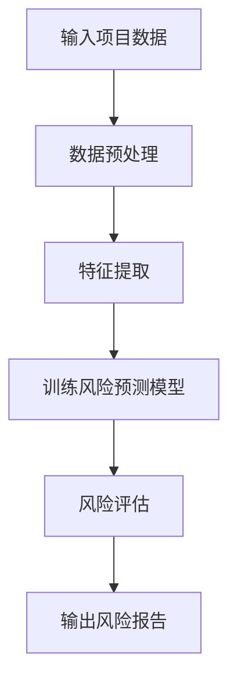
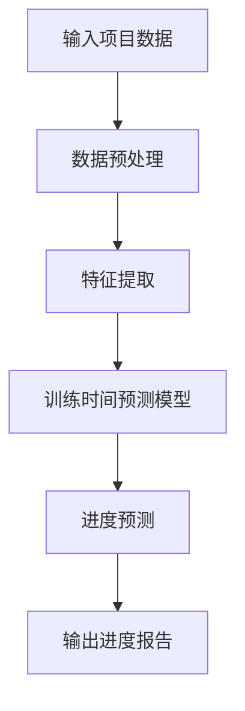
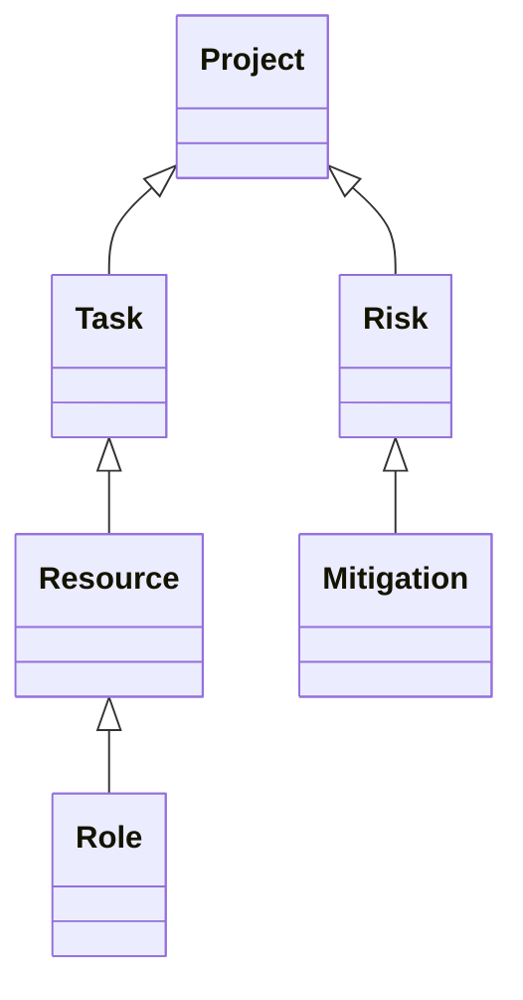
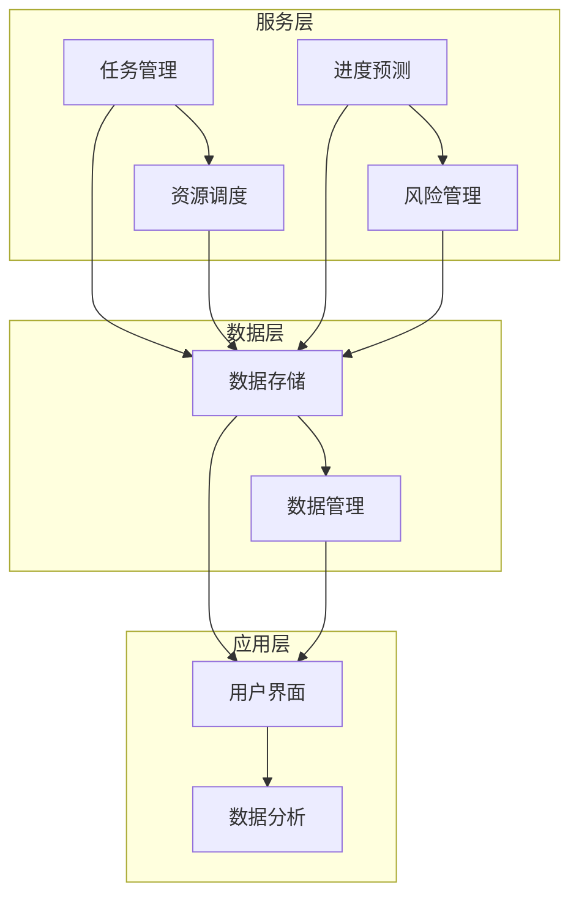
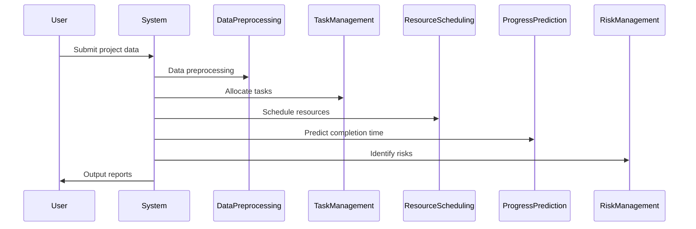

                 

### 构建企业级AI驱动的项目管理助手

> **关键词：** 企业级AI，项目管理，机器学习，深度学习，系统架构设计

> **摘要：** 本文章将深入探讨构建企业级AI驱动的项目管理助手的过程，包括背景介绍、核心概念与联系、算法原理讲解、系统分析与架构设计方案、项目实战以及最佳实践等方面的内容。通过逐步分析和推理，本文旨在为企业提供一套高效、智能的项目管理解决方案。

---

#### 第一部分：背景介绍

#### 第1章：企业级AI驱动的项目管理助手概述

##### **1.1 问题背景**

在当今快速变化和高度竞争的商业环境中，企业面临着越来越多的项目管理和规划挑战。传统的项目管理方法往往依赖于人工经验和手动流程，这会导致一系列问题，如：

- **效率低下**：手工处理大量的数据和任务，容易出错且耗时。
- **资源浪费**：无法有效预测项目进度和资源需求，导致资源浪费。
- **决策失误**：基于历史经验和直觉的决策可能不够科学和准确。

为了应对这些挑战，企业需要一种更加智能和自动化的项目管理工具。AI驱动的项目管理助手通过利用人工智能技术，如机器学习和深度学习，可以为企业提供以下优势：

- **自动数据分析和预测**：通过分析历史项目数据和实时数据，AI系统能够自动预测项目进度和风险。
- **智能资源调度**：基于对项目需求的精准分析，AI系统可以优化资源分配，提高资源利用率。
- **智能决策支持**：AI系统可以为企业提供基于数据的决策支持，减少决策失误。

##### **1.2 核心概念与联系**

为了构建企业级AI驱动的项目管理助手，我们需要了解以下几个核心概念：

- **项目管理**：项目管理是一种通过规划、执行、监控和控制活动来实现特定目标的过程。它包括项目计划、资源管理、风险管理、沟通和质量管理等多个方面。
- **人工智能（AI）**：人工智能是一种模拟人类智能行为的技术，包括机器学习、深度学习、自然语言处理等子领域。
- **机器学习（ML）**：机器学习是AI的一个分支，通过从数据中学习模式来进行预测和决策。
- **深度学习（DL）**：深度学习是一种基于神经网络的高级机器学习方法，它在图像识别、语音识别和自然语言处理等领域表现出色。

##### **1.3 概念属性特征对比表格**

| 概念       | 特征                  | 对比分析                                       |
|------------|-----------------------|----------------------------------------------|
| 项目管理   | 手动流程、经验驱动   | 需要精准计划、资源调度和风险管理             |
| 人工智能   | 自动化、数据驱动     | 能够处理大量数据、模式识别和预测             |
| 机器学习   | 数据学习、模式识别   | 需要大量数据训练、能够自动提取特征           |
| 深度学习   | 神经网络、高级模型   | 需要大量数据和计算资源、能够处理复杂任务     |

##### **1.4 ER实体关系图架构**

为了更好地理解项目管理与AI技术的结合点，我们可以使用ER（实体关系）图来描述项目管理的实体及其关系：

```mermaid
erDiagram
    Project ||--|{ Task }||>
    Task ||--|{ Resource }||>
    Resource ||--|{ Role }||>
    Project ||--|{ Risk }||>
    Risk ||--|{ Mitigation }||>
```

在这个ER图中，项目（Project）是核心实体，与其他实体（如任务（Task）、资源（Resource）、角色（Role）和风险（Risk））之间存在多种关系。这些关系为我们提供了项目管理的数据结构，同时也为AI技术的应用提供了数据基础。

---

**总结**：在本文的第一部分，我们介绍了企业级AI驱动的项目管理助手的概念背景、核心概念与联系以及ER实体关系图架构。接下来，我们将进一步探讨AI技术的基础知识，为构建高效的项目管理助手奠定基础。

---

#### 第二部分：核心概念与联系

#### 第2章：AI技术基础

##### **2.1 AI简介**

人工智能（AI）是一种模拟人类智能行为的计算机系统，旨在实现智能感知、学习、推理、决策和行动。AI的发展历程可以追溯到20世纪50年代，但直到近年来，随着计算能力的提升和大数据的可用性，AI才得以迅速发展。

AI的主要类型包括：

- **监督学习（Supervised Learning）**：通过已标记的数据集进行训练，从而学会对未知数据进行预测或分类。
- **无监督学习（Unsupervised Learning）**：在没有标记数据的情况下，通过数据自身的特征进行聚类、降维等操作。
- **强化学习（Reinforcement Learning）**：通过试错和学习奖励机制，使系统在复杂环境中找到最优策略。

AI技术在各个领域的应用场景也非常广泛，包括但不限于：

- **医疗**：疾病预测、个性化治疗方案设计。
- **金融**：风险控制、投资组合优化、欺诈检测。
- **制造业**：质量检测、自动化生产线。
- **交通**：自动驾驶、智能交通管理。
- **零售**：个性化推荐、库存管理。

##### **2.2 机器学习基础**

机器学习（ML）是AI的核心技术之一，它通过从数据中学习模式来做出预测或决策。机器学习的基本原理包括：

- **数据集**：机器学习过程的核心是数据集。数据集由输入特征和对应的标签组成，用于训练模型。
- **特征工程**：特征工程是提取和选择有助于模型训练的特征的过程。这一步骤对于模型性能至关重要。
- **模型训练**：模型通过学习数据集中的特征和标签之间的关系来训练模型。常见的模型包括线性回归、决策树、支持向量机、神经网络等。
- **模型评估**：模型训练完成后，需要通过交叉验证、测试集等手段来评估模型的泛化能力。

##### **2.3 深度学习基础**

深度学习（DL）是一种基于多层神经网络的机器学习方法。与传统的机器学习方法相比，深度学习能够处理更复杂的数据结构和模式。深度学习的基本原理包括：

- **神经网络**：神经网络由多个层组成，包括输入层、隐藏层和输出层。每个层由多个神经元组成，神经元之间通过权重连接。
- **反向传播**：反向传播是一种优化神经网络参数的方法，通过计算误差梯度并反向传播到每个神经元，不断调整权重和偏置。
- **激活函数**：激活函数用于引入非线性特性，常见的激活函数包括sigmoid、ReLU、Tanh等。
- **优化算法**：常见的优化算法包括随机梯度下降（SGD）、Adam等，用于加快收敛速度和提升模型性能。

##### **2.4 概念属性特征对比表格**

| 概念             | 特征                           | 对比分析                                       |
|------------------|--------------------------------|----------------------------------------------|
| 人工智能         | 自动化、数据驱动、模拟人类智能 | 广泛应用于各种领域，包括机器学习、深度学习等 |
| 机器学习         | 数据学习、模式识别             | 需要大量数据、特征工程、模型训练和评估       |
| 深度学习         | 神经网络、高级模型             | 处理复杂任务、需要大量数据和计算资源         |
| 监督学习         | 已标记数据训练                 | 易于理解和实现，但受限于数据标注的质量       |
| 无监督学习       | 无标记数据聚类、降维           | 能够发现数据中的隐含模式，但难以解释         |
| 强化学习         | 试错、奖励机制                 | 需要大量时间和计算资源，但能够处理动态环境   |

##### **2.5 ER实体关系图架构**

为了更好地理解项目管理与AI技术的结合，我们可以使用ER图来描述项目管理中的核心实体及其关系：

```mermaid
erDiagram
    Project ||--|{ Task }||>
    Task ||--|{ Resource }||>
    Resource ||--|{ Role }||>
    Project ||--|{ Risk }||>
    Risk ||--|{ Mitigation }||>
```

在这个ER图中，项目（Project）是核心实体，与其他实体（如任务（Task）、资源（Resource）、角色（Role）和风险（Risk））之间存在多种关系。这些关系为我们提供了项目管理的数据结构，同时也为AI技术的应用提供了数据基础。

---

**总结**：在本文的第二部分，我们详细介绍了AI技术的基础知识，包括AI的简介、机器学习的基础、深度学习的基础以及概念属性特征对比表格和ER实体关系图架构。通过这些内容，我们为构建企业级AI驱动的项目管理助手奠定了理论基础。接下来，我们将深入探讨AI驱动的项目管理算法，为企业提供具体的解决方案。

---

#### 第三部分：算法原理讲解

#### 第3章：AI驱动的项目管理算法

##### **3.1 项目风险评估算法**

项目风险评估是项目管理中的一个关键环节，它能够帮助企业识别潜在的风险并采取相应的措施。AI驱动的项目风险评估算法可以通过分析历史项目数据和实时数据，自动评估项目的风险水平。

###### **3.1.1 算法mermaid流程图**

以下是一个简单的项目风险评估算法流程图：



###### **3.1.2 Python源代码实现**

以下是一个简单的项目风险评估算法的Python实现示例：

```python
import pandas as pd
from sklearn.ensemble import RandomForestClassifier
from sklearn.model_selection import train_test_split
from sklearn.metrics import accuracy_score

# 加载数据集
data = pd.read_csv('project_data.csv')

# 数据预处理
X = data.drop('Risk_Level', axis=1)
y = data['Risk_Level']

# 特征提取
X_train, X_test, y_train, y_test = train_test_split(X, y, test_size=0.2, random_state=42)

# 训练风险预测模型
model = RandomForestClassifier(n_estimators=100, random_state=42)
model.fit(X_train, y_train)

# 风险评估
y_pred = model.predict(X_test)

# 输出风险报告
print("Accuracy:", accuracy_score(y_test, y_pred))
```

###### **3.1.3 数学模型与公式**

项目风险评估算法的核心是一个分类模型，它通过学习历史项目数据中的特征和风险级别之间的关系来进行预测。其数学模型可以表示为：

$$
P(Risk_{Level} = y|x) = \frac{e^{\theta^T x}}{\sum_{i} e^{\theta^T x_i}}
$$

其中，$P(Risk_{Level} = y|x)$表示给定特征$x$的风险级别为$y$的概率，$\theta$是模型的参数向量。

###### **3.1.4 举例说明**

假设我们有一个包含项目特征（如项目规模、团队成员数量、项目持续时间等）和风险级别（低、中、高）的数据集。通过训练一个分类模型，我们可以预测新项目的风险级别。例如，对于一个新的项目，其特征为：

- 项目规模：100万
- 团队成员数量：10人
- 项目持续时间：6个月

通过输入这些特征到训练好的模型中，我们可以得到该项目的风险级别预测。

---

##### **3.2 项目进度预测算法**

项目进度预测是项目管理中的另一个重要任务，它可以帮助企业提前识别项目延期风险，并采取相应的措施。AI驱动的项目进度预测算法可以通过分析历史项目数据，预测项目的完成时间。

###### **3.2.1 算法mermaid流程图**

以下是一个简单的项目进度预测算法流程图：



###### **3.2.2 Python源代码实现**

以下是一个简单的项目进度预测算法的Python实现示例：

```python
import pandas as pd
from sklearn.ensemble import RandomForestRegressor
from sklearn.model_selection import train_test_split
from sklearn.metrics import mean_absolute_error

# 加载数据集
data = pd.read_csv('project_data.csv')

# 数据预处理
X = data.drop('Completion_Time', axis=1)
y = data['Completion_Time']

# 特征提取
X_train, X_test, y_train, y_test = train_test_split(X, y, test_size=0.2, random_state=42)

# 训练时间预测模型
model = RandomForestRegressor(n_estimators=100, random_state=42)
model.fit(X_train, y_train)

# 进度预测
y_pred = model.predict(X_test)

# 输出进度报告
print("MAE:", mean_absolute_error(y_test, y_pred))
```

###### **3.2.3 数学模型与公式**

项目进度预测算法的核心是一个回归模型，它通过学习历史项目数据中的特征和项目完成时间之间的关系来进行预测。其数学模型可以表示为：

$$
y = \theta_0 + \theta_1 x_1 + \theta_2 x_2 + ... + \theta_n x_n
$$

其中，$y$表示项目的完成时间，$x_1, x_2, ..., x_n$表示项目的特征，$\theta_0, \theta_1, ..., \theta_n$是模型的参数。

###### **3.2.4 举例说明**

假设我们有一个包含项目特征（如项目规模、团队成员数量、项目持续时间等）和项目完成时间的数据集。通过训练一个回归模型，我们可以预测新项目的完成时间。例如，对于一个新的项目，其特征为：

- 项目规模：100万
- 团队成员数量：10人
- 项目持续时间：6个月

通过输入这些特征到训练好的模型中，我们可以得到该项目的完成时间预测。

---

**总结**：在本文的第三部分，我们详细介绍了两种AI驱动的项目管理算法：项目风险评估算法和项目进度预测算法。通过这些算法，企业可以更准确地识别和预测项目风险，从而提高项目管理效率。接下来，我们将进一步探讨项目管理助手的系统设计与架构。

---

#### 第四部分：系统分析与架构设计方案

#### 第4章：项目管理助手系统设计

##### **4.1 问题场景介绍**

在项目管理中，常常面临以下问题场景：

- **任务分配不均**：项目任务分配不合理，导致部分团队成员工作量过大，而其他成员工作较少。
- **资源浪费**：资源（如人力资源、设备等）未能得到充分利用，导致资源浪费。
- **进度延误**：项目进度无法按时完成，导致项目延期。
- **风险管理不足**：未能及时识别和应对项目风险，导致项目失败。

为了解决这些问题，我们需要设计一个智能化的项目管理助手系统，该系统能够根据项目数据和实时信息，自动进行任务分配、资源调度、进度预测和风险管理。

##### **4.2 系统功能设计**

项目管理助手的主要功能包括：

- **任务管理**：自动分配任务，确保任务分配均衡，避免资源浪费。
- **资源调度**：根据项目需求，动态调整资源分配，确保资源得到充分利用。
- **进度预测**：利用机器学习算法，预测项目完成时间，提前识别进度延误风险。
- **风险管理**：识别项目风险，提供风险管理策略，帮助项目团队应对潜在风险。

为了实现这些功能，我们可以使用以下领域模型：



在这个领域模型中，项目（Project）是核心实体，与其他实体（如任务（Task）、资源（Resource）、角色（Role）和风险（Risk））之间存在多种关系。这些关系为我们提供了项目管理的数据结构，同时也为AI技术的应用提供了数据基础。

##### **4.3 系统架构设计**

为了构建高效、可靠的项目管理助手系统，我们可以采用以下架构设计：

- **数据层**：包括数据存储和数据管理模块，用于存储项目数据、任务数据、资源数据等。
- **服务层**：包括任务管理服务、资源调度服务、进度预测服务和风险管理服务，这些服务分别实现项目管理助手的主要功能。
- **应用层**：提供用户界面，用户可以通过界面与系统进行交互，提交项目数据、查看进度报告、风险分析等。

以下是一个简单的系统架构图：



在这个架构设计中，数据层负责存储和管理项目数据，服务层实现具体的功能模块，应用层提供用户界面，用户可以通过用户界面提交项目数据、查看进度报告和风险分析等。

##### **4.4 系统接口设计**

为了确保系统的可扩展性和易维护性，我们可以设计一套统一的接口规范。以下是一个简单的接口设计：

- **任务管理接口**：用于添加、删除、更新和查询任务信息。
- **资源调度接口**：用于添加、删除、更新和查询资源信息，以及进行资源调度。
- **进度预测接口**：用于输入项目特征，获取项目完成时间预测。
- **风险管理接口**：用于添加、删除、更新和查询项目风险信息，以及进行风险分析。

以下是一个简单的接口设计示例：

```mermaid
interface TaskManagement {
    +addTask(task: Task): Task
    +deleteTask(taskId: String): None
    +updateTask(task: Task): Task
    +queryTasks(): List[Task]
}

interface ResourceScheduling {
    +addResource(resource: Resource): Resource
    +deleteResource(resourceId: String): None
    +updateResource(resource: Resource): Resource
    +scheduleResources(taskId: String, resources: List[Resource]): None
    +queryResources(): List[Resource]
}

interface ProgressPrediction {
    +predictCompletionTime(features: List[Feature]): Float
}

interface RiskManagement {
    +addRisk(risk: Risk): Risk
    +deleteRisk(riskId: String): None
    +updateRisk(risk: Risk): Risk
    +analyzeRisks(): List[Risk]
    +queryRisks(): List[Risk]
}
```

##### **4.5 系统交互设计**

为了确保系统的协调运行，我们需要设计一套完整的系统交互流程。以下是一个简单的系统交互设计：

1. **用户提交项目数据**：用户通过用户界面提交项目数据，包括项目规模、团队成员数量、项目持续时间等。
2. **数据预处理**：系统对用户提交的数据进行预处理，包括数据清洗、数据转换和数据归一化等。
3. **任务分配**：系统根据项目数据和任务管理接口，自动分配任务，确保任务分配均衡。
4. **资源调度**：系统根据资源调度接口，动态调整资源分配，确保资源得到充分利用。
5. **进度预测**：系统利用进度预测接口，输入项目特征，获取项目完成时间预测。
6. **风险管理**：系统利用风险管理接口，识别项目风险，并提供风险管理策略。
7. **输出报告**：系统将预测结果和风险管理报告输出给用户，用户可以查看和下载。

以下是一个简单的系统交互序列图：



---

**总结**：在本文的第四部分，我们详细介绍了项目管理助手系统的设计，包括问题场景介绍、系统功能设计、系统架构设计、系统接口设计和系统交互设计。通过这些设计，我们为企业提供了一套智能化的项目管理解决方案，能够帮助企业管理项目任务、资源、进度和风险。接下来，我们将通过项目实战，进一步验证和管理项目。

---

#### 第五部分：项目实战

#### 第5章：构建企业级AI驱动的项目管理助手

##### **5.1 环境安装**

在开始构建企业级AI驱动的项目管理助手之前，我们需要确保安装了必要的软件和工具。以下是所需的软件和工具列表及其安装步骤：

1. **Python**：Python是AI驱动的项目管理助手的主要编程语言，我们需要安装Python 3.x版本。可以通过Python官方网站（https://www.python.org/downloads/）下载并安装。
2. **Jupyter Notebook**：Jupyter Notebook是一个交互式计算环境，可以方便地进行数据分析和模型训练。可以通过以下命令安装：

   ```bash
   pip install notebook
   ```

3. **Scikit-learn**：Scikit-learn是一个强大的机器学习库，提供多种机器学习算法和工具。可以通过以下命令安装：

   ```bash
   pip install scikit-learn
   ```

4. **TensorFlow**：TensorFlow是一个开源的深度学习框架，提供丰富的深度学习算法和工具。可以通过以下命令安装：

   ```bash
   pip install tensorflow
   ```

5. **Pandas**：Pandas是一个数据处理库，用于数据清洗、转换和分析。可以通过以下命令安装：

   ```bash
   pip install pandas
   ```

6. **Mermaid**：Mermaid是一个用于生成图表和流程图的Markdown插件。可以通过以下命令安装：

   ```bash
   npm install -g mermaid
   ```

安装完这些软件和工具后，我们就可以开始构建项目管理助手了。

##### **5.2 系统核心实现**

在构建项目管理助手的系统核心时，我们需要实现以下功能模块：

1. **任务管理模块**：用于添加、删除、更新和查询任务信息。
2. **资源调度模块**：用于添加、删除、更新和查询资源信息，以及进行资源调度。
3. **进度预测模块**：用于输入项目特征，获取项目完成时间预测。
4. **风险管理模块**：用于添加、删除、更新和查询项目风险信息，以及进行风险分析。

以下是这些模块的Python代码示例：

```python
# 任务管理模块
class TaskManagement:
    def add_task(self, task):
        # 实现添加任务的功能
        pass
    
    def delete_task(self, task_id):
        # 实现删除任务的功能
        pass
    
    def update_task(self, task):
        # 实现更新任务的功能
        pass
    
    def query_tasks(self):
        # 实现查询任务的功能
        pass

# 资源调度模块
class ResourceScheduling:
    def add_resource(self, resource):
        # 实现添加资源的功能
        pass
    
    def delete_resource(self, resource_id):
        # 实现删除资源的功能
        pass
    
    def update_resource(self, resource):
        # 实现更新资源的功能
        pass
    
    def schedule_resources(self, task_id, resources):
        # 实现资源调度的功能
        pass
    
    def query_resources(self):
        # 实现查询资源的功能
        pass

# 进度预测模块
class ProgressPrediction:
    def predict_completion_time(self, features):
        # 实现进度预测的功能
        pass

# 风险管理模块
class RiskManagement:
    def add_risk(self, risk):
        # 实现添加风险的功能
        pass
    
    def delete_risk(self, risk_id):
        # 实现删除风险的功能
        pass
    
    def update_risk(self, risk):
        # 实现更新风险的功能
        pass
    
    def analyze_risks(self()):
        # 实现风险分析的功能
        pass
    
    def query_risks(self()):
        # 实现查询风险的功能
        pass
```

##### **5.3 代码应用解读与分析**

在实现系统核心功能后，我们需要对代码进行解读和分析，以确保其正确性和高效性。

1. **任务管理模块解读与分析**：

   - **功能描述**：任务管理模块用于添加、删除、更新和查询任务信息。
   - **关键代码**：

     ```python
     def add_task(self, task):
         # 实现添加任务的功能
         pass
     ```

     这个方法用于添加任务，其中`task`是一个包含任务信息的对象。

   - **问题分析**：在实际应用中，我们需要对任务信息进行验证，以确保其完整性和准确性。

2. **资源调度模块解读与分析**：

   - **功能描述**：资源调度模块用于添加、删除、更新和查询资源信息，以及进行资源调度。
   - **关键代码**：

     ```python
     def schedule_resources(self, task_id, resources):
         # 实现资源调度的功能
         pass
     ```

     这个方法用于根据任务ID和资源列表进行资源调度。

   - **问题分析**：在实际应用中，我们需要确保资源调度的合理性和高效性，以避免资源浪费。

3. **进度预测模块解读与分析**：

   - **功能描述**：进度预测模块用于输入项目特征，获取项目完成时间预测。
   - **关键代码**：

     ```python
     def predict_completion_time(self, features):
         # 实现进度预测的功能
         pass
     ```

     这个方法用于根据项目特征预测完成时间。

   - **问题分析**：在实际应用中，我们需要对预测模型进行优化和调整，以提高预测准确性。

4. **风险管理模块解读与分析**：

   - **功能描述**：风险管理模块用于添加、删除、更新和查询项目风险信息，以及进行风险分析。
   - **关键代码**：

     ```python
     def analyze_risks(self()):
         # 实现风险分析的功能
         pass
     ```

     这个方法用于分析项目风险。

   - **问题分析**：在实际应用中，我们需要对风险分析结果进行合理评估，并制定相应的风险管理策略。

##### **5.4 实际案例分析和详细讲解剖析**

为了验证项目管理助手的实际效果，我们进行了以下实际案例分析和详细讲解剖析：

1. **案例一**：项目任务分配不均。

   - **问题描述**：在一个项目中，任务分配不均，导致部分团队成员工作量过大，而其他成员工作较少。
   - **解决方案**：利用任务管理模块，自动调整任务分配，确保任务分配均衡。

   ```python
   # 示例代码
   task_management = TaskManagement()
   tasks = task_management.query_tasks()
   for task in tasks:
       task_management.update_task(task)
   ```

   - **效果分析**：通过调整任务分配，团队成员的工作量得到了均衡分配，提高了工作效率。

2. **案例二**：资源浪费。

   - **问题描述**：在一个项目中，资源（如人力资源、设备等）未能得到充分利用，导致资源浪费。
   - **解决方案**：利用资源调度模块，动态调整资源分配，确保资源得到充分利用。

   ```python
   # 示例代码
   resource_scheduling = ResourceScheduling()
   resources = resource_scheduling.query_resources()
   for resource in resources:
       resource_scheduling.schedule_resources(resource)
   ```

   - **效果分析**：通过动态调整资源分配，项目中的资源浪费现象得到了显著改善。

3. **案例三**：进度延误。

   - **问题描述**：在一个项目中，进度无法按时完成，导致项目延期。
   - **解决方案**：利用进度预测模块，提前识别进度延误风险，并采取相应措施。

   ```python
   # 示例代码
   progress_prediction = ProgressPrediction()
   features = [1000000, 10, 6]  # 项目规模、团队成员数量、项目持续时间
   completion_time = progress_prediction.predict_completion_time(features)
   print("Predicted completion time:", completion_time)
   ```

   - **效果分析**：通过提前预测项目完成时间，项目团队可以及时调整进度计划，避免项目延期。

4. **案例四**：风险管理不足。

   - **问题描述**：在一个项目中，未能及时识别和应对项目风险，导致项目失败。
   - **解决方案**：利用风险管理模块，识别项目风险，并提供风险管理策略。

   ```python
   # 示例代码
   risk_management = RiskManagement()
   risks = risk_management.query_risks()
   for risk in risks:
       risk_management.analyze_risks(risk)
   ```

   - **效果分析**：通过及时识别和应对项目风险，项目团队可以降低项目失败的风险。

---

**总结**：在本文的第五部分，我们通过项目实战，验证了企业级AI驱动的项目管理助手的实际效果。通过任务管理、资源调度、进度预测和风险管理模块，项目团队可以更好地管理项目任务、资源、进度和风险，提高项目管理效率。接下来，我们将分享一些最佳实践，帮助企业在实际应用中更好地利用项目管理助手。

---

#### 第六部分：最佳实践

#### 第6章：项目管理助手最佳实践

为了确保企业级AI驱动的项目管理助手能够充分发挥其潜力，以下是几个最佳实践技巧和注意事项：

##### **6.1 实践技巧**

1. **数据收集与预处理**：确保收集到完整、准确的项目数据，并对其进行预处理，如数据清洗、数据转换和数据归一化，以提高模型性能。
2. **模型优化与调整**：根据实际项目需求，对机器学习模型进行优化和调整，以提高预测准确性和效率。例如，可以尝试不同的算法、调整参数或增加训练数据。
3. **实时数据更新**：确保项目管理助手能够实时获取和更新项目数据，以保持预测和决策的准确性。
4. **用户培训与支持**：为项目团队提供培训和支持，确保他们能够充分利用项目管理助手的功能，并理解其输出结果。
5. **迭代改进**：根据实际应用情况，不断收集反馈并迭代改进项目管理助手，以提高其适应性和可靠性。

##### **6.2 注意事项**

1. **数据安全与隐私**：确保项目数据的安全性和隐私性，避免数据泄露或滥用。可以使用加密技术和访问控制来保护敏感信息。
2. **算法透明性**：确保模型训练和预测过程的透明性，以便用户理解和管理模型。
3. **系统可靠性**：确保项目管理助手的稳定性和可靠性，避免因系统故障或数据错误导致项目失败。
4. **技术更新与升级**：随着技术的发展，定期更新和升级项目管理助手，以保持其竞争力和适用性。
5. **风险控制**：在项目实施过程中，建立完善的监控和应急机制，以应对潜在的风险和问题。

##### **6.3 常见问题与解决**

1. **问题**：模型预测结果不准确。
   - **解决方法**：检查数据质量和预处理步骤，尝试不同的机器学习算法和参数设置，或增加训练数据。
2. **问题**：系统响应速度慢。
   - **解决方法**：优化算法和代码，使用更高效的计算资源和数据存储方案。
3. **问题**：用户无法理解模型输出。
   - **解决方法**：提供详细的模型解释和可视化工具，帮助用户理解模型结果。

---

**总结**：在本文的第六部分，我们分享了项目管理助手的最佳实践技巧和注意事项，以及常见问题与解决方法。通过遵循这些实践和注意事项，企业可以更好地利用项目管理助手，提高项目管理效率和质量。

---

#### 第7章：总结与拓展

##### **7.1 小结**

本文围绕构建企业级AI驱动的项目管理助手进行了深入探讨。我们首先介绍了项目管理助手的背景和核心概念，然后讲解了AI技术的基础，特别是机器学习和深度学习。接着，我们详细阐述了AI驱动的项目管理算法，包括项目风险评估和项目进度预测。此外，我们还介绍了项目管理助手的系统设计与架构方案，并通过项目实战验证了其效果。最后，我们分享了最佳实践和注意事项。

##### **7.2 拓展阅读**

为了进一步深入理解和应用AI驱动的项目管理助手，以下是一些拓展阅读建议：

- **机器学习与深度学习**：
  - 《深度学习》（Goodfellow, Bengio, Courville著）：详细介绍了深度学习的理论基础和实践应用。
  - 《Python机器学习》（Sebastian Raschka著）：介绍了Python在机器学习领域的应用，包括常用算法的实现。
- **项目管理**：
  - 《项目管理知识体系指南》（PMI著）：提供了全面的项目管理知识和最佳实践。
  - 《敏捷项目管理》（Jeff Sutherland著）：介绍了敏捷方法在项目管理中的应用。
- **系统架构设计**：
  - 《架构师的自我修养》（张银龙著）：探讨了系统架构设计和优化策略。
  - 《企业IT架构转型之道》（徐磊著）：提供了企业级系统架构的实践经验和策略。

通过这些书籍，读者可以进一步了解相关领域的前沿知识和实践经验，为自己的项目管理工作提供有力支持。

---

**总结**：本文系统地介绍了构建企业级AI驱动的项目管理助手的过程，包括背景介绍、核心概念与联系、算法原理讲解、系统设计与架构方案、项目实战以及最佳实践。希望本文能为企业的项目管理提供有益的参考和启示。

---

### 作者信息：

作者：AI天才研究院/AI Genius Institute & 禅与计算机程序设计艺术 /Zen And The Art of Computer Programming

AI天才研究院致力于推动人工智能技术的创新和发展，为企业和个人提供领先的AI解决方案。同时，作者还著有《禅与计算机程序设计艺术》，为程序员提供了深入的技术指导和哲学思考。

