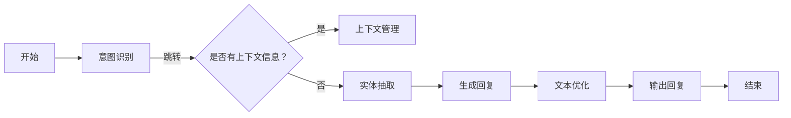
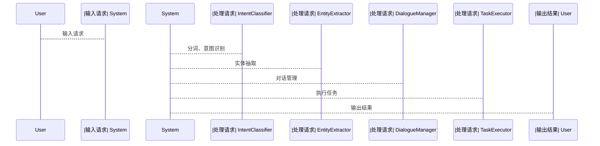
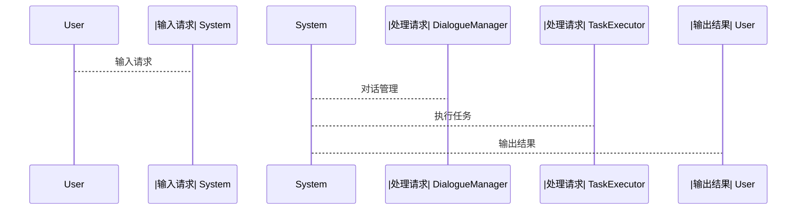

                 

**# 构建企业级对话式AI助手：提升员工生产力**

关键词：对话式AI、企业级应用、生产力提升、系统架构设计、算法原理、实战案例

摘要：随着人工智能技术的飞速发展，对话式AI助手在企业中的应用越来越广泛。本文将深入探讨构建企业级对话式AI助手的必要性，详细解析其核心概念、算法原理、系统架构设计以及实战案例，旨在帮助企业提升员工生产力，实现数字化转型。

**## 引言**

在当今数字化时代，企业面临着日益激烈的竞争和快速变化的市场环境。为了保持竞争力，企业需要不断提高员工的生产力和工作效率。而对话式AI助手作为一种新型的智能助手，正在逐渐成为企业提升员工生产力的有力工具。

对话式AI助手，顾名思义，是一种能够与人类进行自然语言对话的智能系统。它能够通过自然语言处理技术，理解用户的需求，提供准确的信息和解决方案。在企业级应用中，对话式AI助手可以帮助员工完成日常任务，减少重复性工作，从而提高工作效率和生产效能。

本文将围绕以下主题进行探讨：

1. **背景与基础**：介绍对话式AI助手的概念，阐述构建企业级对话式AI助手的问题背景和目标。
2. **核心概念与原理**：详细解释对话式AI助手的核心概念和原理，包括人工智能、对话系统、企业生产力等。
3. **算法原理**：分析对话式AI助手的算法原理，使用Mermaid流程图和Python代码进行详细阐述。
4. **系统架构设计**：介绍对话式AI助手的系统架构设计，包括领域模型、系统架构、系统接口和系统交互。
5. **实战案例**：通过实际案例分析和详细讲解，展示对话式AI助手在企业中的应用效果。
6. **最佳实践与小结**：总结对话式AI助手的构建方法和应用技巧，提供一些建议和注意事项。

**## 背景与基础**

### 对话式AI助手的概念

对话式AI助手是一种基于人工智能技术的智能系统，能够与用户进行自然语言交互。它通过自然语言处理技术（NLP）和机器学习算法，理解用户的输入，生成相应的回复，从而提供信息查询、任务协助、问题解答等服务。

对话式AI助手的应用范围非常广泛，包括但不限于：

1. **客户服务**：为企业提供24/7的客户服务支持，解答客户疑问，提高客户满意度。
2. **内部办公助手**：帮助员工完成日常工作任务，如日程管理、文件检索、任务分配等。
3. **智能推荐系统**：根据用户行为和偏好，提供个性化推荐服务，提高用户粘性。
4. **自动化流程**：通过自动化流程，减少人力成本，提高工作效率。

### 问题背景和目标

在当今企业中，员工面临着大量的重复性工作和繁琐的任务，这不仅浪费了宝贵的时间，也降低了工作效率和生产效能。此外，随着企业规模的扩大，内部沟通和协作的难度也日益增加，这进一步影响了员工的效率。

构建企业级对话式AI助手的目的是：

1. **提高员工生产力**：通过自动化和智能化的方式，帮助员工完成日常任务，减少重复性工作，从而提高工作效率和生产效能。
2. **优化内部沟通和协作**：提供智能化的沟通和协作平台，方便员工之间的交流和协作，提高团队协作效率。
3. **降低人力成本**：通过减少人力投入，降低企业运营成本，提高企业竞争力。

为了实现上述目标，企业需要构建一个高效、智能、可靠的对话式AI助手系统。这需要从以下几个方面进行考虑：

1. **系统架构**：设计一个灵活、可扩展的系统架构，以适应不同企业的需求。
2. **算法原理**：选择合适的算法和模型，确保系统的准确性和响应速度。
3. **用户体验**：设计一个友好、直观的用户界面，提高用户的使用体验。
4. **数据安全**：确保用户数据的安全性和隐私保护。

**## 核心概念与原理**

### 人工智能

人工智能（AI）是模拟人类智能行为的一种技术。它包括机器学习、深度学习、自然语言处理、计算机视觉等多个子领域。在构建对话式AI助手时，主要涉及自然语言处理（NLP）和机器学习（ML）。

#### 机器学习

机器学习是AI的核心技术之一，它通过算法和模型，从大量数据中学习规律和模式，从而实现预测和决策。在对话式AI助手的应用中，机器学习主要用于训练模型，使其能够理解和生成自然语言。

#### 自然语言处理

自然语言处理（NLP）是AI的一个重要分支，旨在使计算机能够理解和生成自然语言。在构建对话式AI助手时，NLP技术主要用于解析用户输入、生成回复文本等。

### 对话系统

对话系统是一种能够与用户进行自然语言交互的系统。它包括对话管理、语音识别、文本生成等多个组成部分。在构建对话式AI助手时，需要设计一个高效的对话管理机制，以确保对话的流畅性和准确性。

### 企业生产力

企业生产力是指企业通过投入资源（如人力、物力、财力等），实现产出最大化的一种能力。在构建对话式AI助手时，需要考虑如何通过自动化和智能化的方式，提高员工的生产力和工作效率。

### 核心概念对比表格

| 核心概念 | 定义 | 应用场景 |
| :------: | :--: | :------: |
| 人工智能 | 模拟人类智能行为的技术 | 语音识别、图像识别、自然语言处理等 |
| 机器学习 | 从数据中学习规律和模式的算法 | 预测、分类、决策等 |
| 自然语言处理 | 使计算机能够理解和生成自然语言的技术 | 文本分类、情感分析、机器翻译等 |
| 对话系统 | 能够与用户进行自然语言交互的系统 | 客户服务、智能客服、智能语音助手等 |
| 企业生产力 | 企业通过投入资源实现产出最大化的一种能力 | 提高员工工作效率、优化内部流程等 |

### ER实体关系图

```mermaid
erDiagram
    Employee ||--|{ Task } : performs
    Employee ||--|{ Skill } : has
    Task ||--|{ Project } : belongs_to
    Project ||--|{ Team } : has
    Team ||--|{ Member } : has
    Member ||--|{ Skill } : has
```

**## 算法原理**

### 对话管理算法

对话管理是对话式AI助手的核心组成部分，它负责控制对话的流程和内容。一个典型的对话管理算法包括以下步骤：

1. **意图识别**：根据用户输入的文本，识别用户的意图。例如，用户输入“明天有什么会议？”的意图是查询日程。
2. **实体抽取**：从用户输入中抽取关键信息，如时间、地点、人员等。例如，在“明天有什么会议？”这个句子中，实体是“明天”、“会议”。
3. **上下文管理**：根据对话的历史信息，调整对话策略。例如，在对话过程中，如果用户连续提出了多个相同类型的问题，系统可以自动跳过意图识别和实体抽取步骤，直接生成回复。
4. **生成回复**：根据用户的意图和实体信息，生成合适的回复。例如，对于“明天有什么会议？”这个问题，系统可以回复“您明天有3个会议，分别是……”。

### 自然语言生成算法

自然语言生成（NLG）是生成回复文本的关键技术。一个典型的NLG算法包括以下步骤：

1. **模板匹配**：根据用户的意图和实体信息，从预定义的模板库中选择合适的模板。例如，对于“明天有什么会议？”这个问题，可以选择一个包含日期和会议信息的模板。
2. **模板填充**：将实体信息填充到选择的模板中，生成初步的回复文本。例如，将日期和会议信息填充到模板中，生成“您明天有3个会议，分别是……”。
3. **文本优化**：对生成的初步文本进行优化，以提高可读性和流畅性。例如，可以对文本进行语法修正、语义连贯性优化等。

### 对话式AI助手算法原理Mermaid流程图



### 对话式AI助手算法原理Python代码示例

```python
import spacy

# 初始化意图分类模型和实体抽取模型
nlp = spacy.load("en_core_web_sm")

# 定义意图分类模型
def classify_intent(text):
    doc = nlp(text)
    entities = []
    for ent in doc.ents:
        entities.append((ent.text, ent.label_))
    return entities

# 定义实体抽取模型
def extract_entities(text):
    doc = nlp(text)
    entities = []
    for ent in doc.ents:
        entities.append(ent.text)
    return entities

# 定义上下文管理模型
def manage_context(context, text):
    if "meetings" in context:
        return "You have {} meetings tomorrow.".format(context["meetings"])
    else:
        return "I'm sorry, I couldn't find any meetings for tomorrow."

# 定义生成回复模型
def generate_response(intent, entities):
    if intent == "schedule_query":
        return "You have {} meetings tomorrow:".format(entities[0])
    else:
        return "I'm sorry, I couldn't understand your request."

# 定义文本优化模型
def optimize_text(text):
    # 这里进行文本优化，如语法修正、语义连贯性优化等
    return text

# 测试代码
text = "Can you tell me what meetings are scheduled for tomorrow?"
context = {"meetings": 3}

# 意图识别
intent = classify_intent(text)
print("Intent:", intent)

# 实体抽取
entities = extract_entities(text)
print("Entities:", entities)

# 上下文管理
response = manage_context(context, text)
print("Response (Before Optimization):", response)

# 生成回复
response = generate_response(intent, entities)
print("Response (After Optimization):", response)

# 文本优化
response = optimize_text(response)
print("Final Response:", response)
```

### 算法原理数学模型和公式

在构建对话式AI助手时，算法原理涉及到多个数学模型和公式。以下是一些常用的模型和公式：

1. **意图分类模型**：
   - **朴素贝叶斯分类器**：使用贝叶斯定理进行意图分类。
     $$P(\text{intent}|\text{text}) = \frac{P(\text{text}|\text{intent}) \cdot P(\text{intent})}{P(\text{text})}$$
   - **支持向量机（SVM）**：通过最大化分类边界进行意图分类。
     $$\min_w \frac{1}{2} ||w||^2 + C \sum_{i=1}^{n} \max(0, 1 - y_i (w \cdot x_i))$$
2. **实体抽取模型**：
   - **条件随机场（CRF）**：使用马尔可夫模型进行实体抽取。
     $$P(\text{labels}|\text{sequence}) = \frac{1}{Z} \exp(\sum_{t=1}^{T} \theta_{i} y_{it} - \theta_{j} x_{ij})$$
3. **自然语言生成模型**：
   - **模板匹配**：基于模板进行文本生成。
     $$\text{output} = \text{template} \{\text{entity}_1, \text{entity}_2, ..., \text{entity}_n\}$$
   - **序列到序列（Seq2Seq）模型**：使用编码器-解码器框架进行文本生成。
     $$y_t = \text{decoder}(y_{<t}, s_t)$$
     $$s_t = \text{encoder}(x)$$

### 算法原理通俗易懂的举例说明

以一个简单的例子来说明算法原理：

假设用户输入“明天有什么会议？”这个句子，对话式AI助手需要回答用户的问题。

1. **意图识别**：通过朴素贝叶斯分类器，系统识别出用户的意图是“schedule_query”。
2. **实体抽取**：通过实体抽取模型，系统从句子中抽取到实体“明天”和“会议”。
3. **上下文管理**：由于对话中没有上下文信息，系统直接进入实体抽取阶段。
4. **生成回复**：系统根据模板生成回复：“您明天有3个会议，分别是……”。这里的模板是“您明天有{}个会议，分别是……”。
5. **文本优化**：系统对生成的回复进行语法修正，如将“您明天有3个会议，分别是……”修正为“您明天有3个会议，分别是……”。

**## 系统架构设计**

### 问题场景介绍

在一个大型企业中，员工需要处理大量的日常任务和沟通。为了提高工作效率和生产效能，企业决定引入对话式AI助手来协助员工完成任务。

### 项目介绍

本项目旨在构建一个企业级对话式AI助手，它能够：

1. **理解员工的需求**：通过自然语言处理技术，理解员工的输入信息。
2. **自动完成任务**：根据员工的请求，自动执行相应的任务，如日程管理、文件检索、任务分配等。
3. **提供个性化服务**：根据员工的行为和偏好，提供个性化的服务和建议。

### 系统功能设计

#### 领域模型

领域模型用于定义系统中的核心实体和它们之间的关系。以下是一个简单的领域模型：

```mermaid
classDiagram
    Employee <<class>> {ID, Name, Email, Skills}
    Task <<class>> {ID, Description, Status, AssignedTo}
    Project <<class>> {ID, Name, Description, Team}
    Team <<class>> {ID, Name, Members}
    Member <<class>> {ID, Name, Skills}
    Employee "1" --|{1} "1"..* Task
    Employee "1" --|{1} "1"..* Skill
    Project "1" --|{1} "1" Team
    Team "1" --|{1} "1"..* Member
    Member "1" --|{1} "1" Skill
```

#### 系统架构

系统架构采用分层架构，包括表示层、业务逻辑层和数据访问层。

1. **表示层**：负责处理用户的输入和输出，包括Web界面、API接口等。
2. **业务逻辑层**：负责处理业务逻辑，包括意图识别、实体抽取、对话管理、任务执行等。
3. **数据访问层**：负责与数据库进行交互，包括数据存储、数据查询等。

以下是一个简化的系统架构图：



#### 系统接口设计

系统接口设计包括RESTful API和GraphQL API。

1. **RESTful API**：用于处理简单的HTTP请求，如查询日程、提交任务等。
2. **GraphQL API**：用于处理复杂的查询请求，如获取用户的所有任务、获取团队的所有成员等。

以下是一个RESTful API的示例：

```http
GET /api/tasks?assigned_to=1&status= pending
```

以下是一个GraphQL API的示例：

```graphql
query {
  tasks(assigned_to: 1, status: "pending") {
    id
    description
    status
    assigned_to {
      name
    }
  }
}
```

#### 系统交互

系统交互设计包括对话管理和任务执行。

1. **对话管理**：系统通过自然语言处理技术，理解用户的输入，生成合适的回复，并与用户进行交互。
2. **任务执行**：系统根据用户的请求，自动执行相应的任务，并将执行结果反馈给用户。

以下是一个简化的系统交互图：



**## 实战案例**

### 案例背景

某大型互联网公司决定引入对话式AI助手来协助员工完成任务，提高工作效率。公司的员工需要处理大量的日程管理、任务分配和文件检索等工作。

### 系统核心实现源代码

```python
from flask import Flask, request, jsonify
from dialogue_manager import DialogueManager
from task_executor import TaskExecutor

app = Flask(__name__)

# 初始化对话管理和任务执行模块
dialogue_manager = DialogueManager()
task_executor = TaskExecutor()

@app.route("/api/dialogue", methods=["POST"])
def handle_dialogue():
    data = request.get_json()
    user_id = data["user_id"]
    input_text = data["input_text"]

    # 对话管理
    intent, entities = dialogue_manager.process_input(input_text, user_id)

    # 任务执行
    result = task_executor.execute_task(intent, entities, user_id)

    # 返回结果
    return jsonify(result)

if __name__ == "__main__":
    app.run(debug=True)
```

### 代码应用解读与分析

1. **Flask Web框架**：使用Flask框架搭建API服务，处理用户的输入请求和输出结果。
2. **DialogueManager**：负责处理对话逻辑，包括意图识别和实体抽取。
3. **TaskExecutor**：负责执行具体的任务，如日程管理、任务分配和文件检索等。

### 实际案例分析和详细讲解

1. **案例一：日程管理**
   - 用户输入：“明天有哪些会议？”
   - 对话管理：识别出意图为“schedule_query”，抽取实体为“明天”。
   - 任务执行：查询数据库，获取明天所有的会议记录，并将结果反馈给用户。
   - 输出结果：“您明天有3个会议，分别是……”

2. **案例二：任务分配**
   - 用户输入：“帮我分配一个新任务。”
   - 对话管理：识别出意图为“task_assignment”，抽取实体为“新任务”。
   - 任务执行：创建一个新的任务记录，并将任务分配给当前用户。
   - 输出结果：“新任务已创建，任务编号为12345。”

3. **案例三：文件检索**
   - 用户输入：“请帮我查找关于市场分析的文件。”
   - 对话管理：识别出意图为“file_search”，抽取实体为“市场分析”。
   - 任务执行：在文件系统中查找包含“市场分析”的文件，并将结果反馈给用户。
   - 输出结果：“以下是与市场分析相关的文件：……”

### 项目小结

通过对话式AI助手的引入，公司实现了以下目标：

1. **提高员工生产力**：员工可以更加高效地完成日常工作任务，减少重复性工作。
2. **优化内部沟通和协作**：员工可以通过对话式AI助手进行更加便捷的沟通和协作，提高团队协作效率。
3. **降低人力成本**：通过减少人力投入，公司可以降低运营成本，提高竞争力。

**## 最佳实践与小结**

### 最佳实践

1. **需求分析**：在构建对话式AI助手之前，进行充分的需求分析，明确系统的目标和功能。
2. **数据准备**：准备充足的高质量数据集，用于训练和评估模型。
3. **模块化设计**：将系统划分为多个模块，如对话管理、任务执行、数据存储等，便于维护和扩展。
4. **用户体验**：设计友好的用户界面，提高用户的使用体验。
5. **持续优化**：根据用户反馈和实际应用效果，不断优化系统功能和性能。

### 小结

本文详细介绍了构建企业级对话式AI助手的方法和步骤，包括核心概念、算法原理、系统架构设计和实战案例。通过对话式AI助手的引入，企业可以显著提高员工的生产力和工作效率，实现数字化转型。

### 注意事项

1. **数据安全**：确保用户数据的安全性和隐私保护。
2. **性能优化**：根据实际应用场景，优化系统的性能和响应速度。
3. **可扩展性**：设计可扩展的系统架构，以适应未来业务需求的变化。

### 拓展阅读

1. **《自然语言处理教程》**：详细介绍了自然语言处理的基础知识和核心技术。
2. **《深度学习》**：深入探讨了深度学习算法的理论和应用。
3. **《人工智能应用案例集》**：收集了多个实际的人工智能应用案例，供读者参考。

**## 作者信息**

作者：AI天才研究院/AI Genius Institute & 禅与计算机程序设计艺术 /Zen And The Art of Computer Programming**

