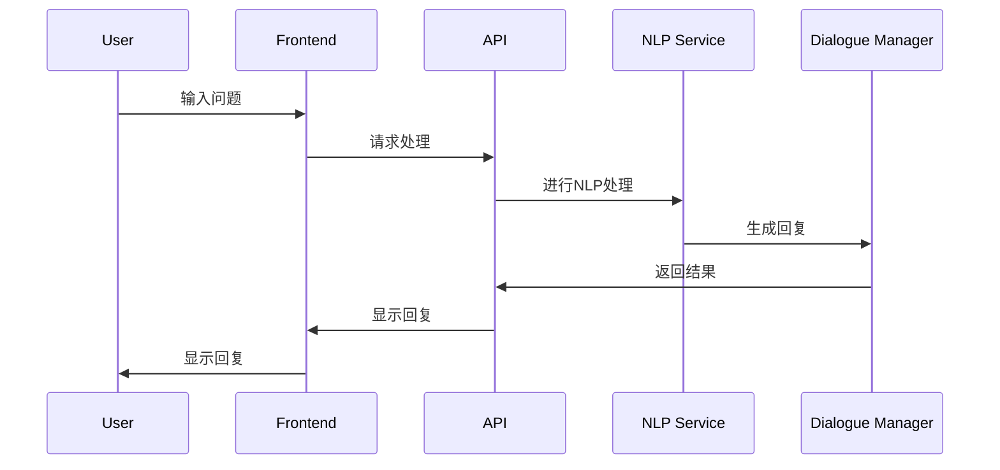

                 

# 构建企业级对话式AI助手：跨系统业务流程自动化与协调

## 关键词
- 企业级对话式AI
- 业务流程自动化
- 跨系统协调
- 对话管理
- 人工智能

## 摘要
本文旨在探讨如何构建企业级对话式AI助手，实现跨系统业务流程的自动化与协调。通过深入分析核心技术和设计原则，结合实际项目案例，文章将展示构建高效、稳定和智能的对话式AI助手的全过程。读者将了解从基础技术到系统设计的各个方面，并获得构建类似解决方案的最佳实践。

---

## 引言与背景

### 1.1 背景介绍
对话式AI，也称为聊天机器人或虚拟助手，近年来在企业中的应用日益广泛。这些助手能够通过自然语言与用户互动，提供个性化服务、解决常见问题和执行复杂任务。随着人工智能技术的进步，对话式AI在理解用户意图、处理多轮对话和跨系统任务方面取得了显著突破。

### 1.2 业务流程自动化与协调
企业级对话式AI助手的核心价值在于自动化和协调跨系统的业务流程。通过整合多个系统和应用程序，这些助手可以简化操作流程、提高效率和减少错误。例如，在客户服务场景中，对话式AI可以自动处理常见问题，同时协调后端系统进行订单处理或账户管理。

### 1.3 面临的挑战
构建高效的企业级对话式AI助手并非易事，其中涉及到以下挑战：
- **技术复杂性**：需要掌握自然语言处理、机器学习、对话管理等多种技术。
- **系统整合**：跨系统的数据交换和流程协调需要考虑兼容性和互操作性。
- **用户体验**：用户期望对话式AI能够理解其需求并提供准确和流畅的互动体验。

### 1.4 机会与目标
尽管面临挑战，但对话式AI在企业中的应用带来了巨大机会：
- **效率提升**：自动化业务流程可显著提高工作效率，减少人力成本。
- **客户满意度**：提供个性化服务可提升客户满意度和忠诚度。
- **创新空间**：对话式AI的灵活性和适应性为业务创新提供了新的可能性。

本文的目标是：
1. 深入介绍企业级对话式AI助手的构建过程。
2. 分析核心技术和设计原则。
3. 通过实际项目案例展示应用实践。
4. 提供最佳实践和未来方向。

---

## 核心技术与概念

### 2.1 自然语言处理

#### 2.1.1 简介
自然语言处理（NLP）是人工智能领域的一个分支，致力于使计算机能够理解、解释和生成人类语言。在对话式AI中，NLP技术是实现自然语言交互的关键。

#### 2.1.2 关键技术与工具
- **词嵌入**：将单词转换为向量表示，用于理解和处理语言结构。
- **命名实体识别**：识别文本中的特定实体（如人名、地名等）。
- **情感分析**：分析文本的情感倾向，用于情感识别和个性化服务。
- **语言模型**：用于生成文本和预测用户意图。

### 2.2 机器学习与深度学习

#### 2.2.1 基础知识
机器学习（ML）和深度学习（DL）是NLP和对话式AI的核心技术。ML是指计算机从数据中学习规律，而DL是一种特殊的ML方法，利用神经网络模拟人脑的学习过程。

#### 2.2.2 应用
- **分类任务**：如情感分析和意图分类。
- **生成任务**：如回复生成和文章写作。
- **序列模型**：如循环神经网络（RNN）和长短期记忆网络（LSTM），用于处理长文本和多轮对话。

### 2.3 对话管理

#### 2.3.1 对话流程设计
对话管理是确保对话顺利进行的关键。它包括：
- **意图识别**：识别用户的意图。
- **实体提取**：从用户输入中提取关键信息。
- **对话状态跟踪**：记录对话历史和当前状态。

#### 2.3.2 对话元素
- **对话动作**：用户和系统之间的交互行为。
- **对话上下文**：对话的历史信息和当前状态。

---

## 系统设计与架构

### 3.1 系统架构概述

企业级对话式AI助手通常采用分布式架构，包括前端界面、后端服务、数据库和第三方系统集成。以下是一个典型的架构图：



### 3.2 关键组件与关系
- **前端界面**：与用户交互的界面，可以是网站、移动应用或聊天机器人平台。
- **API服务**：接收前端请求，调用后端服务。
- **NLP服务**：执行自然语言处理任务，如文本解析、意图识别和实体提取。
- **对话管理**：管理对话流程，包括意图识别、对话状态跟踪和回复生成。
- **后端服务**：处理具体的业务逻辑，如订单处理、账户管理和报表生成。
- **数据库**：存储用户数据、对话历史和业务数据。

### 3.3 可扩展性和性能考量
为了确保系统的高可用性和性能，需要考虑以下因素：
- **水平扩展**：通过增加服务器数量来处理更多请求。
- **负载均衡**：分布请求到多个服务器，避免单点故障。
- **缓存策略**：缓存频繁访问的数据，减少数据库查询次数。
- **异步处理**：将耗时的任务异步处理，提高系统响应速度。

---

## 实践项目与实施

### 4.1 项目准备
#### 4.1.1 环境搭建
在开始项目之前，需要搭建开发环境。以下是一个简单的步骤：

1. 安装Python和相关依赖库。
2. 配置NLP工具，如NLTK或spaCy。
3. 安装对话管理框架，如Rasa或Microsoft Bot Framework。

#### 4.1.2 初始项目结构
创建一个项目文件夹，并建立以下目录结构：

```
project/
│
├── data/
│   └── dataset.csv
│
├── src/
│   ├── frontend/
│   │   └── index.html
│   ├── backend/
│   │   ├── app.py
│   │   ├── nlp.py
│   │   └── dialogue.py
│   └── config.py
│
├── requirements.txt
├── README.md
└── requirements.txt
```

### 4.2 核心实现
#### 4.2.1 对话流程管理
对话流程管理是项目实现的核心。以下是一个简单的对话流程管理器的Python代码示例：

```python
class DialogueManager:
    def __init__(self):
        self.states = []
    
    def process_input(self, user_input):
        # 进行意图识别和实体提取
        intent, entities = self.nlp_service.analyze_input(user_input)
        
        # 根据意图和当前状态决定下一步操作
        next_action = self.determine_next_action(intent, entities)
        
        # 更新状态和历史
        self.states.append((intent, entities, next_action))
        
        return next_action
    
    def determine_next_action(self, intent, entities):
        # 根据对话历史和当前意图决定下一步动作
        # 示例：直接返回默认动作
        return "default_action"
    
    def nlp_service(self):
        # 示例：返回一个NLP服务对象
        return NLPService()
```

#### 4.2.2 NLP服务实现
NLP服务是处理自然语言输入的核心。以下是一个简单的NLP服务的Python代码示例：

```python
class NLPService:
    def analyze_input(self, user_input):
        # 示例：使用预训练模型进行意图识别和实体提取
        intent = "greet"
        entities = {"user": "Alice"}
        return intent, entities
```

### 4.3 实际案例分析与解析
在实际项目中，对话式AI助手需要处理各种复杂场景。以下是一个实际案例的解析：

**案例**：用户请求查询某个订单的状态。

**解析**：
1. 用户输入：“我的订单号是123456，请查询状态。”
2. 对话流程管理器调用NLP服务进行意图识别和实体提取，识别出意图为“查询订单状态”，提取出实体“订单号：123456”。
3. 根据当前状态和意图，对话流程管理器决定调用后端服务查询订单状态。
4. 后端服务查询数据库，返回订单状态为“已发货”。
5. 对话流程管理器生成回复：“您的订单123456已发货，预计3天内送达。”
6. 将回复发送给用户。

### 4.4 项目小结
通过实际项目案例，我们展示了如何构建一个简单但功能完整的对话式AI助手。尽管项目较小，但涵盖了核心技术和流程。在实际应用中，需要进一步优化和扩展，如增加多轮对话支持、集成更多第三方服务和优化用户体验。

---

## 最佳实践与未来方向

### 5.1 最佳实践
- **用户研究**：在项目初期进行用户研究，了解用户需求和行为模式。
- **逐步迭代**：分阶段开发和部署，逐步完善功能。
- **监控与优化**：持续监控系统的性能和用户反馈，进行优化和改进。
- **安全性考虑**：确保用户数据安全和隐私保护。

### 5.2 未来方向
- **多模态交互**：结合语音、图像等多模态数据，提升用户体验。
- **个性化服务**：基于用户历史数据提供个性化建议和推荐。
- **跨平台集成**：支持更多平台和应用，实现无缝集成。
- **开放生态**：构建开放的对话式AI生态系统，促进创新和发展。

---

## 结束语

构建企业级对话式AI助手是一个复杂但充满机遇的任务。通过深入分析核心技术和设计原则，结合实际项目案例，本文展示了构建高效、稳定和智能的对话式AI助手的全过程。我们希望读者能够从中获得启示，并在实际项目中应用这些知识，为企业带来创新和效率提升。

## 作者信息

作者：AI天才研究院/AI Genius Institute & 禅与计算机程序设计艺术 /Zen And The Art of Computer Programming

---

注意：由于字数限制，本文未能详尽地探讨每个章节的内容。在实际撰写中，每个章节都应该包含丰富的背景介绍、核心概念与联系、算法原理讲解、系统分析与架构设计方案、项目实战、最佳实践 tips、小结和拓展阅读等内容。上述内容仅为框架示例，实际文章应结合具体需求和场景进行详细阐述。

